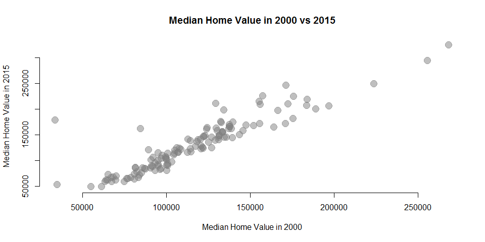

# CompileData


```r
library( dplyr )
library( pander )
library( geojsonio )
library( maptools )
library( sp )
```


# Create the Dependent Variable

## Get Median Home Value from Census


```r
library( censusapi )


censuskey <- "b431c35dad89e2863681311677d12581e8f24c24"


myvars <- makeVarlist( name="sf3", 
                       vintage=2000,
                       find="median", 
                       varsearch="label",
                       output="dataframe" )

dat.2000  <- getCensus( name="sf3", 
                        vintage=2000, 
                        key=censuskey, 
                        vars=c("H085001"), 
                        region="tract:*",
                        regionin="state:36")

dat.2000$FIPS <- paste( dat.2000$state, dat.2000$county, dat.2000$tract, sep="" )

dat.2000 <- rename( dat.2000, MHV2000 = H085001 )


# B25077_001E Median Home Value ACS5 2010, 2015

dat.2010  <- getCensus( name="acs5", 
                        vintage=2015, 
                        key=censuskey, 
                        vars=c("B25077_001E"), 
                        region="tract:*",
                        regionin="state:36")

dat.2010$FIPS <- paste( dat.2010$state, dat.2010$county, dat.2010$tract, sep="" )

dat.2010 <- rename( dat.2010, MHV2010 = B25077_001E )


dat.2015  <- getCensus( name="acs5", 
                        vintage=2015, 
                        key=censuskey, 
                        vars=c("B25077_001E"), 
                        region="tract:*",
                        regionin="state:36")

dat.2015$FIPS <- paste( dat.2015$state, dat.2015$county, dat.2015$tract, sep="" )

dat.2015 <- rename( dat.2015, MHV2015 = B25077_001E )


mhv <- merge( dat.2000, dat.2010 ) 

mhv <- merge( mhv, dat.2015 )

head( mhv ) %>% pander
```


---------------------------------------------------------------------
 state   county   tract       FIPS       MHV2000   MHV2010   MHV2015 
------- -------- -------- ------------- --------- --------- ---------
  36      001     000100   36001000100    70100     96000     96000  

  36      001     000200   36001000200    75100     85300     85300  

  36      001     000300   36001000300    88100    163600    163600  

  36      001     000401   36001000401    85400    154400    154400  

  36      001     000403   36001000403   109500    193200    193200  

  36      001     000404   36001000404    99400      NA        NA    
---------------------------------------------------------------------

```r
# Subset by Onondaga County

mhv <- mhv[ mhv$county == "067" , ]
```


## Adjust Prices for Inflation

Let's represent everything in 2015 dollars.


```r
# Adjust for Inflation

mhv$MHV2000 <- mhv$MHV2000 * 1.3845

mhv$MHV2010 <- mhv$MHV2010 * 1.0785

mhv$CHANGE <- mhv$MHV2015 - mhv$MHV2000
```


## Descriptive Statistics


```r
summary( mhv$MHV2000 ) %>% pander
```


------------------------------------------------------
 Min.    1st Qu.   Median    Mean    3rd Qu.    Max.  
------- --------- -------- -------- --------- --------
 33920    91270    113700   116800   134500    268500 
------------------------------------------------------

```r
summary( mhv$MHV2015 ) %>% pander
```


-------------------------------------------------------------
 Min.    1st Qu.   Median    Mean    3rd Qu.    Max.    NA's 
------- --------- -------- -------- --------- -------- ------
 48500    87600    123200   129700   161600    324000    3   
-------------------------------------------------------------

```r
summary( mhv$CHANGE ) %>% pander
```


-------------------------------------------------------------
  Min.    1st Qu.   Median   Mean    3rd Qu.    Max.    NA's 
-------- --------- -------- ------- --------- -------- ------
 -20010    -2377     8849    13500    23070    144700    3   
-------------------------------------------------------------


```r
plot( mhv$MHV2000, mhv$MHV2015, bty="n", pch=19, col=gray(0.5,0.5), cex=2,
      main="Median Home Value in 2000 vs 2015", xlab="Median Home Value in 2000", ylab="Median Home Value in 2015" )
```

<!-- -->

```r
hist( mhv$MHV2015 - mhv$MHV2000, breaks=20, col="darkgray", border="white", main="CHANGE in Median Home Value 2000-2015", xlab="Change in Value")
```

<!-- -->


## Map Changes in Home Values


```r
# library( geojsonio )

url <- "https://raw.githubusercontent.com/christine-brown/SyracuseLandBank/master/SHAPEFILES/SYRCensusTracts.geojson"

syr <- geojson_read( url, method="local", what="sp" )

syr <- merge( syr, mhv, by.x="GEOID10", by.y="FIPS" )

              


color.function <- colorRampPalette( c( "firebrick4", "light gray", "steel blue" ) )

col.ramp <- color.function( 10 ) # number of groups you desire

col.vec <- cut( syr$MHV2000, breaks=seq( from=0, to=250000, by=25000 ), labels=col.ramp )

col.vec <- as.character( col.vec )


par( mfrow=c(1,2), mar=c(0,0,4,0) )

plot( syr, col=col.vec, main="Home Values in 2000" )


col.vec <- cut( syr$MHV2015, breaks=seq( from=0, to=250000, by=25000 ), labels=col.ramp )

col.vec <- as.character( col.vec )

plot( syr, col=col.vec, main="Home Values in 2015" )
```

<!-- -->


```r
col.ramp <- color.function( 7 ) # number of groups you desire

col.vec <- cut( syr$CHANGE, breaks=seq( from=-25000, to=150000, by=25000 ), labels=c("firebrick4","gray80","gray60","steelblue","steelblue","steelblue","blue")  )

col.vec <- as.character( col.vec )

table( col.vec ) %>% pander
```


-------------------------------------------------
 blue   firebrick4   gray60   gray80   steelblue 
------ ------------ -------- -------- -----------
  1         29         1        15         1     
-------------------------------------------------

```r
par( mar=c(0,0,3,0) )

plot( syr, col=col.vec, main="Change in Median Home Values 2000-2015" )
```

<!-- -->


# Merge Data


### Check Files in Directory


```r
# setwd( "./DATA/AGGREGATED_DATA" )

# dir()

#  [1] "censusDataFromChris.csv"       "codeviolations_aggregated.csv" "firepolice_aggregated.csv"     "grocery_aggregated.csv"       
#  [5] "hold.csv"                      "library_aggregated.csv"        "LIHTC_aggregated.csv"          "NMTC_aggregated.csv"          
#  [9] "NPO_Data_processed.csv"        "Permits_aggregated.csv"        "Permits_processed.csv"         "publichousing_aggregated.csv" 
# [13] "syr__ed_score_per_tract.csv"   "TaxSubsidies_aggregated.csv"   "Yelp_Aggregated.csv"  
```


### Read Aggregated Files


```r
setwd( ".." )

d1 <- read.csv( "./DATA/AGGREGATED_DATA/censusDataFromChris.csv", stringsAsFactors = F )
d2 <- read.csv( "./DATA/AGGREGATED_DATA/codeviolations_aggregated.csv", stringsAsFactors = F )
d3 <- read.csv( "./DATA/AGGREGATED_DATA/firepolice_aggregated.csv", stringsAsFactors = F )
d4 <- read.csv( "./DATA/AGGREGATED_DATA/grocery_aggregated.csv", stringsAsFactors = F )
d5 <- read.csv( "./DATA/AGGREGATED_DATA/library_aggregated.csv", stringsAsFactors = F )
d6 <- read.csv( "./DATA/AGGREGATED_DATA/LIHTC_aggregated.csv", stringsAsFactors = F )
d7 <- read.csv( "./DATA/AGGREGATED_DATA/NMTC_aggregated.csv", stringsAsFactors = F )
d8 <- read.csv( "./DATA/AGGREGATED_DATA/NPO_Data_processed.csv", stringsAsFactors = F )
# d9 <- read.csv( "Permits_aggregated.csv", stringsAsFactors = F )
d10 <- read.csv( "./DATA/AGGREGATED_DATA/Permits_processed.csv", stringsAsFactors = F )
d11 <- read.csv( "./DATA/AGGREGATED_DATA/publichousing_aggregated.csv", stringsAsFactors = F )
d12 <- read.csv( "./DATA/AGGREGATED_DATA/syr__ed_score_per_tract.csv", stringsAsFactors = F )
d13 <- read.csv( "./DATA/AGGREGATED_DATA/TaxSubsidies_aggregated.csv", stringsAsFactors = F )
d14 <- read.csv( "./DATA/AGGREGATED_DATA/Yelp_Aggregated.csv", stringsAsFactors = F )


head( d1 ) %>% pander
```


----------------------------------------------------------------
 X             NAME              STATE   COUNTY   TRACT   TOTAL 
--- --------------------------- ------- -------- ------- -------
 1   Census Tract 1, Onondaga     36       67       1      470  
         County, New York                                       

 2   Census Tract 1, Onondaga     36       67       1      489  
         County, New York                                       

 3   Census Tract 1, Onondaga     36       67       1      518  
         County, New York                                       

 4   Census Tract 1, Onondaga     36       67       1      598  
         County, New York                                       

 5   Census Tract 1, Onondaga     36       67       1      644  
         County, New York                                       

 6   Census Tract 10, Onondaga    36       67      10     3890  
         County, New York                                       
----------------------------------------------------------------

Table: Table continues below

 
------------------------------------------------------------------------
 MEDIANHOUSEINCOME   MEDIANFAMINCOME   BLACK   ASIAN   HISPANIC   WHITE 
------------------- ----------------- ------- ------- ---------- -------
       47703              26477         10      151       12       309  

       47391              82500          0      87        31       402  

       31771              77292         74      44        11       400  

       49605              95104         76      65        14       457  

       49342               NA           79      85        19       476  

       28803              29638         866     31       255      2607  
------------------------------------------------------------------------

Table: Table continues below

 
----------------------------------------------------------------------------
 EMPLOYED   UNEMPLOYED   INLABORFORCE   POVERTY   VACANTTOTAL   OTHERVACANT 
---------- ------------ -------------- --------- ------------- -------------
   199          39           238          194         112           36      

   206          67           273          169         114           45      

   167          72           239          133         81            10      

   274          38           312          129         78             9      

   335          39           374          147         73             8      

   1742        208           1950         851         90            48      
----------------------------------------------------------------------------

Table: Table continues below

 
------------------------------------------------------------------------
 VACANTFORRENT   SEASONALVACANT   FORSALEVACANT   HOUSEHOLDRECEIVEDSNAP 
--------------- ---------------- --------------- -----------------------
       0               0               26                  78           

       0               0               22                  76           

       0               0               36                  87           

       0               0               35                  52           

      16               7                0                  48           

      42               0                0                  429          
------------------------------------------------------------------------

Table: Table continues below

 
-----------------------------------------------------------------
 HOUSEHOLDS   OWNEROCCUPIED   RENTEROCCUPIED   TOTALHOUSINGUNITS 
------------ --------------- ---------------- -------------------
    294            70              224                406        

    308            80              228                422        

    338            64              274                419        

    380            64              316                458        

    430            69              361                503        

    2114           688             1426              2204        
-----------------------------------------------------------------

Table: Table continues below

 
------------------------------------------------------------------------
 LACKINGKITCHENFACILITIES   LACKINGPLUMBING   MEDIANMONTHLYHOUSINGCOSTS 
-------------------------- ----------------- ---------------------------
            0                      0                     871            

            0                      0                     871            

            0                      0                     890            

            0                      0                     998            

            0                      0                    1038            

            15                    26                     634            
------------------------------------------------------------------------

Table: Table continues below

 
----------------------------------------------------------------------------
 LESS18   SINGLEMOTHERBELOWPOVERTY   TRAVELTIMETOWORKMIN   ENROLLEDINSCHOOL 
-------- -------------------------- --------------------- ------------------
   43                0                      2395                  28        

   13                0                       NA                   36        

   43                0                       NA                   89        

   59                0                       NA                   99        

   59                0                       NA                   86        

  783               124                     26155                751        
----------------------------------------------------------------------------

Table: Table continues below

 
--------------------------------------------------------------------------------
 YEAR     GEOID     VACANT   MALEUNEMPLOYED   FEMALEUNEMPLOYED   MALELABORFORCE 
------ ----------- -------- ---------------- ------------------ ----------------
 2012   3.607e+10     NA           NA                NA                NA       

 2011   3.607e+10     NA           NA                NA                NA       

 2013   3.607e+10     NA           NA                NA                NA       

 2014   3.607e+10     NA           NA                NA                NA       

 2015   3.607e+10     NA           NA                NA                NA       

 2012   3.607e+10     NA           NA                NA                NA       
--------------------------------------------------------------------------------

Table: Table continues below

 
--------------------------------------------------------------------------------
 FEMALELABORFORCE   TOTALFORPOVERTY   AGGREGATETRAVELTIMETOWORK   HOUSINGVALUES 
------------------ ----------------- --------------------------- ---------------
        NA                NA                     NA                    NA       

        NA                NA                     NA                    NA       

        NA                NA                     NA                    NA       

        NA                NA                     NA                    NA       

        NA                NA                     NA                    NA       

        NA                NA                     NA                    NA       
--------------------------------------------------------------------------------

```r
head( d2 ) %>% pander
```


--------------------------------
 TRACT   YEAR   Code.Violations 
------- ------ -----------------
   1     2012         11        

   1     2013          8        

   1     2014          7        

   1     2015          7        

  10     2012         40        

  10     2013         57        
--------------------------------

```r
head( d3 ) %>% pander
```


---------------------------
 TRACT   FIREPOLICE   YEAR 
------- ------------ ------
   1         0        2017 

  10         0        2017 

  14         0        2017 

  15         0        2017 

  16         0        2017 

 17.01       1        2017 
---------------------------

```r
head( d4 ) %>% pander
```


------------------------
 TRACT   GROCERY   YEAR 
------- --------- ------
   1        0      2015 

  10        0      2015 

  14        0      2015 

  15        0      2015 

  16        0      2015 

 17.01      0      2015 
------------------------

```r
head( d5 ) %>% pander
```


------------------------
 TRACT   LIBRARY   YEAR 
------- --------- ------
   1        0      2017 

  10        0      2017 

  14        1      2017 

  15        0      2017 

  16        0      2017 

 17.01      0      2017 
------------------------

```r
head( d6 ) %>% pander
```


----------------------
 TRACT   YEAR   LIHTC 
------- ------ -------
  16     2007     1   

  23     2009     1   

  34     2008     1   

  34     2013     1   

  35     2008     1   

  35     2009     1   
----------------------

```r
head( d7 ) %>% pander
```


-----------------------------
 TRACT   YEAR   NMTC_Dollars 
------- ------ --------------
  15     2006     3015000    

  32     2008      8e+06     

  30     2011     20428080   

 21.01   2013      6e+06     
-----------------------------

```r
head( d8 ) %>% pander
```


-------------------------------------------------------------------
   EIN                  NAME                STATE   NTEE1   NTEECC 
---------- ------------------------------- ------- ------- --------
 10587946     MIGHTYMEN MINISTRIES INC       NY       L      L25   

 10758900   SYRACUSE SHAKESPEARE FESTIVAL    NY       A      A65   
                        CORP                                       

 16177361     HERBERT S AND ELEANORE L       NY       T      T20   
            HOWARD CHARITABLE FOUNDATION                           

 20590821    ARC OF ONONDAGA FOUNDATION      NY       P      P82   

 20651844   SYRACUSE CITY SCHOOL DISTRICT    NY       B      B12   
               EDUCATIONAL FOUNDATION                              

 20658895    TRESNESS FAMILY FOUNDATION      NY       T      T22   
                     CORPORATION                                   
-------------------------------------------------------------------

Table: Table continues below

 
----------------------------------------------------------------------
           ADDRESS                CITY        ZIP       zip5    FIPS  
------------------------------ ---------- ------------ ------- -------
        108 SUMMIT AVE          SYRACUSE   13207-1335   13207   36067 

 350 WEST FAYETTE ST ROOM 001   SYRACUSE   13202-1202   13202   36067 

        1 LINCOLN CTR           SYRACUSE   13202-1324   13202   36067 

       600 S WILBUR AVE         SYRACUSE   13204-2730   13204   36067 

   725 HARRISON STREET Q157     SYRACUSE   13210-2395   13210   36067 

         PO BOX 6729            SYRACUSE   13217-6729   13217   36067 
----------------------------------------------------------------------

Table: Table continues below

 
--------------------------------------------------------------------------
 MSA_NECH   PMSA   TAXPER   outnccs   OUTREAS   Filer   ZFILER   SUBSECCD 
---------- ------ -------- --------- --------- ------- -------- ----------
   8160      .     201412     IN        NA        Y       Y         3     

   8160      .     201412     IN        NA        Y       Y         3     

   8160      .     201512     IN        NA        Y       N         3     

   8160      .     201412     IN        NA        Y       N         3     

   8160      .     201506     IN        NA        Y       N         3     

   8160      .     201512     IN        NA        Y       N         3     
--------------------------------------------------------------------------

Table: Table continues below

 
----------------------------------------------------------------------------
 ntmaj5   ntmaj10   ntmaj12   NTEEconf   MAJGRPB   ACTIV1   ACTIV2   ACTIV3 
-------- --------- --------- ---------- --------- -------- -------- --------
   HU       HU        HU         B          L        0        0        0    

   AR       AR        AR         B          A        0        0        0    

   OT       PU        PU         B          T        0        0        0    

   HU       HU        HU         A          P        0        0        0    

   ED       ED        ED         A          B        0        0        0    

   OT       PU        PU         B          T        0        0        0    
----------------------------------------------------------------------------

Table: Table continues below

 
------------------------------------------------------------------------
 ASCD   INCCD   INCOME   F990REV   ASSETS    cFiler   czFiler   cTaxPer 
------ ------- -------- --------- --------- -------- --------- ---------
  0       0       0         0         0        Y         Y      201412  

  0       0       0         0         0        Y         Y      201412  

  6       4     198352      0      2336824     Y         N      201312  

  6       4     453072   324519    2319125     Y         N      201412  

  4       4     142088   106491    125400      Y         N      201506  

  4       2     20714       0      144315      Y         N      201312  
------------------------------------------------------------------------

Table: Table continues below

 
---------------------------------------------------------------------
 cTotRev   cAssets      cFinSrc      RULEDATE   FNDNCD   FRCD   AFCD 
--------- --------- --------------- ---------- -------- ------ ------
    .         .      submaster990n    200206      15      2      3   

    .         .      submaster990n    200303      15      0      3   

 120157    2498777    core2013pf      200207      4       0      3   

 324519    2319125     bmf1608c3      200206      15      1      3   

 106491    125400      bmf1608c3      200301      17      1      3   

  4281     150943     core2013pf      200309      4       0      3   
---------------------------------------------------------------------

Table: Table continues below

 
---------------------------------------------------------------------------
          CONTACT                 SEC_NAME         GEN   EOSTATUS   LEVEL1 
--------------------------- --------------------- ----- ---------- --------
        RENA HOLMAN                                 0       1         PC   

          R BELL                                    0       1         PC   

 BOND SCHOENECK & KING LLP   MACKIN JAMES E TTEE    0       1         PF   

       PETER CARMEN                                 0       1         PC   

       JAN QUINTZAU                                 0       1         PC   

      ANDREW TRESNESS                               0       1         PF   
---------------------------------------------------------------------------

Table: Table continues below

 
--------------------------------------------------------------------------
 LEVEL2   level3   level4   CLASSCD   DEDUCTCD   NTEEIRS   NAICS    ORGCD 
-------- -------- -------- --------- ---------- --------- -------- -------
   O        HS       L       1000        1         L25     624229     1   

   O        AR       A       2000        1         A65     711110     1   

   S        ZC       T       1000        1         T20     813211     2   

   O        HS       P       1000        1         P82     624120     1   

   S        ZB       B       1000        1        B112     813219     1   

   S        ZC       T       1000        1         T22     813211     1   
--------------------------------------------------------------------------

Table: Table continues below

 
--------------------------------------------------------------------------
 ACCPER    lon      lat    STATEFP10   COUNTYFP10   TRACTCE10    GEOID10  
-------- -------- ------- ----------- ------------ ----------- -----------
   12     -76.17   43.03      36           67         5000      3.607e+10 

   12     -76.16   43.05      36           67         3000      3.607e+10 

   12     -76.15   43.05      36           67         3200      3.607e+10 

   12     -76.18   43.04      36           67         2901      3.607e+10 

   6      -76.14   43.04      36           67         4302      3.607e+10 

   12     -76.12   43.05      36           67         3500      3.607e+10 
--------------------------------------------------------------------------

Table: Table continues below

 
-------------------------------------------------------------------------
 NAME10       NAMELSAD10       MTFCC10   FUNCSTAT10   ALAND10   AWATER10 
-------- -------------------- --------- ------------ --------- ----------
   50      Census Tract 50      G5020        S        1149255    45948   

   30      Census Tract 30      G5020        S        804722       0     

   32      Census Tract 32      G5020        S        1257528      0     

 29.01    Census Tract 29.01    G5020        S        1870601      0     

 43.02    Census Tract 43.02    G5020        S        1195046      0     

   35      Census Tract 35      G5020        S        1137202      0     
-------------------------------------------------------------------------

Table: Table continues below

 
-----------------------------------
 INTPTLAT10   INTPTLON10   npos_yr 
------------ ------------ ---------
   43.03        -76.17      2014   

   43.05        -76.16      2014   

   43.05        -76.15      2015   

   43.04        -76.18      2014   

   43.04        -76.13      2015   

   43.05        -76.12      2015   
-----------------------------------

```r
head( d10 ) %>% pander
```


-----------------------------------------------------------------------------
      Type                Applicant                      Location            
---------------- --------------------------- --------------------------------
 Antenna / Dish      Empire Archives Inc           405 Hiawatha Blvd E       

 Antenna / Dish       G&K Trucking LLC        1714 Salina St N & Exchange St 

 Antenna / Dish       G&K Trucking LLC        1714 Salina St N & Exchange St 

 Antenna / Dish            Verizon              110 Wolf St To Salina St N   

 Antenna / Dish   Centerline Communications        1629-35 Salina St N       

 Antenna / Dish   Centerline Communications        1629-35 Salina St N       
-----------------------------------------------------------------------------

Table: Table continues below

 
-----------------------------------------------------------------------------
   Issued     Year   Valuation   Fee.Amount             Location2            
------------ ------ ----------- ------------ --------------------------------
 09/10/2012   2012     18000        335           405 Hiawatha Blvd E ,      
                                                    Syracuse, New York       

 04/25/2013   2013     22000        395       1714 Salina St N & Exchange St 
                                                   , Syracuse, New York      

 08/26/2014   2014     30000        515       1714 Salina St N & Exchange St 
                                                   , Syracuse, New York      

 03/21/2016   2016     60000        1010        110 Wolf St, Syracuse, New   
                                                           York              

 06/02/2014   2014     5000         140           1629-35 Salina St N ,      
                                                    Syracuse, New York       

 05/01/2015   2015     30000        515           1629-35 Salina St N ,      
                                                    Syracuse, New York       
-----------------------------------------------------------------------------

Table: Table continues below

 
------------------------
  lon      lat    Tract 
-------- ------- -------
 -76.16   43.07    NA   

 -76.17   43.07    NA   

 -76.17   43.07    NA   

 -76.17   43.07    NA   

 -76.16   43.07    NA   

 -76.16   43.07    NA   
------------------------

```r
head( d11 ) %>% pander
```


-------------------------------------------
 YEAR   TRACT   Subsidized.units.available 
------ ------- ----------------------------
 2010     2                 34             

 2010     6                139             

 2010    16                175             

 2010    29                 11             

 2010    30                500             

 2010    39                 6              
-------------------------------------------

```r
head( d12 ) %>% pander
```


---------------------------------
 X   YEAR   TRACT   SCHOOL_SCORE 
--- ------ ------- --------------
 1   2005     3        0.7994    

 2   2005     4        0.859     

 3   2005     9        0.8369    

 4   2005    14        0.8009    

 5   2005   17.02      0.5847    

 6   2005    18        0.8378    
---------------------------------

```r
head( d13 ) %>% pander
```


-------------------------------------------------------
 X   TRACT   YEAR   NUMBER_OF_SUBSIDIES   TOTAL_AMOUNT 
--- ------- ------ --------------------- --------------
 1     1     2003            3              4919450    

 2     1     2004            4              12058091   

 3     1     2005            5              8749272    

 4     1     2006            6              3401458    

 5     1     2007            4              3413215    

 6     1     2009            5               959108    
-------------------------------------------------------

```r
head( d14 ) %>% pander
```


-------------------------------------------------------------------------
 X     TRACT     YEAR   RATING   REVIEWS   PRICE   ESTABLISHMENTS   BARS 
--- ----------- ------ -------- --------- ------- ---------------- ------
 1   3.607e+10   2017    4.2        3       NA           2           NA  

 2   3.607e+10   2017   1.688      12       NA           2           NA  

 3   3.607e+10   2017    3.71       7       NA           3           NA  

 4   3.607e+10   2017   3.117      19       NA           20          NA  

 5   3.607e+10   2017   2.162     4.167     NA           6           NA  

 6   3.607e+10   2017   2.183      5.6      NA           5           NA  
-------------------------------------------------------------------------

Table: Table continues below

 
-------------------------------------------------------------------------
 RESTAURANTS   STARS_4_5   STARS_3_4   STARS_2_3   STARS_1_2   STARS_0_1 
------------- ----------- ----------- ----------- ----------- -----------
      2            1           1          NA          NA          NA     

      2           NA           1          NA          NA           1     

      3            1           1           1          NA          NA     

     20            5           9           2           1           3     

      6            1           1           2           1           1     

      5            2          NA           1          NA           2     
-------------------------------------------------------------------------


# Analysis


### Census Variables


```r
### DEFINE VARIABLE


d1$POVRATE <- d1$POVERTY / d1$TOTAL
d1$PBLACK <- d1$BLACK / d1$TOTAL
d1$PASIAN <- d1$ASIAN / d1$TOTAL
d1$PUNEMPLOYED <- d1$UNEMPLOYED / d1$TOTAL
d1$PSNAP <- d1$HOUSEHOLDRECEIVEDSNAP / d1$HOUSEHOLDS
d1$PVACANT <- d1$VACANTTOTAL / d1$TOTALHOUSINGUNITS
d1$POWNER <- d1$OWNEROCCUPIED / d1$TOTALHOUSINGUNITS
```

### Nice Correlation Tables


```r
# x is a matrix containing the data
# method : correlation method. "pearson"" or "spearman"" is supported
# removeTriangle : remove upper or lower triangle
# results :  if "html" or "latex"
# the results will be displayed in html or latex format
corstars <-function(x, method=c("pearson", "spearman"), removeTriangle=c("upper", "lower"),
                    result=c("none", "html", "latex")){
  #Compute correlation matrix
  require(Hmisc)
  x <- as.matrix(x)
  correlation_matrix<-rcorr(x, type=method[1])
  R <- correlation_matrix$r # Matrix of correlation coeficients
  p <- correlation_matrix$P # Matrix of p-value 
  
  ## Define notions for significance levels; spacing is important.
  mystars <- ifelse(p < .001, "****", ifelse(p < .001, "*** ", ifelse(p < .01, "**  ", ifelse(p < .05, "*   ", "    "))))
  
  ## trunctuate the correlation matrix to two decimal
  R <- format(round(cbind(rep(-1.11, ncol(x)), R), 2))[,-1]
  
  ## build a new matrix that includes the correlations with their apropriate stars
  Rnew <- matrix(paste(R, mystars, sep=""), ncol=ncol(x))
  diag(Rnew) <- paste(diag(R), " ", sep="")
  rownames(Rnew) <- colnames(x)
  colnames(Rnew) <- paste(colnames(x), "", sep="")
  
  ## remove upper triangle of correlation matrix
  if(removeTriangle[1]=="upper"){
    Rnew <- as.matrix(Rnew)
    Rnew[upper.tri(Rnew, diag = TRUE)] <- ""
    Rnew <- as.data.frame(Rnew)
  }
  
  ## remove lower triangle of correlation matrix
  else if(removeTriangle[1]=="lower"){
    Rnew <- as.matrix(Rnew)
    Rnew[lower.tri(Rnew, diag = TRUE)] <- ""
    Rnew <- as.data.frame(Rnew)
  }
  
  ## remove last column and return the correlation matrix
  Rnew <- cbind(Rnew[1:length(Rnew)-1])
  if (result[1]=="none") return(Rnew)
  else{
    if(result[1]=="html") print(xtable(Rnew), type="html")
    else print(xtable(Rnew), type="latex") 
  }
} 


d1.sub <- d1[ c("MEDIANHOUSEINCOME","POVRATE","PBLACK","PASIAN",
                "PSNAP","PVACANT","POWNER","PUNEMPLOYED") ]

library( xtable )

corstars( d1.sub, result="html" )
```

<!-- html table generated in R 3.3.2 by xtable 1.8-2 package -->
<!-- Thu Apr 27 10:55:11 2017 -->
<table border=1>
<tr> <th>  </th> <th> MEDIANHOUSEINCOME </th> <th> POVRATE </th> <th> PBLACK </th> <th> PASIAN </th> <th> PSNAP </th> <th> PVACANT </th> <th> POWNER </th>  </tr>
  <tr> <td align="right"> MEDIANHOUSEINCOME </td> <td>  </td> <td>  </td> <td>  </td> <td>  </td> <td>  </td> <td>  </td> <td>  </td> </tr>
  <tr> <td align="right"> POVRATE </td> <td> -0.67**** </td> <td>  </td> <td>  </td> <td>  </td> <td>  </td> <td>  </td> <td>  </td> </tr>
  <tr> <td align="right"> PBLACK </td> <td> -0.35**** </td> <td>  0.40**** </td> <td>  </td> <td>  </td> <td>  </td> <td>  </td> <td>  </td> </tr>
  <tr> <td align="right"> PASIAN </td> <td> -0.20**** </td> <td>  0.13*    </td> <td> -0.26**** </td> <td>  </td> <td>  </td> <td>  </td> <td>  </td> </tr>
  <tr> <td align="right"> PSNAP </td> <td> -0.67**** </td> <td>  0.66**** </td> <td>  0.57**** </td> <td>  0.07     </td> <td>  </td> <td>  </td> <td>  </td> </tr>
  <tr> <td align="right"> PVACANT </td> <td> -0.51**** </td> <td>  0.44**** </td> <td>  0.28**** </td> <td>  0.29**** </td> <td>  0.44**** </td> <td>  </td> <td>  </td> </tr>
  <tr> <td align="right"> POWNER </td> <td>  0.86**** </td> <td> -0.61**** </td> <td> -0.23**** </td> <td> -0.41**** </td> <td> -0.62**** </td> <td> -0.56**** </td> <td>  </td> </tr>
  <tr> <td align="right"> PUNEMPLOYED </td> <td> -0.36**** </td> <td>  0.34**** </td> <td>  0.44**** </td> <td>  0.15*    </td> <td>  0.56**** </td> <td>  0.29**** </td> <td> -0.39**** </td> </tr>
   </table>


```r
d1.sub <- d1[ c("GEOID","MEDIANHOUSEINCOME","POVRATE","PBLACK","PASIAN",
                "PSNAP","PVACANT","POWNER","PUNEMPLOYED") ]

# d1.2000 <- d1[ d1$YEAR == 2000 , ]
d1.2015 <- d1[ d1$YEAR == 2015 , ]

dat <- merge( mhv, d1.2015, by.x="FIPS", by.y="GEOID" )

dat.sub <- dat[ c("MHV2000","CHANGE","MEDIANHOUSEINCOME","POVRATE","PBLACK","PASIAN",
                "PSNAP","PVACANT","POWNER","PUNEMPLOYED") ]

## put (absolute) correlations on the upper panels,
## with size proportional to the correlations.
panel.cor <- function(x, y, digits = 2, prefix = "", cex.cor, ...)
{
    usr <- par("usr"); on.exit(par(usr))
    par(usr = c(0, 1, 0, 1))
    r <- abs(cor(x, y, use="pairwise.complete.obs"))
    txt <- format(c(r, 0.123456789), digits = digits)[1]
    txt <- paste0(prefix, txt)
    if(missing(cex.cor)) cex.cor <- 0.8/strwidth(txt)
    text(0.5, 0.5, txt, cex = cex.cor * r)
}

panel.smooth <- function (x, y, col = par("col"), bg = NA, pch = par("pch"), 
    cex = 1, col.smooth = "red", span = 2/3, iter = 3, ...) 
{
    points(x, y, pch=19, col=gray(0.5,0.2), bg=bg, cex=cex )
    ok <- is.finite(x) & is.finite(y)
    if (any(ok)) 
        lines(stats::lowess(x[ok], y[ok], f = span, iter = iter), 
            col = col.smooth, ...)
}

pairs( dat.sub, lower.panel = panel.smooth, upper.panel = panel.cor)
```

<!-- -->


```r
# examine bivariate relationships
bivPlot <- function( x1, x2, lab1, lab2 )
{

	plot( x1, x2,
	      pch=19, 
	      col=gray(0.6, alpha = 0.3), 
	      cex=3.5,  
	      bty = "n",
	      xlab=lab1, 
	      ylab=lab2, cex.lab=1.5 )
  
  ok <- is.finite(x1) & is.finite(x2)
	lines( lowess(x2[ok]~x1[ok]), col="red", lwd=3 )

}

par( mfrow=c(2,2) )

bivPlot( x1=dat.sub$PUNEMPLOYED, x2=dat.sub$CHANGE, lab1="PERCENT UNEMPLOYED", lab2="CHANGE IN MHV" )
bivPlot( x1=dat.sub$PBLACK, x2=dat.sub$CHANGE, lab1="PERCENT BLACK", lab2="CHANGE IN MHV" )
bivPlot( x1=dat.sub$MEDIANHOUSEINCOME, x2=dat.sub$CHANGE, lab1="MEDIAN INCOME", lab2="CHANGE IN MHV" )
bivPlot( x1=dat.sub$PVACANT, x2=dat.sub$CHANGE, lab1="PERCENT VACANT", lab2="CHANGE IN MHV" )
```

<!-- -->

### Outlier Removal


```r
dat.sub$CHANGE[ which.max(dat.sub$CHANGE) ] <- NA

par( mfrow=c(2,2) )

bivPlot( x1=dat.sub$PUNEMPLOYED, x2=dat.sub$CHANGE, lab1="PERCENT UNEMPLOYED", lab2="CHANGE IN MHV" )
bivPlot( x1=dat.sub$PBLACK, x2=dat.sub$CHANGE, lab1="PERCENT BLACK", lab2="CHANGE IN MHV" )
bivPlot( x1=dat.sub$MEDIANHOUSEINCOME, x2=dat.sub$CHANGE, lab1="MEDIAN INCOME", lab2="CHANGE IN MHV" )
bivPlot( x1=dat.sub$PVACANT, x2=dat.sub$CHANGE, lab1="PERCENT VACANT", lab2="CHANGE IN MHV" )
```

<!-- -->

```r
pairs( dat.sub, lower.panel = panel.smooth, upper.panel = panel.cor )
```

<!-- -->

### Merge Census Files


```r
d1.2000 <- d1[ d1$YEAR == 2000 , ]
# d1.2010 <- d1[ d1$YEAR == 2010 , ]
# d1.2015 <- d1[ d1$YEAR == 2015 , ]


dat <- merge( mhv, d1.2000, by.x="FIPS", by.y="GEOID", all.x=T )

head( dat )
```

```
##          FIPS state county  tract   MHV2000  MHV2010 MHV2015    CHANGE  X
## 1 36067000100    36    067 000100 136096.35       NA      NA        NA NA
## 2 36067000200    36    067 000200  81823.95 92643.15   85900   4076.05 NA
## 3 36067000300    36    067 000300  91930.80 94476.60   87600  -4330.80 NA
## 4 36067000400    36    067 000400  96915.00 90809.70   84200 -12715.00 NA
## 5 36067000600    36    067 000600  76562.85 69131.85   64100 -12462.85 NA
## 6 36067000700    36    067 000700  78916.50 71288.85   66100 -12816.50 NA
##   NAME STATE COUNTY TRACT TOTAL MEDIANHOUSEINCOME MEDIANFAMINCOME BLACK
## 1 <NA>    NA     NA    NA    NA                NA              NA    NA
## 2 <NA>    NA     NA    NA    NA                NA              NA    NA
## 3 <NA>    NA     NA    NA    NA                NA              NA    NA
## 4 <NA>    NA     NA    NA    NA                NA              NA    NA
## 5 <NA>    NA     NA    NA    NA                NA              NA    NA
## 6 <NA>    NA     NA    NA    NA                NA              NA    NA
##   ASIAN HISPANIC WHITE EMPLOYED UNEMPLOYED INLABORFORCE POVERTY
## 1    NA       NA    NA       NA         NA           NA      NA
## 2    NA       NA    NA       NA         NA           NA      NA
## 3    NA       NA    NA       NA         NA           NA      NA
## 4    NA       NA    NA       NA         NA           NA      NA
## 5    NA       NA    NA       NA         NA           NA      NA
## 6    NA       NA    NA       NA         NA           NA      NA
##   VACANTTOTAL OTHERVACANT VACANTFORRENT SEASONALVACANT FORSALEVACANT
## 1          NA          NA            NA             NA            NA
## 2          NA          NA            NA             NA            NA
## 3          NA          NA            NA             NA            NA
## 4          NA          NA            NA             NA            NA
## 5          NA          NA            NA             NA            NA
## 6          NA          NA            NA             NA            NA
##   HOUSEHOLDRECEIVEDSNAP HOUSEHOLDS OWNEROCCUPIED RENTEROCCUPIED
## 1                    NA         NA            NA             NA
## 2                    NA         NA            NA             NA
## 3                    NA         NA            NA             NA
## 4                    NA         NA            NA             NA
## 5                    NA         NA            NA             NA
## 6                    NA         NA            NA             NA
##   TOTALHOUSINGUNITS LACKINGKITCHENFACILITIES LACKINGPLUMBING
## 1                NA                       NA              NA
## 2                NA                       NA              NA
## 3                NA                       NA              NA
## 4                NA                       NA              NA
## 5                NA                       NA              NA
## 6                NA                       NA              NA
##   MEDIANMONTHLYHOUSINGCOSTS LESS18 SINGLEMOTHERBELOWPOVERTY
## 1                        NA     NA                       NA
## 2                        NA     NA                       NA
## 3                        NA     NA                       NA
## 4                        NA     NA                       NA
## 5                        NA     NA                       NA
## 6                        NA     NA                       NA
##   TRAVELTIMETOWORKMIN ENROLLEDINSCHOOL YEAR VACANT MALEUNEMPLOYED
## 1                  NA               NA   NA     NA             NA
## 2                  NA               NA   NA     NA             NA
## 3                  NA               NA   NA     NA             NA
## 4                  NA               NA   NA     NA             NA
## 5                  NA               NA   NA     NA             NA
## 6                  NA               NA   NA     NA             NA
##   FEMALEUNEMPLOYED MALELABORFORCE FEMALELABORFORCE TOTALFORPOVERTY
## 1               NA             NA               NA              NA
## 2               NA             NA               NA              NA
## 3               NA             NA               NA              NA
## 4               NA             NA               NA              NA
## 5               NA             NA               NA              NA
## 6               NA             NA               NA              NA
##   AGGREGATETRAVELTIMETOWORK HOUSINGVALUES POVRATE PBLACK PASIAN
## 1                        NA            NA      NA     NA     NA
## 2                        NA            NA      NA     NA     NA
## 3                        NA            NA      NA     NA     NA
## 4                        NA            NA      NA     NA     NA
## 5                        NA            NA      NA     NA     NA
## 6                        NA            NA      NA     NA     NA
##   PUNEMPLOYED PSNAP PVACANT POWNER
## 1          NA    NA      NA     NA
## 2          NA    NA      NA     NA
## 3          NA    NA      NA     NA
## 4          NA    NA      NA     NA
## 5          NA    NA      NA     NA
## 6          NA    NA      NA     NA
```

```r
d1$GEOID
```

```
##   [1] 36067000100 36067000100 36067000100 36067000100 36067000100
##   [6] 36067001000 36067001000 36067001000 36067001000 36067001000
##  [11] 36067001400 36067001400 36067001400 36067001400 36067001400
##  [16] 36067001500 36067001500 36067001500 36067001500 36067001500
##  [21] 36067001600 36067001600 36067001600 36067001600 36067001600
##  [26] 36067001701 36067001701 36067001701 36067001701 36067001701
##  [31] 36067001702 36067001702 36067001702 36067001702 36067001702
##  [36] 36067001800 36067001800 36067001800 36067001800 36067001800
##  [41] 36067001900 36067001900 36067001900 36067001900 36067001900
##  [46] 36067000200 36067000200 36067000200 36067000200 36067000200
##  [51] 36067002000 36067002000 36067002000 36067002000 36067002000
##  [56] 36067002101 36067002101 36067002101 36067002101 36067002101
##  [61] 36067002300 36067002300 36067002300 36067002300 36067002300
##  [66] 36067002400 36067002400 36067002400 36067002400 36067002400
##  [71] 36067002700 36067002700 36067002700 36067002700 36067002700
##  [76] 36067002901 36067002901 36067002901 36067002901 36067002901
##  [81] 36067000300 36067000300 36067000300 36067000300 36067000300
##  [86] 36067003000 36067003000 36067003000 36067003000 36067003000
##  [91] 36067003200 36067003200 36067003200 36067003200 36067003200
##  [96] 36067003400 36067003400 36067003400 36067003400 36067003400
## [101] 36067003500 36067003500 36067003500 36067003500 36067003500
## [106] 36067003601 36067003601 36067003601 36067003601 36067003601
## [111] 36067003602 36067003602 36067003602 36067003602 36067003602
## [116] 36067003800 36067003800 36067003800 36067003800 36067003800
## [121] 36067003900 36067003900 36067003900 36067003900 36067003900
## [126] 36067000400 36067000400 36067000400 36067000400 36067000400
## [131] 36067004000 36067004000 36067004000 36067004000 36067004000
## [136] 36067004200 36067004200 36067004200 36067004200 36067004200
## [141] 36067004301 36067004301 36067004301 36067004301 36067004301
## [146] 36067004302 36067004302 36067004302 36067004302 36067004302
## [151] 36067004400 36067004400 36067004400 36067004400 36067004400
## [156] 36067004500 36067004500 36067004500 36067004500 36067004500
## [161] 36067004600 36067004600 36067004600 36067004600 36067004600
## [166] 36067004800 36067004800 36067004800 36067004800 36067004800
## [171] 36067004900 36067004900 36067004900 36067004900 36067004900
## [176] 36067000501 36067000501 36067000501 36067000501 36067000501
## [181] 36067005000 36067005000 36067005000 36067005000 36067005000
## [186] 36067005100 36067005100 36067005100 36067005100 36067005100
## [191] 36067005200 36067005200 36067005200 36067005200 36067005200
## [196] 36067005300 36067005300 36067005300 36067005300 36067005300
## [201] 36067005400 36067005400 36067005400 36067005400 36067005400
## [206] 36067005500 36067005500 36067005500 36067005500 36067005500
## [211] 36067005601 36067005601 36067005601 36067005601 36067005601
## [216] 36067005602 36067005602 36067005602 36067005602 36067005602
## [221] 36067005700 36067005700 36067005700 36067005700 36067005700
## [226] 36067005800 36067005800 36067005800 36067005800 36067005800
## [231] 36067005900 36067005900 36067005900 36067005900 36067005900
## [236] 36067000600 36067000600 36067000600 36067000600 36067000600
## [241] 36067006000 36067006000 36067006000 36067006000 36067006000
## [246] 36067006101 36067006101 36067006101 36067006101 36067006101
## [251] 36067006102 36067006102 36067006102 36067006102 36067006102
## [256] 36067006103 36067006103 36067006103 36067006103 36067006103
## [261] 36067000700 36067000700 36067000700 36067000700 36067000700
## [266] 36067000800 36067000800 36067000800 36067000800 36067000800
## [271] 36067000900 36067000900 36067000900 36067000900 36067000900
## [276]          NA          NA          NA          NA          NA
## [281]          NA          NA          NA          NA          NA
## [286]          NA          NA          NA          NA          NA
## [291]          NA          NA          NA          NA          NA
## [296]          NA          NA          NA          NA          NA
## [301]          NA          NA          NA          NA          NA
## [306]          NA          NA          NA          NA          NA
## [311]          NA          NA          NA          NA          NA
## [316]          NA          NA          NA          NA          NA
## [321]          NA          NA          NA          NA          NA
## [326]          NA          NA          NA          NA          NA
## [331]          NA          NA          NA          NA          NA
## [336]          NA          NA          NA          NA          NA
## [341]          NA          NA          NA          NA          NA
## [346]          NA          NA          NA          NA          NA
## [351]          NA          NA          NA          NA          NA
## [356]          NA          NA          NA          NA          NA
## [361]          NA          NA          NA          NA          NA
## [366]          NA          NA          NA          NA          NA
## [371]          NA          NA          NA          NA          NA
## [376]          NA          NA          NA          NA          NA
## [381]          NA          NA          NA          NA          NA
## [386]          NA          NA          NA          NA          NA
## [391]          NA          NA          NA          NA          NA
## [396]          NA          NA          NA          NA          NA
## [401]          NA          NA          NA          NA          NA
## [406]          NA          NA          NA          NA          NA
## [411]          NA          NA          NA          NA          NA
## [416]          NA          NA          NA          NA          NA
## [421]          NA          NA          NA          NA          NA
## [426]          NA          NA          NA          NA          NA
## [431]          NA          NA          NA          NA          NA
## [436]          NA          NA          NA          NA          NA
## [441]          NA          NA          NA          NA          NA
## [446]          NA          NA          NA
```

