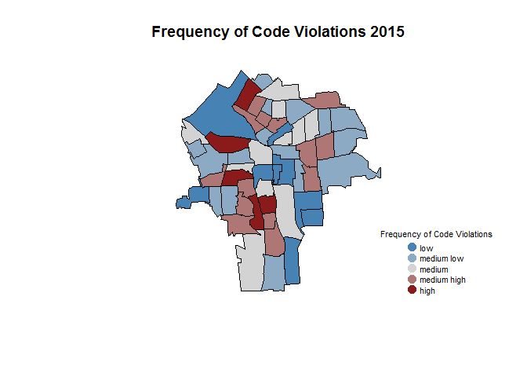

# Download and clean the code violations dataset


## Code Violations Data

Patterns of code violations across neighborhoods can be used to understand home values in those neighborhoods and how home values might change in specific areas. Many violations directly relate to the visual appeal of a home and by extention the aestetics of its surrounding area. Others may be seen as a proxy for upkeep and homeowner investment. 

To examine the effects of these violations will use data obtained from the city that covers 2007 to 2016. The data from before 2012 and after 2015 is incomplete so we will work with only data from 2012 to 2015. The main aim of this peice of code is to wrangle the code violations data and join it to a shapefile for the city of Syracuse in order to visulaize where code violations are taking place and to examine links between violations and other characteristics of these geographic locations.  

## 1. Load Data

Load syracuse shapefiles and data on code violations provided by the city of Syracuse.


```r
#Load shapefiles from Github
syr <- geojson_read("https://raw.githubusercontent.com/lecy/SyracuseLandBank/master/SHAPEFILES/SYRCensusTracts.geojson", method="local", what="sp" )
```


```r
#Load data on code violations from Githib
violations.dat <- read.csv("https://raw.githubusercontent.com/lecy/SyracuseLandBank/master/DATA/RAW_DATA/codeviolations.csv", header = TRUE)

#Drop all information besides complaint type, violation date, latitude, and longitude
violations.2 <- violations.dat[ , c("Complaint.Type","Violation.Date", "Address", "lat","lon") ]

#Transform date variable into workable format with seperate variables year
violations.2$Violation.Date <- as.Date( violations.2$Violation.Date, format="%m/%d/%Y" )

violations.3 <- mutate( violations.2, year = format(violations.2$Violation.Date, format = "%Y"))

#Drop data from before 2012 and after 2015 (before that time there were less than 60 violatiions logged in each year, after there were around 500. Between 2012 and 2015 each year has around 5,000 violations so we can assume the other data is incomplete)
violations.4 <- filter(violations.3, year > "2011" & year < "2016")

#Drop any rows with an NA for latitude or longitude.
violations.coordinates <- violations.4[!is.na(violations.4$lon) & !is.na(violations.4$lat), ]

#There are repeated entries in the data, keep only one copy of each of these
violations.coordinates.2 <- unique(violations.coordinates)
```

## 2. Wrangle Data

Join the violation data and syracuse shapefile, aggregate data up by census tract and year to create a data frame that reports census tract, year, and total number of code violations.


```r
###Spatial join of violation data and shapefile

#Pull out latitude and longitude from code violations data
violations.coordinates.3 <- violations.coordinates.2[ c("lon", "lat") ]

#Use latitude and longitude to turn data into Spatial points
violations.spatial <- SpatialPoints(violations.coordinates.3,
                     proj4string=CRS("+proj=longlat +datum=WGS84"))

#Project shapefiles so that CRS matches Spatial points
syr.2 <- spTransform(syr, CRS("+proj=longlat +datum=WGS84"))

#Use these spatial points to link violatons to the Syracuse city shapefile by geographic location
violations.over <- over(violations.spatial , syr.2)

#Combine this linking with the orginal code violations data. We now have a data frame with rows that have code violation information and information about the tract that the violation is located within
violations.shape <- cbind(violations.coordinates.2, violations.over)
```


```r
###Aggregate up by census tract and year

#Create a data frame that lists the number of code violations in each census tract by year
violations <- count(violations.shape, GEOID10 , year)

#Rename the frequency column
colnames(violations)[3] <- "Code.Violations"

#Rename the year and tract column for consistancy
colnames(violations)[1] <- "TRACT"

colnames(violations)[2] <- "YEAR"
```

## 3. Add data frame to GitHub

Add new data frame to Processed Data folder on Github 


```r
setwd( "../../DATA/AGGREGATED_DATA" )
write.csv( violations, "codeviolations_aggregated.csv", row.names=F )
```

## 4. Analysis

First, create a map of Syracuse with census tracts colored by the frequency of code violations occuring within them in 2015. Red tratcs have the highest occurances of violations within them, blue tracts have the least, grey tracts fall in between these extremes.

Then, Create a gif that shows frequncy of code violations from 2012-2015.


```r
###Create a map of code violation frequency by census tract in 2015

#Create a color palette to display frequency of code violations on a map: red will represent high values, blue will represnt low
color.function <- colorRampPalette( c("steel blue","light gray", "firebrick4" ) )

#There will be 5 colors between blue and red to demonstrate increasing intensity
col.ramp <- color.function( 5 )

#Group number of code violations into 5 levels of intensity. 'color.vector' will display the code for the color of the group that each census tract now belongs to 
color.vector <- cut( rank(violations$Code.Violations), breaks=5 , labels=col.ramp )

#Change class from factor to character
color.vector <- as.character( color.vector )

#The order of these entries has been perserved, so a simple cbind will match each row with the color code corresponds to it (based on the number of code violations in that row)
violations.colors <- cbind(as.data.frame(violations), color.vector)

#Drop data from unknown tracts to facilitate merge
violations.colors.2 <- violations.colors[!is.na(violations.colors$TRACT), ]

#Choose a specific year
violations.colors.year <- filter(violations.colors.2, YEAR == "2015" )

#Merge data on fequency of code violations (that includes a color designation) with the syracuse shapefile 
syr.violations <- merge(syr, violations.colors.year, by.x="GEOID10", by.y="TRACT")

#create a color vector that matches the order of the tracts listed in this newly merged data frame
color.vector.2 <- as.character(syr.violations$color.vector)

#Plot the map
plot(syr.violations , col= color.vector.2)

#Add a title and legend to the map
title( main="Frequency of Code Violations 2015")

legend.text=c("low", "medium low", "medium", "medium high", "high")

legend( "bottomright", bg="white",
        pch=19, pt.cex=1.5, cex=0.7,
        legend=legend.text, 
        col=col.ramp, 
        box.col="white",
        title="Frequency of Code Violations" 
)
```

<!-- -->


```r
###Create gif

saveGIF({


{
#Map of 2012 violations (code similar to code used in the inital Analysis section)
violations.colors.year.2012 <- filter(violations.colors.2, YEAR == "2012" )
syr.violations.2012 <- merge(syr, violations.colors.year.2012, by.x="GEOID10", by.y="TRACT")
color.vector.2012.2 <- as.character(syr.violations.2012$color.vector)
plot(syr.violations.2012 , col= color.vector.2012.2)
title( main="Frequency of Code Violations 2012")

#Map of 2013
violations.colors.year.2013 <- filter(violations.colors.2, YEAR == "2013" )
syr.violations.2013 <- merge(syr, violations.colors.year.2013, by.x="GEOID10", by.y="TRACT")
color.vector.2013.2 <- as.character(syr.violations.2013$color.vector)
plot(syr.violations.2013 , col= color.vector.2013.2)
title( main="Frequency of Code Violations 2013")

#Map of 2014
violations.colors.year.2014 <- filter(violations.colors.2, YEAR == "2014" )
syr.violations.2014 <- merge(syr, violations.colors.year.2014, by.x="GEOID10", by.y="TRACT")
color.vector.2014.2 <- as.character(syr.violations.2014$color.vector)
plot(syr.violations.2014 , col= color.vector.2014.2)
title( main="Frequency of Code Violations 2014")

#Map of 2015
violations.colors.year.2015 <- filter(violations.colors.2, YEAR == "2015" )
syr.violations.2015 <- merge(syr, violations.colors.year.2015, by.x="GEOID10", by.y="TRACT")
color.vector.2015.2 <- as.character(syr.violations.2015$color.vector)
plot(syr.violations.2015 , col= color.vector.2015.2)
title( main="Frequency of Code Violations 2015")

  
  }


}, 

movie.name = "code_violations.gif",   # name of your gif
interval = 1.5,                  # controls the animation speed
ani.width = 800,                 # size of the gif in pixels
ani.height = 800 )               # size of the git in pixels
```

```
## [1] TRUE
```

