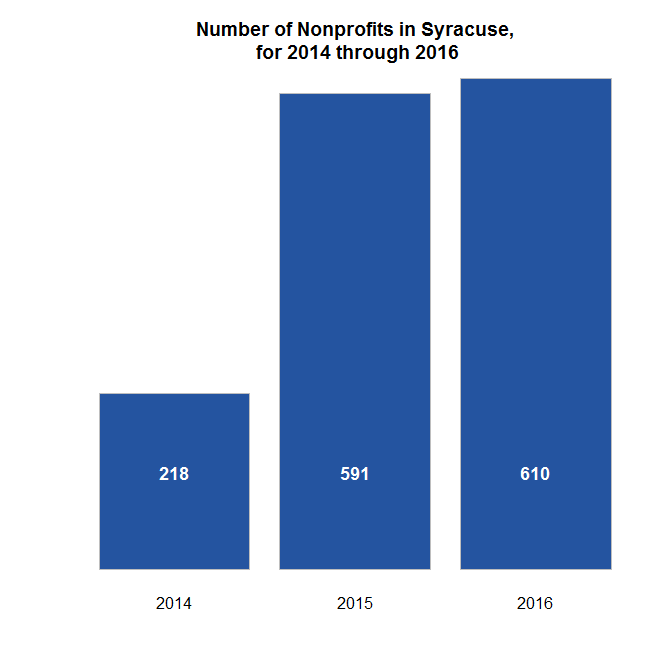
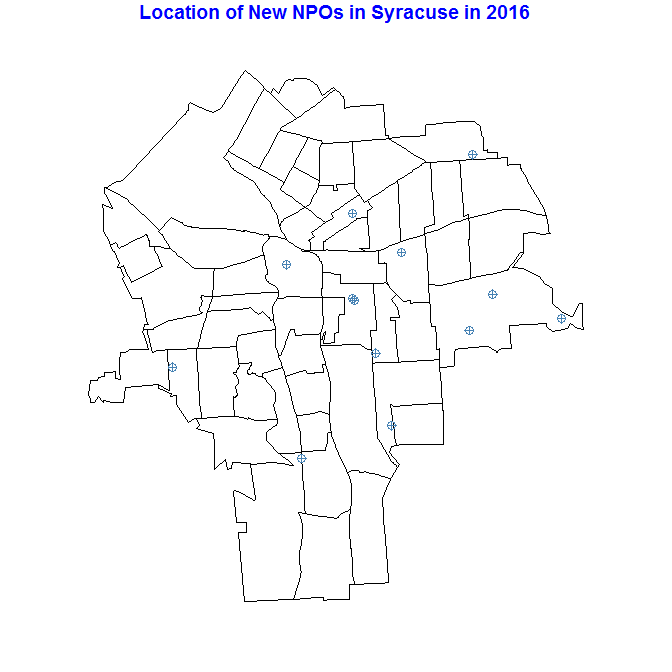
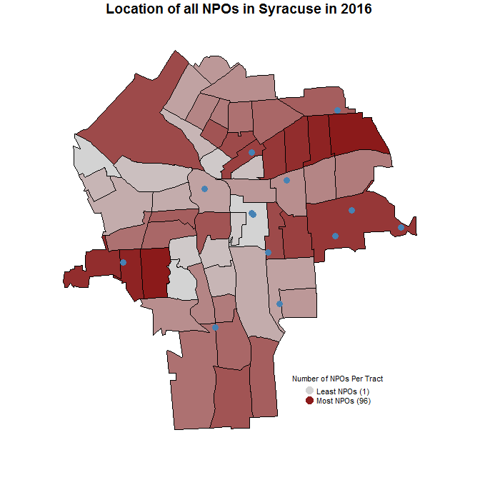

# Nonprofit Data


## Raw data source
The NCCS, or National Center for Charity Statistics, is a branch of the Urban Institute that collects data on the U.S. nonprofit (NPO) sector. Their tools are available [here](http://nccsweb.urban.org/). The source file is a CSV file within a ZIP file that contains information on nonprofits from across the United States. The ZIP file is 98 MB, but the CSV file that it contains is that is roughly 434 MB in size. Because of the large size, this section will present steps on cleaning the data and focusing it on Syracuse-specific NPOs. Please note that 

A data dictionary on the various columns of the .CSV file and the data populating each can be found on the NCCS' website, located at __[the NCCS' website](http://nccsweb.urban.org/PubApps/showDD.php#Business%20Master%20Files)__.

If you do not need to wrangle the raw data, please skip to step "2. Process NPO Data".

## 1. Load and filter raw NPO data

This section will explain how to extract and wrangle the data if you want to expand the data set to include Onondaga County.


```r
# Load relevant libraries
library( dplyr )
library( DT )
library( geojsonio )
library( ggmap )
library( maps )
library( maptools )
library( pander )
library( raster )
library( reshape )
library( rgdal )
library( rgeos )
library( sp )
library( tools )
```

### a. Downloading the data
Download the source data to your working directory:

```r
setwd( "DATA/RAW_DATA")
```

```r
# Download Source Data (DropBox .zip location, set dl=1 to download)
download.file( "https://www.dropbox.com/s/w68lvzr2dgjmame/BMF_Aug_2016.zip?dl=1", "BMF_Aug_2016.zip" )
unzip( "BMF_Aug_2016.zip" )
```

By running the command dir(), you will see that there is a new folder, "data". Because the .zip file contained two folders, we need to go to the folder level where our data is located in a CSV file, then read it into the R environment:

```r
setwd("./data/extracts")
dat <- read.csv( "N2s8d2m.csv" )
```

### b. Filtering the data

**First**, we will subset the data set such that it only contains nonprofits in the zip codes that compose Onondaga County. This list of zip codes has already been produced and is located on this same GitHub page. 

```r
# Load Filter Values: Zip Codes
zipc <- read.csv( "https://raw.githubusercontent.com/lecy/SyracuseLandBank/master/BUILD/NPO%20Data/Zip_Codes.csv",
                  header = FALSE, fileEncoding="UTF-8-BOM" )

# Assign the header name "zipcode" to the vector
names(zipc) <- "zipcode"

# Overwrite the variable with itself, to remove any lingering artifacts from reading the data in
zipc <- zipc$zipcode

# Apply Filter Values: Zip Codes
## Returns a dataset of rows that have a value for zip5 that is within the zipc vector
dat <- dat[ dat$zip5 %in% zipc, ]

# Since zipc is no longer necessary, remove it from the environment:
rm( zipc )
```

**Second**, now that we have a data set that only contains NPOs with zip codes in Onondaga County, we will subset the data set again to only return NPOs that are in the city of Syracuse. Because there is some flexibility in how the name has been reported, we will include any cities listed in the NPOs of Onondaga County data set that end in "CUSE", and using this to further subset the data.

```r
# Create a vector containing a listing of the unique city names from the NPOs of Onondaga County dataset
cityNames <- as.character( unique( dat$CITY ) )

# Create a vector that contains a listing of each name within that vector that contains "CUSE"
syrNames <- grep( "CUSE", cityNames, value = T )


# Apply Filter Values: Variations of "Syracuse"
## Returns a dataset of rows that have a value for CITY that is within the syrNames vector
dat <- dat[ dat$CITY %in% syrNames, ]

# Remove unnecessary vectors from the environment:
rm( cityNames )
rm( syrNames )
```

### c. Geocoding the data

The package "ggmap" has a function, geocode, that allows you to query Google via the Maps API to return longitude and latitude coordinates for a street address. We will be using that function later on, when the addresses have been cleaned up and pasted together.

Before we geocode the addresses, we need to clean up the various components (address, city, state, and zip code). Once we have removed any commas or periods, we can combine the components into a single string that can be geocoded using the ggmap library. 

**First**, we will create a vector that only contains the addresses of the homes to assist in this process. 

```r
# Create a vector that only contains address, city, state, and zip data for each NPO
address <- dat[ , c("ADDRESS","CITY", "STATE", "ZIP") ]

# Rename the column headers to only have the first letter, making them easier to work with
names( address ) <- c("a", "c", "s", "z" )

# Remove any commas in the street address
address$a <- gsub( ",", "", address$a )

# Remove any periods in the street address
address$a <- gsub( "\\.", "", address$a )

# Combine the strings in this order: Address, City, State, Zip. Each is separated with a comma and a space
addresses <- paste( address$a, address$c, address$s, address$z, sep=", " )
```

**Second**, we will geocode the addresses. Please note that there is a limit to how many addresses Google will geocode for free. A data scientist who hit the 2,500 address-per-day cap developed an alternative to batch geocoding, which can be found **[here](http://www.shanelynn.ie/massive-geocoding-with-r-and-google-maps/)**. The geocoding process for the filtered data may take around 5 to 10 minutes.
Once we have the addresses, we will bind the columns back into the original data set, so that each NPO now has two additional columns of data: one a longitudinal coordinate, and the other a latitudinal coordinate.

```r
# Translate the address strings to latitude and longitude coordinates
lon.lat <- geocode( addresses )

# Bind the geocoded addresses to the dataset
dat <- cbind( dat, lon.lat )

# Remove unnecessary vectors from the environment:
rm( addresses )
rm( address )
rm( lon.lat )
```

**Finally**, let's take the NPO data set that contains longitude-latitude coordinates and write it to a .CSV file, so that we can use it later as needed. This will assist us in processing the data.

```r
# Generate a .CSV file that contains geocoded coordinates.
setwd("../../")
write.csv( dat, "NPO_Data_raw.csv", row.names=F )
```


## 2. Process NPO Data 
We will be processing the NPO data generated in step 1 to contain census tract-level information.

### a. Downloading the data
Set your working directory as appropriate.

```r
# Set your working directory
setwd("DATA/PROCESSED_DATA")
```
Download the .CSV file containing the geocoded addresses. *This section assumes you have not performed step 1, but are using the data on GitHub.*

```r
# Load the geocoded data from GitHub
npos <- read.csv( "https://raw.githubusercontent.com/lecy/SyracuseLandBank/master/DATA/RAW_DATA/NPO_Data_raw.csv", stringsAsFactors=FALSE )

# Remove any NPOs that do not have coordinates. These failed the geocode, and so we cannot identify their census tract number
npos <- filter( npos, !is.na( lon ) )
npos <- filter( npos, !is.na( lat ) )
```

Next, we will load the Syracuse city shapefile from the GitHub repository. 

```r
syr_tracts <- geojson_read( "https://raw.githubusercontent.com/lecy/SyracuseLandBank/master/SHAPEFILES/SYRCensusTracts.geojson", method="local", what="sp" )

# We will manually confirm that the Syracuse shapefile uses the same coordinate reference system as our data
syr_tracts <- spTransform( syr_tracts, CRS( "+proj=longlat +datum=WGS84" ) )
```

### b. Get NPO Census Tract Information from the Shapefile

We will overlay the geographic coordinates of the NPOs (points) onto the map layer. By doing so, we will be able to match the points to census tracts. We will combine the census tract information into the data set, and generate a new CSV containing the file. 

**First**, create a data frame that contains only the coordinates of each NPO. Then overlay the points.
*Note*: Because our city name filter used some variants of the city name "Syracuse", it is possible that some NPOs that identify their city as Syracuse may be part of the greater metro area. If this is the case, they will not fall within a census tract designated to be within the city and will need to be removed from the data set. 

```r
# Create a vector that just contains coordinates
npos_coordinates <- npos[ , c( "lon", "lat" ) ]

# Match to Census Tract
npos_coordinates_SP <- SpatialPoints( npos_coordinates, proj4string=CRS("+proj=longlat +datum=WGS84" ) )

npos_tracts <- over( npos_coordinates_SP, syr_tracts ) 
# Note that this will only provide information for NPOs in Syracuse census tracts, so some NPOs will have NA as values if they fall out of the Syracuse census areas.

# Column bind the two sets of data back into one
npos <- cbind( npos, npos_tracts )

# Remove any NPOs that do not fall within the Syracuse census tracts. 
npos <- filter( npos, !is.na( INTPTLON10 ) )

# Remove unnecessary vectors from the environment:
rm( npos_coordinates )
rm( npos_tracts )
```

**Second**, we need to take a moment here to clean up the year data. There is a variable in the data frame called TAXPER, which reports the period in which the tax was filed. We can use that to represent if a nonprofit was active during that year. To get multiyear data, we need to create a new variable "YEAR" and add it to the data set. We should go ahead and filter out NPOs that do not have tax preparation year data.

```r
# Remove NPOs without tax preparation values from the dataset
npos <- npos[ !is.na( npos$TAXPER ), ]

# Create a vector that just contains tax preparation periods
npos_taxper <- npos[ , "TAXPER"]

# Create a new vector that just contains the first 4 characters in the tax period, the year
npos_yr <- as.numeric( substr( npos_taxper, 1, 4 ) )
npos_yr <- as.data.frame( npos_yr )
names( npos_yr ) <- "YEAR"

# Column bind the two sets of data back into one
npos <- cbind( npos, npos_yr )

# Remove unnecessary vectors from the environment:
rm( npos_taxper )
rm( npos_yr)
```


**Third**, let's take the NPO data set that now contains census tract information and write it to a .CSV file, so that we can use it later as needed. This will assist us in finalizing an aggregation of the data.

```r
# Generate a .CSV file that contains census tract information.
write.csv( npos, "NPO_Data_processed.csv", row.names=F )
```

## 3. Aggregate NPO Data 
We will be aggregating the NPO data generated in step 1 to reflect the number of nonprofits at the census tract level, added across years.

### a. Downloading the data
Set your working directory as appropriate, then download the .CSV file containing the census tract information.

```r
# Set your working directory
setwd("DATA/AGGREGATED_DATA")
```

```r
# Load the geocoded data from GitHub
npos <- read.csv( "https://raw.githubusercontent.com/lecy/SyracuseLandBank/master/DATA/PROCESSED_DATA/NPO_Data_processed.csv", stringsAsFactors=FALSE )
```


### b. Summed NPOs per census tract

**First**, we will create a data frame of a table version of the FIPS ID, or geographical identifier, of the nonprofits. This will provide us with a summarized, unique listing of the various IDs. 

```r
# Create a data frame of NPOs by census tract and year
npos_years <- as.data.frame( table( npos$GEOID10 , npos$YEAR ) )
names( npos_years ) <- c( "TRACT", "YEAR", "NPOS")
npos_years$YEAR <- as.numeric( as.character( npos_years$YEAR ) )
```

**Second**, we need to sum the number of NPOs that are new each year, so that we create a comprehensive view of the number of NPOs. Please note that we are assuming that an NPO does not close in this situation.

```r
# Create a matrix of the number of new nonprofits per census tract by year
npos_years_sum <- cast( npos_years, TRACT ~ YEAR )

# Create a new variable that performs an accumulated sum for each year, across the row
mySum = t( apply( npos_years_sum,1,cumsum ) )

# Add the tract data back into the summed matrix
tracts <- as.numeric( as.character( npos_years_sum$TRACT ) )
mySum <- cbind( tracts, mySum )
mySum <- as.data.frame( mySum, row.names = FALSE)
colnames( mySum )[1] <- "TRACT"

# Then rbind the appropriate columns into a new data frame so that you have a unique row per tract and year, with the count of cumulative NPOs per combination/row
npos_years <- rbind( 
                      cbind( mySum[,1], NewColumn=colnames(mySum[2]), mySum[,2]), 
                      cbind( mySum[,1], NewColumn=colnames(mySum[3]), mySum[,3]),  
                      cbind( mySum[,1], NewColumn=colnames(mySum[4]), mySum[,4]),
                      cbind( mySum[,1], NewColumn=colnames(mySum[5]), mySum[,5]),
                      cbind( mySum[,1], NewColumn=colnames(mySum[6]), mySum[,6]),
                      cbind( mySum[,1], NewColumn=colnames(mySum[7]), mySum[,7]),
                      cbind( mySum[,1], NewColumn=colnames(mySum[8]), mySum[,8])
                      )

colnames( npos_years ) <- c( "TRACT", "YEAR", "NPOS_SUM" )
npos_years <- as.data.frame( npos_years )

# Remove unnecessary vectors from the environment:
rm( tracts )
rm( mySum )
rm( npos_years_sum)
```


**Third**, let's take the finalized NPO data set and write it to a .CSV file, so that we can use it later as needed.

```r
# Generate a .CSV file that contains census tract information.
write.csv( npos_years, "NPO_Data_aggregated.csv", row.names=F )
```

**Please be aware that this dataset aggregates the number of nonprofits across years.** Investigation into the year variable shows us that there is a wide arrange of non-consecutive years. To be cautious, we should also generate a data set that breaks out new NPOs across years.  Let's generate a third that breaks out cumulative NPOs across the key subsectors. We will do both of these things in part 3c. 

### c. New NPOs per census tract by year and by type

**First**, we will create a data frame that counts the number of new nonprofits per year, broken down by census tract. 

```r
# Create a data frame of NPOs by census tract and year
npos_new <- as.data.frame( table( npos$GEOID10 , npos$YEAR ) )

# Rename the columns
names( npos_new ) <- c( "TRACT", "YEAR", "NEW_NPOS" )
```

Write the data frame to a .CSV files, so that we can use it later as needed.

```r
# Generate a .CSV file that breaks down the number of NPOs by census tract and year as a data frame
write.csv( npos_new, "NPO_Data_newOrgs_aggr_df.csv", row.names=F )
```

To generate a matrix with a totals row instead of a data frame, run the code below:
*Please note that this will override, in the environment, the data frame value generated above.*

```r
# Create a data frame of NPOs by census tract and year
npos_new <- as.data.frame( table( npos$GEOID10 , npos$YEAR ) )

# Rename the columns
names( npos_new ) <- c( "TRACT", "YEAR", "NEW_NPOS")

# Cast the data such that the number of nonprofits per geoID is broken out by year
npos_new <- cast( npos_new, TRACT ~ YEAR )

# Create a data frame of the summed number of nonprofits per year, transposing the values to be horizontal rather than vertical. This is key to bind with the original npos_new data frame
npo_new_sum <- as.data.frame( t( colSums( npos_new ) ) )

# Give this sum row the geoID of "Total"
npo_new_sum <- cbind( "Total", npo_new_sum)

# Rename the column containing "Total" to match the appropriate column in the original npos_new data frame
colnames( npo_new_sum )[1] <- "TRACT"

# Bind the Totals row to the npos_new data frame
npos_new <- rbind( npos_new, npo_new_sum )
npos_new$TRACT[ is.na(npos_new$TRACT) == TRUE ] <- "Total"
```

Write the matrix to a .CSV files, so that we can use it later as needed.

```r
# Generate a .CSV file that breaks down the number of NPOs by census tract and year as a matrix
write.csv( npos_new, "NPO_Data_newOrgs_aggr_matrix.csv", row.names=F )
```

**Second**, we will create a data frame that breaks down the new nonprofits per census tract by subsector. The subsectors of nonprofits identified in the variable NTMAJ12 are:<br><br>

•	AR	Arts, culture, and humanities<br>
•	BH	Education, higher<br>
•	ED	Education<br>
•	EH	Hospitals<br>
•	EN	Environment<br>
•	HE	Health<br>
•	HU	Human services<br>
•	IN	International<br>
•	MU	Mutual benefit<br>
•	PU	Public and societal benefit<br>
•	RE	Religion<br>
•	UN	Unknown

Please note that, because there are no NPOs with a value of "UN" for ntmaj12, we do not have a column with that value, so we are dropping "Unknown" from the lines below that rename columns.

To generate a data frame, run the code below:

```r
# Create a data frame of the number of NPOs in each census tract by category
npos_sector <- as.data.frame( table( npos$GEOID10 , npos$ntmaj12 ) )

# Rename the columns
names( npos_sector ) <- c( "TRACT", "NPO_SECTOR", "NEW_NPOS")
```

Write the data frame to a .CSV files, so that we can use it later as needed.

```r
# Generate a .CSV file that breaks down the number of NPOs by census tract and year as a data frame
write.csv( npos_sector, "NPO_Data_sector_aggr_df.csv", row.names=F )
```

To generate a matrix with a totals row, run the code below:
*Please note that this will override the data frame value generated above*

```r
# Create a data frame of the number of NPOs in each census tract by category
npos_sector <- as.data.frame( table( npos$GEOID10 , npos$ntmaj12 ) )

# Rename the columns
names( npos_sector ) <- c( "TRACT", "NPO_SECTOR", "NEW_NPOS")

# Cast the data such that the number of nonprofits per geoID is broken out by year
npos_sector <- cast( npos_sector, TRACT ~ NPO_SECTOR )

# Create a data frame of the summed number of nonprofits per year, transposing the values to be horizontal rather than vertical. This is key to bind with the original npos_sector data frame
npo_sector_sum <- as.data.frame( t( colSums( npos_sector ) ) )

# Give this sum row the geoID of "Total
npo_sector_sum <- cbind( "Total", npo_sector_sum)

# Rename the column containing "Total" to match the appropriate column in the original npos_sector data frame
colnames( npo_sector_sum )[1] <- "TRACT"

# Bind the Totals row to the npos_sector data frame
npos_sector <- rbind( npos_sector, npo_sector_sum )

# Rename the columns such that they match the full names of the subsectors
names( npos_sector ) <- c( "TRACT", "Arts_Culture", "Education_Higher", "Education", "Hospitals", "Environment", "Health", "Human Services", "International", "Mutual_Benefit", "Public_Societal_Benefit", "Religion" )

npos_sector$TRACT[ is.na(npos_sector$TRACT) == TRUE ] <- "Total"
```

Write the matrix to a .CSV files, so that we can use it later as needed.

```r
# Generate a .CSV file that breaks down the number of NPOs by census tract and year as a matrix
write.csv( npos_sector, "NPO_Data_sector_aggr_matrix.csv", row.names=F )
```


## 4. Data Visualization

Data visualizations are performed using the summed NPOs per census tract

### a. Bar Plot of NPOs by census tract

```r
# Clean the data
npos_years$NPOS_SUM <- as.numeric( as.character( npos_years$NPOS_SUM ) )
npos_years$YEAR <- as.numeric( as.character( npos_years$YEAR ) )

# Sort by number of nonprofits and create a bar plot by year
selection.years <- c( 2014, 2015, 2016 )
npos_years.bp <- npos_years[ npos_years$YEAR == selection.years, ]
npos_years.bp <- aggregate( npos_years$NPOS_SUM, by = list( Category = npos_years$YEAR ), FUN = sum )
npos_years.bp <- npos_years.bp[5:7,]

barplot <- barplot( npos_years.bp$x, names.arg = npos_years.bp$Category,
           main="Number of Nonprofits in Syracuse,\n for 2014 through 2016",  
           col= "#2454a0", axes=F, border="gray"
           #ylim = c(0, 650) 
           )
text(x = barplot, y = 100, labels = npos_years.bp$x, pos = 3, cex = 1.1, font = 2, col = "white" )
```

<!-- -->

### b. Matrices of new NPOs per year and by subsector

```r
# Present the data as matrices
totals_2016 <- npos_years[ npos_years$YEAR == 2016, ]
totals_2016 <- rbind( totals_2016, sum( totals_2016$NPOS_SUM ) )
totals_2016[53,2] <- 2016
totals_2016$TRACT <- as.character( totals_2016$TRACT )
totals_2016$TRACT[ is.na( totals_2016$TRACT ) ] <- "Total"

datatable( cbind( npos_new, totals_2016[3] ) )
```

<!--html_preserve--><div id="htmlwidget-2c1a376a2aa8bba41a16" style="width:100%;height:auto;" class="datatables html-widget"></div>
<script type="application/json" data-for="htmlwidget-2c1a376a2aa8bba41a16">{"x":{"filter":"none","data":[["1","2","3","4","5","6","7","8","9","10","11","12","13","14","15","16","17","18","19","20","21","22","23","24","25","26","27","28","29","30","31","32","33","34","35","36","37","38","39","40","41","42","43","44","45","46","47","48","49","50","51","52","53"],["36067000100","36067000200","36067000300","36067000400","36067000501","36067000600","36067000800","36067000900","36067001000","36067001500","36067001600","36067001702","36067001800","36067001900","36067002000","36067002101","36067002300","36067002400","36067002700","36067002901","36067003000","36067003200","36067003400","36067003500","36067003601","36067003602","36067003800","36067003900","36067004000","36067004200","36067004301","36067004302","36067004400","36067004500","36067004600","36067004800","36067004900","36067005000","36067005100","36067005200","36067005300","36067005400","36067005500","36067005601","36067005602","36067005700","36067005800","36067005900","36067006000","36067006101","36067006102","36067006103","Total"],[0,0,0,0,0,0,0,0,0,0,0,0,0,0,0,0,0,0,0,0,0,1,0,0,0,0,0,0,0,0,0,0,0,0,0,0,0,0,0,0,0,0,0,0,0,0,0,0,0,0,0,0,1],[0,0,0,0,0,0,0,0,0,0,0,0,0,0,0,0,0,0,0,0,0,0,1,0,0,0,0,0,0,0,0,0,0,0,0,0,0,0,0,0,0,0,0,0,0,0,0,0,0,0,0,0,1],[0,0,0,0,0,0,0,0,0,0,0,0,0,0,0,0,0,0,0,0,0,0,0,0,0,0,0,0,0,0,0,0,0,1,0,0,0,0,0,0,0,0,0,0,0,0,0,0,0,0,0,0,1],[0,0,0,0,0,0,0,0,0,0,1,0,0,1,0,0,1,0,0,0,0,3,0,1,0,0,1,0,0,1,0,0,0,1,0,0,0,1,1,1,0,0,0,0,0,0,0,0,0,0,0,0,13],[11,1,2,0,3,1,1,2,3,1,13,1,1,2,0,6,7,1,0,7,2,38,4,8,1,0,2,2,1,7,9,6,0,3,12,0,1,2,0,1,3,2,2,1,1,2,0,2,1,21,1,4,202],[20,2,0,6,2,0,1,4,8,0,73,4,2,2,2,8,7,2,1,4,10,53,9,21,6,2,6,3,3,6,12,27,2,6,12,1,0,5,1,3,3,5,1,1,1,5,1,0,4,6,0,10,373],[0,0,0,0,0,0,0,0,1,0,7,0,0,0,0,0,0,0,0,0,0,1,0,1,0,0,0,0,0,0,0,2,1,0,3,0,1,0,0,0,0,0,0,1,0,0,0,0,0,1,0,0,19],[31,3,2,6,5,1,2,6,12,1,94,5,3,5,2,14,15,3,1,11,12,96,14,31,7,2,9,5,4,14,21,35,3,11,27,1,2,8,2,5,6,7,3,3,2,7,1,2,5,28,1,14,610]],"container":"<table class=\"display\">\n  <thead>\n    <tr>\n      <th> <\/th>\n      <th>TRACT<\/th>\n      <th>2002<\/th>\n      <th>2006<\/th>\n      <th>2011<\/th>\n      <th>2013<\/th>\n      <th>2014<\/th>\n      <th>2015<\/th>\n      <th>2016<\/th>\n      <th>NPOS_SUM<\/th>\n    <\/tr>\n  <\/thead>\n<\/table>","options":{"columnDefs":[{"className":"dt-right","targets":[2,3,4,5,6,7,8,9]},{"orderable":false,"targets":0}],"order":[],"autoWidth":false,"orderClasses":false}},"evals":[],"jsHooks":[]}</script><!--/html_preserve-->

```r
datatable( cbind( npos_sector, totals_2016[3] ) )
```

<!--html_preserve--><div id="htmlwidget-fa7436ae15e1c19516c6" style="width:100%;height:auto;" class="datatables html-widget"></div>
<script type="application/json" data-for="htmlwidget-fa7436ae15e1c19516c6">{"x":{"filter":"none","data":[["1","2","3","4","5","6","7","8","9","10","11","12","13","14","15","16","17","18","19","20","21","22","23","24","25","26","27","28","29","30","31","32","33","34","35","36","37","38","39","40","41","42","43","44","45","46","47","48","49","50","51","52","53"],["36067000100","36067000200","36067000300","36067000400","36067000501","36067000600","36067000800","36067000900","36067001000","36067001500","36067001600","36067001702","36067001800","36067001900","36067002000","36067002101","36067002300","36067002400","36067002700","36067002901","36067003000","36067003200","36067003400","36067003500","36067003601","36067003602","36067003800","36067003900","36067004000","36067004200","36067004301","36067004302","36067004400","36067004500","36067004600","36067004800","36067004900","36067005000","36067005100","36067005200","36067005300","36067005400","36067005500","36067005601","36067005602","36067005700","36067005800","36067005900","36067006000","36067006101","36067006102","36067006103","Total"],[3,0,0,0,1,0,0,1,2,0,3,0,1,0,0,0,0,1,0,0,5,18,4,5,0,0,0,0,0,0,0,6,1,5,3,0,0,1,0,0,0,1,1,0,1,0,0,0,0,1,0,4,68],[0,0,0,0,0,0,0,0,0,0,0,0,0,0,0,0,0,0,0,0,0,0,0,0,0,0,0,0,0,0,0,1,0,0,0,0,0,0,0,0,0,0,1,0,0,0,0,0,0,0,0,0,2],[3,1,0,0,1,0,0,1,2,0,5,3,1,0,0,1,2,0,0,2,2,8,2,5,0,0,2,0,0,1,3,11,0,0,8,1,0,0,0,0,0,1,0,1,0,4,0,0,1,0,0,0,72],[1,0,0,0,0,0,0,0,0,0,0,0,0,0,0,0,2,0,0,0,0,1,0,0,1,0,0,0,0,0,1,0,0,0,0,0,0,0,0,0,0,0,0,0,0,0,0,0,0,0,0,0,6],[4,0,0,1,0,0,0,0,0,0,0,0,0,0,0,0,0,0,0,2,1,3,1,3,2,0,0,2,0,0,0,0,0,0,1,0,1,0,0,0,0,0,0,0,0,0,0,0,1,0,0,0,22],[5,0,1,0,0,0,0,0,2,0,7,0,0,1,1,6,6,0,0,0,2,8,1,0,0,0,0,0,0,4,12,3,0,0,4,0,0,0,1,0,0,0,0,0,0,0,0,1,0,9,1,0,75],[8,1,1,4,2,1,1,3,3,1,63,1,0,2,1,4,1,1,1,5,1,24,3,11,3,1,6,2,3,7,1,4,0,3,7,0,1,2,0,4,3,1,0,1,1,2,0,1,2,15,0,3,216],[0,0,0,0,0,0,0,0,1,0,2,0,0,0,0,0,0,0,0,0,0,1,0,3,0,0,0,0,0,0,0,1,0,0,0,0,0,0,0,0,0,0,0,0,0,0,0,0,0,0,0,0,8],[0,0,0,0,0,0,0,0,0,0,0,0,0,0,0,0,0,0,0,0,0,1,0,0,0,0,0,0,0,0,0,0,0,0,0,0,0,0,0,0,0,0,0,0,0,0,0,0,0,1,0,0,2],[6,0,0,0,0,0,0,1,2,0,9,1,1,2,0,2,4,1,0,2,1,29,2,4,1,1,0,1,0,2,4,8,2,3,2,0,0,3,1,0,2,4,0,0,0,1,0,0,1,1,0,4,108],[1,1,0,1,1,0,1,0,0,0,5,0,0,0,0,1,0,0,0,0,0,3,1,0,0,0,1,0,1,0,0,1,0,0,2,0,0,2,0,1,1,0,1,1,0,0,1,0,0,1,0,3,31],[31,3,2,6,5,1,2,6,12,1,94,5,3,5,2,14,15,3,1,11,12,96,14,31,7,2,9,5,4,14,21,35,3,11,27,1,2,8,2,5,6,7,3,3,2,7,1,2,5,28,1,14,610]],"container":"<table class=\"display\">\n  <thead>\n    <tr>\n      <th> <\/th>\n      <th>TRACT<\/th>\n      <th>Arts_Culture<\/th>\n      <th>Education_Higher<\/th>\n      <th>Education<\/th>\n      <th>Hospitals<\/th>\n      <th>Environment<\/th>\n      <th>Health<\/th>\n      <th>Human Services<\/th>\n      <th>International<\/th>\n      <th>Mutual_Benefit<\/th>\n      <th>Public_Societal_Benefit<\/th>\n      <th>Religion<\/th>\n      <th>NPOS_SUM<\/th>\n    <\/tr>\n  <\/thead>\n<\/table>","options":{"columnDefs":[{"className":"dt-right","targets":[2,3,4,5,6,7,8,9,10,11,12,13]},{"orderable":false,"targets":0}],"order":[],"autoWidth":false,"orderClasses":false}},"evals":[],"jsHooks":[]}</script><!--/html_preserve-->

### c. Map location of NPOs in Syracuse in 2016

The map below presents the locations of nonprofits that filed tax returns for the first time in 2016.

```r
# Identify the tracts in Syracuse that had new nonprofits as of 2016
select.tracts <- npos_years
select.tracts$TRACT <- as.numeric(substring(select.tracts$TRACT, 8,11 ) ) / 100
select.tracts <- select.tracts[ select.tracts$YEAR == 2016, ]

# Plot Syracuse parcels and new NPOs as of 2016
npos_2016 <- npos[ npos$YEAR == 2016, ]
spcoor <- npos_2016[ c( "lon", "lat") ]
spcoor <- SpatialPointsDataFrame( spcoor, npos_2016, proj4string = CRS( "+proj=longlat +datum=WGS84" ) )

par(mar=c(1,3.5,1,3.5)+0.1)
plot( syr_tracts )
plot( spcoor, col = "steel blue", pch = 10, cex=1.2, add = T )
title( main = "Location of New NPOs in Syracuse in 2016", col.main = "blue" )
```

<!-- -->

In comparison, below is a choropleth map that shows census tracts shaded by the number of nonprofits that each contains, with more nonprofits represented by darker shades. The map also presents the locations of nonprofits that filed tax returns for the first time in 2016.

```r
# Plot Syracuse parcels and highlight those that contain NPOs
## Create a color scheme for census tracts that reflect the number of nonprofits
color.function <- colorRampPalette( c( "light gray","firebrick4" ) )
unique.sums <- length( unique( select.tracts$NPOS_SUM ) )
col.ramp <- color.function( unique.sums )
  
## Generate a chloropleth map
par(mar=c(1,3.5,1,3.5)+0.1)
plot( syr_tracts, border = NA, col = col.ramp )

## Plot the coordinates of the new NPOs as of 2016
plot( spcoor, col = "steel blue", pch = 16, cex=1.2, add = T )
title( main = "Location of all NPOs in Syracuse in 2016", col.main = "blue" )
legend.text = c( "Least NPOs (1)", "Most NPOs (96)" )
legend( x = -76.12, y = 43,
        pch = 19, pt.cex = 1.5, cex = 0.7,
        bty = "n",
        legend = legend.text,
        col = c( "light gray","firebrick4" ) ,
        title = "Number of NPOs Per Tract",
        xjust = 0,
        ncol = 1
)
```

<!-- -->
