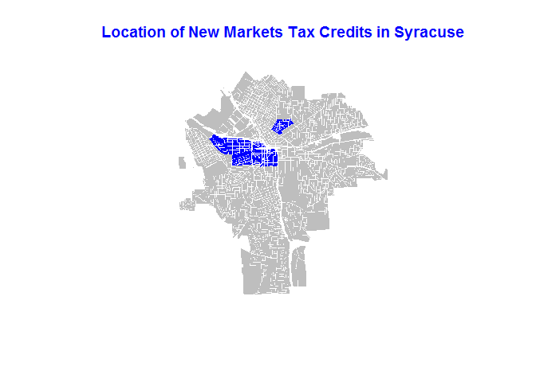

# New Markets Tax Credits


## What is the New Markets Tax Credit (NMTC)?

The NMTC program aims to attract private capital to low-income communities that would typically experience a lack of investment in an effort to revitalize struggling economies. The program allows investors to receive a tax credit against their federal income tax in exchange for making equity investments in Community Development Entities. The credit totals 39% of the investment amount and is claimed over a 7 year period.

## Raw data source
You can download the full national dataset for New Markets Tax Credits for years 2003-2014 from https://www.cdfifund.gov/news-events/news/Pages/news-detail.aspx?NewsID=225&Category=Press%20Releases in the form of a spreadsheet. A Data Point Description on the first tab of the spreadsheet explains each variable. You can save the second tab of the spreadsheet "Financial Notes 1 - Data Set PU" off as a csv file to then manipulate in R.

The data has a row for each project ID and you can filter based on a variety of location variables and the year placed in service (Yr_PIS) or the allocation year (Yr_Alloc)

## 1. Load raw data for NMTC from Github and select New Markets Tax Credits in Syracuse


```r
#loading relevant libraries
library( maptools )
library( sp )
library( dplyr )
library( pander )
library( rgdal )
library(geojsonio)
```
```


```r
# read in raw data with csv file
NMTC.full.dat <- read.csv( "https://raw.githubusercontent.com/lecy/SyracuseLandBank/master/DATA/RAW_DATA/NMTC_raw.csv", header=TRUE)

# select only the rows for the city of Syracuse
NMTC.syr <- subset (NMTC.full.dat, City == "Syracuse")
```

## 2. Aggregate NMTC at the census tract level to create a new aggregated data set


```r
#select the census tract, origination year and amount columns to work with
NMTC.syr.year.dol<- select(NMTC.syr, X2010.Census.Tract, Origination.Year, QLICI.Amount)

#clean values
NMTC.syr.year.dol$QLICI.Amount<-substring(NMTC.syr.year.dol$QLICI.Amount,2)
NMTC.syr.year.dol$QLICI.Amount <- as.numeric(gsub(",","",NMTC.syr.year.dol$QLICI.Amount))
#NMTC.syr.year.dol

# aggregate dollars by census tract
NMTC.ct.group<- group_by(NMTC.syr.year.dol, X2010.Census.Tract, Origination.Year, QLICI.Amount)
#NMTC.ct.group
NMTC.agg <-aggregate(NMTC.ct.group$QLICI.Amount, by=list(NMTC.ct.group$X2010.Census.Tract, NMTC.ct.group$Origination.Year), FUN=sum, na.rm=TRUE)
colnames(NMTC.agg) <- c("TRACT","YEAR","NMTC_DOLLARS")
NMTC.agg
```

<div data-pagedtable="false">
  <script data-pagedtable-source type="application/json">
{"columns":[{"label":["TRACT"],"name":[1],"type":["dbl"],"align":["right"]},{"label":["YEAR"],"name":[2],"type":["int"],"align":["right"]},{"label":["NMTC_DOLLARS"],"name":[3],"type":["dbl"],"align":["right"]}],"data":[{"1":"3.6067e+10","2":"2006","3":"3015000"},{"1":"3.6067e+10","2":"2008","3":"8000000"},{"1":"3.6067e+10","2":"2011","3":"20428080"},{"1":"3.6067e+10","2":"2013","3":"6000000"}],"options":{"columns":{"min":{},"max":[10]},"rows":{"min":[10],"max":[10]},"pages":{}}}
  </script>
</div>

## 3. Data Visualization

### a. NMTC dollars by census tract


```r
#sort by dollars and create a bar plot by census tract

NMTC.bp<-NMTC.agg[order(NMTC.agg$NMTC_DOLLARS),]

NMTC.round <- round(NMTC.bp$NMTC_DOLLARS/1000000) 
NMTC.labels <- paste0("$",NMTC.round)

barplot<-barplot(NMTC.bp$NMTC_DOLLARS, names.arg=NMTC.bp$TRACT,
           main="Amount of NMTC Investments in Syracuse, by Census Tract",  
           col= "#2454a0", axes=F, border="gray", ylim=c(0, 21500000)) 
#barplot
text(x = barplot, y = 1300000,labels = NMTC.labels, pos = 3, cex = .9, font = 2, col = "white")
text(x = barplot, y = 0,labels = "million", pos = 3, cex = .9, font = 2, col = "white")
```

<!-- -->


### b. Map location of NMTC in Syracuse


```r
#read in parcel geojson file from Github

syr.parcel <- geojson_read("https://raw.githubusercontent.com/lecy/SyracuseLandBank/master/SHAPEFILES/syr_parcels.geojson", method="local", what="sp" )
```


```r
# plot Syracuse parcels and highlight those that receive NMTC

select.tracts <- syr.parcel[syr.parcel$CensusTrac=="15"|syr.parcel$CensusTrac=="32"| syr.parcel$CensusTrac=="30"| syr.parcel$CensusTrac=="21.01",]

plot(syr.parcel, col = "grey", border = F)
plot(select.tracts, add = T, col = "blue", border = F)
title(main="Location of New Markets Tax Credits in Syracuse", col.main="blue")
```

<!-- -->


## 4. Save the new aggregated data set on to Github as a CSV file

```r
# Generate a .CSV file 

setwd( "../../DATA/AGGREGATED_DATA" )
write.csv( NMTC.agg, "NMTC_aggregated.csv", row.names=F )
```
