Permits
================
Ignacio & Alejandro
April 20, 2017

Information about the Dataset
-----------------------------

The Permits Dataset has information for 21,556 permits from 2012 - 2016. For each permit the Dataset inclueds variables like:

-   Type of Permit
-   Applicant name (can be either a person or a company)
-   Location
-   SBL
-   Date Issued
-   Valuation (cost of the activity the applicant is requesting permit for)
-   Fee Amount (the monies for the City)

We used the types of permits to construct 4 categories that we will aggregate as variables at the Census Tract level.

There are 32 types of permits, and we have placed this types of Permits into 4 categories to analyze them separately. They are:

-   Residential Properties
-   Commercial Properties
-   Demolitions
-   Installations and Repairs (to public space, res and com)

In what follows we explain the categories that we have constructed and show some descriptives.

### DESCRIPTIVE STATISTICS

### **1. All Categories Permit Categories**

#### Main takeaways:

-   This dataset we have a total of 16829 observations (or permits), with a median project valuation of $3,400.
-   During the last five years, the average number of permits given per year is approx. 3,360. This number has been very stable in recent years, with a small fall during 2016.
-   Most investment projects (60.2%) have a value below $5,000, while 17.5% have a value of $20,000+.
-   Investment projects are fairly distributed across the city. Installation and Repairs are the most prevalent form of investments, followed by residential property investment project.
-   The census tracts around Downtown, Lakefront, University Hill, Strathmore, Highway 81 and Highway 690 have received most investments projects, measured in aggregate value.

<table style="width:85%;">
<colgroup>
<col width="16%" />
<col width="20%" />
<col width="9%" />
<col width="12%" />
<col width="12%" />
<col width="12%" />
</colgroup>
<thead>
<tr class="header">
<th align="center">Type</th>
<th align="center">Observations</th>
<th align="center">Min.</th>
<th align="center">Median</th>
<th align="center">Mean</th>
<th align="center">Max.</th>
</tr>
</thead>
<tbody>
<tr class="odd">
<td align="center">All Permits</td>
<td align="center">16829</td>
<td align="center">0</td>
<td align="center">3400</td>
<td align="center">53343.71</td>
<td align="center">31811000</td>
</tr>
</tbody>
</table>

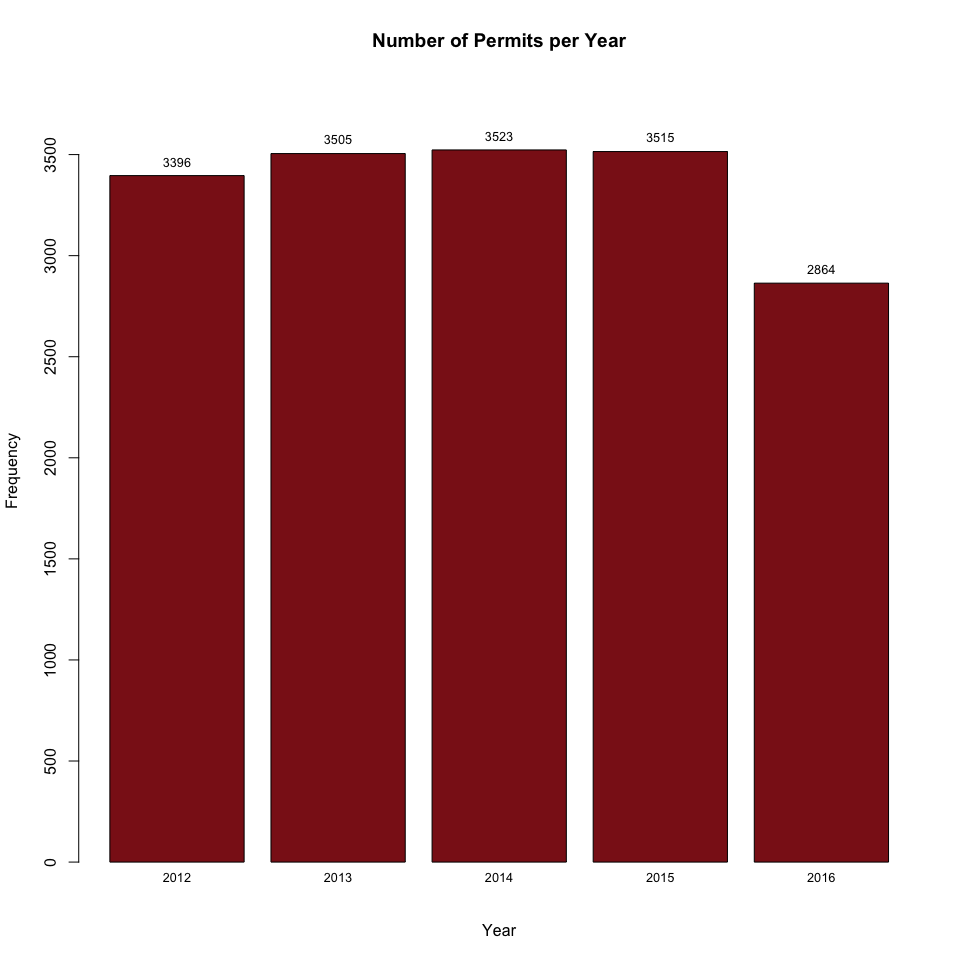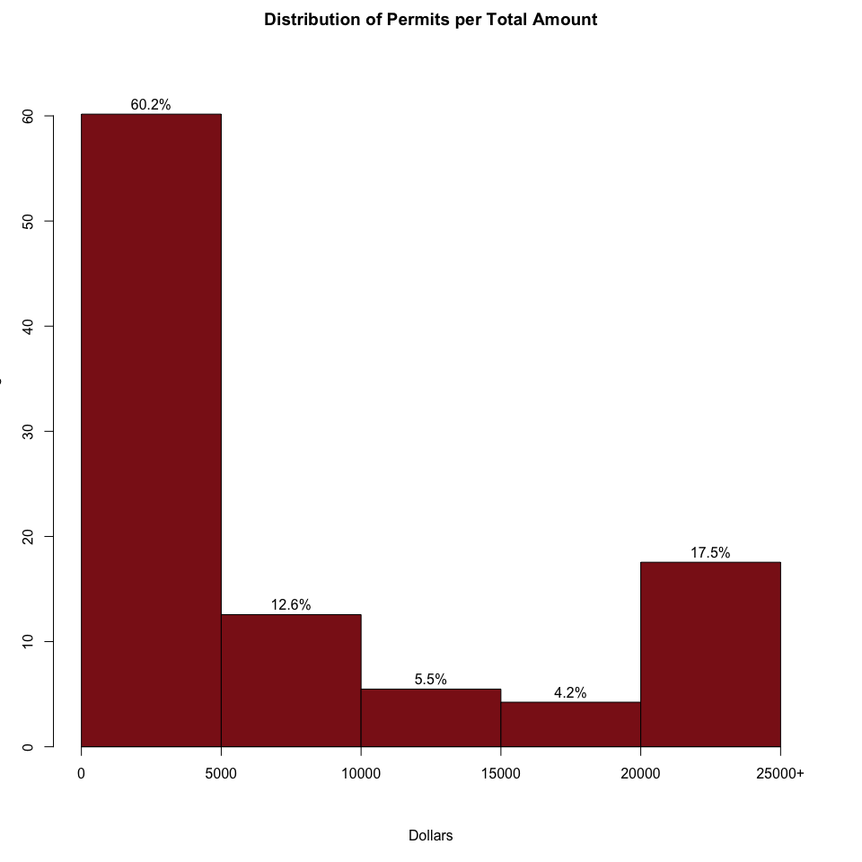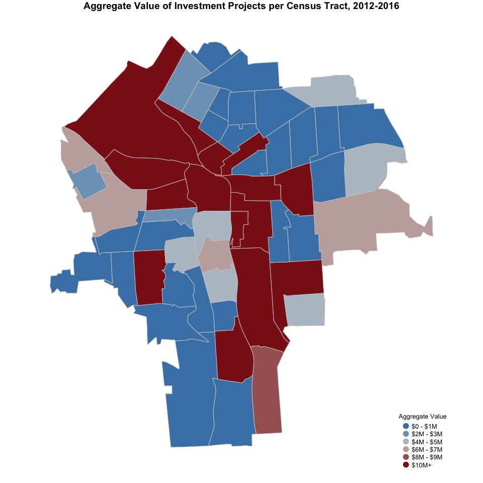

#### **2. Residential Property Investments**

#### Main takeaways:

-   This category contains permits for new 1-2 family residential projects as well as remodeling and change in occupancy projects.
-   There have been 2257 residential investment projects in the City of Syracuse over the last five years. Most of them are remodeling and change in occupancy projects (98%).
-   The years 2014 and 2015 showed an important increase in the number of residential projects in, with a total of 565 and 598 projects, respectively. This figure dropped to 404 in 2016.
-   Most residential investment projects (63.5%) have a value of $5,000 or below, while only 6.1% have a value of $20,000+.
-   The census tracts around the South Valley, Far-West side, Westside, Near Northeast, Eastwood, Near Eastside, Westcott, University Neighborhood, Lincoln, Salt Springs, Sedgwick and Meadowbrook neighborhoods have received most residential investments projects, measured in aggregate value.

<table style="width:93%;">
<colgroup>
<col width="29%" />
<col width="20%" />
<col width="9%" />
<col width="12%" />
<col width="12%" />
<col width="8%" />
</colgroup>
<thead>
<tr class="header">
<th align="center">Type</th>
<th align="center">Observations</th>
<th align="center">Min.</th>
<th align="center">Median</th>
<th align="center">Mean</th>
<th align="center">Max.</th>
</tr>
</thead>
<tbody>
<tr class="odd">
<td align="center">Res. New 1-2 Family</td>
<td align="center">41</td>
<td align="center">0</td>
<td align="center">124000</td>
<td align="center">122078.2</td>
<td align="center">255539</td>
</tr>
<tr class="even">
<td align="center">Res. Remodel/Chg Occ</td>
<td align="center">2216</td>
<td align="center">0</td>
<td align="center">3000</td>
<td align="center">6955.0</td>
<td align="center">360000</td>
</tr>
</tbody>
</table>

<table style="width:99%;">
<colgroup>
<col width="34%" />
<col width="20%" />
<col width="9%" />
<col width="12%" />
<col width="12%" />
<col width="8%" />
</colgroup>
<thead>
<tr class="header">
<th align="center">Type</th>
<th align="center">Observations</th>
<th align="center">Min.</th>
<th align="center">Median</th>
<th align="center">Mean</th>
<th align="center">Max.</th>
</tr>
</thead>
<tbody>
<tr class="odd">
<td align="center">All Residential Property</td>
<td align="center">2257</td>
<td align="center">0</td>
<td align="center">3000</td>
<td align="center">9046.295</td>
<td align="center">360000</td>
</tr>
</tbody>
</table>

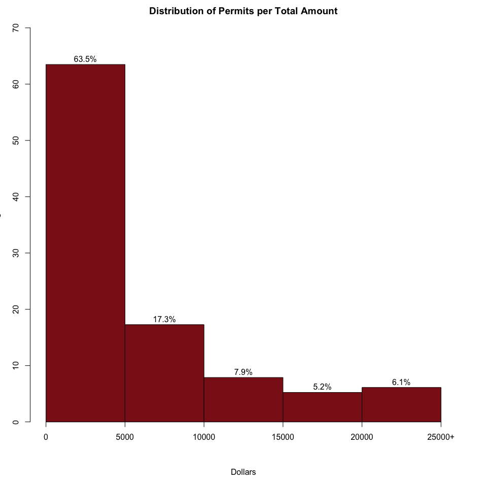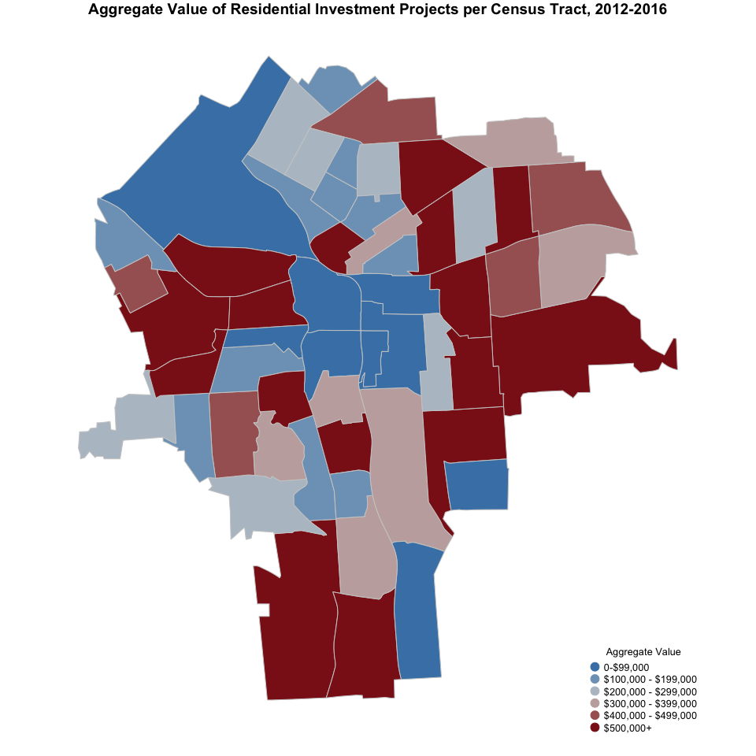

### **3. New/Reno of Commercial Property**

#### Main takeaways:

-   This category contains permits for the construction of new commercial buildings as well as the renovation, remodeling or change in occupancy projects.
-   There have been 1716 commercial investment projects over the last five years. Most of them have been renovation, remodeling or change in occupancy projects (96.7%).
-   The number of commercial projects has been fairly consistent over the last five years, with an annual average of 342 permits per year.
-   Most commercial investment projects (59.7%) had a value of $20,000+ and only 19.3% of projects had a value of $5,000 or below.
-   Census tracts around Downtown, Lakefront, University Hill, Near Eastside, Highway 81 and Highway 690 have received most commercial investments projects, measured in aggregate value.

<table>
<colgroup>
<col width="30%" />
<col width="20%" />
<col width="9%" />
<col width="12%" />
<col width="13%" />
<col width="13%" />
</colgroup>
<thead>
<tr class="header">
<th align="center">Type</th>
<th align="center">Observations</th>
<th align="center">Min.</th>
<th align="center">Median</th>
<th align="center">Mean</th>
<th align="center">Max.</th>
</tr>
</thead>
<tbody>
<tr class="odd">
<td align="center">Com. New Building</td>
<td align="center">56</td>
<td align="center">1500</td>
<td align="center">875000</td>
<td align="center">2440788.8</td>
<td align="center">15183229</td>
</tr>
<tr class="even">
<td align="center">Com. Reno/Rem/Chg Occ</td>
<td align="center">1660</td>
<td align="center">0</td>
<td align="center">30000</td>
<td align="center">247949.1</td>
<td align="center">31811000</td>
</tr>
</tbody>
</table>

<table>
<colgroup>
<col width="32%" />
<col width="20%" />
<col width="9%" />
<col width="12%" />
<col width="12%" />
<col width="12%" />
</colgroup>
<thead>
<tr class="header">
<th align="center">Type</th>
<th align="center">Observations</th>
<th align="center">Min.</th>
<th align="center">Median</th>
<th align="center">Mean</th>
<th align="center">Max.</th>
</tr>
</thead>
<tbody>
<tr class="odd">
<td align="center">All Commercial Property</td>
<td align="center">1716</td>
<td align="center">0</td>
<td align="center">34000</td>
<td align="center">319510.3</td>
<td align="center">31811000</td>
</tr>
</tbody>
</table>

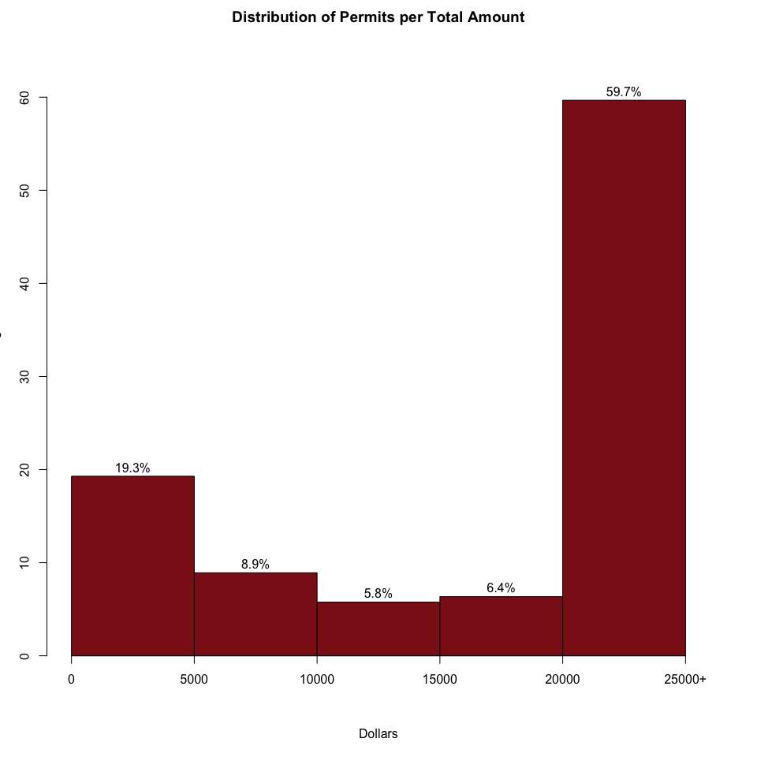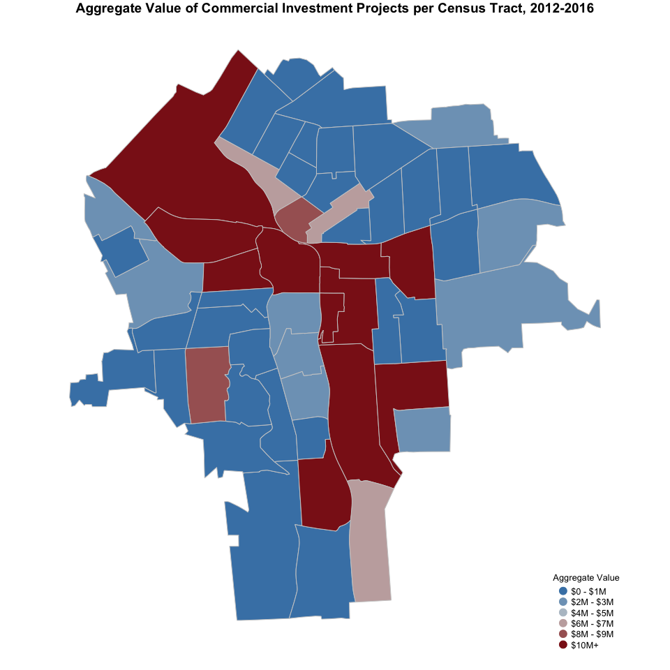

### **4. Demolitions**

#### Main takeaways:

-   This category contains 595 observations for demolition permits in the City of Syracuse.
-   Over the last five years, the demolition permits annual average has been 119. This number has been fairly consistent, with a small increase (164 permits) in 2015.
-   The value of the demolition projects ranges from zero dollars to $300,000, with most projects (24.2%) falling between $10,000 and $20,000.
-   Census tracts around Downtown, Lakefront, Westside, Near Westside, Near Eastside, Southwest, and Brighton have seen the largest number of demolition projects, measured in aggregate value.

<table style="width:82%;">
<colgroup>
<col width="16%" />
<col width="20%" />
<col width="9%" />
<col width="12%" />
<col width="11%" />
<col width="11%" />
</colgroup>
<thead>
<tr class="header">
<th align="center">Type</th>
<th align="center">Observations</th>
<th align="center">Min.</th>
<th align="center">Median</th>
<th align="center">Mean</th>
<th align="center">Max.</th>
</tr>
</thead>
<tbody>
<tr class="odd">
<td align="center">Demolitions</td>
<td align="center">595</td>
<td align="center">0</td>
<td align="center">11500</td>
<td align="center">17511.1</td>
<td align="center">3e+05</td>
</tr>
</tbody>
</table>

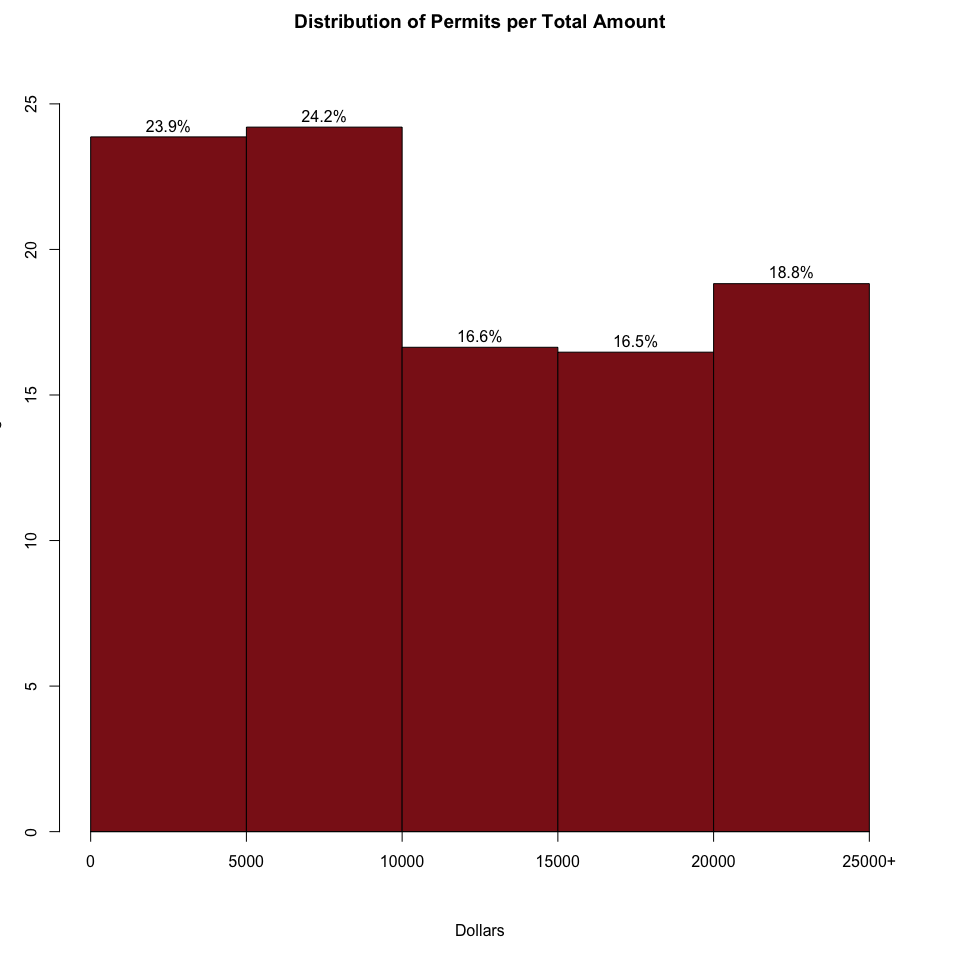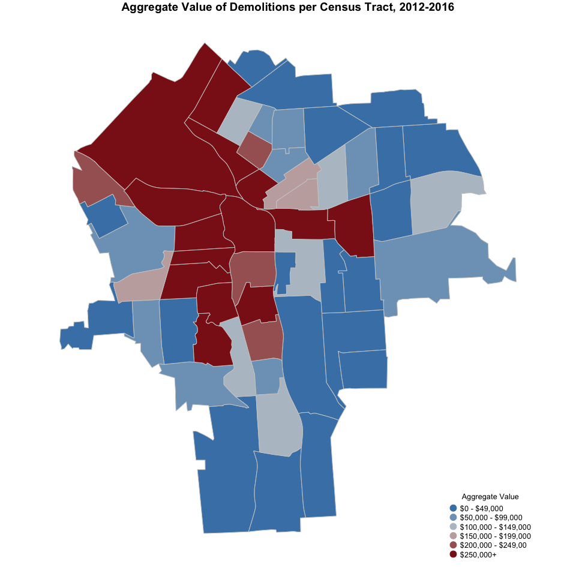

### **5. Installations and Repairs on all properties**

#### Main takeaways:

-   This category is composed by several kinds of permits, including: Electric, Elevator, Fire Alarm, HVAC/Mechanical, Misc.(deck, fence,ramp), Pool / Hot Tub, Security Alarm, Sprinkler, and Tank.
-   There have been a total of 12,261 installations and repairs projects over the last five years. Most of them have been Electric (46.6%), HVAC/Mechanical (17.6%) and Sprinkler (14.5%) projects.
-   The number of installations and repairs projects has been somewhat consistent over the last five years, with an annual average of 2,449 permits per year. However, last year, there was a small decrease in the number of installations and repairs permits with only 2,013.
-   Most installations and repairs projects (67%) had a value of $5,000 or below and only and only 13.7% of projects had a value of $20,000+.
-   The census tracts around Downtown, Lakefront, Westside, Near Eastside, Near Northeast, and Highway 81 have received most commercial investments projects, measured in aggregate value.

<table style="width:100%;">
<colgroup>
<col width="33%" />
<col width="20%" />
<col width="9%" />
<col width="12%" />
<col width="13%" />
<col width="9%" />
</colgroup>
<thead>
<tr class="header">
<th align="center">Type</th>
<th align="center">Observations</th>
<th align="center">Min.</th>
<th align="center">Median</th>
<th align="center">Mean</th>
<th align="center">Max.</th>
</tr>
</thead>
<tbody>
<tr class="odd">
<td align="center">Electric</td>
<td align="center">5712</td>
<td align="center">0</td>
<td align="center">2000</td>
<td align="center">23317.348</td>
<td align="center">8000000</td>
</tr>
<tr class="even">
<td align="center">Elevator</td>
<td align="center">170</td>
<td align="center">0</td>
<td align="center">30650</td>
<td align="center">73307.918</td>
<td align="center">1172000</td>
</tr>
<tr class="odd">
<td align="center">Fire Alarm</td>
<td align="center">607</td>
<td align="center">0</td>
<td align="center">8960</td>
<td align="center">52336.148</td>
<td align="center">8000000</td>
</tr>
<tr class="even">
<td align="center">HVAC/Mechanical</td>
<td align="center">2156</td>
<td align="center">0</td>
<td align="center">5650</td>
<td align="center">52791.131</td>
<td align="center">9764733</td>
</tr>
<tr class="odd">
<td align="center">Misc.(deck, fence,ramp)</td>
<td align="center">1159</td>
<td align="center">0</td>
<td align="center">2000</td>
<td align="center">5166.703</td>
<td align="center">2100000</td>
</tr>
<tr class="even">
<td align="center">Pool / Hot Tub</td>
<td align="center">71</td>
<td align="center">0</td>
<td align="center">4000</td>
<td align="center">6721.448</td>
<td align="center">30000</td>
</tr>
<tr class="odd">
<td align="center">Security Alarm</td>
<td align="center">542</td>
<td align="center">0</td>
<td align="center">200</td>
<td align="center">1215.267</td>
<td align="center">91968</td>
</tr>
<tr class="even">
<td align="center">Sprinkler</td>
<td align="center">1778</td>
<td align="center">0</td>
<td align="center">1650</td>
<td align="center">10725.370</td>
<td align="center">1396500</td>
</tr>
<tr class="odd">
<td align="center">Tank</td>
<td align="center">66</td>
<td align="center">0</td>
<td align="center">5000</td>
<td align="center">17794.197</td>
<td align="center">300000</td>
</tr>
</tbody>
</table>

<table>
<colgroup>
<col width="37%" />
<col width="18%" />
<col width="8%" />
<col width="11%" />
<col width="11%" />
<col width="11%" />
</colgroup>
<thead>
<tr class="header">
<th align="center">Type</th>
<th align="center">Observations</th>
<th align="center">Min.</th>
<th align="center">Median</th>
<th align="center">Mean</th>
<th align="center">Max.</th>
</tr>
</thead>
<tbody>
<tr class="odd">
<td align="center">All Installations and Repairs</td>
<td align="center">12261</td>
<td align="center">0</td>
<td align="center">2600</td>
<td align="center">25985.24</td>
<td align="center">9764733</td>
</tr>
</tbody>
</table>

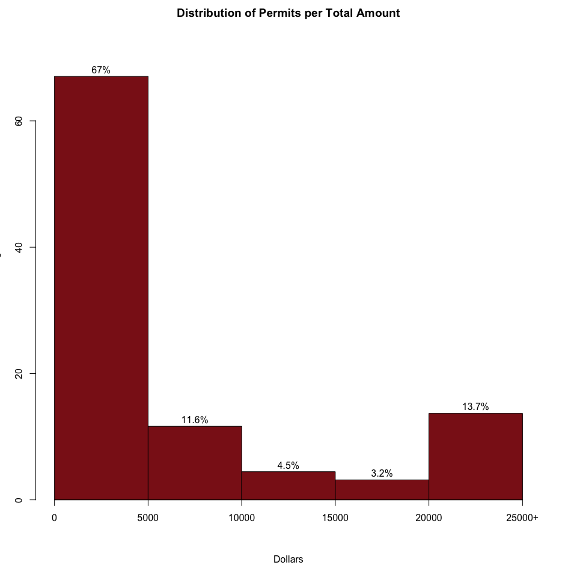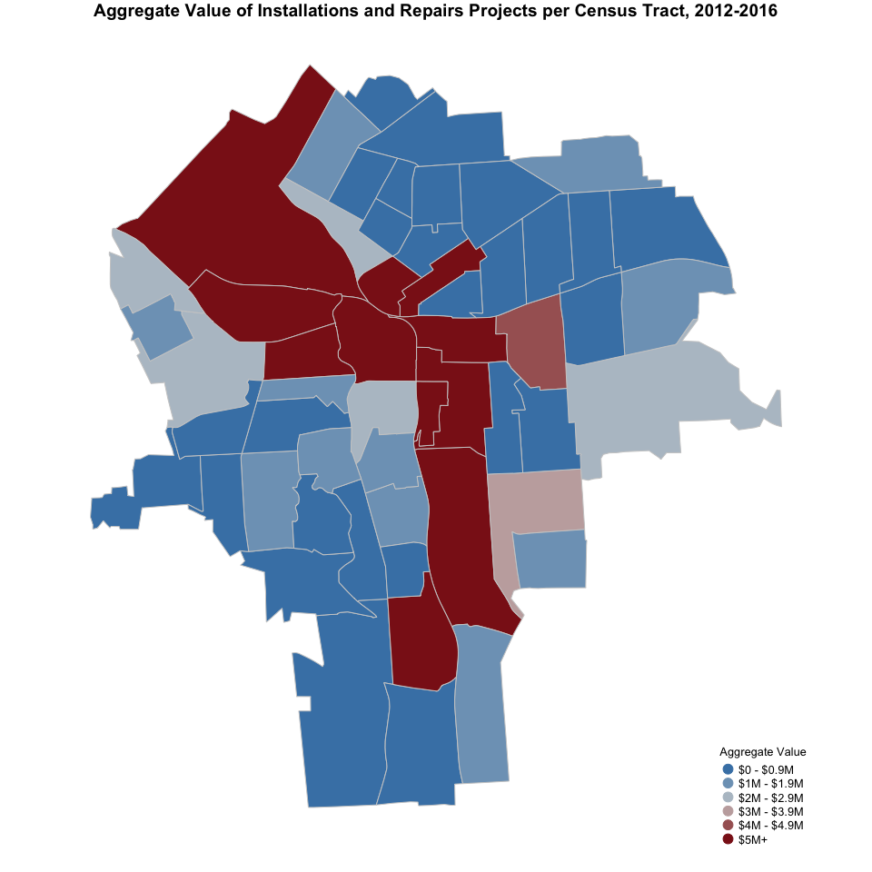
