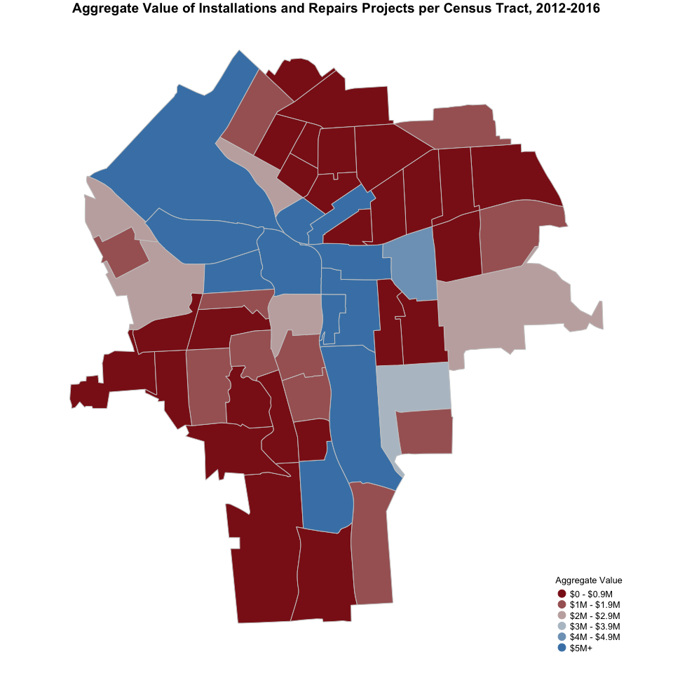

# Permits

##Information about the Dataset
The Permits Dataset has information for 21,556 permits from 2012 - 2016. 
For each permit the Dataset inclueds variables like:

* Type of Permit
* Applicant name (can be either a person or a company)
* Location
* SBL
* Date Issued
* Valuation (cost of the activity the applicant is requesting permit for)
* Fee Amount (the monies for the City)

We used the types of permits to construct 4 categories that we will aggregate as variables at the Census Tract level.

There are 32 types of permits, and we have placed this types of Permits into 4 categories to analyze them separately. They are:

* Residential Properties
* Commercial Properties
* Demolitions
* Installations and Repairs (to public space, res and com)

In what follows we explain the categories that we have constructed and show some descriptives.

###DESCRIPTIVE STATISTICS

###**1. All Categories Permit Categories**

####Main takeaways:

* This dataset we have a total of 16829 observations (or permits), with a median project valuation of $3,400.  
* During the last five years, the average number of permits given per year is approx. 3,360. This number has been very stable in recent years, with a small fall during 2016.  
* Most investment projects (60.2%) have a value below $5,000, while 17.5% have a value of $20,000+.  
* Investment projects are fairly distributed across the city. Installation and Repairs are the most prevalent form of investments, followed by residential property investment project.  
* The census tracts around Downtown, Lakefront, University Hill, Strathmore, Highway 81 and Highway 690 have received most investments projects, measured in aggregate value.  

------------------------------------------------------------
   Type      Observations   Min.   Median    Mean     Max.  
----------- -------------- ------ -------- -------- --------
All Permits     16829        0      3400   53343.71 31811000
------------------------------------------------------------

<!-- --><!-- --><!-- -->

<!-- -->

####**2. Residential Property Investments**

####Main takeaways:

* This category contains permits for new 1-2 family residential projects as well as remodeling and change in occupancy projects. 
* There have been 2257 residential investment projects in the City of Syracuse over the last five years. Most of them are remodeling and change in occupancy projects (98%).
* The years 2014 and 2015 showed an important increase in the number of residential projects in, with a total of 565 and 598 projects, respectively. This figure dropped to 404 in 2016.
* Most residential investment projects (63.5%) have a value of $5,000 or below, while only 6.1% have a value of $20,000+.  
* The census tracts around the South Valley, Far-West side, Westside, Near Northeast, Eastwood, Near Eastside, Westcott, University Neighborhood, Lincoln, Salt Springs, Sedgwick and Meadowbrook neighborhoods have received most residential investments projects, measured in aggregate value.

-------------------------------------------------------------------
        Type          Observations   Min.   Median    Mean    Max. 
-------------------- -------------- ------ -------- -------- ------
Res. New 1-2 Family        41         0     124000  122078.2 255539

Res. Remodel/Chg Occ      2216        0      3000    6955.0  360000
-------------------------------------------------------------------

-----------------------------------------------------------------------
          Type            Observations   Min.   Median    Mean    Max. 
------------------------ -------------- ------ -------- -------- ------
All Residential Property      2257        0      3000   9046.295 360000
-----------------------------------------------------------------------

<!-- --><!-- --><!-- --><!--html_preserve-->

<script type="application/json" data-for="htmlwidget-5d4b2e026bd15082ac7b">{"x":{"options":{"crs":{"crsClass":"L.CRS.EPSG3857","code":null,"proj4def":null,"projectedBounds":null,"options":{}}},"calls":[{"method":"addProviderTiles","args":["CartoDB.Positron",{"minZoom":10,"maxZoom":17,"maxNativeZoom":null,"tileSize":256,"subdomains":"abc","errorTileUrl":"","tms":false,"continuousWorld":false,"noWrap":false,"zoomOffset":0,"zoomReverse":false,"opacity":1,"zIndex":null,"unloadInvisibleTiles":null,"updateWhenIdle":null,"detectRetina":false,"reuseTiles":false},null,{"errorTileUrl":"","noWrap":false,"zIndex":null,"unloadInvisibleTiles":null,"updateWhenIdle":null,"detectRetina":false,"reuseTiles":false}]},{"method":"addCircles","args":[[43.061546,43.0592546,43.048818,43.0452955,43.0453109,43.0453264,43.0453418,43.034916,43.0203125,43.0210827,43.0210489,43.020995,43.0206734,43.0199528,43.019788,42.98655,42.992554,43.005393,43.005393,43.005393,43.030266,43.029536,43.0281,43.028143,43.028189,43.0280809,43.034583,43.034638,43.036434,43.046143,43.045626,43.045226,43.044495,43.050867,43.050707,43.052445,43.052454,43.052463,43.049318,43.046694,43.049124,43.07455,43.074171,43.074146,43.073521,43.073229,43.072875,43.072679,43.072679,43.0695679,43.0708837,43.071649,43.071649,43.0714634,43.0720493,43.0708844,43.0708844,43.070071,43.069551,43.066777,43.06652,43.066683,43.075266,43.075266,43.079719,43.0795439,43.0775212,43.0775526,43.0745064,43.0745064,43.0745064,43.079786,43.0732585,43.073548,43.0733134,43.0733134,43.073189,43.0733037,43.081452,43.081452,43.083545,43.083452,43.083234,43.0830046,43.0833172,43.081183,43.0814349,43.08032,43.0809384,43.080149,43.080149,43.0795051,43.0784209,43.0783618,43.0779188,43.079242,43.0783318,43.0794127,43.0794127,43.0794127,43.078924,43.0808979,43.080138,43.080373,43.0813245,43.082735,43.0825442,43.0819545,43.0823841,43.081084,43.080709,43.080236,43.0737791,43.072982,43.07353,43.0754616,43.0745069,43.0744683,43.07399,43.073512,43.073512,43.07686,43.076077,43.0758859,43.075677,43.077733,43.077504,43.076669,43.077799,43.0773426,43.0786815,43.0786151,43.0797809,43.0797809,43.079858,43.080347,43.080225,43.079778,43.0807689,43.0805741,43.081232,43.0807028,43.0811329,43.080241,43.07982,43.0792581,43.078854,43.078409,43.078939,43.078939,43.0789862,43.0789862,43.0783092,43.0778081,43.0720119,43.075788,43.07616,43.0754871,43.0762799,43.07616,43.077407,43.077407,43.077407,43.07674,43.075914,43.0752,43.070601,43.072442,43.072882,43.0706932,43.0706932,43.070517,43.0721519,43.071449,43.070703,43.071834,43.072538,43.073084,43.073696,43.07337,43.0740653,43.072558,43.065863,43.066854,43.066854,43.069713,43.069171,43.069171,43.071843,43.071263,43.070152,43.070152,43.0709512,43.07038,43.070164,43.0696489,43.069097,43.0673338,43.067283,43.067336,43.065505,43.065537,43.0637808,43.065173,43.064542,43.0669763,43.0669763,43.0689506,43.070735,43.0699887,43.0699887,43.0699887,43.069362,43.069161,43.067787,43.0670145,43.066686,43.0663365,43.0670519,43.065712,43.064697,43.065514,43.0649354,43.064245,43.063617,43.061032,43.059741,43.0602332,43.059536,43.0594392,43.058216,43.064066,43.0633395,43.0621131,43.062945,43.0629952,43.0654673,43.0651277,43.0654203,43.0654203,43.0670145,43.0660529,43.06711,43.067395,43.068119,43.0689112,43.0687209,43.0676588,43.067872,43.067206,43.06703,43.066114,43.066272,43.06635,43.062377,43.0639878,43.0645991,43.0619842,43.062238,43.063276,43.062409,43.0646898,43.066083,43.06566,43.0655314,43.065468,43.065468,43.065274,43.0652199,43.065262,43.0649962,43.0649962,43.064509,43.064099,43.06313,43.06168,43.061602,43.0608379,43.0728067,43.072175,43.072629,43.0719939,43.071639,43.071159,43.071248,43.072031,43.072049,43.0717825,43.072112,43.069348,43.067449,43.0698861,43.0706735,43.0699909,43.071446,43.071446,43.0708953,43.069527,43.0706,43.0711089,43.0705153,43.070645,43.07115,43.070538,43.070458,43.070818,43.070206,43.070206,43.070206,43.070131,43.070181,43.069025,43.068797,43.068526,43.067163,43.0668689,43.077151,43.0772425,43.077204,43.0776953,43.077384,43.076277,43.073966,43.07285,43.073728,43.07381,43.0742121,43.073438,43.073384,43.073384,43.073057,43.072838,43.072625,43.073226,43.072458,43.0736076,43.07423,43.07423,43.073729,43.0754469,43.075157,43.075119,43.076005,43.0759165,43.077202,43.077325,43.0748447,43.0753645,43.0768623,43.0760704,43.0773538,43.0731692,43.077277,43.076046,43.071625,43.0718869,43.071783,43.071231,43.072217,43.072217,43.071836,43.071685,43.072481,43.072177,43.07144,43.071896,43.0719657,43.072011,43.069995,43.06986,43.071243,43.071243,43.0684467,43.070984,43.070141,43.06992,43.068876,43.068876,43.0709,43.070351,43.071078,43.0707565,43.069965,43.0703559,43.070801,43.0673699,43.0678089,43.0681313,43.06755,43.0692964,43.068475,43.068475,43.068475,43.0689459,43.068307,43.068071,43.067965,43.0675588,43.0675588,43.065647,43.065164,43.066144,43.067622,43.0670069,43.0670069,43.0665819,43.066752,43.0644466,43.0671873,43.0666749,43.06558,43.06462,43.0629646,43.062678,43.0625799,43.066313,43.0672129,43.065962,43.066203,43.06571,43.06571,43.064315,43.0644417,43.066365,43.064732,43.064051,43.064203,43.0654283,43.066218,43.0659459,43.064932,43.0665367,43.066203,43.066155,43.065844,43.063984,43.063527,43.062437,43.062437,43.062924,43.0629459,43.06211,43.060858,43.058454,43.05773,43.0578969,43.05991,43.061023,43.061338,43.0619757,43.062173,43.061693,43.060565,43.059147,43.060175,43.060749,43.061458,43.058512,43.055894,43.055894,43.055894,43.056614,43.056614,43.056861,43.056966,43.0568398,43.056387,43.055625,43.057477,43.056153,43.055956,43.055956,43.0560509,43.0553375,43.055044,43.054357,43.054248,43.053251,43.054712,43.054712,43.054419,43.053554,43.053598,43.0548489,43.053925,43.055282,43.055282,43.055195,43.055056,43.055056,43.055056,43.055025,43.054622,43.053528,43.0632469,43.0619946,43.061706,43.061539,43.0607633,43.062161,43.06265,43.062352,43.061606,43.062295,43.062,43.058245,43.0582,43.0627893,43.062084,43.063439,43.0616484,43.0611293,43.0608178,43.060303,43.060303,43.060303,43.058221,43.05873,43.059036,43.0587919,43.0590369,43.058847,43.0582354,43.0582354,43.0582354,43.0602189,43.061897,43.0601619,43.059745,43.0592836,43.0602478,43.058713,43.058174,43.058825,43.058832,43.058832,43.0653471,43.064765,43.065913,43.0647274,43.065001,43.065001,43.066085,43.067355,43.066695,43.067655,43.068112,43.065777,43.064407,43.0639899,43.063572,43.063572,43.063293,43.0621889,43.064928,43.065022,43.064475,43.065298,43.06254,43.063733,43.063716,43.063859,43.063904,43.062214,43.062332,43.0614893,43.061797,43.0614264,43.0609638,43.0619529,43.062568,43.062608,43.06331,43.06331,43.063315,43.063876,43.0637619,43.0637619,43.071198,43.068491,43.0684683,43.069279,43.0693949,43.0685863,43.069215,43.0687393,43.068267,43.0687259,43.0687259,43.069564,43.0701636,43.067009,43.067285,43.067363,43.0675787,43.065835,43.071267,43.069144,43.070807,43.071145,43.071145,43.071669,43.069289,43.069179,43.073474,43.0743881,43.074131,43.0740714,43.073519,43.074086,43.0740627,43.075085,43.074784,43.071416,43.072742,43.0724433,43.070876,43.071622,43.071622,43.071869,43.072012,43.0733139,43.0731936,43.0719748,43.070973,43.070713,43.071502,43.0731298,43.0731298,43.071893,43.0726609,43.073021,43.0703397,43.0696885,43.0692734,43.0693651,43.0704238,43.0697199,43.070713,43.070713,43.070713,43.0690659,43.069846,43.070568,43.070667,43.070876,43.070043,43.068424,43.068286,43.067214,43.067438,43.066714,43.06757,43.067806,43.0675818,43.067476,43.067367,43.067037,43.067563,43.067783,43.067893,43.067089,43.067089,43.067089,43.067031,43.066231,43.0665578,43.0665578,43.067566,43.067566,43.0668,43.066649,43.067323,43.0676257,43.0677313,43.064072,43.065041,43.0643839,43.064579,43.0650989,43.064966,43.066065,43.066065,43.066065,43.064449,43.0649617,43.066369,43.065877,43.065001,43.065634,43.064952,43.064548,43.064597,43.065363,43.065693,43.065135,43.064715,43.064715,43.066248,43.0696269,43.0676514,43.067587,43.067156,43.067239,43.069701,43.069701,43.069701,43.069701,43.0701878,43.069314,43.0706612,43.067037,43.067037,43.067217,43.06617,43.065184,43.066115,43.0651311,43.064776,43.065947,43.064651,43.066809,43.0651799,43.065184,43.065705,43.066196,43.065854,43.0653999,43.0654878,43.06474,43.064727,43.06329,43.0637322,43.0633051,43.0627303,43.0631569,43.062708,43.063362,43.063906,43.0637479,43.062398,43.062179,43.061506,43.062243,43.0599117,43.061523,43.0627786,43.0627786,43.062013,43.062013,43.061988,43.0633998,43.062617,43.0625819,43.0622907,43.06304,43.063667,43.0629009,43.062222,43.0623414,43.0623414,43.0626671,43.0641577,43.0640676,43.063555,43.063123,43.063685,43.0633063,43.061701,43.0618432,43.061345,43.061572,43.060713,43.060803,43.060803,43.060367,43.059791,43.059518,43.060781,43.060781,43.060633,43.060087,43.060465,43.0592871,43.062814,43.0600809,43.057948,43.0586698,43.0585324,43.059234,43.059686,43.061238,43.060625,43.061033,43.060615,43.061086,43.0611654,43.0611654,43.061455,43.060948,43.060495,43.060495,43.0607709,43.057134,43.0562575,43.0562575,43.0562575,43.0542711,43.0597127,43.056767,43.057607,43.0579002,43.05744,43.0564987,43.056497,43.0562315,43.0569256,43.057321,43.057321,43.057263,43.057263,43.055623,43.053982,43.055013,43.054248,43.055162,43.055162,43.0530652,43.053651,43.0541166,43.0541166,43.0552061,43.0552061,43.054381,43.052881,43.052992,43.052992,43.052991,43.052987,43.0522454,43.0532839,43.0532839,43.052748,43.053895,43.053895,43.053129,43.052066,43.051438,43.051402,43.0501268,43.0506539,43.0506539,43.0497596,43.050505,43.04968,43.0494309,43.0494309,43.0496065,43.04963,43.050349,43.0499447,43.0497302,43.04989,43.048966,43.0488568,43.0488568,43.04881,43.048719,43.0486672,43.048762,43.048762,43.048762,43.050981,43.0500092,43.0500092,43.0500092,43.049335,43.048209,43.048209,43.048209,43.048209,43.048209,43.048209,43.04765,43.047957,43.046723,43.046886,43.046173,43.0456963,43.045865,43.047188,43.04685,43.04519,43.046078,43.0463573,43.046478,43.047826,43.048294,43.046869,43.0460459,43.046193,43.044929,43.045088,43.044902,43.043167,43.043028,43.044862,43.043903,43.044959,43.045247,43.0441812,43.042267,43.044353,43.0416257,43.044668,43.045532,43.0430769,43.04385,43.0478062,43.0478062,43.047839,43.048282,43.0485801,43.047718,43.048734,43.048734,43.0487831,43.0484858,43.048899,43.0485389,43.0476249,43.0492285,43.0494204,43.047348,43.04811,43.048118,43.0481196,43.047223,43.047246,43.046848,43.047718,43.046938,43.0465024,43.0460539,43.045945,43.0460416,43.046282,43.046282,43.0459792,43.0459792,43.044434,43.04549,43.044713,43.044287,43.044103,43.0444071,43.044232,43.043731,43.043815,43.04409,43.044069,43.044784,43.0449531,43.044659,43.046753,43.045859,43.044457,43.043297,43.043715,43.043715,43.0436539,43.043222,43.043279,43.043316,43.042852,43.042852,43.042279,43.040784,43.0404539,43.041465,43.0403663,43.0372545,43.0368036,43.0368036,43.041016,43.041392,43.0408719,43.0403432,43.039163,43.0393434,43.038786,43.037723,43.037818,43.03787,43.03787,43.038974,43.038982,43.04143,43.039273,43.040069,43.040228,43.0415849,43.0398068,43.039315,43.0383319,43.038196,43.0348337,43.036677,43.0364099,43.0367,43.0363177,43.0369699,43.038221,43.0373969,43.035881,43.037332,43.037481,43.03789,43.038297,43.0366969,43.037442,43.041301,43.041316,43.0411829,43.0400289,43.0400289,43.039342,43.039342,43.039031,43.0399451,43.0401219,43.0379946,43.0370029,43.040429,43.040797,43.040918,43.041159,43.0414699,43.039146,43.04176,43.042801,43.0423878,43.042221,43.042142,43.041723,43.041365,43.041393,43.0415997,43.040873,43.0388545,43.039979,43.038907,43.038018,43.037989,43.037742,43.03778,43.037903,43.038024,43.038389,43.0387405,43.0378619,43.03748,43.0380336,43.0377948,43.039247,43.039204,43.039204,43.0401068,43.0400989,43.039194,43.040808,43.040233,43.039933,43.03869,43.0386669,43.038655,43.038609,43.04115,43.041276,43.04178,43.040669,43.040421,43.0403695,43.04088,43.041075,43.041659,43.041659,43.039814,43.0395546,43.039084,43.0387709,43.037362,43.0367504,43.0369241,43.0368932,43.0377875,43.037657,43.038399,43.038399,43.038399,43.038392,43.038392,43.048093,43.0470087,43.047583,43.0481466,43.044111,43.046795,43.046424,43.043044,43.042567,43.042368,43.043307,43.043576,43.0436865,43.043568,43.042975,43.042536,43.042325,43.04186,43.044409,43.0446036,43.045671,43.045625,43.044625,43.044234,43.0478492,43.0451574,43.0453328,43.045044,43.044982,43.0441762,43.035136,43.035136,43.0362674,43.035465,43.034916,43.03555,43.036328,43.035224,43.03489,43.036481,43.036494,43.033794,43.03294,43.0350337,43.0335241,43.033015,43.033015,43.032297,43.032523,43.0326189,43.033352,43.032205,43.0323668,43.0331596,43.033298,43.0327626,43.031986,43.031986,43.0325739,43.0326949,43.033049,43.033879,43.03416,43.033602,43.033209,43.031041,43.031968,43.032131,43.030242,43.0313567,43.031217,43.031217,43.032075,43.0306349,43.031275,43.031577,43.031684,43.031425,43.035776,43.036273,43.036665,43.0362175,43.036069,43.034831,43.035218,43.035657,43.0371171,43.034058,43.033574,43.032956,43.034553,43.035443,43.0330017,43.033852,43.034511,43.034838,43.034948,43.034912,43.0353106,43.034609,43.03342,43.031935,43.035776,43.032803,43.032291,43.030812,43.031901,43.0319069,43.0321489,43.0313587,43.031416,43.031185,43.0304259,43.0316479,43.0316479,43.035736,43.032056,43.0328075,43.033437,43.0329962,43.033249,43.033631,43.0357981,43.036466,43.035843,43.0339331,43.0298633,43.031052,43.03069,43.030142,43.029872,43.029718,43.032056,43.0307383,43.031823,43.03411,43.0335923,43.034183,43.0287502,43.0291056,43.027899,43.028428,43.029202,43.03038,43.030193,43.0293449,43.030019,43.0284819,43.028898,43.0286,43.027132,43.0250448,43.0249937,43.0270549,43.0266717,43.028241,43.024073,43.025816,43.024149,43.024605,43.0249499,43.025816,43.023248,43.020938,43.022548,43.023248,43.0221128,43.0221128,43.0221128,43.0221128,43.0221128,43.0221128,43.0221128,43.027109,43.025668,43.025441,43.0268894,43.026973,43.025297,43.024621,43.024621,43.021935,43.0255934,43.024746,43.02484,43.024704,43.024358,43.0213495,43.024088,43.024165,43.0231868,43.02207,43.022537,43.044326,43.01881,43.0204499,43.019402,43.019402,43.019789,43.01854,43.018096,43.018042,43.018567,43.015959,43.015959,43.014612,43.01439,43.0156459,43.014536,43.014105,43.0180586,43.003732,43.004411,43.000617,43.00061,42.996808,42.994441,42.9895929,42.990217,42.9889307,42.9889307,42.9889307,43.046615,42.988788,42.988385,42.988358,42.988396,42.987892,42.987892,42.987906,42.987906,42.9878799,42.986899,42.9854458,42.98551,42.98487,42.985883,42.985079,42.9868173,42.986735,42.9855034,42.9854973,42.9854973,42.98571,42.9964,42.9853398,42.9963304,42.996361,42.996925,42.995222,42.9943881,42.994961,42.99495,42.995558,42.995558,42.9959586,42.993685,42.993685,42.9964113,42.992878,42.9933623,42.992429,42.992429,42.992429,42.9918009,42.991862,42.991226,42.990916,42.991794,42.991772,42.992702,42.9942177,42.994155,42.994162,42.993355,42.9942955,42.9942955,42.991282,42.999091,42.998419,42.998632,42.997625,42.999659,42.996147,42.9959343,42.995883,42.9954303,42.995453,42.996147,42.996336,43.002496,43.002017,43.002179,43.0011764,42.999875,42.999561,42.999237,42.9995043,43.000946,42.9979573,42.9975966,42.9978609,42.9978609,42.997953,42.997953,42.997243,42.997486,43.004632,43.006196,43.007658,43.006952,43.0073875,43.006431,43.006431,43.0053398,43.005518,43.005518,43.002341,43.002341,43.0051062,43.005548,43.004032,43.004032,43.003848,43.003424,43.0031703,43.0028441,43.0017363,43.003814,43.0037916,43.006748,43.007263,43.007356,43.006028,43.005747,43.005747,43.006369,43.005782,43.004363,43.0043882,43.004284,43.004363,43.0051289,43.001525,43.0018345,43.002016,43.003227,43.003227,43.003769,43.0049009,43.003587,43.004731,43.005156,43.005473,43.0054212,43.012948,43.013011,43.0132509,43.01325,43.0129004,43.011638,43.0116889,43.0116889,43.010054,43.010123,43.010123,43.010624,43.0085744,43.01021,43.010519,43.008817,43.0105306,43.0111009,43.011785,43.01176,43.011752,43.012638,43.010836,43.0104157,43.0107509,43.0099191,43.01242,43.01212,43.0118965,43.009135,43.009135,43.008347,43.0081551,43.0084367,43.009171,43.0102274,43.008385,43.0097696,43.0097696,43.009303,43.008919,43.0082081,43.0069925,43.0092039,43.0090881,43.0090536,43.010385,43.0105456,43.0099804,43.010847,43.0109678,43.01225,43.0079769,43.015853,43.014603,43.0153334,43.014603,43.015962,43.015731,43.014949,43.014949,43.0120753,43.014481,43.011983,43.017955,43.0180513,43.0180709,43.017588,43.016986,43.018594,43.017426,43.018354,43.015796,43.014175,43.013654,43.0129741,43.0164814,43.015403,43.013748,43.0162059,43.014901,43.014225,43.0143917,43.015248,43.015717,43.017709,43.014104,43.018571,43.018158,43.018158,43.0177724,43.0177724,43.0168636,43.016831,43.01638,43.016839,43.015944,43.0153942,43.014879,43.0150052,43.0150663,43.014037,43.013911,43.013991,43.013442,43.014569,43.014589,43.014252,43.014442,43.0168636,43.0159329,43.0159917,43.0214209,43.017331,43.016993,43.0182105,43.024003,43.024108,43.023908,43.024023,43.025204,43.0255906,43.024741,43.024112,43.023461,43.023461,43.023461,43.022977,43.020848,43.020327,43.0218739,43.019882,43.020497,43.0217928,43.021854,43.0222964,43.021853,43.021388,43.021388,43.0223299,43.023296,43.023441,43.0235462,43.0231136,43.021443,43.022008,43.022891,43.022908,43.0229825,43.021271,43.021837,43.017962,43.022639,43.021937,43.0219049,43.023475,43.021489,43.0203572,43.0200259,43.0207175,43.018498,43.0198239,43.021866,43.022525,43.021279,43.0221779,43.020648,43.0206047,43.021279,43.022847,43.022088,43.022287,43.0219222,43.021123,43.020771,43.02065,43.019958,43.019969,43.0200069,43.0228365,43.020725,43.0210357,43.0210357,43.019053,43.020231,43.0191565,43.0191565,43.017486,43.017528,43.0179621,43.0185046,43.016671,43.019543,43.019707,43.020236,43.0222848,43.02016,43.0198118,43.0203969,43.021258,43.021881,43.020232,43.02047,43.0207548,43.0196633,43.019452,43.019452,43.026146,43.025506,43.0257236,43.026434,43.026364,43.022469,43.02563,43.0249748,43.027441,43.026848,43.0278153,43.024654,43.023742,43.0266419,43.023946,43.023718,43.0232855,43.0232855,43.023079,43.022939,43.023052,43.023052,43.0244225,43.0251883,43.025048,43.024776,43.02185,43.022068,43.024284,43.0219091,43.027882,43.027971,43.028279,43.028085,43.025431,43.024881,43.024968,43.0240579,43.025752,43.0265093,43.025245,43.024705,43.024705,43.024232,43.023742,43.02339,43.0231378,43.02337,43.0242259,43.0243306,43.024035,43.0368039,43.0232739,43.023281,43.023263,43.0249468,43.0246731,43.024712,43.024641,43.024641,43.024641,43.024588,43.0244439,43.029263,43.0295514,43.02942,43.029552,43.028891,43.030266,43.03002,43.0278836,43.0278836,43.028227,43.029136,43.030152,43.0297831,43.030016,43.029856,43.031463,43.031069,43.03145,43.028767,43.028732,43.0291179,43.029033,43.02806,43.026663,43.027029,43.027394,43.028187,43.026751,43.027467,43.027071,43.026751,43.026751,43.027197,43.029106,43.028746,43.028211,43.027893,43.027893,43.025265,43.025422,43.025694,43.025422,43.02532,43.032501,43.024886,43.026607,43.026572,43.02737,43.027724,43.027816,43.0279362,43.027337,43.027051,43.0285931,43.028606,43.028292,43.027857,43.03234,43.0321531,43.031926,43.032922,43.0334918,43.0334918,43.031012,43.029879,43.031314,43.031084,43.030996,43.032991,43.032889,43.0326311,43.0321475,43.0322699,43.03203,43.032777,43.0333297,43.033132,43.031974,43.032193,43.032514,43.031363,43.03272,43.032267,43.031262,43.0299648,43.02873,43.029455,43.0296329,43.030515,43.029647,43.029141,43.030237,43.030026,43.029713,43.029374,43.028899,43.029181,43.029714,43.028877,43.028917,43.031068,43.031566,43.030766,43.02982,43.02982,43.030551,43.031429,43.029741,43.029549,43.0321799,43.031096,43.030744,43.032789,43.032035,43.032015,43.032015,43.032008,43.032304,43.029476,43.031472,43.031042,43.030686,43.030982,43.0300685,43.030185,43.029451,43.029499,43.029489,43.0297576,43.029525,43.029525,43.029672,43.028898,43.028471,43.027859,43.028547,43.028779,43.028371,43.032229,43.031367,43.0312646,43.030949,43.0303759,43.030026,43.0299119,43.030457,43.0314015,43.031514,43.031652,43.0314089,43.031666,43.02984,43.030695,43.030695,43.032397,43.0327329,43.032483,43.032492,43.032506,43.032099,43.0318685,43.0312848,43.0312846,43.030824,43.03099,43.030577,43.030577,43.030323,43.030245,43.0284438,43.027614,43.027822,43.029272,43.02781,43.027438,43.027438,43.028194,43.028389,43.0294809,43.029494,43.029132,43.029991,43.0296993,43.029435,43.0285524,43.030704,43.029591,43.027336,43.0298677,43.031556,43.02824,43.027473,43.0308091,43.029,43.026438,43.0277389,43.02824,43.023973,43.025596,43.026527,43.028611,43.025488,43.023893,43.024969,43.036846,43.036846,43.037101,43.0368854,43.03735,43.037712,43.0381626,43.037728,43.0376306,43.036658,43.037151,43.037151,43.0380103,43.036278,43.036278,43.035927,43.0362194,43.034912,43.034932,43.0357345,43.0357527,43.034422,43.034583,43.0334689,43.033033,43.0337796,43.033149,43.0325904,43.032828,43.032828,43.032773,43.037889,43.037889,43.03859,43.038219,43.038206,43.0369708,43.0384028,43.037801,43.039217,43.03819,43.037868,43.038417,43.038536,43.038656,43.038656,43.037953,43.036964,43.037859,43.037214,43.0360252,43.036064,43.035563,43.035879,43.0354308,43.034523,43.033387,43.034804,43.036054,43.035427,43.0350416,43.0359029,43.034322,43.033203,43.035794,43.035555,43.035262,43.035193,43.035193,43.036368,43.0366812,43.036078,43.037361,43.037361,43.037941,43.0360252,43.038595,43.038319,43.0365457,43.036745,43.0361483,43.036698,43.0380139,43.0380139,43.035758,43.034072,43.0362884,43.0343152,43.034652,43.033976,43.035249,43.034063,43.033844,43.033722,43.03401,43.0339464,43.033669,43.0366521,43.012476,43.0397372,43.0388469,43.0429053,43.042336,43.0422719,43.042249,43.043165,43.042971,43.042096,43.041362,43.04167,43.041675,43.041688,43.041956,43.041362,43.041326,43.0410706,43.039568,43.040067,43.0394478,43.038659,43.0382109,43.038023,43.037214,43.037214,43.038916,43.0394609,43.040071,43.040599,43.0404539,43.040447,43.04033,43.040187,43.0407269,43.041227,43.046482,43.046604,43.043376,43.046278,43.046221,43.0469269,43.046963,43.046243,43.045197,43.04569,43.045705,43.045197,43.045197,43.044799,43.044845,43.044295,43.044097,43.0440439,43.043763,43.0435534,43.0431677,43.0431677,43.0445531,43.0441239,43.0433072,43.043411,43.043367,43.0479679,43.0441209,43.043794,43.053022,43.0528639,43.0533572,43.0520349,43.0516968,43.051277,43.050707,43.049817,43.049776,43.055009,43.054517,43.0525189,43.0525189,43.052859,43.052021,43.052421,43.052021,43.058383,43.058115,43.056619,43.053506,43.053437,43.0540069,43.054113,43.055309,43.052306,43.0521677,43.052475,43.052034,43.051055,43.0494049,43.051931,43.051925,43.05171,43.050536,43.0501108,43.049885,43.0489419,43.048671,43.048536,43.0455983,43.0455983,43.044659,43.0454707,43.046632,43.046996,43.047768,43.0476839,43.047726,43.047371,43.0484328,43.047886,43.049124,43.048679,43.047633,43.04774,43.0468018,43.045026,43.0456069,43.04574,43.0452328,43.0444169,43.0446778,43.046301,43.0465919,43.0465188,43.0465188,43.0456191,43.045238,43.047225,43.0469176,43.046803,43.046257,43.0457198,43.046098,43.045505,43.043593,43.0434355,43.043474,43.043255,43.043127,43.044801,43.0451508,43.0449495,43.044952,43.0446359,43.0441033,43.0462476,43.04622,43.0506389,43.050998,43.051423,43.0510653,43.0512919,43.050602,43.049604,43.0488032,43.0488032,43.047016,43.049441,43.048943,43.0489962,43.0489962,43.050908,43.0505769,43.050937,43.050937,43.050732,43.050308,43.050308,43.0494739,43.0494739,43.0494333,43.048227,43.0480198,43.045948,43.0476219,43.047411,43.048152,43.048152,43.048405,43.047958,43.04912,43.048321,43.048706,43.0493499,43.050338,43.050338,43.049124,43.055417,43.057031,43.056483,43.057598,43.05575,43.054923,43.054923,43.054923,43.054234,43.054983,43.055162,43.055162,43.0543174,43.0543174,43.053634,43.0531937,43.053485,43.0535449,43.053995,43.052818,43.0518894,43.0525517,43.053099,43.053821,43.053648,43.060725,43.0595061,43.059229,43.059137,43.057638,43.058206,43.0569766,43.0572673],[-76.12722,-76.1094745,-76.104523,-76.0851232,-76.0851461,-76.085169,-76.0851918,-76.1251319,-76.1283288,-76.1284004,-76.1283972,-76.128799,-76.1283623,-76.1282954,-76.129909,-76.1383479,-76.135527,-76.143165,-76.143165,-76.143165,-76.1492721,-76.144224,-76.14818,-76.148003,-76.147827,-76.1824544,-76.178027,-76.176298,-76.144915,-76.165222,-76.166203,-76.167744,-76.168976,-76.164335,-76.1690799,-76.174736,-76.174923,-76.17511,-76.176474,-76.192114,-76.182849,-76.162661,-76.162593,-76.161624,-76.161108,-76.161536,-76.162325,-76.162019,-76.162019,-76.162179,-76.1612142,-76.160155,-76.160155,-76.1612676,-76.15954,-76.1586217,-76.1586217,-76.1607163,-76.159863,-76.161992,-76.1619678,-76.162682,-76.162743,-76.162743,-76.1574909,-76.1569798,-76.1595216,-76.1582826,-76.1617731,-76.1617731,-76.1617731,-76.155357,-76.1586298,-76.157949,-76.1569374,-76.1569374,-76.157555,-76.1580413,-76.15268,-76.15268,-76.1505449,-76.1459954,-76.145746,-76.1455724,-76.1469897,-76.148864,-76.1514839,-76.14936,-76.1504136,-76.1499653,-76.1499653,-76.1515407,-76.1512822,-76.1496982,-76.1490617,-76.149413,-76.1476326,-76.1477775,-76.1477775,-76.1477775,-76.14797,-76.1478055,-76.146191,-76.147466,-76.146165,-76.145113,-76.1442976,-76.143425,-76.1438612,-76.144601,-76.144057,-76.1452879,-76.1438225,-76.142698,-76.14528,-76.145024,-76.143776,-76.1436225,-76.142829,-76.14275,-76.14275,-76.147962,-76.144771,-76.14301,-76.142903,-76.144516,-76.144192,-76.14385,-76.142959,-76.1426814,-76.1434874,-76.1406242,-76.141803,-76.141803,-76.1419109,-76.1405489,-76.140377,-76.139737,-76.139688,-76.1393061,-76.139461,-76.1382153,-76.138753,-76.138045,-76.137023,-76.1374448,-76.136955,-76.136913,-76.137673,-76.137673,-76.1378533,-76.1378533,-76.1405164,-76.1395022,-76.1555337,-76.15242,-76.151527,-76.1529393,-76.15123,-76.151527,-76.150403,-76.150403,-76.150403,-76.148764,-76.1495,-76.146391,-76.15066,-76.149285,-76.147283,-76.1495259,-76.1495259,-76.150245,-76.1507179,-76.150778,-76.15149,-76.153043,-76.152998,-76.1521099,-76.151469,-76.150899,-76.1532056,-76.154628,-76.160479,-76.160521,-76.160521,-76.158204,-76.158649,-76.158649,-76.156269,-76.1546369,-76.15478,-76.15478,-76.1553484,-76.156287,-76.155599,-76.1556384,-76.156535,-76.1590278,-76.1579579,-76.1580929,-76.160074,-76.159913,-76.1574443,-76.157962,-76.157266,-76.1553653,-76.1553653,-76.1540232,-76.153511,-76.1511372,-76.1511372,-76.1511372,-76.148951,-76.149506,-76.150104,-76.1507048,-76.1514849,-76.1520028,-76.153364,-76.152416,-76.152409,-76.155059,-76.1545077,-76.1537687,-76.15731,-76.151875,-76.151571,-76.1481238,-76.148792,-76.1500484,-76.152393,-76.152885,-76.151664,-76.1511179,-76.151919,-76.1522508,-76.1510094,-76.1496212,-76.1498377,-76.1498377,-76.1507048,-76.150363,-76.149715,-76.149138,-76.14896,-76.1489462,-76.148514,-76.1452804,-76.147673,-76.146781,-76.148289,-76.147713,-76.148104,-76.148392,-76.150549,-76.1494477,-76.1486044,-76.1504046,-76.149458,-76.148227,-76.148876,-76.1471045,-76.146598,-76.146683,-76.1440514,-76.145128,-76.145128,-76.144654,-76.145492,-76.146351,-76.1462221,-76.1462221,-76.14552,-76.14455,-76.145799,-76.146281,-76.147329,-76.146212,-76.1448778,-76.144575,-76.144197,-76.144666,-76.143792,-76.14225,-76.1426539,-76.138659,-76.138292,-76.1387437,-76.136996,-76.136486,-76.136716,-76.1386802,-76.1387353,-76.1391572,-76.139006,-76.139006,-76.1431117,-76.145361,-76.144563,-76.1442871,-76.145897,-76.145708,-76.1449109,-76.146502,-76.1476969,-76.147835,-76.146372,-76.146372,-76.146372,-76.1468079,-76.148332,-76.14691,-76.146653,-76.144178,-76.141452,-76.140458,-76.141522,-76.1408296,-76.140298,-76.1379731,-76.137265,-76.136861,-76.136624,-76.136916,-76.136985,-76.1375599,-76.1384592,-76.138431,-76.139442,-76.139442,-76.139415,-76.139398,-76.1393582,-76.14048,-76.140568,-76.1411144,-76.141753,-76.141753,-76.14212,-76.141512,-76.140279,-76.141178,-76.14037,-76.1411081,-76.13617,-76.13618,-76.1331528,-76.1332007,-76.1337572,-76.1337006,-76.1341944,-76.1347444,-76.13505,-76.136077,-76.135858,-76.134764,-76.1347569,-76.13439,-76.133642,-76.133642,-76.131523,-76.131513,-76.130309,-76.130371,-76.129952,-76.1308339,-76.1246678,-76.123491,-76.123366,-76.125939,-76.126333,-76.126333,-76.1269725,-76.129048,-76.128983,-76.1289056,-76.128891,-76.128891,-76.129535,-76.1331272,-76.132011,-76.131388,-76.135069,-76.136201,-76.136231,-76.136005,-76.136036,-76.1361434,-76.134477,-76.1321237,-76.131637,-76.131637,-76.131637,-76.132068,-76.128486,-76.1279239,-76.127592,-76.1278363,-76.1278363,-76.135137,-76.13543,-76.134817,-76.133025,-76.131704,-76.131704,-76.132385,-76.1289819,-76.128869,-76.1278366,-76.127601,-76.127505,-76.1273776,-76.1268841,-76.128334,-76.128511,-76.12818,-76.1240632,-76.126192,-76.124824,-76.124218,-76.124218,-76.126605,-76.1267896,-76.123472,-76.142094,-76.141538,-76.143067,-76.1431048,-76.141013,-76.140993,-76.141299,-76.1398269,-76.140037,-76.140407,-76.136611,-76.138204,-76.13985,-76.1417589,-76.1417589,-76.1371,-76.1364229,-76.141412,-76.144461,-76.144874,-76.143619,-76.144938,-76.14263,-76.141664,-76.139425,-76.1376435,-76.136311,-76.137431,-76.1405362,-76.142478,-76.138583,-76.138104,-76.136284,-76.13943,-76.145833,-76.145833,-76.145833,-76.14589,-76.14589,-76.146087,-76.146168,-76.1482432,-76.146868,-76.147042,-76.134161,-76.135436,-76.136589,-76.136589,-76.134531,-76.1356962,-76.135219,-76.1341769,-76.133605,-76.133436,-76.135933,-76.135933,-76.135991,-76.1384771,-76.1383421,-76.1384721,-76.138879,-76.139232,-76.139232,-76.13878,-76.139017,-76.139017,-76.139017,-76.14008,-76.140898,-76.1404869,-76.130662,-76.1340145,-76.135096,-76.135202,-76.1358983,-76.135628,-76.135231,-76.13601,-76.133428,-76.12934,-76.12969,-76.131406,-76.132506,-76.1258658,-76.126741,-76.123011,-76.1259369,-76.1277337,-76.1276842,-76.129784,-76.129784,-76.129784,-76.12888,-76.129142,-76.130109,-76.12885,-76.127673,-76.127506,-76.1270898,-76.1270898,-76.1270898,-76.126811,-76.123887,-76.1236158,-76.122994,-76.1236254,-76.125021,-76.124843,-76.123574,-76.123349,-76.123177,-76.123177,-76.1196494,-76.120524,-76.1181019,-76.1181228,-76.11846,-76.11846,-76.118553,-76.117241,-76.117561,-76.116023,-76.11505,-76.114286,-76.114161,-76.114123,-76.114085,-76.114085,-76.114061,-76.114515,-76.1147639,-76.1128279,-76.11278,-76.113406,-76.112604,-76.11367,-76.1156924,-76.119165,-76.117937,-76.1181076,-76.118709,-76.1186311,-76.120793,-76.1207699,-76.1224029,-76.1224751,-76.120847,-76.120417,-76.121643,-76.121643,-76.121519,-76.120508,-76.121658,-76.121658,-76.121617,-76.116484,-76.1169868,-76.118611,-76.1198065,-76.1194804,-76.121722,-76.1206678,-76.120793,-76.1218152,-76.1218152,-76.122651,-76.1230221,-76.120507,-76.120853,-76.121036,-76.122058,-76.122024,-76.113046,-76.113175,-76.112413,-76.112587,-76.112587,-76.112831,-76.112403,-76.112392,-76.109882,-76.1107886,-76.10957,-76.1080274,-76.108728,-76.108481,-76.106987,-76.106052,-76.106032,-76.102637,-76.103446,-76.103362,-76.104219,-76.103889,-76.103889,-76.103906,-76.105873,-76.1065391,-76.106938,-76.1068452,-76.106881,-76.107567,-76.107322,-76.1079593,-76.1079593,-76.108356,-76.108402,-76.109024,-76.108849,-76.1087677,-76.1103628,-76.1099907,-76.1094219,-76.107819,-76.107567,-76.107567,-76.107567,-76.1062041,-76.105029,-76.105072,-76.10384,-76.104219,-76.1004619,-76.101553,-76.101542,-76.1013453,-76.102017,-76.104073,-76.104639,-76.106632,-76.1065506,-76.106612,-76.106602,-76.106567,-76.10709,-76.107104,-76.107114,-76.107794,-76.107794,-76.107794,-76.109048,-76.108584,-76.1100803,-76.1100803,-76.11169,-76.11169,-76.111621,-76.111607,-76.112221,-76.1124006,-76.1124052,-76.112005,-76.110104,-76.110045,-76.110579,-76.108872,-76.109356,-76.108214,-76.108214,-76.108214,-76.10634,-76.1070218,-76.106129,-76.104001,-76.1039289,-76.104467,-76.102661,-76.102627,-76.103173,-76.103234,-76.103262,-76.10129,-76.101802,-76.101802,-76.100207,-76.099346,-76.0960039,-76.097038,-76.09498,-76.094021,-76.099441,-76.099441,-76.099441,-76.099441,-76.0997793,-76.099345,-76.0998647,-76.091844,-76.091844,-76.0912589,-76.090923,-76.090845,-76.092155,-76.0920019,-76.091664,-76.09338,-76.09414,-76.0940059,-76.0950721,-76.096444,-76.097106,-76.098906,-76.099144,-76.098882,-76.0985715,-76.095964,-76.095003,-76.097005,-76.0943349,-76.0943151,-76.0948767,-76.094821,-76.092743,-76.0925251,-76.090799,-76.088626,-76.090624,-76.093822,-76.0937749,-76.097178,-76.0981778,-76.112106,-76.1097907,-76.1097907,-76.1098279,-76.1098279,-76.110344,-76.1105934,-76.108648,-76.1073097,-76.106056,-76.106706,-76.105033,-76.10496,-76.105395,-76.1055273,-76.1055273,-76.1055607,-76.1046928,-76.1025264,-76.1000339,-76.100408,-76.0988689,-76.0987882,-76.100295,-76.1004247,-76.101589,-76.104839,-76.105258,-76.106005,-76.106005,-76.105967,-76.105532,-76.10673,-76.106499,-76.106499,-76.10723,-76.107178,-76.108451,-76.108691,-76.109159,-76.109655,-76.1094619,-76.1066619,-76.1069669,-76.107978,-76.101344,-76.121179,-76.122007,-76.1206009,-76.119534,-76.119362,-76.1188353,-76.1188353,-76.113467,-76.11384,-76.112983,-76.112983,-76.1130479,-76.115021,-76.1183422,-76.1183422,-76.1183422,-76.1219463,-76.1210855,-76.131761,-76.129768,-76.128999,-76.1291959,-76.1291552,-76.12991,-76.1247261,-76.1245344,-76.124737,-76.124737,-76.122507,-76.122507,-76.123401,-76.124874,-76.126532,-76.127349,-76.128259,-76.128259,-76.1283096,-76.128352,-76.1284568,-76.1284568,-76.1293352,-76.1293352,-76.129129,-76.131523,-76.140843,-76.140843,-76.140685,-76.1403,-76.1420867,-76.139136,-76.139136,-76.136044,-76.093136,-76.093136,-76.0912,-76.090607,-76.090951,-76.091603,-76.0961741,-76.0972591,-76.0972591,-76.0974301,-76.103835,-76.104094,-76.1037526,-76.1037526,-76.1044414,-76.107102,-76.102532,-76.1028558,-76.1037835,-76.100257,-76.104024,-76.1039664,-76.1039664,-76.10471,-76.107281,-76.1074517,-76.117595,-76.117595,-76.117595,-76.108794,-76.1093573,-76.1093573,-76.1093573,-76.1109649,-76.114753,-76.114753,-76.114753,-76.114753,-76.114753,-76.114753,-76.119508,-76.116807,-76.114925,-76.116603,-76.113836,-76.1138117,-76.1131879,-76.111823,-76.111792,-76.111697,-76.10952,-76.1101497,-76.110052,-76.110176,-76.110564,-76.108414,-76.108338,-76.108849,-76.109791,-76.1095413,-76.108448,-76.107317,-76.108395,-76.114078,-76.113622,-76.11499,-76.1145105,-76.1153548,-76.116313,-76.117183,-76.116605,-76.1177079,-76.119682,-76.119108,-76.118998,-76.1060345,-76.1060345,-76.106166,-76.10449,-76.1036825,-76.1036017,-76.102915,-76.102915,-76.1026356,-76.1034278,-76.099633,-76.0997667,-76.096867,-76.0976631,-76.0949739,-76.098328,-76.099489,-76.099295,-76.1036417,-76.101135,-76.1008389,-76.101403,-76.1036017,-76.106382,-76.1054804,-76.104793,-76.107194,-76.1034388,-76.101857,-76.101857,-76.1015923,-76.1015923,-76.101482,-76.08602,-76.0847019,-76.0838629,-76.0844,-76.085023,-76.085734,-76.085248,-76.085618,-76.0866331,-76.087504,-76.087681,-76.0864138,-76.088529,-76.089466,-76.0895029,-76.089608,-76.091589,-76.087418,-76.087418,-76.087213,-76.086932,-76.084863,-76.084545,-76.0848877,-76.0848877,-76.08214,-76.0847409,-76.085151,-76.0824696,-76.0824111,-76.0803076,-76.0803921,-76.0803921,-76.093283,-76.088264,-76.0870001,-76.0876589,-76.084855,-76.0868799,-76.087204,-76.090594,-76.088446,-76.087215,-76.087215,-76.092005,-76.091227,-76.106279,-76.100146,-76.100226,-76.100239,-76.1021479,-76.1027858,-76.104305,-76.1028539,-76.101985,-76.0988279,-76.097675,-76.094202,-76.108863,-76.1090985,-76.10925,-76.107785,-76.1075757,-76.106954,-76.107968,-76.1079929,-76.1081279,-76.107059,-76.103016,-76.106028,-76.118183,-76.117883,-76.116938,-76.115697,-76.115697,-76.115613,-76.115613,-76.116414,-76.116189,-76.1145219,-76.114241,-76.1151384,-76.1150399,-76.115067,-76.115073,-76.11509,-76.112499,-76.111922,-76.114302,-76.111255,-76.1105147,-76.11035,-76.111204,-76.108813,-76.10852,-76.109144,-76.1067776,-76.107574,-76.1087582,-76.109713,-76.112579,-76.1119499,-76.115567,-76.115546,-76.116002,-76.116013,-76.116019,-76.116047,-76.1163956,-76.116735,-76.117082,-76.1174743,-76.1179686,-76.117185,-76.118116,-76.118116,-76.1176534,-76.1179534,-76.121722,-76.122623,-76.122193,-76.122027,-76.121894,-76.122355,-76.122662,-76.1235899,-76.1216589,-76.122186,-76.122709,-76.121337,-76.120378,-76.1216563,-76.119888,-76.1200439,-76.120679,-76.120679,-76.119645,-76.1200158,-76.120264,-76.1202069,-76.1226469,-76.1202899,-76.1211627,-76.1219603,-76.1211515,-76.123627,-76.126786,-76.126786,-76.126786,-76.1269499,-76.1269499,-76.126718,-76.1276968,-76.1273609,-76.124867,-76.1230439,-76.120465,-76.120191,-76.119846,-76.119804,-76.1197164,-76.120386,-76.12047,-76.1205358,-76.121039,-76.121099,-76.121061,-76.121014,-76.120627,-76.121392,-76.1221076,-76.12418,-76.135262,-76.122714,-76.123054,-76.1301486,-76.1315457,-76.1313922,-76.131244,-76.131753,-76.1321666,-76.127184,-76.127184,-76.1260516,-76.126459,-76.1251319,-76.125191,-76.122776,-76.120533,-76.12263,-76.119779,-76.119528,-76.119074,-76.11945,-76.1198117,-76.120618,-76.120422,-76.120422,-76.119818,-76.120755,-76.120825,-76.122185,-76.121353,-76.1218616,-76.1225722,-76.124467,-76.1242817,-76.126598,-76.126598,-76.126653,-76.126779,-76.1260999,-76.12658,-76.125449,-76.125804,-76.128343,-76.126949,-76.127634,-76.127689,-76.126113,-76.1254811,-76.125533,-76.125533,-76.123976,-76.123477,-76.121673,-76.1222839,-76.122295,-76.120864,-76.118483,-76.117289,-76.115932,-76.1158738,-76.1142349,-76.113789,-76.1134749,-76.113505,-76.1127794,-76.111699,-76.112186,-76.11332,-76.114695,-76.115515,-76.1150893,-76.115804,-76.115855,-76.115883,-76.115889,-76.116675,-76.117792,-76.118383,-76.117958,-76.117283,-76.118483,-76.118228,-76.115169,-76.115862,-76.115654,-76.114431,-76.113162,-76.1122963,-76.114737,-76.117593,-76.1183767,-76.118188,-76.118188,-76.110194,-76.110085,-76.1095186,-76.106838,-76.107322,-76.1073,-76.107371,-76.1032894,-76.102155,-76.10214,-76.1035511,-76.1079046,-76.110775,-76.108808,-76.108973,-76.110755,-76.111209,-76.110085,-76.1116791,-76.1113869,-76.110315,-76.1108144,-76.110816,-76.1228488,-76.1212834,-76.11955,-76.120516,-76.113752,-76.1119365,-76.112002,-76.1115751,-76.112419,-76.112939,-76.113407,-76.112295,-76.112491,-76.1205784,-76.121203,-76.1217369,-76.1223449,-76.122478,-76.113634,-76.112369,-76.113292,-76.113028,-76.111537,-76.112369,-76.112474,-76.113355,-76.119985,-76.120047,-76.1175995,-76.1175995,-76.1175995,-76.1175995,-76.1175995,-76.1175995,-76.1175995,-76.1353139,-76.1316,-76.1319,-76.132555,-76.132772,-76.1384269,-76.138369,-76.138369,-76.134016,-76.1338036,-76.1330009,-76.131834,-76.131532,-76.130576,-76.1319494,-76.13127,-76.130372,-76.130494,-76.130852,-76.130882,-76.129823,-76.133583,-76.134749,-76.131885,-76.131885,-76.127896,-76.129711,-76.129116,-76.127239,-76.126054,-76.125811,-76.125811,-76.123914,-76.125236,-76.1243024,-76.1246479,-76.124759,-76.134403,-76.132695,-76.13014,-76.131043,-76.132754,-76.133878,-76.1298429,-76.1469665,-76.145666,-76.1442515,-76.1442515,-76.1442515,-76.126281,-76.1423049,-76.1401206,-76.1417226,-76.14319,-76.143231,-76.143231,-76.142677,-76.142677,-76.143698,-76.140472,-76.1379553,-76.139032,-76.139478,-76.140479,-76.144712,-76.1453565,-76.144319,-76.1452096,-76.1453977,-76.1453977,-76.147477,-76.153416,-76.1550419,-76.1515756,-76.15093,-76.151293,-76.1507589,-76.1504841,-76.14222,-76.13705,-76.137483,-76.137483,-76.1375459,-76.137634,-76.137634,-76.1369289,-76.137753,-76.1392922,-76.140106,-76.140106,-76.140106,-76.1394111,-76.1396029,-76.142736,-76.140537,-76.14127,-76.141839,-76.1404979,-76.141058,-76.14085,-76.140663,-76.143755,-76.143623,-76.143623,-76.145909,-76.14361,-76.143772,-76.139113,-76.139229,-76.137397,-76.140288,-76.1417556,-76.140792,-76.1416904,-76.142444,-76.140288,-76.142139,-76.157497,-76.155545,-76.158647,-76.1580005,-76.154431,-76.153397,-76.156144,-76.1571035,-76.151795,-76.1502606,-76.1536417,-76.1538277,-76.1538277,-76.156975,-76.156975,-76.157888,-76.15379,-76.1570179,-76.1586559,-76.156921,-76.156064,-76.1554282,-76.156673,-76.156673,-76.1566754,-76.1548849,-76.1548849,-76.149789,-76.149789,-76.1540181,-76.153367,-76.14774,-76.14774,-76.147741,-76.147505,-76.1519368,-76.1506648,-76.1506894,-76.154736,-76.1561198,-76.146214,-76.141145,-76.139536,-76.140978,-76.142804,-76.142804,-76.138757,-76.139869,-76.139701,-76.1423878,-76.141699,-76.139701,-76.138341,-76.139518,-76.139152,-76.141668,-76.143271,-76.143271,-76.144128,-76.145577,-76.146143,-76.146812,-76.146805,-76.146016,-76.1472487,-76.1451979,-76.143773,-76.139782,-76.13952,-76.1409516,-76.140601,-76.139628,-76.139628,-76.1402403,-76.140638,-76.140638,-76.138963,-76.1444249,-76.146724,-76.146394,-76.147086,-76.1476917,-76.147204,-76.143217,-76.143816,-76.143965,-76.15773,-76.156411,-76.1554486,-76.1526644,-76.1533842,-76.150036,-76.148416,-76.148892,-76.148317,-76.148317,-76.148222,-76.1526025,-76.150753,-76.150014,-76.1515643,-76.1519562,-76.154289,-76.154289,-76.154466,-76.155897,-76.1546284,-76.153435,-76.158094,-76.1585247,-76.1589717,-76.159704,-76.1588979,-76.1580973,-76.1572118,-76.1589645,-76.160174,-76.159998,-76.16887,-76.167755,-76.168761,-76.167755,-76.166668,-76.166047,-76.165902,-76.165902,-76.1704541,-76.165547,-76.168424,-76.158314,-76.1575619,-76.157022,-76.158309,-76.158855,-76.149985,-76.150255,-76.152567,-76.149598,-76.148857,-76.14971,-76.151222,-76.1523002,-76.152894,-76.154334,-76.155596,-76.1560049,-76.158642,-76.1590923,-76.15785,-76.158464,-76.161554,-76.1603168,-76.146815,-76.142861,-76.142861,-76.1425215,-76.1425215,-76.1451723,-76.142366,-76.143633,-76.14096,-76.142035,-76.1432868,-76.144422,-76.1436909,-76.143088,-76.140101,-76.144402,-76.142349,-76.145909,-76.147243,-76.146753,-76.146942,-76.147666,-76.1451723,-76.1472299,-76.1479186,-76.149457,-76.146203,-76.146033,-76.1464585,-76.148223,-76.146222,-76.14681,-76.146862,-76.144169,-76.1406686,-76.144385,-76.142495,-76.143351,-76.143351,-76.143351,-76.143238,-76.141769,-76.141937,-76.1453462,-76.1481699,-76.147485,-76.1493039,-76.148052,-76.1466375,-76.146862,-76.148889,-76.148889,-76.148202,-76.148976,-76.148175,-76.1479827,-76.1468037,-76.158443,-76.158929,-76.157311,-76.156137,-76.1562217,-76.153343,-76.15215,-76.149126,-76.150791,-76.1511359,-76.151275,-76.152128,-76.15081,-76.150919,-76.1492825,-76.1574742,-76.158246,-76.1592574,-76.168918,-76.166004,-76.166777,-76.166478,-76.168336,-76.1671125,-76.166777,-76.165678,-76.162664,-76.164073,-76.163943,-76.162981,-76.163597,-76.165507,-76.163303,-76.163453,-76.1648167,-76.1620778,-76.162363,-76.1613283,-76.1613283,-76.161249,-76.162359,-76.1621833,-76.1621833,-76.164834,-76.163787,-76.1627532,-76.1612788,-76.164874,-76.168586,-76.1662325,-76.176438,-76.176229,-76.174472,-76.1749387,-76.1738404,-76.173952,-76.171454,-76.17148,-76.171467,-76.1712816,-76.1705442,-76.169828,-76.169828,-76.184384,-76.183359,-76.1843886,-76.184976,-76.18007,-76.174946,-76.178815,-76.1811616,-76.174139,-76.1746623,-76.1750399,-76.169775,-76.170353,-76.1718252,-76.164353,-76.164321,-76.1654745,-76.1654745,-76.166042,-76.167497,-76.171502,-76.171502,-76.171898,-76.173239,-76.17331,-76.173289,-76.17357,-76.174107,-76.174411,-76.1729794,-76.157482,-76.15707,-76.155647,-76.154377,-76.152873,-76.152492,-76.151605,-76.153189,-76.15789,-76.162298,-76.159456,-76.1575,-76.1575,-76.158644,-76.158109,-76.157371,-76.1576488,-76.158605,-76.1640546,-76.16293,-76.1601918,-76.159283,-76.1611833,-76.162578,-76.16306,-76.1602748,-76.1606988,-76.161506,-76.162318,-76.162318,-76.162318,-76.162954,-76.1640214,-76.151762,-76.151386,-76.151054,-76.150533,-76.151293,-76.1492721,-76.14872,-76.1463931,-76.1463931,-76.1462559,-76.146403,-76.144436,-76.1439483,-76.1446799,-76.142424,-76.143039,-76.142548,-76.144104,-76.141854,-76.142584,-76.143984,-76.143906,-76.143572,-76.142748,-76.143538,-76.1437119,-76.144439,-76.141819,-76.142724,-76.14092,-76.141819,-76.141819,-76.144554,-76.149272,-76.1468003,-76.148857,-76.147104,-76.147104,-76.149703,-76.148183,-76.146929,-76.146762,-76.150125,-76.153886,-76.1507419,-76.150277,-76.148908,-76.1510459,-76.149648,-76.149296,-76.1491547,-76.149666,-76.151549,-76.1504723,-76.150065,-76.149719,-76.151428,-76.143358,-76.1430938,-76.144899,-76.146189,-76.1469731,-76.1469731,-76.145789,-76.1519859,-76.151426,-76.152321,-76.152845,-76.164063,-76.1638081,-76.1638233,-76.1637998,-76.1627029,-76.163161,-76.163193,-76.1623922,-76.162043,-76.162002,-76.162008,-76.162021,-76.15752,-76.156746,-76.15673,-76.154433,-76.155946,-76.157289,-76.156035,-76.155394,-76.153397,-76.15327,-76.155117,-76.157646,-76.157572,-76.157462,-76.15862,-76.158451,-76.159059,-76.159246,-76.16086,-76.161167,-76.159615,-76.160662,-76.16032,-76.161018,-76.161018,-76.163104,-76.163139,-76.162249,-76.1638399,-76.173405,-76.169634,-76.170123,-76.16727,-76.167563,-76.168124,-76.168124,-76.168312,-76.165153,-76.165565,-76.165712,-76.166736,-76.171668,-76.171535,-76.1752147,-76.171886,-76.170827,-76.170999,-76.1712639,-76.1716678,-76.17003,-76.17003,-76.168092,-76.17119,-76.171357,-76.173779,-76.173417,-76.174493,-76.1747199,-76.185728,-76.185599,-76.1854688,-76.185542,-76.1848909,-76.183637,-76.1851752,-76.185833,-76.1862036,-76.18617,-76.186263,-76.182042,-76.180993,-76.181579,-76.180345,-76.180345,-76.178957,-76.178452,-76.1775059,-76.17632,-76.175721,-76.17612,-76.1753593,-76.1771887,-76.1781206,-76.178691,-76.179195,-76.175659,-76.175659,-76.175986,-76.176477,-76.1806984,-76.180331,-76.180883,-76.181237,-76.18303,-76.182671,-76.182671,-76.182719,-76.183965,-76.18465,-76.184351,-76.1852509,-76.1931479,-76.1936887,-76.1896019,-76.1899398,-76.189048,-76.188584,-76.188819,-76.1893082,-76.187288,-76.186726,-76.187853,-76.1881253,-76.186067,-76.186065,-76.186344,-76.186726,-76.202747,-76.20245,-76.201162,-76.194073,-76.195723,-76.194723,-76.19711,-76.1811121,-76.1811121,-76.180108,-76.1806873,-76.180623,-76.180651,-76.1787898,-76.178892,-76.1787757,-76.178821,-76.179416,-76.179416,-76.1773799,-76.177791,-76.177791,-76.179361,-76.1801461,-76.18013,-76.181065,-76.1784254,-76.1780609,-76.177437,-76.178027,-76.17861,-76.178089,-76.1794819,-76.182883,-76.1825053,-76.183779,-76.183779,-76.185897,-76.175565,-76.175565,-76.175631,-76.174116,-76.174427,-76.1723617,-76.1720715,-76.171721,-76.169803,-76.169272,-76.169652,-76.170516,-76.170845,-76.168282,-76.168282,-76.168122,-76.167025,-76.165284,-76.16441,-76.1660276,-76.166998,-76.165778,-76.167507,-76.1691903,-76.165052,-76.167233,-76.169209,-76.171744,-76.1697767,-76.1700061,-76.1728261,-76.173304,-76.173394,-76.177237,-76.176689,-76.175232,-76.176665,-76.176665,-76.175879,-76.1737038,-76.176191,-76.176056,-76.176056,-76.163433,-76.1660276,-76.1620499,-76.159359,-76.1612348,-76.159564,-76.1606657,-76.161783,-76.15852,-76.15852,-76.156223,-76.156557,-76.1571145,-76.1582105,-76.160465,-76.160915,-76.161752,-76.161618,-76.161608,-76.162147,-76.162774,-76.1627615,-76.163273,-76.1556725,-76.147497,-76.1559862,-76.156135,-76.1663788,-76.168369,-76.169724,-76.170214,-76.164053,-76.162604,-76.161907,-76.163902,-76.1709769,-76.170839,-76.1705659,-76.164885,-76.163902,-76.170553,-76.1657793,-76.162973,-76.161786,-76.1624394,-76.162996,-76.163602,-76.1638569,-76.16441,-76.16441,-76.165082,-76.1660977,-76.1666149,-76.169993,-76.168576,-76.168763,-76.171252,-76.171922,-76.174279,-76.173696,-76.177499,-76.176466,-76.174565,-76.165877,-76.166113,-76.163168,-76.163445,-76.1641837,-76.164801,-76.164766,-76.165881,-76.164801,-76.164801,-76.166425,-76.16705,-76.169796,-76.169309,-76.1682089,-76.16852,-76.1685696,-76.1683646,-76.1683646,-76.1668803,-76.162764,-76.1654762,-76.163678,-76.163791,-76.1544877,-76.156895,-76.156647,-76.143151,-76.1423392,-76.1438008,-76.142436,-76.1691099,-76.169532,-76.1690799,-76.16961,-76.170291,-76.163513,-76.1634569,-76.169386,-76.169386,-76.17009,-76.163119,-76.164953,-76.163119,-76.171573,-76.171297,-76.169556,-76.18088,-76.180447,-76.1753247,-76.175335,-76.175952,-76.173334,-76.1758309,-76.177718,-76.181055,-76.179639,-76.1763669,-76.178346,-76.178163,-76.172369,-76.171131,-76.172058,-76.171715,-76.1734309,-76.173444,-76.173449,-76.190297,-76.190297,-76.189127,-76.1908435,-76.189417,-76.187253,-76.186423,-76.185441,-76.184083,-76.184639,-76.182786,-76.182874,-76.182849,-76.182124,-76.181001,-76.181015,-76.1842256,-76.188754,-76.187217,-76.185993,-76.1900338,-76.1883791,-76.1863178,-76.183198,-76.182429,-76.1815199,-76.1815199,-76.1838034,-76.185057,-76.1798249,-76.1805119,-76.179789,-76.18003,-76.1825887,-76.181456,-76.182077,-76.187118,-76.1862789,-76.185917,-76.185395,-76.185736,-76.182419,-76.1805205,-76.1807139,-76.180921,-76.1817499,-76.1840921,-76.1793599,-76.178687,-76.195049,-76.194175,-76.193042,-76.1924833,-76.1855,-76.191334,-76.193196,-76.1942831,-76.1942831,-76.1939189,-76.190552,-76.191823,-76.1919813,-76.1919813,-76.187927,-76.187989,-76.188655,-76.188655,-76.184528,-76.184983,-76.184983,-76.1881049,-76.1881049,-76.187899,-76.1900129,-76.1904489,-76.192093,-76.189673,-76.189028,-76.188278,-76.188278,-76.187614,-76.186914,-76.185047,-76.186373,-76.186643,-76.184675,-76.183712,-76.183712,-76.182849,-76.197638,-76.196254,-76.195236,-76.193703,-76.19163,-76.190573,-76.190573,-76.190573,-76.189751,-76.191074,-76.1912,-76.1912,-76.1972372,-76.1972372,-76.197174,-76.1964638,-76.197571,-76.1955495,-76.196771,-76.195881,-76.1954393,-76.1938216,-76.190607,-76.189806,-76.189036,-76.197204,-76.1954857,-76.196196,-76.195848,-76.198084,-76.199723,-76.1986721,-76.1563039],10,null,null,{"lineCap":null,"lineJoin":null,"clickable":true,"pointerEvents":null,"className":"","stroke":true,"color":"orange","weight":5,"opacity":0.5,"fill":true,"fillColor":"orange","fillOpacity":0.2,"dashArray":null},["TYPE: Res. New 1-2 Family   YEAR: 2012   VALUATION: 124500   ","TYPE: Res. New 1-2 Family   YEAR: 2012   VALUATION: 249000   ","TYPE: Res. New 1-2 Family   YEAR: 2013   VALUATION: 124400   ","TYPE: Res. New 1-2 Family   YEAR: 2014   VALUATION: 176000   ","TYPE: Res. New 1-2 Family   YEAR: 2014   VALUATION: 176000   ","TYPE: Res. New 1-2 Family   YEAR: 2014   VALUATION: 176000   ","TYPE: Res. New 1-2 Family   YEAR: 2014   VALUATION: 176000   ","TYPE: Res. New 1-2 Family   YEAR: 2015   VALUATION: 1e+05   ","TYPE: Res. New 1-2 Family   YEAR: 2014   VALUATION: 150000   ","TYPE: Res. New 1-2 Family   YEAR: 2014   VALUATION: 165000   ","TYPE: Res. New 1-2 Family   YEAR: 2015   VALUATION: 121000   ","TYPE: Res. New 1-2 Family   YEAR: 2015   VALUATION: 114000   ","TYPE: Res. New 1-2 Family   YEAR: 2015   VALUATION: 165000   ","TYPE: Res. New 1-2 Family   YEAR: 2014   VALUATION: 111000   ","TYPE: Res. New 1-2 Family   YEAR: 2014   VALUATION: 1e+05   ","TYPE: Res. New 1-2 Family   YEAR: 2014   VALUATION: 59400   ","TYPE: Res. New 1-2 Family   YEAR: 2013   VALUATION: 60000   ","TYPE: Res. New 1-2 Family   YEAR: 2016   VALUATION: 15000   ","TYPE: Res. New 1-2 Family   YEAR: 2016   VALUATION: 15000   ","TYPE: Res. New 1-2 Family   YEAR: 2016   VALUATION: 15000   ","TYPE: Res. New 1-2 Family   YEAR: 2013   VALUATION: 124000   ","TYPE: Res. New 1-2 Family   YEAR: 2012   VALUATION: 0   ","TYPE: Res. New 1-2 Family   YEAR: 2014   VALUATION: 255539   ","TYPE: Res. New 1-2 Family   YEAR: 2014   VALUATION: 243000   ","TYPE: Res. New 1-2 Family   YEAR: 2014   VALUATION: 255539   ","TYPE: Res. New 1-2 Family   YEAR: 2016   VALUATION: 10000   ","TYPE: Res. New 1-2 Family   YEAR: 2013   VALUATION: 126429   ","TYPE: Res. New 1-2 Family   YEAR: 2015   VALUATION: 124000   ","TYPE: Res. New 1-2 Family   YEAR: 2016   VALUATION: 32000   ","TYPE: Res. New 1-2 Family   YEAR: 2012   VALUATION: 124000   ","TYPE: Res. New 1-2 Family   YEAR: 2012   VALUATION: 124500   ","TYPE: Res. New 1-2 Family   YEAR: 2014   VALUATION: 124400   ","TYPE: Res. New 1-2 Family   YEAR: 2012   VALUATION: 124500   ","TYPE: Res. New 1-2 Family   YEAR: 2012   VALUATION: 124000   ","TYPE: Res. New 1-2 Family   YEAR: 2013   VALUATION: 124000   ","TYPE: Res. New 1-2 Family   YEAR: 2012   VALUATION: 124000   ","TYPE: Res. New 1-2 Family   YEAR: 2012   VALUATION: 124000   ","TYPE: Res. New 1-2 Family   YEAR: 2012   VALUATION: 0   ","TYPE: Res. New 1-2 Family   YEAR: 2015   VALUATION: 1000   ","TYPE: Res. New 1-2 Family   YEAR: 2013   VALUATION: 248000   ","TYPE: Res. New 1-2 Family   YEAR: 2016   VALUATION: 2e+05   ","TYPE: Res. Remodel/Chg Occ   YEAR: 2015   VALUATION: 11000   ","TYPE: Res. Remodel/Chg Occ   YEAR: 2012   VALUATION: 2000   ","TYPE: Res. Remodel/Chg Occ   YEAR: 2015   VALUATION: 3000   ","TYPE: Res. Remodel/Chg Occ   YEAR: 2013   VALUATION: 1000   ","TYPE: Res. Remodel/Chg Occ   YEAR: 2015   VALUATION: 500   ","TYPE: Res. Remodel/Chg Occ   YEAR: 2015   VALUATION: 1500   ","TYPE: Res. Remodel/Chg Occ   YEAR: 2015   VALUATION: 6000   ","TYPE: Res. Remodel/Chg Occ   YEAR: 2015   VALUATION: 10000   ","TYPE: Res. Remodel/Chg Occ   YEAR: 2015   VALUATION: 100   ","TYPE: Res. Remodel/Chg Occ   YEAR: 2014   VALUATION: 600   ","TYPE: Res. Remodel/Chg Occ   YEAR: 2015   VALUATION: 1000   ","TYPE: Res. Remodel/Chg Occ   YEAR: 2016   VALUATION: 1000   ","TYPE: Res. Remodel/Chg Occ   YEAR: 2015   VALUATION: 1000   ","TYPE: Res. Remodel/Chg Occ   YEAR: 2013   VALUATION: 2000   ","TYPE: Res. Remodel/Chg Occ   YEAR: 2013   VALUATION: 1000   ","TYPE: Res. Remodel/Chg Occ   YEAR: 2015   VALUATION: 1000   ","TYPE: Res. Remodel/Chg Occ   YEAR: 2012   VALUATION: 3000   ","TYPE: Res. Remodel/Chg Occ   YEAR: 2013   VALUATION: 16000   ","TYPE: Res. Remodel/Chg Occ   YEAR: 2014   VALUATION: 9503   ","TYPE: Res. Remodel/Chg Occ   YEAR: 2014   VALUATION: 5000   ","TYPE: Res. Remodel/Chg Occ   YEAR: 2015   VALUATION: 6500   ","TYPE: Res. Remodel/Chg Occ   YEAR: 2015   VALUATION: 13095   ","TYPE: Res. Remodel/Chg Occ   YEAR: 2016   VALUATION: 3000   ","TYPE: Res. Remodel/Chg Occ   YEAR: 2013   VALUATION: 6700   ","TYPE: Res. Remodel/Chg Occ   YEAR: 2015   VALUATION: 10000   ","TYPE: Res. Remodel/Chg Occ   YEAR: 2015   VALUATION: 500   ","TYPE: Res. Remodel/Chg Occ   YEAR: 2016   VALUATION: 1000   ","TYPE: Res. Remodel/Chg Occ   YEAR: 2015   VALUATION: 1000   ","TYPE: Res. Remodel/Chg Occ   YEAR: 2015   VALUATION: 3000   ","TYPE: Res. Remodel/Chg Occ   YEAR: 2016   VALUATION: 1000   ","TYPE: Res. Remodel/Chg Occ   YEAR: 2015   VALUATION: 1000   ","TYPE: Res. Remodel/Chg Occ   YEAR: 2012   VALUATION: 16700   ","TYPE: Res. Remodel/Chg Occ   YEAR: 2013   VALUATION: 500   ","TYPE: Res. Remodel/Chg Occ   YEAR: 2012   VALUATION: 10300   ","TYPE: Res. Remodel/Chg Occ   YEAR: 2015   VALUATION: 10000   ","TYPE: Res. Remodel/Chg Occ   YEAR: 2013   VALUATION: 5000   ","TYPE: Res. Remodel/Chg Occ   YEAR: 2016   VALUATION: 3900   ","TYPE: Res. Remodel/Chg Occ   YEAR: 2015   VALUATION: 1000   ","TYPE: Res. Remodel/Chg Occ   YEAR: 2016   VALUATION: 3000   ","TYPE: Res. Remodel/Chg Occ   YEAR: 2013   VALUATION: 5000   ","TYPE: Res. Remodel/Chg Occ   YEAR: 2015   VALUATION: 3000   ","TYPE: Res. Remodel/Chg Occ   YEAR: 2013   VALUATION: 9000   ","TYPE: Res. Remodel/Chg Occ   YEAR: 2016   VALUATION: 20000   ","TYPE: Res. Remodel/Chg Occ   YEAR: 2014   VALUATION: 1000   ","TYPE: Res. Remodel/Chg Occ   YEAR: 2013   VALUATION: 1600   ","TYPE: Res. Remodel/Chg Occ   YEAR: 2013   VALUATION: 6620   ","TYPE: Res. Remodel/Chg Occ   YEAR: 2013   VALUATION: 3000   ","TYPE: Res. Remodel/Chg Occ   YEAR: 2016   VALUATION: 5000   ","TYPE: Res. Remodel/Chg Occ   YEAR: 2015   VALUATION: 1000   ","TYPE: Res. Remodel/Chg Occ   YEAR: 2016   VALUATION: 5000   ","TYPE: Res. Remodel/Chg Occ   YEAR: 2012   VALUATION: 2000   ","TYPE: Res. Remodel/Chg Occ   YEAR: 2012   VALUATION: 1000   ","TYPE: Res. Remodel/Chg Occ   YEAR: 2012   VALUATION: 1000   ","TYPE: Res. Remodel/Chg Occ   YEAR: 2015   VALUATION: 1500   ","TYPE: Res. Remodel/Chg Occ   YEAR: 2015   VALUATION: 4000   ","TYPE: Res. Remodel/Chg Occ   YEAR: 2014   VALUATION: 17000   ","TYPE: Res. Remodel/Chg Occ   YEAR: 2014   VALUATION: 40000   ","TYPE: Res. Remodel/Chg Occ   YEAR: 2015   VALUATION: 1700   ","TYPE: Res. Remodel/Chg Occ   YEAR: 2016   VALUATION: 2000   ","TYPE: Res. Remodel/Chg Occ   YEAR: 2013   VALUATION: 1000   ","TYPE: Res. Remodel/Chg Occ   YEAR: 2014   VALUATION: 920   ","TYPE: Res. Remodel/Chg Occ   YEAR: 2014   VALUATION: 2000   ","TYPE: Res. Remodel/Chg Occ   YEAR: 2015   VALUATION: 3000   ","TYPE: Res. Remodel/Chg Occ   YEAR: 2016   VALUATION: 10000   ","TYPE: Res. Remodel/Chg Occ   YEAR: 2014   VALUATION: 2300   ","TYPE: Res. Remodel/Chg Occ   YEAR: 2012   VALUATION: 2400   ","TYPE: Res. Remodel/Chg Occ   YEAR: 2015   VALUATION: 1000   ","TYPE: Res. Remodel/Chg Occ   YEAR: 2012   VALUATION: 500   ","TYPE: Res. Remodel/Chg Occ   YEAR: 2016   VALUATION: 1000   ","TYPE: Res. Remodel/Chg Occ   YEAR: 2015   VALUATION: 11000   ","TYPE: Res. Remodel/Chg Occ   YEAR: 2012   VALUATION: 9600   ","TYPE: Res. Remodel/Chg Occ   YEAR: 2014   VALUATION: 750   ","TYPE: Res. Remodel/Chg Occ   YEAR: 2016   VALUATION: 1000   ","TYPE: Res. Remodel/Chg Occ   YEAR: 2013   VALUATION: 1000   ","TYPE: Res. Remodel/Chg Occ   YEAR: 2014   VALUATION: 2000   ","TYPE: Res. Remodel/Chg Occ   YEAR: 2014   VALUATION: 7413   ","TYPE: Res. Remodel/Chg Occ   YEAR: 2015   VALUATION: 1000   ","TYPE: Res. Remodel/Chg Occ   YEAR: 2014   VALUATION: 500   ","TYPE: Res. Remodel/Chg Occ   YEAR: 2014   VALUATION: 12000   ","TYPE: Res. Remodel/Chg Occ   YEAR: 2014   VALUATION: 1000   ","TYPE: Res. Remodel/Chg Occ   YEAR: 2013   VALUATION: 6800   ","TYPE: Res. Remodel/Chg Occ   YEAR: 2015   VALUATION: 950   ","TYPE: Res. Remodel/Chg Occ   YEAR: 2014   VALUATION: 4200   ","TYPE: Res. Remodel/Chg Occ   YEAR: 2014   VALUATION: 1800   ","TYPE: Res. Remodel/Chg Occ   YEAR: 2016   VALUATION: 4721.93   ","TYPE: Res. Remodel/Chg Occ   YEAR: 2013   VALUATION: 500   ","TYPE: Res. Remodel/Chg Occ   YEAR: 2013   VALUATION: 1000   ","TYPE: Res. Remodel/Chg Occ   YEAR: 2013   VALUATION: 10000   ","TYPE: Res. Remodel/Chg Occ   YEAR: 2014   VALUATION: 9000   ","TYPE: Res. Remodel/Chg Occ   YEAR: 2013   VALUATION: 1000   ","TYPE: Res. Remodel/Chg Occ   YEAR: 2015   VALUATION: 500   ","TYPE: Res. Remodel/Chg Occ   YEAR: 2014   VALUATION: 2300   ","TYPE: Res. Remodel/Chg Occ   YEAR: 2014   VALUATION: 8600   ","TYPE: Res. Remodel/Chg Occ   YEAR: 2015   VALUATION: 2000   ","TYPE: Res. Remodel/Chg Occ   YEAR: 2016   VALUATION: 6200   ","TYPE: Res. Remodel/Chg Occ   YEAR: 2016   VALUATION: 7000   ","TYPE: Res. Remodel/Chg Occ   YEAR: 2014   VALUATION: 9500   ","TYPE: Res. Remodel/Chg Occ   YEAR: 2015   VALUATION: 5000   ","TYPE: Res. Remodel/Chg Occ   YEAR: 2013   VALUATION: 11000   ","TYPE: Res. Remodel/Chg Occ   YEAR: 2013   VALUATION: 5000   ","TYPE: Res. Remodel/Chg Occ   YEAR: 2015   VALUATION: 10000   ","TYPE: Res. Remodel/Chg Occ   YEAR: 2013   VALUATION: 3000   ","TYPE: Res. Remodel/Chg Occ   YEAR: 2016   VALUATION: 1000   ","TYPE: Res. Remodel/Chg Occ   YEAR: 2013   VALUATION: 3000   ","TYPE: Res. Remodel/Chg Occ   YEAR: 2014   VALUATION: 7400   ","TYPE: Res. Remodel/Chg Occ   YEAR: 2013   VALUATION: 3000   ","TYPE: Res. Remodel/Chg Occ   YEAR: 2014   VALUATION: 1000   ","TYPE: Res. Remodel/Chg Occ   YEAR: 2014   VALUATION: 1000   ","TYPE: Res. Remodel/Chg Occ   YEAR: 2014   VALUATION: 5000   ","TYPE: Res. Remodel/Chg Occ   YEAR: 2014   VALUATION: 8100   ","TYPE: Res. Remodel/Chg Occ   YEAR: 2015   VALUATION: 900   ","TYPE: Res. Remodel/Chg Occ   YEAR: 2015   VALUATION: 5000   ","TYPE: Res. Remodel/Chg Occ   YEAR: 2013   VALUATION: 4000   ","TYPE: Res. Remodel/Chg Occ   YEAR: 2014   VALUATION: 500   ","TYPE: Res. Remodel/Chg Occ   YEAR: 2014   VALUATION: 1000   ","TYPE: Res. Remodel/Chg Occ   YEAR: 2015   VALUATION: 4656   ","TYPE: Res. Remodel/Chg Occ   YEAR: 2013   VALUATION: 9800   ","TYPE: Res. Remodel/Chg Occ   YEAR: 2015   VALUATION: 500   ","TYPE: Res. Remodel/Chg Occ   YEAR: 2016   VALUATION: 20000   ","TYPE: Res. Remodel/Chg Occ   YEAR: 2014   VALUATION: 3000   ","TYPE: Res. Remodel/Chg Occ   YEAR: 2015   VALUATION: 1000   ","TYPE: Res. Remodel/Chg Occ   YEAR: 2015   VALUATION: 1500   ","TYPE: Res. Remodel/Chg Occ   YEAR: 2014   VALUATION: 3000   ","TYPE: Res. Remodel/Chg Occ   YEAR: 2014   VALUATION: 4000   ","TYPE: Res. Remodel/Chg Occ   YEAR: 2014   VALUATION: 3000   ","TYPE: Res. Remodel/Chg Occ   YEAR: 2014   VALUATION: 500   ","TYPE: Res. Remodel/Chg Occ   YEAR: 2014   VALUATION: 25000   ","TYPE: Res. Remodel/Chg Occ   YEAR: 2015   VALUATION: 500   ","TYPE: Res. Remodel/Chg Occ   YEAR: 2013   VALUATION: 4000   ","TYPE: Res. Remodel/Chg Occ   YEAR: 2013   VALUATION: 4000   ","TYPE: Res. Remodel/Chg Occ   YEAR: 2015   VALUATION: 5000   ","TYPE: Res. Remodel/Chg Occ   YEAR: 2016   VALUATION: 8000   ","TYPE: Res. Remodel/Chg Occ   YEAR: 2014   VALUATION: 200   ","TYPE: Res. Remodel/Chg Occ   YEAR: 2013   VALUATION: 24700   ","TYPE: Res. Remodel/Chg Occ   YEAR: 2014   VALUATION: 2400   ","TYPE: Res. Remodel/Chg Occ   YEAR: 2014   VALUATION: 2000   ","TYPE: Res. Remodel/Chg Occ   YEAR: 2015   VALUATION: 5000   ","TYPE: Res. Remodel/Chg Occ   YEAR: 2016   VALUATION: 3000   ","TYPE: Res. Remodel/Chg Occ   YEAR: 2015   VALUATION: 13890   ","TYPE: Res. Remodel/Chg Occ   YEAR: 2013   VALUATION: 1000   ","TYPE: Res. Remodel/Chg Occ   YEAR: 2015   VALUATION: 400   ","TYPE: Res. Remodel/Chg Occ   YEAR: 2015   VALUATION: 1000   ","TYPE: Res. Remodel/Chg Occ   YEAR: 2013   VALUATION: 300   ","TYPE: Res. Remodel/Chg Occ   YEAR: 2015   VALUATION: 1000   ","TYPE: Res. Remodel/Chg Occ   YEAR: 2013   VALUATION: 8000   ","TYPE: Res. Remodel/Chg Occ   YEAR: 2014   VALUATION: 4700   ","TYPE: Res. Remodel/Chg Occ   YEAR: 2016   VALUATION: 500   ","TYPE: Res. Remodel/Chg Occ   YEAR: 2015   VALUATION: 1500   ","TYPE: Res. Remodel/Chg Occ   YEAR: 2014   VALUATION: 2000   ","TYPE: Res. Remodel/Chg Occ   YEAR: 2014   VALUATION: 3000   ","TYPE: Res. Remodel/Chg Occ   YEAR: 2014   VALUATION: 1450   ","TYPE: Res. Remodel/Chg Occ   YEAR: 2014   VALUATION: 1750   ","TYPE: Res. Remodel/Chg Occ   YEAR: 2012   VALUATION: 780   ","TYPE: Res. Remodel/Chg Occ   YEAR: 2015   VALUATION: 100   ","TYPE: Res. Remodel/Chg Occ   YEAR: 2015   VALUATION: 10   ","TYPE: Res. Remodel/Chg Occ   YEAR: 2014   VALUATION: 1000   ","TYPE: Res. Remodel/Chg Occ   YEAR: 2014   VALUATION: 15000   ","TYPE: Res. Remodel/Chg Occ   YEAR: 2016   VALUATION: 4500   ","TYPE: Res. Remodel/Chg Occ   YEAR: 2016   VALUATION: 6412   ","TYPE: Res. Remodel/Chg Occ   YEAR: 2014   VALUATION: 3000   ","TYPE: Res. Remodel/Chg Occ   YEAR: 2013   VALUATION: 2000   ","TYPE: Res. Remodel/Chg Occ   YEAR: 2016   VALUATION: 1000   ","TYPE: Res. Remodel/Chg Occ   YEAR: 2015   VALUATION: 700   ","TYPE: Res. Remodel/Chg Occ   YEAR: 2016   VALUATION: 12500   ","TYPE: Res. Remodel/Chg Occ   YEAR: 2014   VALUATION: 14595   ","TYPE: Res. Remodel/Chg Occ   YEAR: 2016   VALUATION: 1000   ","TYPE: Res. Remodel/Chg Occ   YEAR: 2014   VALUATION: 35000   ","TYPE: Res. Remodel/Chg Occ   YEAR: 2015   VALUATION: 200   ","TYPE: Res. Remodel/Chg Occ   YEAR: 2015   VALUATION: 10500   ","TYPE: Res. Remodel/Chg Occ   YEAR: 2015   VALUATION: 14365   ","TYPE: Res. Remodel/Chg Occ   YEAR: 2015   VALUATION: 500   ","TYPE: Res. Remodel/Chg Occ   YEAR: 2013   VALUATION: 13000   ","TYPE: Res. Remodel/Chg Occ   YEAR: 2014   VALUATION: 700   ","TYPE: Res. Remodel/Chg Occ   YEAR: 2014   VALUATION: 1000   ","TYPE: Res. Remodel/Chg Occ   YEAR: 2014   VALUATION: 1000   ","TYPE: Res. Remodel/Chg Occ   YEAR: 2016   VALUATION: 3000   ","TYPE: Res. Remodel/Chg Occ   YEAR: 2014   VALUATION: 5000   ","TYPE: Res. Remodel/Chg Occ   YEAR: 2016   VALUATION: 700   ","TYPE: Res. Remodel/Chg Occ   YEAR: 2014   VALUATION: 500   ","TYPE: Res. Remodel/Chg Occ   YEAR: 2013   VALUATION: 500   ","TYPE: Res. Remodel/Chg Occ   YEAR: 2013   VALUATION: 800   ","TYPE: Res. Remodel/Chg Occ   YEAR: 2013   VALUATION: 15000   ","TYPE: Res. Remodel/Chg Occ   YEAR: 2015   VALUATION: 5000   ","TYPE: Res. Remodel/Chg Occ   YEAR: 2016   VALUATION: 3500   ","TYPE: Res. Remodel/Chg Occ   YEAR: 2013   VALUATION: 300   ","TYPE: Res. Remodel/Chg Occ   YEAR: 2014   VALUATION: 1000   ","TYPE: Res. Remodel/Chg Occ   YEAR: 2016   VALUATION: 300   ","TYPE: Res. Remodel/Chg Occ   YEAR: 2015   VALUATION: 3000   ","TYPE: Res. Remodel/Chg Occ   YEAR: 2016   VALUATION: 1000   ","TYPE: Res. Remodel/Chg Occ   YEAR: 2013   VALUATION: 35000   ","TYPE: Res. Remodel/Chg Occ   YEAR: 2013   VALUATION: 5000   ","TYPE: Res. Remodel/Chg Occ   YEAR: 2012   VALUATION: 2000   ","TYPE: Res. Remodel/Chg Occ   YEAR: 2013   VALUATION: 3500   ","TYPE: Res. Remodel/Chg Occ   YEAR: 2014   VALUATION: 300   ","TYPE: Res. Remodel/Chg Occ   YEAR: 2014   VALUATION: 500   ","TYPE: Res. Remodel/Chg Occ   YEAR: 2015   VALUATION: 10000   ","TYPE: Res. Remodel/Chg Occ   YEAR: 2016   VALUATION: 1000   ","TYPE: Res. Remodel/Chg Occ   YEAR: 2013   VALUATION: 3000   ","TYPE: Res. Remodel/Chg Occ   YEAR: 2014   VALUATION: 5000   ","TYPE: Res. Remodel/Chg Occ   YEAR: 2015   VALUATION: 10000   ","TYPE: Res. Remodel/Chg Occ   YEAR: 2015   VALUATION: 1000   ","TYPE: Res. Remodel/Chg Occ   YEAR: 2012   VALUATION: 3500   ","TYPE: Res. Remodel/Chg Occ   YEAR: 2015   VALUATION: 9000   ","TYPE: Res. Remodel/Chg Occ   YEAR: 2015   VALUATION: 6000   ","TYPE: Res. Remodel/Chg Occ   YEAR: 2014   VALUATION: 9000   ","TYPE: Res. Remodel/Chg Occ   YEAR: 2014   VALUATION: 5000   ","TYPE: Res. Remodel/Chg Occ   YEAR: 2015   VALUATION: 500   ","TYPE: Res. Remodel/Chg Occ   YEAR: 2012   VALUATION: 4500   ","TYPE: Res. Remodel/Chg Occ   YEAR: 2014   VALUATION: 1000   ","TYPE: Res. Remodel/Chg Occ   YEAR: 2013   VALUATION: 1500   ","TYPE: Res. Remodel/Chg Occ   YEAR: 2016   VALUATION: 1000   ","TYPE: Res. Remodel/Chg Occ   YEAR: 2015   VALUATION: 5000   ","TYPE: Res. Remodel/Chg Occ   YEAR: 2014   VALUATION: 1000   ","TYPE: Res. Remodel/Chg Occ   YEAR: 2012   VALUATION: 2000   ","TYPE: Res. Remodel/Chg Occ   YEAR: 2015   VALUATION: 10000   ","TYPE: Res. Remodel/Chg Occ   YEAR: 2014   VALUATION: 500   ","TYPE: Res. Remodel/Chg Occ   YEAR: 2016   VALUATION: 1200   ","TYPE: Res. Remodel/Chg Occ   YEAR: 2013   VALUATION: 6000   ","TYPE: Res. Remodel/Chg Occ   YEAR: 2014   VALUATION: 1000   ","TYPE: Res. Remodel/Chg Occ   YEAR: 2015   VALUATION: 1000   ","TYPE: Res. Remodel/Chg Occ   YEAR: 2013   VALUATION: 12000   ","TYPE: Res. Remodel/Chg Occ   YEAR: 2016   VALUATION: 11590   ","TYPE: Res. Remodel/Chg Occ   YEAR: 2015   VALUATION: 1000   ","TYPE: Res. Remodel/Chg Occ   YEAR: 2013   VALUATION: 2000   ","TYPE: Res. Remodel/Chg Occ   YEAR: 2013   VALUATION: 500   ","TYPE: Res. Remodel/Chg Occ   YEAR: 2016   VALUATION: 14000   ","TYPE: Res. Remodel/Chg Occ   YEAR: 2016   VALUATION: 30000   ","TYPE: Res. Remodel/Chg Occ   YEAR: 2012   VALUATION: 1000   ","TYPE: Res. Remodel/Chg Occ   YEAR: 2015   VALUATION: 1000   ","TYPE: Res. Remodel/Chg Occ   YEAR: 2015   VALUATION: 2000   ","TYPE: Res. Remodel/Chg Occ   YEAR: 2016   VALUATION: 2500   ","TYPE: Res. Remodel/Chg Occ   YEAR: 2016   VALUATION: 5000   ","TYPE: Res. Remodel/Chg Occ   YEAR: 2014   VALUATION: 2000   ","TYPE: Res. Remodel/Chg Occ   YEAR: 2013   VALUATION: 19000   ","TYPE: Res. Remodel/Chg Occ   YEAR: 2014   VALUATION: 5000   ","TYPE: Res. Remodel/Chg Occ   YEAR: 2016   VALUATION: 3500   ","TYPE: Res. Remodel/Chg Occ   YEAR: 2014   VALUATION: 300   ","TYPE: Res. Remodel/Chg Occ   YEAR: 2014   VALUATION: 2000   ","TYPE: Res. Remodel/Chg Occ   YEAR: 2012   VALUATION: 9000   ","TYPE: Res. Remodel/Chg Occ   YEAR: 2012   VALUATION: 300   ","TYPE: Res. Remodel/Chg Occ   YEAR: 2013   VALUATION: 4500   ","TYPE: Res. Remodel/Chg Occ   YEAR: 2015   VALUATION: 1500   ","TYPE: Res. Remodel/Chg Occ   YEAR: 2016   VALUATION: 1500   ","TYPE: Res. Remodel/Chg Occ   YEAR: 2014   VALUATION: 500   ","TYPE: Res. Remodel/Chg Occ   YEAR: 2016   VALUATION: 800   ","TYPE: Res. Remodel/Chg Occ   YEAR: 2014   VALUATION: 1000   ","TYPE: Res. Remodel/Chg Occ   YEAR: 2014   VALUATION: 3000   ","TYPE: Res. Remodel/Chg Occ   YEAR: 2014   VALUATION: 300   ","TYPE: Res. Remodel/Chg Occ   YEAR: 2015   VALUATION: 3000   ","TYPE: Res. Remodel/Chg Occ   YEAR: 2016   VALUATION: 1500   ","TYPE: Res. Remodel/Chg Occ   YEAR: 2016   VALUATION: 1200   ","TYPE: Res. Remodel/Chg Occ   YEAR: 2013   VALUATION: 2600   ","TYPE: Res. Remodel/Chg Occ   YEAR: 2014   VALUATION: 400   ","TYPE: Res. Remodel/Chg Occ   YEAR: 2015   VALUATION: 13500   ","TYPE: Res. Remodel/Chg Occ   YEAR: 2016   VALUATION: 10000   ","TYPE: Res. Remodel/Chg Occ   YEAR: 2016   VALUATION: 2300   ","TYPE: Res. Remodel/Chg Occ   YEAR: 2016   VALUATION: 18790   ","TYPE: Res. Remodel/Chg Occ   YEAR: 2013   VALUATION: 1500   ","TYPE: Res. Remodel/Chg Occ   YEAR: 2013   VALUATION: 500   ","TYPE: Res. Remodel/Chg Occ   YEAR: 2013   VALUATION: 3000   ","TYPE: Res. Remodel/Chg Occ   YEAR: 2015   VALUATION: 12000   ","TYPE: Res. Remodel/Chg Occ   YEAR: 2014   VALUATION: 2625   ","TYPE: Res. Remodel/Chg Occ   YEAR: 2013   VALUATION: 8000   ","TYPE: Res. Remodel/Chg Occ   YEAR: 2014   VALUATION: 8900   ","TYPE: Res. Remodel/Chg Occ   YEAR: 2013   VALUATION: 10000   ","TYPE: Res. Remodel/Chg Occ   YEAR: 2015   VALUATION: 600   ","TYPE: Res. Remodel/Chg Occ   YEAR: 2015   VALUATION: 12000   ","TYPE: Res. Remodel/Chg Occ   YEAR: 2016   VALUATION: 9000   ","TYPE: Res. Remodel/Chg Occ   YEAR: 2015   VALUATION: 300   ","TYPE: Res. Remodel/Chg Occ   YEAR: 2014   VALUATION: 4000   ","TYPE: Res. Remodel/Chg Occ   YEAR: 2013   VALUATION: 8752   ","TYPE: Res. Remodel/Chg Occ   YEAR: 2016   VALUATION: 4500   ","TYPE: Res. Remodel/Chg Occ   YEAR: 2014   VALUATION: 1000   ","TYPE: Res. Remodel/Chg Occ   YEAR: 2016   VALUATION: 1000   ","TYPE: Res. Remodel/Chg Occ   YEAR: 2016   VALUATION: 100   ","TYPE: Res. Remodel/Chg Occ   YEAR: 2014   VALUATION: 4500   ","TYPE: Res. Remodel/Chg Occ   YEAR: 2014   VALUATION: 5000   ","TYPE: Res. Remodel/Chg Occ   YEAR: 2014   VALUATION: 5000   ","TYPE: Res. Remodel/Chg Occ   YEAR: 2014   VALUATION: 15000   ","TYPE: Res. Remodel/Chg Occ   YEAR: 2015   VALUATION: 8000   ","TYPE: Res. Remodel/Chg Occ   YEAR: 2015   VALUATION: 1000   ","TYPE: Res. Remodel/Chg Occ   YEAR: 2016   VALUATION: 1000   ","TYPE: Res. Remodel/Chg Occ   YEAR: 2012   VALUATION: 1000   ","TYPE: Res. Remodel/Chg Occ   YEAR: 2012   VALUATION: 500   ","TYPE: Res. Remodel/Chg Occ   YEAR: 2013   VALUATION: 11000   ","TYPE: Res. Remodel/Chg Occ   YEAR: 2012   VALUATION: 8000   ","TYPE: Res. Remodel/Chg Occ   YEAR: 2015   VALUATION: 12000   ","TYPE: Res. Remodel/Chg Occ   YEAR: 2014   VALUATION: 3000   ","TYPE: Res. Remodel/Chg Occ   YEAR: 2016   VALUATION: 1000   ","TYPE: Res. Remodel/Chg Occ   YEAR: 2015   VALUATION: 1500   ","TYPE: Res. Remodel/Chg Occ   YEAR: 2015   VALUATION: 11300   ","TYPE: Res. Remodel/Chg Occ   YEAR: 2013   VALUATION: 500   ","TYPE: Res. Remodel/Chg Occ   YEAR: 2013   VALUATION: 1000   ","TYPE: Res. Remodel/Chg Occ   YEAR: 2012   VALUATION: 28000   ","TYPE: Res. Remodel/Chg Occ   YEAR: 2014   VALUATION: 800   ","TYPE: Res. Remodel/Chg Occ   YEAR: 2014   VALUATION: 5000   ","TYPE: Res. Remodel/Chg Occ   YEAR: 2014   VALUATION: 550   ","TYPE: Res. Remodel/Chg Occ   YEAR: 2015   VALUATION: 3000   ","TYPE: Res. Remodel/Chg Occ   YEAR: 2014   VALUATION: 2000   ","TYPE: Res. Remodel/Chg Occ   YEAR: 2012   VALUATION: 2000   ","TYPE: Res. Remodel/Chg Occ   YEAR: 2014   VALUATION: 0   ","TYPE: Res. Remodel/Chg Occ   YEAR: 2016   VALUATION: 7800   ","TYPE: Res. Remodel/Chg Occ   YEAR: 2014   VALUATION: 3932   ","TYPE: Res. Remodel/Chg Occ   YEAR: 2014   VALUATION: 9000   ","TYPE: Res. Remodel/Chg Occ   YEAR: 2015   VALUATION: 7170   ","TYPE: Res. Remodel/Chg Occ   YEAR: 2015   VALUATION: 1000   ","TYPE: Res. Remodel/Chg Occ   YEAR: 2013   VALUATION: 20000   ","TYPE: Res. Remodel/Chg Occ   YEAR: 2015   VALUATION: 1000   ","TYPE: Res. Remodel/Chg Occ   YEAR: 2012   VALUATION: 6000   ","TYPE: Res. Remodel/Chg Occ   YEAR: 2015   VALUATION: 1000   ","TYPE: Res. Remodel/Chg Occ   YEAR: 2012   VALUATION: 27000   ","TYPE: Res. Remodel/Chg Occ   YEAR: 2016   VALUATION: 3000   ","TYPE: Res. Remodel/Chg Occ   YEAR: 2015   VALUATION: 4200   ","TYPE: Res. Remodel/Chg Occ   YEAR: 2012   VALUATION: 1000   ","TYPE: Res. Remodel/Chg Occ   YEAR: 2013   VALUATION: 1000   ","TYPE: Res. Remodel/Chg Occ   YEAR: 2016   VALUATION: 15600   ","TYPE: Res. Remodel/Chg Occ   YEAR: 2013   VALUATION: 1000   ","TYPE: Res. Remodel/Chg Occ   YEAR: 2014   VALUATION: 7000   ","TYPE: Res. Remodel/Chg Occ   YEAR: 2015   VALUATION: 11000   ","TYPE: Res. Remodel/Chg Occ   YEAR: 2012   VALUATION: 1000   ","TYPE: Res. Remodel/Chg Occ   YEAR: 2015   VALUATION: 4000   ","TYPE: Res. Remodel/Chg Occ   YEAR: 2016   VALUATION: 30000   ","TYPE: Res. Remodel/Chg Occ   YEAR: 2015   VALUATION: 16000   ","TYPE: Res. Remodel/Chg Occ   YEAR: 2016   VALUATION: 1900   ","TYPE: Res. Remodel/Chg Occ   YEAR: 2013   VALUATION: 2000   ","TYPE: Res. Remodel/Chg Occ   YEAR: 2014   VALUATION: 1000   ","TYPE: Res. Remodel/Chg Occ   YEAR: 2012   VALUATION: 17550   ","TYPE: Res. Remodel/Chg Occ   YEAR: 2015   VALUATION: 20000   ","TYPE: Res. Remodel/Chg Occ   YEAR: 2014   VALUATION: 3000   ","TYPE: Res. Remodel/Chg Occ   YEAR: 2015   VALUATION: 1000   ","TYPE: Res. Remodel/Chg Occ   YEAR: 2016   VALUATION: 10000   ","TYPE: Res. Remodel/Chg Occ   YEAR: 2013   VALUATION: 14000   ","TYPE: Res. Remodel/Chg Occ   YEAR: 2013   VALUATION: 1000   ","TYPE: Res. Remodel/Chg Occ   YEAR: 2015   VALUATION: 12000   ","TYPE: Res. Remodel/Chg Occ   YEAR: 2015   VALUATION: 5000   ","TYPE: Res. Remodel/Chg Occ   YEAR: 2014   VALUATION: 6625   ","TYPE: Res. Remodel/Chg Occ   YEAR: 2015   VALUATION: 4000   ","TYPE: Res. Remodel/Chg Occ   YEAR: 2016   VALUATION: 12000   ","TYPE: Res. Remodel/Chg Occ   YEAR: 2016   VALUATION: 1000   ","TYPE: Res. Remodel/Chg Occ   YEAR: 2015   VALUATION: 1000   ","TYPE: Res. Remodel/Chg Occ   YEAR: 2014   VALUATION: 4000   ","TYPE: Res. Remodel/Chg Occ   YEAR: 2015   VALUATION: 1000   ","TYPE: Res. Remodel/Chg Occ   YEAR: 2014   VALUATION: 10000   ","TYPE: Res. Remodel/Chg Occ   YEAR: 2016   VALUATION: 35000   ","TYPE: Res. Remodel/Chg Occ   YEAR: 2014   VALUATION: 7000   ","TYPE: Res. Remodel/Chg Occ   YEAR: 2013   VALUATION: 2000   ","TYPE: Res. Remodel/Chg Occ   YEAR: 2013   VALUATION: 73355   ","TYPE: Res. Remodel/Chg Occ   YEAR: 2015   VALUATION: 3000   ","TYPE: Res. Remodel/Chg Occ   YEAR: 2016   VALUATION: 3418   ","TYPE: Res. Remodel/Chg Occ   YEAR: 2015   VALUATION: 1000   ","TYPE: Res. Remodel/Chg Occ   YEAR: 2015   VALUATION: 5000   ","TYPE: Res. Remodel/Chg Occ   YEAR: 2016   VALUATION: 12000   ","TYPE: Res. Remodel/Chg Occ   YEAR: 2014   VALUATION: 7000   ","TYPE: Res. Remodel/Chg Occ   YEAR: 2012   VALUATION: 1000   ","TYPE: Res. Remodel/Chg Occ   YEAR: 2015   VALUATION: 9000   ","TYPE: Res. Remodel/Chg Occ   YEAR: 2013   VALUATION: 3000   ","TYPE: Res. Remodel/Chg Occ   YEAR: 2016   VALUATION: 9500   ","TYPE: Res. Remodel/Chg Occ   YEAR: 2016   VALUATION: 1400   ","TYPE: Res. Remodel/Chg Occ   YEAR: 2013   VALUATION: 6000   ","TYPE: Res. Remodel/Chg Occ   YEAR: 2013   VALUATION: 3000   ","TYPE: Res. Remodel/Chg Occ   YEAR: 2015   VALUATION: 10090   ","TYPE: Res. Remodel/Chg Occ   YEAR: 2012   VALUATION: 1200   ","TYPE: Res. Remodel/Chg Occ   YEAR: 2012   VALUATION: 1000   ","TYPE: Res. Remodel/Chg Occ   YEAR: 2013   VALUATION: 1000   ","TYPE: Res. Remodel/Chg Occ   YEAR: 2013   VALUATION: 20000   ","TYPE: Res. Remodel/Chg Occ   YEAR: 2014   VALUATION: 40000   ","TYPE: Res. Remodel/Chg Occ   YEAR: 2012   VALUATION: 10000   ","TYPE: Res. Remodel/Chg Occ   YEAR: 2015   VALUATION: 5000   ","TYPE: Res. Remodel/Chg Occ   YEAR: 2014   VALUATION: 1600   ","TYPE: Res. Remodel/Chg Occ   YEAR: 2012   VALUATION: 800   ","TYPE: Res. Remodel/Chg Occ   YEAR: 2014   VALUATION: 750   ","TYPE: Res. Remodel/Chg Occ   YEAR: 2012   VALUATION: 20000   ","TYPE: Res. Remodel/Chg Occ   YEAR: 2015   VALUATION: 15000   ","TYPE: Res. Remodel/Chg Occ   YEAR: 2013   VALUATION: 4900   ","TYPE: Res. Remodel/Chg Occ   YEAR: 2016   VALUATION: 2000   ","TYPE: Res. Remodel/Chg Occ   YEAR: 2013   VALUATION: 21600   ","TYPE: Res. Remodel/Chg Occ   YEAR: 2012   VALUATION: 3000   ","TYPE: Res. Remodel/Chg Occ   YEAR: 2015   VALUATION: 3000   ","TYPE: Res. Remodel/Chg Occ   YEAR: 2012   VALUATION: 4000   ","TYPE: Res. Remodel/Chg Occ   YEAR: 2016   VALUATION: 5000   ","TYPE: Res. Remodel/Chg Occ   YEAR: 2014   VALUATION: 250   ","TYPE: Res. Remodel/Chg Occ   YEAR: 2016   VALUATION: 1000   ","TYPE: Res. Remodel/Chg Occ   YEAR: 2015   VALUATION: 9000   ","TYPE: Res. Remodel/Chg Occ   YEAR: 2014   VALUATION: 1000   ","TYPE: Res. Remodel/Chg Occ   YEAR: 2015   VALUATION: 1500   ","TYPE: Res. Remodel/Chg Occ   YEAR: 2012   VALUATION: 2000   ","TYPE: Res. Remodel/Chg Occ   YEAR: 2016   VALUATION: 1000   ","TYPE: Res. Remodel/Chg Occ   YEAR: 2013   VALUATION: 900   ","TYPE: Res. Remodel/Chg Occ   YEAR: 2012   VALUATION: 300   ","TYPE: Res. Remodel/Chg Occ   YEAR: 2014   VALUATION: 1000   ","TYPE: Res. Remodel/Chg Occ   YEAR: 2014   VALUATION: 6500   ","TYPE: Res. Remodel/Chg Occ   YEAR: 2014   VALUATION: 5000   ","TYPE: Res. Remodel/Chg Occ   YEAR: 2015   VALUATION: 3000   ","TYPE: Res. Remodel/Chg Occ   YEAR: 2013   VALUATION: 13000   ","TYPE: Res. Remodel/Chg Occ   YEAR: 2015   VALUATION: 20000   ","TYPE: Res. Remodel/Chg Occ   YEAR: 2013   VALUATION: 2100   ","TYPE: Res. Remodel/Chg Occ   YEAR: 2014   VALUATION: 8000   ","TYPE: Res. Remodel/Chg Occ   YEAR: 2016   VALUATION: 1500   ","TYPE: Res. Remodel/Chg Occ   YEAR: 2012   VALUATION: 26900   ","TYPE: Res. Remodel/Chg Occ   YEAR: 2013   VALUATION: 2500   ","TYPE: Res. Remodel/Chg Occ   YEAR: 2015   VALUATION: 8000   ","TYPE: Res. Remodel/Chg Occ   YEAR: 2015   VALUATION: 150   ","TYPE: Res. Remodel/Chg Occ   YEAR: 2012   VALUATION: 2760   ","TYPE: Res. Remodel/Chg Occ   YEAR: 2015   VALUATION: 13000   ","TYPE: Res. Remodel/Chg Occ   YEAR: 2014   VALUATION: 1000   ","TYPE: Res. Remodel/Chg Occ   YEAR: 2016   VALUATION: 10000   ","TYPE: Res. Remodel/Chg Occ   YEAR: 2015   VALUATION: 1000   ","TYPE: Res. Remodel/Chg Occ   YEAR: 2015   VALUATION: 3000   ","TYPE: Res. Remodel/Chg Occ   YEAR: 2015   VALUATION: 1000   ","TYPE: Res. Remodel/Chg Occ   YEAR: 2016   VALUATION: 20000   ","TYPE: Res. Remodel/Chg Occ   YEAR: 2015   VALUATION: 3000   ","TYPE: Res. Remodel/Chg Occ   YEAR: 2016   VALUATION: 1500   ","TYPE: Res. Remodel/Chg Occ   YEAR: 2016   VALUATION: 4000   ","TYPE: Res. Remodel/Chg Occ   YEAR: 2015   VALUATION: 1000   ","TYPE: Res. Remodel/Chg Occ   YEAR: 2016   VALUATION: 16300   ","TYPE: Res. Remodel/Chg Occ   YEAR: 2014   VALUATION: 1000   ","TYPE: Res. Remodel/Chg Occ   YEAR: 2012   VALUATION: 29500   ","TYPE: Res. Remodel/Chg Occ   YEAR: 2014   VALUATION: 3000   ","TYPE: Res. Remodel/Chg Occ   YEAR: 2015   VALUATION: 2500   ","TYPE: Res. Remodel/Chg Occ   YEAR: 2016   VALUATION: 6000   ","TYPE: Res. Remodel/Chg Occ   YEAR: 2013   VALUATION: 2000   ","TYPE: Res. Remodel/Chg Occ   YEAR: 2014   VALUATION: 19000   ","TYPE: Res. Remodel/Chg Occ   YEAR: 2014   VALUATION: 262503   ","TYPE: Res. Remodel/Chg Occ   YEAR: 2014   VALUATION: 19990   ","TYPE: Res. Remodel/Chg Occ   YEAR: 2014   VALUATION: 239000   ","TYPE: Res. Remodel/Chg Occ   YEAR: 2012   VALUATION: 700   ","TYPE: Res. Remodel/Chg Occ   YEAR: 2014   VALUATION: 2000   ","TYPE: Res. Remodel/Chg Occ   YEAR: 2014   VALUATION: 2000   ","TYPE: Res. Remodel/Chg Occ   YEAR: 2016   VALUATION: 15000   ","TYPE: Res. Remodel/Chg Occ   YEAR: 2013   VALUATION: 0   ","TYPE: Res. Remodel/Chg Occ   YEAR: 2012   VALUATION: 7000   ","TYPE: Res. Remodel/Chg Occ   YEAR: 2015   VALUATION: 20000   ","TYPE: Res. Remodel/Chg Occ   YEAR: 2013   VALUATION: 10000   ","TYPE: Res. Remodel/Chg Occ   YEAR: 2014   VALUATION: 6000   ","TYPE: Res. Remodel/Chg Occ   YEAR: 2013   VALUATION: 500   ","TYPE: Res. Remodel/Chg Occ   YEAR: 2016   VALUATION: 500   ","TYPE: Res. Remodel/Chg Occ   YEAR: 2012   VALUATION: 1000   ","TYPE: Res. Remodel/Chg Occ   YEAR: 2012   VALUATION: 3000   ","TYPE: Res. Remodel/Chg Occ   YEAR: 2015   VALUATION: 5000   ","TYPE: Res. Remodel/Chg Occ   YEAR: 2012   VALUATION: 17900   ","TYPE: Res. Remodel/Chg Occ   YEAR: 2013   VALUATION: 500   ","TYPE: Res. Remodel/Chg Occ   YEAR: 2016   VALUATION: 8000   ","TYPE: Res. Remodel/Chg Occ   YEAR: 2012   VALUATION: 2000   ","TYPE: Res. Remodel/Chg Occ   YEAR: 2016   VALUATION: 17000   ","TYPE: Res. Remodel/Chg Occ   YEAR: 2013   VALUATION: 1000   ","TYPE: Res. Remodel/Chg Occ   YEAR: 2013   VALUATION: 2000   ","TYPE: Res. Remodel/Chg Occ   YEAR: 2012   VALUATION: 2000   ","TYPE: Res. Remodel/Chg Occ   YEAR: 2012   VALUATION: 15000   ","TYPE: Res. Remodel/Chg Occ   YEAR: 2015   VALUATION: 2500   ","TYPE: Res. Remodel/Chg Occ   YEAR: 2015   VALUATION: 10000   ","TYPE: Res. Remodel/Chg Occ   YEAR: 2014   VALUATION: 4000   ","TYPE: Res. Remodel/Chg Occ   YEAR: 2015   VALUATION: 1000   ","TYPE: Res. Remodel/Chg Occ   YEAR: 2015   VALUATION: 4000   ","TYPE: Res. Remodel/Chg Occ   YEAR: 2012   VALUATION: 1500   ","TYPE: Res. Remodel/Chg Occ   YEAR: 2015   VALUATION: 25000   ","TYPE: Res. Remodel/Chg Occ   YEAR: 2014   VALUATION: 3400   ","TYPE: Res. Remodel/Chg Occ   YEAR: 2015   VALUATION: 1800   ","TYPE: Res. Remodel/Chg Occ   YEAR: 2013   VALUATION: 1800   ","TYPE: Res. Remodel/Chg Occ   YEAR: 2015   VALUATION: 15000   ","TYPE: Res. Remodel/Chg Occ   YEAR: 2016   VALUATION: 1000   ","TYPE: Res. Remodel/Chg Occ   YEAR: 2013   VALUATION: 1000   ","TYPE: Res. Remodel/Chg Occ   YEAR: 2013   VALUATION: 2500   ","TYPE: Res. Remodel/Chg Occ   YEAR: 2015   VALUATION: 4600   ","TYPE: Res. Remodel/Chg Occ   YEAR: 2013   VALUATION: 5000   ","TYPE: Res. Remodel/Chg Occ   YEAR: 2015   VALUATION: 15000   ","TYPE: Res. Remodel/Chg Occ   YEAR: 2012   VALUATION: 7000   ","TYPE: Res. Remodel/Chg Occ   YEAR: 2014   VALUATION: 2800   ","TYPE: Res. Remodel/Chg Occ   YEAR: 2012   VALUATION: 8400   ","TYPE: Res. Remodel/Chg Occ   YEAR: 2014   VALUATION: 3000   ","TYPE: Res. Remodel/Chg Occ   YEAR: 2013   VALUATION: 1400   ","TYPE: Res. Remodel/Chg Occ   YEAR: 2012   VALUATION: 2500   ","TYPE: Res. Remodel/Chg Occ   YEAR: 2014   VALUATION: 1500   ","TYPE: Res. Remodel/Chg Occ   YEAR: 2012   VALUATION: 4000   ","TYPE: Res. Remodel/Chg Occ   YEAR: 2013   VALUATION: 2500   ","TYPE: Res. Remodel/Chg Occ   YEAR: 2014   VALUATION: 9000   ","TYPE: Res. Remodel/Chg Occ   YEAR: 2014   VALUATION: 1800   ","TYPE: Res. Remodel/Chg Occ   YEAR: 2015   VALUATION: 1000   ","TYPE: Res. Remodel/Chg Occ   YEAR: 2014   VALUATION: 2000   ","TYPE: Res. Remodel/Chg Occ   YEAR: 2016   VALUATION: 3000   ","TYPE: Res. Remodel/Chg Occ   YEAR: 2013   VALUATION: 4000   ","TYPE: Res. Remodel/Chg Occ   YEAR: 2014   VALUATION: 1000   ","TYPE: Res. Remodel/Chg Occ   YEAR: 2012   VALUATION: 5000   ","TYPE: Res. Remodel/Chg Occ   YEAR: 2012   VALUATION: 62000   ","TYPE: Res. Remodel/Chg Occ   YEAR: 2013   VALUATION: 170   ","TYPE: Res. Remodel/Chg Occ   YEAR: 2015   VALUATION: 30000   ","TYPE: Res. Remodel/Chg Occ   YEAR: 2013   VALUATION: 5000   ","TYPE: Res. Remodel/Chg Occ   YEAR: 2014   VALUATION: 2300   ","TYPE: Res. Remodel/Chg Occ   YEAR: 2012   VALUATION: 12395   ","TYPE: Res. Remodel/Chg Occ   YEAR: 2015   VALUATION: 4000   ","TYPE: Res. Remodel/Chg Occ   YEAR: 2014   VALUATION: 10000   ","TYPE: Res. Remodel/Chg Occ   YEAR: 2016   VALUATION: 1000   ","TYPE: Res. Remodel/Chg Occ   YEAR: 2014   VALUATION: 500   ","TYPE: Res. Remodel/Chg Occ   YEAR: 2013   VALUATION: 12000   ","TYPE: Res. Remodel/Chg Occ   YEAR: 2012   VALUATION: 1500   ","TYPE: Res. Remodel/Chg Occ   YEAR: 2016   VALUATION: 1000   ","TYPE: Res. Remodel/Chg Occ   YEAR: 2016   VALUATION: 0   ","TYPE: Res. Remodel/Chg Occ   YEAR: 2015   VALUATION: 12500   ","TYPE: Res. Remodel/Chg Occ   YEAR: 2013   VALUATION: 6000   ","TYPE: Res. Remodel/Chg Occ   YEAR: 2016   VALUATION: 500   ","TYPE: Res. Remodel/Chg Occ   YEAR: 2012   VALUATION: 8000   ","TYPE: Res. Remodel/Chg Occ   YEAR: 2016   VALUATION: 1000   ","TYPE: Res. Remodel/Chg Occ   YEAR: 2016   VALUATION: 10000   ","TYPE: Res. Remodel/Chg Occ   YEAR: 2013   VALUATION: 10000   ","TYPE: Res. Remodel/Chg Occ   YEAR: 2014   VALUATION: 15500   ","TYPE: Res. Remodel/Chg Occ   YEAR: 2014   VALUATION: 2000   ","TYPE: Res. Remodel/Chg Occ   YEAR: 2014   VALUATION: 4000   ","TYPE: Res. Remodel/Chg Occ   YEAR: 2015   VALUATION: 1500   ","TYPE: Res. Remodel/Chg Occ   YEAR: 2016   VALUATION: 3900   ","TYPE: Res. Remodel/Chg Occ   YEAR: 2012   VALUATION: 6000   ","TYPE: Res. Remodel/Chg Occ   YEAR: 2013   VALUATION: 1000   ","TYPE: Res. Remodel/Chg Occ   YEAR: 2013   VALUATION: 1500   ","TYPE: Res. Remodel/Chg Occ   YEAR: 2012   VALUATION: 5000   ","TYPE: Res. Remodel/Chg Occ   YEAR: 2016   VALUATION: 5000   ","TYPE: Res. Remodel/Chg Occ   YEAR: 2016   VALUATION: 1100   ","TYPE: Res. Remodel/Chg Occ   YEAR: 2016   VALUATION: 20000   ","TYPE: Res. Remodel/Chg Occ   YEAR: 2014   VALUATION: 2000   ","TYPE: Res. Remodel/Chg Occ   YEAR: 2016   VALUATION: 1000   ","TYPE: Res. Remodel/Chg Occ   YEAR: 2016   VALUATION: 650   ","TYPE: Res. Remodel/Chg Occ   YEAR: 2016   VALUATION: 2600   ","TYPE: Res. Remodel/Chg Occ   YEAR: 2016   VALUATION: 1400   ","TYPE: Res. Remodel/Chg Occ   YEAR: 2013   VALUATION: 2000   ","TYPE: Res. Remodel/Chg Occ   YEAR: 2016   VALUATION: 900   ","TYPE: Res. Remodel/Chg Occ   YEAR: 2013   VALUATION: 5000   ","TYPE: Res. Remodel/Chg Occ   YEAR: 2015   VALUATION: 10000   ","TYPE: Res. Remodel/Chg Occ   YEAR: 2015   VALUATION: 1500   ","TYPE: Res. Remodel/Chg Occ   YEAR: 2014   VALUATION: 16000   ","TYPE: Res. Remodel/Chg Occ   YEAR: 2016   VALUATION: 5000   ","TYPE: Res. Remodel/Chg Occ   YEAR: 2015   VALUATION: 3200   ","TYPE: Res. Remodel/Chg Occ   YEAR: 2012   VALUATION: 5000   ","TYPE: Res. Remodel/Chg Occ   YEAR: 2013   VALUATION: 8000   ","TYPE: Res. Remodel/Chg Occ   YEAR: 2015   VALUATION: 15000   ","TYPE: Res. Remodel/Chg Occ   YEAR: 2014   VALUATION: 900   ","TYPE: Res. Remodel/Chg Occ   YEAR: 2014   VALUATION: 12000   ","TYPE: Res. Remodel/Chg Occ   YEAR: 2014   VALUATION: 1000   ","TYPE: Res. Remodel/Chg Occ   YEAR: 2013   VALUATION: 8000   ","TYPE: Res. Remodel/Chg Occ   YEAR: 2012   VALUATION: 900   ","TYPE: Res. Remodel/Chg Occ   YEAR: 2015   VALUATION: 890   ","TYPE: Res. Remodel/Chg Occ   YEAR: 2012   VALUATION: 8900   ","TYPE: Res. Remodel/Chg Occ   YEAR: 2013   VALUATION: 12000   ","TYPE: Res. Remodel/Chg Occ   YEAR: 2014   VALUATION: 1000   ","TYPE: Res. Remodel/Chg Occ   YEAR: 2013   VALUATION: 3000   ","TYPE: Res. Remodel/Chg Occ   YEAR: 2014   VALUATION: 5000   ","TYPE: Res. Remodel/Chg Occ   YEAR: 2012   VALUATION: 1000   ","TYPE: Res. Remodel/Chg Occ   YEAR: 2016   VALUATION: 1000   ","TYPE: Res. Remodel/Chg Occ   YEAR: 2016   VALUATION: 10700   ","TYPE: Res. Remodel/Chg Occ   YEAR: 2012   VALUATION: 4000   ","TYPE: Res. Remodel/Chg Occ   YEAR: 2014   VALUATION: 1700   ","TYPE: Res. Remodel/Chg Occ   YEAR: 2015   VALUATION: 5000   ","TYPE: Res. Remodel/Chg Occ   YEAR: 2013   VALUATION: 19500   ","TYPE: Res. Remodel/Chg Occ   YEAR: 2016   VALUATION: 15000   ","TYPE: Res. Remodel/Chg Occ   YEAR: 2016   VALUATION: 400   ","TYPE: Res. Remodel/Chg Occ   YEAR: 2016   VALUATION: 6100   ","TYPE: Res. Remodel/Chg Occ   YEAR: 2015   VALUATION: 3000   ","TYPE: Res. Remodel/Chg Occ   YEAR: 2015   VALUATION: 3000   ","TYPE: Res. Remodel/Chg Occ   YEAR: 2016   VALUATION: 22900   ","TYPE: Res. Remodel/Chg Occ   YEAR: 2012   VALUATION: 2800   ","TYPE: Res. Remodel/Chg Occ   YEAR: 2012   VALUATION: 20000   ","TYPE: Res. Remodel/Chg Occ   YEAR: 2015   VALUATION: 1500   ","TYPE: Res. Remodel/Chg Occ   YEAR: 2015   VALUATION: 1000   ","TYPE: Res. Remodel/Chg Occ   YEAR: 2015   VALUATION: 1000   ","TYPE: Res. Remodel/Chg Occ   YEAR: 2016   VALUATION: 800   ","TYPE: Res. Remodel/Chg Occ   YEAR: 2014   VALUATION: 35000   ","TYPE: Res. Remodel/Chg Occ   YEAR: 2014   VALUATION: 4000   ","TYPE: Res. Remodel/Chg Occ   YEAR: 2012   VALUATION: 1000   ","TYPE: Res. Remodel/Chg Occ   YEAR: 2014   VALUATION: 3000   ","TYPE: Res. Remodel/Chg Occ   YEAR: 2015   VALUATION: 1680   ","TYPE: Res. Remodel/Chg Occ   YEAR: 2016   VALUATION: 2000   ","TYPE: Res. Remodel/Chg Occ   YEAR: 2013   VALUATION: 1000   ","TYPE: Res. Remodel/Chg Occ   YEAR: 2015   VALUATION: 1300   ","TYPE: Res. Remodel/Chg Occ   YEAR: 2012   VALUATION: 3800   ","TYPE: Res. Remodel/Chg Occ   YEAR: 2013   VALUATION: 3000   ","TYPE: Res. Remodel/Chg Occ   YEAR: 2013   VALUATION: 3000   ","TYPE: Res. Remodel/Chg Occ   YEAR: 2016   VALUATION: 1500   ","TYPE: Res. Remodel/Chg Occ   YEAR: 2013   VALUATION: 7500   ","TYPE: Res. Remodel/Chg Occ   YEAR: 2015   VALUATION: 200   ","TYPE: Res. Remodel/Chg Occ   YEAR: 2012   VALUATION: 1000   ","TYPE: Res. Remodel/Chg Occ   YEAR: 2013   VALUATION: 6500   ","TYPE: Res. Remodel/Chg Occ   YEAR: 2015   VALUATION: 1400   ","TYPE: Res. Remodel/Chg Occ   YEAR: 2013   VALUATION: 1000   ","TYPE: Res. Remodel/Chg Occ   YEAR: 2014   VALUATION: 500   ","TYPE: Res. Remodel/Chg Occ   YEAR: 2016   VALUATION: 1000   ","TYPE: Res. Remodel/Chg Occ   YEAR: 2015   VALUATION: 13000   ","TYPE: Res. Remodel/Chg Occ   YEAR: 2015   VALUATION: 1800   ","TYPE: Res. Remodel/Chg Occ   YEAR: 2013   VALUATION: 1200   ","TYPE: Res. Remodel/Chg Occ   YEAR: 2014   VALUATION: 900   ","TYPE: Res. Remodel/Chg Occ   YEAR: 2015   VALUATION: 5000   ","TYPE: Res. Remodel/Chg Occ   YEAR: 2014   VALUATION: 1239   ","TYPE: Res. Remodel/Chg Occ   YEAR: 2015   VALUATION: 3000   ","TYPE: Res. Remodel/Chg Occ   YEAR: 2015   VALUATION: 400   ","TYPE: Res. Remodel/Chg Occ   YEAR: 2012   VALUATION: 12000   ","TYPE: Res. Remodel/Chg Occ   YEAR: 2013   VALUATION: 500   ","TYPE: Res. Remodel/Chg Occ   YEAR: 2015   VALUATION: 7960   ","TYPE: Res. Remodel/Chg Occ   YEAR: 2013   VALUATION: 4000   ","TYPE: Res. Remodel/Chg Occ   YEAR: 2016   VALUATION: 12000   ","TYPE: Res. Remodel/Chg Occ   YEAR: 2013   VALUATION: 10000   ","TYPE: Res. Remodel/Chg Occ   YEAR: 2012   VALUATION: 9000   ","TYPE: Res. Remodel/Chg Occ   YEAR: 2014   VALUATION: 2500   ","TYPE: Res. Remodel/Chg Occ   YEAR: 2014   VALUATION: 4000   ","TYPE: Res. Remodel/Chg Occ   YEAR: 2014   VALUATION: 3500   ","TYPE: Res. Remodel/Chg Occ   YEAR: 2014   VALUATION: 0   ","TYPE: Res. Remodel/Chg Occ   YEAR: 2016   VALUATION: 89000   ","TYPE: Res. Remodel/Chg Occ   YEAR: 2014   VALUATION: 4600   ","TYPE: Res. Remodel/Chg Occ   YEAR: 2013   VALUATION: 1000   ","TYPE: Res. Remodel/Chg Occ   YEAR: 2015   VALUATION: 5000   ","TYPE: Res. Remodel/Chg Occ   YEAR: 2015   VALUATION: 10000   ","TYPE: Res. Remodel/Chg Occ   YEAR: 2015   VALUATION: 2000   ","TYPE: Res. Remodel/Chg Occ   YEAR: 2013   VALUATION: 2500   ","TYPE: Res. Remodel/Chg Occ   YEAR: 2013   VALUATION: 1000   ","TYPE: Res. Remodel/Chg Occ   YEAR: 2015   VALUATION: 1000   ","TYPE: Res. Remodel/Chg Occ   YEAR: 2016   VALUATION: 1350   ","TYPE: Res. Remodel/Chg Occ   YEAR: 2014   VALUATION: 6000   ","TYPE: Res. Remodel/Chg Occ   YEAR: 2015   VALUATION: 9500   ","TYPE: Res. Remodel/Chg Occ   YEAR: 2015   VALUATION: 2500   ","TYPE: Res. Remodel/Chg Occ   YEAR: 2014   VALUATION: 2600   ","TYPE: Res. Remodel/Chg Occ   YEAR: 2016   VALUATION: 15600   ","TYPE: Res. Remodel/Chg Occ   YEAR: 2012   VALUATION: 0   ","TYPE: Res. Remodel/Chg Occ   YEAR: 2013   VALUATION: 500   ","TYPE: Res. Remodel/Chg Occ   YEAR: 2013   VALUATION: 14000   ","TYPE: Res. Remodel/Chg Occ   YEAR: 2013   VALUATION: 10000   ","TYPE: Res. Remodel/Chg Occ   YEAR: 2013   VALUATION: 10000   ","TYPE: Res. Remodel/Chg Occ   YEAR: 2013   VALUATION: 2000   ","TYPE: Res. Remodel/Chg Occ   YEAR: 2013   VALUATION: 9000   ","TYPE: Res. Remodel/Chg Occ   YEAR: 2014   VALUATION: 1000   ","TYPE: Res. Remodel/Chg Occ   YEAR: 2015   VALUATION: 3000   ","TYPE: Res. Remodel/Chg Occ   YEAR: 2016   VALUATION: 1700   ","TYPE: Res. Remodel/Chg Occ   YEAR: 2012   VALUATION: 3000   ","TYPE: Res. Remodel/Chg Occ   YEAR: 2013   VALUATION: 1500   ","TYPE: Res. Remodel/Chg Occ   YEAR: 2014   VALUATION: 1200   ","TYPE: Res. Remodel/Chg Occ   YEAR: 2015   VALUATION: 8000   ","TYPE: Res. Remodel/Chg Occ   YEAR: 2013   VALUATION: 3500   ","TYPE: Res. Remodel/Chg Occ   YEAR: 2014   VALUATION: 100   ","TYPE: Res. Remodel/Chg Occ   YEAR: 2013   VALUATION: 1000   ","TYPE: Res. Remodel/Chg Occ   YEAR: 2014   VALUATION: 18000   ","TYPE: Res. Remodel/Chg Occ   YEAR: 2013   VALUATION: 1000   ","TYPE: Res. Remodel/Chg Occ   YEAR: 2015   VALUATION: 5000   ","TYPE: Res. Remodel/Chg Occ   YEAR: 2012   VALUATION: 200   ","TYPE: Res. Remodel/Chg Occ   YEAR: 2015   VALUATION: 38000   ","TYPE: Res. Remodel/Chg Occ   YEAR: 2013   VALUATION: 9200   ","TYPE: Res. Remodel/Chg Occ   YEAR: 2016   VALUATION: 5000   ","TYPE: Res. Remodel/Chg Occ   YEAR: 2014   VALUATION: 1000   ","TYPE: Res. Remodel/Chg Occ   YEAR: 2015   VALUATION: 6000   ","TYPE: Res. Remodel/Chg Occ   YEAR: 2015   VALUATION: 18000   ","TYPE: Res. Remodel/Chg Occ   YEAR: 2015   VALUATION: 30000   ","TYPE: Res. Remodel/Chg Occ   YEAR: 2015   VALUATION: 0   ","TYPE: Res. Remodel/Chg Occ   YEAR: 2014   VALUATION: 8200   ","TYPE: Res. Remodel/Chg Occ   YEAR: 2016   VALUATION: 2000   ","TYPE: Res. Remodel/Chg Occ   YEAR: 2016   VALUATION: 1650   ","TYPE: Res. Remodel/Chg Occ   YEAR: 2012   VALUATION: 17600   ","TYPE: Res. Remodel/Chg Occ   YEAR: 2015   VALUATION: 5000   ","TYPE: Res. Remodel/Chg Occ   YEAR: 2015   VALUATION: 3000   ","TYPE: Res. Remodel/Chg Occ   YEAR: 2014   VALUATION: 15000   ","TYPE: Res. Remodel/Chg Occ   YEAR: 2014   VALUATION: 3820   ","TYPE: Res. Remodel/Chg Occ   YEAR: 2012   VALUATION: 600   ","TYPE: Res. Remodel/Chg Occ   YEAR: 2014   VALUATION: 2500   ","TYPE: Res. Remodel/Chg Occ   YEAR: 2013   VALUATION: 6000   ","TYPE: Res. Remodel/Chg Occ   YEAR: 2014   VALUATION: 4700   ","TYPE: Res. Remodel/Chg Occ   YEAR: 2015   VALUATION: 10000   ","TYPE: Res. Remodel/Chg Occ   YEAR: 2015   VALUATION: 1000   ","TYPE: Res. Remodel/Chg Occ   YEAR: 2012   VALUATION: 2000   ","TYPE: Res. Remodel/Chg Occ   YEAR: 2013   VALUATION: 20000   ","TYPE: Res. Remodel/Chg Occ   YEAR: 2015   VALUATION: 1800   ","TYPE: Res. Remodel/Chg Occ   YEAR: 2012   VALUATION: 1000   ","TYPE: Res. Remodel/Chg Occ   YEAR: 2015   VALUATION: 13400   ","TYPE: Res. Remodel/Chg Occ   YEAR: 2014   VALUATION: 3000   ","TYPE: Res. Remodel/Chg Occ   YEAR: 2014   VALUATION: 3000   ","TYPE: Res. Remodel/Chg Occ   YEAR: 2014   VALUATION: 5000   ","TYPE: Res. Remodel/Chg Occ   YEAR: 2014   VALUATION: 5000   ","TYPE: Res. Remodel/Chg Occ   YEAR: 2015   VALUATION: 1500   ","TYPE: Res. Remodel/Chg Occ   YEAR: 2013   VALUATION: 1000   ","TYPE: Res. Remodel/Chg Occ   YEAR: 2014   VALUATION: 55000   ","TYPE: Res. Remodel/Chg Occ   YEAR: 2013   VALUATION: 7500   ","TYPE: Res. Remodel/Chg Occ   YEAR: 2015   VALUATION: 2000   ","TYPE: Res. Remodel/Chg Occ   YEAR: 2014   VALUATION: 4000   ","TYPE: Res. Remodel/Chg Occ   YEAR: 2016   VALUATION: 12000   ","TYPE: Res. Remodel/Chg Occ   YEAR: 2014   VALUATION: 6000   ","TYPE: Res. Remodel/Chg Occ   YEAR: 2015   VALUATION: 583   ","TYPE: Res. Remodel/Chg Occ   YEAR: 2016   VALUATION: 2000   ","TYPE: Res. Remodel/Chg Occ   YEAR: 2016   VALUATION: 1000   ","TYPE: Res. Remodel/Chg Occ   YEAR: 2014   VALUATION: 11000   ","TYPE: Res. Remodel/Chg Occ   YEAR: 2012   VALUATION: 6500   ","TYPE: Res. Remodel/Chg Occ   YEAR: 2016   VALUATION: 15000   ","TYPE: Res. Remodel/Chg Occ   YEAR: 2015   VALUATION: 400   ","TYPE: Res. Remodel/Chg Occ   YEAR: 2013   VALUATION: 20818   ","TYPE: Res. Remodel/Chg Occ   YEAR: 2014   VALUATION: 2000   ","TYPE: Res. Remodel/Chg Occ   YEAR: 2015   VALUATION: 12000   ","TYPE: Res. Remodel/Chg Occ   YEAR: 2016   VALUATION: 1000   ","TYPE: Res. Remodel/Chg Occ   YEAR: 2016   VALUATION: 500   ","TYPE: Res. Remodel/Chg Occ   YEAR: 2014   VALUATION: 3000   ","TYPE: Res. Remodel/Chg Occ   YEAR: 2012   VALUATION: 12000   ","TYPE: Res. Remodel/Chg Occ   YEAR: 2012   VALUATION: 3000   ","TYPE: Res. Remodel/Chg Occ   YEAR: 2015   VALUATION: 24000   ","TYPE: Res. Remodel/Chg Occ   YEAR: 2012   VALUATION: 1000   ","TYPE: Res. Remodel/Chg Occ   YEAR: 2012   VALUATION: 2500   ","TYPE: Res. Remodel/Chg Occ   YEAR: 2015   VALUATION: 1000   ","TYPE: Res. Remodel/Chg Occ   YEAR: 2012   VALUATION: 21500   ","TYPE: Res. Remodel/Chg Occ   YEAR: 2015   VALUATION: 4000   ","TYPE: Res. Remodel/Chg Occ   YEAR: 2014   VALUATION: 2000   ","TYPE: Res. Remodel/Chg Occ   YEAR: 2014   VALUATION: 1000   ","TYPE: Res. Remodel/Chg Occ   YEAR: 2016   VALUATION: 1000   ","TYPE: Res. Remodel/Chg Occ   YEAR: 2016   VALUATION: 3800   ","TYPE: Res. Remodel/Chg Occ   YEAR: 2016   VALUATION: 1900   ","TYPE: Res. Remodel/Chg Occ   YEAR: 2015   VALUATION: 30000   ","TYPE: Res. Remodel/Chg Occ   YEAR: 2013   VALUATION: 3000   ","TYPE: Res. Remodel/Chg Occ   YEAR: 2013   VALUATION: 600   ","TYPE: Res. Remodel/Chg Occ   YEAR: 2013   VALUATION: 2000   ","TYPE: Res. Remodel/Chg Occ   YEAR: 2012   VALUATION: 13000   ","TYPE: Res. Remodel/Chg Occ   YEAR: 2016   VALUATION: 500   ","TYPE: Res. Remodel/Chg Occ   YEAR: 2013   VALUATION: 1000   ","TYPE: Res. Remodel/Chg Occ   YEAR: 2015   VALUATION: 1036   ","TYPE: Res. Remodel/Chg Occ   YEAR: 2015   VALUATION: 3000   ","TYPE: Res. Remodel/Chg Occ   YEAR: 2012   VALUATION: 2900   ","TYPE: Res. Remodel/Chg Occ   YEAR: 2016   VALUATION: 10000   ","TYPE: Res. Remodel/Chg Occ   YEAR: 2015   VALUATION: 2000   ","TYPE: Res. Remodel/Chg Occ   YEAR: 2015   VALUATION: 2000   ","TYPE: Res. Remodel/Chg Occ   YEAR: 2015   VALUATION: 8000   ","TYPE: Res. Remodel/Chg Occ   YEAR: 2016   VALUATION: 600   ","TYPE: Res. Remodel/Chg Occ   YEAR: 2015   VALUATION: 50   ","TYPE: Res. Remodel/Chg Occ   YEAR: 2015   VALUATION: 2500   ","TYPE: Res. Remodel/Chg Occ   YEAR: 2013   VALUATION: 8000   ","TYPE: Res. Remodel/Chg Occ   YEAR: 2016   VALUATION: 1000   ","TYPE: Res. Remodel/Chg Occ   YEAR: 2016   VALUATION: 1572   ","TYPE: Res. Remodel/Chg Occ   YEAR: 2013   VALUATION: 18900   ","TYPE: Res. Remodel/Chg Occ   YEAR: 2015   VALUATION: 1000   ","TYPE: Res. Remodel/Chg Occ   YEAR: 2014   VALUATION: 300   ","TYPE: Res. Remodel/Chg Occ   YEAR: 2014   VALUATION: 6650   ","TYPE: Res. Remodel/Chg Occ   YEAR: 2013   VALUATION: 3000   ","TYPE: Res. Remodel/Chg Occ   YEAR: 2013   VALUATION: 4500   ","TYPE: Res. Remodel/Chg Occ   YEAR: 2016   VALUATION: 6000   ","TYPE: Res. Remodel/Chg Occ   YEAR: 2014   VALUATION: 300   ","TYPE: Res. Remodel/Chg Occ   YEAR: 2016   VALUATION: 600   ","TYPE: Res. Remodel/Chg Occ   YEAR: 2012   VALUATION: 8000   ","TYPE: Res. Remodel/Chg Occ   YEAR: 2013   VALUATION: 11000   ","TYPE: Res. Remodel/Chg Occ   YEAR: 2012   VALUATION: 900   ","TYPE: Res. Remodel/Chg Occ   YEAR: 2013   VALUATION: 1500   ","TYPE: Res. Remodel/Chg Occ   YEAR: 2016   VALUATION: 2000   ","TYPE: Res. Remodel/Chg Occ   YEAR: 2014   VALUATION: 3000   ","TYPE: Res. Remodel/Chg Occ   YEAR: 2015   VALUATION: 3000   ","TYPE: Res. Remodel/Chg Occ   YEAR: 2015   VALUATION: 10000   ","TYPE: Res. Remodel/Chg Occ   YEAR: 2016   VALUATION: 1000   ","TYPE: Res. Remodel/Chg Occ   YEAR: 2015   VALUATION: 3000   ","TYPE: Res. Remodel/Chg Occ   YEAR: 2014   VALUATION: 8000   ","TYPE: Res. Remodel/Chg Occ   YEAR: 2015   VALUATION: 10000   ","TYPE: Res. Remodel/Chg Occ   YEAR: 2013   VALUATION: 17000   ","TYPE: Res. Remodel/Chg Occ   YEAR: 2016   VALUATION: 7000   ","TYPE: Res. Remodel/Chg Occ   YEAR: 2013   VALUATION: 6000   ","TYPE: Res. Remodel/Chg Occ   YEAR: 2013   VALUATION: 500   ","TYPE: Res. Remodel/Chg Occ   YEAR: 2014   VALUATION: 4000   ","TYPE: Res. Remodel/Chg Occ   YEAR: 2015   VALUATION: 1000   ","TYPE: Res. Remodel/Chg Occ   YEAR: 2015   VALUATION: 28000   ","TYPE: Res. Remodel/Chg Occ   YEAR: 2014   VALUATION: 800   ","TYPE: Res. Remodel/Chg Occ   YEAR: 2014   VALUATION: 4000   ","TYPE: Res. Remodel/Chg Occ   YEAR: 2015   VALUATION: 2500   ","TYPE: Res. Remodel/Chg Occ   YEAR: 2013   VALUATION: 800   ","TYPE: Res. Remodel/Chg Occ   YEAR: 2013   VALUATION: 1000   ","TYPE: Res. Remodel/Chg Occ   YEAR: 2012   VALUATION: 2000   ","TYPE: Res. Remodel/Chg Occ   YEAR: 2012   VALUATION: 4600   ","TYPE: Res. Remodel/Chg Occ   YEAR: 2012   VALUATION: 4600   ","TYPE: Res. Remodel/Chg Occ   YEAR: 2014   VALUATION: 19000   ","TYPE: Res. Remodel/Chg Occ   YEAR: 2013   VALUATION: 2000   ","TYPE: Res. Remodel/Chg Occ   YEAR: 2015   VALUATION: 4700   ","TYPE: Res. Remodel/Chg Occ   YEAR: 2016   VALUATION: 5000   ","TYPE: Res. Remodel/Chg Occ   YEAR: 2013   VALUATION: 4600   ","TYPE: Res. Remodel/Chg Occ   YEAR: 2013   VALUATION: 900   ","TYPE: Res. Remodel/Chg Occ   YEAR: 2013   VALUATION: 4000   ","TYPE: Res. Remodel/Chg Occ   YEAR: 2013   VALUATION: 1900   ","TYPE: Res. Remodel/Chg Occ   YEAR: 2013   VALUATION: 18000   ","TYPE: Res. Remodel/Chg Occ   YEAR: 2013   VALUATION: 3500   ","TYPE: Res. Remodel/Chg Occ   YEAR: 2014   VALUATION: 3000   ","TYPE: Res. Remodel/Chg Occ   YEAR: 2016   VALUATION: 500   ","TYPE: Res. Remodel/Chg Occ   YEAR: 2012   VALUATION: 12610   ","TYPE: Res. Remodel/Chg Occ   YEAR: 2016   VALUATION: 2000   ","TYPE: Res. Remodel/Chg Occ   YEAR: 2013   VALUATION: 5000   ","TYPE: Res. Remodel/Chg Occ   YEAR: 2015   VALUATION: 8000   ","TYPE: Res. Remodel/Chg Occ   YEAR: 2012   VALUATION: 10000   ","TYPE: Res. Remodel/Chg Occ   YEAR: 2012   VALUATION: 12000   ","TYPE: Res. Remodel/Chg Occ   YEAR: 2014   VALUATION: 2000   ","TYPE: Res. Remodel/Chg Occ   YEAR: 2015   VALUATION: 70000   ","TYPE: Res. Remodel/Chg Occ   YEAR: 2016   VALUATION: 2500   ","TYPE: Res. Remodel/Chg Occ   YEAR: 2012   VALUATION: 7000   ","TYPE: Res. Remodel/Chg Occ   YEAR: 2014   VALUATION: 3500   ","TYPE: Res. Remodel/Chg Occ   YEAR: 2012   VALUATION: 36760   ","TYPE: Res. Remodel/Chg Occ   YEAR: 2015   VALUATION: 8000   ","TYPE: Res. Remodel/Chg Occ   YEAR: 2014   VALUATION: 1500   ","TYPE: Res. Remodel/Chg Occ   YEAR: 2013   VALUATION: 4000   ","TYPE: Res. Remodel/Chg Occ   YEAR: 2014   VALUATION: 2500   ","TYPE: Res. Remodel/Chg Occ   YEAR: 2015   VALUATION: 17000   ","TYPE: Res. Remodel/Chg Occ   YEAR: 2013   VALUATION: 500   ","TYPE: Res. Remodel/Chg Occ   YEAR: 2012   VALUATION: 1000   ","TYPE: Res. Remodel/Chg Occ   YEAR: 2012   VALUATION: 3000   ","TYPE: Res. Remodel/Chg Occ   YEAR: 2014   VALUATION: 2700   ","TYPE: Res. Remodel/Chg Occ   YEAR: 2015   VALUATION: 2000   ","TYPE: Res. Remodel/Chg Occ   YEAR: 2015   VALUATION: 100   ","TYPE: Res. Remodel/Chg Occ   YEAR: 2016   VALUATION: 8000   ","TYPE: Res. Remodel/Chg Occ   YEAR: 2013   VALUATION: 9800   ","TYPE: Res. Remodel/Chg Occ   YEAR: 2015   VALUATION: 6000   ","TYPE: Res. Remodel/Chg Occ   YEAR: 2015   VALUATION: 3000   ","TYPE: Res. Remodel/Chg Occ   YEAR: 2013   VALUATION: 3000   ","TYPE: Res. Remodel/Chg Occ   YEAR: 2016   VALUATION: 250   ","TYPE: Res. Remodel/Chg Occ   YEAR: 2014   VALUATION: 8700   ","TYPE: Res. Remodel/Chg Occ   YEAR: 2015   VALUATION: 20000   ","TYPE: Res. Remodel/Chg Occ   YEAR: 2015   VALUATION: 1500   ","TYPE: Res. Remodel/Chg Occ   YEAR: 2014   VALUATION: 5000   ","TYPE: Res. Remodel/Chg Occ   YEAR: 2014   VALUATION: 6000   ","TYPE: Res. Remodel/Chg Occ   YEAR: 2014   VALUATION: 130000   ","TYPE: Res. Remodel/Chg Occ   YEAR: 2013   VALUATION: 8000   ","TYPE: Res. Remodel/Chg Occ   YEAR: 2016   VALUATION: 2000   ","TYPE: Res. Remodel/Chg Occ   YEAR: 2014   VALUATION: 9000   ","TYPE: Res. Remodel/Chg Occ   YEAR: 2015   VALUATION: 30000   ","TYPE: Res. Remodel/Chg Occ   YEAR: 2015   VALUATION: 8900   ","TYPE: Res. Remodel/Chg Occ   YEAR: 2015   VALUATION: 10000   ","TYPE: Res. Remodel/Chg Occ   YEAR: 2016   VALUATION: 2500   ","TYPE: Res. Remodel/Chg Occ   YEAR: 2015   VALUATION: 7950   ","TYPE: Res. Remodel/Chg Occ   YEAR: 2013   VALUATION: 1700   ","TYPE: Res. Remodel/Chg Occ   YEAR: 2013   VALUATION: 15000   ","TYPE: Res. Remodel/Chg Occ   YEAR: 2013   VALUATION: 17000   ","TYPE: Res. Remodel/Chg Occ   YEAR: 2013   VALUATION: 8000   ","TYPE: Res. Remodel/Chg Occ   YEAR: 2013   VALUATION: 5000   ","TYPE: Res. Remodel/Chg Occ   YEAR: 2015   VALUATION: 250   ","TYPE: Res. Remodel/Chg Occ   YEAR: 2015   VALUATION: 9600   ","TYPE: Res. Remodel/Chg Occ   YEAR: 2013   VALUATION: 7548   ","TYPE: Res. Remodel/Chg Occ   YEAR: 2013   VALUATION: 10000   ","TYPE: Res. Remodel/Chg Occ   YEAR: 2014   VALUATION: 5000   ","TYPE: Res. Remodel/Chg Occ   YEAR: 2015   VALUATION: 1000   ","TYPE: Res. Remodel/Chg Occ   YEAR: 2014   VALUATION: 5000   ","TYPE: Res. Remodel/Chg Occ   YEAR: 2015   VALUATION: 3700   ","TYPE: Res. Remodel/Chg Occ   YEAR: 2013   VALUATION: 10000   ","TYPE: Res. Remodel/Chg Occ   YEAR: 2015   VALUATION: 8900   ","TYPE: Res. Remodel/Chg Occ   YEAR: 2014   VALUATION: 14000   ","TYPE: Res. Remodel/Chg Occ   YEAR: 2016   VALUATION: 8322   ","TYPE: Res. Remodel/Chg Occ   YEAR: 2016   VALUATION: 8322   ","TYPE: Res. Remodel/Chg Occ   YEAR: 2016   VALUATION: 8322   ","TYPE: Res. Remodel/Chg Occ   YEAR: 2016   VALUATION: 1000   ","TYPE: Res. Remodel/Chg Occ   YEAR: 2013   VALUATION: 20000   ","TYPE: Res. Remodel/Chg Occ   YEAR: 2014   VALUATION: 5000   ","TYPE: Res. Remodel/Chg Occ   YEAR: 2015   VALUATION: 16000   ","TYPE: Res. Remodel/Chg Occ   YEAR: 2016   VALUATION: 1000   ","TYPE: Res. Remodel/Chg Occ   YEAR: 2016   VALUATION: 8322   ","TYPE: Res. Remodel/Chg Occ   YEAR: 2016   VALUATION: 8322   ","TYPE: Res. Remodel/Chg Occ   YEAR: 2016   VALUATION: 8322   ","TYPE: Res. Remodel/Chg Occ   YEAR: 2016   VALUATION: 8322   ","TYPE: Res. Remodel/Chg Occ   YEAR: 2016   VALUATION: 8322   ","TYPE: Res. Remodel/Chg Occ   YEAR: 2016   VALUATION: 8322   ","TYPE: Res. Remodel/Chg Occ   YEAR: 2014   VALUATION: 1000   ","TYPE: Res. Remodel/Chg Occ   YEAR: 2012   VALUATION: 800   ","TYPE: Res. Remodel/Chg Occ   YEAR: 2015   VALUATION: 2500   ","TYPE: Res. Remodel/Chg Occ   YEAR: 2014   VALUATION: 250   ","TYPE: Res. Remodel/Chg Occ   YEAR: 2013   VALUATION: 5000   ","TYPE: Res. Remodel/Chg Occ   YEAR: 2012   VALUATION: 3500   ","TYPE: Res. Remodel/Chg Occ   YEAR: 2015   VALUATION: 10000   ","TYPE: Res. Remodel/Chg Occ   YEAR: 2016   VALUATION: 15000   ","TYPE: Res. Remodel/Chg Occ   YEAR: 2016   VALUATION: 16000   ","TYPE: Res. Remodel/Chg Occ   YEAR: 2014   VALUATION: 1000   ","TYPE: Res. Remodel/Chg Occ   YEAR: 2014   VALUATION: 1000   ","TYPE: Res. Remodel/Chg Occ   YEAR: 2013   VALUATION: 8250   ","TYPE: Res. Remodel/Chg Occ   YEAR: 2016   VALUATION: 15000   ","TYPE: Res. Remodel/Chg Occ   YEAR: 2015   VALUATION: 5000   ","TYPE: Res. Remodel/Chg Occ   YEAR: 2015   VALUATION: 6150   ","TYPE: Res. Remodel/Chg Occ   YEAR: 2014   VALUATION: 7000   ","TYPE: Res. Remodel/Chg Occ   YEAR: 2013   VALUATION: 2000   ","TYPE: Res. Remodel/Chg Occ   YEAR: 2012   VALUATION: 900   ","TYPE: Res. Remodel/Chg Occ   YEAR: 2014   VALUATION: 10000   ","TYPE: Res. Remodel/Chg Occ   YEAR: 2014   VALUATION: 4000   ","TYPE: Res. Remodel/Chg Occ   YEAR: 2016   VALUATION: 3000   ","TYPE: Res. Remodel/Chg Occ   YEAR: 2014   VALUATION: 250   ","TYPE: Res. Remodel/Chg Occ   YEAR: 2012   VALUATION: 12000   ","TYPE: Res. Remodel/Chg Occ   YEAR: 2012   VALUATION: 3500   ","TYPE: Res. Remodel/Chg Occ   YEAR: 2013   VALUATION: 7000   ","TYPE: Res. Remodel/Chg Occ   YEAR: 2012   VALUATION: 2500   ","TYPE: Res. Remodel/Chg Occ   YEAR: 2015   VALUATION: 15000   ","TYPE: Res. Remodel/Chg Occ   YEAR: 2016   VALUATION: 19000   ","TYPE: Res. Remodel/Chg Occ   YEAR: 2016   VALUATION: 1000   ","TYPE: Res. Remodel/Chg Occ   YEAR: 2013   VALUATION: 6000   ","TYPE: Res. Remodel/Chg Occ   YEAR: 2016   VALUATION: 8000   ","TYPE: Res. Remodel/Chg Occ   YEAR: 2013   VALUATION: 2000   ","TYPE: Res. Remodel/Chg Occ   YEAR: 2014   VALUATION: 360000   ","TYPE: Res. Remodel/Chg Occ   YEAR: 2016   VALUATION: 6800   ","TYPE: Res. Remodel/Chg Occ   YEAR: 2012   VALUATION: 0   ","TYPE: Res. Remodel/Chg Occ   YEAR: 2015   VALUATION: 2500   ","TYPE: Res. Remodel/Chg Occ   YEAR: 2015   VALUATION: 2000   ","TYPE: Res. Remodel/Chg Occ   YEAR: 2013   VALUATION: 5000   ","TYPE: Res. Remodel/Chg Occ   YEAR: 2016   VALUATION: 10000   ","TYPE: Res. Remodel/Chg Occ   YEAR: 2014   VALUATION: 21000   ","TYPE: Res. Remodel/Chg Occ   YEAR: 2015   VALUATION: 2000   ","TYPE: Res. Remodel/Chg Occ   YEAR: 2013   VALUATION: 9000   ","TYPE: Res. Remodel/Chg Occ   YEAR: 2013   VALUATION: 18463   ","TYPE: Res. Remodel/Chg Occ   YEAR: 2015   VALUATION: 14040   ","TYPE: Res. Remodel/Chg Occ   YEAR: 2015   VALUATION: 9530.13   ","TYPE: Res. Remodel/Chg Occ   YEAR: 2014   VALUATION: 22000   ","TYPE: Res. Remodel/Chg Occ   YEAR: 2015   VALUATION: 500   ","TYPE: Res. Remodel/Chg Occ   YEAR: 2013   VALUATION: 1500   ","TYPE: Res. Remodel/Chg Occ   YEAR: 2015   VALUATION: 3000   ","TYPE: Res. Remodel/Chg Occ   YEAR: 2013   VALUATION: 1000   ","TYPE: Res. Remodel/Chg Occ   YEAR: 2014   VALUATION: 7000   ","TYPE: Res. Remodel/Chg Occ   YEAR: 2015   VALUATION: 1900   ","TYPE: Res. Remodel/Chg Occ   YEAR: 2014   VALUATION: 4500   ","TYPE: Res. Remodel/Chg Occ   YEAR: 2013   VALUATION: 8000   ","TYPE: Res. Remodel/Chg Occ   YEAR: 2013   VALUATION: 500   ","TYPE: Res. Remodel/Chg Occ   YEAR: 2013   VALUATION: 2000   ","TYPE: Res. Remodel/Chg Occ   YEAR: 2015   VALUATION: 500   ","TYPE: Res. Remodel/Chg Occ   YEAR: 2015   VALUATION: 1000   ","TYPE: Res. Remodel/Chg Occ   YEAR: 2015   VALUATION: 9000   ","TYPE: Res. Remodel/Chg Occ   YEAR: 2015   VALUATION: 1000   ","TYPE: Res. Remodel/Chg Occ   YEAR: 2013   VALUATION: 5000   ","TYPE: Res. Remodel/Chg Occ   YEAR: 2016   VALUATION: 10000   ","TYPE: Res. Remodel/Chg Occ   YEAR: 2016   VALUATION: 2000   ","TYPE: Res. Remodel/Chg Occ   YEAR: 2015   VALUATION: 5000   ","TYPE: Res. Remodel/Chg Occ   YEAR: 2015   VALUATION: 16000   ","TYPE: Res. Remodel/Chg Occ   YEAR: 2014   VALUATION: 8000   ","TYPE: Res. Remodel/Chg Occ   YEAR: 2015   VALUATION: 980   ","TYPE: Res. Remodel/Chg Occ   YEAR: 2012   VALUATION: 20000   ","TYPE: Res. Remodel/Chg Occ   YEAR: 2013   VALUATION: 25000   ","TYPE: Res. Remodel/Chg Occ   YEAR: 2015   VALUATION: 1000   ","TYPE: Res. Remodel/Chg Occ   YEAR: 2015   VALUATION: 27000   ","TYPE: Res. Remodel/Chg Occ   YEAR: 2014   VALUATION: 9000   ","TYPE: Res. Remodel/Chg Occ   YEAR: 2016   VALUATION: 23000   ","TYPE: Res. Remodel/Chg Occ   YEAR: 2015   VALUATION: 1000   ","TYPE: Res. Remodel/Chg Occ   YEAR: 2015   VALUATION: 1000   ","TYPE: Res. Remodel/Chg Occ   YEAR: 2012   VALUATION: 8000   ","TYPE: Res. Remodel/Chg Occ   YEAR: 2012   VALUATION: 1000   ","TYPE: Res. Remodel/Chg Occ   YEAR: 2014   VALUATION: 4000   ","TYPE: Res. Remodel/Chg Occ   YEAR: 2014   VALUATION: 22000   ","TYPE: Res. Remodel/Chg Occ   YEAR: 2012   VALUATION: 5000   ","TYPE: Res. Remodel/Chg Occ   YEAR: 2016   VALUATION: 900   ","TYPE: Res. Remodel/Chg Occ   YEAR: 2015   VALUATION: 10000   ","TYPE: Res. Remodel/Chg Occ   YEAR: 2016   VALUATION: 2000   ","TYPE: Res. Remodel/Chg Occ   YEAR: 2014   VALUATION: 200   ","TYPE: Res. Remodel/Chg Occ   YEAR: 2016   VALUATION: 2000   ","TYPE: Res. Remodel/Chg Occ   YEAR: 2014   VALUATION: 1000   ","TYPE: Res. Remodel/Chg Occ   YEAR: 2014   VALUATION: 1000   ","TYPE: Res. Remodel/Chg Occ   YEAR: 2014   VALUATION: 1000   ","TYPE: Res. Remodel/Chg Occ   YEAR: 2013   VALUATION: 1000   ","TYPE: Res. Remodel/Chg Occ   YEAR: 2015   VALUATION: 20000   ","TYPE: Res. Remodel/Chg Occ   YEAR: 2016   VALUATION: 16000   ","TYPE: Res. Remodel/Chg Occ   YEAR: 2013   VALUATION: 15000   ","TYPE: Res. Remodel/Chg Occ   YEAR: 2015   VALUATION: 1600   ","TYPE: Res. Remodel/Chg Occ   YEAR: 2015   VALUATION: 4000   ","TYPE: Res. Remodel/Chg Occ   YEAR: 2016   VALUATION: 1000   ","TYPE: Res. Remodel/Chg Occ   YEAR: 2015   VALUATION: 1300   ","TYPE: Res. Remodel/Chg Occ   YEAR: 2015   VALUATION: 1500   ","TYPE: Res. Remodel/Chg Occ   YEAR: 2015   VALUATION: 200   ","TYPE: Res. Remodel/Chg Occ   YEAR: 2014   VALUATION: 15750   ","TYPE: Res. Remodel/Chg Occ   YEAR: 2015   VALUATION: 7856   ","TYPE: Res. Remodel/Chg Occ   YEAR: 2015   VALUATION: 15000   ","TYPE: Res. Remodel/Chg Occ   YEAR: 2016   VALUATION: 10000   ","TYPE: Res. Remodel/Chg Occ   YEAR: 2016   VALUATION: 1000   ","TYPE: Res. Remodel/Chg Occ   YEAR: 2013   VALUATION: 1000   ","TYPE: Res. Remodel/Chg Occ   YEAR: 2016   VALUATION: 1000   ","TYPE: Res. Remodel/Chg Occ   YEAR: 2016   VALUATION: 400   ","TYPE: Res. Remodel/Chg Occ   YEAR: 2014   VALUATION: 23000   ","TYPE: Res. Remodel/Chg Occ   YEAR: 2014   VALUATION: 3000   ","TYPE: Res. Remodel/Chg Occ   YEAR: 2013   VALUATION: 500   ","TYPE: Res. Remodel/Chg Occ   YEAR: 2014   VALUATION: 2000   ","TYPE: Res. Remodel/Chg Occ   YEAR: 2013   VALUATION: 7000   ","TYPE: Res. Remodel/Chg Occ   YEAR: 2013   VALUATION: 3000   ","TYPE: Res. Remodel/Chg Occ   YEAR: 2015   VALUATION: 3000   ","TYPE: Res. Remodel/Chg Occ   YEAR: 2015   VALUATION: 1000   ","TYPE: Res. Remodel/Chg Occ   YEAR: 2016   VALUATION: 8000   ","TYPE: Res. Remodel/Chg Occ   YEAR: 2014   VALUATION: 5000   ","TYPE: Res. Remodel/Chg Occ   YEAR: 2014   VALUATION: 7000   ","TYPE: Res. Remodel/Chg Occ   YEAR: 2014   VALUATION: 10000   ","TYPE: Res. Remodel/Chg Occ   YEAR: 2016   VALUATION: 2000   ","TYPE: Res. Remodel/Chg Occ   YEAR: 2014   VALUATION: 0   ","TYPE: Res. Remodel/Chg Occ   YEAR: 2014   VALUATION: 2200   ","TYPE: Res. Remodel/Chg Occ   YEAR: 2014   VALUATION: 1000   ","TYPE: Res. Remodel/Chg Occ   YEAR: 2012   VALUATION: 3800   ","TYPE: Res. Remodel/Chg Occ   YEAR: 2012   VALUATION: 7500   ","TYPE: Res. Remodel/Chg Occ   YEAR: 2013   VALUATION: 8000   ","TYPE: Res. Remodel/Chg Occ   YEAR: 2014   VALUATION: 20000   ","TYPE: Res. Remodel/Chg Occ   YEAR: 2014   VALUATION: 22900   ","TYPE: Res. Remodel/Chg Occ   YEAR: 2014   VALUATION: 1000   ","TYPE: Res. Remodel/Chg Occ   YEAR: 2015   VALUATION: 16000   ","TYPE: Res. Remodel/Chg Occ   YEAR: 2012   VALUATION: 2000   ","TYPE: Res. Remodel/Chg Occ   YEAR: 2016   VALUATION: 2000   ","TYPE: Res. Remodel/Chg Occ   YEAR: 2013   VALUATION: 7000   ","TYPE: Res. Remodel/Chg Occ   YEAR: 2013   VALUATION: 18900   ","TYPE: Res. Remodel/Chg Occ   YEAR: 2016   VALUATION: 6000   ","TYPE: Res. Remodel/Chg Occ   YEAR: 2014   VALUATION: 3000   ","TYPE: Res. Remodel/Chg Occ   YEAR: 2013   VALUATION: 500   ","TYPE: Res. Remodel/Chg Occ   YEAR: 2016   VALUATION: 5000   ","TYPE: Res. Remodel/Chg Occ   YEAR: 2014   VALUATION: 250   ","TYPE: Res. Remodel/Chg Occ   YEAR: 2015   VALUATION: 1000   ","TYPE: Res. Remodel/Chg Occ   YEAR: 2015   VALUATION: 10500   ","TYPE: Res. Remodel/Chg Occ   YEAR: 2015   VALUATION: 18000   ","TYPE: Res. Remodel/Chg Occ   YEAR: 2014   VALUATION: 5000   ","TYPE: Res. Remodel/Chg Occ   YEAR: 2016   VALUATION: 10000   ","TYPE: Res. Remodel/Chg Occ   YEAR: 2015   VALUATION: 22000   ","TYPE: Res. Remodel/Chg Occ   YEAR: 2015   VALUATION: 21750   ","TYPE: Res. Remodel/Chg Occ   YEAR: 2014   VALUATION: 1000   ","TYPE: Res. Remodel/Chg Occ   YEAR: 2012   VALUATION: 2500   ","TYPE: Res. Remodel/Chg Occ   YEAR: 2014   VALUATION: 3200   ","TYPE: Res. Remodel/Chg Occ   YEAR: 2014   VALUATION: 1500   ","TYPE: Res. Remodel/Chg Occ   YEAR: 2014   VALUATION: 2000   ","TYPE: Res. Remodel/Chg Occ   YEAR: 2015   VALUATION: 250   ","TYPE: Res. Remodel/Chg Occ   YEAR: 2014   VALUATION: 1000   ","TYPE: Res. Remodel/Chg Occ   YEAR: 2013   VALUATION: 4000   ","TYPE: Res. Remodel/Chg Occ   YEAR: 2014   VALUATION: 200   ","TYPE: Res. Remodel/Chg Occ   YEAR: 2016   VALUATION: 1000   ","TYPE: Res. Remodel/Chg Occ   YEAR: 2015   VALUATION: 2000   ","TYPE: Res. Remodel/Chg Occ   YEAR: 2015   VALUATION: 1000   ","TYPE: Res. Remodel/Chg Occ   YEAR: 2015   VALUATION: 1995   ","TYPE: Res. Remodel/Chg Occ   YEAR: 2013   VALUATION: 6000   ","TYPE: Res. Remodel/Chg Occ   YEAR: 2016   VALUATION: 1600   ","TYPE: Res. Remodel/Chg Occ   YEAR: 2013   VALUATION: 2000   ","TYPE: Res. Remodel/Chg Occ   YEAR: 2016   VALUATION: 2000   ","TYPE: Res. Remodel/Chg Occ   YEAR: 2012   VALUATION: 7000   ","TYPE: Res. Remodel/Chg Occ   YEAR: 2014   VALUATION: 250   ","TYPE: Res. Remodel/Chg Occ   YEAR: 2014   VALUATION: 3000   ","TYPE: Res. Remodel/Chg Occ   YEAR: 2014   VALUATION: 1000   ","TYPE: Res. Remodel/Chg Occ   YEAR: 2016   VALUATION: 1500   ","TYPE: Res. Remodel/Chg Occ   YEAR: 2015   VALUATION: 38000   ","TYPE: Res. Remodel/Chg Occ   YEAR: 2014   VALUATION: 3000   ","TYPE: Res. Remodel/Chg Occ   YEAR: 2014   VALUATION: 3000   ","TYPE: Res. Remodel/Chg Occ   YEAR: 2015   VALUATION: 1000   ","TYPE: Res. Remodel/Chg Occ   YEAR: 2014   VALUATION: 1600   ","TYPE: Res. Remodel/Chg Occ   YEAR: 2013   VALUATION: 1000   ","TYPE: Res. Remodel/Chg Occ   YEAR: 2012   VALUATION: 2600   ","TYPE: Res. Remodel/Chg Occ   YEAR: 2014   VALUATION: 5000   ","TYPE: Res. Remodel/Chg Occ   YEAR: 2016   VALUATION: 4000   ","TYPE: Res. Remodel/Chg Occ   YEAR: 2015   VALUATION: 10000   ","TYPE: Res. Remodel/Chg Occ   YEAR: 2014   VALUATION: 1000   ","TYPE: Res. Remodel/Chg Occ   YEAR: 2014   VALUATION: 1000   ","TYPE: Res. Remodel/Chg Occ   YEAR: 2013   VALUATION: 5000   ","TYPE: Res. Remodel/Chg Occ   YEAR: 2015   VALUATION: 8000   ","TYPE: Res. Remodel/Chg Occ   YEAR: 2016   VALUATION: 1500   ","TYPE: Res. Remodel/Chg Occ   YEAR: 2013   VALUATION: 8000   ","TYPE: Res. Remodel/Chg Occ   YEAR: 2014   VALUATION: 5000   ","TYPE: Res. Remodel/Chg Occ   YEAR: 2015   VALUATION: 4500   ","TYPE: Res. Remodel/Chg Occ   YEAR: 2014   VALUATION: 3000   ","TYPE: Res. Remodel/Chg Occ   YEAR: 2015   VALUATION: 200   ","TYPE: Res. Remodel/Chg Occ   YEAR: 2014   VALUATION: 6000   ","TYPE: Res. Remodel/Chg Occ   YEAR: 2015   VALUATION: 3000   ","TYPE: Res. Remodel/Chg Occ   YEAR: 2016   VALUATION: 3000   ","TYPE: Res. Remodel/Chg Occ   YEAR: 2014   VALUATION: 2800   ","TYPE: Res. Remodel/Chg Occ   YEAR: 2015   VALUATION: 10000   ","TYPE: Res. Remodel/Chg Occ   YEAR: 2016   VALUATION: 10000   ","TYPE: Res. Remodel/Chg Occ   YEAR: 2015   VALUATION: 5000   ","TYPE: Res. Remodel/Chg Occ   YEAR: 2014   VALUATION: 1500   ","TYPE: Res. Remodel/Chg Occ   YEAR: 2016   VALUATION: 500   ","TYPE: Res. Remodel/Chg Occ   YEAR: 2014   VALUATION: 1000   ","TYPE: Res. Remodel/Chg Occ   YEAR: 2016   VALUATION: 1000   ","TYPE: Res. Remodel/Chg Occ   YEAR: 2013   VALUATION: 7400   ","TYPE: Res. Remodel/Chg Occ   YEAR: 2012   VALUATION: 1000   ","TYPE: Res. Remodel/Chg Occ   YEAR: 2016   VALUATION: 21000   ","TYPE: Res. Remodel/Chg Occ   YEAR: 2014   VALUATION: 1000   ","TYPE: Res. Remodel/Chg Occ   YEAR: 2015   VALUATION: 1000   ","TYPE: Res. Remodel/Chg Occ   YEAR: 2016   VALUATION: 3000   ","TYPE: Res. Remodel/Chg Occ   YEAR: 2014   VALUATION: 1879   ","TYPE: Res. Remodel/Chg Occ   YEAR: 2014   VALUATION: 7000   ","TYPE: Res. Remodel/Chg Occ   YEAR: 2016   VALUATION: 2000   ","TYPE: Res. Remodel/Chg Occ   YEAR: 2016   VALUATION: 21942   ","TYPE: Res. Remodel/Chg Occ   YEAR: 2014   VALUATION: 1000   ","TYPE: Res. Remodel/Chg Occ   YEAR: 2014   VALUATION: 3000   ","TYPE: Res. Remodel/Chg Occ   YEAR: 2012   VALUATION: 1500   ","TYPE: Res. Remodel/Chg Occ   YEAR: 2014   VALUATION: 4000   ","TYPE: Res. Remodel/Chg Occ   YEAR: 2015   VALUATION: 200   ","TYPE: Res. Remodel/Chg Occ   YEAR: 2012   VALUATION: 2000   ","TYPE: Res. Remodel/Chg Occ   YEAR: 2014   VALUATION: 1000   ","TYPE: Res. Remodel/Chg Occ   YEAR: 2014   VALUATION: 2500   ","TYPE: Res. Remodel/Chg Occ   YEAR: 2014   VALUATION: 1800   ","TYPE: Res. Remodel/Chg Occ   YEAR: 2014   VALUATION: 6000   ","TYPE: Res. Remodel/Chg Occ   YEAR: 2014   VALUATION: 4000   ","TYPE: Res. Remodel/Chg Occ   YEAR: 2012   VALUATION: 1000   ","TYPE: Res. Remodel/Chg Occ   YEAR: 2012   VALUATION: 300   ","TYPE: Res. Remodel/Chg Occ   YEAR: 2013   VALUATION: 5000   ","TYPE: Res. Remodel/Chg Occ   YEAR: 2013   VALUATION: 1000   ","TYPE: Res. Remodel/Chg Occ   YEAR: 2014   VALUATION: 1000   ","TYPE: Res. Remodel/Chg Occ   YEAR: 2014   VALUATION: 1200   ","TYPE: Res. Remodel/Chg Occ   YEAR: 2014   VALUATION: 2000   ","TYPE: Res. Remodel/Chg Occ   YEAR: 2015   VALUATION: 500   ","TYPE: Res. Remodel/Chg Occ   YEAR: 2016   VALUATION: 2500   ","TYPE: Res. Remodel/Chg Occ   YEAR: 2014   VALUATION: 1000   ","TYPE: Res. Remodel/Chg Occ   YEAR: 2014   VALUATION: 10000   ","TYPE: Res. Remodel/Chg Occ   YEAR: 2012   VALUATION: 5500   ","TYPE: Res. Remodel/Chg Occ   YEAR: 2012   VALUATION: 1e+05   ","TYPE: Res. Remodel/Chg Occ   YEAR: 2015   VALUATION: 1000   ","TYPE: Res. Remodel/Chg Occ   YEAR: 2013   VALUATION: 8000   ","TYPE: Res. Remodel/Chg Occ   YEAR: 2016   VALUATION: 6000   ","TYPE: Res. Remodel/Chg Occ   YEAR: 2016   VALUATION: 4000   ","TYPE: Res. Remodel/Chg Occ   YEAR: 2014   VALUATION: 1000   ","TYPE: Res. Remodel/Chg Occ   YEAR: 2014   VALUATION: 2000   ","TYPE: Res. Remodel/Chg Occ   YEAR: 2014   VALUATION: 250   ","TYPE: Res. Remodel/Chg Occ   YEAR: 2015   VALUATION: 1000   ","TYPE: Res. Remodel/Chg Occ   YEAR: 2013   VALUATION: 8000   ","TYPE: Res. Remodel/Chg Occ   YEAR: 2016   VALUATION: 2500   ","TYPE: Res. Remodel/Chg Occ   YEAR: 2015   VALUATION: 500   ","TYPE: Res. Remodel/Chg Occ   YEAR: 2016   VALUATION: 1500   ","TYPE: Res. Remodel/Chg Occ   YEAR: 2014   VALUATION: 1500   ","TYPE: Res. Remodel/Chg Occ   YEAR: 2015   VALUATION: 13905   ","TYPE: Res. Remodel/Chg Occ   YEAR: 2014   VALUATION: 4500   ","TYPE: Res. Remodel/Chg Occ   YEAR: 2012   VALUATION: 500   ","TYPE: Res. Remodel/Chg Occ   YEAR: 2014   VALUATION: 5000   ","TYPE: Res. Remodel/Chg Occ   YEAR: 2012   VALUATION: 2500   ","TYPE: Res. Remodel/Chg Occ   YEAR: 2013   VALUATION: 1500   ","TYPE: Res. Remodel/Chg Occ   YEAR: 2012   VALUATION: 0   ","TYPE: Res. Remodel/Chg Occ   YEAR: 2014   VALUATION: 1000   ","TYPE: Res. Remodel/Chg Occ   YEAR: 2015   VALUATION: 25000   ","TYPE: Res. Remodel/Chg Occ   YEAR: 2014   VALUATION: 1300   ","TYPE: Res. Remodel/Chg Occ   YEAR: 2015   VALUATION: 500   ","TYPE: Res. Remodel/Chg Occ   YEAR: 2015   VALUATION: 20000   ","TYPE: Res. Remodel/Chg Occ   YEAR: 2016   VALUATION: 3000   ","TYPE: Res. Remodel/Chg Occ   YEAR: 2014   VALUATION: 1000   ","TYPE: Res. Remodel/Chg Occ   YEAR: 2013   VALUATION: 2000   ","TYPE: Res. Remodel/Chg Occ   YEAR: 2014   VALUATION: 5500   ","TYPE: Res. Remodel/Chg Occ   YEAR: 2013   VALUATION: 500   ","TYPE: Res. Remodel/Chg Occ   YEAR: 2014   VALUATION: 1000   ","TYPE: Res. Remodel/Chg Occ   YEAR: 2012   VALUATION: 5800   ","TYPE: Res. Remodel/Chg Occ   YEAR: 2014   VALUATION: 4000   ","TYPE: Res. Remodel/Chg Occ   YEAR: 2016   VALUATION: 3500   ","TYPE: Res. Remodel/Chg Occ   YEAR: 2013   VALUATION: 1000   ","TYPE: Res. Remodel/Chg Occ   YEAR: 2014   VALUATION: 4800   ","TYPE: Res. Remodel/Chg Occ   YEAR: 2014   VALUATION: 7400   ","TYPE: Res. Remodel/Chg Occ   YEAR: 2015   VALUATION: 500   ","TYPE: Res. Remodel/Chg Occ   YEAR: 2013   VALUATION: 4500   ","TYPE: Res. Remodel/Chg Occ   YEAR: 2012   VALUATION: 3000   ","TYPE: Res. Remodel/Chg Occ   YEAR: 2013   VALUATION: 2000   ","TYPE: Res. Remodel/Chg Occ   YEAR: 2015   VALUATION: 10000   ","TYPE: Res. Remodel/Chg Occ   YEAR: 2014   VALUATION: 1000   ","TYPE: Res. Remodel/Chg Occ   YEAR: 2014   VALUATION: 2300   ","TYPE: Res. Remodel/Chg Occ   YEAR: 2015   VALUATION: 2000   ","TYPE: Res. Remodel/Chg Occ   YEAR: 2015   VALUATION: 1000   ","TYPE: Res. Remodel/Chg Occ   YEAR: 2013   VALUATION: 4500   ","TYPE: Res. Remodel/Chg Occ   YEAR: 2015   VALUATION: 5000   ","TYPE: Res. Remodel/Chg Occ   YEAR: 2013   VALUATION: 21354   ","TYPE: Res. Remodel/Chg Occ   YEAR: 2015   VALUATION: 20000   ","TYPE: Res. Remodel/Chg Occ   YEAR: 2016   VALUATION: 5000   ","TYPE: Res. Remodel/Chg Occ   YEAR: 2013   VALUATION: 6000   ","TYPE: Res. Remodel/Chg Occ   YEAR: 2016   VALUATION: 5000   ","TYPE: Res. Remodel/Chg Occ   YEAR: 2015   VALUATION: 12000   ","TYPE: Res. Remodel/Chg Occ   YEAR: 2016   VALUATION: 4650   ","TYPE: Res. Remodel/Chg Occ   YEAR: 2012   VALUATION: 3500   ","TYPE: Res. Remodel/Chg Occ   YEAR: 2014   VALUATION: 2280   ","TYPE: Res. Remodel/Chg Occ   YEAR: 2014   VALUATION: 15000   ","TYPE: Res. Remodel/Chg Occ   YEAR: 2014   VALUATION: 1500   ","TYPE: Res. Remodel/Chg Occ   YEAR: 2012   VALUATION: 500   ","TYPE: Res. Remodel/Chg Occ   YEAR: 2012   VALUATION: 24000   ","TYPE: Res. Remodel/Chg Occ   YEAR: 2014   VALUATION: 1000   ","TYPE: Res. Remodel/Chg Occ   YEAR: 2013   VALUATION: 13000   ","TYPE: Res. Remodel/Chg Occ   YEAR: 2016   VALUATION: 5000   ","TYPE: Res. Remodel/Chg Occ   YEAR: 2015   VALUATION: 5000   ","TYPE: Res. Remodel/Chg Occ   YEAR: 2016   VALUATION: 800   ","TYPE: Res. Remodel/Chg Occ   YEAR: 2014   VALUATION: 2500   ","TYPE: Res. Remodel/Chg Occ   YEAR: 2015   VALUATION: 10000   ","TYPE: Res. Remodel/Chg Occ   YEAR: 2014   VALUATION: 11400   ","TYPE: Res. Remodel/Chg Occ   YEAR: 2013   VALUATION: 1500   ","TYPE: Res. Remodel/Chg Occ   YEAR: 2015   VALUATION: 3000   ","TYPE: Res. Remodel/Chg Occ   YEAR: 2014   VALUATION: 2000   ","TYPE: Res. Remodel/Chg Occ   YEAR: 2016   VALUATION: 3000   ","TYPE: Res. Remodel/Chg Occ   YEAR: 2014   VALUATION: 2000   ","TYPE: Res. Remodel/Chg Occ   YEAR: 2015   VALUATION: 18000   ","TYPE: Res. Remodel/Chg Occ   YEAR: 2015   VALUATION: 21796   ","TYPE: Res. Remodel/Chg Occ   YEAR: 2015   VALUATION: 7000   ","TYPE: Res. Remodel/Chg Occ   YEAR: 2014   VALUATION: 300   ","TYPE: Res. Remodel/Chg Occ   YEAR: 2015   VALUATION: 16600   ","TYPE: Res. Remodel/Chg Occ   YEAR: 2015   VALUATION: 10000   ","TYPE: Res. Remodel/Chg Occ   YEAR: 2012   VALUATION: 4000   ","TYPE: Res. Remodel/Chg Occ   YEAR: 2015   VALUATION: 1000   ","TYPE: Res. Remodel/Chg Occ   YEAR: 2015   VALUATION: 1000   ","TYPE: Res. Remodel/Chg Occ   YEAR: 2015   VALUATION: 8500   ","TYPE: Res. Remodel/Chg Occ   YEAR: 2014   VALUATION: 10000   ","TYPE: Res. Remodel/Chg Occ   YEAR: 2013   VALUATION: 17500   ","TYPE: Res. Remodel/Chg Occ   YEAR: 2015   VALUATION: 2800   ","TYPE: Res. Remodel/Chg Occ   YEAR: 2012   VALUATION: 1500   ","TYPE: Res. Remodel/Chg Occ   YEAR: 2016   VALUATION: 1000   ","TYPE: Res. Remodel/Chg Occ   YEAR: 2014   VALUATION: 8000   ","TYPE: Res. Remodel/Chg Occ   YEAR: 2014   VALUATION: 10000   ","TYPE: Res. Remodel/Chg Occ   YEAR: 2012   VALUATION: 4000   ","TYPE: Res. Remodel/Chg Occ   YEAR: 2012   VALUATION: 8300   ","TYPE: Res. Remodel/Chg Occ   YEAR: 2015   VALUATION: 16000   ","TYPE: Res. Remodel/Chg Occ   YEAR: 2014   VALUATION: 1000   ","TYPE: Res. Remodel/Chg Occ   YEAR: 2013   VALUATION: 1900   ","TYPE: Res. Remodel/Chg Occ   YEAR: 2015   VALUATION: 2900   ","TYPE: Res. Remodel/Chg Occ   YEAR: 2016   VALUATION: 750   ","TYPE: Res. Remodel/Chg Occ   YEAR: 2015   VALUATION: 1000   ","TYPE: Res. Remodel/Chg Occ   YEAR: 2013   VALUATION: 8000   ","TYPE: Res. Remodel/Chg Occ   YEAR: 2012   VALUATION: 4000   ","TYPE: Res. Remodel/Chg Occ   YEAR: 2015   VALUATION: 2000   ","TYPE: Res. Remodel/Chg Occ   YEAR: 2015   VALUATION: 1500   ","TYPE: Res. Remodel/Chg Occ   YEAR: 2016   VALUATION: 2000   ","TYPE: Res. Remodel/Chg Occ   YEAR: 2016   VALUATION: 4800   ","TYPE: Res. Remodel/Chg Occ   YEAR: 2014   VALUATION: 2500   ","TYPE: Res. Remodel/Chg Occ   YEAR: 2015   VALUATION: 3000   ","TYPE: Res. Remodel/Chg Occ   YEAR: 2016   VALUATION: 500   ","TYPE: Res. Remodel/Chg Occ   YEAR: 2016   VALUATION: 3000   ","TYPE: Res. Remodel/Chg Occ   YEAR: 2014   VALUATION: 250   ","TYPE: Res. Remodel/Chg Occ   YEAR: 2016   VALUATION: 250   ","TYPE: Res. Remodel/Chg Occ   YEAR: 2015   VALUATION: 0   ","TYPE: Res. Remodel/Chg Occ   YEAR: 2014   VALUATION: 7450   ","TYPE: Res. Remodel/Chg Occ   YEAR: 2015   VALUATION: 1000   ","TYPE: Res. Remodel/Chg Occ   YEAR: 2015   VALUATION: 13911.08   ","TYPE: Res. Remodel/Chg Occ   YEAR: 2016   VALUATION: 4000   ","TYPE: Res. Remodel/Chg Occ   YEAR: 2012   VALUATION: 200   ","TYPE: Res. Remodel/Chg Occ   YEAR: 2014   VALUATION: 21980   ","TYPE: Res. Remodel/Chg Occ   YEAR: 2012   VALUATION: 4000   ","TYPE: Res. Remodel/Chg Occ   YEAR: 2014   VALUATION: 5000   ","TYPE: Res. Remodel/Chg Occ   YEAR: 2013   VALUATION: 15000   ","TYPE: Res. Remodel/Chg Occ   YEAR: 2014   VALUATION: 4682   ","TYPE: Res. Remodel/Chg Occ   YEAR: 2015   VALUATION: 4000   ","TYPE: Res. Remodel/Chg Occ   YEAR: 2013   VALUATION: 19908   ","TYPE: Res. Remodel/Chg Occ   YEAR: 2013   VALUATION: 17000   ","TYPE: Res. Remodel/Chg Occ   YEAR: 2015   VALUATION: 15000   ","TYPE: Res. Remodel/Chg Occ   YEAR: 2014   VALUATION: 4000   ","TYPE: Res. Remodel/Chg Occ   YEAR: 2012   VALUATION: 2800   ","TYPE: Res. Remodel/Chg Occ   YEAR: 2012   VALUATION: 500   ","TYPE: Res. Remodel/Chg Occ   YEAR: 2012   VALUATION: 50000   ","TYPE: Res. Remodel/Chg Occ   YEAR: 2012   VALUATION: 6000   ","TYPE: Res. Remodel/Chg Occ   YEAR: 2016   VALUATION: 1000   ","TYPE: Res. Remodel/Chg Occ   YEAR: 2013   VALUATION: 5000   ","TYPE: Res. Remodel/Chg Occ   YEAR: 2012   VALUATION: 3000   ","TYPE: Res. Remodel/Chg Occ   YEAR: 2015   VALUATION: 27909   ","TYPE: Res. Remodel/Chg Occ   YEAR: 2015   VALUATION: 10000   ","TYPE: Res. Remodel/Chg Occ   YEAR: 2013   VALUATION: 1500   ","TYPE: Res. Remodel/Chg Occ   YEAR: 2013   VALUATION: 4500   ","TYPE: Res. Remodel/Chg Occ   YEAR: 2016   VALUATION: 600   ","TYPE: Res. Remodel/Chg Occ   YEAR: 2014   VALUATION: 5000   ","TYPE: Res. Remodel/Chg Occ   YEAR: 2013   VALUATION: 9000   ","TYPE: Res. Remodel/Chg Occ   YEAR: 2016   VALUATION: 15000   ","TYPE: Res. Remodel/Chg Occ   YEAR: 2015   VALUATION: 14000   ","TYPE: Res. Remodel/Chg Occ   YEAR: 2013   VALUATION: 5278   ","TYPE: Res. Remodel/Chg Occ   YEAR: 2016   VALUATION: 13000   ","TYPE: Res. Remodel/Chg Occ   YEAR: 2016   VALUATION: 1000   ","TYPE: Res. Remodel/Chg Occ   YEAR: 2015   VALUATION: 9500   ","TYPE: Res. Remodel/Chg Occ   YEAR: 2014   VALUATION: 19500   ","TYPE: Res. Remodel/Chg Occ   YEAR: 2016   VALUATION: 1000   ","TYPE: Res. Remodel/Chg Occ   YEAR: 2013   VALUATION: 14600   ","TYPE: Res. Remodel/Chg Occ   YEAR: 2015   VALUATION: 1700   ","TYPE: Res. Remodel/Chg Occ   YEAR: 2014   VALUATION: 250   ","TYPE: Res. Remodel/Chg Occ   YEAR: 2013   VALUATION: 20000   ","TYPE: Res. Remodel/Chg Occ   YEAR: 2014   VALUATION: 43682.25   ","TYPE: Res. Remodel/Chg Occ   YEAR: 2014   VALUATION: 43682.25   ","TYPE: Res. Remodel/Chg Occ   YEAR: 2014   VALUATION: 43682.25   ","TYPE: Res. Remodel/Chg Occ   YEAR: 2014   VALUATION: 43682.25   ","TYPE: Res. Remodel/Chg Occ   YEAR: 2014   VALUATION: 43682.25   ","TYPE: Res. Remodel/Chg Occ   YEAR: 2014   VALUATION: 43682.25   ","TYPE: Res. Remodel/Chg Occ   YEAR: 2014   VALUATION: 43682.25   ","TYPE: Res. Remodel/Chg Occ   YEAR: 2015   VALUATION: 200   ","TYPE: Res. Remodel/Chg Occ   YEAR: 2012   VALUATION: 1000   ","TYPE: Res. Remodel/Chg Occ   YEAR: 2013   VALUATION: 6000   ","TYPE: Res. Remodel/Chg Occ   YEAR: 2012   VALUATION: 0   ","TYPE: Res. Remodel/Chg Occ   YEAR: 2013   VALUATION: 500   ","TYPE: Res. Remodel/Chg Occ   YEAR: 2015   VALUATION: 14500   ","TYPE: Res. Remodel/Chg Occ   YEAR: 2015   VALUATION: 5000   ","TYPE: Res. Remodel/Chg Occ   YEAR: 2015   VALUATION: 7000   ","TYPE: Res. Remodel/Chg Occ   YEAR: 2014   VALUATION: 4000   ","TYPE: Res. Remodel/Chg Occ   YEAR: 2014   VALUATION: 200   ","TYPE: Res. Remodel/Chg Occ   YEAR: 2013   VALUATION: 500   ","TYPE: Res. Remodel/Chg Occ   YEAR: 2013   VALUATION: 1000   ","TYPE: Res. Remodel/Chg Occ   YEAR: 2013   VALUATION: 1000   ","TYPE: Res. Remodel/Chg Occ   YEAR: 2014   VALUATION: 1000   ","TYPE: Res. Remodel/Chg Occ   YEAR: 2012   VALUATION: 19500   ","TYPE: Res. Remodel/Chg Occ   YEAR: 2015   VALUATION: 1000   ","TYPE: Res. Remodel/Chg Occ   YEAR: 2014   VALUATION: 500   ","TYPE: Res. Remodel/Chg Occ   YEAR: 2014   VALUATION: 5500   ","TYPE: Res. Remodel/Chg Occ   YEAR: 2014   VALUATION: 55000   ","TYPE: Res. Remodel/Chg Occ   YEAR: 2014   VALUATION: 1500   ","TYPE: Res. Remodel/Chg Occ   YEAR: 2014   VALUATION: 5000   ","TYPE: Res. Remodel/Chg Occ   YEAR: 2016   VALUATION: 5000   ","TYPE: Res. Remodel/Chg Occ   YEAR: 2015   VALUATION: 6500   ","TYPE: Res. Remodel/Chg Occ   YEAR: 2015   VALUATION: 1000   ","TYPE: Res. Remodel/Chg Occ   YEAR: 2016   VALUATION: 40   ","TYPE: Res. Remodel/Chg Occ   YEAR: 2013   VALUATION: 1000   ","TYPE: Res. Remodel/Chg Occ   YEAR: 2016   VALUATION: 1000   ","TYPE: Res. Remodel/Chg Occ   YEAR: 2015   VALUATION: 10000   ","TYPE: Res. Remodel/Chg Occ   YEAR: 2013   VALUATION: 20000   ","TYPE: Res. Remodel/Chg Occ   YEAR: 2012   VALUATION: 1300   ","TYPE: Res. Remodel/Chg Occ   YEAR: 2013   VALUATION: 50000   ","TYPE: Res. Remodel/Chg Occ   YEAR: 2013   VALUATION: 50000   ","TYPE: Res. Remodel/Chg Occ   YEAR: 2015   VALUATION: 15000   ","TYPE: Res. Remodel/Chg Occ   YEAR: 2016   VALUATION: 3638   ","TYPE: Res. Remodel/Chg Occ   YEAR: 2015   VALUATION: 1400   ","TYPE: Res. Remodel/Chg Occ   YEAR: 2014   VALUATION: 4600   ","TYPE: Res. Remodel/Chg Occ   YEAR: 2014   VALUATION: 21000   ","TYPE: Res. Remodel/Chg Occ   YEAR: 2015   VALUATION: 1000   ","TYPE: Res. Remodel/Chg Occ   YEAR: 2015   VALUATION: 1500   ","TYPE: Res. Remodel/Chg Occ   YEAR: 2012   VALUATION: 5000   ","TYPE: Res. Remodel/Chg Occ   YEAR: 2015   VALUATION: 4000   ","TYPE: Res. Remodel/Chg Occ   YEAR: 2014   VALUATION: 1000   ","TYPE: Res. Remodel/Chg Occ   YEAR: 2015   VALUATION: 2000   ","TYPE: Res. Remodel/Chg Occ   YEAR: 2016   VALUATION: 19800   ","TYPE: Res. Remodel/Chg Occ   YEAR: 2013   VALUATION: 2000   ","TYPE: Res. Remodel/Chg Occ   YEAR: 2014   VALUATION: 300   ","TYPE: Res. Remodel/Chg Occ   YEAR: 2015   VALUATION: 188000   ","TYPE: Res. Remodel/Chg Occ   YEAR: 2016   VALUATION: 3000   ","TYPE: Res. Remodel/Chg Occ   YEAR: 2016   VALUATION: 5000   ","TYPE: Res. Remodel/Chg Occ   YEAR: 2015   VALUATION: 5000   ","TYPE: Res. Remodel/Chg Occ   YEAR: 2015   VALUATION: 4000   ","TYPE: Res. Remodel/Chg Occ   YEAR: 2016   VALUATION: 999   ","TYPE: Res. Remodel/Chg Occ   YEAR: 2014   VALUATION: 500   ","TYPE: Res. Remodel/Chg Occ   YEAR: 2014   VALUATION: 1000   ","TYPE: Res. Remodel/Chg Occ   YEAR: 2016   VALUATION: 5000   ","TYPE: Res. Remodel/Chg Occ   YEAR: 2016   VALUATION: 5000   ","TYPE: Res. Remodel/Chg Occ   YEAR: 2016   VALUATION: 5000   ","TYPE: Res. Remodel/Chg Occ   YEAR: 2016   VALUATION: 20000   ","TYPE: Res. Remodel/Chg Occ   YEAR: 2014   VALUATION: 1000   ","TYPE: Res. Remodel/Chg Occ   YEAR: 2014   VALUATION: 2000   ","TYPE: Res. Remodel/Chg Occ   YEAR: 2015   VALUATION: 1000   ","TYPE: Res. Remodel/Chg Occ   YEAR: 2016   VALUATION: 1000   ","TYPE: Res. Remodel/Chg Occ   YEAR: 2014   VALUATION: 30000   ","TYPE: Res. Remodel/Chg Occ   YEAR: 2013   VALUATION: 12000   ","TYPE: Res. Remodel/Chg Occ   YEAR: 2013   VALUATION: 3000   ","TYPE: Res. Remodel/Chg Occ   YEAR: 2013   VALUATION: 3800   ","TYPE: Res. Remodel/Chg Occ   YEAR: 2013   VALUATION: 2000   ","TYPE: Res. Remodel/Chg Occ   YEAR: 2015   VALUATION: 1700   ","TYPE: Res. Remodel/Chg Occ   YEAR: 2014   VALUATION: 43000   ","TYPE: Res. Remodel/Chg Occ   YEAR: 2015   VALUATION: 3000   ","TYPE: Res. Remodel/Chg Occ   YEAR: 2015   VALUATION: 5000   ","TYPE: Res. Remodel/Chg Occ   YEAR: 2013   VALUATION: 11000   ","TYPE: Res. Remodel/Chg Occ   YEAR: 2015   VALUATION: 5000   ","TYPE: Res. Remodel/Chg Occ   YEAR: 2013   VALUATION: 1000   ","TYPE: Res. Remodel/Chg Occ   YEAR: 2013   VALUATION: 4000   ","TYPE: Res. Remodel/Chg Occ   YEAR: 2012   VALUATION: 26000   ","TYPE: Res. Remodel/Chg Occ   YEAR: 2015   VALUATION: 700   ","TYPE: Res. Remodel/Chg Occ   YEAR: 2014   VALUATION: 1000   ","TYPE: Res. Remodel/Chg Occ   YEAR: 2014   VALUATION: 3000   ","TYPE: Res. Remodel/Chg Occ   YEAR: 2015   VALUATION: 2000   ","TYPE: Res. Remodel/Chg Occ   YEAR: 2015   VALUATION: 10000   ","TYPE: Res. Remodel/Chg Occ   YEAR: 2016   VALUATION: 0   ","TYPE: Res. Remodel/Chg Occ   YEAR: 2012   VALUATION: 5000   ","TYPE: Res. Remodel/Chg Occ   YEAR: 2013   VALUATION: 4000   ","TYPE: Res. Remodel/Chg Occ   YEAR: 2015   VALUATION: 22710   ","TYPE: Res. Remodel/Chg Occ   YEAR: 2013   VALUATION: 2000   ","TYPE: Res. Remodel/Chg Occ   YEAR: 2013   VALUATION: 4000   ","TYPE: Res. Remodel/Chg Occ   YEAR: 2016   VALUATION: 200   ","TYPE: Res. Remodel/Chg Occ   YEAR: 2014   VALUATION: 13500   ","TYPE: Res. Remodel/Chg Occ   YEAR: 2015   VALUATION: 9000   ","TYPE: Res. Remodel/Chg Occ   YEAR: 2016   VALUATION: 8000   ","TYPE: Res. Remodel/Chg Occ   YEAR: 2015   VALUATION: 1000   ","TYPE: Res. Remodel/Chg Occ   YEAR: 2015   VALUATION: 1000   ","TYPE: Res. Remodel/Chg Occ   YEAR: 2016   VALUATION: 950   ","TYPE: Res. Remodel/Chg Occ   YEAR: 2015   VALUATION: 19000   ","TYPE: Res. Remodel/Chg Occ   YEAR: 2013   VALUATION: 2000   ","TYPE: Res. Remodel/Chg Occ   YEAR: 2014   VALUATION: 1000   ","TYPE: Res. Remodel/Chg Occ   YEAR: 2015   VALUATION: 1000   ","TYPE: Res. Remodel/Chg Occ   YEAR: 2014   VALUATION: 20000   ","TYPE: Res. Remodel/Chg Occ   YEAR: 2014   VALUATION: 8200   ","TYPE: Res. Remodel/Chg Occ   YEAR: 2014   VALUATION: 2000   ","TYPE: Res. Remodel/Chg Occ   YEAR: 2013   VALUATION: 1000   ","TYPE: Res. Remodel/Chg Occ   YEAR: 2015   VALUATION: 2000   ","TYPE: Res. Remodel/Chg Occ   YEAR: 2015   VALUATION: 5000   ","TYPE: Res. Remodel/Chg Occ   YEAR: 2014   VALUATION: 300   ","TYPE: Res. Remodel/Chg Occ   YEAR: 2015   VALUATION: 55000   ","TYPE: Res. Remodel/Chg Occ   YEAR: 2012   VALUATION: 4400   ","TYPE: Res. Remodel/Chg Occ   YEAR: 2015   VALUATION: 1000   ","TYPE: Res. Remodel/Chg Occ   YEAR: 2013   VALUATION: 1000   ","TYPE: Res. Remodel/Chg Occ   YEAR: 2015   VALUATION: 1000   ","TYPE: Res. Remodel/Chg Occ   YEAR: 2013   VALUATION: 0   ","TYPE: Res. Remodel/Chg Occ   YEAR: 2015   VALUATION: 2500   ","TYPE: Res. Remodel/Chg Occ   YEAR: 2013   VALUATION: 10000   ","TYPE: Res. Remodel/Chg Occ   YEAR: 2016   VALUATION: 7025   ","TYPE: Res. Remodel/Chg Occ   YEAR: 2013   VALUATION: 9000   ","TYPE: Res. Remodel/Chg Occ   YEAR: 2015   VALUATION: 8800   ","TYPE: Res. Remodel/Chg Occ   YEAR: 2016   VALUATION: 4000   ","TYPE: Res. Remodel/Chg Occ   YEAR: 2013   VALUATION: 1100   ","TYPE: Res. Remodel/Chg Occ   YEAR: 2015   VALUATION: 18000   ","TYPE: Res. Remodel/Chg Occ   YEAR: 2014   VALUATION: 22000   ","TYPE: Res. Remodel/Chg Occ   YEAR: 2016   VALUATION: 850   ","TYPE: Res. Remodel/Chg Occ   YEAR: 2016   VALUATION: 2000   ","TYPE: Res. Remodel/Chg Occ   YEAR: 2016   VALUATION: 3000   ","TYPE: Res. Remodel/Chg Occ   YEAR: 2014   VALUATION: 4000   ","TYPE: Res. Remodel/Chg Occ   YEAR: 2013   VALUATION: 10160   ","TYPE: Res. Remodel/Chg Occ   YEAR: 2013   VALUATION: 7000   ","TYPE: Res. Remodel/Chg Occ   YEAR: 2013   VALUATION: 3000   ","TYPE: Res. Remodel/Chg Occ   YEAR: 2015   VALUATION: 1000   ","TYPE: Res. Remodel/Chg Occ   YEAR: 2016   VALUATION: 0   ","TYPE: Res. Remodel/Chg Occ   YEAR: 2016   VALUATION: 8450   ","TYPE: Res. Remodel/Chg Occ   YEAR: 2015   VALUATION: 40000   ","TYPE: Res. Remodel/Chg Occ   YEAR: 2015   VALUATION: 4000   ","TYPE: Res. Remodel/Chg Occ   YEAR: 2015   VALUATION: 1000   ","TYPE: Res. Remodel/Chg Occ   YEAR: 2016   VALUATION: 1600   ","TYPE: Res. Remodel/Chg Occ   YEAR: 2016   VALUATION: 1000   ","TYPE: Res. Remodel/Chg Occ   YEAR: 2014   VALUATION: 2000   ","TYPE: Res. Remodel/Chg Occ   YEAR: 2016   VALUATION: 1000   ","TYPE: Res. Remodel/Chg Occ   YEAR: 2013   VALUATION: 2000   ","TYPE: Res. Remodel/Chg Occ   YEAR: 2014   VALUATION: 1000   ","TYPE: Res. Remodel/Chg Occ   YEAR: 2014   VALUATION: 1500   ","TYPE: Res. Remodel/Chg Occ   YEAR: 2016   VALUATION: 11180   ","TYPE: Res. Remodel/Chg Occ   YEAR: 2016   VALUATION: 6500   ","TYPE: Res. Remodel/Chg Occ   YEAR: 2014   VALUATION: 1075   ","TYPE: Res. Remodel/Chg Occ   YEAR: 2015   VALUATION: 10000   ","TYPE: Res. Remodel/Chg Occ   YEAR: 2014   VALUATION: 7200   ","TYPE: Res. Remodel/Chg Occ   YEAR: 2014   VALUATION: 12500   ","TYPE: Res. Remodel/Chg Occ   YEAR: 2012   VALUATION: 200   ","TYPE: Res. Remodel/Chg Occ   YEAR: 2015   VALUATION: 900   ","TYPE: Res. Remodel/Chg Occ   YEAR: 2015   VALUATION: 10000   ","TYPE: Res. Remodel/Chg Occ   YEAR: 2015   VALUATION: 19000   ","TYPE: Res. Remodel/Chg Occ   YEAR: 2013   VALUATION: 23000   ","TYPE: Res. Remodel/Chg Occ   YEAR: 2016   VALUATION: 1000   ","TYPE: Res. Remodel/Chg Occ   YEAR: 2015   VALUATION: 1363.52   ","TYPE: Res. Remodel/Chg Occ   YEAR: 2014   VALUATION: 1140   ","TYPE: Res. Remodel/Chg Occ   YEAR: 2016   VALUATION: 2000   ","TYPE: Res. Remodel/Chg Occ   YEAR: 2015   VALUATION: 1500   ","TYPE: Res. Remodel/Chg Occ   YEAR: 2015   VALUATION: 2250   ","TYPE: Res. Remodel/Chg Occ   YEAR: 2015   VALUATION: 9800   ","TYPE: Res. Remodel/Chg Occ   YEAR: 2014   VALUATION: 1000   ","TYPE: Res. Remodel/Chg Occ   YEAR: 2013   VALUATION: 14000   ","TYPE: Res. Remodel/Chg Occ   YEAR: 2014   VALUATION: 9065   ","TYPE: Res. Remodel/Chg Occ   YEAR: 2016   VALUATION: 16500   ","TYPE: Res. Remodel/Chg Occ   YEAR: 2016   VALUATION: 16000   ","TYPE: Res. Remodel/Chg Occ   YEAR: 2013   VALUATION: 1500   ","TYPE: Res. Remodel/Chg Occ   YEAR: 2015   VALUATION: 7000   ","TYPE: Res. Remodel/Chg Occ   YEAR: 2016   VALUATION: 6000   ","TYPE: Res. Remodel/Chg Occ   YEAR: 2012   VALUATION: 500   ","TYPE: Res. Remodel/Chg Occ   YEAR: 2015   VALUATION: 3000   ","TYPE: Res. Remodel/Chg Occ   YEAR: 2013   VALUATION: 2000   ","TYPE: Res. Remodel/Chg Occ   YEAR: 2015   VALUATION: 250   ","TYPE: Res. Remodel/Chg Occ   YEAR: 2015   VALUATION: 1000   ","TYPE: Res. Remodel/Chg Occ   YEAR: 2014   VALUATION: 2000   ","TYPE: Res. Remodel/Chg Occ   YEAR: 2012   VALUATION: 5000   ","TYPE: Res. Remodel/Chg Occ   YEAR: 2015   VALUATION: 5000   ","TYPE: Res. Remodel/Chg Occ   YEAR: 2016   VALUATION: 950   ","TYPE: Res. Remodel/Chg Occ   YEAR: 2013   VALUATION: 9300   ","TYPE: Res. Remodel/Chg Occ   YEAR: 2014   VALUATION: 2500   ","TYPE: Res. Remodel/Chg Occ   YEAR: 2014   VALUATION: 600   ","TYPE: Res. Remodel/Chg Occ   YEAR: 2013   VALUATION: 9000   ","TYPE: Res. Remodel/Chg Occ   YEAR: 2014   VALUATION: 9000   ","TYPE: Res. Remodel/Chg Occ   YEAR: 2013   VALUATION: 1000   ","TYPE: Res. Remodel/Chg Occ   YEAR: 2014   VALUATION: 20000   ","TYPE: Res. Remodel/Chg Occ   YEAR: 2016   VALUATION: 13000   ","TYPE: Res. Remodel/Chg Occ   YEAR: 2013   VALUATION: 250   ","TYPE: Res. Remodel/Chg Occ   YEAR: 2012   VALUATION: 10000   ","TYPE: Res. Remodel/Chg Occ   YEAR: 2014   VALUATION: 5000   ","TYPE: Res. Remodel/Chg Occ   YEAR: 2016   VALUATION: 8390   ","TYPE: Res. Remodel/Chg Occ   YEAR: 2014   VALUATION: 13000   ","TYPE: Res. Remodel/Chg Occ   YEAR: 2015   VALUATION: 5000   ","TYPE: Res. Remodel/Chg Occ   YEAR: 2015   VALUATION: 7200   ","TYPE: Res. Remodel/Chg Occ   YEAR: 2012   VALUATION: 14900   ","TYPE: Res. Remodel/Chg Occ   YEAR: 2013   VALUATION: 6000   ","TYPE: Res. Remodel/Chg Occ   YEAR: 2015   VALUATION: 15000   ","TYPE: Res. Remodel/Chg Occ   YEAR: 2015   VALUATION: 1000   ","TYPE: Res. Remodel/Chg Occ   YEAR: 2014   VALUATION: 1000   ","TYPE: Res. Remodel/Chg Occ   YEAR: 2016   VALUATION: 7500   ","TYPE: Res. Remodel/Chg Occ   YEAR: 2014   VALUATION: 4500   ","TYPE: Res. Remodel/Chg Occ   YEAR: 2015   VALUATION: 1600   ","TYPE: Res. Remodel/Chg Occ   YEAR: 2012   VALUATION: 1500   ","TYPE: Res. Remodel/Chg Occ   YEAR: 2013   VALUATION: 1500   ","TYPE: Res. Remodel/Chg Occ   YEAR: 2014   VALUATION: 10086   ","TYPE: Res. Remodel/Chg Occ   YEAR: 2014   VALUATION: 15000   ","TYPE: Res. Remodel/Chg Occ   YEAR: 2014   VALUATION: 7000   ","TYPE: Res. Remodel/Chg Occ   YEAR: 2016   VALUATION: 1000   ","TYPE: Res. Remodel/Chg Occ   YEAR: 2012   VALUATION: 1000   ","TYPE: Res. Remodel/Chg Occ   YEAR: 2016   VALUATION: 1000   ","TYPE: Res. Remodel/Chg Occ   YEAR: 2012   VALUATION: 30000   ","TYPE: Res. Remodel/Chg Occ   YEAR: 2016   VALUATION: 10000   ","TYPE: Res. Remodel/Chg Occ   YEAR: 2014   VALUATION: 1000   ","TYPE: Res. Remodel/Chg Occ   YEAR: 2013   VALUATION: 10000   ","TYPE: Res. Remodel/Chg Occ   YEAR: 2013   VALUATION: 5000   ","TYPE: Res. Remodel/Chg Occ   YEAR: 2015   VALUATION: 5000   ","TYPE: Res. Remodel/Chg Occ   YEAR: 2015   VALUATION: 15000   ","TYPE: Res. Remodel/Chg Occ   YEAR: 2016   VALUATION: 17000   ","TYPE: Res. Remodel/Chg Occ   YEAR: 2012   VALUATION: 1000   ","TYPE: Res. Remodel/Chg Occ   YEAR: 2015   VALUATION: 5000   ","TYPE: Res. Remodel/Chg Occ   YEAR: 2015   VALUATION: 5000   ","TYPE: Res. Remodel/Chg Occ   YEAR: 2013   VALUATION: 7000   ","TYPE: Res. Remodel/Chg Occ   YEAR: 2016   VALUATION: 1798   ","TYPE: Res. Remodel/Chg Occ   YEAR: 2015   VALUATION: 5000   ","TYPE: Res. Remodel/Chg Occ   YEAR: 2015   VALUATION: 7500   ","TYPE: Res. Remodel/Chg Occ   YEAR: 2012   VALUATION: 5500   ","TYPE: Res. Remodel/Chg Occ   YEAR: 2013   VALUATION: 9000   ","TYPE: Res. Remodel/Chg Occ   YEAR: 2016   VALUATION: 7000   ","TYPE: Res. Remodel/Chg Occ   YEAR: 2016   VALUATION: 9500   ","TYPE: Res. Remodel/Chg Occ   YEAR: 2013   VALUATION: 3000   ","TYPE: Res. Remodel/Chg Occ   YEAR: 2016   VALUATION: 600   ","TYPE: Res. Remodel/Chg Occ   YEAR: 2015   VALUATION: 1900   ","TYPE: Res. Remodel/Chg Occ   YEAR: 2015   VALUATION: 13900   ","TYPE: Res. Remodel/Chg Occ   YEAR: 2014   VALUATION: 1000   ","TYPE: Res. Remodel/Chg Occ   YEAR: 2015   VALUATION: 800   ","TYPE: Res. Remodel/Chg Occ   YEAR: 2016   VALUATION: 5000   ","TYPE: Res. Remodel/Chg Occ   YEAR: 2013   VALUATION: 20000   ","TYPE: Res. Remodel/Chg Occ   YEAR: 2013   VALUATION: 5000   ","TYPE: Res. Remodel/Chg Occ   YEAR: 2015   VALUATION: 6800   ","TYPE: Res. Remodel/Chg Occ   YEAR: 2014   VALUATION: 12000   ","TYPE: Res. Remodel/Chg Occ   YEAR: 2016   VALUATION: 10000   ","TYPE: Res. Remodel/Chg Occ   YEAR: 2015   VALUATION: 2000   ","TYPE: Res. Remodel/Chg Occ   YEAR: 2015   VALUATION: 13900   ","TYPE: Res. Remodel/Chg Occ   YEAR: 2015   VALUATION: 100   ","TYPE: Res. Remodel/Chg Occ   YEAR: 2014   VALUATION: 500   ","TYPE: Res. Remodel/Chg Occ   YEAR: 2014   VALUATION: 166   ","TYPE: Res. Remodel/Chg Occ   YEAR: 2015   VALUATION: 3900   ","TYPE: Res. Remodel/Chg Occ   YEAR: 2015   VALUATION: 1000   ","TYPE: Res. Remodel/Chg Occ   YEAR: 2012   VALUATION: 500   ","TYPE: Res. Remodel/Chg Occ   YEAR: 2014   VALUATION: 1314   ","TYPE: Res. Remodel/Chg Occ   YEAR: 2015   VALUATION: 5000   ","TYPE: Res. Remodel/Chg Occ   YEAR: 2012   VALUATION: 9000   ","TYPE: Res. Remodel/Chg Occ   YEAR: 2016   VALUATION: 10990   ","TYPE: Res. Remodel/Chg Occ   YEAR: 2015   VALUATION: 5600   ","TYPE: Res. Remodel/Chg Occ   YEAR: 2014   VALUATION: 2700   ","TYPE: Res. Remodel/Chg Occ   YEAR: 2016   VALUATION: 7500   ","TYPE: Res. Remodel/Chg Occ   YEAR: 2012   VALUATION: 6000   ","TYPE: Res. Remodel/Chg Occ   YEAR: 2014   VALUATION: 9190   ","TYPE: Res. Remodel/Chg Occ   YEAR: 2016   VALUATION: 200   ","TYPE: Res. Remodel/Chg Occ   YEAR: 2014   VALUATION: 1000   ","TYPE: Res. Remodel/Chg Occ   YEAR: 2014   VALUATION: 1800   ","TYPE: Res. Remodel/Chg Occ   YEAR: 2016   VALUATION: 3000   ","TYPE: Res. Remodel/Chg Occ   YEAR: 2015   VALUATION: 2000   ","TYPE: Res. Remodel/Chg Occ   YEAR: 2013   VALUATION: 4000   ","TYPE: Res. Remodel/Chg Occ   YEAR: 2016   VALUATION: 9000   ","TYPE: Res. Remodel/Chg Occ   YEAR: 2013   VALUATION: 200   ","TYPE: Res. Remodel/Chg Occ   YEAR: 2014   VALUATION: 6000   ","TYPE: Res. Remodel/Chg Occ   YEAR: 2015   VALUATION: 2000   ","TYPE: Res. Remodel/Chg Occ   YEAR: 2014   VALUATION: 2000   ","TYPE: Res. Remodel/Chg Occ   YEAR: 2015   VALUATION: 8000   ","TYPE: Res. Remodel/Chg Occ   YEAR: 2013   VALUATION: 4500   ","TYPE: Res. Remodel/Chg Occ   YEAR: 2012   VALUATION: 10000   ","TYPE: Res. Remodel/Chg Occ   YEAR: 2015   VALUATION: 3000   ","TYPE: Res. Remodel/Chg Occ   YEAR: 2016   VALUATION: 1500   ","TYPE: Res. Remodel/Chg Occ   YEAR: 2012   VALUATION: 500   ","TYPE: Res. Remodel/Chg Occ   YEAR: 2016   VALUATION: 500   ","TYPE: Res. Remodel/Chg Occ   YEAR: 2012   VALUATION: 1000   ","TYPE: Res. Remodel/Chg Occ   YEAR: 2013   VALUATION: 2000   ","TYPE: Res. Remodel/Chg Occ   YEAR: 2016   VALUATION: 500   ","TYPE: Res. Remodel/Chg Occ   YEAR: 2014   VALUATION: 14000   ","TYPE: Res. Remodel/Chg Occ   YEAR: 2012   VALUATION: 2000   ","TYPE: Res. Remodel/Chg Occ   YEAR: 2012   VALUATION: 18000   ","TYPE: Res. Remodel/Chg Occ   YEAR: 2014   VALUATION: 300   ","TYPE: Res. Remodel/Chg Occ   YEAR: 2013   VALUATION: 1000   ","TYPE: Res. Remodel/Chg Occ   YEAR: 2015   VALUATION: 3560   ","TYPE: Res. Remodel/Chg Occ   YEAR: 2015   VALUATION: 15000   ","TYPE: Res. Remodel/Chg Occ   YEAR: 2016   VALUATION: 500   ","TYPE: Res. Remodel/Chg Occ   YEAR: 2014   VALUATION: 200   ","TYPE: Res. Remodel/Chg Occ   YEAR: 2012   VALUATION: 800   ","TYPE: Res. Remodel/Chg Occ   YEAR: 2012   VALUATION: 13000   ","TYPE: Res. Remodel/Chg Occ   YEAR: 2013   VALUATION: 7000   ","TYPE: Res. Remodel/Chg Occ   YEAR: 2016   VALUATION: 1000   ","TYPE: Res. Remodel/Chg Occ   YEAR: 2012   VALUATION: 4000   ","TYPE: Res. Remodel/Chg Occ   YEAR: 2014   VALUATION: 30000   ","TYPE: Res. Remodel/Chg Occ   YEAR: 2012   VALUATION: 5000   ","TYPE: Res. Remodel/Chg Occ   YEAR: 2016   VALUATION: 4000   ","TYPE: Res. Remodel/Chg Occ   YEAR: 2013   VALUATION: 5000   ","TYPE: Res. Remodel/Chg Occ   YEAR: 2015   VALUATION: 14000   ","TYPE: Res. Remodel/Chg Occ   YEAR: 2014   VALUATION: 800   ","TYPE: Res. Remodel/Chg Occ   YEAR: 2015   VALUATION: 1000   ","TYPE: Res. Remodel/Chg Occ   YEAR: 2014   VALUATION: 1000   ","TYPE: Res. Remodel/Chg Occ   YEAR: 2012   VALUATION: 6000   ","TYPE: Res. Remodel/Chg Occ   YEAR: 2015   VALUATION: 1000   ","TYPE: Res. Remodel/Chg Occ   YEAR: 2014   VALUATION: 1800   ","TYPE: Res. Remodel/Chg Occ   YEAR: 2013   VALUATION: 1000   ","TYPE: Res. Remodel/Chg Occ   YEAR: 2012   VALUATION: 8000   ","TYPE: Res. Remodel/Chg Occ   YEAR: 2013   VALUATION: 8000   ","TYPE: Res. Remodel/Chg Occ   YEAR: 2014   VALUATION: 1500   ","TYPE: Res. Remodel/Chg Occ   YEAR: 2014   VALUATION: 3000   ","TYPE: Res. Remodel/Chg Occ   YEAR: 2012   VALUATION: 3000   ","TYPE: Res. Remodel/Chg Occ   YEAR: 2012   VALUATION: 13000   ","TYPE: Res. Remodel/Chg Occ   YEAR: 2014   VALUATION: 5760   ","TYPE: Res. Remodel/Chg Occ   YEAR: 2014   VALUATION: 2400   ","TYPE: Res. Remodel/Chg Occ   YEAR: 2015   VALUATION: 1000   ","TYPE: Res. Remodel/Chg Occ   YEAR: 2014   VALUATION: 200   ","TYPE: Res. Remodel/Chg Occ   YEAR: 2016   VALUATION: 10500   ","TYPE: Res. Remodel/Chg Occ   YEAR: 2015   VALUATION: 19000   ","TYPE: Res. Remodel/Chg Occ   YEAR: 2015   VALUATION: 400   ","TYPE: Res. Remodel/Chg Occ   YEAR: 2012   VALUATION: 8000   ","TYPE: Res. Remodel/Chg Occ   YEAR: 2015   VALUATION: 5000   ","TYPE: Res. Remodel/Chg Occ   YEAR: 2016   VALUATION: 7000   ","TYPE: Res. Remodel/Chg Occ   YEAR: 2016   VALUATION: 2500   ","TYPE: Res. Remodel/Chg Occ   YEAR: 2016   VALUATION: 15000   ","TYPE: Res. Remodel/Chg Occ   YEAR: 2013   VALUATION: 14000   ","TYPE: Res. Remodel/Chg Occ   YEAR: 2014   VALUATION: 3500   ","TYPE: Res. Remodel/Chg Occ   YEAR: 2016   VALUATION: 200   ","TYPE: Res. Remodel/Chg Occ   YEAR: 2014   VALUATION: 1000   ","TYPE: Res. Remodel/Chg Occ   YEAR: 2014   VALUATION: 1000   ","TYPE: Res. Remodel/Chg Occ   YEAR: 2013   VALUATION: 1000   ","TYPE: Res. Remodel/Chg Occ   YEAR: 2015   VALUATION: 900   ","TYPE: Res. Remodel/Chg Occ   YEAR: 2015   VALUATION: 10000   ","TYPE: Res. Remodel/Chg Occ   YEAR: 2015   VALUATION: 30000   ","TYPE: Res. Remodel/Chg Occ   YEAR: 2014   VALUATION: 10000   ","TYPE: Res. Remodel/Chg Occ   YEAR: 2015   VALUATION: 5000   ","TYPE: Res. Remodel/Chg Occ   YEAR: 2014   VALUATION: 15300   ","TYPE: Res. Remodel/Chg Occ   YEAR: 2015   VALUATION: 7500   ","TYPE: Res. Remodel/Chg Occ   YEAR: 2012   VALUATION: 500   ","TYPE: Res. Remodel/Chg Occ   YEAR: 2013   VALUATION: 1000   ","TYPE: Res. Remodel/Chg Occ   YEAR: 2014   VALUATION: 600   ","TYPE: Res. Remodel/Chg Occ   YEAR: 2016   VALUATION: 2000   ","TYPE: Res. Remodel/Chg Occ   YEAR: 2014   VALUATION: 13200   ","TYPE: Res. Remodel/Chg Occ   YEAR: 2016   VALUATION: 4000   ","TYPE: Res. Remodel/Chg Occ   YEAR: 2014   VALUATION: 36500   ","TYPE: Res. Remodel/Chg Occ   YEAR: 2015   VALUATION: 3500   ","TYPE: Res. Remodel/Chg Occ   YEAR: 2014   VALUATION: 5000   ","TYPE: Res. Remodel/Chg Occ   YEAR: 2012   VALUATION: 9992.5   ","TYPE: Res. Remodel/Chg Occ   YEAR: 2014   VALUATION: 9000   ","TYPE: Res. Remodel/Chg Occ   YEAR: 2016   VALUATION: 3800   ","TYPE: Res. Remodel/Chg Occ   YEAR: 2015   VALUATION: 1000   ","TYPE: Res. Remodel/Chg Occ   YEAR: 2014   VALUATION: 1573   ","TYPE: Res. Remodel/Chg Occ   YEAR: 2016   VALUATION: 3000   ","TYPE: Res. Remodel/Chg Occ   YEAR: 2012   VALUATION: 17000   ","TYPE: Res. Remodel/Chg Occ   YEAR: 2015   VALUATION: 12000   ","TYPE: Res. Remodel/Chg Occ   YEAR: 2012   VALUATION: 13500   ","TYPE: Res. Remodel/Chg Occ   YEAR: 2015   VALUATION: 3950   ","TYPE: Res. Remodel/Chg Occ   YEAR: 2013   VALUATION: 12000   ","TYPE: Res. Remodel/Chg Occ   YEAR: 2013   VALUATION: 4000   ","TYPE: Res. Remodel/Chg Occ   YEAR: 2014   VALUATION: 10000   ","TYPE: Res. Remodel/Chg Occ   YEAR: 2014   VALUATION: 10850   ","TYPE: Res. Remodel/Chg Occ   YEAR: 2012   VALUATION: 3000   ","TYPE: Res. Remodel/Chg Occ   YEAR: 2015   VALUATION: 12930   ","TYPE: Res. Remodel/Chg Occ   YEAR: 2015   VALUATION: 1000   ","TYPE: Res. Remodel/Chg Occ   YEAR: 2016   VALUATION: 2000   ","TYPE: Res. Remodel/Chg Occ   YEAR: 2015   VALUATION: 1000   ","TYPE: Res. Remodel/Chg Occ   YEAR: 2012   VALUATION: 500   ","TYPE: Res. Remodel/Chg Occ   YEAR: 2014   VALUATION: 2500   ","TYPE: Res. Remodel/Chg Occ   YEAR: 2016   VALUATION: 5000   ","TYPE: Res. Remodel/Chg Occ   YEAR: 2014   VALUATION: 4500   ","TYPE: Res. Remodel/Chg Occ   YEAR: 2016   VALUATION: 2500   ","TYPE: Res. Remodel/Chg Occ   YEAR: 2016   VALUATION: 2550   ","TYPE: Res. Remodel/Chg Occ   YEAR: 2015   VALUATION: 1500   ","TYPE: Res. Remodel/Chg Occ   YEAR: 2013   VALUATION: 1000   ","TYPE: Res. Remodel/Chg Occ   YEAR: 2016   VALUATION: 12000   ","TYPE: Res. Remodel/Chg Occ   YEAR: 2013   VALUATION: 18000   ","TYPE: Res. Remodel/Chg Occ   YEAR: 2013   VALUATION: 1500   ","TYPE: Res. Remodel/Chg Occ   YEAR: 2013   VALUATION: 1000   ","TYPE: Res. Remodel/Chg Occ   YEAR: 2016   VALUATION: 8000   ","TYPE: Res. Remodel/Chg Occ   YEAR: 2014   VALUATION: 500   ","TYPE: Res. Remodel/Chg Occ   YEAR: 2015   VALUATION: 1000   ","TYPE: Res. Remodel/Chg Occ   YEAR: 2013   VALUATION: 1000   ","TYPE: Res. Remodel/Chg Occ   YEAR: 2015   VALUATION: 2600   ","TYPE: Res. Remodel/Chg Occ   YEAR: 2013   VALUATION: 12000   ","TYPE: Res. Remodel/Chg Occ   YEAR: 2015   VALUATION: 10000   ","TYPE: Res. Remodel/Chg Occ   YEAR: 2014   VALUATION: 3000   ","TYPE: Res. Remodel/Chg Occ   YEAR: 2016   VALUATION: 21000   ","TYPE: Res. Remodel/Chg Occ   YEAR: 2012   VALUATION: 10880   ","TYPE: Res. Remodel/Chg Occ   YEAR: 2016   VALUATION: 1000   ","TYPE: Res. Remodel/Chg Occ   YEAR: 2015   VALUATION: 2131.45   ","TYPE: Res. Remodel/Chg Occ   YEAR: 2016   VALUATION: 1000   ","TYPE: Res. Remodel/Chg Occ   YEAR: 2016   VALUATION: 3000   ","TYPE: Res. Remodel/Chg Occ   YEAR: 2015   VALUATION: 1000   ","TYPE: Res. Remodel/Chg Occ   YEAR: 2015   VALUATION: 5000   ","TYPE: Res. Remodel/Chg Occ   YEAR: 2015   VALUATION: 8000   ","TYPE: Res. Remodel/Chg Occ   YEAR: 2014   VALUATION: 3000   ","TYPE: Res. Remodel/Chg Occ   YEAR: 2015   VALUATION: 8000   ","TYPE: Res. Remodel/Chg Occ   YEAR: 2016   VALUATION: 4000   ","TYPE: Res. Remodel/Chg Occ   YEAR: 2015   VALUATION: 2000   ","TYPE: Res. Remodel/Chg Occ   YEAR: 2016   VALUATION: 2000   ","TYPE: Res. Remodel/Chg Occ   YEAR: 2015   VALUATION: 600   ","TYPE: Res. Remodel/Chg Occ   YEAR: 2013   VALUATION: 7500   ","TYPE: Res. Remodel/Chg Occ   YEAR: 2015   VALUATION: 1000   ","TYPE: Res. Remodel/Chg Occ   YEAR: 2013   VALUATION: 25000   ","TYPE: Res. Remodel/Chg Occ   YEAR: 2015   VALUATION: 8900   ","TYPE: Res. Remodel/Chg Occ   YEAR: 2014   VALUATION: 1000   ","TYPE: Res. Remodel/Chg Occ   YEAR: 2014   VALUATION: 2000   ","TYPE: Res. Remodel/Chg Occ   YEAR: 2014   VALUATION: 7000   ","TYPE: Res. Remodel/Chg Occ   YEAR: 2013   VALUATION: 3000   ","TYPE: Res. Remodel/Chg Occ   YEAR: 2012   VALUATION: 7400   ","TYPE: Res. Remodel/Chg Occ   YEAR: 2016   VALUATION: 13000   ","TYPE: Res. Remodel/Chg Occ   YEAR: 2015   VALUATION: 1500   ","TYPE: Res. Remodel/Chg Occ   YEAR: 2016   VALUATION: 5000   ","TYPE: Res. Remodel/Chg Occ   YEAR: 2015   VALUATION: 9500   ","TYPE: Res. Remodel/Chg Occ   YEAR: 2013   VALUATION: 3200   ","TYPE: Res. Remodel/Chg Occ   YEAR: 2012   VALUATION: 39000   ","TYPE: Res. Remodel/Chg Occ   YEAR: 2012   VALUATION: 1000   ","TYPE: Res. Remodel/Chg Occ   YEAR: 2015   VALUATION: 1000   ","TYPE: Res. Remodel/Chg Occ   YEAR: 2014   VALUATION: 1000   ","TYPE: Res. Remodel/Chg Occ   YEAR: 2013   VALUATION: 1000   ","TYPE: Res. Remodel/Chg Occ   YEAR: 2013   VALUATION: 18999   ","TYPE: Res. Remodel/Chg Occ   YEAR: 2014   VALUATION: 13000   ","TYPE: Res. Remodel/Chg Occ   YEAR: 2016   VALUATION: 2500   ","TYPE: Res. Remodel/Chg Occ   YEAR: 2016   VALUATION: 10391   ","TYPE: Res. Remodel/Chg Occ   YEAR: 2016   VALUATION: 1750   ","TYPE: Res. Remodel/Chg Occ   YEAR: 2013   VALUATION: 3000   ","TYPE: Res. Remodel/Chg Occ   YEAR: 2015   VALUATION: 9910   ","TYPE: Res. Remodel/Chg Occ   YEAR: 2016   VALUATION: 500   ","TYPE: Res. Remodel/Chg Occ   YEAR: 2016   VALUATION: 1000   ","TYPE: Res. Remodel/Chg Occ   YEAR: 2014   VALUATION: 17000   ","TYPE: Res. Remodel/Chg Occ   YEAR: 2014   VALUATION: 14400   ","TYPE: Res. Remodel/Chg Occ   YEAR: 2013   VALUATION: 10000   ","TYPE: Res. Remodel/Chg Occ   YEAR: 2014   VALUATION: 1800   ","TYPE: Res. Remodel/Chg Occ   YEAR: 2012   VALUATION: 1000   ","TYPE: Res. Remodel/Chg Occ   YEAR: 2014   VALUATION: 18500   ","TYPE: Res. Remodel/Chg Occ   YEAR: 2015   VALUATION: 1000   ","TYPE: Res. Remodel/Chg Occ   YEAR: 2013   VALUATION: 1000   ","TYPE: Res. Remodel/Chg Occ   YEAR: 2014   VALUATION: 9500   ","TYPE: Res. Remodel/Chg Occ   YEAR: 2015   VALUATION: 6000   ","TYPE: Res. Remodel/Chg Occ   YEAR: 2015   VALUATION: 15000   ","TYPE: Res. Remodel/Chg Occ   YEAR: 2015   VALUATION: 10000   ","TYPE: Res. Remodel/Chg Occ   YEAR: 2015   VALUATION: 5000   ","TYPE: Res. Remodel/Chg Occ   YEAR: 2014   VALUATION: 13195   ","TYPE: Res. Remodel/Chg Occ   YEAR: 2016   VALUATION: 10000   ","TYPE: Res. Remodel/Chg Occ   YEAR: 2016   VALUATION: 10000   ","TYPE: Res. Remodel/Chg Occ   YEAR: 2015   VALUATION: 500   ","TYPE: Res. Remodel/Chg Occ   YEAR: 2016   VALUATION: 1000   ","TYPE: Res. Remodel/Chg Occ   YEAR: 2014   VALUATION: 2800   ","TYPE: Res. Remodel/Chg Occ   YEAR: 2015   VALUATION: 3000   ","TYPE: Res. Remodel/Chg Occ   YEAR: 2013   VALUATION: 0   ","TYPE: Res. Remodel/Chg Occ   YEAR: 2012   VALUATION: 100   ","TYPE: Res. Remodel/Chg Occ   YEAR: 2014   VALUATION: 200   ","TYPE: Res. Remodel/Chg Occ   YEAR: 2016   VALUATION: 5000   ","TYPE: Res. Remodel/Chg Occ   YEAR: 2015   VALUATION: 9500   ","TYPE: Res. Remodel/Chg Occ   YEAR: 2015   VALUATION: 11500   ","TYPE: Res. Remodel/Chg Occ   YEAR: 2015   VALUATION: 1000   ","TYPE: Res. Remodel/Chg Occ   YEAR: 2015   VALUATION: 5000   ","TYPE: Res. Remodel/Chg Occ   YEAR: 2015   VALUATION: 4000   ","TYPE: Res. Remodel/Chg Occ   YEAR: 2013   VALUATION: 2500   ","TYPE: Res. Remodel/Chg Occ   YEAR: 2015   VALUATION: 15000   ","TYPE: Res. Remodel/Chg Occ   YEAR: 2014   VALUATION: 3000   ","TYPE: Res. Remodel/Chg Occ   YEAR: 2014   VALUATION: 3000   ","TYPE: Res. Remodel/Chg Occ   YEAR: 2014   VALUATION: 1000   ","TYPE: Res. Remodel/Chg Occ   YEAR: 2014   VALUATION: 9000   ","TYPE: Res. Remodel/Chg Occ   YEAR: 2016   VALUATION: 4000   ","TYPE: Res. Remodel/Chg Occ   YEAR: 2013   VALUATION: 3000   ","TYPE: Res. Remodel/Chg Occ   YEAR: 2015   VALUATION: 2800   ","TYPE: Res. Remodel/Chg Occ   YEAR: 2015   VALUATION: 5000   ","TYPE: Res. Remodel/Chg Occ   YEAR: 2015   VALUATION: 6000   ","TYPE: Res. Remodel/Chg Occ   YEAR: 2016   VALUATION: 33000   ","TYPE: Res. Remodel/Chg Occ   YEAR: 2014   VALUATION: 10000   ","TYPE: Res. Remodel/Chg Occ   YEAR: 2015   VALUATION: 8000   ","TYPE: Res. Remodel/Chg Occ   YEAR: 2013   VALUATION: 5000   ","TYPE: Res. Remodel/Chg Occ   YEAR: 2013   VALUATION: 65   ","TYPE: Res. Remodel/Chg Occ   YEAR: 2013   VALUATION: 14000   ","TYPE: Res. Remodel/Chg Occ   YEAR: 2013   VALUATION: 800   ","TYPE: Res. Remodel/Chg Occ   YEAR: 2012   VALUATION: 6000   ","TYPE: Res. Remodel/Chg Occ   YEAR: 2012   VALUATION: 300   ","TYPE: Res. Remodel/Chg Occ   YEAR: 2012   VALUATION: 2000   ","TYPE: Res. Remodel/Chg Occ   YEAR: 2016   VALUATION: 4000   ","TYPE: Res. Remodel/Chg Occ   YEAR: 2014   VALUATION: 1000   ","TYPE: Res. Remodel/Chg Occ   YEAR: 2015   VALUATION: 3500   ","TYPE: Res. Remodel/Chg Occ   YEAR: 2014   VALUATION: 900   ","TYPE: Res. Remodel/Chg Occ   YEAR: 2014   VALUATION: 1000   ","TYPE: Res. Remodel/Chg Occ   YEAR: 2016   VALUATION: 12500   ","TYPE: Res. Remodel/Chg Occ   YEAR: 2015   VALUATION: 6000   ","TYPE: Res. Remodel/Chg Occ   YEAR: 2015   VALUATION: 12000   ","TYPE: Res. Remodel/Chg Occ   YEAR: 2015   VALUATION: 1000   ","TYPE: Res. Remodel/Chg Occ   YEAR: 2015   VALUATION: 2000   ","TYPE: Res. Remodel/Chg Occ   YEAR: 2016   VALUATION: 5500   ","TYPE: Res. Remodel/Chg Occ   YEAR: 2013   VALUATION: 1000   ","TYPE: Res. Remodel/Chg Occ   YEAR: 2014   VALUATION: 15000   ","TYPE: Res. Remodel/Chg Occ   YEAR: 2015   VALUATION: 19999   ","TYPE: Res. Remodel/Chg Occ   YEAR: 2016   VALUATION: 8000   ","TYPE: Res. Remodel/Chg Occ   YEAR: 2014   VALUATION: 4000   ","TYPE: Res. Remodel/Chg Occ   YEAR: 2014   VALUATION: 16945   ","TYPE: Res. Remodel/Chg Occ   YEAR: 2013   VALUATION: 5000   ","TYPE: Res. Remodel/Chg Occ   YEAR: 2015   VALUATION: 1000   ","TYPE: Res. Remodel/Chg Occ   YEAR: 2016   VALUATION: 15000   ","TYPE: Res. Remodel/Chg Occ   YEAR: 2012   VALUATION: 88000   ","TYPE: Res. Remodel/Chg Occ   YEAR: 2012   VALUATION: 2400   ","TYPE: Res. Remodel/Chg Occ   YEAR: 2013   VALUATION: 300   ","TYPE: Res. Remodel/Chg Occ   YEAR: 2013   VALUATION: 5000   ","TYPE: Res. Remodel/Chg Occ   YEAR: 2012   VALUATION: 11500   ","TYPE: Res. Remodel/Chg Occ   YEAR: 2015   VALUATION: 1000   ","TYPE: Res. Remodel/Chg Occ   YEAR: 2012   VALUATION: 200   ","TYPE: Res. Remodel/Chg Occ   YEAR: 2012   VALUATION: 200   ","TYPE: Res. Remodel/Chg Occ   YEAR: 2014   VALUATION: 500   ","TYPE: Res. Remodel/Chg Occ   YEAR: 2012   VALUATION: 200   ","TYPE: Res. Remodel/Chg Occ   YEAR: 2013   VALUATION: 6000   ","TYPE: Res. Remodel/Chg Occ   YEAR: 2012   VALUATION: 0   ","TYPE: Res. Remodel/Chg Occ   YEAR: 2012   VALUATION: 5600   ","TYPE: Res. Remodel/Chg Occ   YEAR: 2013   VALUATION: 11000   ","TYPE: Res. Remodel/Chg Occ   YEAR: 2012   VALUATION: 200   ","TYPE: Res. Remodel/Chg Occ   YEAR: 2015   VALUATION: 10000   ","TYPE: Res. Remodel/Chg Occ   YEAR: 2013   VALUATION: 1500   ","TYPE: Res. Remodel/Chg Occ   YEAR: 2015   VALUATION: 10000   ","TYPE: Res. Remodel/Chg Occ   YEAR: 2015   VALUATION: 1000   ","TYPE: Res. Remodel/Chg Occ   YEAR: 2014   VALUATION: 5000   ","TYPE: Res. Remodel/Chg Occ   YEAR: 2012   VALUATION: 5000   ","TYPE: Res. Remodel/Chg Occ   YEAR: 2013   VALUATION: 2000   ","TYPE: Res. Remodel/Chg Occ   YEAR: 2015   VALUATION: 1000   ","TYPE: Res. Remodel/Chg Occ   YEAR: 2014   VALUATION: 1000   ","TYPE: Res. Remodel/Chg Occ   YEAR: 2012   VALUATION: 18000   ","TYPE: Res. Remodel/Chg Occ   YEAR: 2015   VALUATION: 20000   ","TYPE: Res. Remodel/Chg Occ   YEAR: 2012   VALUATION: 500   ","TYPE: Res. Remodel/Chg Occ   YEAR: 2014   VALUATION: 7200   ","TYPE: Res. Remodel/Chg Occ   YEAR: 2015   VALUATION: 15000   ","TYPE: Res. Remodel/Chg Occ   YEAR: 2015   VALUATION: 500   ","TYPE: Res. Remodel/Chg Occ   YEAR: 2016   VALUATION: 3800   ","TYPE: Res. Remodel/Chg Occ   YEAR: 2014   VALUATION: 1500   ","TYPE: Res. Remodel/Chg Occ   YEAR: 2014   VALUATION: 24890   ","TYPE: Res. Remodel/Chg Occ   YEAR: 2015   VALUATION: 945   ","TYPE: Res. Remodel/Chg Occ   YEAR: 2012   VALUATION: 200   ","TYPE: Res. Remodel/Chg Occ   YEAR: 2012   VALUATION: 200   ","TYPE: Res. Remodel/Chg Occ   YEAR: 2013   VALUATION: 5000   ","TYPE: Res. Remodel/Chg Occ   YEAR: 2012   VALUATION: 10000   ","TYPE: Res. Remodel/Chg Occ   YEAR: 2013   VALUATION: 400   ","TYPE: Res. Remodel/Chg Occ   YEAR: 2015   VALUATION: 10500   ","TYPE: Res. Remodel/Chg Occ   YEAR: 2013   VALUATION: 1800   ","TYPE: Res. Remodel/Chg Occ   YEAR: 2014   VALUATION: 15500   ","TYPE: Res. Remodel/Chg Occ   YEAR: 2015   VALUATION: 131000   ","TYPE: Res. Remodel/Chg Occ   YEAR: 2012   VALUATION: 17585   ","TYPE: Res. Remodel/Chg Occ   YEAR: 2012   VALUATION: 500   ","TYPE: Res. Remodel/Chg Occ   YEAR: 2016   VALUATION: 3000   ","TYPE: Res. Remodel/Chg Occ   YEAR: 2015   VALUATION: 4700   ","TYPE: Res. Remodel/Chg Occ   YEAR: 2013   VALUATION: 1000   ","TYPE: Res. Remodel/Chg Occ   YEAR: 2016   VALUATION: 18000   ","TYPE: Res. Remodel/Chg Occ   YEAR: 2016   VALUATION: 3000   ","TYPE: Res. Remodel/Chg Occ   YEAR: 2013   VALUATION: 17000   ","TYPE: Res. Remodel/Chg Occ   YEAR: 2015   VALUATION: 3500   ","TYPE: Res. Remodel/Chg Occ   YEAR: 2015   VALUATION: 5500   ","TYPE: Res. Remodel/Chg Occ   YEAR: 2013   VALUATION: 22500   ","TYPE: Res. Remodel/Chg Occ   YEAR: 2012   VALUATION: 1000   ","TYPE: Res. Remodel/Chg Occ   YEAR: 2016   VALUATION: 4000   ","TYPE: Res. Remodel/Chg Occ   YEAR: 2013   VALUATION: 500   ","TYPE: Res. Remodel/Chg Occ   YEAR: 2015   VALUATION: 10000   ","TYPE: Res. Remodel/Chg Occ   YEAR: 2013   VALUATION: 2900   ","TYPE: Res. Remodel/Chg Occ   YEAR: 2016   VALUATION: 4000   ","TYPE: Res. Remodel/Chg Occ   YEAR: 2013   VALUATION: 1500   ","TYPE: Res. Remodel/Chg Occ   YEAR: 2013   VALUATION: 3000   ","TYPE: Res. Remodel/Chg Occ   YEAR: 2014   VALUATION: 5000   ","TYPE: Res. Remodel/Chg Occ   YEAR: 2014   VALUATION: 10000   ","TYPE: Res. Remodel/Chg Occ   YEAR: 2015   VALUATION: 8000   ","TYPE: Res. Remodel/Chg Occ   YEAR: 2015   VALUATION: 17895   ","TYPE: Res. Remodel/Chg Occ   YEAR: 2012   VALUATION: 14000   ","TYPE: Res. Remodel/Chg Occ   YEAR: 2015   VALUATION: 2000   ","TYPE: Res. Remodel/Chg Occ   YEAR: 2013   VALUATION: 500   ","TYPE: Res. Remodel/Chg Occ   YEAR: 2015   VALUATION: 1000   ","TYPE: Res. Remodel/Chg Occ   YEAR: 2015   VALUATION: 9500   ","TYPE: Res. Remodel/Chg Occ   YEAR: 2016   VALUATION: 5000   ","TYPE: Res. Remodel/Chg Occ   YEAR: 2014   VALUATION: 16500   ","TYPE: Res. Remodel/Chg Occ   YEAR: 2015   VALUATION: 26982   ","TYPE: Res. Remodel/Chg Occ   YEAR: 2016   VALUATION: 4000   ","TYPE: Res. Remodel/Chg Occ   YEAR: 2015   VALUATION: 1800   ","TYPE: Res. Remodel/Chg Occ   YEAR: 2015   VALUATION: 6500   ","TYPE: Res. Remodel/Chg Occ   YEAR: 2016   VALUATION: 10000   ","TYPE: Res. Remodel/Chg Occ   YEAR: 2014   VALUATION: 1500   ","TYPE: Res. Remodel/Chg Occ   YEAR: 2012   VALUATION: 6000   ","TYPE: Res. Remodel/Chg Occ   YEAR: 2014   VALUATION: 16283   ","TYPE: Res. Remodel/Chg Occ   YEAR: 2013   VALUATION: 8000   ","TYPE: Res. Remodel/Chg Occ   YEAR: 2014   VALUATION: 5900   ","TYPE: Res. Remodel/Chg Occ   YEAR: 2012   VALUATION: 13500   ","TYPE: Res. Remodel/Chg Occ   YEAR: 2013   VALUATION: 15000   ","TYPE: Res. Remodel/Chg Occ   YEAR: 2014   VALUATION: 1000   ","TYPE: Res. Remodel/Chg Occ   YEAR: 2014   VALUATION: 5000   ","TYPE: Res. Remodel/Chg Occ   YEAR: 2014   VALUATION: 2000   ","TYPE: Res. Remodel/Chg Occ   YEAR: 2012   VALUATION: 300   ","TYPE: Res. Remodel/Chg Occ   YEAR: 2013   VALUATION: 1000   ","TYPE: Res. Remodel/Chg Occ   YEAR: 2014   VALUATION: 16000   ","TYPE: Res. Remodel/Chg Occ   YEAR: 2012   VALUATION: 4000   ","TYPE: Res. Remodel/Chg Occ   YEAR: 2013   VALUATION: 9600   ","TYPE: Res. Remodel/Chg Occ   YEAR: 2013   VALUATION: 15000   ","TYPE: Res. Remodel/Chg Occ   YEAR: 2015   VALUATION: 5000   ","TYPE: Res. Remodel/Chg Occ   YEAR: 2013   VALUATION: 8000   ","TYPE: Res. Remodel/Chg Occ   YEAR: 2016   VALUATION: 1000   ","TYPE: Res. Remodel/Chg Occ   YEAR: 2015   VALUATION: 6000   ","TYPE: Res. Remodel/Chg Occ   YEAR: 2015   VALUATION: 2700   ","TYPE: Res. Remodel/Chg Occ   YEAR: 2014   VALUATION: 20000   ","TYPE: Res. Remodel/Chg Occ   YEAR: 2015   VALUATION: 900   ","TYPE: Res. Remodel/Chg Occ   YEAR: 2014   VALUATION: 2950   ","TYPE: Res. Remodel/Chg Occ   YEAR: 2015   VALUATION: 11000   ","TYPE: Res. Remodel/Chg Occ   YEAR: 2014   VALUATION: 5000   ","TYPE: Res. Remodel/Chg Occ   YEAR: 2016   VALUATION: 6500   ","TYPE: Res. Remodel/Chg Occ   YEAR: 2015   VALUATION: 250   ","TYPE: Res. Remodel/Chg Occ   YEAR: 2014   VALUATION: 6500   ","TYPE: Res. Remodel/Chg Occ   YEAR: 2016   VALUATION: 2000   ","TYPE: Res. Remodel/Chg Occ   YEAR: 2012   VALUATION: 16000   ","TYPE: Res. Remodel/Chg Occ   YEAR: 2013   VALUATION: 2000   ","TYPE: Res. Remodel/Chg Occ   YEAR: 2016   VALUATION: 4000   ","TYPE: Res. Remodel/Chg Occ   YEAR: 2015   VALUATION: 3000   ","TYPE: Res. Remodel/Chg Occ   YEAR: 2015   VALUATION: 13900   ","TYPE: Res. Remodel/Chg Occ   YEAR: 2015   VALUATION: 2000   ","TYPE: Res. Remodel/Chg Occ   YEAR: 2014   VALUATION: 7000   ","TYPE: Res. Remodel/Chg Occ   YEAR: 2012   VALUATION: 4000   ","TYPE: Res. Remodel/Chg Occ   YEAR: 2012   VALUATION: 2500   ","TYPE: Res. Remodel/Chg Occ   YEAR: 2016   VALUATION: 10000   ","TYPE: Res. Remodel/Chg Occ   YEAR: 2014   VALUATION: 3900   ","TYPE: Res. Remodel/Chg Occ   YEAR: 2016   VALUATION: 3000   ","TYPE: Res. Remodel/Chg Occ   YEAR: 2016   VALUATION: 2500   ","TYPE: Res. Remodel/Chg Occ   YEAR: 2013   VALUATION: 4200   ","TYPE: Res. Remodel/Chg Occ   YEAR: 2015   VALUATION: 1000   ","TYPE: Res. Remodel/Chg Occ   YEAR: 2012   VALUATION: 9000   ","TYPE: Res. Remodel/Chg Occ   YEAR: 2016   VALUATION: 14000   ","TYPE: Res. Remodel/Chg Occ   YEAR: 2016   VALUATION: 2000   ","TYPE: Res. Remodel/Chg Occ   YEAR: 2013   VALUATION: 550   ","TYPE: Res. Remodel/Chg Occ   YEAR: 2014   VALUATION: 1000   ","TYPE: Res. Remodel/Chg Occ   YEAR: 2014   VALUATION: 19500   ","TYPE: Res. Remodel/Chg Occ   YEAR: 2012   VALUATION: 5000   ","TYPE: Res. Remodel/Chg Occ   YEAR: 2015   VALUATION: 1000   ","TYPE: Res. Remodel/Chg Occ   YEAR: 2015   VALUATION: 2000   ","TYPE: Res. Remodel/Chg Occ   YEAR: 2015   VALUATION: 12000   ","TYPE: Res. Remodel/Chg Occ   YEAR: 2015   VALUATION: 500   ","TYPE: Res. Remodel/Chg Occ   YEAR: 2016   VALUATION: 1000   ","TYPE: Res. Remodel/Chg Occ   YEAR: 2015   VALUATION: 1000   ","TYPE: Res. Remodel/Chg Occ   YEAR: 2014   VALUATION: 6400   ","TYPE: Res. Remodel/Chg Occ   YEAR: 2016   VALUATION: 1000   ","TYPE: Res. Remodel/Chg Occ   YEAR: 2015   VALUATION: 3321   ","TYPE: Res. Remodel/Chg Occ   YEAR: 2016   VALUATION: 6500   ","TYPE: Res. Remodel/Chg Occ   YEAR: 2016   VALUATION: 1000   ","TYPE: Res. Remodel/Chg Occ   YEAR: 2015   VALUATION: 3500   ","TYPE: Res. Remodel/Chg Occ   YEAR: 2014   VALUATION: 3500   ","TYPE: Res. Remodel/Chg Occ   YEAR: 2014   VALUATION: 2000   ","TYPE: Res. Remodel/Chg Occ   YEAR: 2013   VALUATION: 500   ","TYPE: Res. Remodel/Chg Occ   YEAR: 2016   VALUATION: 7500   ","TYPE: Res. Remodel/Chg Occ   YEAR: 2014   VALUATION: 1450   ","TYPE: Res. Remodel/Chg Occ   YEAR: 2012   VALUATION: 6000   ","TYPE: Res. Remodel/Chg Occ   YEAR: 2016   VALUATION: 3000   ","TYPE: Res. Remodel/Chg Occ   YEAR: 2015   VALUATION: 3000   ","TYPE: Res. Remodel/Chg Occ   YEAR: 2015   VALUATION: 8000   ","TYPE: Res. Remodel/Chg Occ   YEAR: 2015   VALUATION: 2000   ","TYPE: Res. Remodel/Chg Occ   YEAR: 2016   VALUATION: 13000   ","TYPE: Res. Remodel/Chg Occ   YEAR: 2015   VALUATION: 600   ","TYPE: Res. Remodel/Chg Occ   YEAR: 2015   VALUATION: 15000   ","TYPE: Res. Remodel/Chg Occ   YEAR: 2014   VALUATION: 1000   ","TYPE: Res. Remodel/Chg Occ   YEAR: 2016   VALUATION: 30000   ","TYPE: Res. Remodel/Chg Occ   YEAR: 2014   VALUATION: 25000   ","TYPE: Res. Remodel/Chg Occ   YEAR: 2015   VALUATION: 11000   ","TYPE: Res. Remodel/Chg Occ   YEAR: 2014   VALUATION: 2000   ","TYPE: Res. Remodel/Chg Occ   YEAR: 2014   VALUATION: 7000   ","TYPE: Res. Remodel/Chg Occ   YEAR: 2013   VALUATION: 1000   ","TYPE: Res. Remodel/Chg Occ   YEAR: 2015   VALUATION: 4000   ","TYPE: Res. Remodel/Chg Occ   YEAR: 2014   VALUATION: 10000   ","TYPE: Res. Remodel/Chg Occ   YEAR: 2015   VALUATION: 1000   ","TYPE: Res. Remodel/Chg Occ   YEAR: 2015   VALUATION: 1000   ","TYPE: Res. Remodel/Chg Occ   YEAR: 2014   VALUATION: 3000   ","TYPE: Res. Remodel/Chg Occ   YEAR: 2013   VALUATION: 16000   ","TYPE: Res. Remodel/Chg Occ   YEAR: 2016   VALUATION: 900   ","TYPE: Res. Remodel/Chg Occ   YEAR: 2016   VALUATION: 7100   ","TYPE: Res. Remodel/Chg Occ   YEAR: 2014   VALUATION: 7675   ","TYPE: Res. Remodel/Chg Occ   YEAR: 2013   VALUATION: 8345   ","TYPE: Res. Remodel/Chg Occ   YEAR: 2015   VALUATION: 2000   ","TYPE: Res. Remodel/Chg Occ   YEAR: 2012   VALUATION: 400   ","TYPE: Res. Remodel/Chg Occ   YEAR: 2014   VALUATION: 200   ","TYPE: Res. Remodel/Chg Occ   YEAR: 2016   VALUATION: 1000   ","TYPE: Res. Remodel/Chg Occ   YEAR: 2013   VALUATION: 1400   ","TYPE: Res. Remodel/Chg Occ   YEAR: 2015   VALUATION: 1200   ","TYPE: Res. Remodel/Chg Occ   YEAR: 2015   VALUATION: 300   ","TYPE: Res. Remodel/Chg Occ   YEAR: 2015   VALUATION: 1500   ","TYPE: Res. Remodel/Chg Occ   YEAR: 2014   VALUATION: 2000   ","TYPE: Res. Remodel/Chg Occ   YEAR: 2014   VALUATION: 1150   ","TYPE: Res. Remodel/Chg Occ   YEAR: 2013   VALUATION: 400   ","TYPE: Res. Remodel/Chg Occ   YEAR: 2014   VALUATION: 9000   ","TYPE: Res. Remodel/Chg Occ   YEAR: 2016   VALUATION: 4000   ","TYPE: Res. Remodel/Chg Occ   YEAR: 2015   VALUATION: 1000   ","TYPE: Res. Remodel/Chg Occ   YEAR: 2014   VALUATION: 13395   ","TYPE: Res. Remodel/Chg Occ   YEAR: 2012   VALUATION: 300   ","TYPE: Res. Remodel/Chg Occ   YEAR: 2015   VALUATION: 2000   ","TYPE: Res. Remodel/Chg Occ   YEAR: 2016   VALUATION: 30000   ","TYPE: Res. Remodel/Chg Occ   YEAR: 2014   VALUATION: 2000   ","TYPE: Res. Remodel/Chg Occ   YEAR: 2015   VALUATION: 10000   ","TYPE: Res. Remodel/Chg Occ   YEAR: 2016   VALUATION: 1000   ","TYPE: Res. Remodel/Chg Occ   YEAR: 2015   VALUATION: 10000   ","TYPE: Res. Remodel/Chg Occ   YEAR: 2014   VALUATION: 1500   ","TYPE: Res. Remodel/Chg Occ   YEAR: 2014   VALUATION: 2000   ","TYPE: Res. Remodel/Chg Occ   YEAR: 2014   VALUATION: 5000   ","TYPE: Res. Remodel/Chg Occ   YEAR: 2016   VALUATION: 6000   ","TYPE: Res. Remodel/Chg Occ   YEAR: 2015   VALUATION: 1000   ","TYPE: Res. Remodel/Chg Occ   YEAR: 2014   VALUATION: 1000   ","TYPE: Res. Remodel/Chg Occ   YEAR: 2015   VALUATION: 1000   ","TYPE: Res. Remodel/Chg Occ   YEAR: 2012   VALUATION: 65   ","TYPE: Res. Remodel/Chg Occ   YEAR: 2015   VALUATION: 1000   ","TYPE: Res. Remodel/Chg Occ   YEAR: 2015   VALUATION: 2000   ","TYPE: Res. Remodel/Chg Occ   YEAR: 2013   VALUATION: 1000   ","TYPE: Res. Remodel/Chg Occ   YEAR: 2012   VALUATION: 6500   ","TYPE: Res. Remodel/Chg Occ   YEAR: 2016   VALUATION: 1600   ","TYPE: Res. Remodel/Chg Occ   YEAR: 2013   VALUATION: 7000   ","TYPE: Res. Remodel/Chg Occ   YEAR: 2014   VALUATION: 3000   ","TYPE: Res. Remodel/Chg Occ   YEAR: 2014   VALUATION: 5000   ","TYPE: Res. Remodel/Chg Occ   YEAR: 2016   VALUATION: 500   ","TYPE: Res. Remodel/Chg Occ   YEAR: 2015   VALUATION: 2000   ","TYPE: Res. Remodel/Chg Occ   YEAR: 2014   VALUATION: 5000   ","TYPE: Res. Remodel/Chg Occ   YEAR: 2014   VALUATION: 1200   ","TYPE: Res. Remodel/Chg Occ   YEAR: 2015   VALUATION: 200   ","TYPE: Res. Remodel/Chg Occ   YEAR: 2012   VALUATION: 2000   ","TYPE: Res. Remodel/Chg Occ   YEAR: 2014   VALUATION: 10000   ","TYPE: Res. Remodel/Chg Occ   YEAR: 2012   VALUATION: 1000   ","TYPE: Res. Remodel/Chg Occ   YEAR: 2013   VALUATION: 3000   ","TYPE: Res. Remodel/Chg Occ   YEAR: 2013   VALUATION: 1000   ","TYPE: Res. Remodel/Chg Occ   YEAR: 2014   VALUATION: 1000   ","TYPE: Res. Remodel/Chg Occ   YEAR: 2012   VALUATION: 12000   ","TYPE: Res. Remodel/Chg Occ   YEAR: 2015   VALUATION: 8000   ","TYPE: Res. Remodel/Chg Occ   YEAR: 2013   VALUATION: 500   ","TYPE: Res. Remodel/Chg Occ   YEAR: 2012   VALUATION: 1200   ","TYPE: Res. Remodel/Chg Occ   YEAR: 2014   VALUATION: 3500   ","TYPE: Res. Remodel/Chg Occ   YEAR: 2013   VALUATION: 1000   ","TYPE: Res. Remodel/Chg Occ   YEAR: 2015   VALUATION: 300   ","TYPE: Res. Remodel/Chg Occ   YEAR: 2014   VALUATION: 30000   ","TYPE: Res. Remodel/Chg Occ   YEAR: 2015   VALUATION: 6300   ","TYPE: Res. Remodel/Chg Occ   YEAR: 2014   VALUATION: 2000   ","TYPE: Res. Remodel/Chg Occ   YEAR: 2015   VALUATION: 5000   ","TYPE: Res. Remodel/Chg Occ   YEAR: 2014   VALUATION: 1000   ","TYPE: Res. Remodel/Chg Occ   YEAR: 2014   VALUATION: 15000   ","TYPE: Res. Remodel/Chg Occ   YEAR: 2016   VALUATION: 600   ","TYPE: Res. Remodel/Chg Occ   YEAR: 2015   VALUATION: 13250   ","TYPE: Res. Remodel/Chg Occ   YEAR: 2015   VALUATION: 9000   ","TYPE: Res. Remodel/Chg Occ   YEAR: 2012   VALUATION: 1000   ","TYPE: Res. Remodel/Chg Occ   YEAR: 2014   VALUATION: 10000   ","TYPE: Res. Remodel/Chg Occ   YEAR: 2014   VALUATION: 18000   ","TYPE: Res. Remodel/Chg Occ   YEAR: 2013   VALUATION: 3000   ","TYPE: Res. Remodel/Chg Occ   YEAR: 2015   VALUATION: 1000   ","TYPE: Res. Remodel/Chg Occ   YEAR: 2015   VALUATION: 8700   ","TYPE: Res. Remodel/Chg Occ   YEAR: 2013   VALUATION: 3000   ","TYPE: Res. Remodel/Chg Occ   YEAR: 2012   VALUATION: 1000   ","TYPE: Res. Remodel/Chg Occ   YEAR: 2012   VALUATION: 7500   ","TYPE: Res. Remodel/Chg Occ   YEAR: 2012   VALUATION: 1000   ","TYPE: Res. Remodel/Chg Occ   YEAR: 2013   VALUATION: 71000   ","TYPE: Res. Remodel/Chg Occ   YEAR: 2014   VALUATION: 3000   ","TYPE: Res. Remodel/Chg Occ   YEAR: 2013   VALUATION: 2500   ","TYPE: Res. Remodel/Chg Occ   YEAR: 2013   VALUATION: 18000   ","TYPE: Res. Remodel/Chg Occ   YEAR: 2015   VALUATION: 11000   ","TYPE: Res. Remodel/Chg Occ   YEAR: 2016   VALUATION: 7000   ","TYPE: Res. Remodel/Chg Occ   YEAR: 2014   VALUATION: 7500   ","TYPE: Res. Remodel/Chg Occ   YEAR: 2012   VALUATION: 2000   ","TYPE: Res. Remodel/Chg Occ   YEAR: 2015   VALUATION: 1000   ","TYPE: Res. Remodel/Chg Occ   YEAR: 2012   VALUATION: 20000   ","TYPE: Res. Remodel/Chg Occ   YEAR: 2014   VALUATION: 2000   ","TYPE: Res. Remodel/Chg Occ   YEAR: 2013   VALUATION: 0   ","TYPE: Res. Remodel/Chg Occ   YEAR: 2014   VALUATION: 10000   ","TYPE: Res. Remodel/Chg Occ   YEAR: 2012   VALUATION: 800   ","TYPE: Res. Remodel/Chg Occ   YEAR: 2016   VALUATION: 1000   ","TYPE: Res. Remodel/Chg Occ   YEAR: 2016   VALUATION: 500   ","TYPE: Res. Remodel/Chg Occ   YEAR: 2015   VALUATION: 4000   ","TYPE: Res. Remodel/Chg Occ   YEAR: 2012   VALUATION: 2250   ","TYPE: Res. Remodel/Chg Occ   YEAR: 2014   VALUATION: 3000   ","TYPE: Res. Remodel/Chg Occ   YEAR: 2016   VALUATION: 1000   ","TYPE: Res. Remodel/Chg Occ   YEAR: 2014   VALUATION: 100   ","TYPE: Res. Remodel/Chg Occ   YEAR: 2014   VALUATION: 17000   ","TYPE: Res. Remodel/Chg Occ   YEAR: 2013   VALUATION: 12000   ","TYPE: Res. Remodel/Chg Occ   YEAR: 2014   VALUATION: 1000   ","TYPE: Res. Remodel/Chg Occ   YEAR: 2015   VALUATION: 6400   ","TYPE: Res. Remodel/Chg Occ   YEAR: 2015   VALUATION: 200   ","TYPE: Res. Remodel/Chg Occ   YEAR: 2015   VALUATION: 10165   ","TYPE: Res. Remodel/Chg Occ   YEAR: 2015   VALUATION: 1000   ","TYPE: Res. Remodel/Chg Occ   YEAR: 2015   VALUATION: 1000   ","TYPE: Res. Remodel/Chg Occ   YEAR: 2015   VALUATION: 26700   ","TYPE: Res. Remodel/Chg Occ   YEAR: 2014   VALUATION: 1000   ","TYPE: Res. Remodel/Chg Occ   YEAR: 2015   VALUATION: 3000   ","TYPE: Res. Remodel/Chg Occ   YEAR: 2012   VALUATION: 6000   ","TYPE: Res. Remodel/Chg Occ   YEAR: 2014   VALUATION: 2000   ","TYPE: Res. Remodel/Chg Occ   YEAR: 2013   VALUATION: 100   ","TYPE: Res. Remodel/Chg Occ   YEAR: 2015   VALUATION: 16000   ","TYPE: Res. Remodel/Chg Occ   YEAR: 2015   VALUATION: 7000   ","TYPE: Res. Remodel/Chg Occ   YEAR: 2014   VALUATION: 400   ","TYPE: Res. Remodel/Chg Occ   YEAR: 2015   VALUATION: 1275   ","TYPE: Res. Remodel/Chg Occ   YEAR: 2015   VALUATION: 5200   ","TYPE: Res. Remodel/Chg Occ   YEAR: 2015   VALUATION: 2000   ","TYPE: Res. Remodel/Chg Occ   YEAR: 2015   VALUATION: 550   ","TYPE: Res. Remodel/Chg Occ   YEAR: 2014   VALUATION: 1000   ","TYPE: Res. Remodel/Chg Occ   YEAR: 2014   VALUATION: 500   ","TYPE: Res. Remodel/Chg Occ   YEAR: 2013   VALUATION: 4000   ","TYPE: Res. Remodel/Chg Occ   YEAR: 2016   VALUATION: 12000   ","TYPE: Res. Remodel/Chg Occ   YEAR: 2016   VALUATION: 3000   ","TYPE: Res. Remodel/Chg Occ   YEAR: 2015   VALUATION: 500   ","TYPE: Res. Remodel/Chg Occ   YEAR: 2014   VALUATION: 1000   ","TYPE: Res. Remodel/Chg Occ   YEAR: 2013   VALUATION: 2900   ","TYPE: Res. Remodel/Chg Occ   YEAR: 2015   VALUATION: 3000   ","TYPE: Res. Remodel/Chg Occ   YEAR: 2014   VALUATION: 3000   ","TYPE: Res. Remodel/Chg Occ   YEAR: 2012   VALUATION: 2000   ","TYPE: Res. Remodel/Chg Occ   YEAR: 2013   VALUATION: 80000   ","TYPE: Res. Remodel/Chg Occ   YEAR: 2014   VALUATION: 20000   ","TYPE: Res. Remodel/Chg Occ   YEAR: 2012   VALUATION: 4900   ","TYPE: Res. Remodel/Chg Occ   YEAR: 2012   VALUATION: 200   ","TYPE: Res. Remodel/Chg Occ   YEAR: 2012   VALUATION: 200   ","TYPE: Res. Remodel/Chg Occ   YEAR: 2014   VALUATION: 1000   ","TYPE: Res. Remodel/Chg Occ   YEAR: 2013   VALUATION: 3500   ","TYPE: Res. Remodel/Chg Occ   YEAR: 2016   VALUATION: 1000   ","TYPE: Res. Remodel/Chg Occ   YEAR: 2012   VALUATION: 200   ","TYPE: Res. Remodel/Chg Occ   YEAR: 2015   VALUATION: 3000   ","TYPE: Res. Remodel/Chg Occ   YEAR: 2015   VALUATION: 2000   ","TYPE: Res. Remodel/Chg Occ   YEAR: 2014   VALUATION: 300   ","TYPE: Res. Remodel/Chg Occ   YEAR: 2016   VALUATION: 1000   ","TYPE: Res. Remodel/Chg Occ   YEAR: 2014   VALUATION: 4000   ","TYPE: Res. Remodel/Chg Occ   YEAR: 2013   VALUATION: 3300   ","TYPE: Res. Remodel/Chg Occ   YEAR: 2013   VALUATION: 500   ","TYPE: Res. Remodel/Chg Occ   YEAR: 2013   VALUATION: 2800   ","TYPE: Res. Remodel/Chg Occ   YEAR: 2014   VALUATION: 1800   ","TYPE: Res. Remodel/Chg Occ   YEAR: 2014   VALUATION: 11000   ","TYPE: Res. Remodel/Chg Occ   YEAR: 2012   VALUATION: 45000   ","TYPE: Res. Remodel/Chg Occ   YEAR: 2014   VALUATION: 3000   ","TYPE: Res. Remodel/Chg Occ   YEAR: 2015   VALUATION: 3000   ","TYPE: Res. Remodel/Chg Occ   YEAR: 2016   VALUATION: 15000   ","TYPE: Res. Remodel/Chg Occ   YEAR: 2015   VALUATION: 5238   ","TYPE: Res. Remodel/Chg Occ   YEAR: NA   VALUATION: 500   ","TYPE: Res. Remodel/Chg Occ   YEAR: 2014   VALUATION: 19000   ","TYPE: Res. Remodel/Chg Occ   YEAR: 2016   VALUATION: 15000   ","TYPE: Res. Remodel/Chg Occ   YEAR: 2013   VALUATION: 8000   ","TYPE: Res. Remodel/Chg Occ   YEAR: 2013   VALUATION: 1000   ","TYPE: Res. Remodel/Chg Occ   YEAR: 2014   VALUATION: 222502   ","TYPE: Res. Remodel/Chg Occ   YEAR: 2013   VALUATION: 10000   ","TYPE: Res. Remodel/Chg Occ   YEAR: 2015   VALUATION: 1300   ","TYPE: Res. Remodel/Chg Occ   YEAR: 2015   VALUATION: 10000   ","TYPE: Res. Remodel/Chg Occ   YEAR: 2015   VALUATION: 8000   ","TYPE: Res. Remodel/Chg Occ   YEAR: 2014   VALUATION: 19500   ","TYPE: Res. Remodel/Chg Occ   YEAR: 2016   VALUATION: 1500   ","TYPE: Res. Remodel/Chg Occ   YEAR: 2015   VALUATION: 500   ","TYPE: Res. Remodel/Chg Occ   YEAR: 2015   VALUATION: 500   ","TYPE: Res. Remodel/Chg Occ   YEAR: 2012   VALUATION: 300   ","TYPE: Res. Remodel/Chg Occ   YEAR: 2015   VALUATION: 4000   ","TYPE: Res. Remodel/Chg Occ   YEAR: 2015   VALUATION: 8000   ","TYPE: Res. Remodel/Chg Occ   YEAR: 2012   VALUATION: 1000   ","TYPE: Res. Remodel/Chg Occ   YEAR: 2013   VALUATION: 200   ","TYPE: Res. Remodel/Chg Occ   YEAR: 2015   VALUATION: 19200   ","TYPE: Res. Remodel/Chg Occ   YEAR: 2015   VALUATION: 20000   ","TYPE: Res. Remodel/Chg Occ   YEAR: 2012   VALUATION: 3500   ","TYPE: Res. Remodel/Chg Occ   YEAR: 2013   VALUATION: 7000   ","TYPE: Res. Remodel/Chg Occ   YEAR: 2015   VALUATION: 5000   ","TYPE: Res. Remodel/Chg Occ   YEAR: 2016   VALUATION: 4500   ","TYPE: Res. Remodel/Chg Occ   YEAR: 2016   VALUATION: 14200   ","TYPE: Res. Remodel/Chg Occ   YEAR: 2015   VALUATION: 1000   ","TYPE: Res. Remodel/Chg Occ   YEAR: 2016   VALUATION: 10000   ","TYPE: Res. Remodel/Chg Occ   YEAR: 2016   VALUATION: 8000   ","TYPE: Res. Remodel/Chg Occ   YEAR: 2013   VALUATION: 2000   ","TYPE: Res. Remodel/Chg Occ   YEAR: 2016   VALUATION: 16000   ","TYPE: Res. Remodel/Chg Occ   YEAR: 2016   VALUATION: 1000   ","TYPE: Res. Remodel/Chg Occ   YEAR: 2016   VALUATION: 14800   ","TYPE: Res. Remodel/Chg Occ   YEAR: 2014   VALUATION: 1000   ","TYPE: Res. Remodel/Chg Occ   YEAR: 2015   VALUATION: 1500   ","TYPE: Res. Remodel/Chg Occ   YEAR: 2014   VALUATION: 2000   ","TYPE: Res. Remodel/Chg Occ   YEAR: 2012   VALUATION: 500   ","TYPE: Res. Remodel/Chg Occ   YEAR: 2016   VALUATION: 1500   ","TYPE: Res. Remodel/Chg Occ   YEAR: 2012   VALUATION: 1800   ","TYPE: Res. Remodel/Chg Occ   YEAR: 2013   VALUATION: 1000   ","TYPE: Res. Remodel/Chg Occ   YEAR: 2014   VALUATION: 1000   ","TYPE: Res. Remodel/Chg Occ   YEAR: 2014   VALUATION: 400   ","TYPE: Res. Remodel/Chg Occ   YEAR: 2014   VALUATION: 1000   ","TYPE: Res. Remodel/Chg Occ   YEAR: 2015   VALUATION: 10000   ","TYPE: Res. Remodel/Chg Occ   YEAR: 2016   VALUATION: 8000   ","TYPE: Res. Remodel/Chg Occ   YEAR: 2016   VALUATION: 4000   ","TYPE: Res. Remodel/Chg Occ   YEAR: 2015   VALUATION: 3500   ","TYPE: Res. Remodel/Chg Occ   YEAR: 2014   VALUATION: 500   ","TYPE: Res. Remodel/Chg Occ   YEAR: 2013   VALUATION: 6000   ","TYPE: Res. Remodel/Chg Occ   YEAR: 2013   VALUATION: 3000   ","TYPE: Res. Remodel/Chg Occ   YEAR: 2013   VALUATION: 17000   ","TYPE: Res. Remodel/Chg Occ   YEAR: 2014   VALUATION: 18000   ","TYPE: Res. Remodel/Chg Occ   YEAR: 2015   VALUATION: 5000   ","TYPE: Res. Remodel/Chg Occ   YEAR: 2013   VALUATION: 10000   ","TYPE: Res. Remodel/Chg Occ   YEAR: 2013   VALUATION: 7524   ","TYPE: Res. Remodel/Chg Occ   YEAR: 2012   VALUATION: 1000   ","TYPE: Res. Remodel/Chg Occ   YEAR: 2014   VALUATION: 1000   ","TYPE: Res. Remodel/Chg Occ   YEAR: 2012   VALUATION: 1500   ","TYPE: Res. Remodel/Chg Occ   YEAR: 2015   VALUATION: 500   ","TYPE: Res. Remodel/Chg Occ   YEAR: 2012   VALUATION: 3400   ","TYPE: Res. Remodel/Chg Occ   YEAR: 2015   VALUATION: 1000   ","TYPE: Res. Remodel/Chg Occ   YEAR: 2015   VALUATION: 4000   ","TYPE: Res. Remodel/Chg Occ   YEAR: 2013   VALUATION: 5000   ","TYPE: Res. Remodel/Chg Occ   YEAR: 2012   VALUATION: 500   ","TYPE: Res. Remodel/Chg Occ   YEAR: 2016   VALUATION: 1000   ","TYPE: Res. Remodel/Chg Occ   YEAR: 2013   VALUATION: 3000   ","TYPE: Res. Remodel/Chg Occ   YEAR: 2015   VALUATION: 800   ","TYPE: Res. Remodel/Chg Occ   YEAR: 2012   VALUATION: 17600   ","TYPE: Res. Remodel/Chg Occ   YEAR: 2012   VALUATION: 6000   ","TYPE: Res. Remodel/Chg Occ   YEAR: 2014   VALUATION: 18000   ","TYPE: Res. Remodel/Chg Occ   YEAR: 2014   VALUATION: 15000   ","TYPE: Res. Remodel/Chg Occ   YEAR: 2016   VALUATION: 2000   ","TYPE: Res. Remodel/Chg Occ   YEAR: 2014   VALUATION: 2000   ","TYPE: Res. Remodel/Chg Occ   YEAR: 2014   VALUATION: 7000   ","TYPE: Res. Remodel/Chg Occ   YEAR: 2013   VALUATION: 13000   ","TYPE: Res. Remodel/Chg Occ   YEAR: 2014   VALUATION: 5000   ","TYPE: Res. Remodel/Chg Occ   YEAR: 2013   VALUATION: 25000   ","TYPE: Res. Remodel/Chg Occ   YEAR: 2015   VALUATION: 7000   ","TYPE: Res. Remodel/Chg Occ   YEAR: 2014   VALUATION: 500   ","TYPE: Res. Remodel/Chg Occ   YEAR: 2013   VALUATION: 10000   ","TYPE: Res. Remodel/Chg Occ   YEAR: 2015   VALUATION: 12900   ","TYPE: Res. Remodel/Chg Occ   YEAR: 2016   VALUATION: 2400   ","TYPE: Res. Remodel/Chg Occ   YEAR: 2015   VALUATION: 10000   ","TYPE: Res. Remodel/Chg Occ   YEAR: 2012   VALUATION: 0   ","TYPE: Res. Remodel/Chg Occ   YEAR: 2012   VALUATION: 1400   ","TYPE: Res. Remodel/Chg Occ   YEAR: 2013   VALUATION: 1500   ","TYPE: Res. Remodel/Chg Occ   YEAR: 2014   VALUATION: 5000   ","TYPE: Res. Remodel/Chg Occ   YEAR: 2014   VALUATION: 5000   ","TYPE: Res. Remodel/Chg Occ   YEAR: 2016   VALUATION: 11000   ","TYPE: Res. Remodel/Chg Occ   YEAR: 2014   VALUATION: 5000   ","TYPE: Res. Remodel/Chg Occ   YEAR: 2013   VALUATION: 12000   ","TYPE: Res. Remodel/Chg Occ   YEAR: 2013   VALUATION: 2000   ","TYPE: Res. Remodel/Chg Occ   YEAR: 2016   VALUATION: 1000   ","TYPE: Res. Remodel/Chg Occ   YEAR: 2014   VALUATION: 1000   ","TYPE: Res. Remodel/Chg Occ   YEAR: 2015   VALUATION: 2200   ","TYPE: Res. Remodel/Chg Occ   YEAR: 2012   VALUATION: 1600   ","TYPE: Res. Remodel/Chg Occ   YEAR: 2016   VALUATION: 1000   ","TYPE: Res. Remodel/Chg Occ   YEAR: 2014   VALUATION: 7000   ","TYPE: Res. Remodel/Chg Occ   YEAR: 2016   VALUATION: 800   ","TYPE: Res. Remodel/Chg Occ   YEAR: 2013   VALUATION: 400   ","TYPE: Res. Remodel/Chg Occ   YEAR: 2014   VALUATION: 7000   ","TYPE: Res. Remodel/Chg Occ   YEAR: 2014   VALUATION: 3000   ","TYPE: Res. Remodel/Chg Occ   YEAR: 2015   VALUATION: 7000   ","TYPE: Res. Remodel/Chg Occ   YEAR: 2014   VALUATION: 2000   ","TYPE: Res. Remodel/Chg Occ   YEAR: 2014   VALUATION: 400   ","TYPE: Res. Remodel/Chg Occ   YEAR: 2014   VALUATION: 1000   ","TYPE: Res. Remodel/Chg Occ   YEAR: 2013   VALUATION: 17600   ","TYPE: Res. Remodel/Chg Occ   YEAR: 2014   VALUATION: 4000   ","TYPE: Res. Remodel/Chg Occ   YEAR: 2015   VALUATION: 6000   ","TYPE: Res. Remodel/Chg Occ   YEAR: 2015   VALUATION: 8000   ","TYPE: Res. Remodel/Chg Occ   YEAR: 2014   VALUATION: 5500   ","TYPE: Res. Remodel/Chg Occ   YEAR: 2014   VALUATION: 14083   ","TYPE: Res. Remodel/Chg Occ   YEAR: 2014   VALUATION: 2000   ","TYPE: Res. Remodel/Chg Occ   YEAR: 2016   VALUATION: 13500   ","TYPE: Res. Remodel/Chg Occ   YEAR: 2016   VALUATION: 25000   ","TYPE: Res. Remodel/Chg Occ   YEAR: 2014   VALUATION: 10000   ","TYPE: Res. Remodel/Chg Occ   YEAR: 2016   VALUATION: 7000   ","TYPE: Res. Remodel/Chg Occ   YEAR: 2012   VALUATION: 1000   ","TYPE: Res. Remodel/Chg Occ   YEAR: 2012   VALUATION: 7500   ","TYPE: Res. Remodel/Chg Occ   YEAR: 2012   VALUATION: 7000   ","TYPE: Res. Remodel/Chg Occ   YEAR: 2016   VALUATION: 1000   ","TYPE: Res. Remodel/Chg Occ   YEAR: 2012   VALUATION: 750   ","TYPE: Res. Remodel/Chg Occ   YEAR: 2016   VALUATION: 4888   ","TYPE: Res. Remodel/Chg Occ   YEAR: 2013   VALUATION: 9945   ","TYPE: Res. Remodel/Chg Occ   YEAR: 2013   VALUATION: 15000   ","TYPE: Res. Remodel/Chg Occ   YEAR: 2015   VALUATION: 1000   ","TYPE: Res. Remodel/Chg Occ   YEAR: 2016   VALUATION: 8700   ","TYPE: Res. Remodel/Chg Occ   YEAR: 2015   VALUATION: 2000   ","TYPE: Res. Remodel/Chg Occ   YEAR: 2015   VALUATION: 3000   ","TYPE: Res. Remodel/Chg Occ   YEAR: 2014   VALUATION: 5000   ","TYPE: Res. Remodel/Chg Occ   YEAR: 2014   VALUATION: 32000   ","TYPE: Res. Remodel/Chg Occ   YEAR: 2016   VALUATION: 25000   ","TYPE: Res. Remodel/Chg Occ   YEAR: 2015   VALUATION: 7000   ","TYPE: Res. Remodel/Chg Occ   YEAR: 2012   VALUATION: 400   ","TYPE: Res. Remodel/Chg Occ   YEAR: 2015   VALUATION: 9000   ","TYPE: Res. Remodel/Chg Occ   YEAR: 2014   VALUATION: 4000   ","TYPE: Res. Remodel/Chg Occ   YEAR: 2013   VALUATION: 7000   ","TYPE: Res. Remodel/Chg Occ   YEAR: 2014   VALUATION: 4900   ","TYPE: Res. Remodel/Chg Occ   YEAR: 2015   VALUATION: 5000   ","TYPE: Res. Remodel/Chg Occ   YEAR: 2015   VALUATION: 18000   ","TYPE: Res. Remodel/Chg Occ   YEAR: 2014   VALUATION: 4000   ","TYPE: Res. Remodel/Chg Occ   YEAR: 2014   VALUATION: 500   ","TYPE: Res. Remodel/Chg Occ   YEAR: 2015   VALUATION: 1000   ","TYPE: Res. Remodel/Chg Occ   YEAR: 2015   VALUATION: 800   ","TYPE: Res. Remodel/Chg Occ   YEAR: 2013   VALUATION: 9000   ","TYPE: Res. Remodel/Chg Occ   YEAR: 2013   VALUATION: 2000   ","TYPE: Res. Remodel/Chg Occ   YEAR: 2012   VALUATION: 25400   ","TYPE: Res. Remodel/Chg Occ   YEAR: 2012   VALUATION: 9000   ","TYPE: Res. Remodel/Chg Occ   YEAR: 2015   VALUATION: 19000   ","TYPE: Res. Remodel/Chg Occ   YEAR: 2015   VALUATION: 5600   ","TYPE: Res. Remodel/Chg Occ   YEAR: 2013   VALUATION: 2000   ","TYPE: Res. Remodel/Chg Occ   YEAR: 2016   VALUATION: 12000   ","TYPE: Res. Remodel/Chg Occ   YEAR: 2013   VALUATION: 3000   ","TYPE: Res. Remodel/Chg Occ   YEAR: 2016   VALUATION: 11490   ","TYPE: Res. Remodel/Chg Occ   YEAR: 2012   VALUATION: 8000   ","TYPE: Res. Remodel/Chg Occ   YEAR: 2016   VALUATION: 3000   ","TYPE: Res. Remodel/Chg Occ   YEAR: 2013   VALUATION: 14204   ","TYPE: Res. Remodel/Chg Occ   YEAR: 2012   VALUATION: 14500   ","TYPE: Res. Remodel/Chg Occ   YEAR: 2016   VALUATION: 12000   ","TYPE: Res. Remodel/Chg Occ   YEAR: 2013   VALUATION: 400   ","TYPE: Res. Remodel/Chg Occ   YEAR: 2016   VALUATION: 10951   ","TYPE: Res. Remodel/Chg Occ   YEAR: 2016   VALUATION: 400   ","TYPE: Res. Remodel/Chg Occ   YEAR: 2014   VALUATION: 0   ","TYPE: Res. Remodel/Chg Occ   YEAR: 2013   VALUATION: 2600   ","TYPE: Res. Remodel/Chg Occ   YEAR: 2014   VALUATION: 15000   "],null,null,null,null,null]}],"setView":[[43.03,-76.13],13,[]],"limits":{"lat":[42.98487,43.083545],"lng":[-76.202747,-76.0803076]}},"evals":[],"jsHooks":[]}</script><!--/html_preserve-->
###**3. New/Reno of Commercial Property**

####Main takeaways:

* This category contains permits for the construction of new commercial buildings as well as the renovation, remodeling or change in occupancy projects. 
* There have been 1716 commercial investment projects over the last five years. Most of them have been renovation, remodeling or change in occupancy projects (96.7%).
* The number of commercial projects has been fairly consistent over the last five years, with an annual average of 342 permits per year.
* Most commercial investment projects (59.7%) had a value of $20,000+ and only 19.3% of projects had a value of $5,000 or below.
* Census tracts around Downtown, Lakefront, University Hill, Near Eastside, Highway 81 and Highway 690 have received most commercial investments projects, measured in aggregate value.

-----------------------------------------------------------------------
        Type           Observations   Min.   Median    Mean      Max.  
--------------------- -------------- ------ -------- --------- --------
  Com. New Building         56        1500   875000  2440788.8 15183229

Com. Reno/Rem/Chg Occ      1660        0     30000   247949.1  31811000
-----------------------------------------------------------------------

------------------------------------------------------------------------
         Type            Observations   Min.   Median    Mean     Max.  
----------------------- -------------- ------ -------- -------- --------
All Commercial Property      1716        0     34000   319510.3 31811000
------------------------------------------------------------------------

<!-- --><!-- --><!-- --><!--html_preserve-->

<script type="application/json" data-for="htmlwidget-01e22467634f63cb277b">{"x":{"options":{"crs":{"crsClass":"L.CRS.EPSG3857","code":null,"proj4def":null,"projectedBounds":null,"options":{}}},"calls":[{"method":"addProviderTiles","args":["CartoDB.Positron",{"minZoom":10,"maxZoom":17,"maxNativeZoom":null,"tileSize":256,"subdomains":"abc","errorTileUrl":"","tms":false,"continuousWorld":false,"noWrap":false,"zoomOffset":0,"zoomReverse":false,"opacity":1,"zIndex":null,"unloadInvisibleTiles":null,"updateWhenIdle":null,"detectRetina":false,"reuseTiles":false},null,{"errorTileUrl":"","noWrap":false,"zIndex":null,"unloadInvisibleTiles":null,"updateWhenIdle":null,"detectRetina":false,"reuseTiles":false}]},{"method":"addCircles","args":[[43.0698502,43.067732,43.060511,43.060511,43.0591203,43.0566213,43.0586053,43.0586053,43.0685595,43.0688498,43.051497,43.0495577,43.057384,43.0552705,43.0556522,43.046331,43.03884,43.0482129,43.0476618,43.046479,43.046479,43.0441977,43.0432943,43.0238959,43.0238959,43.0176618,43.0176618,43.0176618,43.0176618,43.012242,43.0151324,43.0069173,43.0248304,43.0242896,43.0242896,43.020675,43.0274749,43.0332901,43.0502524,43.0487146,43.0391534,43.054106,43.058213,43.0536623,43.053708,43.053708,43.0536623,43.0536623,43.0484482,43.0596236,43.066717,43.0668958,43.0598077,43.0598077,43.0574985,43.0574985,43.072753,43.075129,43.075129,43.0702728,43.0702728,43.0722419,43.069696,43.069744,43.072779,43.072779,43.0691421,43.075129,43.0752347,43.0793729,43.079416,43.072895,43.075914,43.0732783,43.07201,43.069362,43.069362,43.0737903,43.070687,43.0678362,43.06778,43.06778,43.0708012,43.0708012,43.067283,43.064062,43.064835,43.0660477,43.0664397,43.0678461,43.0670519,43.0659045,43.0633694,43.063604,43.063695,43.063695,43.063695,43.0638591,43.062348,43.062246,43.061866,43.061866,43.061866,43.061866,43.0621409,43.062985,43.062985,43.061587,43.061587,43.061587,43.0616636,43.061313,43.061313,43.061255,43.061255,43.061255,43.060511,43.061032,43.059999,43.060511,43.060794,43.0603682,43.0603682,43.0598728,43.0591203,43.059824,43.0586053,43.0577005,43.0577005,43.0577005,43.051758,43.058441,43.058216,43.058098,43.057983,43.057983,43.057983,43.057983,43.058771,43.0643487,43.0658337,43.0645272,43.0648347,43.0641514,43.0636902,43.0598728,43.0696146,43.0764827,43.0723765,43.0743232,43.0722866,43.0722445,43.072462,43.072462,43.072462,43.0721098,43.074794,43.072041,43.0651368,43.066519,43.0634749,43.0629026,43.0629026,43.0624167,43.063001,43.0616771,43.0616771,43.0616771,43.057374,43.061274,43.0608637,43.059335,43.0590721,43.0589486,43.0589486,43.0589486,43.0589486,43.0589486,43.0589486,43.0589486,43.058135,43.0587458,43.057478,43.057478,43.0557323,43.0568641,43.0559367,43.0559367,43.0559367,43.0559367,43.055369,43.0566494,43.0572295,43.0586053,43.057472,43.056206,43.054628,43.056206,43.055666,43.055666,43.055666,43.055666,43.055666,43.055666,43.055666,43.055666,43.055666,43.055666,43.055666,43.055666,43.055666,43.055666,43.055666,43.055666,43.055666,43.055666,43.055666,43.055666,43.055666,43.056316,43.055515,43.0544779,43.0546389,43.054404,43.0543009,43.0530871,43.053234,43.053234,43.055006,43.0555906,43.0555834,43.0565181,43.0579063,43.0579063,43.0579063,43.0579063,43.0557348,43.0557348,43.0557348,43.054253,43.05323,43.05323,43.0541672,43.053857,43.053469,43.0532839,43.0548489,43.055282,43.054276,43.053875,43.053875,43.053875,43.0632441,43.060507,43.060507,43.0592025,43.0607633,43.0591953,43.0591953,43.0580112,43.05915,43.0668578,43.064172,43.0685595,43.0685595,43.0701344,43.0701344,43.0701344,43.07264,43.07264,43.07264,43.071111,43.071567,43.0722022,43.071553,43.069015,43.0687619,43.0687619,43.0687619,43.0687619,43.0688941,43.0688941,43.0688941,43.0688941,43.0688941,43.0688941,43.0688941,43.0688941,43.070425,43.068953,43.068963,43.068963,43.0687619,43.068323,43.0673869,43.0685901,43.0700112,43.066274,43.0623047,43.0577018,43.058252,43.061238,43.05497,43.0550619,43.0550619,43.0571259,43.0543045,43.055013,43.052528,43.052528,43.0530932,43.052983,43.0522454,43.052408,43.051137,43.051137,43.051137,43.051137,43.051137,43.052726,43.052726,43.0413882,43.050606,43.0391534,43.0391534,43.051073,43.051073,43.0502637,43.050507,43.050507,43.0507597,43.0500718,43.0500718,43.0500718,43.048801,43.0502085,43.0502085,43.0524384,43.0524384,43.052346,43.0520991,43.051497,43.0501707,43.0501707,43.0504693,43.0504693,43.0504693,43.048787,43.049306,43.049306,43.049306,43.0491219,43.0491968,43.0484043,43.052726,43.0513456,43.0507658,43.0507658,43.050569,43.0560252,43.0558987,43.0560229,43.056164,43.056164,43.056164,43.055984,43.0557991,43.0557991,43.0555114,43.0553155,43.0553155,43.0553155,43.0553155,43.0553155,43.0548034,43.0556003,43.0556003,43.055128,43.0551832,43.0547604,43.0539282,43.0541002,43.0541573,43.0546737,43.053457,43.0525821,43.049658,43.0520731,43.0523,43.0523,43.048209,43.048209,43.045532,43.045532,43.041477,43.041477,43.0476294,43.0432844,43.0432499,43.04351,43.04351,43.04767,43.046753,43.03858,43.0416613,43.0416613,43.041983,43.032975,43.041477,43.0383206,43.041659,43.041603,43.041603,43.041117,43.038709,43.0367955,43.0367955,43.0367955,43.0367955,43.0367955,43.0367955,43.0367955,43.0367955,43.037337,43.037337,43.037337,43.037337,43.0381625,43.0399713,43.0483014,43.044927,43.041966,43.043897,43.045397,43.046437,43.046705,43.0453111,43.043871,43.043868,43.043574,43.0426271,43.0482129,43.0476618,43.0476618,43.0476618,43.0476618,43.0473517,43.047817,43.047738,43.046894,43.047203,43.046211,43.045324,43.045324,43.0468763,43.0468763,43.0468763,43.0468763,43.0468763,43.0468763,43.0468763,43.0453562,43.045629,43.045629,43.045629,43.045629,43.045629,43.045629,43.045629,43.045629,43.044853,43.046569,43.046569,43.046569,43.0453562,43.0453328,43.0453328,43.0443359,43.0443359,43.0440333,43.0440333,43.0440333,43.0440333,43.0440333,43.0440333,43.0440333,43.0426714,43.0435556,43.0426271,43.0418329,43.0418329,43.0424555,43.0421627,43.0421709,43.0421709,43.0421016,43.0421016,43.0421016,43.0421016,43.0421016,43.0416082,43.0416082,43.0416082,43.041831,43.041831,43.041831,43.041831,43.041831,43.041831,43.0417682,43.0417721,43.0417721,43.0417721,43.0417721,43.0416329,43.0416329,43.042155,43.042155,43.0426714,43.0426714,43.0426714,43.041831,43.041188,43.041188,43.041188,43.041188,43.041188,43.041188,43.041188,43.041188,43.041188,43.041188,43.041188,43.041188,43.041188,43.041188,43.0416444,43.0416444,43.0416444,43.0416444,43.0416444,43.0416444,43.0416329,43.0416329,43.0382216,43.0408557,43.0408557,43.0416329,43.0416329,43.0416329,43.0409112,43.0407207,43.0416082,43.0416082,43.0416082,43.0410876,43.0400087,43.0405109,43.0405109,43.0405109,43.0405109,43.039951,43.039951,43.039951,43.039951,43.0391534,43.0391534,43.0391534,43.039969,43.039969,43.039969,43.039969,43.0400954,43.0400954,43.04145,43.04145,43.04145,43.04145,43.04145,43.04145,43.04145,43.04145,43.04145,43.04145,43.04145,43.04145,43.04145,43.04145,43.04145,43.04145,43.040662,43.040662,43.040662,43.040662,43.040662,43.040662,43.040662,43.0357345,43.0357345,43.036224,43.03669,43.0365604,43.0365604,43.0343919,43.0376071,43.0391534,43.0365604,43.0385349,43.038222,43.0385349,43.0376551,43.0391534,43.0385349,43.0385349,43.038222,43.0365604,43.0391534,43.0365604,43.0391534,43.0365604,43.0343919,43.0376304,43.0391534,43.0385349,43.0343919,43.0391534,43.0391534,43.0391534,43.0391534,43.0369589,43.0391534,43.0376304,43.0376304,43.0391534,43.0391534,43.0365604,43.0391534,43.0391534,43.0391534,43.0376551,43.0370399,43.0369589,43.0350209,43.0385349,43.0366228,43.0385349,43.0369589,43.0366228,43.0366228,43.0358571,43.0378119,43.0378119,43.0378119,43.0378119,43.0378119,43.0378119,43.0391534,43.0391534,43.0391534,43.0391534,43.0391534,43.0391534,43.0391534,43.0391534,43.0391534,43.0362438,43.0362438,43.0347084,43.0358275,43.0358275,43.0358275,43.0358275,43.0358275,43.0358275,43.0358275,43.0358275,43.0362269,43.0362808,43.0382836,43.0382836,43.0382836,43.0382836,43.0382836,43.0382836,43.0382836,43.0382836,43.039136,43.0339453,43.0238959,43.0238959,43.0238959,43.0238959,43.0238959,43.0238959,43.0238959,43.0238959,43.028854,43.0368787,43.036273,43.0318177,43.0272097,43.0272097,43.027536,43.0266717,43.0266717,43.0217056,43.0217056,43.0218863,43.0218863,43.0218863,43.0218863,43.0218863,43.0218863,43.0218863,43.0218863,43.0218863,43.0218863,43.0218863,43.0218863,43.0218863,43.0218863,43.0218863,43.0218863,43.0218863,43.0218863,43.0258674,43.0218863,43.0218863,43.0218863,43.0218863,43.021076,43.021076,43.021076,43.021076,43.021076,43.021076,43.021076,43.021076,43.021076,43.021076,43.021076,43.021076,43.021076,43.021076,43.021076,43.021076,43.021076,43.021076,43.021076,43.021076,43.021076,43.021076,43.021076,43.021076,43.021076,43.021076,43.021076,43.021076,43.021076,43.021076,43.021076,43.021076,43.021076,43.021076,43.021076,43.021076,43.021076,43.021076,43.021076,43.021076,43.021076,43.021076,43.021076,43.021076,43.021076,43.021076,43.021076,43.021076,43.021076,43.021076,43.021076,43.0221128,43.0221128,43.0221128,43.022295,43.0245454,43.0245454,43.015527,43.015527,43.015527,43.015527,43.015527,43.0138659,43.0107938,43.012822,43.012822,43.012822,43.012295,43.012295,43.012295,43.012295,43.012295,43.012523,43.017188,43.0109736,43.0109736,43.010141,43.0054362,43.0054362,43.0027097,43.0027097,42.9974275,42.9987685,42.9964609,42.99352,42.9977017,42.9998392,43.002055,42.999055,43.002728,43.002728,43.00589,43.00589,43.00589,43.005033,43.003776,43.002501,43.002501,43.002075,43.001323,43.008359,43.00589,43.008498,43.008498,43.008498,43.0097722,43.0097722,43.0080035,43.0088359,43.010424,43.0176299,43.01475,43.0139575,43.024593,43.019646,43.019646,43.019978,43.019978,43.020675,43.0185046,43.023229,43.0192513,43.0181388,43.0181388,43.0271509,43.024968,43.0237616,43.0265093,43.0257448,43.024695,43.023229,43.023728,43.0259008,43.0296314,43.026087,43.0339076,43.0328527,43.034946,43.0355081,43.0355081,43.0355081,43.0355081,43.0355081,43.0355081,43.0355081,43.0355081,43.0355081,43.0355081,43.0355081,43.0355081,43.0355081,43.0355081,43.0355081,43.0355081,43.0355081,43.0355081,43.0339114,43.032184,43.0317592,43.0280138,43.0282539,43.029913,43.0287409,43.028418,43.0318685,43.0316001,43.025488,43.0334895,43.03887,43.035482,43.035482,43.03563,43.0372499,43.039467,43.036734,43.0344247,43.035604,43.034225,43.0348149,43.037415,43.038741,43.0392163,43.0392163,43.0392163,43.0374086,43.0356086,43.0356086,43.0356086,43.0356086,43.0356086,43.0356086,43.0356086,43.0356086,43.0356086,43.0356086,43.0356086,43.0356086,43.036334,43.0443095,43.0443095,43.0443095,43.042689,43.042689,43.042689,43.042689,43.042689,43.042689,43.042689,43.042689,43.042689,43.042689,43.0427589,43.0427589,43.0427589,43.0427589,43.0427589,43.0427589,43.0427589,43.0427589,43.0427674,43.0427674,43.0427674,43.0427674,43.0427674,43.0427674,43.0427674,43.0427674,43.0427674,43.0427674,43.0427674,43.0427674,43.0427674,43.0427674,43.0427674,43.0427674,43.0427674,43.0427674,43.0427674,43.0427674,43.0415872,43.0415872,43.039718,43.039718,43.039718,43.039718,43.039858,43.039858,43.039858,43.039858,43.039858,43.039858,43.039858,43.039858,43.043336,43.043336,43.0434541,43.043295,43.043295,43.0443464,43.0443464,43.0443464,43.0443464,43.0443464,43.043067,43.043067,43.0443464,43.0409753,43.041042,43.0397462,43.040485,43.041933,43.0402395,43.0392772,43.040719,43.040719,43.042755,43.041639,43.039682,43.0397599,43.040012,43.0399066,43.0399066,43.0410032,43.0419127,43.057006,43.0440289,43.0440289,43.0440289,43.0498173,43.0458731,43.0458731,43.0458731,43.044733,43.045782,43.045744,43.0478703,43.0478703,43.0482727,43.0476997,43.04732,43.0465159,43.0462713,43.0428458,43.046369,43.046369,43.045419,43.045419,43.045419,43.045419,43.044249,43.0481991,43.0481991,43.0487146,43.048331,43.048331,43.0482821,43.0482821,43.0482821,43.04796,43.04796,43.04796,43.04796,43.048153,43.0486998,43.048467,43.048683,43.048683,43.048683,43.048683,43.048683,43.048325,43.048172,43.0478844,43.0478844,43.0478844,43.038165,43.038165,43.038165,43.0477654,43.0477654,43.048031,43.048171,43.048347,43.048163,43.048683,43.048683,43.048065,43.048065,43.048065,43.048065,43.0470518,43.0470518,43.0470518,43.0470518,43.0470518,43.0470518,43.0470518,43.0470518,43.0470518,43.0470518,43.0470518,43.0470518,43.0470518,43.037261,43.037261,43.037261,43.037261,43.037261,43.037261,43.0470567,43.0470567,43.0470567,43.0470567,43.0470567,43.0470567,43.0470567,43.0470567,43.0449534,43.0449534,43.04493,43.04493,43.0457899,43.047464,43.047606,43.047606,43.047606,43.0474991,43.047104,43.047104,43.045758,43.045758,43.045758,43.045758,43.045758,43.045758,43.045758,43.045758,43.045758,43.044634,43.047685,43.0476027,43.0476027,43.047216,43.0470518,43.0470518,43.0470518,43.047398,43.047837,43.047837,43.0486278,43.0486278,43.047705,43.0475388,43.0475388,43.0475388,43.0476497,43.0470987,43.0451829,43.044279,43.0480281,43.0454871,43.0454871,43.0454871,43.0454871,43.0454871,43.0454871,43.0454871,43.0454871,43.0454871,43.0454871,43.0454871,43.0454871,43.0454871,43.0454871,43.0443242,43.0454871,43.0454817,43.047019,43.047019,43.046196,43.046309,43.046309,43.046309,43.0526998,43.0543009,43.0543009,43.053751,43.0524945,43.0532889,43.0520179,43.0519981,43.0508732,43.050686,43.050686,43.05069,43.05069,43.05069,43.047705,43.047355,43.047355,43.047355,43.047355,43.047355,43.0499579,43.0501385,43.0501385,43.0501385,43.0501385,43.0501385,43.0501385,43.0501385,43.0501385,43.0501385,43.0501385,43.0501385,43.0501385,43.0501385,43.0501385,43.0495072,43.049745,43.049745,43.0486138,43.0486138,43.0486278,43.0486278,43.04951,43.0486595,43.0486777,43.0486777,43.0486777,43.0486777,43.0495813,43.0533602,43.0533602,43.0533602,43.0509664,43.0569389,43.0523379,43.0523379,43.051581,43.051581,43.051581,43.051581,43.053078,43.052048,43.0519602,43.0513023,43.0512823,43.0512823,43.05058,43.050599,43.050599,43.050599,43.050599,43.0495889,43.0495889,43.0495889,43.0495889,43.0495889,43.0495889,43.050096,43.0501385,43.0501385,43.0495889,43.0495813,43.0495813,43.0495813,43.0486777,43.0486777,43.0486777,43.0486777,43.0486777,43.0486777,43.048683,43.048683,43.0492997,43.0492997,43.0492997,43.0492997,43.0492997,43.0492997,43.0492997,43.0492997,43.0492997,43.0492997,43.0486998,43.0486998,43.0486998,43.0486998,43.0486998,43.0486998,43.0486998,43.0486998,43.0486998,43.0486998,43.0486998,43.0486998,43.0486998,43.0486998,43.0486998,43.0487146,43.0487146,43.0486998,43.0486998,43.0486998,43.0486998,43.0486998,43.0486998,43.0486998,43.0496303,43.0496303,43.0489273,43.050812,43.049968,43.0514235,43.0514235,43.0514235,43.0514235,43.049201,43.0503234,43.0391534,43.0391534,43.0487081,43.0494245,43.0494245,43.0494245,43.0494245,43.0494245,43.0494245,43.0494245,43.0494245,43.0494245,43.050065,43.0482936,43.049141,43.0458731,43.0458731,43.0534076,43.054106,43.0536623,43.052966,43.0531205,43.0531205,43.0535286,43.0535286,43.0534678,43.0534678,43.0534678,43.052411,43.0527769,43.057314,43.057889,43.057571,43.0590602,43.0590602,43.058213,43.053708,43.054443,43.054443,43.0532934,43.053708,43.053708,43.053708,43.053708,43.053708,43.053708,43.053708,43.053708,43.053708,43.053708,43.052068,43.052068,43.052068,43.052495,43.052136,43.052136,43.052352,43.052352,43.052352,43.0519704,43.0519704,43.052196,43.052194,43.052194,43.0482517,43.047838,43.0479157,43.047768,43.047768,43.048025,43.0465598,43.048031,43.0446359,43.0521351,43.0521351,43.0519168,43.051801,43.052405,43.0519168,43.052162,43.05215,43.0519168,43.0504048,43.0504048,43.0504048,43.051309,43.050796,43.0474833,43.0462561,43.056972,43.055235,43.0547191,43.055235,43.0586259,43.0596236,43.059177,43.056738,43.0737058,43.0737058,43.0692244,43.0692244,43.070509,43.0737058,43.0737058,43.0692244,43.0737058,43.0737058,43.0737058,43.0737058,43.0737058,43.0692244,43.0692244,43.0692244,43.0692244,43.069764,43.0737058,43.0737058,43.0706925,43.0692244,43.0692244,43.0737058,43.0737058,43.0692244,43.0737058,43.0737058,43.0692244,43.0737058,43.0737058,43.0737058,43.0737058,43.0700128,43.0737058,43.0737058,43.0737058,43.0698549,43.0737058,43.0737058,43.0737058,43.0737058,43.0680296,43.0717962,43.0737058,43.0698223,43.07334,43.0737058,43.0737058,43.0737058,43.0692244,43.069761,43.0737058,43.0737058,43.0737058,43.0737058,43.0737058,43.0698223,43.0737058,43.0737058,43.069057,43.0737058,43.069072,43.0692244,43.0692244,43.0737058,43.07179,43.0737058,43.0737058,43.0737058,43.07334,43.0737058,43.073239,43.0689064,43.073239,43.0689064,43.0737058,43.0737058,43.0737058,43.0717962,43.0737058,43.0717962,43.0717962,43.0737058,43.0717962,43.0679079,43.0717962,43.0717962,43.0737058,43.0737058,43.0704679,43.068727,43.0737058,43.0737058,43.0717962,43.0737058,43.0737058,43.0737058,43.0737058,43.0717962,43.0737058,43.07334,43.0717962,43.0699992,43.07334,43.0737058,43.0692244,43.0737058,43.0696905,43.0696905,43.0737058,43.0737058,43.0737058,43.0737058,43.0696252,43.0737058,43.0737058,43.0737058,43.0737058,43.0737058,43.0737058,43.0737058,43.0737058,43.0737058,43.0669614,43.067863,43.068031,43.068643,43.068621,43.068626,43.0686261,43.068621,43.068621,43.067863,43.068621,43.067863,43.067863,43.068621,43.068621,43.067863,43.068621,43.0686887,43.066962,43.066962,43.068621,43.068621,43.068621,43.067863,43.068621,43.067558,43.0689528,43.0679381,43.068621,43.068621,43.067863,43.067863,43.066962,43.0673393,43.068621,43.068621,43.067863,43.067863,43.068621,43.068621,43.068621,43.068621,43.067863,43.067863,43.067863,43.068621,43.068621,43.068621,43.068621,43.067863,43.068621,43.068621,43.068621,43.067863,43.068621,43.067863,43.068621,43.067863,43.068621,43.067863,43.068621,43.068621,43.068621,43.068621,43.068621,43.068621,43.0686261,43.068621,43.068621,43.067846,43.068621,43.068621,43.069457,43.067863,43.068621,43.067863,43.067863,43.068621,43.067863,43.068621,43.068621,43.068621,43.068621,43.068621,43.068621,43.068621,43.068621,43.068621,43.0690266,43.0686261,43.068621,43.068621,43.068687,43.067863,43.068621,43.068621,43.068621,43.068621,43.068621,43.068621,43.068621,43.068621,43.068621,43.067863,43.068621,43.067863,43.0694608,43.067863,43.0694608,43.068621,43.0693737,43.067863,43.068621,43.0684165,43.068621,43.068621,43.051371,43.068621,43.067863,43.068621,43.068621,43.068621,43.068621,43.067863,43.068621,43.068621,43.068621,43.068621,43.068621,43.068621,43.068621,43.068621,43.068621,43.068621,43.068621,43.067863,43.0684649,43.068626,43.068621,43.066962,43.068621,43.068621,43.060784,43.05959,43.058684,43.058976,43.058976,43.0621671,43.0668958,43.060634,43.058073,43.0576264,43.0582477,43.0575063,43.0561928,43.0561928,43.0561928,43.0561928,43.056955,43.056955,43.060634,43.059457,43.059457,43.059457,43.060634,43.060634,43.060634,43.058458,43.0572673,43.0572673,43.0572673,43.057701,43.057701,43.05532,43.05532,43.055897,43.055897,43.0678445,43.0678445,43.0678445,43.0678445,43.0678445,43.0569399,43.0569399,43.0569399],[-76.1652574,-76.1536893,-76.153116,-76.153116,-76.1487548,-76.1428717,-76.149961,-76.149961,-76.1134016,-76.1064121,-76.123707,-76.1215948,-76.08574,-76.0839501,-76.0832458,-76.1155859,-76.0756,-76.141116,-76.1414399,-76.1343404,-76.1343404,-76.1365968,-76.1406752,-76.1286597,-76.1286597,-76.1377768,-76.1377768,-76.1377768,-76.1377768,-76.135766,-76.1295676,-76.1439468,-76.1449442,-76.1446903,-76.1446903,-76.14298,-76.1461978,-76.1588373,-76.1421411,-76.155544,-76.1351158,-76.164466,-76.168752,-76.1705618,-76.1719158,-76.1719158,-76.1705618,-76.1705618,-76.1919558,-76.1973034,-76.171251,-76.1704793,-76.1633612,-76.1633612,-76.161114,-76.161114,-76.16736,-76.163261,-76.163261,-76.1663861,-76.1663861,-76.1647898,-76.164192,-76.1612549,-76.160166,-76.160166,-76.1597319,-76.163261,-76.1617618,-76.155704,-76.146013,-76.142953,-76.1495,-76.1460356,-76.148154,-76.148951,-76.148951,-76.1486896,-76.152252,-76.1602059,-76.159441,-76.159441,-76.1564369,-76.1564369,-76.1579579,-76.158067,-76.157032,-76.1578482,-76.1561842,-76.1565138,-76.153364,-76.1515112,-76.153423,-76.1551549,-76.15515,-76.15515,-76.15515,-76.1561836,-76.155115,-76.1550369,-76.154621,-76.154621,-76.154621,-76.154621,-76.155595,-76.153771,-76.153771,-76.153608,-76.153608,-76.153608,-76.1536856,-76.154258,-76.154258,-76.154213,-76.154213,-76.154213,-76.153116,-76.151875,-76.152179,-76.153116,-76.148655,-76.1482954,-76.1482954,-76.1469531,-76.1487548,-76.150924,-76.149961,-76.1520326,-76.1520326,-76.1520326,-76.151832,-76.152467,-76.152393,-76.152346,-76.152417,-76.152417,-76.152417,-76.152417,-76.153418,-76.1516518,-76.15083,-76.1481179,-76.1435564,-76.1472066,-76.1467415,-76.1469531,-76.1433082,-76.142733,-76.1371502,-76.1384537,-76.1390347,-76.1400892,-76.140804,-76.140804,-76.140804,-76.1427384,-76.142553,-76.135882,-76.1335311,-76.128205,-76.136947,-76.1439872,-76.1439872,-76.1439456,-76.1414786,-76.1449047,-76.1449047,-76.1449047,-76.1438529,-76.14134,-76.1368951,-76.137781,-76.1363276,-76.1368515,-76.1368515,-76.1368515,-76.1368515,-76.1368515,-76.1368515,-76.1368515,-76.139088,-76.1400564,-76.139332,-76.139332,-76.1426375,-76.1435173,-76.1528066,-76.1528066,-76.1528066,-76.1528066,-76.1526559,-76.1523749,-76.1524622,-76.149961,-76.146569,-76.148073,-76.148411,-76.148073,-76.1498088,-76.1498088,-76.1498088,-76.1498088,-76.1498088,-76.1498088,-76.1498088,-76.1498088,-76.1498088,-76.1498088,-76.1498088,-76.1498088,-76.1498088,-76.1498088,-76.1498088,-76.1498088,-76.1498088,-76.1498088,-76.1498088,-76.1498088,-76.1498088,-76.151476,-76.151241,-76.1507314,-76.1508584,-76.146643,-76.1445571,-76.1477068,-76.149031,-76.149031,-76.14209,-76.1419216,-76.140151,-76.1392032,-76.1359135,-76.1359135,-76.1359135,-76.1359135,-76.1367611,-76.1367611,-76.1367611,-76.135771,-76.136395,-76.136395,-76.1363641,-76.136751,-76.138056,-76.139136,-76.1384721,-76.139232,-76.140011,-76.14154,-76.14154,-76.14154,-76.13608,-76.133694,-76.133694,-76.1345536,-76.1358983,-76.1334533,-76.1334533,-76.1326687,-76.1222714,-76.1189357,-76.119874,-76.1134016,-76.1134016,-76.1185084,-76.1185084,-76.1185084,-76.119417,-76.119417,-76.119417,-76.120699,-76.121728,-76.1231502,-76.100544,-76.109759,-76.1074699,-76.1074699,-76.1074699,-76.1074699,-76.1053497,-76.1053497,-76.1053497,-76.1053497,-76.1053497,-76.1053497,-76.1053497,-76.1053497,-76.105062,-76.104103,-76.10389,-76.10389,-76.1074699,-76.110921,-76.110834,-76.1113177,-76.0978976,-76.093407,-76.087604,-76.107808,-76.105384,-76.121179,-76.1193758,-76.1199304,-76.1199304,-76.122501,-76.1224115,-76.126532,-76.13254,-76.13254,-76.1414545,-76.140113,-76.1420867,-76.133696,-76.1398894,-76.1398894,-76.1398894,-76.1398894,-76.1398894,-76.1126419,-76.1126419,-76.138179,-76.1320152,-76.1351158,-76.1351158,-76.132013,-76.132013,-76.1342413,-76.137546,-76.137546,-76.1398962,-76.1415078,-76.1415078,-76.1415078,-76.1401209,-76.1297379,-76.1297379,-76.1218214,-76.1218214,-76.123274,-76.1240822,-76.123707,-76.125421,-76.125421,-76.127626,-76.127626,-76.127626,-76.1287849,-76.129752,-76.129752,-76.129752,-76.124087,-76.1205406,-76.121698,-76.1126419,-76.1151047,-76.1217024,-76.1217024,-76.120669,-76.0845472,-76.0867271,-76.0872454,-76.087269,-76.087269,-76.087269,-76.0888066,-76.0899122,-76.0899122,-76.0925612,-76.0864514,-76.0864514,-76.0864514,-76.0864514,-76.0864514,-76.0895518,-76.0936816,-76.0936816,-76.096576,-76.0989685,-76.1019946,-76.09777,-76.095819,-76.0953127,-76.0942387,-76.091508,-76.1040024,-76.115426,-76.1127321,-76.110624,-76.110624,-76.114753,-76.114753,-76.119682,-76.119682,-76.118871,-76.118871,-76.0949701,-76.0946118,-76.0977381,-76.099043,-76.099043,-76.091634,-76.089466,-76.077626,-76.0892851,-76.0892851,-76.10342,-76.0936119,-76.118871,-76.1187649,-76.120006,-76.119718,-76.119718,-76.119628,-76.128021,-76.128999,-76.128999,-76.128999,-76.128999,-76.128999,-76.128999,-76.128999,-76.128999,-76.129374,-76.129374,-76.129374,-76.129374,-76.1293594,-76.1289507,-76.1213721,-76.120007,-76.119386,-76.122011,-76.121523,-76.126374,-76.126021,-76.129003,-76.129678,-76.129487,-76.129366,-76.1303788,-76.141116,-76.1414399,-76.1414399,-76.1414399,-76.1414399,-76.1381102,-76.135212,-76.136163,-76.1343299,-76.131236,-76.12069,-76.1306275,-76.1306275,-76.1365615,-76.1365615,-76.1365615,-76.1365615,-76.1365615,-76.1365615,-76.1365615,-76.1343688,-76.137125,-76.137125,-76.137125,-76.137125,-76.137125,-76.137125,-76.137125,-76.137125,-76.11394,-76.1382177,-76.1382177,-76.1382177,-76.1343688,-76.1313922,-76.1313922,-76.1317348,-76.1317348,-76.137819,-76.137819,-76.137819,-76.137819,-76.137819,-76.137819,-76.137819,-76.1366308,-76.133099,-76.1303788,-76.131131,-76.131131,-76.1331243,-76.1331368,-76.1339336,-76.1339336,-76.1350102,-76.1350102,-76.1350102,-76.1350102,-76.1350102,-76.1344439,-76.1344439,-76.1344439,-76.1354806,-76.1354806,-76.1354806,-76.1354806,-76.1354806,-76.1354806,-76.1361126,-76.1362521,-76.1362521,-76.1362521,-76.1362521,-76.136661,-76.136661,-76.1362661,-76.1362661,-76.1366308,-76.1366308,-76.1366308,-76.137025,-76.137492,-76.137492,-76.137492,-76.137492,-76.137492,-76.137492,-76.137492,-76.137492,-76.137492,-76.137492,-76.137492,-76.137492,-76.137492,-76.137492,-76.1374912,-76.1374912,-76.1374912,-76.1374912,-76.1374912,-76.1374912,-76.136661,-76.136661,-76.134469,-76.1351971,-76.1351971,-76.136661,-76.136661,-76.136661,-76.1331906,-76.1331505,-76.1344439,-76.1344439,-76.1344439,-76.1318796,-76.1337618,-76.1332908,-76.1332908,-76.1332908,-76.1332908,-76.132617,-76.132617,-76.132617,-76.132617,-76.1351158,-76.1351158,-76.1351158,-76.135161,-76.135161,-76.135161,-76.135161,-76.1371818,-76.1371818,-76.139205,-76.139205,-76.139205,-76.139205,-76.139205,-76.139205,-76.139205,-76.139205,-76.139205,-76.139205,-76.139205,-76.139205,-76.139205,-76.139205,-76.139205,-76.139205,-76.141325,-76.141325,-76.141325,-76.141325,-76.141325,-76.141325,-76.141325,-76.141684,-76.141684,-76.1383133,-76.138558,-76.1339998,-76.1339998,-76.1315954,-76.1362624,-76.1351158,-76.1339998,-76.1320463,-76.133368,-76.1320463,-76.1327183,-76.1351158,-76.1320463,-76.1320463,-76.133368,-76.1339998,-76.1351158,-76.1339998,-76.1351158,-76.1339998,-76.1315954,-76.1351209,-76.1351158,-76.1320463,-76.1315954,-76.1351158,-76.1351158,-76.1351158,-76.1351158,-76.13183,-76.1351158,-76.1351209,-76.1351209,-76.1351158,-76.1351158,-76.1339998,-76.1351158,-76.1351158,-76.1351158,-76.1327183,-76.1346804,-76.13183,-76.1322376,-76.1320463,-76.1331753,-76.1320463,-76.13183,-76.1331753,-76.1331753,-76.1340574,-76.1374915,-76.1374915,-76.1374915,-76.1374915,-76.1374915,-76.1374915,-76.1351158,-76.1351158,-76.1351158,-76.1351158,-76.1351158,-76.1351158,-76.1351158,-76.1351158,-76.1351158,-76.1312969,-76.1312969,-76.1387608,-76.139343,-76.139343,-76.139343,-76.139343,-76.139343,-76.139343,-76.139343,-76.139343,-76.1363161,-76.1298037,-76.1315351,-76.1315351,-76.1315351,-76.1315351,-76.1315351,-76.1315351,-76.1315351,-76.1315351,-76.131119,-76.1404106,-76.1286597,-76.1286597,-76.1286597,-76.1286597,-76.1286597,-76.1286597,-76.1286597,-76.1286597,-76.127563,-76.1176907,-76.117289,-76.1163798,-76.1113901,-76.1113901,-76.12206,-76.1223449,-76.1223449,-76.1112564,-76.1112564,-76.1215579,-76.1215579,-76.1215579,-76.1215579,-76.1215579,-76.1215579,-76.1215579,-76.1215579,-76.1215579,-76.1215579,-76.1215579,-76.1215579,-76.1215579,-76.1215579,-76.1215579,-76.1215579,-76.1215579,-76.1215579,-76.1437057,-76.1215579,-76.1215579,-76.1215579,-76.1215579,-76.1176901,-76.1176901,-76.1176901,-76.1176901,-76.1176901,-76.1176901,-76.1176901,-76.1176901,-76.1176901,-76.1176901,-76.1176901,-76.1176901,-76.1176901,-76.1176901,-76.1176901,-76.1176901,-76.1176901,-76.1176901,-76.1176901,-76.1176901,-76.1176901,-76.1176901,-76.1176901,-76.1176901,-76.1176901,-76.1176901,-76.1176901,-76.1176901,-76.1176901,-76.1176901,-76.1176901,-76.1176901,-76.1176901,-76.1176901,-76.1176901,-76.1176901,-76.1176901,-76.1176901,-76.1176901,-76.1176901,-76.1176901,-76.1176901,-76.1176901,-76.1176901,-76.1176901,-76.1176901,-76.1176901,-76.1176901,-76.1176901,-76.1176901,-76.1176901,-76.1175995,-76.1175995,-76.1175995,-76.1140214,-76.1304057,-76.1304057,-76.137451,-76.137451,-76.137451,-76.137451,-76.137451,-76.1361236,-76.13371,-76.126291,-76.126291,-76.126291,-76.128321,-76.128321,-76.128321,-76.128321,-76.128321,-76.1318,-76.1356069,-76.1338068,-76.1338068,-76.127627,-76.1294738,-76.1294738,-76.1293881,-76.1293881,-76.1301972,-76.1292976,-76.129387,-76.1437366,-76.1437136,-76.1417323,-76.1531509,-76.1515919,-76.154131,-76.154131,-76.136429,-76.136429,-76.136429,-76.142615,-76.142549,-76.14284,-76.14284,-76.142811,-76.144634,-76.1370759,-76.136429,-76.138926,-76.138926,-76.138926,-76.1423237,-76.1423237,-76.1427737,-76.1425603,-76.143062,-76.153559,-76.140781,-76.1479888,-76.144494,-76.142489,-76.142489,-76.143047,-76.143047,-76.14298,-76.1612788,-76.1592762,-76.1606623,-76.1626514,-76.1626514,-76.1749861,-76.151605,-76.152612,-76.162298,-76.1593059,-76.158522,-76.1592762,-76.158999,-76.1433424,-76.1472202,-76.145523,-76.1520186,-76.1495467,-76.148977,-76.1471596,-76.1471596,-76.1471596,-76.1471596,-76.1471596,-76.1471596,-76.1471596,-76.1471596,-76.1471596,-76.1471596,-76.1471596,-76.1471596,-76.1471596,-76.1471596,-76.1471596,-76.1471596,-76.1471596,-76.1471596,-76.1452413,-76.147773,-76.1539826,-76.1580735,-76.158624,-76.170962,-76.167159,-76.173407,-76.1753593,-76.1940183,-76.195723,-76.1874047,-76.171411,-76.173671,-76.173671,-76.17367,-76.1575551,-76.158214,-76.1567929,-76.1588783,-76.158207,-76.157248,-76.1588957,-76.151746,-76.149634,-76.1435104,-76.1435104,-76.1435104,-76.145551,-76.1453924,-76.1453924,-76.1453924,-76.1453924,-76.1453924,-76.1453924,-76.1453924,-76.1453924,-76.1453924,-76.1453924,-76.1453924,-76.1453924,-76.1495832,-76.1501455,-76.1501455,-76.1501455,-76.1400525,-76.1400525,-76.1400525,-76.1400525,-76.1400525,-76.1400525,-76.1400525,-76.1400525,-76.1400525,-76.1400525,-76.1439617,-76.1439617,-76.1439617,-76.1439617,-76.1439617,-76.1439617,-76.1439617,-76.1439617,-76.1457798,-76.1457798,-76.1457798,-76.1457798,-76.1457798,-76.1457798,-76.1457798,-76.1457798,-76.1457798,-76.1457798,-76.1457798,-76.1457798,-76.1457798,-76.1457798,-76.1457798,-76.1457798,-76.1457798,-76.1457798,-76.1457798,-76.1457798,-76.150343,-76.150343,-76.149811,-76.149811,-76.149811,-76.149811,-76.14479,-76.14479,-76.14479,-76.14479,-76.14479,-76.14479,-76.14479,-76.14479,-76.160461,-76.160461,-76.1579966,-76.1556847,-76.1556847,-76.1522311,-76.1522311,-76.1522311,-76.1522311,-76.1522311,-76.152387,-76.152387,-76.1522311,-76.1537696,-76.153493,-76.1568365,-76.1571162,-76.154995,-76.1586598,-76.1591929,-76.150709,-76.150709,-76.164281,-76.171393,-76.1623089,-76.1614806,-76.172396,-76.1728654,-76.1728654,-76.1720018,-76.1716575,-76.197813,-76.1766048,-76.1766048,-76.1766048,-76.1812121,-76.1709609,-76.1709609,-76.1709609,-76.1710356,-76.168997,-76.166863,-76.1600282,-76.1600282,-76.1608345,-76.1589726,-76.160408,-76.161996,-76.1621661,-76.1712831,-76.159999,-76.159999,-76.159571,-76.159571,-76.159571,-76.159571,-76.164368,-76.1563784,-76.1563784,-76.155544,-76.1542429,-76.1542429,-76.1538347,-76.1538347,-76.1538347,-76.153567,-76.153567,-76.153567,-76.153567,-76.154877,-76.1535818,-76.153038,-76.1522295,-76.1522295,-76.1522295,-76.1522295,-76.1522295,-76.152672,-76.1526729,-76.1522357,-76.1522357,-76.1522357,-76.150439,-76.150439,-76.150439,-76.1531892,-76.1531892,-76.153183,-76.153182,-76.15327,-76.151801,-76.1522295,-76.1522295,-76.151177,-76.151177,-76.151177,-76.151177,-76.1508362,-76.1508362,-76.1508362,-76.1508362,-76.1508362,-76.1508362,-76.1508362,-76.1508362,-76.1508362,-76.1508362,-76.1508362,-76.1508362,-76.1508362,-76.149312,-76.149312,-76.149312,-76.149312,-76.149312,-76.149312,-76.1522444,-76.1522444,-76.1522444,-76.1522444,-76.1522444,-76.1522444,-76.1522444,-76.1522444,-76.1514222,-76.1514222,-76.153014,-76.153014,-76.153988,-76.1546532,-76.154009,-76.154009,-76.154009,-76.155533,-76.158575,-76.158575,-76.15832,-76.15832,-76.15832,-76.15832,-76.15832,-76.15832,-76.15832,-76.15832,-76.15832,-76.155212,-76.149553,-76.1498357,-76.1498357,-76.150282,-76.1508362,-76.1508362,-76.1508362,-76.150453,-76.150405,-76.150405,-76.1474252,-76.1474252,-76.148961,-76.1439147,-76.1439147,-76.1439147,-76.1445018,-76.1433394,-76.1450934,-76.145235,-76.1455724,-76.1508224,-76.1508224,-76.1508224,-76.1508224,-76.1508224,-76.1508224,-76.1508224,-76.1508224,-76.1508224,-76.1508224,-76.1508224,-76.1508224,-76.1508224,-76.1508224,-76.1508563,-76.1508224,-76.1488326,-76.14872,-76.14872,-76.1505509,-76.150524,-76.150524,-76.150524,-76.1468025,-76.1445571,-76.1445571,-76.14355,-76.1443677,-76.1456976,-76.14599,-76.1432123,-76.1487284,-76.1499989,-76.1499989,-76.150295,-76.150295,-76.150295,-76.148961,-76.126008,-76.126008,-76.126008,-76.126008,-76.126008,-76.149742,-76.1507926,-76.1507926,-76.1507926,-76.1507926,-76.1507926,-76.1507926,-76.1507926,-76.1507926,-76.1507926,-76.1507926,-76.1507926,-76.1507926,-76.1507926,-76.1507926,-76.1456069,-76.14436,-76.14436,-76.145627,-76.145627,-76.1474252,-76.1474252,-76.147391,-76.1493187,-76.1508147,-76.1508147,-76.1508147,-76.1508147,-76.1508094,-76.154834,-76.154834,-76.154834,-76.1521925,-76.1571244,-76.1559599,-76.1559599,-76.157208,-76.157208,-76.157208,-76.157208,-76.179884,-76.154663,-76.1550657,-76.1535181,-76.1521691,-76.1521691,-76.1547894,-76.1568074,-76.1568074,-76.1568074,-76.1568074,-76.1522114,-76.1522114,-76.1522114,-76.1522114,-76.1522114,-76.1522114,-76.151477,-76.1507926,-76.1507926,-76.1522114,-76.1508094,-76.1508094,-76.1508094,-76.1508147,-76.1508147,-76.1508147,-76.1508147,-76.1508147,-76.1508147,-76.1522295,-76.1522295,-76.151215,-76.151215,-76.151215,-76.151215,-76.151215,-76.151215,-76.151215,-76.151215,-76.151215,-76.151215,-76.1535818,-76.1535818,-76.1535818,-76.1535818,-76.1535818,-76.1535818,-76.1535818,-76.1535818,-76.1535818,-76.1535818,-76.1535818,-76.1535818,-76.1535818,-76.1535818,-76.1535818,-76.155544,-76.155544,-76.1535818,-76.1535818,-76.1535818,-76.1535818,-76.1535818,-76.1535818,-76.1535818,-76.155522,-76.155522,-76.1576323,-76.161994,-76.163202,-76.1627954,-76.1627954,-76.1627954,-76.1627954,-76.166244,-76.167218,-76.1351158,-76.1351158,-76.1662602,-76.1632334,-76.1632334,-76.1632334,-76.1632334,-76.1632334,-76.1632334,-76.1632334,-76.1632334,-76.1632334,-76.1605095,-76.1655632,-76.16172,-76.1709609,-76.1709609,-76.160042,-76.164466,-76.1705618,-76.1692221,-76.1688198,-76.1688198,-76.1660484,-76.1660484,-76.163058,-76.163058,-76.163058,-76.164537,-76.1616382,-76.173601,-76.173132,-76.170919,-76.17028,-76.17028,-76.168752,-76.177246,-76.172459,-76.172459,-76.1729169,-76.1719158,-76.1719158,-76.1719158,-76.1719158,-76.1719158,-76.1719158,-76.1719158,-76.1719158,-76.1719158,-76.1719158,-76.173828,-76.173828,-76.173828,-76.177153,-76.180429,-76.180429,-76.179626,-76.179626,-76.179626,-76.1777,-76.1777,-76.176292,-76.1706215,-76.1706215,-76.1739014,-76.173222,-76.1721476,-76.186423,-76.186423,-76.182499,-76.1855708,-76.181646,-76.1817499,-76.192021,-76.192021,-76.1893382,-76.19063,-76.187072,-76.1893382,-76.187725,-76.187571,-76.1893382,-76.1933299,-76.1933299,-76.1933299,-76.184402,-76.185725,-76.191266,-76.1904088,-76.195914,-76.188976,-76.1879346,-76.188976,-76.194123,-76.1973034,-76.199732,-76.197795,-76.172521,-76.172521,-76.1737549,-76.1737549,-76.172432,-76.172521,-76.172521,-76.1737549,-76.172521,-76.172521,-76.172521,-76.172521,-76.172521,-76.1737549,-76.1737549,-76.1737549,-76.1737549,-76.173423,-76.172521,-76.172521,-76.1723049,-76.1737549,-76.1737549,-76.172521,-76.172521,-76.1737549,-76.172521,-76.172521,-76.1737549,-76.172521,-76.172521,-76.172521,-76.172521,-76.1724906,-76.172521,-76.172521,-76.172521,-76.173622,-76.172521,-76.172521,-76.172521,-76.172521,-76.1726098,-76.1711738,-76.172521,-76.173124,-76.171988,-76.172521,-76.172521,-76.172521,-76.1737549,-76.173948,-76.172521,-76.172521,-76.172521,-76.172521,-76.172521,-76.173124,-76.172521,-76.172521,-76.1727361,-76.172521,-76.1726653,-76.1737549,-76.1737549,-76.172521,-76.171191,-76.172521,-76.172521,-76.172521,-76.171988,-76.172521,-76.1719399,-76.1720439,-76.1719399,-76.1720439,-76.172521,-76.172521,-76.172521,-76.1711738,-76.172521,-76.1711738,-76.1711738,-76.172521,-76.1711738,-76.1721578,-76.1711738,-76.1711738,-76.172521,-76.172521,-76.1722995,-76.1732317,-76.172521,-76.172521,-76.1711738,-76.172521,-76.172521,-76.172521,-76.172521,-76.1711738,-76.172521,-76.171988,-76.1711738,-76.1725911,-76.171988,-76.172521,-76.1737549,-76.172521,-76.1725129,-76.1725129,-76.172521,-76.172521,-76.172521,-76.172521,-76.1730716,-76.172521,-76.172521,-76.172521,-76.172521,-76.172521,-76.172521,-76.172521,-76.172521,-76.172521,-76.170616,-76.1722818,-76.1721315,-76.171672,-76.1714371,-76.171425,-76.1714246,-76.1714371,-76.1714371,-76.1722818,-76.1714371,-76.1722818,-76.1722818,-76.1714371,-76.1714371,-76.1722818,-76.1714371,-76.1716777,-76.1723057,-76.1723057,-76.1714371,-76.1714371,-76.1714371,-76.1722818,-76.1714371,-76.171128,-76.1716944,-76.1713607,-76.1714371,-76.1714371,-76.1722818,-76.1722818,-76.1723057,-76.1725472,-76.1714371,-76.1714371,-76.1722818,-76.1722818,-76.1714371,-76.1714371,-76.1714371,-76.1714371,-76.1722818,-76.1722818,-76.1722818,-76.1714371,-76.1714371,-76.1714371,-76.1714371,-76.1722818,-76.1714371,-76.1714371,-76.1714371,-76.1722818,-76.1714371,-76.1722818,-76.1714371,-76.1722818,-76.1714371,-76.1722818,-76.1714371,-76.1714371,-76.1714371,-76.1714371,-76.1714371,-76.1714371,-76.1714246,-76.1714371,-76.1714371,-76.172004,-76.1714371,-76.1714371,-76.171995,-76.1722818,-76.1714371,-76.1722818,-76.1722818,-76.1714371,-76.1722818,-76.1714371,-76.1714371,-76.1714371,-76.1714371,-76.1714371,-76.1714371,-76.1714371,-76.1714371,-76.1714371,-76.1712956,-76.1714246,-76.1714371,-76.1714371,-76.171006,-76.1722818,-76.1714371,-76.1714371,-76.1714371,-76.1714371,-76.1714371,-76.1714371,-76.1714371,-76.1714371,-76.1714371,-76.1722818,-76.1714371,-76.1722818,-76.1721105,-76.1722818,-76.1721105,-76.1714371,-76.1729336,-76.1722818,-76.1714371,-76.1711897,-76.1714371,-76.1714371,-76.18417,-76.1714371,-76.1722818,-76.1714371,-76.1714371,-76.1714371,-76.1714371,-76.1722818,-76.1714371,-76.1714371,-76.1714371,-76.1714371,-76.1714371,-76.1714371,-76.1714371,-76.1714371,-76.1714371,-76.1714371,-76.1714371,-76.1722818,-76.1712962,-76.171425,-76.1714371,-76.1723057,-76.1714371,-76.1714371,-76.185675,-76.174599,-76.176139,-76.177915,-76.177915,-76.1766331,-76.1704793,-76.15766,-76.163602,-76.1643832,-76.1623561,-76.1597291,-76.1606229,-76.1606229,-76.1606229,-76.1606229,-76.162205,-76.162205,-76.15766,-76.156805,-76.156805,-76.156805,-76.15766,-76.15766,-76.15766,-76.156949,-76.1563039,-76.1563039,-76.1563039,-76.157037,-76.157037,-76.154909,-76.154909,-76.1553832,-76.1553832,-76.1779809,-76.1779809,-76.1779809,-76.1779809,-76.1779809,-76.156446,-76.156446,-76.156446],10,null,null,{"lineCap":null,"lineJoin":null,"clickable":true,"pointerEvents":null,"className":"","stroke":true,"color":"green","weight":5,"opacity":0.5,"fill":true,"fillColor":"green","fillOpacity":0.2,"dashArray":null},["TYPE: Com. New Building   YEAR: 2012   VALUATION: 450000   ","TYPE: Com. New Building   YEAR: 2014   VALUATION: 1420000   ","TYPE: Com. New Building   YEAR: 2012   VALUATION: 629540   ","TYPE: Com. New Building   YEAR: 2012   VALUATION: 195000   ","TYPE: Com. New Building   YEAR: 2014   VALUATION: 1710629   ","TYPE: Com. New Building   YEAR: 2012   VALUATION: 32000   ","TYPE: Com. New Building   YEAR: 2013   VALUATION: 2e+06   ","TYPE: Com. New Building   YEAR: 2014   VALUATION: 10000   ","TYPE: Com. New Building   YEAR: 2012   VALUATION: 1100000   ","TYPE: Com. New Building   YEAR: 2012   VALUATION: 1079000   ","TYPE: Com. New Building   YEAR: 2016   VALUATION: 3676940   ","TYPE: Com. New Building   YEAR: 2012   VALUATION: 1970000   ","TYPE: Com. New Building   YEAR: 2013   VALUATION: 550000   ","TYPE: Com. New Building   YEAR: 2016   VALUATION: 425000   ","TYPE: Com. New Building   YEAR: 2014   VALUATION: 465550   ","TYPE: Com. New Building   YEAR: 2012   VALUATION: 4536691   ","TYPE: Com. New Building   YEAR: 2015   VALUATION: 444000   ","TYPE: Com. New Building   YEAR: 2015   VALUATION: 4500000   ","TYPE: Com. New Building   YEAR: 2013   VALUATION: 137340   ","TYPE: Com. New Building   YEAR: 2015   VALUATION: 8042000   ","TYPE: Com. New Building   YEAR: 2016   VALUATION: 15000   ","TYPE: Com. New Building   YEAR: 2014   VALUATION: 1920000   ","TYPE: Com. New Building   YEAR: 2014   VALUATION: 7574000   ","TYPE: Com. New Building   YEAR: 2012   VALUATION: 578427   ","TYPE: Com. New Building   YEAR: 2014   VALUATION: 8074396   ","TYPE: Com. New Building   YEAR: 2016   VALUATION: 4800000   ","TYPE: Com. New Building   YEAR: 2016   VALUATION: 4800000   ","TYPE: Com. New Building   YEAR: 2016   VALUATION: 4800000   ","TYPE: Com. New Building   YEAR: 2016   VALUATION: 750000   ","TYPE: Com. New Building   YEAR: 2016   VALUATION: 20000   ","TYPE: Com. New Building   YEAR: 2015   VALUATION: 1800000   ","TYPE: Com. New Building   YEAR: 2014   VALUATION: 1085000   ","TYPE: Com. New Building   YEAR: 2014   VALUATION: 530855   ","TYPE: Com. New Building   YEAR: 2013   VALUATION: 551600   ","TYPE: Com. New Building   YEAR: 2013   VALUATION: 146000   ","TYPE: Com. New Building   YEAR: 2016   VALUATION: 5e+05   ","TYPE: Com. New Building   YEAR: 2014   VALUATION: 331851   ","TYPE: Com. New Building   YEAR: 2016   VALUATION: 1729625   ","TYPE: Com. New Building   YEAR: 2014   VALUATION: 75000   ","TYPE: Com. New Building   YEAR: 2012   VALUATION: 11700000   ","TYPE: Com. New Building   YEAR: 2015   VALUATION: 1500000   ","TYPE: Com. New Building   YEAR: 2015   VALUATION: 570000   ","TYPE: Com. New Building   YEAR: 2015   VALUATION: 425000   ","TYPE: Com. New Building   YEAR: 2014   VALUATION: 540000   ","TYPE: Com. New Building   YEAR: 2014   VALUATION: 5e+05   ","TYPE: Com. New Building   YEAR: 2014   VALUATION: 1500   ","TYPE: Com. New Building   YEAR: 2013   VALUATION: 1e+06   ","TYPE: Com. New Building   YEAR: 2013   VALUATION: 337065   ","TYPE: Com. New Building   YEAR: 2014   VALUATION: 175000   ","TYPE: Com. New Building   YEAR: 2014   VALUATION: 150000   ","TYPE: Com. New Building   YEAR: 2012   VALUATION: 1450000   ","TYPE: Com. New Building   YEAR: 2016   VALUATION: 11229373   ","TYPE: Com. New Building   YEAR: 2014   VALUATION: 15183229   ","TYPE: Com. New Building   YEAR: 2016   VALUATION: 12542562   ","TYPE: Com. New Building   YEAR: 2014   VALUATION: 4e+06   ","TYPE: Com. New Building   YEAR: 2015   VALUATION: 1925000   ","TYPE: Com. Reno/Rem/Chg Occ   YEAR: 2015   VALUATION: 22000   ","TYPE: Com. Reno/Rem/Chg Occ   YEAR: 2016   VALUATION: 18000   ","TYPE: Com. Reno/Rem/Chg Occ   YEAR: 2016   VALUATION: 75000   ","TYPE: Com. Reno/Rem/Chg Occ   YEAR: 2016   VALUATION: 1000   ","TYPE: Com. Reno/Rem/Chg Occ   YEAR: 2016   VALUATION: 8500   ","TYPE: Com. Reno/Rem/Chg Occ   YEAR: 2013   VALUATION: 143190   ","TYPE: Com. Reno/Rem/Chg Occ   YEAR: 2012   VALUATION: 34000   ","TYPE: Com. Reno/Rem/Chg Occ   YEAR: 2015   VALUATION: 30000   ","TYPE: Com. Reno/Rem/Chg Occ   YEAR: 2012   VALUATION: 6000   ","TYPE: Com. Reno/Rem/Chg Occ   YEAR: 2012   VALUATION: 1000   ","TYPE: Com. Reno/Rem/Chg Occ   YEAR: 2014   VALUATION: 14355   ","TYPE: Com. Reno/Rem/Chg Occ   YEAR: 2012   VALUATION: 20000   ","TYPE: Com. Reno/Rem/Chg Occ   YEAR: 2016   VALUATION: 2500   ","TYPE: Com. Reno/Rem/Chg Occ   YEAR: 2012   VALUATION: 3000   ","TYPE: Com. Reno/Rem/Chg Occ   YEAR: 2012   VALUATION: 82000   ","TYPE: Com. Reno/Rem/Chg Occ   YEAR: 2015   VALUATION: 4000   ","TYPE: Com. Reno/Rem/Chg Occ   YEAR: 2015   VALUATION: 18500   ","TYPE: Com. Reno/Rem/Chg Occ   YEAR: 2014   VALUATION: 0   ","TYPE: Com. Reno/Rem/Chg Occ   YEAR: 2014   VALUATION: 20000   ","TYPE: Com. Reno/Rem/Chg Occ   YEAR: 2012   VALUATION: 150000   ","TYPE: Com. Reno/Rem/Chg Occ   YEAR: 2012   VALUATION: 255000   ","TYPE: Com. Reno/Rem/Chg Occ   YEAR: 2013   VALUATION: 500   ","TYPE: Com. Reno/Rem/Chg Occ   YEAR: 2015   VALUATION: 5000   ","TYPE: Com. Reno/Rem/Chg Occ   YEAR: 2014   VALUATION: 2000   ","TYPE: Com. Reno/Rem/Chg Occ   YEAR: 2014   VALUATION: 1000   ","TYPE: Com. Reno/Rem/Chg Occ   YEAR: 2015   VALUATION: 30000   ","TYPE: Com. Reno/Rem/Chg Occ   YEAR: 2015   VALUATION: 13284   ","TYPE: Com. Reno/Rem/Chg Occ   YEAR: 2015   VALUATION: 3500   ","TYPE: Com. Reno/Rem/Chg Occ   YEAR: 2014   VALUATION: 2000   ","TYPE: Com. Reno/Rem/Chg Occ   YEAR: 2016   VALUATION: 4200   ","TYPE: Com. Reno/Rem/Chg Occ   YEAR: 2015   VALUATION: 1000   ","TYPE: Com. Reno/Rem/Chg Occ   YEAR: 2012   VALUATION: 35000   ","TYPE: Com. Reno/Rem/Chg Occ   YEAR: 2012   VALUATION: 1200   ","TYPE: Com. Reno/Rem/Chg Occ   YEAR: 2014   VALUATION: 9000   ","TYPE: Com. Reno/Rem/Chg Occ   YEAR: 2012   VALUATION: 500   ","TYPE: Com. Reno/Rem/Chg Occ   YEAR: 2015   VALUATION: 5000   ","TYPE: Com. Reno/Rem/Chg Occ   YEAR: 2012   VALUATION: 1000   ","TYPE: Com. Reno/Rem/Chg Occ   YEAR: 2012   VALUATION: 2800   ","TYPE: Com. Reno/Rem/Chg Occ   YEAR: 2013   VALUATION: 22000   ","TYPE: Com. Reno/Rem/Chg Occ   YEAR: 2014   VALUATION: 3800   ","TYPE: Com. Reno/Rem/Chg Occ   YEAR: 2015   VALUATION: 85000   ","TYPE: Com. Reno/Rem/Chg Occ   YEAR: 2015   VALUATION: 3500   ","TYPE: Com. Reno/Rem/Chg Occ   YEAR: 2013   VALUATION: 1400   ","TYPE: Com. Reno/Rem/Chg Occ   YEAR: 2016   VALUATION: 700   ","TYPE: Com. Reno/Rem/Chg Occ   YEAR: 2013   VALUATION: 4750   ","TYPE: Com. Reno/Rem/Chg Occ   YEAR: 2015   VALUATION: 8000   ","TYPE: Com. Reno/Rem/Chg Occ   YEAR: 2015   VALUATION: 25000   ","TYPE: Com. Reno/Rem/Chg Occ   YEAR: 2016   VALUATION: 3000   ","TYPE: Com. Reno/Rem/Chg Occ   YEAR: 2013   VALUATION: 2000   ","TYPE: Com. Reno/Rem/Chg Occ   YEAR: 2012   VALUATION: 34850   ","TYPE: Com. Reno/Rem/Chg Occ   YEAR: 2015   VALUATION: 3000   ","TYPE: Com. Reno/Rem/Chg Occ   YEAR: 2013   VALUATION: 1000   ","TYPE: Com. Reno/Rem/Chg Occ   YEAR: 2013   VALUATION: 60000   ","TYPE: Com. Reno/Rem/Chg Occ   YEAR: 2013   VALUATION: 8000   ","TYPE: Com. Reno/Rem/Chg Occ   YEAR: 2014   VALUATION: 1500   ","TYPE: Com. Reno/Rem/Chg Occ   YEAR: 2012   VALUATION: 7000   ","TYPE: Com. Reno/Rem/Chg Occ   YEAR: 2013   VALUATION: 19000   ","TYPE: Com. Reno/Rem/Chg Occ   YEAR: 2014   VALUATION: 7000   ","TYPE: Com. Reno/Rem/Chg Occ   YEAR: 2014   VALUATION: 5000   ","TYPE: Com. Reno/Rem/Chg Occ   YEAR: 2015   VALUATION: 10000   ","TYPE: Com. Reno/Rem/Chg Occ   YEAR: 2015   VALUATION: 2500   ","TYPE: Com. Reno/Rem/Chg Occ   YEAR: 2014   VALUATION: 2600   ","TYPE: Com. Reno/Rem/Chg Occ   YEAR: 2012   VALUATION: 600   ","TYPE: Com. Reno/Rem/Chg Occ   YEAR: 2012   VALUATION: 4000   ","TYPE: Com. Reno/Rem/Chg Occ   YEAR: 2016   VALUATION: 288000   ","TYPE: Com. Reno/Rem/Chg Occ   YEAR: 2012   VALUATION: 6000   ","TYPE: Com. Reno/Rem/Chg Occ   YEAR: 2016   VALUATION: 1000   ","TYPE: Com. Reno/Rem/Chg Occ   YEAR: 2014   VALUATION: 105000   ","TYPE: Com. Reno/Rem/Chg Occ   YEAR: 2015   VALUATION: 0   ","TYPE: Com. Reno/Rem/Chg Occ   YEAR: 2014   VALUATION: 928885   ","TYPE: Com. Reno/Rem/Chg Occ   YEAR: 2015   VALUATION: 15000   ","TYPE: Com. Reno/Rem/Chg Occ   YEAR: 2013   VALUATION: 20000   ","TYPE: Com. Reno/Rem/Chg Occ   YEAR: 2013   VALUATION: 430000   ","TYPE: Com. Reno/Rem/Chg Occ   YEAR: 2015   VALUATION: 2e+05   ","TYPE: Com. Reno/Rem/Chg Occ   YEAR: 2015   VALUATION: 1000   ","TYPE: Com. Reno/Rem/Chg Occ   YEAR: 2013   VALUATION: 73000   ","TYPE: Com. Reno/Rem/Chg Occ   YEAR: 2012   VALUATION: 35000   ","TYPE: Com. Reno/Rem/Chg Occ   YEAR: 2013   VALUATION: 1000   ","TYPE: Com. Reno/Rem/Chg Occ   YEAR: 2013   VALUATION: 12500   ","TYPE: Com. Reno/Rem/Chg Occ   YEAR: 2013   VALUATION: 12000   ","TYPE: Com. Reno/Rem/Chg Occ   YEAR: 2013   VALUATION: 1000   ","TYPE: Com. Reno/Rem/Chg Occ   YEAR: 2013   VALUATION: 10000   ","TYPE: Com. Reno/Rem/Chg Occ   YEAR: 2014   VALUATION: 53000   ","TYPE: Com. Reno/Rem/Chg Occ   YEAR: 2013   VALUATION: 5000   ","TYPE: Com. Reno/Rem/Chg Occ   YEAR: 2012   VALUATION: 1300   ","TYPE: Com. Reno/Rem/Chg Occ   YEAR: 2012   VALUATION: 1000   ","TYPE: Com. Reno/Rem/Chg Occ   YEAR: 2012   VALUATION: 5000   ","TYPE: Com. Reno/Rem/Chg Occ   YEAR: 2012   VALUATION: 100   ","TYPE: Com. Reno/Rem/Chg Occ   YEAR: 2012   VALUATION: 15000   ","TYPE: Com. Reno/Rem/Chg Occ   YEAR: 2013   VALUATION: 130000   ","TYPE: Com. Reno/Rem/Chg Occ   YEAR: 2013   VALUATION: 1000   ","TYPE: Com. Reno/Rem/Chg Occ   YEAR: 2016   VALUATION: 9750   ","TYPE: Com. Reno/Rem/Chg Occ   YEAR: 2014   VALUATION: 25000   ","TYPE: Com. Reno/Rem/Chg Occ   YEAR: 2012   VALUATION: 3000   ","TYPE: Com. Reno/Rem/Chg Occ   YEAR: 2015   VALUATION: 1500   ","TYPE: Com. Reno/Rem/Chg Occ   YEAR: 2012   VALUATION: 16000   ","TYPE: Com. Reno/Rem/Chg Occ   YEAR: 2013   VALUATION: 3200   ","TYPE: Com. Reno/Rem/Chg Occ   YEAR: 2013   VALUATION: 16000   ","TYPE: Com. Reno/Rem/Chg Occ   YEAR: 2015   VALUATION: 64696   ","TYPE: Com. Reno/Rem/Chg Occ   YEAR: 2015   VALUATION: 105000   ","TYPE: Com. Reno/Rem/Chg Occ   YEAR: 2014   VALUATION: 24000   ","TYPE: Com. Reno/Rem/Chg Occ   YEAR: 2012   VALUATION: 2000   ","TYPE: Com. Reno/Rem/Chg Occ   YEAR: 2012   VALUATION: 7450   ","TYPE: Com. Reno/Rem/Chg Occ   YEAR: 2013   VALUATION: 3000   ","TYPE: Com. Reno/Rem/Chg Occ   YEAR: 2012   VALUATION: 65   ","TYPE: Com. Reno/Rem/Chg Occ   YEAR: 2014   VALUATION: 2000   ","TYPE: Com. Reno/Rem/Chg Occ   YEAR: 2013   VALUATION: 1000   ","TYPE: Com. Reno/Rem/Chg Occ   YEAR: 2012   VALUATION: 8000   ","TYPE: Com. Reno/Rem/Chg Occ   YEAR: 2014   VALUATION: 19800   ","TYPE: Com. Reno/Rem/Chg Occ   YEAR: 2013   VALUATION: 1900   ","TYPE: Com. Reno/Rem/Chg Occ   YEAR: 2013   VALUATION: 1900   ","TYPE: Com. Reno/Rem/Chg Occ   YEAR: 2012   VALUATION: 1000   ","TYPE: Com. Reno/Rem/Chg Occ   YEAR: 2013   VALUATION: 51400   ","TYPE: Com. Reno/Rem/Chg Occ   YEAR: 2013   VALUATION: 15000   ","TYPE: Com. Reno/Rem/Chg Occ   YEAR: 2015   VALUATION: 57000   ","TYPE: Com. Reno/Rem/Chg Occ   YEAR: 2015   VALUATION: 12500   ","TYPE: Com. Reno/Rem/Chg Occ   YEAR: 2015   VALUATION: 42000   ","TYPE: Com. Reno/Rem/Chg Occ   YEAR: 2012   VALUATION: 716000   ","TYPE: Com. Reno/Rem/Chg Occ   YEAR: 2013   VALUATION: 1200000   ","TYPE: Com. Reno/Rem/Chg Occ   YEAR: 2014   VALUATION: 199000   ","TYPE: Com. Reno/Rem/Chg Occ   YEAR: 2014   VALUATION: 5000   ","TYPE: Com. Reno/Rem/Chg Occ   YEAR: 2015   VALUATION: 250000   ","TYPE: Com. Reno/Rem/Chg Occ   YEAR: 2015   VALUATION: 5000   ","TYPE: Com. Reno/Rem/Chg Occ   YEAR: 2015   VALUATION: 26900   ","TYPE: Com. Reno/Rem/Chg Occ   YEAR: 2013   VALUATION: 70000   ","TYPE: Com. Reno/Rem/Chg Occ   YEAR: 2013   VALUATION: 3500   ","TYPE: Com. Reno/Rem/Chg Occ   YEAR: 2012   VALUATION: 112000   ","TYPE: Com. Reno/Rem/Chg Occ   YEAR: 2015   VALUATION: 101000   ","TYPE: Com. Reno/Rem/Chg Occ   YEAR: 2016   VALUATION: 32785   ","TYPE: Com. Reno/Rem/Chg Occ   YEAR: 2012   VALUATION: 68000   ","TYPE: Com. Reno/Rem/Chg Occ   YEAR: 2012   VALUATION: 580000   ","TYPE: Com. Reno/Rem/Chg Occ   YEAR: 2012   VALUATION: 20000   ","TYPE: Com. Reno/Rem/Chg Occ   YEAR: 2013   VALUATION: 250000   ","TYPE: Com. Reno/Rem/Chg Occ   YEAR: 2016   VALUATION: 652864   ","TYPE: Com. Reno/Rem/Chg Occ   YEAR: 2013   VALUATION: 0   ","TYPE: Com. Reno/Rem/Chg Occ   YEAR: 2016   VALUATION: 125000   ","TYPE: Com. Reno/Rem/Chg Occ   YEAR: 2014   VALUATION: 6000   ","TYPE: Com. Reno/Rem/Chg Occ   YEAR: 2015   VALUATION: 10000   ","TYPE: Com. Reno/Rem/Chg Occ   YEAR: 2013   VALUATION: 1000   ","TYPE: Com. Reno/Rem/Chg Occ   YEAR: 2013   VALUATION: 20000   ","TYPE: Com. Reno/Rem/Chg Occ   YEAR: 2015   VALUATION: 164000   ","TYPE: Com. Reno/Rem/Chg Occ   YEAR: 2014   VALUATION: 411000   ","TYPE: Com. Reno/Rem/Chg Occ   YEAR: 2012   VALUATION: 1599000   ","TYPE: Com. Reno/Rem/Chg Occ   YEAR: 2013   VALUATION: 70000   ","TYPE: Com. Reno/Rem/Chg Occ   YEAR: 2013   VALUATION: 2600000   ","TYPE: Com. Reno/Rem/Chg Occ   YEAR: 2013   VALUATION: 79900   ","TYPE: Com. Reno/Rem/Chg Occ   YEAR: 2013   VALUATION: 52812   ","TYPE: Com. Reno/Rem/Chg Occ   YEAR: 2013   VALUATION: 781554   ","TYPE: Com. Reno/Rem/Chg Occ   YEAR: 2013   VALUATION: 52400   ","TYPE: Com. Reno/Rem/Chg Occ   YEAR: 2013   VALUATION: 42000   ","TYPE: Com. Reno/Rem/Chg Occ   YEAR: 2014   VALUATION: 80000   ","TYPE: Com. Reno/Rem/Chg Occ   YEAR: 2014   VALUATION: 86000   ","TYPE: Com. Reno/Rem/Chg Occ   YEAR: 2014   VALUATION: 227000   ","TYPE: Com. Reno/Rem/Chg Occ   YEAR: 2014   VALUATION: 158000   ","TYPE: Com. Reno/Rem/Chg Occ   YEAR: 2015   VALUATION: 44000   ","TYPE: Com. Reno/Rem/Chg Occ   YEAR: 2015   VALUATION: 30000   ","TYPE: Com. Reno/Rem/Chg Occ   YEAR: 2015   VALUATION: 19560   ","TYPE: Com. Reno/Rem/Chg Occ   YEAR: 2015   VALUATION: 35000   ","TYPE: Com. Reno/Rem/Chg Occ   YEAR: 2015   VALUATION: 10000   ","TYPE: Com. Reno/Rem/Chg Occ   YEAR: 2015   VALUATION: 24000   ","TYPE: Com. Reno/Rem/Chg Occ   YEAR: 2015   VALUATION: 7000   ","TYPE: Com. Reno/Rem/Chg Occ   YEAR: 2015   VALUATION: 4000   ","TYPE: Com. Reno/Rem/Chg Occ   YEAR: 2016   VALUATION: 141000   ","TYPE: Com. Reno/Rem/Chg Occ   YEAR: 2015   VALUATION: 17700   ","TYPE: Com. Reno/Rem/Chg Occ   YEAR: 2014   VALUATION: 5000   ","TYPE: Com. Reno/Rem/Chg Occ   YEAR: 2016   VALUATION: 6500   ","TYPE: Com. Reno/Rem/Chg Occ   YEAR: 2015   VALUATION: 1000   ","TYPE: Com. Reno/Rem/Chg Occ   YEAR: 2014   VALUATION: 15000   ","TYPE: Com. Reno/Rem/Chg Occ   YEAR: 2016   VALUATION: 17500   ","TYPE: Com. Reno/Rem/Chg Occ   YEAR: 2012   VALUATION: 5000   ","TYPE: Com. Reno/Rem/Chg Occ   YEAR: 2015   VALUATION: 530500   ","TYPE: Com. Reno/Rem/Chg Occ   YEAR: 2014   VALUATION: 15000   ","TYPE: Com. Reno/Rem/Chg Occ   YEAR: 2014   VALUATION: 60000   ","TYPE: Com. Reno/Rem/Chg Occ   YEAR: 2012   VALUATION: 410000   ","TYPE: Com. Reno/Rem/Chg Occ   YEAR: 2014   VALUATION: 148000   ","TYPE: Com. Reno/Rem/Chg Occ   YEAR: 2013   VALUATION: 500   ","TYPE: Com. Reno/Rem/Chg Occ   YEAR: 2014   VALUATION: 125000   ","TYPE: Com. Reno/Rem/Chg Occ   YEAR: 2015   VALUATION: 20000   ","TYPE: Com. Reno/Rem/Chg Occ   YEAR: 2015   VALUATION: 150000   ","TYPE: Com. Reno/Rem/Chg Occ   YEAR: 2015   VALUATION: 15000   ","TYPE: Com. Reno/Rem/Chg Occ   YEAR: 2015   VALUATION: 1560   ","TYPE: Com. Reno/Rem/Chg Occ   YEAR: 2016   VALUATION: 30000   ","TYPE: Com. Reno/Rem/Chg Occ   YEAR: 2016   VALUATION: 7500   ","TYPE: Com. Reno/Rem/Chg Occ   YEAR: 2016   VALUATION: 2500   ","TYPE: Com. Reno/Rem/Chg Occ   YEAR: 2014   VALUATION: 5850   ","TYPE: Com. Reno/Rem/Chg Occ   YEAR: 2014   VALUATION: 1000   ","TYPE: Com. Reno/Rem/Chg Occ   YEAR: 2014   VALUATION: 15000   ","TYPE: Com. Reno/Rem/Chg Occ   YEAR: 2012   VALUATION: 1000   ","TYPE: Com. Reno/Rem/Chg Occ   YEAR: 2016   VALUATION: 2000   ","TYPE: Com. Reno/Rem/Chg Occ   YEAR: 2015   VALUATION: 35000   ","TYPE: Com. Reno/Rem/Chg Occ   YEAR: 2012   VALUATION: 25000   ","TYPE: Com. Reno/Rem/Chg Occ   YEAR: 2014   VALUATION: 11000   ","TYPE: Com. Reno/Rem/Chg Occ   YEAR: 2014   VALUATION: 895   ","TYPE: Com. Reno/Rem/Chg Occ   YEAR: 2012   VALUATION: 1000   ","TYPE: Com. Reno/Rem/Chg Occ   YEAR: 2012   VALUATION: 20000   ","TYPE: Com. Reno/Rem/Chg Occ   YEAR: 2013   VALUATION: 20000   ","TYPE: Com. Reno/Rem/Chg Occ   YEAR: 2014   VALUATION: 200   ","TYPE: Com. Reno/Rem/Chg Occ   YEAR: 2012   VALUATION: 80000   ","TYPE: Com. Reno/Rem/Chg Occ   YEAR: 2015   VALUATION: 8000   ","TYPE: Com. Reno/Rem/Chg Occ   YEAR: 2014   VALUATION: 70565   ","TYPE: Com. Reno/Rem/Chg Occ   YEAR: 2012   VALUATION: 11000   ","TYPE: Com. Reno/Rem/Chg Occ   YEAR: 2014   VALUATION: 152000   ","TYPE: Com. Reno/Rem/Chg Occ   YEAR: 2015   VALUATION: 75000   ","TYPE: Com. Reno/Rem/Chg Occ   YEAR: 2012   VALUATION: 7500   ","TYPE: Com. Reno/Rem/Chg Occ   YEAR: 2014   VALUATION: 7000   ","TYPE: Com. Reno/Rem/Chg Occ   YEAR: 2013   VALUATION: 8000   ","TYPE: Com. Reno/Rem/Chg Occ   YEAR: 2012   VALUATION: 9500   ","TYPE: Com. Reno/Rem/Chg Occ   YEAR: 2013   VALUATION: 362000   ","TYPE: Com. Reno/Rem/Chg Occ   YEAR: 2014   VALUATION: 1e+05   ","TYPE: Com. Reno/Rem/Chg Occ   YEAR: 2013   VALUATION: 20000   ","TYPE: Com. Reno/Rem/Chg Occ   YEAR: 2013   VALUATION: 11000   ","TYPE: Com. Reno/Rem/Chg Occ   YEAR: 2013   VALUATION: 4000   ","TYPE: Com. Reno/Rem/Chg Occ   YEAR: 2012   VALUATION: 1000   ","TYPE: Com. Reno/Rem/Chg Occ   YEAR: 2013   VALUATION: 40000   ","TYPE: Com. Reno/Rem/Chg Occ   YEAR: 2016   VALUATION: 8000   ","TYPE: Com. Reno/Rem/Chg Occ   YEAR: 2014   VALUATION: 2000   ","TYPE: Com. Reno/Rem/Chg Occ   YEAR: 2016   VALUATION: 150000   ","TYPE: Com. Reno/Rem/Chg Occ   YEAR: 2014   VALUATION: 5800   ","TYPE: Com. Reno/Rem/Chg Occ   YEAR: 2012   VALUATION: 6500   ","TYPE: Com. Reno/Rem/Chg Occ   YEAR: 2012   VALUATION: 1500   ","TYPE: Com. Reno/Rem/Chg Occ   YEAR: 2012   VALUATION: 3800   ","TYPE: Com. Reno/Rem/Chg Occ   YEAR: 2013   VALUATION: 3000   ","TYPE: Com. Reno/Rem/Chg Occ   YEAR: 2014   VALUATION: 4000   ","TYPE: Com. Reno/Rem/Chg Occ   YEAR: 2012   VALUATION: 149000   ","TYPE: Com. Reno/Rem/Chg Occ   YEAR: 2012   VALUATION: 30000   ","TYPE: Com. Reno/Rem/Chg Occ   YEAR: 2012   VALUATION: 5000   ","TYPE: Com. Reno/Rem/Chg Occ   YEAR: 2012   VALUATION: 5000   ","TYPE: Com. Reno/Rem/Chg Occ   YEAR: 2012   VALUATION: 5000   ","TYPE: Com. Reno/Rem/Chg Occ   YEAR: 2012   VALUATION: 5000   ","TYPE: Com. Reno/Rem/Chg Occ   YEAR: 2012   VALUATION: 5000   ","TYPE: Com. Reno/Rem/Chg Occ   YEAR: 2012   VALUATION: 5000   ","TYPE: Com. Reno/Rem/Chg Occ   YEAR: 2015   VALUATION: 20000   ","TYPE: Com. Reno/Rem/Chg Occ   YEAR: 2014   VALUATION: 8000   ","TYPE: Com. Reno/Rem/Chg Occ   YEAR: 2012   VALUATION: 7000   ","TYPE: Com. Reno/Rem/Chg Occ   YEAR: 2015   VALUATION: 1000   ","TYPE: Com. Reno/Rem/Chg Occ   YEAR: 2016   VALUATION: 5000   ","TYPE: Com. Reno/Rem/Chg Occ   YEAR: 2013   VALUATION: 2200   ","TYPE: Com. Reno/Rem/Chg Occ   YEAR: 2014   VALUATION: 10000   ","TYPE: Com. Reno/Rem/Chg Occ   YEAR: 2012   VALUATION: 300   ","TYPE: Com. Reno/Rem/Chg Occ   YEAR: 2012   VALUATION: 15000   ","TYPE: Com. Reno/Rem/Chg Occ   YEAR: 2015   VALUATION: 2000   ","TYPE: Com. Reno/Rem/Chg Occ   YEAR: 2012   VALUATION: 250   ","TYPE: Com. Reno/Rem/Chg Occ   YEAR: 2012   VALUATION: 479000   ","TYPE: Com. Reno/Rem/Chg Occ   YEAR: 2014   VALUATION: 2500   ","TYPE: Com. Reno/Rem/Chg Occ   YEAR: 2013   VALUATION: 3000   ","TYPE: Com. Reno/Rem/Chg Occ   YEAR: 2014   VALUATION: 300   ","TYPE: Com. Reno/Rem/Chg Occ   YEAR: 2014   VALUATION: 2100   ","TYPE: Com. Reno/Rem/Chg Occ   YEAR: 2016   VALUATION: 6000   ","TYPE: Com. Reno/Rem/Chg Occ   YEAR: 2016   VALUATION: 15000   ","TYPE: Com. Reno/Rem/Chg Occ   YEAR: 2012   VALUATION: 20000   ","TYPE: Com. Reno/Rem/Chg Occ   YEAR: 2015   VALUATION: 7000   ","TYPE: Com. Reno/Rem/Chg Occ   YEAR: 2012   VALUATION: 6886   ","TYPE: Com. Reno/Rem/Chg Occ   YEAR: 2016   VALUATION: 10000   ","TYPE: Com. Reno/Rem/Chg Occ   YEAR: 2016   VALUATION: 5000   ","TYPE: Com. Reno/Rem/Chg Occ   YEAR: 2012   VALUATION: 5000   ","TYPE: Com. Reno/Rem/Chg Occ   YEAR: 2015   VALUATION: 7700   ","TYPE: Com. Reno/Rem/Chg Occ   YEAR: 2012   VALUATION: 10000   ","TYPE: Com. Reno/Rem/Chg Occ   YEAR: 2012   VALUATION: 1000   ","TYPE: Com. Reno/Rem/Chg Occ   YEAR: 2014   VALUATION: 375000   ","TYPE: Com. Reno/Rem/Chg Occ   YEAR: 2015   VALUATION: 75000   ","TYPE: Com. Reno/Rem/Chg Occ   YEAR: 2015   VALUATION: 45000   ","TYPE: Com. Reno/Rem/Chg Occ   YEAR: 2015   VALUATION: 5000   ","TYPE: Com. Reno/Rem/Chg Occ   YEAR: 2016   VALUATION: 75000   ","TYPE: Com. Reno/Rem/Chg Occ   YEAR: 2015   VALUATION: 2000   ","TYPE: Com. Reno/Rem/Chg Occ   YEAR: 2015   VALUATION: 1300   ","TYPE: Com. Reno/Rem/Chg Occ   YEAR: 2016   VALUATION: 26000   ","TYPE: Com. Reno/Rem/Chg Occ   YEAR: 2013   VALUATION: 700   ","TYPE: Com. Reno/Rem/Chg Occ   YEAR: 2013   VALUATION: 3000   ","TYPE: Com. Reno/Rem/Chg Occ   YEAR: 2014   VALUATION: 15000   ","TYPE: Com. Reno/Rem/Chg Occ   YEAR: 2016   VALUATION: 105000   ","TYPE: Com. Reno/Rem/Chg Occ   YEAR: 2016   VALUATION: 35000   ","TYPE: Com. Reno/Rem/Chg Occ   YEAR: 2013   VALUATION: 25000   ","TYPE: Com. Reno/Rem/Chg Occ   YEAR: 2012   VALUATION: 91000   ","TYPE: Com. Reno/Rem/Chg Occ   YEAR: 2012   VALUATION: 235000   ","TYPE: Com. Reno/Rem/Chg Occ   YEAR: 2016   VALUATION: 6e+05   ","TYPE: Com. Reno/Rem/Chg Occ   YEAR: 2012   VALUATION: 4e+05   ","TYPE: Com. Reno/Rem/Chg Occ   YEAR: 2014   VALUATION: 1051600   ","TYPE: Com. Reno/Rem/Chg Occ   YEAR: 2016   VALUATION: 111560   ","TYPE: Com. Reno/Rem/Chg Occ   YEAR: 2012   VALUATION: 4300   ","TYPE: Com. Reno/Rem/Chg Occ   YEAR: 2013   VALUATION: 46000   ","TYPE: Com. Reno/Rem/Chg Occ   YEAR: 2015   VALUATION: 31000   ","TYPE: Com. Reno/Rem/Chg Occ   YEAR: 2013   VALUATION: 35000   ","TYPE: Com. Reno/Rem/Chg Occ   YEAR: 2013   VALUATION: 35000   ","TYPE: Com. Reno/Rem/Chg Occ   YEAR: 2012   VALUATION: 7000   ","TYPE: Com. Reno/Rem/Chg Occ   YEAR: 2013   VALUATION: 25000   ","TYPE: Com. Reno/Rem/Chg Occ   YEAR: 2016   VALUATION: 625000   ","TYPE: Com. Reno/Rem/Chg Occ   YEAR: 2014   VALUATION: 60000   ","TYPE: Com. Reno/Rem/Chg Occ   YEAR: 2014   VALUATION: 3000   ","TYPE: Com. Reno/Rem/Chg Occ   YEAR: 2012   VALUATION: 19000   ","TYPE: Com. Reno/Rem/Chg Occ   YEAR: 2013   VALUATION: 86000   ","TYPE: Com. Reno/Rem/Chg Occ   YEAR: 2013   VALUATION: 33200   ","TYPE: Com. Reno/Rem/Chg Occ   YEAR: 2012   VALUATION: 5000   ","TYPE: Com. Reno/Rem/Chg Occ   YEAR: 2015   VALUATION: 22000   ","TYPE: Com. Reno/Rem/Chg Occ   YEAR: 2015   VALUATION: 209890   ","TYPE: Com. Reno/Rem/Chg Occ   YEAR: 2015   VALUATION: 0   ","TYPE: Com. Reno/Rem/Chg Occ   YEAR: 2014   VALUATION: 155000   ","TYPE: Com. Reno/Rem/Chg Occ   YEAR: 2016   VALUATION: 5000   ","TYPE: Com. Reno/Rem/Chg Occ   YEAR: 2013   VALUATION: 4000   ","TYPE: Com. Reno/Rem/Chg Occ   YEAR: 2014   VALUATION: 355000   ","TYPE: Com. Reno/Rem/Chg Occ   YEAR: 2014   VALUATION: 1e+05   ","TYPE: Com. Reno/Rem/Chg Occ   YEAR: 2014   VALUATION: 17000   ","TYPE: Com. Reno/Rem/Chg Occ   YEAR: 2015   VALUATION: 20000   ","TYPE: Com. Reno/Rem/Chg Occ   YEAR: 2015   VALUATION: 20000   ","TYPE: Com. Reno/Rem/Chg Occ   YEAR: 2015   VALUATION: 17000   ","TYPE: Com. Reno/Rem/Chg Occ   YEAR: 2013   VALUATION: 56000   ","TYPE: Com. Reno/Rem/Chg Occ   YEAR: 2015   VALUATION: 55000   ","TYPE: Com. Reno/Rem/Chg Occ   YEAR: 2012   VALUATION: 10000   ","TYPE: Com. Reno/Rem/Chg Occ   YEAR: 2012   VALUATION: 120   ","TYPE: Com. Reno/Rem/Chg Occ   YEAR: 2016   VALUATION: 39602   ","TYPE: Com. Reno/Rem/Chg Occ   YEAR: 2014   VALUATION: 4e+05   ","TYPE: Com. Reno/Rem/Chg Occ   YEAR: 2013   VALUATION: 219600   ","TYPE: Com. Reno/Rem/Chg Occ   YEAR: 2016   VALUATION: 72000   ","TYPE: Com. Reno/Rem/Chg Occ   YEAR: 2014   VALUATION: 180000   ","TYPE: Com. Reno/Rem/Chg Occ   YEAR: 2012   VALUATION: 13500   ","TYPE: Com. Reno/Rem/Chg Occ   YEAR: 2013   VALUATION: 1000   ","TYPE: Com. Reno/Rem/Chg Occ   YEAR: 2014   VALUATION: 3000   ","TYPE: Com. Reno/Rem/Chg Occ   YEAR: 2016   VALUATION: 3365   ","TYPE: Com. Reno/Rem/Chg Occ   YEAR: 2016   VALUATION: 700   ","TYPE: Com. Reno/Rem/Chg Occ   YEAR: 2012   VALUATION: 2000   ","TYPE: Com. Reno/Rem/Chg Occ   YEAR: 2016   VALUATION: 110000   ","TYPE: Com. Reno/Rem/Chg Occ   YEAR: 2016   VALUATION: 55000   ","TYPE: Com. Reno/Rem/Chg Occ   YEAR: 2015   VALUATION: 33000   ","TYPE: Com. Reno/Rem/Chg Occ   YEAR: 2012   VALUATION: 499600   ","TYPE: Com. Reno/Rem/Chg Occ   YEAR: 2014   VALUATION: 10000   ","TYPE: Com. Reno/Rem/Chg Occ   YEAR: 2015   VALUATION: 1000   ","TYPE: Com. Reno/Rem/Chg Occ   YEAR: 2012   VALUATION: 5000   ","TYPE: Com. Reno/Rem/Chg Occ   YEAR: 2012   VALUATION: 1000   ","TYPE: Com. Reno/Rem/Chg Occ   YEAR: 2016   VALUATION: 20000   ","TYPE: Com. Reno/Rem/Chg Occ   YEAR: 2016   VALUATION: 20000   ","TYPE: Com. Reno/Rem/Chg Occ   YEAR: 2015   VALUATION: 1000   ","TYPE: Com. Reno/Rem/Chg Occ   YEAR: 2015   VALUATION: 25000   ","TYPE: Com. Reno/Rem/Chg Occ   YEAR: 2015   VALUATION: 62000   ","TYPE: Com. Reno/Rem/Chg Occ   YEAR: 2015   VALUATION: 3000   ","TYPE: Com. Reno/Rem/Chg Occ   YEAR: 2015   VALUATION: 80000   ","TYPE: Com. Reno/Rem/Chg Occ   YEAR: 2013   VALUATION: 0   ","TYPE: Com. Reno/Rem/Chg Occ   YEAR: 2014   VALUATION: 34000   ","TYPE: Com. Reno/Rem/Chg Occ   YEAR: 2013   VALUATION: 130584   ","TYPE: Com. Reno/Rem/Chg Occ   YEAR: 2014   VALUATION: 40000   ","TYPE: Com. Reno/Rem/Chg Occ   YEAR: 2014   VALUATION: 80000   ","TYPE: Com. Reno/Rem/Chg Occ   YEAR: 2014   VALUATION: 17000   ","TYPE: Com. Reno/Rem/Chg Occ   YEAR: 2014   VALUATION: 35000   ","TYPE: Com. Reno/Rem/Chg Occ   YEAR: 2014   VALUATION: 219000   ","TYPE: Com. Reno/Rem/Chg Occ   YEAR: 2014   VALUATION: 58000   ","TYPE: Com. Reno/Rem/Chg Occ   YEAR: 2013   VALUATION: 15000   ","TYPE: Com. Reno/Rem/Chg Occ   YEAR: 2016   VALUATION: 11000   ","TYPE: Com. Reno/Rem/Chg Occ   YEAR: 2016   VALUATION: 450000   ","TYPE: Com. Reno/Rem/Chg Occ   YEAR: 2012   VALUATION: 20000   ","TYPE: Com. Reno/Rem/Chg Occ   YEAR: 2012   VALUATION: 15000   ","TYPE: Com. Reno/Rem/Chg Occ   YEAR: 2013   VALUATION: 120000   ","TYPE: Com. Reno/Rem/Chg Occ   YEAR: 2015   VALUATION: 26000   ","TYPE: Com. Reno/Rem/Chg Occ   YEAR: 2013   VALUATION: 25000   ","TYPE: Com. Reno/Rem/Chg Occ   YEAR: 2012   VALUATION: 650000   ","TYPE: Com. Reno/Rem/Chg Occ   YEAR: 2014   VALUATION: 3000   ","TYPE: Com. Reno/Rem/Chg Occ   YEAR: 2015   VALUATION: 40000   ","TYPE: Com. Reno/Rem/Chg Occ   YEAR: 2013   VALUATION: 25000   ","TYPE: Com. Reno/Rem/Chg Occ   YEAR: 2012   VALUATION: 20000   ","TYPE: Com. Reno/Rem/Chg Occ   YEAR: 2012   VALUATION: 20000   ","TYPE: Com. Reno/Rem/Chg Occ   YEAR: 2014   VALUATION: 10000   ","TYPE: Com. Reno/Rem/Chg Occ   YEAR: 2015   VALUATION: 7000   ","TYPE: Com. Reno/Rem/Chg Occ   YEAR: 2012   VALUATION: 1349000   ","TYPE: Com. Reno/Rem/Chg Occ   YEAR: 2012   VALUATION: 5000   ","TYPE: Com. Reno/Rem/Chg Occ   YEAR: 2013   VALUATION: 2390000   ","TYPE: Com. Reno/Rem/Chg Occ   YEAR: 2013   VALUATION: 800001   ","TYPE: Com. Reno/Rem/Chg Occ   YEAR: 2014   VALUATION: 1150000   ","TYPE: Com. Reno/Rem/Chg Occ   YEAR: 2014   VALUATION: 9e+05   ","TYPE: Com. Reno/Rem/Chg Occ   YEAR: 2014   VALUATION: 1000   ","TYPE: Com. Reno/Rem/Chg Occ   YEAR: 2015   VALUATION: 1150000   ","TYPE: Com. Reno/Rem/Chg Occ   YEAR: 2014   VALUATION: 8000   ","TYPE: Com. Reno/Rem/Chg Occ   YEAR: 2015   VALUATION: 1800   ","TYPE: Com. Reno/Rem/Chg Occ   YEAR: 2016   VALUATION: 448564   ","TYPE: Com. Reno/Rem/Chg Occ   YEAR: 2016   VALUATION: 84888   ","TYPE: Com. Reno/Rem/Chg Occ   YEAR: 2014   VALUATION: 5000   ","TYPE: Com. Reno/Rem/Chg Occ   YEAR: 2016   VALUATION: 3506000   ","TYPE: Com. Reno/Rem/Chg Occ   YEAR: 2012   VALUATION: 3000   ","TYPE: Com. Reno/Rem/Chg Occ   YEAR: 2012   VALUATION: 1000   ","TYPE: Com. Reno/Rem/Chg Occ   YEAR: 2013   VALUATION: 2000   ","TYPE: Com. Reno/Rem/Chg Occ   YEAR: 2015   VALUATION: 500   ","TYPE: Com. Reno/Rem/Chg Occ   YEAR: 2015   VALUATION: 2000   ","TYPE: Com. Reno/Rem/Chg Occ   YEAR: 2012   VALUATION: 3780000   ","TYPE: Com. Reno/Rem/Chg Occ   YEAR: 2012   VALUATION: 0   ","TYPE: Com. Reno/Rem/Chg Occ   YEAR: 2012   VALUATION: 1500   ","TYPE: Com. Reno/Rem/Chg Occ   YEAR: 2016   VALUATION: 38500   ","TYPE: Com. Reno/Rem/Chg Occ   YEAR: 2015   VALUATION: 34000   ","TYPE: Com. Reno/Rem/Chg Occ   YEAR: 2012   VALUATION: 7500   ","TYPE: Com. Reno/Rem/Chg Occ   YEAR: 2016   VALUATION: 55000   ","TYPE: Com. Reno/Rem/Chg Occ   YEAR: 2016   VALUATION: 20000   ","TYPE: Com. Reno/Rem/Chg Occ   YEAR: 2013   VALUATION: 18000   ","TYPE: Com. Reno/Rem/Chg Occ   YEAR: 2013   VALUATION: 10000   ","TYPE: Com. Reno/Rem/Chg Occ   YEAR: 2013   VALUATION: 10000   ","TYPE: Com. Reno/Rem/Chg Occ   YEAR: 2014   VALUATION: 1e+05   ","TYPE: Com. Reno/Rem/Chg Occ   YEAR: 2014   VALUATION: 8000   ","TYPE: Com. Reno/Rem/Chg Occ   YEAR: 2015   VALUATION: 15000   ","TYPE: Com. Reno/Rem/Chg Occ   YEAR: 2012   VALUATION: 110000   ","TYPE: Com. Reno/Rem/Chg Occ   YEAR: 2014   VALUATION: 6000   ","TYPE: Com. Reno/Rem/Chg Occ   YEAR: 2012   VALUATION: 6500   ","TYPE: Com. Reno/Rem/Chg Occ   YEAR: 2014   VALUATION: 12000   ","TYPE: Com. Reno/Rem/Chg Occ   YEAR: 2012   VALUATION: 575000   ","TYPE: Com. Reno/Rem/Chg Occ   YEAR: 2012   VALUATION: 20000   ","TYPE: Com. Reno/Rem/Chg Occ   YEAR: 2012   VALUATION: 30000   ","TYPE: Com. Reno/Rem/Chg Occ   YEAR: 2013   VALUATION: 58000   ","TYPE: Com. Reno/Rem/Chg Occ   YEAR: 2013   VALUATION: 102860   ","TYPE: Com. Reno/Rem/Chg Occ   YEAR: 2013   VALUATION: 43000   ","TYPE: Com. Reno/Rem/Chg Occ   YEAR: 2013   VALUATION: 52000   ","TYPE: Com. Reno/Rem/Chg Occ   YEAR: 2013   VALUATION: 2000   ","TYPE: Com. Reno/Rem/Chg Occ   YEAR: 2013   VALUATION: 27200   ","TYPE: Com. Reno/Rem/Chg Occ   YEAR: 2014   VALUATION: 302300   ","TYPE: Com. Reno/Rem/Chg Occ   YEAR: NA   VALUATION: 0   ","TYPE: Com. Reno/Rem/Chg Occ   YEAR: NA   VALUATION: 7000   ","TYPE: Com. Reno/Rem/Chg Occ   YEAR: NA   VALUATION: 77325   ","TYPE: Com. Reno/Rem/Chg Occ   YEAR: NA   VALUATION: 3000   ","TYPE: Com. Reno/Rem/Chg Occ   YEAR: NA   VALUATION: 40000   ","TYPE: Com. Reno/Rem/Chg Occ   YEAR: NA   VALUATION: 3000   ","TYPE: Com. Reno/Rem/Chg Occ   YEAR: NA   VALUATION: 40000   ","TYPE: Com. Reno/Rem/Chg Occ   YEAR: NA   VALUATION: 85000   ","TYPE: Com. Reno/Rem/Chg Occ   YEAR: 2014   VALUATION: 32000   ","TYPE: Com. Reno/Rem/Chg Occ   YEAR: 2012   VALUATION: 2000   ","TYPE: Com. Reno/Rem/Chg Occ   YEAR: 2016   VALUATION: 89415   ","TYPE: Com. Reno/Rem/Chg Occ   YEAR: 2016   VALUATION: 1000   ","TYPE: Com. Reno/Rem/Chg Occ   YEAR: 2012   VALUATION: 32500   ","TYPE: Com. Reno/Rem/Chg Occ   YEAR: 2016   VALUATION: 55000   ","TYPE: Com. Reno/Rem/Chg Occ   YEAR: 2016   VALUATION: 5000   ","TYPE: Com. Reno/Rem/Chg Occ   YEAR: 2013   VALUATION: 225000   ","TYPE: Com. Reno/Rem/Chg Occ   YEAR: 2016   VALUATION: 220000   ","TYPE: Com. Reno/Rem/Chg Occ   YEAR: 2014   VALUATION: 106000   ","TYPE: Com. Reno/Rem/Chg Occ   YEAR: 2015   VALUATION: 5e+05   ","TYPE: Com. Reno/Rem/Chg Occ   YEAR: 2015   VALUATION: 250000   ","TYPE: Com. Reno/Rem/Chg Occ   YEAR: 2015   VALUATION: 5e+05   ","TYPE: Com. Reno/Rem/Chg Occ   YEAR: 2015   VALUATION: 6e+05   ","TYPE: Com. Reno/Rem/Chg Occ   YEAR: 2016   VALUATION: 4000   ","TYPE: Com. Reno/Rem/Chg Occ   YEAR: 2016   VALUATION: 80000   ","TYPE: Com. Reno/Rem/Chg Occ   YEAR: 2013   VALUATION: 130000   ","TYPE: Com. Reno/Rem/Chg Occ   YEAR: 2013   VALUATION: 15000   ","TYPE: Com. Reno/Rem/Chg Occ   YEAR: 2016   VALUATION: 134260   ","TYPE: Com. Reno/Rem/Chg Occ   YEAR: 2015   VALUATION: 8300   ","TYPE: Com. Reno/Rem/Chg Occ   YEAR: 2016   VALUATION: 2500000   ","TYPE: Com. Reno/Rem/Chg Occ   YEAR: 2012   VALUATION: 88000   ","TYPE: Com. Reno/Rem/Chg Occ   YEAR: 2013   VALUATION: 18500   ","TYPE: Com. Reno/Rem/Chg Occ   YEAR: 2012   VALUATION: 7000   ","TYPE: Com. Reno/Rem/Chg Occ   YEAR: 2014   VALUATION: 132000   ","TYPE: Com. Reno/Rem/Chg Occ   YEAR: 2012   VALUATION: 27850   ","TYPE: Com. Reno/Rem/Chg Occ   YEAR: 2012   VALUATION: 8800   ","TYPE: Com. Reno/Rem/Chg Occ   YEAR: 2012   VALUATION: 2000   ","TYPE: Com. Reno/Rem/Chg Occ   YEAR: 2012   VALUATION: 15000   ","TYPE: Com. Reno/Rem/Chg Occ   YEAR: 2015   VALUATION: 8000   ","TYPE: Com. Reno/Rem/Chg Occ   YEAR: 2012   VALUATION: 1000   ","TYPE: Com. Reno/Rem/Chg Occ   YEAR: 2013   VALUATION: 8000   ","TYPE: Com. Reno/Rem/Chg Occ   YEAR: 2015   VALUATION: 55000   ","TYPE: Com. Reno/Rem/Chg Occ   YEAR: 2012   VALUATION: 13000   ","TYPE: Com. Reno/Rem/Chg Occ   YEAR: 2012   VALUATION: 110000   ","TYPE: Com. Reno/Rem/Chg Occ   YEAR: 2013   VALUATION: 22000   ","TYPE: Com. Reno/Rem/Chg Occ   YEAR: 2014   VALUATION: 6000   ","TYPE: Com. Reno/Rem/Chg Occ   YEAR: 2015   VALUATION: 0   ","TYPE: Com. Reno/Rem/Chg Occ   YEAR: 2016   VALUATION: 500   ","TYPE: Com. Reno/Rem/Chg Occ   YEAR: 2012   VALUATION: 57000   ","TYPE: Com. Reno/Rem/Chg Occ   YEAR: 2014   VALUATION: 10000   ","TYPE: Com. Reno/Rem/Chg Occ   YEAR: 2015   VALUATION: 4500   ","TYPE: Com. Reno/Rem/Chg Occ   YEAR: 2015   VALUATION: 1000   ","TYPE: Com. Reno/Rem/Chg Occ   YEAR: 2016   VALUATION: 7643   ","TYPE: Com. Reno/Rem/Chg Occ   YEAR: 2012   VALUATION: 5000   ","TYPE: Com. Reno/Rem/Chg Occ   YEAR: 2014   VALUATION: 155000   ","TYPE: Com. Reno/Rem/Chg Occ   YEAR: 2015   VALUATION: 22500   ","TYPE: Com. Reno/Rem/Chg Occ   YEAR: 2013   VALUATION: 5000   ","TYPE: Com. Reno/Rem/Chg Occ   YEAR: 2012   VALUATION: 7000   ","TYPE: Com. Reno/Rem/Chg Occ   YEAR: 2012   VALUATION: 25000   ","TYPE: Com. Reno/Rem/Chg Occ   YEAR: 2014   VALUATION: 8000   ","TYPE: Com. Reno/Rem/Chg Occ   YEAR: 2014   VALUATION: 200   ","TYPE: Com. Reno/Rem/Chg Occ   YEAR: 2012   VALUATION: 32911   ","TYPE: Com. Reno/Rem/Chg Occ   YEAR: 2012   VALUATION: 196000   ","TYPE: Com. Reno/Rem/Chg Occ   YEAR: 2013   VALUATION: 98177   ","TYPE: Com. Reno/Rem/Chg Occ   YEAR: 2014   VALUATION: 144034   ","TYPE: Com. Reno/Rem/Chg Occ   YEAR: 2013   VALUATION: 25691   ","TYPE: Com. Reno/Rem/Chg Occ   YEAR: 2014   VALUATION: 75000   ","TYPE: Com. Reno/Rem/Chg Occ   YEAR: 2014   VALUATION: 8000   ","TYPE: Com. Reno/Rem/Chg Occ   YEAR: 2015   VALUATION: 85000   ","TYPE: Com. Reno/Rem/Chg Occ   YEAR: 2015   VALUATION: 90000   ","TYPE: Com. Reno/Rem/Chg Occ   YEAR: 2015   VALUATION: 21000   ","TYPE: Com. Reno/Rem/Chg Occ   YEAR: 2015   VALUATION: 10000   ","TYPE: Com. Reno/Rem/Chg Occ   YEAR: 2015   VALUATION: 225000   ","TYPE: Com. Reno/Rem/Chg Occ   YEAR: 2016   VALUATION: 115000   ","TYPE: Com. Reno/Rem/Chg Occ   YEAR: 2016   VALUATION: 130000   ","TYPE: Com. Reno/Rem/Chg Occ   YEAR: 2012   VALUATION: 0   ","TYPE: Com. Reno/Rem/Chg Occ   YEAR: 2014   VALUATION: 35000   ","TYPE: Com. Reno/Rem/Chg Occ   YEAR: 2014   VALUATION: 24112   ","TYPE: Com. Reno/Rem/Chg Occ   YEAR: 2014   VALUATION: 85000   ","TYPE: Com. Reno/Rem/Chg Occ   YEAR: 2015   VALUATION: 66745   ","TYPE: Com. Reno/Rem/Chg Occ   YEAR: 2016   VALUATION: 87800   ","TYPE: Com. Reno/Rem/Chg Occ   YEAR: 2012   VALUATION: 0   ","TYPE: Com. Reno/Rem/Chg Occ   YEAR: 2012   VALUATION: 10000   ","TYPE: Com. Reno/Rem/Chg Occ   YEAR: 2012   VALUATION: 0   ","TYPE: Com. Reno/Rem/Chg Occ   YEAR: 2012   VALUATION: 2000   ","TYPE: Com. Reno/Rem/Chg Occ   YEAR: 2012   VALUATION: 2000   ","TYPE: Com. Reno/Rem/Chg Occ   YEAR: 2013   VALUATION: 38144   ","TYPE: Com. Reno/Rem/Chg Occ   YEAR: 2014   VALUATION: 54622   ","TYPE: Com. Reno/Rem/Chg Occ   YEAR: 2014   VALUATION: 500   ","TYPE: Com. Reno/Rem/Chg Occ   YEAR: 2012   VALUATION: 2635   ","TYPE: Com. Reno/Rem/Chg Occ   YEAR: 2016   VALUATION: 4900   ","TYPE: Com. Reno/Rem/Chg Occ   YEAR: 2013   VALUATION: 15000   ","TYPE: Com. Reno/Rem/Chg Occ   YEAR: 2015   VALUATION: 8900   ","TYPE: Com. Reno/Rem/Chg Occ   YEAR: 2015   VALUATION: 141000   ","TYPE: Com. Reno/Rem/Chg Occ   YEAR: 2012   VALUATION: 17200   ","TYPE: Com. Reno/Rem/Chg Occ   YEAR: 2016   VALUATION: 66000   ","TYPE: Com. Reno/Rem/Chg Occ   YEAR: 2012   VALUATION: 709000   ","TYPE: Com. Reno/Rem/Chg Occ   YEAR: 2012   VALUATION: 220000   ","TYPE: Com. Reno/Rem/Chg Occ   YEAR: 2015   VALUATION: 175000   ","TYPE: Com. Reno/Rem/Chg Occ   YEAR: 2015   VALUATION: 17000   ","TYPE: Com. Reno/Rem/Chg Occ   YEAR: 2012   VALUATION: 221000   ","TYPE: Com. Reno/Rem/Chg Occ   YEAR: 2014   VALUATION: 106000   ","TYPE: Com. Reno/Rem/Chg Occ   YEAR: 2015   VALUATION: 7800   ","TYPE: Com. Reno/Rem/Chg Occ   YEAR: 2016   VALUATION: 5000   ","TYPE: Com. Reno/Rem/Chg Occ   YEAR: 2015   VALUATION: 39000   ","TYPE: Com. Reno/Rem/Chg Occ   YEAR: 2016   VALUATION: 7500   ","TYPE: Com. Reno/Rem/Chg Occ   YEAR: 2016   VALUATION: 20000   ","TYPE: Com. Reno/Rem/Chg Occ   YEAR: 2013   VALUATION: 106500   ","TYPE: Com. Reno/Rem/Chg Occ   YEAR: 2013   VALUATION: 4458445   ","TYPE: Com. Reno/Rem/Chg Occ   YEAR: 2013   VALUATION: 1000   ","TYPE: Com. Reno/Rem/Chg Occ   YEAR: 2014   VALUATION: 229000   ","TYPE: Com. Reno/Rem/Chg Occ   YEAR: 2014   VALUATION: 37750   ","TYPE: Com. Reno/Rem/Chg Occ   YEAR: 2015   VALUATION: 5000   ","TYPE: Com. Reno/Rem/Chg Occ   YEAR: 2012   VALUATION: 154000   ","TYPE: Com. Reno/Rem/Chg Occ   YEAR: 2013   VALUATION: 169432   ","TYPE: Com. Reno/Rem/Chg Occ   YEAR: 2013   VALUATION: 941000   ","TYPE: Com. Reno/Rem/Chg Occ   YEAR: 2013   VALUATION: 32855   ","TYPE: Com. Reno/Rem/Chg Occ   YEAR: 2014   VALUATION: 255803   ","TYPE: Com. Reno/Rem/Chg Occ   YEAR: 2014   VALUATION: 309369   ","TYPE: Com. Reno/Rem/Chg Occ   YEAR: 2014   VALUATION: 4e+05   ","TYPE: Com. Reno/Rem/Chg Occ   YEAR: 2014   VALUATION: 56800   ","TYPE: Com. Reno/Rem/Chg Occ   YEAR: 2014   VALUATION: 0   ","TYPE: Com. Reno/Rem/Chg Occ   YEAR: 2014   VALUATION: 0   ","TYPE: Com. Reno/Rem/Chg Occ   YEAR: 2015   VALUATION: 150000   ","TYPE: Com. Reno/Rem/Chg Occ   YEAR: 2014   VALUATION: 31069   ","TYPE: Com. Reno/Rem/Chg Occ   YEAR: 2015   VALUATION: 6000   ","TYPE: Com. Reno/Rem/Chg Occ   YEAR: 2016   VALUATION: 1610000   ","TYPE: Com. Reno/Rem/Chg Occ   YEAR: 2016   VALUATION: 12062000   ","TYPE: Com. Reno/Rem/Chg Occ   YEAR: 2016   VALUATION: 0   ","TYPE: Com. Reno/Rem/Chg Occ   YEAR: 2012   VALUATION: 40000   ","TYPE: Com. Reno/Rem/Chg Occ   YEAR: 2012   VALUATION: 40000   ","TYPE: Com. Reno/Rem/Chg Occ   YEAR: 2013   VALUATION: 40000   ","TYPE: Com. Reno/Rem/Chg Occ   YEAR: 2012   VALUATION: 40000   ","TYPE: Com. Reno/Rem/Chg Occ   YEAR: 2012   VALUATION: 40000   ","TYPE: Com. Reno/Rem/Chg Occ   YEAR: 2012   VALUATION: 40000   ","TYPE: Com. Reno/Rem/Chg Occ   YEAR: 2012   VALUATION: 40000   ","TYPE: Com. Reno/Rem/Chg Occ   YEAR: 2012   VALUATION: 298433   ","TYPE: Com. Reno/Rem/Chg Occ   YEAR: 2012   VALUATION: 14111   ","TYPE: Com. Reno/Rem/Chg Occ   YEAR: 2012   VALUATION: 31811000   ","TYPE: Com. Reno/Rem/Chg Occ   YEAR: 2013   VALUATION: 185000   ","TYPE: Com. Reno/Rem/Chg Occ   YEAR: 2012   VALUATION: 21000   ","TYPE: Com. Reno/Rem/Chg Occ   YEAR: 2012   VALUATION: 45000   ","TYPE: Com. Reno/Rem/Chg Occ   YEAR: 2013   VALUATION: 253856   ","TYPE: Com. Reno/Rem/Chg Occ   YEAR: 2012   VALUATION: 60000   ","TYPE: Com. Reno/Rem/Chg Occ   YEAR: 2012   VALUATION: 378000   ","TYPE: Com. Reno/Rem/Chg Occ   YEAR: 2012   VALUATION: 1600000   ","TYPE: Com. Reno/Rem/Chg Occ   YEAR: 2012   VALUATION: 151000   ","TYPE: Com. Reno/Rem/Chg Occ   YEAR: 2012   VALUATION: 41000   ","TYPE: Com. Reno/Rem/Chg Occ   YEAR: 2012   VALUATION: 717000   ","TYPE: Com. Reno/Rem/Chg Occ   YEAR: 2012   VALUATION: 68000   ","TYPE: Com. Reno/Rem/Chg Occ   YEAR: 2012   VALUATION: 2700   ","TYPE: Com. Reno/Rem/Chg Occ   YEAR: 2013   VALUATION: 387548   ","TYPE: Com. Reno/Rem/Chg Occ   YEAR: 2013   VALUATION: 146000   ","TYPE: Com. Reno/Rem/Chg Occ   YEAR: 2013   VALUATION: 28000   ","TYPE: Com. Reno/Rem/Chg Occ   YEAR: 2013   VALUATION: 23522   ","TYPE: Com. Reno/Rem/Chg Occ   YEAR: 2013   VALUATION: 18776   ","TYPE: Com. Reno/Rem/Chg Occ   YEAR: 2013   VALUATION: 1e+05   ","TYPE: Com. Reno/Rem/Chg Occ   YEAR: 2013   VALUATION: 7800   ","TYPE: Com. Reno/Rem/Chg Occ   YEAR: 2013   VALUATION: 316165   ","TYPE: Com. Reno/Rem/Chg Occ   YEAR: 2014   VALUATION: 2243105   ","TYPE: Com. Reno/Rem/Chg Occ   YEAR: 2014   VALUATION: 103450   ","TYPE: Com. Reno/Rem/Chg Occ   YEAR: 2014   VALUATION: 2500   ","TYPE: Com. Reno/Rem/Chg Occ   YEAR: 2014   VALUATION: 48671   ","TYPE: Com. Reno/Rem/Chg Occ   YEAR: 2014   VALUATION: 70000   ","TYPE: Com. Reno/Rem/Chg Occ   YEAR: 2014   VALUATION: 263000   ","TYPE: Com. Reno/Rem/Chg Occ   YEAR: 2014   VALUATION: 38000   ","TYPE: Com. Reno/Rem/Chg Occ   YEAR: 2014   VALUATION: 124000   ","TYPE: Com. Reno/Rem/Chg Occ   YEAR: 2014   VALUATION: 1065000   ","TYPE: Com. Reno/Rem/Chg Occ   YEAR: 2014   VALUATION: 462500   ","TYPE: Com. Reno/Rem/Chg Occ   YEAR: 2014   VALUATION: 34000   ","TYPE: Com. Reno/Rem/Chg Occ   YEAR: 2014   VALUATION: 29000   ","TYPE: Com. Reno/Rem/Chg Occ   YEAR: 2014   VALUATION: 1200   ","TYPE: Com. Reno/Rem/Chg Occ   YEAR: 2014   VALUATION: 38000   ","TYPE: Com. Reno/Rem/Chg Occ   YEAR: 2014   VALUATION: 5500   ","TYPE: Com. Reno/Rem/Chg Occ   YEAR: 2015   VALUATION: 933000   ","TYPE: Com. Reno/Rem/Chg Occ   YEAR: 2015   VALUATION: 5e+05   ","TYPE: Com. Reno/Rem/Chg Occ   YEAR: 2015   VALUATION: 415000   ","TYPE: Com. Reno/Rem/Chg Occ   YEAR: 2015   VALUATION: 15000   ","TYPE: Com. Reno/Rem/Chg Occ   YEAR: 2016   VALUATION: 2e+05   ","TYPE: Com. Reno/Rem/Chg Occ   YEAR: 2015   VALUATION: 54000   ","TYPE: Com. Reno/Rem/Chg Occ   YEAR: 2016   VALUATION: 2000   ","TYPE: Com. Reno/Rem/Chg Occ   YEAR: 2016   VALUATION: 2500000   ","TYPE: Com. Reno/Rem/Chg Occ   YEAR: 2016   VALUATION: 300849   ","TYPE: Com. Reno/Rem/Chg Occ   YEAR: 2016   VALUATION: 30000   ","TYPE: Com. Reno/Rem/Chg Occ   YEAR: 2016   VALUATION: 268931   ","TYPE: Com. Reno/Rem/Chg Occ   YEAR: 2016   VALUATION: 525000   ","TYPE: Com. Reno/Rem/Chg Occ   YEAR: 2016   VALUATION: 280000   ","TYPE: Com. Reno/Rem/Chg Occ   YEAR: 2016   VALUATION: 30000   ","TYPE: Com. Reno/Rem/Chg Occ   YEAR: 2016   VALUATION: 22000   ","TYPE: Com. Reno/Rem/Chg Occ   YEAR: 2015   VALUATION: 649325   ","TYPE: Com. Reno/Rem/Chg Occ   YEAR: 2015   VALUATION: 102000   ","TYPE: Com. Reno/Rem/Chg Occ   YEAR: 2015   VALUATION: 268000   ","TYPE: Com. Reno/Rem/Chg Occ   YEAR: 2015   VALUATION: 16000   ","TYPE: Com. Reno/Rem/Chg Occ   YEAR: 2015   VALUATION: 437649   ","TYPE: Com. Reno/Rem/Chg Occ   YEAR: 2016   VALUATION: 322677   ","TYPE: Com. Reno/Rem/Chg Occ   YEAR: 2014   VALUATION: 316846   ","TYPE: Com. Reno/Rem/Chg Occ   YEAR: 2015   VALUATION: 80650   ","TYPE: Com. Reno/Rem/Chg Occ   YEAR: 2015   VALUATION: 3e+05   ","TYPE: Com. Reno/Rem/Chg Occ   YEAR: 2015   VALUATION: 565000   ","TYPE: Com. Reno/Rem/Chg Occ   YEAR: 2015   VALUATION: 43851   ","TYPE: Com. Reno/Rem/Chg Occ   YEAR: 2016   VALUATION: 15000   ","TYPE: Com. Reno/Rem/Chg Occ   YEAR: 2016   VALUATION: 176000   ","TYPE: Com. Reno/Rem/Chg Occ   YEAR: 2016   VALUATION: 627000   ","TYPE: Com. Reno/Rem/Chg Occ   YEAR: 2016   VALUATION: 133613   ","TYPE: Com. Reno/Rem/Chg Occ   YEAR: 2016   VALUATION: 15000   ","TYPE: Com. Reno/Rem/Chg Occ   YEAR: 2016   VALUATION: 15000   ","TYPE: Com. Reno/Rem/Chg Occ   YEAR: 2012   VALUATION: 2100000   ","TYPE: Com. Reno/Rem/Chg Occ   YEAR: 2012   VALUATION: 1200000   ","TYPE: Com. Reno/Rem/Chg Occ   YEAR: 2012   VALUATION: 258000   ","TYPE: Com. Reno/Rem/Chg Occ   YEAR: 2013   VALUATION: 5e+06   ","TYPE: Com. Reno/Rem/Chg Occ   YEAR: 2013   VALUATION: 2880000   ","TYPE: Com. Reno/Rem/Chg Occ   YEAR: 2013   VALUATION: 110000   ","TYPE: Com. Reno/Rem/Chg Occ   YEAR: 2014   VALUATION: 788000   ","TYPE: Com. Reno/Rem/Chg Occ   YEAR: 2015   VALUATION: 990000   ","TYPE: Com. Reno/Rem/Chg Occ   YEAR: 2015   VALUATION: 4e+05   ","TYPE: Com. Reno/Rem/Chg Occ   YEAR: 2014   VALUATION: 129115   ","TYPE: Com. Reno/Rem/Chg Occ   YEAR: 2016   VALUATION: 31000   ","TYPE: Com. Reno/Rem/Chg Occ   YEAR: 2012   VALUATION: 9000   ","TYPE: Com. Reno/Rem/Chg Occ   YEAR: 2012   VALUATION: 22000   ","TYPE: Com. Reno/Rem/Chg Occ   YEAR: 2012   VALUATION: 112000   ","TYPE: Com. Reno/Rem/Chg Occ   YEAR: 2013   VALUATION: 140000   ","TYPE: Com. Reno/Rem/Chg Occ   YEAR: 2013   VALUATION: 756000   ","TYPE: Com. Reno/Rem/Chg Occ   YEAR: 2013   VALUATION: 32000   ","TYPE: Com. Reno/Rem/Chg Occ   YEAR: 2015   VALUATION: 16000   ","TYPE: Com. Reno/Rem/Chg Occ   YEAR: 2016   VALUATION: 975650   ","TYPE: Com. Reno/Rem/Chg Occ   YEAR: 2015   VALUATION: 10000   ","TYPE: Com. Reno/Rem/Chg Occ   YEAR: 2014   VALUATION: 4170000   ","TYPE: Com. Reno/Rem/Chg Occ   YEAR: 2012   VALUATION: 522000   ","TYPE: Com. Reno/Rem/Chg Occ   YEAR: 2014   VALUATION: 3500   ","TYPE: Com. Reno/Rem/Chg Occ   YEAR: 2014   VALUATION: 219280   ","TYPE: Com. Reno/Rem/Chg Occ   YEAR: 2014   VALUATION: 19000   ","TYPE: Com. Reno/Rem/Chg Occ   YEAR: 2014   VALUATION: 68900   ","TYPE: Com. Reno/Rem/Chg Occ   YEAR: 2015   VALUATION: 115000   ","TYPE: Com. Reno/Rem/Chg Occ   YEAR: 2015   VALUATION: 1000   ","TYPE: Com. Reno/Rem/Chg Occ   YEAR: 2016   VALUATION: 240166   ","TYPE: Com. Reno/Rem/Chg Occ   YEAR: 2016   VALUATION: 66000   ","TYPE: Com. Reno/Rem/Chg Occ   YEAR: 2012   VALUATION: 4366   ","TYPE: Com. Reno/Rem/Chg Occ   YEAR: 2014   VALUATION: 9000   ","TYPE: Com. Reno/Rem/Chg Occ   YEAR: 2012   VALUATION: 12000   ","TYPE: Com. Reno/Rem/Chg Occ   YEAR: 2016   VALUATION: 12500   ","TYPE: Com. Reno/Rem/Chg Occ   YEAR: 2016   VALUATION: 3000   ","TYPE: Com. Reno/Rem/Chg Occ   YEAR: 2014   VALUATION: 27000   ","TYPE: Com. Reno/Rem/Chg Occ   YEAR: 2014   VALUATION: 95000   ","TYPE: Com. Reno/Rem/Chg Occ   YEAR: 2015   VALUATION: 110000   ","TYPE: Com. Reno/Rem/Chg Occ   YEAR: 2013   VALUATION: 1500   ","TYPE: Com. Reno/Rem/Chg Occ   YEAR: 2015   VALUATION: 15000   ","TYPE: Com. Reno/Rem/Chg Occ   YEAR: 2012   VALUATION: 1000   ","TYPE: Com. Reno/Rem/Chg Occ   YEAR: 2013   VALUATION: 40000   ","TYPE: Com. Reno/Rem/Chg Occ   YEAR: 2013   VALUATION: 40000   ","TYPE: Com. Reno/Rem/Chg Occ   YEAR: 2013   VALUATION: 40000   ","TYPE: Com. Reno/Rem/Chg Occ   YEAR: 2013   VALUATION: 40000   ","TYPE: Com. Reno/Rem/Chg Occ   YEAR: 2013   VALUATION: 40000   ","TYPE: Com. Reno/Rem/Chg Occ   YEAR: 2013   VALUATION: 40000   ","TYPE: Com. Reno/Rem/Chg Occ   YEAR: 2013   VALUATION: 40000   ","TYPE: Com. Reno/Rem/Chg Occ   YEAR: 2013   VALUATION: 40000   ","TYPE: Com. Reno/Rem/Chg Occ   YEAR: 2013   VALUATION: 22000   ","TYPE: Com. Reno/Rem/Chg Occ   YEAR: 2013   VALUATION: 40000   ","TYPE: Com. Reno/Rem/Chg Occ   YEAR: 2013   VALUATION: 40000   ","TYPE: Com. Reno/Rem/Chg Occ   YEAR: 2013   VALUATION: 40000   ","TYPE: Com. Reno/Rem/Chg Occ   YEAR: 2013   VALUATION: 40000   ","TYPE: Com. Reno/Rem/Chg Occ   YEAR: 2013   VALUATION: 40000   ","TYPE: Com. Reno/Rem/Chg Occ   YEAR: 2013   VALUATION: 40000   ","TYPE: Com. Reno/Rem/Chg Occ   YEAR: 2013   VALUATION: 40000   ","TYPE: Com. Reno/Rem/Chg Occ   YEAR: 2013   VALUATION: 40000   ","TYPE: Com. Reno/Rem/Chg Occ   YEAR: 2013   VALUATION: 40000   ","TYPE: Com. Reno/Rem/Chg Occ   YEAR: 2013   VALUATION: 40000   ","TYPE: Com. Reno/Rem/Chg Occ   YEAR: 2013   VALUATION: 106000   ","TYPE: Com. Reno/Rem/Chg Occ   YEAR: 2013   VALUATION: 12000   ","TYPE: Com. Reno/Rem/Chg Occ   YEAR: 2013   VALUATION: 28000   ","TYPE: Com. Reno/Rem/Chg Occ   YEAR: 2013   VALUATION: 40000   ","TYPE: Com. Reno/Rem/Chg Occ   YEAR: 2015   VALUATION: 95000   ","TYPE: Com. Reno/Rem/Chg Occ   YEAR: 2015   VALUATION: 95000   ","TYPE: Com. Reno/Rem/Chg Occ   YEAR: 2015   VALUATION: 95000   ","TYPE: Com. Reno/Rem/Chg Occ   YEAR: 2015   VALUATION: 95000   ","TYPE: Com. Reno/Rem/Chg Occ   YEAR: 2015   VALUATION: 95000   ","TYPE: Com. Reno/Rem/Chg Occ   YEAR: 2015   VALUATION: 94000   ","TYPE: Com. Reno/Rem/Chg Occ   YEAR: 2015   VALUATION: 94000   ","TYPE: Com. Reno/Rem/Chg Occ   YEAR: 2015   VALUATION: 21666.67   ","TYPE: Com. Reno/Rem/Chg Occ   YEAR: 2015   VALUATION: 21666.67   ","TYPE: Com. Reno/Rem/Chg Occ   YEAR: 2015   VALUATION: 21667.67   ","TYPE: Com. Reno/Rem/Chg Occ   YEAR: 2015   VALUATION: 21667.67   ","TYPE: Com. Reno/Rem/Chg Occ   YEAR: 2015   VALUATION: 21666.67   ","TYPE: Com. Reno/Rem/Chg Occ   YEAR: 2015   VALUATION: 21666.67   ","TYPE: Com. Reno/Rem/Chg Occ   YEAR: 2015   VALUATION: 21666.67   ","TYPE: Com. Reno/Rem/Chg Occ   YEAR: 2015   VALUATION: 21666.67   ","TYPE: Com. Reno/Rem/Chg Occ   YEAR: 2015   VALUATION: 21666.67   ","TYPE: Com. Reno/Rem/Chg Occ   YEAR: 2015   VALUATION: 21666.67   ","TYPE: Com. Reno/Rem/Chg Occ   YEAR: 2015   VALUATION: 21666.67   ","TYPE: Com. Reno/Rem/Chg Occ   YEAR: 2015   VALUATION: 21666.67   ","TYPE: Com. Reno/Rem/Chg Occ   YEAR: 2015   VALUATION: 21666.67   ","TYPE: Com. Reno/Rem/Chg Occ   YEAR: 2015   VALUATION: 21666.67   ","TYPE: Com. Reno/Rem/Chg Occ   YEAR: 2015   VALUATION: 21666.67   ","TYPE: Com. Reno/Rem/Chg Occ   YEAR: 2016   VALUATION: 85456   ","TYPE: Com. Reno/Rem/Chg Occ   YEAR: 2016   VALUATION: 92728   ","TYPE: Com. Reno/Rem/Chg Occ   YEAR: 2016   VALUATION: 92728   ","TYPE: Com. Reno/Rem/Chg Occ   YEAR: 2016   VALUATION: 85456   ","TYPE: Com. Reno/Rem/Chg Occ   YEAR: 2016   VALUATION: 85456   ","TYPE: Com. Reno/Rem/Chg Occ   YEAR: 2016   VALUATION: 85456   ","TYPE: Com. Reno/Rem/Chg Occ   YEAR: 2016   VALUATION: 28133   ","TYPE: Com. Reno/Rem/Chg Occ   YEAR: 2016   VALUATION: 0   ","TYPE: Com. Reno/Rem/Chg Occ   YEAR: 2016   VALUATION: 26552   ","TYPE: Com. Reno/Rem/Chg Occ   YEAR: 2016   VALUATION: 26522   ","TYPE: Com. Reno/Rem/Chg Occ   YEAR: 2016   VALUATION: 26552   ","TYPE: Com. Reno/Rem/Chg Occ   YEAR: 2016   VALUATION: 26552   ","TYPE: Com. Reno/Rem/Chg Occ   YEAR: 2016   VALUATION: 26552   ","TYPE: Com. Reno/Rem/Chg Occ   YEAR: 2016   VALUATION: 26552   ","TYPE: Com. Reno/Rem/Chg Occ   YEAR: 2016   VALUATION: 26552   ","TYPE: Com. Reno/Rem/Chg Occ   YEAR: 2016   VALUATION: 26552   ","TYPE: Com. Reno/Rem/Chg Occ   YEAR: 2016   VALUATION: 26552   ","TYPE: Com. Reno/Rem/Chg Occ   YEAR: 2016   VALUATION: 26552   ","TYPE: Com. Reno/Rem/Chg Occ   YEAR: 2016   VALUATION: 26552   ","TYPE: Com. Reno/Rem/Chg Occ   YEAR: 2016   VALUATION: 26552   ","TYPE: Com. Reno/Rem/Chg Occ   YEAR: 2016   VALUATION: 26552   ","TYPE: Com. Reno/Rem/Chg Occ   YEAR: 2016   VALUATION: 26552   ","TYPE: Com. Reno/Rem/Chg Occ   YEAR: 2016   VALUATION: 26552   ","TYPE: Com. Reno/Rem/Chg Occ   YEAR: 2016   VALUATION: 26552   ","TYPE: Com. Reno/Rem/Chg Occ   YEAR: 2016   VALUATION: 28733   ","TYPE: Com. Reno/Rem/Chg Occ   YEAR: 2016   VALUATION: 28133   ","TYPE: Com. Reno/Rem/Chg Occ   YEAR: 2016   VALUATION: 28133   ","TYPE: Com. Reno/Rem/Chg Occ   YEAR: 2016   VALUATION: 85456   ","TYPE: Com. Reno/Rem/Chg Occ   YEAR: 2014   VALUATION: 43682.25   ","TYPE: Com. Reno/Rem/Chg Occ   YEAR: 2015   VALUATION: 45020   ","TYPE: Com. Reno/Rem/Chg Occ   YEAR: 2015   VALUATION: 45020.5   ","TYPE: Com. Reno/Rem/Chg Occ   YEAR: 2013   VALUATION: 22000   ","TYPE: Com. Reno/Rem/Chg Occ   YEAR: 2014   VALUATION: 20000   ","TYPE: Com. Reno/Rem/Chg Occ   YEAR: 2016   VALUATION: 8000   ","TYPE: Com. Reno/Rem/Chg Occ   YEAR: 2014   VALUATION: 60000   ","TYPE: Com. Reno/Rem/Chg Occ   YEAR: 2016   VALUATION: 20000   ","TYPE: Com. Reno/Rem/Chg Occ   YEAR: 2016   VALUATION: 25000   ","TYPE: Com. Reno/Rem/Chg Occ   YEAR: 2016   VALUATION: 25000   ","TYPE: Com. Reno/Rem/Chg Occ   YEAR: 2016   VALUATION: 2500   ","TYPE: Com. Reno/Rem/Chg Occ   YEAR: 2014   VALUATION: 75037   ","TYPE: Com. Reno/Rem/Chg Occ   YEAR: 2014   VALUATION: 229000   ","TYPE: Com. Reno/Rem/Chg Occ   YEAR: 2014   VALUATION: 37000   ","TYPE: Com. Reno/Rem/Chg Occ   YEAR: 2014   VALUATION: 542437   ","TYPE: Com. Reno/Rem/Chg Occ   YEAR: 2016   VALUATION: 14800   ","TYPE: Com. Reno/Rem/Chg Occ   YEAR: 2014   VALUATION: 600   ","TYPE: Com. Reno/Rem/Chg Occ   YEAR: 2014   VALUATION: 110000   ","TYPE: Com. Reno/Rem/Chg Occ   YEAR: 2015   VALUATION: 1649429   ","TYPE: Com. Reno/Rem/Chg Occ   YEAR: 2015   VALUATION: 50000   ","TYPE: Com. Reno/Rem/Chg Occ   YEAR: 2016   VALUATION: 128000   ","TYPE: Com. Reno/Rem/Chg Occ   YEAR: 2014   VALUATION: 10100   ","TYPE: Com. Reno/Rem/Chg Occ   YEAR: 2014   VALUATION: 2500   ","TYPE: Com. Reno/Rem/Chg Occ   YEAR: 2016   VALUATION: 65000   ","TYPE: Com. Reno/Rem/Chg Occ   YEAR: 2016   VALUATION: 70000   ","TYPE: Com. Reno/Rem/Chg Occ   YEAR: 2013   VALUATION: 267000   ","TYPE: Com. Reno/Rem/Chg Occ   YEAR: 2014   VALUATION: 6e+06   ","TYPE: Com. Reno/Rem/Chg Occ   YEAR: 2014   VALUATION: 0   ","TYPE: Com. Reno/Rem/Chg Occ   YEAR: 2012   VALUATION: 74000   ","TYPE: Com. Reno/Rem/Chg Occ   YEAR: 2014   VALUATION: 80000   ","TYPE: Com. Reno/Rem/Chg Occ   YEAR: 2015   VALUATION: 25000   ","TYPE: Com. Reno/Rem/Chg Occ   YEAR: 2014   VALUATION: 77800   ","TYPE: Com. Reno/Rem/Chg Occ   YEAR: 2014   VALUATION: 89600   ","TYPE: Com. Reno/Rem/Chg Occ   YEAR: 2014   VALUATION: 2000   ","TYPE: Com. Reno/Rem/Chg Occ   YEAR: 2013   VALUATION: 1000   ","TYPE: Com. Reno/Rem/Chg Occ   YEAR: 2013   VALUATION: 19328   ","TYPE: Com. Reno/Rem/Chg Occ   YEAR: 2012   VALUATION: 135000   ","TYPE: Com. Reno/Rem/Chg Occ   YEAR: 2015   VALUATION: 19512   ","TYPE: Com. Reno/Rem/Chg Occ   YEAR: 2015   VALUATION: 3950   ","TYPE: Com. Reno/Rem/Chg Occ   YEAR: 2015   VALUATION: 2250   ","TYPE: Com. Reno/Rem/Chg Occ   YEAR: 2012   VALUATION: 5500   ","TYPE: Com. Reno/Rem/Chg Occ   YEAR: 2016   VALUATION: 9000   ","TYPE: Com. Reno/Rem/Chg Occ   YEAR: 2016   VALUATION: 650000   ","TYPE: Com. Reno/Rem/Chg Occ   YEAR: 2014   VALUATION: 1000   ","TYPE: Com. Reno/Rem/Chg Occ   YEAR: 2014   VALUATION: 1388000   ","TYPE: Com. Reno/Rem/Chg Occ   YEAR: 2012   VALUATION: 1000   ","TYPE: Com. Reno/Rem/Chg Occ   YEAR: 2012   VALUATION: 45000   ","TYPE: Com. Reno/Rem/Chg Occ   YEAR: 2015   VALUATION: 500   ","TYPE: Com. Reno/Rem/Chg Occ   YEAR: 2015   VALUATION: 1732482   ","TYPE: Com. Reno/Rem/Chg Occ   YEAR: 2016   VALUATION: 690000   ","TYPE: Com. Reno/Rem/Chg Occ   YEAR: 2016   VALUATION: 20000   ","TYPE: Com. Reno/Rem/Chg Occ   YEAR: 2012   VALUATION: 6000   ","TYPE: Com. Reno/Rem/Chg Occ   YEAR: 2012   VALUATION: 3972000   ","TYPE: Com. Reno/Rem/Chg Occ   YEAR: 2013   VALUATION: 1300000   ","TYPE: Com. Reno/Rem/Chg Occ   YEAR: 2012   VALUATION: 50000   ","TYPE: Com. Reno/Rem/Chg Occ   YEAR: 2012   VALUATION: 45000   ","TYPE: Com. Reno/Rem/Chg Occ   YEAR: 2014   VALUATION: 60701   ","TYPE: Com. Reno/Rem/Chg Occ   YEAR: 2015   VALUATION: 2500   ","TYPE: Com. Reno/Rem/Chg Occ   YEAR: 2013   VALUATION: 9700   ","TYPE: Com. Reno/Rem/Chg Occ   YEAR: 2016   VALUATION: 49000   ","TYPE: Com. Reno/Rem/Chg Occ   YEAR: 2015   VALUATION: 2800   ","TYPE: Com. Reno/Rem/Chg Occ   YEAR: 2015   VALUATION: 1100   ","TYPE: Com. Reno/Rem/Chg Occ   YEAR: 2012   VALUATION: 74000   ","TYPE: Com. Reno/Rem/Chg Occ   YEAR: 2013   VALUATION: 500   ","TYPE: Com. Reno/Rem/Chg Occ   YEAR: 2016   VALUATION: 2800   ","TYPE: Com. Reno/Rem/Chg Occ   YEAR: 2012   VALUATION: 16000   ","TYPE: Com. Reno/Rem/Chg Occ   YEAR: 2013   VALUATION: 1000   ","TYPE: Com. Reno/Rem/Chg Occ   YEAR: 2015   VALUATION: 8000   ","TYPE: Com. Reno/Rem/Chg Occ   YEAR: 2012   VALUATION: 15000   ","TYPE: Com. Reno/Rem/Chg Occ   YEAR: 2012   VALUATION: 1000   ","TYPE: Com. Reno/Rem/Chg Occ   YEAR: 2015   VALUATION: 4500   ","TYPE: Com. Reno/Rem/Chg Occ   YEAR: 2012   VALUATION: 2000   ","TYPE: Com. Reno/Rem/Chg Occ   YEAR: 2014   VALUATION: 200   ","TYPE: Com. Reno/Rem/Chg Occ   YEAR: 2012   VALUATION: 8250000   ","TYPE: Com. Reno/Rem/Chg Occ   YEAR: 2012   VALUATION: 13000   ","TYPE: Com. Reno/Rem/Chg Occ   YEAR: 2012   VALUATION: 1600   ","TYPE: Com. Reno/Rem/Chg Occ   YEAR: 2014   VALUATION: 10000   ","TYPE: Com. Reno/Rem/Chg Occ   YEAR: 2015   VALUATION: 80000   ","TYPE: Com. Reno/Rem/Chg Occ   YEAR: 2012   VALUATION: 2000   ","TYPE: Com. Reno/Rem/Chg Occ   YEAR: 2015   VALUATION: 2000   ","TYPE: Com. Reno/Rem/Chg Occ   YEAR: 2012   VALUATION: 1500   ","TYPE: Com. Reno/Rem/Chg Occ   YEAR: 2015   VALUATION: 2000   ","TYPE: Com. Reno/Rem/Chg Occ   YEAR: 2016   VALUATION: 8000   ","TYPE: Com. Reno/Rem/Chg Occ   YEAR: 2016   VALUATION: 800   ","TYPE: Com. Reno/Rem/Chg Occ   YEAR: 2015   VALUATION: 260000   ","TYPE: Com. Reno/Rem/Chg Occ   YEAR: 2016   VALUATION: 8500   ","TYPE: Com. Reno/Rem/Chg Occ   YEAR: 2014   VALUATION: 195000   ","TYPE: Com. Reno/Rem/Chg Occ   YEAR: 2016   VALUATION: 15750   ","TYPE: Com. Reno/Rem/Chg Occ   YEAR: 2016   VALUATION: 15750   ","TYPE: Com. Reno/Rem/Chg Occ   YEAR: 2016   VALUATION: 15750   ","TYPE: Com. Reno/Rem/Chg Occ   YEAR: 2016   VALUATION: 11069   ","TYPE: Com. Reno/Rem/Chg Occ   YEAR: 2016   VALUATION: 21571   ","TYPE: Com. Reno/Rem/Chg Occ   YEAR: 2016   VALUATION: 15750   ","TYPE: Com. Reno/Rem/Chg Occ   YEAR: 2016   VALUATION: 15750   ","TYPE: Com. Reno/Rem/Chg Occ   YEAR: 2016   VALUATION: 15750   ","TYPE: Com. Reno/Rem/Chg Occ   YEAR: 2016   VALUATION: 15750   ","TYPE: Com. Reno/Rem/Chg Occ   YEAR: 2016   VALUATION: 15750   ","TYPE: Com. Reno/Rem/Chg Occ   YEAR: 2016   VALUATION: 15750   ","TYPE: Com. Reno/Rem/Chg Occ   YEAR: 2016   VALUATION: 15750   ","TYPE: Com. Reno/Rem/Chg Occ   YEAR: 2016   VALUATION: 15750   ","TYPE: Com. Reno/Rem/Chg Occ   YEAR: 2016   VALUATION: 15750   ","TYPE: Com. Reno/Rem/Chg Occ   YEAR: 2016   VALUATION: 15750   ","TYPE: Com. Reno/Rem/Chg Occ   YEAR: 2016   VALUATION: 15750   ","TYPE: Com. Reno/Rem/Chg Occ   YEAR: 2016   VALUATION: 15750   ","TYPE: Com. Reno/Rem/Chg Occ   YEAR: 2016   VALUATION: 15750   ","TYPE: Com. Reno/Rem/Chg Occ   YEAR: 2015   VALUATION: 689   ","TYPE: Com. Reno/Rem/Chg Occ   YEAR: 2012   VALUATION: 3220000   ","TYPE: Com. Reno/Rem/Chg Occ   YEAR: 2012   VALUATION: 1400   ","TYPE: Com. Reno/Rem/Chg Occ   YEAR: 2013   VALUATION: 1300   ","TYPE: Com. Reno/Rem/Chg Occ   YEAR: 2016   VALUATION: 30000   ","TYPE: Com. Reno/Rem/Chg Occ   YEAR: 2015   VALUATION: 1140000   ","TYPE: Com. Reno/Rem/Chg Occ   YEAR: 2012   VALUATION: 5000   ","TYPE: Com. Reno/Rem/Chg Occ   YEAR: 2012   VALUATION: 1000   ","TYPE: Com. Reno/Rem/Chg Occ   YEAR: 2015   VALUATION: 5000   ","TYPE: Com. Reno/Rem/Chg Occ   YEAR: 2016   VALUATION: 50000   ","TYPE: Com. Reno/Rem/Chg Occ   YEAR: 2012   VALUATION: 1000   ","TYPE: Com. Reno/Rem/Chg Occ   YEAR: 2012   VALUATION: 93000   ","TYPE: Com. Reno/Rem/Chg Occ   YEAR: 2012   VALUATION: 7000   ","TYPE: Com. Reno/Rem/Chg Occ   YEAR: 2012   VALUATION: 4800   ","TYPE: Com. Reno/Rem/Chg Occ   YEAR: 2013   VALUATION: 5000   ","TYPE: Com. Reno/Rem/Chg Occ   YEAR: 2016   VALUATION: 7000   ","TYPE: Com. Reno/Rem/Chg Occ   YEAR: 2012   VALUATION: 328278   ","TYPE: Com. Reno/Rem/Chg Occ   YEAR: 2016   VALUATION: 15000   ","TYPE: Com. Reno/Rem/Chg Occ   YEAR: 2012   VALUATION: 2000   ","TYPE: Com. Reno/Rem/Chg Occ   YEAR: 2013   VALUATION: 112644   ","TYPE: Com. Reno/Rem/Chg Occ   YEAR: 2015   VALUATION: 4000   ","TYPE: Com. Reno/Rem/Chg Occ   YEAR: 2012   VALUATION: 10000   ","TYPE: Com. Reno/Rem/Chg Occ   YEAR: 2016   VALUATION: 5000   ","TYPE: Com. Reno/Rem/Chg Occ   YEAR: 2013   VALUATION: 224000   ","TYPE: Com. Reno/Rem/Chg Occ   YEAR: 2014   VALUATION: 3300   ","TYPE: Com. Reno/Rem/Chg Occ   YEAR: 2012   VALUATION: 23000   ","TYPE: Com. Reno/Rem/Chg Occ   YEAR: 2014   VALUATION: 60000   ","TYPE: Com. Reno/Rem/Chg Occ   YEAR: 2014   VALUATION: 316000   ","TYPE: Com. Reno/Rem/Chg Occ   YEAR: 2016   VALUATION: 15750   ","TYPE: Com. Reno/Rem/Chg Occ   YEAR: 2016   VALUATION: 8800   ","TYPE: Com. Reno/Rem/Chg Occ   YEAR: 2016   VALUATION: 15750   ","TYPE: Com. Reno/Rem/Chg Occ   YEAR: 2016   VALUATION: 15750   ","TYPE: Com. Reno/Rem/Chg Occ   YEAR: 2016   VALUATION: 15750   ","TYPE: Com. Reno/Rem/Chg Occ   YEAR: 2016   VALUATION: 15750   ","TYPE: Com. Reno/Rem/Chg Occ   YEAR: 2016   VALUATION: 15750   ","TYPE: Com. Reno/Rem/Chg Occ   YEAR: 2016   VALUATION: 15750   ","TYPE: Com. Reno/Rem/Chg Occ   YEAR: 2016   VALUATION: 15750   ","TYPE: Com. Reno/Rem/Chg Occ   YEAR: 2016   VALUATION: 15750   ","TYPE: Com. Reno/Rem/Chg Occ   YEAR: 2016   VALUATION: 15750   ","TYPE: Com. Reno/Rem/Chg Occ   YEAR: 2016   VALUATION: 15750   ","TYPE: Com. Reno/Rem/Chg Occ   YEAR: 2016   VALUATION: 15750   ","TYPE: Com. Reno/Rem/Chg Occ   YEAR: 2013   VALUATION: 2000   ","TYPE: Com. Reno/Rem/Chg Occ   YEAR: 2014   VALUATION: 540000   ","TYPE: Com. Reno/Rem/Chg Occ   YEAR: 2014   VALUATION: 65000   ","TYPE: Com. Reno/Rem/Chg Occ   YEAR: 2015   VALUATION: 30000   ","TYPE: Com. Reno/Rem/Chg Occ   YEAR: 2012   VALUATION: 178000   ","TYPE: Com. Reno/Rem/Chg Occ   YEAR: 2012   VALUATION: 5000   ","TYPE: Com. Reno/Rem/Chg Occ   YEAR: 2012   VALUATION: 486000   ","TYPE: Com. Reno/Rem/Chg Occ   YEAR: 2012   VALUATION: 17000   ","TYPE: Com. Reno/Rem/Chg Occ   YEAR: 2013   VALUATION: 52000   ","TYPE: Com. Reno/Rem/Chg Occ   YEAR: 2015   VALUATION: 202650   ","TYPE: Com. Reno/Rem/Chg Occ   YEAR: 2015   VALUATION: 15000   ","TYPE: Com. Reno/Rem/Chg Occ   YEAR: 2016   VALUATION: 128858   ","TYPE: Com. Reno/Rem/Chg Occ   YEAR: 2016   VALUATION: 15000   ","TYPE: Com. Reno/Rem/Chg Occ   YEAR: 2016   VALUATION: 328000   ","TYPE: Com. Reno/Rem/Chg Occ   YEAR: 2015   VALUATION: 0   ","TYPE: Com. Reno/Rem/Chg Occ   YEAR: 2015   VALUATION: 0   ","TYPE: Com. Reno/Rem/Chg Occ   YEAR: 2015   VALUATION: 12455   ","TYPE: Com. Reno/Rem/Chg Occ   YEAR: 2015   VALUATION: 20151.72   ","TYPE: Com. Reno/Rem/Chg Occ   YEAR: 2015   VALUATION: 20151.72   ","TYPE: Com. Reno/Rem/Chg Occ   YEAR: 2015   VALUATION: 20151.72   ","TYPE: Com. Reno/Rem/Chg Occ   YEAR: 2015   VALUATION: 20151.72   ","TYPE: Com. Reno/Rem/Chg Occ   YEAR: 2015   VALUATION: 20151.72   ","TYPE: Com. Reno/Rem/Chg Occ   YEAR: 2012   VALUATION: 40000   ","TYPE: Com. Reno/Rem/Chg Occ   YEAR: 2013   VALUATION: 40000   ","TYPE: Com. Reno/Rem/Chg Occ   YEAR: 2012   VALUATION: 40000   ","TYPE: Com. Reno/Rem/Chg Occ   YEAR: 2012   VALUATION: 40000   ","TYPE: Com. Reno/Rem/Chg Occ   YEAR: 2012   VALUATION: 40000   ","TYPE: Com. Reno/Rem/Chg Occ   YEAR: 2012   VALUATION: 40000   ","TYPE: Com. Reno/Rem/Chg Occ   YEAR: 2012   VALUATION: 40000   ","TYPE: Com. Reno/Rem/Chg Occ   YEAR: 2015   VALUATION: 20151.72   ","TYPE: Com. Reno/Rem/Chg Occ   YEAR: 2015   VALUATION: 20151.72   ","TYPE: Com. Reno/Rem/Chg Occ   YEAR: 2015   VALUATION: 20151.72   ","TYPE: Com. Reno/Rem/Chg Occ   YEAR: 2015   VALUATION: 20151.72   ","TYPE: Com. Reno/Rem/Chg Occ   YEAR: 2015   VALUATION: 20151.72   ","TYPE: Com. Reno/Rem/Chg Occ   YEAR: 2015   VALUATION: 20151.72   ","TYPE: Com. Reno/Rem/Chg Occ   YEAR: 2015   VALUATION: 20151.72   ","TYPE: Com. Reno/Rem/Chg Occ   YEAR: 2015   VALUATION: 20151.72   ","TYPE: Com. Reno/Rem/Chg Occ   YEAR: 2015   VALUATION: 20151.72   ","TYPE: Com. Reno/Rem/Chg Occ   YEAR: 2015   VALUATION: 20151.72   ","TYPE: Com. Reno/Rem/Chg Occ   YEAR: 2015   VALUATION: 20151.72   ","TYPE: Com. Reno/Rem/Chg Occ   YEAR: 2015   VALUATION: 20151.72   ","TYPE: Com. Reno/Rem/Chg Occ   YEAR: 2015   VALUATION: 20151.72   ","TYPE: Com. Reno/Rem/Chg Occ   YEAR: 2014   VALUATION: 78000   ","TYPE: Com. Reno/Rem/Chg Occ   YEAR: 2016   VALUATION: 13000   ","TYPE: Com. Reno/Rem/Chg Occ   YEAR: 2013   VALUATION: 5000   ","TYPE: Com. Reno/Rem/Chg Occ   YEAR: 2013   VALUATION: 30000   ","TYPE: Com. Reno/Rem/Chg Occ   YEAR: 2013   VALUATION: 5000   ","TYPE: Com. Reno/Rem/Chg Occ   YEAR: 2014   VALUATION: 1000   ","TYPE: Com. Reno/Rem/Chg Occ   YEAR: 2015   VALUATION: 20151.72   ","TYPE: Com. Reno/Rem/Chg Occ   YEAR: 2015   VALUATION: 20151.72   ","TYPE: Com. Reno/Rem/Chg Occ   YEAR: 2015   VALUATION: 20151.72   ","TYPE: Com. Reno/Rem/Chg Occ   YEAR: 2015   VALUATION: 20151.72   ","TYPE: Com. Reno/Rem/Chg Occ   YEAR: 2015   VALUATION: 20151.72   ","TYPE: Com. Reno/Rem/Chg Occ   YEAR: 2015   VALUATION: 20151.72   ","TYPE: Com. Reno/Rem/Chg Occ   YEAR: 2015   VALUATION: 20151.72   ","TYPE: Com. Reno/Rem/Chg Occ   YEAR: 2015   VALUATION: 20151.72   ","TYPE: Com. Reno/Rem/Chg Occ   YEAR: 2013   VALUATION: 3740000   ","TYPE: Com. Reno/Rem/Chg Occ   YEAR: 2015   VALUATION: 23000   ","TYPE: Com. Reno/Rem/Chg Occ   YEAR: 2013   VALUATION: 645662   ","TYPE: Com. Reno/Rem/Chg Occ   YEAR: 2014   VALUATION: 85000   ","TYPE: Com. Reno/Rem/Chg Occ   YEAR: 2015   VALUATION: 9000   ","TYPE: Com. Reno/Rem/Chg Occ   YEAR: 2012   VALUATION: 40000   ","TYPE: Com. Reno/Rem/Chg Occ   YEAR: 2012   VALUATION: 10000   ","TYPE: Com. Reno/Rem/Chg Occ   YEAR: 2013   VALUATION: 22000   ","TYPE: Com. Reno/Rem/Chg Occ   YEAR: 2015   VALUATION: 1000   ","TYPE: Com. Reno/Rem/Chg Occ   YEAR: 2015   VALUATION: 148750   ","TYPE: Com. Reno/Rem/Chg Occ   YEAR: 2014   VALUATION: 49000   ","TYPE: Com. Reno/Rem/Chg Occ   YEAR: 2014   VALUATION: 752180   ","TYPE: Com. Reno/Rem/Chg Occ   YEAR: 2014   VALUATION: 103000   ","TYPE: Com. Reno/Rem/Chg Occ   YEAR: 2016   VALUATION: 32000   ","TYPE: Com. Reno/Rem/Chg Occ   YEAR: 2015   VALUATION: 45000   ","TYPE: Com. Reno/Rem/Chg Occ   YEAR: 2015   VALUATION: 15000   ","TYPE: Com. Reno/Rem/Chg Occ   YEAR: 2015   VALUATION: 10000   ","TYPE: Com. Reno/Rem/Chg Occ   YEAR: 2012   VALUATION: 45000   ","TYPE: Com. Reno/Rem/Chg Occ   YEAR: 2015   VALUATION: 0   ","TYPE: Com. Reno/Rem/Chg Occ   YEAR: 2016   VALUATION: 18000   ","TYPE: Com. Reno/Rem/Chg Occ   YEAR: 2012   VALUATION: 180000   ","TYPE: Com. Reno/Rem/Chg Occ   YEAR: 2013   VALUATION: 6000   ","TYPE: Com. Reno/Rem/Chg Occ   YEAR: 2016   VALUATION: 1000   ","TYPE: Com. Reno/Rem/Chg Occ   YEAR: 2012   VALUATION: 600   ","TYPE: Com. Reno/Rem/Chg Occ   YEAR: 2013   VALUATION: 10000   ","TYPE: Com. Reno/Rem/Chg Occ   YEAR: 2012   VALUATION: 2000   ","TYPE: Com. Reno/Rem/Chg Occ   YEAR: 2016   VALUATION: 900   ","TYPE: Com. Reno/Rem/Chg Occ   YEAR: 2013   VALUATION: 6000   ","TYPE: Com. Reno/Rem/Chg Occ   YEAR: 2013   VALUATION: 6500   ","TYPE: Com. Reno/Rem/Chg Occ   YEAR: 2013   VALUATION: 25000   ","TYPE: Com. Reno/Rem/Chg Occ   YEAR: 2015   VALUATION: 1   ","TYPE: Com. Reno/Rem/Chg Occ   YEAR: 2016   VALUATION: 14000   ","TYPE: Com. Reno/Rem/Chg Occ   YEAR: 2012   VALUATION: 67000   ","TYPE: Com. Reno/Rem/Chg Occ   YEAR: 2015   VALUATION: 4e+05   ","TYPE: Com. Reno/Rem/Chg Occ   YEAR: 2015   VALUATION: 36000   ","TYPE: Com. Reno/Rem/Chg Occ   YEAR: 2012   VALUATION: 1000   ","TYPE: Com. Reno/Rem/Chg Occ   YEAR: 2013   VALUATION: 413000   ","TYPE: Com. Reno/Rem/Chg Occ   YEAR: 2012   VALUATION: 600   ","TYPE: Com. Reno/Rem/Chg Occ   YEAR: 2014   VALUATION: 33000   ","TYPE: Com. Reno/Rem/Chg Occ   YEAR: 2016   VALUATION: 7000   ","TYPE: Com. Reno/Rem/Chg Occ   YEAR: 2014   VALUATION: 56950   ","TYPE: Com. Reno/Rem/Chg Occ   YEAR: 2012   VALUATION: 180000   ","TYPE: Com. Reno/Rem/Chg Occ   YEAR: 2014   VALUATION: 21500   ","TYPE: Com. Reno/Rem/Chg Occ   YEAR: 2014   VALUATION: 122000   ","TYPE: Com. Reno/Rem/Chg Occ   YEAR: 2013   VALUATION: 2e+05   ","TYPE: Com. Reno/Rem/Chg Occ   YEAR: 2015   VALUATION: 7e+05   ","TYPE: Com. Reno/Rem/Chg Occ   YEAR: 2013   VALUATION: 2300   ","TYPE: Com. Reno/Rem/Chg Occ   YEAR: 2015   VALUATION: 29000   ","TYPE: Com. Reno/Rem/Chg Occ   YEAR: 2014   VALUATION: 1000   ","TYPE: Com. Reno/Rem/Chg Occ   YEAR: 2012   VALUATION: 2500   ","TYPE: Com. Reno/Rem/Chg Occ   YEAR: 2012   VALUATION: 134000   ","TYPE: Com. Reno/Rem/Chg Occ   YEAR: 2013   VALUATION: 3000   ","TYPE: Com. Reno/Rem/Chg Occ   YEAR: 2014   VALUATION: 356000   ","TYPE: Com. Reno/Rem/Chg Occ   YEAR: 2015   VALUATION: 354000   ","TYPE: Com. Reno/Rem/Chg Occ   YEAR: 2016   VALUATION: 114000   ","TYPE: Com. Reno/Rem/Chg Occ   YEAR: 2016   VALUATION: 54000   ","TYPE: Com. Reno/Rem/Chg Occ   YEAR: 2015   VALUATION: 18000   ","TYPE: Com. Reno/Rem/Chg Occ   YEAR: 2014   VALUATION: 18700   ","TYPE: Com. Reno/Rem/Chg Occ   YEAR: 2015   VALUATION: 47000   ","TYPE: Com. Reno/Rem/Chg Occ   YEAR: 2015   VALUATION: 6500   ","TYPE: Com. Reno/Rem/Chg Occ   YEAR: 2015   VALUATION: 82000   ","TYPE: Com. Reno/Rem/Chg Occ   YEAR: 2015   VALUATION: 2001815   ","TYPE: Com. Reno/Rem/Chg Occ   YEAR: 2014   VALUATION: 42000   ","TYPE: Com. Reno/Rem/Chg Occ   YEAR: 2015   VALUATION: 25000   ","TYPE: Com. Reno/Rem/Chg Occ   YEAR: 2015   VALUATION: 2500   ","TYPE: Com. Reno/Rem/Chg Occ   YEAR: 2012   VALUATION: 0   ","TYPE: Com. Reno/Rem/Chg Occ   YEAR: 2013   VALUATION: 0   ","TYPE: Com. Reno/Rem/Chg Occ   YEAR: 2014   VALUATION: 7600   ","TYPE: Com. Reno/Rem/Chg Occ   YEAR: 2014   VALUATION: 20000   ","TYPE: Com. Reno/Rem/Chg Occ   YEAR: 2013   VALUATION: 1000   ","TYPE: Com. Reno/Rem/Chg Occ   YEAR: 2015   VALUATION: 10000   ","TYPE: Com. Reno/Rem/Chg Occ   YEAR: 2012   VALUATION: 1235900   ","TYPE: Com. Reno/Rem/Chg Occ   YEAR: 2012   VALUATION: 1985800   ","TYPE: Com. Reno/Rem/Chg Occ   YEAR: 2013   VALUATION: 572000   ","TYPE: Com. Reno/Rem/Chg Occ   YEAR: 2013   VALUATION: 150000   ","TYPE: Com. Reno/Rem/Chg Occ   YEAR: 2013   VALUATION: 105000   ","TYPE: Com. Reno/Rem/Chg Occ   YEAR: 2014   VALUATION: 234000   ","TYPE: Com. Reno/Rem/Chg Occ   YEAR: 2012   VALUATION: 2234611   ","TYPE: Com. Reno/Rem/Chg Occ   YEAR: 2012   VALUATION: 898341   ","TYPE: Com. Reno/Rem/Chg Occ   YEAR: 2014   VALUATION: 1261539   ","TYPE: Com. Reno/Rem/Chg Occ   YEAR: 2014   VALUATION: 14000   ","TYPE: Com. Reno/Rem/Chg Occ   YEAR: 2015   VALUATION: 8000   ","TYPE: Com. Reno/Rem/Chg Occ   YEAR: 2012   VALUATION: 2000   ","TYPE: Com. Reno/Rem/Chg Occ   YEAR: 2012   VALUATION: 1000   ","TYPE: Com. Reno/Rem/Chg Occ   YEAR: 2015   VALUATION: 10000   ","TYPE: Com. Reno/Rem/Chg Occ   YEAR: 2014   VALUATION: 15000   ","TYPE: Com. Reno/Rem/Chg Occ   YEAR: 2016   VALUATION: 12000   ","TYPE: Com. Reno/Rem/Chg Occ   YEAR: 2014   VALUATION: 25000   ","TYPE: Com. Reno/Rem/Chg Occ   YEAR: 2012   VALUATION: 40000   ","TYPE: Com. Reno/Rem/Chg Occ   YEAR: 2014   VALUATION: 15000   ","TYPE: Com. Reno/Rem/Chg Occ   YEAR: 2015   VALUATION: 17000   ","TYPE: Com. Reno/Rem/Chg Occ   YEAR: 2012   VALUATION: 110000   ","TYPE: Com. Reno/Rem/Chg Occ   YEAR: 2015   VALUATION: 72000   ","TYPE: Com. Reno/Rem/Chg Occ   YEAR: 2016   VALUATION: 7e+06   ","TYPE: Com. Reno/Rem/Chg Occ   YEAR: 2016   VALUATION: 350000   ","TYPE: Com. Reno/Rem/Chg Occ   YEAR: 2016   VALUATION: 132000   ","TYPE: Com. Reno/Rem/Chg Occ   YEAR: 2016   VALUATION: 115000   ","TYPE: Com. Reno/Rem/Chg Occ   YEAR: 2013   VALUATION: 225000   ","TYPE: Com. Reno/Rem/Chg Occ   YEAR: 2013   VALUATION: 5000   ","TYPE: Com. Reno/Rem/Chg Occ   YEAR: 2013   VALUATION: 5000   ","TYPE: Com. Reno/Rem/Chg Occ   YEAR: 2013   VALUATION: 115000   ","TYPE: Com. Reno/Rem/Chg Occ   YEAR: 2013   VALUATION: 17500   ","TYPE: Com. Reno/Rem/Chg Occ   YEAR: 2014   VALUATION: 150000   ","TYPE: Com. Reno/Rem/Chg Occ   YEAR: 2014   VALUATION: 60000   ","TYPE: Com. Reno/Rem/Chg Occ   YEAR: 2016   VALUATION: 2e+06   ","TYPE: Com. Reno/Rem/Chg Occ   YEAR: 2016   VALUATION: 110000   ","TYPE: Com. Reno/Rem/Chg Occ   YEAR: 2016   VALUATION: 150000   ","TYPE: Com. Reno/Rem/Chg Occ   YEAR: 2016   VALUATION: 1e+05   ","TYPE: Com. Reno/Rem/Chg Occ   YEAR: 2016   VALUATION: 285000   ","TYPE: Com. Reno/Rem/Chg Occ   YEAR: 2013   VALUATION: 10000   ","TYPE: Com. Reno/Rem/Chg Occ   YEAR: 2013   VALUATION: 40000   ","TYPE: Com. Reno/Rem/Chg Occ   YEAR: 2015   VALUATION: 117000   ","TYPE: Com. Reno/Rem/Chg Occ   YEAR: 2015   VALUATION: 59484   ","TYPE: Com. Reno/Rem/Chg Occ   YEAR: 2015   VALUATION: 12000   ","TYPE: Com. Reno/Rem/Chg Occ   YEAR: 2015   VALUATION: 15000   ","TYPE: Com. Reno/Rem/Chg Occ   YEAR: 2016   VALUATION: 420000   ","TYPE: Com. Reno/Rem/Chg Occ   YEAR: 2013   VALUATION: 15000   ","TYPE: Com. Reno/Rem/Chg Occ   YEAR: 2013   VALUATION: 70000   ","TYPE: Com. Reno/Rem/Chg Occ   YEAR: 2013   VALUATION: 5000   ","TYPE: Com. Reno/Rem/Chg Occ   YEAR: 2013   VALUATION: 16000   ","TYPE: Com. Reno/Rem/Chg Occ   YEAR: 2013   VALUATION: 397   ","TYPE: Com. Reno/Rem/Chg Occ   YEAR: 2014   VALUATION: 11000   ","TYPE: Com. Reno/Rem/Chg Occ   YEAR: 2014   VALUATION: 5000   ","TYPE: Com. Reno/Rem/Chg Occ   YEAR: 2015   VALUATION: 7e+05   ","TYPE: Com. Reno/Rem/Chg Occ   YEAR: 2015   VALUATION: 5900000   ","TYPE: Com. Reno/Rem/Chg Occ   YEAR: 2015   VALUATION: 22497975   ","TYPE: Com. Reno/Rem/Chg Occ   YEAR: 2014   VALUATION: 1000   ","TYPE: Com. Reno/Rem/Chg Occ   YEAR: 2015   VALUATION: 10000   ","TYPE: Com. Reno/Rem/Chg Occ   YEAR: 2015   VALUATION: 6446967   ","TYPE: Com. Reno/Rem/Chg Occ   YEAR: 2015   VALUATION: 55000   ","TYPE: Com. Reno/Rem/Chg Occ   YEAR: 2014   VALUATION: 2500000   ","TYPE: Com. Reno/Rem/Chg Occ   YEAR: 2015   VALUATION: 39000   ","TYPE: Com. Reno/Rem/Chg Occ   YEAR: 2016   VALUATION: 52000   ","TYPE: Com. Reno/Rem/Chg Occ   YEAR: 2014   VALUATION: 3000   ","TYPE: Com. Reno/Rem/Chg Occ   YEAR: 2012   VALUATION: 265000   ","TYPE: Com. Reno/Rem/Chg Occ   YEAR: 2012   VALUATION: 10000   ","TYPE: Com. Reno/Rem/Chg Occ   YEAR: 2012   VALUATION: 75000   ","TYPE: Com. Reno/Rem/Chg Occ   YEAR: 2012   VALUATION: 7000   ","TYPE: Com. Reno/Rem/Chg Occ   YEAR: 2013   VALUATION: 1e+05   ","TYPE: Com. Reno/Rem/Chg Occ   YEAR: 2013   VALUATION: 63800   ","TYPE: Com. Reno/Rem/Chg Occ   YEAR: 2014   VALUATION: 2020217   ","TYPE: Com. Reno/Rem/Chg Occ   YEAR: 2014   VALUATION: 460834   ","TYPE: Com. Reno/Rem/Chg Occ   YEAR: 2014   VALUATION: 2e+05   ","TYPE: Com. Reno/Rem/Chg Occ   YEAR: 2014   VALUATION: 19500   ","TYPE: Com. Reno/Rem/Chg Occ   YEAR: 2015   VALUATION: 221000   ","TYPE: Com. Reno/Rem/Chg Occ   YEAR: 2014   VALUATION: 4625000   ","TYPE: Com. Reno/Rem/Chg Occ   YEAR: 2014   VALUATION: 15000   ","TYPE: Com. Reno/Rem/Chg Occ   YEAR: 2012   VALUATION: 117000   ","TYPE: Com. Reno/Rem/Chg Occ   YEAR: 2016   VALUATION: 33000   ","TYPE: Com. Reno/Rem/Chg Occ   YEAR: 2014   VALUATION: 9000   ","TYPE: Com. Reno/Rem/Chg Occ   YEAR: 2014   VALUATION: 62500   ","TYPE: Com. Reno/Rem/Chg Occ   YEAR: 2015   VALUATION: 692886   ","TYPE: Com. Reno/Rem/Chg Occ   YEAR: 2015   VALUATION: 30000   ","TYPE: Com. Reno/Rem/Chg Occ   YEAR: 2014   VALUATION: 3000   ","TYPE: Com. Reno/Rem/Chg Occ   YEAR: 2013   VALUATION: 94000   ","TYPE: Com. Reno/Rem/Chg Occ   YEAR: 2014   VALUATION: 90000   ","TYPE: Com. Reno/Rem/Chg Occ   YEAR: 2012   VALUATION: 4500   ","TYPE: Com. Reno/Rem/Chg Occ   YEAR: 2012   VALUATION: 284073   ","TYPE: Com. Reno/Rem/Chg Occ   YEAR: 2013   VALUATION: 94556   ","TYPE: Com. Reno/Rem/Chg Occ   YEAR: 2012   VALUATION: 3e+05   ","TYPE: Com. Reno/Rem/Chg Occ   YEAR: 2012   VALUATION: 1185000   ","TYPE: Com. Reno/Rem/Chg Occ   YEAR: 2016   VALUATION: 8000   ","TYPE: Com. Reno/Rem/Chg Occ   YEAR: 2015   VALUATION: 6960   ","TYPE: Com. Reno/Rem/Chg Occ   YEAR: 2012   VALUATION: 77000   ","TYPE: Com. Reno/Rem/Chg Occ   YEAR: 2014   VALUATION: 18000   ","TYPE: Com. Reno/Rem/Chg Occ   YEAR: 2015   VALUATION: 23784   ","TYPE: Com. Reno/Rem/Chg Occ   YEAR: 2015   VALUATION: 15000   ","TYPE: Com. Reno/Rem/Chg Occ   YEAR: 2012   VALUATION: 4000   ","TYPE: Com. Reno/Rem/Chg Occ   YEAR: 2012   VALUATION: 5000   ","TYPE: Com. Reno/Rem/Chg Occ   YEAR: 2013   VALUATION: 54000   ","TYPE: Com. Reno/Rem/Chg Occ   YEAR: 2013   VALUATION: 1171738   ","TYPE: Com. Reno/Rem/Chg Occ   YEAR: 2013   VALUATION: 30000   ","TYPE: Com. Reno/Rem/Chg Occ   YEAR: 2013   VALUATION: 48000   ","TYPE: Com. Reno/Rem/Chg Occ   YEAR: 2014   VALUATION: 47980   ","TYPE: Com. Reno/Rem/Chg Occ   YEAR: 2014   VALUATION: 75000   ","TYPE: Com. Reno/Rem/Chg Occ   YEAR: 2014   VALUATION: 6000   ","TYPE: Com. Reno/Rem/Chg Occ   YEAR: 2014   VALUATION: 48000   ","TYPE: Com. Reno/Rem/Chg Occ   YEAR: 2014   VALUATION: 58900   ","TYPE: Com. Reno/Rem/Chg Occ   YEAR: 2015   VALUATION: 70000   ","TYPE: Com. Reno/Rem/Chg Occ   YEAR: 2015   VALUATION: 20000   ","TYPE: Com. Reno/Rem/Chg Occ   YEAR: 2015   VALUATION: 50000   ","TYPE: Com. Reno/Rem/Chg Occ   YEAR: 2012   VALUATION: 3000   ","TYPE: Com. Reno/Rem/Chg Occ   YEAR: 2016   VALUATION: 298000   ","TYPE: Com. Reno/Rem/Chg Occ   YEAR: 2014   VALUATION: 110000   ","TYPE: Com. Reno/Rem/Chg Occ   YEAR: 2016   VALUATION: 3046000   ","TYPE: Com. Reno/Rem/Chg Occ   YEAR: 2016   VALUATION: 119000   ","TYPE: Com. Reno/Rem/Chg Occ   YEAR: 2013   VALUATION: 25000   ","TYPE: Com. Reno/Rem/Chg Occ   YEAR: 2016   VALUATION: 12000   ","TYPE: Com. Reno/Rem/Chg Occ   YEAR: 2016   VALUATION: 6000   ","TYPE: Com. Reno/Rem/Chg Occ   YEAR: 2016   VALUATION: 1400   ","TYPE: Com. Reno/Rem/Chg Occ   YEAR: 2014   VALUATION: 195000   ","TYPE: Com. Reno/Rem/Chg Occ   YEAR: 2012   VALUATION: 160000   ","TYPE: Com. Reno/Rem/Chg Occ   YEAR: 2012   VALUATION: 10000   ","TYPE: Com. Reno/Rem/Chg Occ   YEAR: 2015   VALUATION: 50   ","TYPE: Com. Reno/Rem/Chg Occ   YEAR: 2012   VALUATION: 105000   ","TYPE: Com. Reno/Rem/Chg Occ   YEAR: 2015   VALUATION: 2021026   ","TYPE: Com. Reno/Rem/Chg Occ   YEAR: 2014   VALUATION: 15000   ","TYPE: Com. Reno/Rem/Chg Occ   YEAR: 2014   VALUATION: 20000   ","TYPE: Com. Reno/Rem/Chg Occ   YEAR: 2014   VALUATION: 1000   ","TYPE: Com. Reno/Rem/Chg Occ   YEAR: 2013   VALUATION: 5000   ","TYPE: Com. Reno/Rem/Chg Occ   YEAR: 2016   VALUATION: 1000   ","TYPE: Com. Reno/Rem/Chg Occ   YEAR: 2012   VALUATION: 246000   ","TYPE: Com. Reno/Rem/Chg Occ   YEAR: 2016   VALUATION: 1248830   ","TYPE: Com. Reno/Rem/Chg Occ   YEAR: 2016   VALUATION: 60000   ","TYPE: Com. Reno/Rem/Chg Occ   YEAR: 2015   VALUATION: 2e+05   ","TYPE: Com. Reno/Rem/Chg Occ   YEAR: 2013   VALUATION: 60500   ","TYPE: Com. Reno/Rem/Chg Occ   YEAR: 2014   VALUATION: 246443   ","TYPE: Com. Reno/Rem/Chg Occ   YEAR: 2014   VALUATION: 6000   ","TYPE: Com. Reno/Rem/Chg Occ   YEAR: 2015   VALUATION: 2000   ","TYPE: Com. Reno/Rem/Chg Occ   YEAR: 2016   VALUATION: 2000   ","TYPE: Com. Reno/Rem/Chg Occ   YEAR: 2016   VALUATION: 75000   ","TYPE: Com. Reno/Rem/Chg Occ   YEAR: 2012   VALUATION: 4000   ","TYPE: Com. Reno/Rem/Chg Occ   YEAR: 2013   VALUATION: 137000   ","TYPE: Com. Reno/Rem/Chg Occ   YEAR: 2014   VALUATION: 10000   ","TYPE: Com. Reno/Rem/Chg Occ   YEAR: 2014   VALUATION: 75000   ","TYPE: Com. Reno/Rem/Chg Occ   YEAR: 2015   VALUATION: 800   ","TYPE: Com. Reno/Rem/Chg Occ   YEAR: 2016   VALUATION: 3e+06   ","TYPE: Com. Reno/Rem/Chg Occ   YEAR: 2016   VALUATION: 68000   ","TYPE: Com. Reno/Rem/Chg Occ   YEAR: 2016   VALUATION: 35750   ","TYPE: Com. Reno/Rem/Chg Occ   YEAR: 2016   VALUATION: 10980   ","TYPE: Com. Reno/Rem/Chg Occ   YEAR: 2016   VALUATION: 10480   ","TYPE: Com. Reno/Rem/Chg Occ   YEAR: 2016   VALUATION: 7850   ","TYPE: Com. Reno/Rem/Chg Occ   YEAR: 2016   VALUATION: 9934   ","TYPE: Com. Reno/Rem/Chg Occ   YEAR: 2016   VALUATION: 8745   ","TYPE: Com. Reno/Rem/Chg Occ   YEAR: 2016   VALUATION: 11249   ","TYPE: Com. Reno/Rem/Chg Occ   YEAR: 2013   VALUATION: 8500   ","TYPE: Com. Reno/Rem/Chg Occ   YEAR: 2016   VALUATION: 2500   ","TYPE: Com. Reno/Rem/Chg Occ   YEAR: 2016   VALUATION: 60000   ","TYPE: Com. Reno/Rem/Chg Occ   YEAR: 2014   VALUATION: 2500   ","TYPE: Com. Reno/Rem/Chg Occ   YEAR: 2014   VALUATION: 95000   ","TYPE: Com. Reno/Rem/Chg Occ   YEAR: 2013   VALUATION: 10000   ","TYPE: Com. Reno/Rem/Chg Occ   YEAR: 2014   VALUATION: 45000   ","TYPE: Com. Reno/Rem/Chg Occ   YEAR: 2016   VALUATION: 6e+06   ","TYPE: Com. Reno/Rem/Chg Occ   YEAR: 2013   VALUATION: 15000   ","TYPE: Com. Reno/Rem/Chg Occ   YEAR: 2015   VALUATION: 327000   ","TYPE: Com. Reno/Rem/Chg Occ   YEAR: 2015   VALUATION: 22000   ","TYPE: Com. Reno/Rem/Chg Occ   YEAR: 2016   VALUATION: 371000   ","TYPE: Com. Reno/Rem/Chg Occ   YEAR: 2016   VALUATION: 1000   ","TYPE: Com. Reno/Rem/Chg Occ   YEAR: 2012   VALUATION: 185000   ","TYPE: Com. Reno/Rem/Chg Occ   YEAR: 2015   VALUATION: 5000   ","TYPE: Com. Reno/Rem/Chg Occ   YEAR: 2015   VALUATION: 2202000   ","TYPE: Com. Reno/Rem/Chg Occ   YEAR: 2016   VALUATION: 1000   ","TYPE: Com. Reno/Rem/Chg Occ   YEAR: 2013   VALUATION: 650000   ","TYPE: Com. Reno/Rem/Chg Occ   YEAR: 2013   VALUATION: 130000   ","TYPE: Com. Reno/Rem/Chg Occ   YEAR: 2013   VALUATION: 40000   ","TYPE: Com. Reno/Rem/Chg Occ   YEAR: 2013   VALUATION: 5000   ","TYPE: Com. Reno/Rem/Chg Occ   YEAR: 2013   VALUATION: 340000   ","TYPE: Com. Reno/Rem/Chg Occ   YEAR: 2016   VALUATION: 190000   ","TYPE: Com. Reno/Rem/Chg Occ   YEAR: 2016   VALUATION: 1069970   ","TYPE: Com. Reno/Rem/Chg Occ   YEAR: 2016   VALUATION: 256000   ","TYPE: Com. Reno/Rem/Chg Occ   YEAR: 2016   VALUATION: 25000   ","TYPE: Com. Reno/Rem/Chg Occ   YEAR: 2013   VALUATION: 7000   ","TYPE: Com. Reno/Rem/Chg Occ   YEAR: 2015   VALUATION: 2e+05   ","TYPE: Com. Reno/Rem/Chg Occ   YEAR: 2015   VALUATION: 13000   ","TYPE: Com. Reno/Rem/Chg Occ   YEAR: 2016   VALUATION: 335000   ","TYPE: Com. Reno/Rem/Chg Occ   YEAR: 2015   VALUATION: 65000   ","TYPE: Com. Reno/Rem/Chg Occ   YEAR: 2015   VALUATION: 1500000   ","TYPE: Com. Reno/Rem/Chg Occ   YEAR: 2013   VALUATION: 6500000   ","TYPE: Com. Reno/Rem/Chg Occ   YEAR: 2014   VALUATION: 65000   ","TYPE: Com. Reno/Rem/Chg Occ   YEAR: 2015   VALUATION: 65000   ","TYPE: Com. Reno/Rem/Chg Occ   YEAR: 2016   VALUATION: 170000   ","TYPE: Com. Reno/Rem/Chg Occ   YEAR: 2015   VALUATION: 15000   ","TYPE: Com. Reno/Rem/Chg Occ   YEAR: 2014   VALUATION: 110000   ","TYPE: Com. Reno/Rem/Chg Occ   YEAR: 2014   VALUATION: 90000   ","TYPE: Com. Reno/Rem/Chg Occ   YEAR: 2014   VALUATION: 175000   ","TYPE: Com. Reno/Rem/Chg Occ   YEAR: 2015   VALUATION: 75000   ","TYPE: Com. Reno/Rem/Chg Occ   YEAR: 2016   VALUATION: 9000   ","TYPE: Com. Reno/Rem/Chg Occ   YEAR: 2014   VALUATION: 25000   ","TYPE: Com. Reno/Rem/Chg Occ   YEAR: 2015   VALUATION: 101977   ","TYPE: Com. Reno/Rem/Chg Occ   YEAR: 2015   VALUATION: 190000   ","TYPE: Com. Reno/Rem/Chg Occ   YEAR: 2015   VALUATION: 121000   ","TYPE: Com. Reno/Rem/Chg Occ   YEAR: 2013   VALUATION: 5000   ","TYPE: Com. Reno/Rem/Chg Occ   YEAR: 2013   VALUATION: 3000   ","TYPE: Com. Reno/Rem/Chg Occ   YEAR: 2014   VALUATION: 25000   ","TYPE: Com. Reno/Rem/Chg Occ   YEAR: 2012   VALUATION: 3e+06   ","TYPE: Com. Reno/Rem/Chg Occ   YEAR: 2012   VALUATION: 30000   ","TYPE: Com. Reno/Rem/Chg Occ   YEAR: 2013   VALUATION: 803500   ","TYPE: Com. Reno/Rem/Chg Occ   YEAR: 2013   VALUATION: 1e+05   ","TYPE: Com. Reno/Rem/Chg Occ   YEAR: 2014   VALUATION: 75000   ","TYPE: Com. Reno/Rem/Chg Occ   YEAR: 2014   VALUATION: 75000   ","TYPE: Com. Reno/Rem/Chg Occ   YEAR: 2015   VALUATION: 60000   ","TYPE: Com. Reno/Rem/Chg Occ   YEAR: 2015   VALUATION: 5000   ","TYPE: Com. Reno/Rem/Chg Occ   YEAR: 2012   VALUATION: 0   ","TYPE: Com. Reno/Rem/Chg Occ   YEAR: 2013   VALUATION: 358100   ","TYPE: Com. Reno/Rem/Chg Occ   YEAR: 2012   VALUATION: 7000   ","TYPE: Com. Reno/Rem/Chg Occ   YEAR: 2013   VALUATION: 12000   ","TYPE: Com. Reno/Rem/Chg Occ   YEAR: 2013   VALUATION: 9000   ","TYPE: Com. Reno/Rem/Chg Occ   YEAR: 2014   VALUATION: 125000   ","TYPE: Com. Reno/Rem/Chg Occ   YEAR: 2013   VALUATION: 4500   ","TYPE: Com. Reno/Rem/Chg Occ   YEAR: 2014   VALUATION: 1972   ","TYPE: Com. Reno/Rem/Chg Occ   YEAR: 2015   VALUATION: 85000   ","TYPE: Com. Reno/Rem/Chg Occ   YEAR: 2016   VALUATION: 82000   ","TYPE: Com. Reno/Rem/Chg Occ   YEAR: 2012   VALUATION: 28000   ","TYPE: Com. Reno/Rem/Chg Occ   YEAR: 2014   VALUATION: 983500   ","TYPE: Com. Reno/Rem/Chg Occ   YEAR: 2014   VALUATION: 15000   ","TYPE: Com. Reno/Rem/Chg Occ   YEAR: 2014   VALUATION: 375000   ","TYPE: Com. Reno/Rem/Chg Occ   YEAR: 2015   VALUATION: 285000   ","TYPE: Com. Reno/Rem/Chg Occ   YEAR: 2015   VALUATION: 15000   ","TYPE: Com. Reno/Rem/Chg Occ   YEAR: 2015   VALUATION: 15000   ","TYPE: Com. Reno/Rem/Chg Occ   YEAR: 2016   VALUATION: 49000   ","TYPE: Com. Reno/Rem/Chg Occ   YEAR: 2016   VALUATION: 55000   ","TYPE: Com. Reno/Rem/Chg Occ   YEAR: 2016   VALUATION: 50000   ","TYPE: Com. Reno/Rem/Chg Occ   YEAR: 2016   VALUATION: 379369   ","TYPE: Com. Reno/Rem/Chg Occ   YEAR: 2016   VALUATION: 743000   ","TYPE: Com. Reno/Rem/Chg Occ   YEAR: 2016   VALUATION: 1000   ","TYPE: Com. Reno/Rem/Chg Occ   YEAR: 2016   VALUATION: 1000   ","TYPE: Com. Reno/Rem/Chg Occ   YEAR: 2016   VALUATION: 49000   ","TYPE: Com. Reno/Rem/Chg Occ   YEAR: 2014   VALUATION: 25000   ","TYPE: Com. Reno/Rem/Chg Occ   YEAR: 2016   VALUATION: 14500   ","TYPE: Com. Reno/Rem/Chg Occ   YEAR: 2012   VALUATION: 14000   ","TYPE: Com. Reno/Rem/Chg Occ   YEAR: 2012   VALUATION: 11000   ","TYPE: Com. Reno/Rem/Chg Occ   YEAR: 2013   VALUATION: 116000   ","TYPE: Com. Reno/Rem/Chg Occ   YEAR: 2015   VALUATION: 53000   ","TYPE: Com. Reno/Rem/Chg Occ   YEAR: 2015   VALUATION: 155500   ","TYPE: Com. Reno/Rem/Chg Occ   YEAR: 2015   VALUATION: 50000   ","TYPE: Com. Reno/Rem/Chg Occ   YEAR: 2015   VALUATION: 10000   ","TYPE: Com. Reno/Rem/Chg Occ   YEAR: 2013   VALUATION: 290000   ","TYPE: Com. Reno/Rem/Chg Occ   YEAR: 2015   VALUATION: 21000   ","TYPE: Com. Reno/Rem/Chg Occ   YEAR: 2016   VALUATION: 176000   ","TYPE: Com. Reno/Rem/Chg Occ   YEAR: 2014   VALUATION: 25000   ","TYPE: Com. Reno/Rem/Chg Occ   YEAR: 2016   VALUATION: 30000   ","TYPE: Com. Reno/Rem/Chg Occ   YEAR: 2013   VALUATION: 24000   ","TYPE: Com. Reno/Rem/Chg Occ   YEAR: 2016   VALUATION: 4037354   ","TYPE: Com. Reno/Rem/Chg Occ   YEAR: 2016   VALUATION: 3301620   ","TYPE: Com. Reno/Rem/Chg Occ   YEAR: 2016   VALUATION: 364762   ","TYPE: Com. Reno/Rem/Chg Occ   YEAR: 2012   VALUATION: 308500   ","TYPE: Com. Reno/Rem/Chg Occ   YEAR: 2013   VALUATION: 70000   ","TYPE: Com. Reno/Rem/Chg Occ   YEAR: 2016   VALUATION: 47200   ","TYPE: Com. Reno/Rem/Chg Occ   YEAR: 2016   VALUATION: 32000   ","TYPE: Com. Reno/Rem/Chg Occ   YEAR: 2015   VALUATION: 1000   ","TYPE: Com. Reno/Rem/Chg Occ   YEAR: 2013   VALUATION: 85000   ","TYPE: Com. Reno/Rem/Chg Occ   YEAR: 2013   VALUATION: 250000   ","TYPE: Com. Reno/Rem/Chg Occ   YEAR: 2015   VALUATION: 40000   ","TYPE: Com. Reno/Rem/Chg Occ   YEAR: 2015   VALUATION: 85000   ","TYPE: Com. Reno/Rem/Chg Occ   YEAR: 2016   VALUATION: 55000   ","TYPE: Com. Reno/Rem/Chg Occ   YEAR: 2016   VALUATION: 35000   ","TYPE: Com. Reno/Rem/Chg Occ   YEAR: 2015   VALUATION: 15000   ","TYPE: Com. Reno/Rem/Chg Occ   YEAR: 2015   VALUATION: 1350000   ","TYPE: Com. Reno/Rem/Chg Occ   YEAR: 2016   VALUATION: 30000   ","TYPE: Com. Reno/Rem/Chg Occ   YEAR: 2014   VALUATION: 12468   ","TYPE: Com. Reno/Rem/Chg Occ   YEAR: 2015   VALUATION: 50000   ","TYPE: Com. Reno/Rem/Chg Occ   YEAR: 2015   VALUATION: 2100000   ","TYPE: Com. Reno/Rem/Chg Occ   YEAR: 2014   VALUATION: 5200   ","TYPE: Com. Reno/Rem/Chg Occ   YEAR: 2015   VALUATION: 100   ","TYPE: Com. Reno/Rem/Chg Occ   YEAR: 2016   VALUATION: 6000   ","TYPE: Com. Reno/Rem/Chg Occ   YEAR: 2015   VALUATION: 375000   ","TYPE: Com. Reno/Rem/Chg Occ   YEAR: 2012   VALUATION: 118000   ","TYPE: Com. Reno/Rem/Chg Occ   YEAR: 2014   VALUATION: 3000   ","TYPE: Com. Reno/Rem/Chg Occ   YEAR: 2012   VALUATION: 12001   ","TYPE: Com. Reno/Rem/Chg Occ   YEAR: 2013   VALUATION: 2000   ","TYPE: Com. Reno/Rem/Chg Occ   YEAR: 2015   VALUATION: 775000   ","TYPE: Com. Reno/Rem/Chg Occ   YEAR: 2015   VALUATION: 25000   ","TYPE: Com. Reno/Rem/Chg Occ   YEAR: 2013   VALUATION: 893000   ","TYPE: Com. Reno/Rem/Chg Occ   YEAR: 2013   VALUATION: 1000   ","TYPE: Com. Reno/Rem/Chg Occ   YEAR: 2014   VALUATION: 4000   ","TYPE: Com. Reno/Rem/Chg Occ   YEAR: 2012   VALUATION: 200   ","TYPE: Com. Reno/Rem/Chg Occ   YEAR: 2012   VALUATION: 118559   ","TYPE: Com. Reno/Rem/Chg Occ   YEAR: 2014   VALUATION: 35000   ","TYPE: Com. Reno/Rem/Chg Occ   YEAR: 2012   VALUATION: 130000   ","TYPE: Com. Reno/Rem/Chg Occ   YEAR: 2012   VALUATION: 150000   ","TYPE: Com. Reno/Rem/Chg Occ   YEAR: 2012   VALUATION: 145180   ","TYPE: Com. Reno/Rem/Chg Occ   YEAR: 2013   VALUATION: 17000   ","TYPE: Com. Reno/Rem/Chg Occ   YEAR: 2012   VALUATION: 130000   ","TYPE: Com. Reno/Rem/Chg Occ   YEAR: 2015   VALUATION: 105000   ","TYPE: Com. Reno/Rem/Chg Occ   YEAR: 2012   VALUATION: 47511   ","TYPE: Com. Reno/Rem/Chg Occ   YEAR: 2014   VALUATION: 95000   ","TYPE: Com. Reno/Rem/Chg Occ   YEAR: 2014   VALUATION: 7000   ","TYPE: Com. Reno/Rem/Chg Occ   YEAR: 2013   VALUATION: 18000   ","TYPE: Com. Reno/Rem/Chg Occ   YEAR: 2013   VALUATION: 250000   ","TYPE: Com. Reno/Rem/Chg Occ   YEAR: 2014   VALUATION: 7500   ","TYPE: Com. Reno/Rem/Chg Occ   YEAR: 2015   VALUATION: 39000   ","TYPE: Com. Reno/Rem/Chg Occ   YEAR: 2015   VALUATION: 32000   ","TYPE: Com. Reno/Rem/Chg Occ   YEAR: 2015   VALUATION: 19200   ","TYPE: Com. Reno/Rem/Chg Occ   YEAR: 2015   VALUATION: 13820   ","TYPE: Com. Reno/Rem/Chg Occ   YEAR: 2015   VALUATION: 61200   ","TYPE: Com. Reno/Rem/Chg Occ   YEAR: 2016   VALUATION: 8500   ","TYPE: Com. Reno/Rem/Chg Occ   YEAR: 2016   VALUATION: 120000   ","TYPE: Com. Reno/Rem/Chg Occ   YEAR: 2013   VALUATION: 15000   ","TYPE: Com. Reno/Rem/Chg Occ   YEAR: 2015   VALUATION: 6000   ","TYPE: Com. Reno/Rem/Chg Occ   YEAR: 2015   VALUATION: 7000   ","TYPE: Com. Reno/Rem/Chg Occ   YEAR: 2015   VALUATION: 14650   ","TYPE: Com. Reno/Rem/Chg Occ   YEAR: 2015   VALUATION: 10000   ","TYPE: Com. Reno/Rem/Chg Occ   YEAR: 2015   VALUATION: 120000   ","TYPE: Com. Reno/Rem/Chg Occ   YEAR: 2012   VALUATION: 154900   ","TYPE: Com. Reno/Rem/Chg Occ   YEAR: 2014   VALUATION: 24500   ","TYPE: Com. Reno/Rem/Chg Occ   YEAR: 2015   VALUATION: 350000   ","TYPE: Com. Reno/Rem/Chg Occ   YEAR: 2012   VALUATION: 12500   ","TYPE: Com. Reno/Rem/Chg Occ   YEAR: 2012   VALUATION: 36000   ","TYPE: Com. Reno/Rem/Chg Occ   YEAR: 2013   VALUATION: 50000   ","TYPE: Com. Reno/Rem/Chg Occ   YEAR: 2016   VALUATION: 17000   ","TYPE: Com. Reno/Rem/Chg Occ   YEAR: 2016   VALUATION: 15800   ","TYPE: Com. Reno/Rem/Chg Occ   YEAR: 2014   VALUATION: 35026   ","TYPE: Com. Reno/Rem/Chg Occ   YEAR: 2015   VALUATION: 3000   ","TYPE: Com. Reno/Rem/Chg Occ   YEAR: 2012   VALUATION: 2000   ","TYPE: Com. Reno/Rem/Chg Occ   YEAR: 2012   VALUATION: 1000   ","TYPE: Com. Reno/Rem/Chg Occ   YEAR: 2012   VALUATION: 3000   ","TYPE: Com. Reno/Rem/Chg Occ   YEAR: 2012   VALUATION: 8000   ","TYPE: Com. Reno/Rem/Chg Occ   YEAR: 2016   VALUATION: 1000   ","TYPE: Com. Reno/Rem/Chg Occ   YEAR: 2015   VALUATION: 45000   ","TYPE: Com. Reno/Rem/Chg Occ   YEAR: 2016   VALUATION: 1500   ","TYPE: Com. Reno/Rem/Chg Occ   YEAR: 2012   VALUATION: 20000   ","TYPE: Com. Reno/Rem/Chg Occ   YEAR: 2014   VALUATION: 0   ","TYPE: Com. Reno/Rem/Chg Occ   YEAR: 2016   VALUATION: 910000   ","TYPE: Com. Reno/Rem/Chg Occ   YEAR: 2013   VALUATION: 800   ","TYPE: Com. Reno/Rem/Chg Occ   YEAR: 2014   VALUATION: 7000   ","TYPE: Com. Reno/Rem/Chg Occ   YEAR: 2015   VALUATION: 2000   ","TYPE: Com. Reno/Rem/Chg Occ   YEAR: 2012   VALUATION: 1000   ","TYPE: Com. Reno/Rem/Chg Occ   YEAR: 2012   VALUATION: 600   ","TYPE: Com. Reno/Rem/Chg Occ   YEAR: 2014   VALUATION: 2000   ","TYPE: Com. Reno/Rem/Chg Occ   YEAR: 2012   VALUATION: 105000   ","TYPE: Com. Reno/Rem/Chg Occ   YEAR: 2012   VALUATION: 500   ","TYPE: Com. Reno/Rem/Chg Occ   YEAR: 2016   VALUATION: 2500   ","TYPE: Com. Reno/Rem/Chg Occ   YEAR: 2013   VALUATION: 1790144   ","TYPE: Com. Reno/Rem/Chg Occ   YEAR: 2013   VALUATION: 32000   ","TYPE: Com. Reno/Rem/Chg Occ   YEAR: 2016   VALUATION: 50000   ","TYPE: Com. Reno/Rem/Chg Occ   YEAR: 2015   VALUATION: 60000   ","TYPE: Com. Reno/Rem/Chg Occ   YEAR: 2016   VALUATION: 18690   ","TYPE: Com. Reno/Rem/Chg Occ   YEAR: 2015   VALUATION: 52000   ","TYPE: Com. Reno/Rem/Chg Occ   YEAR: 2012   VALUATION: 3500   ","TYPE: Com. Reno/Rem/Chg Occ   YEAR: 2015   VALUATION: 3201000   ","TYPE: Com. Reno/Rem/Chg Occ   YEAR: 2013   VALUATION: 4000   ","TYPE: Com. Reno/Rem/Chg Occ   YEAR: 2015   VALUATION: 6000   ","TYPE: Com. Reno/Rem/Chg Occ   YEAR: 2013   VALUATION: 2500   ","TYPE: Com. Reno/Rem/Chg Occ   YEAR: 2014   VALUATION: 12000   ","TYPE: Com. Reno/Rem/Chg Occ   YEAR: 2012   VALUATION: 1346945   ","TYPE: Com. Reno/Rem/Chg Occ   YEAR: 2012   VALUATION: 135000   ","TYPE: Com. Reno/Rem/Chg Occ   YEAR: 2012   VALUATION: 383000   ","TYPE: Com. Reno/Rem/Chg Occ   YEAR: 2012   VALUATION: 182000   ","TYPE: Com. Reno/Rem/Chg Occ   YEAR: 2012   VALUATION: 115000   ","TYPE: Com. Reno/Rem/Chg Occ   YEAR: 2012   VALUATION: 55000   ","TYPE: Com. Reno/Rem/Chg Occ   YEAR: 2012   VALUATION: 76000   ","TYPE: Com. Reno/Rem/Chg Occ   YEAR: 2012   VALUATION: 8500   ","TYPE: Com. Reno/Rem/Chg Occ   YEAR: 2012   VALUATION: 43000   ","TYPE: Com. Reno/Rem/Chg Occ   YEAR: 2012   VALUATION: 5000   ","TYPE: Com. Reno/Rem/Chg Occ   YEAR: 2012   VALUATION: 30000   ","TYPE: Com. Reno/Rem/Chg Occ   YEAR: 2012   VALUATION: 60000   ","TYPE: Com. Reno/Rem/Chg Occ   YEAR: 2012   VALUATION: 3000   ","TYPE: Com. Reno/Rem/Chg Occ   YEAR: 2012   VALUATION: 155000   ","TYPE: Com. Reno/Rem/Chg Occ   YEAR: 2012   VALUATION: 87500   ","TYPE: Com. Reno/Rem/Chg Occ   YEAR: 2012   VALUATION: 375000   ","TYPE: Com. Reno/Rem/Chg Occ   YEAR: 2012   VALUATION: 375000   ","TYPE: Com. Reno/Rem/Chg Occ   YEAR: 2012   VALUATION: 485000   ","TYPE: Com. Reno/Rem/Chg Occ   YEAR: 2012   VALUATION: 0   ","TYPE: Com. Reno/Rem/Chg Occ   YEAR: 2012   VALUATION: 13425   ","TYPE: Com. Reno/Rem/Chg Occ   YEAR: 2012   VALUATION: 47250   ","TYPE: Com. Reno/Rem/Chg Occ   YEAR: 2012   VALUATION: 2000   ","TYPE: Com. Reno/Rem/Chg Occ   YEAR: 2012   VALUATION: 40000   ","TYPE: Com. Reno/Rem/Chg Occ   YEAR: 2012   VALUATION: 275700   ","TYPE: Com. Reno/Rem/Chg Occ   YEAR: 2012   VALUATION: 1e+05   ","TYPE: Com. Reno/Rem/Chg Occ   YEAR: 2012   VALUATION: 0   ","TYPE: Com. Reno/Rem/Chg Occ   YEAR: 2012   VALUATION: 35000   ","TYPE: Com. Reno/Rem/Chg Occ   YEAR: 2012   VALUATION: 329870   ","TYPE: Com. Reno/Rem/Chg Occ   YEAR: 2012   VALUATION: 83000   ","TYPE: Com. Reno/Rem/Chg Occ   YEAR: 2013   VALUATION: 449624   ","TYPE: Com. Reno/Rem/Chg Occ   YEAR: 2013   VALUATION: 92000   ","TYPE: Com. Reno/Rem/Chg Occ   YEAR: 2013   VALUATION: 209000   ","TYPE: Com. Reno/Rem/Chg Occ   YEAR: 2013   VALUATION: 9000   ","TYPE: Com. Reno/Rem/Chg Occ   YEAR: 2013   VALUATION: 92000   ","TYPE: Com. Reno/Rem/Chg Occ   YEAR: 2013   VALUATION: 35000   ","TYPE: Com. Reno/Rem/Chg Occ   YEAR: 2013   VALUATION: 20000   ","TYPE: Com. Reno/Rem/Chg Occ   YEAR: 2013   VALUATION: 8000   ","TYPE: Com. Reno/Rem/Chg Occ   YEAR: 2013   VALUATION: 8000   ","TYPE: Com. Reno/Rem/Chg Occ   YEAR: 2013   VALUATION: 12000   ","TYPE: Com. Reno/Rem/Chg Occ   YEAR: 2014   VALUATION: 25000   ","TYPE: Com. Reno/Rem/Chg Occ   YEAR: 2013   VALUATION: 340000   ","TYPE: Com. Reno/Rem/Chg Occ   YEAR: 2013   VALUATION: 36800   ","TYPE: Com. Reno/Rem/Chg Occ   YEAR: 2013   VALUATION: 1000   ","TYPE: Com. Reno/Rem/Chg Occ   YEAR: 2014   VALUATION: 23863   ","TYPE: Com. Reno/Rem/Chg Occ   YEAR: 2013   VALUATION: 16000   ","TYPE: Com. Reno/Rem/Chg Occ   YEAR: 2013   VALUATION: 10000   ","TYPE: Com. Reno/Rem/Chg Occ   YEAR: 2013   VALUATION: 5000   ","TYPE: Com. Reno/Rem/Chg Occ   YEAR: 2013   VALUATION: 50000   ","TYPE: Com. Reno/Rem/Chg Occ   YEAR: 2013   VALUATION: 253000   ","TYPE: Com. Reno/Rem/Chg Occ   YEAR: 2013   VALUATION: 170000   ","TYPE: Com. Reno/Rem/Chg Occ   YEAR: 2014   VALUATION: 17000   ","TYPE: Com. Reno/Rem/Chg Occ   YEAR: 2013   VALUATION: 198000   ","TYPE: Com. Reno/Rem/Chg Occ   YEAR: 2013   VALUATION: 112000   ","TYPE: Com. Reno/Rem/Chg Occ   YEAR: 2013   VALUATION: 393000   ","TYPE: Com. Reno/Rem/Chg Occ   YEAR: 2013   VALUATION: 181300   ","TYPE: Com. Reno/Rem/Chg Occ   YEAR: 2013   VALUATION: 717000   ","TYPE: Com. Reno/Rem/Chg Occ   YEAR: 2013   VALUATION: 717800   ","TYPE: Com. Reno/Rem/Chg Occ   YEAR: 2013   VALUATION: 257300   ","TYPE: Com. Reno/Rem/Chg Occ   YEAR: 2013   VALUATION: 38000   ","TYPE: Com. Reno/Rem/Chg Occ   YEAR: 2014   VALUATION: 326000   ","TYPE: Com. Reno/Rem/Chg Occ   YEAR: 2014   VALUATION: 180000   ","TYPE: Com. Reno/Rem/Chg Occ   YEAR: 2013   VALUATION: 10000   ","TYPE: Com. Reno/Rem/Chg Occ   YEAR: 2014   VALUATION: 30000   ","TYPE: Com. Reno/Rem/Chg Occ   YEAR: 2014   VALUATION: 8000   ","TYPE: Com. Reno/Rem/Chg Occ   YEAR: 2014   VALUATION: 12000   ","TYPE: Com. Reno/Rem/Chg Occ   YEAR: 2014   VALUATION: 110000   ","TYPE: Com. Reno/Rem/Chg Occ   YEAR: 2014   VALUATION: 80000   ","TYPE: Com. Reno/Rem/Chg Occ   YEAR: 2014   VALUATION: 2000   ","TYPE: Com. Reno/Rem/Chg Occ   YEAR: 2014   VALUATION: 10500   ","TYPE: Com. Reno/Rem/Chg Occ   YEAR: 2014   VALUATION: 125000   ","TYPE: Com. Reno/Rem/Chg Occ   YEAR: 2014   VALUATION: 60000   ","TYPE: Com. Reno/Rem/Chg Occ   YEAR: 2014   VALUATION: 130000   ","TYPE: Com. Reno/Rem/Chg Occ   YEAR: 2014   VALUATION: 18500   ","TYPE: Com. Reno/Rem/Chg Occ   YEAR: 2014   VALUATION: 2400000   ","TYPE: Com. Reno/Rem/Chg Occ   YEAR: 2014   VALUATION: 290000   ","TYPE: Com. Reno/Rem/Chg Occ   YEAR: 2014   VALUATION: 15000   ","TYPE: Com. Reno/Rem/Chg Occ   YEAR: 2014   VALUATION: 129000   ","TYPE: Com. Reno/Rem/Chg Occ   YEAR: 2014   VALUATION: 142000   ","TYPE: Com. Reno/Rem/Chg Occ   YEAR: 2014   VALUATION: 8000   ","TYPE: Com. Reno/Rem/Chg Occ   YEAR: 2014   VALUATION: 11000   ","TYPE: Com. Reno/Rem/Chg Occ   YEAR: 2014   VALUATION: 18000   ","TYPE: Com. Reno/Rem/Chg Occ   YEAR: 2014   VALUATION: 89000   ","TYPE: Com. Reno/Rem/Chg Occ   YEAR: 2014   VALUATION: 76000   ","TYPE: Com. Reno/Rem/Chg Occ   YEAR: 2014   VALUATION: 20000   ","TYPE: Com. Reno/Rem/Chg Occ   YEAR: 2014   VALUATION: 1000   ","TYPE: Com. Reno/Rem/Chg Occ   YEAR: 2014   VALUATION: 2600   ","TYPE: Com. Reno/Rem/Chg Occ   YEAR: 2015   VALUATION: 20000   ","TYPE: Com. Reno/Rem/Chg Occ   YEAR: 2015   VALUATION: 1000   ","TYPE: Com. Reno/Rem/Chg Occ   YEAR: 2015   VALUATION: 52000   ","TYPE: Com. Reno/Rem/Chg Occ   YEAR: 2015   VALUATION: 6000   ","TYPE: Com. Reno/Rem/Chg Occ   YEAR: 2015   VALUATION: 1e+05   ","TYPE: Com. Reno/Rem/Chg Occ   YEAR: 2015   VALUATION: 8000   ","TYPE: Com. Reno/Rem/Chg Occ   YEAR: 2015   VALUATION: 12000   ","TYPE: Com. Reno/Rem/Chg Occ   YEAR: 2015   VALUATION: 3e+05   ","TYPE: Com. Reno/Rem/Chg Occ   YEAR: 2015   VALUATION: 55000   ","TYPE: Com. Reno/Rem/Chg Occ   YEAR: 2015   VALUATION: 60000   ","TYPE: Com. Reno/Rem/Chg Occ   YEAR: 2015   VALUATION: 140000   ","TYPE: Com. Reno/Rem/Chg Occ   YEAR: 2015   VALUATION: 12000   ","TYPE: Com. Reno/Rem/Chg Occ   YEAR: 2015   VALUATION: 7500   ","TYPE: Com. Reno/Rem/Chg Occ   YEAR: 2015   VALUATION: 325000   ","TYPE: Com. Reno/Rem/Chg Occ   YEAR: 2015   VALUATION: 225000   ","TYPE: Com. Reno/Rem/Chg Occ   YEAR: 2015   VALUATION: 12000   ","TYPE: Com. Reno/Rem/Chg Occ   YEAR: 2015   VALUATION: 13000   ","TYPE: Com. Reno/Rem/Chg Occ   YEAR: 2015   VALUATION: 50000   ","TYPE: Com. Reno/Rem/Chg Occ   YEAR: 2015   VALUATION: 180000   ","TYPE: Com. Reno/Rem/Chg Occ   YEAR: 2016   VALUATION: 140000   ","TYPE: Com. Reno/Rem/Chg Occ   YEAR: 2015   VALUATION: 7800   ","TYPE: Com. Reno/Rem/Chg Occ   YEAR: 2015   VALUATION: 15000   ","TYPE: Com. Reno/Rem/Chg Occ   YEAR: 2016   VALUATION: 113000   ","TYPE: Com. Reno/Rem/Chg Occ   YEAR: 2016   VALUATION: 3000   ","TYPE: Com. Reno/Rem/Chg Occ   YEAR: 2016   VALUATION: 175000   ","TYPE: Com. Reno/Rem/Chg Occ   YEAR: 2016   VALUATION: 150000   ","TYPE: Com. Reno/Rem/Chg Occ   YEAR: 2016   VALUATION: 420000   ","TYPE: Com. Reno/Rem/Chg Occ   YEAR: 2016   VALUATION: 1e+05   ","TYPE: Com. Reno/Rem/Chg Occ   YEAR: 2016   VALUATION: 150000   ","TYPE: Com. Reno/Rem/Chg Occ   YEAR: 2016   VALUATION: 38000   ","TYPE: Com. Reno/Rem/Chg Occ   YEAR: 2016   VALUATION: 140000   ","TYPE: Com. Reno/Rem/Chg Occ   YEAR: 2016   VALUATION: 178000   ","TYPE: Com. Reno/Rem/Chg Occ   YEAR: 2016   VALUATION: 1000   ","TYPE: Com. Reno/Rem/Chg Occ   YEAR: 2016   VALUATION: 1405000   ","TYPE: Com. Reno/Rem/Chg Occ   YEAR: 2016   VALUATION: 19000   ","TYPE: Com. Reno/Rem/Chg Occ   YEAR: 2016   VALUATION: 75000   ","TYPE: Com. Reno/Rem/Chg Occ   YEAR: 2016   VALUATION: 31000   ","TYPE: Com. Reno/Rem/Chg Occ   YEAR: 2016   VALUATION: 108000   ","TYPE: Com. Reno/Rem/Chg Occ   YEAR: 2016   VALUATION: 600   ","TYPE: Com. Reno/Rem/Chg Occ   YEAR: 2012   VALUATION: 5e+05   ","TYPE: Com. Reno/Rem/Chg Occ   YEAR: 2012   VALUATION: 238000   ","TYPE: Com. Reno/Rem/Chg Occ   YEAR: 2012   VALUATION: 546085   ","TYPE: Com. Reno/Rem/Chg Occ   YEAR: 2012   VALUATION: 150000   ","TYPE: Com. Reno/Rem/Chg Occ   YEAR: 2012   VALUATION: 87835   ","TYPE: Com. Reno/Rem/Chg Occ   YEAR: 2012   VALUATION: 250913   ","TYPE: Com. Reno/Rem/Chg Occ   YEAR: 2012   VALUATION: 68500   ","TYPE: Com. Reno/Rem/Chg Occ   YEAR: 2012   VALUATION: 850000   ","TYPE: Com. Reno/Rem/Chg Occ   YEAR: 2012   VALUATION: 5500   ","TYPE: Com. Reno/Rem/Chg Occ   YEAR: 2012   VALUATION: 47000   ","TYPE: Com. Reno/Rem/Chg Occ   YEAR: 2012   VALUATION: 170000   ","TYPE: Com. Reno/Rem/Chg Occ   YEAR: 2012   VALUATION: 165000   ","TYPE: Com. Reno/Rem/Chg Occ   YEAR: 2012   VALUATION: 1e+05   ","TYPE: Com. Reno/Rem/Chg Occ   YEAR: 2012   VALUATION: 68500   ","TYPE: Com. Reno/Rem/Chg Occ   YEAR: 2012   VALUATION: 405000   ","TYPE: Com. Reno/Rem/Chg Occ   YEAR: 2012   VALUATION: 180000   ","TYPE: Com. Reno/Rem/Chg Occ   YEAR: 2012   VALUATION: 64000   ","TYPE: Com. Reno/Rem/Chg Occ   YEAR: 2012   VALUATION: 260000   ","TYPE: Com. Reno/Rem/Chg Occ   YEAR: 2012   VALUATION: 2946266   ","TYPE: Com. Reno/Rem/Chg Occ   YEAR: 2012   VALUATION: 193650   ","TYPE: Com. Reno/Rem/Chg Occ   YEAR: 2012   VALUATION: 2907000   ","TYPE: Com. Reno/Rem/Chg Occ   YEAR: 2012   VALUATION: 74100   ","TYPE: Com. Reno/Rem/Chg Occ   YEAR: 2012   VALUATION: 0   ","TYPE: Com. Reno/Rem/Chg Occ   YEAR: 2012   VALUATION: 257425   ","TYPE: Com. Reno/Rem/Chg Occ   YEAR: 2012   VALUATION: 782000   ","TYPE: Com. Reno/Rem/Chg Occ   YEAR: 2012   VALUATION: 113364   ","TYPE: Com. Reno/Rem/Chg Occ   YEAR: 2012   VALUATION: 211428   ","TYPE: Com. Reno/Rem/Chg Occ   YEAR: 2012   VALUATION: 313500   ","TYPE: Com. Reno/Rem/Chg Occ   YEAR: 2012   VALUATION: 437000   ","TYPE: Com. Reno/Rem/Chg Occ   YEAR: 2012   VALUATION: 87500   ","TYPE: Com. Reno/Rem/Chg Occ   YEAR: 2012   VALUATION: 164500   ","TYPE: Com. Reno/Rem/Chg Occ   YEAR: 2012   VALUATION: 0   ","TYPE: Com. Reno/Rem/Chg Occ   YEAR: 2012   VALUATION: 489000   ","TYPE: Com. Reno/Rem/Chg Occ   YEAR: 2012   VALUATION: 1002894   ","TYPE: Com. Reno/Rem/Chg Occ   YEAR: 2012   VALUATION: 92000   ","TYPE: Com. Reno/Rem/Chg Occ   YEAR: 2012   VALUATION: 112740   ","TYPE: Com. Reno/Rem/Chg Occ   YEAR: 2012   VALUATION: 27300   ","TYPE: Com. Reno/Rem/Chg Occ   YEAR: 2012   VALUATION: 60450   ","TYPE: Com. Reno/Rem/Chg Occ   YEAR: 2012   VALUATION: 55230   ","TYPE: Com. Reno/Rem/Chg Occ   YEAR: 2012   VALUATION: 142326   ","TYPE: Com. Reno/Rem/Chg Occ   YEAR: 2012   VALUATION: 68264   ","TYPE: Com. Reno/Rem/Chg Occ   YEAR: 2012   VALUATION: 13500   ","TYPE: Com. Reno/Rem/Chg Occ   YEAR: 2012   VALUATION: 4000   ","TYPE: Com. Reno/Rem/Chg Occ   YEAR: 2012   VALUATION: 216300   ","TYPE: Com. Reno/Rem/Chg Occ   YEAR: 2012   VALUATION: 710000   ","TYPE: Com. Reno/Rem/Chg Occ   YEAR: 2012   VALUATION: 72580   ","TYPE: Com. Reno/Rem/Chg Occ   YEAR: 2012   VALUATION: 82850   ","TYPE: Com. Reno/Rem/Chg Occ   YEAR: 2012   VALUATION: 84730   ","TYPE: Com. Reno/Rem/Chg Occ   YEAR: 2012   VALUATION: 519970   ","TYPE: Com. Reno/Rem/Chg Occ   YEAR: 2012   VALUATION: 606000   ","TYPE: Com. Reno/Rem/Chg Occ   YEAR: 2012   VALUATION: 79800   ","TYPE: Com. Reno/Rem/Chg Occ   YEAR: 2012   VALUATION: 60000   ","TYPE: Com. Reno/Rem/Chg Occ   YEAR: 2012   VALUATION: 226800   ","TYPE: Com. Reno/Rem/Chg Occ   YEAR: 2012   VALUATION: 94790   ","TYPE: Com. Reno/Rem/Chg Occ   YEAR: 2012   VALUATION: 283450   ","TYPE: Com. Reno/Rem/Chg Occ   YEAR: 2013   VALUATION: 1743950   ","TYPE: Com. Reno/Rem/Chg Occ   YEAR: 2012   VALUATION: 144700   ","TYPE: Com. Reno/Rem/Chg Occ   YEAR: 2012   VALUATION: 97450   ","TYPE: Com. Reno/Rem/Chg Occ   YEAR: 2012   VALUATION: 29000   ","TYPE: Com. Reno/Rem/Chg Occ   YEAR: 2012   VALUATION: 417600   ","TYPE: Com. Reno/Rem/Chg Occ   YEAR: 2012   VALUATION: 50000   ","TYPE: Com. Reno/Rem/Chg Occ   YEAR: 2012   VALUATION: 18000   ","TYPE: Com. Reno/Rem/Chg Occ   YEAR: 2013   VALUATION: 52650   ","TYPE: Com. Reno/Rem/Chg Occ   YEAR: 2012   VALUATION: 8475   ","TYPE: Com. Reno/Rem/Chg Occ   YEAR: 2013   VALUATION: 76850   ","TYPE: Com. Reno/Rem/Chg Occ   YEAR: 2013   VALUATION: 322950   ","TYPE: Com. Reno/Rem/Chg Occ   YEAR: 2013   VALUATION: 63000   ","TYPE: Com. Reno/Rem/Chg Occ   YEAR: 2013   VALUATION: 145000   ","TYPE: Com. Reno/Rem/Chg Occ   YEAR: 2013   VALUATION: 8e+05   ","TYPE: Com. Reno/Rem/Chg Occ   YEAR: 2013   VALUATION: 901586   ","TYPE: Com. Reno/Rem/Chg Occ   YEAR: 2013   VALUATION: 1900   ","TYPE: Com. Reno/Rem/Chg Occ   YEAR: 2013   VALUATION: 1900   ","TYPE: Com. Reno/Rem/Chg Occ   YEAR: 2014   VALUATION: 66000   ","TYPE: Com. Reno/Rem/Chg Occ   YEAR: 2013   VALUATION: 19380   ","TYPE: Com. Reno/Rem/Chg Occ   YEAR: 2013   VALUATION: 238350   ","TYPE: Com. Reno/Rem/Chg Occ   YEAR: 2013   VALUATION: 26750   ","TYPE: Com. Reno/Rem/Chg Occ   YEAR: 2013   VALUATION: 132000   ","TYPE: Com. Reno/Rem/Chg Occ   YEAR: 2013   VALUATION: 47900   ","TYPE: Com. Reno/Rem/Chg Occ   YEAR: 2014   VALUATION: 5000   ","TYPE: Com. Reno/Rem/Chg Occ   YEAR: 2013   VALUATION: 130690   ","TYPE: Com. Reno/Rem/Chg Occ   YEAR: 2013   VALUATION: 153500   ","TYPE: Com. Reno/Rem/Chg Occ   YEAR: 2013   VALUATION: 95760   ","TYPE: Com. Reno/Rem/Chg Occ   YEAR: 2013   VALUATION: 87800   ","TYPE: Com. Reno/Rem/Chg Occ   YEAR: 2013   VALUATION: 0   ","TYPE: Com. Reno/Rem/Chg Occ   YEAR: 2013   VALUATION: 82200   ","TYPE: Com. Reno/Rem/Chg Occ   YEAR: 2013   VALUATION: 772650   ","TYPE: Com. Reno/Rem/Chg Occ   YEAR: 2013   VALUATION: 148950   ","TYPE: Com. Reno/Rem/Chg Occ   YEAR: 2013   VALUATION: 46820   ","TYPE: Com. Reno/Rem/Chg Occ   YEAR: 2013   VALUATION: 256000   ","TYPE: Com. Reno/Rem/Chg Occ   YEAR: 2013   VALUATION: 165000   ","TYPE: Com. Reno/Rem/Chg Occ   YEAR: 2013   VALUATION: 160000   ","TYPE: Com. Reno/Rem/Chg Occ   YEAR: 2013   VALUATION: 2524629   ","TYPE: Com. Reno/Rem/Chg Occ   YEAR: 2013   VALUATION: 107950   ","TYPE: Com. Reno/Rem/Chg Occ   YEAR: 2013   VALUATION: 158800   ","TYPE: Com. Reno/Rem/Chg Occ   YEAR: 2013   VALUATION: 53790   ","TYPE: Com. Reno/Rem/Chg Occ   YEAR: 2013   VALUATION: 71200   ","TYPE: Com. Reno/Rem/Chg Occ   YEAR: 2013   VALUATION: 82650   ","TYPE: Com. Reno/Rem/Chg Occ   YEAR: 2013   VALUATION: 98900   ","TYPE: Com. Reno/Rem/Chg Occ   YEAR: 2013   VALUATION: 73850   ","TYPE: Com. Reno/Rem/Chg Occ   YEAR: 2014   VALUATION: 160000   ","TYPE: Com. Reno/Rem/Chg Occ   YEAR: 2014   VALUATION: 330000   ","TYPE: Com. Reno/Rem/Chg Occ   YEAR: 2014   VALUATION: 90000   ","TYPE: Com. Reno/Rem/Chg Occ   YEAR: 2015   VALUATION: 50000   ","TYPE: Com. Reno/Rem/Chg Occ   YEAR: 2014   VALUATION: 2e+05   ","TYPE: Com. Reno/Rem/Chg Occ   YEAR: 2014   VALUATION: 50000   ","TYPE: Com. Reno/Rem/Chg Occ   YEAR: 2014   VALUATION: 125000   ","TYPE: Com. Reno/Rem/Chg Occ   YEAR: 2014   VALUATION: 30000   ","TYPE: Com. Reno/Rem/Chg Occ   YEAR: 2014   VALUATION: 2e+05   ","TYPE: Com. Reno/Rem/Chg Occ   YEAR: 2014   VALUATION: 225000   ","TYPE: Com. Reno/Rem/Chg Occ   YEAR: 2014   VALUATION: 20000   ","TYPE: Com. Reno/Rem/Chg Occ   YEAR: 2014   VALUATION: 3e+05   ","TYPE: Com. Reno/Rem/Chg Occ   YEAR: 2014   VALUATION: 1300000   ","TYPE: Com. Reno/Rem/Chg Occ   YEAR: 2014   VALUATION: 260000   ","TYPE: Com. Reno/Rem/Chg Occ   YEAR: 2014   VALUATION: 40000   ","TYPE: Com. Reno/Rem/Chg Occ   YEAR: 2014   VALUATION: 20000   ","TYPE: Com. Reno/Rem/Chg Occ   YEAR: 2014   VALUATION: 240000   ","TYPE: Com. Reno/Rem/Chg Occ   YEAR: 2015   VALUATION: 130000   ","TYPE: Com. Reno/Rem/Chg Occ   YEAR: 2015   VALUATION: 8000   ","TYPE: Com. Reno/Rem/Chg Occ   YEAR: 2015   VALUATION: 1500   ","TYPE: Com. Reno/Rem/Chg Occ   YEAR: 2015   VALUATION: 350000   ","TYPE: Com. Reno/Rem/Chg Occ   YEAR: 2015   VALUATION: 80000   ","TYPE: Com. Reno/Rem/Chg Occ   YEAR: 2015   VALUATION: 120000   ","TYPE: Com. Reno/Rem/Chg Occ   YEAR: 2015   VALUATION: 85000   ","TYPE: Com. Reno/Rem/Chg Occ   YEAR: 2015   VALUATION: 1590000   ","TYPE: Com. Reno/Rem/Chg Occ   YEAR: 2015   VALUATION: 165000   ","TYPE: Com. Reno/Rem/Chg Occ   YEAR: 2015   VALUATION: 180000   ","TYPE: Com. Reno/Rem/Chg Occ   YEAR: 2015   VALUATION: 40000   ","TYPE: Com. Reno/Rem/Chg Occ   YEAR: 2015   VALUATION: 193000   ","TYPE: Com. Reno/Rem/Chg Occ   YEAR: 2015   VALUATION: 4000   ","TYPE: Com. Reno/Rem/Chg Occ   YEAR: 2015   VALUATION: 50000   ","TYPE: Com. Reno/Rem/Chg Occ   YEAR: 2016   VALUATION: 514000   ","TYPE: Com. Reno/Rem/Chg Occ   YEAR: 2016   VALUATION: 14000   ","TYPE: Com. Reno/Rem/Chg Occ   YEAR: 2016   VALUATION: 135000   ","TYPE: Com. Reno/Rem/Chg Occ   YEAR: 2016   VALUATION: 12000   ","TYPE: Com. Reno/Rem/Chg Occ   YEAR: 2016   VALUATION: 6000   ","TYPE: Com. Reno/Rem/Chg Occ   YEAR: 2016   VALUATION: 75000   ","TYPE: Com. Reno/Rem/Chg Occ   YEAR: 2016   VALUATION: 85000   ","TYPE: Com. Reno/Rem/Chg Occ   YEAR: 2016   VALUATION: 160000   ","TYPE: Com. Reno/Rem/Chg Occ   YEAR: 2016   VALUATION: 1e+05   ","TYPE: Com. Reno/Rem/Chg Occ   YEAR: 2016   VALUATION: 40000   ","TYPE: Com. Reno/Rem/Chg Occ   YEAR: 2016   VALUATION: 10000   ","TYPE: Com. Reno/Rem/Chg Occ   YEAR: 2016   VALUATION: 10000   ","TYPE: Com. Reno/Rem/Chg Occ   YEAR: 2013   VALUATION: 8000   ","TYPE: Com. Reno/Rem/Chg Occ   YEAR: 2012   VALUATION: 45000   ","TYPE: Com. Reno/Rem/Chg Occ   YEAR: 2013   VALUATION: 5000   ","TYPE: Com. Reno/Rem/Chg Occ   YEAR: 2013   VALUATION: 60000   ","TYPE: Com. Reno/Rem/Chg Occ   YEAR: 2016   VALUATION: 80000   ","TYPE: Com. Reno/Rem/Chg Occ   YEAR: 2012   VALUATION: 2e+06   ","TYPE: Com. Reno/Rem/Chg Occ   YEAR: 2016   VALUATION: 3850854   ","TYPE: Com. Reno/Rem/Chg Occ   YEAR: 2014   VALUATION: 4e+05   ","TYPE: Com. Reno/Rem/Chg Occ   YEAR: 2014   VALUATION: 243000   ","TYPE: Com. Reno/Rem/Chg Occ   YEAR: 2016   VALUATION: 1750000   ","TYPE: Com. Reno/Rem/Chg Occ   YEAR: 2012   VALUATION: 357576   ","TYPE: Com. Reno/Rem/Chg Occ   YEAR: 2012   VALUATION: 61000   ","TYPE: Com. Reno/Rem/Chg Occ   YEAR: 2012   VALUATION: 60000   ","TYPE: Com. Reno/Rem/Chg Occ   YEAR: 2014   VALUATION: 75000   ","TYPE: Com. Reno/Rem/Chg Occ   YEAR: 2014   VALUATION: 15000   ","TYPE: Com. Reno/Rem/Chg Occ   YEAR: 2014   VALUATION: 145000   ","TYPE: Com. Reno/Rem/Chg Occ   YEAR: 2014   VALUATION: 20000   ","TYPE: Com. Reno/Rem/Chg Occ   YEAR: 2012   VALUATION: 3e+06   ","TYPE: Com. Reno/Rem/Chg Occ   YEAR: 2012   VALUATION: 1500   ","TYPE: Com. Reno/Rem/Chg Occ   YEAR: 2013   VALUATION: 68000   ","TYPE: Com. Reno/Rem/Chg Occ   YEAR: 2014   VALUATION: 3500   ","TYPE: Com. Reno/Rem/Chg Occ   YEAR: 2014   VALUATION: 1070000   ","TYPE: Com. Reno/Rem/Chg Occ   YEAR: 2014   VALUATION: 1650000   ","TYPE: Com. Reno/Rem/Chg Occ   YEAR: 2016   VALUATION: 347000   ","TYPE: Com. Reno/Rem/Chg Occ   YEAR: 2012   VALUATION: 8000   ","TYPE: Com. Reno/Rem/Chg Occ   YEAR: 2012   VALUATION: 54120   ","TYPE: Com. Reno/Rem/Chg Occ   YEAR: 2015   VALUATION: 13000   ","TYPE: Com. Reno/Rem/Chg Occ   YEAR: 2016   VALUATION: 30000   ","TYPE: Com. Reno/Rem/Chg Occ   YEAR: 2012   VALUATION: 170000   ","TYPE: Com. Reno/Rem/Chg Occ   YEAR: 2015   VALUATION: 175000   ","TYPE: Com. Reno/Rem/Chg Occ   YEAR: 2013   VALUATION: 30000   ","TYPE: Com. Reno/Rem/Chg Occ   YEAR: 2013   VALUATION: 500   ","TYPE: Com. Reno/Rem/Chg Occ   YEAR: 2013   VALUATION: 35000   ","TYPE: Com. Reno/Rem/Chg Occ   YEAR: 2015   VALUATION: 62000   ","TYPE: Com. Reno/Rem/Chg Occ   YEAR: 2014   VALUATION: 500   ","TYPE: Com. Reno/Rem/Chg Occ   YEAR: 2014   VALUATION: 6100   ","TYPE: Com. Reno/Rem/Chg Occ   YEAR: 2015   VALUATION: 68000   ","TYPE: Com. Reno/Rem/Chg Occ   YEAR: 2016   VALUATION: 45000   ","TYPE: Com. Reno/Rem/Chg Occ   YEAR: 2016   VALUATION: 150000   ","TYPE: Com. Reno/Rem/Chg Occ   YEAR: 2013   VALUATION: 70000   ","TYPE: Com. Reno/Rem/Chg Occ   YEAR: 2014   VALUATION: 55000   ","TYPE: Com. Reno/Rem/Chg Occ   YEAR: 2014   VALUATION: 145000   "],null,null,null,null,null]}],"setView":[[43.03,-76.13],13,[]],"limits":{"lat":[42.99352,43.079416],"lng":[-76.199732,-76.0756]}},"evals":[],"jsHooks":[]}</script><!--/html_preserve-->

###**4. Demolitions**

####Main takeaways:

* This category contains 595 observations for demolition permits in the City of Syracuse. 
* Over the last five years, the demolition permits annual average has been 119. This number has been fairly consistent, with a small increase (164 permits) in 2015.
* The value of the demolition projects ranges from zero dollars to $300,000, with most projects (24.2%) falling between $10,000 and $20,000.
* Census tracts around Downtown, Lakefront, Westside, Near Westside, Near Eastside, Southwest, and Brighton have seen the largest number of demolition projects, measured in aggregate value.

---------------------------------------------------------
   Type      Observations   Min.   Median   Mean    Max. 
----------- -------------- ------ -------- ------- ------
Demolitions      595         0     11500   17511.1 3e+05 
---------------------------------------------------------

<!-- --><!-- --><!-- --><!--html_preserve-->

<!--/html_preserve-->

###**5. Installations and Repairs on all properties**

####Main takeaways:

* This category is composed several kinds of permits, including: Electric, Elevator, Fire Alarm, HVAC/Mechanical, Misc.(deck, fence,ramp), Pool / Hot Tub, Security Alarm, Sprinkler, and Tank.
* There have been a total of 12,261 installations and repairs projects over the last five years. Most of them have been Electric (46.6%), HVAC/Mechanical (17.6%) and Sprinkler (14.5%) projects.
* The number of installations and repairs projects has been somewhat consistent over the last five years, with an annual average of 2,449 permits per year. However, last year, there was a small decrease in the number of installations and repairs permits with only 2,013.
* Most installations and repairs projects (67%) had a value of $5,000 or below and only and only 13.7% of projects had a value of $20,000+.
* The census tracts around Downtown, Lakefront, Westside, Near Eastside, Near Northeast, and Highway 81 have received most commercial investments projects, measured in aggregate value.

------------------------------------------------------------------------
         Type            Observations   Min.   Median    Mean     Max.  
----------------------- -------------- ------ -------- --------- -------
       Electric              5712        0      2000   23317.348 8000000

       Elevator              170         0     30650   73307.918 1172000

      Fire Alarm             607         0      8960   52336.148 8000000

    HVAC/Mechanical          2156        0      5650   52791.131 9764733

Misc.(deck, fence,ramp)      1159        0      2000   5166.703  2100000

    Pool / Hot Tub            71         0      4000   6721.448   30000 

    Security Alarm           542         0      200    1215.267   91968 

       Sprinkler             1778        0      1650   10725.370 1396500

         Tank                 66         0      5000   17794.197 300000 
------------------------------------------------------------------------

-----------------------------------------------------------------------------
            Type               Observations   Min.   Median    Mean    Max.  
----------------------------- -------------- ------ -------- -------- -------
All Installations and Repairs     12261        0      2600   25985.24 9764733
-----------------------------------------------------------------------------

<!-- --><!-- --><!-- --><!--html_preserve-->

<script type="application/json" data-for="htmlwidget-c2433238fc1fd76b32b2">{"x":{"options":{"crs":{"crsClass":"L.CRS.EPSG3857","code":null,"proj4def":null,"projectedBounds":null,"options":{}}},"calls":[{"method":"addProviderTiles","args":["CartoDB.Positron",{"minZoom":10,"maxZoom":17,"maxNativeZoom":null,"tileSize":256,"subdomains":"abc","errorTileUrl":"","tms":false,"continuousWorld":false,"noWrap":false,"zoomOffset":0,"zoomReverse":false,"opacity":1,"zIndex":null,"unloadInvisibleTiles":null,"updateWhenIdle":null,"detectRetina":false,"reuseTiles":false},null,{"errorTileUrl":"","noWrap":false,"zIndex":null,"unloadInvisibleTiles":null,"updateWhenIdle":null,"detectRetina":false,"reuseTiles":false}]},{"method":"addCircles","args":[[43.084084,43.078724,43.076316,43.076316,43.076316,43.076316,43.07396,43.07396,43.072753,43.072753,43.075826,43.076505,43.076505,43.075129,43.0790444,43.0698502,43.0698502,43.0702728,43.0702728,43.0702728,43.0722419,43.072168,43.071576,43.068621,43.072758,43.0725989,43.0725989,43.07455,43.0745064,43.0745064,43.0725276,43.0709953,43.071638,43.070637,43.0709953,43.0700969,43.0692293,43.069696,43.069096,43.0695525,43.0694734,43.0694734,43.06919,43.068552,43.068552,43.06744,43.067922,43.068594,43.0707972,43.071819,43.072677,43.071649,43.072779,43.072403,43.072717,43.0708844,43.0708844,43.07096,43.0691421,43.0691421,43.068328,43.067969,43.0562325,43.0562325,43.067049,43.066683,43.075129,43.075712,43.0757133,43.075457,43.0752347,43.0752347,43.0757133,43.077571,43.077571,43.077571,43.078808,43.078724,43.079719,43.0795439,43.0781194,43.0793241,43.0775212,43.0775526,43.077466,43.07693,43.076115,43.0769253,43.0757133,43.0757133,43.074767,43.074843,43.074892,43.07415,43.0776446,43.077003,43.076312,43.078092,43.07715,43.077782,43.079187,43.0783767,43.07857,43.0802487,43.076186,43.073548,43.0736031,43.0733134,43.0733134,43.0733134,43.073189,43.0821606,43.082005,43.0810047,43.083545,43.083545,43.083545,43.0830616,43.08316,43.0838646,43.0838646,43.083984,43.083452,43.0830046,43.081183,43.081784,43.0820359,43.080546,43.0803998,43.0640117,43.0800529,43.0790789,43.0786573,43.078299,43.080041,43.0794127,43.080786,43.0813245,43.082735,43.082735,43.082874,43.0825442,43.081486,43.08069,43.081084,43.080543,43.0802816,43.0740622,43.0737791,43.0770844,43.0767219,43.0766487,43.0754949,43.07399,43.073512,43.0735808,43.076766,43.07686,43.075254,43.0747829,43.0752263,43.075677,43.076892,43.0784,43.0774648,43.078632,43.0786815,43.079572,43.0795088,43.0811743,43.080995,43.0816343,43.0813971,43.0809256,43.0807028,43.0802458,43.0805498,43.0795054,43.079692,43.078939,43.078939,43.078305,43.0735718,43.074073,43.074485,43.073788,43.075629,43.0774585,43.0784209,43.07674,43.07674,43.07674,43.075914,43.075914,43.0743875,43.072442,43.07201,43.07201,43.07201,43.07201,43.07201,43.069362,43.069362,43.0706932,43.071625,43.071714,43.0737903,43.071211,43.070703,43.0716837,43.071421,43.072538,43.073696,43.073696,43.073696,43.073009,43.07396,43.066093,43.065881,43.0678362,43.0678362,43.066749,43.0667929,43.066854,43.06778,43.06778,43.0673338,43.068596,43.0685041,43.069171,43.069276,43.069297,43.071422,43.0708259,43.0708012,43.071707,43.0708012,43.070152,43.0709512,43.0678461,43.0673338,43.0673338,43.0666951,43.067214,43.067214,43.0665569,43.06555,43.062983,43.0634383,43.065173,43.064877,43.064542,43.064542,43.0637808,43.065114,43.0660477,43.0660477,43.066203,43.065779,43.065779,43.0660477,43.0660477,43.067087,43.06691,43.0664397,43.0664367,43.068531,43.068985,43.069398,43.069654,43.0689506,43.0689506,43.070383,43.071353,43.070735,43.070687,43.0701016,43.0701066,43.0699887,43.0699887,43.069783,43.0692584,43.0693569,43.069791,43.069094,43.067907,43.067966,43.067966,43.067732,43.068337,43.066686,43.06656,43.0663365,43.0667916,43.0670519,43.0659045,43.0659045,43.0656755,43.0656755,43.065294,43.0662101,43.066071,43.065418,43.065271,43.065271,43.064697,43.064697,43.064697,43.065011,43.0659932,43.0649354,43.0649354,43.064764,43.0640482,43.064197,43.063847,43.063533,43.063604,43.063695,43.063794,43.0638136,43.0638136,43.0638591,43.0635124,43.0632043,43.061504,43.062955,43.062955,43.062546,43.061866,43.061866,43.061866,43.061866,43.06165,43.061544,43.061766,43.062009,43.0621409,43.062955,43.062955,43.062955,43.0628145,43.0618254,43.0613267,43.0615791,43.061032,43.061124,43.060511,43.061375,43.061587,43.0616636,43.0616636,43.061738,43.061738,43.061313,43.0611112,43.060711,43.060711,43.060878,43.060878,43.0612133,43.060763,43.0590876,43.060511,43.059453,43.0596419,43.061032,43.059741,43.059999,43.060419,43.060511,43.0611623,43.061138,43.061138,43.059824,43.061032,43.061223,43.061529,43.060794,43.0603682,43.0602332,43.0598728,43.0598728,43.0591203,43.0591203,43.060014,43.059809,43.059809,43.0592521,43.0594392,43.0591063,43.0591323,43.0591323,43.059824,43.059824,43.059824,43.059824,43.0577005,43.051758,43.058523,43.058441,43.058337,43.058216,43.058216,43.057983,43.057983,43.058771,43.058771,43.0572831,43.063397,43.0633395,43.063084,43.062768,43.062945,43.0629338,43.0631528,43.0631528,43.0643487,43.065047,43.064119,43.0652808,43.0650923,43.0654693,43.066592,43.0670145,43.066034,43.067213,43.0674712,43.067395,43.068119,43.068609,43.068817,43.0687209,43.06703,43.0659968,43.066272,43.066272,43.0648913,43.0648913,43.0648913,43.063649,43.0639878,43.0645272,43.0645272,43.063913,43.0616977,43.0616977,43.0621044,43.0635,43.0641514,43.062409,43.061933,43.0616561,43.0616977,43.0645481,43.0645272,43.066382,43.066417,43.067691,43.0671779,43.0671287,43.066725,43.065534,43.065468,43.065274,43.0652938,43.064721,43.0640592,43.0649962,43.063615,43.063615,43.0640592,43.0641514,43.0641514,43.062126,43.06216,43.0622913,43.0610642,43.06168,43.06168,43.0616978,43.061209,43.059941,43.059941,43.059941,43.0608379,43.0598728,43.0598728,43.0598728,43.0728067,43.0719939,43.071903,43.0721098,43.0721098,43.071662,43.0715138,43.071926,43.0719999,43.071953,43.072034,43.072031,43.071696,43.0717825,43.069348,43.067449,43.068409,43.071446,43.070866,43.071038,43.0700703,43.068696,43.0696146,43.068697,43.070566,43.070724,43.071201,43.069626,43.07177,43.0709834,43.070131,43.0699047,43.069277,43.0692142,43.068797,43.068022,43.067641,43.067556,43.066691,43.0664046,43.066722,43.077056,43.0764827,43.077615,43.0776953,43.076658,43.0723765,43.0723765,43.074633,43.072779,43.0722866,43.0722866,43.0722445,43.0733541,43.072458,43.072462,43.072462,43.072462,43.072462,43.073264,43.0736076,43.07423,43.0721098,43.07349,43.074794,43.074794,43.0764403,43.077877,43.0753645,43.078876,43.0725489,43.0730372,43.073181,43.076408,43.0763697,43.077277,43.073536,43.0731772,43.0751384,43.072041,43.072041,43.071625,43.071416,43.072262,43.072217,43.06978,43.0699283,43.072481,43.072189,43.071848,43.070783,43.069995,43.068094,43.067955,43.0682078,43.069997,43.069997,43.070162,43.071243,43.071243,43.0677359,43.070984,43.070141,43.070141,43.0697928,43.068559,43.070281,43.069965,43.070261,43.071167,43.070109,43.070801,43.0680215,43.06726,43.06726,43.067919,43.0681313,43.0674548,43.0676115,43.0687939,43.068475,43.068475,43.068475,43.068956,43.0689459,43.068307,43.068307,43.067965,43.0675588,43.066313,43.064835,43.064708,43.066963,43.066929,43.065086,43.064785,43.064422,43.0670069,43.0670069,43.066141,43.0674042,43.066752,43.065621,43.065715,43.06462,43.06723,43.0672129,43.066719,43.065982,43.066177,43.06571,43.064315,43.0654077,43.067839,43.065195,43.0661021,43.0666519,43.066184,43.064383,43.064051,43.064203,43.064299,43.0643918,43.0654283,43.066478,43.066203,43.064625,43.066155,43.0631348,43.06403,43.0646955,43.0631856,43.064138,43.063527,43.063297,43.063297,43.063367,43.063768,43.0631396,43.063279,43.0629026,43.0634429,43.0634429,43.062568,43.062437,43.0624167,43.063001,43.063001,43.062924,43.062511,43.0624046,43.06211,43.06211,43.059075,43.059075,43.0603252,43.0603252,43.06042,43.060666,43.060666,43.060765,43.0616771,43.0616771,43.0616771,43.0616771,43.0616771,43.0623485,43.0623485,43.061531,43.061531,43.059316,43.060333,43.0599306,43.0599306,43.059813,43.0590286,43.058194,43.0577275,43.05831,43.0585421,43.059015,43.058921,43.0586022,43.060262,43.061274,43.061023,43.062034,43.061574,43.061562,43.060787,43.060908,43.061693,43.060735,43.060234,43.0602469,43.0602469,43.059147,43.059216,43.060175,43.059775,43.059368,43.060109,43.059426,43.059426,43.059426,43.059426,43.059426,43.0590721,43.0589486,43.0589486,43.0589486,43.0589486,43.0589486,43.0589486,43.058652,43.058296,43.0587458,43.057478,43.057478,43.054375,43.0562725,43.0558868,43.0557323,43.0568641,43.056934,43.0566213,43.0566213,43.0566213,43.056395,43.0559367,43.0559367,43.0559367,43.055369,43.055369,43.0568749,43.0566494,43.0566494,43.0562325,43.0572295,43.0570702,43.0586053,43.0586053,43.0586053,43.0586053,43.0586053,43.0586053,43.0591203,43.0591203,43.05863,43.058166,43.057153,43.056457,43.056614,43.056861,43.057472,43.057521,43.057238,43.0568398,43.056031,43.056206,43.054628,43.056206,43.055666,43.055666,43.055666,43.055666,43.055666,43.055666,43.055666,43.055666,43.055666,43.055666,43.055666,43.055666,43.055666,43.055666,43.055666,43.055666,43.055666,43.055666,43.055666,43.055666,43.055666,43.055666,43.055666,43.055666,43.055666,43.055666,43.055515,43.055515,43.055515,43.055192,43.055081,43.0560668,43.0560668,43.0550967,43.054214,43.0544779,43.053234,43.0528884,43.055194,43.054404,43.055194,43.0559961,43.055976,43.0549964,43.0548366,43.054723,43.0535963,43.053975,43.053661,43.053435,43.053218,43.0530871,43.053234,43.053234,43.0555906,43.0555684,43.0555834,43.0555834,43.0555834,43.0565181,43.0565181,43.0570256,43.057246,43.0579063,43.0579063,43.0579063,43.057477,43.057477,43.0551665,43.055489,43.0557348,43.0557348,43.0560614,43.056192,43.055435,43.0562405,43.053641,43.053251,43.054253,43.054419,43.05323,43.0541672,43.0541672,43.053528,43.053528,43.05353,43.053469,43.054365,43.0548489,43.053925,43.055282,43.055282,43.055282,43.055262,43.055056,43.054226,43.053875,43.057543,43.0534937,43.053528,43.064172,43.064155,43.063495,43.061864,43.062466,43.06385,43.0636126,43.063399,43.062315,43.0619946,43.061706,43.061539,43.062619,43.061211,43.0607722,43.060507,43.060507,43.0592025,43.0592025,43.0592025,43.0592025,43.0620959,43.0625316,43.061495,43.0592025,43.0591953,43.0591953,43.0591953,43.0591953,43.0591953,43.059877,43.0599661,43.0600157,43.0611776,43.058245,43.0580112,43.0584083,43.0584083,43.0626419,43.062501,43.061212,43.061546,43.06116,43.059773,43.0590369,43.0582354,43.0602189,43.059947,43.061069,43.06195,43.061897,43.060274,43.059949,43.05915,43.0602478,43.0602478,43.059363,43.058713,43.0582909,43.0589177,43.05915,43.05915,43.05915,43.05915,43.0642568,43.0652339,43.0644086,43.065913,43.065114,43.065219,43.0661569,43.0663792,43.066695,43.066695,43.067761,43.067655,43.065869,43.0646096,43.066927,43.067558,43.063572,43.061895,43.063287,43.0657489,43.0658697,43.0684461,43.0661879,43.066314,43.065022,43.063419,43.061523,43.0638791,43.0638099,43.064586,43.063078,43.063078,43.062214,43.062214,43.062332,43.062448,43.0614453,43.061797,43.0614264,43.062568,43.062608,43.063362,43.06331,43.063315,43.0628905,43.0637619,43.0637619,43.07127,43.07127,43.069,43.0686568,43.069279,43.0685863,43.067554,43.068989,43.067122,43.0662542,43.067009,43.067285,43.068174,43.066927,43.069144,43.073494,43.071145,43.0698006,43.069289,43.0685595,43.0685595,43.0685595,43.0687197,43.069876,43.0701344,43.0701344,43.0701344,43.0701344,43.0701344,43.0701344,43.0701344,43.069534,43.0700343,43.0700343,43.070662,43.070662,43.070662,43.070662,43.070662,43.070662,43.070662,43.072048,43.072048,43.072048,43.072048,43.072048,43.072041,43.072041,43.07264,43.07264,43.07264,43.07264,43.07264,43.071111,43.071567,43.071567,43.0722022,43.0722022,43.0739159,43.0746142,43.0756504,43.0754049,43.074879,43.075502,43.075227,43.0747069,43.074097,43.074097,43.073668,43.074865,43.0758417,43.075933,43.074627,43.0754189,43.0759519,43.071368,43.071416,43.073296,43.072193,43.071732,43.0711543,43.071808,43.072096,43.0723709,43.07292,43.072012,43.071769,43.0729558,43.071612,43.07227,43.07249,43.072771,43.0715081,43.068902,43.068894,43.0686285,43.0686285,43.0686285,43.0687236,43.069015,43.0693651,43.0687619,43.0687619,43.0687619,43.0687236,43.0688498,43.0688498,43.0687619,43.069638,43.070713,43.070713,43.0688941,43.070569,43.0688941,43.0688941,43.0688941,43.0688941,43.0688941,43.0688941,43.0688941,43.070192,43.070192,43.070425,43.070425,43.070568,43.0693879,43.069823,43.0704502,43.0704502,43.0704502,43.0704502,43.0700818,43.070667,43.0690899,43.0707177,43.0690948,43.067752,43.06774,43.06774,43.068424,43.067438,43.068963,43.068963,43.067227,43.0684521,43.0620262,43.068963,43.068963,43.068963,43.066714,43.0672496,43.0688498,43.0688498,43.0688498,43.067534,43.067205,43.0687619,43.0687619,43.0687619,43.0687619,43.0687619,43.068499,43.0688498,43.067783,43.067893,43.0686998,43.068444,43.068444,43.068454,43.067089,43.067089,43.0686444,43.0686444,43.0686444,43.0665788,43.068323,43.06833,43.067138,43.066973,43.0673869,43.0685158,43.0685901,43.067566,43.06691,43.0668,43.0675359,43.0676257,43.0676257,43.065743,43.0643839,43.065864,43.0650989,43.064333,43.0647341,43.066062,43.066065,43.0659289,43.065576,43.0658857,43.065693,43.065531,43.065004,43.064715,43.064715,43.065103,43.065418,43.0700112,43.0700112,43.0700112,43.0700112,43.0700112,43.0700112,43.0700112,43.0700112,43.0700112,43.0676514,43.0689959,43.0689959,43.069328,43.0665006,43.067042,43.0706612,43.065681,43.0656589,43.06617,43.065953,43.065184,43.0650867,43.065695,43.066367,43.064994,43.065433,43.066493,43.0664647,43.0656303,43.065184,43.06591,43.0654615,43.065076,43.064302,43.063901,43.0639543,43.06329,43.062576,43.062848,43.063683,43.06292,43.063767,43.064776,43.064726,43.0641279,43.0636822,43.0623047,43.0623047,43.0623047,43.061692,43.0612815,43.061918,43.0611396,43.061405,43.061278,43.061506,43.060887,43.0613368,43.061632,43.0615189,43.061382,43.061987,43.060822,43.0599429,43.060887,43.060887,43.06074,43.06074,43.060783,43.060691,43.060944,43.0611419,43.0609863,43.0609863,43.062167,43.0627786,43.062013,43.062013,43.063166,43.062617,43.062814,43.0635509,43.0637479,43.063828,43.062953,43.062953,43.06304,43.063476,43.0623414,43.0641577,43.0624454,43.0641968,43.063678,43.063555,43.063664,43.063685,43.0633063,43.062861,43.061798,43.0617552,43.060784,43.060062,43.060713,43.059791,43.060781,43.060087,43.061289,43.0611485,43.060465,43.0592871,43.0603392,43.0592546,43.057443,43.0569404,43.05966,43.058217,43.0577018,43.0588768,43.059234,43.059156,43.058252,43.058252,43.0583432,43.0596249,43.059061,43.0587792,43.0600085,43.060468,43.060017,43.0602175,43.0603566,43.059394,43.055498,43.059153,43.05928,43.052042,43.0610428,43.061238,43.060625,43.060971,43.0611654,43.0611654,43.061455,43.060948,43.060649,43.060649,43.0607709,43.0566927,43.057654,43.0580659,43.057177,43.057149,43.056391,43.0562619,43.056164,43.0571556,43.056735,43.055615,43.056405,43.055169,43.0556402,43.055615,43.0551104,43.054367,43.05497,43.0550619,43.0542711,43.0551717,43.056668,43.0582235,43.058748,43.058635,43.057527,43.056364,43.0554988,43.0554792,43.0558884,43.0558884,43.056767,43.057607,43.05744,43.0564987,43.05585,43.056497,43.0566559,43.057041,43.057321,43.057321,43.054721,43.055079,43.0532779,43.0532779,43.054719,43.0527342,43.0527342,43.054248,43.05434,43.054219,43.0532619,43.0529344,43.0522634,43.052528,43.052528,43.0523955,43.068728,43.068728,43.0513487,43.0513487,43.0527342,43.052042,43.0527342,43.0527342,43.052627,43.0532779,43.053108,43.0539058,43.052999,43.052992,43.052992,43.052987,43.052983,43.0527029,43.0522454,43.0522454,43.0532839,43.0530764,43.05323,43.05323,43.05323,43.052408,43.0523283,43.0524681,43.052175,43.0519801,43.0519801,43.0518829,43.052175,43.0413882,43.051137,43.051137,43.051137,43.051137,43.051137,43.051137,43.051137,43.051137,43.052726,43.0413882,43.0413882,43.050606,43.0391534,43.0391534,43.0391534,43.0391534,43.051073,43.0502637,43.050507,43.050507,43.0507597,43.0507266,43.0500718,43.0500718,43.0500718,43.0500718,43.0500718,43.0500718,43.0500718,43.0500718,43.0500718,43.0500718,43.0500718,43.048801,43.048801,43.0502085,43.0502085,43.0502085,43.0502085,43.0502085,43.048428,43.048428,43.0486739,43.0493746,43.0524384,43.0524384,43.0524384,43.052346,43.052346,43.0520991,43.051029,43.051497,43.051497,43.051497,43.051001,43.0495577,43.0495577,43.0495577,43.0501707,43.0501707,43.0501707,43.050448,43.0504693,43.0504693,43.0504693,43.0502085,43.0483798,43.048787,43.049306,43.049306,43.049306,43.049306,43.049306,43.0503792,43.0491219,43.0491219,43.049299,43.049299,43.049299,43.0484043,43.0483533,43.0558194,43.0585265,43.0538188,43.0538188,43.0538188,43.053782,43.053501,43.053088,43.052726,43.0522544,43.0513456,43.0513456,43.054791,43.0530538,43.0530538,43.0499073,43.0507658,43.0507658,43.0501727,43.057501,43.057384,43.057384,43.0560252,43.0560252,43.0555573,43.0558987,43.056164,43.056164,43.056164,43.055984,43.0557991,43.0557991,43.0555114,43.0555114,43.0555114,43.0553155,43.0553155,43.0553155,43.0553155,43.0553155,43.0553155,43.0552705,43.0556522,43.0556522,43.053775,43.053775,43.0548034,43.0548034,43.054856,43.057061,43.055709,43.055709,43.055709,43.055709,43.0556003,43.0556003,43.055128,43.0551832,43.0549344,43.0547604,43.0538188,43.0539282,43.0539282,43.0540156,43.0540747,43.053817,43.0541002,43.0541573,43.0541573,43.0541573,43.0541573,43.0546737,43.0518253,43.0518253,43.0546737,43.0552863,43.053775,43.053895,43.053586,43.053457,43.053457,43.0527298,43.05268,43.052736,43.052098,43.051733,43.051768,43.052066,43.051402,43.0506539,43.0482577,43.0532473,43.0530929,43.0535346,43.0535346,43.0525821,43.0513096,43.0507009,43.0501078,43.04968,43.0494309,43.0494309,43.04963,43.05062,43.0515859,43.0508302,43.052197,43.052197,43.052197,43.0535346,43.053137,43.053205,43.0537986,43.0497302,43.0497302,43.050548,43.050196,43.049375,43.04989,43.048818,43.0486672,43.0486672,43.0486672,43.048762,43.048762,43.048762,43.048464,43.0520731,43.0520731,43.0520731,43.0523,43.050958,43.050876,43.050571,43.0499451,43.0500092,43.049029,43.049495,43.050619,43.0485339,43.050117,43.0493374,43.0495257,43.048209,43.048209,43.048209,43.048209,43.048209,43.048209,43.047733,43.047174,43.0458944,43.04647,43.046331,43.046331,43.046097,43.046886,43.046052,43.0456963,43.048192,43.045877,43.047202,43.047188,43.04685,43.0451229,43.0473898,43.046416,43.046478,43.047303,43.046869,43.0474419,43.047785,43.044206,43.0449089,43.044904,43.044171,43.043167,43.043545,43.0431194,43.0421,43.043829,43.042789,43.0429075,43.044868,43.044803,43.042422,43.04253,43.044687,43.043569,43.0455268,43.0455268,43.041684,43.044496,43.044353,43.043563,43.043231,43.043985,43.043985,43.0445285,43.044668,43.045532,43.045532,43.0455571,43.041477,43.041477,43.041477,43.04385,43.0447268,43.0480745,43.0478062,43.047797,43.048734,43.048899,43.048959,43.0484237,43.047424,43.048362,43.047348,43.048095,43.04843,43.047657,43.047223,43.0468249,43.0473324,43.045945,43.043238,43.04479,43.0437165,43.046282,43.044434,43.045967,43.045967,43.0432844,43.0432844,43.0432844,43.0432499,43.0432499,43.04351,43.04351,43.04351,43.045329,43.0452955,43.0453109,43.0453264,43.0453418,43.04549,43.044287,43.044287,43.0444071,43.044846,43.043731,43.043973,43.044069,43.044784,43.044784,43.0464882,43.045368,43.04472,43.04767,43.04767,43.04767,43.04767,43.046753,43.046753,43.047078,43.046537,43.046531,43.046147,43.043506,43.044825,43.043648,43.043347,43.04287,43.043297,43.043715,43.0433809,43.04308,43.04308,43.042729,43.042852,43.041888,43.0436555,43.040634,43.037663,43.0372545,43.0372545,43.0372545,43.0368036,43.0371072,43.0415459,43.041384,43.041016,43.0417599,43.0416613,43.0416613,43.040957,43.040686,43.04015,43.039903,43.038939,43.0381283,43.03787,43.0415319,43.0409806,43.0424494,43.0424494,43.041983,43.041908,43.041904,43.040714,43.041776,43.040974,43.040974,43.0398629,43.0398068,43.040363,43.039507,43.0400909,43.037796,43.0348337,43.0339311,43.032975,43.036677,43.036891,43.0383,43.037422,43.0372551,43.0364099,43.0364099,43.0372879,43.0368799,43.0367,43.0365361,43.038358,43.038221,43.038221,43.037221,43.035881,43.038592,43.035175,43.038297,43.038231,43.036874,43.037442,43.037442,43.03692,43.036066,43.035797,43.041477,43.041293,43.041336,43.041344,43.0411829,43.0411829,43.0406688,43.041501,43.0400289,43.0407522,43.040429,43.040429,43.040555,43.040797,43.0414699,43.0410899,43.038117,43.040975,43.042221,43.042142,43.042687,43.041365,43.041393,43.0415997,43.04131,43.040728,43.0402199,43.0388545,43.039979,43.039979,43.040529,43.038207,43.037579,43.037444,43.0373,43.037903,43.037401,43.0379229,43.038269,43.0383206,43.0383206,43.039508,43.039541,43.039204,43.039189,43.040421,43.0401068,43.0410389,43.0410389,43.0410389,43.0411481,43.0411689,43.040808,43.03869,43.0386669,43.042129,43.041158,43.040421,43.041649,43.041659,43.041659,43.041966,43.041603,43.041603,43.041603,43.041117,43.041117,43.041117,43.041117,43.041117,43.041117,43.04081,43.0405185,43.040412,43.04088,43.04088,43.039516,43.0393907,43.0375644,43.0375644,43.0368133,43.0368133,43.0369306,43.0368995,43.0368747,43.0382521,43.037856,43.037866,43.037657,43.037085,43.0364867,43.0366778,43.037735,43.037318,43.036656,43.037293,43.0386915,43.0367955,43.0367955,43.0367955,43.0367955,43.0367955,43.0367955,43.0367955,43.0367955,43.0367955,43.0367955,43.0367955,43.037337,43.037337,43.037337,43.037836,43.0381625,43.0384779,43.0384779,43.038707,43.038948,43.038948,43.039927,43.039927,43.0399713,43.039927,43.039927,43.0399713,43.039927,43.039927,43.039927,43.0470087,43.0470087,43.0470087,43.047583,43.0475102,43.047091,43.044111,43.0483014,43.0483014,43.0483014,43.047636,43.046424,43.046085,43.045532,43.045991,43.0462459,43.0462459,43.044751,43.041966,43.041966,43.0436865,43.04395,43.043897,43.043897,43.0465197,43.04408,43.044325,43.0446036,43.0470459,43.044241,43.0436301,43.045044,43.04412,43.046437,43.046705,43.045962,43.0456549,43.0464714,43.0469534,43.045575,43.045803,43.044144,43.044416,43.0447694,43.043574,43.043156,43.0391534,43.0426157,43.0426157,43.0426157,43.0426271,43.0426271,43.0482129,43.0482129,43.0482129,43.0476861,43.047687,43.0476618,43.0476618,43.0474304,43.0474304,43.0474304,43.0474304,43.0469756,43.0473517,43.0473245,43.0484895,43.0478436,43.046894,43.047817,43.047817,43.047817,43.047817,43.047817,43.047738,43.0480692,43.04734,43.048222,43.0482129,43.0482173,43.0478492,43.0473799,43.047365,43.047203,43.046211,43.0469342,43.0469342,43.0469342,43.045324,43.0464879,43.0468763,43.0468763,43.0468763,43.0468763,43.0468763,43.0468763,43.0468763,43.0468763,43.0468763,43.046479,43.046479,43.046479,43.046479,43.046479,43.046479,43.0453562,43.045629,43.045629,43.045629,43.045629,43.045629,43.045629,43.045629,43.045629,43.045629,43.044853,43.045629,43.046017,43.0466998,43.046569,43.046569,43.046569,43.046569,43.046569,43.046569,43.046569,43.044623,43.0453562,43.0453562,43.0453328,43.0453328,43.045044,43.0443359,43.044452,43.0443359,43.0443359,43.0443359,43.0443359,43.0443359,43.0440333,43.0440333,43.0440333,43.0440333,43.0440333,43.0433913,43.0432943,43.0441977,43.0441977,43.0441977,43.0441977,43.0432943,43.0432943,43.0435556,43.0441762,43.0441762,43.0441762,43.0426271,43.0426271,43.0426271,43.0426378,43.0418329,43.0418329,43.0418329,43.0418329,43.0418329,43.0418329,43.0418329,43.0417729,43.0424555,43.0424555,43.0424555,43.0424555,43.0421627,43.0419869,43.0419869,43.0421709,43.0421709,43.0421709,43.0421709,43.0421709,43.0421709,43.0432943,43.0421016,43.0421016,43.0421016,43.0421016,43.0421016,43.0421016,43.0421016,43.0421016,43.0416082,43.0417768,43.0417768,43.04183,43.04183,43.04183,43.041831,43.041831,43.041831,43.041831,43.041831,43.041831,43.041831,43.0418117,43.0417682,43.0417682,43.0417682,43.0417682,43.0417682,43.0417721,43.0417721,43.0416329,43.0416329,43.042068,43.042068,43.042068,43.0426714,43.0426714,43.0426714,43.0426714,43.0426714,43.0426714,43.0426714,43.041831,43.0416359,43.0416359,43.0416359,43.041475,43.041188,43.041188,43.041188,43.041188,43.041188,43.041188,43.041188,43.041188,43.041188,43.041188,43.041188,43.041188,43.041188,43.041188,43.041188,43.041188,43.041188,43.041188,43.0416444,43.0416444,43.0416444,43.0416444,43.0416444,43.0416444,43.0416444,43.0416444,43.0382216,43.0382216,43.0382216,43.0413882,43.0416329,43.0382216,43.0382216,43.0408557,43.0408557,43.0408557,43.0408557,43.0382216,43.0408557,43.0408557,43.0382216,43.0416329,43.0413882,43.0416329,43.0416329,43.0413882,43.0416329,43.0416329,43.0416329,43.0416329,43.0416329,43.0382216,43.0382216,43.0382216,43.0407207,43.0407207,43.0416082,43.0416082,43.0416082,43.0416082,43.0416082,43.0416082,43.0407026,43.0411005,43.0407026,43.0411005,43.0411005,43.0411005,43.0407026,43.0411005,43.0400087,43.0400087,43.0400087,43.039966,43.039966,43.039966,43.039966,43.039966,43.039966,43.039966,43.039966,43.039966,43.039966,43.039966,43.039966,43.039966,43.039966,43.039951,43.039951,43.039951,43.039951,43.039951,43.039951,43.039951,43.039951,43.039951,43.039951,43.039951,43.039951,43.0391534,43.0391534,43.0391534,43.0391534,43.0391534,43.0391534,43.0391534,43.0391534,43.0391534,43.0391534,43.0391534,43.0391534,43.039969,43.039969,43.039969,43.039969,43.039969,43.039969,43.039969,43.039969,43.039969,43.039969,43.039969,43.039969,43.039969,43.039969,43.039969,43.0400954,43.0400954,43.0400954,43.0400954,43.0400954,43.0400954,43.0400954,43.0400954,43.0400954,43.0400954,43.0400954,43.0400954,43.04145,43.04145,43.04145,43.04145,43.04145,43.04145,43.04145,43.04145,43.04145,43.04145,43.04145,43.04145,43.04145,43.04145,43.04145,43.04145,43.04145,43.0379783,43.0379783,43.0379783,43.0379783,43.0379783,43.0379783,43.0379783,43.0379783,43.038889,43.038889,43.038889,43.038889,43.038889,43.038889,43.0357345,43.0376523,43.0375688,43.036224,43.036224,43.036224,43.036224,43.036224,43.036224,43.036224,43.03691,43.0365604,43.0361433,43.0365604,43.0369589,43.0391534,43.0391534,43.0376071,43.0386029,43.0376071,43.0361433,43.0391534,43.0365604,43.0350209,43.0391534,43.0343919,43.0369589,43.0376071,43.0369589,43.0365604,43.0385349,43.0376551,43.0385349,43.0376304,43.0385349,43.0385349,43.0391534,43.0365604,43.0391534,43.038222,43.0391534,43.0391534,43.0385349,43.0391534,43.0391534,43.0391534,43.0343919,43.0385349,43.0385349,43.0376551,43.038222,43.0343919,43.0391534,43.038222,43.0365604,43.0365604,43.0391534,43.0391534,43.0376551,43.0391534,43.0358571,43.0376551,43.0365604,43.0391534,43.0358571,43.0362524,43.037377,43.0391534,43.0376551,43.0391534,43.0391534,43.0361433,43.0391534,43.0391534,43.0391534,43.0376551,43.0376071,43.0370399,43.0391534,43.0391534,43.0391534,43.0391534,43.0385349,43.0343919,43.0343919,43.0391534,43.0343919,43.0391534,43.0391534,43.0391534,43.0350209,43.0391534,43.0376551,43.0350209,43.0391534,43.0376551,43.0376071,43.0391534,43.0376551,43.0391534,43.0369589,43.0391534,43.0365604,43.0376304,43.0391534,43.0391534,43.0376304,43.0376304,43.0376551,43.0391534,43.0391534,43.0391534,43.0376551,43.0391534,43.0376551,43.0391534,43.0376304,43.0376551,43.0369589,43.0376304,43.0376071,43.0358571,43.0391534,43.0370399,43.038222,43.0343919,43.050106,43.0391534,43.0385349,43.0391534,43.0379769,43.0391534,43.050106,43.0365604,43.0386029,43.0391534,43.0365604,43.0376071,43.0376304,43.0391534,43.037377,43.0391534,43.0376551,43.0391534,43.0362524,43.0385284,43.0370399,43.0391534,43.0376551,43.0376723,43.0391534,43.0370399,43.0391534,43.038222,43.0391534,43.0391534,43.0369589,43.0369589,43.0370399,43.0350209,43.0370399,43.0361433,43.0385284,43.0369589,43.037377,43.0370399,43.0391534,43.0361433,43.0362524,43.0391534,43.0376071,43.0391534,43.0385349,43.0385349,43.0376071,43.0369589,43.0376071,43.0350209,43.0350209,43.0366228,43.0385284,43.037377,43.0366228,43.0361433,43.0369589,43.0350209,43.0376304,43.0365604,43.0385349,43.0350209,43.0385284,43.0366228,43.0366228,43.0391534,43.037377,43.0376304,43.0369589,43.0358571,43.0376304,43.0376551,43.0376551,43.0385349,43.0376551,43.0385349,43.0378119,43.0378119,43.0378119,43.0378119,43.0378119,43.0378119,43.0378119,43.0378119,43.0378119,43.0378119,43.0378119,43.0378119,43.0391534,43.0391534,43.0391534,43.0391534,43.0391534,43.0391534,43.0391534,43.0391534,43.0391534,43.0391534,43.0391534,43.0391534,43.0391534,43.0391534,43.0391534,43.0391534,43.0391534,43.0391534,43.0391534,43.0391534,43.0391534,43.0391534,43.0391534,43.0362438,43.0350699,43.0350699,43.0354257,43.0347084,43.0347084,43.0354257,43.0354257,43.0358275,43.0358275,43.0354257,43.0354257,43.0358275,43.0358275,43.0358275,43.0358275,43.0358275,43.0358275,43.0358275,43.0354257,43.0358275,43.0362269,43.0362269,43.0362269,43.0362269,43.0362269,43.0362269,43.0362269,43.0362808,43.0362808,43.0362808,43.0362808,43.0364549,43.0364549,43.0364549,43.0382836,43.0382836,43.0382836,43.0382836,43.0382836,43.0382836,43.0382836,43.0382836,43.0382836,43.0382836,43.0382836,43.0382836,43.0382836,43.0382836,43.0382836,43.0382836,43.0382836,43.0382836,43.0382836,43.0382836,43.0411746,43.0339453,43.0339453,43.0238959,43.0228609,43.0238959,43.0238959,43.0238959,43.0238959,43.0238959,43.0238959,43.0238959,43.0238959,43.0238959,43.0238959,43.0238959,43.0238959,43.0238959,43.0238959,43.0238959,43.0238959,43.0238959,43.0238959,43.0238959,43.0238959,43.0238959,43.0238959,43.0238959,43.0238959,43.0238959,43.028854,43.028854,43.0363577,43.03504,43.0349156,43.0348287,43.0348065,43.034609,43.035465,43.0364867,43.036108,43.035117,43.034435,43.034916,43.034916,43.036295,43.035375,43.0363618,43.035617,43.0345096,43.036481,43.0368133,43.033794,43.032702,43.032595,43.032595,43.03333,43.034096,43.035891,43.032756,43.032297,43.0326189,43.033885,43.0341049,43.033352,43.032205,43.0323668,43.032481,43.0340149,43.032131,43.033223,43.033443,43.0325289,43.033732,43.033209,43.032899,43.030914,43.031488,43.031283,43.030895,43.031968,43.032518,43.030375,43.0313567,43.031217,43.031063,43.031441,43.030523,43.031275,43.031894,43.031894,43.030351,43.031491,43.0368787,43.0368787,43.036273,43.036069,43.035852,43.035218,43.034058,43.033893,43.03341,43.033574,43.032634,43.034912,43.03489,43.032389,43.032634,43.031937,43.031416,43.0320168,43.031536,43.0309383,43.03144,43.031185,43.0304259,43.0354278,43.034767,43.0348801,43.033003,43.034563,43.033356,43.0357981,43.036466,43.031647,43.03069,43.029718,43.031363,43.03411,43.03411,43.0332265,43.033404,43.0335923,43.034183,43.0288128,43.0287502,43.028722,43.0291056,43.0285269,43.028227,43.028364,43.0284864,43.027899,43.028522,43.029538,43.029202,43.0293449,43.02829,43.0272097,43.0281639,43.027132,43.027899,43.0260002,43.027536,43.0266717,43.0266717,43.0266717,43.0266717,43.027536,43.028481,43.0218855,43.023736,43.024099,43.0249499,43.02297,43.023248,43.0224543,43.0217056,43.0217056,43.0217056,43.0217056,43.0223431,43.022548,43.022548,43.0218863,43.0218863,43.0218863,43.0218863,43.0218863,43.0218863,43.0218863,43.0218863,43.0218863,43.0218863,43.0218863,43.0218863,43.0218863,43.0218863,43.0218863,43.0218863,43.0218863,43.0218863,43.0218863,43.0218863,43.0218863,43.0218863,43.0218863,43.0218863,43.0218863,43.0218863,43.0218863,43.0218863,43.0218863,43.0218863,43.0218863,43.0218863,43.0218863,43.0218863,43.0218863,43.0218863,43.0218863,43.0218863,43.0218863,43.0218863,43.0218863,43.0218863,43.0218863,43.0218863,43.0218863,43.0218863,43.0218863,43.0218863,43.0218863,43.0218863,43.0218863,43.0218863,43.0218863,43.0218863,43.0218863,43.0218863,43.0218863,43.0218863,43.0218863,43.0218863,43.021076,43.021076,43.021076,43.021076,43.021076,43.021076,43.021076,43.021076,43.021076,43.021076,43.021076,43.021076,43.021076,43.021076,43.021076,43.021076,43.021076,43.021076,43.021076,43.021076,43.021076,43.021076,43.021076,43.021076,43.021076,43.021076,43.021076,43.021076,43.021076,43.021076,43.021076,43.021076,43.021076,43.021076,43.021076,43.021076,43.021076,43.021076,43.021076,43.021076,43.021076,43.021076,43.021076,43.021076,43.021076,43.021076,43.021076,43.021076,43.021076,43.021076,43.021076,43.021076,43.0221128,43.0221128,43.0221128,43.0221128,43.0221128,43.0221128,43.0221128,43.0221128,43.0221128,43.0221128,43.022295,43.0277648,43.0277648,43.027109,43.026274,43.026115,43.025668,43.025374,43.0259519,43.0264167,43.024621,43.0255244,43.0255244,43.02428,43.025673,43.023894,43.023316,43.023316,43.023316,43.0255934,43.024387,43.0213495,43.022259,43.0213495,43.024088,43.0231868,43.02207,43.0245454,43.0238959,43.0235327,43.021713,43.0194581,43.0194581,43.01849,43.0176618,43.0176618,43.0176618,43.0176618,43.0190259,43.0210919,43.0204499,43.019402,43.020792,43.0203125,43.0210827,43.0210489,43.020995,43.0206734,43.019815,43.0199528,43.020565,43.020454,43.018887,43.0170419,43.018042,43.01685,43.015959,43.013709,43.014612,43.014612,43.01512,43.01439,43.0156459,43.014536,43.014105,43.0146957,43.0135354,43.0193129,43.015527,43.015527,43.015527,43.015527,43.015527,43.015239,43.0138659,43.0110405,43.0182002,43.0182002,43.018158,43.0151324,43.012822,43.012822,43.012822,43.012295,43.012295,43.012295,43.012295,43.012295,43.012295,43.012295,43.012295,43.012295,43.012295,43.012295,43.012295,43.012295,43.012295,43.012295,43.012295,43.012295,43.012295,43.012295,43.012295,43.012295,43.012295,43.012295,43.012295,43.012523,43.011175,43.0128339,43.0134399,43.0172256,43.012178,43.012178,43.011909,43.0120609,43.0119781,43.0109736,43.0109736,43.0109736,43.010141,43.010141,43.0102857,43.011395,43.002998,43.0023859,43.0054362,43.0054362,43.0054362,43.0054362,43.0024453,43.0027097,43.0033645,43.0033645,43.0030139,43.0030139,43.0028376,43.0024075,43.0031705,43.0043999,43.0043999,43.0033645,43.004411,43.0012563,42.996808,42.992596,42.9964609,42.9964609,42.9964609,42.9964609,42.9974275,42.9974275,42.9974275,42.9987685,42.9987685,42.9987685,42.9964609,42.9964609,42.988319,42.990217,42.987335,42.986961,42.989923,42.9891963,42.9889307,42.9889307,42.988358,42.987892,42.987906,42.9870772,42.98655,42.98487,42.984927,42.984803,42.985489,42.9853758,42.986735,42.9861728,42.985922,42.9853758,42.9853758,42.9854973,42.9854973,42.985718,42.98571,42.997034,42.985568,42.9853398,42.9963304,42.996707,42.996542,42.996925,42.997098,42.995639,42.9947609,42.9948141,42.9936859,42.993373,42.99351,42.992374,42.992816,42.9962679,42.994647,42.9945759,42.995074,42.9951778,42.995558,42.995558,42.9959586,42.99434,42.992554,42.993685,42.99434,42.994876,42.99585,42.992183,42.992494,42.993992,42.9933553,42.992794,42.992429,42.9918009,42.991226,42.990872,42.992085,42.991787,42.992702,42.992702,42.992702,42.993355,42.9942955,42.9942955,42.9942955,42.9943753,42.9932416,42.9932907,42.99352,42.99352,42.992457,42.9924876,42.9991856,42.9991856,43.0007349,43.000106,42.999431,42.999091,42.999091,42.998751,42.9977017,43.0003781,42.998367,42.998434,42.9973643,42.9973643,42.999281,42.999281,42.9998392,42.9998392,42.9993175,42.998924,42.9955203,42.995883,42.999004,43.001096,43.001096,43.001475,43.002297,42.999583,42.999178,42.9990983,43.001741,43.001886,43.002179,43.0019756,43.002055,43.0007499,42.999875,42.999561,43.0002543,43.002055,43.002055,43.000946,43.000946,43.0016055,42.999829,42.998745,42.9986279,42.999055,42.999055,42.9987427,42.9987379,42.9987179,42.9988653,42.9978609,42.997845,42.997953,42.997946,42.997486,43.0055277,43.005211,43.0038511,43.0043811,43.0043194,43.006704,43.007658,43.0068114,43.006952,43.006952,43.0020464,43.002341,43.0051062,43.004032,43.003424,43.0028261,43.0028441,43.00271,43.0017363,43.00366,43.0174639,43.0035365,43.0037844,43.003353,43.002055,43.002055,43.002728,43.002728,43.002728,43.0067814,43.0069173,43.0069173,43.0069173,43.0069173,43.0069173,43.005684,43.005393,43.005393,43.005393,43.005944,43.0062519,43.005797,43.005782,43.00589,43.00589,43.0054221,43.004924,43.004504,43.005033,43.003776,43.003776,43.003435,43.003277,43.0031338,43.0029802,43.002813,43.00264,43.0039523,43.003317,43.003317,43.004361,43.0005946,43.0013406,43.001556,43.0019453,43.0019909,43.00222,43.002501,43.002501,43.00176,43.002075,43.001558,43.001334,43.0007349,43.0007349,43.001323,43.0012535,43.002723,43.00273,43.002075,43.003556,43.003227,43.0031664,43.005323,43.004969,43.0042479,43.0049009,43.004926,43.004926,43.003587,43.005473,43.0054212,43.012948,43.01325,43.0128847,43.012303,43.011628,43.011638,43.011208,43.011208,43.01094,43.01094,43.0114364,43.011645,43.010123,43.010123,43.01094,43.010624,43.010202,43.008359,43.008498,43.008498,43.008498,43.008498,43.0097722,43.0097722,43.0097722,43.0097722,43.0080035,43.0069949,43.007184,43.0084019,43.0085744,43.0088359,43.0088359,43.0099666,43.009837,43.010424,43.0089929,43.0100543,43.0100543,43.010857,43.0116439,43.011747,43.010984,43.010836,43.010836,43.0107509,43.0099191,43.0099191,43.012403,43.01242,43.01212,43.011166,43.0111666,43.0104954,43.011567,43.00965,43.00965,43.009135,43.007305,43.008214,43.0084367,43.0084367,43.009355,43.0103697,43.008882,43.0102274,43.0098013,43.0097696,43.0088906,43.0069925,43.008604,43.00819,43.010335,43.010335,43.010847,43.0110096,43.0109678,43.01178,43.014603,43.0153334,43.015731,43.015731,43.014481,43.0136851,43.019595,43.010652,43.016804,43.0179479,43.016986,43.0164103,43.0176299,43.018594,43.0173096,43.017299,43.016644,43.015796,43.0139575,43.0140687,43.013634,43.013232,43.013094,43.013082,43.015697,43.014023,43.015403,43.015954,43.015769,43.0167756,43.014341,43.016068,43.0153134,43.017709,43.0174639,43.014538,43.013961,43.019284,43.0184242,43.0186,43.018571,43.018818,43.018443,43.0179107,43.018347,43.0168636,43.017205,43.017205,43.01638,43.016839,43.015834,43.015864,43.01593,43.0153942,43.015483,43.015478,43.014202,43.014879,43.0150052,43.0150052,43.014941,43.0150663,43.014971,43.014976,43.014981,43.0143725,43.014037,43.013784,43.013911,43.013391,43.013391,43.014524,43.014252,43.014252,43.0139575,43.0139575,43.0155265,43.015078,43.0178341,43.023968,43.024317,43.023254,43.0225046,43.023676,43.0246311,43.0236382,43.023221,43.025204,43.0248304,43.0248304,43.025671,43.0261044,43.02431,43.024593,43.024816,43.024847,43.023819,43.023849,43.016938,43.016938,43.0230594,43.023284,43.0219049,43.021232,43.0204,43.020675,43.019646,43.019646,43.019646,43.0203429,43.0203429,43.020675,43.019978,43.019978,43.019978,43.019761,43.019711,43.019284,43.020675,43.020675,43.020675,43.020932,43.0203522,43.0214209,43.0214209,43.0224339,43.0231588,43.022765,43.022746,43.021443,43.021106,43.022008,43.0208736,43.0208736,43.0208736,43.022387,43.021128,43.0225799,43.0225799,43.023047,43.022032,43.021271,43.021837,43.02252,43.023475,43.021489,43.021489,43.021424,43.0206066,43.0203572,43.020672,43.019983,43.018516,43.0183804,43.0185046,43.0185046,43.0198239,43.019323,43.0192513,43.019733,43.02221,43.0214777,43.0217149,43.021217,43.022671,43.0217389,43.020648,43.020676,43.022088,43.022265,43.021837,43.0218459,43.021544,43.0211795,43.022983,43.021963,43.0221003,43.0229069,43.0227203,43.020978,43.020978,43.0210357,43.023229,43.023229,43.023229,43.0192513,43.019053,43.0185046,43.02011,43.0191565,43.0191565,43.017486,43.017486,43.0185046,43.0183681,43.0183681,43.016671,43.016902,43.019624,43.017976,43.0216372,43.0209819,43.0222848,43.0215084,43.0203,43.020755,43.020493,43.019809,43.0225815,43.020869,43.02047,43.0207548,43.018844,43.017749,43.017249,43.0186351,43.019452,43.0179843,43.017403,43.025978,43.0257236,43.027407,43.0271509,43.0271509,43.023854,43.022332,43.0230953,43.02379,43.025187,43.0249748,43.027441,43.0278153,43.025942,43.024492,43.023742,43.0261489,43.0282606,43.028131,43.023946,43.022847,43.023052,43.0244225,43.025048,43.024776,43.022253,43.021452,43.022914,43.028001,43.02822,43.027821,43.027788,43.0283066,43.02553,43.024976,43.025134,43.0237616,43.025975,43.026219,43.0265093,43.0265093,43.0265093,43.0257448,43.0257448,43.025245,43.025245,43.0246718,43.025628,43.025054,43.024695,43.024695,43.0238777,43.0233166,43.023377,43.0242259,43.0243306,43.024155,43.024221,43.024245,43.024035,43.024641,43.024641,43.0261349,43.0257995,43.029685,43.029514,43.028856,43.030266,43.029626,43.029626,43.028305,43.028227,43.028561,43.029136,43.0292839,43.030152,43.031069,43.028767,43.02834,43.029536,43.026751,43.026751,43.026998,43.027268,43.026751,43.0260404,43.0258967,43.0255455,43.034127,43.027738,43.028989,43.0296314,43.028211,43.0281,43.028143,43.028189,43.028205,43.0278836,43.0278836,43.027893,43.0278836,43.0274749,43.026087,43.026087,43.026087,43.02582,43.025265,43.025422,43.025122,43.024885,43.024885,43.024886,43.026438,43.026618,43.0265184,43.0275,43.027816,43.027017,43.0282624,43.0282624,43.0282624,43.0282624,43.028532,43.027992,43.027857,43.027941,43.028084,43.0334047,43.0332659,43.0340112,43.0332557,43.0339076,43.034089,43.032959,43.032959,43.0330129,43.0355081,43.0330336,43.033707,43.034946,43.034946,43.0339114,43.0339114,43.0320005,43.0334918,43.030982,43.030982,43.030982,43.030662,43.032184,43.032184,43.0330336,43.030365,43.029879,43.0296705,43.0330336,43.0330336,43.0318491,43.030895,43.0322552,43.031898,43.032501,43.0322699,43.032053,43.033132,43.031974,43.031974,43.032084,43.0332182,43.03241,43.022098,43.031722,43.0332901,43.0332901,43.033349,43.031791,43.032606,43.0317592,43.031262,43.030682,43.030515,43.030516,43.029228,43.029455,43.029455,43.029504,43.029276,43.029141,43.029141,43.028629,43.0280138,43.0280138,43.0280138,43.029331,43.023728,43.028899,43.0286298,43.028654,43.0318466,43.0308351,43.030934,43.031566,43.0318005,43.02982,43.030381,43.031281,43.031281,43.0307109,43.03134,43.031429,43.0316666,43.0311615,43.029741,43.032955,43.032349,43.032789,43.032008,43.032125,43.0315892,43.028955,43.031202,43.030982,43.0299503,43.029354,43.029913,43.030243,43.029499,43.02836,43.029525,43.029668,43.029672,43.0296499,43.029169,43.0282174,43.02825,43.027859,43.028779,43.0312646,43.0312646,43.030375,43.02971,43.0302729,43.0302729,43.0314015,43.031053,43.0326515,43.031322,43.030695,43.0326891,43.031761,43.032029,43.031567,43.0318685,43.0312119,43.0312,43.0318162,43.031304,43.03099,43.030577,43.028247,43.029421,43.0273619,43.028865,43.027438,43.029494,43.031268,43.031268,43.031268,43.0316001,43.031798,43.030704,43.029994,43.029591,43.02779,43.027336,43.02912,43.0304644,43.031284,43.02824,43.0276,43.0272636,43.027077,43.027473,43.027473,43.030006,43.0308091,43.0308091,43.0285579,43.0273563,43.0284002,43.0284002,43.023973,43.025596,43.0246889,43.0273407,43.0272527,43.028551,43.027918,43.027462,43.025123,43.0334895,43.032624,43.036846,43.0340868,43.0340868,43.0340868,43.0340818,43.0340818,43.0368854,43.0374358,43.03685,43.037151,43.037151,43.03748,43.037007,43.035927,43.0362194,43.034912,43.034899,43.034889,43.035435,43.034422,43.034422,43.034583,43.033033,43.033016,43.033011,43.033248,43.033149,43.033149,43.033149,43.032828,43.032828,43.038231,43.037889,43.03859,43.036997,43.036889,43.0381793,43.037583,43.036489,43.036489,43.038156,43.0381793,43.039108,43.039108,43.03887,43.03887,43.0389252,43.038052,43.038052,43.038656,43.037953,43.0379277,43.038495,43.037647,43.03707,43.037214,43.035226,43.034459,43.034187,43.033532,43.0333123,43.034804,43.034806,43.0345258,43.036495,43.035535,43.0359029,43.036027,43.036027,43.035593,43.035535,43.035482,43.035482,43.03563,43.0340303,43.0351807,43.0351807,43.034525,43.033761,43.0330434,43.0330434,43.0330434,43.0329332,43.033585,43.033131,43.032989,43.0347388,43.034201,43.035555,43.03596,43.03596,43.035262,43.036431,43.036439,43.037361,43.037747,43.0378463,43.03732,43.036253,43.0384721,43.038595,43.038595,43.038693,43.0390749,43.039659,43.039294,43.038793,43.038449,43.0372499,43.0362884,43.0367131,43.038834,43.0392772,43.037405,43.037405,43.036549,43.0362884,43.037412,43.035758,43.03551,43.0362884,43.0344247,43.0344247,43.0361892,43.0361892,43.0343152,43.0334911,43.0338629,43.0350397,43.0354915,43.035801,43.0350492,43.033722,43.034449,43.033669,43.0346905,43.0363339,43.0370612,43.0370115,43.03846,43.037415,43.0508832,43.038741,43.038741,43.0383208,43.0383208,43.038394,43.0392163,43.0392163,43.0392163,43.0392163,43.0392163,43.0392163,43.0392163,43.0392163,43.0392163,43.0392163,43.0392163,43.0380982,43.036434,43.0358,43.0356086,43.035837,43.035952,43.036043,43.03613,43.037494,43.037089,43.0374086,43.037898,43.0356086,43.0356086,43.0356086,43.038172,43.038172,43.0225758,43.035443,43.035443,43.035614,43.036334,43.0349015,43.035554,43.0443095,43.0443095,43.0443095,43.0443095,43.0443095,43.0443095,43.0443095,43.0443095,43.0442948,43.0442948,43.0432943,43.042689,43.042689,43.042689,43.042689,43.042689,43.042689,43.042689,43.042689,43.042689,43.042689,43.042689,43.042689,43.042689,43.042689,43.042689,43.042689,43.042689,43.042689,43.0427674,43.0427674,43.0427674,43.0427674,43.039298,43.042739,43.042739,43.0415872,43.039718,43.039718,43.039718,43.039718,43.039718,43.043336,43.043336,43.043336,43.0434541,43.043295,43.043295,43.043295,43.043295,43.04281,43.0443464,43.0443464,43.0443464,43.0443464,43.0443464,43.0443464,43.0443464,43.0443464,43.0443464,43.0443464,43.0443464,43.043067,43.0443464,43.0427625,43.059812,43.0424191,43.0424191,43.0424191,43.0409753,43.041042,43.041042,43.0397462,43.0410433,43.0410433,43.0410433,43.041933,43.041933,43.0397372,43.042265,43.0509375,43.0509375,43.042183,43.041221,43.04128,43.034053,43.034053,43.034053,43.034048,43.0407096,43.0392772,43.040173,43.039239,43.040719,43.040719,43.042612,43.042622,43.042841,43.0428458,43.0428458,43.043165,43.042971,43.043009,43.043336,43.042592,43.0425824,43.041787,43.0416645,43.0416352,43.0417879,43.041326,43.041316,43.0410032,43.0410169,43.041037,43.040399,43.039682,43.0397599,43.0394478,43.0394478,43.037214,43.039247,43.039187,43.039187,43.0394609,43.0394609,43.0396063,43.040118,43.039072,43.04032,43.040238,43.039771,43.0398604,43.039427,43.039337,43.039581,43.040012,43.040012,43.040763,43.040187,43.040012,43.040012,43.0410032,43.0410032,43.0419127,43.0419127,43.0419127,43.0410175,43.041588,43.0440289,43.0440289,43.0440289,43.0440289,43.0498173,43.0498173,43.045938,43.045783,43.045783,43.044821,43.045747,43.046344,43.046344,43.046482,43.0469489,43.046211,43.045818,43.045818,43.045818,43.0459368,43.0458731,43.0458731,43.054232,43.044733,43.044733,43.044733,43.044733,43.044733,43.045692,43.043551,43.043419,43.04554,43.045782,43.045782,43.045782,43.045782,43.045782,43.045782,43.045744,43.045744,43.0478703,43.0478703,43.0478703,43.0478703,43.0478703,43.0478703,43.0478703,43.0478703,43.0478703,43.0467094,43.046143,43.046278,43.046251,43.046221,43.046605,43.0475139,43.048992,43.046547,43.0479162,43.0482727,43.0482727,43.0482727,43.0482727,43.0482727,43.0471304,43.0476997,43.04732,43.046369,43.046369,43.046431,43.0465159,43.046243,43.045626,43.045197,43.045226,43.0452889,43.0451419,43.044799,43.044673,43.044495,43.0447319,43.0447319,43.043731,43.044097,43.044097,43.0431377,43.0428458,43.0428458,43.044307,43.0445531,43.046369,43.046369,43.045419,43.044249,43.043528,43.044249,43.043529,43.043432,43.0433072,43.0435591,43.044516,43.044516,43.0487258,43.0484,43.0484,43.0484859,43.0487146,43.0483735,43.0483735,43.0479676,43.0479824,43.0481991,43.0481991,43.0487146,43.0487146,43.0487146,43.0487146,43.0487146,43.048364,43.048332,43.048331,43.0486998,43.0482821,43.0482821,43.0482821,43.0482821,43.04796,43.04796,43.04796,43.04796,43.04796,43.048193,43.048193,43.048153,43.048153,43.0479676,43.0483475,43.0483475,43.0486998,43.048467,43.048467,43.048683,43.048683,43.048683,43.048683,43.048683,43.048683,43.048683,43.048683,43.048325,43.048325,43.048172,43.048172,43.048172,43.0478844,43.0478844,43.0478844,43.019978,43.019978,43.038165,43.038165,43.038165,43.038165,43.0477654,43.048031,43.048171,43.048171,43.048347,43.048347,43.0470567,43.047419,43.047419,43.048073,43.048163,43.048683,43.0486777,43.048065,43.048065,43.0470518,43.0470518,43.0470518,43.0470518,43.0470518,43.0470518,43.0470518,43.0470518,43.0470518,43.0470518,43.0470518,43.0470518,43.0470518,43.0470518,43.0470518,43.0470518,43.037261,43.037261,43.037261,43.037261,43.037261,43.037261,43.037261,43.037261,43.037261,43.037261,43.037261,43.037261,43.037261,43.037261,43.037261,43.037261,43.0470567,43.0470567,43.0470567,43.0470567,43.0470567,43.0470567,43.0470567,43.0470567,43.0449534,43.0449534,43.0449534,42.998751,42.998751,43.046322,43.0465936,43.0457899,43.0479679,43.047464,43.047464,43.047464,43.047464,43.047464,43.04796,43.047606,43.047606,43.047606,43.0472894,43.047787,43.0474991,43.0474991,43.047104,43.047104,43.047104,43.0678445,43.045758,43.045758,43.045758,43.045758,43.045758,43.045758,43.045758,43.045758,43.0447511,43.0447511,43.045373,43.0447511,43.0441209,43.044146,43.044146,43.044634,43.044634,43.0440129,43.0435381,43.044282,43.0435381,43.0434541,43.043866,43.043866,43.0484494,43.047216,43.0470518,43.0470518,43.0470518,43.047398,43.047398,43.047398,43.047837,43.047837,43.0486278,43.0486278,43.0486278,43.0474939,43.0474939,43.0474939,43.0474939,43.0474939,43.0479732,43.0479732,43.0480649,43.0480649,43.0482129,43.0480281,43.0486138,43.0475388,43.0475388,43.0475388,43.0475388,43.0476497,43.0476497,43.0476497,43.0476497,43.0470987,43.0470987,43.0470987,43.0470987,43.0470987,43.046484,43.0451829,43.0451829,43.044279,43.044279,43.0478924,43.0474229,43.0454734,43.0454871,43.0454871,43.0454871,43.0454871,43.0454871,43.0454871,43.0454871,43.0454871,43.0454871,43.0454871,43.0454871,43.0454871,43.0454871,43.0454871,43.0454871,43.0454871,43.0454871,43.0443242,43.0443242,43.0443242,43.0454871,43.045995,43.045995,43.047019,43.046196,43.046309,43.0467343,43.0470518,43.0684965,43.0526998,43.0526998,43.0526998,43.0535963,43.0535963,43.0522889,43.0543009,43.0543009,43.0543009,43.0543126,43.0544792,43.0544792,43.05331,43.053751,43.0528639,43.0522454,43.052566,43.0533702,43.0522704,43.0524945,43.0532889,43.0532889,43.0520179,43.0520179,43.0520179,43.0522704,43.0519981,43.0520349,43.0522454,43.0522454,43.0507721,43.050426,43.050426,43.050637,43.050682,43.05069,43.05069,43.047705,43.047355,43.047355,43.047355,43.047355,43.0499579,43.0501385,43.0501385,43.0501385,43.0501385,43.0501385,43.0501385,43.0501385,43.0501385,43.0501385,43.0501385,43.0501385,43.0501385,43.0501385,43.0501385,43.0501385,43.0501385,43.0501385,43.0501385,43.0503955,43.0503955,43.0495072,43.0497063,43.04992,43.049745,43.0495072,43.0502524,43.0502524,43.0495072,43.048861,43.0493538,43.0486138,43.0486138,43.0486138,43.0486278,43.0486595,43.0486595,43.0486595,43.0486777,43.0486777,43.0486777,43.0495813,43.0495813,43.0495813,43.0495813,43.0495813,43.0501385,43.0533602,43.0533602,43.0542681,43.0512701,43.051758,43.0523594,43.0509664,43.0509664,43.0509664,43.0569389,43.05307,43.053331,43.0527261,43.0527261,43.0527261,43.0523379,43.0523379,43.0523379,43.051581,43.051581,43.0523923,43.0523923,43.053078,43.0512937,43.051915,43.052048,43.0519602,43.0519602,43.0513023,43.0512823,43.0512823,43.0512823,43.0505276,43.05054,43.05058,43.05058,43.050599,43.050599,43.050599,43.050599,43.050599,43.050599,43.0495889,43.0495889,43.0495889,43.0495889,43.0495889,43.0495889,43.0495889,43.0495889,43.0495889,43.0495889,43.050168,43.050096,43.050096,43.0501385,43.0501385,43.05054,43.0505276,43.0495813,43.0495813,43.0495813,43.0495813,43.0486777,43.0486777,43.0486777,43.0486777,43.0486777,43.0486777,43.048683,43.048683,43.048683,43.048683,43.048683,43.0492997,43.0492997,43.0492997,43.0492997,43.0492997,43.0492997,43.0492997,43.0492997,43.0492997,43.0492997,43.0492997,43.0492997,43.0492997,43.0492997,43.0496175,43.0486998,43.0486998,43.0486998,43.0486998,43.0486998,43.0486998,43.0486998,43.0486998,43.0486998,43.0486998,43.0486998,43.0486998,43.0486998,43.0486998,43.0486998,43.0486998,43.0486998,43.0486998,43.0486998,43.0486998,43.0486998,43.0486998,43.0486998,43.0486998,43.0486998,43.0486998,43.0486998,43.0496303,43.0496303,43.0496303,43.0496303,43.0487146,43.0487146,43.0487146,43.0489273,43.0489273,43.0489273,43.051608,43.051589,43.051277,43.05128,43.051585,43.051336,43.050867,43.0511038,43.0518065,43.050778,43.050778,43.051178,43.051747,43.050812,43.050812,43.0514235,43.0514235,43.0514235,43.049201,43.050707,43.050903,43.0503234,43.050435,43.050438,43.0391534,43.0391534,43.0391534,43.0391534,43.0391534,43.049992,43.0487081,43.0487081,43.0485099,43.0496849,43.0494245,43.0494245,43.0494245,43.0494245,43.0494245,43.0494245,43.0494245,43.0494245,43.0494245,43.0494245,43.0494245,43.0494245,43.0477789,43.0481865,43.048082,43.0482936,43.048249,43.0489869,43.049141,43.0493435,43.0493435,43.0493435,43.0482692,43.0482692,43.0482692,43.055009,43.053827,43.053827,43.0543539,43.054383,43.0534076,43.0539554,43.054517,43.054106,43.054106,43.0542523,43.0535286,43.054719,43.054098,43.054098,43.054089,43.0536623,43.0536623,43.052966,43.0531205,43.0535286,43.0535286,43.0523351,43.0523201,43.0530524,43.0530524,43.0534678,43.0534678,43.052421,43.05252,43.0534678,43.0527769,43.0530141,43.0531716,43.0530891,43.052411,43.0526396,43.053309,43.051939,43.057314,43.057889,43.057889,43.057889,43.058383,43.057571,43.056863,43.056863,43.0570316,43.0570316,43.056378,43.057314,43.0590602,43.058213,43.0529719,43.053708,43.053708,43.0527601,43.0527601,43.0527601,43.053527,43.05662,43.05662,43.0521191,43.054113,43.0554569,43.055309,43.055525,43.0554569,43.0549991,43.0548894,43.0536623,43.0536623,43.054443,43.054443,43.054443,43.054443,43.054443,43.054443,43.054443,43.054443,43.054443,43.054443,43.0532934,43.0532934,43.0536623,43.0536623,43.053708,43.053708,43.053708,43.053708,43.053708,43.053708,43.053708,43.053708,43.053708,43.053708,43.053708,43.0536623,43.0536623,43.052893,43.052068,43.052068,43.052445,43.052454,43.052463,43.053131,43.052409,43.052118,43.052118,43.052136,43.052352,43.0509473,43.0502716,43.049318,43.0494049,43.052352,43.052352,43.0519704,43.051958,43.051462,43.0513933,43.052196,43.0509645,43.052194,43.052194,43.0510208,43.050536,43.050536,43.049885,43.0501374,43.049337,43.048801,43.0481471,43.0494856,43.049749,43.049984,43.049983,43.0501039,43.0489419,43.048536,43.049962,43.050919,43.0505629,43.0505629,43.0504841,43.0497488,43.047838,43.0479157,43.048176,43.0511354,43.0521143,43.0521143,43.0463292,43.045922,43.0459361,43.0457521,43.0456069,43.047328,43.046509,43.047768,43.0480666,43.047726,43.047371,43.0473,43.046968,43.047235,43.049674,43.0492675,43.048278,43.048559,43.0465598,43.046521,43.048031,43.045868,43.0465188,43.046312,43.046693,43.046783,43.04663,43.046369,43.0457198,43.043542,43.0440971,43.044744,43.043255,43.043127,43.042456,43.044801,43.0453311,43.0446359,43.043938,43.0441033,43.04622,43.04554,43.051423,43.0521351,43.0521351,43.0521351,43.0510653,43.0504048,43.052097,43.0519168,43.051801,43.052886,43.0528059,43.052257,43.052257,43.052405,43.0538576,43.0538576,43.051801,43.0519168,43.052162,43.052162,43.051535,43.0504048,43.050602,43.049872,43.0504048,43.0488032,43.048006,43.047261,43.0494186,43.049182,43.0484482,43.048828,43.048943,43.049163,43.050227,43.049958,43.0509569,43.050652,43.050463,43.049958,43.050937,43.051309,43.0517663,43.050338,43.050796,43.0494739,43.0494333,43.0484482,43.0484482,43.0474833,43.046584,43.047731,43.0462561,43.0462561,43.046694,43.047958,43.050338,43.050338,43.04966,43.049124,43.056253,43.0565385,43.0565385,43.056233,43.056972,43.056437,43.057598,43.0579139,43.056131,43.05575,43.055235,43.0547191,43.055235,43.054738,43.054772,43.055017,43.054234,43.054543,43.055779,43.055315,43.053308,43.0541346,43.054146,43.0543229,43.055077,43.0543174,43.0531937,43.0535449,43.0535449,43.0525014,43.052247,43.053099,43.053978,43.053648,43.0613013,43.060725,43.059309,43.059137,43.0586259,43.0596236,43.05885,43.056738,43.056738,43.0580968,43.058681,43.0585669,43.05832,43.0596236,43.050772,43.050772,43.0591033,43.0591006,43.059177,43.0578772,43.0569766,43.056738,43.056738,43.0639797,43.0639797,43.062254,43.057621,43.0683562,43.0737058,43.0692244,43.0737058,43.070509,43.0737058,43.0737058,43.0737058,43.0737058,43.0737058,43.0692244,43.0737058,43.0737058,43.0737058,43.0692244,43.0698549,43.0737058,43.0737058,43.0737058,43.0737058,43.0692244,43.069764,43.0737058,43.0737058,43.0737058,43.0670783,43.0706925,43.069764,43.0737058,43.0692244,43.0737058,43.0737058,43.0737058,43.0737058,43.0692244,43.0692244,43.0737058,43.0737058,43.0737058,43.0692244,43.0737058,43.0700128,43.0737058,43.0737058,43.0737058,43.0737058,43.0692244,43.0737058,43.0737058,43.069764,43.0692244,43.0737058,43.0737058,43.0737058,43.0692244,43.0737058,43.0686871,43.0737058,43.0698223,43.0737058,43.0737058,43.0737058,43.0692244,43.069057,43.0737058,43.0737058,43.0692244,43.07179,43.0737058,43.0692244,43.0737058,43.0689064,43.0737058,43.073239,43.0689064,43.07334,43.0692244,43.073239,43.0737058,43.0737058,43.0717962,43.0737058,43.0717962,43.0717962,43.0737058,43.0692244,43.0679079,43.0737058,43.0717962,43.0737058,43.0704679,43.0689064,43.068727,43.0737058,43.0737058,43.0692244,43.0737058,43.0737058,43.0692244,43.0717962,43.0717962,43.0692244,43.0692244,43.0692244,43.0692244,43.0699992,43.0737058,43.07334,43.07334,43.0692244,43.0737058,43.0737058,43.0696905,43.0737058,43.0737058,43.0737058,43.0737058,43.0737058,43.0670783,43.0737058,43.0737058,43.0696252,43.0696252,43.0737058,43.0737058,43.0737058,43.0737058,43.0737058,43.0737058,43.0737058,43.0737058,43.0737058,43.0737058,43.0737058,43.0737058,43.0699992,43.067863,43.0673959,43.0682499,43.067863,43.0677017,43.067863,43.067863,43.068621,43.068031,43.0686261,43.068621,43.067863,43.068621,43.068621,43.068621,43.0677017,43.068621,43.0695197,43.0682499,43.0673959,43.0677017,43.066962,43.068621,43.068031,43.0695197,43.068626,43.0686887,43.068621,43.068621,43.068621,43.068031,43.068626,43.068621,43.066962,43.068031,43.068621,43.068621,43.0686261,43.068621,43.067863,43.0679381,43.068621,43.068621,43.0686261,43.067558,43.068621,43.0686887,43.068621,43.068621,43.068621,43.067863,43.068621,43.068621,43.068621,43.068621,43.068621,43.068621,43.0689528,43.068621,43.068621,43.0689528,43.068621,43.0679381,43.067558,43.0686261,43.068621,43.068621,43.0689528,43.068621,43.068621,43.0689528,43.068621,43.068621,43.068621,43.068621,43.0686261,43.067558,43.068621,43.068621,43.068621,43.0682499,43.068621,43.068621,43.068621,43.068621,43.068621,43.068621,43.068621,43.068621,43.068621,43.068621,43.068621,43.068621,43.067863,43.0673393,43.068621,43.068621,43.068621,43.068621,43.068621,43.068621,43.068621,43.0673393,43.068621,43.068621,43.067863,43.068621,43.068621,43.0673393,43.068643,43.068621,43.068621,43.068621,43.068621,43.068621,43.0673393,43.067863,43.0686261,43.068621,43.068643,43.068621,43.068621,43.067846,43.068621,43.068621,43.068621,43.068621,43.0686261,43.068621,43.068621,43.067863,43.068687,43.068621,43.068621,43.068621,43.068621,43.068621,43.068643,43.068621,43.0690266,43.068621,43.068621,43.068621,43.068621,43.068621,43.068621,43.068687,43.068621,43.068621,43.068621,43.068621,43.068621,43.0686261,43.068621,43.068621,43.068621,43.068621,43.068621,43.0686261,43.068621,43.068621,43.068621,43.068621,43.068621,43.068621,43.068621,43.068621,43.068621,43.068621,43.068621,43.0694608,43.0694608,43.068621,43.067863,43.0693737,43.068621,43.068621,43.068621,43.068621,43.067863,43.068626,43.067863,43.068621,43.068621,43.0684165,43.068621,43.051371,43.068621,43.067863,43.051371,43.068621,43.068621,43.068621,43.068621,43.068621,43.068621,43.068621,43.068621,43.068621,43.068621,43.068621,43.068621,43.068621,43.068621,43.067863,43.068621,43.068621,43.068621,43.068621,43.068621,43.0684649,43.067863,43.0686261,43.068621,43.068626,43.068621,43.068621,43.067863,43.066962,43.068621,43.068621,43.067863,43.0634324,43.0600581,43.0600581,43.0609533,43.060784,43.059023,43.061385,43.061385,43.061385,43.05959,43.059214,43.058698,43.058684,43.058976,43.058976,43.0628389,43.0668958,43.0668958,43.0668958,43.0668958,43.0598077,43.0598077,43.0598077,43.0646426,43.0567811,43.063856,43.060634,43.0592,43.059551,43.058073,43.058073,43.057677,43.057677,43.056863,43.056426,43.056426,43.056379,43.056379,43.0582477,43.0582477,43.0574985,43.0575063,43.0575063,43.0575063,43.0559511,43.0565726,43.0561928,43.0561928,43.0561928,43.0561928,43.0561928,43.056955,43.056955,43.056955,43.056955,43.060634,43.060634,43.060634,43.059457,43.059457,43.059457,43.059457,43.0587598,43.058561,43.058561,43.060634,43.060634,43.060634,43.060634,43.058458,43.058458,43.058458,43.058458,43.0572673,43.0572673,43.0572673,43.0572673,43.0572673,43.0572673,43.0572673,43.0572673,43.0572673,43.057701,43.057701,43.057701,43.057701,43.057701,43.05532,43.055897,43.055897,43.055897,43.055897,43.055897,43.0678445,43.0678445,43.0678445,43.0678445,43.0678445,43.0560269,43.0560269,43.0569399,43.0569399,43.055498,43.055498,43.048534,43.061915,43.0522889,43.036999,43.081404,42.9952684,43.043418,43.047323,43.0320598,43.076316,43.080262,43.067732,43.0591203,43.064119,43.066752,43.066722,43.066203,43.0589486,43.0589486,43.0562725,43.0586053,43.055666,43.055666,43.055666,43.055666,43.055666,43.055666,43.053234,43.0548366,43.0548366,43.053234,43.056868,43.0570256,43.062987,43.068018,43.0701594,43.0690948,43.0674771,43.067754,43.066811,43.065693,43.0610617,43.051497,43.049133,43.049335,43.049335,43.046331,43.04393,43.0461515,43.044069,43.037447,43.0415997,43.0367955,43.0367955,43.0367955,43.04186,43.044409,43.046437,43.0482129,43.047694,43.047817,43.046479,43.0453562,43.0453562,43.045363,43.0441977,43.0421016,43.042155,43.0416082,43.04145,43.04145,43.036224,43.0391534,43.0391534,43.0391534,43.0376551,43.038222,43.0365604,43.0385349,43.0343919,43.0361433,43.0391534,43.0378119,43.0378119,43.0378119,43.0358275,43.0354257,43.0339453,43.0266717,43.024812,43.023316,43.023316,43.0194581,43.012295,42.9987685,42.986525,42.994535,42.997474,43.0065577,43.0044293,43.0030519,43.0019453,43.008498,43.015206,43.0139786,43.0241897,43.025671,43.022008,43.0227203,43.016022,43.0282606,43.023946,43.033433,43.032184,43.0307948,43.0298685,43.0284343,43.02601,43.026281,43.022869,43.0340818,43.038834,43.03846,43.0443095,43.034053,43.034053,43.034053,43.0458731,43.0482727,43.0476997,43.048331,43.048331,43.048193,43.048683,43.048683,43.048683,43.0478844,43.0449534,43.0449534,43.047606,43.047104,43.044634,43.047398,43.0454817,43.047019,43.0544792,43.0532889,43.0495813,43.0533602,43.050599,43.0495813,43.0486777,43.0486777,43.0492997,43.0492997,43.0492997,43.0487146,43.0391534,43.0494245,43.049141,43.054861,43.052194,43.0464499,43.0519168,43.054249,43.051309,43.050796,43.055235,43.0538624,43.066962,43.068621,43.068621,43.0686261,43.0598077,43.060634,43.0574985,43.0575063,43.060634,43.060634,43.076316,43.075914,43.069362,43.068388,43.06597,43.067732,43.0659045,43.0633694,43.063695,43.0638591,43.061866,43.060511,43.0591203,43.059809,43.0588603,43.059824,43.0577005,43.058441,43.0643487,43.0643487,43.064119,43.06703,43.0648913,43.074794,43.0715462,43.0713183,43.0624167,43.0616771,43.0589486,43.0589486,43.0589486,43.0589486,43.057478,43.0568641,43.0559367,43.0559367,43.0566494,43.0586053,43.0586053,43.054628,43.056206,43.055666,43.055666,43.055666,43.055666,43.055666,43.055666,43.055666,43.055515,43.0544779,43.054779,43.0548366,43.053661,43.0530871,43.053234,43.0555906,43.0579063,43.0579063,43.05323,43.054643,43.0548489,43.053875,43.0685158,43.0685595,43.0685595,43.0688941,43.0688941,43.0688941,43.0688941,43.0688941,43.0688941,43.0688941,43.068953,43.0688498,43.060887,43.0624454,43.0527342,43.051137,43.051137,43.051137,43.050507,43.0500718,43.0500718,43.048801,43.048801,43.0487566,43.0502085,43.0495577,43.0504693,43.0491219,43.0484043,43.052726,43.057384,43.0558987,43.0555114,43.0553155,43.0553155,43.0556003,43.055128,43.049658,43.0484697,43.048209,43.046331,43.0455268,43.045532,43.04767,43.03884,43.041308,43.0406688,43.041659,43.041659,43.041603,43.041603,43.0366778,43.0367955,43.0367955,43.0367955,43.0367955,43.037337,43.0384779,43.0399713,43.0474258,43.046437,43.0426271,43.0482129,43.0476618,43.0476618,43.047738,43.046211,43.045324,43.0468763,43.0468763,43.046479,43.0453562,43.046569,43.0443359,43.0443359,43.0440333,43.0440333,43.0440333,43.0440333,43.0440333,43.0441977,43.0432635,43.0432635,43.0426378,43.0418329,43.0424555,43.0421627,43.0421016,43.041831,43.0416329,43.0426714,43.041188,43.041188,43.041188,43.041188,43.0416444,43.0416444,43.0382216,43.0382216,43.0413882,43.0411005,43.039966,43.039951,43.039951,43.0391534,43.039969,43.039969,43.04145,43.04145,43.04145,43.04145,43.04145,43.04145,43.04145,43.0357345,43.036224,43.0376071,43.0365604,43.0376551,43.0385349,43.0385349,43.0376551,43.038222,43.0376551,43.0385349,43.0343919,43.038222,43.0365604,43.0343919,43.0385349,43.0365604,43.0391534,43.0369589,43.0376551,43.0391534,43.0376304,43.0365604,43.0370399,43.0350209,43.0385349,43.0350209,43.0376071,43.0366228,43.0391534,43.0376551,43.0385349,43.0385349,43.0378119,43.0378119,43.0378119,43.0378119,43.0378119,43.0378119,43.0378119,43.0391534,43.0391534,43.0391534,43.0391534,43.0350699,43.0354257,43.0347084,43.0354257,43.0358275,43.0358275,43.0358275,43.0358275,43.0362269,43.0362808,43.0382836,43.0382836,43.039136,43.0339453,43.0238959,43.0238959,43.0238959,43.0238959,43.0238959,43.0266717,43.0266717,43.0218863,43.023316,43.023316,43.015527,43.0182002,43.0151324,43.012822,43.012295,43.012295,43.0134399,43.0134399,43.0134399,43.0134399,43.0054362,42.998751,43.000946,43.0069173,43.003776,43.008498,43.0097722,43.0153134,43.0248304,43.0242896,43.019646,43.019978,43.0282606,43.0255455,43.0274749,43.0340112,43.0339076,43.034946,43.034946,43.032184,43.029913,43.0316001,43.0372499,43.037415,43.0364018,43.0356086,43.0443095,43.042689,43.042689,43.042689,43.042689,43.042689,43.042689,43.0427674,43.043336,43.0434541,43.0443464,43.0443464,43.0443464,43.0443464,43.043067,43.041042,43.041933,43.040719,43.0440289,43.0458731,43.045782,43.0478703,43.0478703,43.0478703,43.0478703,43.0482727,43.0471304,43.0476997,43.046369,43.048473,43.048331,43.04796,43.048193,43.0483475,43.0486998,43.048467,43.048683,43.048683,43.048683,43.048683,43.048683,43.048325,43.048172,43.0478844,43.038165,43.038165,43.048171,43.048347,43.048073,43.048065,43.048065,43.0470518,43.0470518,43.0470518,43.0470518,43.0444476,43.0470567,43.0470567,43.0470567,43.0449534,43.0457899,43.047606,43.047606,43.047104,43.045758,43.045758,43.045758,43.044634,43.047685,43.0470518,43.0486278,43.0475388,43.0470987,43.0454871,43.0454871,43.0454871,43.0454871,43.0454871,43.047019,43.046196,43.046309,43.0526998,43.0543009,43.0544792,43.0524945,43.0519981,43.05069,43.05069,43.047705,43.047355,43.0495448,43.0495072,43.0502524,43.0486777,43.0486777,43.0495813,43.0533602,43.0542681,43.0509664,43.0569389,43.0519602,43.0513023,43.0512823,43.05058,43.050599,43.050599,43.0495889,43.0495889,43.0501385,43.0486777,43.0486777,43.048683,43.0492997,43.0492997,43.0492997,43.0486998,43.0486998,43.0486998,43.0486998,43.0486998,43.0486998,43.0486998,43.0496303,43.0487146,43.0489273,43.0514235,43.0391534,43.0391534,43.0391534,43.0494245,43.049141,43.0493435,43.0542523,43.0542523,43.0542523,43.053309,43.0579159,43.054443,43.053708,43.053708,43.0536623,43.052352,43.0479157,43.047768,43.0528059,43.052257,43.052405,43.0521143,43.051309,43.0484482,43.0462561,43.0580631,43.055235,43.0692244,43.0737058,43.070509,43.0737058,43.0737058,43.0737058,43.0737058,43.069764,43.0737058,43.0737058,43.0737058,43.0706925,43.0737058,43.0737058,43.0737058,43.0737058,43.0737058,43.0737058,43.0737058,43.0737058,43.0737058,43.0737058,43.0698223,43.069057,43.0737058,43.0737058,43.0692244,43.073239,43.0689064,43.0737058,43.0737058,43.0717962,43.0717962,43.0704679,43.0737058,43.0737058,43.068727,43.0737058,43.0692244,43.0692244,43.0737058,43.0737058,43.0717962,43.0737058,43.0737058,43.07334,43.0696905,43.0699992,43.0737058,43.0737058,43.0737058,43.0737058,43.0737058,43.0737058,43.0696252,43.0737058,43.0737058,43.0737058,43.0737058,43.0693737,43.068621,43.0695197,43.0682499,43.068621,43.0673959,43.068621,43.066962,43.0677017,43.068621,43.068621,43.0686261,43.068621,43.068626,43.068621,43.0686887,43.068031,43.068621,43.068621,43.068621,43.068621,43.068621,43.068621,43.0679381,43.068621,43.067558,43.068621,43.068621,43.068621,43.0686261,43.0689528,43.068621,43.068621,43.068621,43.068621,43.068621,43.068621,43.068621,43.068621,43.068621,43.068621,43.068621,43.068621,43.068621,43.0673393,43.068621,43.068621,43.068643,43.068621,43.0686261,43.068621,43.068621,43.067846,43.068621,43.068621,43.068621,43.068621,43.0690266,43.068621,43.068621,43.068621,43.068621,43.068621,43.068621,43.068621,43.068621,43.068621,43.0686261,43.068621,43.068621,43.068687,43.068621,43.068621,43.068621,43.068621,43.068621,43.068621,43.068621,43.068621,43.0694608,43.068621,43.068621,43.0684165,43.051371,43.068621,43.068621,43.068621,43.068621,43.068621,43.068621,43.068621,43.068621,43.068621,43.068621,43.0686261,43.0684649,43.068621,43.068626,43.068621,43.061385,43.0668958,43.0598077,43.060634,43.058073,43.057677,43.0574985,43.0575063,43.060634,43.059457,43.060634,43.058458,43.058458,43.057701,43.057701,43.05532,43.076316,43.07735,43.0698502,43.0702728,43.072113,43.07326,43.073389,43.0732945,43.06919,43.071819,43.0715069,43.072779,43.071919,43.070071,43.069767,43.0667494,43.0752347,43.077857,43.07693,43.0745064,43.074576,43.0738966,43.076312,43.077914,43.0775151,43.078919,43.078097,43.078262,43.0793729,43.0733134,43.0733134,43.073189,43.080521,43.0803408,43.083984,43.083452,43.0830046,43.081105,43.081257,43.081533,43.081644,43.064141,43.0783318,43.0783318,43.0796991,43.0796991,43.081065,43.0793683,43.0796907,43.0813245,43.081688,43.0819872,43.0825442,43.0811629,43.080782,43.0808124,43.080404,43.0802816,43.079837,43.0803461,43.076344,43.075685,43.074194,43.074939,43.076653,43.07686,43.0782583,43.0774233,43.0755493,43.074267,43.078462,43.077799,43.078403,43.080644,43.080367,43.0792581,43.0791944,43.0786897,43.074073,43.0743579,43.074485,43.0770487,43.0768044,43.077593,43.077021,43.0760006,43.07082,43.072442,43.0734544,43.069362,43.0713045,43.07205,43.073183,43.07129,43.0721409,43.07345,43.07416,43.073205,43.0737342,43.066854,43.06778,43.071422,43.070433,43.070299,43.071576,43.071263,43.070136,43.063573,43.064542,43.0647864,43.065556,43.0678461,43.0678461,43.0678461,43.070383,43.0699887,43.0688519,43.068903,43.0690359,43.067732,43.068337,43.066818,43.066296,43.0662453,43.064697,43.0638136,43.061866,43.061738,43.062955,43.061587,43.060511,43.060511,43.059941,43.059741,43.059824,43.060794,43.0591203,43.059824,43.0577005,43.058441,43.058441,43.058216,43.058216,43.057983,43.0572831,43.06345,43.06318,43.0652885,43.0659045,43.066078,43.068119,43.0687209,43.067661,43.06753,43.067704,43.06703,43.0645904,43.0645272,43.0616977,43.0651147,43.065274,43.0640592,43.0640592,43.063287,43.0615499,43.06168,43.060926,43.060926,43.0598728,43.0598728,43.060491,43.060491,43.0622144,43.062123,43.072901,43.0728745,43.0719939,43.071903,43.0720391,43.072031,43.071511,43.0715689,43.069348,43.0691069,43.067449,43.0703759,43.071167,43.069451,43.070203,43.0693022,43.070883,43.071563,43.0713712,43.068226,43.068526,43.0678,43.067018,43.0768158,43.076856,43.076856,43.0764827,43.0776953,43.0773286,43.0775082,43.0770011,43.0728861,43.073838,43.0733279,43.0729847,43.0741868,43.073772,43.072458,43.072462,43.072462,43.072462,43.07385,43.0754469,43.074794,43.0758186,43.075234,43.0784721,43.078297,43.073014,43.0751726,43.076585,43.078138,43.073536,43.071831,43.072245,43.072397,43.072481,43.072245,43.0728991,43.0719701,43.0713183,43.071243,43.071243,43.069334,43.0703055,43.070262,43.070478,43.070684,43.0697959,43.0701006,43.069965,43.0697339,43.070801,43.06932,43.0692485,43.0675588,43.067303,43.066114,43.064835,43.065194,43.064994,43.06476,43.0657909,43.0657909,43.06721,43.0669971,43.065512,43.06542,43.066647,43.067084,43.065443,43.062864,43.066867,43.066595,43.066639,43.066155,43.064051,43.065221,43.0657523,43.0648243,43.063621,43.065652,43.0643255,43.0637985,43.0637277,43.063768,43.063279,43.0629026,43.0629026,43.0629026,43.063001,43.063001,43.0628623,43.0629637,43.062924,43.06211,43.059075,43.0616771,43.059316,43.060488,43.060043,43.0582279,43.061274,43.061338,43.061166,43.0604439,43.059691,43.060749,43.059426,43.059426,43.059426,43.0590721,43.0589486,43.0589486,43.0589486,43.0589486,43.0589486,43.0589486,43.0577696,43.0562725,43.0562725,43.0562725,43.0562725,43.056934,43.0559367,43.0559367,43.0566494,43.0586053,43.0586053,43.0586053,43.0591203,43.057895,43.056457,43.056861,43.057521,43.0568398,43.056206,43.056206,43.055666,43.055666,43.055666,43.055666,43.055666,43.055666,43.055666,43.055666,43.055666,43.055666,43.055666,43.055515,43.053234,43.0548366,43.053218,43.053234,43.0555906,43.0555834,43.0555834,43.0555834,43.0570256,43.057246,43.0580917,43.057477,43.0560614,43.056192,43.054539,43.0541672,43.053705,43.05323,43.053529,43.0548489,43.0540654,43.053925,43.0537887,43.055056,43.054714,43.0632441,43.0639565,43.0619946,43.061539,43.0607633,43.0591953,43.0591953,43.058245,43.061488,43.062084,43.063179,43.063873,43.061493,43.061546,43.0582354,43.060797,43.060363,43.062381,43.059949,43.0597629,43.059228,43.058789,43.0643518,43.0668578,43.066175,43.065323,43.0661879,43.063013,43.0684461,43.067283,43.0671702,43.0661879,43.06686,43.065578,43.06276,43.0638791,43.063025,43.063991,43.0642427,43.064586,43.064586,43.0634619,43.062214,43.062332,43.0618382,43.0616673,43.061444,43.062483,43.063315,43.063104,43.0705389,43.070455,43.06867,43.0679709,43.068657,43.073745,43.071267,43.070053,43.070928,43.0725144,43.069289,43.0685595,43.0685595,43.0685595,43.0685595,43.069876,43.07264,43.07264,43.0714338,43.074425,43.074764,43.074809,43.0554217,43.0739051,43.073669,43.075469,43.073825,43.076107,43.073668,43.071553,43.0734843,43.0722809,43.0711543,43.071243,43.07144,43.0721932,43.0717581,43.071502,43.071612,43.073228,43.0724531,43.073021,43.0722926,43.0710093,43.070634,43.0710458,43.073142,43.072366,43.070671,43.0696885,43.0687619,43.0687619,43.070713,43.070713,43.0688941,43.0688941,43.0688941,43.0688941,43.0688941,43.0688941,43.068953,43.0684281,43.068029,43.06841,43.0688498,43.0682671,43.067534,43.0671641,43.0687619,43.067915,43.067089,43.066543,43.0685901,43.0657179,43.064165,43.0650989,43.065464,43.066065,43.0643519,43.064862,43.065987,43.064978,43.065004,43.064586,43.0655069,43.066552,43.0700112,43.0700112,43.067832,43.0688712,43.067587,43.069701,43.0706612,43.067037,43.065572,43.0661989,43.0655937,43.065702,43.0664647,43.0662674,43.0658565,43.0642655,43.064435,43.062626,43.063487,43.0631385,43.0644319,43.0645351,43.064405,43.0641821,43.063164,43.0623047,43.0612815,43.062179,43.062506,43.061926,43.0618835,43.0608583,43.062057,43.063435,43.062449,43.062617,43.063224,43.063172,43.0626066,43.063046,43.0641577,43.0641577,43.0640906,43.0628202,43.063422,43.061798,43.060949,43.060968,43.060781,43.060087,43.0601709,43.061049,43.0601196,43.060846,43.0592546,43.057443,43.0593155,43.059234,43.058252,43.0582553,43.0603865,43.0600085,43.060468,43.060395,43.06006,43.059046,43.0585189,43.057654,43.057144,43.056735,43.056405,43.055615,43.0546549,43.0551717,43.0582235,43.0579002,43.056059,43.0562415,43.056626,43.056497,43.0567233,43.0570329,43.057321,43.055623,43.0535613,43.055079,43.0545649,43.0552061,43.055123,43.0529344,43.0526235,43.0527342,43.052819,43.053484,43.052995,43.052987,43.052983,43.0532839,43.05323,43.052126,43.051137,43.051137,43.0413882,43.0391534,43.051073,43.051073,43.050507,43.0507266,43.0500718,43.0500718,43.0500718,43.048801,43.051042,43.052346,43.0520991,43.0495577,43.0495577,43.0501707,43.0501707,43.0501707,43.0504693,43.0502085,43.049054,43.049306,43.049306,43.0491219,43.0484043,43.0484043,43.0484043,43.0538188,43.0513456,43.057384,43.057384,43.0562649,43.0558987,43.0558987,43.056164,43.0557991,43.0555114,43.0553155,43.0553155,43.0552705,43.0556522,43.057651,43.0556003,43.055128,43.0547604,43.0540156,43.0518253,43.0509771,43.05111,43.051098,43.052066,43.052736,43.0496519,43.0494204,43.0494204,43.0530929,43.04968,43.0494309,43.0499447,43.04989,43.049368,43.049525,43.0492739,43.0491745,43.048818,43.049301,43.0510351,43.049658,43.0510278,43.0520731,43.0520731,43.0523,43.049783,43.049517,43.048539,43.047451,43.047174,43.0458577,43.04647,43.046331,43.046097,43.0455268,43.045269,43.045539,43.046585,43.0479751,43.04685,43.0455545,43.047213,43.046303,43.046478,43.0470789,43.0471998,43.0441069,43.0415997,43.0429075,43.042998,43.042158,43.042701,43.04258,43.043985,43.045532,43.0428489,43.041477,43.041477,43.041477,43.043406,43.048526,43.0483683,43.048899,43.047651,43.04811,43.048131,43.047839,43.0478189,43.048052,43.047634,43.046798,43.046444,43.047037,43.046204,43.043718,43.046282,43.0432844,43.04467,43.0452955,43.0453109,43.0453264,43.0453418,43.044727,43.044287,43.044579,43.045175,43.04767,43.0474935,43.0453783,43.046468,43.046188,43.0435701,43.0436539,43.043055,43.042852,43.03947,43.04128,43.040634,43.03884,43.037989,43.037989,43.0374421,43.039262,43.0381283,43.039857,43.0409806,43.041983,43.041983,43.0416377,43.040228,43.041068,43.040898,43.041394,43.038196,43.040801,43.03995,43.040137,43.0409806,43.033831,43.035841,43.036891,43.037667,43.038033,43.0368799,43.037361,43.03789,43.03789,43.039159,43.0364624,43.0359153,43.036066,43.036328,43.035881,43.0411829,43.0409224,43.040418,43.0397812,43.041876,43.041708,43.040728,43.03821,43.03897,43.0383206,43.039512,43.039508,43.039247,43.040808,43.0386669,43.042129,43.042753,43.041125,43.039947,43.041659,43.041603,43.041603,43.041603,43.041603,43.041603,43.041603,43.041117,43.041117,43.0405185,43.039973,43.039814,43.0383275,43.0369241,43.0367955,43.0367955,43.037337,43.037836,43.0399713,43.0470087,43.047583,43.04792,43.047386,43.047525,43.0436865,43.044409,43.045625,43.045467,43.0436301,43.046437,43.0453111,43.0446283,43.0441562,43.0426271,43.0482129,43.0482129,43.0476618,43.0476618,43.0473517,43.047817,43.047817,43.046211,43.045324,43.045578,43.046179,43.0456675,43.0453562,43.046894,43.0468763,43.0468763,43.0468763,43.0468763,43.046479,43.0453562,43.044853,43.045629,43.046569,43.045363,43.045363,43.0453328,43.0443359,43.0443359,43.0440333,43.0440333,43.0440333,43.0440333,43.0440333,43.0440333,43.0441977,43.0439037,43.0441762,43.0441762,43.0441762,43.0426378,43.0418329,43.0417729,43.0424555,43.0419869,43.0421016,43.0421016,43.0421016,43.0421016,43.041831,43.041831,43.041831,43.041831,43.041831,43.041831,43.0417682,43.0417682,43.0417721,43.042068,43.042155,43.042155,43.0422714,43.0426714,43.0426714,43.0426714,43.0426714,43.041188,43.041188,43.041188,43.041188,43.041188,43.041188,43.0416444,43.0416444,43.0416444,43.0416444,43.0382216,43.0382216,43.0408557,43.0408557,43.0415932,43.0416082,43.0400087,43.039966,43.039966,43.0396979,43.039951,43.039951,43.039969,43.039969,43.0400954,43.04145,43.04145,43.04145,43.04145,43.04145,43.04145,43.04145,43.04145,43.04145,43.0357345,43.0357345,43.036224,43.0369589,43.0365604,43.0376551,43.0385349,43.0385349,43.0386029,43.0385349,43.0369589,43.0376551,43.0391534,43.0376071,43.0343919,43.038222,43.0365604,43.0391534,43.0376551,43.0391534,43.0385349,43.0361433,43.0365604,43.0343919,43.0391534,43.0391534,43.0369589,43.0365604,43.0391534,43.0391534,43.0376551,43.0370399,43.0376071,43.0386029,43.0365604,43.0391534,43.0376071,43.0343919,43.0385349,43.0350209,43.0365604,43.0376551,43.0366228,43.0378119,43.0378119,43.0378119,43.0378119,43.0378119,43.0378119,43.0391534,43.0391534,43.0391534,43.0358275,43.0358275,43.0358275,43.0358275,43.0354257,43.0362269,43.0364549,43.0382836,43.0382836,43.0382836,43.0339453,43.0339453,43.0238959,43.0238959,43.0363577,43.035246,43.0364249,43.03585,43.035345,43.034916,43.03484,43.032595,43.033739,43.035153,43.032297,43.033284,43.033223,43.0325289,43.031986,43.033534,43.033412,43.032571,43.0321799,43.0330936,43.030375,43.031217,43.030943,43.035618,43.030523,43.0320057,43.030698,43.031247,43.031577,43.031684,43.032205,43.0368787,43.0369145,43.0369145,43.036676,43.036751,43.035193,43.036491,43.0371171,43.0354277,43.036671,43.034278,43.032682,43.033941,43.034948,43.034037,43.030812,43.0321489,43.031716,43.033631,43.033003,43.0355271,43.032056,43.0295449,43.0295449,43.029713,43.0307383,43.030047,43.030351,43.0301719,43.0291328,43.030109,43.030019,43.027056,43.0286674,43.028273,43.028422,43.027132,43.0268332,43.0249937,43.027536,43.0266717,43.0266717,43.027813,43.0259379,43.024146,43.0254095,43.023312,43.025235,43.025116,43.0217056,43.0217056,43.0218863,43.0218863,43.0218863,43.0218863,43.0277648,43.0277648,43.0264167,43.024621,43.024812,43.023316,43.025221,43.0257002,43.022134,43.02207,43.02305,43.0245454,43.021886,43.0237282,43.0188429,43.01849,43.0176618,43.0176618,43.0176618,43.020134,43.0202352,43.021176,43.021176,43.019504,43.0199477,43.0211757,43.02118,43.0203125,43.0210827,43.0210489,43.020995,43.0206734,43.0199528,43.019788,43.019477,43.0192667,43.020336,43.018553,43.018042,43.017441,43.016767,43.01788,43.0165218,43.014295,43.0184377,43.015527,43.015527,43.015527,43.0176749,43.012822,43.012295,43.012295,43.012295,43.012295,43.0102857,43.0027097,43.0027097,43.0033645,43.0033645,43.0033645,43.0033645,43.0030139,43.0022273,43.0022273,43.0031705,43.002607,42.996808,42.9987685,42.9987685,42.9987685,42.989314,42.987943,42.988979,42.9889307,42.987994,42.988499,42.9888904,42.988358,42.9889307,42.9889307,42.987892,42.987906,42.987471,42.98655,42.9868173,42.9854973,42.995743,42.9947609,42.9936859,42.992816,42.992472,42.992554,42.993685,42.992183,42.99307,42.991226,42.992085,42.992107,42.994072,42.993275,42.9991856,42.999091,42.997773,42.99875,42.996797,42.9970925,42.9970925,42.995823,43.0031422,43.001475,43.0019129,43.001333,42.9998825,42.9998825,43.0013654,42.999592,43.002055,42.999783,42.9987758,42.9987379,42.997953,42.997281,43.0077615,43.006729,43.0040978,43.0043194,43.006952,43.0063383,43.0020464,43.0038147,43.004032,43.0028441,43.0035652,43.0067949,43.0069173,43.0069949,43.005747,43.0069863,43.005782,43.0052603,43.0047045,43.0046263,43.005393,43.003776,43.003151,43.0039523,43.0019757,43.001919,43.001241,43.002057,43.00222,43.001767,43.001323,43.003563,43.0042582,43.0049009,43.005473,43.0054212,43.0125972,43.0124795,43.011638,43.0116889,43.010123,43.008498,43.0097722,43.0097722,43.0080035,43.0085744,43.008159,43.008105,43.009837,43.0100543,43.011247,43.011272,43.010827,43.010799,43.010997,43.0121736,43.011697,43.010836,43.010512,43.010714,43.010225,43.01212,43.00965,43.00965,43.0081551,43.0101332,43.0099661,43.0091956,43.008893,43.0097696,43.008822,43.0087965,43.008735,43.0081164,43.009531,43.0091043,43.0116389,43.011627,43.010847,43.0109678,43.01178,43.0079769,43.014603,43.0154327,43.015731,43.0143133,43.014002,43.016804,43.0180709,43.017613,43.0173096,43.0161776,43.014521,43.014469,43.013242,43.016709,43.0164814,43.0148567,43.015403,43.01475,43.014901,43.0160791,43.0161795,43.017709,43.017576,43.0174639,43.01638,43.019284,43.018855,43.018443,43.018023,43.015944,43.015944,43.01593,43.015495,43.015478,43.0150052,43.014525,43.0141452,43.013442,43.014442,43.0155411,43.0164536,43.0164951,43.0159917,43.017331,43.016985,43.01686,43.018068,43.024281,43.0225072,43.0248304,43.024322,43.0242896,43.0242896,43.016938,43.02309,43.020295,43.0202396,43.019761,43.019711,43.0199489,43.019396,43.0203522,43.022588,43.0229909,43.023229,43.0210561,43.022297,43.022908,43.020711,43.022672,43.0210244,43.0199665,43.019354,43.018516,43.018498,43.0185046,43.0198239,43.021839,43.0214777,43.021582,43.0207479,43.021279,43.020771,43.0228365,43.021963,43.0221232,43.022787,43.0219532,43.0191565,43.017379,43.0194509,43.020237,43.0225815,43.020362,43.0199969,43.0195264,43.0195264,43.019452,43.0256114,43.029647,43.027213,43.026914,43.0255286,43.025942,43.022253,43.024956,43.025231,43.021732,43.028117,43.028085,43.023903,43.025644,43.026219,43.0265093,43.0265093,43.024695,43.0231378,43.023372,43.0242259,43.0243306,43.024173,43.023325,43.023299,43.024641,43.0261349,43.02942,43.028891,43.030266,43.029626,43.030152,43.0300426,43.029981,43.028478,43.028877,43.029536,43.027229,43.028211,43.0281,43.028143,43.028189,43.027893,43.0274749,43.026036,43.026314,43.025764,43.025704,43.025422,43.025122,43.024536,43.02694,43.028471,43.0340112,43.0339076,43.0339076,43.034946,43.034946,43.031563,43.032922,43.033433,43.032184,43.0322552,43.0319697,43.03263,43.031822,43.031262,43.030758,43.030682,43.0304672,43.028751,43.028545,43.0287975,43.031096,43.0311615,43.029741,43.032602,43.032955,43.029913,43.029525,43.0289202,43.0299526,43.028104,43.028391,43.030845,43.030668,43.030695,43.0318685,43.0312,43.0312848,43.030281,43.030577,43.030245,43.0291509,43.0316001,43.0316001,43.031027,43.029775,43.0293015,43.029181,43.029181,43.027077,43.027473,43.0308091,43.0284002,43.025979,43.028551,43.024775,43.022836,43.023318,43.023318,43.036846,43.036846,43.0340868,43.037461,43.0368854,43.0374358,43.037289,43.036642,43.037151,43.038029,43.035681,43.0354448,43.0337796,43.034035,43.034404,43.034422,43.034583,43.033033,43.032828,43.032828,43.037889,43.0391483,43.037715,43.037787,43.0373903,43.0385,43.038536,43.038861,43.037506,43.03736,43.037805,43.0379277,43.0374993,43.036493,43.034906,43.033043,43.0338629,43.0365414,43.035482,43.034777,43.033721,43.034716,43.034201,43.035555,43.035262,43.037193,43.0390749,43.0372499,43.0362884,43.0380139,43.039467,43.0175,43.037405,43.036064,43.035758,43.0362884,43.0356589,43.035532,43.0344247,43.035608,43.035823,43.0350397,43.034612,43.033722,43.037415,43.0392163,43.036334,43.036334,43.0349015,43.0443095,43.0442948,43.042689,43.042689,43.042689,43.042689,43.042689,43.0415872,43.043336,43.043336,43.0434541,43.0434541,43.04285,43.043295,43.0443464,43.0443464,43.0443464,43.0443464,43.0443464,43.0443464,43.0443464,43.043067,43.043067,43.040719,43.041042,43.041042,43.0397462,43.0397372,43.0407096,43.040719,43.040719,43.042221,43.041362,43.041362,43.040633,43.040399,43.040067,43.0402658,43.039702,43.038844,43.038272,43.038495,43.040238,43.0395619,43.0440289,43.0440289,43.046344,43.046344,43.046344,43.0458731,43.0458731,43.044733,43.0455982,43.043419,43.045782,43.045744,43.0478703,43.0478703,43.0478703,43.046143,43.046278,43.0469269,43.0476997,43.046547,43.0462713,43.046547,43.045626,43.045197,43.045226,43.0453938,43.044495,43.0447319,43.044307,43.046369,43.0441239,43.0435591,43.043411,43.043411,43.0487146,43.048364,43.048364,43.048331,43.04796,43.048193,43.048153,43.048153,43.0481946,43.0483475,43.0483475,43.0483475,43.0486998,43.0486998,43.048467,43.048683,43.048683,43.048683,43.048683,43.048325,43.048172,43.048172,43.0478844,43.038165,43.0473156,43.048031,43.048031,43.048031,43.048347,43.048347,43.048065,43.0470518,43.0470518,43.0470518,43.0470518,43.0470518,43.0470518,43.0470518,43.037261,43.037261,43.037261,43.037261,43.037261,43.0470567,43.0470567,43.0470567,43.0470567,43.0449534,43.0449534,43.0449534,43.0449534,42.998751,43.047078,43.0479679,43.0479679,43.0479679,43.0500059,43.047464,43.047606,43.047606,43.0474991,43.0474991,43.047104,43.045758,43.045758,43.045758,43.045758,43.045758,43.0441209,43.044634,43.0484494,43.0470518,43.048563,43.0486278,43.0486278,43.0486138,43.0475388,43.0451829,43.0454871,43.0454871,43.0454871,43.0454871,43.0454871,43.0454871,43.0454871,43.0454871,43.047019,43.046092,43.046196,43.046196,43.046309,43.046309,43.0467343,43.0543009,43.0543009,43.0543009,43.0544792,43.0533572,43.0533572,43.053751,43.0528639,43.0533702,43.0524945,43.0532889,43.0532889,43.0520179,43.0522454,43.050426,43.05069,43.05069,43.05069,43.047705,43.047705,43.047355,43.047355,43.0501385,43.0501385,43.0501385,43.0501385,43.0501385,43.0501385,43.0501385,43.0501385,43.0501385,43.0501385,43.0501385,43.0502524,43.0492133,43.0486138,43.0486278,43.0486278,43.0486595,43.0486777,43.0486777,43.0533602,43.0509664,43.0569389,43.0523379,43.0523379,43.051581,43.051581,43.051817,43.0512937,43.052048,43.0519602,43.0513023,43.0512823,43.0512701,43.050703,43.05058,43.050599,43.050599,43.050599,43.050599,43.050599,43.0495889,43.0495889,43.0495813,43.0486777,43.0486777,43.0486777,43.0486777,43.048683,43.048683,43.048683,43.048683,43.0492997,43.0492997,43.0492997,43.0492997,43.0486998,43.0486998,43.0486998,43.0486998,43.0486998,43.0496303,43.0487146,43.051585,43.050867,43.0514235,43.0514235,43.0514235,43.0514235,43.049201,43.050707,43.0391534,43.0391534,43.0391534,43.0487081,43.0494245,43.0494245,43.0494245,43.0494245,43.049141,43.053827,43.054517,43.054106,43.054158,43.054711,43.0536623,43.0534678,43.053027,43.0527769,43.057314,43.057889,43.057889,43.058383,43.057571,43.0590602,43.0590602,43.05662,43.0554569,43.0536623,43.0536623,43.054443,43.054443,43.054443,43.0532934,43.0532934,43.053708,43.053708,43.053708,43.053708,43.053708,43.053708,43.053708,43.053708,43.053708,43.053708,43.053708,43.053708,43.053708,43.0536623,43.0536623,43.0522301,43.052068,43.052445,43.052454,43.052463,43.052118,43.052136,43.05111,43.051055,43.050025,43.052352,43.051823,43.0514059,43.050868,43.0517981,43.051324,43.0508403,43.05107,43.046632,43.045829,43.049674,43.048742,43.047687,43.048031,43.046311,43.0446595,43.044316,43.044235,43.04576,43.0465188,43.046312,43.045874,43.04573,43.044757,43.043664,43.0440971,43.044744,43.051423,43.0521351,43.0521351,43.0521351,43.0521351,43.0519168,43.0538576,43.0519168,43.0504048,43.0486768,43.048961,43.0484482,43.048828,43.048828,43.050285,43.051309,43.050463,43.0494739,43.0494333,43.0484482,43.0484482,43.0474833,43.047449,43.0462561,43.0462561,43.046694,43.048049,43.047958,43.049822,43.049124,43.056253,43.056259,43.0560636,43.0548213,43.055235,43.055227,43.054381,43.051889,43.0595061,43.059137,43.057816,43.057643,43.057153,43.05832,43.0582769,43.0737058,43.0737058,43.0737058,43.0737058,43.0737058,43.069764,43.0737058,43.0737058,43.0737058,43.0706925,43.0737058,43.0737058,43.0737058,43.0737058,43.0737058,43.0737058,43.069793,43.0737058,43.0737058,43.0737058,43.0737058,43.0737058,43.0737058,43.0698223,43.069057,43.069057,43.0737058,43.0737058,43.0737058,43.0737058,43.0689064,43.07334,43.0692244,43.0737058,43.0737058,43.0737058,43.0717962,43.0717962,43.0704679,43.0737058,43.0692244,43.0737058,43.0737058,43.0737058,43.0717962,43.068808,43.0717962,43.0737058,43.0737058,43.0737058,43.07334,43.0737058,43.0737058,43.0737058,43.0737058,43.0737058,43.067863,43.066962,43.0673959,43.068621,43.068626,43.068031,43.068621,43.068621,43.068621,43.068621,43.0677017,43.068621,43.0686887,43.0679381,43.067558,43.0686261,43.068621,43.068621,43.068621,43.068621,43.068621,43.0689528,43.068621,43.068621,43.068621,43.068621,43.068621,43.068621,43.068621,43.068621,43.068621,43.067558,43.068621,43.068621,43.068621,43.068621,43.068621,43.068621,43.068621,43.068621,43.068621,43.0673393,43.068621,43.068621,43.068621,43.068621,43.068621,43.0686261,43.068643,43.068621,43.068621,43.068621,43.068621,43.068621,43.067846,43.068621,43.068621,43.068621,43.068621,43.068621,43.067846,43.0690266,43.068621,43.068621,43.0686261,43.068687,43.068687,43.068621,43.068621,43.0686261,43.068621,43.068621,43.068621,43.068621,43.068621,43.068621,43.068621,43.068687,43.068621,43.068621,43.068621,43.068621,43.068621,43.0694608,43.068621,43.0684165,43.068621,43.068621,43.051371,43.068621,43.068621,43.068621,43.068621,43.068621,43.068621,43.068621,43.068621,43.0686261,43.0684649,43.068621,43.068626,43.068621,43.068621,43.068621,43.0668958,43.0598077,43.0598077,43.060634,43.058073,43.058073,43.0582477,43.0574985,43.0575063,43.060634,43.059457,43.059457,43.060634,43.060634,43.058458,43.0572673,43.057701,43.057701,43.057701,43.057701,43.055897,43.0564091,43.0131162,43.0569399,43.055498,43.055498,43.055498,43.055498,43.055498,43.073318,43.0694734,43.068552,43.06872,43.069405,43.069713,43.068655,43.075457,43.0775526,43.0768889,43.07693,43.074576,43.0738966,43.0778793,43.0787083,43.0791034,43.0760794,43.076186,43.074973,43.0739295,43.073845,43.082454,43.0826149,43.082726,43.083788,43.083995,43.083287,43.081257,43.081331,43.0809384,43.080903,43.064141,43.0783618,43.0777832,43.0777116,43.0774169,43.0776596,43.078441,43.0793774,43.078406,43.0779662,43.0796226,43.079416,43.080226,43.0815616,43.0818725,43.081765,43.081825,43.0806591,43.0802816,43.076344,43.075881,43.075629,43.075629,43.0756292,43.076077,43.077239,43.075677,43.077444,43.077518,43.077277,43.07803,43.079296,43.0780249,43.0792911,43.080644,43.0807028,43.079613,43.079546,43.078471,43.078268,43.0791678,43.0781136,43.078305,43.0720119,43.074073,43.074363,43.076106,43.076936,43.0767529,43.076446,43.0777615,43.077595,43.0762447,43.0762447,43.0731788,43.07201,43.071888,43.072558,43.07259,43.070276,43.072156,43.0685041,43.0675243,43.069161,43.069507,43.067845,43.067619,43.068451,43.066557,43.062549,43.061405,43.061892,43.061966,43.062041,43.0620959,43.0620959,43.061313,43.060619,43.061049,43.059518,43.059466,43.060014,43.060014,43.0628839,43.0628839,43.0643487,43.067787,43.0679329,43.069362,43.066382,43.065262,43.064659,43.063773,43.063892,43.06313,43.061297,43.061086,43.060491,43.0606569,43.0732783,43.072629,43.071538,43.072031,43.072031,43.072049,43.072087,43.0691069,43.068186,43.0702125,43.0704736,43.070366,43.070566,43.0716272,43.0708921,43.070752,43.070092,43.0671287,43.0664046,43.066629,43.077151,43.0772578,43.077204,43.0769188,43.076548,43.0733826,43.0742121,43.0742121,43.073823,43.0742906,43.073028,43.073028,43.0755615,43.075472,43.074794,43.077078,43.0761468,43.0732839,43.0746352,43.0768623,43.078297,43.077506,43.0727959,43.072788,43.0727315,43.076046,43.071783,43.0719903,43.071384,43.0716172,43.0716172,43.0715863,43.071712,43.0717489,43.06978,43.0699283,43.071883,43.071737,43.072245,43.0728444,43.071557,43.072702,43.0727152,43.0723328,43.070132,43.069995,43.06986,43.0686899,43.0701845,43.0697928,43.070478,43.070147,43.070125,43.070636,43.070927,43.071384,43.070684,43.069767,43.0711238,43.0711457,43.0710521,43.070426,43.06941,43.0691358,43.0694674,43.0681269,43.067359,43.066221,43.066403,43.067416,43.065095,43.066384,43.067084,43.064757,43.0629646,43.0646739,43.065489,43.06723,43.066639,43.066203,43.0661021,43.064436,43.0637277,43.0631227,43.0616771,43.05773,43.0586022,43.059834,43.0604369,43.060915,43.061458,43.0549964,43.0581975,43.057895,43.0555684,43.055653,43.0560614,43.0552021,43.054528,43.0544805,43.053925,43.054524,43.063814,43.0636126,43.063017,43.0620959,43.0625316,43.058501,43.058501,43.058501,43.062423,43.062516,43.062709,43.0630365,43.0616484,43.061531,43.060877,43.058275,43.058963,43.0602478,43.059471,43.058444,43.065601,43.066176,43.0647933,43.066327,43.064971,43.067355,43.066468,43.065047,43.064407,43.06413,43.0645002,43.064653,43.067385,43.0671159,43.067272,43.067681,43.064912,43.0648196,43.0648196,43.0642805,43.064087,43.064628,43.063716,43.063731,43.063859,43.0641869,43.064586,43.062214,43.062342,43.0617919,43.0627368,43.063216,43.0641256,43.063966,43.069482,43.068848,43.0684683,43.069279,43.068022,43.067802,43.068715,43.068715,43.0700374,43.069101,43.0691349,43.0681871,43.067995,43.06872,43.06885,43.069723,43.067655,43.067691,43.066707,43.0729757,43.070609,43.0716507,43.072047,43.0711572,43.070178,43.0702493,43.0751399,43.073701,43.075726,43.0554217,43.075469,43.0745389,43.0739885,43.0740089,43.073668,43.071463,43.07292,43.073436,43.072887,43.07144,43.0733139,43.073228,43.071344,43.071893,43.072003,43.071192,43.071141,43.071067,43.0709329,43.0692495,43.069924,43.070041,43.0698099,43.0687619,43.0688941,43.070085,43.0668525,43.066714,43.066477,43.0680059,43.067286,43.0675359,43.0675359,43.0675359,43.0676257,43.064601,43.0660906,43.065302,43.064088,43.0654553,43.066189,43.066189,43.0652678,43.064274,43.065305,43.068457,43.0691469,43.066808,43.0671207,43.066877,43.066823,43.066796,43.06683,43.067443,43.067037,43.0679016,43.0656589,43.065184,43.0650867,43.0651311,43.064726,43.065433,43.065178,43.065592,43.065555,43.0664356,43.0664356,43.0662691,43.0654615,43.0650477,43.064644,43.06394,43.0639543,43.062837,43.063191,43.0640382,43.062286,43.062286,43.062892,43.0642061,43.062506,43.061756,43.061382,43.061025,43.061076,43.0625107,43.0625881,43.062753,43.063976,43.0617849,43.0617289,43.0622907,43.062878,43.062497,43.0637133,43.0628202,43.0623689,43.0617469,43.060325,43.061293,43.061043,43.060854,43.059791,43.0602677,43.059406,43.059971,43.057695,43.057695,43.058335,43.059234,43.0595264,43.0598389,43.059748,43.0590036,43.0599596,43.0595664,43.0612814,43.0602329,43.0602329,43.059636,43.058735,43.057822,43.0578559,43.0567149,43.055575,43.0551515,43.056772,43.056364,43.056273,43.055878,43.0579002,43.056341,43.0567233,43.05478,43.0541645,43.0535418,43.05434,43.055336,43.0529344,43.052987,43.053857,43.0525019,43.0525019,43.052788,43.0524384,43.051597,43.051042,43.0538188,43.055857,43.0515594,43.051136,43.053775,43.05173,43.051751,43.0512239,43.0512239,43.0501713,43.050134,43.0503117,43.0501593,43.0497596,43.050505,43.0503802,43.049097,43.0491865,43.04881,43.050814,43.048415,43.049495,43.048839,43.049027,43.047419,43.0471299,43.04625,43.0453644,43.0452568,43.0450743,43.045904,43.046193,43.044446,43.0453616,43.044164,43.042789,43.0429075,43.0429962,43.042344,43.043513,43.041998,43.043175,43.044668,43.041828,43.0445149,43.0488549,43.04842,43.0483683,43.0483661,43.0492285,43.0476645,43.047246,43.0468884,43.04675,43.047394,43.046911,43.043472,43.04351,43.044727,43.04549,43.045161,43.046234,43.046422,43.0450412,43.044069,43.046753,43.046468,43.046391,43.045512,43.043506,43.0443791,43.043617,43.043715,43.043521,43.043388,43.042328,43.043316,43.042852,43.0412416,43.040357,43.040221,43.0379549,43.039855,43.03664,43.039864,43.042195,43.042224,43.041541,43.04141,43.039662,43.03982,43.039739,43.038796,43.0387709,43.038749,43.038737,43.038672,43.038312,43.039671,43.04103,43.038951,43.039494,43.037797,43.0390881,43.0373709,43.034412,43.036562,43.036458,43.037188,43.03705,43.036646,43.0368799,43.036315,43.037481,43.039617,43.037205,43.036066,43.0399451,43.040862,43.040112,43.0405186,43.040318,43.042522,43.0414076,43.03812,43.03762,43.037435,43.038513,43.037609,43.039886,43.0417981,43.0391657,43.0369904,43.04515,43.042975,43.043683,43.047915,43.0464879,43.0453562,43.0426378,43.04183,43.041188,43.0416082,43.0391534,43.0362808,43.03534,43.0323668,43.03375,43.033589,43.030556,43.031577,43.0317886,43.031721,43.030351,43.031425,43.0306942,43.036747,43.0356338,43.03706,43.035441,43.036306,43.0357716,43.033083,43.033596,43.032929,43.033413,43.031937,43.031632,43.0320168,43.0317818,43.0313587,43.0313587,43.0306012,43.0316479,43.033291,43.033879,43.033487,43.0342434,43.0357981,43.036466,43.035843,43.034889,43.0318568,43.03,43.02943,43.031052,43.030226,43.034615,43.032795,43.032592,43.028913,43.028739,43.028722,43.0285269,43.028562,43.029538,43.028368,43.0306881,43.029585,43.029573,43.02993,43.030193,43.0288922,43.027056,43.027583,43.02791,43.026691,43.0270558,43.0260002,43.026174,43.027132,43.026413,43.02588,43.0249937,43.0270549,43.028534,43.026559,43.024149,43.022736,43.022548,43.0218863,43.027109,43.02428,43.0260531,43.0246013,43.022569,43.022134,43.02207,43.022364,43.022699,43.023654,43.0237282,43.022464,43.0194581,43.020586,43.0201899,43.02071,43.02071,43.0205026,43.019775,43.0197332,43.0198484,43.019775,43.018367,43.018437,43.018042,43.01708,43.014407,43.013748,43.014766,43.014967,43.019095,43.019095,43.012366,43.003732,43.004141,42.988319,42.988776,42.988562,42.9893829,42.988864,42.988766,42.9888394,42.988824,42.988475,42.988582,42.9852651,42.98487,42.986416,42.98594,42.985665,42.985568,42.9962679,42.9966624,42.995232,42.995222,42.9944893,42.994658,42.9950526,42.9946089,42.9951715,42.992554,42.993992,42.9915859,42.991617,42.992085,42.9921266,42.9921,42.992702,42.9941699,42.993726,42.9936399,42.9934025,42.992457,42.992461,42.992461,42.991364,42.998632,42.9970925,42.998878,42.9985064,42.996849,43.002043,42.9990662,42.999227,43.000582,43.000782,42.9978609,43.004888,43.006912,43.0020464,43.0020464,43.0051062,43.0051062,43.0067699,43.0072749,43.0072749,43.007057,43.005499,43.004635,43.004363,43.003222,43.0011085,43.002159,43.001241,43.001765,43.0044759,43.003178,43.0125972,43.0126209,43.012546,43.009935,43.0073719,43.008347,43.00836,43.008817,43.010679,43.0118,43.010916,43.011066,43.012173,43.010901,43.010193,43.0099191,43.0119186,43.0119186,43.01145,43.0080752,43.0262833,43.010215,43.0102274,43.0097696,43.0088906,43.008822,43.0087488,43.0082194,43.010385,43.010385,43.010385,43.0099804,43.011627,43.014465,43.01355,43.0136851,43.0112597,43.0112597,43.0180709,43.018294,43.015348,43.0139786,43.013565,43.013232,43.016047,43.015703,43.015248,43.015717,43.01593,43.014879,43.013712,43.013751,43.013836,43.017331,43.016916,43.017016,43.023328,43.0252893,43.02447,43.023461,43.022154,43.019646,43.019411,43.021448,43.022027,43.0200067,43.0201768,43.020711,43.022394,43.02197,43.022504,43.0188622,43.018408,43.0183199,43.021636,43.020319,43.0198665,43.0204,43.020532,43.020166,43.021279,43.0231465,43.0227203,43.020167,43.0206346,43.022616,43.021872,43.02016,43.02002,43.0202278,43.0205016,43.020074,43.020869,43.0207548,43.0195264,43.0185039,43.026382,43.026146,43.024319,43.0221919,43.024513,43.027213,43.0258919,43.027275,43.026805,43.024791,43.024654,43.022847,43.0279128,43.024365,43.022068,43.0222,43.0241315,43.027788,43.024512,43.025737,43.029685,43.029685,43.030082,43.030385,43.0296359,43.0297831,43.028607,43.0292536,43.0251843,43.024767,43.028606,43.0340112,43.030982,43.030982,43.0321475,43.03249,43.028899,43.028516,43.028501,43.028787,43.028848,43.032626,43.03217,43.0319066,43.0301389,43.032309,43.0312569,43.031042,43.030707,43.030185,43.030894,43.030894,43.030982,43.030982,43.029097,43.029376,43.029049,43.0296499,43.0296499,43.028471,43.028592,43.0284793,43.0279128,43.032228,43.030036,43.030031,43.030649,43.031441,43.030928,43.031053,43.0320128,43.029013,43.0282087,43.028398,43.0293796,43.0276349,43.029469,43.029514,43.029154,43.031946,43.0295696,43.030582,43.0287597,43.02824,43.02971,43.028285,43.028285,43.028611,43.025488,43.038002,43.036586,43.0374358,43.0374358,43.037531,43.037531,43.036699,43.035382,43.0352295,43.03497,43.0334689,43.033413,43.032801,43.038231,43.037503,43.0382109,43.038656,43.037798,43.035061,43.034709,43.0344965,43.035624,43.03732,43.037101,43.037101,43.0355122,43.037411,43.0370909,43.03653,43.037405,43.0348149,43.035142,43.034936,43.034169,43.03401,43.0339464,43.0341809,43.033852,43.0363339,43.0356382,43.039718,43.043067,43.04133,43.034053,43.039239,43.042622,43.042318,43.042318,43.041772,43.041841,43.0420215,43.039568,43.039568,43.0382109,43.037214,43.044537,43.046143,43.0471304,43.04732,43.0468339,43.045197,43.045626,43.044703,43.044495,43.043731,43.044005,43.0435534,43.0431377,43.044251,43.0445531,43.046369,43.0441239,43.048193,43.045758,43.0441209,43.044264,43.048563,43.046484,43.050637,43.0499579,43.04886,43.0486278,43.0487146,43.0489273,43.0516613,43.0516613,43.050867,43.051094,43.049201,43.0507009,43.050364,43.049871,43.0391534,43.0494245,43.054769,43.0537506,43.054443,43.052275,43.052409,43.049373,43.051507,43.051507,43.052196,43.051682,43.0496129,43.0462561,43.045047,43.045794,43.0470506,43.044691,43.04576,43.046603,43.046021,43.045143,43.0472822,43.047095,43.045961,43.044575,43.043874,43.0440971,43.044744,43.044134,43.043009,43.043599,43.04526,43.0449495,43.044952,43.044827,43.051423,43.052141,43.051801,43.052839,43.053274,43.052618,43.050508,43.0488032,43.0484482,43.049721,43.046594,43.0474419,43.0467086,43.048706,43.049722,43.056972,43.056522,43.056522,43.0557071,43.0567936,43.0574969,43.054772,43.054234,43.053905,43.051765,43.051998,43.059137,43.05744,43.057513,43.059122,43.0570565,43.057256,43.057621,43.0692244,43.0575063,43.07715,43.07857,43.081784,43.07406,43.0752263,43.0811743,43.0813971,43.0674712,43.0645529,43.0709834,43.0736076,43.072702,43.070783,43.06903,43.065982,43.065477,43.063495,43.0625316,43.060274,43.0589177,43.065114,43.0657489,43.063859,43.0748419,43.075933,43.073194,43.067205,43.065871,43.060783,43.063282,43.063208,43.0596249,43.053614,43.0431194,43.046753,43.04308,43.0383,43.038592,43.039508,43.031618,43.024099,43.02297,43.022548,43.02428,43.0217306,42.985568,42.9853398,42.987077,42.9948141,42.991617,43.000768,43.007263,43.0100543,43.0113135,43.011567,43.021217,43.0217389,43.02379,43.029685,43.0296499,43.0304644,43.0246889,43.039217,43.0362449,43.0405519,43.039247,43.0393378,43.043731,43.047235,43.047672,43.047363,43.0695525,43.06919,43.068077,43.077712,43.077712,43.078724,43.0757133,43.075812,43.079044,43.076301,43.081076,43.080903,43.0808979,43.0736596,43.0742308,43.0772722,43.076892,43.077176,43.0784,43.079166,43.0771588,43.078055,43.0765567,43.069171,43.065835,43.064835,43.064835,43.069398,43.068753,43.069383,43.066322,43.0656755,43.066071,43.0651674,43.0637809,43.0636273,43.0635124,43.0635124,43.06336,43.06336,43.06336,43.06088,43.061375,43.061738,43.059999,43.058523,43.0678399,43.0661429,43.0656385,43.0653756,43.0664046,43.065684,43.0646869,43.0653174,43.063261,43.060882,43.069755,43.0706718,43.068146,43.0682492,43.069992,43.0696146,43.068851,43.0712897,43.0693511,43.0688123,43.067641,43.068295,43.0664046,43.0731449,43.0740738,43.072779,43.073057,43.0722445,43.075172,43.07774,43.073156,43.0685061,43.071167,43.0669162,43.064835,43.0665699,43.0667477,43.065086,43.064422,43.065512,43.063898,43.063898,43.06571,43.0633489,43.0629026,43.0624167,43.0629459,43.0603252,43.0616771,43.0590286,43.0590286,43.0586022,43.0618709,43.061888,43.0602469,43.059813,43.059544,43.061661,43.0562725,43.0562725,43.055819,43.055369,43.0572295,43.056537,43.053234,43.056053,43.055006,43.0570256,43.0579063,43.057543,43.061606,43.061813,43.0591953,43.0627893,43.061546,43.058023,43.0598054,43.05915,43.064971,43.064586,43.067283,43.0634235,43.063414,43.06262,43.0684683,43.069058,43.0662542,43.069894,43.0685595,43.070735,43.07264,43.074101,43.075009,43.076107,43.0687236,43.0698099,43.067213,43.067345,43.067644,43.0685901,43.0700112,43.066828,43.0666219,43.064571,43.064403,43.063116,43.063057,43.0603871,43.060887,43.061798,43.0611123,43.0571572,43.056153,43.055336,43.057607,43.056341,43.056341,43.055525,43.052627,43.050606,43.0502637,43.052346,43.0495577,43.049306,43.0483014,43.0538188,43.0538188,43.0556522,43.0554806,43.0553155,43.0556522,43.0539282,43.0540156,43.0541002,43.0546737,43.0511709,43.053094,43.052535,43.0526784,43.051733,43.049168,43.050833,43.050022,43.049649,43.04989,43.049097,43.0491865,43.0523,43.050571,43.050068,43.048294,43.047451,43.047348,43.048209,43.0458577,43.045937,43.046203,43.045954,43.0417834,43.0417834,43.044232,43.047804,43.0488549,43.046938,43.04734,43.0447083,43.04467,43.045999,43.0460537,43.042836,43.042444,43.03831,43.036663,43.04022,43.0351133,43.038934,43.041344,43.041501,43.040617,43.0423878,43.040329,43.03812,43.038207,43.037523,43.041603,43.040412,43.040358,43.048094,43.0476618,43.0469756,43.045324,43.046894,43.04446,43.0415932,43.0417721,43.042068,43.0363577,43.0363577,43.035704,43.033869,43.033491,43.0324308,43.0322468,43.029718,43.0300594,43.029573,43.027116,43.0250448,43.02291,43.026281,43.025142,43.0232321,43.0220429,43.021178,43.0190369,43.019993,43.0179087,43.015637,43.014536,43.017092,43.012242,43.0182002,43.0172256,43.004835,43.0030139,43.003825,42.989731,42.987994,42.987012,42.985968,42.994638,42.992152,42.9926201,42.999281,42.9998392,42.9994111,42.9959343,42.998071,42.9977743,43.006866,43.0054824,43.006431,43.003814,43.0035755,43.003295,43.004864,43.004864,43.0024818,43.0038233,43.004196,43.001241,43.002501,43.001334,43.0032,43.012974,43.0122039,43.0097722,43.011131,43.011204,43.0123132,43.0109586,43.0109586,43.0110506,43.011386,43.009062,43.0088116,43.009474,43.0090881,43.010335,43.0099651,43.0094133,43.014722,43.014294,43.016561,43.017613,43.016976,43.017473,43.014054,43.0163418,43.0132702,43.015483,43.013768,43.014879,43.014956,43.014442,43.014998,43.018044,43.024322,43.0247482,43.0242896,43.024659,43.024112,43.022996,43.020857,43.020273,43.019646,43.020675,43.019711,43.022447,43.020881,43.02252,43.0210212,43.019084,43.0185046,43.0189999,43.021911,43.0207479,43.016709,43.016022,43.021246,43.0265879,43.0243172,43.0282606,43.0232031,43.022946,43.0289903,43.024455,43.024695,43.0238777,43.023229,43.023258,43.0246837,43.0245843,43.029626,43.0292839,43.030023,43.027623,43.027396,43.027268,43.026597,43.0241897,43.0273975,43.032273,43.0324666,43.032378,43.0318466,43.030006,43.030915,43.0296779,43.029912,43.031096,43.031289,43.031167,43.030243,43.030031,43.030649,43.0312805,43.0296442,43.0281957,43.03033,43.027918,43.038002,43.032912,43.0394143,43.036489,43.038656,43.037601,43.0365414,43.033659,43.037523,43.0379099,43.038319,43.0362884,43.0344247,43.0361892,43.034652,43.033844,43.034863,43.0341364,43.0363454,43.0383208,43.0443095,43.042689,43.0427674,43.039687,43.0401273,43.040485,43.040485,43.041933,43.0422997,43.0406509,43.040399,43.0398489,43.039551,43.039551,43.0399066,43.039108,43.0410032,43.0419127,43.0471906,43.044733,43.044733,43.0482727,43.0471304,43.045269,43.0428458,43.043432,43.043501,43.0485029,43.0485029,43.0487146,43.048193,43.0481469,43.048683,43.019889,43.038165,43.048171,43.0470518,43.047078,43.047464,43.047216,43.0470518,43.048563,43.04826,43.0466012,43.0467343,43.0470518,43.0524945,43.0495072,43.0523923,43.051915,43.0505276,43.0505276,43.050812,43.050431,43.0493435,43.054925,43.054904,43.054769,43.0532192,43.057571,43.058382,43.053708,43.0527601,43.052503,43.054036,43.053447,43.054122,43.052463,43.0524336,43.0510208,43.050536,43.0501374,43.0497,43.0497,43.0498696,43.049229,43.047768,43.044975,43.0458833,43.04746,43.046242,43.0504048,43.047363,43.046078,43.050338,43.055314,43.05575,43.052551,43.052767,43.059144,43.05921,43.0596236,43.0683562,43.069764,43.0737058,43.0737058,43.0737058,43.0698372,43.0717962,43.0737058,43.0737058,43.068621,43.066962,43.068621,43.0686261,43.068031,43.068621,43.068621,43.0689528,43.068621,43.0673393,43.0686887,43.067846,43.068621,43.068621,43.0684165,43.068621,43.0621671,43.058684,43.060634,43.060634,43.058458,43.057701,43.057701,43.055498,43.0827439,43.081154,43.081154,43.081154,43.0717153,43.076316,43.07735,43.069096,43.0694734,43.071819,43.071819,43.0752347,43.079416,43.079416,43.07201,43.07201,43.07201,43.069362,43.069362,43.069362,43.0673338,43.068388,43.070644,43.06597,43.0660477,43.068985,43.067732,43.067732,43.068337,43.0638136,43.062985,43.062985,43.062549,43.062549,43.062955,43.061587,43.060511,43.060511,43.0591203,43.0591203,43.0591203,43.059824,43.058441,43.058441,43.064119,43.064119,43.0721064,43.0764827,43.0629026,43.0616771,43.0608637,43.060439,43.060014,43.0607633,43.0590721,43.0589486,43.0589486,43.0589486,43.0589486,43.0589486,43.0589486,43.0589486,43.0587458,43.057478,43.057478,43.057478,43.057478,43.0562725,43.0562725,43.0562725,43.0562725,43.0562725,43.0562725,43.0562725,43.0558868,43.0568641,43.0568641,43.0568641,43.0566213,43.0566213,43.056395,43.0559367,43.0559367,43.0559367,43.0559367,43.0559367,43.0559367,43.0559367,43.0559367,43.0559367,43.0586053,43.0586053,43.0591203,43.0568398,43.0568398,43.056206,43.054628,43.055666,43.055666,43.055666,43.055666,43.055666,43.055666,43.055666,43.055666,43.055666,43.055666,43.055666,43.055666,43.055666,43.054779,43.053234,43.053234,43.053234,43.053234,43.053234,43.053234,43.053234,43.053234,43.053234,43.053234,43.055819,43.0548366,43.0548366,43.0524446,43.053234,43.0555834,43.0555834,43.0555834,43.0555834,43.0555834,43.0555834,43.0565181,43.0565181,43.056868,43.056868,43.0570256,43.0579063,43.0580917,43.0551665,43.0551665,43.0611776,43.0611776,43.0611776,43.0611776,43.0611776,43.0684461,43.068214,43.07264,43.071567,43.071567,43.068953,43.0686444,43.0623047,43.060887,43.0624454,43.055623,43.0535613,43.0527342,43.0530932,43.0522454,43.0522454,43.0524681,43.051137,43.051137,43.051137,43.051137,43.051137,43.051137,43.051137,43.0391534,43.0391534,43.0391534,43.0391534,43.0391534,43.050507,43.0507597,43.0507266,43.0500718,43.0500718,43.0500718,43.048801,43.0432943,43.0432943,43.0502085,43.0524384,43.0524384,43.051597,43.0495577,43.0495577,43.0498715,43.0501707,43.0501707,43.0504693,43.0504693,43.0491219,43.0491219,43.049299,43.0484043,43.0563078,43.0563078,43.0538188,43.0538188,43.0538188,43.0538188,43.0538188,43.0538188,43.0538188,43.0538188,43.0538188,43.0538188,43.0538188,43.0513456,43.0545334,43.0507658,43.0501727,43.0495577,43.057501,43.057384,43.057384,43.057384,43.0562649,43.0558987,43.0558987,43.0558987,43.0560229,43.056164,43.056164,43.055984,43.0552705,43.0552192,43.0552192,43.0556064,43.057651,43.057651,43.0556003,43.055128,43.053817,43.0530929,43.0535346,43.0535346,43.0535346,43.053375,43.053375,43.0510351,43.0510351,43.0510351,43.048762,43.048762,43.048762,43.0482555,43.048209,43.048209,43.046331,43.046331,43.045532,43.045532,43.041477,43.041477,43.045967,43.0432844,43.04767,43.04767,43.03884,43.03884,43.03884,43.037989,43.0424494,43.041983,43.0410389,43.040808,43.040808,43.041603,43.041603,43.04136,43.041117,43.041117,43.041117,43.041117,43.041117,43.041117,43.0366778,43.0366778,43.0367955,43.0367955,43.0367955,43.037172,43.037172,43.037337,43.037337,43.037337,43.037535,43.037535,43.037535,43.037836,43.037836,43.0381625,43.0381625,43.0381625,43.0381625,43.0381625,43.0381625,43.0381625,43.0384779,43.0384779,43.038707,43.0399713,43.039927,43.039927,43.039927,43.0399713,43.0480853,43.0480853,43.0468641,43.047461,43.047461,43.047461,43.0474258,43.0474258,43.04737,43.04737,43.04737,43.04737,43.047109,43.044927,43.043897,43.046437,43.046437,43.044901,43.045324,43.0423456,43.0426271,43.0426271,43.0482129,43.0482129,43.0482129,43.0474304,43.0474304,43.0474304,43.0474304,43.0474304,43.0474304,43.0474304,43.0474304,43.0474304,43.0469756,43.047311,43.0478436,43.0478436,43.047817,43.047284,43.047284,43.045324,43.045324,43.046446,43.046446,43.0462369,43.0453562,43.0453562,43.0453562,43.0453562,43.0453562,43.0453562,43.0453562,43.0468763,43.0468763,43.0468763,43.0468763,43.0468763,43.0468763,43.0468763,43.0468763,43.0468763,43.046479,43.046479,43.0453562,43.045629,43.045629,43.0465259,43.0465259,43.045629,43.045629,43.045629,43.046569,43.046569,43.046569,43.046569,43.0450149,43.045363,43.0453562,43.0443359,43.0443359,43.0453415,43.0440333,43.0440333,43.0435469,43.0441977,43.0441977,43.0432943,43.0426271,43.0426271,43.0426378,43.0426378,43.0418329,43.0418329,43.0422028,43.0422028,43.0424555,43.0421627,43.0415932,43.0415932,43.0421709,43.0421709,43.0421709,43.0432943,43.0421016,43.0421016,43.0421016,43.0421016,43.0421016,43.0416082,43.04183,43.04183,43.041831,43.041831,43.041831,43.041831,43.041831,43.041831,43.041831,43.041835,43.0417682,43.0417682,43.0416329,43.0416329,43.041902,43.042068,43.042068,43.042155,43.042155,43.042155,43.0422714,43.0426714,43.0426714,43.0426714,43.0426714,43.041831,43.041831,43.041188,43.041188,43.041188,43.041188,43.041188,43.041188,43.041188,43.041188,43.041188,43.041188,43.041188,43.041188,43.041188,43.041188,43.0416444,43.0416444,43.0382216,43.0382216,43.0382216,43.0408557,43.0382216,43.0413882,43.0408557,43.0413882,43.0415932,43.0415932,43.0415932,43.041073,43.0409112,43.0407207,43.0416082,43.0416082,43.0416082,43.0416082,43.0416082,43.0416082,43.0416082,43.0416082,43.0416082,43.0416082,43.0416082,43.0416082,43.0415894,43.0407026,43.0411005,43.0411005,43.0411005,43.0411005,43.039966,43.039966,43.039966,43.0396979,43.039951,43.039951,43.039951,43.039951,43.039951,43.0391534,43.0391534,43.0391534,43.040044,43.039969,43.039969,43.039969,43.039969,43.039969,43.039969,43.0400954,43.0400954,43.0400954,43.0400954,43.0394015,43.0394015,43.0394015,43.0394015,43.0394015,43.04145,43.04145,43.04145,43.04145,43.04145,43.04145,43.04145,43.04145,43.04145,43.04145,43.04145,43.04145,43.04145,43.04145,43.04145,43.04145,43.04145,43.04145,43.04145,43.04145,43.04145,43.04145,43.04145,43.0379783,43.0379783,43.0379783,43.0379783,43.0379783,43.038889,43.0357345,43.036224,43.036224,43.0350209,43.0365604,43.038222,43.0376304,43.0369589,43.038222,43.0385349,43.0385349,43.0361433,43.0391534,43.0391534,43.0391534,43.0391534,43.0385349,43.0391534,43.0343919,43.038222,43.0385349,43.0365604,43.0391534,43.0365604,43.0365604,43.0343919,43.0391534,43.0385284,43.0391534,43.0385349,43.0343919,43.0391534,43.0391534,43.0385349,43.0391534,43.0343919,43.0391534,43.0369589,43.0369589,43.0391534,43.0376071,43.0391534,43.037377,43.0370399,43.0376551,43.038222,43.0376304,43.0391534,43.0376304,43.0361433,43.0391534,43.0391534,43.0365604,43.050106,43.0386029,43.0343919,43.0350209,43.0358571,43.0358571,43.0362524,43.0369589,43.0369589,43.0385349,43.0366228,43.0369589,43.0376071,43.0366228,43.0385349,43.0385349,43.0376071,43.0385284,43.0366228,43.0376551,43.0378119,43.0378119,43.0378119,43.0378119,43.0378119,43.0378119,43.0378119,43.0391534,43.0391534,43.0391534,43.0391534,43.0347084,43.0358275,43.0358275,43.0354257,43.0358275,43.0358275,43.0347084,43.0358275,43.0362269,43.0362269,43.0362269,43.0362808,43.0364549,43.0382836,43.0382836,43.0382836,43.0382836,43.0382836,43.0382836,43.0382836,43.0382836,43.0382836,43.039136,43.039136,43.039136,43.0339453,43.0339453,43.0339453,43.0339453,43.0238959,43.0238959,43.0238959,43.0238959,43.035435,43.036221,43.032131,43.0266717,43.0266717,43.0266717,43.0266717,43.0217056,43.0218863,43.0218863,43.0218863,43.0218863,43.0218863,43.021647,43.021647,43.021647,43.021647,43.023316,43.021521,43.021521,43.021521,43.0245454,43.021521,43.021521,43.0176618,43.0176618,43.0176618,43.0176618,43.016768,43.017699,43.0138659,43.0095021,43.0151324,43.0151324,43.012822,43.012295,43.012295,43.012295,43.012295,43.012295,43.012295,43.012295,43.012295,43.012295,43.012295,43.012295,43.012295,43.012295,43.012295,43.0109736,43.010141,43.010141,43.0102857,43.0054362,43.0027097,43.0022273,43.002055,42.999055,43.0028261,43.0028261,43.0069173,43.0069173,43.006403,43.006403,43.00589,43.00589,43.00589,43.00589,43.00589,43.00589,43.00589,43.00589,43.003776,43.003776,43.0007349,43.008359,43.008359,43.008359,43.008359,43.008359,43.008498,43.008498,43.008498,43.008498,43.0097722,43.0097722,43.0097722,43.0097722,43.0097722,43.0121848,43.0121848,43.0121848,43.0121848,43.0121848,43.0121848,43.0121848,43.013942,43.0153134,43.018822,43.017205,43.017205,43.023493,43.0248304,43.0248304,43.016938,43.020675,43.0185046,43.0241897,43.0265093,43.0257448,43.0257448,43.0257448,43.0257448,43.0246718,43.024695,43.0296314,43.0296314,43.0274749,43.0274749,43.026087,43.0339076,43.032959,43.0330129,43.034946,43.034946,43.0339114,43.031683,43.030982,43.030982,43.030982,43.032184,43.032184,43.030706,43.0319068,43.0321451,43.0332901,43.0332901,43.0280138,43.032955,43.029913,43.0316001,43.0316001,43.0340818,43.0340818,43.0340818,43.036489,43.0373903,43.036764,43.0372499,43.0372499,43.0372499,43.0372499,43.0363339,43.0370612,43.0370612,43.0370612,43.038626,43.038626,43.037906,43.037415,43.0369845,43.037403,43.0364018,43.0364018,43.0392163,43.0356086,43.035614,43.016938,43.0340112,43.0340112,43.0340112,43.0340112,43.0443095,43.0443095,43.0443095,43.0443095,43.0443095,43.0442948,43.042689,43.042689,43.042689,43.042689,43.042689,43.042689,43.042689,43.0408498,43.0408498,43.0415872,43.0415872,43.0415872,43.0415872,43.0415872,43.0403316,43.043336,43.043336,43.0434541,43.043295,43.043295,43.043295,43.043295,43.043295,43.0443464,43.0443464,43.0443464,43.0443464,43.0443464,43.0443464,43.043067,43.043067,43.0424191,43.0424191,43.0424191,43.0424191,43.0424191,43.0424191,43.0424191,43.0424191,43.0424191,43.0424191,43.0424191,43.0424191,43.0424191,43.0424191,43.041042,43.041042,43.041042,43.0410889,43.041933,43.038882,43.038882,43.038882,43.038801,43.038801,43.038801,43.040719,43.043336,43.043336,43.040399,43.0419127,43.046344,43.046344,43.0458731,43.0458731,43.045782,43.045782,43.045744,43.045744,43.0478703,43.0478703,43.0478703,43.048992,43.048992,43.0482727,43.0482727,43.0482727,43.0482727,43.0471304,43.0471304,43.0471304,43.0476997,43.046369,43.046369,43.046369,43.045419,43.044249,43.043501,43.0484,43.0484,43.0484,43.048483,43.048483,43.048483,43.0487146,43.0487146,43.0479676,43.0479676,43.0487146,43.0487146,43.0487146,43.048364,43.048332,43.048331,43.0482821,43.04796,43.048153,43.0483475,43.0486998,43.0486998,43.048467,43.048683,43.048683,43.048683,43.048683,43.048683,43.048172,43.0478844,43.0478844,43.0478844,43.019978,43.047524,43.038165,43.038165,43.0473156,43.047576,43.0477654,43.048031,43.048171,43.048171,43.048347,43.048347,43.048347,43.048347,43.0475858,43.0480101,43.048073,43.048073,43.048683,43.048065,43.048065,43.048065,43.0470518,43.0470518,43.0470518,43.0470518,43.0470518,43.0470518,43.0470518,43.0470518,43.0470518,43.0470518,43.0444476,43.037261,43.037261,43.037261,43.037261,43.037261,43.037261,43.037261,43.037261,43.037261,43.037261,43.0470567,43.0470567,43.0470567,43.0470567,43.0470567,43.0470567,43.0470567,43.0470567,43.0470567,43.0470567,43.0470567,43.0470567,43.0470567,43.0470567,43.0470567,43.0470567,43.0449534,43.0449534,43.0449534,43.0449534,43.0449534,43.0449534,43.0456343,42.998751,43.0465936,43.0465936,43.047057,43.0457899,43.0457899,43.047464,43.047606,43.047606,43.0472894,43.047787,43.0474991,43.0474991,43.0474991,43.047104,43.045758,43.045758,43.045758,43.045758,43.045758,43.045758,43.045758,43.045758,43.044634,43.0484494,43.0486595,43.047961,43.047961,43.047961,43.047961,43.0470518,43.0470518,43.0470518,43.0470518,43.0470518,43.047398,43.047398,43.047398,43.047527,43.048563,43.0486278,43.0486278,43.0486278,43.0486278,43.0486278,43.0479732,43.048068,43.0482129,43.0475388,43.0476497,43.0451829,43.0451829,43.0451829,43.0451829,43.0451829,43.044279,43.0454871,43.0454871,43.0454871,43.0454871,43.0454871,43.0454871,43.0454871,43.0454871,43.0454871,43.0454871,43.0454871,43.0454871,43.0454871,43.0454871,43.0454871,43.0454871,43.0454871,43.0454871,43.0454871,43.0454871,43.0454871,43.0454871,43.046092,43.0467343,43.0525636,43.0543009,43.0543009,43.0543009,43.0544792,43.0544792,43.059367,43.0533702,43.0533702,43.0532889,43.0532889,43.0532889,43.0532889,43.0532889,43.0519981,43.0519981,43.050685,43.05069,43.05069,43.05069,43.05069,43.047705,43.047705,43.047355,43.047355,43.047355,43.047355,43.0486138,43.0486138,43.0486138,43.0486138,43.0486595,43.0495813,43.0495813,43.0495813,43.0533602,43.0542681,43.0542681,43.051758,43.0509664,43.0509664,43.0527261,43.052402,43.0523379,43.0523379,43.0523379,43.051581,43.051581,43.051915,43.052048,43.0513023,43.0513023,43.0512823,43.0512823,43.0512823,43.0512823,43.0505276,43.05054,43.05058,43.05058,43.050599,43.050599,43.050599,43.0496303,43.0495889,43.0495889,43.0495889,43.0495889,43.0495889,43.0495889,43.0495889,43.0495889,43.0495889,43.050096,43.050096,43.0501385,43.05054,43.05054,43.05054,43.05054,43.05054,43.05054,43.05054,43.05054,43.0495813,43.0495813,43.0495813,43.0495813,43.0495813,43.0495813,43.0495813,43.0495813,43.0495813,43.0495813,43.0495813,43.0486777,43.0486777,43.0486777,43.048683,43.048683,43.048683,43.048683,43.048683,43.048683,43.048683,43.048683,43.048683,43.048683,43.048683,43.048683,43.048683,43.048683,43.0492997,43.0492997,43.0492997,43.0492997,43.0492997,43.0492997,43.0492997,43.0492997,43.0492997,43.0492997,43.0492997,43.0492997,43.0492997,43.0492997,43.0492997,43.0492997,43.0492997,43.0492997,43.0492997,43.0492997,43.0492997,43.0486998,43.0486998,43.0486998,43.0486998,43.0486998,43.0486998,43.0486998,43.0486998,43.0486998,43.0486998,43.0486998,43.0486998,43.0486998,43.0486998,43.0486998,43.0486998,43.0486998,43.0486998,43.0486998,43.0486998,43.0486998,43.0486998,43.0486998,43.0486998,43.0486998,43.0486998,43.0486998,43.0486998,43.0486998,43.0486998,43.0496303,43.0496303,43.0496303,43.0496303,43.0496303,43.0487146,43.0487146,43.0487146,43.0487146,43.0487146,43.0489273,43.0489273,43.050812,43.050778,43.050778,43.050778,43.0514235,43.0514235,43.0514235,43.0514235,43.0514235,43.0514235,43.049201,43.049201,43.049585,43.0391534,43.0391534,43.0391534,43.0494245,43.0494245,43.0494245,43.0494245,43.0494245,43.0494245,43.049785,43.0494245,43.0494245,43.0482936,43.0482936,43.0482936,43.0482936,43.0482936,43.048582,43.048733,43.048733,43.048733,43.048733,43.054861,43.054861,43.054861,43.053827,43.053827,43.053827,43.0542523,43.0542523,43.0535286,43.0530524,43.0534678,43.0534678,43.0534678,43.053027,43.0527769,43.057314,43.058213,43.058213,43.058213,43.054395,43.053708,43.0536623,43.0536623,43.0536623,43.0536623,43.0532934,43.053708,43.053708,43.053708,43.053708,43.052352,43.052352,43.052352,43.052194,43.052194,43.052194,43.0481471,43.048554,43.047329,43.047329,43.049416,43.048559,43.048031,43.048031,43.048031,43.048031,43.048031,43.048031,43.0521351,43.0521351,43.0521351,43.0521351,43.0519168,43.0519168,43.054464,43.054464,43.0504048,43.051309,43.051309,43.0484482,43.0484482,43.0462561,43.055235,43.0552432,43.060258,43.058681,43.0692244,43.0737058,43.0737058,43.0737058,43.0737058,43.0692244,43.0737058,43.069764,43.0692244,43.0692244,43.0737058,43.0706925,43.0692244,43.0737058,43.0737058,43.0692244,43.0692244,43.0737058,43.0737058,43.0692244,43.0737058,43.0737058,43.0692244,43.0737058,43.0737058,43.0737058,43.0737058,43.0737058,43.07334,43.0698223,43.0698549,43.0692244,43.0692244,43.0737058,43.0737058,43.0692244,43.0737058,43.0737058,43.0692244,43.0737058,43.0737058,43.0692244,43.0737058,43.0737058,43.0737058,43.0692244,43.0737058,43.0692244,43.0692244,43.0698223,43.0737058,43.0737058,43.0692244,43.0692244,43.0692244,43.0692244,43.0692244,43.0692244,43.069057,43.069057,43.0737058,43.0717962,43.0692244,43.0692244,43.0692244,43.0692244,43.0737058,43.0692244,43.0692244,43.0692244,43.0692244,43.0692244,43.0692244,43.0692244,43.0692244,43.0737058,43.0692244,43.0692244,43.0737058,43.0737058,43.0692244,43.0692244,43.0692244,43.0692244,43.07179,43.073239,43.0737058,43.0689064,43.0692244,43.0692244,43.0689064,43.073239,43.0692244,43.0737058,43.0737058,43.0717962,43.0717962,43.0692244,43.0692244,43.0692244,43.0737058,43.0692244,43.0692244,43.0737058,43.0737058,43.0692244,43.0692244,43.0692244,43.0692244,43.0737058,43.0737058,43.0692244,43.0692244,43.0692244,43.0692244,43.0692244,43.0692244,43.0692244,43.0692244,43.0704679,43.0692244,43.0692244,43.0692244,43.0692244,43.0737058,43.0692244,43.0737058,43.0692244,43.0692244,43.0737058,43.0692244,43.0692244,43.0692244,43.0737058,43.0717962,43.0737058,43.0737058,43.0692244,43.0692244,43.0692244,43.0737058,43.068808,43.0692244,43.0692244,43.07334,43.0692244,43.0737058,43.0696905,43.0692244,43.0692244,43.0692244,43.0692244,43.0692244,43.07334,43.0692244,43.0692244,43.0692244,43.0692244,43.0692244,43.0692244,43.0692244,43.0692244,43.0692244,43.0692244,43.0737058,43.0737058,43.0692244,43.0692244,43.0692244,43.0737058,43.0692244,43.0696252,43.0737058,43.0737058,43.0692244,43.0692244,43.0737058,43.0692244,43.0692244,43.0692244,43.0692244,43.0692244,43.0692244,43.0692244,43.0737058,43.0692244,43.0737058,43.0692244,43.0692244,43.0737058,43.0737058,43.0692244,43.0692244,43.067863,43.067863,43.067863,43.066962,43.068621,43.068621,43.0686887,43.068621,43.068031,43.068621,43.068626,43.068621,43.068621,43.0686261,43.068621,43.068621,43.068621,43.0679381,43.068621,43.068621,43.0686261,43.068621,43.068621,43.068621,43.068621,43.068621,43.068621,43.067558,43.068621,43.068621,43.067558,43.0689528,43.068621,43.068621,43.068621,43.068621,43.068621,43.068621,43.068621,43.068621,43.068621,43.067863,43.067863,43.068621,43.0673393,43.068621,43.067863,43.067863,43.068621,43.068621,43.068621,43.068621,43.067863,43.068621,43.068621,43.068621,43.068621,43.068621,43.068621,43.068643,43.068621,43.067846,43.068621,43.067846,43.067846,43.067846,43.068687,43.0690266,43.068621,43.068621,43.068621,43.068621,43.068621,43.068621,43.068621,43.068621,43.068687,43.068687,43.068687,43.068621,43.0686261,43.068621,43.068621,43.068621,43.068621,43.068621,43.068621,43.068621,43.068621,43.0686261,43.0686261,43.068621,43.068621,43.066962,43.068621,43.068621,43.068621,43.0694608,43.068621,43.068621,43.068621,43.068621,43.068621,43.0684165,43.068621,43.068621,43.051371,43.068621,43.068621,43.068621,43.068621,43.068621,43.067863,43.068621,43.068621,43.068621,43.068621,43.068621,43.068621,43.0686261,43.0684649,43.0686261,43.068621,43.068626,43.068621,43.067863,43.067863,43.066717,43.0600581,43.0600581,43.061385,43.061385,43.061385,43.061385,43.061385,43.0628389,43.0628389,43.061048,43.061048,43.061048,43.061048,43.061048,43.061048,43.0598077,43.0646426,43.060634,43.058073,43.056379,43.057707,43.0574985,43.0574985,43.0575063,43.0575063,43.056583,43.056583,43.056583,43.056583,43.0561928,43.0561928,43.0561928,43.0561928,43.0561928,43.056955,43.060634,43.060634,43.060634,43.060634,43.059457,43.059457,43.059457,43.058458,43.058458,43.058458,43.058458,43.058458,43.0572673,43.0572673,43.0572673,43.057701,43.057701,43.0678445,43.0678445,43.0678445,43.0678445,43.0678445,43.0678445,43.0560269,43.0569399,43.0569399,43.0569399,43.0569399,43.0569399,43.055498,43.055498,43.055498,43.0781194,43.0838646,43.0743875,43.0586053,43.055666,43.055666,43.0524446,43.0555834,43.067482,43.052726,43.052726,43.0491968,43.0563078,43.0563078,43.0495577,43.053358,43.0535346,43.053182,43.046331,43.0367955,43.03669,43.0386029,43.0354257,43.0362269,43.0357545,43.0190259,43.012295,43.012295,43.012295,43.012295,42.993244,43.00589,43.00589,43.01475,43.0242896,43.0265093,43.034946,43.030706,43.029913,43.0340818,43.0344247,43.0508832,43.0340112,43.043037,43.0424191,43.0478844,43.0475858,43.0449534,43.0470518,43.0533572,43.0523594,43.05054,43.0494245,43.0458731,43.0539243,43.054106,43.054089,43.0536623,43.0536623,43.0532934,43.06515,43.060634,43.063028,43.057723,43.0574985,43.060634],[-76.1628829,-76.160577,-76.162379,-76.162379,-76.162379,-76.162379,-76.164795,-76.164795,-76.16736,-76.16736,-76.171886,-76.172773,-76.172773,-76.163261,-76.1583905,-76.1652574,-76.1652574,-76.1663861,-76.1663861,-76.1663861,-76.1647898,-76.1635198,-76.164317,-76.1714371,-76.16502,-76.163483,-76.163483,-76.162661,-76.1617731,-76.1617731,-76.1629088,-76.1644005,-76.163116,-76.163477,-76.1644005,-76.164211,-76.1636872,-76.164192,-76.1653004,-76.1650955,-76.1648807,-76.1648807,-76.164607,-76.1646752,-76.1646752,-76.162959,-76.162913,-76.1621136,-76.1612916,-76.160869,-76.1610913,-76.160155,-76.160166,-76.158705,-76.15819,-76.1586217,-76.1586217,-76.159445,-76.1597319,-76.1597319,-76.160784,-76.161558,-76.1523702,-76.1523702,-76.162829,-76.162682,-76.163261,-76.162287,-76.1608788,-76.16163,-76.1617618,-76.1617618,-76.1608788,-76.160403,-76.160403,-76.160403,-76.1588017,-76.160577,-76.1574909,-76.1569798,-76.1590799,-76.158189,-76.1595216,-76.1582826,-76.158056,-76.159232,-76.160083,-76.1599745,-76.1608788,-76.1608788,-76.161163,-76.160964,-76.1607925,-76.158315,-76.1567211,-76.156697,-76.15754,-76.155803,-76.154278,-76.156026,-76.152935,-76.1551973,-76.155444,-76.1542724,-76.1560779,-76.157949,-76.1566855,-76.1569374,-76.1569374,-76.1569374,-76.157555,-76.1554248,-76.1516539,-76.1525344,-76.1505449,-76.1505449,-76.1505449,-76.1515252,-76.15083,-76.1481123,-76.1481123,-76.146074,-76.1459954,-76.1455724,-76.148864,-76.149717,-76.150548,-76.1496839,-76.1504167,-76.1352763,-76.1535742,-76.1490302,-76.1484334,-76.1479209,-76.1487779,-76.1477775,-76.147126,-76.146165,-76.145113,-76.145113,-76.1450598,-76.1442976,-76.143617,-76.142743,-76.144601,-76.145095,-76.144636,-76.1445946,-76.1438225,-76.1486944,-76.147035,-76.1465666,-76.14527,-76.142829,-76.14275,-76.1431951,-76.147824,-76.147962,-76.143243,-76.142774,-76.14401,-76.142903,-76.143332,-76.14444,-76.14212,-76.14332,-76.1434874,-76.142486,-76.1415235,-76.141298,-76.140012,-76.138556,-76.1390129,-76.1394799,-76.1382153,-76.1384978,-76.1385908,-76.1370821,-76.137263,-76.137673,-76.137673,-76.139691,-76.1555477,-76.155415,-76.155367,-76.155353,-76.154079,-76.1516096,-76.1512822,-76.148764,-76.148764,-76.148764,-76.1495,-76.1495,-76.1537616,-76.149285,-76.148154,-76.148154,-76.148154,-76.148154,-76.148154,-76.148951,-76.148951,-76.1495259,-76.149418,-76.151049,-76.1486896,-76.150955,-76.15149,-76.1519347,-76.1529259,-76.152998,-76.151469,-76.151469,-76.151469,-76.151025,-76.152422,-76.160347,-76.1608229,-76.1602059,-76.1602059,-76.160316,-76.160424,-76.160521,-76.159441,-76.159441,-76.1590278,-76.159468,-76.1581547,-76.158649,-76.158951,-76.159213,-76.158008,-76.1571604,-76.1564369,-76.1574428,-76.1564369,-76.15478,-76.1553484,-76.1565138,-76.1590278,-76.1590278,-76.1573769,-76.157783,-76.157783,-76.1587122,-76.158223,-76.157916,-76.1586555,-76.157962,-76.157335,-76.157266,-76.157266,-76.1574443,-76.158168,-76.1578482,-76.1578482,-76.156746,-76.157082,-76.157082,-76.1578482,-76.1578482,-76.156725,-76.1555769,-76.1561842,-76.1563965,-76.15551,-76.155639,-76.154707,-76.154229,-76.1540232,-76.1540232,-76.154127,-76.153881,-76.153511,-76.152252,-76.153906,-76.1526849,-76.1511372,-76.1511372,-76.1507139,-76.1501306,-76.150328,-76.15141,-76.1515282,-76.1516709,-76.153088,-76.153088,-76.1536893,-76.154007,-76.1514849,-76.151684,-76.1520028,-76.1531754,-76.153364,-76.1515112,-76.1515112,-76.1520824,-76.1520824,-76.151973,-76.1546591,-76.154434,-76.152811,-76.152426,-76.152426,-76.152409,-76.152409,-76.152409,-76.15263,-76.1556232,-76.1545077,-76.1545077,-76.1551061,-76.1543167,-76.154496,-76.154794,-76.155017,-76.1551549,-76.15515,-76.1552619,-76.1557477,-76.1557477,-76.1561836,-76.1559113,-76.1557888,-76.155617,-76.155059,-76.155059,-76.155271,-76.154621,-76.154621,-76.154621,-76.154621,-76.154974,-76.1553249,-76.155261,-76.155488,-76.155595,-76.155059,-76.155059,-76.155059,-76.1527325,-76.1512098,-76.1517222,-76.1519916,-76.151875,-76.152321,-76.153116,-76.153389,-76.153608,-76.1536856,-76.1536856,-76.154089,-76.154089,-76.154258,-76.1540885,-76.1536939,-76.1536939,-76.154669,-76.154669,-76.1554405,-76.155463,-76.15415,-76.153116,-76.1536315,-76.153637,-76.151875,-76.151571,-76.152179,-76.1527333,-76.153116,-76.1511417,-76.150988,-76.150988,-76.150924,-76.151875,-76.1501679,-76.150702,-76.148655,-76.1482954,-76.1481238,-76.1469531,-76.1469531,-76.1487548,-76.1487548,-76.148972,-76.149778,-76.149778,-76.1495277,-76.1500484,-76.1497291,-76.1500145,-76.1500145,-76.150924,-76.150924,-76.150924,-76.150924,-76.1520326,-76.151832,-76.152402,-76.152467,-76.152407,-76.152393,-76.152393,-76.152417,-76.152417,-76.153418,-76.153418,-76.152909,-76.151919,-76.151664,-76.151132,-76.151538,-76.151919,-76.1521145,-76.1526009,-76.1526009,-76.1516518,-76.151316,-76.150571,-76.1499983,-76.1495339,-76.1504628,-76.15055,-76.1507048,-76.148974,-76.150107,-76.150011,-76.149138,-76.14896,-76.149501,-76.148442,-76.148514,-76.148289,-76.1476646,-76.148104,-76.148104,-76.1490388,-76.1490388,-76.1490388,-76.1496049,-76.1494477,-76.1481179,-76.1481179,-76.148952,-76.1503283,-76.1503283,-76.1506056,-76.148521,-76.1472066,-76.148876,-76.1492279,-76.1493523,-76.1503283,-76.1477337,-76.1481179,-76.146707,-76.145166,-76.144787,-76.1441522,-76.1433364,-76.143764,-76.145292,-76.145128,-76.144654,-76.1444767,-76.143621,-76.1433508,-76.1462221,-76.144916,-76.144916,-76.1433508,-76.1472066,-76.1472066,-76.145028,-76.145398,-76.1472383,-76.1453672,-76.146281,-76.146281,-76.146434,-76.146355,-76.14803,-76.14803,-76.14803,-76.146212,-76.1469531,-76.1469531,-76.1469531,-76.1448778,-76.144666,-76.14511,-76.1427384,-76.1427384,-76.143216,-76.1435715,-76.1412528,-76.1407785,-76.140486,-76.139549,-76.138659,-76.138676,-76.1387437,-76.136486,-76.136716,-76.137632,-76.139006,-76.140445,-76.141585,-76.1429755,-76.142691,-76.1433082,-76.143641,-76.145769,-76.145652,-76.145296,-76.146251,-76.146411,-76.1460607,-76.1468079,-76.1468931,-76.14668,-76.1463857,-76.146653,-76.1442,-76.143641,-76.143687,-76.142043,-76.1433386,-76.143027,-76.1394089,-76.142733,-76.138809,-76.1379731,-76.138951,-76.1371502,-76.1371502,-76.138239,-76.13838,-76.1390347,-76.1390347,-76.1400892,-76.1404078,-76.140568,-76.140804,-76.140804,-76.140804,-76.140804,-76.140959,-76.1411144,-76.141753,-76.1427384,-76.142099,-76.142553,-76.142553,-76.1405536,-76.136225,-76.1332007,-76.133691,-76.1335703,-76.1333526,-76.133167,-76.13375,-76.1341177,-76.13505,-76.135429,-76.1353535,-76.1355158,-76.135882,-76.135882,-76.135858,-76.135841,-76.133855,-76.133642,-76.133458,-76.1339721,-76.130309,-76.1278899,-76.1277687,-76.123417,-76.123366,-76.124125,-76.125021,-76.1250089,-76.125945,-76.125945,-76.125959,-76.126333,-76.126333,-76.125868,-76.129048,-76.128983,-76.128983,-76.1289229,-76.129197,-76.134655,-76.135069,-76.135086,-76.135494,-76.136187,-76.136231,-76.1355328,-76.135999,-76.135999,-76.136042,-76.1361434,-76.1344052,-76.1350465,-76.134558,-76.131637,-76.131637,-76.131637,-76.131843,-76.132068,-76.128486,-76.128486,-76.127592,-76.1278363,-76.135938,-76.135406,-76.13583,-76.134109,-76.135214,-76.131494,-76.132563,-76.13394,-76.131704,-76.131704,-76.1319649,-76.1324964,-76.1289819,-76.129443,-76.127515,-76.1273776,-76.125528,-76.1240632,-76.125341,-76.125732,-76.125045,-76.124218,-76.126605,-76.1267971,-76.123856,-76.123208,-76.1234704,-76.1235036,-76.142252,-76.141876,-76.141538,-76.143067,-76.14307,-76.1431116,-76.1431048,-76.141713,-76.140037,-76.139928,-76.140407,-76.1384994,-76.13927,-76.1364804,-76.1373004,-76.139584,-76.13985,-76.139885,-76.139885,-76.140326,-76.141907,-76.1417873,-76.14234,-76.1439872,-76.1434293,-76.1434293,-76.143124,-76.1417589,-76.1439456,-76.1414786,-76.1414786,-76.1371,-76.138203,-76.1387053,-76.141412,-76.141412,-76.145996,-76.145996,-76.1456423,-76.1456423,-76.145403,-76.145192,-76.145192,-76.14512,-76.1449047,-76.1449047,-76.1449047,-76.1449047,-76.1449047,-76.1444049,-76.1444049,-76.143023,-76.143023,-76.145394,-76.143997,-76.1436302,-76.1436302,-76.143839,-76.1453907,-76.144502,-76.1434183,-76.145324,-76.1456315,-76.143258,-76.143045,-76.1441435,-76.1420179,-76.14134,-76.141664,-76.138312,-76.140152,-76.140399,-76.140955,-76.1410439,-76.137431,-76.140098,-76.140428,-76.14094,-76.14094,-76.142478,-76.142624,-76.138583,-76.138923,-76.1394569,-76.135826,-76.135831,-76.135831,-76.135831,-76.135831,-76.135831,-76.1363276,-76.1368515,-76.1368515,-76.1368515,-76.1368515,-76.1368515,-76.1368515,-76.137315,-76.1381444,-76.1400564,-76.139332,-76.139332,-76.14527,-76.1414532,-76.1423698,-76.1426375,-76.1435173,-76.1414932,-76.1428717,-76.1428717,-76.1428717,-76.143348,-76.1528066,-76.1528066,-76.1528066,-76.1526559,-76.1526559,-76.1523914,-76.1523749,-76.1523749,-76.1523702,-76.1524622,-76.152064,-76.149961,-76.149961,-76.149961,-76.149961,-76.149961,-76.149961,-76.1487548,-76.1487548,-76.146019,-76.146411,-76.145467,-76.145764,-76.14589,-76.146087,-76.146569,-76.147856,-76.147779,-76.1482432,-76.146362,-76.148073,-76.148411,-76.148073,-76.1498088,-76.1498088,-76.1498088,-76.1498088,-76.1498088,-76.1498088,-76.1498088,-76.1498088,-76.1498088,-76.1498088,-76.1498088,-76.1498088,-76.1498088,-76.1498088,-76.1498088,-76.1498088,-76.1498088,-76.1498088,-76.1498088,-76.1498088,-76.1498088,-76.1498088,-76.1498088,-76.1498088,-76.1498088,-76.1498088,-76.151241,-76.151241,-76.151241,-76.15097,-76.151225,-76.1520868,-76.1520868,-76.1505207,-76.150513,-76.1507314,-76.149031,-76.1493073,-76.147272,-76.146643,-76.147272,-76.1452226,-76.144204,-76.1431323,-76.1441727,-76.145189,-76.1459932,-76.146874,-76.146626,-76.147091,-76.147538,-76.1477068,-76.149031,-76.149031,-76.1419216,-76.1409726,-76.140151,-76.140151,-76.140151,-76.1392032,-76.1392032,-76.1374675,-76.136868,-76.1359135,-76.1359135,-76.1359135,-76.134161,-76.134161,-76.1382161,-76.136795,-76.1367611,-76.1367611,-76.1363767,-76.135357,-76.134232,-76.1333598,-76.133535,-76.133436,-76.135771,-76.135991,-76.136395,-76.1363641,-76.1363641,-76.136884,-76.136884,-76.137456,-76.138056,-76.139093,-76.1384721,-76.138879,-76.139232,-76.139232,-76.139232,-76.139038,-76.139017,-76.140815,-76.14154,-76.145779,-76.1402292,-76.1404869,-76.1342178,-76.133394,-76.130387,-76.132363,-76.132318,-76.133385,-76.1319043,-76.133778,-76.132777,-76.1340145,-76.135096,-76.135202,-76.135658,-76.134231,-76.1313605,-76.133694,-76.133694,-76.1345536,-76.1345536,-76.1345536,-76.1345536,-76.131145,-76.1292315,-76.130978,-76.1345536,-76.1334533,-76.1334533,-76.1334533,-76.1334533,-76.1334533,-76.1331849,-76.1318508,-76.1314811,-76.130537,-76.131406,-76.1326687,-76.1333021,-76.1333021,-76.124798,-76.125295,-76.127458,-76.12722,-76.126419,-76.128502,-76.127673,-76.1270898,-76.126811,-76.127363,-76.125966,-76.124807,-76.123887,-76.123525,-76.124551,-76.1222714,-76.125021,-76.125021,-76.125392,-76.124843,-76.125141,-76.1235122,-76.1222714,-76.1222714,-76.1222714,-76.1222714,-76.1226437,-76.119117,-76.1187482,-76.1181019,-76.11743,-76.117441,-76.117516,-76.1175984,-76.117561,-76.117561,-76.116351,-76.116023,-76.115984,-76.1151415,-76.11656,-76.114448,-76.114085,-76.113934,-76.114615,-76.114836,-76.1149512,-76.1140996,-76.112932,-76.113499,-76.1128279,-76.11268,-76.112106,-76.1163519,-76.119846,-76.11769,-76.119388,-76.119388,-76.1181076,-76.1181076,-76.118709,-76.1198389,-76.1193816,-76.120793,-76.1207699,-76.120847,-76.120417,-76.1220315,-76.121643,-76.121519,-76.121861,-76.121658,-76.121658,-76.121774,-76.121774,-76.116783,-76.1173486,-76.118611,-76.1194804,-76.119463,-76.122139,-76.11978,-76.1201747,-76.120507,-76.120853,-76.122224,-76.122502,-76.113175,-76.112308,-76.112587,-76.1130063,-76.112403,-76.1134016,-76.1134016,-76.1134016,-76.1153236,-76.1173134,-76.1185084,-76.1185084,-76.1185084,-76.1185084,-76.1185084,-76.1185084,-76.1185084,-76.1146419,-76.1152608,-76.1152608,-76.117055,-76.117055,-76.117055,-76.117055,-76.117055,-76.117055,-76.117055,-76.116756,-76.116756,-76.116756,-76.116756,-76.116756,-76.11793,-76.11793,-76.119417,-76.119417,-76.119417,-76.119417,-76.119417,-76.120699,-76.121728,-76.121728,-76.1231502,-76.1231502,-76.111259,-76.1102386,-76.1108734,-76.1091193,-76.108527,-76.108564,-76.1070718,-76.107507,-76.105992,-76.105992,-76.105622,-76.106488,-76.1066162,-76.10655,-76.103315,-76.103841,-76.1054866,-76.100384,-76.102637,-76.102746,-76.1034169,-76.103896,-76.1045186,-76.105141,-76.105158,-76.105174,-76.105208,-76.105873,-76.106309,-76.1069626,-76.1073289,-76.1073679,-76.107382,-76.108405,-76.1105362,-76.110946,-76.1110999,-76.1120172,-76.1120172,-76.1120172,-76.1084581,-76.109759,-76.1099907,-76.1074699,-76.1074699,-76.1074699,-76.1084581,-76.1064121,-76.1064121,-76.1074699,-76.107217,-76.107567,-76.107567,-76.1053497,-76.1060839,-76.1053497,-76.1053497,-76.1053497,-76.1053497,-76.1053497,-76.1053497,-76.1053497,-76.1050489,-76.1050489,-76.105062,-76.105062,-76.105072,-76.101927,-76.102851,-76.1031045,-76.1031045,-76.1031045,-76.1031045,-76.1039454,-76.10384,-76.1013256,-76.101295,-76.1012257,-76.1003269,-76.100776,-76.100776,-76.101553,-76.102017,-76.10389,-76.10389,-76.103381,-76.1035675,-76.1048537,-76.10389,-76.10389,-76.10389,-76.104073,-76.1048124,-76.1064121,-76.1064121,-76.1064121,-76.10538,-76.105349,-76.1074699,-76.1074699,-76.1074699,-76.1074699,-76.1074699,-76.107147,-76.1064121,-76.107104,-76.107114,-76.1088244,-76.108307,-76.108307,-76.108102,-76.107794,-76.107794,-76.1100569,-76.1100569,-76.1100569,-76.109591,-76.110921,-76.110741,-76.110293,-76.11028,-76.110834,-76.1127273,-76.1113177,-76.11169,-76.111631,-76.111621,-76.11224,-76.1124006,-76.1124006,-76.111528,-76.110045,-76.108941,-76.108872,-76.108803,-76.1094325,-76.109451,-76.108214,-76.105236,-76.105699,-76.1046878,-76.103262,-76.101321,-76.10128,-76.101802,-76.101802,-76.1019393,-76.100592,-76.0978976,-76.0978976,-76.0978976,-76.0978976,-76.0978976,-76.0978976,-76.0978976,-76.0978976,-76.0978976,-76.0960039,-76.0974147,-76.0974147,-76.096134,-76.0980152,-76.094745,-76.0998647,-76.089648,-76.090142,-76.090923,-76.090906,-76.090845,-76.0907856,-76.0914951,-76.091435,-76.092561,-76.092598,-76.093424,-76.0940337,-76.0953448,-76.096444,-76.099484,-76.0987131,-76.098839,-76.098251,-76.096753,-76.0966261,-76.097005,-76.095532,-76.094348,-76.0932,-76.0931389,-76.093746,-76.091664,-76.092889,-76.09076,-76.0900833,-76.087604,-76.087604,-76.087604,-76.0896719,-76.0901602,-76.091826,-76.0913656,-76.091934,-76.092935,-76.0937749,-76.093377,-76.0943404,-76.09499,-76.0954919,-76.096773,-76.095903,-76.097922,-76.09641,-76.093377,-76.093377,-76.092312,-76.092312,-76.091969,-76.090417,-76.089891,-76.089336,-76.0886716,-76.0886716,-76.111204,-76.1097907,-76.1098279,-76.1098279,-76.108696,-76.108648,-76.109159,-76.107496,-76.108007,-76.106281,-76.106202,-76.106202,-76.106706,-76.106744,-76.1055273,-76.1046928,-76.1026065,-76.099515,-76.099883,-76.1000339,-76.100452,-76.0988689,-76.0987882,-76.098808,-76.101066,-76.1029102,-76.104026,-76.1051464,-76.105258,-76.105532,-76.106499,-76.107178,-76.108527,-76.108396,-76.108451,-76.108691,-76.1090668,-76.1094745,-76.110933,-76.1116977,-76.11153,-76.108237,-76.107808,-76.1077013,-76.107978,-76.105831,-76.105384,-76.105384,-76.1061117,-76.104982,-76.104631,-76.103075,-76.1020744,-76.102537,-76.101038,-76.1014044,-76.1015425,-76.1004486,-76.109646,-76.09984,-76.099349,-76.128974,-76.1218657,-76.121179,-76.122007,-76.122105,-76.1188353,-76.1188353,-76.113467,-76.11384,-76.113812,-76.113812,-76.1130479,-76.1130385,-76.112727,-76.113577,-76.113498,-76.113988,-76.115326,-76.115787,-76.1161319,-76.1158342,-76.118152,-76.118101,-76.119478,-76.117652,-76.1164054,-76.116058,-76.1165366,-76.120209,-76.1193758,-76.1199304,-76.1219463,-76.1214952,-76.120637,-76.122204,-76.121378,-76.121865,-76.132309,-76.131008,-76.1309948,-76.1314795,-76.1317785,-76.1317785,-76.131761,-76.129768,-76.1291959,-76.1291552,-76.130027,-76.12991,-76.129924,-76.123871,-76.124737,-76.124737,-76.124944,-76.126041,-76.1255638,-76.1255638,-76.126515,-76.1275451,-76.1275451,-76.127349,-76.128407,-76.129112,-76.1307719,-76.130397,-76.1311019,-76.13254,-76.13254,-76.1330744,-76.136096,-76.136096,-76.1311261,-76.1311261,-76.1275451,-76.128974,-76.1275451,-76.1275451,-76.126923,-76.1255638,-76.125154,-76.1232844,-76.141292,-76.140843,-76.140843,-76.1403,-76.140113,-76.1393441,-76.1420867,-76.1420867,-76.139136,-76.137931,-76.136395,-76.136395,-76.136395,-76.133696,-76.1338157,-76.1350808,-76.1364242,-76.1351918,-76.1351918,-76.1331019,-76.1364242,-76.138179,-76.1398894,-76.1398894,-76.1398894,-76.1398894,-76.1398894,-76.1398894,-76.1398894,-76.1398894,-76.1126419,-76.138179,-76.138179,-76.1320152,-76.1351158,-76.1351158,-76.1351158,-76.1351158,-76.132013,-76.1342413,-76.137546,-76.137546,-76.1398962,-76.1413335,-76.1415078,-76.1415078,-76.1415078,-76.1415078,-76.1415078,-76.1415078,-76.1415078,-76.1415078,-76.1415078,-76.1415078,-76.1415078,-76.1401209,-76.1401209,-76.1297379,-76.1297379,-76.1297379,-76.1297379,-76.1297379,-76.132067,-76.132067,-76.1333721,-76.1342541,-76.1218214,-76.1218214,-76.1218214,-76.123274,-76.123274,-76.1240822,-76.1254942,-76.123707,-76.123707,-76.123707,-76.123112,-76.1215948,-76.1215948,-76.1215948,-76.125421,-76.125421,-76.125421,-76.126143,-76.127626,-76.127626,-76.127626,-76.1297379,-76.1276767,-76.1287849,-76.129752,-76.129752,-76.129752,-76.129752,-76.129752,-76.1276359,-76.124087,-76.124087,-76.1215185,-76.1215185,-76.1215185,-76.121698,-76.1255765,-76.1142288,-76.10418,-76.1041215,-76.1041215,-76.1041215,-76.1079899,-76.1096869,-76.111326,-76.1126419,-76.1137636,-76.1151047,-76.1151047,-76.113034,-76.1160228,-76.1160228,-76.1189335,-76.1217024,-76.1217024,-76.1202824,-76.086924,-76.08574,-76.08574,-76.0845472,-76.0845472,-76.0862181,-76.0867271,-76.087269,-76.087269,-76.087269,-76.0888066,-76.0899122,-76.0899122,-76.0925612,-76.0925612,-76.0925612,-76.0864514,-76.0864514,-76.0864514,-76.0864514,-76.0864514,-76.0864514,-76.0839501,-76.0832458,-76.0832458,-76.090753,-76.090753,-76.0895518,-76.0895518,-76.088825,-76.0937019,-76.093159,-76.093159,-76.093159,-76.093159,-76.0936816,-76.0936816,-76.096576,-76.0989685,-76.1009846,-76.1019946,-76.1041215,-76.09777,-76.09777,-76.0971992,-76.0965484,-76.096137,-76.095819,-76.0953127,-76.0953127,-76.0953127,-76.0953127,-76.0942387,-76.0952166,-76.0952166,-76.0942387,-76.0908963,-76.090753,-76.093136,-76.094146,-76.091508,-76.091508,-76.0902845,-76.090088,-76.094061,-76.094598,-76.0931697,-76.09117,-76.090607,-76.091603,-76.0972591,-76.0940409,-76.1087183,-76.105885,-76.1040317,-76.1040317,-76.1040024,-76.103909,-76.104183,-76.104643,-76.104094,-76.1037526,-76.1037526,-76.107102,-76.107046,-76.106864,-76.1017495,-76.102394,-76.102394,-76.102394,-76.1040317,-76.102151,-76.101316,-76.0989953,-76.1037835,-76.1037835,-76.098524,-76.098998,-76.099468,-76.100257,-76.104523,-76.1074517,-76.1074517,-76.1074517,-76.117595,-76.117595,-76.117595,-76.116643,-76.1127321,-76.1127321,-76.1127321,-76.110624,-76.109161,-76.110516,-76.111835,-76.1085066,-76.1093573,-76.109793,-76.110328,-76.110768,-76.110998,-76.112093,-76.1119252,-76.1125097,-76.114753,-76.114753,-76.114753,-76.114753,-76.114753,-76.114753,-76.114382,-76.117027,-76.1190523,-76.119382,-76.1155859,-76.1155859,-76.116257,-76.116603,-76.113826,-76.1138117,-76.113694,-76.112757,-76.1133119,-76.111823,-76.111792,-76.112153,-76.1123591,-76.109551,-76.110052,-76.108456,-76.108414,-76.108963,-76.108994,-76.10946,-76.108107,-76.1088259,-76.107544,-76.107317,-76.108546,-76.1079506,-76.10771,-76.110525,-76.10965,-76.110168,-76.114217,-76.113802,-76.114007,-76.114018,-76.114858,-76.11527,-76.1168848,-76.1168848,-76.115458,-76.116475,-76.117183,-76.117122,-76.117095,-76.11765,-76.11765,-76.117729,-76.1177079,-76.119682,-76.119682,-76.118124,-76.118871,-76.118871,-76.118871,-76.118998,-76.1192847,-76.1052719,-76.1060345,-76.107213,-76.102915,-76.099633,-76.0989827,-76.0965888,-76.0962075,-76.0960205,-76.098328,-76.099789,-76.0975763,-76.101921,-76.101135,-76.1012523,-76.1035717,-76.107194,-76.106272,-76.104558,-76.1051185,-76.101857,-76.101482,-76.0984247,-76.0984247,-76.0946118,-76.0946118,-76.0946118,-76.0977381,-76.0977381,-76.099043,-76.099043,-76.099043,-76.103604,-76.0851232,-76.0851461,-76.085169,-76.0851918,-76.08602,-76.0838629,-76.0838629,-76.085023,-76.0856699,-76.085248,-76.086088,-76.087504,-76.087681,-76.087681,-76.0874165,-76.088168,-76.088712,-76.091634,-76.091634,-76.091634,-76.091634,-76.089466,-76.089466,-76.09215,-76.0927899,-76.092599,-76.093908,-76.092227,-76.090817,-76.088994,-76.0890749,-76.089348,-76.091589,-76.087418,-76.086156,-76.086398,-76.086398,-76.087119,-76.0848877,-76.083094,-76.0823193,-76.081742,-76.078688,-76.0803076,-76.0803076,-76.0803076,-76.0803921,-76.0784942,-76.093387,-76.0933699,-76.093283,-76.091534,-76.0892851,-76.0892851,-76.087231,-76.0886369,-76.086003,-76.087202,-76.0862329,-76.0882912,-76.087215,-76.105597,-76.1048294,-76.1053591,-76.1053591,-76.10342,-76.102542,-76.101592,-76.100284,-76.100801,-76.101633,-76.101633,-76.102217,-76.1027858,-76.105023,-76.104476,-76.105556,-76.102132,-76.0988279,-76.0974444,-76.0936119,-76.097675,-76.098208,-76.096358,-76.094684,-76.0933539,-76.094202,-76.094202,-76.108608,-76.108742,-76.108863,-76.1096635,-76.107799,-76.107785,-76.107785,-76.107546,-76.106954,-76.106697,-76.106436,-76.107059,-76.10505,-76.103221,-76.106028,-76.106028,-76.1052269,-76.104349,-76.104879,-76.118871,-76.118333,-76.117431,-76.117277,-76.116938,-76.116938,-76.1185951,-76.119344,-76.115697,-76.114508,-76.1150399,-76.1150399,-76.11505,-76.115067,-76.112499,-76.112267,-76.1115396,-76.110981,-76.11035,-76.111204,-76.111607,-76.10852,-76.109144,-76.1067776,-76.10988,-76.109651,-76.109353,-76.1087582,-76.109713,-76.109713,-76.109997,-76.109723,-76.1098279,-76.111756,-76.116047,-76.116013,-76.11663,-76.1174418,-76.117499,-76.1187649,-76.1187649,-76.118638,-76.117938,-76.118116,-76.118446,-76.11841,-76.1176534,-76.1290096,-76.1290096,-76.1290096,-76.1297776,-76.122994,-76.122623,-76.121894,-76.122355,-76.122916,-76.122168,-76.120378,-76.120152,-76.120006,-76.120006,-76.119386,-76.119718,-76.119718,-76.119718,-76.119628,-76.119628,-76.119628,-76.119628,-76.119628,-76.119628,-76.119541,-76.1194945,-76.119495,-76.119888,-76.119888,-76.12065,-76.1209535,-76.119272,-76.119272,-76.1189343,-76.1189343,-76.1213108,-76.1217867,-76.1226292,-76.1216627,-76.12137,-76.122956,-76.123627,-76.124069,-76.1256489,-76.1265796,-76.127337,-76.127385,-76.127965,-76.127894,-76.1287233,-76.128999,-76.128999,-76.128999,-76.128999,-76.128999,-76.128999,-76.128999,-76.128999,-76.128999,-76.128999,-76.128999,-76.129374,-76.129374,-76.129374,-76.129419,-76.1293594,-76.129409,-76.129409,-76.129499,-76.129557,-76.129557,-76.12931,-76.12931,-76.1289507,-76.12931,-76.12931,-76.1289507,-76.12931,-76.12931,-76.12931,-76.1276968,-76.1276968,-76.1276968,-76.1273609,-76.1236839,-76.123489,-76.1230439,-76.1213721,-76.1213721,-76.1213721,-76.120185,-76.120191,-76.120051,-76.119682,-76.120351,-76.121105,-76.121105,-76.12051,-76.119386,-76.119386,-76.1205358,-76.120819,-76.122011,-76.122011,-76.1225218,-76.121562,-76.1217549,-76.1221076,-76.1255966,-76.1225599,-76.1235227,-76.12438,-76.123855,-76.126374,-76.126021,-76.127691,-76.12754,-76.1300159,-76.1307801,-76.129553,-76.130262,-76.128895,-76.12933,-76.1301543,-76.129366,-76.129204,-76.1351158,-76.1287512,-76.1287512,-76.1287512,-76.1303788,-76.1303788,-76.141116,-76.141116,-76.141116,-76.140417,-76.140664,-76.1414399,-76.1414399,-76.1425227,-76.1425227,-76.1425227,-76.1425227,-76.137735,-76.1381102,-76.1389382,-76.1365119,-76.1368335,-76.1343299,-76.135212,-76.135212,-76.135212,-76.135212,-76.135212,-76.136163,-76.1362985,-76.132522,-76.1334959,-76.132631,-76.1307294,-76.1301486,-76.130079,-76.130647,-76.131236,-76.12069,-76.1321104,-76.1321104,-76.1321104,-76.1306275,-76.133718,-76.1365615,-76.1365615,-76.1365615,-76.1365615,-76.1365615,-76.1365615,-76.1365615,-76.1365615,-76.1365615,-76.1343404,-76.1343404,-76.1343404,-76.1343404,-76.1343404,-76.1343404,-76.1343688,-76.137125,-76.137125,-76.137125,-76.137125,-76.137125,-76.137125,-76.137125,-76.137125,-76.137125,-76.11394,-76.137125,-76.137406,-76.1375845,-76.1382177,-76.1382177,-76.1382177,-76.1382177,-76.1382177,-76.1382177,-76.1382177,-76.133859,-76.1343688,-76.1343688,-76.1313922,-76.1313922,-76.131244,-76.1317348,-76.131432,-76.1317348,-76.1317348,-76.1317348,-76.1317348,-76.1317348,-76.137819,-76.137819,-76.137819,-76.137819,-76.137819,-76.1349389,-76.1406752,-76.1365968,-76.1365968,-76.1365968,-76.1365968,-76.1406752,-76.1406752,-76.133099,-76.1321666,-76.1321666,-76.1321666,-76.1303788,-76.1303788,-76.1303788,-76.1322098,-76.131131,-76.131131,-76.131131,-76.131131,-76.131131,-76.131131,-76.131131,-76.1318099,-76.1331243,-76.1331243,-76.1331243,-76.1331243,-76.1331368,-76.1331878,-76.1331878,-76.1339336,-76.1339336,-76.1339336,-76.1339336,-76.1339336,-76.1339336,-76.1406752,-76.1350102,-76.1350102,-76.1350102,-76.1350102,-76.1350102,-76.1350102,-76.1350102,-76.1350102,-76.1344439,-76.1350084,-76.1350084,-76.135214,-76.135214,-76.135214,-76.1354806,-76.1354806,-76.1354806,-76.1354806,-76.1354806,-76.1354806,-76.1354806,-76.1361574,-76.1361126,-76.1361126,-76.1361126,-76.1361126,-76.1361126,-76.1362521,-76.1362521,-76.136661,-76.136661,-76.1358461,-76.1358461,-76.1358461,-76.1366308,-76.1366308,-76.1366308,-76.1366308,-76.1366308,-76.1366308,-76.1366308,-76.137025,-76.137026,-76.137026,-76.137026,-76.1370309,-76.137492,-76.137492,-76.137492,-76.137492,-76.137492,-76.137492,-76.137492,-76.137492,-76.137492,-76.137492,-76.137492,-76.137492,-76.137492,-76.137492,-76.137492,-76.137492,-76.137492,-76.137492,-76.1374912,-76.1374912,-76.1374912,-76.1374912,-76.1374912,-76.1374912,-76.1374912,-76.1374912,-76.134469,-76.134469,-76.134469,-76.138179,-76.136661,-76.134469,-76.134469,-76.1351971,-76.1351971,-76.1351971,-76.1351971,-76.134469,-76.1351971,-76.1351971,-76.134469,-76.136661,-76.138179,-76.136661,-76.136661,-76.138179,-76.136661,-76.136661,-76.136661,-76.136661,-76.136661,-76.134469,-76.134469,-76.134469,-76.1331505,-76.1331505,-76.1344439,-76.1344439,-76.1344439,-76.1344439,-76.1344439,-76.1344439,-76.1311099,-76.1306915,-76.1311099,-76.1306915,-76.1306915,-76.1306915,-76.1311099,-76.1306915,-76.1337618,-76.1337618,-76.1337618,-76.131029,-76.131029,-76.131029,-76.131029,-76.131029,-76.131029,-76.131029,-76.131029,-76.131029,-76.131029,-76.131029,-76.131029,-76.131029,-76.131029,-76.132617,-76.132617,-76.132617,-76.132617,-76.132617,-76.132617,-76.132617,-76.132617,-76.132617,-76.132617,-76.132617,-76.132617,-76.1351158,-76.1351158,-76.1351158,-76.1351158,-76.1351158,-76.1351158,-76.1351158,-76.1351158,-76.1351158,-76.1351158,-76.1351158,-76.1351158,-76.135161,-76.135161,-76.135161,-76.135161,-76.135161,-76.135161,-76.135161,-76.135161,-76.135161,-76.135161,-76.135161,-76.135161,-76.135161,-76.135161,-76.135161,-76.1371818,-76.1371818,-76.1371818,-76.1371818,-76.1371818,-76.1371818,-76.1371818,-76.1371818,-76.1371818,-76.1371818,-76.1371818,-76.1371818,-76.139205,-76.139205,-76.139205,-76.139205,-76.139205,-76.139205,-76.139205,-76.139205,-76.139205,-76.139205,-76.139205,-76.139205,-76.139205,-76.139205,-76.139205,-76.139205,-76.139205,-76.1404105,-76.1404105,-76.1404105,-76.1404105,-76.1404105,-76.1404105,-76.1404105,-76.1404105,-76.140951,-76.140951,-76.140951,-76.140951,-76.140951,-76.140951,-76.141684,-76.1382615,-76.1382543,-76.1383133,-76.1383133,-76.1383133,-76.1383133,-76.1383133,-76.1383133,-76.1383133,-76.1394398,-76.1339998,-76.1318631,-76.1339998,-76.13183,-76.1351158,-76.1351158,-76.1362624,-76.1326675,-76.1362624,-76.1318631,-76.1351158,-76.1339998,-76.1322376,-76.1351158,-76.1315954,-76.13183,-76.1362624,-76.13183,-76.1339998,-76.1320463,-76.1327183,-76.1320463,-76.1351209,-76.1320463,-76.1320463,-76.1351158,-76.1339998,-76.1351158,-76.133368,-76.1351158,-76.1351158,-76.1320463,-76.1351158,-76.1351158,-76.1351158,-76.1315954,-76.1320463,-76.1320463,-76.1327183,-76.133368,-76.1315954,-76.1351158,-76.133368,-76.1339998,-76.1339998,-76.1351158,-76.1351158,-76.1327183,-76.1351158,-76.1340574,-76.1327183,-76.1339998,-76.1351158,-76.1340574,-76.1348498,-76.1354833,-76.1351158,-76.1327183,-76.1351158,-76.1351158,-76.1318631,-76.1351158,-76.1351158,-76.1351158,-76.1327183,-76.1362624,-76.1346804,-76.1351158,-76.1351158,-76.1351158,-76.1351158,-76.1320463,-76.1315954,-76.1315954,-76.1351158,-76.1315954,-76.1351158,-76.1351158,-76.1351158,-76.1322376,-76.1351158,-76.1327183,-76.1322376,-76.1351158,-76.1327183,-76.1362624,-76.1351158,-76.1327183,-76.1351158,-76.13183,-76.1351158,-76.1339998,-76.1351209,-76.1351158,-76.1351158,-76.1351209,-76.1351209,-76.1327183,-76.1351158,-76.1351158,-76.1351158,-76.1327183,-76.1351158,-76.1327183,-76.1351158,-76.1351209,-76.1327183,-76.13183,-76.1351209,-76.1362624,-76.1340574,-76.1351158,-76.1346804,-76.133368,-76.1315954,-76.1364789,-76.1351158,-76.1320463,-76.1351158,-76.1355729,-76.1351158,-76.1364789,-76.1339998,-76.1326675,-76.1351158,-76.1339998,-76.1362624,-76.1351209,-76.1351158,-76.1354833,-76.1351158,-76.1327183,-76.1351158,-76.1348498,-76.13688,-76.1346804,-76.1351158,-76.1327183,-76.1318196,-76.1351158,-76.1346804,-76.1351158,-76.133368,-76.1351158,-76.1351158,-76.13183,-76.13183,-76.1346804,-76.1322376,-76.1346804,-76.1318631,-76.13688,-76.13183,-76.1354833,-76.1346804,-76.1351158,-76.1318631,-76.1348498,-76.1351158,-76.1362624,-76.1351158,-76.1320463,-76.1320463,-76.1362624,-76.13183,-76.1362624,-76.1322376,-76.1322376,-76.1331753,-76.13688,-76.1354833,-76.1331753,-76.1318631,-76.13183,-76.1322376,-76.1351209,-76.1339998,-76.1320463,-76.1322376,-76.13688,-76.1331753,-76.1331753,-76.1351158,-76.1354833,-76.1351209,-76.13183,-76.1340574,-76.1351209,-76.1327183,-76.1327183,-76.1320463,-76.1327183,-76.1320463,-76.1374915,-76.1374915,-76.1374915,-76.1374915,-76.1374915,-76.1374915,-76.1374915,-76.1374915,-76.1374915,-76.1374915,-76.1374915,-76.1374915,-76.1351158,-76.1351158,-76.1351158,-76.1351158,-76.1351158,-76.1351158,-76.1351158,-76.1351158,-76.1351158,-76.1351158,-76.1351158,-76.1351158,-76.1351158,-76.1351158,-76.1351158,-76.1351158,-76.1351158,-76.1351158,-76.1351158,-76.1351158,-76.1351158,-76.1351158,-76.1351158,-76.1312969,-76.1300673,-76.1300673,-76.1387753,-76.1387608,-76.1387608,-76.1387753,-76.1387753,-76.139343,-76.139343,-76.1387753,-76.1387753,-76.139343,-76.139343,-76.139343,-76.139343,-76.139343,-76.139343,-76.139343,-76.1387753,-76.139343,-76.1363161,-76.1363161,-76.1363161,-76.1363161,-76.1363161,-76.1363161,-76.1363161,-76.1298037,-76.1298037,-76.1298037,-76.1298037,-76.130589,-76.130589,-76.130589,-76.1315351,-76.1315351,-76.1315351,-76.1315351,-76.1315351,-76.1315351,-76.1315351,-76.1315351,-76.1315351,-76.1315351,-76.1315351,-76.1315351,-76.1315351,-76.1315351,-76.1315351,-76.1315351,-76.1315351,-76.1315351,-76.1315351,-76.1315351,-76.1297303,-76.1404106,-76.1404106,-76.1286597,-76.1263893,-76.1286597,-76.1286597,-76.1286597,-76.1286597,-76.1286597,-76.1286597,-76.1286597,-76.1286597,-76.1286597,-76.1286597,-76.1286597,-76.1286597,-76.1286597,-76.1286597,-76.1286597,-76.1286597,-76.1286597,-76.1286597,-76.1286597,-76.1286597,-76.1286597,-76.1286597,-76.1286597,-76.1286597,-76.1286597,-76.127563,-76.127563,-76.1281797,-76.128486,-76.1280366,-76.1270497,-76.1277347,-76.125871,-76.126459,-76.1256489,-76.124644,-76.124637,-76.1249,-76.1251319,-76.1251319,-76.123442,-76.123913,-76.1219192,-76.120571,-76.1207126,-76.119779,-76.1189343,-76.119074,-76.118921,-76.118899,-76.118899,-76.119582,-76.119655,-76.119817,-76.120226,-76.119818,-76.120825,-76.12254,-76.122561,-76.122185,-76.121353,-76.1218616,-76.122076,-76.123295,-76.122748,-76.123716,-76.123737,-76.1250079,-76.128754,-76.128343,-76.128371,-76.128868,-76.12699,-76.126973,-76.127518,-76.127634,-76.1277719,-76.1283459,-76.1254811,-76.125533,-76.12552,-76.126115,-76.1235449,-76.121673,-76.1224702,-76.1224702,-76.119767,-76.119338,-76.1176907,-76.1176907,-76.117289,-76.1142349,-76.113051,-76.1134749,-76.111699,-76.111686,-76.112172,-76.112186,-76.11482,-76.116675,-76.117169,-76.117697,-76.11482,-76.115145,-76.114737,-76.1138537,-76.11302,-76.1162243,-76.116873,-76.117593,-76.1183767,-76.1105753,-76.109401,-76.105594,-76.105431,-76.105176,-76.104007,-76.1032894,-76.102155,-76.109855,-76.108808,-76.111209,-76.110927,-76.110315,-76.110315,-76.1102117,-76.110758,-76.1108144,-76.110816,-76.1224586,-76.1228488,-76.124026,-76.1212834,-76.1212819,-76.121763,-76.121777,-76.1218114,-76.11955,-76.118638,-76.11412,-76.113752,-76.1115751,-76.112922,-76.1113901,-76.112253,-76.112491,-76.11955,-76.1199083,-76.12206,-76.1223449,-76.1223449,-76.1223449,-76.1223449,-76.12206,-76.123284,-76.1215707,-76.121367,-76.119981,-76.111537,-76.111792,-76.112474,-76.1110013,-76.1112564,-76.1112564,-76.1112564,-76.1112564,-76.1131458,-76.119985,-76.119985,-76.1215579,-76.1215579,-76.1215579,-76.1215579,-76.1215579,-76.1215579,-76.1215579,-76.1215579,-76.1215579,-76.1215579,-76.1215579,-76.1215579,-76.1215579,-76.1215579,-76.1215579,-76.1215579,-76.1215579,-76.1215579,-76.1215579,-76.1215579,-76.1215579,-76.1215579,-76.1215579,-76.1215579,-76.1215579,-76.1215579,-76.1215579,-76.1215579,-76.1215579,-76.1215579,-76.1215579,-76.1215579,-76.1215579,-76.1215579,-76.1215579,-76.1215579,-76.1215579,-76.1215579,-76.1215579,-76.1215579,-76.1215579,-76.1215579,-76.1215579,-76.1215579,-76.1215579,-76.1215579,-76.1215579,-76.1215579,-76.1215579,-76.1215579,-76.1215579,-76.1215579,-76.1215579,-76.1215579,-76.1215579,-76.1215579,-76.1215579,-76.1215579,-76.1215579,-76.1215579,-76.1176901,-76.1176901,-76.1176901,-76.1176901,-76.1176901,-76.1176901,-76.1176901,-76.1176901,-76.1176901,-76.1176901,-76.1176901,-76.1176901,-76.1176901,-76.1176901,-76.1176901,-76.1176901,-76.1176901,-76.1176901,-76.1176901,-76.1176901,-76.1176901,-76.1176901,-76.1176901,-76.1176901,-76.1176901,-76.1176901,-76.1176901,-76.1176901,-76.1176901,-76.1176901,-76.1176901,-76.1176901,-76.1176901,-76.1176901,-76.1176901,-76.1176901,-76.1176901,-76.1176901,-76.1176901,-76.1176901,-76.1176901,-76.1176901,-76.1176901,-76.1176901,-76.1176901,-76.1176901,-76.1176901,-76.1176901,-76.1176901,-76.1176901,-76.1176901,-76.1176901,-76.1175995,-76.1175995,-76.1175995,-76.1175995,-76.1175995,-76.1175995,-76.1175995,-76.1175995,-76.1175995,-76.1175995,-76.1140214,-76.1363359,-76.1363359,-76.1353139,-76.131618,-76.131611,-76.1316,-76.131557,-76.132009,-76.1382072,-76.138369,-76.1372723,-76.1372723,-76.137313,-76.137849,-76.135539,-76.135813,-76.135813,-76.135813,-76.1338036,-76.132491,-76.1319494,-76.131396,-76.1319494,-76.13127,-76.130494,-76.130852,-76.1304057,-76.1286597,-76.1300735,-76.1279,-76.1331229,-76.1331229,-76.135253,-76.1377768,-76.1377768,-76.1377768,-76.1377768,-76.138327,-76.1339352,-76.134749,-76.131885,-76.128992,-76.1283288,-76.1284004,-76.1283972,-76.128799,-76.1283623,-76.1282826,-76.1282954,-76.1283523,-76.127461,-76.129417,-76.128383,-76.127239,-76.127132,-76.125811,-76.124445,-76.123914,-76.123914,-76.123881,-76.125236,-76.1243024,-76.1246479,-76.124759,-76.1253971,-76.1268162,-76.139375,-76.137451,-76.137451,-76.137451,-76.137451,-76.137451,-76.137315,-76.1361236,-76.1338417,-76.1349496,-76.1349496,-76.133793,-76.1295676,-76.126291,-76.126291,-76.126291,-76.128321,-76.128321,-76.128321,-76.128321,-76.128321,-76.128321,-76.128321,-76.128321,-76.128321,-76.128321,-76.128321,-76.128321,-76.128321,-76.128321,-76.128321,-76.128321,-76.128321,-76.128321,-76.128321,-76.128321,-76.128321,-76.128321,-76.128321,-76.128321,-76.1318,-76.131324,-76.1328798,-76.1352027,-76.1371006,-76.132835,-76.132835,-76.132833,-76.1334719,-76.1339831,-76.1338068,-76.1338068,-76.1338068,-76.127627,-76.127627,-76.1259495,-76.124458,-76.130132,-76.1311375,-76.1294738,-76.1294738,-76.1294738,-76.1294738,-76.1288699,-76.1293881,-76.1300696,-76.1300696,-76.1281334,-76.1281334,-76.1280105,-76.1279989,-76.1272581,-76.127422,-76.127422,-76.1300696,-76.13014,-76.1292327,-76.133878,-76.129606,-76.129387,-76.129387,-76.129387,-76.129387,-76.1301972,-76.1301972,-76.1301972,-76.1292976,-76.1292976,-76.1292976,-76.129387,-76.129387,-76.1472336,-76.145666,-76.14621,-76.146954,-76.146255,-76.1427399,-76.1442515,-76.1442515,-76.1417226,-76.143231,-76.142677,-76.1382886,-76.1383479,-76.139478,-76.137919,-76.141324,-76.142713,-76.1436495,-76.144319,-76.1438039,-76.144833,-76.1436495,-76.1436495,-76.1453977,-76.1453977,-76.147301,-76.147477,-76.154118,-76.15351,-76.1550419,-76.1515756,-76.152374,-76.150907,-76.151293,-76.151291,-76.150087,-76.150923,-76.1506602,-76.150217,-76.150974,-76.1509839,-76.150887,-76.1512645,-76.1527556,-76.141074,-76.1414478,-76.139505,-76.1374913,-76.137483,-76.137483,-76.1375459,-76.137715,-76.135527,-76.137634,-76.137715,-76.136393,-76.136449,-76.1369239,-76.1377,-76.138384,-76.139068,-76.139577,-76.140106,-76.1394111,-76.142736,-76.141845,-76.14261,-76.141465,-76.1404979,-76.1404979,-76.1404979,-76.143755,-76.143623,-76.143623,-76.143623,-76.1464285,-76.1464641,-76.1449385,-76.1437366,-76.1437366,-76.147351,-76.1469775,-76.1452554,-76.1452554,-76.1427034,-76.1430561,-76.143578,-76.14361,-76.14361,-76.143718,-76.1437136,-76.1408964,-76.140274,-76.139114,-76.1416401,-76.1416401,-76.1416689,-76.1416689,-76.1417323,-76.1417323,-76.1379352,-76.13809,-76.1391717,-76.140792,-76.159999,-76.155219,-76.155219,-76.157309,-76.157928,-76.1584139,-76.158125,-76.1586114,-76.158728,-76.1587009,-76.158647,-76.1540391,-76.1531509,-76.153509,-76.154431,-76.153397,-76.1553165,-76.1531509,-76.1531509,-76.151795,-76.151795,-76.1494946,-76.149433,-76.150087,-76.152533,-76.1515919,-76.1515919,-76.1578635,-76.1576354,-76.156846,-76.1545198,-76.1538277,-76.156591,-76.156975,-76.157162,-76.15379,-76.1592788,-76.159422,-76.1597242,-76.1576721,-76.157923,-76.158683,-76.156921,-76.1568045,-76.156064,-76.156064,-76.1494705,-76.149789,-76.1540181,-76.14774,-76.147505,-76.1480433,-76.1506648,-76.15086,-76.1506894,-76.152427,-76.161136,-76.1534303,-76.1565677,-76.155524,-76.1531509,-76.1531509,-76.154131,-76.154131,-76.154131,-76.1464572,-76.1439468,-76.1439468,-76.1439468,-76.1439468,-76.1439468,-76.143247,-76.143165,-76.143165,-76.143165,-76.142784,-76.142595,-76.13954,-76.139869,-76.136429,-76.136429,-76.1423343,-76.14213,-76.1426819,-76.142615,-76.142549,-76.142549,-76.1403009,-76.1402983,-76.1403229,-76.1403387,-76.1403909,-76.1404079,-76.1414167,-76.139599,-76.139599,-76.138361,-76.1391976,-76.1424265,-76.142087,-76.1414963,-76.142087,-76.142489,-76.14284,-76.14284,-76.144833,-76.142811,-76.143148,-76.143209,-76.1427034,-76.1427034,-76.144634,-76.146889,-76.144792,-76.144598,-76.142811,-76.143803,-76.143271,-76.1435556,-76.144523,-76.143797,-76.143398,-76.145577,-76.146317,-76.146317,-76.146143,-76.146016,-76.1472487,-76.1451979,-76.13952,-76.1410774,-76.141557,-76.140784,-76.140601,-76.140933,-76.140933,-76.142117,-76.142117,-76.1417601,-76.1384793,-76.140638,-76.140638,-76.142117,-76.138963,-76.139112,-76.1370759,-76.138926,-76.138926,-76.138926,-76.138926,-76.1423237,-76.1423237,-76.1423237,-76.1423237,-76.1427737,-76.1430266,-76.146869,-76.146045,-76.1444249,-76.1425603,-76.1425603,-76.146622,-76.1439,-76.143062,-76.144198,-76.1448514,-76.1448514,-76.14445,-76.146426,-76.147338,-76.152716,-76.156411,-76.156411,-76.1526644,-76.1533842,-76.1533842,-76.150522,-76.150036,-76.148416,-76.15009,-76.1480812,-76.1487596,-76.148569,-76.148212,-76.148212,-76.148317,-76.152005,-76.152117,-76.150753,-76.150753,-76.150335,-76.1506533,-76.150499,-76.1515643,-76.1530094,-76.154289,-76.1542491,-76.153435,-76.158946,-76.1568064,-76.157338,-76.157338,-76.1572118,-76.1583486,-76.1589645,-76.160869,-76.167755,-76.168761,-76.166047,-76.166047,-76.165547,-76.1662912,-76.160838,-76.169734,-76.162259,-76.158463,-76.158855,-76.1595031,-76.153559,-76.149985,-76.1503614,-76.1523689,-76.149449,-76.149598,-76.1479888,-76.1493074,-76.150368,-76.149171,-76.152709,-76.153015,-76.15241,-76.152302,-76.152894,-76.152913,-76.153898,-76.1541967,-76.154409,-76.15559,-76.159581,-76.161554,-76.161136,-76.159552,-76.1590557,-76.1460588,-76.1459055,-76.146538,-76.146815,-76.144102,-76.143439,-76.1445895,-76.141473,-76.1451723,-76.141397,-76.141397,-76.143633,-76.14096,-76.144374,-76.143495,-76.141453,-76.1432868,-76.144354,-76.1444999,-76.141418,-76.144422,-76.1436909,-76.1436909,-76.1434,-76.143088,-76.142506,-76.142364,-76.142222,-76.1445295,-76.140101,-76.1464,-76.144402,-76.147102,-76.147102,-76.145449,-76.146942,-76.146942,-76.1479888,-76.1479888,-76.1462247,-76.146948,-76.1481362,-76.1483839,-76.146321,-76.145921,-76.1463795,-76.14655,-76.1452307,-76.1443855,-76.1452149,-76.144169,-76.1449442,-76.1449442,-76.142968,-76.1416869,-76.144362,-76.144494,-76.141871,-76.141273,-76.143079,-76.14294,-76.140963,-76.140963,-76.1426815,-76.142102,-76.1411849,-76.141807,-76.1410243,-76.14298,-76.142489,-76.142489,-76.142489,-76.1424569,-76.1424569,-76.14298,-76.143047,-76.143047,-76.143047,-76.144529,-76.145019,-76.1460588,-76.14298,-76.14298,-76.14298,-76.147153,-76.1462236,-76.149457,-76.149457,-76.147561,-76.1473996,-76.1494524,-76.158299,-76.158443,-76.1589599,-76.158929,-76.1580963,-76.1580963,-76.1580963,-76.157748,-76.15616,-76.1566907,-76.1566907,-76.15427,-76.15363,-76.153343,-76.15215,-76.150754,-76.152128,-76.15081,-76.15081,-76.150388,-76.1504841,-76.150919,-76.156242,-76.158031,-76.157038,-76.1596609,-76.1612788,-76.1612788,-76.1592574,-76.159288,-76.1606623,-76.159797,-76.168449,-76.1683146,-76.1689888,-76.168006,-76.168113,-76.166447,-76.168336,-76.167621,-76.162664,-76.16472,-76.164719,-76.164072,-76.164833,-76.1651996,-76.162719,-76.162362,-76.1624025,-76.160867,-76.1608012,-76.160929,-76.160929,-76.1613283,-76.1592762,-76.1592762,-76.1592762,-76.1606623,-76.161249,-76.1612788,-76.162315,-76.1621833,-76.1621833,-76.164834,-76.164834,-76.1612788,-76.1618784,-76.1618784,-76.164874,-76.165461,-76.166514,-76.163758,-76.1770245,-76.17576,-76.176229,-76.1743496,-76.174497,-76.175062,-76.173295,-76.172133,-76.1707474,-76.170226,-76.171467,-76.1712816,-76.1708979,-76.170819,-76.169948,-76.1701326,-76.169828,-76.1692993,-76.169427,-76.1840409,-76.1843886,-76.184067,-76.1749861,-76.1749861,-76.175535,-76.17491,-76.1765161,-76.177619,-76.178518,-76.1811616,-76.174139,-76.1750399,-76.172825,-76.169686,-76.170353,-76.171242,-76.1634692,-76.163996,-76.164353,-76.165678,-76.171502,-76.171898,-76.17331,-76.173289,-76.173654,-76.173057,-76.174278,-76.156932,-76.153744,-76.155605,-76.155748,-76.1524048,-76.151971,-76.152136,-76.15188,-76.152612,-76.158475,-76.1595059,-76.162298,-76.162298,-76.162298,-76.1593059,-76.1593059,-76.159456,-76.159456,-76.1592882,-76.159895,-76.157629,-76.158522,-76.158522,-76.1563103,-76.156632,-76.158235,-76.1640546,-76.16293,-76.161625,-76.160985,-76.160802,-76.1601918,-76.162318,-76.162318,-76.162741,-76.1623599,-76.1515579,-76.149823,-76.151465,-76.1492721,-76.1483669,-76.1483669,-76.145863,-76.1462559,-76.146022,-76.146403,-76.146473,-76.144436,-76.142548,-76.141854,-76.142133,-76.144224,-76.141819,-76.141819,-76.141317,-76.141551,-76.141819,-76.1441235,-76.1454452,-76.1452806,-76.148694,-76.144622,-76.148798,-76.1472202,-76.148857,-76.14818,-76.148003,-76.147827,-76.147012,-76.1463931,-76.1463931,-76.147104,-76.1463931,-76.1461978,-76.145523,-76.145523,-76.145523,-76.148341,-76.149703,-76.146762,-76.148032,-76.149242,-76.149242,-76.1507419,-76.151247,-76.148732,-76.1517277,-76.150532,-76.149296,-76.1506026,-76.1518505,-76.1518505,-76.1518505,-76.1518505,-76.14934,-76.150896,-76.151428,-76.151883,-76.151938,-76.1529697,-76.1530151,-76.1519566,-76.1523688,-76.1520186,-76.150045,-76.149188,-76.149188,-76.150045,-76.1471596,-76.1488348,-76.148555,-76.148977,-76.148977,-76.1452413,-76.1452413,-76.1458626,-76.1469731,-76.147048,-76.147048,-76.147048,-76.1477096,-76.147773,-76.147773,-76.1488348,-76.152285,-76.1519859,-76.1527344,-76.1488348,-76.1488348,-76.149372,-76.153059,-76.1532141,-76.163835,-76.164355,-76.1627029,-76.162697,-76.162043,-76.162002,-76.162002,-76.1620049,-76.1607118,-76.1596689,-76.158925,-76.15841,-76.1588373,-76.1588373,-76.156835,-76.157205,-76.157236,-76.1539826,-76.154433,-76.155507,-76.153397,-76.1543219,-76.156418,-76.156035,-76.156035,-76.155893,-76.154585,-76.155117,-76.155117,-76.156767,-76.1580735,-76.1580735,-76.1580735,-76.15739,-76.158999,-76.158451,-76.1579535,-76.161419,-76.158773,-76.1587267,-76.159608,-76.160662,-76.1599877,-76.161018,-76.160782,-76.161506,-76.161506,-76.161951,-76.162668,-76.163139,-76.1634797,-76.1643447,-76.162249,-76.1720913,-76.1702826,-76.16727,-76.168312,-76.165139,-76.1646421,-76.164229,-76.170827,-76.171535,-76.1743517,-76.173479,-76.170962,-76.170455,-76.170999,-76.169432,-76.17003,-76.17004,-76.168092,-76.168709,-76.171826,-76.1720542,-76.172585,-76.173779,-76.174493,-76.1854688,-76.1854688,-76.184409,-76.1857649,-76.1857475,-76.1857475,-76.1862036,-76.1836749,-76.1807537,-76.1813729,-76.180345,-76.1796579,-76.178387,-76.178073,-76.176247,-76.1753593,-76.176055,-76.176381,-76.176957,-76.178721,-76.179195,-76.175659,-76.18011,-76.180847,-76.18058,-76.181213,-76.182671,-76.184351,-76.195115,-76.195115,-76.195115,-76.1940183,-76.193697,-76.189048,-76.188611,-76.188584,-76.188453,-76.188819,-76.188957,-76.1890985,-76.1884092,-76.186726,-76.187228,-76.1868925,-76.186988,-76.187853,-76.187853,-76.188031,-76.1881253,-76.1881253,-76.185785,-76.1863829,-76.1918592,-76.1918592,-76.202747,-76.20245,-76.2007424,-76.1991525,-76.1993871,-76.194399,-76.193748,-76.194275,-76.197992,-76.1874047,-76.1874689,-76.1811121,-76.1816745,-76.1816745,-76.1816745,-76.1830592,-76.1830592,-76.1806873,-76.180723,-76.178835,-76.179416,-76.179416,-76.179444,-76.1775059,-76.179361,-76.1801461,-76.18013,-76.180437,-76.180587,-76.179192,-76.177437,-76.177437,-76.178027,-76.178089,-76.178579,-76.178744,-76.184506,-76.182883,-76.182883,-76.182883,-76.183779,-76.183779,-76.175971,-76.175565,-76.175631,-76.1713114,-76.171207,-76.173109,-76.170429,-76.169325,-76.169325,-76.17262,-76.173109,-76.172748,-76.172748,-76.171411,-76.171411,-76.1713917,-76.168504,-76.168504,-76.168282,-76.168122,-76.1665287,-76.166158,-76.166104,-76.165842,-76.16441,-76.167388,-76.165501,-76.165323,-76.165552,-76.1683584,-76.169209,-76.16885,-76.1678591,-76.172388,-76.172225,-76.1728261,-76.1728289,-76.1728289,-76.173378,-76.172225,-76.173671,-76.173671,-76.17367,-76.1725048,-76.1742949,-76.1742949,-76.170247,-76.170533,-76.1698849,-76.1698849,-76.1698849,-76.1727131,-76.17672,-76.176192,-76.176462,-76.1767876,-76.175287,-76.176689,-76.1739918,-76.1739918,-76.175232,-76.174566,-76.174401,-76.176056,-76.174879,-76.1736283,-76.176741,-76.165302,-76.1624174,-76.1620499,-76.1620499,-76.161919,-76.161389,-76.160352,-76.159764,-76.160736,-76.161236,-76.1575551,-76.1571145,-76.1586966,-76.1587226,-76.1591929,-76.1563539,-76.1563539,-76.15645,-76.1571145,-76.156852,-76.156223,-76.156685,-76.1571145,-76.1588783,-76.1588783,-76.1589436,-76.1589436,-76.1582105,-76.1588462,-76.160976,-76.1610341,-76.1623388,-76.161542,-76.1616463,-76.162147,-76.162789,-76.163273,-76.1633548,-76.1626503,-76.1622156,-76.1557114,-76.153119,-76.151746,-76.1528874,-76.149634,-76.149634,-76.1455432,-76.1455432,-76.143797,-76.1435104,-76.1435104,-76.1435104,-76.1435104,-76.1435104,-76.1435104,-76.1435104,-76.1435104,-76.1435104,-76.1435104,-76.1435104,-76.142562,-76.144915,-76.144886,-76.1453924,-76.1451359,-76.145057,-76.145068,-76.1450739,-76.143727,-76.144028,-76.145551,-76.145208,-76.1453924,-76.1453924,-76.1453924,-76.148702,-76.148702,-76.1433554,-76.1485101,-76.1485101,-76.1492097,-76.1495832,-76.1554764,-76.1551099,-76.1501455,-76.1501455,-76.1501455,-76.1501455,-76.1501455,-76.1501455,-76.1501455,-76.1501455,-76.148842,-76.148842,-76.1406752,-76.1400525,-76.1400525,-76.1400525,-76.1400525,-76.1400525,-76.1400525,-76.1400525,-76.1400525,-76.1400525,-76.1400525,-76.1400525,-76.1400525,-76.1400525,-76.1400525,-76.1400525,-76.1400525,-76.1400525,-76.1400525,-76.1457798,-76.1457798,-76.1457798,-76.1457798,-76.147456,-76.147542,-76.147542,-76.150343,-76.149811,-76.149811,-76.149811,-76.149811,-76.149811,-76.160461,-76.160461,-76.160461,-76.1579966,-76.1556847,-76.1556847,-76.1556847,-76.1556847,-76.153923,-76.1522311,-76.1522311,-76.1522311,-76.1522311,-76.1522311,-76.1522311,-76.1522311,-76.1522311,-76.1522311,-76.1522311,-76.1522311,-76.152387,-76.1522311,-76.1515507,-76.15209,-76.1538868,-76.1538868,-76.1538868,-76.1537696,-76.153493,-76.153493,-76.1568365,-76.155877,-76.155877,-76.155877,-76.154995,-76.154995,-76.1559862,-76.155726,-76.1589497,-76.1589497,-76.157275,-76.1605809,-76.159593,-76.180031,-76.180031,-76.180031,-76.180192,-76.1594277,-76.1591929,-76.159058,-76.1559707,-76.150709,-76.150709,-76.170253,-76.170002,-76.165339,-76.1712831,-76.1712831,-76.164053,-76.162604,-76.16174,-76.160461,-76.1609381,-76.1624698,-76.160742,-76.1623512,-76.1628816,-76.1684779,-76.170553,-76.170755,-76.1720018,-76.165561,-76.165116,-76.163818,-76.1623089,-76.1614806,-76.1624394,-76.1624394,-76.16441,-76.163942,-76.16652,-76.16652,-76.1660977,-76.1660977,-76.1660298,-76.16513,-76.1658194,-76.16545,-76.16739,-76.171577,-76.1711746,-76.171172,-76.172126,-76.17211,-76.172396,-76.172396,-76.170377,-76.171922,-76.172396,-76.172396,-76.1720018,-76.1720018,-76.1716575,-76.1716575,-76.1716575,-76.1726938,-76.173233,-76.1766048,-76.1766048,-76.1766048,-76.1766048,-76.1812121,-76.1812121,-76.1765,-76.176348,-76.176348,-76.175868,-76.176778,-76.177366,-76.177366,-76.177499,-76.1765399,-76.17608,-76.173015,-76.173015,-76.173015,-76.1719177,-76.1709609,-76.1709609,-76.170145,-76.1710356,-76.1710356,-76.1710356,-76.1710356,-76.1710356,-76.174695,-76.174432,-76.174373,-76.169838,-76.168997,-76.168997,-76.168997,-76.168997,-76.168997,-76.168997,-76.166863,-76.166863,-76.1600282,-76.1600282,-76.1600282,-76.1600282,-76.1600282,-76.1600282,-76.1600282,-76.1600282,-76.1600282,-76.1673052,-76.165222,-76.165877,-76.165993,-76.166113,-76.1652332,-76.163995,-76.156287,-76.163569,-76.1623478,-76.1608345,-76.1608345,-76.1608345,-76.1608345,-76.1608345,-76.1589324,-76.1589726,-76.160408,-76.159999,-76.159999,-76.162809,-76.161996,-76.1641837,-76.166203,-76.164801,-76.167744,-76.166991,-76.1668802,-76.166425,-76.170486,-76.168976,-76.1723786,-76.1723786,-76.16949,-76.169309,-76.169309,-76.1690073,-76.1712831,-76.1712831,-76.1671999,-76.1668803,-76.159999,-76.159999,-76.159571,-76.164368,-76.1664909,-76.164368,-76.164321,-76.16492,-76.1654762,-76.1622309,-76.159176,-76.159176,-76.1581158,-76.156469,-76.156469,-76.155986,-76.155544,-76.155728,-76.155728,-76.1555311,-76.1562039,-76.1563784,-76.1563784,-76.155544,-76.155544,-76.155544,-76.155544,-76.155544,-76.154827,-76.154378,-76.1542429,-76.1535818,-76.1538347,-76.1538347,-76.1538347,-76.1538347,-76.153567,-76.153567,-76.153567,-76.153567,-76.153567,-76.154596,-76.154596,-76.154877,-76.154877,-76.1555311,-76.1555377,-76.1555377,-76.1535818,-76.153038,-76.153038,-76.1522295,-76.1522295,-76.1522295,-76.1522295,-76.1522295,-76.1522295,-76.1522295,-76.1522295,-76.152672,-76.152672,-76.1526729,-76.1526729,-76.1526729,-76.1522357,-76.1522357,-76.1522357,-76.143047,-76.143047,-76.150439,-76.150439,-76.150439,-76.150439,-76.1531892,-76.153183,-76.153182,-76.153182,-76.15327,-76.15327,-76.1522444,-76.151799,-76.151799,-76.151802,-76.151801,-76.1522295,-76.1508147,-76.151177,-76.151177,-76.1508362,-76.1508362,-76.1508362,-76.1508362,-76.1508362,-76.1508362,-76.1508362,-76.1508362,-76.1508362,-76.1508362,-76.1508362,-76.1508362,-76.1508362,-76.1508362,-76.1508362,-76.1508362,-76.149312,-76.149312,-76.149312,-76.149312,-76.149312,-76.149312,-76.149312,-76.149312,-76.149312,-76.149312,-76.149312,-76.149312,-76.149312,-76.149312,-76.149312,-76.149312,-76.1522444,-76.1522444,-76.1522444,-76.1522444,-76.1522444,-76.1522444,-76.1522444,-76.1522444,-76.1514222,-76.1514222,-76.1514222,-76.143718,-76.143718,-76.1546539,-76.1541621,-76.153988,-76.1544877,-76.1546532,-76.1546532,-76.1546532,-76.1546532,-76.1546532,-76.153567,-76.154009,-76.154009,-76.154009,-76.1538505,-76.156222,-76.155533,-76.155533,-76.158575,-76.158575,-76.158575,-76.1779809,-76.15832,-76.15832,-76.15832,-76.15832,-76.15832,-76.15832,-76.15832,-76.15832,-76.158266,-76.158266,-76.157889,-76.158266,-76.156895,-76.157632,-76.157632,-76.155212,-76.155212,-76.1549101,-76.1561355,-76.156666,-76.1561355,-76.1579966,-76.15766,-76.15766,-76.1503213,-76.150282,-76.1508362,-76.1508362,-76.1508362,-76.150453,-76.150453,-76.150453,-76.150405,-76.150405,-76.1474252,-76.1474252,-76.1474252,-76.1485801,-76.1485801,-76.1485801,-76.1485801,-76.1485801,-76.1493363,-76.1493363,-76.1489881,-76.1489881,-76.144592,-76.1455724,-76.145627,-76.1439147,-76.1439147,-76.1439147,-76.1439147,-76.1445018,-76.1445018,-76.1445018,-76.1445018,-76.1433394,-76.1433394,-76.1433394,-76.1433394,-76.1433394,-76.143882,-76.1450934,-76.1450934,-76.145235,-76.145235,-76.1465301,-76.151311,-76.147505,-76.1508224,-76.1508224,-76.1508224,-76.1508224,-76.1508224,-76.1508224,-76.1508224,-76.1508224,-76.1508224,-76.1508224,-76.1508224,-76.1508224,-76.1508224,-76.1508224,-76.1508224,-76.1508224,-76.1508224,-76.1508563,-76.1508563,-76.1508563,-76.1508224,-76.149576,-76.149576,-76.14872,-76.1505509,-76.150524,-76.150837,-76.1508362,-76.1096485,-76.1468025,-76.1468025,-76.1468025,-76.1459932,-76.1459932,-76.1455487,-76.1445571,-76.1445571,-76.1445571,-76.1437153,-76.1435409,-76.1435409,-76.142039,-76.14355,-76.1423392,-76.1420867,-76.142829,-76.1445443,-76.1438195,-76.1443677,-76.1456976,-76.1456976,-76.14599,-76.14599,-76.14599,-76.1438195,-76.1432123,-76.142436,-76.1420867,-76.1420867,-76.1455723,-76.147375,-76.147375,-76.147968,-76.149651,-76.150295,-76.150295,-76.148961,-76.126008,-76.126008,-76.126008,-76.126008,-76.149742,-76.1507926,-76.1507926,-76.1507926,-76.1507926,-76.1507926,-76.1507926,-76.1507926,-76.1507926,-76.1507926,-76.1507926,-76.1507926,-76.1507926,-76.1507926,-76.1507926,-76.1507926,-76.1507926,-76.1507926,-76.1507926,-76.1455854,-76.1455854,-76.1456069,-76.1468489,-76.14697,-76.14436,-76.1456069,-76.1421411,-76.1421411,-76.1456069,-76.1448939,-76.1462639,-76.145627,-76.145627,-76.145627,-76.1474252,-76.1493187,-76.1493187,-76.1493187,-76.1508147,-76.1508147,-76.1508147,-76.1508094,-76.1508094,-76.1508094,-76.1508094,-76.1508094,-76.1507926,-76.154834,-76.154834,-76.1530091,-76.1507551,-76.151832,-76.1521337,-76.1521925,-76.1521925,-76.1521925,-76.1571244,-76.154236,-76.153455,-76.1538074,-76.1538074,-76.1538074,-76.1559599,-76.1559599,-76.1559599,-76.157208,-76.157208,-76.1534852,-76.1534852,-76.179884,-76.1528106,-76.154349,-76.154663,-76.1550657,-76.1550657,-76.1535181,-76.1521691,-76.1521691,-76.1521691,-76.1507713,-76.1521859,-76.1547894,-76.1547894,-76.1568074,-76.1568074,-76.1568074,-76.1568074,-76.1568074,-76.1568074,-76.1522114,-76.1522114,-76.1522114,-76.1522114,-76.1522114,-76.1522114,-76.1522114,-76.1522114,-76.1522114,-76.1522114,-76.151574,-76.151477,-76.151477,-76.1507926,-76.1507926,-76.1521859,-76.1507713,-76.1508094,-76.1508094,-76.1508094,-76.1508094,-76.1508147,-76.1508147,-76.1508147,-76.1508147,-76.1508147,-76.1508147,-76.1522295,-76.1522295,-76.1522295,-76.1522295,-76.1522295,-76.151215,-76.151215,-76.151215,-76.151215,-76.151215,-76.151215,-76.151215,-76.151215,-76.151215,-76.151215,-76.151215,-76.151215,-76.151215,-76.151215,-76.1535855,-76.1535818,-76.1535818,-76.1535818,-76.1535818,-76.1535818,-76.1535818,-76.1535818,-76.1535818,-76.1535818,-76.1535818,-76.1535818,-76.1535818,-76.1535818,-76.1535818,-76.1535818,-76.1535818,-76.1535818,-76.1535818,-76.1535818,-76.1535818,-76.1535818,-76.1535818,-76.1535818,-76.1535818,-76.1535818,-76.1535818,-76.1535818,-76.155522,-76.155522,-76.155522,-76.155522,-76.155544,-76.155544,-76.155544,-76.1576323,-76.1576323,-76.1576323,-76.167802,-76.167031,-76.169532,-76.169663,-76.165306,-76.164732,-76.164335,-76.1650793,-76.1619797,-76.160482,-76.160482,-76.159815,-76.159989,-76.161994,-76.161994,-76.1627954,-76.1627954,-76.1627954,-76.166244,-76.1690799,-76.166169,-76.167218,-76.169583,-76.169706,-76.1351158,-76.1351158,-76.1351158,-76.1351158,-76.1351158,-76.166208,-76.1662602,-76.1662602,-76.1676906,-76.170295,-76.1632334,-76.1632334,-76.1632334,-76.1632334,-76.1632334,-76.1632334,-76.1632334,-76.1632334,-76.1632334,-76.1632334,-76.1632334,-76.1632334,-76.1679173,-76.1675383,-76.166123,-76.1655632,-76.164599,-76.162361,-76.16172,-76.1607673,-76.1607673,-76.1607673,-76.1608496,-76.1608496,-76.1608496,-76.163513,-76.159316,-76.159316,-76.16238,-76.16204,-76.160042,-76.1609358,-76.1634569,-76.164466,-76.164466,-76.1656438,-76.1660484,-76.166774,-76.168316,-76.168316,-76.16939,-76.1705618,-76.1705618,-76.1692221,-76.1688198,-76.1660484,-76.1660484,-76.1675187,-76.1692011,-76.1647002,-76.1647002,-76.163058,-76.163058,-76.164953,-76.165809,-76.163058,-76.1616382,-76.1612437,-76.1609121,-76.1607223,-76.164537,-76.1609063,-76.1587086,-76.160287,-76.173601,-76.173132,-76.173132,-76.173132,-76.171573,-76.170919,-76.165912,-76.165912,-76.1704444,-76.1704444,-76.1703558,-76.173601,-76.17028,-76.168752,-76.180891,-76.177246,-76.177246,-76.178951,-76.178951,-76.178951,-76.17886,-76.181227,-76.181227,-76.1822096,-76.175335,-76.175173,-76.175952,-76.175898,-76.175173,-76.1721516,-76.170496,-76.1705618,-76.1705618,-76.172459,-76.172459,-76.172459,-76.172459,-76.172459,-76.172459,-76.172459,-76.172459,-76.172459,-76.172459,-76.1729169,-76.1729169,-76.1705618,-76.1705618,-76.1719158,-76.1719158,-76.1719158,-76.1719158,-76.1719158,-76.1719158,-76.1719158,-76.1719158,-76.1719158,-76.1719158,-76.1719158,-76.1705618,-76.1705618,-76.176305,-76.173828,-76.173828,-76.174736,-76.174923,-76.17511,-76.176993,-76.174553,-76.180676,-76.180676,-76.180429,-76.179626,-76.1790464,-76.1779671,-76.176474,-76.1763669,-76.179626,-76.179626,-76.1777,-76.176681,-76.176748,-76.1772024,-76.176292,-76.1757066,-76.1706215,-76.1706215,-76.1706606,-76.171131,-76.171131,-76.171715,-76.1707109,-76.171689,-76.171513,-76.1708268,-76.1730374,-76.172798,-76.173892,-76.173578,-76.1734415,-76.1734309,-76.173449,-76.174846,-76.176771,-76.177035,-76.177035,-76.1803511,-76.1790961,-76.173222,-76.1721476,-76.17708,-76.1820539,-76.1834672,-76.1834672,-76.1895964,-76.189272,-76.189183,-76.1890963,-76.189518,-76.1865399,-76.186912,-76.186423,-76.1850469,-76.184083,-76.184639,-76.184827,-76.185536,-76.185605,-76.181373,-76.1811291,-76.181,-76.180178,-76.1855708,-76.1849154,-76.181646,-76.185024,-76.1815199,-76.182233,-76.179877,-76.1796449,-76.179107,-76.1797969,-76.1825887,-76.188191,-76.186905,-76.185666,-76.185395,-76.185736,-76.187503,-76.182419,-76.1810853,-76.1817499,-76.183595,-76.1840921,-76.178687,-76.179892,-76.193042,-76.192021,-76.192021,-76.192021,-76.1924833,-76.1933299,-76.191298,-76.1893382,-76.19063,-76.190027,-76.1874002,-76.185117,-76.185117,-76.187072,-76.1844921,-76.1844921,-76.184341,-76.1893382,-76.187725,-76.187725,-76.188181,-76.1933299,-76.191334,-76.193909,-76.1933299,-76.1942831,-76.194616,-76.19409,-76.192629,-76.191055,-76.1919558,-76.191809,-76.191823,-76.191885,-76.188586,-76.187963,-76.187792,-76.186773,-76.187612,-76.187963,-76.188655,-76.184402,-76.1831547,-76.183712,-76.185725,-76.1881049,-76.187899,-76.1919558,-76.1919558,-76.191266,-76.191053,-76.189392,-76.1904088,-76.1904088,-76.192114,-76.186914,-76.183712,-76.183712,-76.182387,-76.182849,-76.198231,-76.1965192,-76.1965192,-76.196383,-76.195914,-76.194365,-76.193703,-76.19293,-76.189602,-76.19163,-76.188976,-76.1879346,-76.188976,-76.189216,-76.189732,-76.18997,-76.189751,-76.190763,-76.192809,-76.195839,-76.193195,-76.194365,-76.195154,-76.1954,-76.196192,-76.1972372,-76.1964638,-76.1955495,-76.1955495,-76.1951487,-76.192704,-76.190607,-76.189393,-76.189036,-76.1983506,-76.197204,-76.19325,-76.195848,-76.194123,-76.1973034,-76.196755,-76.197795,-76.197795,-76.1987456,-76.197288,-76.196997,-76.196849,-76.1973034,-76.188126,-76.188126,-76.1984931,-76.1977494,-76.199732,-76.1985906,-76.1986721,-76.197795,-76.197795,-76.1949658,-76.1949658,-76.192689,-76.185781,-76.1724506,-76.172521,-76.1737549,-76.172521,-76.172432,-76.172521,-76.172521,-76.172521,-76.172521,-76.172521,-76.1737549,-76.172521,-76.172521,-76.172521,-76.1737549,-76.173622,-76.172521,-76.172521,-76.172521,-76.172521,-76.1737549,-76.173423,-76.172521,-76.172521,-76.172521,-76.170735,-76.1723049,-76.173423,-76.172521,-76.1737549,-76.172521,-76.172521,-76.172521,-76.172521,-76.1737549,-76.1737549,-76.172521,-76.172521,-76.172521,-76.1737549,-76.172521,-76.1724906,-76.172521,-76.172521,-76.172521,-76.172521,-76.1737549,-76.172521,-76.172521,-76.173423,-76.1737549,-76.172521,-76.172521,-76.172521,-76.1737549,-76.172521,-76.1726525,-76.172521,-76.173124,-76.172521,-76.172521,-76.172521,-76.1737549,-76.1727361,-76.172521,-76.172521,-76.1737549,-76.171191,-76.172521,-76.1737549,-76.172521,-76.1720439,-76.172521,-76.1719399,-76.1720439,-76.171988,-76.1737549,-76.1719399,-76.172521,-76.172521,-76.1711738,-76.172521,-76.1711738,-76.1711738,-76.172521,-76.1737549,-76.1721578,-76.172521,-76.1711738,-76.172521,-76.1722995,-76.1720439,-76.1732317,-76.172521,-76.172521,-76.1737549,-76.172521,-76.172521,-76.1737549,-76.1711738,-76.1711738,-76.1737549,-76.1737549,-76.1737549,-76.1737549,-76.1725911,-76.172521,-76.171988,-76.171988,-76.1737549,-76.172521,-76.172521,-76.1725129,-76.172521,-76.172521,-76.172521,-76.172521,-76.172521,-76.170735,-76.172521,-76.172521,-76.1730716,-76.1730716,-76.172521,-76.172521,-76.172521,-76.172521,-76.172521,-76.172521,-76.172521,-76.172521,-76.172521,-76.172521,-76.172521,-76.172521,-76.1725911,-76.1722818,-76.1718982,-76.1714246,-76.1722818,-76.17138,-76.1722818,-76.1722818,-76.1714371,-76.1721315,-76.1714246,-76.1714371,-76.1722818,-76.1714371,-76.1714371,-76.1714371,-76.17138,-76.1714371,-76.171776,-76.1714246,-76.1718982,-76.17138,-76.1723057,-76.1714371,-76.1721315,-76.171776,-76.171425,-76.1716777,-76.1714371,-76.1714371,-76.1714371,-76.1721315,-76.171425,-76.1714371,-76.1723057,-76.1721315,-76.1714371,-76.1714371,-76.1714246,-76.1714371,-76.1722818,-76.1713607,-76.1714371,-76.1714371,-76.1714246,-76.171128,-76.1714371,-76.1716777,-76.1714371,-76.1714371,-76.1714371,-76.1722818,-76.1714371,-76.1714371,-76.1714371,-76.1714371,-76.1714371,-76.1714371,-76.1716944,-76.1714371,-76.1714371,-76.1716944,-76.1714371,-76.1713607,-76.171128,-76.1714246,-76.1714371,-76.1714371,-76.1716944,-76.1714371,-76.1714371,-76.1716944,-76.1714371,-76.1714371,-76.1714371,-76.1714371,-76.1714246,-76.171128,-76.1714371,-76.1714371,-76.1714371,-76.1714246,-76.1714371,-76.1714371,-76.1714371,-76.1714371,-76.1714371,-76.1714371,-76.1714371,-76.1714371,-76.1714371,-76.1714371,-76.1714371,-76.1714371,-76.1722818,-76.1725472,-76.1714371,-76.1714371,-76.1714371,-76.1714371,-76.1714371,-76.1714371,-76.1714371,-76.1725472,-76.1714371,-76.1714371,-76.1722818,-76.1714371,-76.1714371,-76.1725472,-76.171672,-76.1714371,-76.1714371,-76.1714371,-76.1714371,-76.1714371,-76.1725472,-76.1722818,-76.1714246,-76.1714371,-76.171672,-76.1714371,-76.1714371,-76.172004,-76.1714371,-76.1714371,-76.1714371,-76.1714371,-76.1714246,-76.1714371,-76.1714371,-76.1722818,-76.171006,-76.1714371,-76.1714371,-76.1714371,-76.1714371,-76.1714371,-76.171672,-76.1714371,-76.1712956,-76.1714371,-76.1714371,-76.1714371,-76.1714371,-76.1714371,-76.1714371,-76.171006,-76.1714371,-76.1714371,-76.1714371,-76.1714371,-76.1714371,-76.1714246,-76.1714371,-76.1714371,-76.1714371,-76.1714371,-76.1714371,-76.1714246,-76.1714371,-76.1714371,-76.1714371,-76.1714371,-76.1714371,-76.1714371,-76.1714371,-76.1714371,-76.1714371,-76.1714371,-76.1714371,-76.1721105,-76.1721105,-76.1714371,-76.1722818,-76.1729336,-76.1714371,-76.1714371,-76.1714371,-76.1714371,-76.1722818,-76.171425,-76.1722818,-76.1714371,-76.1714371,-76.1711897,-76.1714371,-76.18417,-76.1714371,-76.1722818,-76.18417,-76.1714371,-76.1714371,-76.1714371,-76.1714371,-76.1714371,-76.1714371,-76.1714371,-76.1714371,-76.1714371,-76.1714371,-76.1714371,-76.1714371,-76.1714371,-76.1714371,-76.1722818,-76.1714371,-76.1714371,-76.1714371,-76.1714371,-76.1714371,-76.1712962,-76.1722818,-76.1714246,-76.1714371,-76.171425,-76.1714371,-76.1714371,-76.1722818,-76.1723057,-76.1714371,-76.1714371,-76.1722818,-76.1765385,-76.1824246,-76.1824246,-76.1840709,-76.185675,-76.180643,-76.176245,-76.176245,-76.176245,-76.174599,-76.17376,-76.174455,-76.176139,-76.177915,-76.177915,-76.1747089,-76.1704793,-76.1704793,-76.1704793,-76.1704793,-76.1633612,-76.1633612,-76.1633612,-76.1615941,-76.1549252,-76.160141,-76.15766,-76.162474,-76.162781,-76.163602,-76.163602,-76.1653709,-76.1653709,-76.165912,-76.1646899,-76.1646899,-76.162969,-76.162969,-76.1623561,-76.1623561,-76.161114,-76.1597291,-76.1597291,-76.1597291,-76.1591585,-76.1582756,-76.1606229,-76.1606229,-76.1606229,-76.1606229,-76.1606229,-76.162205,-76.162205,-76.162205,-76.162205,-76.15766,-76.15766,-76.15766,-76.156805,-76.156805,-76.156805,-76.156805,-76.1584738,-76.158945,-76.158945,-76.15766,-76.15766,-76.15766,-76.15766,-76.156949,-76.156949,-76.156949,-76.156949,-76.1563039,-76.1563039,-76.1563039,-76.1563039,-76.1563039,-76.1563039,-76.1563039,-76.1563039,-76.1563039,-76.157037,-76.157037,-76.157037,-76.157037,-76.157037,-76.154909,-76.1553832,-76.1553832,-76.1553832,-76.1553832,-76.1553832,-76.1779809,-76.1779809,-76.1779809,-76.1779809,-76.1779809,-76.1580582,-76.1580582,-76.156446,-76.156446,-76.1563,-76.1563,-76.1399298,-76.158232,-76.1455487,-76.09509,-76.159267,-76.1407222,-76.158873,-76.181145,-76.129413,-76.162379,-76.14345,-76.1536893,-76.1487548,-76.150571,-76.1289819,-76.128226,-76.124824,-76.1368515,-76.1368515,-76.1414532,-76.149961,-76.1498088,-76.1498088,-76.1498088,-76.1498088,-76.1498088,-76.1498088,-76.149031,-76.1441727,-76.1441727,-76.149031,-76.1379976,-76.1374675,-76.123381,-76.1165719,-76.1133221,-76.1012257,-76.104829,-76.105397,-76.109027,-76.103262,-76.0980065,-76.123707,-76.1103605,-76.1109649,-76.1109649,-76.1155859,-76.111527,-76.1042215,-76.087504,-76.098533,-76.1067776,-76.128999,-76.128999,-76.128999,-76.120627,-76.121392,-76.126374,-76.141116,-76.1409819,-76.135212,-76.1343404,-76.1343688,-76.1343688,-76.13658,-76.1365968,-76.1350102,-76.1362661,-76.1344439,-76.139205,-76.139205,-76.1383133,-76.1351158,-76.1351158,-76.1351158,-76.1327183,-76.133368,-76.1339998,-76.1320463,-76.1315954,-76.1318631,-76.1351158,-76.1374915,-76.1374915,-76.1374915,-76.139343,-76.1387753,-76.1404106,-76.1223449,-76.138794,-76.135813,-76.135813,-76.1331229,-76.128321,-76.1292976,-76.13883,-76.138492,-76.159633,-76.1592506,-76.1526538,-76.156431,-76.1414963,-76.138926,-76.165037,-76.1516124,-76.1508501,-76.142968,-76.158929,-76.1608012,-76.165449,-76.1634692,-76.164353,-76.146455,-76.147773,-76.15967,-76.164313,-76.1864919,-76.198166,-76.198179,-76.200119,-76.1830592,-76.1587226,-76.153119,-76.1501455,-76.180031,-76.180031,-76.180031,-76.1709609,-76.1608345,-76.1589726,-76.1542429,-76.1542429,-76.154596,-76.1522295,-76.1522295,-76.1522295,-76.1522357,-76.1514222,-76.1514222,-76.154009,-76.158575,-76.155212,-76.150453,-76.1488326,-76.14872,-76.1435409,-76.1456976,-76.1508094,-76.154834,-76.1568074,-76.1508094,-76.1508147,-76.1508147,-76.151215,-76.151215,-76.151215,-76.155544,-76.1351158,-76.1632334,-76.16172,-76.166,-76.1706215,-76.1884255,-76.1893382,-76.185934,-76.184402,-76.185725,-76.188976,-76.190709,-76.1723057,-76.1714371,-76.1714371,-76.1714246,-76.1633612,-76.15766,-76.161114,-76.1597291,-76.15766,-76.15766,-76.162379,-76.1495,-76.148951,-76.158949,-76.1566239,-76.1536893,-76.1515112,-76.153423,-76.15515,-76.1561836,-76.154621,-76.153116,-76.1487548,-76.149778,-76.1493678,-76.150924,-76.1520326,-76.152467,-76.1516518,-76.1516518,-76.150571,-76.148289,-76.1490388,-76.142553,-76.1246277,-76.124077,-76.1439456,-76.1449047,-76.1368515,-76.1368515,-76.1368515,-76.1368515,-76.139332,-76.1435173,-76.1528066,-76.1528066,-76.1523749,-76.149961,-76.149961,-76.148411,-76.148073,-76.1498088,-76.1498088,-76.1498088,-76.1498088,-76.1498088,-76.1498088,-76.1498088,-76.151241,-76.1507314,-76.151234,-76.1441727,-76.146626,-76.1477068,-76.149031,-76.1419216,-76.1359135,-76.1359135,-76.136395,-76.138567,-76.1384721,-76.14154,-76.1127273,-76.1134016,-76.1134016,-76.1053497,-76.1053497,-76.1053497,-76.1053497,-76.1053497,-76.1053497,-76.1053497,-76.104103,-76.1064121,-76.093377,-76.1026065,-76.1275451,-76.1398894,-76.1398894,-76.1398894,-76.137546,-76.1415078,-76.1415078,-76.1401209,-76.1401209,-76.141028,-76.1297379,-76.1215948,-76.127626,-76.124087,-76.121698,-76.1126419,-76.08574,-76.0867271,-76.0925612,-76.0864514,-76.0864514,-76.0936816,-76.096576,-76.115426,-76.1193058,-76.114753,-76.1155859,-76.1168848,-76.119682,-76.091634,-76.0756,-76.118033,-76.1185951,-76.120006,-76.120006,-76.119718,-76.119718,-76.1265796,-76.128999,-76.128999,-76.128999,-76.128999,-76.129374,-76.129409,-76.1289507,-76.1246294,-76.126374,-76.1303788,-76.141116,-76.1414399,-76.1414399,-76.136163,-76.12069,-76.1306275,-76.1365615,-76.1365615,-76.1343404,-76.1343688,-76.1382177,-76.1317348,-76.1317348,-76.137819,-76.137819,-76.137819,-76.137819,-76.137819,-76.1365968,-76.1314731,-76.1314731,-76.1322098,-76.131131,-76.1331243,-76.1331368,-76.1350102,-76.1354806,-76.136661,-76.1366308,-76.137492,-76.137492,-76.137492,-76.137492,-76.1374912,-76.1374912,-76.134469,-76.134469,-76.138179,-76.1306915,-76.131029,-76.132617,-76.132617,-76.1351158,-76.135161,-76.135161,-76.139205,-76.139205,-76.139205,-76.139205,-76.139205,-76.139205,-76.139205,-76.141684,-76.1383133,-76.1362624,-76.1339998,-76.1327183,-76.1320463,-76.1320463,-76.1327183,-76.133368,-76.1327183,-76.1320463,-76.1315954,-76.133368,-76.1339998,-76.1315954,-76.1320463,-76.1339998,-76.1351158,-76.13183,-76.1327183,-76.1351158,-76.1351209,-76.1339998,-76.1346804,-76.1322376,-76.1320463,-76.1322376,-76.1362624,-76.1331753,-76.1351158,-76.1327183,-76.1320463,-76.1320463,-76.1374915,-76.1374915,-76.1374915,-76.1374915,-76.1374915,-76.1374915,-76.1374915,-76.1351158,-76.1351158,-76.1351158,-76.1351158,-76.1300673,-76.1387753,-76.1387608,-76.1387753,-76.139343,-76.139343,-76.139343,-76.139343,-76.1363161,-76.1298037,-76.1315351,-76.1315351,-76.131119,-76.1404106,-76.1286597,-76.1286597,-76.1286597,-76.1286597,-76.1286597,-76.1223449,-76.1223449,-76.1215579,-76.135813,-76.135813,-76.137451,-76.1349496,-76.1295676,-76.126291,-76.128321,-76.128321,-76.1352027,-76.1352027,-76.1352027,-76.1352027,-76.1294738,-76.143718,-76.151795,-76.1439468,-76.142549,-76.138926,-76.1423237,-76.159581,-76.1449442,-76.1446903,-76.142489,-76.143047,-76.1634692,-76.1452806,-76.1461978,-76.1519566,-76.1520186,-76.148977,-76.148977,-76.147773,-76.170962,-76.1940183,-76.1575551,-76.151746,-76.1506734,-76.1453924,-76.1501455,-76.1400525,-76.1400525,-76.1400525,-76.1400525,-76.1400525,-76.1400525,-76.1457798,-76.160461,-76.1579966,-76.1522311,-76.1522311,-76.1522311,-76.1522311,-76.152387,-76.153493,-76.154995,-76.150709,-76.1766048,-76.1709609,-76.168997,-76.1600282,-76.1600282,-76.1600282,-76.1600282,-76.1608345,-76.1589324,-76.1589726,-76.159999,-76.154583,-76.1542429,-76.153567,-76.154596,-76.1555377,-76.1535818,-76.153038,-76.1522295,-76.1522295,-76.1522295,-76.1522295,-76.1522295,-76.152672,-76.1526729,-76.1522357,-76.150439,-76.150439,-76.153182,-76.15327,-76.151802,-76.151177,-76.151177,-76.1508362,-76.1508362,-76.1508362,-76.1508362,-76.1522512,-76.1522444,-76.1522444,-76.1522444,-76.1514222,-76.153988,-76.154009,-76.154009,-76.158575,-76.15832,-76.15832,-76.15832,-76.155212,-76.149553,-76.1508362,-76.1474252,-76.1439147,-76.1433394,-76.1508224,-76.1508224,-76.1508224,-76.1508224,-76.1508224,-76.14872,-76.1505509,-76.150524,-76.1468025,-76.1445571,-76.1435409,-76.1443677,-76.1432123,-76.150295,-76.150295,-76.148961,-76.126008,-76.1493252,-76.1456069,-76.1421411,-76.1508147,-76.1508147,-76.1508094,-76.154834,-76.1530091,-76.1521925,-76.1571244,-76.1550657,-76.1535181,-76.1521691,-76.1547894,-76.1568074,-76.1568074,-76.1522114,-76.1522114,-76.1507926,-76.1508147,-76.1508147,-76.1522295,-76.151215,-76.151215,-76.151215,-76.1535818,-76.1535818,-76.1535818,-76.1535818,-76.1535818,-76.1535818,-76.1535818,-76.155522,-76.155544,-76.1576323,-76.1627954,-76.1351158,-76.1351158,-76.1351158,-76.1632334,-76.16172,-76.1607673,-76.1656438,-76.1656438,-76.1656438,-76.1587086,-76.1677171,-76.172459,-76.1719158,-76.1719158,-76.1705618,-76.179626,-76.1721476,-76.186423,-76.1874002,-76.185117,-76.187072,-76.1834672,-76.184402,-76.1919558,-76.1904088,-76.1935976,-76.188976,-76.1737549,-76.172521,-76.172432,-76.172521,-76.172521,-76.172521,-76.172521,-76.173423,-76.172521,-76.172521,-76.172521,-76.1723049,-76.172521,-76.172521,-76.172521,-76.172521,-76.172521,-76.172521,-76.172521,-76.172521,-76.172521,-76.172521,-76.173124,-76.1727361,-76.172521,-76.172521,-76.1737549,-76.1719399,-76.1720439,-76.172521,-76.172521,-76.1711738,-76.1711738,-76.1722995,-76.172521,-76.172521,-76.1732317,-76.172521,-76.1737549,-76.1737549,-76.172521,-76.172521,-76.1711738,-76.172521,-76.172521,-76.171988,-76.1725129,-76.1725911,-76.172521,-76.172521,-76.172521,-76.172521,-76.172521,-76.172521,-76.1730716,-76.172521,-76.172521,-76.172521,-76.172521,-76.1729336,-76.1714371,-76.171776,-76.1714246,-76.1714371,-76.1718982,-76.1714371,-76.1723057,-76.17138,-76.1714371,-76.1714371,-76.1714246,-76.1714371,-76.171425,-76.1714371,-76.1716777,-76.1721315,-76.1714371,-76.1714371,-76.1714371,-76.1714371,-76.1714371,-76.1714371,-76.1713607,-76.1714371,-76.171128,-76.1714371,-76.1714371,-76.1714371,-76.1714246,-76.1716944,-76.1714371,-76.1714371,-76.1714371,-76.1714371,-76.1714371,-76.1714371,-76.1714371,-76.1714371,-76.1714371,-76.1714371,-76.1714371,-76.1714371,-76.1714371,-76.1725472,-76.1714371,-76.1714371,-76.171672,-76.1714371,-76.1714246,-76.1714371,-76.1714371,-76.172004,-76.1714371,-76.1714371,-76.1714371,-76.1714371,-76.1712956,-76.1714371,-76.1714371,-76.1714371,-76.1714371,-76.1714371,-76.1714371,-76.1714371,-76.1714371,-76.1714371,-76.1714246,-76.1714371,-76.1714371,-76.171006,-76.1714371,-76.1714371,-76.1714371,-76.1714371,-76.1714371,-76.1714371,-76.1714371,-76.1714371,-76.1721105,-76.1714371,-76.1714371,-76.1711897,-76.18417,-76.1714371,-76.1714371,-76.1714371,-76.1714371,-76.1714371,-76.1714371,-76.1714371,-76.1714371,-76.1714371,-76.1714371,-76.1714246,-76.1712962,-76.1714371,-76.171425,-76.1714371,-76.176245,-76.1704793,-76.1633612,-76.15766,-76.163602,-76.1653709,-76.161114,-76.1597291,-76.15766,-76.156805,-76.15766,-76.156949,-76.156949,-76.157037,-76.157037,-76.154909,-76.162379,-76.1675939,-76.1652574,-76.1663861,-76.1640479,-76.163423,-76.161704,-76.1619265,-76.164607,-76.160869,-76.160291,-76.160166,-76.158282,-76.1607163,-76.160329,-76.162893,-76.1617618,-76.159843,-76.159232,-76.1617731,-76.1586702,-76.1595255,-76.15754,-76.155358,-76.154137,-76.153398,-76.1542599,-76.154906,-76.155704,-76.1569374,-76.1569374,-76.157555,-76.153802,-76.153491,-76.146074,-76.1459954,-76.1455724,-76.148756,-76.148968,-76.150733,-76.1505789,-76.134685,-76.1476326,-76.1476326,-76.1492726,-76.1492726,-76.1473786,-76.1445636,-76.147711,-76.146165,-76.145469,-76.1467941,-76.1442976,-76.143781,-76.143207,-76.1437614,-76.144138,-76.144636,-76.144206,-76.1459852,-76.146491,-76.145538,-76.14395,-76.145027,-76.147661,-76.147962,-76.1465771,-76.1458058,-76.143511,-76.142503,-76.145574,-76.142959,-76.142996,-76.141576,-76.137281,-76.1374448,-76.1373255,-76.1388449,-76.155415,-76.155364,-76.155367,-76.1527655,-76.1521291,-76.1533949,-76.1506069,-76.1497975,-76.150498,-76.149285,-76.14823,-76.148951,-76.1514124,-76.150796,-76.149953,-76.150895,-76.1526084,-76.1508379,-76.152274,-76.1546372,-76.1532577,-76.160521,-76.159441,-76.158008,-76.157222,-76.157234,-76.156211,-76.1546369,-76.1562919,-76.157666,-76.157266,-76.1580011,-76.156949,-76.1565138,-76.1565138,-76.1565138,-76.154127,-76.1511372,-76.1499994,-76.150949,-76.151273,-76.1536893,-76.154007,-76.1544399,-76.1551099,-76.1547636,-76.152409,-76.1557477,-76.154621,-76.154089,-76.155059,-76.153608,-76.153116,-76.153116,-76.1514909,-76.151571,-76.150924,-76.148655,-76.1487548,-76.150924,-76.1520326,-76.152467,-76.152467,-76.152393,-76.152393,-76.152417,-76.152909,-76.152054,-76.152422,-76.1505461,-76.1515112,-76.149083,-76.14896,-76.148514,-76.1454229,-76.1463099,-76.146609,-76.148289,-76.1487493,-76.1481179,-76.1503283,-76.1474145,-76.144654,-76.1433508,-76.1433508,-76.147482,-76.145956,-76.146281,-76.146428,-76.146428,-76.1469531,-76.1469531,-76.147487,-76.147487,-76.148375,-76.147902,-76.145831,-76.1451606,-76.144666,-76.14511,-76.1400201,-76.138659,-76.138187,-76.136989,-76.136486,-76.1367054,-76.136716,-76.1387207,-76.1408019,-76.144194,-76.144858,-76.1455502,-76.145531,-76.1456294,-76.1464055,-76.14522,-76.144178,-76.143745,-76.141445,-76.1397424,-76.140413,-76.140413,-76.142733,-76.1379731,-76.136964,-76.1391893,-76.137101,-76.1364797,-76.136995,-76.1384209,-76.1388238,-76.1389278,-76.140525,-76.140568,-76.140804,-76.140804,-76.140804,-76.142134,-76.141512,-76.142553,-76.1421585,-76.133399,-76.1338678,-76.134234,-76.134714,-76.1349427,-76.134995,-76.1351589,-76.135429,-76.135872,-76.133077,-76.131874,-76.130309,-76.1291125,-76.1264365,-76.126668,-76.124077,-76.126333,-76.126333,-76.128184,-76.128339,-76.128993,-76.129504,-76.130263,-76.131238,-76.1345694,-76.135069,-76.13573,-76.136231,-76.13095,-76.1300776,-76.1278363,-76.128667,-76.13549,-76.135406,-76.131755,-76.131218,-76.133135,-76.1337789,-76.1337789,-76.131721,-76.1324669,-76.130252,-76.130717,-76.130846,-76.127636,-76.127491,-76.128206,-76.124752,-76.1256463,-76.126767,-76.142649,-76.141538,-76.140946,-76.1414279,-76.1398532,-76.139236,-76.139461,-76.1361506,-76.1376213,-76.1407728,-76.141907,-76.14234,-76.1439872,-76.1439872,-76.1439872,-76.1414786,-76.1414786,-76.1397799,-76.138088,-76.1371,-76.141412,-76.145996,-76.1449047,-76.145394,-76.143857,-76.143666,-76.1439113,-76.14134,-76.139425,-76.138853,-76.138825,-76.140912,-76.138104,-76.135831,-76.135831,-76.135831,-76.1363276,-76.1368515,-76.1368515,-76.1368515,-76.1368515,-76.1368515,-76.1368515,-76.1381753,-76.1414532,-76.1414532,-76.1414532,-76.1414532,-76.1414932,-76.1528066,-76.1528066,-76.1523749,-76.149961,-76.149961,-76.149961,-76.1487548,-76.1477751,-76.145764,-76.146087,-76.147856,-76.1482432,-76.148073,-76.148073,-76.1498088,-76.1498088,-76.1498088,-76.1498088,-76.1498088,-76.1498088,-76.1498088,-76.1498088,-76.1498088,-76.1498088,-76.1498088,-76.151241,-76.149031,-76.1441727,-76.147538,-76.149031,-76.1419216,-76.140151,-76.140151,-76.140151,-76.1374675,-76.136868,-76.1338957,-76.134161,-76.1363767,-76.135357,-76.134501,-76.1363641,-76.138001,-76.136395,-76.137071,-76.1384721,-76.1383658,-76.138879,-76.138881,-76.139017,-76.139824,-76.13608,-76.1305998,-76.1340145,-76.135202,-76.1358983,-76.1334533,-76.1334533,-76.131406,-76.128549,-76.126741,-76.124701,-76.123891,-76.126293,-76.12722,-76.1270898,-76.126519,-76.125831,-76.122836,-76.124551,-76.126037,-76.1266799,-76.122593,-76.1202209,-76.1189357,-76.11856,-76.117448,-76.114324,-76.114037,-76.1140996,-76.113032,-76.112865,-76.112932,-76.113548,-76.113434,-76.112625,-76.1163519,-76.115747,-76.11986,-76.1193239,-76.11769,-76.11769,-76.119509,-76.1181076,-76.118709,-76.1212149,-76.1202026,-76.121754,-76.1222125,-76.121519,-76.120454,-76.120178,-76.120979,-76.118556,-76.1191251,-76.121516,-76.11479,-76.113046,-76.113258,-76.113337,-76.1123897,-76.112403,-76.1134016,-76.1134016,-76.1134016,-76.1134016,-76.1173134,-76.119417,-76.119417,-76.1201078,-76.1102315,-76.1090807,-76.109617,-76.1094276,-76.1080106,-76.108045,-76.107142,-76.107046,-76.106114,-76.105622,-76.100544,-76.1028594,-76.1039289,-76.1045186,-76.105831,-76.10629,-76.1068869,-76.1068274,-76.107322,-76.1073289,-76.108023,-76.1084701,-76.109024,-76.1089219,-76.1085958,-76.109654,-76.110493,-76.111198,-76.111391,-76.108578,-76.1087677,-76.1074699,-76.1074699,-76.107567,-76.107567,-76.1053497,-76.1053497,-76.1053497,-76.1053497,-76.1053497,-76.1053497,-76.104103,-76.1003363,-76.100351,-76.102937,-76.1064121,-76.1054951,-76.10538,-76.1059818,-76.1074699,-76.1066419,-76.107794,-76.107761,-76.1113177,-76.112078,-76.110024,-76.108872,-76.1083031,-76.108214,-76.1062384,-76.106872,-76.104012,-76.104405,-76.10128,-76.101792,-76.10015,-76.101036,-76.0978976,-76.0978976,-76.094619,-76.097921,-76.097038,-76.099441,-76.0998647,-76.091844,-76.089641,-76.0902868,-76.091477,-76.0938989,-76.0940337,-76.0987667,-76.0977046,-76.0979448,-76.095173,-76.0970219,-76.094848,-76.0919145,-76.091282,-76.091395,-76.089546,-76.0888744,-76.089668,-76.087604,-76.0901602,-76.090607,-76.093529,-76.093768,-76.0952254,-76.0917541,-76.111193,-76.109959,-76.109869,-76.108648,-76.107465,-76.106223,-76.1066948,-76.1042329,-76.1046928,-76.1046928,-76.1021162,-76.099863,-76.100432,-76.101066,-76.102861,-76.104784,-76.106499,-76.107178,-76.107683,-76.1077619,-76.1090499,-76.109724,-76.1094745,-76.110933,-76.1116999,-76.107978,-76.105384,-76.1064828,-76.1029114,-76.1020744,-76.102537,-76.100863,-76.100189,-76.113667,-76.112145,-76.112727,-76.116095,-76.118152,-76.119478,-76.116058,-76.121427,-76.1214952,-76.122204,-76.1305319,-76.130984,-76.1327052,-76.129285,-76.12991,-76.1250709,-76.124032,-76.124737,-76.123401,-76.1245412,-76.126041,-76.128424,-76.1293352,-76.1307889,-76.130397,-76.1328081,-76.1275451,-76.126215,-76.123778,-76.141071,-76.1403,-76.140113,-76.139136,-76.136395,-76.1325738,-76.1398894,-76.1398894,-76.138179,-76.1351158,-76.132013,-76.132013,-76.137546,-76.1413335,-76.1415078,-76.1415078,-76.1415078,-76.1401209,-76.127605,-76.123274,-76.1240822,-76.1215948,-76.1215948,-76.125421,-76.125421,-76.125421,-76.127626,-76.1297379,-76.12808,-76.129752,-76.129752,-76.124087,-76.121698,-76.121698,-76.121698,-76.1041215,-76.1151047,-76.08574,-76.08574,-76.0857431,-76.0867271,-76.0867271,-76.087269,-76.0899122,-76.0925612,-76.0864514,-76.0864514,-76.0839501,-76.0832458,-76.1004626,-76.0936816,-76.096576,-76.1019946,-76.0971992,-76.0952166,-76.0951341,-76.09712,-76.097352,-76.090607,-76.094061,-76.0941229,-76.0949739,-76.0949739,-76.105885,-76.104094,-76.1037526,-76.1028558,-76.100257,-76.099618,-76.103058,-76.101463,-76.1053197,-76.104523,-76.1082964,-76.1162279,-76.115426,-76.1150322,-76.1127321,-76.1127321,-76.110624,-76.110356,-76.110982,-76.110863,-76.1177249,-76.117027,-76.1187759,-76.119382,-76.1155859,-76.116257,-76.1168848,-76.112878,-76.113157,-76.113253,-76.1118048,-76.111792,-76.1111179,-76.111206,-76.1095409,-76.110052,-76.110107,-76.1090677,-76.109172,-76.1067776,-76.110168,-76.112394,-76.112352,-76.116343,-76.117047,-76.11765,-76.119682,-76.118298,-76.118871,-76.118871,-76.118871,-76.119136,-76.100492,-76.1027682,-76.099633,-76.096661,-76.099489,-76.099059,-76.09829,-76.098691,-76.100616,-76.1023699,-76.101774,-76.104381,-76.105199,-76.1054,-76.106684,-76.101857,-76.0946118,-76.103575,-76.0851232,-76.0851461,-76.085169,-76.0851918,-76.0835309,-76.0838629,-76.08789,-76.088753,-76.091634,-76.0889522,-76.089484,-76.092069,-76.093302,-76.0898841,-76.087213,-76.088351,-76.0848877,-76.084774,-76.083832,-76.081742,-76.0756,-76.078037,-76.078037,-76.0820002,-76.087327,-76.0882912,-76.0924129,-76.1048294,-76.10342,-76.10342,-76.1034308,-76.100239,-76.101104,-76.101087,-76.1033892,-76.101985,-76.102883,-76.10344,-76.104003,-76.1048294,-76.09876,-76.097914,-76.098208,-76.096209,-76.09389,-76.108742,-76.109,-76.1081279,-76.1081279,-76.1080163,-76.1061377,-76.1034718,-76.104349,-76.105335,-76.106954,-76.116938,-76.1178095,-76.115724,-76.1116132,-76.110012,-76.1105,-76.109651,-76.110602,-76.113738,-76.1187649,-76.118806,-76.118638,-76.117185,-76.122623,-76.122355,-76.122916,-76.122368,-76.120437,-76.121634,-76.120006,-76.119718,-76.119718,-76.119718,-76.119718,-76.119718,-76.119718,-76.119628,-76.119628,-76.1194945,-76.120198,-76.119645,-76.1197333,-76.1211627,-76.128999,-76.128999,-76.129374,-76.129419,-76.1289507,-76.1276968,-76.1273609,-76.127329,-76.1227229,-76.123213,-76.1205358,-76.121392,-76.135262,-76.122445,-76.1235227,-76.126374,-76.129003,-76.1301822,-76.13052,-76.1303788,-76.141116,-76.141116,-76.1414399,-76.1414399,-76.1381102,-76.135212,-76.135212,-76.12069,-76.1306275,-76.13173,-76.131782,-76.133031,-76.1343688,-76.1343299,-76.1365615,-76.1365615,-76.1365615,-76.1365615,-76.1343404,-76.1343688,-76.11394,-76.137125,-76.1382177,-76.13658,-76.13658,-76.1313922,-76.1317348,-76.1317348,-76.137819,-76.137819,-76.137819,-76.137819,-76.137819,-76.137819,-76.1365968,-76.1332065,-76.1321666,-76.1321666,-76.1321666,-76.1322098,-76.131131,-76.1318099,-76.1331243,-76.1331878,-76.1350102,-76.1350102,-76.1350102,-76.1350102,-76.1354806,-76.1354806,-76.1354806,-76.1354806,-76.1354806,-76.1354806,-76.1361126,-76.1361126,-76.1362521,-76.1358461,-76.1362661,-76.1362661,-76.136369,-76.1366308,-76.1366308,-76.1366308,-76.1366308,-76.137492,-76.137492,-76.137492,-76.137492,-76.137492,-76.137492,-76.1374912,-76.1374912,-76.1374912,-76.1374912,-76.134469,-76.134469,-76.1351971,-76.1351971,-76.1328423,-76.1344439,-76.1337618,-76.131029,-76.131029,-76.131799,-76.132617,-76.132617,-76.135161,-76.135161,-76.1371818,-76.139205,-76.139205,-76.139205,-76.139205,-76.139205,-76.139205,-76.139205,-76.139205,-76.139205,-76.141684,-76.141684,-76.1383133,-76.13183,-76.1339998,-76.1327183,-76.1320463,-76.1320463,-76.1326675,-76.1320463,-76.13183,-76.1327183,-76.1351158,-76.1362624,-76.1315954,-76.133368,-76.1339998,-76.1351158,-76.1327183,-76.1351158,-76.1320463,-76.1318631,-76.1339998,-76.1315954,-76.1351158,-76.1351158,-76.13183,-76.1339998,-76.1351158,-76.1351158,-76.1327183,-76.1346804,-76.1362624,-76.1326675,-76.1339998,-76.1351158,-76.1362624,-76.1315954,-76.1320463,-76.1322376,-76.1339998,-76.1327183,-76.1331753,-76.1374915,-76.1374915,-76.1374915,-76.1374915,-76.1374915,-76.1374915,-76.1351158,-76.1351158,-76.1351158,-76.139343,-76.139343,-76.139343,-76.139343,-76.1387753,-76.1363161,-76.130589,-76.1315351,-76.1315351,-76.1315351,-76.1404106,-76.1404106,-76.1286597,-76.1286597,-76.1281797,-76.127194,-76.1269163,-76.1259819,-76.1265308,-76.1251319,-76.120446,-76.118899,-76.11962,-76.119752,-76.119818,-76.12253,-76.123716,-76.124394,-76.126598,-76.126549,-76.128371,-76.128729,-76.128986,-76.1277342,-76.1283459,-76.125533,-76.124294,-76.12344,-76.1235449,-76.1218456,-76.1222049,-76.122253,-76.1222839,-76.122295,-76.121353,-76.1176907,-76.1168945,-76.1168945,-76.115786,-76.114664,-76.114174,-76.114748,-76.1127794,-76.1135233,-76.1111559,-76.111716,-76.113642,-76.113387,-76.115889,-76.116603,-76.115862,-76.113162,-76.117948,-76.107371,-76.105431,-76.1033685,-76.110085,-76.108341,-76.108341,-76.1107339,-76.1116791,-76.120531,-76.119767,-76.1194529,-76.1194975,-76.113514,-76.112419,-76.113563,-76.1117807,-76.112264,-76.112277,-76.121143,-76.1210056,-76.121203,-76.12206,-76.1223449,-76.1223449,-76.12244,-76.122274,-76.120777,-76.1199168,-76.113565,-76.112653,-76.113073,-76.1112564,-76.1112564,-76.1215579,-76.1215579,-76.1215579,-76.1215579,-76.1363359,-76.1363359,-76.1382072,-76.138369,-76.138794,-76.135813,-76.133712,-76.1334501,-76.131756,-76.130852,-76.130931,-76.1304057,-76.129941,-76.1301506,-76.1334,-76.135253,-76.1377768,-76.1377768,-76.1377768,-76.139362,-76.1341226,-76.132773,-76.132773,-76.131936,-76.1329857,-76.1323816,-76.129748,-76.1283288,-76.1284004,-76.1283972,-76.128799,-76.1283623,-76.1282954,-76.129909,-76.12924,-76.1302719,-76.12671,-76.129487,-76.127239,-76.127184,-76.127619,-76.126485,-76.124685,-76.124736,-76.1385415,-76.137451,-76.137451,-76.137451,-76.13579,-76.126291,-76.128321,-76.128321,-76.128321,-76.128321,-76.1259495,-76.1293881,-76.1293881,-76.1300696,-76.1300696,-76.1300696,-76.1300696,-76.1281334,-76.12722,-76.12722,-76.1272581,-76.133357,-76.133878,-76.1292976,-76.1292976,-76.1292976,-76.1450179,-76.146643,-76.146419,-76.1442515,-76.139156,-76.13913,-76.1410877,-76.1417226,-76.1442515,-76.1442515,-76.143231,-76.142677,-76.1421979,-76.1383479,-76.1453565,-76.1453977,-76.149439,-76.150923,-76.150217,-76.1512645,-76.152056,-76.135527,-76.137634,-76.1369239,-76.137789,-76.142736,-76.14261,-76.142053,-76.142902,-76.144642,-76.1452554,-76.14361,-76.14196,-76.138734,-76.136607,-76.1375436,-76.1375436,-76.142284,-76.1587695,-76.157309,-76.1582856,-76.158342,-76.1567675,-76.1567675,-76.156622,-76.1565339,-76.1531509,-76.150633,-76.158635,-76.1576354,-76.156975,-76.156953,-76.159346,-76.159471,-76.1595363,-76.157923,-76.156064,-76.1567977,-76.1494705,-76.1506375,-76.14774,-76.1506648,-76.1519991,-76.144797,-76.1439468,-76.1430266,-76.142804,-76.1395666,-76.139869,-76.1413392,-76.142068,-76.142056,-76.143165,-76.142549,-76.141211,-76.1414167,-76.1375155,-76.140186,-76.140578,-76.140894,-76.142489,-76.144533,-76.144634,-76.143635,-76.1456937,-76.145577,-76.146016,-76.1472487,-76.1428543,-76.1455029,-76.140601,-76.139628,-76.140638,-76.138926,-76.1423237,-76.1423237,-76.1427737,-76.1444249,-76.1443309,-76.145262,-76.1439,-76.1448514,-76.14392,-76.143322,-76.145127,-76.145755,-76.14744,-76.144868,-76.1445482,-76.156411,-76.1561849,-76.1552899,-76.152931,-76.148416,-76.148212,-76.148212,-76.1526025,-76.1510567,-76.15201,-76.1514741,-76.151844,-76.154289,-76.1545756,-76.1576293,-76.157364,-76.1577164,-76.15885,-76.1583086,-76.1605396,-76.158051,-76.1572118,-76.1589645,-76.160869,-76.159998,-76.167755,-76.1676215,-76.166047,-76.1697076,-76.168911,-76.162259,-76.157022,-76.157763,-76.1503614,-76.1497952,-76.1500254,-76.1497,-76.150367,-76.152377,-76.1523002,-76.15302,-76.152894,-76.154421,-76.1560049,-76.1562012,-76.1600353,-76.161554,-76.161158,-76.161136,-76.161267,-76.1460588,-76.143735,-76.143439,-76.144205,-76.142035,-76.142035,-76.141453,-76.143157,-76.1444999,-76.1436909,-76.143691,-76.1433995,-76.145909,-76.147666,-76.1457742,-76.1472539,-76.1454266,-76.1479186,-76.146203,-76.14619,-76.147272,-76.147473,-76.149171,-76.146111,-76.1449442,-76.143292,-76.1446903,-76.1446903,-76.140963,-76.141147,-76.141477,-76.1453709,-76.144529,-76.145019,-76.146973,-76.146521,-76.1462236,-76.1493895,-76.1482879,-76.1592762,-76.157214,-76.157749,-76.156137,-76.152498,-76.1531059,-76.1504069,-76.1527101,-76.1574739,-76.157038,-76.158246,-76.1612788,-76.1592574,-76.168421,-76.1683146,-76.167686,-76.1657767,-76.166777,-76.163597,-76.1620778,-76.162362,-76.1614067,-76.159653,-76.1599392,-76.1621833,-76.162607,-76.163531,-76.173813,-76.1707474,-76.16956,-76.169454,-76.1754268,-76.1754268,-76.169828,-76.1840783,-76.174154,-76.174122,-76.173402,-76.1702955,-76.172825,-76.173654,-76.174459,-76.174479,-76.172954,-76.154216,-76.154377,-76.154282,-76.157565,-76.1595059,-76.162298,-76.162298,-76.158522,-76.1576488,-76.158482,-76.1640546,-76.16293,-76.161382,-76.161945,-76.162297,-76.162318,-76.162741,-76.151054,-76.151293,-76.1492721,-76.1483669,-76.144436,-76.1431134,-76.1432716,-76.142159,-76.1426089,-76.144224,-76.14424,-76.148857,-76.14818,-76.148003,-76.147827,-76.147104,-76.1461978,-76.148852,-76.147556,-76.148615,-76.149528,-76.146762,-76.148032,-76.149369,-76.151202,-76.150597,-76.1519566,-76.1520186,-76.1520186,-76.148977,-76.148977,-76.144785,-76.146189,-76.146455,-76.147773,-76.1532141,-76.1530829,-76.162028,-76.157923,-76.154433,-76.155379,-76.155507,-76.158618,-76.1587289,-76.159206,-76.1604837,-76.159121,-76.1643447,-76.162249,-76.173263,-76.1720913,-76.170962,-76.17003,-76.1679906,-76.1664485,-76.173177,-76.174211,-76.185528,-76.183977,-76.180345,-76.1753593,-76.176381,-76.1771887,-76.177202,-76.175659,-76.176477,-76.1807683,-76.1940183,-76.1940183,-76.189745,-76.189626,-76.1895247,-76.190023,-76.190023,-76.186988,-76.187853,-76.1881253,-76.1918592,-76.1989509,-76.194399,-76.194187,-76.19822,-76.200101,-76.200101,-76.1811121,-76.1811121,-76.1816745,-76.1799917,-76.1806873,-76.180723,-76.178862,-76.17912,-76.179416,-76.1794479,-76.179632,-76.1807426,-76.1794819,-76.180514,-76.179187,-76.177437,-76.178027,-76.178089,-76.183779,-76.183779,-76.175565,-76.1747999,-76.172728,-76.170846,-76.1693854,-76.1706619,-76.170845,-76.169563,-76.168035,-76.168751,-76.166586,-76.1665287,-76.1653914,-76.168809,-76.167619,-76.177838,-76.167738,-76.1724981,-76.173671,-76.173694,-76.171685,-76.175306,-76.175287,-76.176689,-76.175232,-76.162946,-76.161389,-76.1575551,-76.1571145,-76.15852,-76.158214,-76.148853,-76.1563539,-76.156547,-76.156223,-76.1571145,-76.1573906,-76.1574289,-76.1588783,-76.157837,-76.159664,-76.1610341,-76.161636,-76.162147,-76.151746,-76.1435104,-76.1495832,-76.1495832,-76.1554764,-76.1501455,-76.148842,-76.1400525,-76.1400525,-76.1400525,-76.1400525,-76.1400525,-76.150343,-76.160461,-76.160461,-76.1579966,-76.1579966,-76.157312,-76.1556847,-76.1522311,-76.1522311,-76.1522311,-76.1522311,-76.1522311,-76.1522311,-76.1522311,-76.152387,-76.152387,-76.150709,-76.153493,-76.153493,-76.1568365,-76.1559862,-76.1594277,-76.150709,-76.150709,-76.170839,-76.163902,-76.163902,-76.1648079,-76.163818,-76.161786,-76.1610433,-76.161586,-76.163451,-76.165258,-76.166158,-76.16739,-76.168313,-76.1766048,-76.1766048,-76.177366,-76.177366,-76.177366,-76.1709609,-76.1709609,-76.1710356,-76.1747385,-76.174373,-76.168997,-76.166863,-76.1600282,-76.1600282,-76.1600282,-76.165222,-76.165877,-76.163168,-76.1589726,-76.163569,-76.1621661,-76.163569,-76.166203,-76.164801,-76.167744,-76.1673685,-76.168976,-76.1723786,-76.1671999,-76.159999,-76.162764,-76.1622309,-76.163678,-76.163678,-76.155544,-76.154827,-76.154827,-76.1542429,-76.153567,-76.154596,-76.154877,-76.154877,-76.1549994,-76.1555377,-76.1555377,-76.1555377,-76.1535818,-76.1535818,-76.153038,-76.1522295,-76.1522295,-76.1522295,-76.1522295,-76.152672,-76.1526729,-76.1526729,-76.1522357,-76.150439,-76.1529342,-76.153183,-76.153183,-76.153183,-76.15327,-76.15327,-76.151177,-76.1508362,-76.1508362,-76.1508362,-76.1508362,-76.1508362,-76.1508362,-76.1508362,-76.149312,-76.149312,-76.149312,-76.149312,-76.149312,-76.1522444,-76.1522444,-76.1522444,-76.1522444,-76.1514222,-76.1514222,-76.1514222,-76.1514222,-76.143718,-76.1551719,-76.1544877,-76.1544877,-76.1544877,-76.1490658,-76.1546532,-76.154009,-76.154009,-76.155533,-76.155533,-76.158575,-76.15832,-76.15832,-76.15832,-76.15832,-76.15832,-76.156895,-76.155212,-76.1503213,-76.1508362,-76.148453,-76.1474252,-76.1474252,-76.145627,-76.1439147,-76.1450934,-76.1508224,-76.1508224,-76.1508224,-76.1508224,-76.1508224,-76.1508224,-76.1508224,-76.1508224,-76.14872,-76.150552,-76.1505509,-76.1505509,-76.150524,-76.150524,-76.150837,-76.1445571,-76.1445571,-76.1445571,-76.1435409,-76.1438008,-76.1438008,-76.14355,-76.1423392,-76.1445443,-76.1443677,-76.1456976,-76.1456976,-76.14599,-76.1420867,-76.147375,-76.150295,-76.150295,-76.150295,-76.148961,-76.148961,-76.126008,-76.126008,-76.1507926,-76.1507926,-76.1507926,-76.1507926,-76.1507926,-76.1507926,-76.1507926,-76.1507926,-76.1507926,-76.1507926,-76.1507926,-76.1421411,-76.1454739,-76.145627,-76.1474252,-76.1474252,-76.1493187,-76.1508147,-76.1508147,-76.154834,-76.1521925,-76.1571244,-76.1559599,-76.1559599,-76.157208,-76.157208,-76.153699,-76.1528106,-76.154663,-76.1550657,-76.1535181,-76.1521691,-76.1507551,-76.151481,-76.1547894,-76.1568074,-76.1568074,-76.1568074,-76.1568074,-76.1568074,-76.1522114,-76.1522114,-76.1508094,-76.1508147,-76.1508147,-76.1508147,-76.1508147,-76.1522295,-76.1522295,-76.1522295,-76.1522295,-76.151215,-76.151215,-76.151215,-76.151215,-76.1535818,-76.1535818,-76.1535818,-76.1535818,-76.1535818,-76.155522,-76.155544,-76.165306,-76.164335,-76.1627954,-76.1627954,-76.1627954,-76.1627954,-76.166244,-76.1690799,-76.1351158,-76.1351158,-76.1351158,-76.1662602,-76.1632334,-76.1632334,-76.1632334,-76.1632334,-76.16172,-76.159316,-76.1634569,-76.164466,-76.165113,-76.1699919,-76.1705618,-76.163058,-76.165749,-76.1616382,-76.173601,-76.173132,-76.173132,-76.171573,-76.170919,-76.17028,-76.17028,-76.181227,-76.175173,-76.1705618,-76.1705618,-76.172459,-76.172459,-76.172459,-76.1729169,-76.1729169,-76.1719158,-76.1719158,-76.1719158,-76.1719158,-76.1719158,-76.1719158,-76.1719158,-76.1719158,-76.1719158,-76.1719158,-76.1719158,-76.1719158,-76.1719158,-76.1705618,-76.1705618,-76.1727043,-76.173828,-76.174736,-76.174923,-76.17511,-76.180676,-76.180429,-76.179736,-76.179639,-76.17776,-76.179626,-76.179142,-76.1778474,-76.173348,-76.1718587,-76.172065,-76.1726863,-76.181233,-76.189417,-76.188461,-76.181373,-76.181072,-76.180728,-76.181646,-76.184466,-76.1886837,-76.187491,-76.187708,-76.184623,-76.1815199,-76.182233,-76.183384,-76.183767,-76.184054,-76.187865,-76.186905,-76.185666,-76.193042,-76.192021,-76.192021,-76.192021,-76.192021,-76.1893382,-76.1844921,-76.1893382,-76.1933299,-76.1946228,-76.1930579,-76.1919558,-76.191809,-76.191809,-76.189368,-76.184402,-76.185218,-76.1881049,-76.187899,-76.1919558,-76.1919558,-76.191266,-76.190456,-76.1904088,-76.1904088,-76.192114,-76.18698,-76.186914,-76.185049,-76.182849,-76.198231,-76.19043,-76.1908297,-76.1875637,-76.188976,-76.190159,-76.193225,-76.193844,-76.1954857,-76.195848,-76.197903,-76.19637,-76.197436,-76.196849,-76.19713,-76.172521,-76.172521,-76.172521,-76.172521,-76.172521,-76.173423,-76.172521,-76.172521,-76.172521,-76.1723049,-76.172521,-76.172521,-76.172521,-76.172521,-76.172521,-76.172521,-76.173219,-76.172521,-76.172521,-76.172521,-76.172521,-76.172521,-76.172521,-76.173124,-76.1727361,-76.1727361,-76.172521,-76.172521,-76.172521,-76.172521,-76.1720439,-76.171988,-76.1737549,-76.172521,-76.172521,-76.172521,-76.1711738,-76.1711738,-76.1722995,-76.172521,-76.1737549,-76.172521,-76.172521,-76.172521,-76.1711738,-76.172627,-76.1711738,-76.172521,-76.172521,-76.172521,-76.171988,-76.172521,-76.172521,-76.172521,-76.172521,-76.172521,-76.1722818,-76.1723057,-76.1718982,-76.1714371,-76.171425,-76.1721315,-76.1714371,-76.1714371,-76.1714371,-76.1714371,-76.17138,-76.1714371,-76.1716777,-76.1713607,-76.171128,-76.1714246,-76.1714371,-76.1714371,-76.1714371,-76.1714371,-76.1714371,-76.1716944,-76.1714371,-76.1714371,-76.1714371,-76.1714371,-76.1714371,-76.1714371,-76.1714371,-76.1714371,-76.1714371,-76.171128,-76.1714371,-76.1714371,-76.1714371,-76.1714371,-76.1714371,-76.1714371,-76.1714371,-76.1714371,-76.1714371,-76.1725472,-76.1714371,-76.1714371,-76.1714371,-76.1714371,-76.1714371,-76.1714246,-76.171672,-76.1714371,-76.1714371,-76.1714371,-76.1714371,-76.1714371,-76.172004,-76.1714371,-76.1714371,-76.1714371,-76.1714371,-76.1714371,-76.172004,-76.1712956,-76.1714371,-76.1714371,-76.1714246,-76.171006,-76.171006,-76.1714371,-76.1714371,-76.1714246,-76.1714371,-76.1714371,-76.1714371,-76.1714371,-76.1714371,-76.1714371,-76.1714371,-76.171006,-76.1714371,-76.1714371,-76.1714371,-76.1714371,-76.1714371,-76.1721105,-76.1714371,-76.1711897,-76.1714371,-76.1714371,-76.18417,-76.1714371,-76.1714371,-76.1714371,-76.1714371,-76.1714371,-76.1714371,-76.1714371,-76.1714371,-76.1714246,-76.1712962,-76.1714371,-76.171425,-76.1714371,-76.1714371,-76.1714371,-76.1704793,-76.1633612,-76.1633612,-76.15766,-76.163602,-76.163602,-76.1623561,-76.161114,-76.1597291,-76.15766,-76.156805,-76.156805,-76.15766,-76.15766,-76.156949,-76.1563039,-76.157037,-76.157037,-76.157037,-76.157037,-76.1553832,-76.1586625,-76.1344868,-76.156446,-76.1563,-76.1563,-76.1563,-76.1563,-76.1563,-76.161244,-76.1648807,-76.1646752,-76.164973,-76.1627,-76.161968,-76.160932,-76.16163,-76.1582826,-76.1579718,-76.159232,-76.1586702,-76.1595255,-76.1550203,-76.1566032,-76.1527765,-76.1548642,-76.1560779,-76.156064,-76.1570103,-76.156846,-76.151404,-76.150366,-76.150706,-76.145645,-76.1462692,-76.1459069,-76.148968,-76.1490759,-76.1504136,-76.15119,-76.134685,-76.1496982,-76.1488477,-76.148727,-76.148666,-76.149799,-76.150848,-76.1494609,-76.148895,-76.1471066,-76.1491536,-76.146013,-76.147621,-76.1464903,-76.1456616,-76.145577,-76.143997,-76.1451812,-76.144636,-76.146491,-76.146547,-76.143786,-76.143786,-76.1445972,-76.144771,-76.14644,-76.142903,-76.144878,-76.144982,-76.14282,-76.143912,-76.144063,-76.142452,-76.1403889,-76.141576,-76.1382153,-76.138039,-76.138537,-76.137871,-76.1374888,-76.1398859,-76.1395468,-76.139691,-76.1555337,-76.155415,-76.154489,-76.154526,-76.152633,-76.1519996,-76.152374,-76.1507502,-76.150674,-76.1505591,-76.1505591,-76.1468998,-76.148154,-76.151367,-76.154628,-76.154228,-76.157799,-76.157056,-76.1581547,-76.1571775,-76.149506,-76.151764,-76.150507,-76.1516501,-76.1530357,-76.153791,-76.154036,-76.151903,-76.152162,-76.152221,-76.152281,-76.152392,-76.152392,-76.154258,-76.153709,-76.154843,-76.152807,-76.1527179,-76.148972,-76.148972,-76.151792,-76.151792,-76.1516518,-76.150104,-76.149099,-76.148951,-76.146707,-76.146351,-76.145889,-76.145263,-76.145558,-76.145799,-76.146572,-76.147872,-76.147487,-76.1480387,-76.1460356,-76.144197,-76.1410893,-76.138659,-76.138659,-76.138292,-76.137547,-76.1367054,-76.136961,-76.1379759,-76.1387284,-76.142301,-76.145769,-76.1449656,-76.1461396,-76.14643,-76.147408,-76.1433364,-76.1433386,-76.143027,-76.141522,-76.1411231,-76.140298,-76.1387233,-76.137507,-76.1379217,-76.1384592,-76.1384592,-76.139477,-76.1405998,-76.141634,-76.141634,-76.1413656,-76.140913,-76.142553,-76.136159,-76.1332728,-76.1334392,-76.1339529,-76.1337572,-76.134234,-76.134681,-76.134192,-76.134375,-76.1353692,-76.136077,-76.1347569,-76.1315095,-76.131153,-76.1318666,-76.1318666,-76.132083,-76.132748,-76.133264,-76.133458,-76.1339721,-76.1341056,-76.13082,-76.1291125,-76.1275715,-76.12747,-76.1257569,-76.125483,-76.1252404,-76.123373,-76.123366,-76.125939,-76.126471,-76.1283363,-76.1289229,-76.129504,-76.131917,-76.13124,-76.1307379,-76.130762,-76.131153,-76.130263,-76.132361,-76.1322581,-76.1318263,-76.1314213,-76.135777,-76.1353827,-76.1351186,-76.1331357,-76.130985,-76.127175,-76.135501,-76.133703,-76.131739,-76.129005,-76.129505,-76.127636,-76.127428,-76.1268841,-76.128095,-76.1281149,-76.125528,-76.126767,-76.124824,-76.1234704,-76.139297,-76.1407728,-76.1426019,-76.1449047,-76.143619,-76.1441435,-76.142709,-76.1398359,-76.137766,-76.136284,-76.1431323,-76.1465865,-76.1477751,-76.1409726,-76.1362073,-76.1363767,-76.1354674,-76.1387589,-76.136947,-76.138879,-76.14051,-76.134661,-76.1319043,-76.135056,-76.131145,-76.1292315,-76.130958,-76.130958,-76.130958,-76.12706,-76.126873,-76.126478,-76.123051,-76.1259369,-76.126214,-76.127547,-76.129276,-76.127606,-76.125021,-76.127622,-76.124822,-76.120323,-76.119484,-76.1206562,-76.118136,-76.118008,-76.117241,-76.117544,-76.116406,-76.114161,-76.114137,-76.1148207,-76.1147359,-76.1150711,-76.113659,-76.113586,-76.113624,-76.112818,-76.1126234,-76.1126234,-76.1125869,-76.116327,-76.116672,-76.1156924,-76.117317,-76.119165,-76.118882,-76.11769,-76.1181076,-76.1184619,-76.120932,-76.1225306,-76.122268,-76.1216858,-76.120515,-76.117962,-76.1165259,-76.1169868,-76.118611,-76.117307,-76.117803,-76.119533,-76.119533,-76.1222033,-76.121509,-76.1213006,-76.1195584,-76.119448,-76.121636,-76.121878,-76.122669,-76.120746,-76.121636,-76.122467,-76.1149481,-76.112932,-76.1133867,-76.111693,-76.1122601,-76.112239,-76.112531,-76.1102977,-76.109064,-76.109681,-76.1094276,-76.107142,-76.1065458,-76.1029051,-76.1045369,-76.105622,-76.104628,-76.105208,-76.105956,-76.105923,-76.10629,-76.1065391,-76.108023,-76.108326,-76.108356,-76.108362,-76.109368,-76.110427,-76.11103,-76.11102,-76.1108064,-76.109905,-76.110339,-76.108237,-76.1074699,-76.1053497,-76.105043,-76.1039756,-76.104073,-76.103675,-76.104681,-76.108316,-76.11224,-76.11224,-76.11224,-76.1124006,-76.110062,-76.1064166,-76.10691,-76.105927,-76.1057885,-76.101375,-76.101375,-76.1012081,-76.102189,-76.100582,-76.098397,-76.1000917,-76.098994,-76.0974836,-76.096516,-76.096678,-76.0951905,-76.095813,-76.093499,-76.091844,-76.0929135,-76.090142,-76.090845,-76.0907856,-76.0920019,-76.092889,-76.092598,-76.0933189,-76.093888,-76.0966549,-76.0949481,-76.0949481,-76.0984575,-76.0987131,-76.0983133,-76.097978,-76.0970531,-76.0966261,-76.096967,-76.0970433,-76.0955581,-76.096143,-76.096143,-76.0936739,-76.0913731,-76.093529,-76.093047,-76.096773,-76.08964,-76.089501,-76.1111468,-76.1119701,-76.110417,-76.108396,-76.106962,-76.108197,-76.106056,-76.105454,-76.104181,-76.1014399,-76.099863,-76.099886,-76.102552,-76.103194,-76.102884,-76.1035217,-76.103588,-76.105532,-76.1083114,-76.108531,-76.109645,-76.111354,-76.111354,-76.111469,-76.107978,-76.105941,-76.101769,-76.101561,-76.102131,-76.0989638,-76.0988217,-76.1200038,-76.119507,-76.119507,-76.113719,-76.113222,-76.112176,-76.1134006,-76.11877,-76.116204,-76.1161676,-76.119877,-76.131008,-76.131001,-76.13097,-76.128999,-76.12467,-76.1250709,-76.125336,-76.1273447,-76.1284156,-76.128407,-76.130334,-76.130397,-76.1403,-76.136751,-76.137591,-76.137715,-76.134349,-76.1218214,-76.126037,-76.127605,-76.1041215,-76.096472,-76.0965813,-76.096656,-76.090753,-76.091914,-76.09154,-76.0905486,-76.0905486,-76.0939913,-76.094666,-76.0955358,-76.0954985,-76.0974301,-76.103835,-76.1021772,-76.100195,-76.1029564,-76.10471,-76.1115559,-76.108228,-76.110328,-76.1109199,-76.111372,-76.119468,-76.1198264,-76.116657,-76.1137914,-76.1126972,-76.113398,-76.11,-76.108849,-76.10908,-76.107793,-76.111229,-76.10965,-76.110168,-76.110386,-76.112369,-76.116404,-76.117643,-76.117581,-76.1177079,-76.118227,-76.119221,-76.1015635,-76.102588,-76.1027682,-76.102903,-76.0976631,-76.101331,-76.1008389,-76.1008773,-76.1021449,-76.103951,-76.104515,-76.104452,-76.099043,-76.0835309,-76.08602,-76.087279,-76.087937,-76.088227,-76.0880276,-76.087504,-76.089466,-76.092069,-76.093925,-76.092974,-76.092227,-76.0892313,-76.091381,-76.087418,-76.085609,-76.088651,-76.08701,-76.084545,-76.0848877,-76.0824447,-76.084887,-76.080919,-76.079022,-76.083125,-76.08011,-76.093359,-76.091833,-76.091553,-76.092955,-76.090418,-76.086052,-76.086417,-76.0884899,-76.0868969,-76.087559,-76.088143,-76.088431,-76.089318,-76.100067,-76.100566,-76.102406,-76.104607,-76.105127,-76.103015,-76.1009051,-76.1009596,-76.09926,-76.10035,-76.099757,-76.095778,-76.095574,-76.094223,-76.108742,-76.107354,-76.1079929,-76.107127,-76.106345,-76.104349,-76.116189,-76.116226,-76.111979,-76.1135431,-76.111251,-76.11153,-76.1077942,-76.1093829,-76.109175,-76.11366,-76.1156,-76.117115,-76.116475,-76.1216382,-76.1200951,-76.1196917,-76.120784,-76.121099,-76.122366,-76.130991,-76.133718,-76.1343688,-76.1322098,-76.135214,-76.137492,-76.1344439,-76.1351158,-76.1298037,-76.124654,-76.1218616,-76.12504,-76.126036,-76.124267,-76.1222839,-76.1206356,-76.1205166,-76.119767,-76.120864,-76.1195203,-76.114278,-76.1140969,-76.1139479,-76.113024,-76.1135838,-76.1117556,-76.112148,-76.112896,-76.114016,-76.11577,-76.115145,-76.115634,-76.1138537,-76.1135761,-76.1122963,-76.1122963,-76.1146992,-76.118188,-76.1077454,-76.106917,-76.105581,-76.1043696,-76.1032894,-76.102155,-76.10214,-76.104588,-76.1093872,-76.108507,-76.110011,-76.110775,-76.111265,-76.109913,-76.110254,-76.110274,-76.122544,-76.123641,-76.124026,-76.1212819,-76.120534,-76.11412,-76.114017,-76.112797,-76.113035,-76.113465,-76.1135,-76.112002,-76.1129068,-76.113563,-76.11329,-76.113317,-76.113865,-76.1197568,-76.1199083,-76.120328,-76.121143,-76.121078,-76.1209374,-76.121203,-76.1217369,-76.122144,-76.121984,-76.113292,-76.112859,-76.119985,-76.1215579,-76.1353139,-76.137313,-76.1363543,-76.1311642,-76.131413,-76.131756,-76.130852,-76.130868,-76.130911,-76.130979,-76.1301506,-76.127827,-76.1331229,-76.133712,-76.1329801,-76.131755,-76.131755,-76.1321683,-76.1282789,-76.1314888,-76.1282857,-76.1282789,-76.128156,-76.127277,-76.127239,-76.127646,-76.123942,-76.12627,-76.128138,-76.128178,-76.1391189,-76.1391189,-76.133058,-76.132695,-76.130026,-76.1472336,-76.144813,-76.144799,-76.138641,-76.139247,-76.143064,-76.1425727,-76.140877,-76.143765,-76.143779,-76.1372715,-76.139478,-76.144945,-76.144366,-76.148718,-76.15351,-76.1527556,-76.1498216,-76.150527,-76.1507589,-76.1435993,-76.144767,-76.1408064,-76.142005,-76.1391645,-76.135527,-76.138384,-76.1400966,-76.138882,-76.14261,-76.1424158,-76.14224,-76.1404979,-76.140476,-76.1419669,-76.1421332,-76.1463985,-76.147351,-76.147145,-76.147145,-76.145164,-76.139113,-76.1375436,-76.136995,-76.1383346,-76.142868,-76.155892,-76.152957,-76.1565169,-76.1526389,-76.152623,-76.1538277,-76.159406,-76.156206,-76.1494705,-76.1494705,-76.1540181,-76.1540181,-76.1466868,-76.1405066,-76.1405066,-76.140821,-76.140445,-76.139186,-76.139701,-76.139114,-76.1384434,-76.13668,-76.140578,-76.144683,-76.146279,-76.1461379,-76.1428543,-76.1432128,-76.140591,-76.138412,-76.143686,-76.146981,-76.146745,-76.147086,-76.1469814,-76.142918,-76.152159,-76.153329,-76.157254,-76.153679,-76.153114,-76.1533842,-76.1478049,-76.1478049,-76.149512,-76.1529517,-76.1371807,-76.15028,-76.1515643,-76.154289,-76.1542491,-76.1545756,-76.1551817,-76.1558567,-76.159704,-76.159704,-76.159704,-76.1580973,-76.158051,-76.165846,-76.168458,-76.1662912,-76.1685836,-76.1685836,-76.157022,-76.153379,-76.148486,-76.1516124,-76.1522789,-76.150591,-76.153529,-76.156071,-76.15785,-76.158464,-76.141453,-76.144422,-76.14133,-76.147178,-76.145023,-76.146203,-76.146793,-76.147891,-76.145248,-76.1432858,-76.141092,-76.143351,-76.1431209,-76.142489,-76.147822,-76.148066,-76.15222,-76.1515281,-76.1523335,-76.152498,-76.152999,-76.150998,-76.151506,-76.1587702,-76.158239,-76.1589326,-76.1665592,-76.168312,-76.167897,-76.168812,-76.168823,-76.166323,-76.166777,-76.1605734,-76.1608012,-76.161948,-76.1767712,-76.175918,-76.175844,-76.174472,-76.174446,-76.175029,-76.175073,-76.172711,-76.170226,-76.1712816,-76.1754268,-76.1701332,-76.184419,-76.184384,-76.17895,-76.174877,-76.182626,-76.174122,-76.1743532,-76.1730369,-76.173395,-76.169845,-76.169775,-76.165678,-76.1717238,-76.173258,-76.174107,-76.174136,-76.1747696,-76.155748,-76.163829,-76.161992,-76.1515579,-76.1515579,-76.148416,-76.145112,-76.143085,-76.1439483,-76.1437739,-76.1479381,-76.1473901,-76.149112,-76.150065,-76.1519566,-76.147048,-76.147048,-76.1637998,-76.162713,-76.158451,-76.159898,-76.1614869,-76.1602769,-76.160471,-76.174535,-76.174482,-76.1740955,-76.1657864,-76.165774,-76.168631,-76.166736,-76.168216,-76.171886,-76.171528,-76.171528,-76.171535,-76.171535,-76.169999,-76.168071,-76.168047,-76.168709,-76.168709,-76.171357,-76.172213,-76.1720505,-76.1717238,-76.185597,-76.183337,-76.183487,-76.185168,-76.184959,-76.183238,-76.1836749,-76.1764446,-76.180232,-76.1816664,-76.182361,-76.1825306,-76.1839509,-76.18502,-76.183823,-76.184626,-76.188221,-76.1901158,-76.188652,-76.1889597,-76.186726,-76.1857649,-76.185469,-76.185469,-76.194073,-76.195723,-76.182594,-76.180187,-76.180723,-76.180723,-76.180637,-76.180637,-76.177949,-76.180292,-76.178642,-76.178735,-76.17861,-76.180787,-76.182901,-76.175971,-76.1702679,-76.17026,-76.168282,-76.16764,-76.168033,-76.175471,-76.1768625,-76.175211,-76.176741,-76.164058,-76.164058,-76.1646586,-76.160921,-76.157565,-76.157856,-76.1563539,-76.1588957,-76.161722,-76.161638,-76.162088,-76.162774,-76.1627615,-76.163932,-76.163953,-76.1626503,-76.1435981,-76.149811,-76.152387,-76.15831,-76.180031,-76.1559707,-76.170002,-76.16874,-76.16874,-76.168803,-76.16731,-76.1652232,-76.162973,-76.162973,-76.163602,-76.16441,-76.174565,-76.165222,-76.1589324,-76.160408,-76.161164,-76.164801,-76.166203,-76.17037,-76.168976,-76.16949,-76.168545,-76.1685696,-76.1690073,-76.167436,-76.1668803,-76.159999,-76.162764,-76.154596,-76.15832,-76.156895,-76.157635,-76.148453,-76.143882,-76.147968,-76.149742,-76.144677,-76.1474252,-76.155544,-76.1576323,-76.1668303,-76.1668303,-76.164335,-76.159282,-76.166244,-76.168833,-76.169067,-76.1695095,-76.1351158,-76.1632334,-76.163005,-76.1737568,-76.172459,-76.172347,-76.174553,-76.176575,-76.1786,-76.178723,-76.176292,-76.171445,-76.1729489,-76.1904088,-76.1895473,-76.187561,-76.1835527,-76.186504,-76.184623,-76.181464,-76.182998,-76.185316,-76.1794241,-76.1801629,-76.180873,-76.184541,-76.187318,-76.186905,-76.185666,-76.185693,-76.188655,-76.185587,-76.181211,-76.1807139,-76.180921,-76.1812549,-76.193042,-76.191182,-76.19063,-76.189221,-76.185836,-76.184968,-76.19203,-76.1942831,-76.1919558,-76.189633,-76.192381,-76.189188,-76.1903112,-76.186643,-76.18459,-76.195914,-76.195298,-76.195298,-76.196246,-76.1927965,-76.1939083,-76.189732,-76.189751,-76.1977,-76.193695,-76.1941085,-76.195848,-76.197872,-76.1980319,-76.198752,-76.1841438,-76.185997,-76.185781,-76.1737549,-76.1597291,-76.154278,-76.155444,-76.149717,-76.143158,-76.14401,-76.141298,-76.1390129,-76.150011,-76.145624,-76.1460607,-76.1411144,-76.1257569,-76.123417,-76.126929,-76.125732,-76.14036,-76.130387,-76.1292315,-76.123525,-76.1235122,-76.11743,-76.114836,-76.119165,-76.108116,-76.10655,-76.10522,-76.105349,-76.09877,-76.091969,-76.106233,-76.105485,-76.104982,-76.1307999,-76.1079506,-76.089466,-76.086398,-76.096358,-76.106697,-76.118638,-76.119911,-76.119981,-76.111792,-76.119985,-76.137313,-76.1303837,-76.15351,-76.1550419,-76.153346,-76.1506602,-76.138882,-76.15395,-76.141145,-76.1448514,-76.1555771,-76.148569,-76.168006,-76.166447,-76.177619,-76.1515579,-76.168709,-76.1890985,-76.2007424,-76.169803,-76.1722874,-76.1652797,-76.163942,-76.1673342,-76.16949,-76.185605,-76.193201,-76.192593,-76.1650955,-76.164607,-76.164534,-76.159949,-76.159949,-76.160577,-76.1608788,-76.157209,-76.154325,-76.155265,-76.1504439,-76.15119,-76.1478055,-76.1427062,-76.1441759,-76.1455563,-76.143332,-76.144494,-76.14444,-76.140325,-76.1530499,-76.152614,-76.1479415,-76.158649,-76.159566,-76.157032,-76.157032,-76.154707,-76.149395,-76.152139,-76.151865,-76.1520824,-76.154434,-76.1524015,-76.1561242,-76.1560008,-76.1559113,-76.1559113,-76.15592,-76.15592,-76.15592,-76.153052,-76.153389,-76.154089,-76.152179,-76.152402,-76.146952,-76.147334,-76.1478451,-76.1471445,-76.1433386,-76.144284,-76.1445198,-76.1459898,-76.144189,-76.14632,-76.136871,-76.1375633,-76.137938,-76.1372926,-76.138565,-76.1433082,-76.14499,-76.1447391,-76.1472982,-76.1454102,-76.143641,-76.142454,-76.1433386,-76.137865,-76.1379774,-76.13838,-76.139415,-76.1400892,-76.139983,-76.136214,-76.134406,-76.1293483,-76.135494,-76.1363267,-76.135406,-76.1349899,-76.1335594,-76.131494,-76.13394,-76.130252,-76.129572,-76.129572,-76.124218,-76.1381416,-76.1439872,-76.1439456,-76.1364229,-76.1456423,-76.1449047,-76.1453907,-76.1453907,-76.1441435,-76.140846,-76.140464,-76.14094,-76.140056,-76.139392,-76.136398,-76.1414532,-76.1414532,-76.14377,-76.1526559,-76.1524622,-76.145827,-76.149031,-76.144862,-76.14209,-76.1374675,-76.1359135,-76.145779,-76.133428,-76.130283,-76.1334533,-76.1258658,-76.12722,-76.128683,-76.1233481,-76.1222714,-76.118008,-76.11769,-76.113032,-76.1167978,-76.1189179,-76.11944,-76.1169868,-76.122266,-76.1201747,-76.112675,-76.1134016,-76.114925,-76.119417,-76.110236,-76.107527,-76.106114,-76.1084581,-76.108237,-76.100735,-76.100745,-76.105391,-76.1113177,-76.0978976,-76.090974,-76.0908817,-76.099265,-76.0960829,-76.098114,-76.096984,-76.0948071,-76.093377,-76.101066,-76.1091793,-76.1123637,-76.1208879,-76.130334,-76.129768,-76.12467,-76.12467,-76.125691,-76.126923,-76.1320152,-76.1342413,-76.123274,-76.1215948,-76.129752,-76.1213721,-76.1041215,-76.1041215,-76.0832458,-76.091862,-76.0864514,-76.0832458,-76.09777,-76.0971992,-76.095819,-76.0942387,-76.09596,-76.091851,-76.09281,-76.0916238,-76.0931697,-76.093334,-76.102221,-76.0977213,-76.100588,-76.100257,-76.100195,-76.1029564,-76.110624,-76.111835,-76.110383,-76.110564,-76.1177249,-76.1185334,-76.114753,-76.1187759,-76.113816,-76.113219,-76.112143,-76.1174253,-76.1174253,-76.1183549,-76.1058828,-76.1015635,-76.103939,-76.106121,-76.1069471,-76.103575,-76.087564,-76.0931802,-76.091976,-76.082154,-76.081735,-76.07968,-76.086197,-76.1060864,-76.107211,-76.117277,-76.119344,-76.1145559,-76.1105147,-76.107477,-76.1093829,-76.109723,-76.115533,-76.119718,-76.119495,-76.1197,-76.126867,-76.1414399,-76.137735,-76.1306275,-76.1343299,-76.132846,-76.1328423,-76.1362521,-76.1358461,-76.1281797,-76.1281797,-76.1198,-76.126767,-76.126919,-76.1283321,-76.1252328,-76.111209,-76.1140238,-76.113465,-76.119086,-76.1205784,-76.112443,-76.1320099,-76.1388209,-76.1318661,-76.1275239,-76.133375,-76.130904,-76.127419,-76.128389,-76.127902,-76.1246479,-76.138262,-76.135766,-76.1349496,-76.1371006,-76.132014,-76.1281334,-76.129139,-76.146275,-76.139156,-76.1397611,-76.136072,-76.145235,-76.1409089,-76.1412347,-76.1416689,-76.1417323,-76.1384568,-76.1417556,-76.154679,-76.1555648,-76.158678,-76.1554841,-76.154467,-76.154736,-76.155169,-76.154,-76.139988,-76.139988,-76.1385046,-76.1385102,-76.138374,-76.140578,-76.14284,-76.143209,-76.145499,-76.139118,-76.14084,-76.1423237,-76.146553,-76.1449,-76.1430005,-76.1572727,-76.1572727,-76.154684,-76.148552,-76.151514,-76.1537986,-76.154712,-76.1585247,-76.157338,-76.1582628,-76.1604362,-76.170761,-76.170674,-76.162623,-76.157763,-76.159023,-76.154103,-76.151749,-76.15188,-76.1481676,-76.152404,-76.158137,-76.144422,-76.142951,-76.147666,-76.147535,-76.1476859,-76.149044,-76.1440956,-76.1446903,-76.142347,-76.142495,-76.142943,-76.141907,-76.141324,-76.142489,-76.14298,-76.145019,-76.1474,-76.151787,-76.150754,-76.1528855,-76.1579584,-76.1612788,-76.1605875,-76.16771,-76.1657767,-76.163983,-76.165449,-76.172008,-76.173378,-76.1695684,-76.1634692,-76.165947,-76.167198,-76.1530008,-76.1567652,-76.158522,-76.1563103,-76.1592762,-76.1632209,-76.1605308,-76.1620319,-76.1483669,-76.146473,-76.143783,-76.1434,-76.141262,-76.141551,-76.145411,-76.1508501,-76.1520597,-76.15391,-76.1638127,-76.164344,-76.158773,-76.162271,-76.164238,-76.163592,-76.1643329,-76.169634,-76.167699,-76.171668,-76.170455,-76.183487,-76.185168,-76.1831968,-76.1819968,-76.182437,-76.189649,-76.193748,-76.182594,-76.180263,-76.1745152,-76.169325,-76.168282,-76.1679039,-76.1724981,-76.173443,-76.160726,-76.160203,-76.159359,-76.1571145,-76.1588783,-76.1589436,-76.160465,-76.161608,-76.162831,-76.1626838,-76.1558907,-76.1455432,-76.1501455,-76.1400525,-76.1457798,-76.156944,-76.1566537,-76.1571162,-76.1571162,-76.154995,-76.155422,-76.164438,-76.163818,-76.166516,-76.1685,-76.1685,-76.1728654,-76.172748,-76.1720018,-76.1716575,-76.1782901,-76.1710356,-76.1710356,-76.1608345,-76.1589324,-76.167568,-76.1712831,-76.16492,-76.1615749,-76.15606,-76.15606,-76.155544,-76.154596,-76.1551268,-76.1522295,-76.142942,-76.150439,-76.153182,-76.1508362,-76.1551719,-76.1546532,-76.150282,-76.1508362,-76.148453,-76.149077,-76.1508374,-76.150837,-76.1508362,-76.1443677,-76.1456069,-76.1534852,-76.154349,-76.1507713,-76.1507713,-76.161994,-76.169448,-76.1607673,-76.167669,-76.1623832,-76.163005,-76.1679577,-76.170919,-76.170607,-76.177246,-76.178951,-76.1802379,-76.174513,-76.175351,-76.173244,-76.17511,-76.1769726,-76.1706606,-76.171131,-76.1707109,-76.171167,-76.171167,-76.1728599,-76.1733287,-76.186423,-76.186693,-76.1831823,-76.180138,-76.18107,-76.1933299,-76.192593,-76.1923319,-76.183712,-76.1917301,-76.19163,-76.195691,-76.191361,-76.194019,-76.196503,-76.1973034,-76.1724506,-76.173423,-76.172521,-76.172521,-76.172521,-76.1725405,-76.1711738,-76.172521,-76.172521,-76.1714371,-76.1723057,-76.1714371,-76.1714246,-76.1721315,-76.1714371,-76.1714371,-76.1716944,-76.1714371,-76.1725472,-76.1716777,-76.172004,-76.1714371,-76.1714371,-76.1711897,-76.1714371,-76.1766331,-76.176139,-76.15766,-76.15766,-76.156949,-76.157037,-76.157037,-76.1563,-76.1575765,-76.15877,-76.15877,-76.15877,-76.1660885,-76.162379,-76.1675939,-76.1653004,-76.1648807,-76.160869,-76.160869,-76.1617618,-76.146013,-76.146013,-76.148154,-76.148154,-76.148154,-76.148951,-76.148951,-76.148951,-76.1590278,-76.158949,-76.1569729,-76.1566239,-76.1578482,-76.155639,-76.1536893,-76.1536893,-76.154007,-76.1557477,-76.153771,-76.153771,-76.154036,-76.154036,-76.155059,-76.153608,-76.153116,-76.153116,-76.1487548,-76.1487548,-76.1487548,-76.150924,-76.152467,-76.152467,-76.150571,-76.150571,-76.1430139,-76.142733,-76.1439872,-76.1449047,-76.1368951,-76.137526,-76.136691,-76.1358983,-76.1363276,-76.1368515,-76.1368515,-76.1368515,-76.1368515,-76.1368515,-76.1368515,-76.1368515,-76.1400564,-76.139332,-76.139332,-76.139332,-76.139332,-76.1414532,-76.1414532,-76.1414532,-76.1414532,-76.1414532,-76.1414532,-76.1414532,-76.1423698,-76.1435173,-76.1435173,-76.1435173,-76.1428717,-76.1428717,-76.143348,-76.1528066,-76.1528066,-76.1528066,-76.1528066,-76.1528066,-76.1528066,-76.1528066,-76.1528066,-76.1528066,-76.149961,-76.149961,-76.1487548,-76.1482432,-76.1482432,-76.148073,-76.148411,-76.1498088,-76.1498088,-76.1498088,-76.1498088,-76.1498088,-76.1498088,-76.1498088,-76.1498088,-76.1498088,-76.1498088,-76.1498088,-76.1498088,-76.1498088,-76.151234,-76.149031,-76.149031,-76.149031,-76.149031,-76.149031,-76.149031,-76.149031,-76.149031,-76.149031,-76.149031,-76.14377,-76.1441727,-76.1441727,-76.148296,-76.149031,-76.140151,-76.140151,-76.140151,-76.140151,-76.140151,-76.140151,-76.1392032,-76.1392032,-76.1379976,-76.1379976,-76.1374675,-76.1359135,-76.1338957,-76.1382161,-76.1382161,-76.130537,-76.130537,-76.130537,-76.130537,-76.130537,-76.1140996,-76.113272,-76.119417,-76.121728,-76.121728,-76.104103,-76.1100569,-76.087604,-76.093377,-76.1026065,-76.123401,-76.1245412,-76.1275451,-76.1414545,-76.1420867,-76.1420867,-76.1350808,-76.1398894,-76.1398894,-76.1398894,-76.1398894,-76.1398894,-76.1398894,-76.1398894,-76.1351158,-76.1351158,-76.1351158,-76.1351158,-76.1351158,-76.137546,-76.1398962,-76.1413335,-76.1415078,-76.1415078,-76.1415078,-76.1401209,-76.1406752,-76.1406752,-76.1297379,-76.1218214,-76.1218214,-76.126037,-76.1215948,-76.1215948,-76.1228768,-76.125421,-76.125421,-76.127626,-76.127626,-76.124087,-76.124087,-76.1215185,-76.121698,-76.11205,-76.11205,-76.1041215,-76.1041215,-76.1041215,-76.1041215,-76.1041215,-76.1041215,-76.1041215,-76.1041215,-76.1041215,-76.1041215,-76.1041215,-76.1151047,-76.1135116,-76.1217024,-76.1202824,-76.1215948,-76.086924,-76.08574,-76.08574,-76.08574,-76.0857431,-76.0867271,-76.0867271,-76.0867271,-76.0872454,-76.087269,-76.087269,-76.0888066,-76.0839501,-76.0879859,-76.0879859,-76.1038733,-76.1004626,-76.1004626,-76.0936816,-76.096576,-76.096137,-76.105885,-76.1040317,-76.1040317,-76.1040317,-76.100469,-76.100469,-76.1162279,-76.1162279,-76.1162279,-76.117595,-76.117595,-76.117595,-76.1170892,-76.114753,-76.114753,-76.1155859,-76.1155859,-76.119682,-76.119682,-76.118871,-76.118871,-76.0984247,-76.0946118,-76.091634,-76.091634,-76.0756,-76.0756,-76.0756,-76.078037,-76.1053591,-76.10342,-76.1290096,-76.122623,-76.122623,-76.119718,-76.119718,-76.119944,-76.119628,-76.119628,-76.119628,-76.119628,-76.119628,-76.119628,-76.1265796,-76.1265796,-76.128999,-76.128999,-76.128999,-76.129357,-76.129357,-76.129374,-76.129374,-76.129374,-76.129392,-76.129392,-76.129392,-76.129419,-76.129419,-76.1293594,-76.1293594,-76.1293594,-76.1293594,-76.1293594,-76.1293594,-76.1293594,-76.129409,-76.129409,-76.129499,-76.1289507,-76.12931,-76.12931,-76.12931,-76.1289507,-76.1286704,-76.1286704,-76.1234752,-76.124455,-76.124455,-76.124455,-76.1246294,-76.1246294,-76.124822,-76.124822,-76.124822,-76.124822,-76.121402,-76.120007,-76.122011,-76.126374,-76.126374,-76.130171,-76.1306275,-76.1290736,-76.1303788,-76.1303788,-76.141116,-76.141116,-76.141116,-76.1425227,-76.1425227,-76.1425227,-76.1425227,-76.1425227,-76.1425227,-76.1425227,-76.1425227,-76.1425227,-76.137735,-76.138621,-76.1368335,-76.1368335,-76.135212,-76.135777,-76.135777,-76.1306275,-76.1306275,-76.133363,-76.133363,-76.13242,-76.1343688,-76.1343688,-76.1343688,-76.1343688,-76.1343688,-76.1343688,-76.1343688,-76.1365615,-76.1365615,-76.1365615,-76.1365615,-76.1365615,-76.1365615,-76.1365615,-76.1365615,-76.1365615,-76.1343404,-76.1343404,-76.1343688,-76.137125,-76.137125,-76.1365629,-76.1365629,-76.137125,-76.137125,-76.137125,-76.1382177,-76.1382177,-76.1382177,-76.1382177,-76.1347584,-76.13658,-76.1343688,-76.1317348,-76.1317348,-76.1321453,-76.137819,-76.137819,-76.150497,-76.1365968,-76.1365968,-76.1406752,-76.1303788,-76.1303788,-76.1322098,-76.1322098,-76.131131,-76.131131,-76.1318525,-76.1318525,-76.1331243,-76.1331368,-76.1328423,-76.1328423,-76.1339336,-76.1339336,-76.1339336,-76.1406752,-76.1350102,-76.1350102,-76.1350102,-76.1350102,-76.1350102,-76.1344439,-76.135214,-76.135214,-76.1354806,-76.1354806,-76.1354806,-76.1354806,-76.1354806,-76.1354806,-76.1354806,-76.1358742,-76.1361126,-76.1361126,-76.136661,-76.136661,-76.1362712,-76.1358461,-76.1358461,-76.1362661,-76.1362661,-76.1362661,-76.136369,-76.1366308,-76.1366308,-76.1366308,-76.1366308,-76.137025,-76.137025,-76.137492,-76.137492,-76.137492,-76.137492,-76.137492,-76.137492,-76.137492,-76.137492,-76.137492,-76.137492,-76.137492,-76.137492,-76.137492,-76.137492,-76.1374912,-76.1374912,-76.134469,-76.134469,-76.134469,-76.1351971,-76.134469,-76.138179,-76.1351971,-76.138179,-76.1328423,-76.1328423,-76.1328423,-76.13323,-76.1331906,-76.1331505,-76.1344439,-76.1344439,-76.1344439,-76.1344439,-76.1344439,-76.1344439,-76.1344439,-76.1344439,-76.1344439,-76.1344439,-76.1344439,-76.1344439,-76.1322315,-76.1311099,-76.1306915,-76.1306915,-76.1306915,-76.1306915,-76.131029,-76.131029,-76.131029,-76.131799,-76.132617,-76.132617,-76.132617,-76.132617,-76.132617,-76.1351158,-76.1351158,-76.1351158,-76.131857,-76.135161,-76.135161,-76.135161,-76.135161,-76.135161,-76.135161,-76.1371818,-76.1371818,-76.1371818,-76.1371818,-76.1380391,-76.1380391,-76.1380391,-76.1380391,-76.1380391,-76.139205,-76.139205,-76.139205,-76.139205,-76.139205,-76.139205,-76.139205,-76.139205,-76.139205,-76.139205,-76.139205,-76.139205,-76.139205,-76.139205,-76.139205,-76.139205,-76.139205,-76.139205,-76.139205,-76.139205,-76.139205,-76.139205,-76.139205,-76.1404105,-76.1404105,-76.1404105,-76.1404105,-76.1404105,-76.140951,-76.141684,-76.1383133,-76.1383133,-76.1322376,-76.1339998,-76.133368,-76.1351209,-76.13183,-76.133368,-76.1320463,-76.1320463,-76.1318631,-76.1351158,-76.1351158,-76.1351158,-76.1351158,-76.1320463,-76.1351158,-76.1315954,-76.133368,-76.1320463,-76.1339998,-76.1351158,-76.1339998,-76.1339998,-76.1315954,-76.1351158,-76.13688,-76.1351158,-76.1320463,-76.1315954,-76.1351158,-76.1351158,-76.1320463,-76.1351158,-76.1315954,-76.1351158,-76.13183,-76.13183,-76.1351158,-76.1362624,-76.1351158,-76.1354833,-76.1346804,-76.1327183,-76.133368,-76.1351209,-76.1351158,-76.1351209,-76.1318631,-76.1351158,-76.1351158,-76.1339998,-76.1364789,-76.1326675,-76.1315954,-76.1322376,-76.1340574,-76.1340574,-76.1348498,-76.13183,-76.13183,-76.1320463,-76.1331753,-76.13183,-76.1362624,-76.1331753,-76.1320463,-76.1320463,-76.1362624,-76.13688,-76.1331753,-76.1327183,-76.1374915,-76.1374915,-76.1374915,-76.1374915,-76.1374915,-76.1374915,-76.1374915,-76.1351158,-76.1351158,-76.1351158,-76.1351158,-76.1387608,-76.139343,-76.139343,-76.1387753,-76.139343,-76.139343,-76.1387608,-76.139343,-76.1363161,-76.1363161,-76.1363161,-76.1298037,-76.130589,-76.1315351,-76.1315351,-76.1315351,-76.1315351,-76.1315351,-76.1315351,-76.1315351,-76.1315351,-76.1315351,-76.131119,-76.131119,-76.131119,-76.1404106,-76.1404106,-76.1404106,-76.1404106,-76.1286597,-76.1286597,-76.1286597,-76.1286597,-76.12518,-76.119291,-76.122748,-76.1223449,-76.1223449,-76.1223449,-76.1223449,-76.1112564,-76.1215579,-76.1215579,-76.1215579,-76.1215579,-76.1215579,-76.117733,-76.117733,-76.117733,-76.117733,-76.135813,-76.133078,-76.133078,-76.133078,-76.1304057,-76.133078,-76.133078,-76.1377768,-76.1377768,-76.1377768,-76.1377768,-76.128456,-76.12597,-76.1361236,-76.1328468,-76.1295676,-76.1295676,-76.126291,-76.128321,-76.128321,-76.128321,-76.128321,-76.128321,-76.128321,-76.128321,-76.128321,-76.128321,-76.128321,-76.128321,-76.128321,-76.128321,-76.128321,-76.1338068,-76.127627,-76.127627,-76.1259495,-76.1294738,-76.1293881,-76.12722,-76.1531509,-76.1515919,-76.1480433,-76.1480433,-76.1439468,-76.1439468,-76.1437,-76.1437,-76.136429,-76.136429,-76.136429,-76.136429,-76.136429,-76.136429,-76.136429,-76.136429,-76.142549,-76.142549,-76.1427034,-76.1370759,-76.1370759,-76.1370759,-76.1370759,-76.1370759,-76.138926,-76.138926,-76.138926,-76.138926,-76.1423237,-76.1423237,-76.1423237,-76.1423237,-76.1423237,-76.1544679,-76.1544679,-76.1544679,-76.1544679,-76.1544679,-76.1544679,-76.1544679,-76.1652613,-76.159581,-76.142093,-76.141397,-76.141397,-76.145998,-76.1449442,-76.1449442,-76.140963,-76.14298,-76.1612788,-76.1508501,-76.162298,-76.1593059,-76.1593059,-76.1593059,-76.1593059,-76.1592882,-76.158522,-76.1472202,-76.1472202,-76.1461978,-76.1461978,-76.145523,-76.1520186,-76.149188,-76.150045,-76.148977,-76.148977,-76.1452413,-76.147451,-76.147048,-76.147048,-76.147048,-76.147773,-76.147773,-76.148659,-76.1522583,-76.1615369,-76.1588373,-76.1588373,-76.1580735,-76.1720913,-76.170962,-76.1940183,-76.1940183,-76.1830592,-76.1830592,-76.1830592,-76.169325,-76.1693854,-76.173288,-76.1575551,-76.1575551,-76.1575551,-76.1575551,-76.1626503,-76.1622156,-76.1622156,-76.1622156,-76.154118,-76.154118,-76.152817,-76.151746,-76.1516998,-76.152165,-76.1506734,-76.1506734,-76.1435104,-76.1453924,-76.1492097,-76.140963,-76.1519566,-76.1519566,-76.1519566,-76.1519566,-76.1501455,-76.1501455,-76.1501455,-76.1501455,-76.1501455,-76.148842,-76.1400525,-76.1400525,-76.1400525,-76.1400525,-76.1400525,-76.1400525,-76.1400525,-76.1502791,-76.1502791,-76.150343,-76.150343,-76.150343,-76.150343,-76.150343,-76.147876,-76.160461,-76.160461,-76.1579966,-76.1556847,-76.1556847,-76.1556847,-76.1556847,-76.1556847,-76.1522311,-76.1522311,-76.1522311,-76.1522311,-76.1522311,-76.1522311,-76.152387,-76.152387,-76.1538868,-76.1538868,-76.1538868,-76.1538868,-76.1538868,-76.1538868,-76.1538868,-76.1538868,-76.1538868,-76.1538868,-76.1538868,-76.1538868,-76.1538868,-76.1538868,-76.153493,-76.153493,-76.153493,-76.1564636,-76.154995,-76.154982,-76.154982,-76.154982,-76.152782,-76.152782,-76.152782,-76.150709,-76.160461,-76.160461,-76.163818,-76.1716575,-76.177366,-76.177366,-76.1709609,-76.1709609,-76.168997,-76.168997,-76.166863,-76.166863,-76.1600282,-76.1600282,-76.1600282,-76.156287,-76.156287,-76.1608345,-76.1608345,-76.1608345,-76.1608345,-76.1589324,-76.1589324,-76.1589324,-76.1589726,-76.159999,-76.159999,-76.159999,-76.159571,-76.164368,-76.1615749,-76.156469,-76.156469,-76.156469,-76.155911,-76.155911,-76.155911,-76.155544,-76.155544,-76.1555311,-76.1555311,-76.155544,-76.155544,-76.155544,-76.154827,-76.154378,-76.1542429,-76.1538347,-76.153567,-76.154877,-76.1555377,-76.1535818,-76.1535818,-76.153038,-76.1522295,-76.1522295,-76.1522295,-76.1522295,-76.1522295,-76.1526729,-76.1522357,-76.1522357,-76.1522357,-76.143047,-76.152655,-76.150439,-76.150439,-76.1529342,-76.153175,-76.1531892,-76.153183,-76.153182,-76.153182,-76.15327,-76.15327,-76.15327,-76.15327,-76.1518624,-76.1518628,-76.151802,-76.151802,-76.1522295,-76.151177,-76.151177,-76.151177,-76.1508362,-76.1508362,-76.1508362,-76.1508362,-76.1508362,-76.1508362,-76.1508362,-76.1508362,-76.1508362,-76.1508362,-76.1522512,-76.149312,-76.149312,-76.149312,-76.149312,-76.149312,-76.149312,-76.149312,-76.149312,-76.149312,-76.149312,-76.1522444,-76.1522444,-76.1522444,-76.1522444,-76.1522444,-76.1522444,-76.1522444,-76.1522444,-76.1522444,-76.1522444,-76.1522444,-76.1522444,-76.1522444,-76.1522444,-76.1522444,-76.1522444,-76.1514222,-76.1514222,-76.1514222,-76.1514222,-76.1514222,-76.1514222,-76.1527741,-76.143718,-76.1541621,-76.1541621,-76.153574,-76.153988,-76.153988,-76.1546532,-76.154009,-76.154009,-76.1538505,-76.156222,-76.155533,-76.155533,-76.155533,-76.158575,-76.15832,-76.15832,-76.15832,-76.15832,-76.15832,-76.15832,-76.15832,-76.15832,-76.155212,-76.1503213,-76.1493187,-76.149824,-76.149824,-76.149824,-76.149824,-76.1508362,-76.1508362,-76.1508362,-76.1508362,-76.1508362,-76.150453,-76.150453,-76.150453,-76.1504493,-76.148453,-76.1474252,-76.1474252,-76.1474252,-76.1474252,-76.1474252,-76.1493363,-76.149082,-76.144592,-76.1439147,-76.1445018,-76.1450934,-76.1450934,-76.1450934,-76.1450934,-76.1450934,-76.145235,-76.1508224,-76.1508224,-76.1508224,-76.1508224,-76.1508224,-76.1508224,-76.1508224,-76.1508224,-76.1508224,-76.1508224,-76.1508224,-76.1508224,-76.1508224,-76.1508224,-76.1508224,-76.1508224,-76.1508224,-76.1508224,-76.1508224,-76.1508224,-76.1508224,-76.1508224,-76.150552,-76.150837,-76.1457985,-76.1445571,-76.1445571,-76.1445571,-76.1435409,-76.1435409,-76.147019,-76.1445443,-76.1445443,-76.1456976,-76.1456976,-76.1456976,-76.1456976,-76.1456976,-76.1432123,-76.1432123,-76.149805,-76.150295,-76.150295,-76.150295,-76.150295,-76.148961,-76.148961,-76.126008,-76.126008,-76.126008,-76.126008,-76.145627,-76.145627,-76.145627,-76.145627,-76.1493187,-76.1508094,-76.1508094,-76.1508094,-76.154834,-76.1530091,-76.1530091,-76.151832,-76.1521925,-76.1521925,-76.1538074,-76.154901,-76.1559599,-76.1559599,-76.1559599,-76.157208,-76.157208,-76.154349,-76.154663,-76.1535181,-76.1535181,-76.1521691,-76.1521691,-76.1521691,-76.1521691,-76.1507713,-76.1521859,-76.1547894,-76.1547894,-76.1568074,-76.1568074,-76.1568074,-76.155522,-76.1522114,-76.1522114,-76.1522114,-76.1522114,-76.1522114,-76.1522114,-76.1522114,-76.1522114,-76.1522114,-76.151477,-76.151477,-76.1507926,-76.1521859,-76.1521859,-76.1521859,-76.1521859,-76.1521859,-76.1521859,-76.1521859,-76.1521859,-76.1508094,-76.1508094,-76.1508094,-76.1508094,-76.1508094,-76.1508094,-76.1508094,-76.1508094,-76.1508094,-76.1508094,-76.1508094,-76.1508147,-76.1508147,-76.1508147,-76.1522295,-76.1522295,-76.1522295,-76.1522295,-76.1522295,-76.1522295,-76.1522295,-76.1522295,-76.1522295,-76.1522295,-76.1522295,-76.1522295,-76.1522295,-76.1522295,-76.151215,-76.151215,-76.151215,-76.151215,-76.151215,-76.151215,-76.151215,-76.151215,-76.151215,-76.151215,-76.151215,-76.151215,-76.151215,-76.151215,-76.151215,-76.151215,-76.151215,-76.151215,-76.151215,-76.151215,-76.151215,-76.1535818,-76.1535818,-76.1535818,-76.1535818,-76.1535818,-76.1535818,-76.1535818,-76.1535818,-76.1535818,-76.1535818,-76.1535818,-76.1535818,-76.1535818,-76.1535818,-76.1535818,-76.1535818,-76.1535818,-76.1535818,-76.1535818,-76.1535818,-76.1535818,-76.1535818,-76.1535818,-76.1535818,-76.1535818,-76.1535818,-76.1535818,-76.1535818,-76.1535818,-76.1535818,-76.155522,-76.155522,-76.155522,-76.155522,-76.155522,-76.155544,-76.155544,-76.155544,-76.155544,-76.155544,-76.1576323,-76.1576323,-76.161994,-76.160482,-76.160482,-76.160482,-76.1627954,-76.1627954,-76.1627954,-76.1627954,-76.1627954,-76.1627954,-76.166244,-76.166244,-76.167552,-76.1351158,-76.1351158,-76.1351158,-76.1632334,-76.1632334,-76.1632334,-76.1632334,-76.1632334,-76.1632334,-76.1617085,-76.1632334,-76.1632334,-76.1655632,-76.1655632,-76.1655632,-76.1655632,-76.1655632,-76.164043,-76.163414,-76.163414,-76.163414,-76.163414,-76.166,-76.166,-76.166,-76.159316,-76.159316,-76.159316,-76.1656438,-76.1656438,-76.1660484,-76.1647002,-76.163058,-76.163058,-76.163058,-76.165749,-76.1616382,-76.173601,-76.168752,-76.168752,-76.168752,-76.1768,-76.177246,-76.1705618,-76.1705618,-76.1705618,-76.1705618,-76.1729169,-76.1719158,-76.1719158,-76.1719158,-76.1719158,-76.179626,-76.179626,-76.179626,-76.1706215,-76.1706215,-76.1706215,-76.1708268,-76.172286,-76.1743539,-76.1743539,-76.1794029,-76.180178,-76.181646,-76.181646,-76.181646,-76.181646,-76.181646,-76.181646,-76.192021,-76.192021,-76.192021,-76.192021,-76.1893382,-76.1893382,-76.186206,-76.186206,-76.1933299,-76.184402,-76.184402,-76.1919558,-76.1919558,-76.1904088,-76.188976,-76.1967487,-76.196873,-76.197288,-76.1737549,-76.172521,-76.172521,-76.172521,-76.172521,-76.1737549,-76.172521,-76.173423,-76.1737549,-76.1737549,-76.172521,-76.1723049,-76.1737549,-76.172521,-76.172521,-76.1737549,-76.1737549,-76.172521,-76.172521,-76.1737549,-76.172521,-76.172521,-76.1737549,-76.172521,-76.172521,-76.172521,-76.172521,-76.172521,-76.171988,-76.173124,-76.173622,-76.1737549,-76.1737549,-76.172521,-76.172521,-76.1737549,-76.172521,-76.172521,-76.1737549,-76.172521,-76.172521,-76.1737549,-76.172521,-76.172521,-76.172521,-76.1737549,-76.172521,-76.1737549,-76.1737549,-76.173124,-76.172521,-76.172521,-76.1737549,-76.1737549,-76.1737549,-76.1737549,-76.1737549,-76.1737549,-76.1727361,-76.1727361,-76.172521,-76.1711738,-76.1737549,-76.1737549,-76.1737549,-76.1737549,-76.172521,-76.1737549,-76.1737549,-76.1737549,-76.1737549,-76.1737549,-76.1737549,-76.1737549,-76.1737549,-76.172521,-76.1737549,-76.1737549,-76.172521,-76.172521,-76.1737549,-76.1737549,-76.1737549,-76.1737549,-76.171191,-76.1719399,-76.172521,-76.1720439,-76.1737549,-76.1737549,-76.1720439,-76.1719399,-76.1737549,-76.172521,-76.172521,-76.1711738,-76.1711738,-76.1737549,-76.1737549,-76.1737549,-76.172521,-76.1737549,-76.1737549,-76.172521,-76.172521,-76.1737549,-76.1737549,-76.1737549,-76.1737549,-76.172521,-76.172521,-76.1737549,-76.1737549,-76.1737549,-76.1737549,-76.1737549,-76.1737549,-76.1737549,-76.1737549,-76.1722995,-76.1737549,-76.1737549,-76.1737549,-76.1737549,-76.172521,-76.1737549,-76.172521,-76.1737549,-76.1737549,-76.172521,-76.1737549,-76.1737549,-76.1737549,-76.172521,-76.1711738,-76.172521,-76.172521,-76.1737549,-76.1737549,-76.1737549,-76.172521,-76.172627,-76.1737549,-76.1737549,-76.171988,-76.1737549,-76.172521,-76.1725129,-76.1737549,-76.1737549,-76.1737549,-76.1737549,-76.1737549,-76.171988,-76.1737549,-76.1737549,-76.1737549,-76.1737549,-76.1737549,-76.1737549,-76.1737549,-76.1737549,-76.1737549,-76.1737549,-76.172521,-76.172521,-76.1737549,-76.1737549,-76.1737549,-76.172521,-76.1737549,-76.1730716,-76.172521,-76.172521,-76.1737549,-76.1737549,-76.172521,-76.1737549,-76.1737549,-76.1737549,-76.1737549,-76.1737549,-76.1737549,-76.1737549,-76.172521,-76.1737549,-76.172521,-76.1737549,-76.1737549,-76.172521,-76.172521,-76.1737549,-76.1737549,-76.1722818,-76.1722818,-76.1722818,-76.1723057,-76.1714371,-76.1714371,-76.1716777,-76.1714371,-76.1721315,-76.1714371,-76.171425,-76.1714371,-76.1714371,-76.1714246,-76.1714371,-76.1714371,-76.1714371,-76.1713607,-76.1714371,-76.1714371,-76.1714246,-76.1714371,-76.1714371,-76.1714371,-76.1714371,-76.1714371,-76.1714371,-76.171128,-76.1714371,-76.1714371,-76.171128,-76.1716944,-76.1714371,-76.1714371,-76.1714371,-76.1714371,-76.1714371,-76.1714371,-76.1714371,-76.1714371,-76.1714371,-76.1722818,-76.1722818,-76.1714371,-76.1725472,-76.1714371,-76.1722818,-76.1722818,-76.1714371,-76.1714371,-76.1714371,-76.1714371,-76.1722818,-76.1714371,-76.1714371,-76.1714371,-76.1714371,-76.1714371,-76.1714371,-76.171672,-76.1714371,-76.172004,-76.1714371,-76.172004,-76.172004,-76.172004,-76.171006,-76.1712956,-76.1714371,-76.1714371,-76.1714371,-76.1714371,-76.1714371,-76.1714371,-76.1714371,-76.1714371,-76.171006,-76.171006,-76.171006,-76.1714371,-76.1714246,-76.1714371,-76.1714371,-76.1714371,-76.1714371,-76.1714371,-76.1714371,-76.1714371,-76.1714371,-76.1714246,-76.1714246,-76.1714371,-76.1714371,-76.1723057,-76.1714371,-76.1714371,-76.1714371,-76.1721105,-76.1714371,-76.1714371,-76.1714371,-76.1714371,-76.1714371,-76.1711897,-76.1714371,-76.1714371,-76.18417,-76.1714371,-76.1714371,-76.1714371,-76.1714371,-76.1714371,-76.1722818,-76.1714371,-76.1714371,-76.1714371,-76.1714371,-76.1714371,-76.1714371,-76.1714246,-76.1712962,-76.1714246,-76.1714371,-76.171425,-76.1714371,-76.1722818,-76.1722818,-76.171251,-76.1824246,-76.1824246,-76.176245,-76.176245,-76.176245,-76.176245,-76.176245,-76.1747089,-76.1747089,-76.174103,-76.174103,-76.174103,-76.174103,-76.174103,-76.174103,-76.1633612,-76.1615941,-76.15766,-76.163602,-76.162969,-76.161467,-76.161114,-76.161114,-76.1597291,-76.1597291,-76.157532,-76.157532,-76.157532,-76.157532,-76.1606229,-76.1606229,-76.1606229,-76.1606229,-76.1606229,-76.162205,-76.15766,-76.15766,-76.15766,-76.15766,-76.156805,-76.156805,-76.156805,-76.156949,-76.156949,-76.156949,-76.156949,-76.156949,-76.1563039,-76.1563039,-76.1563039,-76.157037,-76.157037,-76.1779809,-76.1779809,-76.1779809,-76.1779809,-76.1779809,-76.1779809,-76.1580582,-76.156446,-76.156446,-76.156446,-76.156446,-76.156446,-76.1563,-76.1563,-76.1563,-76.1590799,-76.1481123,-76.1537616,-76.149961,-76.1498088,-76.1498088,-76.148296,-76.140151,-76.104138,-76.1126419,-76.1126419,-76.1205406,-76.11205,-76.11205,-76.1215948,-76.0933979,-76.1040317,-76.101593,-76.1155859,-76.128999,-76.138558,-76.1326675,-76.1387753,-76.1363161,-76.1108304,-76.138327,-76.128321,-76.128321,-76.128321,-76.128321,-76.129624,-76.136429,-76.136429,-76.140781,-76.1446903,-76.162298,-76.148977,-76.148659,-76.170962,-76.1830592,-76.1588783,-76.1528874,-76.1519566,-76.1546089,-76.1538868,-76.1522357,-76.1518624,-76.1514222,-76.1508362,-76.1438008,-76.1521337,-76.1521859,-76.1632334,-76.1709609,-76.1616212,-76.164466,-76.16939,-76.1705618,-76.1705618,-76.1729169,-76.155902,-76.15766,-76.160202,-76.16338,-76.161114,-76.15766],10,null,null,{"lineCap":null,"lineJoin":null,"clickable":true,"pointerEvents":null,"className":"","stroke":true,"color":"darkblue","weight":5,"opacity":0.5,"fill":true,"fillColor":"darkblue","fillOpacity":0.2,"dashArray":null},["TYPE: Electric   YEAR: 2014   VALUATION: 8000   ","TYPE: Electric   YEAR: 2013   VALUATION: 5202   ","TYPE: Electric   YEAR: 2012   VALUATION: 13000   ","TYPE: Electric   YEAR: 2012   VALUATION: 500   ","TYPE: Electric   YEAR: 2012   VALUATION: 1000   ","TYPE: Electric   YEAR: 2014   VALUATION: 700   ","TYPE: Electric   YEAR: 2012   VALUATION: 3000   ","TYPE: Electric   YEAR: 2014   VALUATION: 2184.92   ","TYPE: Electric   YEAR: 2015   VALUATION: 700   ","TYPE: Electric   YEAR: 2016   VALUATION: 14000   ","TYPE: Electric   YEAR: 2016   VALUATION: 5200   ","TYPE: Electric   YEAR: 2012   VALUATION: 1156   ","TYPE: Electric   YEAR: 2012   VALUATION: 344   ","TYPE: Electric   YEAR: 2016   VALUATION: 250   ","TYPE: Electric   YEAR: 2012   VALUATION: 668   ","TYPE: Electric   YEAR: 2012   VALUATION: 64000   ","TYPE: Electric   YEAR: 2013   VALUATION: 1000   ","TYPE: Electric   YEAR: 2012   VALUATION: 5000   ","TYPE: Electric   YEAR: 2013   VALUATION: 250   ","TYPE: Electric   YEAR: 2016   VALUATION: 600   ","TYPE: Electric   YEAR: 2014   VALUATION: 17280   ","TYPE: Electric   YEAR: 2015   VALUATION: 49   ","TYPE: Electric   YEAR: 2012   VALUATION: 785   ","TYPE: Electric   YEAR: 2015   VALUATION: 300   ","TYPE: Electric   YEAR: 2013   VALUATION: 11654   ","TYPE: Electric   YEAR: 2013   VALUATION: 367   ","TYPE: Electric   YEAR: 2013   VALUATION: 201   ","TYPE: Electric   YEAR: 2016   VALUATION: 1800   ","TYPE: Electric   YEAR: 2013   VALUATION: 619   ","TYPE: Electric   YEAR: 2013   VALUATION: 1500   ","TYPE: Electric   YEAR: 2012   VALUATION: 723   ","TYPE: Electric   YEAR: 2012   VALUATION: 570   ","TYPE: Electric   YEAR: 2016   VALUATION: 500   ","TYPE: Electric   YEAR: 2012   VALUATION: 1500   ","TYPE: Electric   YEAR: 2014   VALUATION: 4782.45   ","TYPE: Electric   YEAR: 2013   VALUATION: 9875   ","TYPE: Electric   YEAR: 2012   VALUATION: 424   ","TYPE: Electric   YEAR: 2012   VALUATION: 2500   ","TYPE: Electric   YEAR: 2013   VALUATION: 1105   ","TYPE: Electric   YEAR: 2015   VALUATION: 49   ","TYPE: Electric   YEAR: 2012   VALUATION: 1000   ","TYPE: Electric   YEAR: 2012   VALUATION: 1000   ","TYPE: Electric   YEAR: 2016   VALUATION: 2800   ","TYPE: Electric   YEAR: 2013   VALUATION: 500   ","TYPE: Electric   YEAR: 2014   VALUATION: 400   ","TYPE: Electric   YEAR: 2015   VALUATION: 5000   ","TYPE: Electric   YEAR: 2016   VALUATION: 500   ","TYPE: Electric   YEAR: 2013   VALUATION: 8942   ","TYPE: Electric   YEAR: 2014   VALUATION: 300   ","TYPE: Electric   YEAR: 2012   VALUATION: 123000   ","TYPE: Electric   YEAR: 2014   VALUATION: 1250   ","TYPE: Electric   YEAR: 2015   VALUATION: 1000   ","TYPE: Electric   YEAR: 2012   VALUATION: 5000   ","TYPE: Electric   YEAR: 2014   VALUATION: 1500   ","TYPE: Electric   YEAR: 2015   VALUATION: 500   ","TYPE: Electric   YEAR: 2012   VALUATION: 1700   ","TYPE: Electric   YEAR: 2015   VALUATION: 500   ","TYPE: Electric   YEAR: 2014   VALUATION: 1300   ","TYPE: Electric   YEAR: 2012   VALUATION: 3975   ","TYPE: Electric   YEAR: 2012   VALUATION: 3000   ","TYPE: Electric   YEAR: 2015   VALUATION: 225   ","TYPE: Electric   YEAR: 2013   VALUATION: 7000   ","TYPE: Electric   YEAR: 2012   VALUATION: 300   ","TYPE: Electric   YEAR: 2015   VALUATION: 1500   ","TYPE: Electric   YEAR: 2013   VALUATION: 1000   ","TYPE: Electric   YEAR: 2015   VALUATION: 1300   ","TYPE: Electric   YEAR: 2012   VALUATION: 7000   ","TYPE: Electric   YEAR: 2013   VALUATION: 8277   ","TYPE: Electric   YEAR: 2015   VALUATION: 0   ","TYPE: Electric   YEAR: 2014   VALUATION: 380   ","TYPE: Electric   YEAR: 2012   VALUATION: 2018   ","TYPE: Electric   YEAR: 2016   VALUATION: 2000   ","TYPE: Electric   YEAR: 2015   VALUATION: 500   ","TYPE: Electric   YEAR: 2013   VALUATION: 352   ","TYPE: Electric   YEAR: 2013   VALUATION: 315   ","TYPE: Electric   YEAR: 2013   VALUATION: 365   ","TYPE: Electric   YEAR: 2012   VALUATION: 456   ","TYPE: Electric   YEAR: 2012   VALUATION: 2000   ","TYPE: Electric   YEAR: 2013   VALUATION: 950   ","TYPE: Electric   YEAR: 2015   VALUATION: 3000   ","TYPE: Electric   YEAR: 2013   VALUATION: 9913   ","TYPE: Electric   YEAR: 2016   VALUATION: 2500   ","TYPE: Electric   YEAR: 2014   VALUATION: 500   ","TYPE: Electric   YEAR: 2016   VALUATION: 400   ","TYPE: Electric   YEAR: 2016   VALUATION: 125   ","TYPE: Electric   YEAR: 2014   VALUATION: 600   ","TYPE: Electric   YEAR: 2012   VALUATION: 985   ","TYPE: Electric   YEAR: 2012   VALUATION: 928   ","TYPE: Electric   YEAR: 2014   VALUATION: 350   ","TYPE: Electric   YEAR: 2015   VALUATION: 2500   ","TYPE: Electric   YEAR: 2012   VALUATION: 1250   ","TYPE: Electric   YEAR: 2015   VALUATION: 0   ","TYPE: Electric   YEAR: 2013   VALUATION: 665   ","TYPE: Electric   YEAR: 2014   VALUATION: 1100   ","TYPE: Electric   YEAR: 2013   VALUATION: 800   ","TYPE: Electric   YEAR: 2015   VALUATION: 1200   ","TYPE: Electric   YEAR: 2013   VALUATION: 1675   ","TYPE: Electric   YEAR: 2013   VALUATION: 0   ","TYPE: Electric   YEAR: 2012   VALUATION: 500   ","TYPE: Electric   YEAR: 2012   VALUATION: 100   ","TYPE: Electric   YEAR: 2015   VALUATION: 950   ","TYPE: Electric   YEAR: 2014   VALUATION: 300   ","TYPE: Electric   YEAR: 2012   VALUATION: 1200   ","TYPE: Electric   YEAR: 2013   VALUATION: 1500   ","TYPE: Electric   YEAR: 2016   VALUATION: 1350   ","TYPE: Electric   YEAR: 2015   VALUATION: 200   ","TYPE: Electric   YEAR: 2014   VALUATION: 500   ","TYPE: Electric   YEAR: 2012   VALUATION: 5000   ","TYPE: Electric   YEAR: 2015   VALUATION: 650   ","TYPE: Electric   YEAR: 2015   VALUATION: 4400   ","TYPE: Electric   YEAR: 2013   VALUATION: 450   ","TYPE: Electric   YEAR: 2012   VALUATION: 226   ","TYPE: Electric   YEAR: 2013   VALUATION: 1500   ","TYPE: Electric   YEAR: 2012   VALUATION: 2000   ","TYPE: Electric   YEAR: 2012   VALUATION: 3516   ","TYPE: Electric   YEAR: 2013   VALUATION: 5000   ","TYPE: Electric   YEAR: 2013   VALUATION: 500   ","TYPE: Electric   YEAR: 2015   VALUATION: 200   ","TYPE: Electric   YEAR: 2012   VALUATION: 1360   ","TYPE: Electric   YEAR: 2013   VALUATION: 5206   ","TYPE: Electric   YEAR: 2014   VALUATION: 2200   ","TYPE: Electric   YEAR: 2013   VALUATION: 3000   ","TYPE: Electric   YEAR: 2016   VALUATION: 4000   ","TYPE: Electric   YEAR: 2016   VALUATION: 2000   ","TYPE: Electric   YEAR: 2013   VALUATION: 1500   ","TYPE: Electric   YEAR: 2012   VALUATION: 800   ","TYPE: Electric   YEAR: 2014   VALUATION: 1100   ","TYPE: Electric   YEAR: 2016   VALUATION: 1000   ","TYPE: Electric   YEAR: 2013   VALUATION: 810   ","TYPE: Electric   YEAR: 2014   VALUATION: 2175   ","TYPE: Electric   YEAR: 2013   VALUATION: 200   ","TYPE: Electric   YEAR: 2016   VALUATION: 1000   ","TYPE: Electric   YEAR: 2015   VALUATION: 39.99   ","TYPE: Electric   YEAR: 2016   VALUATION: 1500   ","TYPE: Electric   YEAR: 2014   VALUATION: 1300   ","TYPE: Electric   YEAR: 2014   VALUATION: 1500   ","TYPE: Electric   YEAR: 2013   VALUATION: 900   ","TYPE: Electric   YEAR: 2016   VALUATION: 4000   ","TYPE: Electric   YEAR: 2014   VALUATION: 1400   ","TYPE: Electric   YEAR: 2016   VALUATION: 1200   ","TYPE: Electric   YEAR: 2013   VALUATION: 900   ","TYPE: Electric   YEAR: 2016   VALUATION: 1890   ","TYPE: Electric   YEAR: 2015   VALUATION: 49.99   ","TYPE: Electric   YEAR: 2012   VALUATION: 1400   ","TYPE: Electric   YEAR: 2015   VALUATION: 1500   ","TYPE: Electric   YEAR: 2016   VALUATION: 450   ","TYPE: Electric   YEAR: 2014   VALUATION: 2100   ","TYPE: Electric   YEAR: 2013   VALUATION: 200   ","TYPE: Electric   YEAR: 2015   VALUATION: 556   ","TYPE: Electric   YEAR: 2014   VALUATION: 1000   ","TYPE: Electric   YEAR: 2012   VALUATION: 300   ","TYPE: Electric   YEAR: 2012   VALUATION: 2500   ","TYPE: Electric   YEAR: 2016   VALUATION: 11000   ","TYPE: Electric   YEAR: 2015   VALUATION: 1500   ","TYPE: Electric   YEAR: 2014   VALUATION: 1600   ","TYPE: Electric   YEAR: 2016   VALUATION: 685   ","TYPE: Electric   YEAR: 2016   VALUATION: 2000   ","TYPE: Electric   YEAR: 2013   VALUATION: 800   ","TYPE: Electric   YEAR: 2014   VALUATION: 1050   ","TYPE: Electric   YEAR: 2015   VALUATION: 300   ","TYPE: Electric   YEAR: 2013   VALUATION: 1800   ","TYPE: Electric   YEAR: 2015   VALUATION: 2000   ","TYPE: Electric   YEAR: 2012   VALUATION: 1200   ","TYPE: Electric   YEAR: 2014   VALUATION: 2000   ","TYPE: Electric   YEAR: 2016   VALUATION: 1000   ","TYPE: Electric   YEAR: 2015   VALUATION: 2549   ","TYPE: Electric   YEAR: 2016   VALUATION: 7000   ","TYPE: Electric   YEAR: 2012   VALUATION: 150   ","TYPE: Electric   YEAR: 2012   VALUATION: 700   ","TYPE: Electric   YEAR: 2012   VALUATION: 1300   ","TYPE: Electric   YEAR: 2012   VALUATION: 140   ","TYPE: Electric   YEAR: 2014   VALUATION: 1275   ","TYPE: Electric   YEAR: 2015   VALUATION: 1000   ","TYPE: Electric   YEAR: 2015   VALUATION: 1500   ","TYPE: Electric   YEAR: 2015   VALUATION: 980   ","TYPE: Electric   YEAR: 2014   VALUATION: 1900   ","TYPE: Electric   YEAR: 2015   VALUATION: 750   ","TYPE: Electric   YEAR: 2016   VALUATION: 800   ","TYPE: Electric   YEAR: 2013   VALUATION: 1000   ","TYPE: Electric   YEAR: 2015   VALUATION: 4880   ","TYPE: Electric   YEAR: 2015   VALUATION: 2200   ","TYPE: Electric   YEAR: 2012   VALUATION: 1700   ","TYPE: Electric   YEAR: 2014   VALUATION: 2500   ","TYPE: Electric   YEAR: 2013   VALUATION: 1800   ","TYPE: Electric   YEAR: 2014   VALUATION: 1000   ","TYPE: Electric   YEAR: 2012   VALUATION: 2000   ","TYPE: Electric   YEAR: 2013   VALUATION: 1100   ","TYPE: Electric   YEAR: 2015   VALUATION: 1300   ","TYPE: Electric   YEAR: 2015   VALUATION: 5280   ","TYPE: Electric   YEAR: 2012   VALUATION: 200   ","TYPE: Electric   YEAR: 2014   VALUATION: 1500   ","TYPE: Electric   YEAR: 2015   VALUATION: 100   ","TYPE: Electric   YEAR: 2015   VALUATION: 4800   ","TYPE: Electric   YEAR: 2015   VALUATION: 1000   ","TYPE: Electric   YEAR: 2012   VALUATION: 7000   ","TYPE: Electric   YEAR: 2014   VALUATION: 3000   ","TYPE: Electric   YEAR: 2013   VALUATION: 1000   ","TYPE: Electric   YEAR: 2013   VALUATION: 15000   ","TYPE: Electric   YEAR: 2014   VALUATION: 1000   ","TYPE: Electric   YEAR: 2015   VALUATION: 0   ","TYPE: Electric   YEAR: 2015   VALUATION: 6200   ","TYPE: Electric   YEAR: 2012   VALUATION: 115000   ","TYPE: Electric   YEAR: 2012   VALUATION: 29597   ","TYPE: Electric   YEAR: 2013   VALUATION: 2700   ","TYPE: Electric   YEAR: 2015   VALUATION: 1500   ","TYPE: Electric   YEAR: 2012   VALUATION: 1000   ","TYPE: Electric   YEAR: 2012   VALUATION: 2000   ","TYPE: Electric   YEAR: 2015   VALUATION: 200   ","TYPE: Electric   YEAR: 2013   VALUATION: 1401   ","TYPE: Electric   YEAR: 2016   VALUATION: 3200   ","TYPE: Electric   YEAR: 2014   VALUATION: 400   ","TYPE: Electric   YEAR: 2014   VALUATION: 2000   ","TYPE: Electric   YEAR: 2012   VALUATION: 200   ","TYPE: Electric   YEAR: 2016   VALUATION: 900   ","TYPE: Electric   YEAR: 2016   VALUATION: 4888   ","TYPE: Electric   YEAR: 2012   VALUATION: 2500   ","TYPE: Electric   YEAR: 2016   VALUATION: 1000   ","TYPE: Electric   YEAR: 2016   VALUATION: 600   ","TYPE: Electric   YEAR: 2016   VALUATION: 300   ","TYPE: Electric   YEAR: 2014   VALUATION: 3000   ","TYPE: Electric   YEAR: 2014   VALUATION: 5000   ","TYPE: Electric   YEAR: 2015   VALUATION: 1000   ","TYPE: Electric   YEAR: 2015   VALUATION: 1000   ","TYPE: Electric   YEAR: 2013   VALUATION: 0   ","TYPE: Electric   YEAR: 2014   VALUATION: 5200   ","TYPE: Electric   YEAR: 2015   VALUATION: 4600   ","TYPE: Electric   YEAR: 2014   VALUATION: 2762.01   ","TYPE: Electric   YEAR: 2015   VALUATION: 1675   ","TYPE: Electric   YEAR: 2013   VALUATION: 19289   ","TYPE: Electric   YEAR: 2014   VALUATION: 685   ","TYPE: Electric   YEAR: 2015   VALUATION: 100   ","TYPE: Electric   YEAR: 2015   VALUATION: 650   ","TYPE: Electric   YEAR: 2014   VALUATION: 6065.71   ","TYPE: Electric   YEAR: 2013   VALUATION: 1500   ","TYPE: Electric   YEAR: 2013   VALUATION: 1382   ","TYPE: Electric   YEAR: 2014   VALUATION: 600   ","TYPE: Electric   YEAR: 2015   VALUATION: 750   ","TYPE: Electric   YEAR: 2014   VALUATION: 2200   ","TYPE: Electric   YEAR: 2013   VALUATION: 948   ","TYPE: Electric   YEAR: 2015   VALUATION: 540   ","TYPE: Electric   YEAR: 2014   VALUATION: 4500   ","TYPE: Electric   YEAR: 2014   VALUATION: 11902.54   ","TYPE: Electric   YEAR: 2014   VALUATION: 200   ","TYPE: Electric   YEAR: 2013   VALUATION: 3000   ","TYPE: Electric   YEAR: 2014   VALUATION: 400   ","TYPE: Electric   YEAR: 2014   VALUATION: 3000   ","TYPE: Electric   YEAR: 2012   VALUATION: 0   ","TYPE: Electric   YEAR: 2012   VALUATION: 500   ","TYPE: Electric   YEAR: 2012   VALUATION: 1600   ","TYPE: Electric   YEAR: 2015   VALUATION: 1000   ","TYPE: Electric   YEAR: 2013   VALUATION: 5324   ","TYPE: Electric   YEAR: 2015   VALUATION: 1000   ","TYPE: Electric   YEAR: 2016   VALUATION: 4000   ","TYPE: Electric   YEAR: 2012   VALUATION: 2267   ","TYPE: Electric   YEAR: 2013   VALUATION: 200   ","TYPE: Electric   YEAR: 2013   VALUATION: 10262   ","TYPE: Electric   YEAR: 2014   VALUATION: 1200   ","TYPE: Electric   YEAR: 2016   VALUATION: 500   ","TYPE: Electric   YEAR: 2016   VALUATION: 1100   ","TYPE: Electric   YEAR: 2016   VALUATION: 1500   ","TYPE: Electric   YEAR: 2012   VALUATION: 10000   ","TYPE: Electric   YEAR: 2012   VALUATION: 5000   ","TYPE: Electric   YEAR: 2013   VALUATION: 855   ","TYPE: Electric   YEAR: 2016   VALUATION: 800   ","TYPE: Electric   YEAR: 2013   VALUATION: 2200   ","TYPE: Electric   YEAR: 2015   VALUATION: 600   ","TYPE: Electric   YEAR: 2012   VALUATION: 1500   ","TYPE: Electric   YEAR: 2012   VALUATION: 1500   ","TYPE: Electric   YEAR: 2014   VALUATION: 2500   ","TYPE: Electric   YEAR: 2015   VALUATION: 1500   ","TYPE: Electric   YEAR: 2014   VALUATION: 1500   ","TYPE: Electric   YEAR: 2016   VALUATION: 700   ","TYPE: Electric   YEAR: 2013   VALUATION: 1200   ","TYPE: Electric   YEAR: 2014   VALUATION: 1000   ","TYPE: Electric   YEAR: 2015   VALUATION: 600   ","TYPE: Electric   YEAR: 2013   VALUATION: 200   ","TYPE: Electric   YEAR: 2015   VALUATION: 200   ","TYPE: Electric   YEAR: 2015   VALUATION: 1500   ","TYPE: Electric   YEAR: 2014   VALUATION: 500   ","TYPE: Electric   YEAR: 2015   VALUATION: 4000   ","TYPE: Electric   YEAR: 2016   VALUATION: 1500   ","TYPE: Electric   YEAR: 2013   VALUATION: 1200   ","TYPE: Electric   YEAR: 2015   VALUATION: 1000   ","TYPE: Electric   YEAR: 2014   VALUATION: 1100   ","TYPE: Electric   YEAR: 2012   VALUATION: 200   ","TYPE: Electric   YEAR: 2013   VALUATION: 900   ","TYPE: Electric   YEAR: 2016   VALUATION: 250   ","TYPE: Electric   YEAR: 2016   VALUATION: 1800   ","TYPE: Electric   YEAR: 2014   VALUATION: 2e+05   ","TYPE: Electric   YEAR: 2015   VALUATION: 500   ","TYPE: Electric   YEAR: 2016   VALUATION: 8000   ","TYPE: Electric   YEAR: 2013   VALUATION: 1000   ","TYPE: Electric   YEAR: 2014   VALUATION: 1500   ","TYPE: Electric   YEAR: 2016   VALUATION: 100   ","TYPE: Electric   YEAR: 2012   VALUATION: 2000   ","TYPE: Electric   YEAR: 2015   VALUATION: 5500   ","TYPE: Electric   YEAR: 2016   VALUATION: 2200   ","TYPE: Electric   YEAR: 2014   VALUATION: 1304   ","TYPE: Electric   YEAR: 2016   VALUATION: 200   ","TYPE: Electric   YEAR: 2014   VALUATION: 5454   ","TYPE: Electric   YEAR: 2013   VALUATION: 200   ","TYPE: Electric   YEAR: 2012   VALUATION: 300   ","TYPE: Electric   YEAR: 2015   VALUATION: 1200   ","TYPE: Electric   YEAR: 2012   VALUATION: 1300   ","TYPE: Electric   YEAR: 2014   VALUATION: 2000   ","TYPE: Electric   YEAR: 2012   VALUATION: 500   ","TYPE: Electric   YEAR: 2012   VALUATION: 2000   ","TYPE: Electric   YEAR: 2014   VALUATION: 500   ","TYPE: Electric   YEAR: 2014   VALUATION: 100   ","TYPE: Electric   YEAR: 2014   VALUATION: 349   ","TYPE: Electric   YEAR: 2013   VALUATION: 1000   ","TYPE: Electric   YEAR: 2014   VALUATION: 400   ","TYPE: Electric   YEAR: 2013   VALUATION: 825   ","TYPE: Electric   YEAR: 2015   VALUATION: 1200   ","TYPE: Electric   YEAR: 2012   VALUATION: 950   ","TYPE: Electric   YEAR: 2013   VALUATION: 700   ","TYPE: Electric   YEAR: 2013   VALUATION: 1300   ","TYPE: Electric   YEAR: 2012   VALUATION: 1000   ","TYPE: Electric   YEAR: 2015   VALUATION: 25000   ","TYPE: Electric   YEAR: 2013   VALUATION: 1793   ","TYPE: Electric   YEAR: 2013   VALUATION: 200   ","TYPE: Electric   YEAR: 2016   VALUATION: 1200   ","TYPE: Electric   YEAR: 2015   VALUATION: 4000   ","TYPE: Electric   YEAR: 2014   VALUATION: 49   ","TYPE: Electric   YEAR: 2014   VALUATION: 12732.26   ","TYPE: Electric   YEAR: 2013   VALUATION: 3860   ","TYPE: Electric   YEAR: 2015   VALUATION: 50   ","TYPE: Electric   YEAR: 2015   VALUATION: 250   ","TYPE: Electric   YEAR: 2012   VALUATION: 350   ","TYPE: Electric   YEAR: 2012   VALUATION: 9000   ","TYPE: Electric   YEAR: 2013   VALUATION: 9500   ","TYPE: Electric   YEAR: 2015   VALUATION: 3000   ","TYPE: Electric   YEAR: 2015   VALUATION: 16000   ","TYPE: Electric   YEAR: 2012   VALUATION: 1450   ","TYPE: Electric   YEAR: 2014   VALUATION: 100   ","TYPE: Electric   YEAR: 2012   VALUATION: 500   ","TYPE: Electric   YEAR: 2014   VALUATION: 500   ","TYPE: Electric   YEAR: 2012   VALUATION: 100   ","TYPE: Electric   YEAR: 2012   VALUATION: 950   ","TYPE: Electric   YEAR: 2014   VALUATION: 299   ","TYPE: Electric   YEAR: 2016   VALUATION: 700   ","TYPE: Electric   YEAR: 2016   VALUATION: 2500   ","TYPE: Electric   YEAR: 2013   VALUATION: 270   ","TYPE: Electric   YEAR: 2015   VALUATION: 1000   ","TYPE: Electric   YEAR: 2016   VALUATION: 385   ","TYPE: Electric   YEAR: 2013   VALUATION: 200   ","TYPE: Electric   YEAR: 2012   VALUATION: 75   ","TYPE: Electric   YEAR: 2012   VALUATION: 485   ","TYPE: Electric   YEAR: 2012   VALUATION: 153   ","TYPE: Electric   YEAR: 2013   VALUATION: 18000   ","TYPE: Electric   YEAR: 2013   VALUATION: 2000   ","TYPE: Electric   YEAR: 2013   VALUATION: 1000   ","TYPE: Electric   YEAR: 2013   VALUATION: 2253   ","TYPE: Electric   YEAR: 2014   VALUATION: 49   ","TYPE: Electric   YEAR: 2012   VALUATION: 4000   ","TYPE: Electric   YEAR: 2012   VALUATION: 323   ","TYPE: Electric   YEAR: 2012   VALUATION: 500   ","TYPE: Electric   YEAR: 2016   VALUATION: 1000   ","TYPE: Electric   YEAR: 2012   VALUATION: 100   ","TYPE: Electric   YEAR: 2013   VALUATION: 200   ","TYPE: Electric   YEAR: 2013   VALUATION: 1916   ","TYPE: Electric   YEAR: 2016   VALUATION: 49   ","TYPE: Electric   YEAR: 2013   VALUATION: 1500   ","TYPE: Electric   YEAR: 2012   VALUATION: 78000   ","TYPE: Electric   YEAR: 2016   VALUATION: 2070.55   ","TYPE: Electric   YEAR: 2014   VALUATION: 200   ","TYPE: Electric   YEAR: 2014   VALUATION: 500   ","TYPE: Electric   YEAR: 2014   VALUATION: 1000   ","TYPE: Electric   YEAR: 2012   VALUATION: 125   ","TYPE: Electric   YEAR: 2014   VALUATION: 3019.73   ","TYPE: Electric   YEAR: 2014   VALUATION: 499   ","TYPE: Electric   YEAR: 2015   VALUATION: 1000   ","TYPE: Electric   YEAR: 2013   VALUATION: 2400   ","TYPE: Electric   YEAR: 2013   VALUATION: 1000   ","TYPE: Electric   YEAR: 2012   VALUATION: 950   ","TYPE: Electric   YEAR: 2013   VALUATION: 7169   ","TYPE: Electric   YEAR: 2015   VALUATION: 3000   ","TYPE: Electric   YEAR: 2012   VALUATION: 522   ","TYPE: Electric   YEAR: 2014   VALUATION: 2000   ","TYPE: Electric   YEAR: 2012   VALUATION: 5000   ","TYPE: Electric   YEAR: 2016   VALUATION: 500   ","TYPE: Electric   YEAR: 2012   VALUATION: 3000   ","TYPE: Electric   YEAR: 2014   VALUATION: 2000   ","TYPE: Electric   YEAR: 2015   VALUATION: 298907   ","TYPE: Electric   YEAR: 2016   VALUATION: 7000   ","TYPE: Electric   YEAR: 2012   VALUATION: 466   ","TYPE: Electric   YEAR: 2012   VALUATION: 791   ","TYPE: Electric   YEAR: 2013   VALUATION: 2500   ","TYPE: Electric   YEAR: 2014   VALUATION: 1480   ","TYPE: Electric   YEAR: 2016   VALUATION: 4000   ","TYPE: Electric   YEAR: 2016   VALUATION: 0   ","TYPE: Electric   YEAR: 2012   VALUATION: 286   ","TYPE: Electric   YEAR: 2012   VALUATION: 312   ","TYPE: Electric   YEAR: 2012   VALUATION: 250   ","TYPE: Electric   YEAR: 2015   VALUATION: 1700   ","TYPE: Electric   YEAR: 2015   VALUATION: 87492   ","TYPE: Electric   YEAR: 2016   VALUATION: 5000   ","TYPE: Electric   YEAR: 2013   VALUATION: 3e+05   ","TYPE: Electric   YEAR: 2015   VALUATION: 2000   ","TYPE: Electric   YEAR: 2012   VALUATION: 212   ","TYPE: Electric   YEAR: 2013   VALUATION: 4500   ","TYPE: Electric   YEAR: 2013   VALUATION: 1000   ","TYPE: Electric   YEAR: 2012   VALUATION: 5000   ","TYPE: Electric   YEAR: 2013   VALUATION: 8000   ","TYPE: Electric   YEAR: 2012   VALUATION: 300   ","TYPE: Electric   YEAR: 2016   VALUATION: 500   ","TYPE: Electric   YEAR: 2013   VALUATION: 300   ","TYPE: Electric   YEAR: 2013   VALUATION: 500   ","TYPE: Electric   YEAR: 2015   VALUATION: 4144.17   ","TYPE: Electric   YEAR: 2016   VALUATION: 600   ","TYPE: Electric   YEAR: 2012   VALUATION: 1900   ","TYPE: Electric   YEAR: 2014   VALUATION: 700   ","TYPE: Electric   YEAR: 2012   VALUATION: 200   ","TYPE: Electric   YEAR: 2014   VALUATION: 500   ","TYPE: Electric   YEAR: 2012   VALUATION: 1200   ","TYPE: Electric   YEAR: 2013   VALUATION: 100   ","TYPE: Electric   YEAR: 2016   VALUATION: 1000   ","TYPE: Electric   YEAR: 2012   VALUATION: 2247   ","TYPE: Electric   YEAR: 2012   VALUATION: 150   ","TYPE: Electric   YEAR: 2013   VALUATION: 800   ","TYPE: Electric   YEAR: 2016   VALUATION: 2000   ","TYPE: Electric   YEAR: 2012   VALUATION: 1000   ","TYPE: Electric   YEAR: 2014   VALUATION: 1400   ","TYPE: Electric   YEAR: 2012   VALUATION: 0   ","TYPE: Electric   YEAR: 2015   VALUATION: 15000   ","TYPE: Electric   YEAR: 2014   VALUATION: 1000   ","TYPE: Electric   YEAR: 2015   VALUATION: 2000   ","TYPE: Electric   YEAR: 2012   VALUATION: 850   ","TYPE: Electric   YEAR: 2014   VALUATION: 200   ","TYPE: Electric   YEAR: 2015   VALUATION: 950   ","TYPE: Electric   YEAR: 2016   VALUATION: 1500   ","TYPE: Electric   YEAR: 2013   VALUATION: 2000   ","TYPE: Electric   YEAR: 2014   VALUATION: 3000   ","TYPE: Electric   YEAR: 2013   VALUATION: 16000   ","TYPE: Electric   YEAR: 2012   VALUATION: 200   ","TYPE: Electric   YEAR: 2015   VALUATION: 800   ","TYPE: Electric   YEAR: 2016   VALUATION: 1200   ","TYPE: Electric   YEAR: 2013   VALUATION: 200   ","TYPE: Electric   YEAR: 2014   VALUATION: 4610   ","TYPE: Electric   YEAR: 2015   VALUATION: 3000   ","TYPE: Electric   YEAR: 2015   VALUATION: 1800   ","TYPE: Electric   YEAR: 2015   VALUATION: 4000   ","TYPE: Electric   YEAR: 2014   VALUATION: 500   ","TYPE: Electric   YEAR: 2015   VALUATION: 150   ","TYPE: Electric   YEAR: 2013   VALUATION: 500   ","TYPE: Electric   YEAR: 2012   VALUATION: 850   ","TYPE: Electric   YEAR: 2013   VALUATION: 450   ","TYPE: Electric   YEAR: 2015   VALUATION: 600   ","TYPE: Electric   YEAR: 2015   VALUATION: 2000   ","TYPE: Electric   YEAR: 2016   VALUATION: 400   ","TYPE: Electric   YEAR: 2013   VALUATION: 0   ","TYPE: Electric   YEAR: 2013   VALUATION: 200   ","TYPE: Electric   YEAR: 2015   VALUATION: 64.99   ","TYPE: Electric   YEAR: 2014   VALUATION: 100   ","TYPE: Electric   YEAR: 2013   VALUATION: 3000   ","TYPE: Electric   YEAR: 2014   VALUATION: 19200   ","TYPE: Electric   YEAR: 2012   VALUATION: 150   ","TYPE: Electric   YEAR: 2016   VALUATION: 3500   ","TYPE: Electric   YEAR: 2013   VALUATION: 1300   ","TYPE: Electric   YEAR: 2014   VALUATION: 500   ","TYPE: Electric   YEAR: 2014   VALUATION: 350   ","TYPE: Electric   YEAR: 2012   VALUATION: 180   ","TYPE: Electric   YEAR: 2013   VALUATION: 500   ","TYPE: Electric   YEAR: 2016   VALUATION: 700   ","TYPE: Electric   YEAR: 2016   VALUATION: 5000   ","TYPE: Electric   YEAR: 2014   VALUATION: 150   ","TYPE: Electric   YEAR: 2014   VALUATION: 1000   ","TYPE: Electric   YEAR: 2014   VALUATION: 200   ","TYPE: Electric   YEAR: 2015   VALUATION: 1000   ","TYPE: Electric   YEAR: 2014   VALUATION: 500   ","TYPE: Electric   YEAR: 2015   VALUATION: 1000   ","TYPE: Electric   YEAR: 2012   VALUATION: 283   ","TYPE: Electric   YEAR: 2014   VALUATION: 0   ","TYPE: Electric   YEAR: 2014   VALUATION: 900   ","TYPE: Electric   YEAR: 2014   VALUATION: 643   ","TYPE: Electric   YEAR: 2012   VALUATION: 900   ","TYPE: Electric   YEAR: 2015   VALUATION: 400   ","TYPE: Electric   YEAR: 2015   VALUATION: 900   ","TYPE: Electric   YEAR: 2015   VALUATION: 1100   ","TYPE: Electric   YEAR: 2015   VALUATION: 5000   ","TYPE: Electric   YEAR: 2016   VALUATION: 600   ","TYPE: Electric   YEAR: 2013   VALUATION: 700   ","TYPE: Electric   YEAR: 2014   VALUATION: 1200   ","TYPE: Electric   YEAR: 2014   VALUATION: 399   ","TYPE: Electric   YEAR: 2015   VALUATION: 49   ","TYPE: Electric   YEAR: 2014   VALUATION: 125   ","TYPE: Electric   YEAR: 2013   VALUATION: 2500   ","TYPE: Electric   YEAR: 2013   VALUATION: 11000   ","TYPE: Electric   YEAR: 2015   VALUATION: 1505.68   ","TYPE: Electric   YEAR: 2014   VALUATION: 300   ","TYPE: Electric   YEAR: 2016   VALUATION: 200   ","TYPE: Electric   YEAR: 2015   VALUATION: 2000   ","TYPE: Electric   YEAR: 2012   VALUATION: 1758   ","TYPE: Electric   YEAR: 2016   VALUATION: 2500   ","TYPE: Electric   YEAR: 2013   VALUATION: 2285   ","TYPE: Electric   YEAR: 2014   VALUATION: 1200   ","TYPE: Electric   YEAR: 2013   VALUATION: 427   ","TYPE: Electric   YEAR: 2014   VALUATION: 500   ","TYPE: Electric   YEAR: 2016   VALUATION: 1600   ","TYPE: Electric   YEAR: 2016   VALUATION: 250   ","TYPE: Electric   YEAR: 2016   VALUATION: 15000   ","TYPE: Electric   YEAR: 2016   VALUATION: 225   ","TYPE: Electric   YEAR: 2014   VALUATION: 600   ","TYPE: Electric   YEAR: 2015   VALUATION: 3000   ","TYPE: Electric   YEAR: 2013   VALUATION: 1800   ","TYPE: Electric   YEAR: 2012   VALUATION: 500   ","TYPE: Electric   YEAR: 2016   VALUATION: 2700   ","TYPE: Electric   YEAR: 2016   VALUATION: 100   ","TYPE: Electric   YEAR: 2016   VALUATION: 1000   ","TYPE: Electric   YEAR: 2014   VALUATION: 525   ","TYPE: Electric   YEAR: 2014   VALUATION: 2000   ","TYPE: Electric   YEAR: 2013   VALUATION: 100   ","TYPE: Electric   YEAR: 2013   VALUATION: 1300   ","TYPE: Electric   YEAR: 2013   VALUATION: 0   ","TYPE: Electric   YEAR: 2016   VALUATION: 400   ","TYPE: Electric   YEAR: 2015   VALUATION: 600   ","TYPE: Electric   YEAR: 2016   VALUATION: 1960   ","TYPE: Electric   YEAR: 2016   VALUATION: 1800   ","TYPE: Electric   YEAR: 2016   VALUATION: 1000   ","TYPE: Electric   YEAR: 2015   VALUATION: 450   ","TYPE: Electric   YEAR: 2015   VALUATION: 3200   ","TYPE: Electric   YEAR: 2012   VALUATION: 200   ","TYPE: Electric   YEAR: 2016   VALUATION: 900   ","TYPE: Electric   YEAR: 2016   VALUATION: 800   ","TYPE: Electric   YEAR: 2015   VALUATION: 600   ","TYPE: Electric   YEAR: 2014   VALUATION: 500   ","TYPE: Electric   YEAR: 2015   VALUATION: 800   ","TYPE: Electric   YEAR: 2015   VALUATION: 150   ","TYPE: Electric   YEAR: 2012   VALUATION: 4500   ","TYPE: Electric   YEAR: 2016   VALUATION: 500   ","TYPE: Electric   YEAR: 2015   VALUATION: 200   ","TYPE: Electric   YEAR: 2016   VALUATION: 1200   ","TYPE: Electric   YEAR: 2016   VALUATION: 1500   ","TYPE: Electric   YEAR: 2014   VALUATION: 3000   ","TYPE: Electric   YEAR: 2013   VALUATION: 400   ","TYPE: Electric   YEAR: 2013   VALUATION: 4070   ","TYPE: Electric   YEAR: 2014   VALUATION: 16500   ","TYPE: Electric   YEAR: 2016   VALUATION: 3000   ","TYPE: Electric   YEAR: 2015   VALUATION: 300   ","TYPE: Electric   YEAR: 2014   VALUATION: 500   ","TYPE: Electric   YEAR: 2015   VALUATION: 200   ","TYPE: Electric   YEAR: 2012   VALUATION: 4500   ","TYPE: Electric   YEAR: 2012   VALUATION: 0   ","TYPE: Electric   YEAR: 2012   VALUATION: 6500   ","TYPE: Electric   YEAR: 2013   VALUATION: 1300   ","TYPE: Electric   YEAR: 2013   VALUATION: 4500   ","TYPE: Electric   YEAR: 2013   VALUATION: 6500   ","TYPE: Electric   YEAR: 2014   VALUATION: 300   ","TYPE: Electric   YEAR: 2014   VALUATION: 1433   ","TYPE: Electric   YEAR: 2012   VALUATION: 900   ","TYPE: Electric   YEAR: 2014   VALUATION: 2000   ","TYPE: Electric   YEAR: 2015   VALUATION: 2800   ","TYPE: Electric   YEAR: 2013   VALUATION: 300   ","TYPE: Electric   YEAR: 2012   VALUATION: 2049   ","TYPE: Electric   YEAR: 2014   VALUATION: 13000   ","TYPE: Electric   YEAR: 2012   VALUATION: 692   ","TYPE: Electric   YEAR: 2015   VALUATION: 1500   ","TYPE: Electric   YEAR: 2013   VALUATION: 3000   ","TYPE: Electric   YEAR: 2012   VALUATION: 1500   ","TYPE: Electric   YEAR: 2014   VALUATION: 1146.78   ","TYPE: Electric   YEAR: 2013   VALUATION: 600   ","TYPE: Electric   YEAR: 2016   VALUATION: 2500   ","TYPE: Electric   YEAR: 2012   VALUATION: 300   ","TYPE: Electric   YEAR: 2014   VALUATION: 1200   ","TYPE: Electric   YEAR: 2016   VALUATION: 1500   ","TYPE: Electric   YEAR: 2013   VALUATION: 1800   ","TYPE: Electric   YEAR: 2016   VALUATION: 1200   ","TYPE: Electric   YEAR: 2012   VALUATION: 1400   ","TYPE: Electric   YEAR: 2012   VALUATION: 1000   ","TYPE: Electric   YEAR: 2014   VALUATION: 25   ","TYPE: Electric   YEAR: 2012   VALUATION: 2000   ","TYPE: Electric   YEAR: 2014   VALUATION: 1375   ","TYPE: Electric   YEAR: 2012   VALUATION: 2000   ","TYPE: Electric   YEAR: 2015   VALUATION: 300   ","TYPE: Electric   YEAR: 2014   VALUATION: 5800   ","TYPE: Electric   YEAR: 2013   VALUATION: 500   ","TYPE: Electric   YEAR: 2016   VALUATION: 2000   ","TYPE: Electric   YEAR: 2015   VALUATION: 1465   ","TYPE: Electric   YEAR: 2015   VALUATION: 500   ","TYPE: Electric   YEAR: 2014   VALUATION: 3480   ","TYPE: Electric   YEAR: 2015   VALUATION: 2250   ","TYPE: Electric   YEAR: 2014   VALUATION: 1500   ","TYPE: Electric   YEAR: 2016   VALUATION: 640   ","TYPE: Electric   YEAR: 2013   VALUATION: 900   ","TYPE: Electric   YEAR: 2012   VALUATION: 1400   ","TYPE: Electric   YEAR: 2013   VALUATION: 3000   ","TYPE: Electric   YEAR: 2012   VALUATION: 1200   ","TYPE: Electric   YEAR: 2015   VALUATION: 4000   ","TYPE: Electric   YEAR: 2016   VALUATION: 5200   ","TYPE: Electric   YEAR: 2013   VALUATION: 1490   ","TYPE: Electric   YEAR: 2013   VALUATION: 4000   ","TYPE: Electric   YEAR: 2015   VALUATION: 500   ","TYPE: Electric   YEAR: 2015   VALUATION: 1750   ","TYPE: Electric   YEAR: 2014   VALUATION: 0   ","TYPE: Electric   YEAR: 2015   VALUATION: 150   ","TYPE: Electric   YEAR: 2015   VALUATION: 1000   ","TYPE: Electric   YEAR: 2015   VALUATION: 8000   ","TYPE: Electric   YEAR: 2014   VALUATION: 750   ","TYPE: Electric   YEAR: 2016   VALUATION: 442   ","TYPE: Electric   YEAR: 2013   VALUATION: 300   ","TYPE: Electric   YEAR: 2016   VALUATION: 5500   ","TYPE: Electric   YEAR: 2014   VALUATION: 950   ","TYPE: Electric   YEAR: 2012   VALUATION: 200   ","TYPE: Electric   YEAR: 2012   VALUATION: 1600   ","TYPE: Electric   YEAR: 2014   VALUATION: 950   ","TYPE: Electric   YEAR: 2013   VALUATION: 5000   ","TYPE: Electric   YEAR: 2014   VALUATION: 580   ","TYPE: Electric   YEAR: 2013   VALUATION: 2000   ","TYPE: Electric   YEAR: 2016   VALUATION: 1000   ","TYPE: Electric   YEAR: 2014   VALUATION: 690   ","TYPE: Electric   YEAR: 2015   VALUATION: 5000   ","TYPE: Electric   YEAR: 2016   VALUATION: 1500   ","TYPE: Electric   YEAR: 2016   VALUATION: 1600   ","TYPE: Electric   YEAR: 2014   VALUATION: 7000   ","TYPE: Electric   YEAR: 2012   VALUATION: 1800   ","TYPE: Electric   YEAR: 2014   VALUATION: 1860   ","TYPE: Electric   YEAR: 2013   VALUATION: 2000   ","TYPE: Electric   YEAR: 2016   VALUATION: 1500   ","TYPE: Electric   YEAR: 2012   VALUATION: 1541   ","TYPE: Electric   YEAR: 2014   VALUATION: 4500   ","TYPE: Electric   YEAR: 2013   VALUATION: 1500   ","TYPE: Electric   YEAR: 2015   VALUATION: 2580   ","TYPE: Electric   YEAR: 2014   VALUATION: 2000   ","TYPE: Electric   YEAR: 2016   VALUATION: 2400   ","TYPE: Electric   YEAR: 2012   VALUATION: 1500   ","TYPE: Electric   YEAR: 2012   VALUATION: 2000   ","TYPE: Electric   YEAR: 2012   VALUATION: 2000   ","TYPE: Electric   YEAR: 2015   VALUATION: 4000   ","TYPE: Electric   YEAR: 2015   VALUATION: 1000   ","TYPE: Electric   YEAR: 2013   VALUATION: 2180   ","TYPE: Electric   YEAR: 2014   VALUATION: 1800   ","TYPE: Electric   YEAR: 2014   VALUATION: 0   ","TYPE: Electric   YEAR: 2016   VALUATION: 5650   ","TYPE: Electric   YEAR: 2013   VALUATION: 3800   ","TYPE: Electric   YEAR: 2016   VALUATION: 800   ","TYPE: Electric   YEAR: 2013   VALUATION: 3000   ","TYPE: Electric   YEAR: 2013   VALUATION: 2700   ","TYPE: Electric   YEAR: 2016   VALUATION: 500   ","TYPE: Electric   YEAR: 2012   VALUATION: 1200   ","TYPE: Electric   YEAR: 2013   VALUATION: 650   ","TYPE: Electric   YEAR: 2015   VALUATION: 13230   ","TYPE: Electric   YEAR: 2013   VALUATION: 400   ","TYPE: Electric   YEAR: 2015   VALUATION: 2500   ","TYPE: Electric   YEAR: 2016   VALUATION: 1380   ","TYPE: Electric   YEAR: 2014   VALUATION: 1685   ","TYPE: Electric   YEAR: 2012   VALUATION: 1780   ","TYPE: Electric   YEAR: 2015   VALUATION: 1500   ","TYPE: Electric   YEAR: 2012   VALUATION: 300   ","TYPE: Electric   YEAR: 2014   VALUATION: 4500   ","TYPE: Electric   YEAR: 2012   VALUATION: 3000   ","TYPE: Electric   YEAR: 2014   VALUATION: 299   ","TYPE: Electric   YEAR: 2014   VALUATION: 0   ","TYPE: Electric   YEAR: 2014   VALUATION: 0   ","TYPE: Electric   YEAR: 2012   VALUATION: 10000   ","TYPE: Electric   YEAR: 2014   VALUATION: 1000   ","TYPE: Electric   YEAR: 2014   VALUATION: 1650   ","TYPE: Electric   YEAR: 2015   VALUATION: 2000   ","TYPE: Electric   YEAR: 2012   VALUATION: 0   ","TYPE: Electric   YEAR: 2012   VALUATION: 100   ","TYPE: Electric   YEAR: 2014   VALUATION: 500   ","TYPE: Electric   YEAR: 2014   VALUATION: 1713.78   ","TYPE: Electric   YEAR: 2014   VALUATION: 500   ","TYPE: Electric   YEAR: 2013   VALUATION: 1000   ","TYPE: Electric   YEAR: 2013   VALUATION: 5300   ","TYPE: Electric   YEAR: 2016   VALUATION: 900   ","TYPE: Electric   YEAR: 2014   VALUATION: 1000   ","TYPE: Electric   YEAR: 2014   VALUATION: 1500   ","TYPE: Electric   YEAR: 2016   VALUATION: 2500   ","TYPE: Electric   YEAR: 2015   VALUATION: 200   ","TYPE: Electric   YEAR: 2014   VALUATION: 14000   ","TYPE: Electric   YEAR: 2016   VALUATION: 2800   ","TYPE: Electric   YEAR: 2016   VALUATION: 500   ","TYPE: Electric   YEAR: 2013   VALUATION: 900   ","TYPE: Electric   YEAR: 2014   VALUATION: 500   ","TYPE: Electric   YEAR: 2012   VALUATION: 9000   ","TYPE: Electric   YEAR: 2014   VALUATION: 3000   ","TYPE: Electric   YEAR: 2015   VALUATION: 5000   ","TYPE: Electric   YEAR: 2012   VALUATION: 8500   ","TYPE: Electric   YEAR: 2013   VALUATION: 750   ","TYPE: Electric   YEAR: 2015   VALUATION: 1100   ","TYPE: Electric   YEAR: 2015   VALUATION: 1000   ","TYPE: Electric   YEAR: 2015   VALUATION: 3000   ","TYPE: Electric   YEAR: 2012   VALUATION: 200   ","TYPE: Electric   YEAR: 2015   VALUATION: 500   ","TYPE: Electric   YEAR: 2014   VALUATION: 64   ","TYPE: Electric   YEAR: 2016   VALUATION: 800   ","TYPE: Electric   YEAR: 2014   VALUATION: 500   ","TYPE: Electric   YEAR: 2012   VALUATION: 177   ","TYPE: Electric   YEAR: 2016   VALUATION: 800   ","TYPE: Electric   YEAR: 2012   VALUATION: 669   ","TYPE: Electric   YEAR: 2012   VALUATION: 700   ","TYPE: Electric   YEAR: 2013   VALUATION: 1100   ","TYPE: Electric   YEAR: 2014   VALUATION: 2881.16   ","TYPE: Electric   YEAR: 2015   VALUATION: 0   ","TYPE: Electric   YEAR: 2014   VALUATION: 5000   ","TYPE: Electric   YEAR: 2012   VALUATION: 822   ","TYPE: Electric   YEAR: 2014   VALUATION: 800   ","TYPE: Electric   YEAR: 2015   VALUATION: 800   ","TYPE: Electric   YEAR: 2016   VALUATION: 500   ","TYPE: Electric   YEAR: 2015   VALUATION: 2000   ","TYPE: Electric   YEAR: 2015   VALUATION: 2500   ","TYPE: Electric   YEAR: 2015   VALUATION: 450   ","TYPE: Electric   YEAR: 2016   VALUATION: 300   ","TYPE: Electric   YEAR: 2013   VALUATION: 1100   ","TYPE: Electric   YEAR: 2015   VALUATION: 500   ","TYPE: Electric   YEAR: 2014   VALUATION: 3295   ","TYPE: Electric   YEAR: 2014   VALUATION: 1400   ","TYPE: Electric   YEAR: 2016   VALUATION: 2000   ","TYPE: Electric   YEAR: 2015   VALUATION: 2400   ","TYPE: Electric   YEAR: 2013   VALUATION: 300   ","TYPE: Electric   YEAR: 2014   VALUATION: 1500   ","TYPE: Electric   YEAR: 2013   VALUATION: 500   ","TYPE: Electric   YEAR: 2015   VALUATION: 1000   ","TYPE: Electric   YEAR: 2013   VALUATION: 1400   ","TYPE: Electric   YEAR: 2015   VALUATION: 12000   ","TYPE: Electric   YEAR: 2014   VALUATION: 100   ","TYPE: Electric   YEAR: 2015   VALUATION: 400   ","TYPE: Electric   YEAR: 2016   VALUATION: 1200   ","TYPE: Electric   YEAR: 2015   VALUATION: 300   ","TYPE: Electric   YEAR: 2012   VALUATION: 400   ","TYPE: Electric   YEAR: 2015   VALUATION: 5000   ","TYPE: Electric   YEAR: 2012   VALUATION: 200   ","TYPE: Electric   YEAR: 2015   VALUATION: 1200   ","TYPE: Electric   YEAR: 2014   VALUATION: 600   ","TYPE: Electric   YEAR: 2014   VALUATION: 400   ","TYPE: Electric   YEAR: 2016   VALUATION: 1200   ","TYPE: Electric   YEAR: 2015   VALUATION: 10000   ","TYPE: Electric   YEAR: 2015   VALUATION: 4000   ","TYPE: Electric   YEAR: 2016   VALUATION: 1500   ","TYPE: Electric   YEAR: 2016   VALUATION: 400   ","TYPE: Electric   YEAR: 2014   VALUATION: 822.39   ","TYPE: Electric   YEAR: 2012   VALUATION: 1000   ","TYPE: Electric   YEAR: 2012   VALUATION: 1000   ","TYPE: Electric   YEAR: 2012   VALUATION: 2000   ","TYPE: Electric   YEAR: 2013   VALUATION: 40004   ","TYPE: Electric   YEAR: 2015   VALUATION: 3820   ","TYPE: Electric   YEAR: 2015   VALUATION: 11000   ","TYPE: Electric   YEAR: 2012   VALUATION: 130000   ","TYPE: Electric   YEAR: 2012   VALUATION: 10000   ","TYPE: Electric   YEAR: 2013   VALUATION: 161450   ","TYPE: Electric   YEAR: 2013   VALUATION: 25000   ","TYPE: Electric   YEAR: 2014   VALUATION: 60000   ","TYPE: Electric   YEAR: 2015   VALUATION: 26000   ","TYPE: Electric   YEAR: 2012   VALUATION: 664   ","TYPE: Electric   YEAR: 2012   VALUATION: 544   ","TYPE: Electric   YEAR: 2013   VALUATION: 1200   ","TYPE: Electric   YEAR: 2012   VALUATION: 23000   ","TYPE: Electric   YEAR: 2012   VALUATION: 0   ","TYPE: Electric   YEAR: 2015   VALUATION: 11980.38   ","TYPE: Electric   YEAR: 2014   VALUATION: 1800   ","TYPE: Electric   YEAR: 2015   VALUATION: 14641   ","TYPE: Electric   YEAR: 2016   VALUATION: 4000   ","TYPE: Electric   YEAR: 2012   VALUATION: 18000   ","TYPE: Electric   YEAR: 2013   VALUATION: 6097   ","TYPE: Electric   YEAR: 2012   VALUATION: 3500   ","TYPE: Electric   YEAR: 2012   VALUATION: 9000   ","TYPE: Electric   YEAR: 2015   VALUATION: 17200   ","TYPE: Electric   YEAR: 2012   VALUATION: 865   ","TYPE: Electric   YEAR: 2012   VALUATION: 165000   ","TYPE: Electric   YEAR: 2013   VALUATION: 2745   ","TYPE: Electric   YEAR: 2016   VALUATION: 40000   ","TYPE: Electric   YEAR: 2012   VALUATION: 100   ","TYPE: Electric   YEAR: 2013   VALUATION: 800   ","TYPE: Electric   YEAR: 2014   VALUATION: 3360.95   ","TYPE: Electric   YEAR: 2016   VALUATION: 15000   ","TYPE: Electric   YEAR: 2016   VALUATION: 2065   ","TYPE: Electric   YEAR: 2012   VALUATION: 359   ","TYPE: Electric   YEAR: 2012   VALUATION: 1000   ","TYPE: Electric   YEAR: 2014   VALUATION: 199   ","TYPE: Electric   YEAR: 2014   VALUATION: 5000   ","TYPE: Electric   YEAR: 2014   VALUATION: 325000   ","TYPE: Electric   YEAR: 2014   VALUATION: 10000   ","TYPE: Electric   YEAR: 2014   VALUATION: 4500   ","TYPE: Electric   YEAR: 2015   VALUATION: 1800   ","TYPE: Electric   YEAR: 2015   VALUATION: 3600   ","TYPE: Electric   YEAR: 2013   VALUATION: 473   ","TYPE: Electric   YEAR: 2014   VALUATION: 5503   ","TYPE: Electric   YEAR: 2012   VALUATION: 50   ","TYPE: Electric   YEAR: 2014   VALUATION: 200   ","TYPE: Electric   YEAR: 2013   VALUATION: 1000   ","TYPE: Electric   YEAR: 2016   VALUATION: 2000   ","TYPE: Electric   YEAR: 2013   VALUATION: 5100   ","TYPE: Electric   YEAR: 2015   VALUATION: 28500   ","TYPE: Electric   YEAR: 2013   VALUATION: 1500   ","TYPE: Electric   YEAR: 2013   VALUATION: 1500   ","TYPE: Electric   YEAR: 2016   VALUATION: 8000   ","TYPE: Electric   YEAR: 2015   VALUATION: 26697   ","TYPE: Electric   YEAR: 2016   VALUATION: 500   ","TYPE: Electric   YEAR: 2015   VALUATION: 65000   ","TYPE: Electric   YEAR: 2015   VALUATION: 62000   ","TYPE: Electric   YEAR: 2014   VALUATION: 156000   ","TYPE: Electric   YEAR: 2012   VALUATION: 7000   ","TYPE: Electric   YEAR: 2012   VALUATION: 650000   ","TYPE: Electric   YEAR: 2012   VALUATION: 8e+06   ","TYPE: Electric   YEAR: 2012   VALUATION: 430000   ","TYPE: Electric   YEAR: 2013   VALUATION: 74800   ","TYPE: Electric   YEAR: 2013   VALUATION: 20000   ","TYPE: Electric   YEAR: 2013   VALUATION: 8000   ","TYPE: Electric   YEAR: 2013   VALUATION: 1000   ","TYPE: Electric   YEAR: 2013   VALUATION: 152000   ","TYPE: Electric   YEAR: 2013   VALUATION: 2000   ","TYPE: Electric   YEAR: 2013   VALUATION: 155000   ","TYPE: Electric   YEAR: 2013   VALUATION: 845000   ","TYPE: Electric   YEAR: 2013   VALUATION: 37300   ","TYPE: Electric   YEAR: 2014   VALUATION: 25000   ","TYPE: Electric   YEAR: 2014   VALUATION: 4000   ","TYPE: Electric   YEAR: 2014   VALUATION: 8000   ","TYPE: Electric   YEAR: 2014   VALUATION: 5000   ","TYPE: Electric   YEAR: 2014   VALUATION: 40000   ","TYPE: Electric   YEAR: 2015   VALUATION: 4950   ","TYPE: Electric   YEAR: 2015   VALUATION: 22000   ","TYPE: Electric   YEAR: 2015   VALUATION: 3000   ","TYPE: Electric   YEAR: 2015   VALUATION: 3000   ","TYPE: Electric   YEAR: 2016   VALUATION: 1500   ","TYPE: Electric   YEAR: 2016   VALUATION: 28000   ","TYPE: Electric   YEAR: 2016   VALUATION: 40000   ","TYPE: Electric   YEAR: 2016   VALUATION: 28000   ","TYPE: Electric   YEAR: 2013   VALUATION: 200   ","TYPE: Electric   YEAR: 2013   VALUATION: 0   ","TYPE: Electric   YEAR: 2014   VALUATION: 200   ","TYPE: Electric   YEAR: 2012   VALUATION: 2000   ","TYPE: Electric   YEAR: 2013   VALUATION: 3400   ","TYPE: Electric   YEAR: 2012   VALUATION: 461   ","TYPE: Electric   YEAR: 2014   VALUATION: 199   ","TYPE: Electric   YEAR: 2012   VALUATION: 475   ","TYPE: Electric   YEAR: 2013   VALUATION: 1000   ","TYPE: Electric   YEAR: 2016   VALUATION: 2000   ","TYPE: Electric   YEAR: 2016   VALUATION: 2100   ","TYPE: Electric   YEAR: 2015   VALUATION: 1000   ","TYPE: Electric   YEAR: 2015   VALUATION: 21000   ","TYPE: Electric   YEAR: 2012   VALUATION: 5000   ","TYPE: Electric   YEAR: 2012   VALUATION: 20000   ","TYPE: Electric   YEAR: 2013   VALUATION: 1000   ","TYPE: Electric   YEAR: 2012   VALUATION: 125   ","TYPE: Electric   YEAR: 2013   VALUATION: 305   ","TYPE: Electric   YEAR: 2013   VALUATION: 4e+05   ","TYPE: Electric   YEAR: 2013   VALUATION: 827   ","TYPE: Electric   YEAR: 2013   VALUATION: 1949   ","TYPE: Electric   YEAR: 2014   VALUATION: 4784.63   ","TYPE: Electric   YEAR: 2014   VALUATION: 6000   ","TYPE: Electric   YEAR: 2016   VALUATION: 9000   ","TYPE: Electric   YEAR: 2015   VALUATION: 3500   ","TYPE: Electric   YEAR: 2012   VALUATION: 800   ","TYPE: Electric   YEAR: 2015   VALUATION: 80000   ","TYPE: Electric   YEAR: 2015   VALUATION: 2654   ","TYPE: Electric   YEAR: 2012   VALUATION: 1e+05   ","TYPE: Electric   YEAR: 2014   VALUATION: 9516.02   ","TYPE: Electric   YEAR: 2015   VALUATION: 82000   ","TYPE: Electric   YEAR: 2015   VALUATION: 15000   ","TYPE: Electric   YEAR: 2015   VALUATION: 20000   ","TYPE: Electric   YEAR: 2013   VALUATION: 3257   ","TYPE: Electric   YEAR: 2013   VALUATION: 150   ","TYPE: Electric   YEAR: 2016   VALUATION: 95000   ","TYPE: Electric   YEAR: 2012   VALUATION: 646   ","TYPE: Electric   YEAR: 2014   VALUATION: 45000   ","TYPE: Electric   YEAR: 2015   VALUATION: 47500   ","TYPE: Electric   YEAR: 2015   VALUATION: 9350   ","TYPE: Electric   YEAR: 2013   VALUATION: 1000   ","TYPE: Electric   YEAR: 2014   VALUATION: 2500   ","TYPE: Electric   YEAR: 2015   VALUATION: 0   ","TYPE: Electric   YEAR: 2012   VALUATION: 200   ","TYPE: Electric   YEAR: 2016   VALUATION: 7400   ","TYPE: Electric   YEAR: 2016   VALUATION: 4000   ","TYPE: Electric   YEAR: 2015   VALUATION: 250   ","TYPE: Electric   YEAR: 2012   VALUATION: 350   ","TYPE: Electric   YEAR: 2015   VALUATION: 100   ","TYPE: Electric   YEAR: 2013   VALUATION: 2500   ","TYPE: Electric   YEAR: 2016   VALUATION: 1500   ","TYPE: Electric   YEAR: 2012   VALUATION: 250   ","TYPE: Electric   YEAR: 2016   VALUATION: 2000   ","TYPE: Electric   YEAR: 2012   VALUATION: 3200   ","TYPE: Electric   YEAR: 2013   VALUATION: 1400   ","TYPE: Electric   YEAR: 2014   VALUATION: 4400   ","TYPE: Electric   YEAR: 2015   VALUATION: 2000   ","TYPE: Electric   YEAR: 2014   VALUATION: 299   ","TYPE: Electric   YEAR: 2015   VALUATION: 100   ","TYPE: Electric   YEAR: 2016   VALUATION: 1600   ","TYPE: Electric   YEAR: 2016   VALUATION: 1300   ","TYPE: Electric   YEAR: 2014   VALUATION: 1000   ","TYPE: Electric   YEAR: 2012   VALUATION: 0   ","TYPE: Electric   YEAR: 2015   VALUATION: 3000   ","TYPE: Electric   YEAR: 2014   VALUATION: 6500   ","TYPE: Electric   YEAR: 2014   VALUATION: 6500   ","TYPE: Electric   YEAR: 2014   VALUATION: 1000   ","TYPE: Electric   YEAR: 2012   VALUATION: 400   ","TYPE: Electric   YEAR: 2015   VALUATION: 10000   ","TYPE: Electric   YEAR: 2015   VALUATION: 2000   ","TYPE: Electric   YEAR: 2012   VALUATION: 21000   ","TYPE: Electric   YEAR: 2016   VALUATION: 850   ","TYPE: Electric   YEAR: 2013   VALUATION: 1300   ","TYPE: Electric   YEAR: 2015   VALUATION: 400   ","TYPE: Electric   YEAR: 2014   VALUATION: 200   ","TYPE: Electric   YEAR: 2016   VALUATION: 500   ","TYPE: Electric   YEAR: 2014   VALUATION: 6100   ","TYPE: Electric   YEAR: 2012   VALUATION: 17000   ","TYPE: Electric   YEAR: 2014   VALUATION: 475   ","TYPE: Electric   YEAR: 2015   VALUATION: 1500   ","TYPE: Electric   YEAR: 2012   VALUATION: 2000   ","TYPE: Electric   YEAR: 2014   VALUATION: 0   ","TYPE: Electric   YEAR: 2012   VALUATION: 196   ","TYPE: Electric   YEAR: 2015   VALUATION: 2000   ","TYPE: Electric   YEAR: 2014   VALUATION: 2900   ","TYPE: Electric   YEAR: 2015   VALUATION: 3000   ","TYPE: Electric   YEAR: 2013   VALUATION: 250   ","TYPE: Electric   YEAR: 2014   VALUATION: 0   ","TYPE: Electric   YEAR: 2015   VALUATION: 2000   ","TYPE: Electric   YEAR: 2013   VALUATION: 704   ","TYPE: Electric   YEAR: 2015   VALUATION: 2000   ","TYPE: Electric   YEAR: 2013   VALUATION: 6052   ","TYPE: Electric   YEAR: 2014   VALUATION: 46760   ","TYPE: Electric   YEAR: 2014   VALUATION: 10000   ","TYPE: Electric   YEAR: 2015   VALUATION: 5600   ","TYPE: Electric   YEAR: 2016   VALUATION: 5000   ","TYPE: Electric   YEAR: 2012   VALUATION: 4000   ","TYPE: Electric   YEAR: 2012   VALUATION: 1866   ","TYPE: Electric   YEAR: 2013   VALUATION: 1000   ","TYPE: Electric   YEAR: 2013   VALUATION: 8591   ","TYPE: Electric   YEAR: 2014   VALUATION: 22830   ","TYPE: Electric   YEAR: 2014   VALUATION: 14174   ","TYPE: Electric   YEAR: 2015   VALUATION: 16853   ","TYPE: Electric   YEAR: 2016   VALUATION: 5000   ","TYPE: Electric   YEAR: 2016   VALUATION: 10400   ","TYPE: Electric   YEAR: 2013   VALUATION: 6274   ","TYPE: Electric   YEAR: 2013   VALUATION: 16932   ","TYPE: Electric   YEAR: 2014   VALUATION: 700   ","TYPE: Electric   YEAR: 2015   VALUATION: 8500   ","TYPE: Electric   YEAR: 2012   VALUATION: 400   ","TYPE: Electric   YEAR: 2015   VALUATION: 3000   ","TYPE: Electric   YEAR: 2015   VALUATION: 14000   ","TYPE: Electric   YEAR: 2015   VALUATION: 1000   ","TYPE: Electric   YEAR: 2016   VALUATION: 2200   ","TYPE: Electric   YEAR: 2012   VALUATION: 950   ","TYPE: Electric   YEAR: 2012   VALUATION: 3000   ","TYPE: Electric   YEAR: 2015   VALUATION: 500   ","TYPE: Electric   YEAR: 2012   VALUATION: 1000   ","TYPE: Electric   YEAR: 2013   VALUATION: 2000   ","TYPE: Electric   YEAR: 2013   VALUATION: 3000   ","TYPE: Electric   YEAR: 2015   VALUATION: 4590   ","TYPE: Electric   YEAR: 2013   VALUATION: 900   ","TYPE: Electric   YEAR: 2015   VALUATION: 400   ","TYPE: Electric   YEAR: 2012   VALUATION: 0   ","TYPE: Electric   YEAR: 2014   VALUATION: 49   ","TYPE: Electric   YEAR: 2016   VALUATION: 1800   ","TYPE: Electric   YEAR: 2015   VALUATION: 12000   ","TYPE: Electric   YEAR: 2015   VALUATION: 0   ","TYPE: Electric   YEAR: 2015   VALUATION: 1200   ","TYPE: Electric   YEAR: 2015   VALUATION: 500   ","TYPE: Electric   YEAR: 2012   VALUATION: 150   ","TYPE: Electric   YEAR: 2012   VALUATION: 125   ","TYPE: Electric   YEAR: 2016   VALUATION: 100   ","TYPE: Electric   YEAR: 2015   VALUATION: 2000   ","TYPE: Electric   YEAR: 2012   VALUATION: 417   ","TYPE: Electric   YEAR: 2012   VALUATION: 505   ","TYPE: Electric   YEAR: 2014   VALUATION: 1200   ","TYPE: Electric   YEAR: 2015   VALUATION: 500   ","TYPE: Electric   YEAR: 2013   VALUATION: 890   ","TYPE: Electric   YEAR: 2015   VALUATION: 2200   ","TYPE: Electric   YEAR: 2016   VALUATION: 2000   ","TYPE: Electric   YEAR: 2015   VALUATION: 1500   ","TYPE: Electric   YEAR: 2014   VALUATION: 700   ","TYPE: Electric   YEAR: 2013   VALUATION: 1000   ","TYPE: Electric   YEAR: 2016   VALUATION: 350   ","TYPE: Electric   YEAR: 2014   VALUATION: 975   ","TYPE: Electric   YEAR: 2014   VALUATION: 5500   ","TYPE: Electric   YEAR: 2014   VALUATION: 15000   ","TYPE: Electric   YEAR: 2016   VALUATION: 2200   ","TYPE: Electric   YEAR: 2014   VALUATION: 500   ","TYPE: Electric   YEAR: 2015   VALUATION: 4500   ","TYPE: Electric   YEAR: 2015   VALUATION: 500   ","TYPE: Electric   YEAR: 2014   VALUATION: 700   ","TYPE: Electric   YEAR: 2015   VALUATION: 1500   ","TYPE: Electric   YEAR: 2013   VALUATION: 200   ","TYPE: Electric   YEAR: 2012   VALUATION: 890   ","TYPE: Electric   YEAR: 2013   VALUATION: 200   ","TYPE: Electric   YEAR: 2014   VALUATION: 900   ","TYPE: Electric   YEAR: 2013   VALUATION: 1500   ","TYPE: Electric   YEAR: 2015   VALUATION: 2000   ","TYPE: Electric   YEAR: 2014   VALUATION: 2200   ","TYPE: Electric   YEAR: 2014   VALUATION: 1100   ","TYPE: Electric   YEAR: 2016   VALUATION: 2000   ","TYPE: Electric   YEAR: 2012   VALUATION: 885   ","TYPE: Electric   YEAR: 2013   VALUATION: 7686   ","TYPE: Electric   YEAR: 2014   VALUATION: 700   ","TYPE: Electric   YEAR: 2014   VALUATION: 450   ","TYPE: Electric   YEAR: 2014   VALUATION: 2750   ","TYPE: Electric   YEAR: 2013   VALUATION: 1590   ","TYPE: Electric   YEAR: 2014   VALUATION: 3000   ","TYPE: Electric   YEAR: 2013   VALUATION: 2000   ","TYPE: Electric   YEAR: 2015   VALUATION: 1000   ","TYPE: Electric   YEAR: 2015   VALUATION: 3200   ","TYPE: Electric   YEAR: 2015   VALUATION: 1000   ","TYPE: Electric   YEAR: 2013   VALUATION: 900   ","TYPE: Electric   YEAR: 2014   VALUATION: 1800   ","TYPE: Electric   YEAR: 2016   VALUATION: 1500   ","TYPE: Electric   YEAR: 2013   VALUATION: 1700   ","TYPE: Electric   YEAR: 2015   VALUATION: 3400   ","TYPE: Electric   YEAR: 2013   VALUATION: 2016   ","TYPE: Electric   YEAR: 2014   VALUATION: 900   ","TYPE: Electric   YEAR: 2015   VALUATION: 1500   ","TYPE: Electric   YEAR: 2013   VALUATION: 1800   ","TYPE: Electric   YEAR: 2012   VALUATION: 500   ","TYPE: Electric   YEAR: 2015   VALUATION: 1000   ","TYPE: Electric   YEAR: 2015   VALUATION: 100   ","TYPE: Electric   YEAR: 2015   VALUATION: 250   ","TYPE: Electric   YEAR: 2012   VALUATION: 1085   ","TYPE: Electric   YEAR: 2015   VALUATION: 400   ","TYPE: Electric   YEAR: 2013   VALUATION: 4000   ","TYPE: Electric   YEAR: 2014   VALUATION: 1400   ","TYPE: Electric   YEAR: 2015   VALUATION: 2200   ","TYPE: Electric   YEAR: 2016   VALUATION: 2500   ","TYPE: Electric   YEAR: 2014   VALUATION: 2000   ","TYPE: Electric   YEAR: 2012   VALUATION: 1500   ","TYPE: Electric   YEAR: 2016   VALUATION: 4500   ","TYPE: Electric   YEAR: 2015   VALUATION: 7190   ","TYPE: Electric   YEAR: 2013   VALUATION: 1200   ","TYPE: Electric   YEAR: 2016   VALUATION: 2500   ","TYPE: Electric   YEAR: 2013   VALUATION: 4000   ","TYPE: Electric   YEAR: 2013   VALUATION: 2000   ","TYPE: Electric   YEAR: 2016   VALUATION: 2800   ","TYPE: Electric   YEAR: 2012   VALUATION: 100   ","TYPE: Electric   YEAR: 2014   VALUATION: 10000   ","TYPE: Electric   YEAR: 2012   VALUATION: 75000   ","TYPE: Electric   YEAR: 2013   VALUATION: 18000   ","TYPE: Electric   YEAR: 2014   VALUATION: 28000   ","TYPE: Electric   YEAR: 2016   VALUATION: 12000   ","TYPE: Electric   YEAR: 2016   VALUATION: 1500   ","TYPE: Electric   YEAR: 2013   VALUATION: 5000   ","TYPE: Electric   YEAR: 2013   VALUATION: 1500   ","TYPE: Electric   YEAR: 2016   VALUATION: 0   ","TYPE: Electric   YEAR: 2016   VALUATION: 0   ","TYPE: Electric   YEAR: 2016   VALUATION: 0   ","TYPE: Electric   YEAR: 2016   VALUATION: 0   ","TYPE: Electric   YEAR: 2016   VALUATION: 0   ","TYPE: Electric   YEAR: 2016   VALUATION: 9000   ","TYPE: Electric   YEAR: 2016   VALUATION: 100   ","TYPE: Electric   YEAR: 2016   VALUATION: 100   ","TYPE: Electric   YEAR: 2012   VALUATION: 1000   ","TYPE: Electric   YEAR: 2016   VALUATION: 100   ","TYPE: Electric   YEAR: 2016   VALUATION: 100   ","TYPE: Electric   YEAR: 2016   VALUATION: 100   ","TYPE: Electric   YEAR: 2016   VALUATION: 100   ","TYPE: Electric   YEAR: 2016   VALUATION: 100   ","TYPE: Electric   YEAR: 2016   VALUATION: 100   ","TYPE: Electric   YEAR: 2016   VALUATION: 100   ","TYPE: Electric   YEAR: 2016   VALUATION: 100   ","TYPE: Electric   YEAR: 2016   VALUATION: 100   ","TYPE: Electric   YEAR: 2016   VALUATION: 100   ","TYPE: Electric   YEAR: 2016   VALUATION: 100   ","TYPE: Electric   YEAR: 2016   VALUATION: 100   ","TYPE: Electric   YEAR: 2016   VALUATION: 0   ","TYPE: Electric   YEAR: 2012   VALUATION: 750   ","TYPE: Electric   YEAR: 2013   VALUATION: 8000   ","TYPE: Electric   YEAR: 2014   VALUATION: 2711   ","TYPE: Electric   YEAR: 2016   VALUATION: 12000   ","TYPE: Electric   YEAR: 2012   VALUATION: 4000   ","TYPE: Electric   YEAR: 2014   VALUATION: 298   ","TYPE: Electric   YEAR: 2013   VALUATION: 7000   ","TYPE: Electric   YEAR: 2016   VALUATION: 15000   ","TYPE: Electric   YEAR: 2014   VALUATION: 12902.99   ","TYPE: Electric   YEAR: 2014   VALUATION: 5500   ","TYPE: Electric   YEAR: 2014   VALUATION: 1200   ","TYPE: Electric   YEAR: 2016   VALUATION: 750   ","TYPE: Electric   YEAR: 2015   VALUATION: 1500   ","TYPE: Electric   YEAR: 2015   VALUATION: 300   ","TYPE: Electric   YEAR: 2013   VALUATION: 1200   ","TYPE: Electric   YEAR: 2015   VALUATION: 600   ","TYPE: Electric   YEAR: 2012   VALUATION: 1500   ","TYPE: Electric   YEAR: 2014   VALUATION: 1500   ","TYPE: Electric   YEAR: 2012   VALUATION: 1600   ","TYPE: Electric   YEAR: 2015   VALUATION: 1200   ","TYPE: Electric   YEAR: 2014   VALUATION: 500   ","TYPE: Electric   YEAR: 2014   VALUATION: 700   ","TYPE: Electric   YEAR: 2013   VALUATION: 200   ","TYPE: Electric   YEAR: 2012   VALUATION: 800   ","TYPE: Electric   YEAR: 2013   VALUATION: 2500   ","TYPE: Electric   YEAR: 2014   VALUATION: 150   ","TYPE: Electric   YEAR: 2012   VALUATION: 1392   ","TYPE: Electric   YEAR: 2013   VALUATION: 750   ","TYPE: Electric   YEAR: 2016   VALUATION: 1000   ","TYPE: Electric   YEAR: 2015   VALUATION: 3000   ","TYPE: Electric   YEAR: 2014   VALUATION: 1000   ","TYPE: Electric   YEAR: 2014   VALUATION: 1100   ","TYPE: Electric   YEAR: 2016   VALUATION: 7500   ","TYPE: Electric   YEAR: 2015   VALUATION: 2000   ","TYPE: Electric   YEAR: 2012   VALUATION: 130   ","TYPE: Electric   YEAR: 2015   VALUATION: 300   ","TYPE: Electric   YEAR: 2015   VALUATION: 1200   ","TYPE: Electric   YEAR: 2013   VALUATION: 1400   ","TYPE: Electric   YEAR: 2012   VALUATION: 1500   ","TYPE: Electric   YEAR: 2016   VALUATION: 900   ","TYPE: Electric   YEAR: 2014   VALUATION: 1200   ","TYPE: Electric   YEAR: 2013   VALUATION: 900   ","TYPE: Electric   YEAR: 2015   VALUATION: 100   ","TYPE: Electric   YEAR: 2013   VALUATION: 0   ","TYPE: Electric   YEAR: 2015   VALUATION: 1500   ","TYPE: Electric   YEAR: 2013   VALUATION: 1299   ","TYPE: Electric   YEAR: 2013   VALUATION: 948   ","TYPE: Electric   YEAR: 2012   VALUATION: 392   ","TYPE: Electric   YEAR: 2014   VALUATION: 1000   ","TYPE: Electric   YEAR: 2014   VALUATION: 1089.92   ","TYPE: Electric   YEAR: 2015   VALUATION: 3357.48   ","TYPE: Electric   YEAR: 2012   VALUATION: 780   ","TYPE: Electric   YEAR: 2013   VALUATION: 1400   ","TYPE: Electric   YEAR: 2013   VALUATION: 300   ","TYPE: Electric   YEAR: 2014   VALUATION: 400   ","TYPE: Electric   YEAR: 2014   VALUATION: 400   ","TYPE: Electric   YEAR: 2013   VALUATION: 199   ","TYPE: Electric   YEAR: 2013   VALUATION: 3243.35   ","TYPE: Electric   YEAR: 2014   VALUATION: 1232.18   ","TYPE: Electric   YEAR: 2013   VALUATION: 500   ","TYPE: Electric   YEAR: 2016   VALUATION: 2300   ","TYPE: Electric   YEAR: 2014   VALUATION: 1500   ","TYPE: Electric   YEAR: 2014   VALUATION: 1000   ","TYPE: Electric   YEAR: 2013   VALUATION: 385   ","TYPE: Electric   YEAR: 2012   VALUATION: 1100   ","TYPE: Electric   YEAR: 2012   VALUATION: 11000   ","TYPE: Electric   YEAR: 2012   VALUATION: 12000   ","TYPE: Electric   YEAR: 2012   VALUATION: 8000   ","TYPE: Electric   YEAR: 2012   VALUATION: 9000   ","TYPE: Electric   YEAR: 2012   VALUATION: 9000   ","TYPE: Electric   YEAR: 2012   VALUATION: 10000   ","TYPE: Electric   YEAR: 2014   VALUATION: 5727   ","TYPE: Electric   YEAR: 2016   VALUATION: 1500   ","TYPE: Electric   YEAR: 2016   VALUATION: 1680   ","TYPE: Electric   YEAR: 2014   VALUATION: 24000   ","TYPE: Electric   YEAR: 2016   VALUATION: 1000   ","TYPE: Electric   YEAR: 2012   VALUATION: 400   ","TYPE: Electric   YEAR: 2016   VALUATION: 2500   ","TYPE: Electric   YEAR: 2012   VALUATION: 844   ","TYPE: Electric   YEAR: 2012   VALUATION: 448   ","TYPE: Electric   YEAR: 2013   VALUATION: 424   ","TYPE: Electric   YEAR: 2016   VALUATION: 7090   ","TYPE: Electric   YEAR: 2016   VALUATION: 4000   ","TYPE: Electric   YEAR: 2014   VALUATION: 1860   ","TYPE: Electric   YEAR: 2015   VALUATION: 4600   ","TYPE: Electric   YEAR: 2015   VALUATION: 50000   ","TYPE: Electric   YEAR: 2013   VALUATION: 900   ","TYPE: Electric   YEAR: 2013   VALUATION: 436   ","TYPE: Electric   YEAR: 2015   VALUATION: 2000   ","TYPE: Electric   YEAR: 2014   VALUATION: 850   ","TYPE: Electric   YEAR: 2015   VALUATION: 500   ","TYPE: Electric   YEAR: 2013   VALUATION: 1000   ","TYPE: Electric   YEAR: 2016   VALUATION: 2000   ","TYPE: Electric   YEAR: 2014   VALUATION: 100   ","TYPE: Electric   YEAR: 2015   VALUATION: 1200   ","TYPE: Electric   YEAR: 2012   VALUATION: 1400   ","TYPE: Electric   YEAR: 2015   VALUATION: 400   ","TYPE: Electric   YEAR: 2012   VALUATION: 1559   ","TYPE: Electric   YEAR: 2012   VALUATION: 2000   ","TYPE: Electric   YEAR: 2014   VALUATION: 3529.76   ","TYPE: Electric   YEAR: 2014   VALUATION: 1000   ","TYPE: Electric   YEAR: 2014   VALUATION: 1200   ","TYPE: Electric   YEAR: 2013   VALUATION: 900   ","TYPE: Electric   YEAR: 2012   VALUATION: 1000   ","TYPE: Electric   YEAR: 2012   VALUATION: 161000   ","TYPE: Electric   YEAR: 2013   VALUATION: 10000   ","TYPE: Electric   YEAR: 2013   VALUATION: 700   ","TYPE: Electric   YEAR: 2012   VALUATION: 800   ","TYPE: Electric   YEAR: 2013   VALUATION: 250   ","TYPE: Electric   YEAR: 2014   VALUATION: 199.01   ","TYPE: Electric   YEAR: 2014   VALUATION: 3600   ","TYPE: Electric   YEAR: 2014   VALUATION: 299   ","TYPE: Electric   YEAR: 2016   VALUATION: 800   ","TYPE: Electric   YEAR: 2013   VALUATION: 0   ","TYPE: Electric   YEAR: 2015   VALUATION: 450   ","TYPE: Electric   YEAR: 2013   VALUATION: 6000   ","TYPE: Electric   YEAR: 2013   VALUATION: 5000   ","TYPE: Electric   YEAR: 2015   VALUATION: 6500   ","TYPE: Electric   YEAR: 2014   VALUATION: 3500   ","TYPE: Electric   YEAR: 2015   VALUATION: 800   ","TYPE: Electric   YEAR: 2012   VALUATION: 234   ","TYPE: Electric   YEAR: 2013   VALUATION: 1200   ","TYPE: Electric   YEAR: 2013   VALUATION: 300   ","TYPE: Electric   YEAR: 2012   VALUATION: 1000   ","TYPE: Electric   YEAR: 2014   VALUATION: 1634.88   ","TYPE: Electric   YEAR: 2015   VALUATION: 1853.54   ","TYPE: Electric   YEAR: 2014   VALUATION: 2300   ","TYPE: Electric   YEAR: 2015   VALUATION: 1500   ","TYPE: Electric   YEAR: 2016   VALUATION: 450   ","TYPE: Electric   YEAR: 2015   VALUATION: 1800   ","TYPE: Electric   YEAR: 2015   VALUATION: 760   ","TYPE: Electric   YEAR: 2012   VALUATION: 3000   ","TYPE: Electric   YEAR: 2013   VALUATION: 1252   ","TYPE: Electric   YEAR: 2012   VALUATION: 8800   ","TYPE: Electric   YEAR: 2014   VALUATION: 50   ","TYPE: Electric   YEAR: 2015   VALUATION: 1200   ","TYPE: Electric   YEAR: 2014   VALUATION: 1500   ","TYPE: Electric   YEAR: 2014   VALUATION: 800   ","TYPE: Electric   YEAR: 2012   VALUATION: 1100   ","TYPE: Electric   YEAR: 2014   VALUATION: 500   ","TYPE: Electric   YEAR: 2016   VALUATION: 1000   ","TYPE: Electric   YEAR: 2016   VALUATION: 1200   ","TYPE: Electric   YEAR: 2014   VALUATION: 2500   ","TYPE: Electric   YEAR: 2016   VALUATION: 500   ","TYPE: Electric   YEAR: 2016   VALUATION: 400   ","TYPE: Electric   YEAR: 2012   VALUATION: 680   ","TYPE: Electric   YEAR: 2015   VALUATION: 780   ","TYPE: Electric   YEAR: 2015   VALUATION: 4000   ","TYPE: Electric   YEAR: 2012   VALUATION: 125   ","TYPE: Electric   YEAR: 2015   VALUATION: 1500   ","TYPE: Electric   YEAR: 2014   VALUATION: 1695   ","TYPE: Electric   YEAR: 2014   VALUATION: 500   ","TYPE: Electric   YEAR: 2015   VALUATION: 890   ","TYPE: Electric   YEAR: 2013   VALUATION: 1840   ","TYPE: Electric   YEAR: 2014   VALUATION: 3600   ","TYPE: Electric   YEAR: 2015   VALUATION: 2200   ","TYPE: Electric   YEAR: 2014   VALUATION: 600   ","TYPE: Electric   YEAR: 2013   VALUATION: 1750   ","TYPE: Electric   YEAR: 2012   VALUATION: 150   ","TYPE: Electric   YEAR: 2012   VALUATION: 600   ","TYPE: Electric   YEAR: 2013   VALUATION: 1214   ","TYPE: Electric   YEAR: 2013   VALUATION: 666   ","TYPE: Electric   YEAR: 2013   VALUATION: 11218   ","TYPE: Electric   YEAR: 2013   VALUATION: 1200   ","TYPE: Electric   YEAR: 2015   VALUATION: 0   ","TYPE: Electric   YEAR: 2015   VALUATION: 500   ","TYPE: Electric   YEAR: 2015   VALUATION: 100   ","TYPE: Electric   YEAR: 2014   VALUATION: 10000   ","TYPE: Electric   YEAR: 2012   VALUATION: 1838   ","TYPE: Electric   YEAR: 2012   VALUATION: 2284   ","TYPE: Electric   YEAR: 2014   VALUATION: 1605.8   ","TYPE: Electric   YEAR: 2012   VALUATION: 1700   ","TYPE: Electric   YEAR: 2013   VALUATION: 1000   ","TYPE: Electric   YEAR: 2014   VALUATION: 18000   ","TYPE: Electric   YEAR: 2015   VALUATION: 150   ","TYPE: Electric   YEAR: 2016   VALUATION: 1500   ","TYPE: Electric   YEAR: 2016   VALUATION: 1500   ","TYPE: Electric   YEAR: 2015   VALUATION: 600   ","TYPE: Electric   YEAR: 2014   VALUATION: 2000   ","TYPE: Electric   YEAR: 2015   VALUATION: 1200   ","TYPE: Electric   YEAR: 2016   VALUATION: 900   ","TYPE: Electric   YEAR: 2016   VALUATION: 500   ","TYPE: Electric   YEAR: 2014   VALUATION: 1200   ","TYPE: Electric   YEAR: 2015   VALUATION: 2300   ","TYPE: Electric   YEAR: 2013   VALUATION: 1300   ","TYPE: Electric   YEAR: 2015   VALUATION: 4000   ","TYPE: Electric   YEAR: 2016   VALUATION: 1000   ","TYPE: Electric   YEAR: 2013   VALUATION: 20818   ","TYPE: Electric   YEAR: 2016   VALUATION: 300   ","TYPE: Electric   YEAR: 2014   VALUATION: 1890   ","TYPE: Electric   YEAR: 2015   VALUATION: 400   ","TYPE: Electric   YEAR: 2012   VALUATION: 1400   ","TYPE: Electric   YEAR: 2015   VALUATION: 1500   ","TYPE: Electric   YEAR: 2014   VALUATION: 1395   ","TYPE: Electric   YEAR: 2015   VALUATION: 800   ","TYPE: Electric   YEAR: 2013   VALUATION: 585   ","TYPE: Electric   YEAR: 2013   VALUATION: 1176   ","TYPE: Electric   YEAR: 2016   VALUATION: 1200   ","TYPE: Electric   YEAR: 2013   VALUATION: 750   ","TYPE: Electric   YEAR: 2013   VALUATION: 1200   ","TYPE: Electric   YEAR: 2013   VALUATION: 1000   ","TYPE: Electric   YEAR: 2014   VALUATION: 1940   ","TYPE: Electric   YEAR: 2015   VALUATION: 1900   ","TYPE: Electric   YEAR: 2012   VALUATION: 1000   ","TYPE: Electric   YEAR: 2012   VALUATION: 134000   ","TYPE: Electric   YEAR: 2012   VALUATION: 2383   ","TYPE: Electric   YEAR: 2012   VALUATION: 50000   ","TYPE: Electric   YEAR: 2015   VALUATION: 1100   ","TYPE: Electric   YEAR: 2012   VALUATION: 1500   ","TYPE: Electric   YEAR: 2012   VALUATION: 1000   ","TYPE: Electric   YEAR: 2013   VALUATION: 2000   ","TYPE: Electric   YEAR: 2012   VALUATION: 1880   ","TYPE: Electric   YEAR: 2012   VALUATION: 568   ","TYPE: Electric   YEAR: 2016   VALUATION: 5200   ","TYPE: Electric   YEAR: 2015   VALUATION: 274   ","TYPE: Electric   YEAR: 2016   VALUATION: 300   ","TYPE: Electric   YEAR: 2012   VALUATION: 1000   ","TYPE: Electric   YEAR: 2015   VALUATION: 1500   ","TYPE: Electric   YEAR: 2014   VALUATION: 1180   ","TYPE: Electric   YEAR: 2015   VALUATION: 300   ","TYPE: Electric   YEAR: 2016   VALUATION: 500   ","TYPE: Electric   YEAR: 2012   VALUATION: 776   ","TYPE: Electric   YEAR: 2012   VALUATION: 460   ","TYPE: Electric   YEAR: 2015   VALUATION: 11000   ","TYPE: Electric   YEAR: 2013   VALUATION: 7957   ","TYPE: Electric   YEAR: 2015   VALUATION: 650   ","TYPE: Electric   YEAR: 2012   VALUATION: 1200   ","TYPE: Electric   YEAR: 2014   VALUATION: 8034.89   ","TYPE: Electric   YEAR: 2016   VALUATION: 49   ","TYPE: Electric   YEAR: 2013   VALUATION: 1500   ","TYPE: Electric   YEAR: 2012   VALUATION: 2183   ","TYPE: Electric   YEAR: 2015   VALUATION: 3700   ","TYPE: Electric   YEAR: 2016   VALUATION: 1900   ","TYPE: Electric   YEAR: 2012   VALUATION: 800   ","TYPE: Electric   YEAR: 2013   VALUATION: 3200   ","TYPE: Electric   YEAR: 2015   VALUATION: 5000   ","TYPE: Electric   YEAR: 2016   VALUATION: 1400   ","TYPE: Electric   YEAR: 2016   VALUATION: 4000   ","TYPE: Electric   YEAR: 2015   VALUATION: 2500   ","TYPE: Electric   YEAR: 2013   VALUATION: 258   ","TYPE: Electric   YEAR: 2013   VALUATION: 2000   ","TYPE: Electric   YEAR: 2014   VALUATION: 1000   ","TYPE: Electric   YEAR: 2015   VALUATION: 900   ","TYPE: Electric   YEAR: 2015   VALUATION: 800   ","TYPE: Electric   YEAR: 2015   VALUATION: 3500   ","TYPE: Electric   YEAR: 2015   VALUATION: 8750   ","TYPE: Electric   YEAR: 2013   VALUATION: 400   ","TYPE: Electric   YEAR: 2013   VALUATION: 0   ","TYPE: Electric   YEAR: 2015   VALUATION: 6000   ","TYPE: Electric   YEAR: 2013   VALUATION: 1000   ","TYPE: Electric   YEAR: 2013   VALUATION: 300   ","TYPE: Electric   YEAR: 2015   VALUATION: 9754   ","TYPE: Electric   YEAR: 2015   VALUATION: 1000   ","TYPE: Electric   YEAR: 2013   VALUATION: 2000   ","TYPE: Electric   YEAR: 2013   VALUATION: 2500   ","TYPE: Electric   YEAR: 2014   VALUATION: 1500   ","TYPE: Electric   YEAR: 2015   VALUATION: 1000   ","TYPE: Electric   YEAR: 2015   VALUATION: 1600   ","TYPE: Electric   YEAR: 2016   VALUATION: 2000   ","TYPE: Electric   YEAR: 2015   VALUATION: 25   ","TYPE: Electric   YEAR: 2013   VALUATION: 2200   ","TYPE: Electric   YEAR: 2014   VALUATION: 1350   ","TYPE: Electric   YEAR: 2015   VALUATION: 3000   ","TYPE: Electric   YEAR: 2014   VALUATION: 700   ","TYPE: Electric   YEAR: 2014   VALUATION: 800   ","TYPE: Electric   YEAR: 2014   VALUATION: 800   ","TYPE: Electric   YEAR: 2015   VALUATION: 800   ","TYPE: Electric   YEAR: 2013   VALUATION: 2200   ","TYPE: Electric   YEAR: 2014   VALUATION: 2500   ","TYPE: Electric   YEAR: 2012   VALUATION: 3000   ","TYPE: Electric   YEAR: 2013   VALUATION: 2000   ","TYPE: Electric   YEAR: 2012   VALUATION: 144   ","TYPE: Electric   YEAR: 2015   VALUATION: 1000   ","TYPE: Electric   YEAR: 2014   VALUATION: 420   ","TYPE: Electric   YEAR: 2014   VALUATION: 300   ","TYPE: Electric   YEAR: 2015   VALUATION: 1000   ","TYPE: Electric   YEAR: 2015   VALUATION: 4500   ","TYPE: Electric   YEAR: 2013   VALUATION: 2400   ","TYPE: Electric   YEAR: 2014   VALUATION: 5000   ","TYPE: Electric   YEAR: 2016   VALUATION: 14500   ","TYPE: Electric   YEAR: 2016   VALUATION: 2500   ","TYPE: Electric   YEAR: 2013   VALUATION: 650   ","TYPE: Electric   YEAR: 2012   VALUATION: 1300   ","TYPE: Electric   YEAR: 2012   VALUATION: 0   ","TYPE: Electric   YEAR: 2016   VALUATION: 23376   ","TYPE: Electric   YEAR: 2013   VALUATION: 1200   ","TYPE: Electric   YEAR: 2014   VALUATION: 1200   ","TYPE: Electric   YEAR: 2015   VALUATION: 1300   ","TYPE: Electric   YEAR: 2012   VALUATION: 500   ","TYPE: Electric   YEAR: 2016   VALUATION: 4000   ","TYPE: Electric   YEAR: 2016   VALUATION: 1200   ","TYPE: Electric   YEAR: 2016   VALUATION: 3000   ","TYPE: Electric   YEAR: 2013   VALUATION: 447   ","TYPE: Electric   YEAR: 2012   VALUATION: 251   ","TYPE: Electric   YEAR: 2015   VALUATION: 400   ","TYPE: Electric   YEAR: 2014   VALUATION: 2000   ","TYPE: Electric   YEAR: 2015   VALUATION: 4300   ","TYPE: Electric   YEAR: 2013   VALUATION: 1200   ","TYPE: Electric   YEAR: 2012   VALUATION: 500   ","TYPE: Electric   YEAR: 2012   VALUATION: 4000   ","TYPE: Electric   YEAR: 2014   VALUATION: 1000   ","TYPE: Electric   YEAR: 2013   VALUATION: 800   ","TYPE: Electric   YEAR: 2014   VALUATION: 1000   ","TYPE: Electric   YEAR: 2014   VALUATION: 300   ","TYPE: Electric   YEAR: 2013   VALUATION: 500   ","TYPE: Electric   YEAR: 2016   VALUATION: 3500   ","TYPE: Electric   YEAR: 2014   VALUATION: 200   ","TYPE: Electric   YEAR: 2015   VALUATION: 1000   ","TYPE: Electric   YEAR: 2013   VALUATION: 1000   ","TYPE: Electric   YEAR: 2014   VALUATION: 100   ","TYPE: Electric   YEAR: 2012   VALUATION: 100   ","TYPE: Electric   YEAR: 2015   VALUATION: 2285   ","TYPE: Electric   YEAR: 2015   VALUATION: 1500   ","TYPE: Electric   YEAR: 2014   VALUATION: 300   ","TYPE: Electric   YEAR: 2012   VALUATION: 500   ","TYPE: Electric   YEAR: 2015   VALUATION: 100   ","TYPE: Electric   YEAR: 2016   VALUATION: 4000   ","TYPE: Electric   YEAR: 2013   VALUATION: 1100   ","TYPE: Electric   YEAR: 2014   VALUATION: 1902.24   ","TYPE: Electric   YEAR: 2012   VALUATION: 0   ","TYPE: Electric   YEAR: 2012   VALUATION: 344   ","TYPE: Electric   YEAR: 2014   VALUATION: 400   ","TYPE: Electric   YEAR: 2012   VALUATION: 845   ","TYPE: Electric   YEAR: 2016   VALUATION: 8000   ","TYPE: Electric   YEAR: 2015   VALUATION: 2000   ","TYPE: Electric   YEAR: 2015   VALUATION: 400   ","TYPE: Electric   YEAR: 2012   VALUATION: 100   ","TYPE: Electric   YEAR: 2014   VALUATION: 3817.02   ","TYPE: Electric   YEAR: 2012   VALUATION: 1650   ","TYPE: Electric   YEAR: 2012   VALUATION: 800   ","TYPE: Electric   YEAR: 2013   VALUATION: 2200   ","TYPE: Electric   YEAR: 2014   VALUATION: 4000   ","TYPE: Electric   YEAR: 2014   VALUATION: 2500   ","TYPE: Electric   YEAR: 2013   VALUATION: 500   ","TYPE: Electric   YEAR: 2012   VALUATION: 150   ","TYPE: Electric   YEAR: 2015   VALUATION: 1800   ","TYPE: Electric   YEAR: 2016   VALUATION: 1200   ","TYPE: Electric   YEAR: 2013   VALUATION: 1000   ","TYPE: Electric   YEAR: 2013   VALUATION: 1500   ","TYPE: Electric   YEAR: 2015   VALUATION: 2500   ","TYPE: Electric   YEAR: 2016   VALUATION: 1500   ","TYPE: Electric   YEAR: 2012   VALUATION: 120   ","TYPE: Electric   YEAR: 2016   VALUATION: 350   ","TYPE: Electric   YEAR: 2014   VALUATION: 1200   ","TYPE: Electric   YEAR: 2015   VALUATION: 300   ","TYPE: Electric   YEAR: 2015   VALUATION: 8800   ","TYPE: Electric   YEAR: 2013   VALUATION: 1000   ","TYPE: Electric   YEAR: 2016   VALUATION: 400   ","TYPE: Electric   YEAR: 2013   VALUATION: 6298   ","TYPE: Electric   YEAR: 2014   VALUATION: 4256.63   ","TYPE: Electric   YEAR: 2015   VALUATION: 400   ","TYPE: Electric   YEAR: 2012   VALUATION: 467   ","TYPE: Electric   YEAR: 2013   VALUATION: 105   ","TYPE: Electric   YEAR: 2013   VALUATION: 1500   ","TYPE: Electric   YEAR: 2014   VALUATION: 1800   ","TYPE: Electric   YEAR: 2013   VALUATION: 500   ","TYPE: Electric   YEAR: 2013   VALUATION: 700   ","TYPE: Electric   YEAR: 2015   VALUATION: 300   ","TYPE: Electric   YEAR: 2014   VALUATION: 3154.11   ","TYPE: Electric   YEAR: 2016   VALUATION: 1400   ","TYPE: Electric   YEAR: 2016   VALUATION: 600   ","TYPE: Electric   YEAR: 2015   VALUATION: 200   ","TYPE: Electric   YEAR: 2014   VALUATION: 400   ","TYPE: Electric   YEAR: 2014   VALUATION: 3112.66   ","TYPE: Electric   YEAR: 2013   VALUATION: 2637   ","TYPE: Electric   YEAR: 2013   VALUATION: 1700   ","TYPE: Electric   YEAR: 2013   VALUATION: 58000   ","TYPE: Electric   YEAR: 2016   VALUATION: 500   ","TYPE: Electric   YEAR: 2014   VALUATION: 2711.35   ","TYPE: Electric   YEAR: 2015   VALUATION: 700   ","TYPE: Electric   YEAR: 2015   VALUATION: 10000   ","TYPE: Electric   YEAR: 2015   VALUATION: 175   ","TYPE: Electric   YEAR: 2012   VALUATION: 250   ","TYPE: Electric   YEAR: 2012   VALUATION: 462   ","TYPE: Electric   YEAR: 2013   VALUATION: 3171   ","TYPE: Electric   YEAR: 2015   VALUATION: 2200   ","TYPE: Electric   YEAR: 2015   VALUATION: 200   ","TYPE: Electric   YEAR: 2016   VALUATION: 8000   ","TYPE: Electric   YEAR: 2015   VALUATION: 10000   ","TYPE: Electric   YEAR: 2013   VALUATION: 2000   ","TYPE: Electric   YEAR: 2014   VALUATION: 900   ","TYPE: Electric   YEAR: 2015   VALUATION: 500   ","TYPE: Electric   YEAR: 2015   VALUATION: 1500   ","TYPE: Electric   YEAR: 2016   VALUATION: 1200   ","TYPE: Electric   YEAR: 2012   VALUATION: 150   ","TYPE: Electric   YEAR: 2014   VALUATION: 672.24   ","TYPE: Electric   YEAR: 2016   VALUATION: 300   ","TYPE: Electric   YEAR: 2012   VALUATION: 694   ","TYPE: Electric   YEAR: 2012   VALUATION: 500   ","TYPE: Electric   YEAR: 2013   VALUATION: 7268   ","TYPE: Electric   YEAR: 2016   VALUATION: 0   ","TYPE: Electric   YEAR: 2013   VALUATION: 3563   ","TYPE: Electric   YEAR: 2014   VALUATION: 13480.55   ","TYPE: Electric   YEAR: 2013   VALUATION: 817   ","TYPE: Electric   YEAR: 2016   VALUATION: 1000   ","TYPE: Electric   YEAR: 2012   VALUATION: 681   ","TYPE: Electric   YEAR: 2015   VALUATION: 120000   ","TYPE: Electric   YEAR: 2015   VALUATION: 14000   ","TYPE: Electric   YEAR: 2015   VALUATION: 26000   ","TYPE: Electric   YEAR: 2015   VALUATION: 10000   ","TYPE: Electric   YEAR: 2015   VALUATION: 5000   ","TYPE: Electric   YEAR: 2015   VALUATION: 14488   ","TYPE: Electric   YEAR: 2016   VALUATION: 50000   ","TYPE: Electric   YEAR: 2016   VALUATION: 56000   ","TYPE: Electric   YEAR: 2015   VALUATION: 30000   ","TYPE: Electric   YEAR: 2016   VALUATION: 500   ","TYPE: Electric   YEAR: 2016   VALUATION: 3200   ","TYPE: Electric   YEAR: 2014   VALUATION: 1200   ","TYPE: Electric   YEAR: 2012   VALUATION: 11686   ","TYPE: Electric   YEAR: 2012   VALUATION: 1747   ","TYPE: Electric   YEAR: 2013   VALUATION: 1777   ","TYPE: Electric   YEAR: 2014   VALUATION: 7000   ","TYPE: Electric   YEAR: 2016   VALUATION: 57000   ","TYPE: Electric   YEAR: 2013   VALUATION: 11600   ","TYPE: Electric   YEAR: 2012   VALUATION: 50000   ","TYPE: Electric   YEAR: 2012   VALUATION: 1024   ","TYPE: Electric   YEAR: 2016   VALUATION: 42000   ","TYPE: Electric   YEAR: 2016   VALUATION: 11974.13   ","TYPE: Electric   YEAR: 2012   VALUATION: 10000   ","TYPE: Electric   YEAR: 2012   VALUATION: 67000   ","TYPE: Electric   YEAR: 2012   VALUATION: 15500   ","TYPE: Electric   YEAR: 2012   VALUATION: 409   ","TYPE: Electric   YEAR: 2013   VALUATION: 3000   ","TYPE: Electric   YEAR: 2014   VALUATION: 392000   ","TYPE: Electric   YEAR: 2014   VALUATION: 60000   ","TYPE: Electric   YEAR: 2016   VALUATION: 173000   ","TYPE: Electric   YEAR: 2016   VALUATION: 70620   ","TYPE: Electric   YEAR: 2016   VALUATION: 1105   ","TYPE: Electric   YEAR: 2016   VALUATION: 4411   ","TYPE: Electric   YEAR: 2012   VALUATION: 900   ","TYPE: Electric   YEAR: 2013   VALUATION: 11000   ","TYPE: Electric   YEAR: 2012   VALUATION: 800   ","TYPE: Electric   YEAR: 2013   VALUATION: 12000   ","TYPE: Electric   YEAR: 2013   VALUATION: 5000   ","TYPE: Electric   YEAR: 2015   VALUATION: 4000   ","TYPE: Electric   YEAR: 2015   VALUATION: 2000   ","TYPE: Electric   YEAR: 2012   VALUATION: 784   ","TYPE: Electric   YEAR: 2012   VALUATION: 384   ","TYPE: Electric   YEAR: 2015   VALUATION: 200   ","TYPE: Electric   YEAR: 2012   VALUATION: 476   ","TYPE: Electric   YEAR: 2013   VALUATION: 754   ","TYPE: Electric   YEAR: 2013   VALUATION: 9500   ","TYPE: Electric   YEAR: 2014   VALUATION: 3000   ","TYPE: Electric   YEAR: 2012   VALUATION: 3000   ","TYPE: Electric   YEAR: 2012   VALUATION: 3600   ","TYPE: Electric   YEAR: 2013   VALUATION: 400   ","TYPE: Electric   YEAR: 2013   VALUATION: 9679   ","TYPE: Electric   YEAR: 2015   VALUATION: 250000   ","TYPE: Electric   YEAR: 2016   VALUATION: 2e+05   ","TYPE: Electric   YEAR: 2016   VALUATION: 20000   ","TYPE: Electric   YEAR: 2013   VALUATION: 16428.92   ","TYPE: Electric   YEAR: 2012   VALUATION: 1200   ","TYPE: Electric   YEAR: 2012   VALUATION: 290000   ","TYPE: Electric   YEAR: 2012   VALUATION: 11000   ","TYPE: Electric   YEAR: 2014   VALUATION: 462   ","TYPE: Electric   YEAR: 2014   VALUATION: 26500   ","TYPE: Electric   YEAR: 2015   VALUATION: 270   ","TYPE: Electric   YEAR: 2013   VALUATION: 2852   ","TYPE: Electric   YEAR: 2012   VALUATION: 300   ","TYPE: Electric   YEAR: 2013   VALUATION: 90000   ","TYPE: Electric   YEAR: 2013   VALUATION: 9107   ","TYPE: Electric   YEAR: 2012   VALUATION: 504   ","TYPE: Electric   YEAR: 2012   VALUATION: 667   ","TYPE: Electric   YEAR: 2012   VALUATION: 224   ","TYPE: Electric   YEAR: 2012   VALUATION: 386   ","TYPE: Electric   YEAR: 2015   VALUATION: 25000   ","TYPE: Electric   YEAR: 2015   VALUATION: 40500   ","TYPE: Electric   YEAR: 2015   VALUATION: 21600   ","TYPE: Electric   YEAR: 2015   VALUATION: 6580   ","TYPE: Electric   YEAR: 2014   VALUATION: 42000   ","TYPE: Electric   YEAR: 2014   VALUATION: 5500   ","TYPE: Electric   YEAR: 2015   VALUATION: 1700   ","TYPE: Electric   YEAR: 2014   VALUATION: 5317   ","TYPE: Electric   YEAR: 2014   VALUATION: 3415.35   ","TYPE: Electric   YEAR: 2014   VALUATION: 6500   ","TYPE: Electric   YEAR: 2013   VALUATION: 22000   ","TYPE: Electric   YEAR: 2014   VALUATION: 2255.06   ","TYPE: Electric   YEAR: 2013   VALUATION: 7556   ","TYPE: Electric   YEAR: 2013   VALUATION: 1062   ","TYPE: Electric   YEAR: 2013   VALUATION: 350   ","TYPE: Electric   YEAR: 2015   VALUATION: 16000   ","TYPE: Electric   YEAR: 2015   VALUATION: 16000   ","TYPE: Electric   YEAR: 2013   VALUATION: 2191   ","TYPE: Electric   YEAR: 2013   VALUATION: 15097   ","TYPE: Electric   YEAR: 2013   VALUATION: 3021   ","TYPE: Electric   YEAR: 2014   VALUATION: 0   ","TYPE: Electric   YEAR: 2015   VALUATION: 0   ","TYPE: Electric   YEAR: 2014   VALUATION: 8819   ","TYPE: Electric   YEAR: 2014   VALUATION: 20000   ","TYPE: Electric   YEAR: 2015   VALUATION: 11000   ","TYPE: Electric   YEAR: 2012   VALUATION: 2000   ","TYPE: Electric   YEAR: 2012   VALUATION: 2500   ","TYPE: Electric   YEAR: 2014   VALUATION: 200   ","TYPE: Electric   YEAR: 2012   VALUATION: 507   ","TYPE: Electric   YEAR: 2015   VALUATION: 3000   ","TYPE: Electric   YEAR: 2013   VALUATION: 2465   ","TYPE: Electric   YEAR: 2014   VALUATION: 14000   ","TYPE: Electric   YEAR: 2014   VALUATION: 4500   ","TYPE: Electric   YEAR: 2014   VALUATION: 5400   ","TYPE: Electric   YEAR: 2015   VALUATION: 8000   ","TYPE: Electric   YEAR: 2016   VALUATION: 20112.29   ","TYPE: Electric   YEAR: 2012   VALUATION: 600   ","TYPE: Electric   YEAR: 2013   VALUATION: 35000   ","TYPE: Electric   YEAR: 2012   VALUATION: 10000   ","TYPE: Electric   YEAR: 2014   VALUATION: 5000   ","TYPE: Electric   YEAR: 2016   VALUATION: 22100   ","TYPE: Electric   YEAR: 2014   VALUATION: 31800   ","TYPE: Electric   YEAR: 2013   VALUATION: 5000   ","TYPE: Electric   YEAR: 2016   VALUATION: 4200   ","TYPE: Electric   YEAR: 2015   VALUATION: 50000   ","TYPE: Electric   YEAR: 2015   VALUATION: 10687   ","TYPE: Electric   YEAR: 2015   VALUATION: 20000   ","TYPE: Electric   YEAR: 2012   VALUATION: 125   ","TYPE: Electric   YEAR: 2012   VALUATION: 5000   ","TYPE: Electric   YEAR: 2014   VALUATION: 3200   ","TYPE: Electric   YEAR: 2014   VALUATION: 3782   ","TYPE: Electric   YEAR: 2014   VALUATION: 1500   ","TYPE: Electric   YEAR: 2016   VALUATION: 1200   ","TYPE: Electric   YEAR: 2016   VALUATION: 60000   ","TYPE: Electric   YEAR: 2014   VALUATION: 56000   ","TYPE: Electric   YEAR: 2015   VALUATION: 1000   ","TYPE: Electric   YEAR: 2012   VALUATION: 5000   ","TYPE: Electric   YEAR: 2012   VALUATION: 1000   ","TYPE: Electric   YEAR: 2012   VALUATION: 2390   ","TYPE: Electric   YEAR: 2012   VALUATION: 5000   ","TYPE: Electric   YEAR: 2013   VALUATION: 223   ","TYPE: Electric   YEAR: 2012   VALUATION: 700   ","TYPE: Electric   YEAR: 2012   VALUATION: 833   ","TYPE: Electric   YEAR: 2013   VALUATION: 315   ","TYPE: Electric   YEAR: 2013   VALUATION: 225   ","TYPE: Electric   YEAR: 2015   VALUATION: 900   ","TYPE: Electric   YEAR: 2013   VALUATION: 3680   ","TYPE: Electric   YEAR: 2016   VALUATION: 66000   ","TYPE: Electric   YEAR: 2015   VALUATION: 25000   ","TYPE: Electric   YEAR: 2015   VALUATION: 1500   ","TYPE: Electric   YEAR: 2014   VALUATION: 133761   ","TYPE: Electric   YEAR: 2014   VALUATION: 19883   ","TYPE: Electric   YEAR: 2012   VALUATION: 2047   ","TYPE: Electric   YEAR: 2014   VALUATION: 5274.05   ","TYPE: Electric   YEAR: 2015   VALUATION: 1500   ","TYPE: Electric   YEAR: 2013   VALUATION: 765   ","TYPE: Electric   YEAR: 2014   VALUATION: 15550.62   ","TYPE: Electric   YEAR: 2016   VALUATION: 600   ","TYPE: Electric   YEAR: 2012   VALUATION: 14000   ","TYPE: Electric   YEAR: 2012   VALUATION: 2000   ","TYPE: Electric   YEAR: 2012   VALUATION: 1776   ","TYPE: Electric   YEAR: 2012   VALUATION: 424   ","TYPE: Electric   YEAR: 2013   VALUATION: 299   ","TYPE: Electric   YEAR: 2012   VALUATION: 1000   ","TYPE: Electric   YEAR: 2015   VALUATION: 2180   ","TYPE: Electric   YEAR: 2016   VALUATION: 6000   ","TYPE: Electric   YEAR: 2014   VALUATION: 3477   ","TYPE: Electric   YEAR: 2012   VALUATION: 264   ","TYPE: Electric   YEAR: 2014   VALUATION: 5741.93   ","TYPE: Electric   YEAR: 2014   VALUATION: 11700   ","TYPE: Electric   YEAR: 2014   VALUATION: 200   ","TYPE: Electric   YEAR: 2012   VALUATION: 1500   ","TYPE: Electric   YEAR: 2016   VALUATION: 4000   ","TYPE: Electric   YEAR: 2012   VALUATION: 100   ","TYPE: Electric   YEAR: 2015   VALUATION: 350   ","TYPE: Electric   YEAR: 2013   VALUATION: 100   ","TYPE: Electric   YEAR: 2013   VALUATION: 2000   ","TYPE: Electric   YEAR: 2014   VALUATION: 1300   ","TYPE: Electric   YEAR: 2013   VALUATION: 250   ","TYPE: Electric   YEAR: 2015   VALUATION: 1700   ","TYPE: Electric   YEAR: 2016   VALUATION: 250   ","TYPE: Electric   YEAR: 2015   VALUATION: 800   ","TYPE: Electric   YEAR: 2015   VALUATION: 900   ","TYPE: Electric   YEAR: 2014   VALUATION: 1520   ","TYPE: Electric   YEAR: 2014   VALUATION: 0   ","TYPE: Electric   YEAR: 2012   VALUATION: 1864   ","TYPE: Electric   YEAR: 2013   VALUATION: 665   ","TYPE: Electric   YEAR: 2012   VALUATION: 892   ","TYPE: Electric   YEAR: 2016   VALUATION: 1500   ","TYPE: Electric   YEAR: 2012   VALUATION: 1200   ","TYPE: Electric   YEAR: 2015   VALUATION: 1500   ","TYPE: Electric   YEAR: 2013   VALUATION: 3000   ","TYPE: Electric   YEAR: 2013   VALUATION: 2200   ","TYPE: Electric   YEAR: 2013   VALUATION: 2000   ","TYPE: Electric   YEAR: 2015   VALUATION: 17238   ","TYPE: Electric   YEAR: 2012   VALUATION: 1017   ","TYPE: Electric   YEAR: 2012   VALUATION: 1146   ","TYPE: Electric   YEAR: 2012   VALUATION: 1000   ","TYPE: Electric   YEAR: 2014   VALUATION: 170   ","TYPE: Electric   YEAR: 2015   VALUATION: 6000   ","TYPE: Electric   YEAR: 2016   VALUATION: 400   ","TYPE: Electric   YEAR: 2013   VALUATION: 20000   ","TYPE: Electric   YEAR: 2013   VALUATION: 6900   ","TYPE: Electric   YEAR: 2012   VALUATION: 685   ","TYPE: Electric   YEAR: 2015   VALUATION: 300   ","TYPE: Electric   YEAR: 2013   VALUATION: 2000   ","TYPE: Electric   YEAR: 2014   VALUATION: 800   ","TYPE: Electric   YEAR: 2013   VALUATION: 1000   ","TYPE: Electric   YEAR: 2014   VALUATION: 1000   ","TYPE: Electric   YEAR: 2014   VALUATION: 1000   ","TYPE: Electric   YEAR: 2013   VALUATION: 500   ","TYPE: Electric   YEAR: 2014   VALUATION: 10000   ","TYPE: Electric   YEAR: 2014   VALUATION: 14000   ","TYPE: Electric   YEAR: 2014   VALUATION: 700   ","TYPE: Electric   YEAR: 2014   VALUATION: 14000   ","TYPE: Electric   YEAR: 2012   VALUATION: 150   ","TYPE: Electric   YEAR: 2012   VALUATION: 2000   ","TYPE: Electric   YEAR: 2014   VALUATION: 52405   ","TYPE: Electric   YEAR: 2013   VALUATION: 4706   ","TYPE: Electric   YEAR: 2014   VALUATION: 17430   ","TYPE: Electric   YEAR: 2013   VALUATION: 2696   ","TYPE: Electric   YEAR: 2015   VALUATION: 14000   ","TYPE: Electric   YEAR: 2015   VALUATION: 10000   ","TYPE: Electric   YEAR: 2015   VALUATION: 1200   ","TYPE: Electric   YEAR: 2014   VALUATION: 1500   ","TYPE: Electric   YEAR: 2016   VALUATION: 2000   ","TYPE: Electric   YEAR: 2014   VALUATION: 1200   ","TYPE: Electric   YEAR: 2013   VALUATION: 1200   ","TYPE: Electric   YEAR: 2014   VALUATION: 1200   ","TYPE: Electric   YEAR: 2016   VALUATION: 500   ","TYPE: Electric   YEAR: 2012   VALUATION: 900   ","TYPE: Electric   YEAR: 2014   VALUATION: 39.99   ","TYPE: Electric   YEAR: 2016   VALUATION: 1000   ","TYPE: Electric   YEAR: 2015   VALUATION: 1500   ","TYPE: Electric   YEAR: 2015   VALUATION: 800   ","TYPE: Electric   YEAR: 2013   VALUATION: 200   ","TYPE: Electric   YEAR: 2014   VALUATION: 1000   ","TYPE: Electric   YEAR: 2014   VALUATION: 5200   ","TYPE: Electric   YEAR: 2015   VALUATION: 2000   ","TYPE: Electric   YEAR: 2015   VALUATION: 500   ","TYPE: Electric   YEAR: 2016   VALUATION: 500   ","TYPE: Electric   YEAR: 2012   VALUATION: 300   ","TYPE: Electric   YEAR: 2012   VALUATION: 4000   ","TYPE: Electric   YEAR: 2012   VALUATION: 557   ","TYPE: Electric   YEAR: 2013   VALUATION: 9000   ","TYPE: Electric   YEAR: 2012   VALUATION: 800   ","TYPE: Electric   YEAR: 2013   VALUATION: 522000   ","TYPE: Electric   YEAR: 2012   VALUATION: 1200   ","TYPE: Electric   YEAR: 2015   VALUATION: 22972   ","TYPE: Electric   YEAR: 2016   VALUATION: 2500   ","TYPE: Electric   YEAR: 2012   VALUATION: 480   ","TYPE: Electric   YEAR: 2012   VALUATION: 1153   ","TYPE: Electric   YEAR: 2016   VALUATION: 900   ","TYPE: Electric   YEAR: 2013   VALUATION: 0   ","TYPE: Electric   YEAR: 2016   VALUATION: 1500   ","TYPE: Electric   YEAR: 2016   VALUATION: 8000   ","TYPE: Electric   YEAR: 2012   VALUATION: 500   ","TYPE: Electric   YEAR: 2012   VALUATION: 200   ","TYPE: Electric   YEAR: 2015   VALUATION: 2500   ","TYPE: Electric   YEAR: 2016   VALUATION: 3000   ","TYPE: Electric   YEAR: 2014   VALUATION: 1400   ","TYPE: Electric   YEAR: 2015   VALUATION: 600   ","TYPE: Electric   YEAR: 2015   VALUATION: 1200   ","TYPE: Electric   YEAR: 2012   VALUATION: 200   ","TYPE: Electric   YEAR: 2015   VALUATION: 14890   ","TYPE: Electric   YEAR: 2013   VALUATION: 1880   ","TYPE: Electric   YEAR: 2014   VALUATION: 3000   ","TYPE: Electric   YEAR: 2013   VALUATION: 600   ","TYPE: Electric   YEAR: 2015   VALUATION: 12835   ","TYPE: Electric   YEAR: 2015   VALUATION: 7200   ","TYPE: Electric   YEAR: 2015   VALUATION: 2600   ","TYPE: Electric   YEAR: 2016   VALUATION: 11500   ","TYPE: Electric   YEAR: 2014   VALUATION: 8000   ","TYPE: Electric   YEAR: 2015   VALUATION: 1700   ","TYPE: Electric   YEAR: 2012   VALUATION: 4475   ","TYPE: Electric   YEAR: 2013   VALUATION: 900   ","TYPE: Electric   YEAR: 2013   VALUATION: 400   ","TYPE: Electric   YEAR: 2015   VALUATION: 450   ","TYPE: Electric   YEAR: 2012   VALUATION: 150   ","TYPE: Electric   YEAR: 2015   VALUATION: 3000   ","TYPE: Electric   YEAR: 2015   VALUATION: 1700   ","TYPE: Electric   YEAR: 2012   VALUATION: 6800   ","TYPE: Electric   YEAR: 2012   VALUATION: 4000   ","TYPE: Electric   YEAR: 2016   VALUATION: 2100   ","TYPE: Electric   YEAR: 2016   VALUATION: 500   ","TYPE: Electric   YEAR: 2013   VALUATION: 1800   ","TYPE: Electric   YEAR: 2016   VALUATION: 900   ","TYPE: Electric   YEAR: 2016   VALUATION: 1500   ","TYPE: Electric   YEAR: 2012   VALUATION: 150   ","TYPE: Electric   YEAR: 2012   VALUATION: 1800   ","TYPE: Electric   YEAR: 2016   VALUATION: 16900   ","TYPE: Electric   YEAR: 2014   VALUATION: 3000   ","TYPE: Electric   YEAR: 2013   VALUATION: 1000   ","TYPE: Electric   YEAR: 2014   VALUATION: 40000   ","TYPE: Electric   YEAR: 2012   VALUATION: 4148   ","TYPE: Electric   YEAR: 2014   VALUATION: 6000   ","TYPE: Electric   YEAR: 2014   VALUATION: 1500   ","TYPE: Electric   YEAR: 2015   VALUATION: 500   ","TYPE: Electric   YEAR: 2013   VALUATION: 3500   ","TYPE: Electric   YEAR: 2012   VALUATION: 1000   ","TYPE: Electric   YEAR: 2016   VALUATION: 6717.74   ","TYPE: Electric   YEAR: 2016   VALUATION: 1500   ","TYPE: Electric   YEAR: 2012   VALUATION: 400   ","TYPE: Electric   YEAR: 2013   VALUATION: 18463   ","TYPE: Electric   YEAR: 2014   VALUATION: 500   ","TYPE: Electric   YEAR: 2015   VALUATION: 1800   ","TYPE: Electric   YEAR: 2014   VALUATION: 1700   ","TYPE: Electric   YEAR: 2013   VALUATION: 2000   ","TYPE: Electric   YEAR: 2016   VALUATION: 2000   ","TYPE: Electric   YEAR: 2012   VALUATION: 0   ","TYPE: Electric   YEAR: 2013   VALUATION: 200   ","TYPE: Electric   YEAR: 2016   VALUATION: 2065   ","TYPE: Electric   YEAR: 2015   VALUATION: 956   ","TYPE: Electric   YEAR: 2013   VALUATION: 155   ","TYPE: Electric   YEAR: 2013   VALUATION: 900   ","TYPE: Electric   YEAR: 2012   VALUATION: 850   ","TYPE: Electric   YEAR: 2016   VALUATION: 300   ","TYPE: Electric   YEAR: 2015   VALUATION: 1250   ","TYPE: Electric   YEAR: 2013   VALUATION: 700   ","TYPE: Electric   YEAR: 2014   VALUATION: 8596.75   ","TYPE: Electric   YEAR: 2015   VALUATION: 3000   ","TYPE: Electric   YEAR: 2012   VALUATION: 2000   ","TYPE: Electric   YEAR: 2012   VALUATION: 80000   ","TYPE: Electric   YEAR: 2012   VALUATION: 1000   ","TYPE: Electric   YEAR: 2012   VALUATION: 2000   ","TYPE: Electric   YEAR: 2014   VALUATION: 48000   ","TYPE: Electric   YEAR: 2014   VALUATION: 5000   ","TYPE: Electric   YEAR: 2014   VALUATION: 95000   ","TYPE: Electric   YEAR: 2014   VALUATION: 10000   ","TYPE: Electric   YEAR: 2013   VALUATION: 1500   ","TYPE: Electric   YEAR: 2013   VALUATION: 10000   ","TYPE: Electric   YEAR: 2016   VALUATION: 1000   ","TYPE: Electric   YEAR: 2015   VALUATION: 40000   ","TYPE: Electric   YEAR: 2014   VALUATION: 8000   ","TYPE: Electric   YEAR: 2014   VALUATION: 8000   ","TYPE: Electric   YEAR: 2014   VALUATION: 8000   ","TYPE: Electric   YEAR: 2014   VALUATION: 8000   ","TYPE: Electric   YEAR: 2013   VALUATION: 2000   ","TYPE: Electric   YEAR: 2014   VALUATION: 3000   ","TYPE: Electric   YEAR: 2015   VALUATION: 9000   ","TYPE: Electric   YEAR: 2016   VALUATION: 23000   ","TYPE: Electric   YEAR: 2015   VALUATION: 2200   ","TYPE: Electric   YEAR: 2013   VALUATION: 900   ","TYPE: Electric   YEAR: 2012   VALUATION: 1880   ","TYPE: Electric   YEAR: 2014   VALUATION: 300   ","TYPE: Electric   YEAR: 2013   VALUATION: 2000   ","TYPE: Electric   YEAR: 2014   VALUATION: 680   ","TYPE: Electric   YEAR: 2016   VALUATION: 700   ","TYPE: Electric   YEAR: 2013   VALUATION: 250   ","TYPE: Electric   YEAR: 2015   VALUATION: 594   ","TYPE: Electric   YEAR: 2014   VALUATION: 5900   ","TYPE: Electric   YEAR: 2016   VALUATION: 1e+05   ","TYPE: Electric   YEAR: 2016   VALUATION: 7000   ","TYPE: Electric   YEAR: 2016   VALUATION: 17000   ","TYPE: Electric   YEAR: 2012   VALUATION: 4900   ","TYPE: Electric   YEAR: 2013   VALUATION: 2000   ","TYPE: Electric   YEAR: 2015   VALUATION: 0   ","TYPE: Electric   YEAR: 2012   VALUATION: 800   ","TYPE: Electric   YEAR: 2012   VALUATION: 800   ","TYPE: Electric   YEAR: 2016   VALUATION: 740   ","TYPE: Electric   YEAR: 2012   VALUATION: 1000   ","TYPE: Electric   YEAR: 2013   VALUATION: 800   ","TYPE: Electric   YEAR: 2012   VALUATION: 750   ","TYPE: Electric   YEAR: 2014   VALUATION: 1800   ","TYPE: Electric   YEAR: 2015   VALUATION: 1500   ","TYPE: Electric   YEAR: 2012   VALUATION: 2000   ","TYPE: Electric   YEAR: 2014   VALUATION: 25   ","TYPE: Electric   YEAR: 2013   VALUATION: 2000   ","TYPE: Electric   YEAR: 2014   VALUATION: 4000   ","TYPE: Electric   YEAR: 2015   VALUATION: 600   ","TYPE: Electric   YEAR: 2012   VALUATION: 200   ","TYPE: Electric   YEAR: 2013   VALUATION: 1800   ","TYPE: Electric   YEAR: 2012   VALUATION: 600   ","TYPE: Electric   YEAR: 2015   VALUATION: 2000   ","TYPE: Electric   YEAR: 2014   VALUATION: 1800   ","TYPE: Electric   YEAR: 2015   VALUATION: 600   ","TYPE: Electric   YEAR: 2014   VALUATION: 15750   ","TYPE: Electric   YEAR: 2014   VALUATION: 15000   ","TYPE: Electric   YEAR: 2014   VALUATION: 1300   ","TYPE: Electric   YEAR: 2015   VALUATION: 2000   ","TYPE: Electric   YEAR: 2013   VALUATION: 2000   ","TYPE: Electric   YEAR: 2012   VALUATION: 360   ","TYPE: Electric   YEAR: 2014   VALUATION: 5000   ","TYPE: Electric   YEAR: 2016   VALUATION: 3000   ","TYPE: Electric   YEAR: 2015   VALUATION: 2000   ","TYPE: Electric   YEAR: 2014   VALUATION: 25458.97   ","TYPE: Electric   YEAR: 2014   VALUATION: 1201.85   ","TYPE: Electric   YEAR: 2016   VALUATION: 2500   ","TYPE: Electric   YEAR: 2015   VALUATION: 1500   ","TYPE: Electric   YEAR: 2012   VALUATION: 700   ","TYPE: Electric   YEAR: 2015   VALUATION: 2000   ","TYPE: Electric   YEAR: 2012   VALUATION: 250   ","TYPE: Electric   YEAR: 2016   VALUATION: 8500   ","TYPE: Electric   YEAR: 2013   VALUATION: 1300   ","TYPE: Electric   YEAR: 2015   VALUATION: 1800   ","TYPE: Electric   YEAR: 2013   VALUATION: 5000   ","TYPE: Electric   YEAR: 2013   VALUATION: 1624   ","TYPE: Electric   YEAR: 2015   VALUATION: 49   ","TYPE: Electric   YEAR: 2013   VALUATION: 5000   ","TYPE: Electric   YEAR: 2014   VALUATION: 313.21   ","TYPE: Electric   YEAR: 2014   VALUATION: 573   ","TYPE: Electric   YEAR: 2014   VALUATION: 1600   ","TYPE: Electric   YEAR: 2014   VALUATION: 900   ","TYPE: Electric   YEAR: 2015   VALUATION: 1906   ","TYPE: Electric   YEAR: 2015   VALUATION: 18000   ","TYPE: Electric   YEAR: 2015   VALUATION: 2500   ","TYPE: Electric   YEAR: 2015   VALUATION: 17978   ","TYPE: Electric   YEAR: 2014   VALUATION: 44.99   ","TYPE: Electric   YEAR: 2014   VALUATION: 39.99   ","TYPE: Electric   YEAR: 2015   VALUATION: 2500   ","TYPE: Electric   YEAR: 2015   VALUATION: 750   ","TYPE: Electric   YEAR: 2015   VALUATION: 3000   ","TYPE: Electric   YEAR: 2014   VALUATION: 30403.21   ","TYPE: Electric   YEAR: 2012   VALUATION: 597   ","TYPE: Electric   YEAR: 2013   VALUATION: 2200   ","TYPE: Electric   YEAR: 2015   VALUATION: 21282   ","TYPE: Electric   YEAR: 2016   VALUATION: 1000   ","TYPE: Electric   YEAR: 2012   VALUATION: 1500   ","TYPE: Electric   YEAR: 2012   VALUATION: 10672   ","TYPE: Electric   YEAR: 2014   VALUATION: 9800   ","TYPE: Electric   YEAR: 2014   VALUATION: 17890   ","TYPE: Electric   YEAR: 2013   VALUATION: 1800   ","TYPE: Electric   YEAR: 2015   VALUATION: 4885   ","TYPE: Electric   YEAR: 2015   VALUATION: 500   ","TYPE: Electric   YEAR: 2015   VALUATION: 1490   ","TYPE: Electric   YEAR: 2012   VALUATION: 3800   ","TYPE: Electric   YEAR: 2012   VALUATION: 1000   ","TYPE: Electric   YEAR: 2013   VALUATION: 1200   ","TYPE: Electric   YEAR: 2012   VALUATION: 550   ","TYPE: Electric   YEAR: 2015   VALUATION: 2500   ","TYPE: Electric   YEAR: 2012   VALUATION: 1900   ","TYPE: Electric   YEAR: 2015   VALUATION: 5500   ","TYPE: Electric   YEAR: 2014   VALUATION: 8416   ","TYPE: Electric   YEAR: 2014   VALUATION: 10187   ","TYPE: Electric   YEAR: 2014   VALUATION: 12240   ","TYPE: Electric   YEAR: 2014   VALUATION: 1940   ","TYPE: Electric   YEAR: 2015   VALUATION: 10741   ","TYPE: Electric   YEAR: 2016   VALUATION: 495   ","TYPE: Electric   YEAR: 2014   VALUATION: 2300   ","TYPE: Electric   YEAR: 2016   VALUATION: 3000   ","TYPE: Electric   YEAR: 2014   VALUATION: 2000   ","TYPE: Electric   YEAR: 2016   VALUATION: 400   ","TYPE: Electric   YEAR: 2016   VALUATION: 900   ","TYPE: Electric   YEAR: 2014   VALUATION: 39.99   ","TYPE: Electric   YEAR: 2015   VALUATION: 1200   ","TYPE: Electric   YEAR: 2015   VALUATION: 6000   ","TYPE: Electric   YEAR: 2015   VALUATION: 1300   ","TYPE: Electric   YEAR: 2012   VALUATION: 6000   ","TYPE: Electric   YEAR: 2014   VALUATION: 2000   ","TYPE: Electric   YEAR: 2014   VALUATION: 35.99   ","TYPE: Electric   YEAR: 2015   VALUATION: 12930   ","TYPE: Electric   YEAR: 2015   VALUATION: 1200   ","TYPE: Electric   YEAR: 2016   VALUATION: 2400   ","TYPE: Electric   YEAR: 2013   VALUATION: 3000   ","TYPE: Electric   YEAR: 2016   VALUATION: 3400   ","TYPE: Electric   YEAR: 2014   VALUATION: 1285   ","TYPE: Electric   YEAR: 2015   VALUATION: 1950   ","TYPE: Electric   YEAR: 2015   VALUATION: 2200   ","TYPE: Electric   YEAR: 2016   VALUATION: 2200   ","TYPE: Electric   YEAR: 2013   VALUATION: 2000   ","TYPE: Electric   YEAR: 2014   VALUATION: 2000   ","TYPE: Electric   YEAR: 2013   VALUATION: 1900   ","TYPE: Electric   YEAR: 2015   VALUATION: 2420   ","TYPE: Electric   YEAR: 2014   VALUATION: 200   ","TYPE: Electric   YEAR: 2016   VALUATION: 1980   ","TYPE: Electric   YEAR: 2016   VALUATION: 2000   ","TYPE: Electric   YEAR: 2015   VALUATION: 1700   ","TYPE: Electric   YEAR: 2016   VALUATION: 800   ","TYPE: Electric   YEAR: 2015   VALUATION: 8424   ","TYPE: Electric   YEAR: 2015   VALUATION: 3150   ","TYPE: Electric   YEAR: 2015   VALUATION: 21225   ","TYPE: Electric   YEAR: 2014   VALUATION: 600   ","TYPE: Electric   YEAR: 2014   VALUATION: 1700   ","TYPE: Electric   YEAR: 2015   VALUATION: 13783   ","TYPE: Electric   YEAR: 2013   VALUATION: 1700   ","TYPE: Electric   YEAR: 2015   VALUATION: 1200   ","TYPE: Electric   YEAR: 2013   VALUATION: 2500   ","TYPE: Electric   YEAR: 2016   VALUATION: 850   ","TYPE: Electric   YEAR: 2015   VALUATION: 900   ","TYPE: Electric   YEAR: 2015   VALUATION: 1000   ","TYPE: Electric   YEAR: 2016   VALUATION: 5000   ","TYPE: Electric   YEAR: 2014   VALUATION: 500   ","TYPE: Electric   YEAR: 2013   VALUATION: 700   ","TYPE: Electric   YEAR: 2016   VALUATION: 1600   ","TYPE: Electric   YEAR: 2015   VALUATION: 400   ","TYPE: Electric   YEAR: 2015   VALUATION: 18000   ","TYPE: Electric   YEAR: 2014   VALUATION: 1447.95   ","TYPE: Electric   YEAR: 2012   VALUATION: 3000   ","TYPE: Electric   YEAR: 2014   VALUATION: 1800   ","TYPE: Electric   YEAR: 2015   VALUATION: 501   ","TYPE: Electric   YEAR: 2012   VALUATION: 10000   ","TYPE: Electric   YEAR: 2012   VALUATION: 1400   ","TYPE: Electric   YEAR: 2015   VALUATION: 3000   ","TYPE: Electric   YEAR: 2014   VALUATION: 2200   ","TYPE: Electric   YEAR: 2015   VALUATION: 6000   ","TYPE: Electric   YEAR: 2014   VALUATION: 2200   ","TYPE: Electric   YEAR: 2014   VALUATION: 1500   ","TYPE: Electric   YEAR: 2013   VALUATION: 3000   ","TYPE: Electric   YEAR: 2014   VALUATION: 1109.88   ","TYPE: Electric   YEAR: 2012   VALUATION: 200   ","TYPE: Electric   YEAR: 2013   VALUATION: 1100   ","TYPE: Electric   YEAR: 2012   VALUATION: 200   ","TYPE: Electric   YEAR: 2012   VALUATION: 1500   ","TYPE: Electric   YEAR: 2012   VALUATION: 5500   ","TYPE: Electric   YEAR: 2012   VALUATION: 11500   ","TYPE: Electric   YEAR: 2012   VALUATION: 357   ","TYPE: Electric   YEAR: 2014   VALUATION: 4000   ","TYPE: Electric   YEAR: 2015   VALUATION: 5000   ","TYPE: Electric   YEAR: 2015   VALUATION: 4500   ","TYPE: Electric   YEAR: 2015   VALUATION: 1900   ","TYPE: Electric   YEAR: 2016   VALUATION: 5000   ","TYPE: Electric   YEAR: 2012   VALUATION: 323   ","TYPE: Electric   YEAR: 2013   VALUATION: 4522.02   ","TYPE: Electric   YEAR: 2012   VALUATION: 256   ","TYPE: Electric   YEAR: 2016   VALUATION: 100   ","TYPE: Electric   YEAR: 2016   VALUATION: 3000   ","TYPE: Electric   YEAR: 2014   VALUATION: 2000   ","TYPE: Electric   YEAR: 2014   VALUATION: 600   ","TYPE: Electric   YEAR: 2013   VALUATION: 800   ","TYPE: Electric   YEAR: 2013   VALUATION: 4000   ","TYPE: Electric   YEAR: 2013   VALUATION: 2500   ","TYPE: Electric   YEAR: 2014   VALUATION: 1790.81   ","TYPE: Electric   YEAR: 2014   VALUATION: 1000   ","TYPE: Electric   YEAR: 2014   VALUATION: 1200   ","TYPE: Electric   YEAR: 2015   VALUATION: 3000   ","TYPE: Electric   YEAR: 2016   VALUATION: 3200   ","TYPE: Electric   YEAR: 2015   VALUATION: 1300   ","TYPE: Electric   YEAR: 2012   VALUATION: 100   ","TYPE: Electric   YEAR: 2012   VALUATION: 300   ","TYPE: Electric   YEAR: 2013   VALUATION: 1300   ","TYPE: Electric   YEAR: 2015   VALUATION: 1200   ","TYPE: Electric   YEAR: 2016   VALUATION: 9748   ","TYPE: Electric   YEAR: 2015   VALUATION: 900   ","TYPE: Electric   YEAR: 2013   VALUATION: 1852   ","TYPE: Electric   YEAR: 2013   VALUATION: 7000   ","TYPE: Electric   YEAR: 2013   VALUATION: 500   ","TYPE: Electric   YEAR: 2012   VALUATION: 100   ","TYPE: Electric   YEAR: 2012   VALUATION: 5000   ","TYPE: Electric   YEAR: 2012   VALUATION: 422000   ","TYPE: Electric   YEAR: 2012   VALUATION: 7400   ","TYPE: Electric   YEAR: 2012   VALUATION: 2500   ","TYPE: Electric   YEAR: 2013   VALUATION: 544158   ","TYPE: Electric   YEAR: 2013   VALUATION: 30000   ","TYPE: Electric   YEAR: 2013   VALUATION: 50000   ","TYPE: Electric   YEAR: 2014   VALUATION: 416000   ","TYPE: Electric   YEAR: 2014   VALUATION: 110500   ","TYPE: Electric   YEAR: 2015   VALUATION: 607000   ","TYPE: Electric   YEAR: 2015   VALUATION: 48000   ","TYPE: Electric   YEAR: 2014   VALUATION: 3400   ","TYPE: Electric   YEAR: 2015   VALUATION: 1884   ","TYPE: Electric   YEAR: 2016   VALUATION: 70000   ","TYPE: Electric   YEAR: 2016   VALUATION: 15000   ","TYPE: Electric   YEAR: 2012   VALUATION: 2500   ","TYPE: Electric   YEAR: 2013   VALUATION: 1384   ","TYPE: Electric   YEAR: 2015   VALUATION: 1077   ","TYPE: Electric   YEAR: 2013   VALUATION: 3500   ","TYPE: Electric   YEAR: 2014   VALUATION: 2000   ","TYPE: Electric   YEAR: 2014   VALUATION: 250   ","TYPE: Electric   YEAR: 2012   VALUATION: 0   ","TYPE: Electric   YEAR: 2012   VALUATION: 2500   ","TYPE: Electric   YEAR: 2012   VALUATION: 6000   ","TYPE: Electric   YEAR: 2012   VALUATION: 1100   ","TYPE: Electric   YEAR: 2013   VALUATION: 4000   ","TYPE: Electric   YEAR: 2014   VALUATION: 80600   ","TYPE: Electric   YEAR: 2014   VALUATION: 305000   ","TYPE: Electric   YEAR: 2014   VALUATION: 17300   ","TYPE: Electric   YEAR: 2016   VALUATION: 533000   ","TYPE: Electric   YEAR: 2012   VALUATION: 200   ","TYPE: Electric   YEAR: 2012   VALUATION: 100   ","TYPE: Electric   YEAR: 2015   VALUATION: 300   ","TYPE: Electric   YEAR: 2013   VALUATION: 1200   ","TYPE: Electric   YEAR: 2016   VALUATION: 6000   ","TYPE: Electric   YEAR: 2013   VALUATION: 2000   ","TYPE: Electric   YEAR: 2014   VALUATION: 1200   ","TYPE: Electric   YEAR: 2012   VALUATION: 500   ","TYPE: Electric   YEAR: 2013   VALUATION: 1800   ","TYPE: Electric   YEAR: 2015   VALUATION: 1000   ","TYPE: Electric   YEAR: 2012   VALUATION: 100   ","TYPE: Electric   YEAR: 2013   VALUATION: 750   ","TYPE: Electric   YEAR: 2012   VALUATION: 125   ","TYPE: Electric   YEAR: 2014   VALUATION: 2025   ","TYPE: Electric   YEAR: 2013   VALUATION: 1500   ","TYPE: Electric   YEAR: 2014   VALUATION: 1200   ","TYPE: Electric   YEAR: 2016   VALUATION: 800   ","TYPE: Electric   YEAR: 2016   VALUATION: 200   ","TYPE: Electric   YEAR: 2013   VALUATION: 8000   ","TYPE: Electric   YEAR: 2014   VALUATION: 750   ","TYPE: Electric   YEAR: 2012   VALUATION: 2500   ","TYPE: Electric   YEAR: 2014   VALUATION: 1600   ","TYPE: Electric   YEAR: 2015   VALUATION: 300   ","TYPE: Electric   YEAR: 2015   VALUATION: 16000   ","TYPE: Electric   YEAR: 2013   VALUATION: 2952   ","TYPE: Electric   YEAR: 2015   VALUATION: 11934   ","TYPE: Electric   YEAR: 2015   VALUATION: 12856   ","TYPE: Electric   YEAR: 2015   VALUATION: 3902   ","TYPE: Electric   YEAR: 2012   VALUATION: 300   ","TYPE: Electric   YEAR: 2015   VALUATION: 7476   ","TYPE: Electric   YEAR: 2015   VALUATION: 700   ","TYPE: Electric   YEAR: 2012   VALUATION: 1200   ","TYPE: Electric   YEAR: 2014   VALUATION: 800   ","TYPE: Electric   YEAR: 2012   VALUATION: 450000   ","TYPE: Electric   YEAR: 2016   VALUATION: 500   ","TYPE: Electric   YEAR: 2016   VALUATION: 1500   ","TYPE: Electric   YEAR: 2014   VALUATION: 1182.7   ","TYPE: Electric   YEAR: 2014   VALUATION: 1504.12   ","TYPE: Electric   YEAR: 2012   VALUATION: 600   ","TYPE: Electric   YEAR: 2013   VALUATION: 200   ","TYPE: Electric   YEAR: 2013   VALUATION: 200   ","TYPE: Electric   YEAR: 2016   VALUATION: 2700   ","TYPE: Electric   YEAR: 2013   VALUATION: 200   ","TYPE: Electric   YEAR: 2015   VALUATION: 1000   ","TYPE: Electric   YEAR: 2012   VALUATION: 1865   ","TYPE: Electric   YEAR: 2012   VALUATION: 3000   ","TYPE: Electric   YEAR: 2013   VALUATION: 1572   ","TYPE: Electric   YEAR: 2015   VALUATION: 47000   ","TYPE: Electric   YEAR: 2015   VALUATION: 12000   ","TYPE: Electric   YEAR: 2016   VALUATION: 355   ","TYPE: Electric   YEAR: 2014   VALUATION: 49000   ","TYPE: Electric   YEAR: 2016   VALUATION: 121000   ","TYPE: Electric   YEAR: 2015   VALUATION: 5e+05   ","TYPE: Electric   YEAR: 2016   VALUATION: 8500   ","TYPE: Electric   YEAR: 2016   VALUATION: 2500   ","TYPE: Electric   YEAR: 2015   VALUATION: 107457   ","TYPE: Electric   YEAR: 2013   VALUATION: 5781   ","TYPE: Electric   YEAR: 2013   VALUATION: 25000   ","TYPE: Electric   YEAR: 2014   VALUATION: 25000   ","TYPE: Electric   YEAR: 2013   VALUATION: 10000   ","TYPE: Electric   YEAR: 2013   VALUATION: 1000   ","TYPE: Electric   YEAR: 2014   VALUATION: 1000   ","TYPE: Electric   YEAR: 2015   VALUATION: 1700   ","TYPE: Electric   YEAR: 2016   VALUATION: 20000   ","TYPE: Electric   YEAR: 2014   VALUATION: 8500   ","TYPE: Electric   YEAR: 2014   VALUATION: 3214.7   ","TYPE: Electric   YEAR: 2015   VALUATION: 7000   ","TYPE: Electric   YEAR: 2013   VALUATION: 505   ","TYPE: Electric   YEAR: 2014   VALUATION: 13158   ","TYPE: Electric   YEAR: 2012   VALUATION: 600   ","TYPE: Electric   YEAR: 2012   VALUATION: 2100   ","TYPE: Electric   YEAR: 2014   VALUATION: 29294   ","TYPE: Electric   YEAR: 2015   VALUATION: 500   ","TYPE: Electric   YEAR: 2016   VALUATION: 48000   ","TYPE: Electric   YEAR: 2012   VALUATION: 1353   ","TYPE: Electric   YEAR: 2014   VALUATION: 3309.14   ","TYPE: Electric   YEAR: 2013   VALUATION: 4694   ","TYPE: Electric   YEAR: 2012   VALUATION: 10000   ","TYPE: Electric   YEAR: 2013   VALUATION: 1500   ","TYPE: Electric   YEAR: 2012   VALUATION: 50   ","TYPE: Electric   YEAR: 2016   VALUATION: 1000   ","TYPE: Electric   YEAR: 2012   VALUATION: 125   ","TYPE: Electric   YEAR: 2013   VALUATION: 2000   ","TYPE: Electric   YEAR: 2012   VALUATION: 2000   ","TYPE: Electric   YEAR: 2014   VALUATION: 15000   ","TYPE: Electric   YEAR: 2013   VALUATION: 3451   ","TYPE: Electric   YEAR: 2012   VALUATION: 344   ","TYPE: Electric   YEAR: 2013   VALUATION: 1000   ","TYPE: Electric   YEAR: 2012   VALUATION: 90000   ","TYPE: Electric   YEAR: 2012   VALUATION: 149   ","TYPE: Electric   YEAR: 2012   VALUATION: 1000   ","TYPE: Electric   YEAR: 2012   VALUATION: 12000   ","TYPE: Electric   YEAR: 2013   VALUATION: 56000   ","TYPE: Electric   YEAR: 2013   VALUATION: 4000   ","TYPE: Electric   YEAR: 2013   VALUATION: 1800   ","TYPE: Electric   YEAR: 2013   VALUATION: 1500   ","TYPE: Electric   YEAR: 2013   VALUATION: 25000   ","TYPE: Electric   YEAR: 2013   VALUATION: 80000   ","TYPE: Electric   YEAR: 2015   VALUATION: 498.75   ","TYPE: Electric   YEAR: 2015   VALUATION: 782900   ","TYPE: Electric   YEAR: 2015   VALUATION: 9000   ","TYPE: Electric   YEAR: 2015   VALUATION: 2200   ","TYPE: Electric   YEAR: 2016   VALUATION: 50000   ","TYPE: Electric   YEAR: 2016   VALUATION: 1275   ","TYPE: Electric   YEAR: 2016   VALUATION: 650   ","TYPE: Electric   YEAR: 2014   VALUATION: 80000   ","TYPE: Electric   YEAR: NA   VALUATION: 3000   ","TYPE: Electric   YEAR: NA   VALUATION: 3000   ","TYPE: Electric   YEAR: NA   VALUATION: 20000   ","TYPE: Electric   YEAR: NA   VALUATION: 6500   ","TYPE: Electric   YEAR: NA   VALUATION: 2500   ","TYPE: Electric   YEAR: NA   VALUATION: 2500   ","TYPE: Electric   YEAR: NA   VALUATION: 100   ","TYPE: Electric   YEAR: NA   VALUATION: 17000   ","TYPE: Electric   YEAR: NA   VALUATION: 12000   ","TYPE: Electric   YEAR: 2013   VALUATION: 3500   ","TYPE: Electric   YEAR: 2016   VALUATION: 248400   ","TYPE: Electric   YEAR: 2016   VALUATION: 15250   ","TYPE: Electric   YEAR: 2016   VALUATION: 10000   ","TYPE: Electric   YEAR: 2012   VALUATION: 8000   ","TYPE: Electric   YEAR: 2013   VALUATION: 33000   ","TYPE: Electric   YEAR: 2013   VALUATION: 115000   ","TYPE: Electric   YEAR: 2013   VALUATION: 250000   ","TYPE: Electric   YEAR: 2015   VALUATION: 26600   ","TYPE: Electric   YEAR: 2016   VALUATION: 8231   ","TYPE: Electric   YEAR: 2016   VALUATION: 30000   ","TYPE: Electric   YEAR: 2015   VALUATION: 3000   ","TYPE: Electric   YEAR: 2012   VALUATION: 6500   ","TYPE: Electric   YEAR: 2012   VALUATION: 5422   ","TYPE: Electric   YEAR: 2016   VALUATION: 6000   ","TYPE: Electric   YEAR: 2016   VALUATION: 6000   ","TYPE: Electric   YEAR: 2014   VALUATION: 2000   ","TYPE: Electric   YEAR: 2012   VALUATION: 50000   ","TYPE: Electric   YEAR: 2012   VALUATION: 1000   ","TYPE: Electric   YEAR: 2013   VALUATION: 29800   ","TYPE: Electric   YEAR: 2013   VALUATION: 6800   ","TYPE: Electric   YEAR: 2015   VALUATION: 471   ","TYPE: Electric   YEAR: 2016   VALUATION: 9748   ","TYPE: Electric   YEAR: 2016   VALUATION: 68000   ","TYPE: Electric   YEAR: 2015   VALUATION: 414000   ","TYPE: Electric   YEAR: 2015   VALUATION: 90000   ","TYPE: Electric   YEAR: 2015   VALUATION: 180000   ","TYPE: Electric   YEAR: 2015   VALUATION: 1100000   ","TYPE: Electric   YEAR: 2016   VALUATION: 25000   ","TYPE: Electric   YEAR: 2014   VALUATION: 2000   ","TYPE: Electric   YEAR: 2012   VALUATION: 3442   ","TYPE: Electric   YEAR: 2015   VALUATION: 354000   ","TYPE: Electric   YEAR: 2015   VALUATION: 25000   ","TYPE: Electric   YEAR: 2015   VALUATION: 22900   ","TYPE: Electric   YEAR: 2015   VALUATION: 1200   ","TYPE: Electric   YEAR: 2014   VALUATION: 8000   ","TYPE: Electric   YEAR: 2015   VALUATION: 8500   ","TYPE: Electric   YEAR: 2015   VALUATION: 7800   ","TYPE: Electric   YEAR: 2014   VALUATION: 5000   ","TYPE: Electric   YEAR: 2014   VALUATION: 9500   ","TYPE: Electric   YEAR: 2014   VALUATION: 65000   ","TYPE: Electric   YEAR: 2014   VALUATION: 1200   ","TYPE: Electric   YEAR: 2014   VALUATION: 1800   ","TYPE: Electric   YEAR: 2016   VALUATION: 3000   ","TYPE: Electric   YEAR: 2014   VALUATION: 2200   ","TYPE: Electric   YEAR: 2012   VALUATION: 1975   ","TYPE: Electric   YEAR: 2012   VALUATION: 3500   ","TYPE: Electric   YEAR: 2014   VALUATION: 3000   ","TYPE: Electric   YEAR: 2015   VALUATION: 5500   ","TYPE: Electric   YEAR: 2016   VALUATION: 9748   ","TYPE: Electric   YEAR: 2016   VALUATION: 3e+05   ","TYPE: Electric   YEAR: 2016   VALUATION: 1306000   ","TYPE: Electric   YEAR: 2016   VALUATION: 9748   ","TYPE: Electric   YEAR: 2012   VALUATION: 21000   ","TYPE: Electric   YEAR: 2012   VALUATION: 4017   ","TYPE: Electric   YEAR: 2014   VALUATION: 442   ","TYPE: Electric   YEAR: 2015   VALUATION: 8900   ","TYPE: Electric   YEAR: 2014   VALUATION: 2500   ","TYPE: Electric   YEAR: 2012   VALUATION: 1200   ","TYPE: Electric   YEAR: 2016   VALUATION: 1300   ","TYPE: Electric   YEAR: 2012   VALUATION: 442   ","TYPE: Electric   YEAR: 2012   VALUATION: 8000   ","TYPE: Electric   YEAR: 2013   VALUATION: 704   ","TYPE: Electric   YEAR: 2014   VALUATION: 593   ","TYPE: Electric   YEAR: 2016   VALUATION: 15800   ","TYPE: Electric   YEAR: 2016   VALUATION: 809   ","TYPE: Electric   YEAR: 2016   VALUATION: 0   ","TYPE: Electric   YEAR: 2012   VALUATION: 15000   ","TYPE: Electric   YEAR: 2012   VALUATION: 20000   ","TYPE: Electric   YEAR: 2012   VALUATION: 15000   ","TYPE: Electric   YEAR: 2013   VALUATION: 6010   ","TYPE: Electric   YEAR: 2013   VALUATION: 700   ","TYPE: Electric   YEAR: 2014   VALUATION: 1700   ","TYPE: Electric   YEAR: 2015   VALUATION: 700   ","TYPE: Electric   YEAR: 2015   VALUATION: 5000   ","TYPE: Electric   YEAR: 2013   VALUATION: 0   ","TYPE: Electric   YEAR: 2012   VALUATION: 425   ","TYPE: Electric   YEAR: 2016   VALUATION: 5000   ","TYPE: Electric   YEAR: 2012   VALUATION: 504   ","TYPE: Electric   YEAR: 2014   VALUATION: 200   ","TYPE: Electric   YEAR: 2014   VALUATION: 1500   ","TYPE: Electric   YEAR: 2012   VALUATION: 12000   ","TYPE: Electric   YEAR: 2012   VALUATION: 200   ","TYPE: Electric   YEAR: 2013   VALUATION: 8000   ","TYPE: Electric   YEAR: 2015   VALUATION: 5000   ","TYPE: Electric   YEAR: 2015   VALUATION: 650   ","TYPE: Electric   YEAR: 2015   VALUATION: 1200   ","TYPE: Electric   YEAR: 2016   VALUATION: 500   ","TYPE: Electric   YEAR: 2012   VALUATION: 5300   ","TYPE: Electric   YEAR: 2012   VALUATION: 1500   ","TYPE: Electric   YEAR: 2013   VALUATION: 1000   ","TYPE: Electric   YEAR: 2013   VALUATION: 3000   ","TYPE: Electric   YEAR: 2013   VALUATION: 5000   ","TYPE: Electric   YEAR: 2015   VALUATION: 1100   ","TYPE: Electric   YEAR: 2014   VALUATION: 15000   ","TYPE: Electric   YEAR: 2015   VALUATION: 3000   ","TYPE: Electric   YEAR: 2014   VALUATION: 19000   ","TYPE: Electric   YEAR: 2014   VALUATION: 1500   ","TYPE: Electric   YEAR: 2012   VALUATION: 500   ","TYPE: Electric   YEAR: 2014   VALUATION: 850   ","TYPE: Electric   YEAR: 2016   VALUATION: 500   ","TYPE: Electric   YEAR: 2012   VALUATION: 3200   ","TYPE: Electric   YEAR: 2012   VALUATION: 1061   ","TYPE: Electric   YEAR: 2012   VALUATION: 19500   ","TYPE: Electric   YEAR: 2012   VALUATION: 689   ","TYPE: Electric   YEAR: 2013   VALUATION: 7200   ","TYPE: Electric   YEAR: 2014   VALUATION: 1000   ","TYPE: Electric   YEAR: 2014   VALUATION: 8000   ","TYPE: Electric   YEAR: 2012   VALUATION: 530   ","TYPE: Electric   YEAR: 2012   VALUATION: 5000   ","TYPE: Electric   YEAR: 2013   VALUATION: 393   ","TYPE: Electric   YEAR: 2015   VALUATION: 2526.43   ","TYPE: Electric   YEAR: 2012   VALUATION: 530   ","TYPE: Electric   YEAR: 2012   VALUATION: 12000   ","TYPE: Electric   YEAR: 2012   VALUATION: 3667   ","TYPE: Electric   YEAR: 2012   VALUATION: 148000   ","TYPE: Electric   YEAR: 2012   VALUATION: 4200   ","TYPE: Electric   YEAR: 2012   VALUATION: 5000   ","TYPE: Electric   YEAR: 2013   VALUATION: 1144   ","TYPE: Electric   YEAR: 2013   VALUATION: 20000   ","TYPE: Electric   YEAR: 2013   VALUATION: 4000   ","TYPE: Electric   YEAR: 2014   VALUATION: 70000   ","TYPE: Electric   YEAR: 2014   VALUATION: 37000   ","TYPE: Electric   YEAR: 2014   VALUATION: 988   ","TYPE: Electric   YEAR: 2014   VALUATION: 684   ","TYPE: Electric   YEAR: 2015   VALUATION: 5000   ","TYPE: Electric   YEAR: 2015   VALUATION: 5000   ","TYPE: Electric   YEAR: 2015   VALUATION: 75000   ","TYPE: Electric   YEAR: 2015   VALUATION: 24000   ","TYPE: Electric   YEAR: 2016   VALUATION: 60000   ","TYPE: Electric   YEAR: 2016   VALUATION: 2000   ","TYPE: Electric   YEAR: 2012   VALUATION: 7000   ","TYPE: Electric   YEAR: 2014   VALUATION: 3788   ","TYPE: Electric   YEAR: 2014   VALUATION: 13500   ","TYPE: Electric   YEAR: 2014   VALUATION: 5000   ","TYPE: Electric   YEAR: 2014   VALUATION: 302000   ","TYPE: Electric   YEAR: 2015   VALUATION: 15000   ","TYPE: Electric   YEAR: 2015   VALUATION: 6000   ","TYPE: Electric   YEAR: 2016   VALUATION: 25000   ","TYPE: Electric   YEAR: 2012   VALUATION: 46000   ","TYPE: Electric   YEAR: 2012   VALUATION: 5000   ","TYPE: Electric   YEAR: 2012   VALUATION: 220137   ","TYPE: Electric   YEAR: 2012   VALUATION: 9000   ","TYPE: Electric   YEAR: 2012   VALUATION: 8000   ","TYPE: Electric   YEAR: 2012   VALUATION: 28400   ","TYPE: Electric   YEAR: 2012   VALUATION: 3218   ","TYPE: Electric   YEAR: 2012   VALUATION: 343000   ","TYPE: Electric   YEAR: 2012   VALUATION: 343000   ","TYPE: Electric   YEAR: 2012   VALUATION: 55000   ","TYPE: Electric   YEAR: 2012   VALUATION: 55000   ","TYPE: Electric   YEAR: 2013   VALUATION: 5000   ","TYPE: Electric   YEAR: 2012   VALUATION: 21000   ","TYPE: Electric   YEAR: 2012   VALUATION: 28500   ","TYPE: Electric   YEAR: 2013   VALUATION: 25000   ","TYPE: Electric   YEAR: 2013   VALUATION: 7000   ","TYPE: Electric   YEAR: 2014   VALUATION: 17300   ","TYPE: Electric   YEAR: 2014   VALUATION: 980   ","TYPE: Electric   YEAR: 2014   VALUATION: 86000   ","TYPE: Electric   YEAR: 2014   VALUATION: 5000   ","TYPE: Electric   YEAR: 2014   VALUATION: 33325   ","TYPE: Electric   YEAR: 2014   VALUATION: 8000   ","TYPE: Electric   YEAR: 2015   VALUATION: 501   ","TYPE: Electric   YEAR: 2016   VALUATION: 19800   ","TYPE: Electric   YEAR: 2016   VALUATION: 3273   ","TYPE: Electric   YEAR: 2016   VALUATION: 40000   ","TYPE: Electric   YEAR: 2016   VALUATION: 509   ","TYPE: Electric   YEAR: 2016   VALUATION: 0   ","TYPE: Electric   YEAR: 2012   VALUATION: 5000   ","TYPE: Electric   YEAR: 2016   VALUATION: 3000   ","TYPE: Electric   YEAR: 2012   VALUATION: 1000   ","TYPE: Electric   YEAR: 2012   VALUATION: 2000   ","TYPE: Electric   YEAR: 2012   VALUATION: 230   ","TYPE: Electric   YEAR: 2013   VALUATION: 1000   ","TYPE: Electric   YEAR: 2014   VALUATION: 1000   ","TYPE: Electric   YEAR: 2015   VALUATION: 32000   ","TYPE: Electric   YEAR: 2012   VALUATION: 16000   ","TYPE: Electric   YEAR: 2012   VALUATION: 1751   ","TYPE: Electric   YEAR: 2012   VALUATION: 3000   ","TYPE: Electric   YEAR: 2012   VALUATION: 3000   ","TYPE: Electric   YEAR: 2015   VALUATION: 1000   ","TYPE: Electric   YEAR: 2015   VALUATION: 88000   ","TYPE: Electric   YEAR: 2016   VALUATION: 9748   ","TYPE: Electric   YEAR: 2016   VALUATION: 1595   ","TYPE: Electric   YEAR: 2013   VALUATION: 1211   ","TYPE: Electric   YEAR: 2016   VALUATION: 5e+05   ","TYPE: Electric   YEAR: 2016   VALUATION: 12000   ","TYPE: Electric   YEAR: 2012   VALUATION: 23723   ","TYPE: Electric   YEAR: 2012   VALUATION: 80000   ","TYPE: Electric   YEAR: 2012   VALUATION: 11400   ","TYPE: Electric   YEAR: 2012   VALUATION: 35702   ","TYPE: Electric   YEAR: 2014   VALUATION: 6000   ","TYPE: Electric   YEAR: 2014   VALUATION: 17900   ","TYPE: Electric   YEAR: 2015   VALUATION: 2500   ","TYPE: Electric   YEAR: 2015   VALUATION: 29200   ","TYPE: Electric   YEAR: 2015   VALUATION: 14962.32   ","TYPE: Electric   YEAR: 2015   VALUATION: 19500   ","TYPE: Electric   YEAR: 2015   VALUATION: 500   ","TYPE: Electric   YEAR: 2015   VALUATION: 1073   ","TYPE: Electric   YEAR: 2016   VALUATION: 9748   ","TYPE: Electric   YEAR: 2016   VALUATION: 1348   ","TYPE: Electric   YEAR: 2014   VALUATION: 19500   ","TYPE: Electric   YEAR: 2014   VALUATION: 65000   ","TYPE: Electric   YEAR: 2015   VALUATION: 7134   ","TYPE: Electric   YEAR: 2015   VALUATION: 9200   ","TYPE: Electric   YEAR: 2015   VALUATION: 959   ","TYPE: Electric   YEAR: 2015   VALUATION: 459   ","TYPE: Electric   YEAR: 2015   VALUATION: 4500   ","TYPE: Electric   YEAR: 2015   VALUATION: 833   ","TYPE: Electric   YEAR: 2016   VALUATION: 8975   ","TYPE: Electric   YEAR: 2016   VALUATION: 15000   ","TYPE: Electric   YEAR: 2016   VALUATION: 3000   ","TYPE: Electric   YEAR: 2016   VALUATION: 253   ","TYPE: Electric   YEAR: 2013   VALUATION: 0   ","TYPE: Electric   YEAR: 2014   VALUATION: 3000   ","TYPE: Electric   YEAR: 2015   VALUATION: 1507   ","TYPE: Electric   YEAR: 2015   VALUATION: 701   ","TYPE: Electric   YEAR: 2015   VALUATION: 8000   ","TYPE: Electric   YEAR: 2016   VALUATION: 1133   ","TYPE: Electric   YEAR: 2016   VALUATION: 0   ","TYPE: Electric   YEAR: 2016   VALUATION: 10000   ","TYPE: Electric   YEAR: 2016   VALUATION: 2143   ","TYPE: Electric   YEAR: 2016   VALUATION: 6393   ","TYPE: Electric   YEAR: 2016   VALUATION: 8500   ","TYPE: Electric   YEAR: 2016   VALUATION: 501   ","TYPE: Electric   YEAR: 2013   VALUATION: 9500   ","TYPE: Electric   YEAR: 2013   VALUATION: 1e+06   ","TYPE: Electric   YEAR: 2014   VALUATION: 3000   ","TYPE: Electric   YEAR: 2014   VALUATION: 3000   ","TYPE: Electric   YEAR: 2014   VALUATION: 66000   ","TYPE: Electric   YEAR: 2014   VALUATION: 585   ","TYPE: Electric   YEAR: 2014   VALUATION: 380001   ","TYPE: Electric   YEAR: 2014   VALUATION: 3857   ","TYPE: Electric   YEAR: 2014   VALUATION: 501   ","TYPE: Electric   YEAR: 2015   VALUATION: 150000   ","TYPE: Electric   YEAR: 2016   VALUATION: 5050   ","TYPE: Electric   YEAR: 2016   VALUATION: 6150   ","TYPE: Electric   YEAR: 2016   VALUATION: 9568   ","TYPE: Electric   YEAR: 2016   VALUATION: 9568   ","TYPE: Electric   YEAR: 2016   VALUATION: 6800   ","TYPE: Electric   YEAR: 2016   VALUATION: 0   ","TYPE: Electric   YEAR: 2016   VALUATION: 2275   ","TYPE: Electric   YEAR: 2013   VALUATION: 1414   ","TYPE: Electric   YEAR: 2014   VALUATION: 298   ","TYPE: Electric   YEAR: 2014   VALUATION: 21000   ","TYPE: Electric   YEAR: 2014   VALUATION: 2339   ","TYPE: Electric   YEAR: 2015   VALUATION: 7500   ","TYPE: Electric   YEAR: 2015   VALUATION: 25000   ","TYPE: Electric   YEAR: 2015   VALUATION: 56000   ","TYPE: Electric   YEAR: 2015   VALUATION: 62100   ","TYPE: Electric   YEAR: 2016   VALUATION: 2450   ","TYPE: Electric   YEAR: 2016   VALUATION: 39120   ","TYPE: Electric   YEAR: 2012   VALUATION: 38000   ","TYPE: Electric   YEAR: 2013   VALUATION: 50000   ","TYPE: Electric   YEAR: 2013   VALUATION: 31400   ","TYPE: Electric   YEAR: 2013   VALUATION: 1400   ","TYPE: Electric   YEAR: 2013   VALUATION: 15000   ","TYPE: Electric   YEAR: 2014   VALUATION: 213000   ","TYPE: Electric   YEAR: 2014   VALUATION: 320000   ","TYPE: Electric   YEAR: 2014   VALUATION: 36950   ","TYPE: Electric   YEAR: 2014   VALUATION: 4000   ","TYPE: Electric   YEAR: 2015   VALUATION: 5500   ","TYPE: Electric   YEAR: 2015   VALUATION: 30000   ","TYPE: Electric   YEAR: 2015   VALUATION: 16000   ","TYPE: Electric   YEAR: 2015   VALUATION: 2500   ","TYPE: Electric   YEAR: 2015   VALUATION: 19000   ","TYPE: Electric   YEAR: 2016   VALUATION: 673000   ","TYPE: Electric   YEAR: 2016   VALUATION: 5200   ","TYPE: Electric   YEAR: 2016   VALUATION: 2007529   ","TYPE: Electric   YEAR: 2012   VALUATION: 4500   ","TYPE: Electric   YEAR: 2015   VALUATION: 129   ","TYPE: Electric   YEAR: 2015   VALUATION: 12000   ","TYPE: Electric   YEAR: 2015   VALUATION: 9325   ","TYPE: Electric   YEAR: 2016   VALUATION: 9748   ","TYPE: Electric   YEAR: 2016   VALUATION: 4775   ","TYPE: Electric   YEAR: 2016   VALUATION: 455   ","TYPE: Electric   YEAR: 2016   VALUATION: 250000   ","TYPE: Electric   YEAR: 2013   VALUATION: 1444   ","TYPE: Electric   YEAR: 2013   VALUATION: 1000   ","TYPE: Electric   YEAR: 2014   VALUATION: 6000   ","TYPE: Electric   YEAR: 2014   VALUATION: 1000   ","TYPE: Electric   YEAR: 2015   VALUATION: 0   ","TYPE: Electric   YEAR: 2015   VALUATION: 5900   ","TYPE: Electric   YEAR: 2012   VALUATION: 112165   ","TYPE: Electric   YEAR: 2012   VALUATION: 6585   ","TYPE: Electric   YEAR: 2012   VALUATION: 40000   ","TYPE: Electric   YEAR: 2012   VALUATION: 32000   ","TYPE: Electric   YEAR: 2012   VALUATION: 5900000   ","TYPE: Electric   YEAR: 2013   VALUATION: 15000   ","TYPE: Electric   YEAR: 2013   VALUATION: 441000   ","TYPE: Electric   YEAR: 2014   VALUATION: 3e+05   ","TYPE: Electric   YEAR: 2014   VALUATION: 3500   ","TYPE: Electric   YEAR: 2014   VALUATION: 40000   ","TYPE: Electric   YEAR: 2012   VALUATION: 3200   ","TYPE: Electric   YEAR: 2012   VALUATION: 0   ","TYPE: Electric   YEAR: 2012   VALUATION: 699   ","TYPE: Electric   YEAR: 2012   VALUATION: 12000   ","TYPE: Electric   YEAR: 2012   VALUATION: 4000   ","TYPE: Electric   YEAR: 2012   VALUATION: 50000   ","TYPE: Electric   YEAR: 2012   VALUATION: 50000   ","TYPE: Electric   YEAR: 2012   VALUATION: 3000   ","TYPE: Electric   YEAR: 2012   VALUATION: 10000   ","TYPE: Electric   YEAR: 2012   VALUATION: 3941   ","TYPE: Electric   YEAR: 2012   VALUATION: 16503   ","TYPE: Electric   YEAR: 2012   VALUATION: 180000   ","TYPE: Electric   YEAR: 2012   VALUATION: 3403   ","TYPE: Electric   YEAR: 2012   VALUATION: 2500   ","TYPE: Electric   YEAR: 2012   VALUATION: 7000   ","TYPE: Electric   YEAR: 2012   VALUATION: 2500   ","TYPE: Electric   YEAR: 2012   VALUATION: 12711   ","TYPE: Electric   YEAR: 2012   VALUATION: 120000   ","TYPE: Electric   YEAR: 2012   VALUATION: 35200   ","TYPE: Electric   YEAR: 2012   VALUATION: 50000   ","TYPE: Electric   YEAR: 2012   VALUATION: 47000   ","TYPE: Electric   YEAR: 2012   VALUATION: 94000   ","TYPE: Electric   YEAR: 2012   VALUATION: 219000   ","TYPE: Electric   YEAR: 2012   VALUATION: 7000   ","TYPE: Electric   YEAR: 2012   VALUATION: 14000   ","TYPE: Electric   YEAR: 2012   VALUATION: 3317   ","TYPE: Electric   YEAR: 2012   VALUATION: 3000   ","TYPE: Electric   YEAR: 2012   VALUATION: 11700   ","TYPE: Electric   YEAR: 2012   VALUATION: 13000   ","TYPE: Electric   YEAR: 2012   VALUATION: 28796   ","TYPE: Electric   YEAR: 2013   VALUATION: 40000   ","TYPE: Electric   YEAR: 2013   VALUATION: 60000   ","TYPE: Electric   YEAR: 2013   VALUATION: 117000   ","TYPE: Electric   YEAR: 2013   VALUATION: 250000   ","TYPE: Electric   YEAR: 2013   VALUATION: 2089   ","TYPE: Electric   YEAR: 2013   VALUATION: 2771   ","TYPE: Electric   YEAR: 2013   VALUATION: 8073   ","TYPE: Electric   YEAR: 2013   VALUATION: 44000   ","TYPE: Electric   YEAR: 2013   VALUATION: 45000   ","TYPE: Electric   YEAR: 2013   VALUATION: 2000   ","TYPE: Electric   YEAR: 2013   VALUATION: 52000   ","TYPE: Electric   YEAR: 2013   VALUATION: 150000   ","TYPE: Electric   YEAR: 2013   VALUATION: 7000   ","TYPE: Electric   YEAR: 2013   VALUATION: 3000   ","TYPE: Electric   YEAR: 2013   VALUATION: 68380   ","TYPE: Electric   YEAR: 2013   VALUATION: 18300   ","TYPE: Electric   YEAR: 2013   VALUATION: 28300   ","TYPE: Electric   YEAR: 2013   VALUATION: 42000   ","TYPE: Electric   YEAR: 2013   VALUATION: 3000   ","TYPE: Electric   YEAR: 2013   VALUATION: 5400   ","TYPE: Electric   YEAR: 2013   VALUATION: 3100   ","TYPE: Electric   YEAR: 2013   VALUATION: 33000   ","TYPE: Electric   YEAR: 2013   VALUATION: 10160   ","TYPE: Electric   YEAR: 2014   VALUATION: 6740   ","TYPE: Electric   YEAR: 2014   VALUATION: 38665   ","TYPE: Electric   YEAR: 2014   VALUATION: 49920   ","TYPE: Electric   YEAR: 2014   VALUATION: 1783   ","TYPE: Electric   YEAR: 2014   VALUATION: 5022   ","TYPE: Electric   YEAR: 2014   VALUATION: 1938   ","TYPE: Electric   YEAR: 2014   VALUATION: 435   ","TYPE: Electric   YEAR: 2014   VALUATION: 25000   ","TYPE: Electric   YEAR: 2014   VALUATION: 48000   ","TYPE: Electric   YEAR: 2014   VALUATION: 38000   ","TYPE: Electric   YEAR: 2014   VALUATION: 1550   ","TYPE: Electric   YEAR: 2014   VALUATION: 1450   ","TYPE: Electric   YEAR: 2014   VALUATION: 3000   ","TYPE: Electric   YEAR: 2014   VALUATION: 3000   ","TYPE: Electric   YEAR: 2014   VALUATION: 3000   ","TYPE: Electric   YEAR: 2014   VALUATION: 170000   ","TYPE: Electric   YEAR: 2014   VALUATION: 2500   ","TYPE: Electric   YEAR: 2014   VALUATION: 6500   ","TYPE: Electric   YEAR: 2014   VALUATION: 18000   ","TYPE: Electric   YEAR: 2014   VALUATION: 106200   ","TYPE: Electric   YEAR: 2014   VALUATION: 85000   ","TYPE: Electric   YEAR: 2014   VALUATION: 333500   ","TYPE: Electric   YEAR: 2014   VALUATION: 105000   ","TYPE: Electric   YEAR: 2014   VALUATION: 25000   ","TYPE: Electric   YEAR: 2014   VALUATION: 19000   ","TYPE: Electric   YEAR: 2014   VALUATION: 8200   ","TYPE: Electric   YEAR: 2014   VALUATION: 50300   ","TYPE: Electric   YEAR: 2014   VALUATION: 2500   ","TYPE: Electric   YEAR: 2014   VALUATION: 25000   ","TYPE: Electric   YEAR: 2014   VALUATION: 2000   ","TYPE: Electric   YEAR: 2014   VALUATION: 595   ","TYPE: Electric   YEAR: 2014   VALUATION: 555742   ","TYPE: Electric   YEAR: 2014   VALUATION: 9500   ","TYPE: Electric   YEAR: 2014   VALUATION: 6000   ","TYPE: Electric   YEAR: 2014   VALUATION: 13000   ","TYPE: Electric   YEAR: 2014   VALUATION: 12920   ","TYPE: Electric   YEAR: 2014   VALUATION: 8000   ","TYPE: Electric   YEAR: 2014   VALUATION: 81500   ","TYPE: Electric   YEAR: 2014   VALUATION: 113000   ","TYPE: Electric   YEAR: 2014   VALUATION: 30000   ","TYPE: Electric   YEAR: 2014   VALUATION: 18000   ","TYPE: Electric   YEAR: 2014   VALUATION: 20000   ","TYPE: Electric   YEAR: 2014   VALUATION: 47400   ","TYPE: Electric   YEAR: 2014   VALUATION: 45900   ","TYPE: Electric   YEAR: 2014   VALUATION: 41000   ","TYPE: Electric   YEAR: 2014   VALUATION: 45000   ","TYPE: Electric   YEAR: 2014   VALUATION: 104000   ","TYPE: Electric   YEAR: 2014   VALUATION: 32000   ","TYPE: Electric   YEAR: 2014   VALUATION: 72000   ","TYPE: Electric   YEAR: 2014   VALUATION: 8913   ","TYPE: Electric   YEAR: 2014   VALUATION: 721   ","TYPE: Electric   YEAR: 2014   VALUATION: 6500   ","TYPE: Electric   YEAR: 2014   VALUATION: 250000   ","TYPE: Electric   YEAR: 2014   VALUATION: 22030   ","TYPE: Electric   YEAR: 2014   VALUATION: 8000   ","TYPE: Electric   YEAR: 2014   VALUATION: 10200   ","TYPE: Electric   YEAR: 2014   VALUATION: 2000   ","TYPE: Electric   YEAR: 2015   VALUATION: 32000   ","TYPE: Electric   YEAR: 2015   VALUATION: 19000   ","TYPE: Electric   YEAR: 2015   VALUATION: 441   ","TYPE: Electric   YEAR: 2015   VALUATION: 5000   ","TYPE: Electric   YEAR: 2015   VALUATION: 3128   ","TYPE: Electric   YEAR: 2015   VALUATION: 5000   ","TYPE: Electric   YEAR: 2015   VALUATION: 25000   ","TYPE: Electric   YEAR: 2015   VALUATION: 287200   ","TYPE: Electric   YEAR: 2015   VALUATION: 443   ","TYPE: Electric   YEAR: 2015   VALUATION: 443   ","TYPE: Electric   YEAR: 2015   VALUATION: 443   ","TYPE: Electric   YEAR: 2015   VALUATION: 443   ","TYPE: Electric   YEAR: 2015   VALUATION: 443   ","TYPE: Electric   YEAR: 2015   VALUATION: 160000   ","TYPE: Electric   YEAR: 2015   VALUATION: 27115   ","TYPE: Electric   YEAR: 2015   VALUATION: 15500   ","TYPE: Electric   YEAR: 2015   VALUATION: 23650   ","TYPE: Electric   YEAR: 2015   VALUATION: 49000   ","TYPE: Electric   YEAR: 2015   VALUATION: 270000   ","TYPE: Electric   YEAR: 2015   VALUATION: 14000   ","TYPE: Electric   YEAR: 2015   VALUATION: 960   ","TYPE: Electric   YEAR: 2015   VALUATION: 707   ","TYPE: Electric   YEAR: 2015   VALUATION: 105075   ","TYPE: Electric   YEAR: 2015   VALUATION: 4405   ","TYPE: Electric   YEAR: 2015   VALUATION: 8468   ","TYPE: Electric   YEAR: 2015   VALUATION: 3125   ","TYPE: Electric   YEAR: 2015   VALUATION: 10950   ","TYPE: Electric   YEAR: 2015   VALUATION: 5780   ","TYPE: Electric   YEAR: 2015   VALUATION: 21920   ","TYPE: Electric   YEAR: 2015   VALUATION: 15000   ","TYPE: Electric   YEAR: 2015   VALUATION: 1225   ","TYPE: Electric   YEAR: 2015   VALUATION: 5000   ","TYPE: Electric   YEAR: 2015   VALUATION: 5000   ","TYPE: Electric   YEAR: 2015   VALUATION: 5000   ","TYPE: Electric   YEAR: 2015   VALUATION: 11251   ","TYPE: Electric   YEAR: 2015   VALUATION: 2539   ","TYPE: Electric   YEAR: 2016   VALUATION: 50000   ","TYPE: Electric   YEAR: 2016   VALUATION: 72100   ","TYPE: Electric   YEAR: 2016   VALUATION: 4313   ","TYPE: Electric   YEAR: 2016   VALUATION: 9748   ","TYPE: Electric   YEAR: 2016   VALUATION: 18000   ","TYPE: Electric   YEAR: 2016   VALUATION: 6350   ","TYPE: Electric   YEAR: 2016   VALUATION: 2900   ","TYPE: Electric   YEAR: 2016   VALUATION: 6025   ","TYPE: Electric   YEAR: 2016   VALUATION: 2265   ","TYPE: Electric   YEAR: 2016   VALUATION: 1304   ","TYPE: Electric   YEAR: 2016   VALUATION: 6500   ","TYPE: Electric   YEAR: 2016   VALUATION: 8550   ","TYPE: Electric   YEAR: 2016   VALUATION: 14000   ","TYPE: Electric   YEAR: 2016   VALUATION: 4000   ","TYPE: Electric   YEAR: 2016   VALUATION: 2900   ","TYPE: Electric   YEAR: 2016   VALUATION: 12050   ","TYPE: Electric   YEAR: 2016   VALUATION: 0   ","TYPE: Electric   YEAR: 2016   VALUATION: 42100   ","TYPE: Electric   YEAR: 2016   VALUATION: 455   ","TYPE: Electric   YEAR: 2016   VALUATION: 5200   ","TYPE: Electric   YEAR: 2016   VALUATION: 87000   ","TYPE: Electric   YEAR: 2016   VALUATION: 3e+05   ","TYPE: Electric   YEAR: 2016   VALUATION: 1334000   ","TYPE: Electric   YEAR: 2016   VALUATION: 19995   ","TYPE: Electric   YEAR: 2016   VALUATION: 455   ","TYPE: Electric   YEAR: 2016   VALUATION: 455   ","TYPE: Electric   YEAR: 2016   VALUATION: 455   ","TYPE: Electric   YEAR: 2016   VALUATION: 455   ","TYPE: Electric   YEAR: 2016   VALUATION: 455   ","TYPE: Electric   YEAR: 2016   VALUATION: 128000   ","TYPE: Electric   YEAR: 2016   VALUATION: 1e+05   ","TYPE: Electric   YEAR: 2016   VALUATION: 44460   ","TYPE: Electric   YEAR: 2016   VALUATION: 6500   ","TYPE: Electric   YEAR: 2016   VALUATION: 75000   ","TYPE: Electric   YEAR: 2016   VALUATION: 9500   ","TYPE: Electric   YEAR: 2016   VALUATION: 215000   ","TYPE: Electric   YEAR: 2016   VALUATION: 17000   ","TYPE: Electric   YEAR: 2016   VALUATION: 966   ","TYPE: Electric   YEAR: 2016   VALUATION: 359   ","TYPE: Electric   YEAR: 2016   VALUATION: 7287   ","TYPE: Electric   YEAR: 2016   VALUATION: 7100   ","TYPE: Electric   YEAR: 2016   VALUATION: 250000   ","TYPE: Electric   YEAR: 2016   VALUATION: 3000   ","TYPE: Electric   YEAR: 2016   VALUATION: 15617   ","TYPE: Electric   YEAR: 2016   VALUATION: 2105   ","TYPE: Electric   YEAR: 2016   VALUATION: 56400   ","TYPE: Electric   YEAR: 2016   VALUATION: 38000   ","TYPE: Electric   YEAR: 2016   VALUATION: 3600   ","TYPE: Electric   YEAR: 2015   VALUATION: 2000   ","TYPE: Electric   YEAR: 2015   VALUATION: 443   ","TYPE: Electric   YEAR: 2015   VALUATION: 245000   ","TYPE: Electric   YEAR: 2015   VALUATION: 93000   ","TYPE: Electric   YEAR: 2015   VALUATION: 525000   ","TYPE: Electric   YEAR: 2015   VALUATION: 871   ","TYPE: Electric   YEAR: 2015   VALUATION: 4178   ","TYPE: Electric   YEAR: 2015   VALUATION: 154000   ","TYPE: Electric   YEAR: 2016   VALUATION: 3847   ","TYPE: Electric   YEAR: 2016   VALUATION: 449   ","TYPE: Electric   YEAR: 2016   VALUATION: 449   ","TYPE: Electric   YEAR: 2016   VALUATION: 183430   ","TYPE: Electric   YEAR: 2014   VALUATION: 5500   ","TYPE: Electric   YEAR: 2014   VALUATION: 154883   ","TYPE: Electric   YEAR: 2015   VALUATION: 780   ","TYPE: Electric   YEAR: 2015   VALUATION: 2000   ","TYPE: Electric   YEAR: 2015   VALUATION: 2000   ","TYPE: Electric   YEAR: 2015   VALUATION: 0   ","TYPE: Electric   YEAR: 2015   VALUATION: 2000   ","TYPE: Electric   YEAR: 2015   VALUATION: 2000   ","TYPE: Electric   YEAR: 2015   VALUATION: 1e+05   ","TYPE: Electric   YEAR: 2015   VALUATION: 135000   ","TYPE: Electric   YEAR: 2015   VALUATION: 37100   ","TYPE: Electric   YEAR: 2015   VALUATION: 600   ","TYPE: Electric   YEAR: 2015   VALUATION: 576   ","TYPE: Electric   YEAR: 2015   VALUATION: 160000   ","TYPE: Electric   YEAR: 2015   VALUATION: 7300   ","TYPE: Electric   YEAR: 2015   VALUATION: 5400   ","TYPE: Electric   YEAR: 2016   VALUATION: 9748   ","TYPE: Electric   YEAR: 2016   VALUATION: 5325   ","TYPE: Electric   YEAR: 2016   VALUATION: 3940   ","TYPE: Electric   YEAR: 2016   VALUATION: 0   ","TYPE: Electric   YEAR: 2016   VALUATION: 9568   ","TYPE: Electric   YEAR: 2016   VALUATION: 455   ","TYPE: Electric   YEAR: 2016   VALUATION: 472   ","TYPE: Electric   YEAR: 2013   VALUATION: 9000   ","TYPE: Electric   YEAR: 2016   VALUATION: 481   ","TYPE: Electric   YEAR: 2016   VALUATION: 6500   ","TYPE: Electric   YEAR: 2012   VALUATION: 430000   ","TYPE: Electric   YEAR: 2012   VALUATION: 3e+05   ","TYPE: Electric   YEAR: 2012   VALUATION: 30000   ","TYPE: Electric   YEAR: 2012   VALUATION: 8000   ","TYPE: Electric   YEAR: 2012   VALUATION: 4000   ","TYPE: Electric   YEAR: 2013   VALUATION: 390000   ","TYPE: Electric   YEAR: 2013   VALUATION: 530000   ","TYPE: Electric   YEAR: 2013   VALUATION: 18000   ","TYPE: Electric   YEAR: 2014   VALUATION: 37310   ","TYPE: Electric   YEAR: 2014   VALUATION: 6500   ","TYPE: Electric   YEAR: 2015   VALUATION: 2500   ","TYPE: Electric   YEAR: 2015   VALUATION: 173510   ","TYPE: Electric   YEAR: 2015   VALUATION: 77950   ","TYPE: Electric   YEAR: 2015   VALUATION: 50800   ","TYPE: Electric   YEAR: 2015   VALUATION: 12500   ","TYPE: Electric   YEAR: 2015   VALUATION: 1073   ","TYPE: Electric   YEAR: 2015   VALUATION: 540   ","TYPE: Electric   YEAR: 2016   VALUATION: 9748   ","TYPE: Electric   YEAR: 2012   VALUATION: 30000   ","TYPE: Electric   YEAR: 2012   VALUATION: 2500   ","TYPE: Electric   YEAR: 2013   VALUATION: 70000   ","TYPE: Electric   YEAR: 2013   VALUATION: 2e+05   ","TYPE: Electric   YEAR: 2013   VALUATION: 382829   ","TYPE: Electric   YEAR: 2014   VALUATION: 198000   ","TYPE: Electric   YEAR: 2014   VALUATION: 1300   ","TYPE: Electric   YEAR: 2013   VALUATION: 1500   ","TYPE: Electric   YEAR: 2014   VALUATION: 300   ","TYPE: Electric   YEAR: 2016   VALUATION: 125   ","TYPE: Electric   YEAR: 2016   VALUATION: 3000   ","TYPE: Electric   YEAR: 2014   VALUATION: 2500   ","TYPE: Electric   YEAR: 2015   VALUATION: 451   ","TYPE: Electric   YEAR: 2016   VALUATION: 509   ","TYPE: Electric   YEAR: 2013   VALUATION: 52487   ","TYPE: Electric   YEAR: 2012   VALUATION: 7427   ","TYPE: Electric   YEAR: 2012   VALUATION: 27350   ","TYPE: Electric   YEAR: 2012   VALUATION: 8000   ","TYPE: Electric   YEAR: 2013   VALUATION: 33000   ","TYPE: Electric   YEAR: 2013   VALUATION: 5000   ","TYPE: Electric   YEAR: 2013   VALUATION: 30000   ","TYPE: Electric   YEAR: 2013   VALUATION: 570000   ","TYPE: Electric   YEAR: 2013   VALUATION: 22000   ","TYPE: Electric   YEAR: 2014   VALUATION: 5022   ","TYPE: Electric   YEAR: 2015   VALUATION: 9500   ","TYPE: Electric   YEAR: 2015   VALUATION: 1495   ","TYPE: Electric   YEAR: 2015   VALUATION: 6500   ","TYPE: Electric   YEAR: 2015   VALUATION: 483   ","TYPE: Electric   YEAR: 2015   VALUATION: 483   ","TYPE: Electric   YEAR: 2015   VALUATION: 24560   ","TYPE: Electric   YEAR: 2015   VALUATION: 19775   ","TYPE: Electric   YEAR: 2016   VALUATION: 710   ","TYPE: Electric   YEAR: 2016   VALUATION: 1376   ","TYPE: Electric   YEAR: 2016   VALUATION: 672   ","TYPE: Electric   YEAR: 2015   VALUATION: 10000   ","TYPE: Electric   YEAR: 2012   VALUATION: 0   ","TYPE: Electric   YEAR: 2014   VALUATION: 4e+05   ","TYPE: Electric   YEAR: 2015   VALUATION: 300   ","TYPE: Electric   YEAR: 2012   VALUATION: 2000   ","TYPE: Electric   YEAR: 2012   VALUATION: 0   ","TYPE: Electric   YEAR: 2012   VALUATION: 15722   ","TYPE: Electric   YEAR: 2012   VALUATION: 20000   ","TYPE: Electric   YEAR: 2013   VALUATION: 960   ","TYPE: Electric   YEAR: 2014   VALUATION: 42000   ","TYPE: Electric   YEAR: 2014   VALUATION: 120000   ","TYPE: Electric   YEAR: 2014   VALUATION: 3e+05   ","TYPE: Electric   YEAR: 2014   VALUATION: 440   ","TYPE: Electric   YEAR: 2014   VALUATION: 120000   ","TYPE: Electric   YEAR: 2014   VALUATION: 757000   ","TYPE: Electric   YEAR: 2014   VALUATION: 13000   ","TYPE: Electric   YEAR: 2014   VALUATION: 101800   ","TYPE: Electric   YEAR: 2014   VALUATION: 43000   ","TYPE: Electric   YEAR: 2014   VALUATION: 4000   ","TYPE: Electric   YEAR: 2015   VALUATION: 22000   ","TYPE: Electric   YEAR: 2015   VALUATION: 3000   ","TYPE: Electric   YEAR: 2015   VALUATION: 13000   ","TYPE: Electric   YEAR: 2015   VALUATION: 9500   ","TYPE: Electric   YEAR: 2015   VALUATION: 5500   ","TYPE: Electric   YEAR: 2016   VALUATION: 2959   ","TYPE: Electric   YEAR: 2016   VALUATION: 932   ","TYPE: Electric   YEAR: 2016   VALUATION: 3607.5   ","TYPE: Electric   YEAR: 2016   VALUATION: 2000   ","TYPE: Electric   YEAR: 2016   VALUATION: 308.72   ","TYPE: Electric   YEAR: 2016   VALUATION: 507   ","TYPE: Electric   YEAR: 2012   VALUATION: 1000   ","TYPE: Electric   YEAR: 2015   VALUATION: 110   ","TYPE: Electric   YEAR: 2014   VALUATION: 1500   ","TYPE: Electric   YEAR: 2015   VALUATION: 1800   ","TYPE: Electric   YEAR: 2014   VALUATION: 3000   ","TYPE: Electric   YEAR: 2015   VALUATION: 862   ","TYPE: Electric   YEAR: 2015   VALUATION: 2000   ","TYPE: Electric   YEAR: 2016   VALUATION: 2470   ","TYPE: Electric   YEAR: 2014   VALUATION: 4000   ","TYPE: Electric   YEAR: 2015   VALUATION: 500   ","TYPE: Electric   YEAR: 2016   VALUATION: 1800   ","TYPE: Electric   YEAR: 2014   VALUATION: 600   ","TYPE: Electric   YEAR: 2016   VALUATION: 1500   ","TYPE: Electric   YEAR: 2015   VALUATION: 16000   ","TYPE: Electric   YEAR: 2016   VALUATION: 1150   ","TYPE: Electric   YEAR: 2016   VALUATION: 2800   ","TYPE: Electric   YEAR: 2015   VALUATION: 1800   ","TYPE: Electric   YEAR: 2013   VALUATION: 400   ","TYPE: Electric   YEAR: 2016   VALUATION: 2100   ","TYPE: Electric   YEAR: 2012   VALUATION: 6000   ","TYPE: Electric   YEAR: 2014   VALUATION: 750   ","TYPE: Electric   YEAR: 2016   VALUATION: 4650   ","TYPE: Electric   YEAR: 2014   VALUATION: 1000   ","TYPE: Electric   YEAR: 2012   VALUATION: 500   ","TYPE: Electric   YEAR: 2014   VALUATION: 2700   ","TYPE: Electric   YEAR: 2015   VALUATION: 0   ","TYPE: Electric   YEAR: 2014   VALUATION: 200   ","TYPE: Electric   YEAR: 2015   VALUATION: 6625   ","TYPE: Electric   YEAR: 2014   VALUATION: 1500   ","TYPE: Electric   YEAR: 2015   VALUATION: 1670   ","TYPE: Electric   YEAR: 2014   VALUATION: 2200   ","TYPE: Electric   YEAR: 2015   VALUATION: 12320   ","TYPE: Electric   YEAR: 2014   VALUATION: 500   ","TYPE: Electric   YEAR: 2016   VALUATION: 900   ","TYPE: Electric   YEAR: 2015   VALUATION: 1200   ","TYPE: Electric   YEAR: 2013   VALUATION: 1500   ","TYPE: Electric   YEAR: 2012   VALUATION: 0   ","TYPE: Electric   YEAR: 2015   VALUATION: 1700   ","TYPE: Electric   YEAR: 2016   VALUATION: 1500   ","TYPE: Electric   YEAR: 2014   VALUATION: 300   ","TYPE: Electric   YEAR: 2013   VALUATION: 2400   ","TYPE: Electric   YEAR: 2015   VALUATION: 1100   ","TYPE: Electric   YEAR: 2016   VALUATION: 1500   ","TYPE: Electric   YEAR: 2015   VALUATION: 500   ","TYPE: Electric   YEAR: 2013   VALUATION: 2900   ","TYPE: Electric   YEAR: 2015   VALUATION: 6000   ","TYPE: Electric   YEAR: 2014   VALUATION: 700   ","TYPE: Electric   YEAR: 2013   VALUATION: 1500   ","TYPE: Electric   YEAR: 2014   VALUATION: 1500   ","TYPE: Electric   YEAR: 2012   VALUATION: 775   ","TYPE: Electric   YEAR: 2015   VALUATION: 80   ","TYPE: Electric   YEAR: 2013   VALUATION: 3400   ","TYPE: Electric   YEAR: 2012   VALUATION: 1800   ","TYPE: Electric   YEAR: 2015   VALUATION: 4000   ","TYPE: Electric   YEAR: 2014   VALUATION: 20000   ","TYPE: Electric   YEAR: 2014   VALUATION: 9099   ","TYPE: Electric   YEAR: 2012   VALUATION: 1500   ","TYPE: Electric   YEAR: 2014   VALUATION: 1700   ","TYPE: Electric   YEAR: 2015   VALUATION: 400   ","TYPE: Electric   YEAR: 2013   VALUATION: 1368   ","TYPE: Electric   YEAR: 2014   VALUATION: 300   ","TYPE: Electric   YEAR: 2014   VALUATION: 7800   ","TYPE: Electric   YEAR: 2015   VALUATION: 10402   ","TYPE: Electric   YEAR: 2012   VALUATION: 1000   ","TYPE: Electric   YEAR: 2012   VALUATION: 2000   ","TYPE: Electric   YEAR: 2014   VALUATION: 400   ","TYPE: Electric   YEAR: 2013   VALUATION: 900   ","TYPE: Electric   YEAR: 2015   VALUATION: 1700   ","TYPE: Electric   YEAR: 2013   VALUATION: 1280   ","TYPE: Electric   YEAR: 2015   VALUATION: 1200   ","TYPE: Electric   YEAR: 2015   VALUATION: 2590   ","TYPE: Electric   YEAR: 2015   VALUATION: 2000   ","TYPE: Electric   YEAR: 2015   VALUATION: 2000   ","TYPE: Electric   YEAR: 2014   VALUATION: 50   ","TYPE: Electric   YEAR: 2014   VALUATION: 2500   ","TYPE: Electric   YEAR: 2012   VALUATION: 2000   ","TYPE: Electric   YEAR: 2012   VALUATION: 1000   ","TYPE: Electric   YEAR: 2012   VALUATION: 150   ","TYPE: Electric   YEAR: 2014   VALUATION: 8925   ","TYPE: Electric   YEAR: 2016   VALUATION: 2000   ","TYPE: Electric   YEAR: 2015   VALUATION: 23000   ","TYPE: Electric   YEAR: 2012   VALUATION: 1200   ","TYPE: Electric   YEAR: 2012   VALUATION: 1200   ","TYPE: Electric   YEAR: 2012   VALUATION: 600   ","TYPE: Electric   YEAR: 2016   VALUATION: 400   ","TYPE: Electric   YEAR: 2013   VALUATION: 3200   ","TYPE: Electric   YEAR: 2015   VALUATION: 390   ","TYPE: Electric   YEAR: 2012   VALUATION: 1400   ","TYPE: Electric   YEAR: 2013   VALUATION: 1700   ","TYPE: Electric   YEAR: 2014   VALUATION: 400   ","TYPE: Electric   YEAR: 2015   VALUATION: 39000   ","TYPE: Electric   YEAR: 2016   VALUATION: 22798   ","TYPE: Electric   YEAR: 2014   VALUATION: 18673   ","TYPE: Electric   YEAR: 2016   VALUATION: 29598   ","TYPE: Electric   YEAR: 2012   VALUATION: 800   ","TYPE: Electric   YEAR: 2016   VALUATION: 800   ","TYPE: Electric   YEAR: 2012   VALUATION: 600   ","TYPE: Electric   YEAR: 2012   VALUATION: 1600   ","TYPE: Electric   YEAR: 2014   VALUATION: 4500   ","TYPE: Electric   YEAR: 2015   VALUATION: 1500   ","TYPE: Electric   YEAR: 2016   VALUATION: 1100   ","TYPE: Electric   YEAR: 2012   VALUATION: 0   ","TYPE: Electric   YEAR: 2013   VALUATION: 3500   ","TYPE: Electric   YEAR: 2013   VALUATION: 3000   ","TYPE: Electric   YEAR: 2016   VALUATION: 800   ","TYPE: Electric   YEAR: 2015   VALUATION: 200   ","TYPE: Electric   YEAR: 2013   VALUATION: 900   ","TYPE: Electric   YEAR: 2014   VALUATION: 3000   ","TYPE: Electric   YEAR: 2012   VALUATION: 500   ","TYPE: Electric   YEAR: 2013   VALUATION: 1200   ","TYPE: Electric   YEAR: 2016   VALUATION: 800   ","TYPE: Electric   YEAR: 2012   VALUATION: 1200   ","TYPE: Electric   YEAR: 2012   VALUATION: 400   ","TYPE: Electric   YEAR: 2014   VALUATION: 2500   ","TYPE: Electric   YEAR: 2014   VALUATION: 1780   ","TYPE: Electric   YEAR: 2012   VALUATION: 4000   ","TYPE: Electric   YEAR: 2013   VALUATION: 600   ","TYPE: Electric   YEAR: 2016   VALUATION: 10000   ","TYPE: Electric   YEAR: 2016   VALUATION: 49   ","TYPE: Electric   YEAR: 2015   VALUATION: 1600   ","TYPE: Electric   YEAR: 2013   VALUATION: 500   ","TYPE: Electric   YEAR: 2013   VALUATION: 1800   ","TYPE: Electric   YEAR: 2012   VALUATION: 980   ","TYPE: Electric   YEAR: 2015   VALUATION: 2200   ","TYPE: Electric   YEAR: 2012   VALUATION: 507   ","TYPE: Electric   YEAR: 2014   VALUATION: 27000   ","TYPE: Electric   YEAR: 2015   VALUATION: 10000   ","TYPE: Electric   YEAR: 2016   VALUATION: 1200   ","TYPE: Electric   YEAR: 2015   VALUATION: 500   ","TYPE: Electric   YEAR: 2012   VALUATION: 700   ","TYPE: Electric   YEAR: 2014   VALUATION: 1750   ","TYPE: Electric   YEAR: 2014   VALUATION: 0   ","TYPE: Electric   YEAR: 2013   VALUATION: 2200   ","TYPE: Electric   YEAR: 2014   VALUATION: 2014   ","TYPE: Electric   YEAR: 2015   VALUATION: 2000   ","TYPE: Electric   YEAR: 2013   VALUATION: 1100   ","TYPE: Electric   YEAR: 2016   VALUATION: 2000   ","TYPE: Electric   YEAR: 2014   VALUATION: 2000   ","TYPE: Electric   YEAR: 2015   VALUATION: 844.42   ","TYPE: Electric   YEAR: 2015   VALUATION: 12000   ","TYPE: Electric   YEAR: 2015   VALUATION: 400   ","TYPE: Electric   YEAR: 2012   VALUATION: 2600   ","TYPE: Electric   YEAR: 2013   VALUATION: 500   ","TYPE: Electric   YEAR: 2015   VALUATION: 15116   ","TYPE: Electric   YEAR: 2012   VALUATION: 7000   ","TYPE: Electric   YEAR: 2012   VALUATION: 7000   ","TYPE: Electric   YEAR: 2012   VALUATION: 7000   ","TYPE: Electric   YEAR: 2012   VALUATION: 7000   ","TYPE: Electric   YEAR: 2012   VALUATION: 7000   ","TYPE: Electric   YEAR: 2012   VALUATION: 7000   ","TYPE: Electric   YEAR: 2012   VALUATION: 7000   ","TYPE: Electric   YEAR: 2012   VALUATION: 7000   ","TYPE: Electric   YEAR: 2012   VALUATION: 7000   ","TYPE: Electric   YEAR: 2012   VALUATION: 7700   ","TYPE: Electric   YEAR: 2013   VALUATION: 7000   ","TYPE: Electric   YEAR: 2013   VALUATION: 7000   ","TYPE: Electric   YEAR: 2013   VALUATION: 0   ","TYPE: Electric   YEAR: 2013   VALUATION: 620   ","TYPE: Electric   YEAR: 2013   VALUATION: 620   ","TYPE: Electric   YEAR: 2013   VALUATION: 620   ","TYPE: Electric   YEAR: 2013   VALUATION: 620   ","TYPE: Electric   YEAR: 2013   VALUATION: 620   ","TYPE: Electric   YEAR: 2013   VALUATION: 620   ","TYPE: Electric   YEAR: 2013   VALUATION: 620   ","TYPE: Electric   YEAR: 2013   VALUATION: 620   ","TYPE: Electric   YEAR: 2013   VALUATION: 620   ","TYPE: Electric   YEAR: 2013   VALUATION: 620   ","TYPE: Electric   YEAR: 2013   VALUATION: 620   ","TYPE: Electric   YEAR: 2013   VALUATION: 620   ","TYPE: Electric   YEAR: 2013   VALUATION: 620   ","TYPE: Electric   YEAR: 2013   VALUATION: 620   ","TYPE: Electric   YEAR: 2013   VALUATION: 620   ","TYPE: Electric   YEAR: 2013   VALUATION: 620   ","TYPE: Electric   YEAR: 2013   VALUATION: 620   ","TYPE: Electric   YEAR: 2013   VALUATION: 620   ","TYPE: Electric   YEAR: 2013   VALUATION: 40000   ","TYPE: Electric   YEAR: 2013   VALUATION: 25000   ","TYPE: Electric   YEAR: 2013   VALUATION: 12500   ","TYPE: Electric   YEAR: 2014   VALUATION: 2500   ","TYPE: Electric   YEAR: 2014   VALUATION: 1050   ","TYPE: Electric   YEAR: 2014   VALUATION: 13742   ","TYPE: Electric   YEAR: 2014   VALUATION: 6000   ","TYPE: Electric   YEAR: 2014   VALUATION: 6000   ","TYPE: Electric   YEAR: 2014   VALUATION: 6000   ","TYPE: Electric   YEAR: 2014   VALUATION: 6000   ","TYPE: Electric   YEAR: 2014   VALUATION: 6000   ","TYPE: Electric   YEAR: 2014   VALUATION: 6000   ","TYPE: Electric   YEAR: 2014   VALUATION: 6000   ","TYPE: Electric   YEAR: 2014   VALUATION: 6000   ","TYPE: Electric   YEAR: 2014   VALUATION: 6000   ","TYPE: Electric   YEAR: 2014   VALUATION: 6000   ","TYPE: Electric   YEAR: 2016   VALUATION: 0   ","TYPE: Electric   YEAR: 2016   VALUATION: 2000   ","TYPE: Electric   YEAR: 2016   VALUATION: 2000   ","TYPE: Electric   YEAR: 2016   VALUATION: 2000   ","TYPE: Electric   YEAR: 2016   VALUATION: 2000   ","TYPE: Electric   YEAR: 2016   VALUATION: 2000   ","TYPE: Electric   YEAR: 2016   VALUATION: 2000   ","TYPE: Electric   YEAR: 2016   VALUATION: 2000   ","TYPE: Electric   YEAR: 2016   VALUATION: 2000   ","TYPE: Electric   YEAR: 2016   VALUATION: 2000   ","TYPE: Electric   YEAR: 2016   VALUATION: 2000   ","TYPE: Electric   YEAR: 2016   VALUATION: 3000   ","TYPE: Electric   YEAR: 2016   VALUATION: 3000   ","TYPE: Electric   YEAR: 2012   VALUATION: 755   ","TYPE: Electric   YEAR: 2013   VALUATION: 620   ","TYPE: Electric   YEAR: 2015   VALUATION: 2000   ","TYPE: Electric   YEAR: 2015   VALUATION: 2000   ","TYPE: Electric   YEAR: 2015   VALUATION: 2000   ","TYPE: Electric   YEAR: 2015   VALUATION: 70700   ","TYPE: Electric   YEAR: 2015   VALUATION: 2000   ","TYPE: Electric   YEAR: 2015   VALUATION: 2000   ","TYPE: Electric   YEAR: 2015   VALUATION: 2000   ","TYPE: Electric   YEAR: 2015   VALUATION: 2000   ","TYPE: Electric   YEAR: 2015   VALUATION: 2000   ","TYPE: Electric   YEAR: 2015   VALUATION: 2000   ","TYPE: Electric   YEAR: 2015   VALUATION: 2000   ","TYPE: Electric   YEAR: 2015   VALUATION: 2000   ","TYPE: Electric   YEAR: 2015   VALUATION: 2000   ","TYPE: Electric   YEAR: 2015   VALUATION: 2000   ","TYPE: Electric   YEAR: 2015   VALUATION: 2150   ","TYPE: Electric   YEAR: 2015   VALUATION: 2150   ","TYPE: Electric   YEAR: 2015   VALUATION: 2150   ","TYPE: Electric   YEAR: 2015   VALUATION: 2150   ","TYPE: Electric   YEAR: 2015   VALUATION: 2150   ","TYPE: Electric   YEAR: 2015   VALUATION: 2150   ","TYPE: Electric   YEAR: 2015   VALUATION: 2150   ","TYPE: Electric   YEAR: 2016   VALUATION: 2000   ","TYPE: Electric   YEAR: 2016   VALUATION: 3000   ","TYPE: Electric   YEAR: 2016   VALUATION: 3000   ","TYPE: Electric   YEAR: 2016   VALUATION: 3000   ","TYPE: Electric   YEAR: 2016   VALUATION: 3000   ","TYPE: Electric   YEAR: 2016   VALUATION: 3000   ","TYPE: Electric   YEAR: 2016   VALUATION: 3000   ","TYPE: Electric   YEAR: 2016   VALUATION: 3000   ","TYPE: Electric   YEAR: 2016   VALUATION: 3000   ","TYPE: Electric   YEAR: 2016   VALUATION: 3000   ","TYPE: Electric   YEAR: 2016   VALUATION: 3000   ","TYPE: Electric   YEAR: 2016   VALUATION: 3000   ","TYPE: Electric   YEAR: 2016   VALUATION: 3000   ","TYPE: Electric   YEAR: 2016   VALUATION: 3000   ","TYPE: Electric   YEAR: 2016   VALUATION: 3000   ","TYPE: Electric   YEAR: 2016   VALUATION: 3000   ","TYPE: Electric   YEAR: 2016   VALUATION: 3000   ","TYPE: Electric   YEAR: 2016   VALUATION: 3000   ","TYPE: Electric   YEAR: 2016   VALUATION: 3000   ","TYPE: Electric   YEAR: 2016   VALUATION: 3000   ","TYPE: Electric   YEAR: 2016   VALUATION: 3000   ","TYPE: Electric   YEAR: 2016   VALUATION: 3000   ","TYPE: Electric   YEAR: 2016   VALUATION: 3000   ","TYPE: Electric   YEAR: 2016   VALUATION: 3000   ","TYPE: Electric   YEAR: 2016   VALUATION: 3000   ","TYPE: Electric   YEAR: 2016   VALUATION: 3000   ","TYPE: Electric   YEAR: 2016   VALUATION: 3000   ","TYPE: Electric   YEAR: 2016   VALUATION: 3000   ","TYPE: Electric   YEAR: 2016   VALUATION: 3000   ","TYPE: Electric   YEAR: 2014   VALUATION: 1600   ","TYPE: Electric   YEAR: 2014   VALUATION: 1600   ","TYPE: Electric   YEAR: 2014   VALUATION: 1550   ","TYPE: Electric   YEAR: 2014   VALUATION: 1550   ","TYPE: Electric   YEAR: 2014   VALUATION: 1550   ","TYPE: Electric   YEAR: 2014   VALUATION: 1550   ","TYPE: Electric   YEAR: 2014   VALUATION: 1550   ","TYPE: Electric   YEAR: 2014   VALUATION: 1550   ","TYPE: Electric   YEAR: 2015   VALUATION: 1250   ","TYPE: Electric   YEAR: 2015   VALUATION: 1250   ","TYPE: Electric   YEAR: 2016   VALUATION: 4500   ","TYPE: Electric   YEAR: 2012   VALUATION: 1518   ","TYPE: Electric   YEAR: 2013   VALUATION: 225   ","TYPE: Electric   YEAR: 2015   VALUATION: 15200   ","TYPE: Electric   YEAR: 2015   VALUATION: 3050   ","TYPE: Electric   YEAR: 2012   VALUATION: 2000   ","TYPE: Electric   YEAR: 2012   VALUATION: 2500   ","TYPE: Electric   YEAR: 2015   VALUATION: 200   ","TYPE: Electric   YEAR: 2012   VALUATION: 1200   ","TYPE: Electric   YEAR: 2013   VALUATION: 3500   ","TYPE: Electric   YEAR: 2015   VALUATION: 3000   ","TYPE: Electric   YEAR: 2015   VALUATION: 1000   ","TYPE: Electric   YEAR: 2015   VALUATION: 1000   ","TYPE: Electric   YEAR: 2012   VALUATION: 700   ","TYPE: Electric   YEAR: 2015   VALUATION: 100   ","TYPE: Electric   YEAR: 2014   VALUATION: 1500   ","TYPE: Electric   YEAR: 2013   VALUATION: 1903   ","TYPE: Electric   YEAR: 2015   VALUATION: 20000   ","TYPE: Electric   YEAR: 2015   VALUATION: 20000   ","TYPE: Electric   YEAR: 2014   VALUATION: 21700   ","TYPE: Electric   YEAR: 2016   VALUATION: 1500   ","TYPE: Electric   YEAR: 2016   VALUATION: 640   ","TYPE: Electric   YEAR: 2014   VALUATION: 600   ","TYPE: Electric   YEAR: 2012   VALUATION: 1000   ","TYPE: Electric   YEAR: 2016   VALUATION: 150   ","TYPE: Electric   YEAR: 2014   VALUATION: 1820   ","TYPE: Electric   YEAR: 2014   VALUATION: 8490   ","TYPE: Electric   YEAR: 2016   VALUATION: 15000   ","TYPE: Electric   YEAR: 2015   VALUATION: 1800   ","TYPE: Electric   YEAR: 2015   VALUATION: 1000   ","TYPE: Electric   YEAR: 2014   VALUATION: 4927   ","TYPE: Electric   YEAR: 2013   VALUATION: 3000   ","TYPE: Electric   YEAR: 2014   VALUATION: 1854   ","TYPE: Electric   YEAR: 2015   VALUATION: 1000   ","TYPE: Electric   YEAR: 2016   VALUATION: 380000   ","TYPE: Electric   YEAR: 2016   VALUATION: 20000   ","TYPE: Electric   YEAR: 2016   VALUATION: 380000   ","TYPE: Electric   YEAR: 2016   VALUATION: 20000   ","TYPE: Electric   YEAR: 2016   VALUATION: 1200   ","TYPE: Electric   YEAR: 2016   VALUATION: 750   ","TYPE: Electric   YEAR: 2015   VALUATION: 500   ","TYPE: Electric   YEAR: 2015   VALUATION: 200   ","TYPE: Electric   YEAR: 2014   VALUATION: 1975   ","TYPE: Electric   YEAR: 2014   VALUATION: 12800   ","TYPE: Electric   YEAR: 2014   VALUATION: 15800   ","TYPE: Electric   YEAR: 2015   VALUATION: 12500   ","TYPE: Electric   YEAR: 2016   VALUATION: 17000   ","TYPE: Electric   YEAR: 2015   VALUATION: 12500   ","TYPE: Electric   YEAR: 2014   VALUATION: 800   ","TYPE: Electric   YEAR: 2014   VALUATION: 12800   ","TYPE: Electric   YEAR: 2016   VALUATION: 1500   ","TYPE: Electric   YEAR: 2016   VALUATION: 800   ","TYPE: Electric   YEAR: 2013   VALUATION: 2600   ","TYPE: Electric   YEAR: 2013   VALUATION: 700   ","TYPE: Electric   YEAR: 2013   VALUATION: 400   ","TYPE: Electric   YEAR: 2013   VALUATION: 600   ","TYPE: Electric   YEAR: 2013   VALUATION: 0   ","TYPE: Electric   YEAR: 2014   VALUATION: 1500   ","TYPE: Electric   YEAR: 2013   VALUATION: 1500   ","TYPE: Electric   YEAR: 2016   VALUATION: 1370   ","TYPE: Electric   YEAR: 2012   VALUATION: 1400   ","TYPE: Electric   YEAR: 2012   VALUATION: 3000   ","TYPE: Electric   YEAR: 2015   VALUATION: 1000   ","TYPE: Electric   YEAR: 2014   VALUATION: 2000   ","TYPE: Electric   YEAR: 2014   VALUATION: 15500   ","TYPE: Electric   YEAR: 2012   VALUATION: 1800   ","TYPE: Electric   YEAR: 2015   VALUATION: 18444   ","TYPE: Electric   YEAR: 2015   VALUATION: 300   ","TYPE: Electric   YEAR: 2013   VALUATION: 4300   ","TYPE: Electric   YEAR: 2016   VALUATION: 2000   ","TYPE: Electric   YEAR: 2016   VALUATION: 6000   ","TYPE: Electric   YEAR: 2016   VALUATION: 4000   ","TYPE: Electric   YEAR: 2016   VALUATION: 650   ","TYPE: Electric   YEAR: 2016   VALUATION: 5000   ","TYPE: Electric   YEAR: 2013   VALUATION: 3192   ","TYPE: Electric   YEAR: 2014   VALUATION: 700   ","TYPE: Electric   YEAR: 2013   VALUATION: 300   ","TYPE: Electric   YEAR: 2013   VALUATION: 5981   ","TYPE: Electric   YEAR: 2012   VALUATION: 350   ","TYPE: Electric   YEAR: 2015   VALUATION: 25000   ","TYPE: Electric   YEAR: 2014   VALUATION: 277500   ","TYPE: Electric   YEAR: 2014   VALUATION: 42000   ","TYPE: Electric   YEAR: 2016   VALUATION: 5500   ","TYPE: Electric   YEAR: 2012   VALUATION: 29000   ","TYPE: Electric   YEAR: 2012   VALUATION: 60000   ","TYPE: Electric   YEAR: 2013   VALUATION: 2531   ","TYPE: Electric   YEAR: 2013   VALUATION: 6000   ","TYPE: Electric   YEAR: 2013   VALUATION: 5500   ","TYPE: Electric   YEAR: 2013   VALUATION: 500   ","TYPE: Electric   YEAR: 2013   VALUATION: 1820   ","TYPE: Electric   YEAR: 2013   VALUATION: 5500   ","TYPE: Electric   YEAR: 2013   VALUATION: 14530   ","TYPE: Electric   YEAR: 2014   VALUATION: 13000   ","TYPE: Electric   YEAR: 2014   VALUATION: 13000   ","TYPE: Electric   YEAR: 2014   VALUATION: 48274   ","TYPE: Electric   YEAR: 2014   VALUATION: 52274   ","TYPE: Electric   YEAR: 2014   VALUATION: 800   ","TYPE: Electric   YEAR: 2014   VALUATION: 1500   ","TYPE: Electric   YEAR: 2014   VALUATION: 2000   ","TYPE: Electric   YEAR: 2015   VALUATION: 2500   ","TYPE: Electric   YEAR: 2015   VALUATION: 5500   ","TYPE: Electric   YEAR: 2015   VALUATION: 7500   ","TYPE: Electric   YEAR: 2015   VALUATION: 538535   ","TYPE: Electric   YEAR: 2016   VALUATION: 12000   ","TYPE: Electric   YEAR: 2016   VALUATION: 4500   ","TYPE: Electric   YEAR: 2016   VALUATION: 95500   ","TYPE: Electric   YEAR: 2016   VALUATION: 3000   ","TYPE: Electric   YEAR: 2015   VALUATION: 4000   ","TYPE: Electric   YEAR: 2013   VALUATION: 758   ","TYPE: Electric   YEAR: 2012   VALUATION: 1229   ","TYPE: Electric   YEAR: 2013   VALUATION: 948   ","TYPE: Electric   YEAR: 2013   VALUATION: 1869   ","TYPE: Electric   YEAR: 2012   VALUATION: 1698   ","TYPE: Electric   YEAR: 2014   VALUATION: 4588.41   ","TYPE: Electric   YEAR: 2014   VALUATION: 1488.23   ","TYPE: Electric   YEAR: 2013   VALUATION: 404   ","TYPE: Electric   YEAR: 2013   VALUATION: 2000   ","TYPE: Electric   YEAR: 2012   VALUATION: 9625   ","TYPE: Electric   YEAR: 2016   VALUATION: 2000   ","TYPE: Electric   YEAR: 2016   VALUATION: 0   ","TYPE: Electric   YEAR: 2012   VALUATION: 10000   ","TYPE: Electric   YEAR: 2013   VALUATION: 20000   ","TYPE: Electric   YEAR: 2012   VALUATION: 0   ","TYPE: Electric   YEAR: 2013   VALUATION: 27392   ","TYPE: Electric   YEAR: 2015   VALUATION: 1000   ","TYPE: Electric   YEAR: 2014   VALUATION: 1800   ","TYPE: Electric   YEAR: 2012   VALUATION: 2000   ","TYPE: Electric   YEAR: 2014   VALUATION: 150000   ","TYPE: Electric   YEAR: 2015   VALUATION: 5e+05   ","TYPE: Electric   YEAR: 2016   VALUATION: 500   ","TYPE: Electric   YEAR: 2012   VALUATION: 1197   ","TYPE: Electric   YEAR: 2012   VALUATION: 21000   ","TYPE: Electric   YEAR: 2015   VALUATION: 3536.05   ","TYPE: Electric   YEAR: 2016   VALUATION: 3665.53   ","TYPE: Electric   YEAR: 2012   VALUATION: 766   ","TYPE: Electric   YEAR: 2014   VALUATION: 5000   ","TYPE: Electric   YEAR: 2014   VALUATION: 1819.95   ","TYPE: Electric   YEAR: 2014   VALUATION: 6634.16   ","TYPE: Electric   YEAR: 2013   VALUATION: 465   ","TYPE: Electric   YEAR: 2014   VALUATION: 8286   ","TYPE: Electric   YEAR: 2014   VALUATION: 1095   ","TYPE: Electric   YEAR: 2015   VALUATION: 10000   ","TYPE: Electric   YEAR: 2013   VALUATION: 800   ","TYPE: Electric   YEAR: 2014   VALUATION: 10172.94   ","TYPE: Electric   YEAR: 2015   VALUATION: 10000   ","TYPE: Electric   YEAR: 2012   VALUATION: 4000   ","TYPE: Electric   YEAR: 2012   VALUATION: 1663   ","TYPE: Electric   YEAR: 2012   VALUATION: 4152   ","TYPE: Electric   YEAR: 2012   VALUATION: 534   ","TYPE: Electric   YEAR: 2016   VALUATION: 39700   ","TYPE: Electric   YEAR: 2012   VALUATION: 4855   ","TYPE: Electric   YEAR: 2015   VALUATION: 1550   ","TYPE: Electric   YEAR: 2015   VALUATION: 5000   ","TYPE: Electric   YEAR: 2012   VALUATION: 1654   ","TYPE: Electric   YEAR: 2014   VALUATION: 2600   ","TYPE: Electric   YEAR: 2012   VALUATION: 1913   ","TYPE: Electric   YEAR: 2012   VALUATION: 1493   ","TYPE: Electric   YEAR: 2014   VALUATION: 30000   ","TYPE: Electric   YEAR: 2015   VALUATION: 1400   ","TYPE: Electric   YEAR: 2014   VALUATION: 15400   ","TYPE: Electric   YEAR: 2015   VALUATION: 1000   ","TYPE: Electric   YEAR: 2013   VALUATION: 1500   ","TYPE: Electric   YEAR: 2016   VALUATION: 1000   ","TYPE: Electric   YEAR: 2015   VALUATION: 1500   ","TYPE: Electric   YEAR: 2015   VALUATION: 700   ","TYPE: Electric   YEAR: 2015   VALUATION: 5000   ","TYPE: Electric   YEAR: 2014   VALUATION: 500   ","TYPE: Electric   YEAR: 2016   VALUATION: 5000   ","TYPE: Electric   YEAR: 2016   VALUATION: 4000   ","TYPE: Electric   YEAR: 2014   VALUATION: 700   ","TYPE: Electric   YEAR: 2015   VALUATION: 6500   ","TYPE: Electric   YEAR: 2014   VALUATION: 5000   ","TYPE: Electric   YEAR: 2013   VALUATION: 1700   ","TYPE: Electric   YEAR: 2014   VALUATION: 1000   ","TYPE: Electric   YEAR: 2014   VALUATION: 1200   ","TYPE: Electric   YEAR: 2014   VALUATION: 8331.54   ","TYPE: Electric   YEAR: 2012   VALUATION: 1200   ","TYPE: Electric   YEAR: 2012   VALUATION: 0   ","TYPE: Electric   YEAR: 2015   VALUATION: 10440   ","TYPE: Electric   YEAR: 2012   VALUATION: 1117   ","TYPE: Electric   YEAR: 2015   VALUATION: 2000   ","TYPE: Electric   YEAR: 2014   VALUATION: 1790   ","TYPE: Electric   YEAR: 2015   VALUATION: 4200   ","TYPE: Electric   YEAR: 2013   VALUATION: 800   ","TYPE: Electric   YEAR: 2015   VALUATION: 800   ","TYPE: Electric   YEAR: 2012   VALUATION: 600   ","TYPE: Electric   YEAR: 2013   VALUATION: 950   ","TYPE: Electric   YEAR: 2015   VALUATION: 1500   ","TYPE: Electric   YEAR: 2013   VALUATION: 1500   ","TYPE: Electric   YEAR: 2014   VALUATION: 1000   ","TYPE: Electric   YEAR: 2012   VALUATION: 300   ","TYPE: Electric   YEAR: 2012   VALUATION: 500   ","TYPE: Electric   YEAR: 2013   VALUATION: 1400   ","TYPE: Electric   YEAR: 2015   VALUATION: 732   ","TYPE: Electric   YEAR: 2014   VALUATION: 900   ","TYPE: Electric   YEAR: 2013   VALUATION: 500   ","TYPE: Electric   YEAR: 2014   VALUATION: 1300   ","TYPE: Electric   YEAR: 2014   VALUATION: 1300   ","TYPE: Electric   YEAR: 2013   VALUATION: 2615   ","TYPE: Electric   YEAR: 2015   VALUATION: 2000   ","TYPE: Electric   YEAR: 2013   VALUATION: 1200   ","TYPE: Electric   YEAR: 2015   VALUATION: 1000   ","TYPE: Electric   YEAR: 2014   VALUATION: 900   ","TYPE: Electric   YEAR: 2014   VALUATION: 1000   ","TYPE: Electric   YEAR: 2015   VALUATION: 1200   ","TYPE: Electric   YEAR: 2016   VALUATION: 2065   ","TYPE: Electric   YEAR: 2015   VALUATION: 500   ","TYPE: Electric   YEAR: 2016   VALUATION: 1500   ","TYPE: Electric   YEAR: 2012   VALUATION: 1500   ","TYPE: Electric   YEAR: 2013   VALUATION: 1200   ","TYPE: Electric   YEAR: 2013   VALUATION: 8000   ","TYPE: Electric   YEAR: 2015   VALUATION: 500   ","TYPE: Electric   YEAR: 2012   VALUATION: 1800   ","TYPE: Electric   YEAR: 2016   VALUATION: 1800   ","TYPE: Electric   YEAR: 2015   VALUATION: 1300   ","TYPE: Electric   YEAR: 2014   VALUATION: 1900   ","TYPE: Electric   YEAR: 2015   VALUATION: 850   ","TYPE: Electric   YEAR: 2012   VALUATION: 1500   ","TYPE: Electric   YEAR: 2015   VALUATION: 2500   ","TYPE: Electric   YEAR: 2016   VALUATION: 700   ","TYPE: Electric   YEAR: 2014   VALUATION: 800   ","TYPE: Electric   YEAR: 2015   VALUATION: 3000   ","TYPE: Electric   YEAR: 2016   VALUATION: 1200   ","TYPE: Electric   YEAR: 2016   VALUATION: 1000   ","TYPE: Electric   YEAR: 2012   VALUATION: 800   ","TYPE: Electric   YEAR: 2014   VALUATION: 1500   ","TYPE: Electric   YEAR: 2014   VALUATION: 2000   ","TYPE: Electric   YEAR: 2015   VALUATION: 500   ","TYPE: Electric   YEAR: 2015   VALUATION: 4200   ","TYPE: Electric   YEAR: 2013   VALUATION: 1890   ","TYPE: Electric   YEAR: 2015   VALUATION: 300   ","TYPE: Electric   YEAR: 2015   VALUATION: 1000   ","TYPE: Electric   YEAR: 2016   VALUATION: 5000   ","TYPE: Electric   YEAR: 2015   VALUATION: 1000   ","TYPE: Electric   YEAR: 2013   VALUATION: 800   ","TYPE: Electric   YEAR: 2013   VALUATION: 1825   ","TYPE: Electric   YEAR: 2014   VALUATION: 2000   ","TYPE: Electric   YEAR: 2015   VALUATION: 300   ","TYPE: Electric   YEAR: 2013   VALUATION: 0   ","TYPE: Electric   YEAR: 2014   VALUATION: 1100   ","TYPE: Electric   YEAR: 2014   VALUATION: 0   ","TYPE: Electric   YEAR: 2015   VALUATION: 300   ","TYPE: Electric   YEAR: 2014   VALUATION: 798.41   ","TYPE: Electric   YEAR: 2013   VALUATION: 300   ","TYPE: Electric   YEAR: 2016   VALUATION: 150   ","TYPE: Electric   YEAR: 2015   VALUATION: 500   ","TYPE: Electric   YEAR: 2015   VALUATION: 5500   ","TYPE: Electric   YEAR: 2015   VALUATION: 1600   ","TYPE: Electric   YEAR: 2013   VALUATION: 200   ","TYPE: Electric   YEAR: 2012   VALUATION: 1275   ","TYPE: Electric   YEAR: 2016   VALUATION: 1500   ","TYPE: Electric   YEAR: 2015   VALUATION: 2126   ","TYPE: Electric   YEAR: 2012   VALUATION: 1750   ","TYPE: Electric   YEAR: 2012   VALUATION: 1800   ","TYPE: Electric   YEAR: 2012   VALUATION: 755   ","TYPE: Electric   YEAR: 2013   VALUATION: 8000   ","TYPE: Electric   YEAR: 2012   VALUATION: 2700   ","TYPE: Electric   YEAR: 2014   VALUATION: 5800   ","TYPE: Electric   YEAR: 2012   VALUATION: 4100   ","TYPE: Electric   YEAR: 2012   VALUATION: 1200   ","TYPE: Electric   YEAR: 2014   VALUATION: 150   ","TYPE: Electric   YEAR: 2012   VALUATION: 5500   ","TYPE: Electric   YEAR: 2013   VALUATION: 1200   ","TYPE: Electric   YEAR: 2013   VALUATION: 1191   ","TYPE: Electric   YEAR: 2013   VALUATION: 224   ","TYPE: Electric   YEAR: 2015   VALUATION: 8200   ","TYPE: Electric   YEAR: 2012   VALUATION: 850   ","TYPE: Electric   YEAR: 2012   VALUATION: 1500   ","TYPE: Electric   YEAR: 2015   VALUATION: 980   ","TYPE: Electric   YEAR: 2015   VALUATION: 1100   ","TYPE: Electric   YEAR: 2015   VALUATION: 500   ","TYPE: Electric   YEAR: 2015   VALUATION: 500   ","TYPE: Electric   YEAR: 2014   VALUATION: 1500   ","TYPE: Electric   YEAR: 2015   VALUATION: 7350   ","TYPE: Electric   YEAR: 2012   VALUATION: 2200   ","TYPE: Electric   YEAR: 2012   VALUATION: 3000   ","TYPE: Electric   YEAR: 2016   VALUATION: 2000   ","TYPE: Electric   YEAR: 2016   VALUATION: 1200   ","TYPE: Electric   YEAR: 2013   VALUATION: 600   ","TYPE: Electric   YEAR: 2014   VALUATION: 3668.07   ","TYPE: Electric   YEAR: 2015   VALUATION: 3800   ","TYPE: Electric   YEAR: 2013   VALUATION: 235   ","TYPE: Electric   YEAR: 2014   VALUATION: 2500   ","TYPE: Electric   YEAR: 2013   VALUATION: 1438   ","TYPE: Electric   YEAR: 2015   VALUATION: 1600   ","TYPE: Electric   YEAR: 2013   VALUATION: 700   ","TYPE: Electric   YEAR: 2016   VALUATION: 800   ","TYPE: Electric   YEAR: 2012   VALUATION: 2688   ","TYPE: Electric   YEAR: 2015   VALUATION: 1000   ","TYPE: Electric   YEAR: 2015   VALUATION: 1400   ","TYPE: Electric   YEAR: 2014   VALUATION: 1200   ","TYPE: Electric   YEAR: 2014   VALUATION: 800   ","TYPE: Electric   YEAR: 2012   VALUATION: 1200   ","TYPE: Electric   YEAR: 2016   VALUATION: 600   ","TYPE: Electric   YEAR: 2014   VALUATION: 1900   ","TYPE: Electric   YEAR: 2015   VALUATION: 7053   ","TYPE: Electric   YEAR: 2014   VALUATION: 400   ","TYPE: Electric   YEAR: 2016   VALUATION: 3500   ","TYPE: Electric   YEAR: 2015   VALUATION: 1000   ","TYPE: Electric   YEAR: 2012   VALUATION: 800   ","TYPE: Electric   YEAR: 2013   VALUATION: 600   ","TYPE: Electric   YEAR: 2016   VALUATION: 1500   ","TYPE: Electric   YEAR: 2014   VALUATION: 1500   ","TYPE: Electric   YEAR: 2012   VALUATION: 2400   ","TYPE: Electric   YEAR: 2016   VALUATION: 3880   ","TYPE: Electric   YEAR: 2015   VALUATION: 1500   ","TYPE: Electric   YEAR: 2013   VALUATION: 300   ","TYPE: Electric   YEAR: 2013   VALUATION: 1000   ","TYPE: Electric   YEAR: 2014   VALUATION: 1000   ","TYPE: Electric   YEAR: 2014   VALUATION: 1000   ","TYPE: Electric   YEAR: 2013   VALUATION: 1200   ","TYPE: Electric   YEAR: 2015   VALUATION: 3000   ","TYPE: Electric   YEAR: 2016   VALUATION: 2800   ","TYPE: Electric   YEAR: 2012   VALUATION: 1405   ","TYPE: Electric   YEAR: 2014   VALUATION: 4700   ","TYPE: Electric   YEAR: 2012   VALUATION: 800   ","TYPE: Electric   YEAR: 2012   VALUATION: 778   ","TYPE: Electric   YEAR: 2016   VALUATION: 1000   ","TYPE: Electric   YEAR: 2016   VALUATION: 1500   ","TYPE: Electric   YEAR: 2015   VALUATION: 2500   ","TYPE: Electric   YEAR: 2014   VALUATION: 4500   ","TYPE: Electric   YEAR: 2016   VALUATION: 300   ","TYPE: Electric   YEAR: 2013   VALUATION: 312   ","TYPE: Electric   YEAR: 2013   VALUATION: 490   ","TYPE: Electric   YEAR: 2012   VALUATION: 815   ","TYPE: Electric   YEAR: 2015   VALUATION: 600   ","TYPE: Electric   YEAR: 2016   VALUATION: 1300   ","TYPE: Electric   YEAR: 2014   VALUATION: 1600   ","TYPE: Electric   YEAR: 2012   VALUATION: 283   ","TYPE: Electric   YEAR: 2012   VALUATION: 1300   ","TYPE: Electric   YEAR: 2013   VALUATION: 1890   ","TYPE: Electric   YEAR: 2014   VALUATION: 4000   ","TYPE: Electric   YEAR: 2014   VALUATION: 173270   ","TYPE: Electric   YEAR: 2015   VALUATION: 5000   ","TYPE: Electric   YEAR: 2016   VALUATION: 5000   ","TYPE: Electric   YEAR: 2016   VALUATION: 5000   ","TYPE: Electric   YEAR: 2016   VALUATION: 5000   ","TYPE: Electric   YEAR: 2013   VALUATION: 584   ","TYPE: Electric   YEAR: 2014   VALUATION: 8901.27   ","TYPE: Electric   YEAR: 2014   VALUATION: 1700   ","TYPE: Electric   YEAR: 2014   VALUATION: 150   ","TYPE: Electric   YEAR: 2012   VALUATION: 1000   ","TYPE: Electric   YEAR: 2016   VALUATION: 140000   ","TYPE: Electric   YEAR: 2015   VALUATION: 300   ","TYPE: Electric   YEAR: 2014   VALUATION: 50   ","TYPE: Electric   YEAR: 2015   VALUATION: 3500   ","TYPE: Electric   YEAR: 2014   VALUATION: 3000   ","TYPE: Electric   YEAR: 2014   VALUATION: 4000   ","TYPE: Electric   YEAR: 2014   VALUATION: 262297   ","TYPE: Electric   YEAR: 2014   VALUATION: 800   ","TYPE: Electric   YEAR: 2014   VALUATION: 800   ","TYPE: Electric   YEAR: 2013   VALUATION: 800   ","TYPE: Electric   YEAR: 2013   VALUATION: 800   ","TYPE: Electric   YEAR: 2014   VALUATION: 800   ","TYPE: Electric   YEAR: 2014   VALUATION: 800   ","TYPE: Electric   YEAR: 2015   VALUATION: 1800   ","TYPE: Electric   YEAR: 2014   VALUATION: 775   ","TYPE: Electric   YEAR: 2014   VALUATION: 775   ","TYPE: Electric   YEAR: 2014   VALUATION: 900   ","TYPE: Electric   YEAR: 2012   VALUATION: 0   ","TYPE: Electric   YEAR: 2012   VALUATION: 2500   ","TYPE: Electric   YEAR: 2016   VALUATION: 100   ","TYPE: Electric   YEAR: 2013   VALUATION: 825   ","TYPE: Electric   YEAR: 2014   VALUATION: 300   ","TYPE: Electric   YEAR: 2015   VALUATION: 1000   ","TYPE: Electric   YEAR: 2012   VALUATION: 2000   ","TYPE: Electric   YEAR: 2014   VALUATION: 3867.62   ","TYPE: Electric   YEAR: 2016   VALUATION: 500   ","TYPE: Electric   YEAR: 2015   VALUATION: 5000   ","TYPE: Electric   YEAR: 2016   VALUATION: 1000   ","TYPE: Electric   YEAR: 2015   VALUATION: 49   ","TYPE: Electric   YEAR: 2012   VALUATION: 425   ","TYPE: Electric   YEAR: 2016   VALUATION: 5107.03   ","TYPE: Electric   YEAR: 2016   VALUATION: 3e+05   ","TYPE: Electric   YEAR: 2012   VALUATION: 0   ","TYPE: Electric   YEAR: 2013   VALUATION: 150   ","TYPE: Electric   YEAR: 2016   VALUATION: 1500   ","TYPE: Electric   YEAR: 2013   VALUATION: 284   ","TYPE: Electric   YEAR: 2015   VALUATION: 20000   ","TYPE: Electric   YEAR: 2016   VALUATION: 3900   ","TYPE: Electric   YEAR: 2016   VALUATION: 2500   ","TYPE: Electric   YEAR: 2012   VALUATION: 170   ","TYPE: Electric   YEAR: 2012   VALUATION: 454   ","TYPE: Electric   YEAR: 2012   VALUATION: 600   ","TYPE: Electric   YEAR: 2014   VALUATION: 1000   ","TYPE: Electric   YEAR: 2013   VALUATION: 2150   ","TYPE: Electric   YEAR: 2013   VALUATION: 1920   ","TYPE: Electric   YEAR: 2014   VALUATION: 200   ","TYPE: Electric   YEAR: 2013   VALUATION: 2500   ","TYPE: Electric   YEAR: 2014   VALUATION: 3000   ","TYPE: Electric   YEAR: 2016   VALUATION: 2200   ","TYPE: Electric   YEAR: 2013   VALUATION: 2000   ","TYPE: Electric   YEAR: 2014   VALUATION: 75   ","TYPE: Electric   YEAR: 2016   VALUATION: 400   ","TYPE: Electric   YEAR: 2013   VALUATION: 1100   ","TYPE: Electric   YEAR: 2014   VALUATION: 1500   ","TYPE: Electric   YEAR: 2012   VALUATION: 1000   ","TYPE: Electric   YEAR: 2015   VALUATION: 600   ","TYPE: Electric   YEAR: 2013   VALUATION: 7862   ","TYPE: Electric   YEAR: 2014   VALUATION: 300   ","TYPE: Electric   YEAR: 2013   VALUATION: 5178   ","TYPE: Electric   YEAR: 2014   VALUATION: 400   ","TYPE: Electric   YEAR: 2015   VALUATION: 5000   ","TYPE: Electric   YEAR: 2015   VALUATION: 4000   ","TYPE: Electric   YEAR: 2012   VALUATION: 0   ","TYPE: Electric   YEAR: 2015   VALUATION: 1800   ","TYPE: Electric   YEAR: 2014   VALUATION: 800   ","TYPE: Electric   YEAR: 2012   VALUATION: 159   ","TYPE: Electric   YEAR: 2012   VALUATION: 1000   ","TYPE: Electric   YEAR: 2012   VALUATION: 445000   ","TYPE: Electric   YEAR: 2013   VALUATION: 3000   ","TYPE: Electric   YEAR: 2013   VALUATION: 97200   ","TYPE: Electric   YEAR: 2012   VALUATION: 3e+05   ","TYPE: Electric   YEAR: 2012   VALUATION: 5400   ","TYPE: Electric   YEAR: 2012   VALUATION: 24000   ","TYPE: Electric   YEAR: 2015   VALUATION: 1175   ","TYPE: Electric   YEAR: 2014   VALUATION: 10000   ","TYPE: Electric   YEAR: 2014   VALUATION: 11560.44   ","TYPE: Electric   YEAR: 2013   VALUATION: 1200   ","TYPE: Electric   YEAR: 2012   VALUATION: 1700   ","TYPE: Electric   YEAR: 2014   VALUATION: 3000   ","TYPE: Electric   YEAR: 2012   VALUATION: 921   ","TYPE: Electric   YEAR: 2014   VALUATION: 900   ","TYPE: Electric   YEAR: 2013   VALUATION: 1800   ","TYPE: Electric   YEAR: 2012   VALUATION: 2423   ","TYPE: Electric   YEAR: 2013   VALUATION: 2129   ","TYPE: Electric   YEAR: 2014   VALUATION: 1200   ","TYPE: Electric   YEAR: 2013   VALUATION: 450   ","TYPE: Electric   YEAR: 2016   VALUATION: 1200   ","TYPE: Electric   YEAR: 2012   VALUATION: 5500   ","TYPE: Electric   YEAR: 2015   VALUATION: 800   ","TYPE: Electric   YEAR: 2016   VALUATION: 5800   ","TYPE: Electric   YEAR: 2013   VALUATION: 1600   ","TYPE: Electric   YEAR: 2012   VALUATION: 100   ","TYPE: Electric   YEAR: 2012   VALUATION: 600   ","TYPE: Electric   YEAR: 2012   VALUATION: 2220   ","TYPE: Electric   YEAR: 2014   VALUATION: 1740   ","TYPE: Electric   YEAR: 2016   VALUATION: 400   ","TYPE: Electric   YEAR: 2012   VALUATION: 1000   ","TYPE: Electric   YEAR: 2016   VALUATION: 1600   ","TYPE: Electric   YEAR: 2013   VALUATION: 1000   ","TYPE: Electric   YEAR: 2015   VALUATION: 300   ","TYPE: Electric   YEAR: 2016   VALUATION: 1800   ","TYPE: Electric   YEAR: 2016   VALUATION: 1300   ","TYPE: Electric   YEAR: 2015   VALUATION: 1850   ","TYPE: Electric   YEAR: 2013   VALUATION: 10027   ","TYPE: Electric   YEAR: 2016   VALUATION: 1800   ","TYPE: Electric   YEAR: 2015   VALUATION: 5000   ","TYPE: Electric   YEAR: 2014   VALUATION: 2098   ","TYPE: Electric   YEAR: 2012   VALUATION: 400   ","TYPE: Electric   YEAR: 2015   VALUATION: 250   ","TYPE: Electric   YEAR: 2015   VALUATION: 3000   ","TYPE: Electric   YEAR: 2015   VALUATION: 1200   ","TYPE: Electric   YEAR: 2012   VALUATION: 361   ","TYPE: Electric   YEAR: 2013   VALUATION: 1000   ","TYPE: Electric   YEAR: 2013   VALUATION: 1000   ","TYPE: Electric   YEAR: 2013   VALUATION: 1500   ","TYPE: Electric   YEAR: 2015   VALUATION: 4000   ","TYPE: Electric   YEAR: 2012   VALUATION: 4400   ","TYPE: Electric   YEAR: 2016   VALUATION: 3000   ","TYPE: Electric   YEAR: 2014   VALUATION: 800   ","TYPE: Electric   YEAR: 2015   VALUATION: 900   ","TYPE: Electric   YEAR: 2014   VALUATION: 4664.82   ","TYPE: Electric   YEAR: 2015   VALUATION: 2500   ","TYPE: Electric   YEAR: 2016   VALUATION: 1000   ","TYPE: Electric   YEAR: 2012   VALUATION: 5000   ","TYPE: Electric   YEAR: 2013   VALUATION: 700   ","TYPE: Electric   YEAR: 2015   VALUATION: 200   ","TYPE: Electric   YEAR: 2016   VALUATION: 4000   ","TYPE: Electric   YEAR: 2016   VALUATION: 2000   ","TYPE: Electric   YEAR: 2014   VALUATION: 3000   ","TYPE: Electric   YEAR: 2014   VALUATION: 1500   ","TYPE: Electric   YEAR: 2012   VALUATION: 1100   ","TYPE: Electric   YEAR: 2012   VALUATION: 1200   ","TYPE: Electric   YEAR: 2014   VALUATION: 2000   ","TYPE: Electric   YEAR: 2015   VALUATION: 500   ","TYPE: Electric   YEAR: 2013   VALUATION: 2000   ","TYPE: Electric   YEAR: 2014   VALUATION: 300   ","TYPE: Electric   YEAR: 2015   VALUATION: 700   ","TYPE: Electric   YEAR: 2014   VALUATION: 900   ","TYPE: Electric   YEAR: 2016   VALUATION: 6000   ","TYPE: Electric   YEAR: 2016   VALUATION: 9300   ","TYPE: Electric   YEAR: 2016   VALUATION: 1200   ","TYPE: Electric   YEAR: 2014   VALUATION: 300   ","TYPE: Electric   YEAR: 2013   VALUATION: 300   ","TYPE: Electric   YEAR: 2016   VALUATION: 450   ","TYPE: Electric   YEAR: 2015   VALUATION: 1500   ","TYPE: Electric   YEAR: 2014   VALUATION: 1000   ","TYPE: Electric   YEAR: 2014   VALUATION: 1800   ","TYPE: Electric   YEAR: 2015   VALUATION: 1600   ","TYPE: Electric   YEAR: 2015   VALUATION: 1900   ","TYPE: Electric   YEAR: 2015   VALUATION: 1200   ","TYPE: Electric   YEAR: 2012   VALUATION: 0   ","TYPE: Electric   YEAR: 2013   VALUATION: 400   ","TYPE: Electric   YEAR: 2013   VALUATION: 100   ","TYPE: Electric   YEAR: 2013   VALUATION: 1700   ","TYPE: Electric   YEAR: 2014   VALUATION: 50   ","TYPE: Electric   YEAR: 2013   VALUATION: 0   ","TYPE: Electric   YEAR: 2012   VALUATION: 200   ","TYPE: Electric   YEAR: 2015   VALUATION: 250   ","TYPE: Electric   YEAR: 2012   VALUATION: 1454   ","TYPE: Electric   YEAR: 2012   VALUATION: 6000   ","TYPE: Electric   YEAR: 2015   VALUATION: 2490   ","TYPE: Electric   YEAR: 2013   VALUATION: 200   ","TYPE: Electric   YEAR: 2014   VALUATION: 2000   ","TYPE: Electric   YEAR: 2012   VALUATION: 8200   ","TYPE: Electric   YEAR: 2012   VALUATION: 8200   ","TYPE: Electric   YEAR: 2014   VALUATION: 900   ","TYPE: Electric   YEAR: 2016   VALUATION: 1500   ","TYPE: Electric   YEAR: 2015   VALUATION: 300   ","TYPE: Electric   YEAR: 2012   VALUATION: 8500   ","TYPE: Electric   YEAR: 2016   VALUATION: 1190   ","TYPE: Electric   YEAR: 2012   VALUATION: 100   ","TYPE: Electric   YEAR: 2013   VALUATION: 700   ","TYPE: Electric   YEAR: 2013   VALUATION: 1194   ","TYPE: Electric   YEAR: 2014   VALUATION: 49   ","TYPE: Electric   YEAR: 2013   VALUATION: 1500   ","TYPE: Electric   YEAR: 2013   VALUATION: 1000   ","TYPE: Electric   YEAR: 2013   VALUATION: 200   ","TYPE: Electric   YEAR: 2016   VALUATION: 1000   ","TYPE: Electric   YEAR: 2014   VALUATION: 1900   ","TYPE: Electric   YEAR: 2013   VALUATION: 975   ","TYPE: Electric   YEAR: 2012   VALUATION: 8200   ","TYPE: Electric   YEAR: 2012   VALUATION: 8200   ","TYPE: Electric   YEAR: 2012   VALUATION: 0   ","TYPE: Electric   YEAR: 2012   VALUATION: 200   ","TYPE: Electric   YEAR: 2015   VALUATION: 500   ","TYPE: Electric   YEAR: 2015   VALUATION: 4825   ","TYPE: Electric   YEAR: 2013   VALUATION: 100   ","TYPE: Electric   YEAR: 2016   VALUATION: 1000   ","TYPE: Electric   YEAR: 2012   VALUATION: 8200   ","TYPE: Electric   YEAR: 2012   VALUATION: 8200   ","TYPE: Electric   YEAR: 2012   VALUATION: 8200   ","TYPE: Electric   YEAR: 2012   VALUATION: 300   ","TYPE: Electric   YEAR: 2014   VALUATION: 1850   ","TYPE: Electric   YEAR: 2014   VALUATION: 1200   ","TYPE: Electric   YEAR: 2013   VALUATION: 0   ","TYPE: Electric   YEAR: 2013   VALUATION: 500   ","TYPE: Electric   YEAR: 2015   VALUATION: 300   ","TYPE: Electric   YEAR: 2012   VALUATION: 150   ","TYPE: Electric   YEAR: 2014   VALUATION: 250   ","TYPE: Electric   YEAR: 2015   VALUATION: 18000   ","TYPE: Electric   YEAR: 2013   VALUATION: 940   ","TYPE: Electric   YEAR: 2013   VALUATION: 3900   ","TYPE: Electric   YEAR: 2016   VALUATION: 425   ","TYPE: Electric   YEAR: 2014   VALUATION: 100   ","TYPE: Electric   YEAR: 2013   VALUATION: 100   ","TYPE: Electric   YEAR: 2013   VALUATION: 1700   ","TYPE: Electric   YEAR: 2016   VALUATION: 1000   ","TYPE: Electric   YEAR: 2014   VALUATION: 500   ","TYPE: Electric   YEAR: 2013   VALUATION: 200   ","TYPE: Electric   YEAR: 2014   VALUATION: 3678.42   ","TYPE: Electric   YEAR: 2013   VALUATION: 1000   ","TYPE: Electric   YEAR: 2012   VALUATION: 0   ","TYPE: Electric   YEAR: 2013   VALUATION: 700   ","TYPE: Electric   YEAR: 2014   VALUATION: 2700   ","TYPE: Electric   YEAR: 2015   VALUATION: 76384   ","TYPE: Electric   YEAR: 2016   VALUATION: 6000   ","TYPE: Electric   YEAR: 2015   VALUATION: 300   ","TYPE: Electric   YEAR: 2013   VALUATION: 100   ","TYPE: Electric   YEAR: 2013   VALUATION: 90000   ","TYPE: Electric   YEAR: 2015   VALUATION: 199   ","TYPE: Electric   YEAR: 2012   VALUATION: 500   ","TYPE: Electric   YEAR: 2015   VALUATION: 1500   ","TYPE: Electric   YEAR: 2013   VALUATION: 1500   ","TYPE: Electric   YEAR: 2012   VALUATION: 100   ","TYPE: Electric   YEAR: 2014   VALUATION: 200   ","TYPE: Electric   YEAR: 2015   VALUATION: 2000   ","TYPE: Electric   YEAR: 2012   VALUATION: 200   ","TYPE: Electric   YEAR: 2016   VALUATION: 500   ","TYPE: Electric   YEAR: 2013   VALUATION: 450   ","TYPE: Electric   YEAR: 2012   VALUATION: 150   ","TYPE: Electric   YEAR: 2013   VALUATION: 800   ","TYPE: Electric   YEAR: 2012   VALUATION: 630   ","TYPE: Electric   YEAR: 2013   VALUATION: 400   ","TYPE: Electric   YEAR: 2013   VALUATION: 400   ","TYPE: Electric   YEAR: 2015   VALUATION: 49   ","TYPE: Electric   YEAR: 2014   VALUATION: 1000   ","TYPE: Electric   YEAR: 2014   VALUATION: 150   ","TYPE: Electric   YEAR: 2016   VALUATION: 81000   ","TYPE: Electric   YEAR: 2012   VALUATION: 7980   ","TYPE: Electric   YEAR: 2012   VALUATION: 0   ","TYPE: Electric   YEAR: 2014   VALUATION: 150   ","TYPE: Electric   YEAR: 2012   VALUATION: 8200   ","TYPE: Electric   YEAR: 2012   VALUATION: 8500   ","TYPE: Electric   YEAR: 2012   VALUATION: 8200   ","TYPE: Electric   YEAR: 2012   VALUATION: 1064   ","TYPE: Electric   YEAR: 2012   VALUATION: 584   ","TYPE: Electric   YEAR: 2016   VALUATION: 10841.15   ","TYPE: Electric   YEAR: 2012   VALUATION: 25   ","TYPE: Electric   YEAR: 2015   VALUATION: 1200   ","TYPE: Electric   YEAR: 2012   VALUATION: 100   ","TYPE: Electric   YEAR: 2015   VALUATION: 200   ","TYPE: Electric   YEAR: 2014   VALUATION: 1400   ","TYPE: Electric   YEAR: 2015   VALUATION: 250   ","TYPE: Electric   YEAR: 2014   VALUATION: 3800   ","TYPE: Electric   YEAR: 2015   VALUATION: 250   ","TYPE: Electric   YEAR: 2015   VALUATION: 2200   ","TYPE: Electric   YEAR: 2015   VALUATION: 8000   ","TYPE: Electric   YEAR: 2015   VALUATION: 3895   ","TYPE: Electric   YEAR: 2013   VALUATION: 500   ","TYPE: Electric   YEAR: 2014   VALUATION: 500   ","TYPE: Electric   YEAR: 2016   VALUATION: 450   ","TYPE: Electric   YEAR: 2014   VALUATION: 2100   ","TYPE: Electric   YEAR: 2014   VALUATION: 1500   ","TYPE: Electric   YEAR: 2014   VALUATION: 3500   ","TYPE: Electric   YEAR: 2016   VALUATION: 500   ","TYPE: Electric   YEAR: 2012   VALUATION: 600   ","TYPE: Electric   YEAR: 2015   VALUATION: 1000   ","TYPE: Electric   YEAR: 2015   VALUATION: 1500   ","TYPE: Electric   YEAR: 2012   VALUATION: 0   ","TYPE: Electric   YEAR: 2012   VALUATION: 2000   ","TYPE: Electric   YEAR: 2016   VALUATION: 1200   ","TYPE: Electric   YEAR: 2014   VALUATION: 2500   ","TYPE: Electric   YEAR: 2015   VALUATION: 850   ","TYPE: Electric   YEAR: 2013   VALUATION: 2308   ","TYPE: Electric   YEAR: 2012   VALUATION: 500   ","TYPE: Electric   YEAR: 2015   VALUATION: 100   ","TYPE: Electric   YEAR: 2016   VALUATION: 800   ","TYPE: Electric   YEAR: 2014   VALUATION: 1200   ","TYPE: Electric   YEAR: 2012   VALUATION: 4000   ","TYPE: Electric   YEAR: 2016   VALUATION: 500   ","TYPE: Electric   YEAR: 2012   VALUATION: 10000   ","TYPE: Electric   YEAR: 2012   VALUATION: 18000   ","TYPE: Electric   YEAR: 2016   VALUATION: 2500   ","TYPE: Electric   YEAR: 2012   VALUATION: 750   ","TYPE: Electric   YEAR: 2013   VALUATION: 1796   ","TYPE: Electric   YEAR: 2016   VALUATION: 3509.23   ","TYPE: Electric   YEAR: 2013   VALUATION: 500   ","TYPE: Electric   YEAR: 2013   VALUATION: 4500   ","TYPE: Electric   YEAR: 2016   VALUATION: 900   ","TYPE: Electric   YEAR: 2013   VALUATION: 600   ","TYPE: Electric   YEAR: 2015   VALUATION: 2650   ","TYPE: Electric   YEAR: 2016   VALUATION: 1800   ","TYPE: Electric   YEAR: 2015   VALUATION: 500   ","TYPE: Electric   YEAR: 2014   VALUATION: 650   ","TYPE: Electric   YEAR: 2013   VALUATION: 100   ","TYPE: Electric   YEAR: 2016   VALUATION: 1100   ","TYPE: Electric   YEAR: 2015   VALUATION: 2900   ","TYPE: Electric   YEAR: 2012   VALUATION: 700   ","TYPE: Electric   YEAR: 2013   VALUATION: 75   ","TYPE: Electric   YEAR: 2012   VALUATION: 3500   ","TYPE: Electric   YEAR: 2015   VALUATION: 4800   ","TYPE: Electric   YEAR: 2016   VALUATION: 100   ","TYPE: Electric   YEAR: 2012   VALUATION: 1800   ","TYPE: Electric   YEAR: 2016   VALUATION: 250   ","TYPE: Electric   YEAR: 2012   VALUATION: 300   ","TYPE: Electric   YEAR: 2012   VALUATION: 1300   ","TYPE: Electric   YEAR: 2014   VALUATION: 1800   ","TYPE: Electric   YEAR: 2014   VALUATION: 1000   ","TYPE: Electric   YEAR: 2012   VALUATION: 900   ","TYPE: Electric   YEAR: 2013   VALUATION: 200   ","TYPE: Electric   YEAR: 2013   VALUATION: 3900   ","TYPE: Electric   YEAR: 2015   VALUATION: 9000   ","TYPE: Electric   YEAR: 2014   VALUATION: 4404.62   ","TYPE: Electric   YEAR: 2012   VALUATION: 341   ","TYPE: Electric   YEAR: 2014   VALUATION: 2300   ","TYPE: Electric   YEAR: 2013   VALUATION: 300   ","TYPE: Electric   YEAR: 2016   VALUATION: 1200   ","TYPE: Electric   YEAR: 2013   VALUATION: 1500   ","TYPE: Electric   YEAR: 2013   VALUATION: 500   ","TYPE: Electric   YEAR: 2016   VALUATION: 2200   ","TYPE: Electric   YEAR: 2014   VALUATION: 4273.41   ","TYPE: Electric   YEAR: 2014   VALUATION: 1000   ","TYPE: Electric   YEAR: 2014   VALUATION: 200   ","TYPE: Electric   YEAR: 2014   VALUATION: 1700   ","TYPE: Electric   YEAR: 2014   VALUATION: 1500   ","TYPE: Electric   YEAR: 2012   VALUATION: 150   ","TYPE: Electric   YEAR: 2015   VALUATION: 1500   ","TYPE: Electric   YEAR: 2014   VALUATION: 3500   ","TYPE: Electric   YEAR: 2014   VALUATION: 800   ","TYPE: Electric   YEAR: 2016   VALUATION: 2500   ","TYPE: Electric   YEAR: 2015   VALUATION: 700   ","TYPE: Electric   YEAR: 2012   VALUATION: 50   ","TYPE: Electric   YEAR: 2015   VALUATION: 1500   ","TYPE: Electric   YEAR: 2014   VALUATION: 1600   ","TYPE: Electric   YEAR: 2015   VALUATION: 1400   ","TYPE: Electric   YEAR: 2014   VALUATION: 4800   ","TYPE: Electric   YEAR: 2016   VALUATION: 1800   ","TYPE: Electric   YEAR: 2016   VALUATION: 2000   ","TYPE: Electric   YEAR: 2013   VALUATION: 2000   ","TYPE: Electric   YEAR: 2016   VALUATION: 1650   ","TYPE: Electric   YEAR: 2016   VALUATION: 500   ","TYPE: Electric   YEAR: 2013   VALUATION: 600   ","TYPE: Electric   YEAR: 2015   VALUATION: 5000   ","TYPE: Electric   YEAR: 2014   VALUATION: 1200   ","TYPE: Electric   YEAR: 2016   VALUATION: 1200   ","TYPE: Electric   YEAR: 2012   VALUATION: 1100   ","TYPE: Electric   YEAR: 2016   VALUATION: 300   ","TYPE: Electric   YEAR: 2012   VALUATION: 1500   ","TYPE: Electric   YEAR: 2012   VALUATION: 3000   ","TYPE: Electric   YEAR: 2012   VALUATION: 1200000   ","TYPE: Electric   YEAR: 2012   VALUATION: 1589   ","TYPE: Electric   YEAR: 2014   VALUATION: 2100   ","TYPE: Electric   YEAR: 2016   VALUATION: 2000   ","TYPE: Electric   YEAR: 2012   VALUATION: 1200   ","TYPE: Electric   YEAR: 2013   VALUATION: 1800   ","TYPE: Electric   YEAR: 2014   VALUATION: 1000   ","TYPE: Electric   YEAR: 2013   VALUATION: 1500   ","TYPE: Electric   YEAR: 2014   VALUATION: 3000   ","TYPE: Electric   YEAR: 2012   VALUATION: 3000   ","TYPE: Electric   YEAR: 2013   VALUATION: 2700   ","TYPE: Electric   YEAR: 2014   VALUATION: 1508   ","TYPE: Electric   YEAR: 2015   VALUATION: 7497   ","TYPE: Electric   YEAR: 2015   VALUATION: 5300   ","TYPE: Electric   YEAR: 2013   VALUATION: 100   ","TYPE: Electric   YEAR: 2012   VALUATION: 695   ","TYPE: Electric   YEAR: 2012   VALUATION: 1500   ","TYPE: Electric   YEAR: 2012   VALUATION: 920   ","TYPE: Electric   YEAR: 2015   VALUATION: 200   ","TYPE: Electric   YEAR: 2013   VALUATION: 800   ","TYPE: Electric   YEAR: 2013   VALUATION: 5000   ","TYPE: Electric   YEAR: 2014   VALUATION: 800   ","TYPE: Electric   YEAR: 2016   VALUATION: 1500   ","TYPE: Electric   YEAR: 2013   VALUATION: 1300   ","TYPE: Electric   YEAR: 2012   VALUATION: 50   ","TYPE: Electric   YEAR: 2015   VALUATION: 1500   ","TYPE: Electric   YEAR: 2013   VALUATION: 1500   ","TYPE: Electric   YEAR: 2012   VALUATION: 200   ","TYPE: Electric   YEAR: 2013   VALUATION: 0   ","TYPE: Electric   YEAR: 2012   VALUATION: 2000   ","TYPE: Electric   YEAR: 2012   VALUATION: 3980   ","TYPE: Electric   YEAR: 2014   VALUATION: 500   ","TYPE: Electric   YEAR: 2015   VALUATION: 300   ","TYPE: Electric   YEAR: 2015   VALUATION: 49   ","TYPE: Electric   YEAR: 2013   VALUATION: 800   ","TYPE: Electric   YEAR: 2012   VALUATION: 100   ","TYPE: Electric   YEAR: 2015   VALUATION: 9000   ","TYPE: Electric   YEAR: 2015   VALUATION: 2300   ","TYPE: Electric   YEAR: 2014   VALUATION: 1200   ","TYPE: Electric   YEAR: 2016   VALUATION: 18000   ","TYPE: Electric   YEAR: 2016   VALUATION: 1000   ","TYPE: Electric   YEAR: 2016   VALUATION: 1200   ","TYPE: Electric   YEAR: 2014   VALUATION: 2000   ","TYPE: Electric   YEAR: 2015   VALUATION: 500   ","TYPE: Electric   YEAR: 2013   VALUATION: 4000   ","TYPE: Electric   YEAR: 2012   VALUATION: 7200   ","TYPE: Electric   YEAR: 2012   VALUATION: 800   ","TYPE: Electric   YEAR: 2012   VALUATION: 1000   ","TYPE: Electric   YEAR: 2015   VALUATION: 60   ","TYPE: Electric   YEAR: 2013   VALUATION: 200   ","TYPE: Electric   YEAR: 2016   VALUATION: 4000   ","TYPE: Electric   YEAR: 2016   VALUATION: 3000   ","TYPE: Electric   YEAR: 2015   VALUATION: 500   ","TYPE: Electric   YEAR: 2016   VALUATION: 200   ","TYPE: Electric   YEAR: 2016   VALUATION: 350   ","TYPE: Electric   YEAR: 2016   VALUATION: 500   ","TYPE: Electric   YEAR: 2015   VALUATION: 5800   ","TYPE: Electric   YEAR: 2015   VALUATION: 5000   ","TYPE: Electric   YEAR: 2014   VALUATION: 1000   ","TYPE: Electric   YEAR: 2014   VALUATION: 1800   ","TYPE: Electric   YEAR: 2012   VALUATION: 0   ","TYPE: Electric   YEAR: 2012   VALUATION: 1200   ","TYPE: Electric   YEAR: 2014   VALUATION: 1000   ","TYPE: Electric   YEAR: 2013   VALUATION: 4000   ","TYPE: Electric   YEAR: 2013   VALUATION: 4800   ","TYPE: Electric   YEAR: 2013   VALUATION: 3000   ","TYPE: Electric   YEAR: 2014   VALUATION: 1000   ","TYPE: Electric   YEAR: 2013   VALUATION: 1000   ","TYPE: Electric   YEAR: 2013   VALUATION: 20   ","TYPE: Electric   YEAR: 2012   VALUATION: 139   ","TYPE: Electric   YEAR: 2012   VALUATION: 384   ","TYPE: Electric   YEAR: 2016   VALUATION: 5000   ","TYPE: Electric   YEAR: 2014   VALUATION: 6000   ","TYPE: Electric   YEAR: 2013   VALUATION: 3000   ","TYPE: Electric   YEAR: 2015   VALUATION: 1900   ","TYPE: Electric   YEAR: 2012   VALUATION: 0   ","TYPE: Electric   YEAR: 2014   VALUATION: 175   ","TYPE: Electric   YEAR: 2015   VALUATION: 6500   ","TYPE: Electric   YEAR: 2013   VALUATION: 1800   ","TYPE: Electric   YEAR: 2014   VALUATION: 3000   ","TYPE: Electric   YEAR: 2016   VALUATION: 400   ","TYPE: Electric   YEAR: 2012   VALUATION: 189   ","TYPE: Electric   YEAR: 2014   VALUATION: 35279   ","TYPE: Electric   YEAR: 2015   VALUATION: 1000   ","TYPE: Electric   YEAR: 2016   VALUATION: 22000   ","TYPE: Electric   YEAR: 2016   VALUATION: 175   ","TYPE: Electric   YEAR: 2015   VALUATION: 1500   ","TYPE: Electric   YEAR: 2015   VALUATION: 1500   ","TYPE: Electric   YEAR: 2012   VALUATION: 8200   ","TYPE: Electric   YEAR: 2015   VALUATION: 26684   ","TYPE: Electric   YEAR: 2015   VALUATION: 26684   ","TYPE: Electric   YEAR: 2015   VALUATION: 26684   ","TYPE: Electric   YEAR: 2015   VALUATION: 963   ","TYPE: Electric   YEAR: 2012   VALUATION: 700   ","TYPE: Electric   YEAR: 2015   VALUATION: 2000   ","TYPE: Electric   YEAR: 2013   VALUATION: 200   ","TYPE: Electric   YEAR: 2012   VALUATION: 200   ","TYPE: Electric   YEAR: 2015   VALUATION: 36310   ","TYPE: Electric   YEAR: 2012   VALUATION: 3700   ","TYPE: Electric   YEAR: 2015   VALUATION: 1500   ","TYPE: Electric   YEAR: 2016   VALUATION: 2500   ","TYPE: Electric   YEAR: 2015   VALUATION: 500   ","TYPE: Electric   YEAR: 2013   VALUATION: 2000   ","TYPE: Electric   YEAR: 2012   VALUATION: 300   ","TYPE: Electric   YEAR: 2015   VALUATION: 4000   ","TYPE: Electric   YEAR: 2014   VALUATION: 400   ","TYPE: Electric   YEAR: 2014   VALUATION: 600   ","TYPE: Electric   YEAR: 2013   VALUATION: 2200   ","TYPE: Electric   YEAR: 2015   VALUATION: 500   ","TYPE: Electric   YEAR: 2014   VALUATION: 500   ","TYPE: Electric   YEAR: 2015   VALUATION: 2000   ","TYPE: Electric   YEAR: 2012   VALUATION: 8500   ","TYPE: Electric   YEAR: 2014   VALUATION: 2000   ","TYPE: Electric   YEAR: 2012   VALUATION: 1000   ","TYPE: Electric   YEAR: 2014   VALUATION: 300   ","TYPE: Electric   YEAR: 2014   VALUATION: 700   ","TYPE: Electric   YEAR: 2014   VALUATION: 100   ","TYPE: Electric   YEAR: 2014   VALUATION: 500   ","TYPE: Electric   YEAR: 2013   VALUATION: 900   ","TYPE: Electric   YEAR: 2013   VALUATION: 600   ","TYPE: Electric   YEAR: 2016   VALUATION: 900   ","TYPE: Electric   YEAR: 2012   VALUATION: 8500   ","TYPE: Electric   YEAR: 2012   VALUATION: 8500   ","TYPE: Electric   YEAR: 2012   VALUATION: 8500   ","TYPE: Electric   YEAR: 2012   VALUATION: 8500   ","TYPE: Electric   YEAR: 2012   VALUATION: 10000   ","TYPE: Electric   YEAR: 2012   VALUATION: 8500   ","TYPE: Electric   YEAR: 2015   VALUATION: 55000   ","TYPE: Electric   YEAR: 2013   VALUATION: 12440   ","TYPE: Electric   YEAR: 2012   VALUATION: 556   ","TYPE: Electric   YEAR: 2012   VALUATION: 2229   ","TYPE: Electric   YEAR: 2012   VALUATION: 464   ","TYPE: Electric   YEAR: 2012   VALUATION: 1465   ","TYPE: Electric   YEAR: 2013   VALUATION: 443   ","TYPE: Electric   YEAR: 2013   VALUATION: 254   ","TYPE: Electric   YEAR: 2014   VALUATION: 30000   ","TYPE: Electric   YEAR: 2016   VALUATION: 12000   ","TYPE: Electric   YEAR: 2015   VALUATION: 494   ","TYPE: Electric   YEAR: 2013   VALUATION: 300   ","TYPE: Electric   YEAR: 2015   VALUATION: 8836.02   ","TYPE: Electric   YEAR: 2012   VALUATION: 2000   ","TYPE: Electric   YEAR: 2012   VALUATION: 788   ","TYPE: Electric   YEAR: 2013   VALUATION: 15000   ","TYPE: Electric   YEAR: 2015   VALUATION: 8000   ","TYPE: Electric   YEAR: 2014   VALUATION: 200   ","TYPE: Electric   YEAR: 2012   VALUATION: 450000   ","TYPE: Electric   YEAR: 2013   VALUATION: 3000   ","TYPE: Electric   YEAR: 2014   VALUATION: 1629   ","TYPE: Electric   YEAR: 2014   VALUATION: 300   ","TYPE: Electric   YEAR: 2014   VALUATION: 6000   ","TYPE: Electric   YEAR: 2012   VALUATION: 394   ","TYPE: Electric   YEAR: 2012   VALUATION: 1023   ","TYPE: Electric   YEAR: 2012   VALUATION: 384   ","TYPE: Electric   YEAR: 2015   VALUATION: 3062.36   ","TYPE: Electric   YEAR: 2013   VALUATION: 0   ","TYPE: Electric   YEAR: 2015   VALUATION: 1680   ","TYPE: Electric   YEAR: 2012   VALUATION: 75   ","TYPE: Electric   YEAR: 2015   VALUATION: 610   ","TYPE: Electric   YEAR: 2014   VALUATION: 500   ","TYPE: Electric   YEAR: 2016   VALUATION: 2000   ","TYPE: Electric   YEAR: 2012   VALUATION: 150   ","TYPE: Electric   YEAR: 2013   VALUATION: 1250   ","TYPE: Electric   YEAR: 2014   VALUATION: 400   ","TYPE: Electric   YEAR: 2016   VALUATION: 2200   ","TYPE: Electric   YEAR: 2012   VALUATION: 672   ","TYPE: Electric   YEAR: 2016   VALUATION: 400   ","TYPE: Electric   YEAR: 2016   VALUATION: 1000   ","TYPE: Electric   YEAR: 2012   VALUATION: 500   ","TYPE: Electric   YEAR: 2016   VALUATION: 288000   ","TYPE: Electric   YEAR: 2016   VALUATION: 600   ","TYPE: Electric   YEAR: 2014   VALUATION: 200   ","TYPE: Electric   YEAR: 2014   VALUATION: 100   ","TYPE: Electric   YEAR: 2016   VALUATION: 500   ","TYPE: Electric   YEAR: 2013   VALUATION: 4200   ","TYPE: Electric   YEAR: 2015   VALUATION: 8020   ","TYPE: Electric   YEAR: 2012   VALUATION: 0   ","TYPE: Electric   YEAR: 2015   VALUATION: 0   ","TYPE: Electric   YEAR: 2015   VALUATION: 100   ","TYPE: Electric   YEAR: 2016   VALUATION: 600   ","TYPE: Electric   YEAR: 2016   VALUATION: 150   ","TYPE: Electric   YEAR: 2016   VALUATION: 1200   ","TYPE: Electric   YEAR: 2014   VALUATION: 800   ","TYPE: Electric   YEAR: 2015   VALUATION: 300   ","TYPE: Electric   YEAR: 2012   VALUATION: 100   ","TYPE: Electric   YEAR: 2013   VALUATION: 3500   ","TYPE: Electric   YEAR: 2015   VALUATION: 100   ","TYPE: Electric   YEAR: 2014   VALUATION: 3469.89   ","TYPE: Electric   YEAR: 2014   VALUATION: 800   ","TYPE: Electric   YEAR: 2015   VALUATION: 500   ","TYPE: Electric   YEAR: 2012   VALUATION: 1500   ","TYPE: Electric   YEAR: 2014   VALUATION: 2600   ","TYPE: Electric   YEAR: 2012   VALUATION: 5000   ","TYPE: Electric   YEAR: 2015   VALUATION: 49   ","TYPE: Electric   YEAR: 2015   VALUATION: 1400   ","TYPE: Electric   YEAR: 2014   VALUATION: 2916.51   ","TYPE: Electric   YEAR: 2014   VALUATION: 1000   ","TYPE: Electric   YEAR: 2015   VALUATION: 500   ","TYPE: Electric   YEAR: 2015   VALUATION: 500   ","TYPE: Electric   YEAR: 2014   VALUATION: 100   ","TYPE: Electric   YEAR: 2016   VALUATION: 500   ","TYPE: Electric   YEAR: 2012   VALUATION: 100   ","TYPE: Electric   YEAR: 2016   VALUATION: 150   ","TYPE: Electric   YEAR: 2016   VALUATION: 1200   ","TYPE: Electric   YEAR: 2012   VALUATION: 150   ","TYPE: Electric   YEAR: 2012   VALUATION: 125   ","TYPE: Electric   YEAR: 2015   VALUATION: 1800   ","TYPE: Electric   YEAR: 2014   VALUATION: 600   ","TYPE: Electric   YEAR: 2012   VALUATION: 400   ","TYPE: Electric   YEAR: 2013   VALUATION: 5000   ","TYPE: Electric   YEAR: 2012   VALUATION: 1463   ","TYPE: Electric   YEAR: 2012   VALUATION: 450   ","TYPE: Electric   YEAR: 2016   VALUATION: 2000   ","TYPE: Electric   YEAR: 2015   VALUATION: 1000   ","TYPE: Electric   YEAR: 2015   VALUATION: 630   ","TYPE: Electric   YEAR: 2012   VALUATION: 2050   ","TYPE: Electric   YEAR: 2016   VALUATION: 900   ","TYPE: Electric   YEAR: 2012   VALUATION: 180   ","TYPE: Electric   YEAR: 2013   VALUATION: 2000   ","TYPE: Electric   YEAR: 2012   VALUATION: 200   ","TYPE: Electric   YEAR: 2016   VALUATION: 700   ","TYPE: Electric   YEAR: 2015   VALUATION: 130000   ","TYPE: Electric   YEAR: 2013   VALUATION: 1288   ","TYPE: Electric   YEAR: 2014   VALUATION: 6700   ","TYPE: Electric   YEAR: 2016   VALUATION: 500   ","TYPE: Electric   YEAR: 2012   VALUATION: 3000   ","TYPE: Electric   YEAR: 2014   VALUATION: 380   ","TYPE: Electric   YEAR: 2015   VALUATION: 1900   ","TYPE: Electric   YEAR: 2013   VALUATION: 1500   ","TYPE: Electric   YEAR: 2012   VALUATION: 2000   ","TYPE: Electric   YEAR: 2014   VALUATION: 600   ","TYPE: Electric   YEAR: 2016   VALUATION: 800   ","TYPE: Electric   YEAR: 2013   VALUATION: 4250   ","TYPE: Electric   YEAR: 2014   VALUATION: 400   ","TYPE: Electric   YEAR: 2014   VALUATION: 600   ","TYPE: Electric   YEAR: 2014   VALUATION: 2000   ","TYPE: Electric   YEAR: 2013   VALUATION: 2060   ","TYPE: Electric   YEAR: 2015   VALUATION: 800   ","TYPE: Electric   YEAR: 2014   VALUATION: 350   ","TYPE: Electric   YEAR: 2014   VALUATION: 700   ","TYPE: Electric   YEAR: 2015   VALUATION: 17531   ","TYPE: Electric   YEAR: 2015   VALUATION: 5000   ","TYPE: Electric   YEAR: 2014   VALUATION: 500   ","TYPE: Electric   YEAR: 2015   VALUATION: 150   ","TYPE: Electric   YEAR: 2015   VALUATION: 2100   ","TYPE: Electric   YEAR: 2015   VALUATION: 2000   ","TYPE: Electric   YEAR: 2013   VALUATION: 20   ","TYPE: Electric   YEAR: 2012   VALUATION: 1800   ","TYPE: Electric   YEAR: 2015   VALUATION: 325   ","TYPE: Electric   YEAR: 2015   VALUATION: 3500   ","TYPE: Electric   YEAR: 2014   VALUATION: 150   ","TYPE: Electric   YEAR: 2016   VALUATION: 1000   ","TYPE: Electric   YEAR: 2014   VALUATION: 200   ","TYPE: Electric   YEAR: 2016   VALUATION: 200   ","TYPE: Electric   YEAR: 2012   VALUATION: 100   ","TYPE: Electric   YEAR: 2016   VALUATION: 5000   ","TYPE: Electric   YEAR: 2014   VALUATION: 700   ","TYPE: Electric   YEAR: 2015   VALUATION: 800   ","TYPE: Electric   YEAR: 2014   VALUATION: 1650   ","TYPE: Electric   YEAR: 2013   VALUATION: 100   ","TYPE: Electric   YEAR: 2012   VALUATION: 1700   ","TYPE: Electric   YEAR: 2013   VALUATION: 2200   ","TYPE: Electric   YEAR: 2012   VALUATION: 2385   ","TYPE: Electric   YEAR: 2016   VALUATION: 4875   ","TYPE: Electric   YEAR: 2016   VALUATION: 6000   ","TYPE: Electric   YEAR: 2016   VALUATION: 15000   ","TYPE: Electric   YEAR: 2015   VALUATION: 5311.18   ","TYPE: Electric   YEAR: 2013   VALUATION: 500   ","TYPE: Electric   YEAR: 2013   VALUATION: 1400   ","TYPE: Electric   YEAR: 2016   VALUATION: 3000   ","TYPE: Electric   YEAR: 2016   VALUATION: 600   ","TYPE: Electric   YEAR: 2014   VALUATION: 2500   ","TYPE: Electric   YEAR: 2014   VALUATION: 750   ","TYPE: Electric   YEAR: 2015   VALUATION: 1180   ","TYPE: Electric   YEAR: 2015   VALUATION: 1700   ","TYPE: Electric   YEAR: 2015   VALUATION: 750   ","TYPE: Electric   YEAR: 2016   VALUATION: 1500   ","TYPE: Electric   YEAR: 2016   VALUATION: 900   ","TYPE: Electric   YEAR: 2016   VALUATION: 4000   ","TYPE: Electric   YEAR: 2015   VALUATION: 100   ","TYPE: Electric   YEAR: 2015   VALUATION: 3000   ","TYPE: Electric   YEAR: 2012   VALUATION: 1500   ","TYPE: Electric   YEAR: 2012   VALUATION: 170   ","TYPE: Electric   YEAR: 2015   VALUATION: 500   ","TYPE: Electric   YEAR: 2016   VALUATION: 2000   ","TYPE: Electric   YEAR: 2013   VALUATION: 800   ","TYPE: Electric   YEAR: 2013   VALUATION: 1629   ","TYPE: Electric   YEAR: 2014   VALUATION: 2000   ","TYPE: Electric   YEAR: 2016   VALUATION: 4000   ","TYPE: Electric   YEAR: 2014   VALUATION: 4000   ","TYPE: Electric   YEAR: 2012   VALUATION: 500   ","TYPE: Electric   YEAR: 2015   VALUATION: 1200   ","TYPE: Electric   YEAR: 2015   VALUATION: 1000   ","TYPE: Electric   YEAR: 2015   VALUATION: 3700   ","TYPE: Electric   YEAR: 2013   VALUATION: 1800   ","TYPE: Electric   YEAR: 2015   VALUATION: 200   ","TYPE: Electric   YEAR: 2016   VALUATION: 1450   ","TYPE: Electric   YEAR: 2012   VALUATION: 1500   ","TYPE: Electric   YEAR: 2012   VALUATION: 229   ","TYPE: Electric   YEAR: 2014   VALUATION: 5100   ","TYPE: Electric   YEAR: 2012   VALUATION: 1000   ","TYPE: Electric   YEAR: 2012   VALUATION: 2100   ","TYPE: Electric   YEAR: 2015   VALUATION: 1000   ","TYPE: Electric   YEAR: 2014   VALUATION: 3500   ","TYPE: Electric   YEAR: 2014   VALUATION: 12296.26   ","TYPE: Electric   YEAR: 2014   VALUATION: 1000   ","TYPE: Electric   YEAR: 2012   VALUATION: 200   ","TYPE: Electric   YEAR: 2015   VALUATION: 100   ","TYPE: Electric   YEAR: 2012   VALUATION: 300   ","TYPE: Electric   YEAR: 2014   VALUATION: 300   ","TYPE: Electric   YEAR: 2013   VALUATION: 100   ","TYPE: Electric   YEAR: 2016   VALUATION: 500   ","TYPE: Electric   YEAR: 2015   VALUATION: 3000   ","TYPE: Electric   YEAR: 2015   VALUATION: 100   ","TYPE: Electric   YEAR: 2013   VALUATION: 300   ","TYPE: Electric   YEAR: 2015   VALUATION: 2000   ","TYPE: Electric   YEAR: 2016   VALUATION: 1400   ","TYPE: Electric   YEAR: 2015   VALUATION: 1500   ","TYPE: Electric   YEAR: 2014   VALUATION: 800   ","TYPE: Electric   YEAR: 2016   VALUATION: 4200   ","TYPE: Electric   YEAR: 2013   VALUATION: 3000   ","TYPE: Electric   YEAR: 2012   VALUATION: 250   ","TYPE: Electric   YEAR: 2012   VALUATION: 400   ","TYPE: Electric   YEAR: 2014   VALUATION: 1100   ","TYPE: Electric   YEAR: 2013   VALUATION: 18871   ","TYPE: Electric   YEAR: 2016   VALUATION: 1000   ","TYPE: Electric   YEAR: 2016   VALUATION: 2500   ","TYPE: Electric   YEAR: 2016   VALUATION: 8000   ","TYPE: Electric   YEAR: 2015   VALUATION: 500   ","TYPE: Electric   YEAR: 2015   VALUATION: 5000   ","TYPE: Electric   YEAR: 2016   VALUATION: 200   ","TYPE: Electric   YEAR: 2014   VALUATION: 1800   ","TYPE: Electric   YEAR: 2014   VALUATION: 3000   ","TYPE: Electric   YEAR: 2014   VALUATION: 200   ","TYPE: Electric   YEAR: 2012   VALUATION: 500   ","TYPE: Electric   YEAR: 2016   VALUATION: 3000   ","TYPE: Electric   YEAR: 2014   VALUATION: 300   ","TYPE: Electric   YEAR: 2013   VALUATION: 1000   ","TYPE: Electric   YEAR: 2013   VALUATION: 5000   ","TYPE: Electric   YEAR: 2013   VALUATION: 200   ","TYPE: Electric   YEAR: 2012   VALUATION: 350   ","TYPE: Electric   YEAR: 2013   VALUATION: 300   ","TYPE: Electric   YEAR: 2015   VALUATION: 700   ","TYPE: Electric   YEAR: 2012   VALUATION: 100   ","TYPE: Electric   YEAR: 2012   VALUATION: 800   ","TYPE: Electric   YEAR: 2013   VALUATION: 500   ","TYPE: Electric   YEAR: 2012   VALUATION: 100   ","TYPE: Electric   YEAR: 2012   VALUATION: 500   ","TYPE: Electric   YEAR: 2013   VALUATION: 300   ","TYPE: Electric   YEAR: 2014   VALUATION: 1200   ","TYPE: Electric   YEAR: 2014   VALUATION: 300   ","TYPE: Electric   YEAR: 2015   VALUATION: 0   ","TYPE: Electric   YEAR: 2012   VALUATION: 500   ","TYPE: Electric   YEAR: 2015   VALUATION: 1400   ","TYPE: Electric   YEAR: 2015   VALUATION: 350   ","TYPE: Electric   YEAR: 2013   VALUATION: 1200   ","TYPE: Electric   YEAR: 2014   VALUATION: 1200   ","TYPE: Electric   YEAR: 2015   VALUATION: 250   ","TYPE: Electric   YEAR: 2012   VALUATION: 0   ","TYPE: Electric   YEAR: 2012   VALUATION: 500   ","TYPE: Electric   YEAR: 2014   VALUATION: 1810   ","TYPE: Electric   YEAR: 2012   VALUATION: 300   ","TYPE: Electric   YEAR: 2016   VALUATION: 500   ","TYPE: Electric   YEAR: 2014   VALUATION: 1800   ","TYPE: Electric   YEAR: 2012   VALUATION: 100   ","TYPE: Electric   YEAR: 2012   VALUATION: 300   ","TYPE: Electric   YEAR: 2016   VALUATION: 1500   ","TYPE: Electric   YEAR: 2016   VALUATION: 900   ","TYPE: Electric   YEAR: 2014   VALUATION: 200   ","TYPE: Electric   YEAR: 2012   VALUATION: 200   ","TYPE: Electric   YEAR: 2013   VALUATION: 1100   ","TYPE: Electric   YEAR: 2013   VALUATION: 700   ","TYPE: Electric   YEAR: 2014   VALUATION: 625   ","TYPE: Electric   YEAR: 2014   VALUATION: 2500   ","TYPE: Electric   YEAR: 2012   VALUATION: 50   ","TYPE: Electric   YEAR: 2013   VALUATION: 200   ","TYPE: Electric   YEAR: 2015   VALUATION: 2000   ","TYPE: Electric   YEAR: 2012   VALUATION: 50   ","TYPE: Electric   YEAR: 2013   VALUATION: 1000   ","TYPE: Electric   YEAR: 2014   VALUATION: 4659.66   ","TYPE: Electric   YEAR: 2015   VALUATION: 150   ","TYPE: Electric   YEAR: 2015   VALUATION: 500   ","TYPE: Electric   YEAR: 2016   VALUATION: 800   ","TYPE: Electric   YEAR: 2012   VALUATION: 1200   ","TYPE: Electric   YEAR: 2015   VALUATION: 500   ","TYPE: Electric   YEAR: 2014   VALUATION: 1000   ","TYPE: Electric   YEAR: 2012   VALUATION: 700   ","TYPE: Electric   YEAR: 2014   VALUATION: 2000   ","TYPE: Electric   YEAR: 2014   VALUATION: 0   ","TYPE: Electric   YEAR: 2015   VALUATION: 500   ","TYPE: Electric   YEAR: 2015   VALUATION: 3300   ","TYPE: Electric   YEAR: 2014   VALUATION: 0   ","TYPE: Electric   YEAR: 2015   VALUATION: 100   ","TYPE: Electric   YEAR: 2014   VALUATION: 7000   ","TYPE: Electric   YEAR: 2016   VALUATION: 500   ","TYPE: Electric   YEAR: 2015   VALUATION: 7000   ","TYPE: Electric   YEAR: 2014   VALUATION: 100   ","TYPE: Electric   YEAR: 2014   VALUATION: 500   ","TYPE: Electric   YEAR: 2014   VALUATION: 1000   ","TYPE: Electric   YEAR: 2013   VALUATION: 100   ","TYPE: Electric   YEAR: 2014   VALUATION: 700   ","TYPE: Electric   YEAR: 2014   VALUATION: 0   ","TYPE: Electric   YEAR: 2014   VALUATION: 950   ","TYPE: Electric   YEAR: 2015   VALUATION: 0   ","TYPE: Electric   YEAR: 2013   VALUATION: 1500   ","TYPE: Electric   YEAR: 2013   VALUATION: 4600   ","TYPE: Electric   YEAR: 2013   VALUATION: 125   ","TYPE: Electric   YEAR: 2012   VALUATION: 7500   ","TYPE: Electric   YEAR: 2015   VALUATION: 1550   ","TYPE: Electric   YEAR: 2012   VALUATION: 100   ","TYPE: Electric   YEAR: 2016   VALUATION: 1500   ","TYPE: Electric   YEAR: 2014   VALUATION: 2252.48   ","TYPE: Electric   YEAR: 2013   VALUATION: 1750   ","TYPE: Electric   YEAR: 2014   VALUATION: 20000   ","TYPE: Electric   YEAR: 2014   VALUATION: 50   ","TYPE: Electric   YEAR: 2014   VALUATION: 300   ","TYPE: Electric   YEAR: 2012   VALUATION: 1200   ","TYPE: Electric   YEAR: 2013   VALUATION: 3000   ","TYPE: Electric   YEAR: 2014   VALUATION: 650   ","TYPE: Electric   YEAR: 2012   VALUATION: 3000   ","TYPE: Electric   YEAR: 2013   VALUATION: 21000   ","TYPE: Electric   YEAR: 2014   VALUATION: 23776.6   ","TYPE: Electric   YEAR: 2013   VALUATION: 920   ","TYPE: Electric   YEAR: 2013   VALUATION: 150   ","TYPE: Electric   YEAR: 2013   VALUATION: 7000   ","TYPE: Electric   YEAR: 2015   VALUATION: 14000   ","TYPE: Electric   YEAR: 2013   VALUATION: 680   ","TYPE: Electric   YEAR: 2012   VALUATION: 100   ","TYPE: Electric   YEAR: 2012   VALUATION: 150   ","TYPE: Electric   YEAR: 2015   VALUATION: 800   ","TYPE: Electric   YEAR: 2013   VALUATION: 75   ","TYPE: Electric   YEAR: 2012   VALUATION: 1000   ","TYPE: Electric   YEAR: 2012   VALUATION: 1150   ","TYPE: Electric   YEAR: 2014   VALUATION: 800   ","TYPE: Electric   YEAR: 2016   VALUATION: 2800   ","TYPE: Electric   YEAR: 2013   VALUATION: 400   ","TYPE: Electric   YEAR: 2012   VALUATION: 929   ","TYPE: Electric   YEAR: 2016   VALUATION: 2500   ","TYPE: Electric   YEAR: 2012   VALUATION: 487   ","TYPE: Electric   YEAR: 2013   VALUATION: 40000   ","TYPE: Electric   YEAR: 2013   VALUATION: 1200   ","TYPE: Electric   YEAR: 2013   VALUATION: 3636   ","TYPE: Electric   YEAR: 2014   VALUATION: 1500   ","TYPE: Electric   YEAR: 2012   VALUATION: 434   ","TYPE: Electric   YEAR: 2014   VALUATION: 500   ","TYPE: Electric   YEAR: 2014   VALUATION: 12400   ","TYPE: Electric   YEAR: 2012   VALUATION: 15000   ","TYPE: Electric   YEAR: 2012   VALUATION: 10879   ","TYPE: Electric   YEAR: 2012   VALUATION: 7520   ","TYPE: Electric   YEAR: 2013   VALUATION: 20320   ","TYPE: Electric   YEAR: 2014   VALUATION: 66000   ","TYPE: Electric   YEAR: 2014   VALUATION: 33589   ","TYPE: Electric   YEAR: 2015   VALUATION: 8599   ","TYPE: Electric   YEAR: 2015   VALUATION: 64000   ","TYPE: Electric   YEAR: 2015   VALUATION: 15247.1   ","TYPE: Electric   YEAR: 2015   VALUATION: 30323   ","TYPE: Electric   YEAR: 2016   VALUATION: 109300   ","TYPE: Electric   YEAR: 2012   VALUATION: 6260   ","TYPE: Electric   YEAR: 2016   VALUATION: 7800   ","TYPE: Electric   YEAR: 2012   VALUATION: 8500   ","TYPE: Electric   YEAR: 2012   VALUATION: 8500   ","TYPE: Electric   YEAR: 2012   VALUATION: 8500   ","TYPE: Electric   YEAR: 2012   VALUATION: 8200   ","TYPE: Electric   YEAR: 2012   VALUATION: 8200   ","TYPE: Electric   YEAR: 2012   VALUATION: 8200   ","TYPE: Electric   YEAR: 2012   VALUATION: 8500   ","TYPE: Electric   YEAR: 2012   VALUATION: 8500   ","TYPE: Electric   YEAR: 2013   VALUATION: 3500   ","TYPE: Electric   YEAR: 2014   VALUATION: 1714.98   ","TYPE: Electric   YEAR: 2014   VALUATION: 3000   ","TYPE: Electric   YEAR: 2015   VALUATION: 0   ","TYPE: Electric   YEAR: 2016   VALUATION: 1500   ","TYPE: Electric   YEAR: 2012   VALUATION: 2691   ","TYPE: Electric   YEAR: 2016   VALUATION: 15512.36   ","TYPE: Electric   YEAR: 2012   VALUATION: 125   ","TYPE: Electric   YEAR: 2012   VALUATION: 1053   ","TYPE: Electric   YEAR: 2016   VALUATION: 200   ","TYPE: Electric   YEAR: 2012   VALUATION: 899   ","TYPE: Electric   YEAR: 2012   VALUATION: 1200   ","TYPE: Electric   YEAR: 2012   VALUATION: 304   ","TYPE: Electric   YEAR: 2015   VALUATION: 500   ","TYPE: Electric   YEAR: 2012   VALUATION: 250   ","TYPE: Electric   YEAR: 2013   VALUATION: 1000   ","TYPE: Electric   YEAR: 2014   VALUATION: 16000   ","TYPE: Electric   YEAR: 2014   VALUATION: 5358   ","TYPE: Electric   YEAR: 2014   VALUATION: 5000   ","TYPE: Electric   YEAR: 2015   VALUATION: 25000   ","TYPE: Electric   YEAR: 2015   VALUATION: 4000   ","TYPE: Electric   YEAR: 2016   VALUATION: 30000   ","TYPE: Electric   YEAR: 2013   VALUATION: 2824   ","TYPE: Electric   YEAR: 2014   VALUATION: 1500   ","TYPE: Electric   YEAR: 2012   VALUATION: 400   ","TYPE: Electric   YEAR: 2012   VALUATION: 52600   ","TYPE: Electric   YEAR: 2012   VALUATION: 5000   ","TYPE: Electric   YEAR: 2012   VALUATION: 55000   ","TYPE: Electric   YEAR: 2012   VALUATION: 70633   ","TYPE: Electric   YEAR: 2012   VALUATION: 26800   ","TYPE: Electric   YEAR: 2012   VALUATION: 18055   ","TYPE: Electric   YEAR: 2012   VALUATION: 5000   ","TYPE: Electric   YEAR: 2012   VALUATION: 15000   ","TYPE: Electric   YEAR: 2013   VALUATION: 36000   ","TYPE: Electric   YEAR: 2013   VALUATION: 6000   ","TYPE: Electric   YEAR: 2013   VALUATION: 9150   ","TYPE: Electric   YEAR: 2014   VALUATION: 800   ","TYPE: Electric   YEAR: 2015   VALUATION: 5000   ","TYPE: Electric   YEAR: 2015   VALUATION: 60000   ","TYPE: Electric   YEAR: 2015   VALUATION: 7000   ","TYPE: Electric   YEAR: 2016   VALUATION: 5000   ","TYPE: Electric   YEAR: 2016   VALUATION: 50000   ","TYPE: Electric   YEAR: 2016   VALUATION: 1e+05   ","TYPE: Electric   YEAR: 2012   VALUATION: 69000   ","TYPE: Electric   YEAR: 2012   VALUATION: 70000   ","TYPE: Electric   YEAR: 2012   VALUATION: 30000   ","TYPE: Electric   YEAR: 2016   VALUATION: 56000   ","TYPE: Electric   YEAR: 2013   VALUATION: 4293   ","TYPE: Electric   YEAR: 2012   VALUATION: 0   ","TYPE: Electric   YEAR: 2016   VALUATION: 59500   ","TYPE: Electric   YEAR: 2016   VALUATION: 2000   ","TYPE: Electric   YEAR: 2013   VALUATION: 3500   ","TYPE: Electric   YEAR: 2014   VALUATION: 15000   ","TYPE: Electric   YEAR: 2014   VALUATION: 6000   ","TYPE: Electric   YEAR: 2014   VALUATION: 4000   ","TYPE: Electric   YEAR: 2015   VALUATION: 5900   ","TYPE: Electric   YEAR: 2013   VALUATION: 1000   ","TYPE: Electric   YEAR: 2013   VALUATION: 429000   ","TYPE: Electric   YEAR: 2015   VALUATION: 14000   ","TYPE: Electric   YEAR: 2014   VALUATION: 192000   ","TYPE: Electric   YEAR: 2012   VALUATION: 525   ","TYPE: Electric   YEAR: 2014   VALUATION: 10000   ","TYPE: Electric   YEAR: 2015   VALUATION: 5000   ","TYPE: Electric   YEAR: 2016   VALUATION: 24000   ","TYPE: Electric   YEAR: 2016   VALUATION: 11000   ","TYPE: Electric   YEAR: 2012   VALUATION: 10000   ","TYPE: Electric   YEAR: 2012   VALUATION: 60000   ","TYPE: Electric   YEAR: 2012   VALUATION: 19000   ","TYPE: Electric   YEAR: 2012   VALUATION: 50000   ","TYPE: Electric   YEAR: 2014   VALUATION: 2300   ","TYPE: Electric   YEAR: 2014   VALUATION: 30000   ","TYPE: Electric   YEAR: 2015   VALUATION: 80000   ","TYPE: Electric   YEAR: 2015   VALUATION: 1500   ","TYPE: Electric   YEAR: 2016   VALUATION: 90000   ","TYPE: Electric   YEAR: 2016   VALUATION: 3000   ","TYPE: Electric   YEAR: 2016   VALUATION: 5800   ","TYPE: Electric   YEAR: 2014   VALUATION: 147000   ","TYPE: Electric   YEAR: 2013   VALUATION: 3000   ","TYPE: Electric   YEAR: 2014   VALUATION: 32000   ","TYPE: Electric   YEAR: 2015   VALUATION: 694   ","TYPE: Electric   YEAR: 2012   VALUATION: 2304   ","TYPE: Electric   YEAR: 2016   VALUATION: 1200   ","TYPE: Electric   YEAR: 2012   VALUATION: 1000   ","TYPE: Electric   YEAR: 2016   VALUATION: 3000   ","TYPE: Electric   YEAR: 2013   VALUATION: 3000   ","TYPE: Electric   YEAR: 2015   VALUATION: 20000   ","TYPE: Electric   YEAR: 2015   VALUATION: 2000   ","TYPE: Electric   YEAR: 2012   VALUATION: 1241   ","TYPE: Electric   YEAR: 2012   VALUATION: 4043   ","TYPE: Electric   YEAR: 2013   VALUATION: 4000   ","TYPE: Electric   YEAR: 2012   VALUATION: 6500   ","TYPE: Electric   YEAR: 2012   VALUATION: 6000   ","TYPE: Electric   YEAR: 2015   VALUATION: 50   ","TYPE: Electric   YEAR: 2014   VALUATION: 3900.2   ","TYPE: Electric   YEAR: 2016   VALUATION: 3571.36   ","TYPE: Electric   YEAR: 2016   VALUATION: 500   ","TYPE: Electric   YEAR: 2016   VALUATION: 150   ","TYPE: Electric   YEAR: 2013   VALUATION: 7230.99   ","TYPE: Electric   YEAR: 2015   VALUATION: 0   ","TYPE: Electric   YEAR: 2012   VALUATION: 10000   ","TYPE: Electric   YEAR: 2012   VALUATION: 80000   ","TYPE: Electric   YEAR: 2013   VALUATION: 4000   ","TYPE: Electric   YEAR: 2013   VALUATION: 3000   ","TYPE: Electric   YEAR: 2014   VALUATION: 31190.57   ","TYPE: Electric   YEAR: 2016   VALUATION: 3500   ","TYPE: Electric   YEAR: 2014   VALUATION: 1700   ","TYPE: Electric   YEAR: 2014   VALUATION: 3200   ","TYPE: Electric   YEAR: 2012   VALUATION: 40000   ","TYPE: Electric   YEAR: 2013   VALUATION: 8000   ","TYPE: Electric   YEAR: 2015   VALUATION: 0   ","TYPE: Electric   YEAR: 2013   VALUATION: 2800   ","TYPE: Electric   YEAR: 2015   VALUATION: 200   ","TYPE: Electric   YEAR: 2013   VALUATION: 200   ","TYPE: Electric   YEAR: 2014   VALUATION: 299   ","TYPE: Electric   YEAR: 2014   VALUATION: 5500   ","TYPE: Electric   YEAR: 2013   VALUATION: 1200   ","TYPE: Electric   YEAR: 2013   VALUATION: 424   ","TYPE: Electric   YEAR: 2014   VALUATION: 25639.68   ","TYPE: Electric   YEAR: 2012   VALUATION: 300   ","TYPE: Electric   YEAR: 2015   VALUATION: 0   ","TYPE: Electric   YEAR: 2015   VALUATION: 0   ","TYPE: Electric   YEAR: 2015   VALUATION: 0   ","TYPE: Electric   YEAR: 2012   VALUATION: 125   ","TYPE: Electric   YEAR: 2014   VALUATION: 0   ","TYPE: Electric   YEAR: 2014   VALUATION: 500   ","TYPE: Electric   YEAR: 2015   VALUATION: 200   ","TYPE: Electric   YEAR: 2016   VALUATION: 10497.15   ","TYPE: Electric   YEAR: 2015   VALUATION: 900   ","TYPE: Electric   YEAR: 2016   VALUATION: 500   ","TYPE: Electric   YEAR: 2012   VALUATION: 842   ","TYPE: Electric   YEAR: 2013   VALUATION: 1500   ","TYPE: Electric   YEAR: 2014   VALUATION: 100   ","TYPE: Electric   YEAR: 2012   VALUATION: 700   ","TYPE: Electric   YEAR: 2013   VALUATION: 1300   ","TYPE: Electric   YEAR: 2015   VALUATION: 1000   ","TYPE: Electric   YEAR: 2014   VALUATION: 600   ","TYPE: Electric   YEAR: 2014   VALUATION: 100   ","TYPE: Electric   YEAR: 2014   VALUATION: 100   ","TYPE: Electric   YEAR: 2013   VALUATION: 200   ","TYPE: Electric   YEAR: 2016   VALUATION: 350   ","TYPE: Electric   YEAR: 2015   VALUATION: 600   ","TYPE: Electric   YEAR: 2012   VALUATION: 150   ","TYPE: Electric   YEAR: 2015   VALUATION: 150   ","TYPE: Electric   YEAR: 2013   VALUATION: 1000   ","TYPE: Electric   YEAR: 2013   VALUATION: 100   ","TYPE: Electric   YEAR: 2014   VALUATION: 110   ","TYPE: Electric   YEAR: 2012   VALUATION: 150   ","TYPE: Electric   YEAR: 2013   VALUATION: 200   ","TYPE: Electric   YEAR: 2013   VALUATION: 4109.8   ","TYPE: Electric   YEAR: 2016   VALUATION: 3000   ","TYPE: Electric   YEAR: 2013   VALUATION: 4266   ","TYPE: Electric   YEAR: 2016   VALUATION: 900   ","TYPE: Electric   YEAR: 2016   VALUATION: 400   ","TYPE: Electric   YEAR: 2012   VALUATION: 2800   ","TYPE: Electric   YEAR: 2014   VALUATION: 20   ","TYPE: Electric   YEAR: 2015   VALUATION: 2000   ","TYPE: Electric   YEAR: 2013   VALUATION: 3500   ","TYPE: Electric   YEAR: 2015   VALUATION: 1500   ","TYPE: Electric   YEAR: 2012   VALUATION: 477   ","TYPE: Electric   YEAR: 2016   VALUATION: 3428.35   ","TYPE: Electric   YEAR: 2016   VALUATION: 1422.9   ","TYPE: Electric   YEAR: 2012   VALUATION: 0   ","TYPE: Electric   YEAR: 2012   VALUATION: 0   ","TYPE: Electric   YEAR: 2012   VALUATION: 8000   ","TYPE: Electric   YEAR: 2013   VALUATION: 1000   ","TYPE: Electric   YEAR: 2013   VALUATION: 109000   ","TYPE: Electric   YEAR: 2015   VALUATION: 50000   ","TYPE: Electric   YEAR: 2012   VALUATION: 1000   ","TYPE: Electric   YEAR: 2014   VALUATION: 1977.53   ","TYPE: Electric   YEAR: 2012   VALUATION: 280   ","TYPE: Electric   YEAR: 2012   VALUATION: 200   ","TYPE: Electric   YEAR: 2012   VALUATION: 350   ","TYPE: Electric   YEAR: 2014   VALUATION: 1000   ","TYPE: Electric   YEAR: 2012   VALUATION: 1183   ","TYPE: Electric   YEAR: 2012   VALUATION: 2000   ","TYPE: Electric   YEAR: 2014   VALUATION: 200   ","TYPE: Electric   YEAR: 2016   VALUATION: 500   ","TYPE: Electric   YEAR: 2012   VALUATION: 319   ","TYPE: Electric   YEAR: 2012   VALUATION: 900   ","TYPE: Electric   YEAR: 2013   VALUATION: 50671   ","TYPE: Electric   YEAR: 2013   VALUATION: 4599   ","TYPE: Electric   YEAR: 2015   VALUATION: 1000   ","TYPE: Electric   YEAR: 2013   VALUATION: 5512   ","TYPE: Electric   YEAR: 2015   VALUATION: 27000   ","TYPE: Electric   YEAR: 2016   VALUATION: 25000   ","TYPE: Electric   YEAR: 2014   VALUATION: 2340   ","TYPE: Electric   YEAR: 2012   VALUATION: 1047   ","TYPE: Electric   YEAR: 2013   VALUATION: 4744   ","TYPE: Electric   YEAR: 2013   VALUATION: 13837   ","TYPE: Electric   YEAR: 2015   VALUATION: 1000   ","TYPE: Electric   YEAR: 2016   VALUATION: 850   ","TYPE: Electric   YEAR: 2012   VALUATION: 200   ","TYPE: Electric   YEAR: 2012   VALUATION: 125   ","TYPE: Electric   YEAR: 2012   VALUATION: 100   ","TYPE: Electric   YEAR: 2013   VALUATION: 52945   ","TYPE: Electric   YEAR: 2012   VALUATION: 150   ","TYPE: Electric   YEAR: 2012   VALUATION: 1000   ","TYPE: Electric   YEAR: 2013   VALUATION: 52945   ","TYPE: Electric   YEAR: 2014   VALUATION: 60000   ","TYPE: Electric   YEAR: 2014   VALUATION: 3000   ","TYPE: Electric   YEAR: 2015   VALUATION: 36800   ","TYPE: Electric   YEAR: 2012   VALUATION: 50000   ","TYPE: Electric   YEAR: 2013   VALUATION: 52945   ","TYPE: Electric   YEAR: 2012   VALUATION: 150000   ","TYPE: Electric   YEAR: 2012   VALUATION: 46191   ","TYPE: Electric   YEAR: 2012   VALUATION: 8409   ","TYPE: Electric   YEAR: 2013   VALUATION: 9901   ","TYPE: Electric   YEAR: 2013   VALUATION: 52945   ","TYPE: Electric   YEAR: 2014   VALUATION: 15000   ","TYPE: Electric   YEAR: 2014   VALUATION: 65000   ","TYPE: Electric   YEAR: 2014   VALUATION: 23961   ","TYPE: Electric   YEAR: 2015   VALUATION: 3000   ","TYPE: Electric   YEAR: 2016   VALUATION: 0   ","TYPE: Electric   YEAR: 2012   VALUATION: 7000   ","TYPE: Electric   YEAR: 2013   VALUATION: 8000   ","TYPE: Electric   YEAR: 2016   VALUATION: 200   ","TYPE: Electric   YEAR: 2014   VALUATION: 1500   ","TYPE: Electric   YEAR: 2015   VALUATION: 1000   ","TYPE: Electric   YEAR: 2014   VALUATION: 75   ","TYPE: Electric   YEAR: 2013   VALUATION: 40932   ","TYPE: Electric   YEAR: 2012   VALUATION: 500   ","TYPE: Electric   YEAR: 2012   VALUATION: 20000   ","TYPE: Electric   YEAR: 2012   VALUATION: 78000   ","TYPE: Electric   YEAR: 2012   VALUATION: 80000   ","TYPE: Electric   YEAR: 2012   VALUATION: 65300   ","TYPE: Electric   YEAR: 2012   VALUATION: 42000   ","TYPE: Electric   YEAR: 2013   VALUATION: 30000   ","TYPE: Electric   YEAR: 2012   VALUATION: 31000   ","TYPE: Electric   YEAR: 2016   VALUATION: 138500   ","TYPE: Electric   YEAR: 2012   VALUATION: 20000   ","TYPE: Electric   YEAR: 2014   VALUATION: 2000   ","TYPE: Electric   YEAR: 2012   VALUATION: 965   ","TYPE: Electric   YEAR: 2015   VALUATION: 6100   ","TYPE: Electric   YEAR: 2014   VALUATION: 800   ","TYPE: Electric   YEAR: 2013   VALUATION: 1100   ","TYPE: Electric   YEAR: 2012   VALUATION: 6000   ","TYPE: Electric   YEAR: 2015   VALUATION: 3000   ","TYPE: Electric   YEAR: 2015   VALUATION: 4000   ","TYPE: Electric   YEAR: 2012   VALUATION: 250   ","TYPE: Electric   YEAR: 2015   VALUATION: 500   ","TYPE: Electric   YEAR: 2016   VALUATION: 200   ","TYPE: Electric   YEAR: 2012   VALUATION: 0   ","TYPE: Electric   YEAR: 2012   VALUATION: 3000   ","TYPE: Electric   YEAR: 2012   VALUATION: 1023   ","TYPE: Electric   YEAR: 2015   VALUATION: 2500   ","TYPE: Electric   YEAR: 2015   VALUATION: 200   ","TYPE: Electric   YEAR: 2012   VALUATION: 1000   ","TYPE: Electric   YEAR: 2015   VALUATION: 3000   ","TYPE: Electric   YEAR: 2015   VALUATION: 0   ","TYPE: Electric   YEAR: 2013   VALUATION: 900   ","TYPE: Electric   YEAR: 2013   VALUATION: 10025   ","TYPE: Electric   YEAR: 2012   VALUATION: 5000   ","TYPE: Electric   YEAR: 2012   VALUATION: 2000   ","TYPE: Electric   YEAR: 2013   VALUATION: 27300   ","TYPE: Electric   YEAR: 2013   VALUATION: 10000   ","TYPE: Electric   YEAR: 2016   VALUATION: 800   ","TYPE: Electric   YEAR: 2013   VALUATION: 200   ","TYPE: Electric   YEAR: 2014   VALUATION: 1200   ","TYPE: Electric   YEAR: 2015   VALUATION: 2866   ","TYPE: Electric   YEAR: 2012   VALUATION: 300   ","TYPE: Electric   YEAR: 2014   VALUATION: 600   ","TYPE: Electric   YEAR: 2015   VALUATION: 300   ","TYPE: Electric   YEAR: 2014   VALUATION: 22000   ","TYPE: Electric   YEAR: 2016   VALUATION: 1000   ","TYPE: Electric   YEAR: 2016   VALUATION: 1000   ","TYPE: Electric   YEAR: 2013   VALUATION: 800   ","TYPE: Electric   YEAR: 2014   VALUATION: 3000   ","TYPE: Electric   YEAR: 2014   VALUATION: 25000   ","TYPE: Electric   YEAR: 2014   VALUATION: 1800   ","TYPE: Electric   YEAR: 2012   VALUATION: 547   ","TYPE: Electric   YEAR: 2015   VALUATION: 400   ","TYPE: Electric   YEAR: 2015   VALUATION: 819   ","TYPE: Electric   YEAR: 2013   VALUATION: 5659   ","TYPE: Electric   YEAR: 2014   VALUATION: 1447.18   ","TYPE: Electric   YEAR: 2014   VALUATION: 2800   ","TYPE: Electric   YEAR: 2015   VALUATION: 14000   ","TYPE: Electric   YEAR: 2015   VALUATION: 2500   ","TYPE: Electric   YEAR: 2015   VALUATION: 1200   ","TYPE: Electric   YEAR: 2015   VALUATION: 6167.71   ","TYPE: Electric   YEAR: 2015   VALUATION: 1000   ","TYPE: Electric   YEAR: 2015   VALUATION: 3271   ","TYPE: Electric   YEAR: 2013   VALUATION: 2872   ","TYPE: Electric   YEAR: 2016   VALUATION: 1000   ","TYPE: Electric   YEAR: 2015   VALUATION: 250000   ","TYPE: Electric   YEAR: 2016   VALUATION: 2000   ","TYPE: Electric   YEAR: 2014   VALUATION: 2400   ","TYPE: Electric   YEAR: 2014   VALUATION: 10000   ","TYPE: Electric   YEAR: 2014   VALUATION: 4200   ","TYPE: Electric   YEAR: 2014   VALUATION: 7000   ","TYPE: Electric   YEAR: 2012   VALUATION: 30300   ","TYPE: Electric   YEAR: 2013   VALUATION: 4000   ","TYPE: Electric   YEAR: 2014   VALUATION: 4144.83   ","TYPE: Electric   YEAR: 2014   VALUATION: 2800   ","TYPE: Electric   YEAR: 2014   VALUATION: 8000   ","TYPE: Electric   YEAR: 2012   VALUATION: 1310   ","TYPE: Electric   YEAR: 2014   VALUATION: 10000   ","TYPE: Electric   YEAR: 2012   VALUATION: 3600   ","TYPE: Electric   YEAR: 2014   VALUATION: 2100   ","TYPE: Electric   YEAR: 2012   VALUATION: 310   ","TYPE: Electric   YEAR: 2014   VALUATION: 8200   ","TYPE: Electric   YEAR: 2015   VALUATION: 700   ","TYPE: Electric   YEAR: 2015   VALUATION: 13000   ","TYPE: Electric   YEAR: 2012   VALUATION: 391197   ","TYPE: Electric   YEAR: 2012   VALUATION: 12000   ","TYPE: Electric   YEAR: 2012   VALUATION: 282453   ","TYPE: Electric   YEAR: 2012   VALUATION: 12000   ","TYPE: Electric   YEAR: 2013   VALUATION: 8000   ","TYPE: Electric   YEAR: 2013   VALUATION: 22000   ","TYPE: Electric   YEAR: 2013   VALUATION: 1e+05   ","TYPE: Electric   YEAR: 2013   VALUATION: 5000   ","TYPE: Electric   YEAR: 2013   VALUATION: 20000   ","TYPE: Electric   YEAR: 2014   VALUATION: 75000   ","TYPE: Electric   YEAR: 2012   VALUATION: 404790   ","TYPE: Electric   YEAR: 2012   VALUATION: 15000   ","TYPE: Electric   YEAR: 2012   VALUATION: 81433   ","TYPE: Electric   YEAR: 2012   VALUATION: 2000   ","TYPE: Electric   YEAR: 2013   VALUATION: 2000   ","TYPE: Electric   YEAR: 2014   VALUATION: 247340   ","TYPE: Electric   YEAR: 2014   VALUATION: 3000   ","TYPE: Electric   YEAR: 2015   VALUATION: 7300   ","TYPE: Electric   YEAR: 2012   VALUATION: 206   ","TYPE: Electric   YEAR: 2012   VALUATION: 1761   ","TYPE: Electric   YEAR: 2012   VALUATION: 850   ","TYPE: Electric   YEAR: 2012   VALUATION: 111000   ","TYPE: Electric   YEAR: 2013   VALUATION: 3000   ","TYPE: Electric   YEAR: 2015   VALUATION: 3750   ","TYPE: Electric   YEAR: 2016   VALUATION: 3000   ","TYPE: Electric   YEAR: 2014   VALUATION: 18000   ","TYPE: Electric   YEAR: 2012   VALUATION: 30000   ","TYPE: Electric   YEAR: 2012   VALUATION: 10000   ","TYPE: Electric   YEAR: 2012   VALUATION: 1000   ","TYPE: Electric   YEAR: 2014   VALUATION: 6000   ","TYPE: Electric   YEAR: 2014   VALUATION: 1938   ","TYPE: Electric   YEAR: 2014   VALUATION: 3978.29   ","TYPE: Electric   YEAR: 2015   VALUATION: 1100   ","TYPE: Electric   YEAR: 2012   VALUATION: 722   ","TYPE: Electric   YEAR: 2012   VALUATION: 15000   ","TYPE: Electric   YEAR: 2012   VALUATION: 2500   ","TYPE: Electric   YEAR: 2014   VALUATION: 1477.55   ","TYPE: Electric   YEAR: 2016   VALUATION: 1225000   ","TYPE: Electric   YEAR: 2016   VALUATION: 126000   ","TYPE: Electric   YEAR: 2012   VALUATION: 50000   ","TYPE: Electric   YEAR: 2012   VALUATION: 800   ","TYPE: Electric   YEAR: 2013   VALUATION: 67800   ","TYPE: Electric   YEAR: 2013   VALUATION: 110000   ","TYPE: Electric   YEAR: 2013   VALUATION: 46000   ","TYPE: Electric   YEAR: 2013   VALUATION: 500   ","TYPE: Electric   YEAR: 2013   VALUATION: 3000   ","TYPE: Electric   YEAR: 2013   VALUATION: 55000   ","TYPE: Electric   YEAR: 2014   VALUATION: 1000   ","TYPE: Electric   YEAR: 2014   VALUATION: 7000   ","TYPE: Electric   YEAR: 2014   VALUATION: 46500   ","TYPE: Electric   YEAR: 2016   VALUATION: 30500   ","TYPE: Electric   YEAR: 2016   VALUATION: 397545   ","TYPE: Electric   YEAR: 2016   VALUATION: 56000   ","TYPE: Electric   YEAR: 2016   VALUATION: 18000   ","TYPE: Electric   YEAR: 2016   VALUATION: 18000   ","TYPE: Electric   YEAR: 2012   VALUATION: 0   ","TYPE: Electric   YEAR: 2013   VALUATION: 15000   ","TYPE: Electric   YEAR: 2013   VALUATION: 10000   ","TYPE: Electric   YEAR: 2013   VALUATION: 3000   ","TYPE: Electric   YEAR: 2013   VALUATION: 1000   ","TYPE: Electric   YEAR: 2013   VALUATION: 22000   ","TYPE: Electric   YEAR: 2014   VALUATION: 103000   ","TYPE: Electric   YEAR: 2014   VALUATION: 55000   ","TYPE: Electric   YEAR: 2015   VALUATION: 10000   ","TYPE: Electric   YEAR: 2015   VALUATION: 24000   ","TYPE: Electric   YEAR: 2015   VALUATION: 10000   ","TYPE: Electric   YEAR: 2015   VALUATION: 19000   ","TYPE: Electric   YEAR: 2015   VALUATION: 10000   ","TYPE: Electric   YEAR: 2016   VALUATION: 1250   ","TYPE: Electric   YEAR: 2016   VALUATION: 198000   ","TYPE: Electric   YEAR: 2016   VALUATION: 30000   ","TYPE: Electric   YEAR: 2012   VALUATION: 15000   ","TYPE: Electric   YEAR: 2013   VALUATION: 5900   ","TYPE: Electric   YEAR: 2013   VALUATION: 10000   ","TYPE: Electric   YEAR: 2013   VALUATION: 4900   ","TYPE: Electric   YEAR: 2013   VALUATION: 6500   ","TYPE: Electric   YEAR: 2014   VALUATION: 914.09   ","TYPE: Electric   YEAR: 2014   VALUATION: 2000   ","TYPE: Electric   YEAR: 2015   VALUATION: 205000   ","TYPE: Electric   YEAR: 2014   VALUATION: 87244.08   ","TYPE: Electric   YEAR: 2015   VALUATION: 5e+06   ","TYPE: Electric   YEAR: 2016   VALUATION: 16500   ","TYPE: Electric   YEAR: 2013   VALUATION: 2000   ","TYPE: Electric   YEAR: 2015   VALUATION: 199   ","TYPE: Electric   YEAR: 2012   VALUATION: 3000   ","TYPE: Electric   YEAR: 2014   VALUATION: 775   ","TYPE: Electric   YEAR: 2016   VALUATION: 1582300   ","TYPE: Electric   YEAR: NA   VALUATION: 2000   ","TYPE: Electric   YEAR: 2012   VALUATION: 387   ","TYPE: Electric   YEAR: 2013   VALUATION: 500   ","TYPE: Electric   YEAR: 2014   VALUATION: 1500   ","TYPE: Electric   YEAR: 2014   VALUATION: 1762.8   ","TYPE: Electric   YEAR: 2015   VALUATION: 2500   ","TYPE: Electric   YEAR: 2013   VALUATION: 1000   ","TYPE: Electric   YEAR: 2015   VALUATION: 250000   ","TYPE: Electric   YEAR: 2015   VALUATION: 11000   ","TYPE: Electric   YEAR: 2016   VALUATION: 8000   ","TYPE: Electric   YEAR: 2016   VALUATION: 1344.01   ","TYPE: Electric   YEAR: 2012   VALUATION: 400   ","TYPE: Electric   YEAR: 2014   VALUATION: 1000   ","TYPE: Electric   YEAR: 2014   VALUATION: 1400   ","TYPE: Electric   YEAR: 2012   VALUATION: 133500   ","TYPE: Electric   YEAR: 2013   VALUATION: 2400   ","TYPE: Electric   YEAR: 2014   VALUATION: 1500   ","TYPE: Electric   YEAR: 2012   VALUATION: 327   ","TYPE: Electric   YEAR: 2012   VALUATION: 11000   ","TYPE: Electric   YEAR: 2013   VALUATION: 27000   ","TYPE: Electric   YEAR: 2014   VALUATION: 506500   ","TYPE: Electric   YEAR: 2014   VALUATION: 71850   ","TYPE: Electric   YEAR: 2014   VALUATION: 43000   ","TYPE: Electric   YEAR: 2014   VALUATION: 1e+05   ","TYPE: Electric   YEAR: 2014   VALUATION: 30000   ","TYPE: Electric   YEAR: 2015   VALUATION: 19435   ","TYPE: Electric   YEAR: 2012   VALUATION: 200   ","TYPE: Electric   YEAR: 2012   VALUATION: 534   ","TYPE: Electric   YEAR: 2016   VALUATION: 800   ","TYPE: Electric   YEAR: 2012   VALUATION: 0   ","TYPE: Electric   YEAR: 2015   VALUATION: 25000   ","TYPE: Electric   YEAR: 2013   VALUATION: 250   ","TYPE: Electric   YEAR: 2014   VALUATION: 200   ","TYPE: Electric   YEAR: 2012   VALUATION: 225   ","TYPE: Electric   YEAR: 2014   VALUATION: 439508   ","TYPE: Electric   YEAR: 2012   VALUATION: 925   ","TYPE: Electric   YEAR: 2012   VALUATION: 625   ","TYPE: Electric   YEAR: 2012   VALUATION: 305   ","TYPE: Electric   YEAR: 2012   VALUATION: 0   ","TYPE: Electric   YEAR: 2015   VALUATION: 4500   ","TYPE: Electric   YEAR: 2012   VALUATION: 500   ","TYPE: Electric   YEAR: 2012   VALUATION: 451   ","TYPE: Electric   YEAR: 2012   VALUATION: 100   ","TYPE: Electric   YEAR: 2012   VALUATION: 150   ","TYPE: Electric   YEAR: 2014   VALUATION: 12757   ","TYPE: Electric   YEAR: 2014   VALUATION: 25300   ","TYPE: Electric   YEAR: 2016   VALUATION: 150000   ","TYPE: Electric   YEAR: 2012   VALUATION: 1258   ","TYPE: Electric   YEAR: 2014   VALUATION: 12000   ","TYPE: Electric   YEAR: 2014   VALUATION: 4123.32   ","TYPE: Electric   YEAR: 2013   VALUATION: 10000   ","TYPE: Electric   YEAR: 2014   VALUATION: 10132.06   ","TYPE: Electric   YEAR: 2012   VALUATION: 370000   ","TYPE: Electric   YEAR: 2012   VALUATION: 20000   ","TYPE: Electric   YEAR: 2012   VALUATION: 400   ","TYPE: Electric   YEAR: 2016   VALUATION: 16000   ","TYPE: Electric   YEAR: 2013   VALUATION: 5739   ","TYPE: Electric   YEAR: 2013   VALUATION: 447   ","TYPE: Electric   YEAR: 2013   VALUATION: 5353   ","TYPE: Electric   YEAR: 2012   VALUATION: 1212   ","TYPE: Electric   YEAR: 2012   VALUATION: 402   ","TYPE: Electric   YEAR: 2015   VALUATION: 14000   ","TYPE: Electric   YEAR: 2014   VALUATION: 300   ","TYPE: Electric   YEAR: 2014   VALUATION: 1500   ","TYPE: Electric   YEAR: 2013   VALUATION: 16187   ","TYPE: Electric   YEAR: 2014   VALUATION: 8213.81   ","TYPE: Electric   YEAR: 2013   VALUATION: 1154   ","TYPE: Electric   YEAR: 2012   VALUATION: 168000   ","TYPE: Electric   YEAR: 2012   VALUATION: 17500   ","TYPE: Electric   YEAR: 2013   VALUATION: 440   ","TYPE: Electric   YEAR: 2016   VALUATION: 2200   ","TYPE: Electric   YEAR: 2012   VALUATION: 2200   ","TYPE: Electric   YEAR: 2015   VALUATION: 6840   ","TYPE: Electric   YEAR: 2015   VALUATION: 6800   ","TYPE: Electric   YEAR: 2015   VALUATION: 21000   ","TYPE: Electric   YEAR: 2012   VALUATION: 10000   ","TYPE: Electric   YEAR: 2013   VALUATION: 500   ","TYPE: Electric   YEAR: 2014   VALUATION: 4300   ","TYPE: Electric   YEAR: 2014   VALUATION: 5000   ","TYPE: Electric   YEAR: 2016   VALUATION: 17800   ","TYPE: Electric   YEAR: 2012   VALUATION: 1000   ","TYPE: Electric   YEAR: 2014   VALUATION: 2000   ","TYPE: Electric   YEAR: 2014   VALUATION: 4500   ","TYPE: Electric   YEAR: 2013   VALUATION: 11553   ","TYPE: Electric   YEAR: 2015   VALUATION: 5000   ","TYPE: Electric   YEAR: 2013   VALUATION: 2035.48   ","TYPE: Electric   YEAR: 2013   VALUATION: 675   ","TYPE: Electric   YEAR: 2013   VALUATION: 1000   ","TYPE: Electric   YEAR: 2012   VALUATION: 20000   ","TYPE: Electric   YEAR: 2012   VALUATION: 2000   ","TYPE: Electric   YEAR: 2014   VALUATION: 3634   ","TYPE: Electric   YEAR: 2013   VALUATION: 22000   ","TYPE: Electric   YEAR: 2013   VALUATION: 5000   ","TYPE: Electric   YEAR: 2013   VALUATION: 1500   ","TYPE: Electric   YEAR: 2013   VALUATION: 174000   ","TYPE: Electric   YEAR: 2013   VALUATION: 58000   ","TYPE: Electric   YEAR: 2013   VALUATION: 15700   ","TYPE: Electric   YEAR: 2014   VALUATION: 6800   ","TYPE: Electric   YEAR: 2014   VALUATION: 1980   ","TYPE: Electric   YEAR: 2014   VALUATION: 12000   ","TYPE: Electric   YEAR: 2014   VALUATION: 3873   ","TYPE: Electric   YEAR: 2014   VALUATION: 10000   ","TYPE: Electric   YEAR: 2015   VALUATION: 3300   ","TYPE: Electric   YEAR: 2015   VALUATION: 15000   ","TYPE: Electric   YEAR: 2015   VALUATION: 3490   ","TYPE: Electric   YEAR: 2014   VALUATION: 3500   ","TYPE: Electric   YEAR: 2014   VALUATION: 11000   ","TYPE: Electric   YEAR: 2015   VALUATION: 1800   ","TYPE: Electric   YEAR: 2016   VALUATION: 4500   ","TYPE: Electric   YEAR: 2012   VALUATION: 1984   ","TYPE: Electric   YEAR: 2015   VALUATION: 28000   ","TYPE: Electric   YEAR: 2016   VALUATION: 363000   ","TYPE: Electric   YEAR: 2014   VALUATION: 6000   ","TYPE: Electric   YEAR: 2016   VALUATION: 7500   ","TYPE: Electric   YEAR: 2013   VALUATION: 5000   ","TYPE: Electric   YEAR: 2016   VALUATION: 1264.53   ","TYPE: Electric   YEAR: 2012   VALUATION: 2264   ","TYPE: Electric   YEAR: 2012   VALUATION: 1757   ","TYPE: Electric   YEAR: 2012   VALUATION: 385   ","TYPE: Electric   YEAR: 2015   VALUATION: 75000   ","TYPE: Electric   YEAR: 2014   VALUATION: 2000   ","TYPE: Electric   YEAR: 2015   VALUATION: 500   ","TYPE: Electric   YEAR: 2012   VALUATION: 400   ","TYPE: Electric   YEAR: 2012   VALUATION: 20000   ","TYPE: Electric   YEAR: 2013   VALUATION: 4900   ","TYPE: Electric   YEAR: 2014   VALUATION: 6794.41   ","TYPE: Electric   YEAR: 2013   VALUATION: 6233   ","TYPE: Electric   YEAR: 2012   VALUATION: 5e+05   ","TYPE: Electric   YEAR: 2016   VALUATION: 2200   ","TYPE: Electric   YEAR: 2013   VALUATION: 2000   ","TYPE: Electric   YEAR: 2013   VALUATION: 225   ","TYPE: Electric   YEAR: 2013   VALUATION: 1300   ","TYPE: Electric   YEAR: 2012   VALUATION: 498   ","TYPE: Electric   YEAR: 2013   VALUATION: 2200   ","TYPE: Electric   YEAR: 2015   VALUATION: 25143   ","TYPE: Electric   YEAR: 2014   VALUATION: 987   ","TYPE: Electric   YEAR: 2012   VALUATION: 1700   ","TYPE: Electric   YEAR: 2012   VALUATION: 6000   ","TYPE: Electric   YEAR: 2015   VALUATION: 120000   ","TYPE: Electric   YEAR: 2014   VALUATION: 600   ","TYPE: Electric   YEAR: 2014   VALUATION: 650   ","TYPE: Electric   YEAR: 2015   VALUATION: 30202   ","TYPE: Electric   YEAR: 2012   VALUATION: 100   ","TYPE: Electric   YEAR: 2015   VALUATION: 3500   ","TYPE: Electric   YEAR: 2015   VALUATION: 1000   ","TYPE: Electric   YEAR: 2012   VALUATION: 252   ","TYPE: Electric   YEAR: 2015   VALUATION: 274   ","TYPE: Electric   YEAR: 2013   VALUATION: 15682.52   ","TYPE: Electric   YEAR: 2012   VALUATION: 500   ","TYPE: Electric   YEAR: 2013   VALUATION: 1000   ","TYPE: Electric   YEAR: 2012   VALUATION: 500   ","TYPE: Electric   YEAR: 2012   VALUATION: 131   ","TYPE: Electric   YEAR: 2012   VALUATION: 18000   ","TYPE: Electric   YEAR: 2016   VALUATION: 20000   ","TYPE: Electric   YEAR: 2015   VALUATION: 20000   ","TYPE: Electric   YEAR: 2013   VALUATION: 1000   ","TYPE: Electric   YEAR: 2014   VALUATION: 118000   ","TYPE: Electric   YEAR: 2014   VALUATION: 10000   ","TYPE: Electric   YEAR: 2015   VALUATION: 500   ","TYPE: Electric   YEAR: 2016   VALUATION: 7000   ","TYPE: Electric   YEAR: 2012   VALUATION: 850   ","TYPE: Electric   YEAR: 2012   VALUATION: 2000   ","TYPE: Electric   YEAR: 2013   VALUATION: 13000   ","TYPE: Electric   YEAR: 2013   VALUATION: 400   ","TYPE: Electric   YEAR: 2013   VALUATION: 10625   ","TYPE: Electric   YEAR: 2013   VALUATION: 14000   ","TYPE: Electric   YEAR: 2013   VALUATION: 78000   ","TYPE: Electric   YEAR: 2014   VALUATION: 23000   ","TYPE: Electric   YEAR: 2014   VALUATION: 2000   ","TYPE: Electric   YEAR: 2015   VALUATION: 1545   ","TYPE: Electric   YEAR: 2016   VALUATION: 5000   ","TYPE: Electric   YEAR: 2016   VALUATION: 6090   ","TYPE: Electric   YEAR: 2016   VALUATION: 5360   ","TYPE: Electric   YEAR: 2016   VALUATION: 5400   ","TYPE: Electric   YEAR: 2016   VALUATION: 6260   ","TYPE: Electric   YEAR: 2016   VALUATION: 29460   ","TYPE: Electric   YEAR: 2016   VALUATION: 5380   ","TYPE: Electric   YEAR: 2016   VALUATION: 6210   ","TYPE: Electric   YEAR: 2012   VALUATION: 2304   ","TYPE: Electric   YEAR: 2014   VALUATION: 3000   ","TYPE: Electric   YEAR: 2014   VALUATION: 4000   ","TYPE: Electric   YEAR: 2014   VALUATION: 1294.55   ","TYPE: Electric   YEAR: 2014   VALUATION: 5367.73   ","TYPE: Electric   YEAR: 2016   VALUATION: 17520   ","TYPE: Electric   YEAR: 2013   VALUATION: 1338   ","TYPE: Electric   YEAR: 2014   VALUATION: 24500   ","TYPE: Electric   YEAR: 2014   VALUATION: 400   ","TYPE: Electric   YEAR: 2013   VALUATION: 2871   ","TYPE: Electric   YEAR: 2013   VALUATION: 4494   ","TYPE: Electric   YEAR: 2012   VALUATION: 1167   ","TYPE: Electric   YEAR: 2013   VALUATION: 464   ","TYPE: Electric   YEAR: 2014   VALUATION: 2000   ","TYPE: Electric   YEAR: 2014   VALUATION: 26000   ","TYPE: Electric   YEAR: 2014   VALUATION: 14000   ","TYPE: Electric   YEAR: 2012   VALUATION: 7000   ","TYPE: Electric   YEAR: 2012   VALUATION: 200   ","TYPE: Electric   YEAR: 2012   VALUATION: 1000   ","TYPE: Electric   YEAR: 2015   VALUATION: 157000   ","TYPE: Electric   YEAR: 2015   VALUATION: 14000   ","TYPE: Electric   YEAR: 2016   VALUATION: 74000   ","TYPE: Electric   YEAR: 2012   VALUATION: 6000   ","TYPE: Electric   YEAR: 2013   VALUATION: 5000   ","TYPE: Electric   YEAR: 2013   VALUATION: 2000   ","TYPE: Electric   YEAR: 2013   VALUATION: 500   ","TYPE: Electric   YEAR: 2013   VALUATION: 5000   ","TYPE: Electric   YEAR: 2012   VALUATION: 0   ","TYPE: Electric   YEAR: 2015   VALUATION: 449   ","TYPE: Electric   YEAR: 2016   VALUATION: 250000   ","TYPE: Electric   YEAR: 2012   VALUATION: 20000   ","TYPE: Electric   YEAR: 2014   VALUATION: 6000   ","TYPE: Electric   YEAR: 2015   VALUATION: 3000   ","TYPE: Electric   YEAR: 2012   VALUATION: 17000   ","TYPE: Electric   YEAR: 2013   VALUATION: 1000   ","TYPE: Electric   YEAR: 2014   VALUATION: 1e+05   ","TYPE: Electric   YEAR: 2014   VALUATION: 70000   ","TYPE: Electric   YEAR: 2013   VALUATION: 22000   ","TYPE: Electric   YEAR: 2016   VALUATION: 3826.41   ","TYPE: Electric   YEAR: 2013   VALUATION: 6312.49   ","TYPE: Electric   YEAR: 2012   VALUATION: 500   ","TYPE: Electric   YEAR: 2014   VALUATION: 17313   ","TYPE: Electric   YEAR: 2015   VALUATION: 15000   ","TYPE: Electric   YEAR: 2013   VALUATION: 12000   ","TYPE: Electric   YEAR: 2013   VALUATION: 12500   ","TYPE: Electric   YEAR: 2014   VALUATION: 3000   ","TYPE: Electric   YEAR: 2015   VALUATION: 170000   ","TYPE: Electric   YEAR: 2016   VALUATION: 60000   ","TYPE: Electric   YEAR: 2013   VALUATION: 1267   ","TYPE: Electric   YEAR: 2014   VALUATION: 1545.83   ","TYPE: Electric   YEAR: 2014   VALUATION: 3235.32   ","TYPE: Electric   YEAR: 2016   VALUATION: 1250   ","TYPE: Electric   YEAR: 2016   VALUATION: 3800   ","TYPE: Electric   YEAR: 2014   VALUATION: 1500   ","TYPE: Electric   YEAR: 2015   VALUATION: 45000   ","TYPE: Electric   YEAR: 2016   VALUATION: 1775.7   ","TYPE: Electric   YEAR: 2015   VALUATION: 9000   ","TYPE: Electric   YEAR: 2013   VALUATION: 3500   ","TYPE: Electric   YEAR: 2016   VALUATION: 255000   ","TYPE: Electric   YEAR: 2016   VALUATION: 7000   ","TYPE: Electric   YEAR: 2012   VALUATION: 500   ","TYPE: Electric   YEAR: 2013   VALUATION: 6947   ","TYPE: Electric   YEAR: 2015   VALUATION: 258000   ","TYPE: Electric   YEAR: 2015   VALUATION: 359   ","TYPE: Electric   YEAR: 2013   VALUATION: 820000   ","TYPE: Electric   YEAR: 2014   VALUATION: 40000   ","TYPE: Electric   YEAR: 2015   VALUATION: 24000   ","TYPE: Electric   YEAR: 2015   VALUATION: 2500   ","TYPE: Electric   YEAR: 2015   VALUATION: 13000   ","TYPE: Electric   YEAR: 2016   VALUATION: 50000   ","TYPE: Electric   YEAR: 2013   VALUATION: 50000   ","TYPE: Electric   YEAR: 2014   VALUATION: 24000   ","TYPE: Electric   YEAR: 2014   VALUATION: 1000   ","TYPE: Electric   YEAR: 2014   VALUATION: 4000   ","TYPE: Electric   YEAR: 2014   VALUATION: 15000   ","TYPE: Electric   YEAR: 2014   VALUATION: 4000   ","TYPE: Electric   YEAR: 2014   VALUATION: 110000   ","TYPE: Electric   YEAR: 2014   VALUATION: 5000   ","TYPE: Electric   YEAR: 2015   VALUATION: 80000   ","TYPE: Electric   YEAR: 2015   VALUATION: 9000   ","TYPE: Electric   YEAR: 2014   VALUATION: 800   ","TYPE: Electric   YEAR: 2014   VALUATION: 2500   ","TYPE: Electric   YEAR: 2015   VALUATION: 2000   ","TYPE: Electric   YEAR: 2015   VALUATION: 45000   ","TYPE: Electric   YEAR: 2015   VALUATION: 13000   ","TYPE: Electric   YEAR: 2012   VALUATION: 600   ","TYPE: Electric   YEAR: 2013   VALUATION: 2400   ","TYPE: Electric   YEAR: 2012   VALUATION: 2300   ","TYPE: Electric   YEAR: 2013   VALUATION: 4000   ","TYPE: Electric   YEAR: 2013   VALUATION: 3500   ","TYPE: Electric   YEAR: 2014   VALUATION: 8000   ","TYPE: Electric   YEAR: 2012   VALUATION: 425000   ","TYPE: Electric   YEAR: 2013   VALUATION: 350000   ","TYPE: Electric   YEAR: 2013   VALUATION: 6000   ","TYPE: Electric   YEAR: 2013   VALUATION: 40000   ","TYPE: Electric   YEAR: 2014   VALUATION: 26200   ","TYPE: Electric   YEAR: 2014   VALUATION: 23500   ","TYPE: Electric   YEAR: 2015   VALUATION: 8500   ","TYPE: Electric   YEAR: 2015   VALUATION: 14000   ","TYPE: Electric   YEAR: 2015   VALUATION: 5950   ","TYPE: Electric   YEAR: 2015   VALUATION: 499   ","TYPE: Electric   YEAR: 2016   VALUATION: 1000   ","TYPE: Electric   YEAR: 2012   VALUATION: 15000   ","TYPE: Electric   YEAR: 2013   VALUATION: 80000   ","TYPE: Electric   YEAR: 2013   VALUATION: 1000   ","TYPE: Electric   YEAR: 2013   VALUATION: 1000   ","TYPE: Electric   YEAR: 2014   VALUATION: 59000   ","TYPE: Electric   YEAR: 2014   VALUATION: 7000   ","TYPE: Electric   YEAR: 2014   VALUATION: 3000   ","TYPE: Electric   YEAR: 2014   VALUATION: 6000   ","TYPE: Electric   YEAR: 2015   VALUATION: 1000   ","TYPE: Electric   YEAR: 2015   VALUATION: 9000   ","TYPE: Electric   YEAR: 2015   VALUATION: 5860   ","TYPE: Electric   YEAR: 2015   VALUATION: 0   ","TYPE: Electric   YEAR: 2016   VALUATION: 1200   ","TYPE: Electric   YEAR: 2016   VALUATION: 7500   ","TYPE: Electric   YEAR: 2012   VALUATION: 1100   ","TYPE: Electric   YEAR: 2012   VALUATION: 16000   ","TYPE: Electric   YEAR: 2014   VALUATION: 159000   ","TYPE: Electric   YEAR: 2015   VALUATION: 95000   ","TYPE: Electric   YEAR: 2015   VALUATION: 50000   ","TYPE: Electric   YEAR: 2015   VALUATION: 24000   ","TYPE: Electric   YEAR: 2015   VALUATION: 4500   ","TYPE: Electric   YEAR: 2015   VALUATION: 150000   ","TYPE: Electric   YEAR: 2015   VALUATION: 40000   ","TYPE: Electric   YEAR: 2015   VALUATION: 10000   ","TYPE: Electric   YEAR: 2016   VALUATION: 19000   ","TYPE: Electric   YEAR: 2016   VALUATION: 13000   ","TYPE: Electric   YEAR: 2016   VALUATION: 141000   ","TYPE: Electric   YEAR: 2016   VALUATION: 1066   ","TYPE: Electric   YEAR: 2016   VALUATION: 2e+05   ","TYPE: Electric   YEAR: 2016   VALUATION: 50000   ","TYPE: Electric   YEAR: 2016   VALUATION: 25000   ","TYPE: Electric   YEAR: 2016   VALUATION: 17000   ","TYPE: Electric   YEAR: 2012   VALUATION: 3300   ","TYPE: Electric   YEAR: 2012   VALUATION: 2000   ","TYPE: Electric   YEAR: 2012   VALUATION: 2000   ","TYPE: Electric   YEAR: 2013   VALUATION: 40000   ","TYPE: Electric   YEAR: 2013   VALUATION: 12000   ","TYPE: Electric   YEAR: 2013   VALUATION: 800   ","TYPE: Electric   YEAR: 2013   VALUATION: 7000   ","TYPE: Electric   YEAR: 2015   VALUATION: 50000   ","TYPE: Electric   YEAR: 2015   VALUATION: 55000   ","TYPE: Electric   YEAR: 2015   VALUATION: 6000   ","TYPE: Electric   YEAR: 2013   VALUATION: 84000   ","TYPE: Electric   YEAR: 2013   VALUATION: 6500   ","TYPE: Electric   YEAR: 2015   VALUATION: 5000   ","TYPE: Electric   YEAR: 2015   VALUATION: 4000   ","TYPE: Electric   YEAR: 2012   VALUATION: 23000   ","TYPE: Electric   YEAR: 2012   VALUATION: 1359000   ","TYPE: Electric   YEAR: 2012   VALUATION: 66500   ","TYPE: Electric   YEAR: 2012   VALUATION: 1000   ","TYPE: Electric   YEAR: 2012   VALUATION: 2000   ","TYPE: Electric   YEAR: 2016   VALUATION: 24000   ","TYPE: Electric   YEAR: 2015   VALUATION: 1500   ","TYPE: Electric   YEAR: 2013   VALUATION: 200   ","TYPE: Electric   YEAR: 2015   VALUATION: 6000   ","TYPE: Electric   YEAR: 2014   VALUATION: 1200   ","TYPE: Electric   YEAR: 2014   VALUATION: 0   ","TYPE: Electric   YEAR: 2014   VALUATION: 250   ","TYPE: Electric   YEAR: 2012   VALUATION: 3000   ","TYPE: Electric   YEAR: 2014   VALUATION: 1000   ","TYPE: Electric   YEAR: 2014   VALUATION: 1500   ","TYPE: Electric   YEAR: 2014   VALUATION: 1300   ","TYPE: Electric   YEAR: 2014   VALUATION: 250   ","TYPE: Electric   YEAR: 2012   VALUATION: 0   ","TYPE: Electric   YEAR: 2014   VALUATION: 0   ","TYPE: Electric   YEAR: 2012   VALUATION: 1695   ","TYPE: Electric   YEAR: 2015   VALUATION: 28000   ","TYPE: Electric   YEAR: 2012   VALUATION: 964   ","TYPE: Electric   YEAR: 2013   VALUATION: 5300   ","TYPE: Electric   YEAR: 2016   VALUATION: 12000   ","TYPE: Electric   YEAR: 2013   VALUATION: 10000   ","TYPE: Electric   YEAR: 2014   VALUATION: 5000   ","TYPE: Electric   YEAR: 2015   VALUATION: 49   ","TYPE: Electric   YEAR: 2012   VALUATION: 422   ","TYPE: Electric   YEAR: 2012   VALUATION: 275   ","TYPE: Electric   YEAR: 2014   VALUATION: 900   ","TYPE: Electric   YEAR: 2015   VALUATION: 5e+05   ","TYPE: Electric   YEAR: 2016   VALUATION: 30000   ","TYPE: Electric   YEAR: 2016   VALUATION: 6000   ","TYPE: Electric   YEAR: 2016   VALUATION: 16000   ","TYPE: Electric   YEAR: 2016   VALUATION: 14000   ","TYPE: Electric   YEAR: 2013   VALUATION: 2500   ","TYPE: Electric   YEAR: 2013   VALUATION: 2350   ","TYPE: Electric   YEAR: 2015   VALUATION: 4000   ","TYPE: Electric   YEAR: 2013   VALUATION: 7344   ","TYPE: Electric   YEAR: 2012   VALUATION: 0   ","TYPE: Electric   YEAR: 2013   VALUATION: 26000   ","TYPE: Electric   YEAR: 2013   VALUATION: 24000   ","TYPE: Electric   YEAR: 2013   VALUATION: 50000   ","TYPE: Electric   YEAR: 2013   VALUATION: 120000   ","TYPE: Electric   YEAR: 2014   VALUATION: 30000   ","TYPE: Electric   YEAR: 2015   VALUATION: 12000   ","TYPE: Electric   YEAR: 2015   VALUATION: 22000   ","TYPE: Electric   YEAR: 2016   VALUATION: 3500   ","TYPE: Electric   YEAR: 2016   VALUATION: 2000   ","TYPE: Electric   YEAR: 2014   VALUATION: 2000   ","TYPE: Electric   YEAR: 2015   VALUATION: 460000   ","TYPE: Electric   YEAR: 2016   VALUATION: 30000   ","TYPE: Electric   YEAR: 2013   VALUATION: 13140   ","TYPE: Electric   YEAR: 2014   VALUATION: 2640   ","TYPE: Electric   YEAR: 2012   VALUATION: 11000   ","TYPE: Electric   YEAR: 2015   VALUATION: 10000   ","TYPE: Electric   YEAR: 2013   VALUATION: 25000   ","TYPE: Electric   YEAR: 2013   VALUATION: 1743   ","TYPE: Electric   YEAR: 2016   VALUATION: 3865   ","TYPE: Electric   YEAR: 2012   VALUATION: 96000   ","TYPE: Electric   YEAR: 2012   VALUATION: 10000   ","TYPE: Electric   YEAR: 2013   VALUATION: 401   ","TYPE: Electric   YEAR: 2014   VALUATION: 1500   ","TYPE: Electric   YEAR: 2015   VALUATION: 1800   ","TYPE: Electric   YEAR: 2016   VALUATION: 300   ","TYPE: Electric   YEAR: 2015   VALUATION: 2500   ","TYPE: Electric   YEAR: 2014   VALUATION: 1500   ","TYPE: Electric   YEAR: 2014   VALUATION: 1500   ","TYPE: Electric   YEAR: 2013   VALUATION: 12004   ","TYPE: Electric   YEAR: 2014   VALUATION: 150   ","TYPE: Electric   YEAR: 2014   VALUATION: 225   ","TYPE: Electric   YEAR: 2015   VALUATION: 470   ","TYPE: Electric   YEAR: 2015   VALUATION: 4000   ","TYPE: Electric   YEAR: 2015   VALUATION: 30000   ","TYPE: Electric   YEAR: 2015   VALUATION: 70000   ","TYPE: Electric   YEAR: 2012   VALUATION: 56000   ","TYPE: Electric   YEAR: 2013   VALUATION: 7271   ","TYPE: Electric   YEAR: 2012   VALUATION: 200   ","TYPE: Electric   YEAR: 2012   VALUATION: 1144   ","TYPE: Electric   YEAR: 2013   VALUATION: 552   ","TYPE: Electric   YEAR: 2012   VALUATION: 1304   ","TYPE: Electric   YEAR: 2012   VALUATION: 10000   ","TYPE: Electric   YEAR: 2015   VALUATION: 1500   ","TYPE: Electric   YEAR: 2015   VALUATION: 1500   ","TYPE: Electric   YEAR: 2012   VALUATION: 3070   ","TYPE: Electric   YEAR: 2012   VALUATION: 394   ","TYPE: Electric   YEAR: 2015   VALUATION: 60000   ","TYPE: Electric   YEAR: 2014   VALUATION: 2200   ","TYPE: Electric   YEAR: 2014   VALUATION: 1980   ","TYPE: Electric   YEAR: 2012   VALUATION: 344   ","TYPE: Electric   YEAR: 2014   VALUATION: 9738.25   ","TYPE: Electric   YEAR: 2012   VALUATION: 1104   ","TYPE: Electric   YEAR: 2014   VALUATION: 180000   ","TYPE: Electric   YEAR: 2012   VALUATION: 2000   ","TYPE: Electric   YEAR: 2014   VALUATION: 6000   ","TYPE: Electric   YEAR: 2014   VALUATION: 20498.12   ","TYPE: Electric   YEAR: 2012   VALUATION: 15000   ","TYPE: Electric   YEAR: 2015   VALUATION: 1500   ","TYPE: Electric   YEAR: 2015   VALUATION: 4000   ","TYPE: Electric   YEAR: 2015   VALUATION: 13942.61   ","TYPE: Electric   YEAR: 2013   VALUATION: 475   ","TYPE: Electric   YEAR: 2012   VALUATION: 185   ","TYPE: Electric   YEAR: 2012   VALUATION: 700   ","TYPE: Electric   YEAR: 2013   VALUATION: 3338   ","TYPE: Electric   YEAR: 2014   VALUATION: 7000   ","TYPE: Electric   YEAR: 2012   VALUATION: 3000   ","TYPE: Electric   YEAR: 2012   VALUATION: 10000   ","TYPE: Electric   YEAR: 2013   VALUATION: 9000   ","TYPE: Electric   YEAR: 2015   VALUATION: 3000   ","TYPE: Electric   YEAR: 2012   VALUATION: 10000   ","TYPE: Electric   YEAR: 2015   VALUATION: 20000   ","TYPE: Electric   YEAR: 2015   VALUATION: 2000   ","TYPE: Electric   YEAR: 2012   VALUATION: 1200   ","TYPE: Electric   YEAR: 2014   VALUATION: 2000   ","TYPE: Electric   YEAR: 2015   VALUATION: 200   ","TYPE: Electric   YEAR: 2013   VALUATION: 6311   ","TYPE: Electric   YEAR: 2013   VALUATION: 3000   ","TYPE: Electric   YEAR: 2015   VALUATION: 34000   ","TYPE: Electric   YEAR: 2016   VALUATION: 600   ","TYPE: Electric   YEAR: 2015   VALUATION: 10000   ","TYPE: Electric   YEAR: 2015   VALUATION: 15000   ","TYPE: Electric   YEAR: 2013   VALUATION: 2072   ","TYPE: Electric   YEAR: 2014   VALUATION: 14275.17   ","TYPE: Electric   YEAR: 2015   VALUATION: 2900   ","TYPE: Electric   YEAR: 2012   VALUATION: 100   ","TYPE: Electric   YEAR: 2013   VALUATION: 1505   ","TYPE: Electric   YEAR: 2013   VALUATION: 465   ","TYPE: Electric   YEAR: 2014   VALUATION: 5000   ","TYPE: Electric   YEAR: 2016   VALUATION: 1600   ","TYPE: Electric   YEAR: 2014   VALUATION: 2041.4   ","TYPE: Electric   YEAR: 2016   VALUATION: 1000   ","TYPE: Electric   YEAR: 2014   VALUATION: 4558   ","TYPE: Electric   YEAR: 2014   VALUATION: 2041.4   ","TYPE: Electric   YEAR: 2012   VALUATION: 453   ","TYPE: Electric   YEAR: 2015   VALUATION: 200   ","TYPE: Electric   YEAR: 2014   VALUATION: 210000   ","TYPE: Electric   YEAR: 2014   VALUATION: 1200   ","TYPE: Electric   YEAR: 2012   VALUATION: 1500   ","TYPE: Electric   YEAR: 2012   VALUATION: 3000   ","TYPE: Electric   YEAR: 2012   VALUATION: 9000   ","TYPE: Electric   YEAR: 2013   VALUATION: 11540   ","TYPE: Electric   YEAR: 2013   VALUATION: 51000   ","TYPE: Electric   YEAR: 2014   VALUATION: 3000   ","TYPE: Electric   YEAR: 2014   VALUATION: 1500   ","TYPE: Electric   YEAR: 2014   VALUATION: 20000   ","TYPE: Electric   YEAR: 2014   VALUATION: 2500   ","TYPE: Electric   YEAR: 2015   VALUATION: 90000   ","TYPE: Electric   YEAR: 2013   VALUATION: 90000   ","TYPE: Electric   YEAR: 2013   VALUATION: 22000   ","TYPE: Electric   YEAR: 2012   VALUATION: 2200   ","TYPE: Electric   YEAR: 2013   VALUATION: 8000   ","TYPE: Electric   YEAR: 2014   VALUATION: 10000   ","TYPE: Electric   YEAR: 2014   VALUATION: 8000   ","TYPE: Electric   YEAR: 2014   VALUATION: 50000   ","TYPE: Electric   YEAR: 2015   VALUATION: 22000   ","TYPE: Electric   YEAR: 2015   VALUATION: 10000   ","TYPE: Electric   YEAR: 2015   VALUATION: 18000   ","TYPE: Electric   YEAR: 2015   VALUATION: 25000   ","TYPE: Electric   YEAR: 2015   VALUATION: 10000   ","TYPE: Electric   YEAR: 2015   VALUATION: 20000   ","TYPE: Electric   YEAR: 2016   VALUATION: 5900   ","TYPE: Electric   YEAR: 2016   VALUATION: 2500   ","TYPE: Electric   YEAR: 2013   VALUATION: 50000   ","TYPE: Electric   YEAR: 2013   VALUATION: 5000   ","TYPE: Electric   YEAR: 2014   VALUATION: 385   ","TYPE: Electric   YEAR: 2014   VALUATION: 8500   ","TYPE: Electric   YEAR: 2015   VALUATION: 12000   ","TYPE: Electric   YEAR: 2013   VALUATION: 4000   ","TYPE: Electric   YEAR: 2013   VALUATION: 8000   ","TYPE: Electric   YEAR: 2013   VALUATION: 3000   ","TYPE: Electric   YEAR: 2013   VALUATION: 0   ","TYPE: Electric   YEAR: 2015   VALUATION: 2450   ","TYPE: Electric   YEAR: 2012   VALUATION: 781   ","TYPE: Electric   YEAR: 2012   VALUATION: 777   ","TYPE: Electric   YEAR: 2015   VALUATION: 41000   ","TYPE: Electric   YEAR: 2012   VALUATION: 2068   ","TYPE: Electric   YEAR: 2015   VALUATION: 1390   ","TYPE: Electric   YEAR: 2012   VALUATION: 1000   ","TYPE: Electric   YEAR: 2015   VALUATION: 2000   ","TYPE: Electric   YEAR: 2014   VALUATION: 1600   ","TYPE: Electric   YEAR: 2014   VALUATION: 4300   ","TYPE: Electric   YEAR: 2015   VALUATION: 80000   ","TYPE: Electric   YEAR: 2012   VALUATION: 1500   ","TYPE: Electric   YEAR: 2014   VALUATION: 800   ","TYPE: Electric   YEAR: 2013   VALUATION: 0   ","TYPE: Electric   YEAR: 2013   VALUATION: 1500   ","TYPE: Electric   YEAR: 2016   VALUATION: 500   ","TYPE: Electric   YEAR: 2015   VALUATION: 200   ","TYPE: Electric   YEAR: 2012   VALUATION: 1200   ","TYPE: Electric   YEAR: 2016   VALUATION: 2000   ","TYPE: Electric   YEAR: 2015   VALUATION: 2000   ","TYPE: Electric   YEAR: 2014   VALUATION: 300   ","TYPE: Electric   YEAR: 2016   VALUATION: 1000   ","TYPE: Electric   YEAR: 2013   VALUATION: 50   ","TYPE: Electric   YEAR: 2012   VALUATION: 174   ","TYPE: Electric   YEAR: 2015   VALUATION: 1400   ","TYPE: Electric   YEAR: 2013   VALUATION: 10049   ","TYPE: Electric   YEAR: 2012   VALUATION: 1146   ","TYPE: Electric   YEAR: 2013   VALUATION: 1201   ","TYPE: Electric   YEAR: 2012   VALUATION: 200   ","TYPE: Electric   YEAR: 2016   VALUATION: 950   ","TYPE: Electric   YEAR: 2012   VALUATION: 0   ","TYPE: Electric   YEAR: 2012   VALUATION: 625   ","TYPE: Electric   YEAR: 2015   VALUATION: 1500   ","TYPE: Electric   YEAR: 2015   VALUATION: 1200   ","TYPE: Electric   YEAR: 2016   VALUATION: 5500   ","TYPE: Electric   YEAR: 2013   VALUATION: 1200   ","TYPE: Electric   YEAR: 2014   VALUATION: 500   ","TYPE: Electric   YEAR: 2015   VALUATION: 200   ","TYPE: Electric   YEAR: 2012   VALUATION: 351   ","TYPE: Electric   YEAR: 2013   VALUATION: 4862   ","TYPE: Electric   YEAR: 2015   VALUATION: 1500   ","TYPE: Electric   YEAR: 2012   VALUATION: 2500   ","TYPE: Electric   YEAR: 2013   VALUATION: 11772   ","TYPE: Electric   YEAR: 2016   VALUATION: 0   ","TYPE: Electric   YEAR: 2012   VALUATION: 538   ","TYPE: Electric   YEAR: 2015   VALUATION: 12000   ","TYPE: Electric   YEAR: 2014   VALUATION: 139   ","TYPE: Electric   YEAR: 2016   VALUATION: 700   ","TYPE: Electric   YEAR: 2016   VALUATION: 700   ","TYPE: Electric   YEAR: 2016   VALUATION: 1200   ","TYPE: Electric   YEAR: 2012   VALUATION: 1200   ","TYPE: Electric   YEAR: 2014   VALUATION: 85   ","TYPE: Electric   YEAR: 2013   VALUATION: 600   ","TYPE: Electric   YEAR: 2012   VALUATION: 500   ","TYPE: Electric   YEAR: 2014   VALUATION: 1500   ","TYPE: Electric   YEAR: 2014   VALUATION: 6000   ","TYPE: Electric   YEAR: 2015   VALUATION: 6000   ","TYPE: Electric   YEAR: 2013   VALUATION: 2000   ","TYPE: Electric   YEAR: 2016   VALUATION: 400   ","TYPE: Electric   YEAR: 2014   VALUATION: 1000   ","TYPE: Electric   YEAR: 2012   VALUATION: 207   ","TYPE: Electric   YEAR: 2013   VALUATION: 1500   ","TYPE: Electric   YEAR: 2016   VALUATION: 1500   ","TYPE: Electric   YEAR: 2015   VALUATION: 14890.32   ","TYPE: Electric   YEAR: 2012   VALUATION: 250   ","TYPE: Electric   YEAR: 2012   VALUATION: 1600   ","TYPE: Electric   YEAR: 2015   VALUATION: 2500   ","TYPE: Electric   YEAR: 2016   VALUATION: 600   ","TYPE: Electric   YEAR: 2014   VALUATION: 5500   ","TYPE: Electric   YEAR: 2015   VALUATION: 19964   ","TYPE: Electric   YEAR: 2012   VALUATION: 6000   ","TYPE: Electric   YEAR: 2014   VALUATION: 1100   ","TYPE: Electric   YEAR: 2013   VALUATION: 500   ","TYPE: Electric   YEAR: 2013   VALUATION: 1500   ","TYPE: Electric   YEAR: 2013   VALUATION: 2500   ","TYPE: Electric   YEAR: 2016   VALUATION: 1000   ","TYPE: Electric   YEAR: 2016   VALUATION: 8500   ","TYPE: Electric   YEAR: 2012   VALUATION: 150   ","TYPE: Electric   YEAR: 2015   VALUATION: 900   ","TYPE: Electric   YEAR: 2012   VALUATION: 0   ","TYPE: Electric   YEAR: 2012   VALUATION: 2500   ","TYPE: Electric   YEAR: 2013   VALUATION: 1000   ","TYPE: Electric   YEAR: 2014   VALUATION: 2200   ","TYPE: Electric   YEAR: 2016   VALUATION: 500   ","TYPE: Electric   YEAR: 2016   VALUATION: 2500   ","TYPE: Electric   YEAR: 2014   VALUATION: 600   ","TYPE: Electric   YEAR: 2013   VALUATION: 200   ","TYPE: Electric   YEAR: 2012   VALUATION: 1700   ","TYPE: Electric   YEAR: 2015   VALUATION: 4000   ","TYPE: Electric   YEAR: 2012   VALUATION: 6900   ","TYPE: Electric   YEAR: 2014   VALUATION: 2000   ","TYPE: Electric   YEAR: 2015   VALUATION: 850   ","TYPE: Electric   YEAR: 2015   VALUATION: 1000   ","TYPE: Electric   YEAR: 2012   VALUATION: 500   ","TYPE: Electric   YEAR: 2015   VALUATION: 1200   ","TYPE: Electric   YEAR: 2016   VALUATION: 315000   ","TYPE: Electric   YEAR: 2016   VALUATION: 1906.15   ","TYPE: Electric   YEAR: 2012   VALUATION: 500   ","TYPE: Electric   YEAR: 2015   VALUATION: 1500   ","TYPE: Electric   YEAR: 2012   VALUATION: 34000   ","TYPE: Electric   YEAR: 2013   VALUATION: 231   ","TYPE: Electric   YEAR: 2014   VALUATION: 15000   ","TYPE: Electric   YEAR: 2012   VALUATION: 2000   ","TYPE: Electric   YEAR: 2016   VALUATION: 500   ","TYPE: Electric   YEAR: 2014   VALUATION: 500   ","TYPE: Electric   YEAR: 2015   VALUATION: 45000   ","TYPE: Electric   YEAR: 2012   VALUATION: 500   ","TYPE: Electric   YEAR: 2012   VALUATION: 1500   ","TYPE: Electric   YEAR: 2015   VALUATION: 1200   ","TYPE: Electric   YEAR: 2012   VALUATION: 3200   ","TYPE: Electric   YEAR: 2012   VALUATION: 5000   ","TYPE: Electric   YEAR: 2014   VALUATION: 150   ","TYPE: Electric   YEAR: 2016   VALUATION: 800   ","TYPE: Electric   YEAR: 2014   VALUATION: 1400   ","TYPE: Electric   YEAR: 2016   VALUATION: 1000   ","TYPE: Electric   YEAR: 2012   VALUATION: 1800   ","TYPE: Electric   YEAR: 2012   VALUATION: 246   ","TYPE: Electric   YEAR: 2014   VALUATION: 2000   ","TYPE: Electric   YEAR: 2016   VALUATION: 2200   ","TYPE: Electric   YEAR: 2013   VALUATION: 1000   ","TYPE: Electric   YEAR: 2014   VALUATION: 800   ","TYPE: Electric   YEAR: 2015   VALUATION: 1700   ","TYPE: Electric   YEAR: 2014   VALUATION: 3850   ","TYPE: Electric   YEAR: 2012   VALUATION: 150   ","TYPE: Electric   YEAR: 2013   VALUATION: 2500   ","TYPE: Electric   YEAR: 2012   VALUATION: 2000   ","TYPE: Electric   YEAR: 2016   VALUATION: 1500   ","TYPE: Electric   YEAR: 2014   VALUATION: 500   ","TYPE: Electric   YEAR: 2015   VALUATION: 1500   ","TYPE: Electric   YEAR: 2013   VALUATION: 405000   ","TYPE: Electric   YEAR: 2013   VALUATION: 15814.84   ","TYPE: Electric   YEAR: 2012   VALUATION: 4200   ","TYPE: Electric   YEAR: 2014   VALUATION: 9000   ","TYPE: Electric   YEAR: 2016   VALUATION: 5000   ","TYPE: Electric   YEAR: 2014   VALUATION: 3000   ","TYPE: Electric   YEAR: 2015   VALUATION: 20000   ","TYPE: Electric   YEAR: 2016   VALUATION: 400   ","TYPE: Electric   YEAR: 2016   VALUATION: 7000   ","TYPE: Electric   YEAR: 2016   VALUATION: 1800   ","TYPE: Electric   YEAR: 2016   VALUATION: 500   ","TYPE: Electric   YEAR: 2015   VALUATION: 8000   ","TYPE: Electric   YEAR: 2016   VALUATION: 1000   ","TYPE: Electric   YEAR: 2013   VALUATION: 4000   ","TYPE: Electric   YEAR: 2013   VALUATION: 800   ","TYPE: Electric   YEAR: 2014   VALUATION: 500   ","TYPE: Electric   YEAR: 2014   VALUATION: 30000   ","TYPE: Electric   YEAR: 2015   VALUATION: 5000   ","TYPE: Electric   YEAR: 2016   VALUATION: 2800   ","TYPE: Electric   YEAR: 2015   VALUATION: 1000   ","TYPE: Electric   YEAR: 2012   VALUATION: 394   ","TYPE: Electric   YEAR: 2013   VALUATION: 125   ","TYPE: Electric   YEAR: 2012   VALUATION: 800   ","TYPE: Electric   YEAR: 2013   VALUATION: 2000   ","TYPE: Electric   YEAR: 2014   VALUATION: 0   ","TYPE: Electric   YEAR: 2014   VALUATION: 350   ","TYPE: Electric   YEAR: 2015   VALUATION: 1825   ","TYPE: Electric   YEAR: 2014   VALUATION: 75   ","TYPE: Electric   YEAR: 2012   VALUATION: 150   ","TYPE: Electric   YEAR: 2012   VALUATION: 8000   ","TYPE: Electric   YEAR: 2012   VALUATION: 1000   ","TYPE: Electric   YEAR: 2016   VALUATION: 657963   ","TYPE: Electric   YEAR: 2014   VALUATION: 1500   ","TYPE: Electric   YEAR: 2016   VALUATION: 2800   ","TYPE: Electric   YEAR: 2015   VALUATION: 300   ","TYPE: Electric   YEAR: 2014   VALUATION: 500   ","TYPE: Electric   YEAR: 2014   VALUATION: 300   ","TYPE: Electric   YEAR: 2016   VALUATION: 2000   ","TYPE: Electric   YEAR: 2014   VALUATION: 800   ","TYPE: Electric   YEAR: 2016   VALUATION: 1200   ","TYPE: Electric   YEAR: 2015   VALUATION: 1800   ","TYPE: Electric   YEAR: 2014   VALUATION: 500   ","TYPE: Electric   YEAR: 2016   VALUATION: 300   ","TYPE: Electric   YEAR: 2014   VALUATION: 2350   ","TYPE: Electric   YEAR: 2012   VALUATION: 2100   ","TYPE: Electric   YEAR: 2015   VALUATION: 1100   ","TYPE: Electric   YEAR: 2015   VALUATION: 5600   ","TYPE: Electric   YEAR: 2013   VALUATION: 0   ","TYPE: Electric   YEAR: 2016   VALUATION: 1200   ","TYPE: Electric   YEAR: 2016   VALUATION: 2000   ","TYPE: Electric   YEAR: 2012   VALUATION: 700   ","TYPE: Electric   YEAR: 2013   VALUATION: 100   ","TYPE: Electric   YEAR: 2014   VALUATION: 800   ","TYPE: Electric   YEAR: 2013   VALUATION: 27563.67   ","TYPE: Electric   YEAR: 2012   VALUATION: 1200   ","TYPE: Electric   YEAR: 2012   VALUATION: 312   ","TYPE: Electric   YEAR: 2016   VALUATION: 400   ","TYPE: Electric   YEAR: 2013   VALUATION: 1000   ","TYPE: Electric   YEAR: 2014   VALUATION: 335.04   ","TYPE: Electric   YEAR: 2012   VALUATION: 1410   ","TYPE: Electric   YEAR: 2013   VALUATION: 700   ","TYPE: Electric   YEAR: 2013   VALUATION: 19000   ","TYPE: Electric   YEAR: 2014   VALUATION: 150   ","TYPE: Electric   YEAR: 2014   VALUATION: 499   ","TYPE: Electric   YEAR: 2012   VALUATION: 200   ","TYPE: Electric   YEAR: 2013   VALUATION: 200   ","TYPE: Electric   YEAR: 2015   VALUATION: 5500   ","TYPE: Electric   YEAR: 2016   VALUATION: 200   ","TYPE: Electric   YEAR: 2016   VALUATION: 750   ","TYPE: Electric   YEAR: 2014   VALUATION: 2180.95   ","TYPE: Electric   YEAR: 2013   VALUATION: 1000   ","TYPE: Electric   YEAR: 2013   VALUATION: 300   ","TYPE: Electric   YEAR: 2016   VALUATION: 1000   ","TYPE: Electric   YEAR: 2013   VALUATION: 800   ","TYPE: Electric   YEAR: 2013   VALUATION: 7175   ","TYPE: Electric   YEAR: 2013   VALUATION: 2430   ","TYPE: Electric   YEAR: 2014   VALUATION: 25000   ","TYPE: Electric   YEAR: 2014   VALUATION: 500   ","TYPE: Electric   YEAR: 2016   VALUATION: 200   ","TYPE: Electric   YEAR: 2015   VALUATION: 2000   ","TYPE: Electric   YEAR: 2012   VALUATION: 8000   ","TYPE: Electric   YEAR: 2012   VALUATION: 20000   ","TYPE: Electric   YEAR: 2012   VALUATION: 20000   ","TYPE: Electric   YEAR: 2012   VALUATION: 20000   ","TYPE: Electric   YEAR: 2012   VALUATION: 44900   ","TYPE: Electric   YEAR: 2012   VALUATION: 33000   ","TYPE: Electric   YEAR: 2012   VALUATION: 189000   ","TYPE: Electric   YEAR: 2012   VALUATION: 500   ","TYPE: Electric   YEAR: 2012   VALUATION: 20000   ","TYPE: Electric   YEAR: 2012   VALUATION: 10958   ","TYPE: Electric   YEAR: 2012   VALUATION: 29975   ","TYPE: Electric   YEAR: 2012   VALUATION: 57800   ","TYPE: Electric   YEAR: 2012   VALUATION: 1000   ","TYPE: Electric   YEAR: 2012   VALUATION: 600   ","TYPE: Electric   YEAR: 2012   VALUATION: 1995   ","TYPE: Electric   YEAR: 2012   VALUATION: 1500   ","TYPE: Electric   YEAR: 2012   VALUATION: 1880   ","TYPE: Electric   YEAR: 2012   VALUATION: 5800   ","TYPE: Electric   YEAR: 2012   VALUATION: 15000   ","TYPE: Electric   YEAR: 2012   VALUATION: 11000   ","TYPE: Electric   YEAR: 2012   VALUATION: 22000   ","TYPE: Electric   YEAR: 2012   VALUATION: 480000   ","TYPE: Electric   YEAR: 2012   VALUATION: 12000   ","TYPE: Electric   YEAR: 2012   VALUATION: 12000   ","TYPE: Electric   YEAR: 2012   VALUATION: 18000   ","TYPE: Electric   YEAR: 2012   VALUATION: 0   ","TYPE: Electric   YEAR: 2012   VALUATION: 36500   ","TYPE: Electric   YEAR: 2012   VALUATION: 1200   ","TYPE: Electric   YEAR: 2012   VALUATION: 24000   ","TYPE: Electric   YEAR: 2012   VALUATION: 12000   ","TYPE: Electric   YEAR: 2012   VALUATION: 2900   ","TYPE: Electric   YEAR: 2012   VALUATION: 4000   ","TYPE: Electric   YEAR: 2012   VALUATION: 30000   ","TYPE: Electric   YEAR: 2012   VALUATION: 4000   ","TYPE: Electric   YEAR: 2012   VALUATION: 1600   ","TYPE: Electric   YEAR: 2013   VALUATION: 6000   ","TYPE: Electric   YEAR: 2013   VALUATION: 31500   ","TYPE: Electric   YEAR: 2013   VALUATION: 2000   ","TYPE: Electric   YEAR: 2013   VALUATION: 58000   ","TYPE: Electric   YEAR: 2013   VALUATION: 20000   ","TYPE: Electric   YEAR: 2013   VALUATION: 31000   ","TYPE: Electric   YEAR: 2013   VALUATION: 11000   ","TYPE: Electric   YEAR: 2013   VALUATION: 40000   ","TYPE: Electric   YEAR: 2013   VALUATION: 17000   ","TYPE: Electric   YEAR: 2013   VALUATION: 450   ","TYPE: Electric   YEAR: 2013   VALUATION: 450   ","TYPE: Electric   YEAR: 2013   VALUATION: 2100   ","TYPE: Electric   YEAR: 2013   VALUATION: 7000   ","TYPE: Electric   YEAR: 2013   VALUATION: 27999   ","TYPE: Electric   YEAR: 2013   VALUATION: 1000   ","TYPE: Electric   YEAR: 2013   VALUATION: 13000   ","TYPE: Electric   YEAR: 2013   VALUATION: 1000   ","TYPE: Electric   YEAR: 2013   VALUATION: 80000   ","TYPE: Electric   YEAR: 2013   VALUATION: 50000   ","TYPE: Electric   YEAR: 2013   VALUATION: 5000   ","TYPE: Electric   YEAR: 2013   VALUATION: 21000   ","TYPE: Electric   YEAR: 2013   VALUATION: 40246   ","TYPE: Electric   YEAR: 2013   VALUATION: 38148   ","TYPE: Electric   YEAR: 2013   VALUATION: 40240   ","TYPE: Electric   YEAR: 2013   VALUATION: 1000   ","TYPE: Electric   YEAR: 2013   VALUATION: 4000   ","TYPE: Electric   YEAR: 2013   VALUATION: 800   ","TYPE: Electric   YEAR: 2013   VALUATION: 8000   ","TYPE: Electric   YEAR: 2014   VALUATION: 14000   ","TYPE: Electric   YEAR: 2014   VALUATION: 16830   ","TYPE: Electric   YEAR: 2014   VALUATION: 500   ","TYPE: Electric   YEAR: 2014   VALUATION: 1800   ","TYPE: Electric   YEAR: 2014   VALUATION: 10000   ","TYPE: Electric   YEAR: 2014   VALUATION: 3012   ","TYPE: Electric   YEAR: 2014   VALUATION: 231000   ","TYPE: Electric   YEAR: 2014   VALUATION: 49912   ","TYPE: Electric   YEAR: 2014   VALUATION: 5500   ","TYPE: Electric   YEAR: 2014   VALUATION: 60000   ","TYPE: Electric   YEAR: 2014   VALUATION: 40000   ","TYPE: Electric   YEAR: 2014   VALUATION: 155000   ","TYPE: Electric   YEAR: 2014   VALUATION: 19378   ","TYPE: Electric   YEAR: 2014   VALUATION: 6600   ","TYPE: Electric   YEAR: 2014   VALUATION: 4000   ","TYPE: Electric   YEAR: 2014   VALUATION: 12000   ","TYPE: Electric   YEAR: 2014   VALUATION: 17000   ","TYPE: Electric   YEAR: 2014   VALUATION: 1200   ","TYPE: Electric   YEAR: 2014   VALUATION: 2000   ","TYPE: Electric   YEAR: 2014   VALUATION: 29000   ","TYPE: Electric   YEAR: 2014   VALUATION: 21900   ","TYPE: Electric   YEAR: 2014   VALUATION: 300   ","TYPE: Electric   YEAR: 2014   VALUATION: 355441   ","TYPE: Electric   YEAR: 2014   VALUATION: 15849   ","TYPE: Electric   YEAR: 2015   VALUATION: 2600   ","TYPE: Electric   YEAR: 2015   VALUATION: 1000   ","TYPE: Electric   YEAR: 2015   VALUATION: 2000   ","TYPE: Electric   YEAR: 2015   VALUATION: 20000   ","TYPE: Electric   YEAR: 2015   VALUATION: 1200   ","TYPE: Electric   YEAR: 2015   VALUATION: 8600   ","TYPE: Electric   YEAR: 2015   VALUATION: 40000   ","TYPE: Electric   YEAR: 2015   VALUATION: 4100   ","TYPE: Electric   YEAR: 2015   VALUATION: 8200   ","TYPE: Electric   YEAR: 2015   VALUATION: 24000   ","TYPE: Electric   YEAR: 2015   VALUATION: 22000   ","TYPE: Electric   YEAR: 2015   VALUATION: 36800   ","TYPE: Electric   YEAR: 2015   VALUATION: 36750   ","TYPE: Electric   YEAR: 2015   VALUATION: 3900   ","TYPE: Electric   YEAR: 2015   VALUATION: 84000   ","TYPE: Electric   YEAR: 2015   VALUATION: 6200   ","TYPE: Electric   YEAR: 2015   VALUATION: 5000   ","TYPE: Electric   YEAR: 2015   VALUATION: 5200   ","TYPE: Electric   YEAR: 2015   VALUATION: 20734   ","TYPE: Electric   YEAR: 2015   VALUATION: 1500   ","TYPE: Electric   YEAR: 2015   VALUATION: 7500   ","TYPE: Electric   YEAR: 2015   VALUATION: 40000   ","TYPE: Electric   YEAR: 2015   VALUATION: 8000   ","TYPE: Electric   YEAR: 2016   VALUATION: 1800   ","TYPE: Electric   YEAR: 2016   VALUATION: 1100   ","TYPE: Electric   YEAR: 2016   VALUATION: 34000   ","TYPE: Electric   YEAR: 2016   VALUATION: 1800   ","TYPE: Electric   YEAR: 2016   VALUATION: 4500   ","TYPE: Electric   YEAR: 2016   VALUATION: 2000   ","TYPE: Electric   YEAR: 2016   VALUATION: 5890   ","TYPE: Electric   YEAR: 2016   VALUATION: 35000   ","TYPE: Electric   YEAR: 2016   VALUATION: 1200   ","TYPE: Electric   YEAR: 2016   VALUATION: 8000   ","TYPE: Electric   YEAR: 2016   VALUATION: 30000   ","TYPE: Electric   YEAR: 2016   VALUATION: 30000   ","TYPE: Electric   YEAR: 2016   VALUATION: 1100   ","TYPE: Electric   YEAR: 2016   VALUATION: 9280   ","TYPE: Electric   YEAR: 2016   VALUATION: 36000   ","TYPE: Electric   YEAR: 2016   VALUATION: 27300   ","TYPE: Electric   YEAR: 2016   VALUATION: 1500   ","TYPE: Electric   YEAR: 2016   VALUATION: 1200   ","TYPE: Electric   YEAR: 2016   VALUATION: 2000   ","TYPE: Electric   YEAR: 2016   VALUATION: 17000   ","TYPE: Electric   YEAR: 2016   VALUATION: 3500   ","TYPE: Electric   YEAR: 2016   VALUATION: 42768   ","TYPE: Electric   YEAR: 2016   VALUATION: 18000   ","TYPE: Electric   YEAR: 2016   VALUATION: 190000   ","TYPE: Electric   YEAR: 2016   VALUATION: 19000   ","TYPE: Electric   YEAR: 2016   VALUATION: 1500   ","TYPE: Electric   YEAR: 2012   VALUATION: 0   ","TYPE: Electric   YEAR: 2012   VALUATION: 0   ","TYPE: Electric   YEAR: 2012   VALUATION: 0   ","TYPE: Electric   YEAR: 2012   VALUATION: 30000   ","TYPE: Electric   YEAR: 2012   VALUATION: 135000   ","TYPE: Electric   YEAR: 2012   VALUATION: 6450   ","TYPE: Electric   YEAR: 2012   VALUATION: 164000   ","TYPE: Electric   YEAR: 2012   VALUATION: 62900   ","TYPE: Electric   YEAR: 2012   VALUATION: 3000   ","TYPE: Electric   YEAR: 2012   VALUATION: 70000   ","TYPE: Electric   YEAR: 2012   VALUATION: 20000   ","TYPE: Electric   YEAR: 2012   VALUATION: 3000   ","TYPE: Electric   YEAR: 2012   VALUATION: 21000   ","TYPE: Electric   YEAR: 2012   VALUATION: 8000   ","TYPE: Electric   YEAR: 2012   VALUATION: 35000   ","TYPE: Electric   YEAR: 2012   VALUATION: 22000   ","TYPE: Electric   YEAR: 2012   VALUATION: 5800   ","TYPE: Electric   YEAR: 2012   VALUATION: 2800   ","TYPE: Electric   YEAR: 2012   VALUATION: 3100   ","TYPE: Electric   YEAR: 2012   VALUATION: 6000   ","TYPE: Electric   YEAR: 2012   VALUATION: 12000   ","TYPE: Electric   YEAR: 2012   VALUATION: 6e+05   ","TYPE: Electric   YEAR: 2012   VALUATION: 3000   ","TYPE: Electric   YEAR: 2012   VALUATION: 35000   ","TYPE: Electric   YEAR: 2012   VALUATION: 0   ","TYPE: Electric   YEAR: 2012   VALUATION: 30000   ","TYPE: Electric   YEAR: 2012   VALUATION: 47000   ","TYPE: Electric   YEAR: 2012   VALUATION: 37000   ","TYPE: Electric   YEAR: 2012   VALUATION: 88000   ","TYPE: Electric   YEAR: 2012   VALUATION: 2245   ","TYPE: Electric   YEAR: 2012   VALUATION: 3700   ","TYPE: Electric   YEAR: 2012   VALUATION: 2125   ","TYPE: Electric   YEAR: 2012   VALUATION: 1645   ","TYPE: Electric   YEAR: 2012   VALUATION: 15500   ","TYPE: Electric   YEAR: 2012   VALUATION: 5600   ","TYPE: Electric   YEAR: 2012   VALUATION: 2400   ","TYPE: Electric   YEAR: 2012   VALUATION: 102000   ","TYPE: Electric   YEAR: 2012   VALUATION: 5000   ","TYPE: Electric   YEAR: 2012   VALUATION: 35000   ","TYPE: Electric   YEAR: 2012   VALUATION: 4000   ","TYPE: Electric   YEAR: 2012   VALUATION: 196000   ","TYPE: Electric   YEAR: 2012   VALUATION: 231000   ","TYPE: Electric   YEAR: 2012   VALUATION: 3500   ","TYPE: Electric   YEAR: 2012   VALUATION: 52000   ","TYPE: Electric   YEAR: 2012   VALUATION: 185000   ","TYPE: Electric   YEAR: 2012   VALUATION: 2400   ","TYPE: Electric   YEAR: 2012   VALUATION: 2000   ","TYPE: Electric   YEAR: 2012   VALUATION: 1500   ","TYPE: Electric   YEAR: 2012   VALUATION: 2200   ","TYPE: Electric   YEAR: 2012   VALUATION: 2500   ","TYPE: Electric   YEAR: 2012   VALUATION: 1e+05   ","TYPE: Electric   YEAR: 2012   VALUATION: 0   ","TYPE: Electric   YEAR: 2012   VALUATION: 3000   ","TYPE: Electric   YEAR: 2012   VALUATION: 1000   ","TYPE: Electric   YEAR: 2012   VALUATION: 48000   ","TYPE: Electric   YEAR: 2012   VALUATION: 48000   ","TYPE: Electric   YEAR: 2012   VALUATION: 41500   ","TYPE: Electric   YEAR: 2012   VALUATION: 33000   ","TYPE: Electric   YEAR: 2012   VALUATION: 51000   ","TYPE: Electric   YEAR: 2012   VALUATION: 58900   ","TYPE: Electric   YEAR: 2012   VALUATION: 2100   ","TYPE: Electric   YEAR: 2012   VALUATION: 460000   ","TYPE: Electric   YEAR: 2012   VALUATION: 2500   ","TYPE: Electric   YEAR: 2012   VALUATION: 11000   ","TYPE: Electric   YEAR: 2012   VALUATION: 2500   ","TYPE: Electric   YEAR: 2012   VALUATION: 5500   ","TYPE: Electric   YEAR: 2012   VALUATION: 1000   ","TYPE: Electric   YEAR: 2012   VALUATION: 2500   ","TYPE: Electric   YEAR: 2012   VALUATION: 70000   ","TYPE: Electric   YEAR: 2012   VALUATION: 18000   ","TYPE: Electric   YEAR: 2012   VALUATION: 5000   ","TYPE: Electric   YEAR: 2012   VALUATION: 49800   ","TYPE: Electric   YEAR: 2012   VALUATION: 48000   ","TYPE: Electric   YEAR: 2012   VALUATION: 110000   ","TYPE: Electric   YEAR: 2012   VALUATION: 110000   ","TYPE: Electric   YEAR: 2012   VALUATION: 6310   ","TYPE: Electric   YEAR: 2012   VALUATION: 14000   ","TYPE: Electric   YEAR: 2012   VALUATION: 55000   ","TYPE: Electric   YEAR: 2012   VALUATION: 950000   ","TYPE: Electric   YEAR: 2012   VALUATION: 30000   ","TYPE: Electric   YEAR: 2012   VALUATION: 790   ","TYPE: Electric   YEAR: 2012   VALUATION: 39900   ","TYPE: Electric   YEAR: 2012   VALUATION: 25000   ","TYPE: Electric   YEAR: 2012   VALUATION: 3000   ","TYPE: Electric   YEAR: 2012   VALUATION: 9000   ","TYPE: Electric   YEAR: 2012   VALUATION: 40000   ","TYPE: Electric   YEAR: 2012   VALUATION: 4000   ","TYPE: Electric   YEAR: 2012   VALUATION: 2000   ","TYPE: Electric   YEAR: 2012   VALUATION: 2000   ","TYPE: Electric   YEAR: 2012   VALUATION: 2000   ","TYPE: Electric   YEAR: 2012   VALUATION: 2000   ","TYPE: Electric   YEAR: 2012   VALUATION: 4500   ","TYPE: Electric   YEAR: 2012   VALUATION: 4000   ","TYPE: Electric   YEAR: 2012   VALUATION: 8000   ","TYPE: Electric   YEAR: 2012   VALUATION: 121800   ","TYPE: Electric   YEAR: 2012   VALUATION: 4000   ","TYPE: Electric   YEAR: 2012   VALUATION: 2000   ","TYPE: Electric   YEAR: 2012   VALUATION: 2000   ","TYPE: Electric   YEAR: 2012   VALUATION: 2000   ","TYPE: Electric   YEAR: 2012   VALUATION: 2000   ","TYPE: Electric   YEAR: 2012   VALUATION: 2000   ","TYPE: Electric   YEAR: 2012   VALUATION: 2000   ","TYPE: Electric   YEAR: 2012   VALUATION: 5000   ","TYPE: Electric   YEAR: 2012   VALUATION: 5000   ","TYPE: Electric   YEAR: 2013   VALUATION: 7500   ","TYPE: Electric   YEAR: 2012   VALUATION: 7000   ","TYPE: Electric   YEAR: 2013   VALUATION: 45000   ","TYPE: Electric   YEAR: 2013   VALUATION: 4000   ","TYPE: Electric   YEAR: 2013   VALUATION: 3000   ","TYPE: Electric   YEAR: 2013   VALUATION: 20000   ","TYPE: Electric   YEAR: 2013   VALUATION: 62000   ","TYPE: Electric   YEAR: 2013   VALUATION: 18000   ","TYPE: Electric   YEAR: 2013   VALUATION: 2000   ","TYPE: Electric   YEAR: 2013   VALUATION: 2000   ","TYPE: Electric   YEAR: 2013   VALUATION: 2000   ","TYPE: Electric   YEAR: 2013   VALUATION: 3700   ","TYPE: Electric   YEAR: 2013   VALUATION: 2100   ","TYPE: Electric   YEAR: 2013   VALUATION: 194000   ","TYPE: Electric   YEAR: 2013   VALUATION: 24000   ","TYPE: Electric   YEAR: 2013   VALUATION: 3700   ","TYPE: Electric   YEAR: 2013   VALUATION: 2000   ","TYPE: Electric   YEAR: 2013   VALUATION: 19000   ","TYPE: Electric   YEAR: 2013   VALUATION: 75500   ","TYPE: Electric   YEAR: 2013   VALUATION: 351000   ","TYPE: Electric   YEAR: 2013   VALUATION: 685000   ","TYPE: Electric   YEAR: 2013   VALUATION: 2000   ","TYPE: Electric   YEAR: 2013   VALUATION: 18000   ","TYPE: Electric   YEAR: 2013   VALUATION: 1700   ","TYPE: Electric   YEAR: 2013   VALUATION: 5000   ","TYPE: Electric   YEAR: 2013   VALUATION: 20400   ","TYPE: Electric   YEAR: 2013   VALUATION: 38000   ","TYPE: Electric   YEAR: 2013   VALUATION: 2500   ","TYPE: Electric   YEAR: 2013   VALUATION: 28000   ","TYPE: Electric   YEAR: 2013   VALUATION: 23840   ","TYPE: Electric   YEAR: 2013   VALUATION: 2000   ","TYPE: Electric   YEAR: 2013   VALUATION: 3000   ","TYPE: Electric   YEAR: 2013   VALUATION: 31000   ","TYPE: Electric   YEAR: 2013   VALUATION: 1000   ","TYPE: Electric   YEAR: 2013   VALUATION: 29900   ","TYPE: Electric   YEAR: 2013   VALUATION: 18000   ","TYPE: Electric   YEAR: 2013   VALUATION: 5000   ","TYPE: Electric   YEAR: 2013   VALUATION: 48000   ","TYPE: Electric   YEAR: 2013   VALUATION: 54000   ","TYPE: Electric   YEAR: 2013   VALUATION: 41000   ","TYPE: Electric   YEAR: 2013   VALUATION: 0   ","TYPE: Electric   YEAR: 2013   VALUATION: 25000   ","TYPE: Electric   YEAR: 2013   VALUATION: 350000   ","TYPE: Electric   YEAR: 2013   VALUATION: 28000   ","TYPE: Electric   YEAR: 2013   VALUATION: 0   ","TYPE: Electric   YEAR: 2013   VALUATION: 18000   ","TYPE: Electric   YEAR: 2013   VALUATION: 21000   ","TYPE: Electric   YEAR: 2013   VALUATION: 350   ","TYPE: Electric   YEAR: 2013   VALUATION: 22000   ","TYPE: Electric   YEAR: 2013   VALUATION: 30000   ","TYPE: Electric   YEAR: 2013   VALUATION: 146000   ","TYPE: Electric   YEAR: 2013   VALUATION: 102000   ","TYPE: Electric   YEAR: 2013   VALUATION: 4000   ","TYPE: Electric   YEAR: 2013   VALUATION: 3000   ","TYPE: Electric   YEAR: 2013   VALUATION: 5000   ","TYPE: Electric   YEAR: 2013   VALUATION: 3000   ","TYPE: Electric   YEAR: 2013   VALUATION: 2000   ","TYPE: Electric   YEAR: 2013   VALUATION: 44500   ","TYPE: Electric   YEAR: 2013   VALUATION: 57500   ","TYPE: Electric   YEAR: 2013   VALUATION: 46000   ","TYPE: Electric   YEAR: 2014   VALUATION: 30000   ","TYPE: Electric   YEAR: 2014   VALUATION: 50000   ","TYPE: Electric   YEAR: 2014   VALUATION: 18000   ","TYPE: Electric   YEAR: 2014   VALUATION: 39000   ","TYPE: Electric   YEAR: 2014   VALUATION: 7000   ","TYPE: Electric   YEAR: 2014   VALUATION: 3745   ","TYPE: Electric   YEAR: 2014   VALUATION: 51000   ","TYPE: Electric   YEAR: 2014   VALUATION: 38000   ","TYPE: Electric   YEAR: 2014   VALUATION: 2000   ","TYPE: Electric   YEAR: 2014   VALUATION: 5000   ","TYPE: Electric   YEAR: 2014   VALUATION: 2000   ","TYPE: Electric   YEAR: 2014   VALUATION: 84000   ","TYPE: Electric   YEAR: 2014   VALUATION: 5000   ","TYPE: Electric   YEAR: 2014   VALUATION: 5000   ","TYPE: Electric   YEAR: 2014   VALUATION: 293000   ","TYPE: Electric   YEAR: 2014   VALUATION: 99000   ","TYPE: Electric   YEAR: 2014   VALUATION: 5000   ","TYPE: Electric   YEAR: 2014   VALUATION: 5000   ","TYPE: Electric   YEAR: 2014   VALUATION: 5000   ","TYPE: Electric   YEAR: 2014   VALUATION: 5000   ","TYPE: Electric   YEAR: 2014   VALUATION: 136000   ","TYPE: Electric   YEAR: 2014   VALUATION: 16000   ","TYPE: Electric   YEAR: 2014   VALUATION: 155000   ","TYPE: Electric   YEAR: 2014   VALUATION: 21100   ","TYPE: Electric   YEAR: 2015   VALUATION: 7900   ","TYPE: Electric   YEAR: 2015   VALUATION: 1545   ","TYPE: Electric   YEAR: 2015   VALUATION: 4685   ","TYPE: Electric   YEAR: 2015   VALUATION: 23800   ","TYPE: Electric   YEAR: 2015   VALUATION: 2000   ","TYPE: Electric   YEAR: 2015   VALUATION: 54300   ","TYPE: Electric   YEAR: 2015   VALUATION: 60000   ","TYPE: Electric   YEAR: 2015   VALUATION: 72500   ","TYPE: Electric   YEAR: 2015   VALUATION: 600   ","TYPE: Electric   YEAR: 2015   VALUATION: 800   ","TYPE: Electric   YEAR: 2015   VALUATION: 2000   ","TYPE: Electric   YEAR: 2015   VALUATION: 45000   ","TYPE: Electric   YEAR: 2015   VALUATION: 160000   ","TYPE: Electric   YEAR: 2015   VALUATION: 40000   ","TYPE: Electric   YEAR: 2015   VALUATION: 4000   ","TYPE: Electric   YEAR: 2015   VALUATION: 55000   ","TYPE: Electric   YEAR: 2015   VALUATION: 26000   ","TYPE: Electric   YEAR: 2015   VALUATION: 49000   ","TYPE: Electric   YEAR: 2015   VALUATION: 23000   ","TYPE: Electric   YEAR: 2016   VALUATION: 4000   ","TYPE: Electric   YEAR: 2016   VALUATION: 24000   ","TYPE: Electric   YEAR: 2016   VALUATION: 97300   ","TYPE: Electric   YEAR: 2016   VALUATION: 23000   ","TYPE: Electric   YEAR: 2016   VALUATION: 5000   ","TYPE: Electric   YEAR: 2016   VALUATION: 9000   ","TYPE: Electric   YEAR: 2016   VALUATION: 2000   ","TYPE: Electric   YEAR: 2016   VALUATION: 25800   ","TYPE: Electric   YEAR: 2016   VALUATION: 40000   ","TYPE: Electric   YEAR: 2016   VALUATION: 26100   ","TYPE: Electric   YEAR: 2016   VALUATION: 18000   ","TYPE: Electric   YEAR: 2016   VALUATION: 15000   ","TYPE: Electric   YEAR: 2016   VALUATION: 9000   ","TYPE: Electric   YEAR: 2016   VALUATION: 1000   ","TYPE: Electric   YEAR: 2016   VALUATION: 16118   ","TYPE: Electric   YEAR: 2016   VALUATION: 1500   ","TYPE: Electric   YEAR: 2012   VALUATION: 1670   ","TYPE: Electric   YEAR: 2016   VALUATION: 3758.96   ","TYPE: Electric   YEAR: 2013   VALUATION: 7541   ","TYPE: Electric   YEAR: 2012   VALUATION: 1000   ","TYPE: Electric   YEAR: 2014   VALUATION: 1538.42   ","TYPE: Electric   YEAR: 2012   VALUATION: 13000   ","TYPE: Electric   YEAR: 2012   VALUATION: 12000   ","TYPE: Electric   YEAR: 2012   VALUATION: 1000   ","TYPE: Electric   YEAR: 2012   VALUATION: 3500   ","TYPE: Electric   YEAR: 2012   VALUATION: 634   ","TYPE: Electric   YEAR: 2012   VALUATION: 1116   ","TYPE: Electric   YEAR: 2012   VALUATION: 2000   ","TYPE: Electric   YEAR: 2013   VALUATION: 14000   ","TYPE: Electric   YEAR: 2014   VALUATION: 3690.64   ","TYPE: Electric   YEAR: 2014   VALUATION: 5587   ","TYPE: Electric   YEAR: 2012   VALUATION: 120000   ","TYPE: Electric   YEAR: 2012   VALUATION: 9700   ","TYPE: Electric   YEAR: 2016   VALUATION: 25000   ","TYPE: Electric   YEAR: 2016   VALUATION: 2500000   ","TYPE: Electric   YEAR: 2014   VALUATION: 22700   ","TYPE: Electric   YEAR: 2014   VALUATION: 1200   ","TYPE: Electric   YEAR: 2015   VALUATION: 1694800   ","TYPE: Electric   YEAR: 2014   VALUATION: 13570.78   ","TYPE: Electric   YEAR: 2014   VALUATION: 13572.77   ","TYPE: Electric   YEAR: 2014   VALUATION: 16646.05   ","TYPE: Electric   YEAR: 2016   VALUATION: 520000   ","TYPE: Electric   YEAR: 2014   VALUATION: 3000   ","TYPE: Electric   YEAR: 2016   VALUATION: 38000   ","TYPE: Electric   YEAR: 2014   VALUATION: 15000   ","TYPE: Electric   YEAR: 2015   VALUATION: 35000   ","TYPE: Electric   YEAR: 2012   VALUATION: 500   ","TYPE: Electric   YEAR: 2013   VALUATION: 905   ","TYPE: Electric   YEAR: 2013   VALUATION: 1000   ","TYPE: Electric   YEAR: 2012   VALUATION: 2000   ","TYPE: Electric   YEAR: 2015   VALUATION: 3500   ","TYPE: Electric   YEAR: 2014   VALUATION: 3000   ","TYPE: Electric   YEAR: 2014   VALUATION: 26565.55   ","TYPE: Electric   YEAR: 2016   VALUATION: 28000   ","TYPE: Electric   YEAR: 2016   VALUATION: 82000   ","TYPE: Electric   YEAR: 2015   VALUATION: 744000   ","TYPE: Electric   YEAR: 2012   VALUATION: 150000   ","TYPE: Electric   YEAR: 2013   VALUATION: 1000   ","TYPE: Electric   YEAR: 2014   VALUATION: 910   ","TYPE: Electric   YEAR: 2015   VALUATION: 12800   ","TYPE: Electric   YEAR: 2013   VALUATION: 944   ","TYPE: Electric   YEAR: 2012   VALUATION: 15000   ","TYPE: Electric   YEAR: 2012   VALUATION: 6800   ","TYPE: Electric   YEAR: 2012   VALUATION: 400   ","TYPE: Electric   YEAR: 2014   VALUATION: 10000   ","TYPE: Electric   YEAR: 2014   VALUATION: 10000   ","TYPE: Electric   YEAR: 2012   VALUATION: 2556   ","TYPE: Electric   YEAR: 2014   VALUATION: 24000   ","TYPE: Electric   YEAR: 2014   VALUATION: 39769   ","TYPE: Electric   YEAR: 2014   VALUATION: 5000   ","TYPE: Electric   YEAR: 2013   VALUATION: 1000   ","TYPE: Electric   YEAR: 2013   VALUATION: 1800   ","TYPE: Electric   YEAR: 2013   VALUATION: 375000   ","TYPE: Electric   YEAR: 2013   VALUATION: 500   ","TYPE: Electric   YEAR: 2013   VALUATION: 16000   ","TYPE: Electric   YEAR: 2015   VALUATION: 1800   ","TYPE: Electric   YEAR: 2016   VALUATION: 1900   ","TYPE: Electric   YEAR: 2014   VALUATION: 49   ","TYPE: Electric   YEAR: 2016   VALUATION: 35000   ","TYPE: Electric   YEAR: 2016   VALUATION: 4500   ","TYPE: Electric   YEAR: 2014   VALUATION: 15000   ","TYPE: Electric   YEAR: 2015   VALUATION: 455000   ","TYPE: Electric   YEAR: 2015   VALUATION: 2e+05   ","TYPE: Electric   YEAR: 2016   VALUATION: 196000   ","TYPE: Electric   YEAR: 2012   VALUATION: 5000   ","TYPE: Electric   YEAR: 2012   VALUATION: 300   ","TYPE: Electric   YEAR: 2013   VALUATION: 15546   ","TYPE: Electric   YEAR: 2015   VALUATION: 810   ","TYPE: Electric   YEAR: 2012   VALUATION: 46000   ","TYPE: Electric   YEAR: 2012   VALUATION: 24600   ","TYPE: Electric   YEAR: 2013   VALUATION: 3300   ","TYPE: Electric   YEAR: 2013   VALUATION: 13000   ","TYPE: Electric   YEAR: 2013   VALUATION: 20400   ","TYPE: Electric   YEAR: 2014   VALUATION: 13000   ","TYPE: Electric   YEAR: 2015   VALUATION: 13800   ","TYPE: Electric   YEAR: 2016   VALUATION: 1000   ","TYPE: Electric   YEAR: 2016   VALUATION: 1000   ","TYPE: Electric   YEAR: 2012   VALUATION: 960   ","TYPE: Electric   YEAR: 2012   VALUATION: 20000   ","TYPE: Electric   YEAR: 2012   VALUATION: 1000   ","TYPE: Electric   YEAR: 2015   VALUATION: 29986   ","TYPE: Electric   YEAR: 2016   VALUATION: 10000   ","TYPE: Electric   YEAR: 2013   VALUATION: 8500   ","TYPE: Electric   YEAR: 2013   VALUATION: 384   ","TYPE: Electric   YEAR: 2013   VALUATION: 6000   ","TYPE: Electric   YEAR: 2013   VALUATION: 2500   ","TYPE: Electric   YEAR: 2014   VALUATION: 4395   ","TYPE: Electric   YEAR: 2015   VALUATION: 9000   ","TYPE: Electric   YEAR: 2012   VALUATION: 3000   ","TYPE: Electric   YEAR: 2013   VALUATION: 178950   ","TYPE: Electric   YEAR: 2015   VALUATION: 14000   ","TYPE: Electric   YEAR: 2016   VALUATION: 5000   ","TYPE: Electric   YEAR: 2016   VALUATION: 9000   ","TYPE: Electric   YEAR: 2012   VALUATION: 2350   ","TYPE: Electric   YEAR: 2013   VALUATION: 4200   ","TYPE: Electric   YEAR: 2014   VALUATION: 2500   ","TYPE: Electric   YEAR: 2014   VALUATION: 40000   ","TYPE: Electric   YEAR: 2015   VALUATION: 500   ","TYPE: Electric   YEAR: 2012   VALUATION: 4805   ","TYPE: Electric   YEAR: 2012   VALUATION: 1000   ","TYPE: Electric   YEAR: 2012   VALUATION: 1000   ","TYPE: Electric   YEAR: 2012   VALUATION: 1000   ","TYPE: Electric   YEAR: 2012   VALUATION: 1500   ","TYPE: Electric   YEAR: 2013   VALUATION: 1000   ","TYPE: Electric   YEAR: 2014   VALUATION: 1000   ","TYPE: Electric   YEAR: 2014   VALUATION: 2000   ","TYPE: Electric   YEAR: 2014   VALUATION: 2000   ","TYPE: Electric   YEAR: 2015   VALUATION: 200   ","TYPE: Elevator   YEAR: 2012   VALUATION: 77000   ","TYPE: Elevator   YEAR: 2016   VALUATION: 1700   ","TYPE: Elevator   YEAR: 2014   VALUATION: 34600   ","TYPE: Elevator   YEAR: 2015   VALUATION: 61000   ","TYPE: Elevator   YEAR: 2013   VALUATION: 36000   ","TYPE: Elevator   YEAR: 2016   VALUATION: 10800   ","TYPE: Elevator   YEAR: 2014   VALUATION: 2000   ","TYPE: Elevator   YEAR: 2014   VALUATION: 2000   ","TYPE: Elevator   YEAR: 2015   VALUATION: 6300   ","TYPE: Elevator   YEAR: 2016   VALUATION: 22000   ","TYPE: Elevator   YEAR: 2015   VALUATION: 232000   ","TYPE: Elevator   YEAR: 2014   VALUATION: 32300   ","TYPE: Elevator   YEAR: 2012   VALUATION: 50000   ","TYPE: Elevator   YEAR: 2013   VALUATION: 345587   ","TYPE: Elevator   YEAR: 2013   VALUATION: 491958   ","TYPE: Elevator   YEAR: 2013   VALUATION: 285049   ","TYPE: Elevator   YEAR: 2013   VALUATION: 23899   ","TYPE: Elevator   YEAR: 2016   VALUATION: 138338   ","TYPE: Elevator   YEAR: 2016   VALUATION: 67000   ","TYPE: Elevator   YEAR: 2012   VALUATION: 8771   ","TYPE: Elevator   YEAR: 2012   VALUATION: 130000   ","TYPE: Elevator   YEAR: 2015   VALUATION: 0   ","TYPE: Elevator   YEAR: 2015   VALUATION: 110000   ","TYPE: Elevator   YEAR: 2016   VALUATION: 35000   ","TYPE: Elevator   YEAR: 2013   VALUATION: 3200   ","TYPE: Elevator   YEAR: 2012   VALUATION: 0   ","TYPE: Elevator   YEAR: 2014   VALUATION: 8700   ","TYPE: Elevator   YEAR: 2016   VALUATION: 36000   ","TYPE: Elevator   YEAR: 2014   VALUATION: 2800   ","TYPE: Elevator   YEAR: 2015   VALUATION: 2900   ","TYPE: Elevator   YEAR: 2014   VALUATION: 2300   ","TYPE: Elevator   YEAR: 2014   VALUATION: 2000   ","TYPE: Elevator   YEAR: 2014   VALUATION: 0   ","TYPE: Elevator   YEAR: 2015   VALUATION: 106000   ","TYPE: Elevator   YEAR: 2014   VALUATION: 10800   ","TYPE: Elevator   YEAR: 2016   VALUATION: 2800   ","TYPE: Elevator   YEAR: 2016   VALUATION: 12000   ","TYPE: Elevator   YEAR: 2013   VALUATION: 36500   ","TYPE: Elevator   YEAR: 2015   VALUATION: 2900   ","TYPE: Elevator   YEAR: 2015   VALUATION: 3450   ","TYPE: Elevator   YEAR: 2014   VALUATION: 8300   ","TYPE: Elevator   YEAR: 2012   VALUATION: 15670   ","TYPE: Elevator   YEAR: 2013   VALUATION: 1991   ","TYPE: Elevator   YEAR: 2014   VALUATION: 67815   ","TYPE: Elevator   YEAR: 2015   VALUATION: 34417   ","TYPE: Elevator   YEAR: 2015   VALUATION: 61952   ","TYPE: Elevator   YEAR: 2012   VALUATION: 1878   ","TYPE: Elevator   YEAR: 2015   VALUATION: 17000   ","TYPE: Elevator   YEAR: 2013   VALUATION: 95000   ","TYPE: Elevator   YEAR: 2015   VALUATION: 32600   ","TYPE: Elevator   YEAR: 2012   VALUATION: 112000   ","TYPE: Elevator   YEAR: 2012   VALUATION: 36850   ","TYPE: Elevator   YEAR: 2016   VALUATION: 74100   ","TYPE: Elevator   YEAR: 2014   VALUATION: 27500   ","TYPE: Elevator   YEAR: 2014   VALUATION: 12500   ","TYPE: Elevator   YEAR: 2015   VALUATION: 15000   ","TYPE: Elevator   YEAR: 2015   VALUATION: 50000   ","TYPE: Elevator   YEAR: 2012   VALUATION: 38000   ","TYPE: Elevator   YEAR: 2014   VALUATION: 16370   ","TYPE: Elevator   YEAR: 2013   VALUATION: 318900   ","TYPE: Elevator   YEAR: 2014   VALUATION: 169094   ","TYPE: Elevator   YEAR: 2015   VALUATION: 224952   ","TYPE: Elevator   YEAR: 2012   VALUATION: 687000   ","TYPE: Elevator   YEAR: 2012   VALUATION: 19000   ","TYPE: Elevator   YEAR: 2012   VALUATION: 20000   ","TYPE: Elevator   YEAR: 2012   VALUATION: 23000   ","TYPE: Elevator   YEAR: 2013   VALUATION: 318000   ","TYPE: Elevator   YEAR: 2013   VALUATION: 21000   ","TYPE: Elevator   YEAR: 2013   VALUATION: 138000   ","TYPE: Elevator   YEAR: 2014   VALUATION: 50400   ","TYPE: Elevator   YEAR: 2014   VALUATION: 20640   ","TYPE: Elevator   YEAR: 2015   VALUATION: 49000   ","TYPE: Elevator   YEAR: 2016   VALUATION: 100045   ","TYPE: Elevator   YEAR: 2015   VALUATION: 26700   ","TYPE: Elevator   YEAR: 2016   VALUATION: 25600   ","TYPE: Elevator   YEAR: 2016   VALUATION: 62400   ","TYPE: Elevator   YEAR: 2012   VALUATION: 1172000   ","TYPE: Elevator   YEAR: 2013   VALUATION: 37350   ","TYPE: Elevator   YEAR: 2014   VALUATION: 29800   ","TYPE: Elevator   YEAR: 2015   VALUATION: 20000   ","TYPE: Elevator   YEAR: 2014   VALUATION: 6500   ","TYPE: Elevator   YEAR: 2016   VALUATION: 51000   ","TYPE: Elevator   YEAR: 2016   VALUATION: 51000   ","TYPE: Elevator   YEAR: 2014   VALUATION: 4500   ","TYPE: Elevator   YEAR: 2015   VALUATION: 30000   ","TYPE: Elevator   YEAR: 2014   VALUATION: 132000   ","TYPE: Elevator   YEAR: 2013   VALUATION: 1890   ","TYPE: Elevator   YEAR: 2016   VALUATION: 1793   ","TYPE: Elevator   YEAR: 2013   VALUATION: 2800   ","TYPE: Elevator   YEAR: 2012   VALUATION: 3155   ","TYPE: Elevator   YEAR: 2016   VALUATION: 3236   ","TYPE: Elevator   YEAR: 2014   VALUATION: 2000   ","TYPE: Elevator   YEAR: 2013   VALUATION: 7800   ","TYPE: Elevator   YEAR: 2013   VALUATION: 266000   ","TYPE: Elevator   YEAR: 2012   VALUATION: 5062   ","TYPE: Elevator   YEAR: 2013   VALUATION: 6600   ","TYPE: Elevator   YEAR: 2014   VALUATION: 3500   ","TYPE: Elevator   YEAR: 2015   VALUATION: 12800   ","TYPE: Elevator   YEAR: 2015   VALUATION: 9261   ","TYPE: Elevator   YEAR: 2013   VALUATION: 5800   ","TYPE: Elevator   YEAR: 2015   VALUATION: 2800   ","TYPE: Elevator   YEAR: 2014   VALUATION: 0   ","TYPE: Elevator   YEAR: 2012   VALUATION: 33300   ","TYPE: Elevator   YEAR: 2012   VALUATION: 5200   ","TYPE: Elevator   YEAR: 2013   VALUATION: 95000   ","TYPE: Elevator   YEAR: 2015   VALUATION: 1000   ","TYPE: Elevator   YEAR: 2013   VALUATION: 2700   ","TYPE: Elevator   YEAR: 2013   VALUATION: 0   ","TYPE: Elevator   YEAR: 2013   VALUATION: 2700   ","TYPE: Elevator   YEAR: 2012   VALUATION: 1930   ","TYPE: Elevator   YEAR: 2012   VALUATION: 2520   ","TYPE: Elevator   YEAR: 2014   VALUATION: 102700   ","TYPE: Elevator   YEAR: 2016   VALUATION: 2936   ","TYPE: Elevator   YEAR: 2013   VALUATION: 500   ","TYPE: Elevator   YEAR: 2013   VALUATION: 436308   ","TYPE: Elevator   YEAR: 2012   VALUATION: 15500   ","TYPE: Elevator   YEAR: 2012   VALUATION: 15500   ","TYPE: Elevator   YEAR: 2013   VALUATION: 38702   ","TYPE: Elevator   YEAR: 2016   VALUATION: 39300   ","TYPE: Elevator   YEAR: 2013   VALUATION: 61000   ","TYPE: Elevator   YEAR: 2016   VALUATION: 26000   ","TYPE: Elevator   YEAR: 2016   VALUATION: 11000   ","TYPE: Elevator   YEAR: 2016   VALUATION: 32600   ","TYPE: Elevator   YEAR: 2013   VALUATION: 60500   ","TYPE: Elevator   YEAR: 2013   VALUATION: 76000   ","TYPE: Elevator   YEAR: 2013   VALUATION: 55000   ","TYPE: Elevator   YEAR: 2013   VALUATION: 103800   ","TYPE: Elevator   YEAR: 2014   VALUATION: 31300   ","TYPE: Elevator   YEAR: 2015   VALUATION: 415000   ","TYPE: Elevator   YEAR: 2016   VALUATION: 43000   ","TYPE: Elevator   YEAR: 2015   VALUATION: 36300   ","TYPE: Elevator   YEAR: 2012   VALUATION: 12958   ","TYPE: Elevator   YEAR: 2014   VALUATION: 21200   ","TYPE: Elevator   YEAR: 2015   VALUATION: 208355   ","TYPE: Elevator   YEAR: 2015   VALUATION: 36300   ","TYPE: Elevator   YEAR: 2016   VALUATION: 0   ","TYPE: Elevator   YEAR: 2012   VALUATION: 130000   ","TYPE: Elevator   YEAR: 2016   VALUATION: 59150   ","TYPE: Elevator   YEAR: 2013   VALUATION: 220000   ","TYPE: Elevator   YEAR: 2015   VALUATION: 89000   ","TYPE: Elevator   YEAR: 2014   VALUATION: 48900   ","TYPE: Elevator   YEAR: 2016   VALUATION: 350000   ","TYPE: Elevator   YEAR: 2013   VALUATION: 310000   ","TYPE: Elevator   YEAR: 2013   VALUATION: 185600   ","TYPE: Elevator   YEAR: 2014   VALUATION: 5500   ","TYPE: Elevator   YEAR: 2014   VALUATION: 195399   ","TYPE: Elevator   YEAR: 2014   VALUATION: 142115   ","TYPE: Elevator   YEAR: 2013   VALUATION: 319595   ","TYPE: Elevator   YEAR: 2015   VALUATION: 50100   ","TYPE: Elevator   YEAR: 2015   VALUATION: 89335   ","TYPE: Elevator   YEAR: 2016   VALUATION: 21000   ","TYPE: Elevator   YEAR: 2012   VALUATION: 16000   ","TYPE: Elevator   YEAR: 2016   VALUATION: 45000   ","TYPE: Elevator   YEAR: 2015   VALUATION: 1700   ","TYPE: Elevator   YEAR: 2016   VALUATION: 24600   ","TYPE: Elevator   YEAR: 2012   VALUATION: 933   ","TYPE: Elevator   YEAR: 2013   VALUATION: 64500   ","TYPE: Elevator   YEAR: 2013   VALUATION: 51000   ","TYPE: Elevator   YEAR: 2016   VALUATION: 44000   ","TYPE: Elevator   YEAR: 2013   VALUATION: 2800   ","TYPE: Elevator   YEAR: 2012   VALUATION: 220000   ","TYPE: Elevator   YEAR: 2013   VALUATION: 12300   ","TYPE: Elevator   YEAR: 2013   VALUATION: 35000   ","TYPE: Elevator   YEAR: 2013   VALUATION: 1000   ","TYPE: Elevator   YEAR: 2015   VALUATION: 104000   ","TYPE: Elevator   YEAR: 2016   VALUATION: 69100   ","TYPE: Elevator   YEAR: 2015   VALUATION: 32600   ","TYPE: Elevator   YEAR: 2013   VALUATION: 17400   ","TYPE: Elevator   YEAR: 2013   VALUATION: 157200   ","TYPE: Elevator   YEAR: 2014   VALUATION: 24437   ","TYPE: Fire Alarm   YEAR: 2012   VALUATION: 14000   ","TYPE: Fire Alarm   YEAR: 2015   VALUATION: 6900   ","TYPE: Fire Alarm   YEAR: 2012   VALUATION: 15000   ","TYPE: Fire Alarm   YEAR: 2015   VALUATION: 5000   ","TYPE: Fire Alarm   YEAR: 2015   VALUATION: 3800   ","TYPE: Fire Alarm   YEAR: 2014   VALUATION: 20000   ","TYPE: Fire Alarm   YEAR: 2016   VALUATION: 8960   ","TYPE: Fire Alarm   YEAR: 2012   VALUATION: 3000   ","TYPE: Fire Alarm   YEAR: 2016   VALUATION: 10000   ","TYPE: Fire Alarm   YEAR: 2016   VALUATION: 3000   ","TYPE: Fire Alarm   YEAR: 2015   VALUATION: 8488   ","TYPE: Fire Alarm   YEAR: 2012   VALUATION: 6000   ","TYPE: Fire Alarm   YEAR: 2016   VALUATION: 298907   ","TYPE: Fire Alarm   YEAR: 2016   VALUATION: 8500   ","TYPE: Fire Alarm   YEAR: 2012   VALUATION: 1200   ","TYPE: Fire Alarm   YEAR: 2015   VALUATION: 87492   ","TYPE: Fire Alarm   YEAR: 2014   VALUATION: 30000   ","TYPE: Fire Alarm   YEAR: 2014   VALUATION: 5000   ","TYPE: Fire Alarm   YEAR: 2013   VALUATION: 10000   ","TYPE: Fire Alarm   YEAR: 2016   VALUATION: 24500   ","TYPE: Fire Alarm   YEAR: 2016   VALUATION: 24800   ","TYPE: Fire Alarm   YEAR: 2013   VALUATION: 1000   ","TYPE: Fire Alarm   YEAR: 2013   VALUATION: 750   ","TYPE: Fire Alarm   YEAR: 2014   VALUATION: 12000   ","TYPE: Fire Alarm   YEAR: 2012   VALUATION: 12000   ","TYPE: Fire Alarm   YEAR: 2012   VALUATION: 12000   ","TYPE: Fire Alarm   YEAR: 2012   VALUATION: 100   ","TYPE: Fire Alarm   YEAR: 2013   VALUATION: 0   ","TYPE: Fire Alarm   YEAR: 2014   VALUATION: 0   ","TYPE: Fire Alarm   YEAR: 2012   VALUATION: 6000   ","TYPE: Fire Alarm   YEAR: 2013   VALUATION: 25000   ","TYPE: Fire Alarm   YEAR: 2014   VALUATION: 3800   ","TYPE: Fire Alarm   YEAR: 2012   VALUATION: 8000   ","TYPE: Fire Alarm   YEAR: 2013   VALUATION: 6000   ","TYPE: Fire Alarm   YEAR: 2012   VALUATION: 400   ","TYPE: Fire Alarm   YEAR: 2012   VALUATION: 8000   ","TYPE: Fire Alarm   YEAR: 2016   VALUATION: 50229   ","TYPE: Fire Alarm   YEAR: 2014   VALUATION: 15000   ","TYPE: Fire Alarm   YEAR: 2014   VALUATION: 2200   ","TYPE: Fire Alarm   YEAR: 2016   VALUATION: 10300   ","TYPE: Fire Alarm   YEAR: 2014   VALUATION: 30000   ","TYPE: Fire Alarm   YEAR: 2012   VALUATION: 850000   ","TYPE: Fire Alarm   YEAR: 2013   VALUATION: 8e+06   ","TYPE: Fire Alarm   YEAR: 2013   VALUATION: 10000   ","TYPE: Fire Alarm   YEAR: 2014   VALUATION: 845000   ","TYPE: Fire Alarm   YEAR: 2014   VALUATION: 4000   ","TYPE: Fire Alarm   YEAR: 2016   VALUATION: 5000   ","TYPE: Fire Alarm   YEAR: 2016   VALUATION: 28000   ","TYPE: Fire Alarm   YEAR: 2015   VALUATION: 1500   ","TYPE: Fire Alarm   YEAR: 2012   VALUATION: 200   ","TYPE: Fire Alarm   YEAR: 2012   VALUATION: 4500   ","TYPE: Fire Alarm   YEAR: 2013   VALUATION: 60000   ","TYPE: Fire Alarm   YEAR: 2012   VALUATION: 3000   ","TYPE: Fire Alarm   YEAR: 2013   VALUATION: 3000   ","TYPE: Fire Alarm   YEAR: 2015   VALUATION: 4900   ","TYPE: Fire Alarm   YEAR: 2012   VALUATION: 19975   ","TYPE: Fire Alarm   YEAR: 2014   VALUATION: 26000   ","TYPE: Fire Alarm   YEAR: 2015   VALUATION: 8000   ","TYPE: Fire Alarm   YEAR: 2012   VALUATION: 2900   ","TYPE: Fire Alarm   YEAR: 2012   VALUATION: 2000   ","TYPE: Fire Alarm   YEAR: 2013   VALUATION: 6000   ","TYPE: Fire Alarm   YEAR: 2013   VALUATION: 18000   ","TYPE: Fire Alarm   YEAR: 2014   VALUATION: 1500   ","TYPE: Fire Alarm   YEAR: 2013   VALUATION: 14765   ","TYPE: Fire Alarm   YEAR: 2014   VALUATION: 1900   ","TYPE: Fire Alarm   YEAR: 2012   VALUATION: 2000   ","TYPE: Fire Alarm   YEAR: 2012   VALUATION: 2000   ","TYPE: Fire Alarm   YEAR: 2012   VALUATION: 2000   ","TYPE: Fire Alarm   YEAR: 2012   VALUATION: 2000   ","TYPE: Fire Alarm   YEAR: 2012   VALUATION: 2000   ","TYPE: Fire Alarm   YEAR: 2012   VALUATION: 2000   ","TYPE: Fire Alarm   YEAR: 2012   VALUATION: 2000   ","TYPE: Fire Alarm   YEAR: 2012   VALUATION: 5600   ","TYPE: Fire Alarm   YEAR: 2013   VALUATION: 11000   ","TYPE: Fire Alarm   YEAR: 2012   VALUATION: 8000   ","TYPE: Fire Alarm   YEAR: 2015   VALUATION: 5000   ","TYPE: Fire Alarm   YEAR: 2013   VALUATION: 5000   ","TYPE: Fire Alarm   YEAR: 2015   VALUATION: 10000   ","TYPE: Fire Alarm   YEAR: 2015   VALUATION: 2000   ","TYPE: Fire Alarm   YEAR: 2016   VALUATION: 3000   ","TYPE: Fire Alarm   YEAR: 2013   VALUATION: 5000   ","TYPE: Fire Alarm   YEAR: 2014   VALUATION: 25100   ","TYPE: Fire Alarm   YEAR: 2016   VALUATION: 5000   ","TYPE: Fire Alarm   YEAR: 2012   VALUATION: 1800   ","TYPE: Fire Alarm   YEAR: 2013   VALUATION: 900   ","TYPE: Fire Alarm   YEAR: 2012   VALUATION: 8600   ","TYPE: Fire Alarm   YEAR: 2015   VALUATION: 5381   ","TYPE: Fire Alarm   YEAR: 2012   VALUATION: 16000   ","TYPE: Fire Alarm   YEAR: 2013   VALUATION: 4000   ","TYPE: Fire Alarm   YEAR: 2014   VALUATION: 5000   ","TYPE: Fire Alarm   YEAR: 2013   VALUATION: 1100   ","TYPE: Fire Alarm   YEAR: 2014   VALUATION: 26000   ","TYPE: Fire Alarm   YEAR: 2014   VALUATION: 10000   ","TYPE: Fire Alarm   YEAR: 2013   VALUATION: 8000   ","TYPE: Fire Alarm   YEAR: 2015   VALUATION: 6000   ","TYPE: Fire Alarm   YEAR: 2012   VALUATION: 500   ","TYPE: Fire Alarm   YEAR: 2014   VALUATION: 2000   ","TYPE: Fire Alarm   YEAR: 2016   VALUATION: 51000   ","TYPE: Fire Alarm   YEAR: 2015   VALUATION: 2500   ","TYPE: Fire Alarm   YEAR: 2015   VALUATION: 2500   ","TYPE: Fire Alarm   YEAR: 2016   VALUATION: 1950   ","TYPE: Fire Alarm   YEAR: 2015   VALUATION: 1000   ","TYPE: Fire Alarm   YEAR: 2013   VALUATION: 50000   ","TYPE: Fire Alarm   YEAR: 2012   VALUATION: 7950   ","TYPE: Fire Alarm   YEAR: 2014   VALUATION: 7500   ","TYPE: Fire Alarm   YEAR: 2016   VALUATION: 64000   ","TYPE: Fire Alarm   YEAR: 2015   VALUATION: 63800   ","TYPE: Fire Alarm   YEAR: 2015   VALUATION: 3000   ","TYPE: Fire Alarm   YEAR: 2012   VALUATION: 25000   ","TYPE: Fire Alarm   YEAR: 2013   VALUATION: 25000   ","TYPE: Fire Alarm   YEAR: 2014   VALUATION: 1300   ","TYPE: Fire Alarm   YEAR: 2012   VALUATION: 4900   ","TYPE: Fire Alarm   YEAR: 2012   VALUATION: 11500   ","TYPE: Fire Alarm   YEAR: 2012   VALUATION: 254000   ","TYPE: Fire Alarm   YEAR: 2012   VALUATION: 150000   ","TYPE: Fire Alarm   YEAR: 2013   VALUATION: 204842   ","TYPE: Fire Alarm   YEAR: 2014   VALUATION: 201000   ","TYPE: Fire Alarm   YEAR: 2015   VALUATION: 87000   ","TYPE: Fire Alarm   YEAR: 2016   VALUATION: 6700   ","TYPE: Fire Alarm   YEAR: 2012   VALUATION: 10000   ","TYPE: Fire Alarm   YEAR: 2016   VALUATION: 56000   ","TYPE: Fire Alarm   YEAR: 2015   VALUATION: 6000   ","TYPE: Fire Alarm   YEAR: 2013   VALUATION: 450000   ","TYPE: Fire Alarm   YEAR: 2014   VALUATION: 2000   ","TYPE: Fire Alarm   YEAR: 2016   VALUATION: 60000   ","TYPE: Fire Alarm   YEAR: 2013   VALUATION: 3400   ","TYPE: Fire Alarm   YEAR: 2014   VALUATION: 3800   ","TYPE: Fire Alarm   YEAR: 2015   VALUATION: 2300   ","TYPE: Fire Alarm   YEAR: 2015   VALUATION: 3000   ","TYPE: Fire Alarm   YEAR: 2012   VALUATION: 4680   ","TYPE: Fire Alarm   YEAR: 2013   VALUATION: 2500   ","TYPE: Fire Alarm   YEAR: 2013   VALUATION: 53000   ","TYPE: Fire Alarm   YEAR: 2015   VALUATION: 138400   ","TYPE: Fire Alarm   YEAR: 2014   VALUATION: 8500   ","TYPE: Fire Alarm   YEAR: 2013   VALUATION: 5000   ","TYPE: Fire Alarm   YEAR: 2013   VALUATION: 183200   ","TYPE: Fire Alarm   YEAR: 2016   VALUATION: 12000   ","TYPE: Fire Alarm   YEAR: 2015   VALUATION: 17500   ","TYPE: Fire Alarm   YEAR: 2015   VALUATION: 8750   ","TYPE: Fire Alarm   YEAR: 2015   VALUATION: 12000   ","TYPE: Fire Alarm   YEAR: 2015   VALUATION: 20000   ","TYPE: Fire Alarm   YEAR: 2016   VALUATION: 5500   ","TYPE: Fire Alarm   YEAR: 2015   VALUATION: 42000   ","TYPE: Fire Alarm   YEAR: 2014   VALUATION: 5000   ","TYPE: Fire Alarm   YEAR: 2014   VALUATION: 6000   ","TYPE: Fire Alarm   YEAR: 2014   VALUATION: 5000   ","TYPE: Fire Alarm   YEAR: 2016   VALUATION: 750000   ","TYPE: Fire Alarm   YEAR: 2012   VALUATION: 3000   ","TYPE: Fire Alarm   YEAR: 2013   VALUATION: 6850   ","TYPE: Fire Alarm   YEAR: 2012   VALUATION: 8000   ","TYPE: Fire Alarm   YEAR: 2012   VALUATION: 4500   ","TYPE: Fire Alarm   YEAR: 2014   VALUATION: 4348.21   ","TYPE: Fire Alarm   YEAR: 2013   VALUATION: 600   ","TYPE: Fire Alarm   YEAR: 2013   VALUATION: 8000   ","TYPE: Fire Alarm   YEAR: 2014   VALUATION: 5000   ","TYPE: Fire Alarm   YEAR: 2015   VALUATION: 7300   ","TYPE: Fire Alarm   YEAR: 2016   VALUATION: 20000   ","TYPE: Fire Alarm   YEAR: 2014   VALUATION: 5000   ","TYPE: Fire Alarm   YEAR: 2016   VALUATION: 5000   ","TYPE: Fire Alarm   YEAR: 2013   VALUATION: 28400   ","TYPE: Fire Alarm   YEAR: 2013   VALUATION: 4000   ","TYPE: Fire Alarm   YEAR: 2014   VALUATION: 123200   ","TYPE: Fire Alarm   YEAR: 2014   VALUATION: 26244   ","TYPE: Fire Alarm   YEAR: 2012   VALUATION: 8000   ","TYPE: Fire Alarm   YEAR: 2014   VALUATION: 6400   ","TYPE: Fire Alarm   YEAR: 2015   VALUATION: 5200   ","TYPE: Fire Alarm   YEAR: 2016   VALUATION: 23000   ","TYPE: Fire Alarm   YEAR: 2014   VALUATION: 220000   ","TYPE: Fire Alarm   YEAR: 2015   VALUATION: 35000   ","TYPE: Fire Alarm   YEAR: 2013   VALUATION: 30000   ","TYPE: Fire Alarm   YEAR: 2014   VALUATION: 36950   ","TYPE: Fire Alarm   YEAR: 2014   VALUATION: 213000   ","TYPE: Fire Alarm   YEAR: 2014   VALUATION: 332000   ","TYPE: Fire Alarm   YEAR: 2015   VALUATION: 4000   ","TYPE: Fire Alarm   YEAR: 2015   VALUATION: 16000   ","TYPE: Fire Alarm   YEAR: 2016   VALUATION: 112630   ","TYPE: Fire Alarm   YEAR: 2012   VALUATION: 6130   ","TYPE: Fire Alarm   YEAR: 2013   VALUATION: 418000   ","TYPE: Fire Alarm   YEAR: 2012   VALUATION: 10000   ","TYPE: Fire Alarm   YEAR: 2012   VALUATION: 67000   ","TYPE: Fire Alarm   YEAR: 2012   VALUATION: 21000   ","TYPE: Fire Alarm   YEAR: 2012   VALUATION: 219000   ","TYPE: Fire Alarm   YEAR: 2013   VALUATION: 4500   ","TYPE: Fire Alarm   YEAR: 2013   VALUATION: 1500   ","TYPE: Fire Alarm   YEAR: 2013   VALUATION: 7500   ","TYPE: Fire Alarm   YEAR: 2013   VALUATION: 8000   ","TYPE: Fire Alarm   YEAR: 2013   VALUATION: 3000   ","TYPE: Fire Alarm   YEAR: 2013   VALUATION: 9000   ","TYPE: Fire Alarm   YEAR: 2013   VALUATION: 4000   ","TYPE: Fire Alarm   YEAR: 2013   VALUATION: 150000   ","TYPE: Fire Alarm   YEAR: 2014   VALUATION: 39000   ","TYPE: Fire Alarm   YEAR: 2014   VALUATION: 106700   ","TYPE: Fire Alarm   YEAR: 2014   VALUATION: 3000   ","TYPE: Fire Alarm   YEAR: 2014   VALUATION: 208428   ","TYPE: Fire Alarm   YEAR: 2014   VALUATION: 58000   ","TYPE: Fire Alarm   YEAR: 2014   VALUATION: 1900   ","TYPE: Fire Alarm   YEAR: 2014   VALUATION: 12000   ","TYPE: Fire Alarm   YEAR: 2015   VALUATION: 22030   ","TYPE: Fire Alarm   YEAR: 2015   VALUATION: 32000   ","TYPE: Fire Alarm   YEAR: 2016   VALUATION: 18000   ","TYPE: Fire Alarm   YEAR: 2016   VALUATION: 6500   ","TYPE: Fire Alarm   YEAR: 2016   VALUATION: 13000   ","TYPE: Fire Alarm   YEAR: 2016   VALUATION: 1334000   ","TYPE: Fire Alarm   YEAR: 2016   VALUATION: 80000   ","TYPE: Fire Alarm   YEAR: 2016   VALUATION: 1750   ","TYPE: Fire Alarm   YEAR: 2016   VALUATION: 5000   ","TYPE: Fire Alarm   YEAR: 2016   VALUATION: 10682   ","TYPE: Fire Alarm   YEAR: 2016   VALUATION: 20200   ","TYPE: Fire Alarm   YEAR: 2016   VALUATION: 356184   ","TYPE: Fire Alarm   YEAR: 2015   VALUATION: 51700   ","TYPE: Fire Alarm   YEAR: 2015   VALUATION: 8000   ","TYPE: Fire Alarm   YEAR: 2015   VALUATION: 8000   ","TYPE: Fire Alarm   YEAR: 2015   VALUATION: 26000   ","TYPE: Fire Alarm   YEAR: 2015   VALUATION: 11000   ","TYPE: Fire Alarm   YEAR: 2016   VALUATION: 19000   ","TYPE: Fire Alarm   YEAR: 2016   VALUATION: 12790   ","TYPE: Fire Alarm   YEAR: 2015   VALUATION: 29015   ","TYPE: Fire Alarm   YEAR: 2015   VALUATION: 5000   ","TYPE: Fire Alarm   YEAR: 2015   VALUATION: 85422   ","TYPE: Fire Alarm   YEAR: 2015   VALUATION: 10000   ","TYPE: Fire Alarm   YEAR: 2012   VALUATION: 3000   ","TYPE: Fire Alarm   YEAR: 2012   VALUATION: 430000   ","TYPE: Fire Alarm   YEAR: 2012   VALUATION: 1e+05   ","TYPE: Fire Alarm   YEAR: 2013   VALUATION: 390000   ","TYPE: Fire Alarm   YEAR: 2013   VALUATION: 390000   ","TYPE: Fire Alarm   YEAR: 2014   VALUATION: 330000   ","TYPE: Fire Alarm   YEAR: 2015   VALUATION: 20000   ","TYPE: Fire Alarm   YEAR: 2016   VALUATION: 1500   ","TYPE: Fire Alarm   YEAR: 2014   VALUATION: 1000   ","TYPE: Fire Alarm   YEAR: 2013   VALUATION: 6900   ","TYPE: Fire Alarm   YEAR: 2013   VALUATION: 30000   ","TYPE: Fire Alarm   YEAR: 2013   VALUATION: 12000   ","TYPE: Fire Alarm   YEAR: 2015   VALUATION: 10000   ","TYPE: Fire Alarm   YEAR: 2014   VALUATION: 65000   ","TYPE: Fire Alarm   YEAR: 2012   VALUATION: 80000   ","TYPE: Fire Alarm   YEAR: 2014   VALUATION: 752000   ","TYPE: Fire Alarm   YEAR: 2014   VALUATION: 6000   ","TYPE: Fire Alarm   YEAR: 2015   VALUATION: 2500   ","TYPE: Fire Alarm   YEAR: 2015   VALUATION: 850   ","TYPE: Fire Alarm   YEAR: 2014   VALUATION: 19500   ","TYPE: Fire Alarm   YEAR: 2016   VALUATION: 10300   ","TYPE: Fire Alarm   YEAR: 2013   VALUATION: 4000   ","TYPE: Fire Alarm   YEAR: 2015   VALUATION: 125000   ","TYPE: Fire Alarm   YEAR: 2015   VALUATION: 125000   ","TYPE: Fire Alarm   YEAR: 2014   VALUATION: 4200   ","TYPE: Fire Alarm   YEAR: 2013   VALUATION: 500   ","TYPE: Fire Alarm   YEAR: 2016   VALUATION: 10452   ","TYPE: Fire Alarm   YEAR: 2015   VALUATION: 54500   ","TYPE: Fire Alarm   YEAR: 2015   VALUATION: 50150   ","TYPE: Fire Alarm   YEAR: 2016   VALUATION: 2000   ","TYPE: Fire Alarm   YEAR: 2012   VALUATION: 500   ","TYPE: Fire Alarm   YEAR: 2012   VALUATION: 500   ","TYPE: Fire Alarm   YEAR: 2012   VALUATION: 500   ","TYPE: Fire Alarm   YEAR: 2012   VALUATION: 500   ","TYPE: Fire Alarm   YEAR: 2014   VALUATION: 2e+05   ","TYPE: Fire Alarm   YEAR: 2012   VALUATION: 25000   ","TYPE: Fire Alarm   YEAR: 2013   VALUATION: 2700   ","TYPE: Fire Alarm   YEAR: 2014   VALUATION: 12000   ","TYPE: Fire Alarm   YEAR: 2014   VALUATION: 16500   ","TYPE: Fire Alarm   YEAR: 2013   VALUATION: 172000   ","TYPE: Fire Alarm   YEAR: 2012   VALUATION: 15000   ","TYPE: Fire Alarm   YEAR: 2016   VALUATION: 28000   ","TYPE: Fire Alarm   YEAR: 2015   VALUATION: 76384   ","TYPE: Fire Alarm   YEAR: 2013   VALUATION: 5000   ","TYPE: Fire Alarm   YEAR: 2013   VALUATION: 1000   ","TYPE: Fire Alarm   YEAR: 2013   VALUATION: 3800   ","TYPE: Fire Alarm   YEAR: 2016   VALUATION: 2500   ","TYPE: Fire Alarm   YEAR: 2012   VALUATION: 25000   ","TYPE: Fire Alarm   YEAR: 2015   VALUATION: 36310   ","TYPE: Fire Alarm   YEAR: 2012   VALUATION: 1500   ","TYPE: Fire Alarm   YEAR: 2016   VALUATION: 35000   ","TYPE: Fire Alarm   YEAR: 2014   VALUATION: 4000   ","TYPE: Fire Alarm   YEAR: 2016   VALUATION: 0   ","TYPE: Fire Alarm   YEAR: 2013   VALUATION: 450000   ","TYPE: Fire Alarm   YEAR: 2016   VALUATION: 180000   ","TYPE: Fire Alarm   YEAR: 2016   VALUATION: 15000   ","TYPE: Fire Alarm   YEAR: 2012   VALUATION: 12500   ","TYPE: Fire Alarm   YEAR: 2013   VALUATION: 5000   ","TYPE: Fire Alarm   YEAR: 2014   VALUATION: 36000   ","TYPE: Fire Alarm   YEAR: 2016   VALUATION: 4500   ","TYPE: Fire Alarm   YEAR: 2014   VALUATION: 11400   ","TYPE: Fire Alarm   YEAR: 2012   VALUATION: 20000   ","TYPE: Fire Alarm   YEAR: 2012   VALUATION: 18000   ","TYPE: Fire Alarm   YEAR: 2012   VALUATION: 16000   ","TYPE: Fire Alarm   YEAR: 2012   VALUATION: 14000   ","TYPE: Fire Alarm   YEAR: 2013   VALUATION: 7500   ","TYPE: Fire Alarm   YEAR: 2015   VALUATION: 13000   ","TYPE: Fire Alarm   YEAR: 2012   VALUATION: 4e+05   ","TYPE: Fire Alarm   YEAR: 2013   VALUATION: 26150   ","TYPE: Fire Alarm   YEAR: 2014   VALUATION: 192000   ","TYPE: Fire Alarm   YEAR: 2013   VALUATION: 70000   ","TYPE: Fire Alarm   YEAR: 2013   VALUATION: 3000   ","TYPE: Fire Alarm   YEAR: 2015   VALUATION: 4500   ","TYPE: Fire Alarm   YEAR: 2016   VALUATION: 5000   ","TYPE: Fire Alarm   YEAR: 2014   VALUATION: 147000   ","TYPE: Fire Alarm   YEAR: 2015   VALUATION: 2322   ","TYPE: Fire Alarm   YEAR: 2012   VALUATION: 8500   ","TYPE: Fire Alarm   YEAR: 2012   VALUATION: 6000   ","TYPE: Fire Alarm   YEAR: 2015   VALUATION: 8000   ","TYPE: Fire Alarm   YEAR: 2016   VALUATION: 10000   ","TYPE: Fire Alarm   YEAR: 2015   VALUATION: 7500   ","TYPE: Fire Alarm   YEAR: 2012   VALUATION: 11000   ","TYPE: Fire Alarm   YEAR: 2014   VALUATION: 5000   ","TYPE: Fire Alarm   YEAR: 2015   VALUATION: 8000   ","TYPE: Fire Alarm   YEAR: 2015   VALUATION: 1500   ","TYPE: Fire Alarm   YEAR: 2013   VALUATION: 93450   ","TYPE: Fire Alarm   YEAR: 2012   VALUATION: 25000   ","TYPE: Fire Alarm   YEAR: 2016   VALUATION: 10000   ","TYPE: Fire Alarm   YEAR: 2013   VALUATION: 7000   ","TYPE: Fire Alarm   YEAR: 2012   VALUATION: 10000   ","TYPE: Fire Alarm   YEAR: 2016   VALUATION: 14270   ","TYPE: Fire Alarm   YEAR: 2012   VALUATION: 5000   ","TYPE: Fire Alarm   YEAR: 2012   VALUATION: 10000   ","TYPE: Fire Alarm   YEAR: 2016   VALUATION: 3700   ","TYPE: Fire Alarm   YEAR: 2016   VALUATION: 650   ","TYPE: Fire Alarm   YEAR: 2012   VALUATION: 15000   ","TYPE: Fire Alarm   YEAR: 2012   VALUATION: 15000   ","TYPE: Fire Alarm   YEAR: 2013   VALUATION: 5000   ","TYPE: Fire Alarm   YEAR: 2013   VALUATION: 5000   ","TYPE: Fire Alarm   YEAR: 2014   VALUATION: 5000   ","TYPE: Fire Alarm   YEAR: 2014   VALUATION: 2000   ","TYPE: Fire Alarm   YEAR: 2012   VALUATION: 15000   ","TYPE: Fire Alarm   YEAR: 2012   VALUATION: 15000   ","TYPE: Fire Alarm   YEAR: 2014   VALUATION: 22000   ","TYPE: Fire Alarm   YEAR: 2012   VALUATION: 0   ","TYPE: Fire Alarm   YEAR: 2015   VALUATION: 2000   ","TYPE: Fire Alarm   YEAR: 2013   VALUATION: 2000   ","TYPE: Fire Alarm   YEAR: 2014   VALUATION: 1800   ","TYPE: Fire Alarm   YEAR: 2012   VALUATION: 3000   ","TYPE: Fire Alarm   YEAR: 2016   VALUATION: 150000   ","TYPE: Fire Alarm   YEAR: 2016   VALUATION: 20000   ","TYPE: Fire Alarm   YEAR: 2012   VALUATION: 6000   ","TYPE: Fire Alarm   YEAR: 2013   VALUATION: 6500   ","TYPE: Fire Alarm   YEAR: 2016   VALUATION: 18500   ","TYPE: Fire Alarm   YEAR: 2016   VALUATION: 6500   ","TYPE: Fire Alarm   YEAR: 2015   VALUATION: 4500   ","TYPE: Fire Alarm   YEAR: 2013   VALUATION: 4000   ","TYPE: Fire Alarm   YEAR: 2015   VALUATION: 1600   ","TYPE: Fire Alarm   YEAR: 2015   VALUATION: 16000   ","TYPE: Fire Alarm   YEAR: 2016   VALUATION: 575000   ","TYPE: Fire Alarm   YEAR: 2016   VALUATION: 421000   ","TYPE: Fire Alarm   YEAR: 2015   VALUATION: 250000   ","TYPE: Fire Alarm   YEAR: 2015   VALUATION: 13000   ","TYPE: Fire Alarm   YEAR: 2012   VALUATION: 18000   ","TYPE: Fire Alarm   YEAR: 2012   VALUATION: 4320   ","TYPE: Fire Alarm   YEAR: 2014   VALUATION: 2000   ","TYPE: Fire Alarm   YEAR: 2015   VALUATION: 2000   ","TYPE: Fire Alarm   YEAR: 2015   VALUATION: 30965   ","TYPE: Fire Alarm   YEAR: 2014   VALUATION: 11000   ","TYPE: Fire Alarm   YEAR: 2016   VALUATION: 15000   ","TYPE: Fire Alarm   YEAR: 2012   VALUATION: 50000   ","TYPE: Fire Alarm   YEAR: 2012   VALUATION: 18000   ","TYPE: Fire Alarm   YEAR: 2013   VALUATION: 1200   ","TYPE: Fire Alarm   YEAR: 2013   VALUATION: 1600   ","TYPE: Fire Alarm   YEAR: 2013   VALUATION: 0   ","TYPE: Fire Alarm   YEAR: 2014   VALUATION: 7500   ","TYPE: Fire Alarm   YEAR: 2014   VALUATION: 3500   ","TYPE: Fire Alarm   YEAR: 2014   VALUATION: 9000   ","TYPE: Fire Alarm   YEAR: 2016   VALUATION: 12000   ","TYPE: Fire Alarm   YEAR: 2015   VALUATION: 2000   ","TYPE: Fire Alarm   YEAR: 2016   VALUATION: 3000   ","TYPE: Fire Alarm   YEAR: 2016   VALUATION: 16000   ","TYPE: Fire Alarm   YEAR: 2013   VALUATION: 3500   ","TYPE: Fire Alarm   YEAR: 2012   VALUATION: 60000   ","TYPE: Fire Alarm   YEAR: 2012   VALUATION: 2800   ","TYPE: Fire Alarm   YEAR: 2016   VALUATION: 6200   ","TYPE: Fire Alarm   YEAR: 2012   VALUATION: 4000   ","TYPE: Fire Alarm   YEAR: 2016   VALUATION: 5000   ","TYPE: Fire Alarm   YEAR: 2015   VALUATION: 6500   ","TYPE: Fire Alarm   YEAR: 2014   VALUATION: 15000   ","TYPE: Fire Alarm   YEAR: 2016   VALUATION: 0   ","TYPE: Fire Alarm   YEAR: 2015   VALUATION: 4500   ","TYPE: Fire Alarm   YEAR: 2014   VALUATION: 1200   ","TYPE: Fire Alarm   YEAR: 2015   VALUATION: 45000   ","TYPE: Fire Alarm   YEAR: 2016   VALUATION: 31000   ","TYPE: Fire Alarm   YEAR: 2013   VALUATION: 2000   ","TYPE: Fire Alarm   YEAR: 2016   VALUATION: 25000   ","TYPE: Fire Alarm   YEAR: 2012   VALUATION: 3179   ","TYPE: Fire Alarm   YEAR: 2014   VALUATION: 500   ","TYPE: Fire Alarm   YEAR: 2014   VALUATION: 5000   ","TYPE: Fire Alarm   YEAR: 2015   VALUATION: 3400   ","TYPE: Fire Alarm   YEAR: 2015   VALUATION: 16700   ","TYPE: Fire Alarm   YEAR: 2016   VALUATION: 18000   ","TYPE: Fire Alarm   YEAR: 2016   VALUATION: 21800   ","TYPE: Fire Alarm   YEAR: 2014   VALUATION: 90000   ","TYPE: Fire Alarm   YEAR: 2015   VALUATION: 7500   ","TYPE: Fire Alarm   YEAR: 2015   VALUATION: 6200   ","TYPE: Fire Alarm   YEAR: 2015   VALUATION: 6200   ","TYPE: Fire Alarm   YEAR: 2015   VALUATION: 2000   ","TYPE: Fire Alarm   YEAR: 2013   VALUATION: 45000   ","TYPE: Fire Alarm   YEAR: 2013   VALUATION: 9000   ","TYPE: Fire Alarm   YEAR: 2015   VALUATION: 2335   ","TYPE: Fire Alarm   YEAR: 2013   VALUATION: 14000   ","TYPE: Fire Alarm   YEAR: 2014   VALUATION: 4800   ","TYPE: Fire Alarm   YEAR: 2014   VALUATION: 6000   ","TYPE: Fire Alarm   YEAR: 2015   VALUATION: 4500   ","TYPE: Fire Alarm   YEAR: 2015   VALUATION: 150000   ","TYPE: Fire Alarm   YEAR: 2016   VALUATION: 2500   ","TYPE: Fire Alarm   YEAR: 2016   VALUATION: 5000   ","TYPE: Fire Alarm   YEAR: 2016   VALUATION: 35000   ","TYPE: Fire Alarm   YEAR: 2012   VALUATION: 10000   ","TYPE: Fire Alarm   YEAR: 2015   VALUATION: 6000   ","TYPE: Fire Alarm   YEAR: 2013   VALUATION: 7700   ","TYPE: Fire Alarm   YEAR: 2012   VALUATION: 406000   ","TYPE: Fire Alarm   YEAR: 2016   VALUATION: 2000   ","TYPE: Fire Alarm   YEAR: 2013   VALUATION: 600   ","TYPE: Fire Alarm   YEAR: 2016   VALUATION: 68000   ","TYPE: Fire Alarm   YEAR: 2016   VALUATION: 4000   ","TYPE: Fire Alarm   YEAR: 2016   VALUATION: 5000   ","TYPE: Fire Alarm   YEAR: 2015   VALUATION: 15000   ","TYPE: Fire Alarm   YEAR: 2016   VALUATION: 50000   ","TYPE: Fire Alarm   YEAR: 2012   VALUATION: 9000   ","TYPE: Fire Alarm   YEAR: 2012   VALUATION: 2275   ","TYPE: Fire Alarm   YEAR: 2013   VALUATION: 1200   ","TYPE: Fire Alarm   YEAR: 2016   VALUATION: 3050   ","TYPE: Fire Alarm   YEAR: 2012   VALUATION: 9000   ","TYPE: Fire Alarm   YEAR: 2013   VALUATION: 1500   ","TYPE: Fire Alarm   YEAR: 2014   VALUATION: 3000   ","TYPE: Fire Alarm   YEAR: 2013   VALUATION: 0   ","TYPE: Fire Alarm   YEAR: 2015   VALUATION: 6867   ","TYPE: Fire Alarm   YEAR: 2013   VALUATION: 4000   ","TYPE: Fire Alarm   YEAR: 2016   VALUATION: 9065   ","TYPE: Fire Alarm   YEAR: 2012   VALUATION: 1000   ","TYPE: Fire Alarm   YEAR: 2014   VALUATION: 2000   ","TYPE: Fire Alarm   YEAR: 2012   VALUATION: 25000   ","TYPE: Fire Alarm   YEAR: 2012   VALUATION: 4827   ","TYPE: Fire Alarm   YEAR: 2014   VALUATION: 10000   ","TYPE: Fire Alarm   YEAR: 2014   VALUATION: 6500   ","TYPE: Fire Alarm   YEAR: 2013   VALUATION: 14000   ","TYPE: Fire Alarm   YEAR: 2015   VALUATION: 8532   ","TYPE: Fire Alarm   YEAR: 2015   VALUATION: 4000   ","TYPE: Fire Alarm   YEAR: 2012   VALUATION: 9815   ","TYPE: Fire Alarm   YEAR: 2016   VALUATION: 650000   ","TYPE: Fire Alarm   YEAR: 2012   VALUATION: 29000   ","TYPE: Fire Alarm   YEAR: 2012   VALUATION: 8000   ","TYPE: Fire Alarm   YEAR: 2012   VALUATION: 30000   ","TYPE: Fire Alarm   YEAR: 2012   VALUATION: 3000   ","TYPE: Fire Alarm   YEAR: 2012   VALUATION: 14000   ","TYPE: Fire Alarm   YEAR: 2012   VALUATION: 3000   ","TYPE: Fire Alarm   YEAR: 2012   VALUATION: 189000   ","TYPE: Fire Alarm   YEAR: 2012   VALUATION: 30000   ","TYPE: Fire Alarm   YEAR: 2012   VALUATION: 20000   ","TYPE: Fire Alarm   YEAR: 2012   VALUATION: 20000   ","TYPE: Fire Alarm   YEAR: 2012   VALUATION: 1000   ","TYPE: Fire Alarm   YEAR: 2012   VALUATION: 3500   ","TYPE: Fire Alarm   YEAR: 2012   VALUATION: 8000   ","TYPE: Fire Alarm   YEAR: 2013   VALUATION: 19000   ","TYPE: Fire Alarm   YEAR: 2013   VALUATION: 5000   ","TYPE: Fire Alarm   YEAR: 2013   VALUATION: 5000   ","TYPE: Fire Alarm   YEAR: 2013   VALUATION: 12000   ","TYPE: Fire Alarm   YEAR: 2013   VALUATION: 11000   ","TYPE: Fire Alarm   YEAR: 2013   VALUATION: 6000   ","TYPE: Fire Alarm   YEAR: 2013   VALUATION: 25000   ","TYPE: Fire Alarm   YEAR: 2013   VALUATION: 18000   ","TYPE: Fire Alarm   YEAR: 2013   VALUATION: 7000   ","TYPE: Fire Alarm   YEAR: 2013   VALUATION: 12000   ","TYPE: Fire Alarm   YEAR: 2014   VALUATION: 6000   ","TYPE: Fire Alarm   YEAR: 2014   VALUATION: 5000   ","TYPE: Fire Alarm   YEAR: 2014   VALUATION: 9000   ","TYPE: Fire Alarm   YEAR: 2014   VALUATION: 12000   ","TYPE: Fire Alarm   YEAR: 2014   VALUATION: 15000   ","TYPE: Fire Alarm   YEAR: 2014   VALUATION: 10000   ","TYPE: Fire Alarm   YEAR: 2014   VALUATION: 12000   ","TYPE: Fire Alarm   YEAR: 2014   VALUATION: 5000   ","TYPE: Fire Alarm   YEAR: 2014   VALUATION: 8000   ","TYPE: Fire Alarm   YEAR: 2014   VALUATION: 6200   ","TYPE: Fire Alarm   YEAR: 2015   VALUATION: 8000   ","TYPE: Fire Alarm   YEAR: 2015   VALUATION: 14000   ","TYPE: Fire Alarm   YEAR: 2015   VALUATION: 4100   ","TYPE: Fire Alarm   YEAR: 2015   VALUATION: 8000   ","TYPE: Fire Alarm   YEAR: 2015   VALUATION: 10000   ","TYPE: Fire Alarm   YEAR: 2015   VALUATION: 35000   ","TYPE: Fire Alarm   YEAR: 2015   VALUATION: 55000   ","TYPE: Fire Alarm   YEAR: 2015   VALUATION: 9800   ","TYPE: Fire Alarm   YEAR: 2015   VALUATION: 10000   ","TYPE: Fire Alarm   YEAR: 2015   VALUATION: 16200   ","TYPE: Fire Alarm   YEAR: 2016   VALUATION: 9000   ","TYPE: Fire Alarm   YEAR: 2016   VALUATION: 5000   ","TYPE: Fire Alarm   YEAR: 2016   VALUATION: 12000   ","TYPE: Fire Alarm   YEAR: 2016   VALUATION: 3000   ","TYPE: Fire Alarm   YEAR: 2016   VALUATION: 2300   ","TYPE: Fire Alarm   YEAR: 2016   VALUATION: 9000   ","TYPE: Fire Alarm   YEAR: 2016   VALUATION: 2749.87   ","TYPE: Fire Alarm   YEAR: 2016   VALUATION: 15000   ","TYPE: Fire Alarm   YEAR: 2016   VALUATION: 7800   ","TYPE: Fire Alarm   YEAR: 2016   VALUATION: 14221.52   ","TYPE: Fire Alarm   YEAR: 2016   VALUATION: 8800   ","TYPE: Fire Alarm   YEAR: 2016   VALUATION: 300   ","TYPE: Fire Alarm   YEAR: 2016   VALUATION: 10400   ","TYPE: Fire Alarm   YEAR: 2016   VALUATION: 460000   ","TYPE: Fire Alarm   YEAR: 2016   VALUATION: 14000   ","TYPE: Fire Alarm   YEAR: 2016   VALUATION: 9260   ","TYPE: Fire Alarm   YEAR: 2012   VALUATION: 15000   ","TYPE: Fire Alarm   YEAR: 2012   VALUATION: 15000   ","TYPE: Fire Alarm   YEAR: 2012   VALUATION: 15000   ","TYPE: Fire Alarm   YEAR: 2012   VALUATION: 8000   ","TYPE: Fire Alarm   YEAR: 2012   VALUATION: 134000   ","TYPE: Fire Alarm   YEAR: 2012   VALUATION: 12000   ","TYPE: Fire Alarm   YEAR: 2012   VALUATION: 4000   ","TYPE: Fire Alarm   YEAR: 2012   VALUATION: 30000   ","TYPE: Fire Alarm   YEAR: 2012   VALUATION: 20000   ","TYPE: Fire Alarm   YEAR: 2012   VALUATION: 8000   ","TYPE: Fire Alarm   YEAR: 2012   VALUATION: 9000   ","TYPE: Fire Alarm   YEAR: 2012   VALUATION: 0   ","TYPE: Fire Alarm   YEAR: 2012   VALUATION: 3000   ","TYPE: Fire Alarm   YEAR: 2012   VALUATION: 2500   ","TYPE: Fire Alarm   YEAR: 2012   VALUATION: 12000   ","TYPE: Fire Alarm   YEAR: 2012   VALUATION: 10000   ","TYPE: Fire Alarm   YEAR: 2012   VALUATION: 10000   ","TYPE: Fire Alarm   YEAR: 2012   VALUATION: 12000   ","TYPE: Fire Alarm   YEAR: 2012   VALUATION: 20000   ","TYPE: Fire Alarm   YEAR: 2012   VALUATION: 0   ","TYPE: Fire Alarm   YEAR: 2012   VALUATION: 12500   ","TYPE: Fire Alarm   YEAR: 2012   VALUATION: 12000   ","TYPE: Fire Alarm   YEAR: 2012   VALUATION: 12000   ","TYPE: Fire Alarm   YEAR: 2012   VALUATION: 38700   ","TYPE: Fire Alarm   YEAR: 2012   VALUATION: 20000   ","TYPE: Fire Alarm   YEAR: 2012   VALUATION: 30000   ","TYPE: Fire Alarm   YEAR: 2012   VALUATION: 12000   ","TYPE: Fire Alarm   YEAR: 2012   VALUATION: 11000   ","TYPE: Fire Alarm   YEAR: 2012   VALUATION: 23600   ","TYPE: Fire Alarm   YEAR: 2012   VALUATION: 8000   ","TYPE: Fire Alarm   YEAR: 2012   VALUATION: 7000   ","TYPE: Fire Alarm   YEAR: 2012   VALUATION: 8000   ","TYPE: Fire Alarm   YEAR: 2012   VALUATION: 25000   ","TYPE: Fire Alarm   YEAR: 2012   VALUATION: 35000   ","TYPE: Fire Alarm   YEAR: 2012   VALUATION: 9928   ","TYPE: Fire Alarm   YEAR: 2012   VALUATION: 22000   ","TYPE: Fire Alarm   YEAR: 2012   VALUATION: 2500   ","TYPE: Fire Alarm   YEAR: 2012   VALUATION: 8300   ","TYPE: Fire Alarm   YEAR: 2012   VALUATION: 5000   ","TYPE: Fire Alarm   YEAR: 2012   VALUATION: 5000   ","TYPE: Fire Alarm   YEAR: 2012   VALUATION: 6000   ","TYPE: Fire Alarm   YEAR: 2012   VALUATION: 55000   ","TYPE: Fire Alarm   YEAR: 2012   VALUATION: 6000   ","TYPE: Fire Alarm   YEAR: 2013   VALUATION: 0   ","TYPE: Fire Alarm   YEAR: 2013   VALUATION: 15000   ","TYPE: Fire Alarm   YEAR: 2013   VALUATION: 5200   ","TYPE: Fire Alarm   YEAR: 2013   VALUATION: 5000   ","TYPE: Fire Alarm   YEAR: 2013   VALUATION: 6000   ","TYPE: Fire Alarm   YEAR: 2013   VALUATION: 6000   ","TYPE: Fire Alarm   YEAR: 2013   VALUATION: 18200   ","TYPE: Fire Alarm   YEAR: 2013   VALUATION: 75000   ","TYPE: Fire Alarm   YEAR: 2013   VALUATION: 11000   ","TYPE: Fire Alarm   YEAR: 2013   VALUATION: 25000   ","TYPE: Fire Alarm   YEAR: 2013   VALUATION: 45000   ","TYPE: Fire Alarm   YEAR: 2013   VALUATION: 7000   ","TYPE: Fire Alarm   YEAR: 2013   VALUATION: 8000   ","TYPE: Fire Alarm   YEAR: 2013   VALUATION: 6000   ","TYPE: Fire Alarm   YEAR: 2013   VALUATION: 7300   ","TYPE: Fire Alarm   YEAR: 2013   VALUATION: 11000   ","TYPE: Fire Alarm   YEAR: 2013   VALUATION: 8800   ","TYPE: Fire Alarm   YEAR: 2013   VALUATION: 9000   ","TYPE: Fire Alarm   YEAR: 2013   VALUATION: 8750   ","TYPE: Fire Alarm   YEAR: 2013   VALUATION: 10000   ","TYPE: Fire Alarm   YEAR: 2013   VALUATION: 2000   ","TYPE: Fire Alarm   YEAR: 2013   VALUATION: 12000   ","TYPE: Fire Alarm   YEAR: 2013   VALUATION: 9000   ","TYPE: Fire Alarm   YEAR: 2013   VALUATION: 8800   ","TYPE: Fire Alarm   YEAR: 2013   VALUATION: 8000   ","TYPE: Fire Alarm   YEAR: 2013   VALUATION: 22000   ","TYPE: Fire Alarm   YEAR: 2013   VALUATION: 11000   ","TYPE: Fire Alarm   YEAR: 2013   VALUATION: 35000   ","TYPE: Fire Alarm   YEAR: 2013   VALUATION: 7000   ","TYPE: Fire Alarm   YEAR: 2013   VALUATION: 12500   ","TYPE: Fire Alarm   YEAR: 2013   VALUATION: 12000   ","TYPE: Fire Alarm   YEAR: 2013   VALUATION: 20000   ","TYPE: Fire Alarm   YEAR: 2014   VALUATION: 1512   ","TYPE: Fire Alarm   YEAR: 2014   VALUATION: 0   ","TYPE: Fire Alarm   YEAR: 2014   VALUATION: 5000   ","TYPE: Fire Alarm   YEAR: 2014   VALUATION: 5000   ","TYPE: Fire Alarm   YEAR: 2014   VALUATION: 2500   ","TYPE: Fire Alarm   YEAR: 2014   VALUATION: 10000   ","TYPE: Fire Alarm   YEAR: 2015   VALUATION: 37800   ","TYPE: Fire Alarm   YEAR: 2014   VALUATION: 124000   ","TYPE: Fire Alarm   YEAR: 2014   VALUATION: 155000   ","TYPE: Fire Alarm   YEAR: 2014   VALUATION: 1500   ","TYPE: Fire Alarm   YEAR: 2015   VALUATION: 2000   ","TYPE: Fire Alarm   YEAR: 2015   VALUATION: 800   ","TYPE: Fire Alarm   YEAR: 2015   VALUATION: 9980   ","TYPE: Fire Alarm   YEAR: 2015   VALUATION: 18000   ","TYPE: Fire Alarm   YEAR: 2015   VALUATION: 13000   ","TYPE: Fire Alarm   YEAR: 2015   VALUATION: 160000   ","TYPE: Fire Alarm   YEAR: 2015   VALUATION: 3800   ","TYPE: Fire Alarm   YEAR: 2015   VALUATION: 17800   ","TYPE: Fire Alarm   YEAR: 2016   VALUATION: 97300   ","TYPE: Fire Alarm   YEAR: 2016   VALUATION: 450   ","TYPE: Fire Alarm   YEAR: 2016   VALUATION: 14000   ","TYPE: Fire Alarm   YEAR: 2016   VALUATION: 20000   ","TYPE: Fire Alarm   YEAR: 2016   VALUATION: 9000   ","TYPE: Fire Alarm   YEAR: 2016   VALUATION: 8800   ","TYPE: Fire Alarm   YEAR: 2013   VALUATION: 16700   ","TYPE: Fire Alarm   YEAR: 2012   VALUATION: 25000   ","TYPE: Fire Alarm   YEAR: 2015   VALUATION: 121000   ","TYPE: Fire Alarm   YEAR: 2016   VALUATION: 36000   ","TYPE: Fire Alarm   YEAR: 2015   VALUATION: 11000   ","TYPE: Fire Alarm   YEAR: 2012   VALUATION: 3800   ","TYPE: Fire Alarm   YEAR: 2016   VALUATION: 20000   ","TYPE: Fire Alarm   YEAR: 2013   VALUATION: 6000   ","TYPE: Fire Alarm   YEAR: 2013   VALUATION: 14000   ","TYPE: Fire Alarm   YEAR: 2014   VALUATION: 5000   ","TYPE: Fire Alarm   YEAR: 2015   VALUATION: 20000   ","TYPE: Fire Alarm   YEAR: 2012   VALUATION: 2000   ","TYPE: Fire Alarm   YEAR: 2014   VALUATION: 800   ","TYPE: Fire Alarm   YEAR: 2013   VALUATION: 2500   ","TYPE: Fire Alarm   YEAR: 2016   VALUATION: 6200   ","TYPE: Fire Alarm   YEAR: 2014   VALUATION: 8400   ","TYPE: HVAC/Mechanical   YEAR: 2012   VALUATION: 88000   ","TYPE: HVAC/Mechanical   YEAR: 2013   VALUATION: 17371   ","TYPE: HVAC/Mechanical   YEAR: 2013   VALUATION: 40000   ","TYPE: HVAC/Mechanical   YEAR: 2013   VALUATION: 9000   ","TYPE: HVAC/Mechanical   YEAR: 2015   VALUATION: 4000   ","TYPE: HVAC/Mechanical   YEAR: 2012   VALUATION: 2400   ","TYPE: HVAC/Mechanical   YEAR: 2015   VALUATION: 1500   ","TYPE: HVAC/Mechanical   YEAR: 2013   VALUATION: 1000   ","TYPE: HVAC/Mechanical   YEAR: 2013   VALUATION: 375   ","TYPE: HVAC/Mechanical   YEAR: 2012   VALUATION: 312407   ","TYPE: HVAC/Mechanical   YEAR: 2015   VALUATION: 2800   ","TYPE: HVAC/Mechanical   YEAR: 2013   VALUATION: 1500   ","TYPE: HVAC/Mechanical   YEAR: 2016   VALUATION: 3500   ","TYPE: HVAC/Mechanical   YEAR: 2012   VALUATION: 1900   ","TYPE: HVAC/Mechanical   YEAR: 2013   VALUATION: 2500   ","TYPE: HVAC/Mechanical   YEAR: 2014   VALUATION: 2465   ","TYPE: HVAC/Mechanical   YEAR: 2015   VALUATION: 3250   ","TYPE: HVAC/Mechanical   YEAR: 2012   VALUATION: 2700   ","TYPE: HVAC/Mechanical   YEAR: 2014   VALUATION: 1500   ","TYPE: HVAC/Mechanical   YEAR: 2015   VALUATION: 6500   ","TYPE: HVAC/Mechanical   YEAR: 2014   VALUATION: 200   ","TYPE: HVAC/Mechanical   YEAR: 2013   VALUATION: 3400   ","TYPE: HVAC/Mechanical   YEAR: 2012   VALUATION: 5500   ","TYPE: HVAC/Mechanical   YEAR: 2015   VALUATION: 3142   ","TYPE: HVAC/Mechanical   YEAR: 2015   VALUATION: 3500   ","TYPE: HVAC/Mechanical   YEAR: 2012   VALUATION: 5500   ","TYPE: HVAC/Mechanical   YEAR: 2014   VALUATION: 5800   ","TYPE: HVAC/Mechanical   YEAR: 2013   VALUATION: 3500   ","TYPE: HVAC/Mechanical   YEAR: 2012   VALUATION: 3100   ","TYPE: HVAC/Mechanical   YEAR: 2013   VALUATION: 3300   ","TYPE: HVAC/Mechanical   YEAR: 2015   VALUATION: 8000   ","TYPE: HVAC/Mechanical   YEAR: 2013   VALUATION: 400   ","TYPE: HVAC/Mechanical   YEAR: 2013   VALUATION: 6500   ","TYPE: HVAC/Mechanical   YEAR: 2012   VALUATION: 2250   ","TYPE: HVAC/Mechanical   YEAR: 2013   VALUATION: 12000   ","TYPE: HVAC/Mechanical   YEAR: 2016   VALUATION: 2500   ","TYPE: HVAC/Mechanical   YEAR: 2016   VALUATION: 7800   ","TYPE: HVAC/Mechanical   YEAR: 2012   VALUATION: 7000   ","TYPE: HVAC/Mechanical   YEAR: 2016   VALUATION: 3547   ","TYPE: HVAC/Mechanical   YEAR: 2012   VALUATION: 2986   ","TYPE: HVAC/Mechanical   YEAR: 2013   VALUATION: 1500   ","TYPE: HVAC/Mechanical   YEAR: 2016   VALUATION: 6568   ","TYPE: HVAC/Mechanical   YEAR: 2013   VALUATION: 4500   ","TYPE: HVAC/Mechanical   YEAR: 2014   VALUATION: 5626   ","TYPE: HVAC/Mechanical   YEAR: 2013   VALUATION: 6000   ","TYPE: HVAC/Mechanical   YEAR: 2016   VALUATION: 2200   ","TYPE: HVAC/Mechanical   YEAR: 2016   VALUATION: 3200   ","TYPE: HVAC/Mechanical   YEAR: 2013   VALUATION: 8000   ","TYPE: HVAC/Mechanical   YEAR: 2016   VALUATION: 6295   ","TYPE: HVAC/Mechanical   YEAR: 2016   VALUATION: 5000   ","TYPE: HVAC/Mechanical   YEAR: 2013   VALUATION: 1900   ","TYPE: HVAC/Mechanical   YEAR: 2013   VALUATION: 2835   ","TYPE: HVAC/Mechanical   YEAR: 2015   VALUATION: 5194   ","TYPE: HVAC/Mechanical   YEAR: 2015   VALUATION: 5300   ","TYPE: HVAC/Mechanical   YEAR: 2015   VALUATION: 3300   ","TYPE: HVAC/Mechanical   YEAR: 2013   VALUATION: 2435   ","TYPE: HVAC/Mechanical   YEAR: 2015   VALUATION: 4793   ","TYPE: HVAC/Mechanical   YEAR: 2014   VALUATION: 2700   ","TYPE: HVAC/Mechanical   YEAR: 2014   VALUATION: 5000   ","TYPE: HVAC/Mechanical   YEAR: 2014   VALUATION: 4132   ","TYPE: HVAC/Mechanical   YEAR: 2014   VALUATION: 2400   ","TYPE: HVAC/Mechanical   YEAR: 2014   VALUATION: 2800   ","TYPE: HVAC/Mechanical   YEAR: 2013   VALUATION: 6763   ","TYPE: HVAC/Mechanical   YEAR: 2015   VALUATION: 2250   ","TYPE: HVAC/Mechanical   YEAR: 2012   VALUATION: 4600   ","TYPE: HVAC/Mechanical   YEAR: 2013   VALUATION: 3200   ","TYPE: HVAC/Mechanical   YEAR: 2013   VALUATION: 3238   ","TYPE: HVAC/Mechanical   YEAR: 2014   VALUATION: 6000   ","TYPE: HVAC/Mechanical   YEAR: 2013   VALUATION: 5777   ","TYPE: HVAC/Mechanical   YEAR: 2013   VALUATION: 2400   ","TYPE: HVAC/Mechanical   YEAR: 2014   VALUATION: 7189   ","TYPE: HVAC/Mechanical   YEAR: 2014   VALUATION: 2500   ","TYPE: HVAC/Mechanical   YEAR: 2015   VALUATION: 5000   ","TYPE: HVAC/Mechanical   YEAR: 2016   VALUATION: 0   ","TYPE: HVAC/Mechanical   YEAR: 2014   VALUATION: 1500   ","TYPE: HVAC/Mechanical   YEAR: 2016   VALUATION: 1500   ","TYPE: HVAC/Mechanical   YEAR: 2012   VALUATION: 6923   ","TYPE: HVAC/Mechanical   YEAR: 2013   VALUATION: 1300   ","TYPE: HVAC/Mechanical   YEAR: 2015   VALUATION: 5500   ","TYPE: HVAC/Mechanical   YEAR: 2012   VALUATION: 3844   ","TYPE: HVAC/Mechanical   YEAR: 2014   VALUATION: 2500   ","TYPE: HVAC/Mechanical   YEAR: 2013   VALUATION: 2753   ","TYPE: HVAC/Mechanical   YEAR: 2013   VALUATION: 3234   ","TYPE: HVAC/Mechanical   YEAR: 2014   VALUATION: 3895   ","TYPE: HVAC/Mechanical   YEAR: 2014   VALUATION: 1500   ","TYPE: HVAC/Mechanical   YEAR: 2013   VALUATION: 2938   ","TYPE: HVAC/Mechanical   YEAR: 2016   VALUATION: 3567   ","TYPE: HVAC/Mechanical   YEAR: 2014   VALUATION: 5000   ","TYPE: HVAC/Mechanical   YEAR: 2013   VALUATION: 3198   ","TYPE: HVAC/Mechanical   YEAR: 2012   VALUATION: 187665   ","TYPE: HVAC/Mechanical   YEAR: 2012   VALUATION: 2200   ","TYPE: HVAC/Mechanical   YEAR: 2016   VALUATION: 3340   ","TYPE: HVAC/Mechanical   YEAR: 2015   VALUATION: 5000   ","TYPE: HVAC/Mechanical   YEAR: 2013   VALUATION: 3258   ","TYPE: HVAC/Mechanical   YEAR: 2012   VALUATION: 3100   ","TYPE: HVAC/Mechanical   YEAR: 2015   VALUATION: 3377   ","TYPE: HVAC/Mechanical   YEAR: 2016   VALUATION: 7336   ","TYPE: HVAC/Mechanical   YEAR: 2016   VALUATION: 3544   ","TYPE: HVAC/Mechanical   YEAR: 2013   VALUATION: 1500   ","TYPE: HVAC/Mechanical   YEAR: 2015   VALUATION: 4600   ","TYPE: HVAC/Mechanical   YEAR: 2015   VALUATION: 4700   ","TYPE: HVAC/Mechanical   YEAR: 2013   VALUATION: 6007   ","TYPE: HVAC/Mechanical   YEAR: 2012   VALUATION: 4900   ","TYPE: HVAC/Mechanical   YEAR: 2014   VALUATION: 10830   ","TYPE: HVAC/Mechanical   YEAR: 2013   VALUATION: 3800   ","TYPE: HVAC/Mechanical   YEAR: 2014   VALUATION: 3300   ","TYPE: HVAC/Mechanical   YEAR: 2013   VALUATION: 9500   ","TYPE: HVAC/Mechanical   YEAR: 2015   VALUATION: 1500   ","TYPE: HVAC/Mechanical   YEAR: 2016   VALUATION: 3800   ","TYPE: HVAC/Mechanical   YEAR: 2014   VALUATION: 540   ","TYPE: HVAC/Mechanical   YEAR: 2013   VALUATION: 4000   ","TYPE: HVAC/Mechanical   YEAR: 2015   VALUATION: 22000   ","TYPE: HVAC/Mechanical   YEAR: 2015   VALUATION: 22000   ","TYPE: HVAC/Mechanical   YEAR: 2015   VALUATION: 22000   ","TYPE: HVAC/Mechanical   YEAR: 2015   VALUATION: 5508   ","TYPE: HVAC/Mechanical   YEAR: 2015   VALUATION: 4000   ","TYPE: HVAC/Mechanical   YEAR: 2014   VALUATION: 1500   ","TYPE: HVAC/Mechanical   YEAR: 2015   VALUATION: 2500   ","TYPE: HVAC/Mechanical   YEAR: 2013   VALUATION: 1300   ","TYPE: HVAC/Mechanical   YEAR: 2014   VALUATION: 150000   ","TYPE: HVAC/Mechanical   YEAR: 2015   VALUATION: 14000   ","TYPE: HVAC/Mechanical   YEAR: 2013   VALUATION: 2500   ","TYPE: HVAC/Mechanical   YEAR: 2012   VALUATION: 1361   ","TYPE: HVAC/Mechanical   YEAR: 2016   VALUATION: 2706   ","TYPE: HVAC/Mechanical   YEAR: 2012   VALUATION: 600   ","TYPE: HVAC/Mechanical   YEAR: 2016   VALUATION: 8000   ","TYPE: HVAC/Mechanical   YEAR: 2015   VALUATION: 13000   ","TYPE: HVAC/Mechanical   YEAR: 2015   VALUATION: 4200   ","TYPE: HVAC/Mechanical   YEAR: 2012   VALUATION: 14371   ","TYPE: HVAC/Mechanical   YEAR: 2013   VALUATION: 19150   ","TYPE: HVAC/Mechanical   YEAR: 2012   VALUATION: 52000   ","TYPE: HVAC/Mechanical   YEAR: 2012   VALUATION: 1000   ","TYPE: HVAC/Mechanical   YEAR: 2013   VALUATION: 3500   ","TYPE: HVAC/Mechanical   YEAR: 2014   VALUATION: 3000   ","TYPE: HVAC/Mechanical   YEAR: 2013   VALUATION: 47000   ","TYPE: HVAC/Mechanical   YEAR: 2014   VALUATION: 21855   ","TYPE: HVAC/Mechanical   YEAR: 2016   VALUATION: 143000   ","TYPE: HVAC/Mechanical   YEAR: 2016   VALUATION: 80000   ","TYPE: HVAC/Mechanical   YEAR: 2013   VALUATION: 290451   ","TYPE: HVAC/Mechanical   YEAR: 2013   VALUATION: 3900   ","TYPE: HVAC/Mechanical   YEAR: 2014   VALUATION: 3900   ","TYPE: HVAC/Mechanical   YEAR: 2013   VALUATION: 6360   ","TYPE: HVAC/Mechanical   YEAR: 2013   VALUATION: 12300   ","TYPE: HVAC/Mechanical   YEAR: 2016   VALUATION: 8000   ","TYPE: HVAC/Mechanical   YEAR: 2015   VALUATION: 23143   ","TYPE: HVAC/Mechanical   YEAR: 2012   VALUATION: 19648   ","TYPE: HVAC/Mechanical   YEAR: 2015   VALUATION: 2250   ","TYPE: HVAC/Mechanical   YEAR: 2014   VALUATION: 3450   ","TYPE: HVAC/Mechanical   YEAR: 2013   VALUATION: 4187   ","TYPE: HVAC/Mechanical   YEAR: 2012   VALUATION: 2200   ","TYPE: HVAC/Mechanical   YEAR: 2015   VALUATION: 3600   ","TYPE: HVAC/Mechanical   YEAR: 2014   VALUATION: 5000   ","TYPE: HVAC/Mechanical   YEAR: 2013   VALUATION: 1500   ","TYPE: HVAC/Mechanical   YEAR: 2012   VALUATION: 5690   ","TYPE: HVAC/Mechanical   YEAR: 2014   VALUATION: 2587   ","TYPE: HVAC/Mechanical   YEAR: 2013   VALUATION: 41000   ","TYPE: HVAC/Mechanical   YEAR: 2014   VALUATION: 1800   ","TYPE: HVAC/Mechanical   YEAR: 2014   VALUATION: 3600   ","TYPE: HVAC/Mechanical   YEAR: 2014   VALUATION: 1150   ","TYPE: HVAC/Mechanical   YEAR: 2014   VALUATION: 3180   ","TYPE: HVAC/Mechanical   YEAR: 2016   VALUATION: 10000   ","TYPE: HVAC/Mechanical   YEAR: 2013   VALUATION: 2700   ","TYPE: HVAC/Mechanical   YEAR: 2015   VALUATION: 2500   ","TYPE: HVAC/Mechanical   YEAR: 2012   VALUATION: 5650   ","TYPE: HVAC/Mechanical   YEAR: 2016   VALUATION: 5445   ","TYPE: HVAC/Mechanical   YEAR: 2015   VALUATION: 2000   ","TYPE: HVAC/Mechanical   YEAR: 2013   VALUATION: 3893   ","TYPE: HVAC/Mechanical   YEAR: 2014   VALUATION: 3844   ","TYPE: HVAC/Mechanical   YEAR: 2014   VALUATION: 3000   ","TYPE: HVAC/Mechanical   YEAR: 2014   VALUATION: 7000   ","TYPE: HVAC/Mechanical   YEAR: 2015   VALUATION: 1500   ","TYPE: HVAC/Mechanical   YEAR: 2015   VALUATION: 1500   ","TYPE: HVAC/Mechanical   YEAR: 2012   VALUATION: 3141   ","TYPE: HVAC/Mechanical   YEAR: 2013   VALUATION: 8000   ","TYPE: HVAC/Mechanical   YEAR: 2016   VALUATION: 3267   ","TYPE: HVAC/Mechanical   YEAR: 2014   VALUATION: 2100   ","TYPE: HVAC/Mechanical   YEAR: 2013   VALUATION: 2000   ","TYPE: HVAC/Mechanical   YEAR: 2012   VALUATION: 3750   ","TYPE: HVAC/Mechanical   YEAR: 2014   VALUATION: 1500   ","TYPE: HVAC/Mechanical   YEAR: 2015   VALUATION: 3500   ","TYPE: HVAC/Mechanical   YEAR: 2016   VALUATION: 2995   ","TYPE: HVAC/Mechanical   YEAR: 2013   VALUATION: 1500   ","TYPE: HVAC/Mechanical   YEAR: 2015   VALUATION: 5000   ","TYPE: HVAC/Mechanical   YEAR: 2012   VALUATION: 3275   ","TYPE: HVAC/Mechanical   YEAR: 2013   VALUATION: 2000   ","TYPE: HVAC/Mechanical   YEAR: 2014   VALUATION: 1500   ","TYPE: HVAC/Mechanical   YEAR: 2016   VALUATION: 2000   ","TYPE: HVAC/Mechanical   YEAR: 2013   VALUATION: 1300   ","TYPE: HVAC/Mechanical   YEAR: 2015   VALUATION: 1500   ","TYPE: HVAC/Mechanical   YEAR: 2014   VALUATION: 3400   ","TYPE: HVAC/Mechanical   YEAR: 2015   VALUATION: 6853   ","TYPE: HVAC/Mechanical   YEAR: 2015   VALUATION: 4500   ","TYPE: HVAC/Mechanical   YEAR: 2015   VALUATION: 6692   ","TYPE: HVAC/Mechanical   YEAR: 2013   VALUATION: 2600   ","TYPE: HVAC/Mechanical   YEAR: 2015   VALUATION: 2892.05   ","TYPE: HVAC/Mechanical   YEAR: 2013   VALUATION: 700   ","TYPE: HVAC/Mechanical   YEAR: 2014   VALUATION: 3587   ","TYPE: HVAC/Mechanical   YEAR: 2013   VALUATION: 5750   ","TYPE: HVAC/Mechanical   YEAR: 2016   VALUATION: 3900   ","TYPE: HVAC/Mechanical   YEAR: 2016   VALUATION: 3375   ","TYPE: HVAC/Mechanical   YEAR: 2016   VALUATION: 7500   ","TYPE: HVAC/Mechanical   YEAR: 2014   VALUATION: 4500   ","TYPE: HVAC/Mechanical   YEAR: 2014   VALUATION: 3192   ","TYPE: HVAC/Mechanical   YEAR: 2015   VALUATION: 3000   ","TYPE: HVAC/Mechanical   YEAR: 2013   VALUATION: 2000   ","TYPE: HVAC/Mechanical   YEAR: 2016   VALUATION: 6146   ","TYPE: HVAC/Mechanical   YEAR: 2015   VALUATION: 1500   ","TYPE: HVAC/Mechanical   YEAR: 2015   VALUATION: 4000   ","TYPE: HVAC/Mechanical   YEAR: 2014   VALUATION: 3500   ","TYPE: HVAC/Mechanical   YEAR: 2015   VALUATION: 7270   ","TYPE: HVAC/Mechanical   YEAR: 2014   VALUATION: 4000   ","TYPE: HVAC/Mechanical   YEAR: 2013   VALUATION: 25000   ","TYPE: HVAC/Mechanical   YEAR: 2013   VALUATION: 1400   ","TYPE: HVAC/Mechanical   YEAR: 2013   VALUATION: 3000   ","TYPE: HVAC/Mechanical   YEAR: 2013   VALUATION: 2000   ","TYPE: HVAC/Mechanical   YEAR: 2012   VALUATION: 3055   ","TYPE: HVAC/Mechanical   YEAR: 2012   VALUATION: 4000   ","TYPE: HVAC/Mechanical   YEAR: 2015   VALUATION: 6000   ","TYPE: HVAC/Mechanical   YEAR: 2014   VALUATION: 3200   ","TYPE: HVAC/Mechanical   YEAR: 2014   VALUATION: 3451   ","TYPE: HVAC/Mechanical   YEAR: 2015   VALUATION: 4700   ","TYPE: HVAC/Mechanical   YEAR: 2013   VALUATION: 5000   ","TYPE: HVAC/Mechanical   YEAR: 2012   VALUATION: 3030   ","TYPE: HVAC/Mechanical   YEAR: 2014   VALUATION: 2389   ","TYPE: HVAC/Mechanical   YEAR: 2015   VALUATION: 3473   ","TYPE: HVAC/Mechanical   YEAR: 2015   VALUATION: 3495   ","TYPE: HVAC/Mechanical   YEAR: 2013   VALUATION: 4400   ","TYPE: HVAC/Mechanical   YEAR: 2014   VALUATION: 0   ","TYPE: HVAC/Mechanical   YEAR: 2012   VALUATION: 3700   ","TYPE: HVAC/Mechanical   YEAR: 2013   VALUATION: 2993   ","TYPE: HVAC/Mechanical   YEAR: 2016   VALUATION: 9000   ","TYPE: HVAC/Mechanical   YEAR: 2013   VALUATION: 4000   ","TYPE: HVAC/Mechanical   YEAR: 2013   VALUATION: 2200   ","TYPE: HVAC/Mechanical   YEAR: 2013   VALUATION: 3997   ","TYPE: HVAC/Mechanical   YEAR: 2015   VALUATION: 36000   ","TYPE: HVAC/Mechanical   YEAR: 2014   VALUATION: 300   ","TYPE: HVAC/Mechanical   YEAR: 2014   VALUATION: 3700   ","TYPE: HVAC/Mechanical   YEAR: 2014   VALUATION: 3889   ","TYPE: HVAC/Mechanical   YEAR: 2012   VALUATION: 3400   ","TYPE: HVAC/Mechanical   YEAR: 2016   VALUATION: 2864   ","TYPE: HVAC/Mechanical   YEAR: 2013   VALUATION: 3190   ","TYPE: HVAC/Mechanical   YEAR: 2016   VALUATION: 10600   ","TYPE: HVAC/Mechanical   YEAR: 2013   VALUATION: 3200   ","TYPE: HVAC/Mechanical   YEAR: 2013   VALUATION: 2256   ","TYPE: HVAC/Mechanical   YEAR: 2015   VALUATION: 5600   ","TYPE: HVAC/Mechanical   YEAR: 2014   VALUATION: 2995   ","TYPE: HVAC/Mechanical   YEAR: 2016   VALUATION: 10000   ","TYPE: HVAC/Mechanical   YEAR: 2013   VALUATION: 4698   ","TYPE: HVAC/Mechanical   YEAR: 2012   VALUATION: 0   ","TYPE: HVAC/Mechanical   YEAR: 2016   VALUATION: 4850   ","TYPE: HVAC/Mechanical   YEAR: 2012   VALUATION: 5947   ","TYPE: HVAC/Mechanical   YEAR: 2015   VALUATION: 3600   ","TYPE: HVAC/Mechanical   YEAR: 2014   VALUATION: 6300   ","TYPE: HVAC/Mechanical   YEAR: 2012   VALUATION: 9498   ","TYPE: HVAC/Mechanical   YEAR: 2016   VALUATION: 7000   ","TYPE: HVAC/Mechanical   YEAR: 2014   VALUATION: 7697   ","TYPE: HVAC/Mechanical   YEAR: 2013   VALUATION: 3867   ","TYPE: HVAC/Mechanical   YEAR: 2015   VALUATION: 8576   ","TYPE: HVAC/Mechanical   YEAR: 2012   VALUATION: 18268   ","TYPE: HVAC/Mechanical   YEAR: 2016   VALUATION: 4300   ","TYPE: HVAC/Mechanical   YEAR: 2014   VALUATION: 5695   ","TYPE: HVAC/Mechanical   YEAR: 2013   VALUATION: 6818   ","TYPE: HVAC/Mechanical   YEAR: 2015   VALUATION: 7349   ","TYPE: HVAC/Mechanical   YEAR: 2013   VALUATION: 4200   ","TYPE: HVAC/Mechanical   YEAR: 2015   VALUATION: 3460   ","TYPE: HVAC/Mechanical   YEAR: 2014   VALUATION: 6000   ","TYPE: HVAC/Mechanical   YEAR: 2013   VALUATION: 5997   ","TYPE: HVAC/Mechanical   YEAR: 2014   VALUATION: 12300   ","TYPE: HVAC/Mechanical   YEAR: 2014   VALUATION: 4089   ","TYPE: HVAC/Mechanical   YEAR: 2014   VALUATION: 1500   ","TYPE: HVAC/Mechanical   YEAR: 2016   VALUATION: 4000   ","TYPE: HVAC/Mechanical   YEAR: 2015   VALUATION: 2987   ","TYPE: HVAC/Mechanical   YEAR: 2012   VALUATION: 2975   ","TYPE: HVAC/Mechanical   YEAR: 2012   VALUATION: 1500   ","TYPE: HVAC/Mechanical   YEAR: 2015   VALUATION: 2000   ","TYPE: HVAC/Mechanical   YEAR: 2012   VALUATION: 3243   ","TYPE: HVAC/Mechanical   YEAR: 2015   VALUATION: 10800   ","TYPE: HVAC/Mechanical   YEAR: 2014   VALUATION: 1800   ","TYPE: HVAC/Mechanical   YEAR: 2015   VALUATION: 1500   ","TYPE: HVAC/Mechanical   YEAR: 2014   VALUATION: 4200   ","TYPE: HVAC/Mechanical   YEAR: 2015   VALUATION: 5500   ","TYPE: HVAC/Mechanical   YEAR: 2014   VALUATION: 8000   ","TYPE: HVAC/Mechanical   YEAR: 2014   VALUATION: 1500   ","TYPE: HVAC/Mechanical   YEAR: 2014   VALUATION: 5000   ","TYPE: HVAC/Mechanical   YEAR: 2014   VALUATION: 900   ","TYPE: HVAC/Mechanical   YEAR: 2015   VALUATION: 20000   ","TYPE: HVAC/Mechanical   YEAR: 2016   VALUATION: 2800   ","TYPE: HVAC/Mechanical   YEAR: 2016   VALUATION: 5000   ","TYPE: HVAC/Mechanical   YEAR: 2012   VALUATION: 9000   ","TYPE: HVAC/Mechanical   YEAR: 2015   VALUATION: 5000   ","TYPE: HVAC/Mechanical   YEAR: 2015   VALUATION: 3000   ","TYPE: HVAC/Mechanical   YEAR: 2013   VALUATION: 6000   ","TYPE: HVAC/Mechanical   YEAR: 2016   VALUATION: 3000   ","TYPE: HVAC/Mechanical   YEAR: 2014   VALUATION: 2998   ","TYPE: HVAC/Mechanical   YEAR: 2015   VALUATION: 3800   ","TYPE: HVAC/Mechanical   YEAR: 2013   VALUATION: 0   ","TYPE: HVAC/Mechanical   YEAR: 2013   VALUATION: 3000   ","TYPE: HVAC/Mechanical   YEAR: 2012   VALUATION: 3500   ","TYPE: HVAC/Mechanical   YEAR: 2012   VALUATION: 2700   ","TYPE: HVAC/Mechanical   YEAR: 2012   VALUATION: 5000   ","TYPE: HVAC/Mechanical   YEAR: 2014   VALUATION: 3000   ","TYPE: HVAC/Mechanical   YEAR: 2013   VALUATION: 15941   ","TYPE: HVAC/Mechanical   YEAR: 2013   VALUATION: 172660   ","TYPE: HVAC/Mechanical   YEAR: 2013   VALUATION: 4400   ","TYPE: HVAC/Mechanical   YEAR: 2015   VALUATION: 30000   ","TYPE: HVAC/Mechanical   YEAR: 2013   VALUATION: 88967   ","TYPE: HVAC/Mechanical   YEAR: 2012   VALUATION: 19600   ","TYPE: HVAC/Mechanical   YEAR: 2013   VALUATION: 289400   ","TYPE: HVAC/Mechanical   YEAR: 2014   VALUATION: 2100   ","TYPE: HVAC/Mechanical   YEAR: 2014   VALUATION: 64000   ","TYPE: HVAC/Mechanical   YEAR: 2014   VALUATION: 15000   ","TYPE: HVAC/Mechanical   YEAR: 2015   VALUATION: 49500   ","TYPE: HVAC/Mechanical   YEAR: 2013   VALUATION: 112000   ","TYPE: HVAC/Mechanical   YEAR: 2013   VALUATION: 7989   ","TYPE: HVAC/Mechanical   YEAR: 2014   VALUATION: 15000   ","TYPE: HVAC/Mechanical   YEAR: 2015   VALUATION: 0   ","TYPE: HVAC/Mechanical   YEAR: 2015   VALUATION: 6600   ","TYPE: HVAC/Mechanical   YEAR: 2012   VALUATION: 12239   ","TYPE: HVAC/Mechanical   YEAR: 2012   VALUATION: 159700   ","TYPE: HVAC/Mechanical   YEAR: 2016   VALUATION: 42000   ","TYPE: HVAC/Mechanical   YEAR: 2016   VALUATION: 40000   ","TYPE: HVAC/Mechanical   YEAR: 2014   VALUATION: 80000   ","TYPE: HVAC/Mechanical   YEAR: 2014   VALUATION: 1e+05   ","TYPE: HVAC/Mechanical   YEAR: 2016   VALUATION: 6000   ","TYPE: HVAC/Mechanical   YEAR: 2013   VALUATION: 15000   ","TYPE: HVAC/Mechanical   YEAR: 2016   VALUATION: 4768   ","TYPE: HVAC/Mechanical   YEAR: 2013   VALUATION: 4867   ","TYPE: HVAC/Mechanical   YEAR: 2015   VALUATION: 16800   ","TYPE: HVAC/Mechanical   YEAR: 2013   VALUATION: 0   ","TYPE: HVAC/Mechanical   YEAR: 2015   VALUATION: 16675   ","TYPE: HVAC/Mechanical   YEAR: 2015   VALUATION: 12500   ","TYPE: HVAC/Mechanical   YEAR: 2014   VALUATION: 85000   ","TYPE: HVAC/Mechanical   YEAR: 2012   VALUATION: 691924   ","TYPE: HVAC/Mechanical   YEAR: 2012   VALUATION: 9764733   ","TYPE: HVAC/Mechanical   YEAR: 2013   VALUATION: 74400   ","TYPE: HVAC/Mechanical   YEAR: 2013   VALUATION: 16000   ","TYPE: HVAC/Mechanical   YEAR: 2013   VALUATION: 117201   ","TYPE: HVAC/Mechanical   YEAR: 2013   VALUATION: 1425000   ","TYPE: HVAC/Mechanical   YEAR: 2013   VALUATION: 28000   ","TYPE: HVAC/Mechanical   YEAR: 2014   VALUATION: 5e+05   ","TYPE: HVAC/Mechanical   YEAR: 2014   VALUATION: 1000   ","TYPE: HVAC/Mechanical   YEAR: 2015   VALUATION: 6740   ","TYPE: HVAC/Mechanical   YEAR: 2016   VALUATION: 92819   ","TYPE: HVAC/Mechanical   YEAR: 2014   VALUATION: 21000   ","TYPE: HVAC/Mechanical   YEAR: 2012   VALUATION: 9827   ","TYPE: HVAC/Mechanical   YEAR: 2013   VALUATION: 0   ","TYPE: HVAC/Mechanical   YEAR: 2016   VALUATION: 10000   ","TYPE: HVAC/Mechanical   YEAR: 2015   VALUATION: 155000   ","TYPE: HVAC/Mechanical   YEAR: 2012   VALUATION: 145000   ","TYPE: HVAC/Mechanical   YEAR: 2014   VALUATION: 672000   ","TYPE: HVAC/Mechanical   YEAR: 2015   VALUATION: 688000   ","TYPE: HVAC/Mechanical   YEAR: 2015   VALUATION: 83273   ","TYPE: HVAC/Mechanical   YEAR: 2016   VALUATION: 352000   ","TYPE: HVAC/Mechanical   YEAR: 2014   VALUATION: 24780   ","TYPE: HVAC/Mechanical   YEAR: 2014   VALUATION: 6900   ","TYPE: HVAC/Mechanical   YEAR: 2014   VALUATION: 9000   ","TYPE: HVAC/Mechanical   YEAR: 2016   VALUATION: 2800   ","TYPE: HVAC/Mechanical   YEAR: 2013   VALUATION: 0   ","TYPE: HVAC/Mechanical   YEAR: 2016   VALUATION: 3595   ","TYPE: HVAC/Mechanical   YEAR: 2014   VALUATION: 1200   ","TYPE: HVAC/Mechanical   YEAR: 2013   VALUATION: 1500   ","TYPE: HVAC/Mechanical   YEAR: 2012   VALUATION: 1500   ","TYPE: HVAC/Mechanical   YEAR: 2013   VALUATION: 4783   ","TYPE: HVAC/Mechanical   YEAR: 2013   VALUATION: 3200   ","TYPE: HVAC/Mechanical   YEAR: 2016   VALUATION: 2000   ","TYPE: HVAC/Mechanical   YEAR: 2016   VALUATION: 3000   ","TYPE: HVAC/Mechanical   YEAR: 2013   VALUATION: 1800   ","TYPE: HVAC/Mechanical   YEAR: 2016   VALUATION: 14200   ","TYPE: HVAC/Mechanical   YEAR: 2013   VALUATION: 2869   ","TYPE: HVAC/Mechanical   YEAR: 2014   VALUATION: 9326   ","TYPE: HVAC/Mechanical   YEAR: 2013   VALUATION: 15852   ","TYPE: HVAC/Mechanical   YEAR: 2015   VALUATION: 35000   ","TYPE: HVAC/Mechanical   YEAR: 2013   VALUATION: 9500   ","TYPE: HVAC/Mechanical   YEAR: 2012   VALUATION: 9000   ","TYPE: HVAC/Mechanical   YEAR: 2014   VALUATION: 10000   ","TYPE: HVAC/Mechanical   YEAR: 2016   VALUATION: 18500   ","TYPE: HVAC/Mechanical   YEAR: 2015   VALUATION: 3500   ","TYPE: HVAC/Mechanical   YEAR: 2015   VALUATION: 3546   ","TYPE: HVAC/Mechanical   YEAR: 2015   VALUATION: 4473   ","TYPE: HVAC/Mechanical   YEAR: 2014   VALUATION: 5000   ","TYPE: HVAC/Mechanical   YEAR: 2015   VALUATION: 8114   ","TYPE: HVAC/Mechanical   YEAR: 2012   VALUATION: 4004   ","TYPE: HVAC/Mechanical   YEAR: 2013   VALUATION: 5600   ","TYPE: HVAC/Mechanical   YEAR: 2013   VALUATION: 7250   ","TYPE: HVAC/Mechanical   YEAR: 2016   VALUATION: 3350   ","TYPE: HVAC/Mechanical   YEAR: 2014   VALUATION: 2000   ","TYPE: HVAC/Mechanical   YEAR: 2012   VALUATION: 1500   ","TYPE: HVAC/Mechanical   YEAR: 2016   VALUATION: 8950   ","TYPE: HVAC/Mechanical   YEAR: 2016   VALUATION: 3000   ","TYPE: HVAC/Mechanical   YEAR: 2015   VALUATION: 2500   ","TYPE: HVAC/Mechanical   YEAR: 2014   VALUATION: 5629   ","TYPE: HVAC/Mechanical   YEAR: 2016   VALUATION: 3460   ","TYPE: HVAC/Mechanical   YEAR: 2013   VALUATION: 3755   ","TYPE: HVAC/Mechanical   YEAR: 2015   VALUATION: 6500   ","TYPE: HVAC/Mechanical   YEAR: 2016   VALUATION: 3696   ","TYPE: HVAC/Mechanical   YEAR: 2016   VALUATION: 5871   ","TYPE: HVAC/Mechanical   YEAR: 2014   VALUATION: 1167.27   ","TYPE: HVAC/Mechanical   YEAR: 2014   VALUATION: 10445   ","TYPE: HVAC/Mechanical   YEAR: 2013   VALUATION: 2600   ","TYPE: HVAC/Mechanical   YEAR: 2016   VALUATION: 2700   ","TYPE: HVAC/Mechanical   YEAR: 2014   VALUATION: 3700   ","TYPE: HVAC/Mechanical   YEAR: 2015   VALUATION: 2491   ","TYPE: HVAC/Mechanical   YEAR: 2015   VALUATION: 3500   ","TYPE: HVAC/Mechanical   YEAR: 2015   VALUATION: 5000   ","TYPE: HVAC/Mechanical   YEAR: 2014   VALUATION: 1500   ","TYPE: HVAC/Mechanical   YEAR: 2015   VALUATION: 3998   ","TYPE: HVAC/Mechanical   YEAR: 2013   VALUATION: 1500   ","TYPE: HVAC/Mechanical   YEAR: 2013   VALUATION: 5860   ","TYPE: HVAC/Mechanical   YEAR: 2014   VALUATION: 2200   ","TYPE: HVAC/Mechanical   YEAR: 2015   VALUATION: 7000   ","TYPE: HVAC/Mechanical   YEAR: 2016   VALUATION: 3838   ","TYPE: HVAC/Mechanical   YEAR: 2013   VALUATION: 1200   ","TYPE: HVAC/Mechanical   YEAR: 2015   VALUATION: 5000   ","TYPE: HVAC/Mechanical   YEAR: 2013   VALUATION: 3700   ","TYPE: HVAC/Mechanical   YEAR: 2013   VALUATION: 3687   ","TYPE: HVAC/Mechanical   YEAR: 2013   VALUATION: 1300   ","TYPE: HVAC/Mechanical   YEAR: 2014   VALUATION: 1900   ","TYPE: HVAC/Mechanical   YEAR: 2015   VALUATION: 2200   ","TYPE: HVAC/Mechanical   YEAR: 2013   VALUATION: 13000   ","TYPE: HVAC/Mechanical   YEAR: 2013   VALUATION: 3160   ","TYPE: HVAC/Mechanical   YEAR: 2014   VALUATION: 2700   ","TYPE: HVAC/Mechanical   YEAR: 2014   VALUATION: 5890   ","TYPE: HVAC/Mechanical   YEAR: 2014   VALUATION: 1500   ","TYPE: HVAC/Mechanical   YEAR: 2014   VALUATION: 7679   ","TYPE: HVAC/Mechanical   YEAR: 2015   VALUATION: 2876   ","TYPE: HVAC/Mechanical   YEAR: 2014   VALUATION: 1500   ","TYPE: HVAC/Mechanical   YEAR: 2012   VALUATION: 2000   ","TYPE: HVAC/Mechanical   YEAR: 2016   VALUATION: 3970   ","TYPE: HVAC/Mechanical   YEAR: 2013   VALUATION: 3371   ","TYPE: HVAC/Mechanical   YEAR: 2014   VALUATION: 6000   ","TYPE: HVAC/Mechanical   YEAR: 2014   VALUATION: 27000   ","TYPE: HVAC/Mechanical   YEAR: 2012   VALUATION: 198950   ","TYPE: HVAC/Mechanical   YEAR: 2013   VALUATION: 15000   ","TYPE: HVAC/Mechanical   YEAR: 2014   VALUATION: 22000   ","TYPE: HVAC/Mechanical   YEAR: 2016   VALUATION: 2300   ","TYPE: HVAC/Mechanical   YEAR: 2012   VALUATION: 5000   ","TYPE: HVAC/Mechanical   YEAR: 2013   VALUATION: 4600   ","TYPE: HVAC/Mechanical   YEAR: 2013   VALUATION: 1900   ","TYPE: HVAC/Mechanical   YEAR: 2012   VALUATION: 3346   ","TYPE: HVAC/Mechanical   YEAR: 2015   VALUATION: 4689   ","TYPE: HVAC/Mechanical   YEAR: 2013   VALUATION: 2288   ","TYPE: HVAC/Mechanical   YEAR: 2013   VALUATION: 3850   ","TYPE: HVAC/Mechanical   YEAR: 2013   VALUATION: 4500   ","TYPE: HVAC/Mechanical   YEAR: 2015   VALUATION: 3998   ","TYPE: HVAC/Mechanical   YEAR: 2013   VALUATION: 2200   ","TYPE: HVAC/Mechanical   YEAR: 2016   VALUATION: 7600   ","TYPE: HVAC/Mechanical   YEAR: 2012   VALUATION: 3195   ","TYPE: HVAC/Mechanical   YEAR: 2012   VALUATION: 9500   ","TYPE: HVAC/Mechanical   YEAR: 2013   VALUATION: 2000   ","TYPE: HVAC/Mechanical   YEAR: 2015   VALUATION: 5900   ","TYPE: HVAC/Mechanical   YEAR: 2014   VALUATION: 5790   ","TYPE: HVAC/Mechanical   YEAR: 2014   VALUATION: 26287   ","TYPE: HVAC/Mechanical   YEAR: 2015   VALUATION: 5863   ","TYPE: HVAC/Mechanical   YEAR: 2015   VALUATION: 3786   ","TYPE: HVAC/Mechanical   YEAR: 2013   VALUATION: 4000   ","TYPE: HVAC/Mechanical   YEAR: 2014   VALUATION: 1300   ","TYPE: HVAC/Mechanical   YEAR: 2016   VALUATION: 4980   ","TYPE: HVAC/Mechanical   YEAR: 2014   VALUATION: 4500   ","TYPE: HVAC/Mechanical   YEAR: 2014   VALUATION: 2083   ","TYPE: HVAC/Mechanical   YEAR: 2014   VALUATION: 3986   ","TYPE: HVAC/Mechanical   YEAR: 2013   VALUATION: 4500   ","TYPE: HVAC/Mechanical   YEAR: 2013   VALUATION: 4869   ","TYPE: HVAC/Mechanical   YEAR: 2014   VALUATION: 13000   ","TYPE: HVAC/Mechanical   YEAR: 2012   VALUATION: 3100   ","TYPE: HVAC/Mechanical   YEAR: 2015   VALUATION: 5850   ","TYPE: HVAC/Mechanical   YEAR: 2012   VALUATION: 2800   ","TYPE: HVAC/Mechanical   YEAR: 2015   VALUATION: 2500   ","TYPE: HVAC/Mechanical   YEAR: 2016   VALUATION: 6200   ","TYPE: HVAC/Mechanical   YEAR: 2014   VALUATION: 1500   ","TYPE: HVAC/Mechanical   YEAR: 2014   VALUATION: 1000   ","TYPE: HVAC/Mechanical   YEAR: 2015   VALUATION: 275   ","TYPE: HVAC/Mechanical   YEAR: 2014   VALUATION: 2500   ","TYPE: HVAC/Mechanical   YEAR: 2014   VALUATION: 2000   ","TYPE: HVAC/Mechanical   YEAR: 2012   VALUATION: 6700   ","TYPE: HVAC/Mechanical   YEAR: 2012   VALUATION: 6700   ","TYPE: HVAC/Mechanical   YEAR: 2012   VALUATION: 6700   ","TYPE: HVAC/Mechanical   YEAR: 2012   VALUATION: 6700   ","TYPE: HVAC/Mechanical   YEAR: 2012   VALUATION: 6700   ","TYPE: HVAC/Mechanical   YEAR: 2012   VALUATION: 24000   ","TYPE: HVAC/Mechanical   YEAR: 2012   VALUATION: 78000   ","TYPE: HVAC/Mechanical   YEAR: 2012   VALUATION: 6600   ","TYPE: HVAC/Mechanical   YEAR: 2015   VALUATION: 3973   ","TYPE: HVAC/Mechanical   YEAR: 2015   VALUATION: 5198   ","TYPE: HVAC/Mechanical   YEAR: 2013   VALUATION: 60000   ","TYPE: HVAC/Mechanical   YEAR: 2014   VALUATION: 5963   ","TYPE: HVAC/Mechanical   YEAR: 2016   VALUATION: 7432   ","TYPE: HVAC/Mechanical   YEAR: 2014   VALUATION: 3465   ","TYPE: HVAC/Mechanical   YEAR: 2016   VALUATION: 1750   ","TYPE: HVAC/Mechanical   YEAR: 2012   VALUATION: 2350   ","TYPE: HVAC/Mechanical   YEAR: 2013   VALUATION: 11837   ","TYPE: HVAC/Mechanical   YEAR: 2014   VALUATION: 4510   ","TYPE: HVAC/Mechanical   YEAR: 2012   VALUATION: 0   ","TYPE: HVAC/Mechanical   YEAR: 2015   VALUATION: 3578   ","TYPE: HVAC/Mechanical   YEAR: 2014   VALUATION: 3868   ","TYPE: HVAC/Mechanical   YEAR: 2016   VALUATION: 5500   ","TYPE: HVAC/Mechanical   YEAR: 2013   VALUATION: 4500   ","TYPE: HVAC/Mechanical   YEAR: 2015   VALUATION: 5000   ","TYPE: HVAC/Mechanical   YEAR: 2015   VALUATION: 2000   ","TYPE: HVAC/Mechanical   YEAR: 2013   VALUATION: 2675   ","TYPE: HVAC/Mechanical   YEAR: 2014   VALUATION: 5953   ","TYPE: HVAC/Mechanical   YEAR: 2016   VALUATION: 3100   ","TYPE: HVAC/Mechanical   YEAR: 2013   VALUATION: 2884   ","TYPE: HVAC/Mechanical   YEAR: 2014   VALUATION: 13508   ","TYPE: HVAC/Mechanical   YEAR: 2013   VALUATION: 2900   ","TYPE: HVAC/Mechanical   YEAR: 2015   VALUATION: 2895   ","TYPE: HVAC/Mechanical   YEAR: 2014   VALUATION: 4987.7   ","TYPE: HVAC/Mechanical   YEAR: 2016   VALUATION: 4500   ","TYPE: HVAC/Mechanical   YEAR: 2014   VALUATION: 4269   ","TYPE: HVAC/Mechanical   YEAR: 2013   VALUATION: 3100   ","TYPE: HVAC/Mechanical   YEAR: 2014   VALUATION: 5000   ","TYPE: HVAC/Mechanical   YEAR: 2012   VALUATION: 2000   ","TYPE: HVAC/Mechanical   YEAR: 2014   VALUATION: 9453.43   ","TYPE: HVAC/Mechanical   YEAR: 2013   VALUATION: 1500   ","TYPE: HVAC/Mechanical   YEAR: 2013   VALUATION: 5200   ","TYPE: HVAC/Mechanical   YEAR: 2012   VALUATION: 1500   ","TYPE: HVAC/Mechanical   YEAR: 2012   VALUATION: 2000   ","TYPE: HVAC/Mechanical   YEAR: 2014   VALUATION: 3748   ","TYPE: HVAC/Mechanical   YEAR: 2016   VALUATION: 7020   ","TYPE: HVAC/Mechanical   YEAR: 2014   VALUATION: 3400   ","TYPE: HVAC/Mechanical   YEAR: 2012   VALUATION: 2400   ","TYPE: HVAC/Mechanical   YEAR: 2015   VALUATION: 3385   ","TYPE: HVAC/Mechanical   YEAR: 2012   VALUATION: 2700   ","TYPE: HVAC/Mechanical   YEAR: 2012   VALUATION: 3950   ","TYPE: HVAC/Mechanical   YEAR: 2013   VALUATION: 2798   ","TYPE: HVAC/Mechanical   YEAR: 2014   VALUATION: 3199   ","TYPE: HVAC/Mechanical   YEAR: 2016   VALUATION: 3983   ","TYPE: HVAC/Mechanical   YEAR: 2016   VALUATION: 2000   ","TYPE: HVAC/Mechanical   YEAR: 2012   VALUATION: 3892   ","TYPE: HVAC/Mechanical   YEAR: 2015   VALUATION: 3270   ","TYPE: HVAC/Mechanical   YEAR: 2014   VALUATION: 4820   ","TYPE: HVAC/Mechanical   YEAR: 2013   VALUATION: 30000   ","TYPE: HVAC/Mechanical   YEAR: 2015   VALUATION: 2723   ","TYPE: HVAC/Mechanical   YEAR: 2013   VALUATION: 4200   ","TYPE: HVAC/Mechanical   YEAR: 2013   VALUATION: 8690   ","TYPE: HVAC/Mechanical   YEAR: 2013   VALUATION: 1900   ","TYPE: HVAC/Mechanical   YEAR: 2012   VALUATION: 1950   ","TYPE: HVAC/Mechanical   YEAR: 2015   VALUATION: 4482   ","TYPE: HVAC/Mechanical   YEAR: 2016   VALUATION: 4800   ","TYPE: HVAC/Mechanical   YEAR: 2016   VALUATION: 1500   ","TYPE: HVAC/Mechanical   YEAR: 2014   VALUATION: 5880   ","TYPE: HVAC/Mechanical   YEAR: 2016   VALUATION: 3500   ","TYPE: HVAC/Mechanical   YEAR: 2014   VALUATION: 6228   ","TYPE: HVAC/Mechanical   YEAR: 2016   VALUATION: 3650   ","TYPE: HVAC/Mechanical   YEAR: 2014   VALUATION: 3683   ","TYPE: HVAC/Mechanical   YEAR: 2014   VALUATION: 3322   ","TYPE: HVAC/Mechanical   YEAR: 2013   VALUATION: 2000   ","TYPE: HVAC/Mechanical   YEAR: 2013   VALUATION: 2300   ","TYPE: HVAC/Mechanical   YEAR: 2014   VALUATION: 2160   ","TYPE: HVAC/Mechanical   YEAR: 2012   VALUATION: 5700   ","TYPE: HVAC/Mechanical   YEAR: 2016   VALUATION: 3447   ","TYPE: HVAC/Mechanical   YEAR: 2015   VALUATION: 0   ","TYPE: HVAC/Mechanical   YEAR: 2016   VALUATION: 10615   ","TYPE: HVAC/Mechanical   YEAR: 2012   VALUATION: 4325   ","TYPE: HVAC/Mechanical   YEAR: 2015   VALUATION: 5000   ","TYPE: HVAC/Mechanical   YEAR: 2014   VALUATION: 2300   ","TYPE: HVAC/Mechanical   YEAR: 2013   VALUATION: 2500   ","TYPE: HVAC/Mechanical   YEAR: 2016   VALUATION: 3200   ","TYPE: HVAC/Mechanical   YEAR: 2015   VALUATION: 3596   ","TYPE: HVAC/Mechanical   YEAR: 2015   VALUATION: 5000   ","TYPE: HVAC/Mechanical   YEAR: 2012   VALUATION: 5200   ","TYPE: HVAC/Mechanical   YEAR: 2013   VALUATION: 9000   ","TYPE: HVAC/Mechanical   YEAR: 2012   VALUATION: 2000   ","TYPE: HVAC/Mechanical   YEAR: 2015   VALUATION: 5500   ","TYPE: HVAC/Mechanical   YEAR: 2014   VALUATION: 20000   ","TYPE: HVAC/Mechanical   YEAR: 2012   VALUATION: 2300   ","TYPE: HVAC/Mechanical   YEAR: 2015   VALUATION: 2572   ","TYPE: HVAC/Mechanical   YEAR: 2016   VALUATION: 2550   ","TYPE: HVAC/Mechanical   YEAR: 2013   VALUATION: 2500   ","TYPE: HVAC/Mechanical   YEAR: 2016   VALUATION: 2000   ","TYPE: HVAC/Mechanical   YEAR: 2016   VALUATION: 3850   ","TYPE: HVAC/Mechanical   YEAR: 2015   VALUATION: 3882   ","TYPE: HVAC/Mechanical   YEAR: 2013   VALUATION: 38460   ","TYPE: HVAC/Mechanical   YEAR: 2016   VALUATION: 2400   ","TYPE: HVAC/Mechanical   YEAR: 2016   VALUATION: 3980   ","TYPE: HVAC/Mechanical   YEAR: 2012   VALUATION: 3500   ","TYPE: HVAC/Mechanical   YEAR: 2015   VALUATION: 6000   ","TYPE: HVAC/Mechanical   YEAR: 2015   VALUATION: 4500   ","TYPE: HVAC/Mechanical   YEAR: 2016   VALUATION: 1800   ","TYPE: HVAC/Mechanical   YEAR: 2013   VALUATION: 4500   ","TYPE: HVAC/Mechanical   YEAR: 2016   VALUATION: 2600   ","TYPE: HVAC/Mechanical   YEAR: 2015   VALUATION: 3652   ","TYPE: HVAC/Mechanical   YEAR: 2014   VALUATION: 2611.15   ","TYPE: HVAC/Mechanical   YEAR: 2012   VALUATION: 32325   ","TYPE: HVAC/Mechanical   YEAR: 2013   VALUATION: 6771   ","TYPE: HVAC/Mechanical   YEAR: 2013   VALUATION: 2000   ","TYPE: HVAC/Mechanical   YEAR: 2016   VALUATION: 2500   ","TYPE: HVAC/Mechanical   YEAR: 2016   VALUATION: 2000   ","TYPE: HVAC/Mechanical   YEAR: 2015   VALUATION: 4000   ","TYPE: HVAC/Mechanical   YEAR: 2016   VALUATION: 3900.46   ","TYPE: HVAC/Mechanical   YEAR: 2013   VALUATION: 8000   ","TYPE: HVAC/Mechanical   YEAR: 2015   VALUATION: 4400   ","TYPE: HVAC/Mechanical   YEAR: 2013   VALUATION: 1500   ","TYPE: HVAC/Mechanical   YEAR: 2016   VALUATION: 8100   ","TYPE: HVAC/Mechanical   YEAR: 2016   VALUATION: 3560   ","TYPE: HVAC/Mechanical   YEAR: 2014   VALUATION: 3000   ","TYPE: HVAC/Mechanical   YEAR: 2016   VALUATION: 7000   ","TYPE: HVAC/Mechanical   YEAR: 2012   VALUATION: 66400   ","TYPE: HVAC/Mechanical   YEAR: 2013   VALUATION: 2500   ","TYPE: HVAC/Mechanical   YEAR: 2015   VALUATION: 5500   ","TYPE: HVAC/Mechanical   YEAR: 2013   VALUATION: 5500   ","TYPE: HVAC/Mechanical   YEAR: 2016   VALUATION: 18000   ","TYPE: HVAC/Mechanical   YEAR: 2015   VALUATION: 8000   ","TYPE: HVAC/Mechanical   YEAR: 2015   VALUATION: 5000   ","TYPE: HVAC/Mechanical   YEAR: 2015   VALUATION: 16000   ","TYPE: HVAC/Mechanical   YEAR: 2012   VALUATION: 17828   ","TYPE: HVAC/Mechanical   YEAR: 2015   VALUATION: 289430   ","TYPE: HVAC/Mechanical   YEAR: 2015   VALUATION: 12000   ","TYPE: HVAC/Mechanical   YEAR: 2016   VALUATION: 12600   ","TYPE: HVAC/Mechanical   YEAR: 2013   VALUATION: 4000   ","TYPE: HVAC/Mechanical   YEAR: 2016   VALUATION: 13230   ","TYPE: HVAC/Mechanical   YEAR: 2016   VALUATION: 50000   ","TYPE: HVAC/Mechanical   YEAR: 2012   VALUATION: 24300   ","TYPE: HVAC/Mechanical   YEAR: 2014   VALUATION: 43000   ","TYPE: HVAC/Mechanical   YEAR: 2012   VALUATION: 70000   ","TYPE: HVAC/Mechanical   YEAR: 2013   VALUATION: 50000   ","TYPE: HVAC/Mechanical   YEAR: 2013   VALUATION: 7e+05   ","TYPE: HVAC/Mechanical   YEAR: 2013   VALUATION: 11000   ","TYPE: HVAC/Mechanical   YEAR: 2012   VALUATION: 10500   ","TYPE: HVAC/Mechanical   YEAR: 2012   VALUATION: 3200   ","TYPE: HVAC/Mechanical   YEAR: 2013   VALUATION: 8238   ","TYPE: HVAC/Mechanical   YEAR: 2012   VALUATION: 307360   ","TYPE: HVAC/Mechanical   YEAR: 2012   VALUATION: 115000   ","TYPE: HVAC/Mechanical   YEAR: 2014   VALUATION: 145000   ","TYPE: HVAC/Mechanical   YEAR: 2014   VALUATION: 5800   ","TYPE: HVAC/Mechanical   YEAR: 2015   VALUATION: 15000   ","TYPE: HVAC/Mechanical   YEAR: 2013   VALUATION: 40000   ","TYPE: HVAC/Mechanical   YEAR: 2013   VALUATION: 12500   ","TYPE: HVAC/Mechanical   YEAR: 2016   VALUATION: 5000   ","TYPE: HVAC/Mechanical   YEAR: 2014   VALUATION: 3807   ","TYPE: HVAC/Mechanical   YEAR: 2015   VALUATION: 56193   ","TYPE: HVAC/Mechanical   YEAR: 2014   VALUATION: 3000   ","TYPE: HVAC/Mechanical   YEAR: 2014   VALUATION: 20000   ","TYPE: HVAC/Mechanical   YEAR: 2014   VALUATION: 4000   ","TYPE: HVAC/Mechanical   YEAR: 2014   VALUATION: 3000   ","TYPE: HVAC/Mechanical   YEAR: 2013   VALUATION: 39800   ","TYPE: HVAC/Mechanical   YEAR: 2014   VALUATION: 96000   ","TYPE: HVAC/Mechanical   YEAR: 2014   VALUATION: 116050   ","TYPE: HVAC/Mechanical   YEAR: 2014   VALUATION: 9000   ","TYPE: HVAC/Mechanical   YEAR: 2014   VALUATION: 6000   ","TYPE: HVAC/Mechanical   YEAR: 2013   VALUATION: 20000   ","TYPE: HVAC/Mechanical   YEAR: 2013   VALUATION: 1300   ","TYPE: HVAC/Mechanical   YEAR: 2016   VALUATION: 45000   ","TYPE: HVAC/Mechanical   YEAR: 2016   VALUATION: 11875   ","TYPE: HVAC/Mechanical   YEAR: 2014   VALUATION: 28000   ","TYPE: HVAC/Mechanical   YEAR: 2012   VALUATION: 6000   ","TYPE: HVAC/Mechanical   YEAR: 2016   VALUATION: 10000   ","TYPE: HVAC/Mechanical   YEAR: 2016   VALUATION: 40000   ","TYPE: HVAC/Mechanical   YEAR: 2014   VALUATION: 20000   ","TYPE: HVAC/Mechanical   YEAR: 2016   VALUATION: 15865   ","TYPE: HVAC/Mechanical   YEAR: 2016   VALUATION: 68000   ","TYPE: HVAC/Mechanical   YEAR: 2015   VALUATION: 9600   ","TYPE: HVAC/Mechanical   YEAR: 2016   VALUATION: 18785   ","TYPE: HVAC/Mechanical   YEAR: 2014   VALUATION: 15370   ","TYPE: HVAC/Mechanical   YEAR: 2013   VALUATION: 9700   ","TYPE: HVAC/Mechanical   YEAR: 2015   VALUATION: 5000   ","TYPE: HVAC/Mechanical   YEAR: 2015   VALUATION: 3950   ","TYPE: HVAC/Mechanical   YEAR: 2016   VALUATION: 3000   ","TYPE: HVAC/Mechanical   YEAR: 2013   VALUATION: 1300   ","TYPE: HVAC/Mechanical   YEAR: 2016   VALUATION: 2460   ","TYPE: HVAC/Mechanical   YEAR: 2012   VALUATION: 3495   ","TYPE: HVAC/Mechanical   YEAR: 2013   VALUATION: 4898   ","TYPE: HVAC/Mechanical   YEAR: 2016   VALUATION: 5402   ","TYPE: HVAC/Mechanical   YEAR: 2013   VALUATION: 9000   ","TYPE: HVAC/Mechanical   YEAR: 2013   VALUATION: 5000   ","TYPE: HVAC/Mechanical   YEAR: 2013   VALUATION: 4000   ","TYPE: HVAC/Mechanical   YEAR: 2013   VALUATION: 3000   ","TYPE: HVAC/Mechanical   YEAR: 2014   VALUATION: 1500   ","TYPE: HVAC/Mechanical   YEAR: 2016   VALUATION: 4283   ","TYPE: HVAC/Mechanical   YEAR: 2013   VALUATION: 1500   ","TYPE: HVAC/Mechanical   YEAR: 2012   VALUATION: 4000   ","TYPE: HVAC/Mechanical   YEAR: 2013   VALUATION: 6263   ","TYPE: HVAC/Mechanical   YEAR: 2014   VALUATION: 6500   ","TYPE: HVAC/Mechanical   YEAR: 2014   VALUATION: 5600   ","TYPE: HVAC/Mechanical   YEAR: 2012   VALUATION: 11029   ","TYPE: HVAC/Mechanical   YEAR: 2015   VALUATION: 2000   ","TYPE: HVAC/Mechanical   YEAR: 2014   VALUATION: 14010   ","TYPE: HVAC/Mechanical   YEAR: 2014   VALUATION: 6400   ","TYPE: HVAC/Mechanical   YEAR: 2016   VALUATION: 6900   ","TYPE: HVAC/Mechanical   YEAR: 2015   VALUATION: 10000   ","TYPE: HVAC/Mechanical   YEAR: 2014   VALUATION: 1500   ","TYPE: HVAC/Mechanical   YEAR: 2014   VALUATION: 1500   ","TYPE: HVAC/Mechanical   YEAR: 2013   VALUATION: 7176   ","TYPE: HVAC/Mechanical   YEAR: 2014   VALUATION: 1500   ","TYPE: HVAC/Mechanical   YEAR: 2012   VALUATION: 8000   ","TYPE: HVAC/Mechanical   YEAR: 2013   VALUATION: 500   ","TYPE: HVAC/Mechanical   YEAR: 2013   VALUATION: 12000   ","TYPE: HVAC/Mechanical   YEAR: 2013   VALUATION: 805000   ","TYPE: HVAC/Mechanical   YEAR: 2012   VALUATION: 30000   ","TYPE: HVAC/Mechanical   YEAR: 2015   VALUATION: 2682   ","TYPE: HVAC/Mechanical   YEAR: 2014   VALUATION: 3843   ","TYPE: HVAC/Mechanical   YEAR: 2014   VALUATION: 3910   ","TYPE: HVAC/Mechanical   YEAR: 2013   VALUATION: 4063   ","TYPE: HVAC/Mechanical   YEAR: 2016   VALUATION: 1800   ","TYPE: HVAC/Mechanical   YEAR: 2016   VALUATION: 4400   ","TYPE: HVAC/Mechanical   YEAR: 2016   VALUATION: 3260   ","TYPE: HVAC/Mechanical   YEAR: 2014   VALUATION: 3400   ","TYPE: HVAC/Mechanical   YEAR: 2013   VALUATION: 2600   ","TYPE: HVAC/Mechanical   YEAR: 2016   VALUATION: 5500   ","TYPE: HVAC/Mechanical   YEAR: 2013   VALUATION: 1500   ","TYPE: HVAC/Mechanical   YEAR: 2012   VALUATION: 1900   ","TYPE: HVAC/Mechanical   YEAR: 2015   VALUATION: 3380   ","TYPE: HVAC/Mechanical   YEAR: 2014   VALUATION: 23985   ","TYPE: HVAC/Mechanical   YEAR: 2012   VALUATION: 37035   ","TYPE: HVAC/Mechanical   YEAR: 2015   VALUATION: 2550   ","TYPE: HVAC/Mechanical   YEAR: 2015   VALUATION: 5300   ","TYPE: HVAC/Mechanical   YEAR: 2013   VALUATION: 4000   ","TYPE: HVAC/Mechanical   YEAR: 2013   VALUATION: 3500   ","TYPE: HVAC/Mechanical   YEAR: 2012   VALUATION: 9000   ","TYPE: HVAC/Mechanical   YEAR: 2014   VALUATION: 1e+05   ","TYPE: HVAC/Mechanical   YEAR: 2012   VALUATION: 2200   ","TYPE: HVAC/Mechanical   YEAR: 2014   VALUATION: 1500   ","TYPE: HVAC/Mechanical   YEAR: 2014   VALUATION: 15500   ","TYPE: HVAC/Mechanical   YEAR: 2015   VALUATION: 4500   ","TYPE: HVAC/Mechanical   YEAR: 2014   VALUATION: 3664   ","TYPE: HVAC/Mechanical   YEAR: 2013   VALUATION: 1500   ","TYPE: HVAC/Mechanical   YEAR: 2015   VALUATION: 10439   ","TYPE: HVAC/Mechanical   YEAR: 2014   VALUATION: 5800   ","TYPE: HVAC/Mechanical   YEAR: 2014   VALUATION: 10200   ","TYPE: HVAC/Mechanical   YEAR: 2014   VALUATION: 3297   ","TYPE: HVAC/Mechanical   YEAR: 2014   VALUATION: 5600   ","TYPE: HVAC/Mechanical   YEAR: 2016   VALUATION: 2360   ","TYPE: HVAC/Mechanical   YEAR: 2016   VALUATION: 4196   ","TYPE: HVAC/Mechanical   YEAR: 2013   VALUATION: 5049   ","TYPE: HVAC/Mechanical   YEAR: 2012   VALUATION: 3495   ","TYPE: HVAC/Mechanical   YEAR: 2016   VALUATION: 3080   ","TYPE: HVAC/Mechanical   YEAR: 2016   VALUATION: 18500   ","TYPE: HVAC/Mechanical   YEAR: 2015   VALUATION: 3257   ","TYPE: HVAC/Mechanical   YEAR: 2015   VALUATION: 1500   ","TYPE: HVAC/Mechanical   YEAR: 2015   VALUATION: 9157   ","TYPE: HVAC/Mechanical   YEAR: 2015   VALUATION: 4500   ","TYPE: HVAC/Mechanical   YEAR: 2014   VALUATION: 42000   ","TYPE: HVAC/Mechanical   YEAR: 2012   VALUATION: 3450   ","TYPE: HVAC/Mechanical   YEAR: 2014   VALUATION: 10600   ","TYPE: HVAC/Mechanical   YEAR: 2014   VALUATION: 10600   ","TYPE: HVAC/Mechanical   YEAR: 2014   VALUATION: 10600   ","TYPE: HVAC/Mechanical   YEAR: 2014   VALUATION: 10600   ","TYPE: HVAC/Mechanical   YEAR: 2015   VALUATION: 2850   ","TYPE: HVAC/Mechanical   YEAR: 2015   VALUATION: 4600   ","TYPE: HVAC/Mechanical   YEAR: 2014   VALUATION: 4000   ","TYPE: HVAC/Mechanical   YEAR: 2014   VALUATION: 6800   ","TYPE: HVAC/Mechanical   YEAR: 2016   VALUATION: 130800   ","TYPE: HVAC/Mechanical   YEAR: 2016   VALUATION: 3471   ","TYPE: HVAC/Mechanical   YEAR: 2015   VALUATION: 3800   ","TYPE: HVAC/Mechanical   YEAR: 2013   VALUATION: 7450   ","TYPE: HVAC/Mechanical   YEAR: 2012   VALUATION: 6000   ","TYPE: HVAC/Mechanical   YEAR: 2012   VALUATION: 3790   ","TYPE: HVAC/Mechanical   YEAR: 2013   VALUATION: 6580   ","TYPE: HVAC/Mechanical   YEAR: 2014   VALUATION: 4289   ","TYPE: HVAC/Mechanical   YEAR: 2013   VALUATION: 0   ","TYPE: HVAC/Mechanical   YEAR: 2014   VALUATION: 2900   ","TYPE: HVAC/Mechanical   YEAR: 2013   VALUATION: 1500   ","TYPE: HVAC/Mechanical   YEAR: 2013   VALUATION: 11970   ","TYPE: HVAC/Mechanical   YEAR: 2012   VALUATION: 235000   ","TYPE: HVAC/Mechanical   YEAR: 2014   VALUATION: 2200   ","TYPE: HVAC/Mechanical   YEAR: 2016   VALUATION: 38996   ","TYPE: HVAC/Mechanical   YEAR: 2013   VALUATION: 4159   ","TYPE: HVAC/Mechanical   YEAR: 2014   VALUATION: 1500   ","TYPE: HVAC/Mechanical   YEAR: 2016   VALUATION: 2500   ","TYPE: HVAC/Mechanical   YEAR: 2016   VALUATION: 9999   ","TYPE: HVAC/Mechanical   YEAR: 2013   VALUATION: 4600   ","TYPE: HVAC/Mechanical   YEAR: 2013   VALUATION: 14612   ","TYPE: HVAC/Mechanical   YEAR: 2013   VALUATION: 3000   ","TYPE: HVAC/Mechanical   YEAR: 2013   VALUATION: 2950   ","TYPE: HVAC/Mechanical   YEAR: 2013   VALUATION: 14288   ","TYPE: HVAC/Mechanical   YEAR: 2013   VALUATION: 4659   ","TYPE: HVAC/Mechanical   YEAR: 2012   VALUATION: 3100   ","TYPE: HVAC/Mechanical   YEAR: 2014   VALUATION: 4668   ","TYPE: HVAC/Mechanical   YEAR: 2013   VALUATION: 10289   ","TYPE: HVAC/Mechanical   YEAR: 2014   VALUATION: 5018   ","TYPE: HVAC/Mechanical   YEAR: 2012   VALUATION: 7900   ","TYPE: HVAC/Mechanical   YEAR: 2016   VALUATION: 8847   ","TYPE: HVAC/Mechanical   YEAR: 2013   VALUATION: 4760   ","TYPE: HVAC/Mechanical   YEAR: 2016   VALUATION: 4199   ","TYPE: HVAC/Mechanical   YEAR: 2016   VALUATION: 6660   ","TYPE: HVAC/Mechanical   YEAR: 2014   VALUATION: 4464   ","TYPE: HVAC/Mechanical   YEAR: 2016   VALUATION: 4476   ","TYPE: HVAC/Mechanical   YEAR: 2013   VALUATION: 11947   ","TYPE: HVAC/Mechanical   YEAR: 2015   VALUATION: 2900   ","TYPE: HVAC/Mechanical   YEAR: 2015   VALUATION: 7900   ","TYPE: HVAC/Mechanical   YEAR: 2015   VALUATION: 3758   ","TYPE: HVAC/Mechanical   YEAR: 2015   VALUATION: 3983   ","TYPE: HVAC/Mechanical   YEAR: 2013   VALUATION: 7200   ","TYPE: HVAC/Mechanical   YEAR: 2016   VALUATION: 6682   ","TYPE: HVAC/Mechanical   YEAR: 2016   VALUATION: 7204   ","TYPE: HVAC/Mechanical   YEAR: 2016   VALUATION: 5090   ","TYPE: HVAC/Mechanical   YEAR: 2014   VALUATION: 5380   ","TYPE: HVAC/Mechanical   YEAR: 2013   VALUATION: 2000   ","TYPE: HVAC/Mechanical   YEAR: 2015   VALUATION: 9600   ","TYPE: HVAC/Mechanical   YEAR: 2014   VALUATION: 3400   ","TYPE: HVAC/Mechanical   YEAR: 2015   VALUATION: 3443   ","TYPE: HVAC/Mechanical   YEAR: 2012   VALUATION: 3751   ","TYPE: HVAC/Mechanical   YEAR: 2012   VALUATION: 12200   ","TYPE: HVAC/Mechanical   YEAR: 2016   VALUATION: 5821   ","TYPE: HVAC/Mechanical   YEAR: 2015   VALUATION: 9076   ","TYPE: HVAC/Mechanical   YEAR: 2015   VALUATION: 8193   ","TYPE: HVAC/Mechanical   YEAR: 2014   VALUATION: 2847   ","TYPE: HVAC/Mechanical   YEAR: 2015   VALUATION: 20240   ","TYPE: HVAC/Mechanical   YEAR: 2016   VALUATION: 18300   ","TYPE: HVAC/Mechanical   YEAR: 2015   VALUATION: 6400   ","TYPE: HVAC/Mechanical   YEAR: 2015   VALUATION: 5150   ","TYPE: HVAC/Mechanical   YEAR: 2016   VALUATION: 5200   ","TYPE: HVAC/Mechanical   YEAR: 2015   VALUATION: 11901   ","TYPE: HVAC/Mechanical   YEAR: 2014   VALUATION: 2200   ","TYPE: HVAC/Mechanical   YEAR: 2014   VALUATION: 2000   ","TYPE: HVAC/Mechanical   YEAR: 2013   VALUATION: 4000   ","TYPE: HVAC/Mechanical   YEAR: 2016   VALUATION: 4401   ","TYPE: HVAC/Mechanical   YEAR: 2013   VALUATION: 3200   ","TYPE: HVAC/Mechanical   YEAR: 2012   VALUATION: 7000   ","TYPE: HVAC/Mechanical   YEAR: 2012   VALUATION: 1730   ","TYPE: HVAC/Mechanical   YEAR: 2012   VALUATION: 14000   ","TYPE: HVAC/Mechanical   YEAR: 2012   VALUATION: 10000   ","TYPE: HVAC/Mechanical   YEAR: 2012   VALUATION: 10000   ","TYPE: HVAC/Mechanical   YEAR: 2013   VALUATION: 700   ","TYPE: HVAC/Mechanical   YEAR: 2015   VALUATION: 14880   ","TYPE: HVAC/Mechanical   YEAR: 2016   VALUATION: 6830   ","TYPE: HVAC/Mechanical   YEAR: 2014   VALUATION: 1960   ","TYPE: HVAC/Mechanical   YEAR: 2013   VALUATION: 3100   ","TYPE: HVAC/Mechanical   YEAR: 2014   VALUATION: 11500   ","TYPE: HVAC/Mechanical   YEAR: 2014   VALUATION: 3200   ","TYPE: HVAC/Mechanical   YEAR: 2014   VALUATION: 3000   ","TYPE: HVAC/Mechanical   YEAR: 2013   VALUATION: 321500   ","TYPE: HVAC/Mechanical   YEAR: 2014   VALUATION: 554563   ","TYPE: HVAC/Mechanical   YEAR: 2013   VALUATION: 9778   ","TYPE: HVAC/Mechanical   YEAR: 2012   VALUATION: 26000   ","TYPE: HVAC/Mechanical   YEAR: 2016   VALUATION: 7e+05   ","TYPE: HVAC/Mechanical   YEAR: 2013   VALUATION: 45000   ","TYPE: HVAC/Mechanical   YEAR: 2013   VALUATION: 12000   ","TYPE: HVAC/Mechanical   YEAR: 2013   VALUATION: 2000   ","TYPE: HVAC/Mechanical   YEAR: 2016   VALUATION: 1650   ","TYPE: HVAC/Mechanical   YEAR: 2014   VALUATION: 3500   ","TYPE: HVAC/Mechanical   YEAR: 2012   VALUATION: 5200   ","TYPE: HVAC/Mechanical   YEAR: 2015   VALUATION: 2882   ","TYPE: HVAC/Mechanical   YEAR: 2013   VALUATION: 9475   ","TYPE: HVAC/Mechanical   YEAR: 2014   VALUATION: 2814   ","TYPE: HVAC/Mechanical   YEAR: 2014   VALUATION: 1500   ","TYPE: HVAC/Mechanical   YEAR: 2012   VALUATION: 295000   ","TYPE: HVAC/Mechanical   YEAR: 2015   VALUATION: 15000   ","TYPE: HVAC/Mechanical   YEAR: 2016   VALUATION: 5170   ","TYPE: HVAC/Mechanical   YEAR: 2016   VALUATION: 5340   ","TYPE: HVAC/Mechanical   YEAR: 2014   VALUATION: 167115   ","TYPE: HVAC/Mechanical   YEAR: 2015   VALUATION: 280000   ","TYPE: HVAC/Mechanical   YEAR: 2016   VALUATION: 5000   ","TYPE: HVAC/Mechanical   YEAR: 2013   VALUATION: 23000   ","TYPE: HVAC/Mechanical   YEAR: 2014   VALUATION: 25000   ","TYPE: HVAC/Mechanical   YEAR: 2014   VALUATION: 12000   ","TYPE: HVAC/Mechanical   YEAR: 2012   VALUATION: 582000   ","TYPE: HVAC/Mechanical   YEAR: 2012   VALUATION: 888000   ","TYPE: HVAC/Mechanical   YEAR: 2014   VALUATION: 32000   ","TYPE: HVAC/Mechanical   YEAR: 2012   VALUATION: 185000   ","TYPE: HVAC/Mechanical   YEAR: 2014   VALUATION: 5626   ","TYPE: HVAC/Mechanical   YEAR: 2015   VALUATION: 3000   ","TYPE: HVAC/Mechanical   YEAR: 2014   VALUATION: 5000   ","TYPE: HVAC/Mechanical   YEAR: 2013   VALUATION: 30600   ","TYPE: HVAC/Mechanical   YEAR: 2012   VALUATION: 575000   ","TYPE: HVAC/Mechanical   YEAR: 2013   VALUATION: 7000   ","TYPE: HVAC/Mechanical   YEAR: 2013   VALUATION: 9730   ","TYPE: HVAC/Mechanical   YEAR: 2013   VALUATION: 4500   ","TYPE: HVAC/Mechanical   YEAR: 2013   VALUATION: 36000   ","TYPE: HVAC/Mechanical   YEAR: 2015   VALUATION: 750000   ","TYPE: HVAC/Mechanical   YEAR: 2014   VALUATION: 8300   ","TYPE: HVAC/Mechanical   YEAR: 2013   VALUATION: 7800   ","TYPE: HVAC/Mechanical   YEAR: 2013   VALUATION: 11455   ","TYPE: HVAC/Mechanical   YEAR: 2015   VALUATION: 257000   ","TYPE: HVAC/Mechanical   YEAR: 2013   VALUATION: 8992   ","TYPE: HVAC/Mechanical   YEAR: 2014   VALUATION: 5698   ","TYPE: HVAC/Mechanical   YEAR: 2016   VALUATION: 4000   ","TYPE: HVAC/Mechanical   YEAR: 2013   VALUATION: 4000   ","TYPE: HVAC/Mechanical   YEAR: 2016   VALUATION: 88000   ","TYPE: HVAC/Mechanical   YEAR: 2015   VALUATION: 267000   ","TYPE: HVAC/Mechanical   YEAR: 2015   VALUATION: 133500   ","TYPE: HVAC/Mechanical   YEAR: 2015   VALUATION: 267000   ","TYPE: HVAC/Mechanical   YEAR: 2016   VALUATION: 268000   ","TYPE: HVAC/Mechanical   YEAR: 2016   VALUATION: 500   ","TYPE: HVAC/Mechanical   YEAR: 2016   VALUATION: 25000   ","TYPE: HVAC/Mechanical   YEAR: 2015   VALUATION: 342000   ","TYPE: HVAC/Mechanical   YEAR: 2014   VALUATION: 130290   ","TYPE: HVAC/Mechanical   YEAR: 2014   VALUATION: 20000   ","TYPE: HVAC/Mechanical   YEAR: 2014   VALUATION: 20000   ","TYPE: HVAC/Mechanical   YEAR: 2014   VALUATION: 1e+05   ","TYPE: HVAC/Mechanical   YEAR: 2015   VALUATION: 7000   ","TYPE: HVAC/Mechanical   YEAR: 2016   VALUATION: 619000   ","TYPE: HVAC/Mechanical   YEAR: 2013   VALUATION: 30000   ","TYPE: HVAC/Mechanical   YEAR: 2012   VALUATION: 18000   ","TYPE: HVAC/Mechanical   YEAR: 2014   VALUATION: 16985   ","TYPE: HVAC/Mechanical   YEAR: 2012   VALUATION: 24600   ","TYPE: HVAC/Mechanical   YEAR: 2013   VALUATION: 7519   ","TYPE: HVAC/Mechanical   YEAR: 2013   VALUATION: 7206   ","TYPE: HVAC/Mechanical   YEAR: 2015   VALUATION: 6048   ","TYPE: HVAC/Mechanical   YEAR: 2012   VALUATION: 8900   ","TYPE: HVAC/Mechanical   YEAR: 2013   VALUATION: 2000   ","TYPE: HVAC/Mechanical   YEAR: 2015   VALUATION: 22000   ","TYPE: HVAC/Mechanical   YEAR: 2015   VALUATION: 5000   ","TYPE: HVAC/Mechanical   YEAR: 2015   VALUATION: 3000   ","TYPE: HVAC/Mechanical   YEAR: 2016   VALUATION: 10000   ","TYPE: HVAC/Mechanical   YEAR: 2013   VALUATION: 7500   ","TYPE: HVAC/Mechanical   YEAR: 2015   VALUATION: 6953   ","TYPE: HVAC/Mechanical   YEAR: 2015   VALUATION: 2320   ","TYPE: HVAC/Mechanical   YEAR: 2014   VALUATION: 18600   ","TYPE: HVAC/Mechanical   YEAR: 2012   VALUATION: 12964   ","TYPE: HVAC/Mechanical   YEAR: 2014   VALUATION: 14630   ","TYPE: HVAC/Mechanical   YEAR: 2014   VALUATION: 11000   ","TYPE: HVAC/Mechanical   YEAR: 2012   VALUATION: 18000   ","TYPE: HVAC/Mechanical   YEAR: 2013   VALUATION: 8000   ","TYPE: HVAC/Mechanical   YEAR: 2014   VALUATION: 8000   ","TYPE: HVAC/Mechanical   YEAR: 2015   VALUATION: 9800   ","TYPE: HVAC/Mechanical   YEAR: 2012   VALUATION: 22636   ","TYPE: HVAC/Mechanical   YEAR: 2014   VALUATION: 27600   ","TYPE: HVAC/Mechanical   YEAR: 2014   VALUATION: 1000   ","TYPE: HVAC/Mechanical   YEAR: 2015   VALUATION: 38089   ","TYPE: HVAC/Mechanical   YEAR: 2016   VALUATION: 53200   ","TYPE: HVAC/Mechanical   YEAR: 2013   VALUATION: 16180   ","TYPE: HVAC/Mechanical   YEAR: 2013   VALUATION: 148000   ","TYPE: HVAC/Mechanical   YEAR: 2014   VALUATION: 32000   ","TYPE: HVAC/Mechanical   YEAR: 2014   VALUATION: 420000   ","TYPE: HVAC/Mechanical   YEAR: 2015   VALUATION: 7470   ","TYPE: HVAC/Mechanical   YEAR: 2012   VALUATION: 16900   ","TYPE: HVAC/Mechanical   YEAR: 2012   VALUATION: 32000   ","TYPE: HVAC/Mechanical   YEAR: 2013   VALUATION: 11235   ","TYPE: HVAC/Mechanical   YEAR: 2013   VALUATION: 7364   ","TYPE: HVAC/Mechanical   YEAR: 2014   VALUATION: 2995   ","TYPE: HVAC/Mechanical   YEAR: 2015   VALUATION: 82805   ","TYPE: HVAC/Mechanical   YEAR: 2016   VALUATION: 10835   ","TYPE: HVAC/Mechanical   YEAR: 2012   VALUATION: 58000   ","TYPE: HVAC/Mechanical   YEAR: 2015   VALUATION: 9200   ","TYPE: HVAC/Mechanical   YEAR: 2016   VALUATION: 27525   ","TYPE: HVAC/Mechanical   YEAR: 2014   VALUATION: 24300   ","TYPE: HVAC/Mechanical   YEAR: 2015   VALUATION: 5000   ","TYPE: HVAC/Mechanical   YEAR: 2013   VALUATION: 827000   ","TYPE: HVAC/Mechanical   YEAR: 2016   VALUATION: 1e+05   ","TYPE: HVAC/Mechanical   YEAR: 2015   VALUATION: 163000   ","TYPE: HVAC/Mechanical   YEAR: 2012   VALUATION: 35000   ","TYPE: HVAC/Mechanical   YEAR: 2013   VALUATION: 68150   ","TYPE: HVAC/Mechanical   YEAR: 2013   VALUATION: 2e+05   ","TYPE: HVAC/Mechanical   YEAR: 2014   VALUATION: 341000   ","TYPE: HVAC/Mechanical   YEAR: 2014   VALUATION: 420000   ","TYPE: HVAC/Mechanical   YEAR: 2015   VALUATION: 20000   ","TYPE: HVAC/Mechanical   YEAR: 2016   VALUATION: 6e+05   ","TYPE: HVAC/Mechanical   YEAR: 2016   VALUATION: 119000   ","TYPE: HVAC/Mechanical   YEAR: 2016   VALUATION: 3297000   ","TYPE: HVAC/Mechanical   YEAR: 2012   VALUATION: 52000   ","TYPE: HVAC/Mechanical   YEAR: 2012   VALUATION: 6500   ","TYPE: HVAC/Mechanical   YEAR: 2013   VALUATION: 2462670   ","TYPE: HVAC/Mechanical   YEAR: 2012   VALUATION: 3400   ","TYPE: HVAC/Mechanical   YEAR: 2012   VALUATION: 137000   ","TYPE: HVAC/Mechanical   YEAR: 2012   VALUATION: 21000   ","TYPE: HVAC/Mechanical   YEAR: 2012   VALUATION: 233950   ","TYPE: HVAC/Mechanical   YEAR: 2012   VALUATION: 127799   ","TYPE: HVAC/Mechanical   YEAR: 2012   VALUATION: 90945   ","TYPE: HVAC/Mechanical   YEAR: 2013   VALUATION: 85839   ","TYPE: HVAC/Mechanical   YEAR: 2013   VALUATION: 23140   ","TYPE: HVAC/Mechanical   YEAR: 2013   VALUATION: 42000   ","TYPE: HVAC/Mechanical   YEAR: 2013   VALUATION: 54600   ","TYPE: HVAC/Mechanical   YEAR: 2013   VALUATION: 189000   ","TYPE: HVAC/Mechanical   YEAR: 2013   VALUATION: 69900   ","TYPE: HVAC/Mechanical   YEAR: 2013   VALUATION: 11500   ","TYPE: HVAC/Mechanical   YEAR: 2013   VALUATION: 8000   ","TYPE: HVAC/Mechanical   YEAR: 2014   VALUATION: 65000   ","TYPE: HVAC/Mechanical   YEAR: 2014   VALUATION: 3e+05   ","TYPE: HVAC/Mechanical   YEAR: 2014   VALUATION: 114000   ","TYPE: HVAC/Mechanical   YEAR: 2014   VALUATION: 3400   ","TYPE: HVAC/Mechanical   YEAR: 2014   VALUATION: 2e+05   ","TYPE: HVAC/Mechanical   YEAR: 2014   VALUATION: 29900   ","TYPE: HVAC/Mechanical   YEAR: 2014   VALUATION: 603500   ","TYPE: HVAC/Mechanical   YEAR: 2014   VALUATION: 39200   ","TYPE: HVAC/Mechanical   YEAR: 2014   VALUATION: 25000   ","TYPE: HVAC/Mechanical   YEAR: 2014   VALUATION: 81800   ","TYPE: HVAC/Mechanical   YEAR: 2014   VALUATION: 59495   ","TYPE: HVAC/Mechanical   YEAR: 2014   VALUATION: 741063   ","TYPE: HVAC/Mechanical   YEAR: 2014   VALUATION: 40950   ","TYPE: HVAC/Mechanical   YEAR: 2014   VALUATION: 68000   ","TYPE: HVAC/Mechanical   YEAR: 2015   VALUATION: 19800   ","TYPE: HVAC/Mechanical   YEAR: 2015   VALUATION: 12224   ","TYPE: HVAC/Mechanical   YEAR: 2015   VALUATION: 128000   ","TYPE: HVAC/Mechanical   YEAR: 2015   VALUATION: 9e+05   ","TYPE: HVAC/Mechanical   YEAR: 2015   VALUATION: 125000   ","TYPE: HVAC/Mechanical   YEAR: 2015   VALUATION: 10890   ","TYPE: HVAC/Mechanical   YEAR: 2015   VALUATION: 29948   ","TYPE: HVAC/Mechanical   YEAR: 2016   VALUATION: 35950   ","TYPE: HVAC/Mechanical   YEAR: 2016   VALUATION: 408000   ","TYPE: HVAC/Mechanical   YEAR: 2016   VALUATION: 79500   ","TYPE: HVAC/Mechanical   YEAR: 2016   VALUATION: 40000   ","TYPE: HVAC/Mechanical   YEAR: 2016   VALUATION: 239000   ","TYPE: HVAC/Mechanical   YEAR: 2015   VALUATION: 55750   ","TYPE: HVAC/Mechanical   YEAR: 2015   VALUATION: 341432   ","TYPE: HVAC/Mechanical   YEAR: 2015   VALUATION: 1800   ","TYPE: HVAC/Mechanical   YEAR: 2016   VALUATION: 283260   ","TYPE: HVAC/Mechanical   YEAR: 2016   VALUATION: 10000   ","TYPE: HVAC/Mechanical   YEAR: 2016   VALUATION: 180000   ","TYPE: HVAC/Mechanical   YEAR: 2014   VALUATION: 499747   ","TYPE: HVAC/Mechanical   YEAR: 2015   VALUATION: 1033000   ","TYPE: HVAC/Mechanical   YEAR: 2016   VALUATION: 53000   ","TYPE: HVAC/Mechanical   YEAR: 2013   VALUATION: 380000   ","TYPE: HVAC/Mechanical   YEAR: 2013   VALUATION: 207500   ","TYPE: HVAC/Mechanical   YEAR: 2014   VALUATION: 250000   ","TYPE: HVAC/Mechanical   YEAR: 2015   VALUATION: 5400   ","TYPE: HVAC/Mechanical   YEAR: 2016   VALUATION: 48000   ","TYPE: HVAC/Mechanical   YEAR: 2014   VALUATION: 2000   ","TYPE: HVAC/Mechanical   YEAR: 2014   VALUATION: 3000   ","TYPE: HVAC/Mechanical   YEAR: 2013   VALUATION: 22700   ","TYPE: HVAC/Mechanical   YEAR: 2013   VALUATION: 41000   ","TYPE: HVAC/Mechanical   YEAR: 2013   VALUATION: 290000   ","TYPE: HVAC/Mechanical   YEAR: 2013   VALUATION: 24000   ","TYPE: HVAC/Mechanical   YEAR: 2014   VALUATION: 240000   ","TYPE: HVAC/Mechanical   YEAR: 2014   VALUATION: 90600   ","TYPE: HVAC/Mechanical   YEAR: 2014   VALUATION: 286000   ","TYPE: HVAC/Mechanical   YEAR: 2016   VALUATION: 1660   ","TYPE: HVAC/Mechanical   YEAR: 2015   VALUATION: 5400   ","TYPE: HVAC/Mechanical   YEAR: 2015   VALUATION: 2964   ","TYPE: HVAC/Mechanical   YEAR: 2012   VALUATION: 3800   ","TYPE: HVAC/Mechanical   YEAR: 2012   VALUATION: 11986   ","TYPE: HVAC/Mechanical   YEAR: 2016   VALUATION: 8000   ","TYPE: HVAC/Mechanical   YEAR: 2014   VALUATION: 2200   ","TYPE: HVAC/Mechanical   YEAR: 2015   VALUATION: 4800   ","TYPE: HVAC/Mechanical   YEAR: 2015   VALUATION: 2900   ","TYPE: HVAC/Mechanical   YEAR: 2016   VALUATION: 3300   ","TYPE: HVAC/Mechanical   YEAR: 2014   VALUATION: 3500   ","TYPE: HVAC/Mechanical   YEAR: 2015   VALUATION: 4980   ","TYPE: HVAC/Mechanical   YEAR: 2012   VALUATION: 5400   ","TYPE: HVAC/Mechanical   YEAR: 2015   VALUATION: 11000   ","TYPE: HVAC/Mechanical   YEAR: 2016   VALUATION: 4196   ","TYPE: HVAC/Mechanical   YEAR: 2016   VALUATION: 2400   ","TYPE: HVAC/Mechanical   YEAR: 2015   VALUATION: 6382   ","TYPE: HVAC/Mechanical   YEAR: 2012   VALUATION: 6387   ","TYPE: HVAC/Mechanical   YEAR: 2013   VALUATION: 4500   ","TYPE: HVAC/Mechanical   YEAR: 2014   VALUATION: 2530   ","TYPE: HVAC/Mechanical   YEAR: 2012   VALUATION: 14800   ","TYPE: HVAC/Mechanical   YEAR: 2015   VALUATION: 4000   ","TYPE: HVAC/Mechanical   YEAR: 2013   VALUATION: 2392   ","TYPE: HVAC/Mechanical   YEAR: 2013   VALUATION: 2000   ","TYPE: HVAC/Mechanical   YEAR: 2013   VALUATION: 5800   ","TYPE: HVAC/Mechanical   YEAR: 2016   VALUATION: 4676   ","TYPE: HVAC/Mechanical   YEAR: 2012   VALUATION: 5800   ","TYPE: HVAC/Mechanical   YEAR: 2013   VALUATION: 6800   ","TYPE: HVAC/Mechanical   YEAR: 2012   VALUATION: 12500   ","TYPE: HVAC/Mechanical   YEAR: 2016   VALUATION: 5854   ","TYPE: HVAC/Mechanical   YEAR: 2012   VALUATION: 3161   ","TYPE: HVAC/Mechanical   YEAR: 2015   VALUATION: 9000   ","TYPE: HVAC/Mechanical   YEAR: 2014   VALUATION: 4800   ","TYPE: HVAC/Mechanical   YEAR: 2015   VALUATION: 4294   ","TYPE: HVAC/Mechanical   YEAR: 2016   VALUATION: 3544   ","TYPE: HVAC/Mechanical   YEAR: 2016   VALUATION: 4453   ","TYPE: HVAC/Mechanical   YEAR: 2015   VALUATION: 3837   ","TYPE: HVAC/Mechanical   YEAR: 2016   VALUATION: 4950   ","TYPE: HVAC/Mechanical   YEAR: 2016   VALUATION: 4750   ","TYPE: HVAC/Mechanical   YEAR: 2015   VALUATION: 10435   ","TYPE: HVAC/Mechanical   YEAR: 2013   VALUATION: 4551   ","TYPE: HVAC/Mechanical   YEAR: 2012   VALUATION: 1400   ","TYPE: HVAC/Mechanical   YEAR: 2015   VALUATION: 11843   ","TYPE: HVAC/Mechanical   YEAR: 2016   VALUATION: 3699   ","TYPE: HVAC/Mechanical   YEAR: 2013   VALUATION: 7367   ","TYPE: HVAC/Mechanical   YEAR: 2015   VALUATION: 3203.88   ","TYPE: HVAC/Mechanical   YEAR: 2014   VALUATION: 2464   ","TYPE: HVAC/Mechanical   YEAR: 2015   VALUATION: 3960   ","TYPE: HVAC/Mechanical   YEAR: 2016   VALUATION: 3800   ","TYPE: HVAC/Mechanical   YEAR: 2014   VALUATION: 11686   ","TYPE: HVAC/Mechanical   YEAR: 2012   VALUATION: 4692   ","TYPE: HVAC/Mechanical   YEAR: 2015   VALUATION: 6267   ","TYPE: HVAC/Mechanical   YEAR: 2015   VALUATION: 4498   ","TYPE: HVAC/Mechanical   YEAR: 2015   VALUATION: 3374   ","TYPE: HVAC/Mechanical   YEAR: 2015   VALUATION: 3978   ","TYPE: HVAC/Mechanical   YEAR: 2014   VALUATION: 4396   ","TYPE: HVAC/Mechanical   YEAR: 2014   VALUATION: 2000   ","TYPE: HVAC/Mechanical   YEAR: 2016   VALUATION: 2300   ","TYPE: HVAC/Mechanical   YEAR: 2015   VALUATION: 3610   ","TYPE: HVAC/Mechanical   YEAR: 2012   VALUATION: 2700   ","TYPE: HVAC/Mechanical   YEAR: 2013   VALUATION: 2835   ","TYPE: HVAC/Mechanical   YEAR: 2016   VALUATION: 5676   ","TYPE: HVAC/Mechanical   YEAR: 2016   VALUATION: 2850   ","TYPE: HVAC/Mechanical   YEAR: 2015   VALUATION: 3679   ","TYPE: HVAC/Mechanical   YEAR: 2014   VALUATION: 4700   ","TYPE: HVAC/Mechanical   YEAR: 2015   VALUATION: 3376   ","TYPE: HVAC/Mechanical   YEAR: 2013   VALUATION: 3144   ","TYPE: HVAC/Mechanical   YEAR: 2012   VALUATION: 4323   ","TYPE: HVAC/Mechanical   YEAR: 2013   VALUATION: 7265   ","TYPE: HVAC/Mechanical   YEAR: 2014   VALUATION: 4500   ","TYPE: HVAC/Mechanical   YEAR: 2016   VALUATION: 2928   ","TYPE: HVAC/Mechanical   YEAR: 2014   VALUATION: 9000   ","TYPE: HVAC/Mechanical   YEAR: 2014   VALUATION: 16000   ","TYPE: HVAC/Mechanical   YEAR: 2016   VALUATION: 2970   ","TYPE: HVAC/Mechanical   YEAR: 2014   VALUATION: 4033   ","TYPE: HVAC/Mechanical   YEAR: 2013   VALUATION: 4500   ","TYPE: HVAC/Mechanical   YEAR: 2013   VALUATION: 3000   ","TYPE: HVAC/Mechanical   YEAR: 2015   VALUATION: 4610   ","TYPE: HVAC/Mechanical   YEAR: 2015   VALUATION: 3266   ","TYPE: HVAC/Mechanical   YEAR: 2016   VALUATION: 3000   ","TYPE: HVAC/Mechanical   YEAR: 2015   VALUATION: 9500   ","TYPE: HVAC/Mechanical   YEAR: 2015   VALUATION: 17000   ","TYPE: HVAC/Mechanical   YEAR: 2012   VALUATION: 40000   ","TYPE: HVAC/Mechanical   YEAR: 2013   VALUATION: 85800   ","TYPE: HVAC/Mechanical   YEAR: 2015   VALUATION: 10000   ","TYPE: HVAC/Mechanical   YEAR: 2016   VALUATION: 567000   ","TYPE: HVAC/Mechanical   YEAR: 2012   VALUATION: 1700   ","TYPE: HVAC/Mechanical   YEAR: 2014   VALUATION: 8410   ","TYPE: HVAC/Mechanical   YEAR: 2013   VALUATION: 5800   ","TYPE: HVAC/Mechanical   YEAR: 2015   VALUATION: 5000   ","TYPE: HVAC/Mechanical   YEAR: 2014   VALUATION: 2698   ","TYPE: HVAC/Mechanical   YEAR: 2015   VALUATION: 368357.23   ","TYPE: HVAC/Mechanical   YEAR: 2014   VALUATION: 3500   ","TYPE: HVAC/Mechanical   YEAR: 2012   VALUATION: 3153   ","TYPE: HVAC/Mechanical   YEAR: 2016   VALUATION: 6400   ","TYPE: HVAC/Mechanical   YEAR: 2014   VALUATION: 8000   ","TYPE: HVAC/Mechanical   YEAR: 2014   VALUATION: 4000   ","TYPE: HVAC/Mechanical   YEAR: 2016   VALUATION: 10300   ","TYPE: HVAC/Mechanical   YEAR: 2013   VALUATION: 3500   ","TYPE: HVAC/Mechanical   YEAR: 2014   VALUATION: 3576   ","TYPE: HVAC/Mechanical   YEAR: 2013   VALUATION: 1700   ","TYPE: HVAC/Mechanical   YEAR: 2015   VALUATION: 2978   ","TYPE: HVAC/Mechanical   YEAR: 2016   VALUATION: 630000   ","TYPE: HVAC/Mechanical   YEAR: 2016   VALUATION: 630000   ","TYPE: HVAC/Mechanical   YEAR: 2016   VALUATION: 630000   ","TYPE: HVAC/Mechanical   YEAR: 2016   VALUATION: 4493   ","TYPE: HVAC/Mechanical   YEAR: 2016   VALUATION: 7710   ","TYPE: HVAC/Mechanical   YEAR: 2012   VALUATION: 2200   ","TYPE: HVAC/Mechanical   YEAR: 2013   VALUATION: 10000   ","TYPE: HVAC/Mechanical   YEAR: 2013   VALUATION: 1500   ","TYPE: HVAC/Mechanical   YEAR: 2014   VALUATION: 7705   ","TYPE: HVAC/Mechanical   YEAR: 2013   VALUATION: 2956   ","TYPE: HVAC/Mechanical   YEAR: 2014   VALUATION: 3136   ","TYPE: HVAC/Mechanical   YEAR: 2014   VALUATION: 29000   ","TYPE: HVAC/Mechanical   YEAR: 2014   VALUATION: 29000   ","TYPE: HVAC/Mechanical   YEAR: 2015   VALUATION: 16000   ","TYPE: HVAC/Mechanical   YEAR: 2015   VALUATION: 16000   ","TYPE: HVAC/Mechanical   YEAR: 2015   VALUATION: 16000   ","TYPE: HVAC/Mechanical   YEAR: 2014   VALUATION: 29000   ","TYPE: HVAC/Mechanical   YEAR: 2014   VALUATION: 29000   ","TYPE: HVAC/Mechanical   YEAR: 2013   VALUATION: 9430   ","TYPE: HVAC/Mechanical   YEAR: 2012   VALUATION: 3800   ","TYPE: HVAC/Mechanical   YEAR: 2012   VALUATION: 6178   ","TYPE: HVAC/Mechanical   YEAR: 2015   VALUATION: 3130   ","TYPE: HVAC/Mechanical   YEAR: 2013   VALUATION: 5589   ","TYPE: HVAC/Mechanical   YEAR: 2015   VALUATION: 5426   ","TYPE: HVAC/Mechanical   YEAR: 2012   VALUATION: 2761   ","TYPE: HVAC/Mechanical   YEAR: 2014   VALUATION: 3138   ","TYPE: HVAC/Mechanical   YEAR: 2014   VALUATION: 3160   ","TYPE: HVAC/Mechanical   YEAR: 2016   VALUATION: 5600   ","TYPE: HVAC/Mechanical   YEAR: 2014   VALUATION: 10240   ","TYPE: HVAC/Mechanical   YEAR: 2014   VALUATION: 17000   ","TYPE: HVAC/Mechanical   YEAR: 2016   VALUATION: 17000   ","TYPE: HVAC/Mechanical   YEAR: 2016   VALUATION: 17000   ","TYPE: HVAC/Mechanical   YEAR: 2015   VALUATION: 2000   ","TYPE: HVAC/Mechanical   YEAR: 2014   VALUATION: 260000   ","TYPE: HVAC/Mechanical   YEAR: 2012   VALUATION: 302000   ","TYPE: HVAC/Mechanical   YEAR: 2015   VALUATION: 150000   ","TYPE: HVAC/Mechanical   YEAR: 2015   VALUATION: 366000   ","TYPE: HVAC/Mechanical   YEAR: 2016   VALUATION: 129000   ","TYPE: HVAC/Mechanical   YEAR: 2012   VALUATION: 7000   ","TYPE: HVAC/Mechanical   YEAR: 2012   VALUATION: 4000   ","TYPE: HVAC/Mechanical   YEAR: 2014   VALUATION: 8130   ","TYPE: HVAC/Mechanical   YEAR: 2013   VALUATION: 7464   ","TYPE: HVAC/Mechanical   YEAR: 2014   VALUATION: 7581   ","TYPE: HVAC/Mechanical   YEAR: 2015   VALUATION: 3383   ","TYPE: HVAC/Mechanical   YEAR: 2016   VALUATION: 3800   ","TYPE: HVAC/Mechanical   YEAR: 2015   VALUATION: 15000   ","TYPE: HVAC/Mechanical   YEAR: 2013   VALUATION: 85000   ","TYPE: HVAC/Mechanical   YEAR: 2014   VALUATION: 46500   ","TYPE: HVAC/Mechanical   YEAR: 2012   VALUATION: 12000   ","TYPE: HVAC/Mechanical   YEAR: 2012   VALUATION: 4200   ","TYPE: HVAC/Mechanical   YEAR: 2015   VALUATION: 6982   ","TYPE: HVAC/Mechanical   YEAR: 2013   VALUATION: 20400   ","TYPE: HVAC/Mechanical   YEAR: 2013   VALUATION: 28510   ","TYPE: HVAC/Mechanical   YEAR: 2014   VALUATION: 238000   ","TYPE: HVAC/Mechanical   YEAR: 2015   VALUATION: 4137   ","TYPE: HVAC/Mechanical   YEAR: 2016   VALUATION: 11305   ","TYPE: HVAC/Mechanical   YEAR: 2013   VALUATION: 159   ","TYPE: HVAC/Mechanical   YEAR: 2015   VALUATION: 11000   ","TYPE: HVAC/Mechanical   YEAR: 2013   VALUATION: 3600   ","TYPE: HVAC/Mechanical   YEAR: 2012   VALUATION: 3280   ","TYPE: HVAC/Mechanical   YEAR: 2014   VALUATION: 6643   ","TYPE: HVAC/Mechanical   YEAR: 2014   VALUATION: 4500   ","TYPE: HVAC/Mechanical   YEAR: 2013   VALUATION: 1500   ","TYPE: HVAC/Mechanical   YEAR: 2014   VALUATION: 2300   ","TYPE: HVAC/Mechanical   YEAR: 2016   VALUATION: 2500   ","TYPE: HVAC/Mechanical   YEAR: 2016   VALUATION: 3500   ","TYPE: HVAC/Mechanical   YEAR: 2014   VALUATION: 4900   ","TYPE: HVAC/Mechanical   YEAR: 2015   VALUATION: 10000   ","TYPE: HVAC/Mechanical   YEAR: 2013   VALUATION: 3000   ","TYPE: HVAC/Mechanical   YEAR: 2014   VALUATION: 9900   ","TYPE: HVAC/Mechanical   YEAR: 2015   VALUATION: 3480   ","TYPE: HVAC/Mechanical   YEAR: 2013   VALUATION: 1300   ","TYPE: HVAC/Mechanical   YEAR: 2014   VALUATION: 6850   ","TYPE: HVAC/Mechanical   YEAR: 2013   VALUATION: 2875   ","TYPE: HVAC/Mechanical   YEAR: 2016   VALUATION: 5200   ","TYPE: HVAC/Mechanical   YEAR: 2013   VALUATION: 5000   ","TYPE: HVAC/Mechanical   YEAR: 2012   VALUATION: 0   ","TYPE: HVAC/Mechanical   YEAR: 2015   VALUATION: 1912   ","TYPE: HVAC/Mechanical   YEAR: 2016   VALUATION: 3260   ","TYPE: HVAC/Mechanical   YEAR: 2016   VALUATION: 2150   ","TYPE: HVAC/Mechanical   YEAR: 2016   VALUATION: 4150   ","TYPE: HVAC/Mechanical   YEAR: 2014   VALUATION: 3651   ","TYPE: HVAC/Mechanical   YEAR: 2015   VALUATION: 4829   ","TYPE: HVAC/Mechanical   YEAR: 2015   VALUATION: 2560   ","TYPE: HVAC/Mechanical   YEAR: 2014   VALUATION: 350000   ","TYPE: HVAC/Mechanical   YEAR: 2015   VALUATION: 6600   ","TYPE: HVAC/Mechanical   YEAR: 2012   VALUATION: 1700   ","TYPE: HVAC/Mechanical   YEAR: 2015   VALUATION: 4489   ","TYPE: HVAC/Mechanical   YEAR: 2015   VALUATION: 6165   ","TYPE: HVAC/Mechanical   YEAR: 2015   VALUATION: 3480   ","TYPE: HVAC/Mechanical   YEAR: 2015   VALUATION: 3300   ","TYPE: HVAC/Mechanical   YEAR: 2014   VALUATION: 2695   ","TYPE: HVAC/Mechanical   YEAR: 2015   VALUATION: 10000   ","TYPE: HVAC/Mechanical   YEAR: 2015   VALUATION: 3500   ","TYPE: HVAC/Mechanical   YEAR: 2014   VALUATION: 3528   ","TYPE: HVAC/Mechanical   YEAR: 2013   VALUATION: 1995   ","TYPE: HVAC/Mechanical   YEAR: 2013   VALUATION: 2754   ","TYPE: HVAC/Mechanical   YEAR: 2015   VALUATION: 2569   ","TYPE: HVAC/Mechanical   YEAR: 2013   VALUATION: 3050   ","TYPE: HVAC/Mechanical   YEAR: 2014   VALUATION: 14366   ","TYPE: HVAC/Mechanical   YEAR: 2015   VALUATION: 8000   ","TYPE: HVAC/Mechanical   YEAR: 2013   VALUATION: 7800   ","TYPE: HVAC/Mechanical   YEAR: 2014   VALUATION: 2700   ","TYPE: HVAC/Mechanical   YEAR: 2014   VALUATION: 2600   ","TYPE: HVAC/Mechanical   YEAR: 2015   VALUATION: 4660   ","TYPE: HVAC/Mechanical   YEAR: 2014   VALUATION: 2849   ","TYPE: HVAC/Mechanical   YEAR: 2013   VALUATION: 2690   ","TYPE: HVAC/Mechanical   YEAR: 2013   VALUATION: 4274   ","TYPE: HVAC/Mechanical   YEAR: 2013   VALUATION: 6390   ","TYPE: HVAC/Mechanical   YEAR: 2014   VALUATION: 4404   ","TYPE: HVAC/Mechanical   YEAR: 2013   VALUATION: 2500   ","TYPE: HVAC/Mechanical   YEAR: 2013   VALUATION: 1500   ","TYPE: HVAC/Mechanical   YEAR: 2014   VALUATION: 18000   ","TYPE: HVAC/Mechanical   YEAR: 2014   VALUATION: 1500   ","TYPE: HVAC/Mechanical   YEAR: 2015   VALUATION: 5200   ","TYPE: HVAC/Mechanical   YEAR: 2014   VALUATION: 16000   ","TYPE: HVAC/Mechanical   YEAR: 2014   VALUATION: 1500   ","TYPE: HVAC/Mechanical   YEAR: 2013   VALUATION: 2732   ","TYPE: HVAC/Mechanical   YEAR: 2014   VALUATION: 183000   ","TYPE: HVAC/Mechanical   YEAR: 2014   VALUATION: 20561   ","TYPE: HVAC/Mechanical   YEAR: 2015   VALUATION: 2620   ","TYPE: HVAC/Mechanical   YEAR: 2013   VALUATION: 1500   ","TYPE: HVAC/Mechanical   YEAR: 2014   VALUATION: 3300   ","TYPE: HVAC/Mechanical   YEAR: 2014   VALUATION: 3830   ","TYPE: HVAC/Mechanical   YEAR: 2012   VALUATION: 6080   ","TYPE: HVAC/Mechanical   YEAR: 2012   VALUATION: 6080   ","TYPE: HVAC/Mechanical   YEAR: 2016   VALUATION: 2400   ","TYPE: HVAC/Mechanical   YEAR: 2014   VALUATION: 335000   ","TYPE: HVAC/Mechanical   YEAR: 2014   VALUATION: 3160   ","TYPE: HVAC/Mechanical   YEAR: 2016   VALUATION: 9000   ","TYPE: HVAC/Mechanical   YEAR: 2012   VALUATION: 10589   ","TYPE: HVAC/Mechanical   YEAR: 2014   VALUATION: 3500   ","TYPE: HVAC/Mechanical   YEAR: 2015   VALUATION: 2300   ","TYPE: HVAC/Mechanical   YEAR: 2015   VALUATION: 5400   ","TYPE: HVAC/Mechanical   YEAR: 2012   VALUATION: 6000   ","TYPE: HVAC/Mechanical   YEAR: 2012   VALUATION: 2200   ","TYPE: HVAC/Mechanical   YEAR: 2016   VALUATION: 1400000   ","TYPE: HVAC/Mechanical   YEAR: 2014   VALUATION: 3928   ","TYPE: HVAC/Mechanical   YEAR: 2015   VALUATION: 5986   ","TYPE: HVAC/Mechanical   YEAR: 2014   VALUATION: 5000   ","TYPE: HVAC/Mechanical   YEAR: 2013   VALUATION: 3800   ","TYPE: HVAC/Mechanical   YEAR: 2014   VALUATION: 5000   ","TYPE: HVAC/Mechanical   YEAR: 2015   VALUATION: 1500   ","TYPE: HVAC/Mechanical   YEAR: 2015   VALUATION: 2000   ","TYPE: HVAC/Mechanical   YEAR: 2014   VALUATION: 5000   ","TYPE: HVAC/Mechanical   YEAR: 2015   VALUATION: 2800   ","TYPE: HVAC/Mechanical   YEAR: 2013   VALUATION: 1500   ","TYPE: HVAC/Mechanical   YEAR: 2013   VALUATION: 120000   ","TYPE: HVAC/Mechanical   YEAR: 2012   VALUATION: 5e+05   ","TYPE: HVAC/Mechanical   YEAR: 2012   VALUATION: 64000   ","TYPE: HVAC/Mechanical   YEAR: 2014   VALUATION: 8000   ","TYPE: HVAC/Mechanical   YEAR: 2014   VALUATION: 3500   ","TYPE: HVAC/Mechanical   YEAR: 2013   VALUATION: 1300   ","TYPE: HVAC/Mechanical   YEAR: 2013   VALUATION: 1500   ","TYPE: HVAC/Mechanical   YEAR: 2013   VALUATION: 2000   ","TYPE: HVAC/Mechanical   YEAR: 2015   VALUATION: 2491   ","TYPE: HVAC/Mechanical   YEAR: 2016   VALUATION: 3544   ","TYPE: HVAC/Mechanical   YEAR: 2014   VALUATION: 3250   ","TYPE: HVAC/Mechanical   YEAR: 2015   VALUATION: 7946   ","TYPE: HVAC/Mechanical   YEAR: 2013   VALUATION: 1300   ","TYPE: HVAC/Mechanical   YEAR: 2013   VALUATION: 1300   ","TYPE: HVAC/Mechanical   YEAR: 2013   VALUATION: 2480   ","TYPE: HVAC/Mechanical   YEAR: 2015   VALUATION: 4900   ","TYPE: HVAC/Mechanical   YEAR: 2013   VALUATION: 3000   ","TYPE: HVAC/Mechanical   YEAR: 2013   VALUATION: 1700   ","TYPE: HVAC/Mechanical   YEAR: 2013   VALUATION: 2500   ","TYPE: HVAC/Mechanical   YEAR: 2015   VALUATION: 6428   ","TYPE: HVAC/Mechanical   YEAR: 2013   VALUATION: 1500   ","TYPE: HVAC/Mechanical   YEAR: 2012   VALUATION: 22000   ","TYPE: HVAC/Mechanical   YEAR: 2016   VALUATION: 11000   ","TYPE: HVAC/Mechanical   YEAR: 2013   VALUATION: 1300   ","TYPE: HVAC/Mechanical   YEAR: 2013   VALUATION: 1500   ","TYPE: HVAC/Mechanical   YEAR: 2015   VALUATION: 2995   ","TYPE: HVAC/Mechanical   YEAR: 2014   VALUATION: 4200   ","TYPE: HVAC/Mechanical   YEAR: 2015   VALUATION: 3900   ","TYPE: HVAC/Mechanical   YEAR: 2015   VALUATION: 4500   ","TYPE: HVAC/Mechanical   YEAR: 2015   VALUATION: 1500   ","TYPE: HVAC/Mechanical   YEAR: 2014   VALUATION: 5372   ","TYPE: HVAC/Mechanical   YEAR: 2016   VALUATION: 6410   ","TYPE: HVAC/Mechanical   YEAR: 2014   VALUATION: 1500   ","TYPE: HVAC/Mechanical   YEAR: 2013   VALUATION: 1700   ","TYPE: HVAC/Mechanical   YEAR: 2013   VALUATION: 3000   ","TYPE: HVAC/Mechanical   YEAR: 2013   VALUATION: 1300   ","TYPE: HVAC/Mechanical   YEAR: 2016   VALUATION: 1800   ","TYPE: HVAC/Mechanical   YEAR: 2016   VALUATION: 2500   ","TYPE: HVAC/Mechanical   YEAR: 2013   VALUATION: 3300   ","TYPE: HVAC/Mechanical   YEAR: 2013   VALUATION: 2500   ","TYPE: HVAC/Mechanical   YEAR: 2014   VALUATION: 1500   ","TYPE: HVAC/Mechanical   YEAR: 2016   VALUATION: 3000   ","TYPE: HVAC/Mechanical   YEAR: 2016   VALUATION: 3400   ","TYPE: HVAC/Mechanical   YEAR: 2014   VALUATION: 6000   ","TYPE: HVAC/Mechanical   YEAR: 2014   VALUATION: 1500   ","TYPE: HVAC/Mechanical   YEAR: 2013   VALUATION: 9640   ","TYPE: HVAC/Mechanical   YEAR: 2013   VALUATION: 7335   ","TYPE: HVAC/Mechanical   YEAR: 2014   VALUATION: 2800   ","TYPE: HVAC/Mechanical   YEAR: 2014   VALUATION: 2925   ","TYPE: HVAC/Mechanical   YEAR: 2015   VALUATION: 2936   ","TYPE: HVAC/Mechanical   YEAR: 2012   VALUATION: 0   ","TYPE: HVAC/Mechanical   YEAR: 2014   VALUATION: 1500   ","TYPE: HVAC/Mechanical   YEAR: 2013   VALUATION: 1500   ","TYPE: HVAC/Mechanical   YEAR: 2015   VALUATION: 3788   ","TYPE: HVAC/Mechanical   YEAR: 2012   VALUATION: 2500   ","TYPE: HVAC/Mechanical   YEAR: 2014   VALUATION: 3750   ","TYPE: HVAC/Mechanical   YEAR: 2013   VALUATION: 1500   ","TYPE: HVAC/Mechanical   YEAR: 2015   VALUATION: 2450   ","TYPE: HVAC/Mechanical   YEAR: 2014   VALUATION: 1500   ","TYPE: HVAC/Mechanical   YEAR: 2014   VALUATION: 2200   ","TYPE: HVAC/Mechanical   YEAR: 2015   VALUATION: 4500   ","TYPE: HVAC/Mechanical   YEAR: 2014   VALUATION: 9850   ","TYPE: HVAC/Mechanical   YEAR: 2012   VALUATION: 8000   ","TYPE: HVAC/Mechanical   YEAR: 2014   VALUATION: 7600   ","TYPE: HVAC/Mechanical   YEAR: 2015   VALUATION: 18749   ","TYPE: HVAC/Mechanical   YEAR: 2012   VALUATION: 42000   ","TYPE: HVAC/Mechanical   YEAR: 2012   VALUATION: 8000   ","TYPE: HVAC/Mechanical   YEAR: 2013   VALUATION: 1300   ","TYPE: HVAC/Mechanical   YEAR: 2012   VALUATION: 8000   ","TYPE: HVAC/Mechanical   YEAR: 2016   VALUATION: 2000   ","TYPE: HVAC/Mechanical   YEAR: 2014   VALUATION: 1500   ","TYPE: HVAC/Mechanical   YEAR: 2014   VALUATION: 2800   ","TYPE: HVAC/Mechanical   YEAR: 2016   VALUATION: 8500   ","TYPE: HVAC/Mechanical   YEAR: 2016   VALUATION: 8363   ","TYPE: HVAC/Mechanical   YEAR: 2012   VALUATION: 8000   ","TYPE: HVAC/Mechanical   YEAR: 2015   VALUATION: 4000   ","TYPE: HVAC/Mechanical   YEAR: 2013   VALUATION: 2800   ","TYPE: HVAC/Mechanical   YEAR: 2014   VALUATION: 3500   ","TYPE: HVAC/Mechanical   YEAR: 2012   VALUATION: 2400   ","TYPE: HVAC/Mechanical   YEAR: 2013   VALUATION: 12000   ","TYPE: HVAC/Mechanical   YEAR: 2015   VALUATION: 6840   ","TYPE: HVAC/Mechanical   YEAR: 2016   VALUATION: 2000   ","TYPE: HVAC/Mechanical   YEAR: 2012   VALUATION: 1900   ","TYPE: HVAC/Mechanical   YEAR: 2014   VALUATION: 2575   ","TYPE: HVAC/Mechanical   YEAR: 2015   VALUATION: 2440   ","TYPE: HVAC/Mechanical   YEAR: 2014   VALUATION: 4368   ","TYPE: HVAC/Mechanical   YEAR: 2014   VALUATION: 1500   ","TYPE: HVAC/Mechanical   YEAR: 2014   VALUATION: 5297   ","TYPE: HVAC/Mechanical   YEAR: 2012   VALUATION: 6390   ","TYPE: HVAC/Mechanical   YEAR: 2012   VALUATION: 1900   ","TYPE: HVAC/Mechanical   YEAR: 2015   VALUATION: 43824   ","TYPE: HVAC/Mechanical   YEAR: 2015   VALUATION: 1500   ","TYPE: HVAC/Mechanical   YEAR: 2013   VALUATION: 35000   ","TYPE: HVAC/Mechanical   YEAR: 2013   VALUATION: 74000   ","TYPE: HVAC/Mechanical   YEAR: 2014   VALUATION: 11000   ","TYPE: HVAC/Mechanical   YEAR: 2015   VALUATION: 2670   ","TYPE: HVAC/Mechanical   YEAR: 2013   VALUATION: 12850   ","TYPE: HVAC/Mechanical   YEAR: 2015   VALUATION: 1500   ","TYPE: HVAC/Mechanical   YEAR: 2012   VALUATION: 8000   ","TYPE: HVAC/Mechanical   YEAR: 2012   VALUATION: 8000   ","TYPE: HVAC/Mechanical   YEAR: 2016   VALUATION: 2800   ","TYPE: HVAC/Mechanical   YEAR: 2013   VALUATION: 4358   ","TYPE: HVAC/Mechanical   YEAR: 2015   VALUATION: 2800   ","TYPE: HVAC/Mechanical   YEAR: 2013   VALUATION: 3430   ","TYPE: HVAC/Mechanical   YEAR: 2012   VALUATION: 1600   ","TYPE: HVAC/Mechanical   YEAR: 2014   VALUATION: 8848   ","TYPE: HVAC/Mechanical   YEAR: 2012   VALUATION: 1800   ","TYPE: HVAC/Mechanical   YEAR: 2012   VALUATION: 1800   ","TYPE: HVAC/Mechanical   YEAR: 2016   VALUATION: 4493   ","TYPE: HVAC/Mechanical   YEAR: 2016   VALUATION: 4500   ","TYPE: HVAC/Mechanical   YEAR: 2013   VALUATION: 1700   ","TYPE: HVAC/Mechanical   YEAR: 2012   VALUATION: 3923   ","TYPE: HVAC/Mechanical   YEAR: 2013   VALUATION: 1500   ","TYPE: HVAC/Mechanical   YEAR: 2013   VALUATION: 1300   ","TYPE: HVAC/Mechanical   YEAR: 2012   VALUATION: 1400   ","TYPE: HVAC/Mechanical   YEAR: 2014   VALUATION: 6800   ","TYPE: HVAC/Mechanical   YEAR: 2012   VALUATION: 11650   ","TYPE: HVAC/Mechanical   YEAR: 2016   VALUATION: 2000   ","TYPE: HVAC/Mechanical   YEAR: 2016   VALUATION: 3395   ","TYPE: HVAC/Mechanical   YEAR: 2014   VALUATION: 2600   ","TYPE: HVAC/Mechanical   YEAR: 2016   VALUATION: 3000   ","TYPE: HVAC/Mechanical   YEAR: 2014   VALUATION: 1500   ","TYPE: HVAC/Mechanical   YEAR: 2013   VALUATION: 15105   ","TYPE: HVAC/Mechanical   YEAR: 2013   VALUATION: 1500   ","TYPE: HVAC/Mechanical   YEAR: 2012   VALUATION: 1400   ","TYPE: HVAC/Mechanical   YEAR: 2012   VALUATION: 2800   ","TYPE: HVAC/Mechanical   YEAR: 2014   VALUATION: 5001   ","TYPE: HVAC/Mechanical   YEAR: 2015   VALUATION: 2738   ","TYPE: HVAC/Mechanical   YEAR: 2013   VALUATION: 1300   ","TYPE: HVAC/Mechanical   YEAR: 2016   VALUATION: 10500   ","TYPE: HVAC/Mechanical   YEAR: 2015   VALUATION: 2000   ","TYPE: HVAC/Mechanical   YEAR: 2013   VALUATION: 1300   ","TYPE: HVAC/Mechanical   YEAR: 2014   VALUATION: 1500   ","TYPE: HVAC/Mechanical   YEAR: 2015   VALUATION: 6713   ","TYPE: HVAC/Mechanical   YEAR: 2013   VALUATION: 7206   ","TYPE: HVAC/Mechanical   YEAR: 2013   VALUATION: 1400   ","TYPE: HVAC/Mechanical   YEAR: 2013   VALUATION: 3248   ","TYPE: HVAC/Mechanical   YEAR: 2015   VALUATION: 7700   ","TYPE: HVAC/Mechanical   YEAR: 2015   VALUATION: 3100   ","TYPE: HVAC/Mechanical   YEAR: 2014   VALUATION: 4319   ","TYPE: HVAC/Mechanical   YEAR: 2013   VALUATION: 2000   ","TYPE: HVAC/Mechanical   YEAR: 2013   VALUATION: 8267   ","TYPE: HVAC/Mechanical   YEAR: 2015   VALUATION: 7500   ","TYPE: HVAC/Mechanical   YEAR: 2016   VALUATION: 9540   ","TYPE: HVAC/Mechanical   YEAR: 2014   VALUATION: 5650   ","TYPE: HVAC/Mechanical   YEAR: 2015   VALUATION: 4237   ","TYPE: HVAC/Mechanical   YEAR: 2014   VALUATION: 7486   ","TYPE: HVAC/Mechanical   YEAR: 2013   VALUATION: 4400   ","TYPE: HVAC/Mechanical   YEAR: 2016   VALUATION: 11405   ","TYPE: HVAC/Mechanical   YEAR: 2014   VALUATION: 3000   ","TYPE: HVAC/Mechanical   YEAR: 2014   VALUATION: 8600   ","TYPE: HVAC/Mechanical   YEAR: 2012   VALUATION: 6000   ","TYPE: HVAC/Mechanical   YEAR: 2012   VALUATION: 4980   ","TYPE: HVAC/Mechanical   YEAR: 2014   VALUATION: 2000   ","TYPE: HVAC/Mechanical   YEAR: 2014   VALUATION: 250000   ","TYPE: HVAC/Mechanical   YEAR: 2015   VALUATION: 460   ","TYPE: HVAC/Mechanical   YEAR: 2012   VALUATION: 35000   ","TYPE: HVAC/Mechanical   YEAR: 2015   VALUATION: 4400   ","TYPE: HVAC/Mechanical   YEAR: 2013   VALUATION: 2825   ","TYPE: HVAC/Mechanical   YEAR: 2016   VALUATION: 3000   ","TYPE: HVAC/Mechanical   YEAR: 2016   VALUATION: 5200   ","TYPE: HVAC/Mechanical   YEAR: 2014   VALUATION: 4000   ","TYPE: HVAC/Mechanical   YEAR: 2014   VALUATION: 2064   ","TYPE: HVAC/Mechanical   YEAR: 2015   VALUATION: 3132   ","TYPE: HVAC/Mechanical   YEAR: 2015   VALUATION: 4000   ","TYPE: HVAC/Mechanical   YEAR: 2014   VALUATION: 3000   ","TYPE: HVAC/Mechanical   YEAR: 2014   VALUATION: 3516   ","TYPE: HVAC/Mechanical   YEAR: 2014   VALUATION: 4200   ","TYPE: HVAC/Mechanical   YEAR: 2013   VALUATION: 15600   ","TYPE: HVAC/Mechanical   YEAR: 2014   VALUATION: 1500   ","TYPE: HVAC/Mechanical   YEAR: 2016   VALUATION: 5500   ","TYPE: HVAC/Mechanical   YEAR: 2012   VALUATION: 3034   ","TYPE: HVAC/Mechanical   YEAR: 2012   VALUATION: 3600   ","TYPE: HVAC/Mechanical   YEAR: 2016   VALUATION: 1500   ","TYPE: HVAC/Mechanical   YEAR: 2015   VALUATION: 5000   ","TYPE: HVAC/Mechanical   YEAR: 2012   VALUATION: 5747   ","TYPE: HVAC/Mechanical   YEAR: 2015   VALUATION: 2300   ","TYPE: HVAC/Mechanical   YEAR: 2012   VALUATION: 8000   ","TYPE: HVAC/Mechanical   YEAR: 2015   VALUATION: 16215   ","TYPE: HVAC/Mechanical   YEAR: 2015   VALUATION: 16100   ","TYPE: HVAC/Mechanical   YEAR: 2015   VALUATION: 16150   ","TYPE: HVAC/Mechanical   YEAR: 2013   VALUATION: 1900   ","TYPE: HVAC/Mechanical   YEAR: 2015   VALUATION: 20000   ","TYPE: HVAC/Mechanical   YEAR: 2015   VALUATION: 2450   ","TYPE: HVAC/Mechanical   YEAR: 2015   VALUATION: 6617   ","TYPE: HVAC/Mechanical   YEAR: 2014   VALUATION: 12072   ","TYPE: HVAC/Mechanical   YEAR: 2013   VALUATION: 5500   ","TYPE: HVAC/Mechanical   YEAR: 2012   VALUATION: 3200   ","TYPE: HVAC/Mechanical   YEAR: 2015   VALUATION: 4000   ","TYPE: HVAC/Mechanical   YEAR: 2014   VALUATION: 3500   ","TYPE: HVAC/Mechanical   YEAR: 2014   VALUATION: 6500   ","TYPE: HVAC/Mechanical   YEAR: 2016   VALUATION: 4271   ","TYPE: HVAC/Mechanical   YEAR: 2012   VALUATION: 14000   ","TYPE: HVAC/Mechanical   YEAR: 2016   VALUATION: 30200   ","TYPE: HVAC/Mechanical   YEAR: 2016   VALUATION: 26832   ","TYPE: HVAC/Mechanical   YEAR: 2016   VALUATION: 2037   ","TYPE: HVAC/Mechanical   YEAR: 2016   VALUATION: 10765   ","TYPE: HVAC/Mechanical   YEAR: 2012   VALUATION: 2200   ","TYPE: HVAC/Mechanical   YEAR: 2015   VALUATION: 3000   ","TYPE: HVAC/Mechanical   YEAR: 2013   VALUATION: 2450   ","TYPE: HVAC/Mechanical   YEAR: 2012   VALUATION: 295000   ","TYPE: HVAC/Mechanical   YEAR: 2012   VALUATION: 2960   ","TYPE: HVAC/Mechanical   YEAR: 2014   VALUATION: 5800   ","TYPE: HVAC/Mechanical   YEAR: 2016   VALUATION: 9800   ","TYPE: HVAC/Mechanical   YEAR: 2014   VALUATION: 2500   ","TYPE: HVAC/Mechanical   YEAR: 2015   VALUATION: 8500   ","TYPE: HVAC/Mechanical   YEAR: 2014   VALUATION: 3500   ","TYPE: HVAC/Mechanical   YEAR: 2012   VALUATION: 8000   ","TYPE: HVAC/Mechanical   YEAR: 2013   VALUATION: 4000   ","TYPE: HVAC/Mechanical   YEAR: 2014   VALUATION: 1500   ","TYPE: HVAC/Mechanical   YEAR: 2013   VALUATION: 1500   ","TYPE: HVAC/Mechanical   YEAR: 2013   VALUATION: 2600   ","TYPE: HVAC/Mechanical   YEAR: 2012   VALUATION: 1400   ","TYPE: HVAC/Mechanical   YEAR: 2015   VALUATION: 1500   ","TYPE: HVAC/Mechanical   YEAR: 2012   VALUATION: 9800   ","TYPE: HVAC/Mechanical   YEAR: 2013   VALUATION: 2079   ","TYPE: HVAC/Mechanical   YEAR: 2014   VALUATION: 170000   ","TYPE: HVAC/Mechanical   YEAR: 2015   VALUATION: 54000   ","TYPE: HVAC/Mechanical   YEAR: 2012   VALUATION: 6500   ","TYPE: HVAC/Mechanical   YEAR: 2015   VALUATION: 4000   ","TYPE: HVAC/Mechanical   YEAR: 2015   VALUATION: 16000   ","TYPE: HVAC/Mechanical   YEAR: 2016   VALUATION: 3000   ","TYPE: HVAC/Mechanical   YEAR: 2015   VALUATION: 3480   ","TYPE: HVAC/Mechanical   YEAR: 2013   VALUATION: 1500   ","TYPE: HVAC/Mechanical   YEAR: 2016   VALUATION: 6100   ","TYPE: HVAC/Mechanical   YEAR: 2015   VALUATION: 35542   ","TYPE: HVAC/Mechanical   YEAR: 2016   VALUATION: 6800   ","TYPE: HVAC/Mechanical   YEAR: 2016   VALUATION: 4200   ","TYPE: HVAC/Mechanical   YEAR: 2014   VALUATION: 3100   ","TYPE: HVAC/Mechanical   YEAR: 2014   VALUATION: 1500   ","TYPE: HVAC/Mechanical   YEAR: 2016   VALUATION: 3000   ","TYPE: HVAC/Mechanical   YEAR: 2015   VALUATION: 6142   ","TYPE: HVAC/Mechanical   YEAR: 2012   VALUATION: 1900   ","TYPE: HVAC/Mechanical   YEAR: 2012   VALUATION: 2548   ","TYPE: HVAC/Mechanical   YEAR: 2016   VALUATION: 10000   ","TYPE: HVAC/Mechanical   YEAR: 2015   VALUATION: 5808   ","TYPE: HVAC/Mechanical   YEAR: 2012   VALUATION: 2200   ","TYPE: HVAC/Mechanical   YEAR: 2015   VALUATION: 1500   ","TYPE: HVAC/Mechanical   YEAR: 2013   VALUATION: 4216   ","TYPE: HVAC/Mechanical   YEAR: 2014   VALUATION: 2800   ","TYPE: HVAC/Mechanical   YEAR: 2016   VALUATION: 7000   ","TYPE: HVAC/Mechanical   YEAR: 2015   VALUATION: 5000   ","TYPE: HVAC/Mechanical   YEAR: 2014   VALUATION: 3800   ","TYPE: HVAC/Mechanical   YEAR: 2014   VALUATION: 30000   ","TYPE: HVAC/Mechanical   YEAR: 2015   VALUATION: 3956   ","TYPE: HVAC/Mechanical   YEAR: 2015   VALUATION: 2000   ","TYPE: HVAC/Mechanical   YEAR: 2015   VALUATION: 3697   ","TYPE: HVAC/Mechanical   YEAR: 2014   VALUATION: 4498   ","TYPE: HVAC/Mechanical   YEAR: 2014   VALUATION: 7596   ","TYPE: HVAC/Mechanical   YEAR: 2014   VALUATION: 14469   ","TYPE: HVAC/Mechanical   YEAR: 2014   VALUATION: 5300   ","TYPE: HVAC/Mechanical   YEAR: 2015   VALUATION: 4249   ","TYPE: HVAC/Mechanical   YEAR: 2016   VALUATION: 153964.23   ","TYPE: HVAC/Mechanical   YEAR: 2015   VALUATION: 2500   ","TYPE: HVAC/Mechanical   YEAR: 2014   VALUATION: 4300   ","TYPE: HVAC/Mechanical   YEAR: 2012   VALUATION: 4900   ","TYPE: HVAC/Mechanical   YEAR: 2012   VALUATION: 1800   ","TYPE: HVAC/Mechanical   YEAR: 2012   VALUATION: 2855   ","TYPE: HVAC/Mechanical   YEAR: 2013   VALUATION: 2200   ","TYPE: HVAC/Mechanical   YEAR: 2015   VALUATION: 3600   ","TYPE: HVAC/Mechanical   YEAR: 2015   VALUATION: 0   ","TYPE: HVAC/Mechanical   YEAR: 2013   VALUATION: 1500   ","TYPE: HVAC/Mechanical   YEAR: 2014   VALUATION: 9489   ","TYPE: HVAC/Mechanical   YEAR: 2015   VALUATION: 3800   ","TYPE: HVAC/Mechanical   YEAR: 2012   VALUATION: 1900   ","TYPE: HVAC/Mechanical   YEAR: 2016   VALUATION: 600   ","TYPE: HVAC/Mechanical   YEAR: 2014   VALUATION: 7000   ","TYPE: HVAC/Mechanical   YEAR: 2012   VALUATION: 2400   ","TYPE: HVAC/Mechanical   YEAR: 2015   VALUATION: 5000   ","TYPE: HVAC/Mechanical   YEAR: 2015   VALUATION: 500   ","TYPE: HVAC/Mechanical   YEAR: 2014   VALUATION: 3000   ","TYPE: HVAC/Mechanical   YEAR: 2015   VALUATION: 1500   ","TYPE: HVAC/Mechanical   YEAR: 2015   VALUATION: 1500   ","TYPE: HVAC/Mechanical   YEAR: 2013   VALUATION: 3273   ","TYPE: HVAC/Mechanical   YEAR: 2014   VALUATION: 2500   ","TYPE: HVAC/Mechanical   YEAR: 2014   VALUATION: 3500   ","TYPE: HVAC/Mechanical   YEAR: 2016   VALUATION: 3000   ","TYPE: HVAC/Mechanical   YEAR: 2013   VALUATION: 6800   ","TYPE: HVAC/Mechanical   YEAR: 2013   VALUATION: 1300   ","TYPE: HVAC/Mechanical   YEAR: 2012   VALUATION: 1500   ","TYPE: HVAC/Mechanical   YEAR: 2016   VALUATION: 4400   ","TYPE: HVAC/Mechanical   YEAR: 2014   VALUATION: 4000   ","TYPE: HVAC/Mechanical   YEAR: 2012   VALUATION: 3000   ","TYPE: HVAC/Mechanical   YEAR: 2015   VALUATION: 26000   ","TYPE: HVAC/Mechanical   YEAR: 2014   VALUATION: 1500   ","TYPE: HVAC/Mechanical   YEAR: 2016   VALUATION: 3000   ","TYPE: HVAC/Mechanical   YEAR: 2014   VALUATION: 1500   ","TYPE: HVAC/Mechanical   YEAR: 2012   VALUATION: 300   ","TYPE: HVAC/Mechanical   YEAR: 2013   VALUATION: 1200   ","TYPE: HVAC/Mechanical   YEAR: 2012   VALUATION: 5650   ","TYPE: HVAC/Mechanical   YEAR: 2016   VALUATION: 3692   ","TYPE: HVAC/Mechanical   YEAR: 2012   VALUATION: 1500   ","TYPE: HVAC/Mechanical   YEAR: 2014   VALUATION: 2000   ","TYPE: HVAC/Mechanical   YEAR: 2014   VALUATION: 5000   ","TYPE: HVAC/Mechanical   YEAR: 2015   VALUATION: 3300   ","TYPE: HVAC/Mechanical   YEAR: 2016   VALUATION: 130000   ","TYPE: HVAC/Mechanical   YEAR: 2014   VALUATION: 1500   ","TYPE: HVAC/Mechanical   YEAR: 2012   VALUATION: 44865   ","TYPE: HVAC/Mechanical   YEAR: 2015   VALUATION: 5000   ","TYPE: HVAC/Mechanical   YEAR: 2013   VALUATION: 1300   ","TYPE: HVAC/Mechanical   YEAR: 2016   VALUATION: 1200   ","TYPE: HVAC/Mechanical   YEAR: 2014   VALUATION: 1500   ","TYPE: HVAC/Mechanical   YEAR: 2013   VALUATION: 31000   ","TYPE: HVAC/Mechanical   YEAR: 2016   VALUATION: 3000   ","TYPE: HVAC/Mechanical   YEAR: 2013   VALUATION: 5600   ","TYPE: HVAC/Mechanical   YEAR: 2012   VALUATION: 15000   ","TYPE: HVAC/Mechanical   YEAR: 2012   VALUATION: 3200   ","TYPE: HVAC/Mechanical   YEAR: 2016   VALUATION: 5000   ","TYPE: HVAC/Mechanical   YEAR: 2013   VALUATION: 568320   ","TYPE: HVAC/Mechanical   YEAR: 2013   VALUATION: 3492   ","TYPE: HVAC/Mechanical   YEAR: 2012   VALUATION: 1900   ","TYPE: HVAC/Mechanical   YEAR: 2014   VALUATION: 2150   ","TYPE: HVAC/Mechanical   YEAR: 2013   VALUATION: 1300   ","TYPE: HVAC/Mechanical   YEAR: 2012   VALUATION: 5200   ","TYPE: HVAC/Mechanical   YEAR: 2013   VALUATION: 30000   ","TYPE: HVAC/Mechanical   YEAR: 2014   VALUATION: 199655   ","TYPE: HVAC/Mechanical   YEAR: 2012   VALUATION: 8000   ","TYPE: HVAC/Mechanical   YEAR: 2012   VALUATION: 3900   ","TYPE: HVAC/Mechanical   YEAR: 2013   VALUATION: 8600   ","TYPE: HVAC/Mechanical   YEAR: 2016   VALUATION: 2200   ","TYPE: HVAC/Mechanical   YEAR: 2016   VALUATION: 9000   ","TYPE: HVAC/Mechanical   YEAR: 2012   VALUATION: 49000   ","TYPE: HVAC/Mechanical   YEAR: 2012   VALUATION: 135000   ","TYPE: HVAC/Mechanical   YEAR: 2012   VALUATION: 93000   ","TYPE: HVAC/Mechanical   YEAR: 2015   VALUATION: 29000   ","TYPE: HVAC/Mechanical   YEAR: 2016   VALUATION: 68000   ","TYPE: HVAC/Mechanical   YEAR: 2016   VALUATION: 2500   ","TYPE: HVAC/Mechanical   YEAR: 2013   VALUATION: 229000   ","TYPE: HVAC/Mechanical   YEAR: 2015   VALUATION: 3314   ","TYPE: HVAC/Mechanical   YEAR: 2014   VALUATION: 395000   ","TYPE: HVAC/Mechanical   YEAR: 2014   VALUATION: 50000   ","TYPE: HVAC/Mechanical   YEAR: 2015   VALUATION: 2500   ","TYPE: HVAC/Mechanical   YEAR: 2013   VALUATION: 129873   ","TYPE: HVAC/Mechanical   YEAR: 2012   VALUATION: 21000   ","TYPE: HVAC/Mechanical   YEAR: 2013   VALUATION: 22307   ","TYPE: HVAC/Mechanical   YEAR: 2013   VALUATION: 24166   ","TYPE: HVAC/Mechanical   YEAR: 2013   VALUATION: 12000   ","TYPE: HVAC/Mechanical   YEAR: 2014   VALUATION: 13000   ","TYPE: HVAC/Mechanical   YEAR: 2015   VALUATION: 40000   ","TYPE: HVAC/Mechanical   YEAR: 2016   VALUATION: 17000   ","TYPE: HVAC/Mechanical   YEAR: 2014   VALUATION: 42000   ","TYPE: HVAC/Mechanical   YEAR: 2014   VALUATION: 1830   ","TYPE: HVAC/Mechanical   YEAR: 2013   VALUATION: 2700   ","TYPE: HVAC/Mechanical   YEAR: 2013   VALUATION: 18762   ","TYPE: HVAC/Mechanical   YEAR: 2015   VALUATION: 20000   ","TYPE: HVAC/Mechanical   YEAR: 2015   VALUATION: 2000   ","TYPE: HVAC/Mechanical   YEAR: 2016   VALUATION: 2500   ","TYPE: HVAC/Mechanical   YEAR: 2015   VALUATION: 11000   ","TYPE: HVAC/Mechanical   YEAR: 2012   VALUATION: 10000   ","TYPE: HVAC/Mechanical   YEAR: 2014   VALUATION: 7000   ","TYPE: HVAC/Mechanical   YEAR: 2016   VALUATION: 2892   ","TYPE: HVAC/Mechanical   YEAR: 2014   VALUATION: 4800   ","TYPE: HVAC/Mechanical   YEAR: 2014   VALUATION: 1796   ","TYPE: HVAC/Mechanical   YEAR: 2013   VALUATION: 7000   ","TYPE: HVAC/Mechanical   YEAR: 2016   VALUATION: 2000   ","TYPE: HVAC/Mechanical   YEAR: 2015   VALUATION: 6300   ","TYPE: HVAC/Mechanical   YEAR: 2013   VALUATION: 3000   ","TYPE: HVAC/Mechanical   YEAR: 2014   VALUATION: 2986   ","TYPE: HVAC/Mechanical   YEAR: 2014   VALUATION: 2200   ","TYPE: HVAC/Mechanical   YEAR: 2014   VALUATION: 5100   ","TYPE: HVAC/Mechanical   YEAR: 2013   VALUATION: 2879   ","TYPE: HVAC/Mechanical   YEAR: 2013   VALUATION: 6400   ","TYPE: HVAC/Mechanical   YEAR: 2014   VALUATION: 5312   ","TYPE: HVAC/Mechanical   YEAR: 2012   VALUATION: 26500   ","TYPE: HVAC/Mechanical   YEAR: 2015   VALUATION: 95000   ","TYPE: HVAC/Mechanical   YEAR: 2012   VALUATION: 5000   ","TYPE: HVAC/Mechanical   YEAR: 2012   VALUATION: 2000   ","TYPE: HVAC/Mechanical   YEAR: 2013   VALUATION: 2777   ","TYPE: HVAC/Mechanical   YEAR: 2012   VALUATION: 2000   ","TYPE: HVAC/Mechanical   YEAR: 2015   VALUATION: 25000   ","TYPE: HVAC/Mechanical   YEAR: 2016   VALUATION: 3000   ","TYPE: HVAC/Mechanical   YEAR: 2015   VALUATION: 3000   ","TYPE: HVAC/Mechanical   YEAR: 2016   VALUATION: 1700   ","TYPE: HVAC/Mechanical   YEAR: 2014   VALUATION: 35000   ","TYPE: HVAC/Mechanical   YEAR: 2012   VALUATION: 23500   ","TYPE: HVAC/Mechanical   YEAR: 2014   VALUATION: 63182   ","TYPE: HVAC/Mechanical   YEAR: 2012   VALUATION: 143481   ","TYPE: HVAC/Mechanical   YEAR: 2014   VALUATION: 14000   ","TYPE: HVAC/Mechanical   YEAR: 2012   VALUATION: 6000   ","TYPE: HVAC/Mechanical   YEAR: 2013   VALUATION: 11200   ","TYPE: HVAC/Mechanical   YEAR: 2013   VALUATION: 3274   ","TYPE: HVAC/Mechanical   YEAR: 2016   VALUATION: 125000   ","TYPE: HVAC/Mechanical   YEAR: 2016   VALUATION: 6890   ","TYPE: HVAC/Mechanical   YEAR: 2016   VALUATION: 3557   ","TYPE: HVAC/Mechanical   YEAR: 2014   VALUATION: 2767   ","TYPE: HVAC/Mechanical   YEAR: 2012   VALUATION: 6025   ","TYPE: HVAC/Mechanical   YEAR: 2015   VALUATION: 4900   ","TYPE: HVAC/Mechanical   YEAR: 2015   VALUATION: 6975   ","TYPE: HVAC/Mechanical   YEAR: 2016   VALUATION: 5200   ","TYPE: HVAC/Mechanical   YEAR: 2012   VALUATION: 6250   ","TYPE: HVAC/Mechanical   YEAR: 2014   VALUATION: 3716   ","TYPE: HVAC/Mechanical   YEAR: 2012   VALUATION: 10000   ","TYPE: HVAC/Mechanical   YEAR: 2013   VALUATION: 27000   ","TYPE: HVAC/Mechanical   YEAR: 2014   VALUATION: 1500   ","TYPE: HVAC/Mechanical   YEAR: 2014   VALUATION: 64500   ","TYPE: HVAC/Mechanical   YEAR: 2012   VALUATION: 2357   ","TYPE: HVAC/Mechanical   YEAR: 2012   VALUATION: 2836   ","TYPE: HVAC/Mechanical   YEAR: 2015   VALUATION: 5200   ","TYPE: HVAC/Mechanical   YEAR: 2013   VALUATION: 43000   ","TYPE: HVAC/Mechanical   YEAR: 2014   VALUATION: 25900   ","TYPE: HVAC/Mechanical   YEAR: 2015   VALUATION: 165000   ","TYPE: HVAC/Mechanical   YEAR: 2012   VALUATION: 5000   ","TYPE: HVAC/Mechanical   YEAR: 2013   VALUATION: 2500   ","TYPE: HVAC/Mechanical   YEAR: 2013   VALUATION: 3500   ","TYPE: HVAC/Mechanical   YEAR: 2014   VALUATION: 12500   ","TYPE: HVAC/Mechanical   YEAR: 2012   VALUATION: 0   ","TYPE: HVAC/Mechanical   YEAR: 2015   VALUATION: 38400   ","TYPE: HVAC/Mechanical   YEAR: 2016   VALUATION: 18000   ","TYPE: HVAC/Mechanical   YEAR: 2016   VALUATION: 8000   ","TYPE: HVAC/Mechanical   YEAR: 2015   VALUATION: 26000   ","TYPE: HVAC/Mechanical   YEAR: 2016   VALUATION: 4050   ","TYPE: HVAC/Mechanical   YEAR: 2012   VALUATION: 360000   ","TYPE: HVAC/Mechanical   YEAR: 2012   VALUATION: 420000   ","TYPE: HVAC/Mechanical   YEAR: 2013   VALUATION: 16800   ","TYPE: HVAC/Mechanical   YEAR: 2013   VALUATION: 7000   ","TYPE: HVAC/Mechanical   YEAR: 2014   VALUATION: 15400   ","TYPE: HVAC/Mechanical   YEAR: 2012   VALUATION: 630000   ","TYPE: HVAC/Mechanical   YEAR: 2012   VALUATION: 141000   ","TYPE: HVAC/Mechanical   YEAR: 2014   VALUATION: 380000   ","TYPE: HVAC/Mechanical   YEAR: 2013   VALUATION: 35000   ","TYPE: HVAC/Mechanical   YEAR: 2013   VALUATION: 20900   ","TYPE: HVAC/Mechanical   YEAR: 2014   VALUATION: 1000   ","TYPE: HVAC/Mechanical   YEAR: 2012   VALUATION: 1000   ","TYPE: HVAC/Mechanical   YEAR: 2012   VALUATION: 3060   ","TYPE: HVAC/Mechanical   YEAR: 2014   VALUATION: 19500   ","TYPE: HVAC/Mechanical   YEAR: 2014   VALUATION: 22500   ","TYPE: HVAC/Mechanical   YEAR: 2014   VALUATION: 1500   ","TYPE: HVAC/Mechanical   YEAR: 2016   VALUATION: 1144145   ","TYPE: HVAC/Mechanical   YEAR: 2013   VALUATION: 21000   ","TYPE: HVAC/Mechanical   YEAR: 2013   VALUATION: 0   ","TYPE: HVAC/Mechanical   YEAR: 2013   VALUATION: 707000   ","TYPE: HVAC/Mechanical   YEAR: 2014   VALUATION: 9800   ","TYPE: HVAC/Mechanical   YEAR: 2016   VALUATION: 459000   ","TYPE: HVAC/Mechanical   YEAR: 2016   VALUATION: 10000   ","TYPE: HVAC/Mechanical   YEAR: 2016   VALUATION: 16000   ","TYPE: HVAC/Mechanical   YEAR: 2012   VALUATION: 2000   ","TYPE: HVAC/Mechanical   YEAR: 2013   VALUATION: 983   ","TYPE: HVAC/Mechanical   YEAR: 2013   VALUATION: 21500   ","TYPE: HVAC/Mechanical   YEAR: 2014   VALUATION: 58000   ","TYPE: HVAC/Mechanical   YEAR: 2016   VALUATION: 126500   ","TYPE: HVAC/Mechanical   YEAR: 2013   VALUATION: 1825   ","TYPE: HVAC/Mechanical   YEAR: 2013   VALUATION: 3328   ","TYPE: HVAC/Mechanical   YEAR: 2014   VALUATION: 3500   ","TYPE: HVAC/Mechanical   YEAR: 2015   VALUATION: 1e+05   ","TYPE: HVAC/Mechanical   YEAR: 2015   VALUATION: 8e+06   ","TYPE: HVAC/Mechanical   YEAR: 2016   VALUATION: 13470   ","TYPE: HVAC/Mechanical   YEAR: 2016   VALUATION: 3330   ","TYPE: HVAC/Mechanical   YEAR: 2016   VALUATION: 7240   ","TYPE: HVAC/Mechanical   YEAR: 2014   VALUATION: 28114   ","TYPE: HVAC/Mechanical   YEAR: 2014   VALUATION: 35000   ","TYPE: HVAC/Mechanical   YEAR: NA   VALUATION: 5650   ","TYPE: HVAC/Mechanical   YEAR: NA   VALUATION: 5650   ","TYPE: HVAC/Mechanical   YEAR: NA   VALUATION: 5795   ","TYPE: HVAC/Mechanical   YEAR: NA   VALUATION: 28114.56   ","TYPE: HVAC/Mechanical   YEAR: 2012   VALUATION: 1000   ","TYPE: HVAC/Mechanical   YEAR: 2015   VALUATION: 165000   ","TYPE: HVAC/Mechanical   YEAR: 2015   VALUATION: 9900   ","TYPE: HVAC/Mechanical   YEAR: 2014   VALUATION: 2700   ","TYPE: HVAC/Mechanical   YEAR: 2014   VALUATION: 10000   ","TYPE: HVAC/Mechanical   YEAR: 2012   VALUATION: 180646   ","TYPE: HVAC/Mechanical   YEAR: 2012   VALUATION: 12470   ","TYPE: HVAC/Mechanical   YEAR: 2013   VALUATION: 38000   ","TYPE: HVAC/Mechanical   YEAR: 2014   VALUATION: 170967   ","TYPE: HVAC/Mechanical   YEAR: 2014   VALUATION: 1289000   ","TYPE: HVAC/Mechanical   YEAR: 2014   VALUATION: 195000   ","TYPE: HVAC/Mechanical   YEAR: 2015   VALUATION: 0   ","TYPE: HVAC/Mechanical   YEAR: 2014   VALUATION: 468000   ","TYPE: HVAC/Mechanical   YEAR: 2015   VALUATION: 5000   ","TYPE: HVAC/Mechanical   YEAR: 2015   VALUATION: 149400   ","TYPE: HVAC/Mechanical   YEAR: 2014   VALUATION: 10583   ","TYPE: HVAC/Mechanical   YEAR: 2012   VALUATION: 289531   ","TYPE: HVAC/Mechanical   YEAR: 2015   VALUATION: 9000   ","TYPE: HVAC/Mechanical   YEAR: 2013   VALUATION: 4983   ","TYPE: HVAC/Mechanical   YEAR: 2012   VALUATION: 222000   ","TYPE: HVAC/Mechanical   YEAR: 2014   VALUATION: 31940   ","TYPE: HVAC/Mechanical   YEAR: 2013   VALUATION: 20500   ","TYPE: HVAC/Mechanical   YEAR: 2012   VALUATION: 18738   ","TYPE: HVAC/Mechanical   YEAR: 2012   VALUATION: 335000   ","TYPE: HVAC/Mechanical   YEAR: 2013   VALUATION: 10800   ","TYPE: HVAC/Mechanical   YEAR: 2013   VALUATION: 171000   ","TYPE: HVAC/Mechanical   YEAR: 2013   VALUATION: 5600   ","TYPE: HVAC/Mechanical   YEAR: 2014   VALUATION: 5000   ","TYPE: HVAC/Mechanical   YEAR: 2014   VALUATION: 24255   ","TYPE: HVAC/Mechanical   YEAR: 2016   VALUATION: 510000   ","TYPE: HVAC/Mechanical   YEAR: 2012   VALUATION: 8000   ","TYPE: HVAC/Mechanical   YEAR: 2014   VALUATION: 9000   ","TYPE: HVAC/Mechanical   YEAR: 2014   VALUATION: 9000   ","TYPE: HVAC/Mechanical   YEAR: 2016   VALUATION: 9000   ","TYPE: HVAC/Mechanical   YEAR: 2016   VALUATION: 9000   ","TYPE: HVAC/Mechanical   YEAR: 2013   VALUATION: 13000   ","TYPE: HVAC/Mechanical   YEAR: 2012   VALUATION: 13000   ","TYPE: HVAC/Mechanical   YEAR: 2012   VALUATION: 10100   ","TYPE: HVAC/Mechanical   YEAR: 2013   VALUATION: 25376   ","TYPE: HVAC/Mechanical   YEAR: 2012   VALUATION: 256500   ","TYPE: HVAC/Mechanical   YEAR: 2015   VALUATION: 6907   ","TYPE: HVAC/Mechanical   YEAR: 2015   VALUATION: 3836   ","TYPE: HVAC/Mechanical   YEAR: 2015   VALUATION: 500   ","TYPE: HVAC/Mechanical   YEAR: 2013   VALUATION: 225   ","TYPE: HVAC/Mechanical   YEAR: 2015   VALUATION: 16850   ","TYPE: HVAC/Mechanical   YEAR: 2012   VALUATION: 24000   ","TYPE: HVAC/Mechanical   YEAR: 2014   VALUATION: 3790   ","TYPE: HVAC/Mechanical   YEAR: 2015   VALUATION: 350000   ","TYPE: HVAC/Mechanical   YEAR: 2014   VALUATION: 6300   ","TYPE: HVAC/Mechanical   YEAR: 2015   VALUATION: 11325   ","TYPE: HVAC/Mechanical   YEAR: 2016   VALUATION: 6500   ","TYPE: HVAC/Mechanical   YEAR: 2012   VALUATION: 20000   ","TYPE: HVAC/Mechanical   YEAR: 2016   VALUATION: 28930   ","TYPE: HVAC/Mechanical   YEAR: 2016   VALUATION: 1100   ","TYPE: HVAC/Mechanical   YEAR: 2013   VALUATION: 1500   ","TYPE: HVAC/Mechanical   YEAR: 2015   VALUATION: 2500   ","TYPE: HVAC/Mechanical   YEAR: 2014   VALUATION: 114781   ","TYPE: HVAC/Mechanical   YEAR: 2015   VALUATION: 5000   ","TYPE: HVAC/Mechanical   YEAR: 2012   VALUATION: 50459   ","TYPE: HVAC/Mechanical   YEAR: 2013   VALUATION: 20000   ","TYPE: HVAC/Mechanical   YEAR: 2013   VALUATION: 2200   ","TYPE: HVAC/Mechanical   YEAR: 2014   VALUATION: 27000   ","TYPE: HVAC/Mechanical   YEAR: 2016   VALUATION: 7600   ","TYPE: HVAC/Mechanical   YEAR: 2016   VALUATION: 6900   ","TYPE: HVAC/Mechanical   YEAR: 2016   VALUATION: 7000   ","TYPE: HVAC/Mechanical   YEAR: 2016   VALUATION: 38000   ","TYPE: HVAC/Mechanical   YEAR: 2016   VALUATION: 7400   ","TYPE: HVAC/Mechanical   YEAR: 2016   VALUATION: 6800   ","TYPE: HVAC/Mechanical   YEAR: 2016   VALUATION: 7500   ","TYPE: HVAC/Mechanical   YEAR: 2014   VALUATION: 21000   ","TYPE: HVAC/Mechanical   YEAR: 2015   VALUATION: 5000   ","TYPE: HVAC/Mechanical   YEAR: 2014   VALUATION: 31000   ","TYPE: HVAC/Mechanical   YEAR: 2012   VALUATION: 7e+05   ","TYPE: HVAC/Mechanical   YEAR: 2014   VALUATION: 7e+05   ","TYPE: HVAC/Mechanical   YEAR: 2014   VALUATION: 48000   ","TYPE: HVAC/Mechanical   YEAR: 2015   VALUATION: 116500   ","TYPE: HVAC/Mechanical   YEAR: 2016   VALUATION: 21000   ","TYPE: HVAC/Mechanical   YEAR: 2016   VALUATION: 215000   ","TYPE: HVAC/Mechanical   YEAR: 2014   VALUATION: 80000   ","TYPE: HVAC/Mechanical   YEAR: 2013   VALUATION: 29000   ","TYPE: HVAC/Mechanical   YEAR: 2013   VALUATION: 8000   ","TYPE: HVAC/Mechanical   YEAR: 2015   VALUATION: 33533   ","TYPE: HVAC/Mechanical   YEAR: 2013   VALUATION: 23200   ","TYPE: HVAC/Mechanical   YEAR: 2014   VALUATION: 350000   ","TYPE: HVAC/Mechanical   YEAR: 2013   VALUATION: 2500   ","TYPE: HVAC/Mechanical   YEAR: 2012   VALUATION: 8000   ","TYPE: HVAC/Mechanical   YEAR: 2014   VALUATION: 8632   ","TYPE: HVAC/Mechanical   YEAR: 2015   VALUATION: 19303   ","TYPE: HVAC/Mechanical   YEAR: 2016   VALUATION: 30000   ","TYPE: HVAC/Mechanical   YEAR: 2016   VALUATION: 379000   ","TYPE: HVAC/Mechanical   YEAR: 2014   VALUATION: 123058   ","TYPE: HVAC/Mechanical   YEAR: 2015   VALUATION: 8000   ","TYPE: HVAC/Mechanical   YEAR: 2016   VALUATION: 2e+05   ","TYPE: HVAC/Mechanical   YEAR: 2014   VALUATION: 650000   ","TYPE: HVAC/Mechanical   YEAR: 2014   VALUATION: 15000   ","TYPE: HVAC/Mechanical   YEAR: 2015   VALUATION: 15000   ","TYPE: HVAC/Mechanical   YEAR: 2015   VALUATION: 14000   ","TYPE: HVAC/Mechanical   YEAR: 2016   VALUATION: 22000   ","TYPE: HVAC/Mechanical   YEAR: 2014   VALUATION: 7242   ","TYPE: HVAC/Mechanical   YEAR: 2014   VALUATION: 81100   ","TYPE: HVAC/Mechanical   YEAR: 2013   VALUATION: 21203   ","TYPE: HVAC/Mechanical   YEAR: 2012   VALUATION: 613000   ","TYPE: HVAC/Mechanical   YEAR: 2013   VALUATION: 92000   ","TYPE: HVAC/Mechanical   YEAR: 2014   VALUATION: 9665   ","TYPE: HVAC/Mechanical   YEAR: 2014   VALUATION: 9665   ","TYPE: HVAC/Mechanical   YEAR: 2015   VALUATION: 7930   ","TYPE: HVAC/Mechanical   YEAR: 2015   VALUATION: 27963   ","TYPE: HVAC/Mechanical   YEAR: 2015   VALUATION: 3000   ","TYPE: HVAC/Mechanical   YEAR: 2015   VALUATION: 2000   ","TYPE: HVAC/Mechanical   YEAR: 2014   VALUATION: 56500   ","TYPE: HVAC/Mechanical   YEAR: 2014   VALUATION: 6000   ","TYPE: HVAC/Mechanical   YEAR: 2016   VALUATION: 28978   ","TYPE: HVAC/Mechanical   YEAR: 2013   VALUATION: 139272   ","TYPE: HVAC/Mechanical   YEAR: 2014   VALUATION: 254200   ","TYPE: HVAC/Mechanical   YEAR: 2015   VALUATION: 6000   ","TYPE: HVAC/Mechanical   YEAR: 2015   VALUATION: 4500   ","TYPE: HVAC/Mechanical   YEAR: 2016   VALUATION: 20777   ","TYPE: HVAC/Mechanical   YEAR: 2016   VALUATION: 88000   ","TYPE: HVAC/Mechanical   YEAR: 2013   VALUATION: 81300   ","TYPE: HVAC/Mechanical   YEAR: 2012   VALUATION: 1367000   ","TYPE: HVAC/Mechanical   YEAR: 2016   VALUATION: 6000   ","TYPE: HVAC/Mechanical   YEAR: 2012   VALUATION: 6250   ","TYPE: HVAC/Mechanical   YEAR: 2013   VALUATION: 25000   ","TYPE: HVAC/Mechanical   YEAR: 2016   VALUATION: 960000   ","TYPE: HVAC/Mechanical   YEAR: 2016   VALUATION: 475000   ","TYPE: HVAC/Mechanical   YEAR: 2016   VALUATION: 75000   ","TYPE: HVAC/Mechanical   YEAR: 2015   VALUATION: 25000   ","TYPE: HVAC/Mechanical   YEAR: 2014   VALUATION: 6565   ","TYPE: HVAC/Mechanical   YEAR: 2016   VALUATION: 475000   ","TYPE: HVAC/Mechanical   YEAR: 2016   VALUATION: 48000   ","TYPE: HVAC/Mechanical   YEAR: 2016   VALUATION: 32000   ","TYPE: HVAC/Mechanical   YEAR: 2013   VALUATION: 4500   ","TYPE: HVAC/Mechanical   YEAR: 2013   VALUATION: 62950   ","TYPE: HVAC/Mechanical   YEAR: 2016   VALUATION: 29872   ","TYPE: HVAC/Mechanical   YEAR: 2015   VALUATION: 440000   ","TYPE: HVAC/Mechanical   YEAR: 2016   VALUATION: 60000   ","TYPE: HVAC/Mechanical   YEAR: 2016   VALUATION: 260000   ","TYPE: HVAC/Mechanical   YEAR: 2014   VALUATION: 8500   ","TYPE: HVAC/Mechanical   YEAR: 2015   VALUATION: 1100   ","TYPE: HVAC/Mechanical   YEAR: 2015   VALUATION: 2e+05   ","TYPE: HVAC/Mechanical   YEAR: 2016   VALUATION: 8250   ","TYPE: HVAC/Mechanical   YEAR: 2016   VALUATION: 2225   ","TYPE: HVAC/Mechanical   YEAR: 2016   VALUATION: 2500   ","TYPE: HVAC/Mechanical   YEAR: 2014   VALUATION: 28500   ","TYPE: HVAC/Mechanical   YEAR: 2016   VALUATION: 20000   ","TYPE: HVAC/Mechanical   YEAR: 2012   VALUATION: 10500   ","TYPE: HVAC/Mechanical   YEAR: 2014   VALUATION: 8000   ","TYPE: HVAC/Mechanical   YEAR: 2012   VALUATION: 10000   ","TYPE: HVAC/Mechanical   YEAR: 2013   VALUATION: 3000   ","TYPE: HVAC/Mechanical   YEAR: 2015   VALUATION: 3500   ","TYPE: HVAC/Mechanical   YEAR: 2012   VALUATION: 17000   ","TYPE: HVAC/Mechanical   YEAR: 2013   VALUATION: 600   ","TYPE: HVAC/Mechanical   YEAR: 2014   VALUATION: 12600   ","TYPE: HVAC/Mechanical   YEAR: 2014   VALUATION: 30500   ","TYPE: HVAC/Mechanical   YEAR: 2013   VALUATION: 5405   ","TYPE: HVAC/Mechanical   YEAR: 2014   VALUATION: 30000   ","TYPE: HVAC/Mechanical   YEAR: 2014   VALUATION: 14000   ","TYPE: HVAC/Mechanical   YEAR: 2014   VALUATION: 385000   ","TYPE: HVAC/Mechanical   YEAR: 2014   VALUATION: 3000   ","TYPE: HVAC/Mechanical   YEAR: 2014   VALUATION: 36000   ","TYPE: HVAC/Mechanical   YEAR: 2013   VALUATION: 22500   ","TYPE: HVAC/Mechanical   YEAR: 2013   VALUATION: 66000   ","TYPE: HVAC/Mechanical   YEAR: 2014   VALUATION: 10000   ","TYPE: HVAC/Mechanical   YEAR: 2014   VALUATION: 5000   ","TYPE: HVAC/Mechanical   YEAR: 2015   VALUATION: 5000   ","TYPE: HVAC/Mechanical   YEAR: 2015   VALUATION: 3000   ","TYPE: HVAC/Mechanical   YEAR: 2015   VALUATION: 8000   ","TYPE: HVAC/Mechanical   YEAR: 2015   VALUATION: 48515   ","TYPE: HVAC/Mechanical   YEAR: 2015   VALUATION: 6000   ","TYPE: HVAC/Mechanical   YEAR: 2015   VALUATION: 26000   ","TYPE: HVAC/Mechanical   YEAR: 2016   VALUATION: 13000   ","TYPE: HVAC/Mechanical   YEAR: 2016   VALUATION: 14000   ","TYPE: HVAC/Mechanical   YEAR: 2016   VALUATION: 20000   ","TYPE: HVAC/Mechanical   YEAR: 2016   VALUATION: 4000   ","TYPE: HVAC/Mechanical   YEAR: 2016   VALUATION: 20000   ","TYPE: HVAC/Mechanical   YEAR: 2013   VALUATION: 28500   ","TYPE: HVAC/Mechanical   YEAR: 2014   VALUATION: 1000   ","TYPE: HVAC/Mechanical   YEAR: 2015   VALUATION: 4868   ","TYPE: HVAC/Mechanical   YEAR: 2016   VALUATION: 600   ","TYPE: HVAC/Mechanical   YEAR: 2013   VALUATION: 6250   ","TYPE: HVAC/Mechanical   YEAR: 2013   VALUATION: 6250   ","TYPE: HVAC/Mechanical   YEAR: 2013   VALUATION: 5700   ","TYPE: HVAC/Mechanical   YEAR: 2012   VALUATION: 18194   ","TYPE: HVAC/Mechanical   YEAR: 2015   VALUATION: 27000   ","TYPE: HVAC/Mechanical   YEAR: 2015   VALUATION: 1800   ","TYPE: HVAC/Mechanical   YEAR: 2016   VALUATION: 6992   ","TYPE: HVAC/Mechanical   YEAR: 2012   VALUATION: 5600   ","TYPE: HVAC/Mechanical   YEAR: 2015   VALUATION: 7300   ","TYPE: HVAC/Mechanical   YEAR: NA   VALUATION: 150000   ","TYPE: HVAC/Mechanical   YEAR: 2013   VALUATION: 1600   ","TYPE: HVAC/Mechanical   YEAR: 2015   VALUATION: 2990   ","TYPE: HVAC/Mechanical   YEAR: 2013   VALUATION: 2964   ","TYPE: HVAC/Mechanical   YEAR: 2016   VALUATION: 2600   ","TYPE: HVAC/Mechanical   YEAR: 2013   VALUATION: 5773   ","TYPE: HVAC/Mechanical   YEAR: 2014   VALUATION: 2150   ","TYPE: HVAC/Mechanical   YEAR: 2013   VALUATION: 6254   ","TYPE: HVAC/Mechanical   YEAR: 2015   VALUATION: 3700   ","TYPE: HVAC/Mechanical   YEAR: 2012   VALUATION: 5837   ","TYPE: HVAC/Mechanical   YEAR: 2015   VALUATION: 3450   ","TYPE: HVAC/Mechanical   YEAR: 2012   VALUATION: 3500   ","TYPE: HVAC/Mechanical   YEAR: 2015   VALUATION: 27300   ","TYPE: HVAC/Mechanical   YEAR: 2016   VALUATION: 3300   ","TYPE: HVAC/Mechanical   YEAR: 2013   VALUATION: 7800   ","TYPE: HVAC/Mechanical   YEAR: 2013   VALUATION: 1300   ","TYPE: HVAC/Mechanical   YEAR: 2013   VALUATION: 3426   ","TYPE: HVAC/Mechanical   YEAR: 2014   VALUATION: 3250   ","TYPE: HVAC/Mechanical   YEAR: 2014   VALUATION: 5300   ","TYPE: HVAC/Mechanical   YEAR: 2015   VALUATION: 18600   ","TYPE: HVAC/Mechanical   YEAR: 2013   VALUATION: 2890   ","TYPE: HVAC/Mechanical   YEAR: 2012   VALUATION: 5400   ","TYPE: HVAC/Mechanical   YEAR: 2013   VALUATION: 5000   ","TYPE: HVAC/Mechanical   YEAR: 2015   VALUATION: 6827   ","TYPE: HVAC/Mechanical   YEAR: 2016   VALUATION: 5500   ","TYPE: HVAC/Mechanical   YEAR: 2016   VALUATION: 3790   ","TYPE: HVAC/Mechanical   YEAR: 2015   VALUATION: 3500   ","TYPE: HVAC/Mechanical   YEAR: 2013   VALUATION: 36000   ","TYPE: HVAC/Mechanical   YEAR: 2014   VALUATION: 1614   ","TYPE: HVAC/Mechanical   YEAR: 2015   VALUATION: 8750   ","TYPE: HVAC/Mechanical   YEAR: 2015   VALUATION: 1600   ","TYPE: HVAC/Mechanical   YEAR: 2016   VALUATION: 272000   ","TYPE: HVAC/Mechanical   YEAR: 2016   VALUATION: 7000   ","TYPE: HVAC/Mechanical   YEAR: 2014   VALUATION: 5000   ","TYPE: HVAC/Mechanical   YEAR: 2015   VALUATION: 4000   ","TYPE: HVAC/Mechanical   YEAR: 2016   VALUATION: 4168   ","TYPE: HVAC/Mechanical   YEAR: 2016   VALUATION: 3500   ","TYPE: HVAC/Mechanical   YEAR: 2016   VALUATION: 4472   ","TYPE: HVAC/Mechanical   YEAR: 2014   VALUATION: 2820   ","TYPE: HVAC/Mechanical   YEAR: 2014   VALUATION: 3000   ","TYPE: HVAC/Mechanical   YEAR: 2013   VALUATION: 2826   ","TYPE: HVAC/Mechanical   YEAR: 2013   VALUATION: 3e+05   ","TYPE: HVAC/Mechanical   YEAR: 2014   VALUATION: 3497   ","TYPE: HVAC/Mechanical   YEAR: 2016   VALUATION: 6000   ","TYPE: HVAC/Mechanical   YEAR: 2014   VALUATION: 5000   ","TYPE: HVAC/Mechanical   YEAR: 2014   VALUATION: 15000   ","TYPE: HVAC/Mechanical   YEAR: 2015   VALUATION: 1000   ","TYPE: HVAC/Mechanical   YEAR: 2016   VALUATION: 8527.5   ","TYPE: HVAC/Mechanical   YEAR: 2012   VALUATION: 6920   ","TYPE: HVAC/Mechanical   YEAR: 2015   VALUATION: 10830   ","TYPE: HVAC/Mechanical   YEAR: 2015   VALUATION: 30000   ","TYPE: HVAC/Mechanical   YEAR: 2013   VALUATION: 12000   ","TYPE: HVAC/Mechanical   YEAR: 2014   VALUATION: 9340   ","TYPE: HVAC/Mechanical   YEAR: 2013   VALUATION: 5000   ","TYPE: HVAC/Mechanical   YEAR: 2012   VALUATION: 1900   ","TYPE: HVAC/Mechanical   YEAR: 2016   VALUATION: 11400   ","TYPE: HVAC/Mechanical   YEAR: 2016   VALUATION: 2000   ","TYPE: HVAC/Mechanical   YEAR: 2015   VALUATION: 1500   ","TYPE: HVAC/Mechanical   YEAR: 2013   VALUATION: 1500   ","TYPE: HVAC/Mechanical   YEAR: 2016   VALUATION: 3500   ","TYPE: HVAC/Mechanical   YEAR: 2016   VALUATION: 560000   ","TYPE: HVAC/Mechanical   YEAR: 2015   VALUATION: 1500   ","TYPE: HVAC/Mechanical   YEAR: 2012   VALUATION: 4226   ","TYPE: HVAC/Mechanical   YEAR: 2016   VALUATION: 3367   ","TYPE: HVAC/Mechanical   YEAR: 2016   VALUATION: 8000   ","TYPE: HVAC/Mechanical   YEAR: 2016   VALUATION: 1500   ","TYPE: HVAC/Mechanical   YEAR: 2014   VALUATION: 1500   ","TYPE: HVAC/Mechanical   YEAR: 2013   VALUATION: 6000   ","TYPE: HVAC/Mechanical   YEAR: 2013   VALUATION: 1300   ","TYPE: HVAC/Mechanical   YEAR: 2013   VALUATION: 2500   ","TYPE: HVAC/Mechanical   YEAR: 2013   VALUATION: 3598   ","TYPE: HVAC/Mechanical   YEAR: 2012   VALUATION: 183000   ","TYPE: HVAC/Mechanical   YEAR: 2012   VALUATION: 1500   ","TYPE: HVAC/Mechanical   YEAR: 2012   VALUATION: 13115   ","TYPE: HVAC/Mechanical   YEAR: 2012   VALUATION: 2865   ","TYPE: HVAC/Mechanical   YEAR: 2012   VALUATION: 23500   ","TYPE: HVAC/Mechanical   YEAR: 2012   VALUATION: 62000   ","TYPE: HVAC/Mechanical   YEAR: 2012   VALUATION: 12900   ","TYPE: HVAC/Mechanical   YEAR: 2012   VALUATION: 17500   ","TYPE: HVAC/Mechanical   YEAR: 2012   VALUATION: 19000   ","TYPE: HVAC/Mechanical   YEAR: 2012   VALUATION: 11816   ","TYPE: HVAC/Mechanical   YEAR: 2012   VALUATION: 14000   ","TYPE: HVAC/Mechanical   YEAR: 2013   VALUATION: 21000   ","TYPE: HVAC/Mechanical   YEAR: 2013   VALUATION: 39100   ","TYPE: HVAC/Mechanical   YEAR: 2013   VALUATION: 12000   ","TYPE: HVAC/Mechanical   YEAR: 2013   VALUATION: 14000   ","TYPE: HVAC/Mechanical   YEAR: 2013   VALUATION: 31790   ","TYPE: HVAC/Mechanical   YEAR: 2013   VALUATION: 21000   ","TYPE: HVAC/Mechanical   YEAR: 2013   VALUATION: 10525   ","TYPE: HVAC/Mechanical   YEAR: 2013   VALUATION: 55115   ","TYPE: HVAC/Mechanical   YEAR: 2013   VALUATION: 16113   ","TYPE: HVAC/Mechanical   YEAR: 2013   VALUATION: 45000   ","TYPE: HVAC/Mechanical   YEAR: 2013   VALUATION: 10500   ","TYPE: HVAC/Mechanical   YEAR: 2013   VALUATION: 15000   ","TYPE: HVAC/Mechanical   YEAR: 2013   VALUATION: 32620   ","TYPE: HVAC/Mechanical   YEAR: 2014   VALUATION: 18114   ","TYPE: HVAC/Mechanical   YEAR: 2014   VALUATION: 5500   ","TYPE: HVAC/Mechanical   YEAR: 2014   VALUATION: 6456   ","TYPE: HVAC/Mechanical   YEAR: 2014   VALUATION: 43300   ","TYPE: HVAC/Mechanical   YEAR: 2014   VALUATION: 61413   ","TYPE: HVAC/Mechanical   YEAR: 2014   VALUATION: 46000   ","TYPE: HVAC/Mechanical   YEAR: 2014   VALUATION: 263000   ","TYPE: HVAC/Mechanical   YEAR: 2014   VALUATION: 5080   ","TYPE: HVAC/Mechanical   YEAR: 2014   VALUATION: 45200   ","TYPE: HVAC/Mechanical   YEAR: 2014   VALUATION: 308852   ","TYPE: HVAC/Mechanical   YEAR: 2014   VALUATION: 2883   ","TYPE: HVAC/Mechanical   YEAR: 2014   VALUATION: 15400   ","TYPE: HVAC/Mechanical   YEAR: 2014   VALUATION: 23000   ","TYPE: HVAC/Mechanical   YEAR: 2014   VALUATION: 20000   ","TYPE: HVAC/Mechanical   YEAR: 2015   VALUATION: 10000   ","TYPE: HVAC/Mechanical   YEAR: 2015   VALUATION: 40000   ","TYPE: HVAC/Mechanical   YEAR: 2015   VALUATION: 90000   ","TYPE: HVAC/Mechanical   YEAR: 2015   VALUATION: 20970   ","TYPE: HVAC/Mechanical   YEAR: 2015   VALUATION: 28000   ","TYPE: HVAC/Mechanical   YEAR: 2015   VALUATION: 18009   ","TYPE: HVAC/Mechanical   YEAR: 2015   VALUATION: 30000   ","TYPE: HVAC/Mechanical   YEAR: 2015   VALUATION: 22820   ","TYPE: HVAC/Mechanical   YEAR: 2015   VALUATION: 35000   ","TYPE: HVAC/Mechanical   YEAR: 2015   VALUATION: 4500   ","TYPE: HVAC/Mechanical   YEAR: 2015   VALUATION: 42930   ","TYPE: HVAC/Mechanical   YEAR: 2015   VALUATION: 11824   ","TYPE: HVAC/Mechanical   YEAR: 2016   VALUATION: 50000   ","TYPE: HVAC/Mechanical   YEAR: 2016   VALUATION: 45000   ","TYPE: HVAC/Mechanical   YEAR: 2016   VALUATION: 3990   ","TYPE: HVAC/Mechanical   YEAR: 2016   VALUATION: 3500   ","TYPE: HVAC/Mechanical   YEAR: 2016   VALUATION: 10116   ","TYPE: HVAC/Mechanical   YEAR: 2016   VALUATION: 56363   ","TYPE: HVAC/Mechanical   YEAR: 2012   VALUATION: 106500   ","TYPE: HVAC/Mechanical   YEAR: 2012   VALUATION: 96550   ","TYPE: HVAC/Mechanical   YEAR: 2012   VALUATION: 11200   ","TYPE: HVAC/Mechanical   YEAR: 2012   VALUATION: 14000   ","TYPE: HVAC/Mechanical   YEAR: 2012   VALUATION: 10000   ","TYPE: HVAC/Mechanical   YEAR: 2012   VALUATION: 10000   ","TYPE: HVAC/Mechanical   YEAR: 2012   VALUATION: 10000   ","TYPE: HVAC/Mechanical   YEAR: 2012   VALUATION: 12000   ","TYPE: HVAC/Mechanical   YEAR: 2012   VALUATION: 12000   ","TYPE: HVAC/Mechanical   YEAR: 2012   VALUATION: 7500   ","TYPE: HVAC/Mechanical   YEAR: 2012   VALUATION: 14750   ","TYPE: HVAC/Mechanical   YEAR: 2012   VALUATION: 9200   ","TYPE: HVAC/Mechanical   YEAR: 2012   VALUATION: 9000   ","TYPE: HVAC/Mechanical   YEAR: 2012   VALUATION: 15308   ","TYPE: HVAC/Mechanical   YEAR: 2012   VALUATION: 247000   ","TYPE: HVAC/Mechanical   YEAR: 2012   VALUATION: 18400   ","TYPE: HVAC/Mechanical   YEAR: 2012   VALUATION: 8000   ","TYPE: HVAC/Mechanical   YEAR: 2012   VALUATION: 8000   ","TYPE: HVAC/Mechanical   YEAR: 2012   VALUATION: 8000   ","TYPE: HVAC/Mechanical   YEAR: 2012   VALUATION: 8000   ","TYPE: HVAC/Mechanical   YEAR: 2012   VALUATION: 230000   ","TYPE: HVAC/Mechanical   YEAR: 2012   VALUATION: 6500   ","TYPE: HVAC/Mechanical   YEAR: 2012   VALUATION: 215750   ","TYPE: HVAC/Mechanical   YEAR: 2012   VALUATION: 107000   ","TYPE: HVAC/Mechanical   YEAR: 2012   VALUATION: 40000   ","TYPE: HVAC/Mechanical   YEAR: 2012   VALUATION: 135000   ","TYPE: HVAC/Mechanical   YEAR: 2012   VALUATION: 21150   ","TYPE: HVAC/Mechanical   YEAR: 2012   VALUATION: 8000   ","TYPE: HVAC/Mechanical   YEAR: 2012   VALUATION: 8000   ","TYPE: HVAC/Mechanical   YEAR: 2012   VALUATION: 0   ","TYPE: HVAC/Mechanical   YEAR: 2012   VALUATION: 57685   ","TYPE: HVAC/Mechanical   YEAR: 2012   VALUATION: 19865   ","TYPE: HVAC/Mechanical   YEAR: 2012   VALUATION: 14785   ","TYPE: HVAC/Mechanical   YEAR: 2012   VALUATION: 8000   ","TYPE: HVAC/Mechanical   YEAR: 2012   VALUATION: 6900   ","TYPE: HVAC/Mechanical   YEAR: 2012   VALUATION: 23900   ","TYPE: HVAC/Mechanical   YEAR: 2012   VALUATION: 15000   ","TYPE: HVAC/Mechanical   YEAR: 2012   VALUATION: 44800   ","TYPE: HVAC/Mechanical   YEAR: 2012   VALUATION: 360000   ","TYPE: HVAC/Mechanical   YEAR: 2012   VALUATION: 7200   ","TYPE: HVAC/Mechanical   YEAR: 2012   VALUATION: 7000   ","TYPE: HVAC/Mechanical   YEAR: 2012   VALUATION: 45000   ","TYPE: HVAC/Mechanical   YEAR: 2012   VALUATION: 3360   ","TYPE: HVAC/Mechanical   YEAR: 2013   VALUATION: 7800   ","TYPE: HVAC/Mechanical   YEAR: 2013   VALUATION: 15900   ","TYPE: HVAC/Mechanical   YEAR: 2013   VALUATION: 6397   ","TYPE: HVAC/Mechanical   YEAR: 2013   VALUATION: 11000   ","TYPE: HVAC/Mechanical   YEAR: 2013   VALUATION: 45000   ","TYPE: HVAC/Mechanical   YEAR: 2013   VALUATION: 25000   ","TYPE: HVAC/Mechanical   YEAR: 2013   VALUATION: 7037   ","TYPE: HVAC/Mechanical   YEAR: 2013   VALUATION: 423000   ","TYPE: HVAC/Mechanical   YEAR: 2013   VALUATION: 106000   ","TYPE: HVAC/Mechanical   YEAR: 2013   VALUATION: 6247   ","TYPE: HVAC/Mechanical   YEAR: 2013   VALUATION: 261000   ","TYPE: HVAC/Mechanical   YEAR: 2013   VALUATION: 207000   ","TYPE: HVAC/Mechanical   YEAR: 2013   VALUATION: 45000   ","TYPE: HVAC/Mechanical   YEAR: 2013   VALUATION: 6791   ","TYPE: HVAC/Mechanical   YEAR: 2013   VALUATION: 18000   ","TYPE: HVAC/Mechanical   YEAR: 2013   VALUATION: 20000   ","TYPE: HVAC/Mechanical   YEAR: 2013   VALUATION: 18000   ","TYPE: HVAC/Mechanical   YEAR: 2013   VALUATION: 12000   ","TYPE: HVAC/Mechanical   YEAR: 2013   VALUATION: 9200   ","TYPE: HVAC/Mechanical   YEAR: 2013   VALUATION: 13531   ","TYPE: HVAC/Mechanical   YEAR: 2013   VALUATION: 0   ","TYPE: HVAC/Mechanical   YEAR: 2013   VALUATION: 36000   ","TYPE: HVAC/Mechanical   YEAR: 2013   VALUATION: 370000   ","TYPE: HVAC/Mechanical   YEAR: 2013   VALUATION: 17000   ","TYPE: HVAC/Mechanical   YEAR: 2013   VALUATION: 19743   ","TYPE: HVAC/Mechanical   YEAR: 2013   VALUATION: 13970   ","TYPE: HVAC/Mechanical   YEAR: 2013   VALUATION: 8500   ","TYPE: HVAC/Mechanical   YEAR: 2013   VALUATION: 40000   ","TYPE: HVAC/Mechanical   YEAR: 2013   VALUATION: 10000   ","TYPE: HVAC/Mechanical   YEAR: 2013   VALUATION: 40000   ","TYPE: HVAC/Mechanical   YEAR: 2013   VALUATION: 11000   ","TYPE: HVAC/Mechanical   YEAR: 2013   VALUATION: 11000   ","TYPE: HVAC/Mechanical   YEAR: 2013   VALUATION: 7900   ","TYPE: HVAC/Mechanical   YEAR: 2013   VALUATION: 16600   ","TYPE: HVAC/Mechanical   YEAR: 2013   VALUATION: 8000   ","TYPE: HVAC/Mechanical   YEAR: 2013   VALUATION: 55560   ","TYPE: HVAC/Mechanical   YEAR: 2014   VALUATION: 10000   ","TYPE: HVAC/Mechanical   YEAR: 2014   VALUATION: 12800   ","TYPE: HVAC/Mechanical   YEAR: 2014   VALUATION: 60000   ","TYPE: HVAC/Mechanical   YEAR: 2014   VALUATION: 7764   ","TYPE: HVAC/Mechanical   YEAR: 2014   VALUATION: 51500   ","TYPE: HVAC/Mechanical   YEAR: 2014   VALUATION: 115000   ","TYPE: HVAC/Mechanical   YEAR: 2014   VALUATION: 51000   ","TYPE: HVAC/Mechanical   YEAR: 2014   VALUATION: 14285   ","TYPE: HVAC/Mechanical   YEAR: 2014   VALUATION: 131000   ","TYPE: HVAC/Mechanical   YEAR: 2014   VALUATION: 60000   ","TYPE: HVAC/Mechanical   YEAR: 2015   VALUATION: 3617   ","TYPE: HVAC/Mechanical   YEAR: 2015   VALUATION: 5000   ","TYPE: HVAC/Mechanical   YEAR: 2015   VALUATION: 13000   ","TYPE: HVAC/Mechanical   YEAR: 2015   VALUATION: 31000   ","TYPE: HVAC/Mechanical   YEAR: 2015   VALUATION: 180000   ","TYPE: HVAC/Mechanical   YEAR: 2015   VALUATION: 4500   ","TYPE: HVAC/Mechanical   YEAR: 2015   VALUATION: 18584   ","TYPE: HVAC/Mechanical   YEAR: 2015   VALUATION: 15000   ","TYPE: HVAC/Mechanical   YEAR: 2016   VALUATION: 13700   ","TYPE: HVAC/Mechanical   YEAR: 2016   VALUATION: 7800   ","TYPE: HVAC/Mechanical   YEAR: 2016   VALUATION: 59800   ","TYPE: HVAC/Mechanical   YEAR: 2016   VALUATION: 4600   ","TYPE: HVAC/Mechanical   YEAR: 2016   VALUATION: 7400   ","TYPE: HVAC/Mechanical   YEAR: 2016   VALUATION: 23000   ","TYPE: HVAC/Mechanical   YEAR: 2016   VALUATION: 8000   ","TYPE: HVAC/Mechanical   YEAR: 2016   VALUATION: 2800000   ","TYPE: HVAC/Mechanical   YEAR: 2014   VALUATION: 115000   ","TYPE: HVAC/Mechanical   YEAR: 2015   VALUATION: 737000   ","TYPE: HVAC/Mechanical   YEAR: 2016   VALUATION: 521000   ","TYPE: HVAC/Mechanical   YEAR: 2015   VALUATION: 47000   ","TYPE: HVAC/Mechanical   YEAR: 2015   VALUATION: 10000   ","TYPE: HVAC/Mechanical   YEAR: 2016   VALUATION: 120000   ","TYPE: HVAC/Mechanical   YEAR: 2015   VALUATION: 1599000   ","TYPE: HVAC/Mechanical   YEAR: 2013   VALUATION: 59000   ","TYPE: HVAC/Mechanical   YEAR: 2013   VALUATION: 120000   ","TYPE: HVAC/Mechanical   YEAR: 2014   VALUATION: 6700   ","TYPE: HVAC/Mechanical   YEAR: 2015   VALUATION: 3000   ","TYPE: HVAC/Mechanical   YEAR: 2014   VALUATION: 230000   ","TYPE: HVAC/Mechanical   YEAR: 2016   VALUATION: 110000   ","TYPE: HVAC/Mechanical   YEAR: 2012   VALUATION: 0   ","TYPE: HVAC/Mechanical   YEAR: 2012   VALUATION: 6000   ","TYPE: HVAC/Mechanical   YEAR: 2012   VALUATION: 15066   ","TYPE: HVAC/Mechanical   YEAR: 2013   VALUATION: 18000   ","TYPE: HVAC/Mechanical   YEAR: 2015   VALUATION: 52000   ","TYPE: HVAC/Mechanical   YEAR: 2016   VALUATION: 6953   ","TYPE: HVAC/Mechanical   YEAR: 2015   VALUATION: 40000   ","TYPE: HVAC/Mechanical   YEAR: 2013   VALUATION: 4000   ","TYPE: HVAC/Mechanical   YEAR: 2013   VALUATION: 7807   ","TYPE: HVAC/Mechanical   YEAR: 2014   VALUATION: 15000   ","TYPE: HVAC/Mechanical   YEAR: 2014   VALUATION: 8506   ","TYPE: HVAC/Mechanical   YEAR: 2013   VALUATION: 3647   ","TYPE: HVAC/Mechanical   YEAR: 2015   VALUATION: 6122   ","TYPE: HVAC/Mechanical   YEAR: 2015   VALUATION: 0   ","TYPE: HVAC/Mechanical   YEAR: 2015   VALUATION: 9500   ","TYPE: Misc.(deck, fence,ramp)   YEAR: 2013   VALUATION: 2000   ","TYPE: Misc.(deck, fence,ramp)   YEAR: 2012   VALUATION: 19500   ","TYPE: Misc.(deck, fence,ramp)   YEAR: 2013   VALUATION: 1000   ","TYPE: Misc.(deck, fence,ramp)   YEAR: 2013   VALUATION: 1500   ","TYPE: Misc.(deck, fence,ramp)   YEAR: 2012   VALUATION: 2000   ","TYPE: Misc.(deck, fence,ramp)   YEAR: 2012   VALUATION: 2400   ","TYPE: Misc.(deck, fence,ramp)   YEAR: 2015   VALUATION: 200   ","TYPE: Misc.(deck, fence,ramp)   YEAR: 2013   VALUATION: 500   ","TYPE: Misc.(deck, fence,ramp)   YEAR: 2016   VALUATION: 1000   ","TYPE: Misc.(deck, fence,ramp)   YEAR: 2013   VALUATION: 1000   ","TYPE: Misc.(deck, fence,ramp)   YEAR: 2016   VALUATION: 1000   ","TYPE: Misc.(deck, fence,ramp)   YEAR: 2014   VALUATION: 500   ","TYPE: Misc.(deck, fence,ramp)   YEAR: 2014   VALUATION: 1000   ","TYPE: Misc.(deck, fence,ramp)   YEAR: 2016   VALUATION: 920   ","TYPE: Misc.(deck, fence,ramp)   YEAR: 2015   VALUATION: 3000   ","TYPE: Misc.(deck, fence,ramp)   YEAR: 2016   VALUATION: 980   ","TYPE: Misc.(deck, fence,ramp)   YEAR: 2016   VALUATION: 1884   ","TYPE: Misc.(deck, fence,ramp)   YEAR: 2016   VALUATION: 3450   ","TYPE: Misc.(deck, fence,ramp)   YEAR: 2015   VALUATION: 1800   ","TYPE: Misc.(deck, fence,ramp)   YEAR: 2016   VALUATION: 2600   ","TYPE: Misc.(deck, fence,ramp)   YEAR: 2016   VALUATION: 956   ","TYPE: Misc.(deck, fence,ramp)   YEAR: 2014   VALUATION: 2405   ","TYPE: Misc.(deck, fence,ramp)   YEAR: 2014   VALUATION: 800   ","TYPE: Misc.(deck, fence,ramp)   YEAR: 2012   VALUATION: 2500   ","TYPE: Misc.(deck, fence,ramp)   YEAR: 2016   VALUATION: 28000   ","TYPE: Misc.(deck, fence,ramp)   YEAR: 2016   VALUATION: 11000   ","TYPE: Misc.(deck, fence,ramp)   YEAR: 2012   VALUATION: 5000   ","TYPE: Misc.(deck, fence,ramp)   YEAR: 2013   VALUATION: 1500   ","TYPE: Misc.(deck, fence,ramp)   YEAR: 2013   VALUATION: 1500   ","TYPE: Misc.(deck, fence,ramp)   YEAR: 2013   VALUATION: 5000   ","TYPE: Misc.(deck, fence,ramp)   YEAR: 2014   VALUATION: 6950   ","TYPE: Misc.(deck, fence,ramp)   YEAR: 2014   VALUATION: 2900   ","TYPE: Misc.(deck, fence,ramp)   YEAR: 2012   VALUATION: 1000   ","TYPE: Misc.(deck, fence,ramp)   YEAR: 2012   VALUATION: 1000   ","TYPE: Misc.(deck, fence,ramp)   YEAR: 2013   VALUATION: 1000   ","TYPE: Misc.(deck, fence,ramp)   YEAR: 2016   VALUATION: 1200   ","TYPE: Misc.(deck, fence,ramp)   YEAR: 2016   VALUATION: 4700   ","TYPE: Misc.(deck, fence,ramp)   YEAR: 2013   VALUATION: 1830   ","TYPE: Misc.(deck, fence,ramp)   YEAR: 2014   VALUATION: 500   ","TYPE: Misc.(deck, fence,ramp)   YEAR: 2016   VALUATION: 4250   ","TYPE: Misc.(deck, fence,ramp)   YEAR: 2013   VALUATION: 850   ","TYPE: Misc.(deck, fence,ramp)   YEAR: 2015   VALUATION: 3212   ","TYPE: Misc.(deck, fence,ramp)   YEAR: 2012   VALUATION: 6485   ","TYPE: Misc.(deck, fence,ramp)   YEAR: 2015   VALUATION: 5000   ","TYPE: Misc.(deck, fence,ramp)   YEAR: 2012   VALUATION: 500   ","TYPE: Misc.(deck, fence,ramp)   YEAR: 2016   VALUATION: 1850   ","TYPE: Misc.(deck, fence,ramp)   YEAR: 2014   VALUATION: 1000   ","TYPE: Misc.(deck, fence,ramp)   YEAR: 2012   VALUATION: 2000   ","TYPE: Misc.(deck, fence,ramp)   YEAR: 2016   VALUATION: 3250   ","TYPE: Misc.(deck, fence,ramp)   YEAR: 2015   VALUATION: 2950   ","TYPE: Misc.(deck, fence,ramp)   YEAR: 2012   VALUATION: 3000   ","TYPE: Misc.(deck, fence,ramp)   YEAR: 2013   VALUATION: 2000   ","TYPE: Misc.(deck, fence,ramp)   YEAR: 2013   VALUATION: 2000   ","TYPE: Misc.(deck, fence,ramp)   YEAR: 2016   VALUATION: 1000   ","TYPE: Misc.(deck, fence,ramp)   YEAR: 2013   VALUATION: 1000   ","TYPE: Misc.(deck, fence,ramp)   YEAR: 2015   VALUATION: 950   ","TYPE: Misc.(deck, fence,ramp)   YEAR: 2013   VALUATION: 4700   ","TYPE: Misc.(deck, fence,ramp)   YEAR: 2016   VALUATION: 3350   ","TYPE: Misc.(deck, fence,ramp)   YEAR: 2016   VALUATION: 2800   ","TYPE: Misc.(deck, fence,ramp)   YEAR: 2016   VALUATION: 5700   ","TYPE: Misc.(deck, fence,ramp)   YEAR: 2012   VALUATION: 2900   ","TYPE: Misc.(deck, fence,ramp)   YEAR: 2013   VALUATION: 1100   ","TYPE: Misc.(deck, fence,ramp)   YEAR: 2015   VALUATION: 1000   ","TYPE: Misc.(deck, fence,ramp)   YEAR: 2013   VALUATION: 1000   ","TYPE: Misc.(deck, fence,ramp)   YEAR: 2014   VALUATION: 2500   ","TYPE: Misc.(deck, fence,ramp)   YEAR: 2016   VALUATION: 1246   ","TYPE: Misc.(deck, fence,ramp)   YEAR: 2013   VALUATION: 1950   ","TYPE: Misc.(deck, fence,ramp)   YEAR: 2012   VALUATION: 1300   ","TYPE: Misc.(deck, fence,ramp)   YEAR: 2016   VALUATION: 600   ","TYPE: Misc.(deck, fence,ramp)   YEAR: 2013   VALUATION: 210   ","TYPE: Misc.(deck, fence,ramp)   YEAR: 2016   VALUATION: 750   ","TYPE: Misc.(deck, fence,ramp)   YEAR: 2015   VALUATION: 3000   ","TYPE: Misc.(deck, fence,ramp)   YEAR: 2014   VALUATION: 1300   ","TYPE: Misc.(deck, fence,ramp)   YEAR: 2016   VALUATION: 2000   ","TYPE: Misc.(deck, fence,ramp)   YEAR: 2016   VALUATION: 2000   ","TYPE: Misc.(deck, fence,ramp)   YEAR: 2013   VALUATION: 4600   ","TYPE: Misc.(deck, fence,ramp)   YEAR: 2012   VALUATION: 4000   ","TYPE: Misc.(deck, fence,ramp)   YEAR: 2013   VALUATION: 360   ","TYPE: Misc.(deck, fence,ramp)   YEAR: 2013   VALUATION: 1000   ","TYPE: Misc.(deck, fence,ramp)   YEAR: 2013   VALUATION: 3000   ","TYPE: Misc.(deck, fence,ramp)   YEAR: 2016   VALUATION: 440   ","TYPE: Misc.(deck, fence,ramp)   YEAR: 2014   VALUATION: 1000   ","TYPE: Misc.(deck, fence,ramp)   YEAR: 2014   VALUATION: 8000   ","TYPE: Misc.(deck, fence,ramp)   YEAR: 2012   VALUATION: 3000   ","TYPE: Misc.(deck, fence,ramp)   YEAR: 2012   VALUATION: 2000   ","TYPE: Misc.(deck, fence,ramp)   YEAR: 2014   VALUATION: 1000   ","TYPE: Misc.(deck, fence,ramp)   YEAR: 2013   VALUATION: 75000   ","TYPE: Misc.(deck, fence,ramp)   YEAR: 2013   VALUATION: 5000   ","TYPE: Misc.(deck, fence,ramp)   YEAR: 2012   VALUATION: 5000   ","TYPE: Misc.(deck, fence,ramp)   YEAR: 2012   VALUATION: 2000   ","TYPE: Misc.(deck, fence,ramp)   YEAR: 2012   VALUATION: 500   ","TYPE: Misc.(deck, fence,ramp)   YEAR: 2014   VALUATION: 2000   ","TYPE: Misc.(deck, fence,ramp)   YEAR: 2014   VALUATION: 2500   ","TYPE: Misc.(deck, fence,ramp)   YEAR: 2015   VALUATION: 120   ","TYPE: Misc.(deck, fence,ramp)   YEAR: 2016   VALUATION: 2000   ","TYPE: Misc.(deck, fence,ramp)   YEAR: 2012   VALUATION: 2870   ","TYPE: Misc.(deck, fence,ramp)   YEAR: 2015   VALUATION: 2200   ","TYPE: Misc.(deck, fence,ramp)   YEAR: 2014   VALUATION: 2753   ","TYPE: Misc.(deck, fence,ramp)   YEAR: 2012   VALUATION: 950   ","TYPE: Misc.(deck, fence,ramp)   YEAR: 2014   VALUATION: 500   ","TYPE: Misc.(deck, fence,ramp)   YEAR: 2012   VALUATION: 15000   ","TYPE: Misc.(deck, fence,ramp)   YEAR: 2012   VALUATION: 3900   ","TYPE: Misc.(deck, fence,ramp)   YEAR: 2012   VALUATION: 1000   ","TYPE: Misc.(deck, fence,ramp)   YEAR: 2012   VALUATION: 1000   ","TYPE: Misc.(deck, fence,ramp)   YEAR: 2012   VALUATION: 1000   ","TYPE: Misc.(deck, fence,ramp)   YEAR: 2012   VALUATION: 1000   ","TYPE: Misc.(deck, fence,ramp)   YEAR: 2012   VALUATION: 1000   ","TYPE: Misc.(deck, fence,ramp)   YEAR: 2012   VALUATION: 5000   ","TYPE: Misc.(deck, fence,ramp)   YEAR: 2013   VALUATION: 7000   ","TYPE: Misc.(deck, fence,ramp)   YEAR: 2014   VALUATION: 500   ","TYPE: Misc.(deck, fence,ramp)   YEAR: 2013   VALUATION: 1000   ","TYPE: Misc.(deck, fence,ramp)   YEAR: 2013   VALUATION: 9000   ","TYPE: Misc.(deck, fence,ramp)   YEAR: 2016   VALUATION: 6500   ","TYPE: Misc.(deck, fence,ramp)   YEAR: 2016   VALUATION: 3500   ","TYPE: Misc.(deck, fence,ramp)   YEAR: 2012   VALUATION: 1895   ","TYPE: Misc.(deck, fence,ramp)   YEAR: 2015   VALUATION: 2000   ","TYPE: Misc.(deck, fence,ramp)   YEAR: 2012   VALUATION: 3000   ","TYPE: Misc.(deck, fence,ramp)   YEAR: 2015   VALUATION: 1500   ","TYPE: Misc.(deck, fence,ramp)   YEAR: 2015   VALUATION: 300   ","TYPE: Misc.(deck, fence,ramp)   YEAR: 2016   VALUATION: 1000   ","TYPE: Misc.(deck, fence,ramp)   YEAR: 2014   VALUATION: 5733   ","TYPE: Misc.(deck, fence,ramp)   YEAR: 2013   VALUATION: 5000   ","TYPE: Misc.(deck, fence,ramp)   YEAR: 2016   VALUATION: 900   ","TYPE: Misc.(deck, fence,ramp)   YEAR: 2015   VALUATION: 1000   ","TYPE: Misc.(deck, fence,ramp)   YEAR: 2014   VALUATION: 400   ","TYPE: Misc.(deck, fence,ramp)   YEAR: 2014   VALUATION: 1750   ","TYPE: Misc.(deck, fence,ramp)   YEAR: 2014   VALUATION: 1000   ","TYPE: Misc.(deck, fence,ramp)   YEAR: 2016   VALUATION: 300   ","TYPE: Misc.(deck, fence,ramp)   YEAR: 2016   VALUATION: 400   ","TYPE: Misc.(deck, fence,ramp)   YEAR: 2012   VALUATION: 1000   ","TYPE: Misc.(deck, fence,ramp)   YEAR: 2016   VALUATION: 2100   ","TYPE: Misc.(deck, fence,ramp)   YEAR: 2016   VALUATION: 1738   ","TYPE: Misc.(deck, fence,ramp)   YEAR: 2013   VALUATION: 500   ","TYPE: Misc.(deck, fence,ramp)   YEAR: 2015   VALUATION: 100   ","TYPE: Misc.(deck, fence,ramp)   YEAR: 2016   VALUATION: 1200   ","TYPE: Misc.(deck, fence,ramp)   YEAR: 2014   VALUATION: 1000   ","TYPE: Misc.(deck, fence,ramp)   YEAR: 2013   VALUATION: 990   ","TYPE: Misc.(deck, fence,ramp)   YEAR: 2012   VALUATION: 2000   ","TYPE: Misc.(deck, fence,ramp)   YEAR: 2013   VALUATION: 500   ","TYPE: Misc.(deck, fence,ramp)   YEAR: 2012   VALUATION: 3000   ","TYPE: Misc.(deck, fence,ramp)   YEAR: 2012   VALUATION: 1000   ","TYPE: Misc.(deck, fence,ramp)   YEAR: 2015   VALUATION: 2314.96   ","TYPE: Misc.(deck, fence,ramp)   YEAR: 2012   VALUATION: 1000   ","TYPE: Misc.(deck, fence,ramp)   YEAR: 2016   VALUATION: 2208   ","TYPE: Misc.(deck, fence,ramp)   YEAR: 2015   VALUATION: 4000   ","TYPE: Misc.(deck, fence,ramp)   YEAR: 2016   VALUATION: 1120   ","TYPE: Misc.(deck, fence,ramp)   YEAR: 2013   VALUATION: 580   ","TYPE: Misc.(deck, fence,ramp)   YEAR: 2012   VALUATION: 1000   ","TYPE: Misc.(deck, fence,ramp)   YEAR: 2012   VALUATION: 1000   ","TYPE: Misc.(deck, fence,ramp)   YEAR: 2015   VALUATION: 1500   ","TYPE: Misc.(deck, fence,ramp)   YEAR: 2012   VALUATION: 4000   ","TYPE: Misc.(deck, fence,ramp)   YEAR: 2012   VALUATION: 3000   ","TYPE: Misc.(deck, fence,ramp)   YEAR: 2014   VALUATION: 4695   ","TYPE: Misc.(deck, fence,ramp)   YEAR: 2012   VALUATION: 2000   ","TYPE: Misc.(deck, fence,ramp)   YEAR: 2015   VALUATION: 7000   ","TYPE: Misc.(deck, fence,ramp)   YEAR: 2012   VALUATION: 900   ","TYPE: Misc.(deck, fence,ramp)   YEAR: 2012   VALUATION: 849   ","TYPE: Misc.(deck, fence,ramp)   YEAR: 2012   VALUATION: 4000   ","TYPE: Misc.(deck, fence,ramp)   YEAR: 2016   VALUATION: 1685   ","TYPE: Misc.(deck, fence,ramp)   YEAR: 2015   VALUATION: 700   ","TYPE: Misc.(deck, fence,ramp)   YEAR: 2014   VALUATION: 4000   ","TYPE: Misc.(deck, fence,ramp)   YEAR: 2014   VALUATION: 2300   ","TYPE: Misc.(deck, fence,ramp)   YEAR: 2014   VALUATION: 4000   ","TYPE: Misc.(deck, fence,ramp)   YEAR: 2012   VALUATION: 1250   ","TYPE: Misc.(deck, fence,ramp)   YEAR: 2013   VALUATION: 2000   ","TYPE: Misc.(deck, fence,ramp)   YEAR: 2016   VALUATION: 5600   ","TYPE: Misc.(deck, fence,ramp)   YEAR: 2012   VALUATION: 7900   ","TYPE: Misc.(deck, fence,ramp)   YEAR: 2016   VALUATION: 4140   ","TYPE: Misc.(deck, fence,ramp)   YEAR: 2014   VALUATION: 10720   ","TYPE: Misc.(deck, fence,ramp)   YEAR: 2012   VALUATION: 700   ","TYPE: Misc.(deck, fence,ramp)   YEAR: 2013   VALUATION: 1000   ","TYPE: Misc.(deck, fence,ramp)   YEAR: 2013   VALUATION: 1800   ","TYPE: Misc.(deck, fence,ramp)   YEAR: 2016   VALUATION: 2000   ","TYPE: Misc.(deck, fence,ramp)   YEAR: 2016   VALUATION: 2500   ","TYPE: Misc.(deck, fence,ramp)   YEAR: 2014   VALUATION: 500   ","TYPE: Misc.(deck, fence,ramp)   YEAR: 2015   VALUATION: 450   ","TYPE: Misc.(deck, fence,ramp)   YEAR: 2013   VALUATION: 2000   ","TYPE: Misc.(deck, fence,ramp)   YEAR: 2012   VALUATION: 1500   ","TYPE: Misc.(deck, fence,ramp)   YEAR: 2012   VALUATION: 2500   ","TYPE: Misc.(deck, fence,ramp)   YEAR: 2012   VALUATION: 2000   ","TYPE: Misc.(deck, fence,ramp)   YEAR: 2013   VALUATION: 3750   ","TYPE: Misc.(deck, fence,ramp)   YEAR: 2012   VALUATION: 1000   ","TYPE: Misc.(deck, fence,ramp)   YEAR: 2014   VALUATION: 1000   ","TYPE: Misc.(deck, fence,ramp)   YEAR: 2012   VALUATION: 4000   ","TYPE: Misc.(deck, fence,ramp)   YEAR: 2013   VALUATION: 17000   ","TYPE: Misc.(deck, fence,ramp)   YEAR: 2013   VALUATION: 19000   ","TYPE: Misc.(deck, fence,ramp)   YEAR: 2016   VALUATION: 1200   ","TYPE: Misc.(deck, fence,ramp)   YEAR: 2013   VALUATION: 1500   ","TYPE: Misc.(deck, fence,ramp)   YEAR: 2013   VALUATION: 3500   ","TYPE: Misc.(deck, fence,ramp)   YEAR: 2013   VALUATION: 4000   ","TYPE: Misc.(deck, fence,ramp)   YEAR: 2013   VALUATION: 3789   ","TYPE: Misc.(deck, fence,ramp)   YEAR: 2012   VALUATION: 4000   ","TYPE: Misc.(deck, fence,ramp)   YEAR: 2012   VALUATION: 700   ","TYPE: Misc.(deck, fence,ramp)   YEAR: 2012   VALUATION: 1200   ","TYPE: Misc.(deck, fence,ramp)   YEAR: 2013   VALUATION: 500   ","TYPE: Misc.(deck, fence,ramp)   YEAR: 2013   VALUATION: 500   ","TYPE: Misc.(deck, fence,ramp)   YEAR: 2013   VALUATION: 1000   ","TYPE: Misc.(deck, fence,ramp)   YEAR: 2015   VALUATION: 550   ","TYPE: Misc.(deck, fence,ramp)   YEAR: 2013   VALUATION: 3000   ","TYPE: Misc.(deck, fence,ramp)   YEAR: 2015   VALUATION: 200   ","TYPE: Misc.(deck, fence,ramp)   YEAR: 2012   VALUATION: 1600   ","TYPE: Misc.(deck, fence,ramp)   YEAR: 2014   VALUATION: 3240   ","TYPE: Misc.(deck, fence,ramp)   YEAR: 2013   VALUATION: 1700   ","TYPE: Misc.(deck, fence,ramp)   YEAR: 2015   VALUATION: 950   ","TYPE: Misc.(deck, fence,ramp)   YEAR: 2012   VALUATION: 1000   ","TYPE: Misc.(deck, fence,ramp)   YEAR: 2013   VALUATION: 3000   ","TYPE: Misc.(deck, fence,ramp)   YEAR: 2014   VALUATION: 8000   ","TYPE: Misc.(deck, fence,ramp)   YEAR: 2014   VALUATION: 1876   ","TYPE: Misc.(deck, fence,ramp)   YEAR: 2012   VALUATION: 1200   ","TYPE: Misc.(deck, fence,ramp)   YEAR: 2012   VALUATION: 1000   ","TYPE: Misc.(deck, fence,ramp)   YEAR: 2013   VALUATION: 1000   ","TYPE: Misc.(deck, fence,ramp)   YEAR: 2012   VALUATION: 1450   ","TYPE: Misc.(deck, fence,ramp)   YEAR: 2014   VALUATION: 800   ","TYPE: Misc.(deck, fence,ramp)   YEAR: 2013   VALUATION: 1000   ","TYPE: Misc.(deck, fence,ramp)   YEAR: 2012   VALUATION: 4000   ","TYPE: Misc.(deck, fence,ramp)   YEAR: 2014   VALUATION: 2500   ","TYPE: Misc.(deck, fence,ramp)   YEAR: 2016   VALUATION: 4900   ","TYPE: Misc.(deck, fence,ramp)   YEAR: 2013   VALUATION: 1000   ","TYPE: Misc.(deck, fence,ramp)   YEAR: 2013   VALUATION: 2000   ","TYPE: Misc.(deck, fence,ramp)   YEAR: 2014   VALUATION: 2700   ","TYPE: Misc.(deck, fence,ramp)   YEAR: 2014   VALUATION: 7748   ","TYPE: Misc.(deck, fence,ramp)   YEAR: 2014   VALUATION: 2500   ","TYPE: Misc.(deck, fence,ramp)   YEAR: 2013   VALUATION: 2500   ","TYPE: Misc.(deck, fence,ramp)   YEAR: 2014   VALUATION: 1500   ","TYPE: Misc.(deck, fence,ramp)   YEAR: 2014   VALUATION: 8395   ","TYPE: Misc.(deck, fence,ramp)   YEAR: 2012   VALUATION: 2000   ","TYPE: Misc.(deck, fence,ramp)   YEAR: 2012   VALUATION: 2800   ","TYPE: Misc.(deck, fence,ramp)   YEAR: 2012   VALUATION: 5383   ","TYPE: Misc.(deck, fence,ramp)   YEAR: 2012   VALUATION: 665   ","TYPE: Misc.(deck, fence,ramp)   YEAR: 2012   VALUATION: 1700   ","TYPE: Misc.(deck, fence,ramp)   YEAR: 2015   VALUATION: 3500   ","TYPE: Misc.(deck, fence,ramp)   YEAR: 2012   VALUATION: 1000   ","TYPE: Misc.(deck, fence,ramp)   YEAR: 2012   VALUATION: 150   ","TYPE: Misc.(deck, fence,ramp)   YEAR: 2015   VALUATION: 1000   ","TYPE: Misc.(deck, fence,ramp)   YEAR: 2012   VALUATION: 1000   ","TYPE: Misc.(deck, fence,ramp)   YEAR: 2015   VALUATION: 2500   ","TYPE: Misc.(deck, fence,ramp)   YEAR: 2015   VALUATION: 2940   ","TYPE: Misc.(deck, fence,ramp)   YEAR: 2014   VALUATION: 2000   ","TYPE: Misc.(deck, fence,ramp)   YEAR: 2012   VALUATION: 1200   ","TYPE: Misc.(deck, fence,ramp)   YEAR: 2015   VALUATION: 2108   ","TYPE: Misc.(deck, fence,ramp)   YEAR: 2012   VALUATION: 2600   ","TYPE: Misc.(deck, fence,ramp)   YEAR: 2013   VALUATION: 20000   ","TYPE: Misc.(deck, fence,ramp)   YEAR: 2016   VALUATION: 500   ","TYPE: Misc.(deck, fence,ramp)   YEAR: 2012   VALUATION: 3000   ","TYPE: Misc.(deck, fence,ramp)   YEAR: 2013   VALUATION: 3640   ","TYPE: Misc.(deck, fence,ramp)   YEAR: 2012   VALUATION: 1000   ","TYPE: Misc.(deck, fence,ramp)   YEAR: 2012   VALUATION: 200   ","TYPE: Misc.(deck, fence,ramp)   YEAR: 2013   VALUATION: 5500   ","TYPE: Misc.(deck, fence,ramp)   YEAR: 2012   VALUATION: 1000   ","TYPE: Misc.(deck, fence,ramp)   YEAR: 2013   VALUATION: 9100   ","TYPE: Misc.(deck, fence,ramp)   YEAR: 2016   VALUATION: 1000   ","TYPE: Misc.(deck, fence,ramp)   YEAR: 2015   VALUATION: 1000   ","TYPE: Misc.(deck, fence,ramp)   YEAR: 2016   VALUATION: 1000   ","TYPE: Misc.(deck, fence,ramp)   YEAR: 2016   VALUATION: 13000   ","TYPE: Misc.(deck, fence,ramp)   YEAR: 2015   VALUATION: 100   ","TYPE: Misc.(deck, fence,ramp)   YEAR: 2015   VALUATION: 2180   ","TYPE: Misc.(deck, fence,ramp)   YEAR: 2012   VALUATION: 4000   ","TYPE: Misc.(deck, fence,ramp)   YEAR: 2012   VALUATION: 1000   ","TYPE: Misc.(deck, fence,ramp)   YEAR: 2012   VALUATION: 4000   ","TYPE: Misc.(deck, fence,ramp)   YEAR: 2014   VALUATION: 2200   ","TYPE: Misc.(deck, fence,ramp)   YEAR: 2015   VALUATION: 12350   ","TYPE: Misc.(deck, fence,ramp)   YEAR: 2016   VALUATION: 8000   ","TYPE: Misc.(deck, fence,ramp)   YEAR: 2016   VALUATION: 4200   ","TYPE: Misc.(deck, fence,ramp)   YEAR: 2014   VALUATION: 200   ","TYPE: Misc.(deck, fence,ramp)   YEAR: 2014   VALUATION: 3000   ","TYPE: Misc.(deck, fence,ramp)   YEAR: 2013   VALUATION: 0   ","TYPE: Misc.(deck, fence,ramp)   YEAR: 2014   VALUATION: 2000   ","TYPE: Misc.(deck, fence,ramp)   YEAR: 2016   VALUATION: 2670   ","TYPE: Misc.(deck, fence,ramp)   YEAR: 2012   VALUATION: 4000   ","TYPE: Misc.(deck, fence,ramp)   YEAR: 2016   VALUATION: 700   ","TYPE: Misc.(deck, fence,ramp)   YEAR: 2014   VALUATION: 6000   ","TYPE: Misc.(deck, fence,ramp)   YEAR: 2013   VALUATION: 2900   ","TYPE: Misc.(deck, fence,ramp)   YEAR: 2012   VALUATION: 1900   ","TYPE: Misc.(deck, fence,ramp)   YEAR: 2012   VALUATION: 500   ","TYPE: Misc.(deck, fence,ramp)   YEAR: 2014   VALUATION: 5000   ","TYPE: Misc.(deck, fence,ramp)   YEAR: 2016   VALUATION: 1000   ","TYPE: Misc.(deck, fence,ramp)   YEAR: 2014   VALUATION: 1000   ","TYPE: Misc.(deck, fence,ramp)   YEAR: 2013   VALUATION: 1000   ","TYPE: Misc.(deck, fence,ramp)   YEAR: 2016   VALUATION: 1200   ","TYPE: Misc.(deck, fence,ramp)   YEAR: 2013   VALUATION: 1500   ","TYPE: Misc.(deck, fence,ramp)   YEAR: 2016   VALUATION: 1000   ","TYPE: Misc.(deck, fence,ramp)   YEAR: 2015   VALUATION: 1485   ","TYPE: Misc.(deck, fence,ramp)   YEAR: 2016   VALUATION: 60   ","TYPE: Misc.(deck, fence,ramp)   YEAR: 2016   VALUATION: 1000   ","TYPE: Misc.(deck, fence,ramp)   YEAR: 2013   VALUATION: 5000   ","TYPE: Misc.(deck, fence,ramp)   YEAR: 2013   VALUATION: 700   ","TYPE: Misc.(deck, fence,ramp)   YEAR: 2014   VALUATION: 808   ","TYPE: Misc.(deck, fence,ramp)   YEAR: 2015   VALUATION: 1000   ","TYPE: Misc.(deck, fence,ramp)   YEAR: 2013   VALUATION: 2000   ","TYPE: Misc.(deck, fence,ramp)   YEAR: 2012   VALUATION: 1800   ","TYPE: Misc.(deck, fence,ramp)   YEAR: 2014   VALUATION: 0   ","TYPE: Misc.(deck, fence,ramp)   YEAR: 2012   VALUATION: 1300   ","TYPE: Misc.(deck, fence,ramp)   YEAR: 2014   VALUATION: 1000   ","TYPE: Misc.(deck, fence,ramp)   YEAR: 2012   VALUATION: 9000   ","TYPE: Misc.(deck, fence,ramp)   YEAR: 2014   VALUATION: 1000   ","TYPE: Misc.(deck, fence,ramp)   YEAR: 2013   VALUATION: 1000   ","TYPE: Misc.(deck, fence,ramp)   YEAR: 2012   VALUATION: 3350   ","TYPE: Misc.(deck, fence,ramp)   YEAR: 2014   VALUATION: 300   ","TYPE: Misc.(deck, fence,ramp)   YEAR: 2015   VALUATION: 1000   ","TYPE: Misc.(deck, fence,ramp)   YEAR: 2016   VALUATION: 1700   ","TYPE: Misc.(deck, fence,ramp)   YEAR: 2015   VALUATION: 500   ","TYPE: Misc.(deck, fence,ramp)   YEAR: 2015   VALUATION: 3000   ","TYPE: Misc.(deck, fence,ramp)   YEAR: 2015   VALUATION: 400   ","TYPE: Misc.(deck, fence,ramp)   YEAR: 2014   VALUATION: 800   ","TYPE: Misc.(deck, fence,ramp)   YEAR: 2014   VALUATION: 800   ","TYPE: Misc.(deck, fence,ramp)   YEAR: 2013   VALUATION: 1800   ","TYPE: Misc.(deck, fence,ramp)   YEAR: 2013   VALUATION: 5000   ","TYPE: Misc.(deck, fence,ramp)   YEAR: 2013   VALUATION: 3000   ","TYPE: Misc.(deck, fence,ramp)   YEAR: 2013   VALUATION: 1500   ","TYPE: Misc.(deck, fence,ramp)   YEAR: 2013   VALUATION: 5000   ","TYPE: Misc.(deck, fence,ramp)   YEAR: 2015   VALUATION: 2000   ","TYPE: Misc.(deck, fence,ramp)   YEAR: 2016   VALUATION: 2000   ","TYPE: Misc.(deck, fence,ramp)   YEAR: 2013   VALUATION: 1500   ","TYPE: Misc.(deck, fence,ramp)   YEAR: 2013   VALUATION: 600   ","TYPE: Misc.(deck, fence,ramp)   YEAR: 2012   VALUATION: 1000   ","TYPE: Misc.(deck, fence,ramp)   YEAR: 2014   VALUATION: 4000   ","TYPE: Misc.(deck, fence,ramp)   YEAR: 2014   VALUATION: 600   ","TYPE: Misc.(deck, fence,ramp)   YEAR: 2016   VALUATION: 1100   ","TYPE: Misc.(deck, fence,ramp)   YEAR: 2015   VALUATION: 16000   ","TYPE: Misc.(deck, fence,ramp)   YEAR: 2015   VALUATION: 3500   ","TYPE: Misc.(deck, fence,ramp)   YEAR: 2013   VALUATION: 500   ","TYPE: Misc.(deck, fence,ramp)   YEAR: 2012   VALUATION: 0   ","TYPE: Misc.(deck, fence,ramp)   YEAR: 2015   VALUATION: 3000   ","TYPE: Misc.(deck, fence,ramp)   YEAR: 2016   VALUATION: 8000   ","TYPE: Misc.(deck, fence,ramp)   YEAR: 2012   VALUATION: 1000   ","TYPE: Misc.(deck, fence,ramp)   YEAR: 2013   VALUATION: 3200   ","TYPE: Misc.(deck, fence,ramp)   YEAR: 2014   VALUATION: 2500   ","TYPE: Misc.(deck, fence,ramp)   YEAR: 2012   VALUATION: 785   ","TYPE: Misc.(deck, fence,ramp)   YEAR: 2015   VALUATION: 5000   ","TYPE: Misc.(deck, fence,ramp)   YEAR: 2012   VALUATION: 550   ","TYPE: Misc.(deck, fence,ramp)   YEAR: 2012   VALUATION: 1500   ","TYPE: Misc.(deck, fence,ramp)   YEAR: 2012   VALUATION: 500   ","TYPE: Misc.(deck, fence,ramp)   YEAR: 2012   VALUATION: 1800   ","TYPE: Misc.(deck, fence,ramp)   YEAR: 2013   VALUATION: 1900   ","TYPE: Misc.(deck, fence,ramp)   YEAR: 2012   VALUATION: 5000   ","TYPE: Misc.(deck, fence,ramp)   YEAR: 2012   VALUATION: 980   ","TYPE: Misc.(deck, fence,ramp)   YEAR: 2012   VALUATION: 2500   ","TYPE: Misc.(deck, fence,ramp)   YEAR: 2015   VALUATION: 4766   ","TYPE: Misc.(deck, fence,ramp)   YEAR: 2015   VALUATION: 1000   ","TYPE: Misc.(deck, fence,ramp)   YEAR: 2012   VALUATION: 2000   ","TYPE: Misc.(deck, fence,ramp)   YEAR: 2012   VALUATION: 1900   ","TYPE: Misc.(deck, fence,ramp)   YEAR: 2012   VALUATION: 1500   ","TYPE: Misc.(deck, fence,ramp)   YEAR: 2014   VALUATION: 1772   ","TYPE: Misc.(deck, fence,ramp)   YEAR: 2012   VALUATION: 65   ","TYPE: Misc.(deck, fence,ramp)   YEAR: 2014   VALUATION: 600   ","TYPE: Misc.(deck, fence,ramp)   YEAR: 2015   VALUATION: 7552   ","TYPE: Misc.(deck, fence,ramp)   YEAR: 2013   VALUATION: 1500   ","TYPE: Misc.(deck, fence,ramp)   YEAR: 2012   VALUATION: 1735   ","TYPE: Misc.(deck, fence,ramp)   YEAR: 2012   VALUATION: 2000   ","TYPE: Misc.(deck, fence,ramp)   YEAR: 2012   VALUATION: 1000   ","TYPE: Misc.(deck, fence,ramp)   YEAR: 2012   VALUATION: 1000   ","TYPE: Misc.(deck, fence,ramp)   YEAR: 2016   VALUATION: 500   ","TYPE: Misc.(deck, fence,ramp)   YEAR: 2013   VALUATION: 1979   ","TYPE: Misc.(deck, fence,ramp)   YEAR: 2015   VALUATION: 3990   ","TYPE: Misc.(deck, fence,ramp)   YEAR: 2015   VALUATION: 2550   ","TYPE: Misc.(deck, fence,ramp)   YEAR: 2015   VALUATION: 10000   ","TYPE: Misc.(deck, fence,ramp)   YEAR: 2013   VALUATION: 650   ","TYPE: Misc.(deck, fence,ramp)   YEAR: 2016   VALUATION: 1000   ","TYPE: Misc.(deck, fence,ramp)   YEAR: 2013   VALUATION: 1550   ","TYPE: Misc.(deck, fence,ramp)   YEAR: 2012   VALUATION: 0   ","TYPE: Misc.(deck, fence,ramp)   YEAR: 2012   VALUATION: 1000   ","TYPE: Misc.(deck, fence,ramp)   YEAR: 2013   VALUATION: 9000   ","TYPE: Misc.(deck, fence,ramp)   YEAR: 2013   VALUATION: 4000   ","TYPE: Misc.(deck, fence,ramp)   YEAR: 2012   VALUATION: 4500   ","TYPE: Misc.(deck, fence,ramp)   YEAR: 2015   VALUATION: 2705   ","TYPE: Misc.(deck, fence,ramp)   YEAR: 2016   VALUATION: 300   ","TYPE: Misc.(deck, fence,ramp)   YEAR: 2013   VALUATION: 3000   ","TYPE: Misc.(deck, fence,ramp)   YEAR: 2013   VALUATION: 4500   ","TYPE: Misc.(deck, fence,ramp)   YEAR: 2013   VALUATION: 1000   ","TYPE: Misc.(deck, fence,ramp)   YEAR: 2014   VALUATION: 12000   ","TYPE: Misc.(deck, fence,ramp)   YEAR: 2012   VALUATION: 4000   ","TYPE: Misc.(deck, fence,ramp)   YEAR: 2012   VALUATION: 200   ","TYPE: Misc.(deck, fence,ramp)   YEAR: 2015   VALUATION: 1500   ","TYPE: Misc.(deck, fence,ramp)   YEAR: 2016   VALUATION: 3000   ","TYPE: Misc.(deck, fence,ramp)   YEAR: 2013   VALUATION: 5000   ","TYPE: Misc.(deck, fence,ramp)   YEAR: 2012   VALUATION: 6000   ","TYPE: Misc.(deck, fence,ramp)   YEAR: 2016   VALUATION: 2700   ","TYPE: Misc.(deck, fence,ramp)   YEAR: 2016   VALUATION: 5000   ","TYPE: Misc.(deck, fence,ramp)   YEAR: 2014   VALUATION: 4200   ","TYPE: Misc.(deck, fence,ramp)   YEAR: 2012   VALUATION: 3900   ","TYPE: Misc.(deck, fence,ramp)   YEAR: 2016   VALUATION: 1000   ","TYPE: Misc.(deck, fence,ramp)   YEAR: 2016   VALUATION: 3000   ","TYPE: Misc.(deck, fence,ramp)   YEAR: 2016   VALUATION: 2950   ","TYPE: Misc.(deck, fence,ramp)   YEAR: 2013   VALUATION: 5000   ","TYPE: Misc.(deck, fence,ramp)   YEAR: 2013   VALUATION: 1000   ","TYPE: Misc.(deck, fence,ramp)   YEAR: 2016   VALUATION: 1000   ","TYPE: Misc.(deck, fence,ramp)   YEAR: 2016   VALUATION: 1000   ","TYPE: Misc.(deck, fence,ramp)   YEAR: 2012   VALUATION: 1000   ","TYPE: Misc.(deck, fence,ramp)   YEAR: 2014   VALUATION: 1275   ","TYPE: Misc.(deck, fence,ramp)   YEAR: 2014   VALUATION: 10000   ","TYPE: Misc.(deck, fence,ramp)   YEAR: 2013   VALUATION: 2000   ","TYPE: Misc.(deck, fence,ramp)   YEAR: 2012   VALUATION: 39   ","TYPE: Misc.(deck, fence,ramp)   YEAR: 2012   VALUATION: 800   ","TYPE: Misc.(deck, fence,ramp)   YEAR: 2012   VALUATION: 0   ","TYPE: Misc.(deck, fence,ramp)   YEAR: 2013   VALUATION: 1755   ","TYPE: Misc.(deck, fence,ramp)   YEAR: 2016   VALUATION: 3852   ","TYPE: Misc.(deck, fence,ramp)   YEAR: 2012   VALUATION: 2000   ","TYPE: Misc.(deck, fence,ramp)   YEAR: 2012   VALUATION: 2000   ","TYPE: Misc.(deck, fence,ramp)   YEAR: 2015   VALUATION: 1225   ","TYPE: Misc.(deck, fence,ramp)   YEAR: 2015   VALUATION: 2000   ","TYPE: Misc.(deck, fence,ramp)   YEAR: 2016   VALUATION: 680   ","TYPE: Misc.(deck, fence,ramp)   YEAR: 2015   VALUATION: 1200   ","TYPE: Misc.(deck, fence,ramp)   YEAR: 2016   VALUATION: 1000   ","TYPE: Misc.(deck, fence,ramp)   YEAR: 2013   VALUATION: 1057   ","TYPE: Misc.(deck, fence,ramp)   YEAR: 2016   VALUATION: 800   ","TYPE: Misc.(deck, fence,ramp)   YEAR: 2012   VALUATION: 1000   ","TYPE: Misc.(deck, fence,ramp)   YEAR: 2015   VALUATION: 4000   ","TYPE: Misc.(deck, fence,ramp)   YEAR: 2013   VALUATION: 5800   ","TYPE: Misc.(deck, fence,ramp)   YEAR: 2016   VALUATION: 1400   ","TYPE: Misc.(deck, fence,ramp)   YEAR: 2013   VALUATION: 1000   ","TYPE: Misc.(deck, fence,ramp)   YEAR: 2013   VALUATION: 3000   ","TYPE: Misc.(deck, fence,ramp)   YEAR: 2015   VALUATION: 2784   ","TYPE: Misc.(deck, fence,ramp)   YEAR: 2012   VALUATION: 0   ","TYPE: Misc.(deck, fence,ramp)   YEAR: 2013   VALUATION: 800   ","TYPE: Misc.(deck, fence,ramp)   YEAR: 2013   VALUATION: 4400   ","TYPE: Misc.(deck, fence,ramp)   YEAR: 2013   VALUATION: 1000   ","TYPE: Misc.(deck, fence,ramp)   YEAR: 2014   VALUATION: 1100   ","TYPE: Misc.(deck, fence,ramp)   YEAR: 2012   VALUATION: 2000   ","TYPE: Misc.(deck, fence,ramp)   YEAR: 2016   VALUATION: 45000   ","TYPE: Misc.(deck, fence,ramp)   YEAR: 2015   VALUATION: 4500   ","TYPE: Misc.(deck, fence,ramp)   YEAR: 2015   VALUATION: 4500   ","TYPE: Misc.(deck, fence,ramp)   YEAR: 2014   VALUATION: 850   ","TYPE: Misc.(deck, fence,ramp)   YEAR: 2012   VALUATION: 1000   ","TYPE: Misc.(deck, fence,ramp)   YEAR: 2016   VALUATION: 1500   ","TYPE: Misc.(deck, fence,ramp)   YEAR: 2013   VALUATION: 1425   ","TYPE: Misc.(deck, fence,ramp)   YEAR: 2014   VALUATION: 1000   ","TYPE: Misc.(deck, fence,ramp)   YEAR: 2016   VALUATION: 2811   ","TYPE: Misc.(deck, fence,ramp)   YEAR: 2016   VALUATION: 1000   ","TYPE: Misc.(deck, fence,ramp)   YEAR: 2012   VALUATION: 4000   ","TYPE: Misc.(deck, fence,ramp)   YEAR: 2016   VALUATION: 27000   ","TYPE: Misc.(deck, fence,ramp)   YEAR: 2016   VALUATION: 4500   ","TYPE: Misc.(deck, fence,ramp)   YEAR: 2014   VALUATION: 22000   ","TYPE: Misc.(deck, fence,ramp)   YEAR: 2013   VALUATION: 4000   ","TYPE: Misc.(deck, fence,ramp)   YEAR: 2012   VALUATION: 1500   ","TYPE: Misc.(deck, fence,ramp)   YEAR: 2012   VALUATION: 1700   ","TYPE: Misc.(deck, fence,ramp)   YEAR: 2014   VALUATION: 5000   ","TYPE: Misc.(deck, fence,ramp)   YEAR: 2012   VALUATION: 650   ","TYPE: Misc.(deck, fence,ramp)   YEAR: 2016   VALUATION: 5000   ","TYPE: Misc.(deck, fence,ramp)   YEAR: 2015   VALUATION: 4500   ","TYPE: Misc.(deck, fence,ramp)   YEAR: 2015   VALUATION: 3000   ","TYPE: Misc.(deck, fence,ramp)   YEAR: 2016   VALUATION: 2500   ","TYPE: Misc.(deck, fence,ramp)   YEAR: 2014   VALUATION: 1000   ","TYPE: Misc.(deck, fence,ramp)   YEAR: 2012   VALUATION: 1000   ","TYPE: Misc.(deck, fence,ramp)   YEAR: 2016   VALUATION: 7400   ","TYPE: Misc.(deck, fence,ramp)   YEAR: 2013   VALUATION: 2000   ","TYPE: Misc.(deck, fence,ramp)   YEAR: 2014   VALUATION: 1400   ","TYPE: Misc.(deck, fence,ramp)   YEAR: 2013   VALUATION: 1650   ","TYPE: Misc.(deck, fence,ramp)   YEAR: 2012   VALUATION: 1900   ","TYPE: Misc.(deck, fence,ramp)   YEAR: 2012   VALUATION: 1000   ","TYPE: Misc.(deck, fence,ramp)   YEAR: 2013   VALUATION: 1390   ","TYPE: Misc.(deck, fence,ramp)   YEAR: 2014   VALUATION: 1000   ","TYPE: Misc.(deck, fence,ramp)   YEAR: 2015   VALUATION: 1000   ","TYPE: Misc.(deck, fence,ramp)   YEAR: 2015   VALUATION: 3000   ","TYPE: Misc.(deck, fence,ramp)   YEAR: 2012   VALUATION: 2000   ","TYPE: Misc.(deck, fence,ramp)   YEAR: 2012   VALUATION: 9500   ","TYPE: Misc.(deck, fence,ramp)   YEAR: 2012   VALUATION: 2500   ","TYPE: Misc.(deck, fence,ramp)   YEAR: 2012   VALUATION: 1300   ","TYPE: Misc.(deck, fence,ramp)   YEAR: 2012   VALUATION: 4000   ","TYPE: Misc.(deck, fence,ramp)   YEAR: 2015   VALUATION: 5200   ","TYPE: Misc.(deck, fence,ramp)   YEAR: 2012   VALUATION: 2500   ","TYPE: Misc.(deck, fence,ramp)   YEAR: 2016   VALUATION: 1000   ","TYPE: Misc.(deck, fence,ramp)   YEAR: 2015   VALUATION: 1000   ","TYPE: Misc.(deck, fence,ramp)   YEAR: 2013   VALUATION: 700   ","TYPE: Misc.(deck, fence,ramp)   YEAR: 2013   VALUATION: 1000   ","TYPE: Misc.(deck, fence,ramp)   YEAR: 2013   VALUATION: 4900   ","TYPE: Misc.(deck, fence,ramp)   YEAR: 2012   VALUATION: 6900   ","TYPE: Misc.(deck, fence,ramp)   YEAR: 2013   VALUATION: 4775   ","TYPE: Misc.(deck, fence,ramp)   YEAR: 2013   VALUATION: 2000   ","TYPE: Misc.(deck, fence,ramp)   YEAR: 2012   VALUATION: 2700   ","TYPE: Misc.(deck, fence,ramp)   YEAR: 2015   VALUATION: 2950   ","TYPE: Misc.(deck, fence,ramp)   YEAR: 2016   VALUATION: 1000   ","TYPE: Misc.(deck, fence,ramp)   YEAR: 2016   VALUATION: 1511   ","TYPE: Misc.(deck, fence,ramp)   YEAR: 2013   VALUATION: 1075   ","TYPE: Misc.(deck, fence,ramp)   YEAR: 2013   VALUATION: 500   ","TYPE: Misc.(deck, fence,ramp)   YEAR: 2012   VALUATION: 1000   ","TYPE: Misc.(deck, fence,ramp)   YEAR: 2015   VALUATION: 1500   ","TYPE: Misc.(deck, fence,ramp)   YEAR: 2012   VALUATION: 300   ","TYPE: Misc.(deck, fence,ramp)   YEAR: 2016   VALUATION: 4000   ","TYPE: Misc.(deck, fence,ramp)   YEAR: 2016   VALUATION: 4000   ","TYPE: Misc.(deck, fence,ramp)   YEAR: 2016   VALUATION: 0   ","TYPE: Misc.(deck, fence,ramp)   YEAR: 2014   VALUATION: 5000   ","TYPE: Misc.(deck, fence,ramp)   YEAR: 2012   VALUATION: 23000   ","TYPE: Misc.(deck, fence,ramp)   YEAR: 2012   VALUATION: 0   ","TYPE: Misc.(deck, fence,ramp)   YEAR: 2015   VALUATION: 8900   ","TYPE: Misc.(deck, fence,ramp)   YEAR: 2016   VALUATION: 2500   ","TYPE: Misc.(deck, fence,ramp)   YEAR: 2014   VALUATION: 1800   ","TYPE: Misc.(deck, fence,ramp)   YEAR: 2012   VALUATION: 1600   ","TYPE: Misc.(deck, fence,ramp)   YEAR: 2013   VALUATION: 1000   ","TYPE: Misc.(deck, fence,ramp)   YEAR: 2013   VALUATION: 650   ","TYPE: Misc.(deck, fence,ramp)   YEAR: 2012   VALUATION: 2500   ","TYPE: Misc.(deck, fence,ramp)   YEAR: 2014   VALUATION: 1696   ","TYPE: Misc.(deck, fence,ramp)   YEAR: 2016   VALUATION: 1280   ","TYPE: Misc.(deck, fence,ramp)   YEAR: 2016   VALUATION: 7500   ","TYPE: Misc.(deck, fence,ramp)   YEAR: 2014   VALUATION: 4250   ","TYPE: Misc.(deck, fence,ramp)   YEAR: 2012   VALUATION: 1200   ","TYPE: Misc.(deck, fence,ramp)   YEAR: 2014   VALUATION: 2100   ","TYPE: Misc.(deck, fence,ramp)   YEAR: 2015   VALUATION: 4000   ","TYPE: Misc.(deck, fence,ramp)   YEAR: 2015   VALUATION: 1000   ","TYPE: Misc.(deck, fence,ramp)   YEAR: 2013   VALUATION: 1800   ","TYPE: Misc.(deck, fence,ramp)   YEAR: 2012   VALUATION: 1000   ","TYPE: Misc.(deck, fence,ramp)   YEAR: 2013   VALUATION: 1000   ","TYPE: Misc.(deck, fence,ramp)   YEAR: 2013   VALUATION: 4000   ","TYPE: Misc.(deck, fence,ramp)   YEAR: 2012   VALUATION: 4000   ","TYPE: Misc.(deck, fence,ramp)   YEAR: 2012   VALUATION: 200   ","TYPE: Misc.(deck, fence,ramp)   YEAR: 2016   VALUATION: 10500   ","TYPE: Misc.(deck, fence,ramp)   YEAR: 2016   VALUATION: 7100   ","TYPE: Misc.(deck, fence,ramp)   YEAR: 2012   VALUATION: 1391   ","TYPE: Misc.(deck, fence,ramp)   YEAR: 2012   VALUATION: 2000   ","TYPE: Misc.(deck, fence,ramp)   YEAR: 2012   VALUATION: 3000   ","TYPE: Misc.(deck, fence,ramp)   YEAR: 2012   VALUATION: 3000   ","TYPE: Misc.(deck, fence,ramp)   YEAR: 2016   VALUATION: 1200   ","TYPE: Misc.(deck, fence,ramp)   YEAR: 2014   VALUATION: 500   ","TYPE: Misc.(deck, fence,ramp)   YEAR: 2016   VALUATION: 250   ","TYPE: Misc.(deck, fence,ramp)   YEAR: 2016   VALUATION: 843.75   ","TYPE: Misc.(deck, fence,ramp)   YEAR: 2015   VALUATION: 6000   ","TYPE: Misc.(deck, fence,ramp)   YEAR: 2013   VALUATION: 3850   ","TYPE: Misc.(deck, fence,ramp)   YEAR: 2012   VALUATION: 1700   ","TYPE: Misc.(deck, fence,ramp)   YEAR: 2012   VALUATION: 5000   ","TYPE: Misc.(deck, fence,ramp)   YEAR: 2015   VALUATION: 32500   ","TYPE: Misc.(deck, fence,ramp)   YEAR: 2013   VALUATION: 0   ","TYPE: Misc.(deck, fence,ramp)   YEAR: 2013   VALUATION: 10613   ","TYPE: Misc.(deck, fence,ramp)   YEAR: 2012   VALUATION: 3600   ","TYPE: Misc.(deck, fence,ramp)   YEAR: 2016   VALUATION: 5000   ","TYPE: Misc.(deck, fence,ramp)   YEAR: 2016   VALUATION: 1800   ","TYPE: Misc.(deck, fence,ramp)   YEAR: 2013   VALUATION: 3700   ","TYPE: Misc.(deck, fence,ramp)   YEAR: 2015   VALUATION: 150   ","TYPE: Misc.(deck, fence,ramp)   YEAR: 2012   VALUATION: 4500   ","TYPE: Misc.(deck, fence,ramp)   YEAR: 2012   VALUATION: 2000   ","TYPE: Misc.(deck, fence,ramp)   YEAR: 2013   VALUATION: 500   ","TYPE: Misc.(deck, fence,ramp)   YEAR: 2016   VALUATION: 2811   ","TYPE: Misc.(deck, fence,ramp)   YEAR: 2016   VALUATION: 3106   ","TYPE: Misc.(deck, fence,ramp)   YEAR: 2015   VALUATION: 1000   ","TYPE: Misc.(deck, fence,ramp)   YEAR: 2012   VALUATION: 7000   ","TYPE: Misc.(deck, fence,ramp)   YEAR: 2016   VALUATION: 2150   ","TYPE: Misc.(deck, fence,ramp)   YEAR: 2014   VALUATION: 1000   ","TYPE: Misc.(deck, fence,ramp)   YEAR: 2013   VALUATION: 6900   ","TYPE: Misc.(deck, fence,ramp)   YEAR: 2014   VALUATION: 3450   ","TYPE: Misc.(deck, fence,ramp)   YEAR: 2016   VALUATION: 5200.93   ","TYPE: Misc.(deck, fence,ramp)   YEAR: 2013   VALUATION: 5000   ","TYPE: Misc.(deck, fence,ramp)   YEAR: 2013   VALUATION: 1000   ","TYPE: Misc.(deck, fence,ramp)   YEAR: 2012   VALUATION: 0   ","TYPE: Misc.(deck, fence,ramp)   YEAR: 2012   VALUATION: 3500   ","TYPE: Misc.(deck, fence,ramp)   YEAR: 2014   VALUATION: 14000   ","TYPE: Misc.(deck, fence,ramp)   YEAR: 2013   VALUATION: 1000   ","TYPE: Misc.(deck, fence,ramp)   YEAR: 2016   VALUATION: 4800   ","TYPE: Misc.(deck, fence,ramp)   YEAR: 2012   VALUATION: 3000   ","TYPE: Misc.(deck, fence,ramp)   YEAR: 2012   VALUATION: 2900   ","TYPE: Misc.(deck, fence,ramp)   YEAR: 2012   VALUATION: 1500   ","TYPE: Misc.(deck, fence,ramp)   YEAR: 2013   VALUATION: 1295   ","TYPE: Misc.(deck, fence,ramp)   YEAR: 2012   VALUATION: 1500   ","TYPE: Misc.(deck, fence,ramp)   YEAR: 2016   VALUATION: 12000   ","TYPE: Misc.(deck, fence,ramp)   YEAR: 2013   VALUATION: 2000   ","TYPE: Misc.(deck, fence,ramp)   YEAR: 2014   VALUATION: 966   ","TYPE: Misc.(deck, fence,ramp)   YEAR: 2013   VALUATION: 1800   ","TYPE: Misc.(deck, fence,ramp)   YEAR: 2013   VALUATION: 4000   ","TYPE: Misc.(deck, fence,ramp)   YEAR: 2015   VALUATION: 4500   ","TYPE: Misc.(deck, fence,ramp)   YEAR: 2013   VALUATION: 2000   ","TYPE: Misc.(deck, fence,ramp)   YEAR: 2014   VALUATION: 2000   ","TYPE: Misc.(deck, fence,ramp)   YEAR: 2013   VALUATION: 4400   ","TYPE: Misc.(deck, fence,ramp)   YEAR: 2012   VALUATION: 500   ","TYPE: Misc.(deck, fence,ramp)   YEAR: 2013   VALUATION: 3493   ","TYPE: Misc.(deck, fence,ramp)   YEAR: 2014   VALUATION: 2600   ","TYPE: Misc.(deck, fence,ramp)   YEAR: 2013   VALUATION: 5000   ","TYPE: Misc.(deck, fence,ramp)   YEAR: 2013   VALUATION: 15000   ","TYPE: Misc.(deck, fence,ramp)   YEAR: 2013   VALUATION: 500   ","TYPE: Misc.(deck, fence,ramp)   YEAR: 2016   VALUATION: 1000   ","TYPE: Misc.(deck, fence,ramp)   YEAR: 2013   VALUATION: 7500   ","TYPE: Misc.(deck, fence,ramp)   YEAR: 2016   VALUATION: 4400   ","TYPE: Misc.(deck, fence,ramp)   YEAR: 2016   VALUATION: 1700   ","TYPE: Misc.(deck, fence,ramp)   YEAR: 2016   VALUATION: 2000   ","TYPE: Misc.(deck, fence,ramp)   YEAR: 2015   VALUATION: 1841   ","TYPE: Misc.(deck, fence,ramp)   YEAR: 2012   VALUATION: 1800   ","TYPE: Misc.(deck, fence,ramp)   YEAR: 2014   VALUATION: 5000   ","TYPE: Misc.(deck, fence,ramp)   YEAR: 2013   VALUATION: 3500   ","TYPE: Misc.(deck, fence,ramp)   YEAR: 2014   VALUATION: 2700   ","TYPE: Misc.(deck, fence,ramp)   YEAR: 2013   VALUATION: 1566   ","TYPE: Misc.(deck, fence,ramp)   YEAR: 2013   VALUATION: 1432   ","TYPE: Misc.(deck, fence,ramp)   YEAR: 2015   VALUATION: 3000   ","TYPE: Misc.(deck, fence,ramp)   YEAR: 2014   VALUATION: 6000   ","TYPE: Misc.(deck, fence,ramp)   YEAR: 2015   VALUATION: 2500   ","TYPE: Misc.(deck, fence,ramp)   YEAR: 2012   VALUATION: 1900   ","TYPE: Misc.(deck, fence,ramp)   YEAR: 2013   VALUATION: 6000   ","TYPE: Misc.(deck, fence,ramp)   YEAR: 2012   VALUATION: 700   ","TYPE: Misc.(deck, fence,ramp)   YEAR: 2014   VALUATION: 4300   ","TYPE: Misc.(deck, fence,ramp)   YEAR: 2013   VALUATION: 4550   ","TYPE: Misc.(deck, fence,ramp)   YEAR: 2015   VALUATION: 1000   ","TYPE: Misc.(deck, fence,ramp)   YEAR: 2013   VALUATION: 2495   ","TYPE: Misc.(deck, fence,ramp)   YEAR: 2012   VALUATION: 1000   ","TYPE: Misc.(deck, fence,ramp)   YEAR: 2016   VALUATION: 3000   ","TYPE: Misc.(deck, fence,ramp)   YEAR: 2012   VALUATION: 2000   ","TYPE: Misc.(deck, fence,ramp)   YEAR: 2014   VALUATION: 6000   ","TYPE: Misc.(deck, fence,ramp)   YEAR: 2015   VALUATION: 750   ","TYPE: Misc.(deck, fence,ramp)   YEAR: 2015   VALUATION: 1015   ","TYPE: Misc.(deck, fence,ramp)   YEAR: 2016   VALUATION: 2300   ","TYPE: Misc.(deck, fence,ramp)   YEAR: 2014   VALUATION: 15500   ","TYPE: Misc.(deck, fence,ramp)   YEAR: 2016   VALUATION: 1000   ","TYPE: Misc.(deck, fence,ramp)   YEAR: 2013   VALUATION: 2900   ","TYPE: Misc.(deck, fence,ramp)   YEAR: 2013   VALUATION: 3000   ","TYPE: Misc.(deck, fence,ramp)   YEAR: 2013   VALUATION: 4750   ","TYPE: Misc.(deck, fence,ramp)   YEAR: 2016   VALUATION: 2585   ","TYPE: Misc.(deck, fence,ramp)   YEAR: 2012   VALUATION: 1600   ","TYPE: Misc.(deck, fence,ramp)   YEAR: 2015   VALUATION: 2800   ","TYPE: Misc.(deck, fence,ramp)   YEAR: 2016   VALUATION: 1000   ","TYPE: Misc.(deck, fence,ramp)   YEAR: 2016   VALUATION: 2400   ","TYPE: Misc.(deck, fence,ramp)   YEAR: 2016   VALUATION: 6000   ","TYPE: Misc.(deck, fence,ramp)   YEAR: 2012   VALUATION: 4000   ","TYPE: Misc.(deck, fence,ramp)   YEAR: 2014   VALUATION: 5000   ","TYPE: Misc.(deck, fence,ramp)   YEAR: 2012   VALUATION: 900   ","TYPE: Misc.(deck, fence,ramp)   YEAR: 2012   VALUATION: 400   ","TYPE: Misc.(deck, fence,ramp)   YEAR: 2016   VALUATION: 300   ","TYPE: Misc.(deck, fence,ramp)   YEAR: 2013   VALUATION: 1500   ","TYPE: Misc.(deck, fence,ramp)   YEAR: 2014   VALUATION: 1600   ","TYPE: Misc.(deck, fence,ramp)   YEAR: 2016   VALUATION: 2600   ","TYPE: Misc.(deck, fence,ramp)   YEAR: 2013   VALUATION: 200   ","TYPE: Misc.(deck, fence,ramp)   YEAR: 2014   VALUATION: 2000   ","TYPE: Misc.(deck, fence,ramp)   YEAR: 2013   VALUATION: 3700   ","TYPE: Misc.(deck, fence,ramp)   YEAR: 2014   VALUATION: 15000   ","TYPE: Misc.(deck, fence,ramp)   YEAR: 2013   VALUATION: 5000   ","TYPE: Misc.(deck, fence,ramp)   YEAR: 2013   VALUATION: 2000   ","TYPE: Misc.(deck, fence,ramp)   YEAR: 2014   VALUATION: 2000   ","TYPE: Misc.(deck, fence,ramp)   YEAR: 2015   VALUATION: 12000   ","TYPE: Misc.(deck, fence,ramp)   YEAR: 2012   VALUATION: 5800   ","TYPE: Misc.(deck, fence,ramp)   YEAR: 2014   VALUATION: 40000   ","TYPE: Misc.(deck, fence,ramp)   YEAR: 2015   VALUATION: 3000   ","TYPE: Misc.(deck, fence,ramp)   YEAR: 2013   VALUATION: 8500   ","TYPE: Misc.(deck, fence,ramp)   YEAR: 2013   VALUATION: 3000   ","TYPE: Misc.(deck, fence,ramp)   YEAR: 2016   VALUATION: 10000   ","TYPE: Misc.(deck, fence,ramp)   YEAR: 2015   VALUATION: 17000   ","TYPE: Misc.(deck, fence,ramp)   YEAR: 2013   VALUATION: 1000   ","TYPE: Misc.(deck, fence,ramp)   YEAR: 2015   VALUATION: 1500   ","TYPE: Misc.(deck, fence,ramp)   YEAR: 2016   VALUATION: 1680   ","TYPE: Misc.(deck, fence,ramp)   YEAR: 2013   VALUATION: 20000   ","TYPE: Misc.(deck, fence,ramp)   YEAR: 2015   VALUATION: 2503   ","TYPE: Misc.(deck, fence,ramp)   YEAR: 2014   VALUATION: 300   ","TYPE: Misc.(deck, fence,ramp)   YEAR: 2016   VALUATION: 200   ","TYPE: Misc.(deck, fence,ramp)   YEAR: 2016   VALUATION: 1900   ","TYPE: Misc.(deck, fence,ramp)   YEAR: 2014   VALUATION: 8000   ","TYPE: Misc.(deck, fence,ramp)   YEAR: 2013   VALUATION: 2942   ","TYPE: Misc.(deck, fence,ramp)   YEAR: 2015   VALUATION: 750   ","TYPE: Misc.(deck, fence,ramp)   YEAR: 2013   VALUATION: 3000   ","TYPE: Misc.(deck, fence,ramp)   YEAR: 2013   VALUATION: 4000   ","TYPE: Misc.(deck, fence,ramp)   YEAR: 2013   VALUATION: 1500   ","TYPE: Misc.(deck, fence,ramp)   YEAR: 2013   VALUATION: 3900   ","TYPE: Misc.(deck, fence,ramp)   YEAR: 2016   VALUATION: 2200   ","TYPE: Misc.(deck, fence,ramp)   YEAR: 2012   VALUATION: 1000   ","TYPE: Misc.(deck, fence,ramp)   YEAR: 2013   VALUATION: 6000   ","TYPE: Misc.(deck, fence,ramp)   YEAR: 2013   VALUATION: 1700   ","TYPE: Misc.(deck, fence,ramp)   YEAR: 2016   VALUATION: 2800   ","TYPE: Misc.(deck, fence,ramp)   YEAR: 2012   VALUATION: 1000   ","TYPE: Misc.(deck, fence,ramp)   YEAR: 2014   VALUATION: 8925   ","TYPE: Misc.(deck, fence,ramp)   YEAR: 2013   VALUATION: 1000   ","TYPE: Misc.(deck, fence,ramp)   YEAR: 2012   VALUATION: 2700   ","TYPE: Misc.(deck, fence,ramp)   YEAR: 2012   VALUATION: 1200   ","TYPE: Misc.(deck, fence,ramp)   YEAR: 2013   VALUATION: 3000   ","TYPE: Misc.(deck, fence,ramp)   YEAR: 2016   VALUATION: 873   ","TYPE: Misc.(deck, fence,ramp)   YEAR: 2016   VALUATION: 7000   ","TYPE: Misc.(deck, fence,ramp)   YEAR: 2013   VALUATION: 1000   ","TYPE: Misc.(deck, fence,ramp)   YEAR: 2013   VALUATION: 3999   ","TYPE: Misc.(deck, fence,ramp)   YEAR: 2012   VALUATION: 2600   ","TYPE: Misc.(deck, fence,ramp)   YEAR: 2013   VALUATION: 4000   ","TYPE: Misc.(deck, fence,ramp)   YEAR: 2015   VALUATION: 3600   ","TYPE: Misc.(deck, fence,ramp)   YEAR: 2012   VALUATION: 6000   ","TYPE: Misc.(deck, fence,ramp)   YEAR: 2015   VALUATION: 5300   ","TYPE: Misc.(deck, fence,ramp)   YEAR: 2013   VALUATION: 1600   ","TYPE: Misc.(deck, fence,ramp)   YEAR: 2015   VALUATION: 6997   ","TYPE: Misc.(deck, fence,ramp)   YEAR: 2016   VALUATION: 4910   ","TYPE: Misc.(deck, fence,ramp)   YEAR: 2013   VALUATION: 3600   ","TYPE: Misc.(deck, fence,ramp)   YEAR: 2014   VALUATION: 5650.8   ","TYPE: Misc.(deck, fence,ramp)   YEAR: 2015   VALUATION: 4000   ","TYPE: Misc.(deck, fence,ramp)   YEAR: 2012   VALUATION: 900   ","TYPE: Misc.(deck, fence,ramp)   YEAR: 2012   VALUATION: 2000   ","TYPE: Misc.(deck, fence,ramp)   YEAR: 2015   VALUATION: 1780   ","TYPE: Misc.(deck, fence,ramp)   YEAR: 2015   VALUATION: 1684   ","TYPE: Misc.(deck, fence,ramp)   YEAR: 2014   VALUATION: 1000   ","TYPE: Misc.(deck, fence,ramp)   YEAR: 2013   VALUATION: 1450   ","TYPE: Misc.(deck, fence,ramp)   YEAR: 2015   VALUATION: 2000   ","TYPE: Misc.(deck, fence,ramp)   YEAR: 2012   VALUATION: 2600   ","TYPE: Misc.(deck, fence,ramp)   YEAR: 2014   VALUATION: 6000   ","TYPE: Misc.(deck, fence,ramp)   YEAR: 2012   VALUATION: 3000   ","TYPE: Misc.(deck, fence,ramp)   YEAR: 2012   VALUATION: 2000   ","TYPE: Misc.(deck, fence,ramp)   YEAR: 2012   VALUATION: 700   ","TYPE: Misc.(deck, fence,ramp)   YEAR: 2012   VALUATION: 3000   ","TYPE: Misc.(deck, fence,ramp)   YEAR: 2015   VALUATION: 250   ","TYPE: Misc.(deck, fence,ramp)   YEAR: 2016   VALUATION: 2062   ","TYPE: Misc.(deck, fence,ramp)   YEAR: 2013   VALUATION: 2000   ","TYPE: Misc.(deck, fence,ramp)   YEAR: 2012   VALUATION: 2000   ","TYPE: Misc.(deck, fence,ramp)   YEAR: 2013   VALUATION: 1000   ","TYPE: Misc.(deck, fence,ramp)   YEAR: 2012   VALUATION: 2000   ","TYPE: Misc.(deck, fence,ramp)   YEAR: 2012   VALUATION: 2500   ","TYPE: Misc.(deck, fence,ramp)   YEAR: 2014   VALUATION: 1400   ","TYPE: Misc.(deck, fence,ramp)   YEAR: 2015   VALUATION: 2000   ","TYPE: Misc.(deck, fence,ramp)   YEAR: 2012   VALUATION: 6000   ","TYPE: Misc.(deck, fence,ramp)   YEAR: 2016   VALUATION: 3875   ","TYPE: Misc.(deck, fence,ramp)   YEAR: 2015   VALUATION: 2500   ","TYPE: Misc.(deck, fence,ramp)   YEAR: 2012   VALUATION: 3750   ","TYPE: Misc.(deck, fence,ramp)   YEAR: 2014   VALUATION: 900   ","TYPE: Misc.(deck, fence,ramp)   YEAR: 2014   VALUATION: 3432   ","TYPE: Misc.(deck, fence,ramp)   YEAR: 2013   VALUATION: 2500   ","TYPE: Misc.(deck, fence,ramp)   YEAR: 2012   VALUATION: 2350   ","TYPE: Misc.(deck, fence,ramp)   YEAR: 2016   VALUATION: 1600   ","TYPE: Misc.(deck, fence,ramp)   YEAR: 2013   VALUATION: 1000   ","TYPE: Misc.(deck, fence,ramp)   YEAR: 2013   VALUATION: 1000   ","TYPE: Misc.(deck, fence,ramp)   YEAR: 2013   VALUATION: 4000   ","TYPE: Misc.(deck, fence,ramp)   YEAR: 2016   VALUATION: 1500   ","TYPE: Misc.(deck, fence,ramp)   YEAR: 2015   VALUATION: 3200   ","TYPE: Misc.(deck, fence,ramp)   YEAR: 2012   VALUATION: 1500   ","TYPE: Misc.(deck, fence,ramp)   YEAR: 2012   VALUATION: 1400   ","TYPE: Misc.(deck, fence,ramp)   YEAR: 2012   VALUATION: 1500   ","TYPE: Misc.(deck, fence,ramp)   YEAR: 2012   VALUATION: 4000   ","TYPE: Misc.(deck, fence,ramp)   YEAR: 2014   VALUATION: 2000   ","TYPE: Misc.(deck, fence,ramp)   YEAR: 2016   VALUATION: 5000   ","TYPE: Misc.(deck, fence,ramp)   YEAR: 2012   VALUATION: 500   ","TYPE: Misc.(deck, fence,ramp)   YEAR: 2013   VALUATION: 500   ","TYPE: Misc.(deck, fence,ramp)   YEAR: 2012   VALUATION: 2000   ","TYPE: Misc.(deck, fence,ramp)   YEAR: 2015   VALUATION: 9845   ","TYPE: Misc.(deck, fence,ramp)   YEAR: 2013   VALUATION: 650   ","TYPE: Misc.(deck, fence,ramp)   YEAR: 2013   VALUATION: 15500   ","TYPE: Misc.(deck, fence,ramp)   YEAR: 2012   VALUATION: 1000   ","TYPE: Misc.(deck, fence,ramp)   YEAR: 2012   VALUATION: 7800   ","TYPE: Misc.(deck, fence,ramp)   YEAR: 2012   VALUATION: 1500   ","TYPE: Misc.(deck, fence,ramp)   YEAR: 2016   VALUATION: 750   ","TYPE: Misc.(deck, fence,ramp)   YEAR: 2016   VALUATION: 750   ","TYPE: Misc.(deck, fence,ramp)   YEAR: 2015   VALUATION: 19000   ","TYPE: Misc.(deck, fence,ramp)   YEAR: 2013   VALUATION: 0   ","TYPE: Misc.(deck, fence,ramp)   YEAR: 2013   VALUATION: 0   ","TYPE: Misc.(deck, fence,ramp)   YEAR: 2013   VALUATION: 4000   ","TYPE: Misc.(deck, fence,ramp)   YEAR: 2012   VALUATION: 1500   ","TYPE: Misc.(deck, fence,ramp)   YEAR: 2014   VALUATION: 1765   ","TYPE: Misc.(deck, fence,ramp)   YEAR: 2012   VALUATION: 1857   ","TYPE: Misc.(deck, fence,ramp)   YEAR: 2013   VALUATION: 3400   ","TYPE: Misc.(deck, fence,ramp)   YEAR: 2016   VALUATION: 600   ","TYPE: Misc.(deck, fence,ramp)   YEAR: 2012   VALUATION: 1000   ","TYPE: Misc.(deck, fence,ramp)   YEAR: 2016   VALUATION: 1800   ","TYPE: Misc.(deck, fence,ramp)   YEAR: 2013   VALUATION: 1500   ","TYPE: Misc.(deck, fence,ramp)   YEAR: 2014   VALUATION: 1000   ","TYPE: Misc.(deck, fence,ramp)   YEAR: 2014   VALUATION: 3500   ","TYPE: Misc.(deck, fence,ramp)   YEAR: 2012   VALUATION: 3422   ","TYPE: Misc.(deck, fence,ramp)   YEAR: 2013   VALUATION: 1500   ","TYPE: Misc.(deck, fence,ramp)   YEAR: 2012   VALUATION: 2000   ","TYPE: Misc.(deck, fence,ramp)   YEAR: 2013   VALUATION: 5000   ","TYPE: Misc.(deck, fence,ramp)   YEAR: 2012   VALUATION: 6000   ","TYPE: Misc.(deck, fence,ramp)   YEAR: 2012   VALUATION: 2000   ","TYPE: Misc.(deck, fence,ramp)   YEAR: 2015   VALUATION: 5000   ","TYPE: Misc.(deck, fence,ramp)   YEAR: 2015   VALUATION: 500   ","TYPE: Misc.(deck, fence,ramp)   YEAR: 2015   VALUATION: 1000   ","TYPE: Misc.(deck, fence,ramp)   YEAR: 2013   VALUATION: 1538   ","TYPE: Misc.(deck, fence,ramp)   YEAR: 2013   VALUATION: 4350   ","TYPE: Misc.(deck, fence,ramp)   YEAR: 2013   VALUATION: 4900   ","TYPE: Misc.(deck, fence,ramp)   YEAR: 2013   VALUATION: 3745   ","TYPE: Misc.(deck, fence,ramp)   YEAR: 2014   VALUATION: 4000   ","TYPE: Misc.(deck, fence,ramp)   YEAR: 2016   VALUATION: 3400   ","TYPE: Misc.(deck, fence,ramp)   YEAR: 2016   VALUATION: 18000   ","TYPE: Misc.(deck, fence,ramp)   YEAR: 2015   VALUATION: 1140   ","TYPE: Misc.(deck, fence,ramp)   YEAR: 2014   VALUATION: 2888   ","TYPE: Misc.(deck, fence,ramp)   YEAR: 2013   VALUATION: 2000   ","TYPE: Misc.(deck, fence,ramp)   YEAR: 2015   VALUATION: 2695   ","TYPE: Misc.(deck, fence,ramp)   YEAR: 2013   VALUATION: 2400   ","TYPE: Misc.(deck, fence,ramp)   YEAR: 2013   VALUATION: 750   ","TYPE: Misc.(deck, fence,ramp)   YEAR: 2015   VALUATION: 980   ","TYPE: Misc.(deck, fence,ramp)   YEAR: 2012   VALUATION: 1000   ","TYPE: Misc.(deck, fence,ramp)   YEAR: 2013   VALUATION: 622   ","TYPE: Misc.(deck, fence,ramp)   YEAR: 2013   VALUATION: 5650   ","TYPE: Misc.(deck, fence,ramp)   YEAR: 2012   VALUATION: 100   ","TYPE: Misc.(deck, fence,ramp)   YEAR: 2012   VALUATION: 3800   ","TYPE: Misc.(deck, fence,ramp)   YEAR: 2015   VALUATION: 4400   ","TYPE: Misc.(deck, fence,ramp)   YEAR: 2012   VALUATION: 1000   ","TYPE: Misc.(deck, fence,ramp)   YEAR: 2013   VALUATION: 500   ","TYPE: Misc.(deck, fence,ramp)   YEAR: 2012   VALUATION: 500   ","TYPE: Misc.(deck, fence,ramp)   YEAR: 2013   VALUATION: 1580   ","TYPE: Misc.(deck, fence,ramp)   YEAR: 2013   VALUATION: 2000   ","TYPE: Misc.(deck, fence,ramp)   YEAR: 2013   VALUATION: 1000   ","TYPE: Misc.(deck, fence,ramp)   YEAR: 2016   VALUATION: 775   ","TYPE: Misc.(deck, fence,ramp)   YEAR: 2012   VALUATION: 1900   ","TYPE: Misc.(deck, fence,ramp)   YEAR: 2016   VALUATION: 2300   ","TYPE: Misc.(deck, fence,ramp)   YEAR: 2016   VALUATION: 2850   ","TYPE: Misc.(deck, fence,ramp)   YEAR: 2016   VALUATION: 1000   ","TYPE: Misc.(deck, fence,ramp)   YEAR: 2012   VALUATION: 500   ","TYPE: Misc.(deck, fence,ramp)   YEAR: 2012   VALUATION: 600   ","TYPE: Misc.(deck, fence,ramp)   YEAR: 2013   VALUATION: 600   ","TYPE: Misc.(deck, fence,ramp)   YEAR: 2012   VALUATION: 4000   ","TYPE: Misc.(deck, fence,ramp)   YEAR: 2013   VALUATION: 950   ","TYPE: Misc.(deck, fence,ramp)   YEAR: 2015   VALUATION: 2475   ","TYPE: Misc.(deck, fence,ramp)   YEAR: 2013   VALUATION: 1000   ","TYPE: Misc.(deck, fence,ramp)   YEAR: 2012   VALUATION: 5000   ","TYPE: Misc.(deck, fence,ramp)   YEAR: 2016   VALUATION: 100   ","TYPE: Misc.(deck, fence,ramp)   YEAR: 2013   VALUATION: 4500   ","TYPE: Misc.(deck, fence,ramp)   YEAR: 2015   VALUATION: 1480   ","TYPE: Misc.(deck, fence,ramp)   YEAR: 2013   VALUATION: 1000   ","TYPE: Misc.(deck, fence,ramp)   YEAR: 2016   VALUATION: 1700   ","TYPE: Misc.(deck, fence,ramp)   YEAR: 2013   VALUATION: 3000   ","TYPE: Misc.(deck, fence,ramp)   YEAR: 2016   VALUATION: 2000   ","TYPE: Misc.(deck, fence,ramp)   YEAR: 2015   VALUATION: 3734   ","TYPE: Misc.(deck, fence,ramp)   YEAR: 2014   VALUATION: 2311   ","TYPE: Misc.(deck, fence,ramp)   YEAR: 2014   VALUATION: 6500   ","TYPE: Misc.(deck, fence,ramp)   YEAR: 2014   VALUATION: 5000   ","TYPE: Misc.(deck, fence,ramp)   YEAR: 2013   VALUATION: 5000   ","TYPE: Misc.(deck, fence,ramp)   YEAR: 2014   VALUATION: 3000   ","TYPE: Misc.(deck, fence,ramp)   YEAR: 2015   VALUATION: 3780   ","TYPE: Misc.(deck, fence,ramp)   YEAR: 2012   VALUATION: 1900   ","TYPE: Misc.(deck, fence,ramp)   YEAR: 2013   VALUATION: 1250   ","TYPE: Misc.(deck, fence,ramp)   YEAR: 2012   VALUATION: 250   ","TYPE: Misc.(deck, fence,ramp)   YEAR: 2012   VALUATION: 3000   ","TYPE: Misc.(deck, fence,ramp)   YEAR: 2014   VALUATION: 2200   ","TYPE: Misc.(deck, fence,ramp)   YEAR: 2016   VALUATION: 100   ","TYPE: Misc.(deck, fence,ramp)   YEAR: 2015   VALUATION: 5000   ","TYPE: Misc.(deck, fence,ramp)   YEAR: 2012   VALUATION: 1000   ","TYPE: Misc.(deck, fence,ramp)   YEAR: 2013   VALUATION: 3000   ","TYPE: Misc.(deck, fence,ramp)   YEAR: 2014   VALUATION: 700   ","TYPE: Misc.(deck, fence,ramp)   YEAR: 2015   VALUATION: 500   ","TYPE: Misc.(deck, fence,ramp)   YEAR: 2013   VALUATION: 1000   ","TYPE: Misc.(deck, fence,ramp)   YEAR: 2012   VALUATION: 1000   ","TYPE: Misc.(deck, fence,ramp)   YEAR: 2013   VALUATION: 3000   ","TYPE: Misc.(deck, fence,ramp)   YEAR: 2013   VALUATION: 7600   ","TYPE: Misc.(deck, fence,ramp)   YEAR: 2012   VALUATION: 200   ","TYPE: Misc.(deck, fence,ramp)   YEAR: 2015   VALUATION: 3000   ","TYPE: Misc.(deck, fence,ramp)   YEAR: 2015   VALUATION: 4398   ","TYPE: Misc.(deck, fence,ramp)   YEAR: 2012   VALUATION: 2000   ","TYPE: Misc.(deck, fence,ramp)   YEAR: 2012   VALUATION: 200   ","TYPE: Misc.(deck, fence,ramp)   YEAR: 2015   VALUATION: 5000   ","TYPE: Misc.(deck, fence,ramp)   YEAR: 2013   VALUATION: 900   ","TYPE: Misc.(deck, fence,ramp)   YEAR: 2012   VALUATION: 800   ","TYPE: Misc.(deck, fence,ramp)   YEAR: 2016   VALUATION: 1900   ","TYPE: Misc.(deck, fence,ramp)   YEAR: 2013   VALUATION: 1000   ","TYPE: Misc.(deck, fence,ramp)   YEAR: 2014   VALUATION: 985   ","TYPE: Misc.(deck, fence,ramp)   YEAR: 2012   VALUATION: 5000   ","TYPE: Misc.(deck, fence,ramp)   YEAR: 2012   VALUATION: 0   ","TYPE: Misc.(deck, fence,ramp)   YEAR: 2013   VALUATION: 900   ","TYPE: Misc.(deck, fence,ramp)   YEAR: 2014   VALUATION: 3000   ","TYPE: Misc.(deck, fence,ramp)   YEAR: 2015   VALUATION: 600   ","TYPE: Misc.(deck, fence,ramp)   YEAR: 2016   VALUATION: 900   ","TYPE: Misc.(deck, fence,ramp)   YEAR: 2016   VALUATION: 4500   ","TYPE: Misc.(deck, fence,ramp)   YEAR: 2012   VALUATION: 0   ","TYPE: Misc.(deck, fence,ramp)   YEAR: 2012   VALUATION: 3469   ","TYPE: Misc.(deck, fence,ramp)   YEAR: 2016   VALUATION: 500   ","TYPE: Misc.(deck, fence,ramp)   YEAR: 2014   VALUATION: 1000   ","TYPE: Misc.(deck, fence,ramp)   YEAR: 2013   VALUATION: 100   ","TYPE: Misc.(deck, fence,ramp)   YEAR: 2012   VALUATION: 500   ","TYPE: Misc.(deck, fence,ramp)   YEAR: 2014   VALUATION: 4950   ","TYPE: Misc.(deck, fence,ramp)   YEAR: 2016   VALUATION: 500   ","TYPE: Misc.(deck, fence,ramp)   YEAR: 2013   VALUATION: 3400   ","TYPE: Misc.(deck, fence,ramp)   YEAR: 2013   VALUATION: 4500   ","TYPE: Misc.(deck, fence,ramp)   YEAR: 2014   VALUATION: 1000   ","TYPE: Misc.(deck, fence,ramp)   YEAR: 2014   VALUATION: 1325   ","TYPE: Misc.(deck, fence,ramp)   YEAR: 2016   VALUATION: 500   ","TYPE: Misc.(deck, fence,ramp)   YEAR: 2013   VALUATION: 1000   ","TYPE: Misc.(deck, fence,ramp)   YEAR: 2016   VALUATION: 2000   ","TYPE: Misc.(deck, fence,ramp)   YEAR: 2012   VALUATION: 2000   ","TYPE: Misc.(deck, fence,ramp)   YEAR: 2013   VALUATION: 1900   ","TYPE: Misc.(deck, fence,ramp)   YEAR: 2016   VALUATION: 1000   ","TYPE: Misc.(deck, fence,ramp)   YEAR: 2014   VALUATION: 650   ","TYPE: Misc.(deck, fence,ramp)   YEAR: 2012   VALUATION: 1900   ","TYPE: Misc.(deck, fence,ramp)   YEAR: 2013   VALUATION: 1000   ","TYPE: Misc.(deck, fence,ramp)   YEAR: 2012   VALUATION: 3000   ","TYPE: Misc.(deck, fence,ramp)   YEAR: 2014   VALUATION: 1900   ","TYPE: Misc.(deck, fence,ramp)   YEAR: 2014   VALUATION: 5732   ","TYPE: Misc.(deck, fence,ramp)   YEAR: 2015   VALUATION: 2298   ","TYPE: Misc.(deck, fence,ramp)   YEAR: 2012   VALUATION: 5700   ","TYPE: Misc.(deck, fence,ramp)   YEAR: 2012   VALUATION: 1930   ","TYPE: Misc.(deck, fence,ramp)   YEAR: 2013   VALUATION: 2475   ","TYPE: Misc.(deck, fence,ramp)   YEAR: 2013   VALUATION: 900   ","TYPE: Misc.(deck, fence,ramp)   YEAR: 2012   VALUATION: 3900   ","TYPE: Misc.(deck, fence,ramp)   YEAR: 2013   VALUATION: 1000   ","TYPE: Misc.(deck, fence,ramp)   YEAR: 2013   VALUATION: 4900   ","TYPE: Misc.(deck, fence,ramp)   YEAR: 2016   VALUATION: 1000   ","TYPE: Misc.(deck, fence,ramp)   YEAR: 2013   VALUATION: 9600   ","TYPE: Misc.(deck, fence,ramp)   YEAR: 2015   VALUATION: 2000   ","TYPE: Misc.(deck, fence,ramp)   YEAR: 2016   VALUATION: 3000   ","TYPE: Misc.(deck, fence,ramp)   YEAR: 2015   VALUATION: 3500   ","TYPE: Misc.(deck, fence,ramp)   YEAR: 2016   VALUATION: 200   ","TYPE: Misc.(deck, fence,ramp)   YEAR: 2016   VALUATION: 6000   ","TYPE: Misc.(deck, fence,ramp)   YEAR: 2016   VALUATION: 8950   ","TYPE: Misc.(deck, fence,ramp)   YEAR: 2014   VALUATION: 2000   ","TYPE: Misc.(deck, fence,ramp)   YEAR: 2016   VALUATION: 100   ","TYPE: Misc.(deck, fence,ramp)   YEAR: 2015   VALUATION: 2100   ","TYPE: Misc.(deck, fence,ramp)   YEAR: 2016   VALUATION: 4500   ","TYPE: Misc.(deck, fence,ramp)   YEAR: 2016   VALUATION: 430   ","TYPE: Misc.(deck, fence,ramp)   YEAR: 2014   VALUATION: 2000   ","TYPE: Misc.(deck, fence,ramp)   YEAR: 2013   VALUATION: 2000   ","TYPE: Misc.(deck, fence,ramp)   YEAR: 2016   VALUATION: 3375   ","TYPE: Misc.(deck, fence,ramp)   YEAR: 2013   VALUATION: 4100   ","TYPE: Misc.(deck, fence,ramp)   YEAR: 2015   VALUATION: 3000   ","TYPE: Misc.(deck, fence,ramp)   YEAR: 2012   VALUATION: 1400   ","TYPE: Misc.(deck, fence,ramp)   YEAR: 2016   VALUATION: 300   ","TYPE: Misc.(deck, fence,ramp)   YEAR: 2012   VALUATION: 250   ","TYPE: Misc.(deck, fence,ramp)   YEAR: 2016   VALUATION: 3850   ","TYPE: Misc.(deck, fence,ramp)   YEAR: 2014   VALUATION: 3595   ","TYPE: Misc.(deck, fence,ramp)   YEAR: 2013   VALUATION: 3000   ","TYPE: Misc.(deck, fence,ramp)   YEAR: 2016   VALUATION: 2000   ","TYPE: Misc.(deck, fence,ramp)   YEAR: 2012   VALUATION: 2000   ","TYPE: Misc.(deck, fence,ramp)   YEAR: 2013   VALUATION: 0   ","TYPE: Misc.(deck, fence,ramp)   YEAR: 2013   VALUATION: 600   ","TYPE: Misc.(deck, fence,ramp)   YEAR: 2012   VALUATION: 2000   ","TYPE: Misc.(deck, fence,ramp)   YEAR: 2013   VALUATION: 4000   ","TYPE: Misc.(deck, fence,ramp)   YEAR: 2012   VALUATION: 1000   ","TYPE: Misc.(deck, fence,ramp)   YEAR: 2015   VALUATION: 500   ","TYPE: Misc.(deck, fence,ramp)   YEAR: 2015   VALUATION: 2000   ","TYPE: Misc.(deck, fence,ramp)   YEAR: 2015   VALUATION: 3000   ","TYPE: Misc.(deck, fence,ramp)   YEAR: 2014   VALUATION: 1995   ","TYPE: Misc.(deck, fence,ramp)   YEAR: 2012   VALUATION: 2000   ","TYPE: Misc.(deck, fence,ramp)   YEAR: 2016   VALUATION: 2000   ","TYPE: Misc.(deck, fence,ramp)   YEAR: 2012   VALUATION: 2588   ","TYPE: Misc.(deck, fence,ramp)   YEAR: 2014   VALUATION: 392.56   ","TYPE: Misc.(deck, fence,ramp)   YEAR: 2015   VALUATION: 1662   ","TYPE: Misc.(deck, fence,ramp)   YEAR: 2016   VALUATION: 4000   ","TYPE: Misc.(deck, fence,ramp)   YEAR: 2016   VALUATION: 4000   ","TYPE: Misc.(deck, fence,ramp)   YEAR: 2016   VALUATION: 2700   ","TYPE: Misc.(deck, fence,ramp)   YEAR: 2013   VALUATION: 1846   ","TYPE: Misc.(deck, fence,ramp)   YEAR: 2013   VALUATION: 17839   ","TYPE: Misc.(deck, fence,ramp)   YEAR: 2015   VALUATION: 1983   ","TYPE: Misc.(deck, fence,ramp)   YEAR: 2014   VALUATION: 4900   ","TYPE: Misc.(deck, fence,ramp)   YEAR: 2013   VALUATION: 3300   ","TYPE: Misc.(deck, fence,ramp)   YEAR: 2016   VALUATION: 1700   ","TYPE: Misc.(deck, fence,ramp)   YEAR: 2015   VALUATION: 1725   ","TYPE: Misc.(deck, fence,ramp)   YEAR: 2014   VALUATION: 500   ","TYPE: Misc.(deck, fence,ramp)   YEAR: 2015   VALUATION: 3540   ","TYPE: Misc.(deck, fence,ramp)   YEAR: 2012   VALUATION: 1000   ","TYPE: Misc.(deck, fence,ramp)   YEAR: 2014   VALUATION: 500   ","TYPE: Misc.(deck, fence,ramp)   YEAR: 2012   VALUATION: 3000   ","TYPE: Misc.(deck, fence,ramp)   YEAR: 2013   VALUATION: 1000   ","TYPE: Misc.(deck, fence,ramp)   YEAR: 2014   VALUATION: 4700   ","TYPE: Misc.(deck, fence,ramp)   YEAR: 2016   VALUATION: 2902   ","TYPE: Misc.(deck, fence,ramp)   YEAR: 2013   VALUATION: 2300   ","TYPE: Misc.(deck, fence,ramp)   YEAR: 2015   VALUATION: 3000   ","TYPE: Misc.(deck, fence,ramp)   YEAR: 2013   VALUATION: 7850   ","TYPE: Misc.(deck, fence,ramp)   YEAR: 2013   VALUATION: 2000   ","TYPE: Misc.(deck, fence,ramp)   YEAR: 2013   VALUATION: 7000   ","TYPE: Misc.(deck, fence,ramp)   YEAR: 2014   VALUATION: 2500   ","TYPE: Misc.(deck, fence,ramp)   YEAR: 2013   VALUATION: 12000   ","TYPE: Misc.(deck, fence,ramp)   YEAR: 2014   VALUATION: 1800   ","TYPE: Misc.(deck, fence,ramp)   YEAR: 2013   VALUATION: 5000   ","TYPE: Misc.(deck, fence,ramp)   YEAR: 2012   VALUATION: 200   ","TYPE: Misc.(deck, fence,ramp)   YEAR: 2016   VALUATION: 4000   ","TYPE: Misc.(deck, fence,ramp)   YEAR: 2015   VALUATION: 14000   ","TYPE: Misc.(deck, fence,ramp)   YEAR: 2016   VALUATION: 300   ","TYPE: Misc.(deck, fence,ramp)   YEAR: 2012   VALUATION: 1000   ","TYPE: Misc.(deck, fence,ramp)   YEAR: 2012   VALUATION: 1000   ","TYPE: Misc.(deck, fence,ramp)   YEAR: 2013   VALUATION: 5988   ","TYPE: Misc.(deck, fence,ramp)   YEAR: 2012   VALUATION: 6000   ","TYPE: Misc.(deck, fence,ramp)   YEAR: 2012   VALUATION: 10000   ","TYPE: Misc.(deck, fence,ramp)   YEAR: 2013   VALUATION: 25000   ","TYPE: Misc.(deck, fence,ramp)   YEAR: 2013   VALUATION: 13000   ","TYPE: Misc.(deck, fence,ramp)   YEAR: 2014   VALUATION: 2000   ","TYPE: Misc.(deck, fence,ramp)   YEAR: 2014   VALUATION: 1000   ","TYPE: Misc.(deck, fence,ramp)   YEAR: 2013   VALUATION: 0   ","TYPE: Misc.(deck, fence,ramp)   YEAR: 2016   VALUATION: 1520   ","TYPE: Misc.(deck, fence,ramp)   YEAR: 2016   VALUATION: 4000   ","TYPE: Misc.(deck, fence,ramp)   YEAR: 2016   VALUATION: 500   ","TYPE: Misc.(deck, fence,ramp)   YEAR: 2016   VALUATION: 2000   ","TYPE: Misc.(deck, fence,ramp)   YEAR: 2014   VALUATION: 400   ","TYPE: Misc.(deck, fence,ramp)   YEAR: 2014   VALUATION: 1920   ","TYPE: Misc.(deck, fence,ramp)   YEAR: 2012   VALUATION: 1000   ","TYPE: Misc.(deck, fence,ramp)   YEAR: 2012   VALUATION: 8000   ","TYPE: Misc.(deck, fence,ramp)   YEAR: 2012   VALUATION: 4000   ","TYPE: Misc.(deck, fence,ramp)   YEAR: 2012   VALUATION: 1500   ","TYPE: Misc.(deck, fence,ramp)   YEAR: 2014   VALUATION: 4700   ","TYPE: Misc.(deck, fence,ramp)   YEAR: 2012   VALUATION: 3000   ","TYPE: Misc.(deck, fence,ramp)   YEAR: 2014   VALUATION: 1000   ","TYPE: Misc.(deck, fence,ramp)   YEAR: 2015   VALUATION: 2650   ","TYPE: Misc.(deck, fence,ramp)   YEAR: 2015   VALUATION: 5500   ","TYPE: Misc.(deck, fence,ramp)   YEAR: 2015   VALUATION: 2650   ","TYPE: Misc.(deck, fence,ramp)   YEAR: 2015   VALUATION: 5000   ","TYPE: Misc.(deck, fence,ramp)   YEAR: 2013   VALUATION: 6000   ","TYPE: Misc.(deck, fence,ramp)   YEAR: 2012   VALUATION: 3324   ","TYPE: Misc.(deck, fence,ramp)   YEAR: 2012   VALUATION: 1700   ","TYPE: Misc.(deck, fence,ramp)   YEAR: 2012   VALUATION: 6000   ","TYPE: Misc.(deck, fence,ramp)   YEAR: 2016   VALUATION: 2600   ","TYPE: Misc.(deck, fence,ramp)   YEAR: 2012   VALUATION: 3000   ","TYPE: Misc.(deck, fence,ramp)   YEAR: 2012   VALUATION: 1000   ","TYPE: Misc.(deck, fence,ramp)   YEAR: 2016   VALUATION: 1000   ","TYPE: Misc.(deck, fence,ramp)   YEAR: 2016   VALUATION: 2000   ","TYPE: Misc.(deck, fence,ramp)   YEAR: 2013   VALUATION: 1800   ","TYPE: Misc.(deck, fence,ramp)   YEAR: 2013   VALUATION: 1500   ","TYPE: Misc.(deck, fence,ramp)   YEAR: 2012   VALUATION: 2000   ","TYPE: Misc.(deck, fence,ramp)   YEAR: 2013   VALUATION: 1000   ","TYPE: Misc.(deck, fence,ramp)   YEAR: 2012   VALUATION: 2875   ","TYPE: Misc.(deck, fence,ramp)   YEAR: 2015   VALUATION: 1928   ","TYPE: Misc.(deck, fence,ramp)   YEAR: 2013   VALUATION: 2000   ","TYPE: Misc.(deck, fence,ramp)   YEAR: 2012   VALUATION: 1550   ","TYPE: Misc.(deck, fence,ramp)   YEAR: 2013   VALUATION: 500   ","TYPE: Misc.(deck, fence,ramp)   YEAR: 2016   VALUATION: 1000   ","TYPE: Misc.(deck, fence,ramp)   YEAR: 2014   VALUATION: 3375   ","TYPE: Misc.(deck, fence,ramp)   YEAR: 2012   VALUATION: 1100   ","TYPE: Misc.(deck, fence,ramp)   YEAR: 2014   VALUATION: 4000   ","TYPE: Misc.(deck, fence,ramp)   YEAR: 2014   VALUATION: 600   ","TYPE: Misc.(deck, fence,ramp)   YEAR: 2015   VALUATION: 2800   ","TYPE: Misc.(deck, fence,ramp)   YEAR: 2012   VALUATION: 5000   ","TYPE: Misc.(deck, fence,ramp)   YEAR: 2012   VALUATION: 2000   ","TYPE: Misc.(deck, fence,ramp)   YEAR: 2012   VALUATION: 2000   ","TYPE: Misc.(deck, fence,ramp)   YEAR: 2014   VALUATION: 1800   ","TYPE: Misc.(deck, fence,ramp)   YEAR: 2013   VALUATION: 4396   ","TYPE: Misc.(deck, fence,ramp)   YEAR: 2015   VALUATION: 2800   ","TYPE: Misc.(deck, fence,ramp)   YEAR: 2013   VALUATION: 1000   ","TYPE: Misc.(deck, fence,ramp)   YEAR: 2016   VALUATION: 1800   ","TYPE: Misc.(deck, fence,ramp)   YEAR: 2016   VALUATION: 700   ","TYPE: Misc.(deck, fence,ramp)   YEAR: 2013   VALUATION: 500   ","TYPE: Misc.(deck, fence,ramp)   YEAR: 2013   VALUATION: 1000   ","TYPE: Misc.(deck, fence,ramp)   YEAR: 2015   VALUATION: 2581   ","TYPE: Misc.(deck, fence,ramp)   YEAR: 2012   VALUATION: 4300   ","TYPE: Misc.(deck, fence,ramp)   YEAR: 2013   VALUATION: 5000   ","TYPE: Misc.(deck, fence,ramp)   YEAR: 2013   VALUATION: 3000   ","TYPE: Misc.(deck, fence,ramp)   YEAR: 2013   VALUATION: 0   ","TYPE: Misc.(deck, fence,ramp)   YEAR: 2013   VALUATION: 0   ","TYPE: Misc.(deck, fence,ramp)   YEAR: 2016   VALUATION: 1000   ","TYPE: Misc.(deck, fence,ramp)   YEAR: 2015   VALUATION: 850   ","TYPE: Misc.(deck, fence,ramp)   YEAR: 2013   VALUATION: 3000   ","TYPE: Misc.(deck, fence,ramp)   YEAR: 2013   VALUATION: 4000   ","TYPE: Misc.(deck, fence,ramp)   YEAR: 2013   VALUATION: 1000   ","TYPE: Misc.(deck, fence,ramp)   YEAR: 2013   VALUATION: 950   ","TYPE: Misc.(deck, fence,ramp)   YEAR: 2012   VALUATION: 0   ","TYPE: Misc.(deck, fence,ramp)   YEAR: 2016   VALUATION: 1000   ","TYPE: Misc.(deck, fence,ramp)   YEAR: 2012   VALUATION: 7000   ","TYPE: Misc.(deck, fence,ramp)   YEAR: 2012   VALUATION: 500   ","TYPE: Misc.(deck, fence,ramp)   YEAR: 2014   VALUATION: 4592   ","TYPE: Misc.(deck, fence,ramp)   YEAR: 2015   VALUATION: 3000   ","TYPE: Misc.(deck, fence,ramp)   YEAR: 2013   VALUATION: 1000   ","TYPE: Misc.(deck, fence,ramp)   YEAR: 2012   VALUATION: 5900   ","TYPE: Misc.(deck, fence,ramp)   YEAR: 2013   VALUATION: 3800   ","TYPE: Misc.(deck, fence,ramp)   YEAR: 2016   VALUATION: 7225   ","TYPE: Misc.(deck, fence,ramp)   YEAR: 2015   VALUATION: 70   ","TYPE: Misc.(deck, fence,ramp)   YEAR: 2012   VALUATION: 1200   ","TYPE: Misc.(deck, fence,ramp)   YEAR: 2016   VALUATION: 8345   ","TYPE: Misc.(deck, fence,ramp)   YEAR: 2016   VALUATION: 1000   ","TYPE: Misc.(deck, fence,ramp)   YEAR: 2015   VALUATION: 6300   ","TYPE: Misc.(deck, fence,ramp)   YEAR: 2016   VALUATION: 6800   ","TYPE: Misc.(deck, fence,ramp)   YEAR: 2016   VALUATION: 3599   ","TYPE: Misc.(deck, fence,ramp)   YEAR: 2014   VALUATION: 21000   ","TYPE: Misc.(deck, fence,ramp)   YEAR: 2012   VALUATION: 700   ","TYPE: Misc.(deck, fence,ramp)   YEAR: 2016   VALUATION: 7000   ","TYPE: Misc.(deck, fence,ramp)   YEAR: 2016   VALUATION: 4850   ","TYPE: Misc.(deck, fence,ramp)   YEAR: 2013   VALUATION: 1000   ","TYPE: Misc.(deck, fence,ramp)   YEAR: 2013   VALUATION: 1500   ","TYPE: Misc.(deck, fence,ramp)   YEAR: 2014   VALUATION: 3875   ","TYPE: Misc.(deck, fence,ramp)   YEAR: 2013   VALUATION: 1000   ","TYPE: Misc.(deck, fence,ramp)   YEAR: 2013   VALUATION: 2888   ","TYPE: Misc.(deck, fence,ramp)   YEAR: 2012   VALUATION: 3000   ","TYPE: Misc.(deck, fence,ramp)   YEAR: 2015   VALUATION: 900   ","TYPE: Misc.(deck, fence,ramp)   YEAR: 2012   VALUATION: 12000   ","TYPE: Misc.(deck, fence,ramp)   YEAR: 2012   VALUATION: 2500   ","TYPE: Misc.(deck, fence,ramp)   YEAR: 2013   VALUATION: 0   ","TYPE: Misc.(deck, fence,ramp)   YEAR: 2013   VALUATION: 33500   ","TYPE: Misc.(deck, fence,ramp)   YEAR: 2013   VALUATION: 900   ","TYPE: Misc.(deck, fence,ramp)   YEAR: 2013   VALUATION: 5360   ","TYPE: Misc.(deck, fence,ramp)   YEAR: 2013   VALUATION: 1400   ","TYPE: Misc.(deck, fence,ramp)   YEAR: 2016   VALUATION: 3000   ","TYPE: Misc.(deck, fence,ramp)   YEAR: 2014   VALUATION: 1000   ","TYPE: Misc.(deck, fence,ramp)   YEAR: 2014   VALUATION: 3400   ","TYPE: Misc.(deck, fence,ramp)   YEAR: 2016   VALUATION: 865   ","TYPE: Misc.(deck, fence,ramp)   YEAR: 2014   VALUATION: 1500   ","TYPE: Misc.(deck, fence,ramp)   YEAR: 2014   VALUATION: 1500   ","TYPE: Misc.(deck, fence,ramp)   YEAR: 2015   VALUATION: 2900   ","TYPE: Misc.(deck, fence,ramp)   YEAR: 2016   VALUATION: 242.2   ","TYPE: Misc.(deck, fence,ramp)   YEAR: 2014   VALUATION: 300   ","TYPE: Misc.(deck, fence,ramp)   YEAR: 2012   VALUATION: 1000   ","TYPE: Misc.(deck, fence,ramp)   YEAR: 2014   VALUATION: 9285   ","TYPE: Misc.(deck, fence,ramp)   YEAR: 2014   VALUATION: 2080   ","TYPE: Misc.(deck, fence,ramp)   YEAR: 2012   VALUATION: 1000   ","TYPE: Misc.(deck, fence,ramp)   YEAR: 2015   VALUATION: 1995   ","TYPE: Misc.(deck, fence,ramp)   YEAR: 2012   VALUATION: 1000   ","TYPE: Misc.(deck, fence,ramp)   YEAR: 2015   VALUATION: 1800   ","TYPE: Misc.(deck, fence,ramp)   YEAR: 2015   VALUATION: 12000   ","TYPE: Misc.(deck, fence,ramp)   YEAR: 2012   VALUATION: 500   ","TYPE: Misc.(deck, fence,ramp)   YEAR: 2012   VALUATION: 1000   ","TYPE: Misc.(deck, fence,ramp)   YEAR: 2014   VALUATION: 480   ","TYPE: Misc.(deck, fence,ramp)   YEAR: 2014   VALUATION: 4000   ","TYPE: Misc.(deck, fence,ramp)   YEAR: 2014   VALUATION: 1000   ","TYPE: Misc.(deck, fence,ramp)   YEAR: 2013   VALUATION: 3900   ","TYPE: Misc.(deck, fence,ramp)   YEAR: 2013   VALUATION: 50000   ","TYPE: Misc.(deck, fence,ramp)   YEAR: 2013   VALUATION: 3700   ","TYPE: Misc.(deck, fence,ramp)   YEAR: 2013   VALUATION: 1500   ","TYPE: Misc.(deck, fence,ramp)   YEAR: 2013   VALUATION: 35000   ","TYPE: Misc.(deck, fence,ramp)   YEAR: 2015   VALUATION: 1500   ","TYPE: Misc.(deck, fence,ramp)   YEAR: 2015   VALUATION: 20593   ","TYPE: Misc.(deck, fence,ramp)   YEAR: 2016   VALUATION: 7850   ","TYPE: Misc.(deck, fence,ramp)   YEAR: 2012   VALUATION: 19500   ","TYPE: Misc.(deck, fence,ramp)   YEAR: 2013   VALUATION: 3800   ","TYPE: Misc.(deck, fence,ramp)   YEAR: 2012   VALUATION: 7000   ","TYPE: Misc.(deck, fence,ramp)   YEAR: 2012   VALUATION: 64000   ","TYPE: Misc.(deck, fence,ramp)   YEAR: 2013   VALUATION: 2100000   ","TYPE: Misc.(deck, fence,ramp)   YEAR: 2013   VALUATION: 10000   ","TYPE: Misc.(deck, fence,ramp)   YEAR: 2012   VALUATION: 19500   ","TYPE: Misc.(deck, fence,ramp)   YEAR: 2013   VALUATION: 642   ","TYPE: Misc.(deck, fence,ramp)   YEAR: 2013   VALUATION: 1000   ","TYPE: Misc.(deck, fence,ramp)   YEAR: 2015   VALUATION: 5000   ","TYPE: Misc.(deck, fence,ramp)   YEAR: 2014   VALUATION: 1000   ","TYPE: Misc.(deck, fence,ramp)   YEAR: 2012   VALUATION: 22500   ","TYPE: Misc.(deck, fence,ramp)   YEAR: 2015   VALUATION: 1000   ","TYPE: Misc.(deck, fence,ramp)   YEAR: 2016   VALUATION: 200   ","TYPE: Misc.(deck, fence,ramp)   YEAR: 2014   VALUATION: 1000   ","TYPE: Misc.(deck, fence,ramp)   YEAR: 2016   VALUATION: 52892   ","TYPE: Misc.(deck, fence,ramp)   YEAR: 2013   VALUATION: 11000   ","TYPE: Misc.(deck, fence,ramp)   YEAR: 2014   VALUATION: 4000   ","TYPE: Misc.(deck, fence,ramp)   YEAR: 2012   VALUATION: 3000   ","TYPE: Misc.(deck, fence,ramp)   YEAR: 2014   VALUATION: 9000   ","TYPE: Misc.(deck, fence,ramp)   YEAR: 2012   VALUATION: 200   ","TYPE: Misc.(deck, fence,ramp)   YEAR: 2015   VALUATION: 1595   ","TYPE: Misc.(deck, fence,ramp)   YEAR: 2012   VALUATION: 1900   ","TYPE: Misc.(deck, fence,ramp)   YEAR: 2013   VALUATION: 2900   ","TYPE: Misc.(deck, fence,ramp)   YEAR: 2013   VALUATION: 600   ","TYPE: Misc.(deck, fence,ramp)   YEAR: 2015   VALUATION: 100   ","TYPE: Misc.(deck, fence,ramp)   YEAR: 2012   VALUATION: 4200   ","TYPE: Misc.(deck, fence,ramp)   YEAR: 2014   VALUATION: 2500   ","TYPE: Misc.(deck, fence,ramp)   YEAR: 2016   VALUATION: 1859   ","TYPE: Misc.(deck, fence,ramp)   YEAR: 2015   VALUATION: 1000   ","TYPE: Misc.(deck, fence,ramp)   YEAR: 2015   VALUATION: 990   ","TYPE: Misc.(deck, fence,ramp)   YEAR: 2016   VALUATION: 1000   ","TYPE: Misc.(deck, fence,ramp)   YEAR: 2013   VALUATION: 3000   ","TYPE: Misc.(deck, fence,ramp)   YEAR: 2013   VALUATION: 0   ","TYPE: Misc.(deck, fence,ramp)   YEAR: 2012   VALUATION: 500   ","TYPE: Misc.(deck, fence,ramp)   YEAR: 2015   VALUATION: 6000   ","TYPE: Misc.(deck, fence,ramp)   YEAR: 2014   VALUATION: 3295   ","TYPE: Misc.(deck, fence,ramp)   YEAR: 2013   VALUATION: 1000   ","TYPE: Misc.(deck, fence,ramp)   YEAR: 2013   VALUATION: 5000   ","TYPE: Misc.(deck, fence,ramp)   YEAR: 2016   VALUATION: 1000   ","TYPE: Misc.(deck, fence,ramp)   YEAR: 2013   VALUATION: 4000   ","TYPE: Misc.(deck, fence,ramp)   YEAR: 2016   VALUATION: 10700   ","TYPE: Misc.(deck, fence,ramp)   YEAR: 2016   VALUATION: 10000   ","TYPE: Misc.(deck, fence,ramp)   YEAR: 2013   VALUATION: 1900   ","TYPE: Misc.(deck, fence,ramp)   YEAR: 2015   VALUATION: 1000   ","TYPE: Misc.(deck, fence,ramp)   YEAR: 2016   VALUATION: 12000   ","TYPE: Misc.(deck, fence,ramp)   YEAR: 2016   VALUATION: 1500   ","TYPE: Misc.(deck, fence,ramp)   YEAR: 2016   VALUATION: 350   ","TYPE: Misc.(deck, fence,ramp)   YEAR: 2013   VALUATION: 4000   ","TYPE: Misc.(deck, fence,ramp)   YEAR: 2012   VALUATION: 250   ","TYPE: Misc.(deck, fence,ramp)   YEAR: 2014   VALUATION: 8500   ","TYPE: Misc.(deck, fence,ramp)   YEAR: 2016   VALUATION: 800   ","TYPE: Misc.(deck, fence,ramp)   YEAR: 2012   VALUATION: 1000   ","TYPE: Misc.(deck, fence,ramp)   YEAR: 2015   VALUATION: 2000   ","TYPE: Misc.(deck, fence,ramp)   YEAR: 2015   VALUATION: 2500   ","TYPE: Misc.(deck, fence,ramp)   YEAR: 2014   VALUATION: 1700   ","TYPE: Misc.(deck, fence,ramp)   YEAR: 2012   VALUATION: 0   ","TYPE: Misc.(deck, fence,ramp)   YEAR: 2013   VALUATION: 600   ","TYPE: Misc.(deck, fence,ramp)   YEAR: 2016   VALUATION: 908   ","TYPE: Misc.(deck, fence,ramp)   YEAR: 2016   VALUATION: 1500   ","TYPE: Misc.(deck, fence,ramp)   YEAR: 2012   VALUATION: 2000   ","TYPE: Misc.(deck, fence,ramp)   YEAR: 2012   VALUATION: 1500   ","TYPE: Misc.(deck, fence,ramp)   YEAR: 2012   VALUATION: 2000   ","TYPE: Misc.(deck, fence,ramp)   YEAR: 2016   VALUATION: 1419   ","TYPE: Misc.(deck, fence,ramp)   YEAR: 2016   VALUATION: 3900   ","TYPE: Misc.(deck, fence,ramp)   YEAR: 2014   VALUATION: 1500   ","TYPE: Misc.(deck, fence,ramp)   YEAR: 2013   VALUATION: 500   ","TYPE: Misc.(deck, fence,ramp)   YEAR: 2013   VALUATION: 0   ","TYPE: Misc.(deck, fence,ramp)   YEAR: 2012   VALUATION: 5000   ","TYPE: Misc.(deck, fence,ramp)   YEAR: 2013   VALUATION: 1000   ","TYPE: Misc.(deck, fence,ramp)   YEAR: 2012   VALUATION: 3000   ","TYPE: Misc.(deck, fence,ramp)   YEAR: 2015   VALUATION: 1000   ","TYPE: Misc.(deck, fence,ramp)   YEAR: 2016   VALUATION: 7800   ","TYPE: Misc.(deck, fence,ramp)   YEAR: 2014   VALUATION: 2000   ","TYPE: Misc.(deck, fence,ramp)   YEAR: 2015   VALUATION: 2389   ","TYPE: Misc.(deck, fence,ramp)   YEAR: 2014   VALUATION: 2200   ","TYPE: Misc.(deck, fence,ramp)   YEAR: 2013   VALUATION: 2000   ","TYPE: Misc.(deck, fence,ramp)   YEAR: 2016   VALUATION: 4200   ","TYPE: Misc.(deck, fence,ramp)   YEAR: 2012   VALUATION: 0   ","TYPE: Misc.(deck, fence,ramp)   YEAR: 2012   VALUATION: 6000   ","TYPE: Misc.(deck, fence,ramp)   YEAR: 2015   VALUATION: 8000   ","TYPE: Misc.(deck, fence,ramp)   YEAR: 2015   VALUATION: 1000   ","TYPE: Misc.(deck, fence,ramp)   YEAR: 2015   VALUATION: 4000   ","TYPE: Misc.(deck, fence,ramp)   YEAR: 2015   VALUATION: 4600   ","TYPE: Misc.(deck, fence,ramp)   YEAR: 2013   VALUATION: 0   ","TYPE: Misc.(deck, fence,ramp)   YEAR: 2012   VALUATION: 60000   ","TYPE: Pool / Hot Tub   YEAR: 2012   VALUATION: 15000   ","TYPE: Pool / Hot Tub   YEAR: 2012   VALUATION: 10000   ","TYPE: Pool / Hot Tub   YEAR: 2012   VALUATION: 1000   ","TYPE: Pool / Hot Tub   YEAR: 2013   VALUATION: 3000   ","TYPE: Pool / Hot Tub   YEAR: 2013   VALUATION: 16000   ","TYPE: Pool / Hot Tub   YEAR: 2012   VALUATION: 2000   ","TYPE: Pool / Hot Tub   YEAR: 2015   VALUATION: 4000   ","TYPE: Pool / Hot Tub   YEAR: 2012   VALUATION: 3800   ","TYPE: Pool / Hot Tub   YEAR: 2016   VALUATION: 2698.92   ","TYPE: Pool / Hot Tub   YEAR: 2016   VALUATION: 4000   ","TYPE: Pool / Hot Tub   YEAR: 2012   VALUATION: 4000   ","TYPE: Pool / Hot Tub   YEAR: 2015   VALUATION: 5000   ","TYPE: Pool / Hot Tub   YEAR: 2014   VALUATION: 3000   ","TYPE: Pool / Hot Tub   YEAR: 2016   VALUATION: 3000   ","TYPE: Pool / Hot Tub   YEAR: 2016   VALUATION: 21000   ","TYPE: Pool / Hot Tub   YEAR: 2012   VALUATION: 0   ","TYPE: Pool / Hot Tub   YEAR: 2014   VALUATION: 30000   ","TYPE: Pool / Hot Tub   YEAR: 2012   VALUATION: 15000   ","TYPE: Pool / Hot Tub   YEAR: 2016   VALUATION: 5000   ","TYPE: Pool / Hot Tub   YEAR: 2013   VALUATION: 3000   ","TYPE: Pool / Hot Tub   YEAR: 2014   VALUATION: 3195   ","TYPE: Pool / Hot Tub   YEAR: 2013   VALUATION: 3000   ","TYPE: Pool / Hot Tub   YEAR: 2012   VALUATION: 3500   ","TYPE: Pool / Hot Tub   YEAR: 2013   VALUATION: 5000   ","TYPE: Pool / Hot Tub   YEAR: 2012   VALUATION: 2700   ","TYPE: Pool / Hot Tub   YEAR: 2016   VALUATION: 1000   ","TYPE: Pool / Hot Tub   YEAR: 2012   VALUATION: 4900   ","TYPE: Pool / Hot Tub   YEAR: 2016   VALUATION: 5794   ","TYPE: Pool / Hot Tub   YEAR: 2012   VALUATION: 6000   ","TYPE: Pool / Hot Tub   YEAR: 2013   VALUATION: 4000   ","TYPE: Pool / Hot Tub   YEAR: 2015   VALUATION: 3300   ","TYPE: Pool / Hot Tub   YEAR: 2013   VALUATION: 4000   ","TYPE: Pool / Hot Tub   YEAR: 2016   VALUATION: 1300   ","TYPE: Pool / Hot Tub   YEAR: 2015   VALUATION: 21350   ","TYPE: Pool / Hot Tub   YEAR: 2013   VALUATION: 14495   ","TYPE: Pool / Hot Tub   YEAR: 2014   VALUATION: 15000   ","TYPE: Pool / Hot Tub   YEAR: 2016   VALUATION: 17000   ","TYPE: Pool / Hot Tub   YEAR: 2012   VALUATION: 20000   ","TYPE: Pool / Hot Tub   YEAR: 2014   VALUATION: 4000   ","TYPE: Pool / Hot Tub   YEAR: 2016   VALUATION: 6000   ","TYPE: Pool / Hot Tub   YEAR: 2013   VALUATION: 5000   ","TYPE: Pool / Hot Tub   YEAR: 2015   VALUATION: 15000   ","TYPE: Pool / Hot Tub   YEAR: 2013   VALUATION: 20000   ","TYPE: Pool / Hot Tub   YEAR: 2012   VALUATION: 3329   ","TYPE: Pool / Hot Tub   YEAR: 2014   VALUATION: 3000   ","TYPE: Pool / Hot Tub   YEAR: 2013   VALUATION: 4000   ","TYPE: Pool / Hot Tub   YEAR: 2015   VALUATION: 2500   ","TYPE: Pool / Hot Tub   YEAR: 2012   VALUATION: 300   ","TYPE: Pool / Hot Tub   YEAR: 2013   VALUATION: 2500   ","TYPE: Pool / Hot Tub   YEAR: 2012   VALUATION: 3200   ","TYPE: Pool / Hot Tub   YEAR: 2014   VALUATION: 500   ","TYPE: Pool / Hot Tub   YEAR: 2014   VALUATION: 500   ","TYPE: Pool / Hot Tub   YEAR: 2016   VALUATION: 500   ","TYPE: Pool / Hot Tub   YEAR: 2015   VALUATION: 5000   ","TYPE: Pool / Hot Tub   YEAR: 2015   VALUATION: 26000   ","TYPE: Pool / Hot Tub   YEAR: 2012   VALUATION: 4638   ","TYPE: Pool / Hot Tub   YEAR: 2016   VALUATION: 20000   ","TYPE: Pool / Hot Tub   YEAR: 2012   VALUATION: 3000   ","TYPE: Pool / Hot Tub   YEAR: 2013   VALUATION: 3000   ","TYPE: Pool / Hot Tub   YEAR: 2013   VALUATION: 15000   ","TYPE: Pool / Hot Tub   YEAR: 2015   VALUATION: 2450   ","TYPE: Pool / Hot Tub   YEAR: 2012   VALUATION: 3000   ","TYPE: Pool / Hot Tub   YEAR: 2016   VALUATION: 3402   ","TYPE: Pool / Hot Tub   YEAR: 2016   VALUATION: 3000   ","TYPE: Pool / Hot Tub   YEAR: 2013   VALUATION: 2900   ","TYPE: Pool / Hot Tub   YEAR: 2014   VALUATION: 3670.92   ","TYPE: Pool / Hot Tub   YEAR: 2013   VALUATION: 6000   ","TYPE: Pool / Hot Tub   YEAR: 2015   VALUATION: 4000   ","TYPE: Pool / Hot Tub   YEAR: 2014   VALUATION: 14000   ","TYPE: Pool / Hot Tub   YEAR: 2012   VALUATION: 1800   ","TYPE: Pool / Hot Tub   YEAR: 2012   VALUATION: 0   ","TYPE: Security Alarm   YEAR: 2012   VALUATION: 99   ","TYPE: Security Alarm   YEAR: 2013   VALUATION: 299   ","TYPE: Security Alarm   YEAR: 2012   VALUATION: 0   ","TYPE: Security Alarm   YEAR: 2013   VALUATION: 200   ","TYPE: Security Alarm   YEAR: 2013   VALUATION: 149   ","TYPE: Security Alarm   YEAR: 2012   VALUATION: 450   ","TYPE: Security Alarm   YEAR: 2013   VALUATION: 0   ","TYPE: Security Alarm   YEAR: 2012   VALUATION: 850   ","TYPE: Security Alarm   YEAR: 2013   VALUATION: 89   ","TYPE: Security Alarm   YEAR: 2013   VALUATION: 1169   ","TYPE: Security Alarm   YEAR: 2012   VALUATION: 199   ","TYPE: Security Alarm   YEAR: 2012   VALUATION: 99   ","TYPE: Security Alarm   YEAR: 2013   VALUATION: 99   ","TYPE: Security Alarm   YEAR: 2013   VALUATION: 99   ","TYPE: Security Alarm   YEAR: 2012   VALUATION: 320   ","TYPE: Security Alarm   YEAR: 2012   VALUATION: 850   ","TYPE: Security Alarm   YEAR: 2013   VALUATION: 850   ","TYPE: Security Alarm   YEAR: 2013   VALUATION: 900   ","TYPE: Security Alarm   YEAR: 2013   VALUATION: 99   ","TYPE: Security Alarm   YEAR: 2012   VALUATION: 400   ","TYPE: Security Alarm   YEAR: 2015   VALUATION: 199   ","TYPE: Security Alarm   YEAR: 2012   VALUATION: 850   ","TYPE: Security Alarm   YEAR: 2013   VALUATION: 299   ","TYPE: Security Alarm   YEAR: 2013   VALUATION: 99   ","TYPE: Security Alarm   YEAR: 2014   VALUATION: 91.99   ","TYPE: Security Alarm   YEAR: 2013   VALUATION: 99   ","TYPE: Security Alarm   YEAR: 2013   VALUATION: 99   ","TYPE: Security Alarm   YEAR: 2014   VALUATION: 2500   ","TYPE: Security Alarm   YEAR: 2013   VALUATION: 349   ","TYPE: Security Alarm   YEAR: 2012   VALUATION: 454   ","TYPE: Security Alarm   YEAR: 2012   VALUATION: 269   ","TYPE: Security Alarm   YEAR: 2012   VALUATION: 0   ","TYPE: Security Alarm   YEAR: 2014   VALUATION: 49   ","TYPE: Security Alarm   YEAR: 2013   VALUATION: 0   ","TYPE: Security Alarm   YEAR: 2013   VALUATION: 288   ","TYPE: Security Alarm   YEAR: 2013   VALUATION: 99   ","TYPE: Security Alarm   YEAR: 2013   VALUATION: 124   ","TYPE: Security Alarm   YEAR: 2013   VALUATION: 49   ","TYPE: Security Alarm   YEAR: 2013   VALUATION: 99   ","TYPE: Security Alarm   YEAR: 2013   VALUATION: 349   ","TYPE: Security Alarm   YEAR: 2014   VALUATION: 124   ","TYPE: Security Alarm   YEAR: 2012   VALUATION: 199   ","TYPE: Security Alarm   YEAR: 2013   VALUATION: 98   ","TYPE: Security Alarm   YEAR: 2013   VALUATION: 200   ","TYPE: Security Alarm   YEAR: 2013   VALUATION: 0   ","TYPE: Security Alarm   YEAR: 2013   VALUATION: 793   ","TYPE: Security Alarm   YEAR: 2012   VALUATION: 850   ","TYPE: Security Alarm   YEAR: 2012   VALUATION: 850   ","TYPE: Security Alarm   YEAR: 2013   VALUATION: 2083   ","TYPE: Security Alarm   YEAR: 2012   VALUATION: 99   ","TYPE: Security Alarm   YEAR: 2012   VALUATION: 49   ","TYPE: Security Alarm   YEAR: 2013   VALUATION: 0   ","TYPE: Security Alarm   YEAR: 2012   VALUATION: 1700   ","TYPE: Security Alarm   YEAR: 2012   VALUATION: 850   ","TYPE: Security Alarm   YEAR: 2014   VALUATION: 500   ","TYPE: Security Alarm   YEAR: 2013   VALUATION: 99   ","TYPE: Security Alarm   YEAR: 2012   VALUATION: 49   ","TYPE: Security Alarm   YEAR: 2012   VALUATION: 500   ","TYPE: Security Alarm   YEAR: 2012   VALUATION: 0   ","TYPE: Security Alarm   YEAR: 2013   VALUATION: 0   ","TYPE: Security Alarm   YEAR: 2012   VALUATION: 0   ","TYPE: Security Alarm   YEAR: 2012   VALUATION: 498   ","TYPE: Security Alarm   YEAR: 2012   VALUATION: 99   ","TYPE: Security Alarm   YEAR: 2016   VALUATION: 800   ","TYPE: Security Alarm   YEAR: 2014   VALUATION: 0   ","TYPE: Security Alarm   YEAR: 2013   VALUATION: 199   ","TYPE: Security Alarm   YEAR: 2013   VALUATION: 0   ","TYPE: Security Alarm   YEAR: 2012   VALUATION: 99   ","TYPE: Security Alarm   YEAR: 2014   VALUATION: 128.99   ","TYPE: Security Alarm   YEAR: 2012   VALUATION: 850   ","TYPE: Security Alarm   YEAR: 2012   VALUATION: 0   ","TYPE: Security Alarm   YEAR: 2012   VALUATION: 174   ","TYPE: Security Alarm   YEAR: 2012   VALUATION: 849   ","TYPE: Security Alarm   YEAR: 2013   VALUATION: 49   ","TYPE: Security Alarm   YEAR: 2012   VALUATION: 319   ","TYPE: Security Alarm   YEAR: 2012   VALUATION: 1384   ","TYPE: Security Alarm   YEAR: 2012   VALUATION: 199   ","TYPE: Security Alarm   YEAR: 2014   VALUATION: 650   ","TYPE: Security Alarm   YEAR: 2012   VALUATION: 0   ","TYPE: Security Alarm   YEAR: 2013   VALUATION: 249   ","TYPE: Security Alarm   YEAR: 2013   VALUATION: 50   ","TYPE: Security Alarm   YEAR: 2012   VALUATION: 0   ","TYPE: Security Alarm   YEAR: 2015   VALUATION: 500   ","TYPE: Security Alarm   YEAR: 2012   VALUATION: 1800   ","TYPE: Security Alarm   YEAR: 2012   VALUATION: 865   ","TYPE: Security Alarm   YEAR: 2014   VALUATION: 159   ","TYPE: Security Alarm   YEAR: 2012   VALUATION: 0   ","TYPE: Security Alarm   YEAR: 2014   VALUATION: 49   ","TYPE: Security Alarm   YEAR: 2013   VALUATION: 0   ","TYPE: Security Alarm   YEAR: 2016   VALUATION: 100   ","TYPE: Security Alarm   YEAR: 2014   VALUATION: 613   ","TYPE: Security Alarm   YEAR: 2013   VALUATION: 1000   ","TYPE: Security Alarm   YEAR: 2013   VALUATION: 199   ","TYPE: Security Alarm   YEAR: 2013   VALUATION: 299   ","TYPE: Security Alarm   YEAR: 2014   VALUATION: 375   ","TYPE: Security Alarm   YEAR: 2012   VALUATION: 199   ","TYPE: Security Alarm   YEAR: 2013   VALUATION: 0   ","TYPE: Security Alarm   YEAR: 2013   VALUATION: 50   ","TYPE: Security Alarm   YEAR: 2013   VALUATION: 0   ","TYPE: Security Alarm   YEAR: 2013   VALUATION: 850   ","TYPE: Security Alarm   YEAR: 2012   VALUATION: 0   ","TYPE: Security Alarm   YEAR: 2012   VALUATION: 0   ","TYPE: Security Alarm   YEAR: 2012   VALUATION: 650   ","TYPE: Security Alarm   YEAR: 2012   VALUATION: 1100   ","TYPE: Security Alarm   YEAR: 2013   VALUATION: 369   ","TYPE: Security Alarm   YEAR: 2013   VALUATION: 99   ","TYPE: Security Alarm   YEAR: 2012   VALUATION: 199   ","TYPE: Security Alarm   YEAR: 2013   VALUATION: 199   ","TYPE: Security Alarm   YEAR: 2012   VALUATION: 477   ","TYPE: Security Alarm   YEAR: 2012   VALUATION: 850   ","TYPE: Security Alarm   YEAR: 2013   VALUATION: 187   ","TYPE: Security Alarm   YEAR: 2013   VALUATION: 0   ","TYPE: Security Alarm   YEAR: 2015   VALUATION: 425   ","TYPE: Security Alarm   YEAR: 2014   VALUATION: 1000   ","TYPE: Security Alarm   YEAR: 2015   VALUATION: 13000   ","TYPE: Security Alarm   YEAR: 2013   VALUATION: 284   ","TYPE: Security Alarm   YEAR: 2013   VALUATION: 0   ","TYPE: Security Alarm   YEAR: 2014   VALUATION: 274   ","TYPE: Security Alarm   YEAR: 2014   VALUATION: 21060   ","TYPE: Security Alarm   YEAR: 2012   VALUATION: 109   ","TYPE: Security Alarm   YEAR: 2013   VALUATION: 628   ","TYPE: Security Alarm   YEAR: 2013   VALUATION: 850   ","TYPE: Security Alarm   YEAR: 2012   VALUATION: 100   ","TYPE: Security Alarm   YEAR: 2013   VALUATION: 49   ","TYPE: Security Alarm   YEAR: 2013   VALUATION: 99   ","TYPE: Security Alarm   YEAR: 2012   VALUATION: 558   ","TYPE: Security Alarm   YEAR: 2013   VALUATION: 10867   ","TYPE: Security Alarm   YEAR: 2015   VALUATION: 1600   ","TYPE: Security Alarm   YEAR: 2012   VALUATION: 99   ","TYPE: Security Alarm   YEAR: 2012   VALUATION: 199   ","TYPE: Security Alarm   YEAR: 2013   VALUATION: 149   ","TYPE: Security Alarm   YEAR: 2013   VALUATION: 850   ","TYPE: Security Alarm   YEAR: 2013   VALUATION: 500   ","TYPE: Security Alarm   YEAR: 2013   VALUATION: 49   ","TYPE: Security Alarm   YEAR: 2013   VALUATION: 2000   ","TYPE: Security Alarm   YEAR: 2012   VALUATION: 0   ","TYPE: Security Alarm   YEAR: 2012   VALUATION: 300   ","TYPE: Security Alarm   YEAR: 2013   VALUATION: 579   ","TYPE: Security Alarm   YEAR: 2013   VALUATION: 49   ","TYPE: Security Alarm   YEAR: 2012   VALUATION: 199   ","TYPE: Security Alarm   YEAR: 2012   VALUATION: 1000   ","TYPE: Security Alarm   YEAR: 2012   VALUATION: 99   ","TYPE: Security Alarm   YEAR: 2016   VALUATION: 200   ","TYPE: Security Alarm   YEAR: 2015   VALUATION: 350   ","TYPE: Security Alarm   YEAR: 2013   VALUATION: 99   ","TYPE: Security Alarm   YEAR: 2012   VALUATION: 799   ","TYPE: Security Alarm   YEAR: 2013   VALUATION: 49   ","TYPE: Security Alarm   YEAR: 2013   VALUATION: 172   ","TYPE: Security Alarm   YEAR: 2012   VALUATION: 1108   ","TYPE: Security Alarm   YEAR: 2012   VALUATION: 850   ","TYPE: Security Alarm   YEAR: 2013   VALUATION: 99   ","TYPE: Security Alarm   YEAR: 2013   VALUATION: 199   ","TYPE: Security Alarm   YEAR: 2015   VALUATION: 700   ","TYPE: Security Alarm   YEAR: 2012   VALUATION: 0   ","TYPE: Security Alarm   YEAR: 2012   VALUATION: 5287   ","TYPE: Security Alarm   YEAR: 2013   VALUATION: 850   ","TYPE: Security Alarm   YEAR: 2013   VALUATION: 99   ","TYPE: Security Alarm   YEAR: 2013   VALUATION: 1100   ","TYPE: Security Alarm   YEAR: 2012   VALUATION: 504   ","TYPE: Security Alarm   YEAR: 2012   VALUATION: 214   ","TYPE: Security Alarm   YEAR: 2013   VALUATION: 0   ","TYPE: Security Alarm   YEAR: 2013   VALUATION: 850   ","TYPE: Security Alarm   YEAR: 2013   VALUATION: 850   ","TYPE: Security Alarm   YEAR: 2012   VALUATION: 724   ","TYPE: Security Alarm   YEAR: 2012   VALUATION: 500   ","TYPE: Security Alarm   YEAR: 2013   VALUATION: 149   ","TYPE: Security Alarm   YEAR: 2013   VALUATION: 100   ","TYPE: Security Alarm   YEAR: 2012   VALUATION: 199   ","TYPE: Security Alarm   YEAR: 2012   VALUATION: 7000   ","TYPE: Security Alarm   YEAR: 2013   VALUATION: 1000   ","TYPE: Security Alarm   YEAR: 2013   VALUATION: 99   ","TYPE: Security Alarm   YEAR: 2013   VALUATION: 5555   ","TYPE: Security Alarm   YEAR: 2013   VALUATION: 4445   ","TYPE: Security Alarm   YEAR: 2013   VALUATION: 0   ","TYPE: Security Alarm   YEAR: 2012   VALUATION: 89   ","TYPE: Security Alarm   YEAR: 2012   VALUATION: 749   ","TYPE: Security Alarm   YEAR: 2014   VALUATION: 6400   ","TYPE: Security Alarm   YEAR: 2014   VALUATION: 374   ","TYPE: Security Alarm   YEAR: 2013   VALUATION: 0   ","TYPE: Security Alarm   YEAR: 2012   VALUATION: 278   ","TYPE: Security Alarm   YEAR: 2012   VALUATION: 199   ","TYPE: Security Alarm   YEAR: 2013   VALUATION: 99   ","TYPE: Security Alarm   YEAR: 2012   VALUATION: 850   ","TYPE: Security Alarm   YEAR: 2014   VALUATION: 134.99   ","TYPE: Security Alarm   YEAR: 2012   VALUATION: 248   ","TYPE: Security Alarm   YEAR: 2012   VALUATION: 320   ","TYPE: Security Alarm   YEAR: 2012   VALUATION: 423   ","TYPE: Security Alarm   YEAR: 2012   VALUATION: 320   ","TYPE: Security Alarm   YEAR: 2012   VALUATION: 100   ","TYPE: Security Alarm   YEAR: 2012   VALUATION: 487   ","TYPE: Security Alarm   YEAR: 2012   VALUATION: 89   ","TYPE: Security Alarm   YEAR: 2013   VALUATION: 850   ","TYPE: Security Alarm   YEAR: 2013   VALUATION: 770   ","TYPE: Security Alarm   YEAR: 2016   VALUATION: 175   ","TYPE: Security Alarm   YEAR: 2012   VALUATION: 398   ","TYPE: Security Alarm   YEAR: 2013   VALUATION: 199   ","TYPE: Security Alarm   YEAR: 2013   VALUATION: 850   ","TYPE: Security Alarm   YEAR: 2013   VALUATION: 99   ","TYPE: Security Alarm   YEAR: 2013   VALUATION: 99   ","TYPE: Security Alarm   YEAR: 2013   VALUATION: 0   ","TYPE: Security Alarm   YEAR: 2012   VALUATION: 99   ","TYPE: Security Alarm   YEAR: 2013   VALUATION: 50   ","TYPE: Security Alarm   YEAR: 2013   VALUATION: 49   ","TYPE: Security Alarm   YEAR: 2013   VALUATION: 224.99   ","TYPE: Security Alarm   YEAR: 2013   VALUATION: 550   ","TYPE: Security Alarm   YEAR: 2016   VALUATION: 200   ","TYPE: Security Alarm   YEAR: 2013   VALUATION: 600   ","TYPE: Security Alarm   YEAR: 2013   VALUATION: 0   ","TYPE: Security Alarm   YEAR: 2013   VALUATION: 50   ","TYPE: Security Alarm   YEAR: 2013   VALUATION: 0   ","TYPE: Security Alarm   YEAR: 2012   VALUATION: 99   ","TYPE: Security Alarm   YEAR: 2012   VALUATION: 0   ","TYPE: Security Alarm   YEAR: 2014   VALUATION: 695   ","TYPE: Security Alarm   YEAR: 2013   VALUATION: 0   ","TYPE: Security Alarm   YEAR: 2012   VALUATION: 99   ","TYPE: Security Alarm   YEAR: 2014   VALUATION: 700   ","TYPE: Security Alarm   YEAR: 2013   VALUATION: 50   ","TYPE: Security Alarm   YEAR: 2012   VALUATION: 839   ","TYPE: Security Alarm   YEAR: 2012   VALUATION: 78   ","TYPE: Security Alarm   YEAR: 2013   VALUATION: 50   ","TYPE: Security Alarm   YEAR: 2013   VALUATION: 0   ","TYPE: Security Alarm   YEAR: 2012   VALUATION: 200   ","TYPE: Security Alarm   YEAR: 2013   VALUATION: 300   ","TYPE: Security Alarm   YEAR: 2013   VALUATION: 259   ","TYPE: Security Alarm   YEAR: 2014   VALUATION: 99   ","TYPE: Security Alarm   YEAR: 2012   VALUATION: 635   ","TYPE: Security Alarm   YEAR: 2012   VALUATION: 0   ","TYPE: Security Alarm   YEAR: 2012   VALUATION: 208   ","TYPE: Security Alarm   YEAR: 2012   VALUATION: 575   ","TYPE: Security Alarm   YEAR: 2013   VALUATION: 150   ","TYPE: Security Alarm   YEAR: 2013   VALUATION: 199   ","TYPE: Security Alarm   YEAR: 2014   VALUATION: 299   ","TYPE: Security Alarm   YEAR: 2014   VALUATION: 299   ","TYPE: Security Alarm   YEAR: 2013   VALUATION: 299   ","TYPE: Security Alarm   YEAR: 2013   VALUATION: 1325   ","TYPE: Security Alarm   YEAR: 2014   VALUATION: 3885   ","TYPE: Security Alarm   YEAR: 2012   VALUATION: 3900   ","TYPE: Security Alarm   YEAR: 2012   VALUATION: 0   ","TYPE: Security Alarm   YEAR: 2014   VALUATION: 300   ","TYPE: Security Alarm   YEAR: 2013   VALUATION: 49   ","TYPE: Security Alarm   YEAR: 2014   VALUATION: 99   ","TYPE: Security Alarm   YEAR: 2015   VALUATION: 500   ","TYPE: Security Alarm   YEAR: 2013   VALUATION: 89   ","TYPE: Security Alarm   YEAR: 2013   VALUATION: 99   ","TYPE: Security Alarm   YEAR: 2012   VALUATION: 1000   ","TYPE: Security Alarm   YEAR: 2014   VALUATION: 50   ","TYPE: Security Alarm   YEAR: 2013   VALUATION: 0   ","TYPE: Security Alarm   YEAR: 2012   VALUATION: 299   ","TYPE: Security Alarm   YEAR: 2013   VALUATION: 99   ","TYPE: Security Alarm   YEAR: 2013   VALUATION: 0   ","TYPE: Security Alarm   YEAR: 2013   VALUATION: 0   ","TYPE: Security Alarm   YEAR: 2014   VALUATION: 400   ","TYPE: Security Alarm   YEAR: 2013   VALUATION: 1716   ","TYPE: Security Alarm   YEAR: 2013   VALUATION: 0   ","TYPE: Security Alarm   YEAR: 2012   VALUATION: 1638   ","TYPE: Security Alarm   YEAR: 2012   VALUATION: 19   ","TYPE: Security Alarm   YEAR: 2012   VALUATION: 850   ","TYPE: Security Alarm   YEAR: 2013   VALUATION: 0   ","TYPE: Security Alarm   YEAR: 2012   VALUATION: 500   ","TYPE: Security Alarm   YEAR: 2012   VALUATION: 320   ","TYPE: Security Alarm   YEAR: 2012   VALUATION: 99   ","TYPE: Security Alarm   YEAR: 2013   VALUATION: 99   ","TYPE: Security Alarm   YEAR: 2013   VALUATION: 50   ","TYPE: Security Alarm   YEAR: 2012   VALUATION: 850   ","TYPE: Security Alarm   YEAR: 2015   VALUATION: 500   ","TYPE: Security Alarm   YEAR: 2012   VALUATION: 2500   ","TYPE: Security Alarm   YEAR: 2012   VALUATION: 900   ","TYPE: Security Alarm   YEAR: 2013   VALUATION: 231   ","TYPE: Security Alarm   YEAR: 2015   VALUATION: 500   ","TYPE: Security Alarm   YEAR: 2013   VALUATION: 49   ","TYPE: Security Alarm   YEAR: 2012   VALUATION: 499   ","TYPE: Security Alarm   YEAR: 2015   VALUATION: 1650   ","TYPE: Security Alarm   YEAR: 2014   VALUATION: 1000   ","TYPE: Security Alarm   YEAR: 2012   VALUATION: 400   ","TYPE: Security Alarm   YEAR: 2013   VALUATION: 50   ","TYPE: Security Alarm   YEAR: 2013   VALUATION: 59   ","TYPE: Security Alarm   YEAR: 2013   VALUATION: 850   ","TYPE: Security Alarm   YEAR: 2014   VALUATION: 49   ","TYPE: Security Alarm   YEAR: 2013   VALUATION: 850   ","TYPE: Security Alarm   YEAR: 2013   VALUATION: 198   ","TYPE: Security Alarm   YEAR: 2014   VALUATION: 634   ","TYPE: Security Alarm   YEAR: 2012   VALUATION: 99   ","TYPE: Security Alarm   YEAR: 2012   VALUATION: 739   ","TYPE: Security Alarm   YEAR: 2013   VALUATION: 174   ","TYPE: Security Alarm   YEAR: 2012   VALUATION: 320   ","TYPE: Security Alarm   YEAR: 2012   VALUATION: 320   ","TYPE: Security Alarm   YEAR: 2012   VALUATION: 99   ","TYPE: Security Alarm   YEAR: 2013   VALUATION: 504   ","TYPE: Security Alarm   YEAR: 2013   VALUATION: 99   ","TYPE: Security Alarm   YEAR: 2012   VALUATION: 320   ","TYPE: Security Alarm   YEAR: 2014   VALUATION: 894   ","TYPE: Security Alarm   YEAR: 2012   VALUATION: 215   ","TYPE: Security Alarm   YEAR: 2014   VALUATION: 50   ","TYPE: Security Alarm   YEAR: 2013   VALUATION: 0   ","TYPE: Security Alarm   YEAR: 2013   VALUATION: 50   ","TYPE: Security Alarm   YEAR: 2013   VALUATION: 0   ","TYPE: Security Alarm   YEAR: 2012   VALUATION: 320   ","TYPE: Security Alarm   YEAR: 2013   VALUATION: 699   ","TYPE: Security Alarm   YEAR: 2013   VALUATION: 199   ","TYPE: Security Alarm   YEAR: 2012   VALUATION: 0   ","TYPE: Security Alarm   YEAR: 2012   VALUATION: 0   ","TYPE: Security Alarm   YEAR: 2012   VALUATION: 93.75   ","TYPE: Security Alarm   YEAR: 2014   VALUATION: 349   ","TYPE: Security Alarm   YEAR: 2013   VALUATION: 0   ","TYPE: Security Alarm   YEAR: 2013   VALUATION: 49   ","TYPE: Security Alarm   YEAR: 2012   VALUATION: 49   ","TYPE: Security Alarm   YEAR: 2012   VALUATION: 79   ","TYPE: Security Alarm   YEAR: 2014   VALUATION: 199   ","TYPE: Security Alarm   YEAR: 2012   VALUATION: 320   ","TYPE: Security Alarm   YEAR: 2012   VALUATION: 59   ","TYPE: Security Alarm   YEAR: 2012   VALUATION: 100   ","TYPE: Security Alarm   YEAR: 2012   VALUATION: 850   ","TYPE: Security Alarm   YEAR: 2012   VALUATION: 99   ","TYPE: Security Alarm   YEAR: 2012   VALUATION: 129   ","TYPE: Security Alarm   YEAR: 2013   VALUATION: 75   ","TYPE: Security Alarm   YEAR: 2012   VALUATION: 320   ","TYPE: Security Alarm   YEAR: 2014   VALUATION: 500   ","TYPE: Security Alarm   YEAR: 2013   VALUATION: 277   ","TYPE: Security Alarm   YEAR: 2012   VALUATION: 515   ","TYPE: Security Alarm   YEAR: 2012   VALUATION: 1200   ","TYPE: Security Alarm   YEAR: 2013   VALUATION: 99   ","TYPE: Security Alarm   YEAR: 2014   VALUATION: 50   ","TYPE: Security Alarm   YEAR: 2012   VALUATION: 648   ","TYPE: Security Alarm   YEAR: 2012   VALUATION: 850   ","TYPE: Security Alarm   YEAR: 2012   VALUATION: 99   ","TYPE: Security Alarm   YEAR: 2014   VALUATION: 79   ","TYPE: Security Alarm   YEAR: 2013   VALUATION: 49   ","TYPE: Security Alarm   YEAR: 2013   VALUATION: 49   ","TYPE: Security Alarm   YEAR: 2013   VALUATION: 0   ","TYPE: Security Alarm   YEAR: 2012   VALUATION: 134   ","TYPE: Security Alarm   YEAR: 2012   VALUATION: 359   ","TYPE: Security Alarm   YEAR: 2013   VALUATION: 199   ","TYPE: Security Alarm   YEAR: 2012   VALUATION: 850   ","TYPE: Security Alarm   YEAR: 2013   VALUATION: 99   ","TYPE: Security Alarm   YEAR: 2014   VALUATION: 50   ","TYPE: Security Alarm   YEAR: 2013   VALUATION: 1785.05   ","TYPE: Security Alarm   YEAR: 2013   VALUATION: 199   ","TYPE: Security Alarm   YEAR: 2014   VALUATION: 50   ","TYPE: Security Alarm   YEAR: 2013   VALUATION: 99   ","TYPE: Security Alarm   YEAR: 2013   VALUATION: 850   ","TYPE: Security Alarm   YEAR: 2013   VALUATION: 515   ","TYPE: Security Alarm   YEAR: 2012   VALUATION: 599   ","TYPE: Security Alarm   YEAR: 2013   VALUATION: 198   ","TYPE: Security Alarm   YEAR: 2013   VALUATION: 49   ","TYPE: Security Alarm   YEAR: 2013   VALUATION: 199   ","TYPE: Security Alarm   YEAR: 2013   VALUATION: 187   ","TYPE: Security Alarm   YEAR: 2012   VALUATION: 0   ","TYPE: Security Alarm   YEAR: 2013   VALUATION: 0   ","TYPE: Security Alarm   YEAR: 2012   VALUATION: 850   ","TYPE: Security Alarm   YEAR: 2012   VALUATION: 799   ","TYPE: Security Alarm   YEAR: 2013   VALUATION: 198   ","TYPE: Security Alarm   YEAR: 2015   VALUATION: 500   ","TYPE: Security Alarm   YEAR: 2012   VALUATION: 850   ","TYPE: Security Alarm   YEAR: 2012   VALUATION: 850   ","TYPE: Security Alarm   YEAR: 2013   VALUATION: 0   ","TYPE: Security Alarm   YEAR: 2013   VALUATION: 99   ","TYPE: Security Alarm   YEAR: 2016   VALUATION: 800   ","TYPE: Security Alarm   YEAR: 2012   VALUATION: 100   ","TYPE: Security Alarm   YEAR: 2012   VALUATION: 0   ","TYPE: Security Alarm   YEAR: 2012   VALUATION: 320   ","TYPE: Security Alarm   YEAR: 2012   VALUATION: 0   ","TYPE: Security Alarm   YEAR: 2012   VALUATION: 384   ","TYPE: Security Alarm   YEAR: 2013   VALUATION: 0   ","TYPE: Security Alarm   YEAR: 2012   VALUATION: 425   ","TYPE: Security Alarm   YEAR: 2012   VALUATION: 100   ","TYPE: Security Alarm   YEAR: 2013   VALUATION: 299   ","TYPE: Security Alarm   YEAR: 2012   VALUATION: 99   ","TYPE: Security Alarm   YEAR: 2013   VALUATION: 1000   ","TYPE: Security Alarm   YEAR: 2013   VALUATION: 0   ","TYPE: Security Alarm   YEAR: 2012   VALUATION: 99   ","TYPE: Security Alarm   YEAR: 2012   VALUATION: 150   ","TYPE: Security Alarm   YEAR: 2013   VALUATION: 500   ","TYPE: Security Alarm   YEAR: 2014   VALUATION: 39.99   ","TYPE: Security Alarm   YEAR: 2012   VALUATION: 1000   ","TYPE: Security Alarm   YEAR: 2012   VALUATION: 320   ","TYPE: Security Alarm   YEAR: 2013   VALUATION: 539   ","TYPE: Security Alarm   YEAR: 2012   VALUATION: 299   ","TYPE: Security Alarm   YEAR: 2014   VALUATION: 36.99   ","TYPE: Security Alarm   YEAR: 2013   VALUATION: 2083   ","TYPE: Security Alarm   YEAR: 2013   VALUATION: 259   ","TYPE: Security Alarm   YEAR: 2012   VALUATION: 0   ","TYPE: Security Alarm   YEAR: 2013   VALUATION: 198   ","TYPE: Security Alarm   YEAR: 2014   VALUATION: 50   ","TYPE: Security Alarm   YEAR: 2013   VALUATION: 850   ","TYPE: Security Alarm   YEAR: 2013   VALUATION: 850   ","TYPE: Security Alarm   YEAR: 2013   VALUATION: 0   ","TYPE: Security Alarm   YEAR: 2013   VALUATION: 99   ","TYPE: Security Alarm   YEAR: 2012   VALUATION: 49   ","TYPE: Security Alarm   YEAR: 2012   VALUATION: 850   ","TYPE: Security Alarm   YEAR: 2013   VALUATION: 564   ","TYPE: Security Alarm   YEAR: 2012   VALUATION: 398   ","TYPE: Security Alarm   YEAR: 2012   VALUATION: 252   ","TYPE: Security Alarm   YEAR: 2013   VALUATION: 199   ","TYPE: Security Alarm   YEAR: 2012   VALUATION: 0   ","TYPE: Security Alarm   YEAR: 2013   VALUATION: 0   ","TYPE: Security Alarm   YEAR: 2014   VALUATION: 65   ","TYPE: Security Alarm   YEAR: 2013   VALUATION: 99   ","TYPE: Security Alarm   YEAR: 2013   VALUATION: 850   ","TYPE: Security Alarm   YEAR: 2013   VALUATION: 99   ","TYPE: Security Alarm   YEAR: 2015   VALUATION: 1139.05   ","TYPE: Security Alarm   YEAR: 2016   VALUATION: 1650   ","TYPE: Security Alarm   YEAR: 2012   VALUATION: 124   ","TYPE: Security Alarm   YEAR: 2012   VALUATION: 149   ","TYPE: Security Alarm   YEAR: 2014   VALUATION: 348   ","TYPE: Security Alarm   YEAR: 2012   VALUATION: 850   ","TYPE: Security Alarm   YEAR: 2012   VALUATION: 599   ","TYPE: Security Alarm   YEAR: 2013   VALUATION: 449   ","TYPE: Security Alarm   YEAR: 2013   VALUATION: 99   ","TYPE: Security Alarm   YEAR: 2012   VALUATION: 150   ","TYPE: Security Alarm   YEAR: 2012   VALUATION: 5500   ","TYPE: Security Alarm   YEAR: 2014   VALUATION: 25   ","TYPE: Security Alarm   YEAR: 2012   VALUATION: 320   ","TYPE: Security Alarm   YEAR: 2014   VALUATION: 49   ","TYPE: Security Alarm   YEAR: 2012   VALUATION: 99   ","TYPE: Security Alarm   YEAR: 2013   VALUATION: 0   ","TYPE: Security Alarm   YEAR: 2013   VALUATION: 49   ","TYPE: Security Alarm   YEAR: 2013   VALUATION: 186   ","TYPE: Security Alarm   YEAR: 2014   VALUATION: 438   ","TYPE: Security Alarm   YEAR: 2012   VALUATION: 21645   ","TYPE: Security Alarm   YEAR: 2012   VALUATION: 81415   ","TYPE: Security Alarm   YEAR: 2013   VALUATION: 0   ","TYPE: Security Alarm   YEAR: 2012   VALUATION: 536   ","TYPE: Security Alarm   YEAR: 2013   VALUATION: 300   ","TYPE: Security Alarm   YEAR: 2013   VALUATION: 199   ","TYPE: Security Alarm   YEAR: 2012   VALUATION: 403   ","TYPE: Security Alarm   YEAR: 2012   VALUATION: 0   ","TYPE: Security Alarm   YEAR: 2012   VALUATION: 99   ","TYPE: Security Alarm   YEAR: 2012   VALUATION: 0   ","TYPE: Security Alarm   YEAR: 2013   VALUATION: 0   ","TYPE: Security Alarm   YEAR: 2012   VALUATION: 99   ","TYPE: Security Alarm   YEAR: 2012   VALUATION: 99   ","TYPE: Security Alarm   YEAR: 2013   VALUATION: 0   ","TYPE: Security Alarm   YEAR: 2014   VALUATION: 459   ","TYPE: Security Alarm   YEAR: 2013   VALUATION: 269   ","TYPE: Security Alarm   YEAR: 2012   VALUATION: 49   ","TYPE: Security Alarm   YEAR: 2013   VALUATION: 0   ","TYPE: Security Alarm   YEAR: 2012   VALUATION: 149   ","TYPE: Security Alarm   YEAR: 2014   VALUATION: 937   ","TYPE: Security Alarm   YEAR: 2013   VALUATION: 9682   ","TYPE: Security Alarm   YEAR: 2012   VALUATION: 2500   ","TYPE: Security Alarm   YEAR: 2013   VALUATION: 0   ","TYPE: Security Alarm   YEAR: 2013   VALUATION: 350   ","TYPE: Security Alarm   YEAR: 2012   VALUATION: 850   ","TYPE: Security Alarm   YEAR: 2012   VALUATION: 174   ","TYPE: Security Alarm   YEAR: 2013   VALUATION: 424   ","TYPE: Security Alarm   YEAR: 2014   VALUATION: 49   ","TYPE: Security Alarm   YEAR: 2013   VALUATION: 0   ","TYPE: Security Alarm   YEAR: 2012   VALUATION: 199   ","TYPE: Security Alarm   YEAR: 2013   VALUATION: 99   ","TYPE: Security Alarm   YEAR: 2014   VALUATION: 1000   ","TYPE: Security Alarm   YEAR: 2012   VALUATION: 49   ","TYPE: Security Alarm   YEAR: 2012   VALUATION: 949   ","TYPE: Security Alarm   YEAR: 2013   VALUATION: 663   ","TYPE: Security Alarm   YEAR: 2015   VALUATION: 5000   ","TYPE: Security Alarm   YEAR: 2015   VALUATION: 1200   ","TYPE: Security Alarm   YEAR: 2013   VALUATION: 259   ","TYPE: Security Alarm   YEAR: 2013   VALUATION: 0   ","TYPE: Security Alarm   YEAR: 2014   VALUATION: 49   ","TYPE: Security Alarm   YEAR: 2013   VALUATION: 0   ","TYPE: Security Alarm   YEAR: 2012   VALUATION: 299   ","TYPE: Security Alarm   YEAR: 2016   VALUATION: 707.82   ","TYPE: Security Alarm   YEAR: 2013   VALUATION: 300   ","TYPE: Security Alarm   YEAR: 2012   VALUATION: 0   ","TYPE: Security Alarm   YEAR: 2012   VALUATION: 14000   ","TYPE: Security Alarm   YEAR: 2015   VALUATION: 299   ","TYPE: Security Alarm   YEAR: 2013   VALUATION: 400   ","TYPE: Security Alarm   YEAR: 2014   VALUATION: 200   ","TYPE: Security Alarm   YEAR: 2012   VALUATION: 0   ","TYPE: Security Alarm   YEAR: 2013   VALUATION: 0   ","TYPE: Security Alarm   YEAR: 2013   VALUATION: 374   ","TYPE: Security Alarm   YEAR: 2013   VALUATION: 50   ","TYPE: Security Alarm   YEAR: 2012   VALUATION: 4896   ","TYPE: Security Alarm   YEAR: 2013   VALUATION: 99   ","TYPE: Security Alarm   YEAR: 2015   VALUATION: 550   ","TYPE: Security Alarm   YEAR: 2015   VALUATION: 284.05   ","TYPE: Security Alarm   YEAR: 2014   VALUATION: 1000   ","TYPE: Security Alarm   YEAR: 2012   VALUATION: 0   ","TYPE: Security Alarm   YEAR: 2012   VALUATION: 420   ","TYPE: Security Alarm   YEAR: 2015   VALUATION: 200   ","TYPE: Security Alarm   YEAR: 2013   VALUATION: 199   ","TYPE: Security Alarm   YEAR: 2012   VALUATION: 1199   ","TYPE: Security Alarm   YEAR: 2013   VALUATION: 1895   ","TYPE: Security Alarm   YEAR: 2013   VALUATION: 4900   ","TYPE: Security Alarm   YEAR: 2013   VALUATION: 299   ","TYPE: Security Alarm   YEAR: 2013   VALUATION: 99   ","TYPE: Security Alarm   YEAR: 2012   VALUATION: 99   ","TYPE: Security Alarm   YEAR: 2012   VALUATION: 3900   ","TYPE: Security Alarm   YEAR: 2012   VALUATION: 0   ","TYPE: Security Alarm   YEAR: 2013   VALUATION: 0   ","TYPE: Security Alarm   YEAR: 2012   VALUATION: 0   ","TYPE: Security Alarm   YEAR: 2013   VALUATION: 99   ","TYPE: Security Alarm   YEAR: 2013   VALUATION: 199   ","TYPE: Security Alarm   YEAR: 2012   VALUATION: 850   ","TYPE: Security Alarm   YEAR: 2012   VALUATION: 0   ","TYPE: Security Alarm   YEAR: 2013   VALUATION: 199   ","TYPE: Security Alarm   YEAR: 2013   VALUATION: 99   ","TYPE: Security Alarm   YEAR: 2012   VALUATION: 49   ","TYPE: Security Alarm   YEAR: 2013   VALUATION: 0   ","TYPE: Security Alarm   YEAR: 2013   VALUATION: 850   ","TYPE: Security Alarm   YEAR: 2012   VALUATION: 0   ","TYPE: Security Alarm   YEAR: 2013   VALUATION: 188   ","TYPE: Security Alarm   YEAR: 2013   VALUATION: 900   ","TYPE: Security Alarm   YEAR: 2013   VALUATION: 99   ","TYPE: Security Alarm   YEAR: 2012   VALUATION: 850   ","TYPE: Security Alarm   YEAR: 2012   VALUATION: 850   ","TYPE: Security Alarm   YEAR: 2013   VALUATION: 99   ","TYPE: Security Alarm   YEAR: 2015   VALUATION: 1000   ","TYPE: Security Alarm   YEAR: 2013   VALUATION: 100   ","TYPE: Security Alarm   YEAR: 2015   VALUATION: 1100   ","TYPE: Security Alarm   YEAR: 2012   VALUATION: 2100   ","TYPE: Security Alarm   YEAR: 2012   VALUATION: 9885   ","TYPE: Security Alarm   YEAR: 2013   VALUATION: 3150   ","TYPE: Security Alarm   YEAR: 2013   VALUATION: 4800   ","TYPE: Security Alarm   YEAR: 2013   VALUATION: 3000   ","TYPE: Security Alarm   YEAR: 2014   VALUATION: 800   ","TYPE: Security Alarm   YEAR: 2015   VALUATION: 25000   ","TYPE: Security Alarm   YEAR: 2015   VALUATION: 2000   ","TYPE: Security Alarm   YEAR: 2016   VALUATION: 13686.76   ","TYPE: Security Alarm   YEAR: 2015   VALUATION: 2800   ","TYPE: Security Alarm   YEAR: 2012   VALUATION: 32774   ","TYPE: Security Alarm   YEAR: 2012   VALUATION: 430   ","TYPE: Security Alarm   YEAR: 2012   VALUATION: 1900   ","TYPE: Security Alarm   YEAR: 2012   VALUATION: 2135   ","TYPE: Security Alarm   YEAR: 2012   VALUATION: 2449   ","TYPE: Security Alarm   YEAR: 2012   VALUATION: 3034   ","TYPE: Security Alarm   YEAR: 2012   VALUATION: 1153   ","TYPE: Security Alarm   YEAR: 2012   VALUATION: 0   ","TYPE: Security Alarm   YEAR: 2013   VALUATION: 7413   ","TYPE: Security Alarm   YEAR: 2013   VALUATION: 1000   ","TYPE: Security Alarm   YEAR: 2013   VALUATION: 4735   ","TYPE: Security Alarm   YEAR: 2013   VALUATION: 2800   ","TYPE: Security Alarm   YEAR: 2014   VALUATION: 920   ","TYPE: Security Alarm   YEAR: 2014   VALUATION: 3000   ","TYPE: Security Alarm   YEAR: 2014   VALUATION: 13351.09   ","TYPE: Security Alarm   YEAR: 2013   VALUATION: 174   ","TYPE: Security Alarm   YEAR: 2012   VALUATION: 0   ","TYPE: Security Alarm   YEAR: 2014   VALUATION: 49   ","TYPE: Security Alarm   YEAR: 2016   VALUATION: 91968   ","TYPE: Security Alarm   YEAR: 2012   VALUATION: 594   ","TYPE: Security Alarm   YEAR: 2013   VALUATION: 12500   ","TYPE: Security Alarm   YEAR: 2016   VALUATION: 1570   ","TYPE: Security Alarm   YEAR: 2012   VALUATION: 500   ","TYPE: Sprinkler   YEAR: 2015   VALUATION: 6460   ","TYPE: Sprinkler   YEAR: 2014   VALUATION: 4700   ","TYPE: Sprinkler   YEAR: 2014   VALUATION: 20000   ","TYPE: Sprinkler   YEAR: 2015   VALUATION: 7840   ","TYPE: Sprinkler   YEAR: 2015   VALUATION: 1200   ","TYPE: Sprinkler   YEAR: 2013   VALUATION: 5000   ","TYPE: Sprinkler   YEAR: 2014   VALUATION: 3000   ","TYPE: Sprinkler   YEAR: 2013   VALUATION: 1000   ","TYPE: Sprinkler   YEAR: 2015   VALUATION: 2000   ","TYPE: Sprinkler   YEAR: 2014   VALUATION: 900   ","TYPE: Sprinkler   YEAR: 2014   VALUATION: 750   ","TYPE: Sprinkler   YEAR: 2016   VALUATION: 3000   ","TYPE: Sprinkler   YEAR: 2012   VALUATION: 850   ","TYPE: Sprinkler   YEAR: 2013   VALUATION: 875   ","TYPE: Sprinkler   YEAR: 2012   VALUATION: 5000   ","TYPE: Sprinkler   YEAR: 2013   VALUATION: 35000   ","TYPE: Sprinkler   YEAR: 2014   VALUATION: 1500   ","TYPE: Sprinkler   YEAR: 2013   VALUATION: 4800   ","TYPE: Sprinkler   YEAR: 2013   VALUATION: 1500   ","TYPE: Sprinkler   YEAR: 2013   VALUATION: 600   ","TYPE: Sprinkler   YEAR: 2015   VALUATION: 537   ","TYPE: Sprinkler   YEAR: 2015   VALUATION: 575   ","TYPE: Sprinkler   YEAR: 2015   VALUATION: 1500   ","TYPE: Sprinkler   YEAR: 2012   VALUATION: 1900   ","TYPE: Sprinkler   YEAR: 2015   VALUATION: 800   ","TYPE: Sprinkler   YEAR: 2016   VALUATION: 1025   ","TYPE: Sprinkler   YEAR: 2012   VALUATION: 2300   ","TYPE: Sprinkler   YEAR: 2014   VALUATION: 5000   ","TYPE: Sprinkler   YEAR: 2015   VALUATION: 3500   ","TYPE: Sprinkler   YEAR: 2016   VALUATION: 2000   ","TYPE: Sprinkler   YEAR: 2014   VALUATION: 3000   ","TYPE: Sprinkler   YEAR: 2015   VALUATION: 4340   ","TYPE: Sprinkler   YEAR: 2014   VALUATION: 4200   ","TYPE: Sprinkler   YEAR: 2015   VALUATION: 450   ","TYPE: Sprinkler   YEAR: 2012   VALUATION: 1000   ","TYPE: Sprinkler   YEAR: 2014   VALUATION: 15000   ","TYPE: Sprinkler   YEAR: 2012   VALUATION: 5000   ","TYPE: Sprinkler   YEAR: 2012   VALUATION: 15000   ","TYPE: Sprinkler   YEAR: 2016   VALUATION: 5000   ","TYPE: Sprinkler   YEAR: 2016   VALUATION: 30000   ","TYPE: Sprinkler   YEAR: 2016   VALUATION: 2000   ","TYPE: Sprinkler   YEAR: 2016   VALUATION: 25000   ","TYPE: Sprinkler   YEAR: 2013   VALUATION: 5000   ","TYPE: Sprinkler   YEAR: 2013   VALUATION: 1000   ","TYPE: Sprinkler   YEAR: 2014   VALUATION: 1600   ","TYPE: Sprinkler   YEAR: 2015   VALUATION: 1200   ","TYPE: Sprinkler   YEAR: 2016   VALUATION: 1375   ","TYPE: Sprinkler   YEAR: 2016   VALUATION: 2000   ","TYPE: Sprinkler   YEAR: 2014   VALUATION: 3800   ","TYPE: Sprinkler   YEAR: 2013   VALUATION: 1050   ","TYPE: Sprinkler   YEAR: 2015   VALUATION: 950   ","TYPE: Sprinkler   YEAR: 2015   VALUATION: 1000   ","TYPE: Sprinkler   YEAR: 2013   VALUATION: 12000   ","TYPE: Sprinkler   YEAR: 2012   VALUATION: 0   ","TYPE: Sprinkler   YEAR: 2015   VALUATION: 1000   ","TYPE: Sprinkler   YEAR: 2012   VALUATION: 27000   ","TYPE: Sprinkler   YEAR: 2013   VALUATION: 20000   ","TYPE: Sprinkler   YEAR: 2014   VALUATION: 6000   ","TYPE: Sprinkler   YEAR: 2014   VALUATION: 5000   ","TYPE: Sprinkler   YEAR: 2014   VALUATION: 300   ","TYPE: Sprinkler   YEAR: 2015   VALUATION: 1706   ","TYPE: Sprinkler   YEAR: 2016   VALUATION: 5000   ","TYPE: Sprinkler   YEAR: 2013   VALUATION: 400   ","TYPE: Sprinkler   YEAR: 2012   VALUATION: 4000   ","TYPE: Sprinkler   YEAR: 2013   VALUATION: 650   ","TYPE: Sprinkler   YEAR: 2014   VALUATION: 1000   ","TYPE: Sprinkler   YEAR: 2016   VALUATION: 1500   ","TYPE: Sprinkler   YEAR: 2012   VALUATION: 585   ","TYPE: Sprinkler   YEAR: 2012   VALUATION: 2300   ","TYPE: Sprinkler   YEAR: 2013   VALUATION: 1000   ","TYPE: Sprinkler   YEAR: 2014   VALUATION: 2000   ","TYPE: Sprinkler   YEAR: 2015   VALUATION: 400   ","TYPE: Sprinkler   YEAR: 2016   VALUATION: 25200   ","TYPE: Sprinkler   YEAR: 2016   VALUATION: 500   ","TYPE: Sprinkler   YEAR: 2014   VALUATION: 975   ","TYPE: Sprinkler   YEAR: 2012   VALUATION: 5600   ","TYPE: Sprinkler   YEAR: 2013   VALUATION: 750   ","TYPE: Sprinkler   YEAR: 2016   VALUATION: 1500   ","TYPE: Sprinkler   YEAR: 2013   VALUATION: 1337   ","TYPE: Sprinkler   YEAR: 2013   VALUATION: 1000   ","TYPE: Sprinkler   YEAR: 2012   VALUATION: 1800   ","TYPE: Sprinkler   YEAR: 2012   VALUATION: 40000   ","TYPE: Sprinkler   YEAR: 2012   VALUATION: 750   ","TYPE: Sprinkler   YEAR: 2013   VALUATION: 1800   ","TYPE: Sprinkler   YEAR: 2014   VALUATION: 1500   ","TYPE: Sprinkler   YEAR: 2015   VALUATION: 5000   ","TYPE: Sprinkler   YEAR: 2015   VALUATION: 1700   ","TYPE: Sprinkler   YEAR: 2016   VALUATION: 700   ","TYPE: Sprinkler   YEAR: 2016   VALUATION: 1000   ","TYPE: Sprinkler   YEAR: 2016   VALUATION: 16600   ","TYPE: Sprinkler   YEAR: 2014   VALUATION: 31000   ","TYPE: Sprinkler   YEAR: 2014   VALUATION: 5000   ","TYPE: Sprinkler   YEAR: 2016   VALUATION: 1630   ","TYPE: Sprinkler   YEAR: 2015   VALUATION: 7300   ","TYPE: Sprinkler   YEAR: 2016   VALUATION: 2500   ","TYPE: Sprinkler   YEAR: 2015   VALUATION: 500   ","TYPE: Sprinkler   YEAR: 2013   VALUATION: 2900   ","TYPE: Sprinkler   YEAR: 2013   VALUATION: 1300   ","TYPE: Sprinkler   YEAR: 2012   VALUATION: 0   ","TYPE: Sprinkler   YEAR: 2013   VALUATION: 7000   ","TYPE: Sprinkler   YEAR: 2013   VALUATION: 7000   ","TYPE: Sprinkler   YEAR: 2013   VALUATION: 1000   ","TYPE: Sprinkler   YEAR: 2013   VALUATION: 65000   ","TYPE: Sprinkler   YEAR: 2013   VALUATION: 3000   ","TYPE: Sprinkler   YEAR: 2014   VALUATION: 25000   ","TYPE: Sprinkler   YEAR: 2014   VALUATION: 15525   ","TYPE: Sprinkler   YEAR: 2014   VALUATION: 5000   ","TYPE: Sprinkler   YEAR: 2014   VALUATION: 2500   ","TYPE: Sprinkler   YEAR: 2014   VALUATION: 3100   ","TYPE: Sprinkler   YEAR: 2015   VALUATION: 800   ","TYPE: Sprinkler   YEAR: 2013   VALUATION: 7500   ","TYPE: Sprinkler   YEAR: 2012   VALUATION: 275   ","TYPE: Sprinkler   YEAR: 2012   VALUATION: 260   ","TYPE: Sprinkler   YEAR: 2013   VALUATION: 700   ","TYPE: Sprinkler   YEAR: 2013   VALUATION: 2500   ","TYPE: Sprinkler   YEAR: 2015   VALUATION: 250   ","TYPE: Sprinkler   YEAR: 2015   VALUATION: 625.15   ","TYPE: Sprinkler   YEAR: 2015   VALUATION: 1000   ","TYPE: Sprinkler   YEAR: 2015   VALUATION: 500   ","TYPE: Sprinkler   YEAR: 2015   VALUATION: 499   ","TYPE: Sprinkler   YEAR: 2016   VALUATION: 500   ","TYPE: Sprinkler   YEAR: 2013   VALUATION: 2500   ","TYPE: Sprinkler   YEAR: 2013   VALUATION: 275000   ","TYPE: Sprinkler   YEAR: 2016   VALUATION: 500   ","TYPE: Sprinkler   YEAR: 2014   VALUATION: 800   ","TYPE: Sprinkler   YEAR: 2015   VALUATION: 1500   ","TYPE: Sprinkler   YEAR: 2013   VALUATION: 400   ","TYPE: Sprinkler   YEAR: 2014   VALUATION: 1167   ","TYPE: Sprinkler   YEAR: 2014   VALUATION: 392   ","TYPE: Sprinkler   YEAR: 2015   VALUATION: 21700   ","TYPE: Sprinkler   YEAR: 2016   VALUATION: 1333.53   ","TYPE: Sprinkler   YEAR: 2016   VALUATION: 650   ","TYPE: Sprinkler   YEAR: 2012   VALUATION: 635   ","TYPE: Sprinkler   YEAR: 2016   VALUATION: 1000   ","TYPE: Sprinkler   YEAR: 2013   VALUATION: 5000   ","TYPE: Sprinkler   YEAR: 2013   VALUATION: 1600   ","TYPE: Sprinkler   YEAR: 2013   VALUATION: 6800   ","TYPE: Sprinkler   YEAR: 2014   VALUATION: 15000   ","TYPE: Sprinkler   YEAR: 2014   VALUATION: 1600   ","TYPE: Sprinkler   YEAR: 2015   VALUATION: 750   ","TYPE: Sprinkler   YEAR: 2012   VALUATION: 400   ","TYPE: Sprinkler   YEAR: 2015   VALUATION: 662   ","TYPE: Sprinkler   YEAR: 2016   VALUATION: 1500   ","TYPE: Sprinkler   YEAR: 2016   VALUATION: 1200   ","TYPE: Sprinkler   YEAR: 2016   VALUATION: 600   ","TYPE: Sprinkler   YEAR: 2016   VALUATION: 750   ","TYPE: Sprinkler   YEAR: 2016   VALUATION: 500   ","TYPE: Sprinkler   YEAR: 2014   VALUATION: 1500   ","TYPE: Sprinkler   YEAR: 2012   VALUATION: 1000   ","TYPE: Sprinkler   YEAR: 2015   VALUATION: 550   ","TYPE: Sprinkler   YEAR: 2015   VALUATION: 825   ","TYPE: Sprinkler   YEAR: 2012   VALUATION: 10982   ","TYPE: Sprinkler   YEAR: 2012   VALUATION: 800   ","TYPE: Sprinkler   YEAR: 2012   VALUATION: 400   ","TYPE: Sprinkler   YEAR: 2013   VALUATION: 300   ","TYPE: Sprinkler   YEAR: 2015   VALUATION: 1100   ","TYPE: Sprinkler   YEAR: 2013   VALUATION: 6500   ","TYPE: Sprinkler   YEAR: 2013   VALUATION: 3000   ","TYPE: Sprinkler   YEAR: 2012   VALUATION: 50000   ","TYPE: Sprinkler   YEAR: 2012   VALUATION: 1500   ","TYPE: Sprinkler   YEAR: 2014   VALUATION: 800   ","TYPE: Sprinkler   YEAR: 2015   VALUATION: 4500   ","TYPE: Sprinkler   YEAR: 2012   VALUATION: 1600   ","TYPE: Sprinkler   YEAR: 2015   VALUATION: 2400   ","TYPE: Sprinkler   YEAR: 2015   VALUATION: 41000   ","TYPE: Sprinkler   YEAR: 2015   VALUATION: 247   ","TYPE: Sprinkler   YEAR: 2015   VALUATION: 3765   ","TYPE: Sprinkler   YEAR: 2016   VALUATION: 0   ","TYPE: Sprinkler   YEAR: 2016   VALUATION: 4500   ","TYPE: Sprinkler   YEAR: 2016   VALUATION: 2500   ","TYPE: Sprinkler   YEAR: 2012   VALUATION: 500   ","TYPE: Sprinkler   YEAR: 2013   VALUATION: 1500   ","TYPE: Sprinkler   YEAR: 2013   VALUATION: 4000   ","TYPE: Sprinkler   YEAR: 2013   VALUATION: 1100   ","TYPE: Sprinkler   YEAR: 2014   VALUATION: 950   ","TYPE: Sprinkler   YEAR: 2012   VALUATION: 5000   ","TYPE: Sprinkler   YEAR: 2015   VALUATION: 500   ","TYPE: Sprinkler   YEAR: 2014   VALUATION: 5000   ","TYPE: Sprinkler   YEAR: 2012   VALUATION: 750   ","TYPE: Sprinkler   YEAR: 2012   VALUATION: 1325   ","TYPE: Sprinkler   YEAR: 2014   VALUATION: 38000   ","TYPE: Sprinkler   YEAR: 2013   VALUATION: 2800   ","TYPE: Sprinkler   YEAR: 2014   VALUATION: 2725   ","TYPE: Sprinkler   YEAR: 2014   VALUATION: 5607   ","TYPE: Sprinkler   YEAR: 2015   VALUATION: 1000   ","TYPE: Sprinkler   YEAR: 2015   VALUATION: 8000   ","TYPE: Sprinkler   YEAR: 2016   VALUATION: 90000   ","TYPE: Sprinkler   YEAR: 2012   VALUATION: 1000   ","TYPE: Sprinkler   YEAR: 2012   VALUATION: 40000   ","TYPE: Sprinkler   YEAR: 2012   VALUATION: 60000   ","TYPE: Sprinkler   YEAR: 2012   VALUATION: 40000   ","TYPE: Sprinkler   YEAR: 2014   VALUATION: 3000   ","TYPE: Sprinkler   YEAR: 2015   VALUATION: 4500   ","TYPE: Sprinkler   YEAR: 2013   VALUATION: 10500   ","TYPE: Sprinkler   YEAR: 2015   VALUATION: 5000   ","TYPE: Sprinkler   YEAR: 2014   VALUATION: 1500   ","TYPE: Sprinkler   YEAR: 2014   VALUATION: 2500   ","TYPE: Sprinkler   YEAR: 2014   VALUATION: 1600   ","TYPE: Sprinkler   YEAR: 2014   VALUATION: 3400   ","TYPE: Sprinkler   YEAR: 2013   VALUATION: 900   ","TYPE: Sprinkler   YEAR: 2014   VALUATION: 1002.47   ","TYPE: Sprinkler   YEAR: 2013   VALUATION: 500   ","TYPE: Sprinkler   YEAR: 2014   VALUATION: 470   ","TYPE: Sprinkler   YEAR: 2015   VALUATION: 1600   ","TYPE: Sprinkler   YEAR: 2015   VALUATION: 1600   ","TYPE: Sprinkler   YEAR: 2015   VALUATION: 1945   ","TYPE: Sprinkler   YEAR: 2015   VALUATION: 3450   ","TYPE: Sprinkler   YEAR: 2015   VALUATION: 500   ","TYPE: Sprinkler   YEAR: 2016   VALUATION: 383.94   ","TYPE: Sprinkler   YEAR: 2016   VALUATION: 1500   ","TYPE: Sprinkler   YEAR: 2016   VALUATION: 2500   ","TYPE: Sprinkler   YEAR: 2016   VALUATION: 1000   ","TYPE: Sprinkler   YEAR: 2014   VALUATION: 1300   ","TYPE: Sprinkler   YEAR: 2013   VALUATION: 500   ","TYPE: Sprinkler   YEAR: 2015   VALUATION: 1700   ","TYPE: Sprinkler   YEAR: 2015   VALUATION: 5000   ","TYPE: Sprinkler   YEAR: 2015   VALUATION: 1500   ","TYPE: Sprinkler   YEAR: 2013   VALUATION: 2200   ","TYPE: Sprinkler   YEAR: 2013   VALUATION: 17000   ","TYPE: Sprinkler   YEAR: 2014   VALUATION: 30000   ","TYPE: Sprinkler   YEAR: 2014   VALUATION: 1750   ","TYPE: Sprinkler   YEAR: 2013   VALUATION: 1045   ","TYPE: Sprinkler   YEAR: 2013   VALUATION: 45000   ","TYPE: Sprinkler   YEAR: 2013   VALUATION: 0   ","TYPE: Sprinkler   YEAR: 2013   VALUATION: 3400   ","TYPE: Sprinkler   YEAR: 2014   VALUATION: 730   ","TYPE: Sprinkler   YEAR: 2014   VALUATION: 1000   ","TYPE: Sprinkler   YEAR: 2016   VALUATION: 3200   ","TYPE: Sprinkler   YEAR: 2014   VALUATION: 4260   ","TYPE: Sprinkler   YEAR: 2016   VALUATION: 3300   ","TYPE: Sprinkler   YEAR: 2014   VALUATION: 1250   ","TYPE: Sprinkler   YEAR: 2016   VALUATION: 500   ","TYPE: Sprinkler   YEAR: 2013   VALUATION: 1600   ","TYPE: Sprinkler   YEAR: 2013   VALUATION: 1200   ","TYPE: Sprinkler   YEAR: 2015   VALUATION: 2100   ","TYPE: Sprinkler   YEAR: 2016   VALUATION: 5000   ","TYPE: Sprinkler   YEAR: 2015   VALUATION: 2500   ","TYPE: Sprinkler   YEAR: 2015   VALUATION: 2500   ","TYPE: Sprinkler   YEAR: 2013   VALUATION: 3000   ","TYPE: Sprinkler   YEAR: 2014   VALUATION: 1000   ","TYPE: Sprinkler   YEAR: 2015   VALUATION: 1500   ","TYPE: Sprinkler   YEAR: 2015   VALUATION: 1200   ","TYPE: Sprinkler   YEAR: 2014   VALUATION: 8425   ","TYPE: Sprinkler   YEAR: 2016   VALUATION: 694.4   ","TYPE: Sprinkler   YEAR: 2012   VALUATION: 0   ","TYPE: Sprinkler   YEAR: 2014   VALUATION: 1030   ","TYPE: Sprinkler   YEAR: 2015   VALUATION: 2970   ","TYPE: Sprinkler   YEAR: 2013   VALUATION: 9100   ","TYPE: Sprinkler   YEAR: 2014   VALUATION: 3118   ","TYPE: Sprinkler   YEAR: 2015   VALUATION: 750   ","TYPE: Sprinkler   YEAR: 2015   VALUATION: 2200   ","TYPE: Sprinkler   YEAR: 2016   VALUATION: 500   ","TYPE: Sprinkler   YEAR: 2014   VALUATION: 1800   ","TYPE: Sprinkler   YEAR: 2013   VALUATION: 105000   ","TYPE: Sprinkler   YEAR: 2013   VALUATION: 10000   ","TYPE: Sprinkler   YEAR: 2014   VALUATION: 25000   ","TYPE: Sprinkler   YEAR: 2014   VALUATION: 8500   ","TYPE: Sprinkler   YEAR: 2012   VALUATION: 5100   ","TYPE: Sprinkler   YEAR: 2014   VALUATION: 3000   ","TYPE: Sprinkler   YEAR: 2016   VALUATION: 1850   ","TYPE: Sprinkler   YEAR: 2014   VALUATION: 4690   ","TYPE: Sprinkler   YEAR: 2015   VALUATION: 1500   ","TYPE: Sprinkler   YEAR: 2016   VALUATION: 12000   ","TYPE: Sprinkler   YEAR: 2013   VALUATION: 3535   ","TYPE: Sprinkler   YEAR: 2014   VALUATION: 2000   ","TYPE: Sprinkler   YEAR: 2015   VALUATION: 2995   ","TYPE: Sprinkler   YEAR: 2014   VALUATION: 1200   ","TYPE: Sprinkler   YEAR: 2012   VALUATION: 2000   ","TYPE: Sprinkler   YEAR: 2013   VALUATION: 2100   ","TYPE: Sprinkler   YEAR: 2013   VALUATION: 450   ","TYPE: Sprinkler   YEAR: 2015   VALUATION: 9000   ","TYPE: Sprinkler   YEAR: 2016   VALUATION: 4500   ","TYPE: Sprinkler   YEAR: 2012   VALUATION: 2500   ","TYPE: Sprinkler   YEAR: 2012   VALUATION: 6000   ","TYPE: Sprinkler   YEAR: 2014   VALUATION: 588.03   ","TYPE: Sprinkler   YEAR: 2012   VALUATION: 3500   ","TYPE: Sprinkler   YEAR: 2013   VALUATION: 875   ","TYPE: Sprinkler   YEAR: 2013   VALUATION: 400   ","TYPE: Sprinkler   YEAR: 2014   VALUATION: 3000   ","TYPE: Sprinkler   YEAR: 2015   VALUATION: 2200   ","TYPE: Sprinkler   YEAR: 2016   VALUATION: 500   ","TYPE: Sprinkler   YEAR: 2012   VALUATION: 450   ","TYPE: Sprinkler   YEAR: 2012   VALUATION: 400   ","TYPE: Sprinkler   YEAR: 2013   VALUATION: 80000   ","TYPE: Sprinkler   YEAR: 2014   VALUATION: 126000   ","TYPE: Sprinkler   YEAR: 2015   VALUATION: 63000   ","TYPE: Sprinkler   YEAR: 2012   VALUATION: 22900   ","TYPE: Sprinkler   YEAR: 2012   VALUATION: 20000   ","TYPE: Sprinkler   YEAR: 2016   VALUATION: 5500   ","TYPE: Sprinkler   YEAR: 2016   VALUATION: 26900   ","TYPE: Sprinkler   YEAR: 2016   VALUATION: 2000   ","TYPE: Sprinkler   YEAR: 2015   VALUATION: 2500   ","TYPE: Sprinkler   YEAR: 2015   VALUATION: 2500   ","TYPE: Sprinkler   YEAR: 2015   VALUATION: 500   ","TYPE: Sprinkler   YEAR: 2013   VALUATION: 1200   ","TYPE: Sprinkler   YEAR: 2016   VALUATION: 17150   ","TYPE: Sprinkler   YEAR: 2012   VALUATION: 1500   ","TYPE: Sprinkler   YEAR: 2015   VALUATION: 500   ","TYPE: Sprinkler   YEAR: 2015   VALUATION: 1500   ","TYPE: Sprinkler   YEAR: 2015   VALUATION: 500   ","TYPE: Sprinkler   YEAR: 2015   VALUATION: 5000   ","TYPE: Sprinkler   YEAR: 2015   VALUATION: 3000   ","TYPE: Sprinkler   YEAR: 2016   VALUATION: 415   ","TYPE: Sprinkler   YEAR: 2012   VALUATION: 4000   ","TYPE: Sprinkler   YEAR: 2013   VALUATION: 1520   ","TYPE: Sprinkler   YEAR: 2014   VALUATION: 675   ","TYPE: Sprinkler   YEAR: 2012   VALUATION: 1500   ","TYPE: Sprinkler   YEAR: 2013   VALUATION: 1765   ","TYPE: Sprinkler   YEAR: 2013   VALUATION: 10000   ","TYPE: Sprinkler   YEAR: 2015   VALUATION: 7990   ","TYPE: Sprinkler   YEAR: 2016   VALUATION: 56000   ","TYPE: Sprinkler   YEAR: 2015   VALUATION: 170   ","TYPE: Sprinkler   YEAR: 2015   VALUATION: 960   ","TYPE: Sprinkler   YEAR: 2015   VALUATION: 750   ","TYPE: Sprinkler   YEAR: 2013   VALUATION: 2000   ","TYPE: Sprinkler   YEAR: 2014   VALUATION: 5700   ","TYPE: Sprinkler   YEAR: 2014   VALUATION: 1098   ","TYPE: Sprinkler   YEAR: 2014   VALUATION: 6900   ","TYPE: Sprinkler   YEAR: 2015   VALUATION: 1000   ","TYPE: Sprinkler   YEAR: 2013   VALUATION: 2000   ","TYPE: Sprinkler   YEAR: 2014   VALUATION: 960   ","TYPE: Sprinkler   YEAR: 2014   VALUATION: 1700   ","TYPE: Sprinkler   YEAR: 2014   VALUATION: 200   ","TYPE: Sprinkler   YEAR: 2013   VALUATION: 270   ","TYPE: Sprinkler   YEAR: 2015   VALUATION: 454   ","TYPE: Sprinkler   YEAR: 2015   VALUATION: 1000   ","TYPE: Sprinkler   YEAR: 2012   VALUATION: 0   ","TYPE: Sprinkler   YEAR: 2013   VALUATION: 6e+05   ","TYPE: Sprinkler   YEAR: 2015   VALUATION: 1500   ","TYPE: Sprinkler   YEAR: 2016   VALUATION: 500   ","TYPE: Sprinkler   YEAR: 2013   VALUATION: 2000   ","TYPE: Sprinkler   YEAR: 2016   VALUATION: 1500   ","TYPE: Sprinkler   YEAR: 2016   VALUATION: 2400   ","TYPE: Sprinkler   YEAR: 2015   VALUATION: 2000   ","TYPE: Sprinkler   YEAR: 2016   VALUATION: 85750   ","TYPE: Sprinkler   YEAR: 2016   VALUATION: 900   ","TYPE: Sprinkler   YEAR: 2013   VALUATION: 550   ","TYPE: Sprinkler   YEAR: 2014   VALUATION: 1200   ","TYPE: Sprinkler   YEAR: 2014   VALUATION: 712   ","TYPE: Sprinkler   YEAR: 2014   VALUATION: 500   ","TYPE: Sprinkler   YEAR: 2015   VALUATION: 2500   ","TYPE: Sprinkler   YEAR: 2015   VALUATION: 5000   ","TYPE: Sprinkler   YEAR: 2015   VALUATION: 1193.51   ","TYPE: Sprinkler   YEAR: 2015   VALUATION: 500   ","TYPE: Sprinkler   YEAR: 2016   VALUATION: 1554.88   ","TYPE: Sprinkler   YEAR: 2013   VALUATION: 2000   ","TYPE: Sprinkler   YEAR: 2015   VALUATION: 2500   ","TYPE: Sprinkler   YEAR: 2012   VALUATION: 1000   ","TYPE: Sprinkler   YEAR: 2015   VALUATION: 925   ","TYPE: Sprinkler   YEAR: 2013   VALUATION: 1283   ","TYPE: Sprinkler   YEAR: 2014   VALUATION: 1060   ","TYPE: Sprinkler   YEAR: 2015   VALUATION: 750   ","TYPE: Sprinkler   YEAR: 2012   VALUATION: 6000   ","TYPE: Sprinkler   YEAR: 2012   VALUATION: 58000   ","TYPE: Sprinkler   YEAR: 2013   VALUATION: 500   ","TYPE: Sprinkler   YEAR: 2015   VALUATION: 1500   ","TYPE: Sprinkler   YEAR: 2013   VALUATION: 1600   ","TYPE: Sprinkler   YEAR: 2012   VALUATION: 3650   ","TYPE: Sprinkler   YEAR: 2012   VALUATION: 750   ","TYPE: Sprinkler   YEAR: 2012   VALUATION: 800   ","TYPE: Sprinkler   YEAR: 2013   VALUATION: 600   ","TYPE: Sprinkler   YEAR: 2013   VALUATION: 700   ","TYPE: Sprinkler   YEAR: 2013   VALUATION: 1000   ","TYPE: Sprinkler   YEAR: 2014   VALUATION: 550   ","TYPE: Sprinkler   YEAR: 2012   VALUATION: 0   ","TYPE: Sprinkler   YEAR: 2013   VALUATION: 8300   ","TYPE: Sprinkler   YEAR: 2013   VALUATION: 0   ","TYPE: Sprinkler   YEAR: 2013   VALUATION: 1595   ","TYPE: Sprinkler   YEAR: 2013   VALUATION: 8500   ","TYPE: Sprinkler   YEAR: 2013   VALUATION: 17500   ","TYPE: Sprinkler   YEAR: 2014   VALUATION: 1200   ","TYPE: Sprinkler   YEAR: 2014   VALUATION: 550   ","TYPE: Sprinkler   YEAR: 2014   VALUATION: 950   ","TYPE: Sprinkler   YEAR: 2015   VALUATION: 130000   ","TYPE: Sprinkler   YEAR: 2015   VALUATION: 10000   ","TYPE: Sprinkler   YEAR: 2014   VALUATION: 2000   ","TYPE: Sprinkler   YEAR: NA   VALUATION: 2025   ","TYPE: Sprinkler   YEAR: NA   VALUATION: 1200   ","TYPE: Sprinkler   YEAR: 2014   VALUATION: 535   ","TYPE: Sprinkler   YEAR: 2015   VALUATION: 30000   ","TYPE: Sprinkler   YEAR: 2012   VALUATION: 950   ","TYPE: Sprinkler   YEAR: 2015   VALUATION: 1500   ","TYPE: Sprinkler   YEAR: 2016   VALUATION: 1900   ","TYPE: Sprinkler   YEAR: 2013   VALUATION: 500   ","TYPE: Sprinkler   YEAR: 2013   VALUATION: 850   ","TYPE: Sprinkler   YEAR: 2016   VALUATION: 5000   ","TYPE: Sprinkler   YEAR: 2016   VALUATION: 2800   ","TYPE: Sprinkler   YEAR: 2015   VALUATION: 1500   ","TYPE: Sprinkler   YEAR: 2015   VALUATION: 1000   ","TYPE: Sprinkler   YEAR: 2012   VALUATION: 14500   ","TYPE: Sprinkler   YEAR: 2013   VALUATION: 20545   ","TYPE: Sprinkler   YEAR: 2016   VALUATION: 14000   ","TYPE: Sprinkler   YEAR: 2013   VALUATION: 2750   ","TYPE: Sprinkler   YEAR: 2015   VALUATION: 1e+05   ","TYPE: Sprinkler   YEAR: 2015   VALUATION: 28000   ","TYPE: Sprinkler   YEAR: 2014   VALUATION: 8900   ","TYPE: Sprinkler   YEAR: 2015   VALUATION: 50000   ","TYPE: Sprinkler   YEAR: 2015   VALUATION: 5000   ","TYPE: Sprinkler   YEAR: 2016   VALUATION: 1900   ","TYPE: Sprinkler   YEAR: 2014   VALUATION: 3725   ","TYPE: Sprinkler   YEAR: 2014   VALUATION: 3800   ","TYPE: Sprinkler   YEAR: 2013   VALUATION: 1389   ","TYPE: Sprinkler   YEAR: 2015   VALUATION: 2000   ","TYPE: Sprinkler   YEAR: 2016   VALUATION: 9410   ","TYPE: Sprinkler   YEAR: 2016   VALUATION: 327000   ","TYPE: Sprinkler   YEAR: 2013   VALUATION: 40000   ","TYPE: Sprinkler   YEAR: 2014   VALUATION: 533   ","TYPE: Sprinkler   YEAR: 2012   VALUATION: 2500   ","TYPE: Sprinkler   YEAR: 2014   VALUATION: 921.55   ","TYPE: Sprinkler   YEAR: 2014   VALUATION: 925   ","TYPE: Sprinkler   YEAR: 2014   VALUATION: 4850   ","TYPE: Sprinkler   YEAR: 2012   VALUATION: 500   ","TYPE: Sprinkler   YEAR: 2012   VALUATION: 500   ","TYPE: Sprinkler   YEAR: 2013   VALUATION: 12555   ","TYPE: Sprinkler   YEAR: 2016   VALUATION: 5000   ","TYPE: Sprinkler   YEAR: 2012   VALUATION: 8000   ","TYPE: Sprinkler   YEAR: 2012   VALUATION: 1500   ","TYPE: Sprinkler   YEAR: 2013   VALUATION: 1625   ","TYPE: Sprinkler   YEAR: 2014   VALUATION: 1050   ","TYPE: Sprinkler   YEAR: 2012   VALUATION: 3500   ","TYPE: Sprinkler   YEAR: 2013   VALUATION: 1200   ","TYPE: Sprinkler   YEAR: 2012   VALUATION: 1450   ","TYPE: Sprinkler   YEAR: 2015   VALUATION: 500   ","TYPE: Sprinkler   YEAR: 2012   VALUATION: 3700   ","TYPE: Sprinkler   YEAR: 2012   VALUATION: 450   ","TYPE: Sprinkler   YEAR: 2012   VALUATION: 1450   ","TYPE: Sprinkler   YEAR: 2013   VALUATION: 1175   ","TYPE: Sprinkler   YEAR: 2015   VALUATION: 1455   ","TYPE: Sprinkler   YEAR: 2015   VALUATION: 1500   ","TYPE: Sprinkler   YEAR: 2016   VALUATION: 13000   ","TYPE: Sprinkler   YEAR: 2016   VALUATION: 2500   ","TYPE: Sprinkler   YEAR: 2013   VALUATION: 6500   ","TYPE: Sprinkler   YEAR: 2015   VALUATION: 1800   ","TYPE: Sprinkler   YEAR: 2014   VALUATION: 2500   ","TYPE: Sprinkler   YEAR: 2016   VALUATION: 260   ","TYPE: Sprinkler   YEAR: 2015   VALUATION: 1500   ","TYPE: Sprinkler   YEAR: 2013   VALUATION: 1800   ","TYPE: Sprinkler   YEAR: 2014   VALUATION: 2500   ","TYPE: Sprinkler   YEAR: 2014   VALUATION: 850   ","TYPE: Sprinkler   YEAR: 2014   VALUATION: 850   ","TYPE: Sprinkler   YEAR: 2014   VALUATION: 1800   ","TYPE: Sprinkler   YEAR: 2014   VALUATION: 3000   ","TYPE: Sprinkler   YEAR: 2013   VALUATION: 7800   ","TYPE: Sprinkler   YEAR: 2013   VALUATION: 850   ","TYPE: Sprinkler   YEAR: 2014   VALUATION: 3500   ","TYPE: Sprinkler   YEAR: 2014   VALUATION: 864   ","TYPE: Sprinkler   YEAR: 2013   VALUATION: 500   ","TYPE: Sprinkler   YEAR: 2015   VALUATION: 3500   ","TYPE: Sprinkler   YEAR: 2012   VALUATION: 750   ","TYPE: Sprinkler   YEAR: 2012   VALUATION: 11500   ","TYPE: Sprinkler   YEAR: 2013   VALUATION: 3900   ","TYPE: Sprinkler   YEAR: 2013   VALUATION: 0   ","TYPE: Sprinkler   YEAR: 2014   VALUATION: 6770   ","TYPE: Sprinkler   YEAR: 2014   VALUATION: 10000   ","TYPE: Sprinkler   YEAR: 2014   VALUATION: 410   ","TYPE: Sprinkler   YEAR: 2014   VALUATION: 4300   ","TYPE: Sprinkler   YEAR: 2015   VALUATION: 1200   ","TYPE: Sprinkler   YEAR: 2015   VALUATION: 2300   ","TYPE: Sprinkler   YEAR: 2015   VALUATION: 1200   ","TYPE: Sprinkler   YEAR: 2016   VALUATION: 8500   ","TYPE: Sprinkler   YEAR: 2016   VALUATION: 7800   ","TYPE: Sprinkler   YEAR: 2016   VALUATION: 7500   ","TYPE: Sprinkler   YEAR: 2014   VALUATION: 450   ","TYPE: Sprinkler   YEAR: 2015   VALUATION: 500   ","TYPE: Sprinkler   YEAR: 2012   VALUATION: 500   ","TYPE: Sprinkler   YEAR: 2012   VALUATION: 500   ","TYPE: Sprinkler   YEAR: 2012   VALUATION: 525   ","TYPE: Sprinkler   YEAR: 2013   VALUATION: 1000   ","TYPE: Sprinkler   YEAR: 2013   VALUATION: 9400   ","TYPE: Sprinkler   YEAR: 2014   VALUATION: 78900   ","TYPE: Sprinkler   YEAR: 2014   VALUATION: 1200   ","TYPE: Sprinkler   YEAR: 2014   VALUATION: 5000   ","TYPE: Sprinkler   YEAR: 2012   VALUATION: 200   ","TYPE: Sprinkler   YEAR: 2015   VALUATION: 250   ","TYPE: Sprinkler   YEAR: 2016   VALUATION: 1500   ","TYPE: Sprinkler   YEAR: 2015   VALUATION: 670   ","TYPE: Sprinkler   YEAR: 2016   VALUATION: 19580   ","TYPE: Sprinkler   YEAR: 2016   VALUATION: 500   ","TYPE: Sprinkler   YEAR: 2013   VALUATION: 0   ","TYPE: Sprinkler   YEAR: 2013   VALUATION: 445   ","TYPE: Sprinkler   YEAR: 2013   VALUATION: 3875   ","TYPE: Sprinkler   YEAR: 2013   VALUATION: 4000   ","TYPE: Sprinkler   YEAR: 2014   VALUATION: 317.82   ","TYPE: Sprinkler   YEAR: 2015   VALUATION: 250   ","TYPE: Sprinkler   YEAR: 2015   VALUATION: 3000   ","TYPE: Sprinkler   YEAR: 2015   VALUATION: 2437.85   ","TYPE: Sprinkler   YEAR: 2015   VALUATION: 662   ","TYPE: Sprinkler   YEAR: 2015   VALUATION: 7500   ","TYPE: Sprinkler   YEAR: 2016   VALUATION: 2329.16   ","TYPE: Sprinkler   YEAR: 2016   VALUATION: 1500   ","TYPE: Sprinkler   YEAR: 2014   VALUATION: 950   ","TYPE: Sprinkler   YEAR: 2012   VALUATION: 1500   ","TYPE: Sprinkler   YEAR: 2012   VALUATION: 500   ","TYPE: Sprinkler   YEAR: 2012   VALUATION: 915   ","TYPE: Sprinkler   YEAR: 2014   VALUATION: 894   ","TYPE: Sprinkler   YEAR: 2016   VALUATION: 6017   ","TYPE: Sprinkler   YEAR: 2012   VALUATION: 9000   ","TYPE: Sprinkler   YEAR: 2014   VALUATION: 600   ","TYPE: Sprinkler   YEAR: 2015   VALUATION: 1400   ","TYPE: Sprinkler   YEAR: 2014   VALUATION: 4534.65   ","TYPE: Sprinkler   YEAR: 2012   VALUATION: 1900   ","TYPE: Sprinkler   YEAR: 2014   VALUATION: 9385   ","TYPE: Sprinkler   YEAR: 2015   VALUATION: 750   ","TYPE: Sprinkler   YEAR: 2016   VALUATION: 750   ","TYPE: Sprinkler   YEAR: 2016   VALUATION: 1500   ","TYPE: Sprinkler   YEAR: 2013   VALUATION: 2500   ","TYPE: Sprinkler   YEAR: 2015   VALUATION: 3000   ","TYPE: Sprinkler   YEAR: 2016   VALUATION: 1900   ","TYPE: Sprinkler   YEAR: 2015   VALUATION: 1500   ","TYPE: Sprinkler   YEAR: 2013   VALUATION: 15000   ","TYPE: Sprinkler   YEAR: 2014   VALUATION: 128000   ","TYPE: Sprinkler   YEAR: 2015   VALUATION: 5000   ","TYPE: Sprinkler   YEAR: 2015   VALUATION: 21779   ","TYPE: Sprinkler   YEAR: 2015   VALUATION: 2500   ","TYPE: Sprinkler   YEAR: 2015   VALUATION: 2500   ","TYPE: Sprinkler   YEAR: 2014   VALUATION: 2250   ","TYPE: Sprinkler   YEAR: 2014   VALUATION: 3800   ","TYPE: Sprinkler   YEAR: 2015   VALUATION: 12000   ","TYPE: Sprinkler   YEAR: 2016   VALUATION: 5900   ","TYPE: Sprinkler   YEAR: 2013   VALUATION: 700   ","TYPE: Sprinkler   YEAR: 2013   VALUATION: 930   ","TYPE: Sprinkler   YEAR: 2015   VALUATION: 1500   ","TYPE: Sprinkler   YEAR: 2016   VALUATION: 500   ","TYPE: Sprinkler   YEAR: 2016   VALUATION: 500   ","TYPE: Sprinkler   YEAR: 2012   VALUATION: 0   ","TYPE: Sprinkler   YEAR: 2012   VALUATION: 245   ","TYPE: Sprinkler   YEAR: 2013   VALUATION: 1200   ","TYPE: Sprinkler   YEAR: 2013   VALUATION: 2000   ","TYPE: Sprinkler   YEAR: 2013   VALUATION: 2500   ","TYPE: Sprinkler   YEAR: 2014   VALUATION: 644   ","TYPE: Sprinkler   YEAR: 2014   VALUATION: 17700   ","TYPE: Sprinkler   YEAR: 2014   VALUATION: 464   ","TYPE: Sprinkler   YEAR: 2014   VALUATION: 3000   ","TYPE: Sprinkler   YEAR: 2015   VALUATION: 2500   ","TYPE: Sprinkler   YEAR: 2015   VALUATION: 750   ","TYPE: Sprinkler   YEAR: 2015   VALUATION: 750   ","TYPE: Sprinkler   YEAR: 2015   VALUATION: 2500   ","TYPE: Sprinkler   YEAR: 2015   VALUATION: 2500   ","TYPE: Sprinkler   YEAR: 2015   VALUATION: 30000   ","TYPE: Sprinkler   YEAR: 2015   VALUATION: 1500   ","TYPE: Sprinkler   YEAR: 2015   VALUATION: 6000   ","TYPE: Sprinkler   YEAR: 2016   VALUATION: 2000   ","TYPE: Sprinkler   YEAR: 2016   VALUATION: 59000   ","TYPE: Sprinkler   YEAR: 2016   VALUATION: 500   ","TYPE: Sprinkler   YEAR: 2016   VALUATION: 1000   ","TYPE: Sprinkler   YEAR: 2016   VALUATION: 199000   ","TYPE: Sprinkler   YEAR: 2016   VALUATION: 500   ","TYPE: Sprinkler   YEAR: 2014   VALUATION: 5325   ","TYPE: Sprinkler   YEAR: 2015   VALUATION: 5000   ","TYPE: Sprinkler   YEAR: 2015   VALUATION: 750   ","TYPE: Sprinkler   YEAR: 2016   VALUATION: 1500   ","TYPE: Sprinkler   YEAR: 2016   VALUATION: 613.76   ","TYPE: Sprinkler   YEAR: 2015   VALUATION: 750   ","TYPE: Sprinkler   YEAR: 2012   VALUATION: 8000   ","TYPE: Sprinkler   YEAR: 2013   VALUATION: 0   ","TYPE: Sprinkler   YEAR: 2014   VALUATION: 4150   ","TYPE: Sprinkler   YEAR: 2012   VALUATION: 535   ","TYPE: Sprinkler   YEAR: 2012   VALUATION: 0   ","TYPE: Sprinkler   YEAR: 2012   VALUATION: 2000   ","TYPE: Sprinkler   YEAR: 2012   VALUATION: 4000   ","TYPE: Sprinkler   YEAR: 2012   VALUATION: 12000   ","TYPE: Sprinkler   YEAR: 2012   VALUATION: 500   ","TYPE: Sprinkler   YEAR: 2012   VALUATION: 22450   ","TYPE: Sprinkler   YEAR: 2012   VALUATION: 6670   ","TYPE: Sprinkler   YEAR: 2012   VALUATION: 1660   ","TYPE: Sprinkler   YEAR: 2012   VALUATION: 1000   ","TYPE: Sprinkler   YEAR: 2013   VALUATION: 1450   ","TYPE: Sprinkler   YEAR: 2013   VALUATION: 10000   ","TYPE: Sprinkler   YEAR: 2013   VALUATION: 3e+05   ","TYPE: Sprinkler   YEAR: 2013   VALUATION: 1550   ","TYPE: Sprinkler   YEAR: 2013   VALUATION: 14500   ","TYPE: Sprinkler   YEAR: 2013   VALUATION: 16000   ","TYPE: Sprinkler   YEAR: 2013   VALUATION: 4880   ","TYPE: Sprinkler   YEAR: 2013   VALUATION: 2000   ","TYPE: Sprinkler   YEAR: 2013   VALUATION: 285300   ","TYPE: Sprinkler   YEAR: 2013   VALUATION: 2940   ","TYPE: Sprinkler   YEAR: 2013   VALUATION: 2940   ","TYPE: Sprinkler   YEAR: 2013   VALUATION: 12827   ","TYPE: Sprinkler   YEAR: 2014   VALUATION: 4150   ","TYPE: Sprinkler   YEAR: 2014   VALUATION: 3750   ","TYPE: Sprinkler   YEAR: 2014   VALUATION: 5000   ","TYPE: Sprinkler   YEAR: 2014   VALUATION: 850   ","TYPE: Sprinkler   YEAR: 2014   VALUATION: 25000   ","TYPE: Sprinkler   YEAR: 2014   VALUATION: 25000   ","TYPE: Sprinkler   YEAR: 2014   VALUATION: 7800   ","TYPE: Sprinkler   YEAR: 2014   VALUATION: 1100   ","TYPE: Sprinkler   YEAR: 2014   VALUATION: 2300   ","TYPE: Sprinkler   YEAR: 2014   VALUATION: 2500   ","TYPE: Sprinkler   YEAR: 2014   VALUATION: 25000   ","TYPE: Sprinkler   YEAR: 2014   VALUATION: 5000   ","TYPE: Sprinkler   YEAR: 2014   VALUATION: 13000   ","TYPE: Sprinkler   YEAR: 2014   VALUATION: 9000   ","TYPE: Sprinkler   YEAR: 2014   VALUATION: 61000   ","TYPE: Sprinkler   YEAR: 2014   VALUATION: 8670.7   ","TYPE: Sprinkler   YEAR: 2014   VALUATION: 3569.4   ","TYPE: Sprinkler   YEAR: 2014   VALUATION: 8306.8   ","TYPE: Sprinkler   YEAR: 2014   VALUATION: 9500   ","TYPE: Sprinkler   YEAR: 2014   VALUATION: 16900   ","TYPE: Sprinkler   YEAR: 2014   VALUATION: 10330   ","TYPE: Sprinkler   YEAR: 2014   VALUATION: 700   ","TYPE: Sprinkler   YEAR: 2014   VALUATION: 1200   ","TYPE: Sprinkler   YEAR: 2014   VALUATION: 1200   ","TYPE: Sprinkler   YEAR: 2015   VALUATION: 7500   ","TYPE: Sprinkler   YEAR: 2015   VALUATION: 26000   ","TYPE: Sprinkler   YEAR: 2015   VALUATION: 36900   ","TYPE: Sprinkler   YEAR: 2015   VALUATION: 41000   ","TYPE: Sprinkler   YEAR: 2015   VALUATION: 7500   ","TYPE: Sprinkler   YEAR: 2015   VALUATION: 6373   ","TYPE: Sprinkler   YEAR: 2015   VALUATION: 1100   ","TYPE: Sprinkler   YEAR: 2015   VALUATION: 12000   ","TYPE: Sprinkler   YEAR: 2015   VALUATION: 1500   ","TYPE: Sprinkler   YEAR: 2015   VALUATION: 1500   ","TYPE: Sprinkler   YEAR: 2015   VALUATION: 1000   ","TYPE: Sprinkler   YEAR: 2016   VALUATION: 250   ","TYPE: Sprinkler   YEAR: 2016   VALUATION: 350   ","TYPE: Sprinkler   YEAR: 2016   VALUATION: 4995   ","TYPE: Sprinkler   YEAR: 2016   VALUATION: 2500   ","TYPE: Sprinkler   YEAR: 2016   VALUATION: 2145   ","TYPE: Sprinkler   YEAR: 2016   VALUATION: 9000   ","TYPE: Sprinkler   YEAR: 2016   VALUATION: 500   ","TYPE: Sprinkler   YEAR: 2016   VALUATION: 16900   ","TYPE: Sprinkler   YEAR: 2016   VALUATION: 500   ","TYPE: Sprinkler   YEAR: 2016   VALUATION: 1000   ","TYPE: Sprinkler   YEAR: 2016   VALUATION: 2000   ","TYPE: Sprinkler   YEAR: 2016   VALUATION: 18000   ","TYPE: Sprinkler   YEAR: 2016   VALUATION: 500   ","TYPE: Sprinkler   YEAR: 2015   VALUATION: 23300   ","TYPE: Sprinkler   YEAR: 2016   VALUATION: 19000   ","TYPE: Sprinkler   YEAR: 2016   VALUATION: 800   ","TYPE: Sprinkler   YEAR: 2016   VALUATION: 1000   ","TYPE: Sprinkler   YEAR: 2016   VALUATION: 1000   ","TYPE: Sprinkler   YEAR: 2016   VALUATION: 2500   ","TYPE: Sprinkler   YEAR: 2016   VALUATION: 7925   ","TYPE: Sprinkler   YEAR: 2015   VALUATION: 5000   ","TYPE: Sprinkler   YEAR: 2016   VALUATION: 750   ","TYPE: Sprinkler   YEAR: 2016   VALUATION: 142000   ","TYPE: Sprinkler   YEAR: 2016   VALUATION: 1200   ","TYPE: Sprinkler   YEAR: 2013   VALUATION: 525   ","TYPE: Sprinkler   YEAR: 2013   VALUATION: 36000   ","TYPE: Sprinkler   YEAR: 2013   VALUATION: 17000   ","TYPE: Sprinkler   YEAR: 2013   VALUATION: 8000   ","TYPE: Sprinkler   YEAR: 2015   VALUATION: 750   ","TYPE: Sprinkler   YEAR: 2015   VALUATION: 17300   ","TYPE: Sprinkler   YEAR: 2015   VALUATION: 500   ","TYPE: Sprinkler   YEAR: 2015   VALUATION: 14400   ","TYPE: Sprinkler   YEAR: 2012   VALUATION: 2500   ","TYPE: Sprinkler   YEAR: 2014   VALUATION: 1700   ","TYPE: Sprinkler   YEAR: 2015   VALUATION: 1200   ","TYPE: Sprinkler   YEAR: 2015   VALUATION: 2500   ","TYPE: Sprinkler   YEAR: 2015   VALUATION: 750   ","TYPE: Sprinkler   YEAR: 2012   VALUATION: 1650   ","TYPE: Sprinkler   YEAR: 2013   VALUATION: 5500   ","TYPE: Sprinkler   YEAR: 2013   VALUATION: 578   ","TYPE: Sprinkler   YEAR: 2013   VALUATION: 0   ","TYPE: Sprinkler   YEAR: 2013   VALUATION: 700   ","TYPE: Sprinkler   YEAR: 2013   VALUATION: 11300   ","TYPE: Sprinkler   YEAR: 2013   VALUATION: 1000   ","TYPE: Sprinkler   YEAR: 2015   VALUATION: 1625   ","TYPE: Sprinkler   YEAR: 2015   VALUATION: 500   ","TYPE: Sprinkler   YEAR: 2012   VALUATION: 2650   ","TYPE: Sprinkler   YEAR: 2014   VALUATION: 1026   ","TYPE: Sprinkler   YEAR: 2015   VALUATION: 2500   ","TYPE: Sprinkler   YEAR: 2012   VALUATION: 0   ","TYPE: Sprinkler   YEAR: 2013   VALUATION: 800   ","TYPE: Sprinkler   YEAR: 2014   VALUATION: 720   ","TYPE: Sprinkler   YEAR: 2014   VALUATION: 95000   ","TYPE: Sprinkler   YEAR: 2014   VALUATION: 25000   ","TYPE: Sprinkler   YEAR: 2014   VALUATION: 181935   ","TYPE: Sprinkler   YEAR: 2015   VALUATION: 750   ","TYPE: Sprinkler   YEAR: 2015   VALUATION: 1200   ","TYPE: Sprinkler   YEAR: 2014   VALUATION: 474.9   ","TYPE: Sprinkler   YEAR: 2013   VALUATION: 900   ","TYPE: Sprinkler   YEAR: 2016   VALUATION: 16900   ","TYPE: Sprinkler   YEAR: 2014   VALUATION: 41500   ","TYPE: Sprinkler   YEAR: 2014   VALUATION: 15000   ","TYPE: Sprinkler   YEAR: 2014   VALUATION: 2500   ","TYPE: Sprinkler   YEAR: 2015   VALUATION: 500   ","TYPE: Sprinkler   YEAR: 2015   VALUATION: 2500   ","TYPE: Sprinkler   YEAR: 2013   VALUATION: 59000   ","TYPE: Sprinkler   YEAR: 2013   VALUATION: 90   ","TYPE: Sprinkler   YEAR: 2014   VALUATION: 750   ","TYPE: Sprinkler   YEAR: 2016   VALUATION: 1200   ","TYPE: Sprinkler   YEAR: 2016   VALUATION: 10000   ","TYPE: Sprinkler   YEAR: 2013   VALUATION: 750   ","TYPE: Sprinkler   YEAR: 2014   VALUATION: 900   ","TYPE: Sprinkler   YEAR: 2014   VALUATION: 475   ","TYPE: Sprinkler   YEAR: 2014   VALUATION: 750   ","TYPE: Sprinkler   YEAR: 2015   VALUATION: 1300   ","TYPE: Sprinkler   YEAR: 2013   VALUATION: 1225   ","TYPE: Sprinkler   YEAR: 2014   VALUATION: 2400   ","TYPE: Sprinkler   YEAR: 2014   VALUATION: 3200   ","TYPE: Sprinkler   YEAR: 2016   VALUATION: 2500   ","TYPE: Sprinkler   YEAR: 2014   VALUATION: 5000   ","TYPE: Sprinkler   YEAR: 2014   VALUATION: 900   ","TYPE: Sprinkler   YEAR: 2016   VALUATION: 185000   ","TYPE: Sprinkler   YEAR: 2016   VALUATION: 185000   ","TYPE: Sprinkler   YEAR: 2016   VALUATION: 185000   ","TYPE: Sprinkler   YEAR: 2016   VALUATION: 28100   ","TYPE: Sprinkler   YEAR: 2016   VALUATION: 5000   ","TYPE: Sprinkler   YEAR: 2012   VALUATION: 0   ","TYPE: Sprinkler   YEAR: 2015   VALUATION: 575   ","TYPE: Sprinkler   YEAR: 2013   VALUATION: 1000   ","TYPE: Sprinkler   YEAR: 2015   VALUATION: 40000   ","TYPE: Sprinkler   YEAR: 2015   VALUATION: 2500   ","TYPE: Sprinkler   YEAR: 2014   VALUATION: 22000   ","TYPE: Sprinkler   YEAR: 2013   VALUATION: 2400   ","TYPE: Sprinkler   YEAR: 2015   VALUATION: 7000   ","TYPE: Sprinkler   YEAR: 2015   VALUATION: 500   ","TYPE: Sprinkler   YEAR: 2015   VALUATION: 750   ","TYPE: Sprinkler   YEAR: 2015   VALUATION: 3743   ","TYPE: Sprinkler   YEAR: 2015   VALUATION: 1200   ","TYPE: Sprinkler   YEAR: 2015   VALUATION: 792   ","TYPE: Sprinkler   YEAR: 2015   VALUATION: 74000   ","TYPE: Sprinkler   YEAR: 2016   VALUATION: 3100   ","TYPE: Sprinkler   YEAR: 2016   VALUATION: 3100   ","TYPE: Sprinkler   YEAR: 2016   VALUATION: 7500   ","TYPE: Sprinkler   YEAR: 2016   VALUATION: 395   ","TYPE: Sprinkler   YEAR: 2016   VALUATION: 13500   ","TYPE: Sprinkler   YEAR: 2016   VALUATION: 20000   ","TYPE: Sprinkler   YEAR: 2016   VALUATION: 1500   ","TYPE: Sprinkler   YEAR: 2013   VALUATION: 6225   ","TYPE: Sprinkler   YEAR: 2014   VALUATION: 3197   ","TYPE: Sprinkler   YEAR: 2012   VALUATION: 6500   ","TYPE: Sprinkler   YEAR: 2013   VALUATION: 500   ","TYPE: Sprinkler   YEAR: 2014   VALUATION: 900   ","TYPE: Sprinkler   YEAR: 2014   VALUATION: 2200   ","TYPE: Sprinkler   YEAR: 2015   VALUATION: 2100   ","TYPE: Sprinkler   YEAR: 2013   VALUATION: 2100   ","TYPE: Sprinkler   YEAR: 2015   VALUATION: 500   ","TYPE: Sprinkler   YEAR: 2015   VALUATION: 1350   ","TYPE: Sprinkler   YEAR: 2014   VALUATION: 40000   ","TYPE: Sprinkler   YEAR: 2014   VALUATION: 3500   ","TYPE: Sprinkler   YEAR: 2013   VALUATION: 317   ","TYPE: Sprinkler   YEAR: 2016   VALUATION: 918   ","TYPE: Sprinkler   YEAR: 2013   VALUATION: 25000   ","TYPE: Sprinkler   YEAR: 2014   VALUATION: 750   ","TYPE: Sprinkler   YEAR: 2015   VALUATION: 1200   ","TYPE: Sprinkler   YEAR: 2015   VALUATION: 17500   ","TYPE: Sprinkler   YEAR: 2015   VALUATION: 995   ","TYPE: Sprinkler   YEAR: 2016   VALUATION: 5000   ","TYPE: Sprinkler   YEAR: 2016   VALUATION: 7500   ","TYPE: Sprinkler   YEAR: 2016   VALUATION: 10000   ","TYPE: Sprinkler   YEAR: 2014   VALUATION: 50000   ","TYPE: Sprinkler   YEAR: 2014   VALUATION: 5000   ","TYPE: Sprinkler   YEAR: 2014   VALUATION: 1020   ","TYPE: Sprinkler   YEAR: 2013   VALUATION: 465   ","TYPE: Sprinkler   YEAR: 2014   VALUATION: 1500   ","TYPE: Sprinkler   YEAR: 2014   VALUATION: 799   ","TYPE: Sprinkler   YEAR: 2015   VALUATION: 2500   ","TYPE: Sprinkler   YEAR: 2016   VALUATION: 2800   ","TYPE: Sprinkler   YEAR: 2012   VALUATION: 100300   ","TYPE: Sprinkler   YEAR: 2012   VALUATION: 133900   ","TYPE: Sprinkler   YEAR: 2013   VALUATION: 45000   ","TYPE: Sprinkler   YEAR: 2016   VALUATION: 2695   ","TYPE: Sprinkler   YEAR: 2012   VALUATION: 10000   ","TYPE: Sprinkler   YEAR: 2012   VALUATION: 15000   ","TYPE: Sprinkler   YEAR: 2012   VALUATION: 5000   ","TYPE: Sprinkler   YEAR: 2013   VALUATION: 600   ","TYPE: Sprinkler   YEAR: 2014   VALUATION: 1000   ","TYPE: Sprinkler   YEAR: 2013   VALUATION: 500   ","TYPE: Sprinkler   YEAR: 2013   VALUATION: 580   ","TYPE: Sprinkler   YEAR: 2014   VALUATION: 1484   ","TYPE: Sprinkler   YEAR: 2015   VALUATION: 500   ","TYPE: Sprinkler   YEAR: 2016   VALUATION: 5006.65   ","TYPE: Sprinkler   YEAR: 2016   VALUATION: 5000   ","TYPE: Sprinkler   YEAR: 2016   VALUATION: 500   ","TYPE: Sprinkler   YEAR: 2016   VALUATION: 750   ","TYPE: Sprinkler   YEAR: 2015   VALUATION: 2500   ","TYPE: Sprinkler   YEAR: 2012   VALUATION: 415   ","TYPE: Sprinkler   YEAR: 2012   VALUATION: 1800   ","TYPE: Sprinkler   YEAR: 2012   VALUATION: 10000   ","TYPE: Sprinkler   YEAR: 2014   VALUATION: 305   ","TYPE: Sprinkler   YEAR: 2015   VALUATION: 12000   ","TYPE: Sprinkler   YEAR: 2016   VALUATION: 1700   ","TYPE: Sprinkler   YEAR: 2014   VALUATION: 2500   ","TYPE: Sprinkler   YEAR: 2015   VALUATION: 758   ","TYPE: Sprinkler   YEAR: 2016   VALUATION: 1500   ","TYPE: Sprinkler   YEAR: 2013   VALUATION: 1067   ","TYPE: Sprinkler   YEAR: 2016   VALUATION: 782.97   ","TYPE: Sprinkler   YEAR: 2012   VALUATION: 800   ","TYPE: Sprinkler   YEAR: 2015   VALUATION: 460   ","TYPE: Sprinkler   YEAR: 2016   VALUATION: 18600   ","TYPE: Sprinkler   YEAR: 2016   VALUATION: 4000   ","TYPE: Sprinkler   YEAR: 2014   VALUATION: 2700   ","TYPE: Sprinkler   YEAR: 2014   VALUATION: 765   ","TYPE: Sprinkler   YEAR: 2013   VALUATION: 3400   ","TYPE: Sprinkler   YEAR: 2016   VALUATION: 0   ","TYPE: Sprinkler   YEAR: 2015   VALUATION: 8000   ","TYPE: Sprinkler   YEAR: 2016   VALUATION: 2000   ","TYPE: Sprinkler   YEAR: 2012   VALUATION: 800   ","TYPE: Sprinkler   YEAR: 2016   VALUATION: 500   ","TYPE: Sprinkler   YEAR: 2016   VALUATION: 1115   ","TYPE: Sprinkler   YEAR: 2016   VALUATION: 1115   ","TYPE: Sprinkler   YEAR: 2014   VALUATION: 3950   ","TYPE: Sprinkler   YEAR: 2014   VALUATION: 3950   ","TYPE: Sprinkler   YEAR: 2014   VALUATION: 1070   ","TYPE: Sprinkler   YEAR: 2014   VALUATION: 460   ","TYPE: Sprinkler   YEAR: 2015   VALUATION: 900   ","TYPE: Sprinkler   YEAR: 2015   VALUATION: 1500   ","TYPE: Sprinkler   YEAR: 2015   VALUATION: 3100   ","TYPE: Sprinkler   YEAR: 2013   VALUATION: 164000   ","TYPE: Sprinkler   YEAR: 2013   VALUATION: 60000   ","TYPE: Sprinkler   YEAR: 2016   VALUATION: 770   ","TYPE: Sprinkler   YEAR: 2012   VALUATION: 625   ","TYPE: Sprinkler   YEAR: 2016   VALUATION: 305   ","TYPE: Sprinkler   YEAR: 2015   VALUATION: 408   ","TYPE: Sprinkler   YEAR: 2016   VALUATION: 47000   ","TYPE: Sprinkler   YEAR: 2012   VALUATION: 2310   ","TYPE: Sprinkler   YEAR: 2016   VALUATION: 3990   ","TYPE: Sprinkler   YEAR: 2015   VALUATION: 11000   ","TYPE: Sprinkler   YEAR: 2016   VALUATION: 500   ","TYPE: Sprinkler   YEAR: 2016   VALUATION: 8500   ","TYPE: Sprinkler   YEAR: 2012   VALUATION: 1500   ","TYPE: Sprinkler   YEAR: 2014   VALUATION: 1200   ","TYPE: Sprinkler   YEAR: 2016   VALUATION: 4350   ","TYPE: Sprinkler   YEAR: 2015   VALUATION: 470   ","TYPE: Sprinkler   YEAR: 2013   VALUATION: 800   ","TYPE: Sprinkler   YEAR: 2014   VALUATION: 315   ","TYPE: Sprinkler   YEAR: 2012   VALUATION: 5175   ","TYPE: Sprinkler   YEAR: 2016   VALUATION: 1500   ","TYPE: Sprinkler   YEAR: 2016   VALUATION: 758.92   ","TYPE: Sprinkler   YEAR: 2016   VALUATION: 1050   ","TYPE: Sprinkler   YEAR: 2012   VALUATION: 800   ","TYPE: Sprinkler   YEAR: 2014   VALUATION: 1000   ","TYPE: Sprinkler   YEAR: 2014   VALUATION: 1032   ","TYPE: Sprinkler   YEAR: 2016   VALUATION: 605   ","TYPE: Sprinkler   YEAR: 2014   VALUATION: 370   ","TYPE: Sprinkler   YEAR: 2014   VALUATION: 1500   ","TYPE: Sprinkler   YEAR: 2016   VALUATION: 1500   ","TYPE: Sprinkler   YEAR: 2013   VALUATION: 8500   ","TYPE: Sprinkler   YEAR: 2015   VALUATION: 3000   ","TYPE: Sprinkler   YEAR: 2016   VALUATION: 1500   ","TYPE: Sprinkler   YEAR: 2012   VALUATION: 500   ","TYPE: Sprinkler   YEAR: 2012   VALUATION: 0   ","TYPE: Sprinkler   YEAR: 2013   VALUATION: 725   ","TYPE: Sprinkler   YEAR: 2015   VALUATION: 750   ","TYPE: Sprinkler   YEAR: 2016   VALUATION: 1995   ","TYPE: Sprinkler   YEAR: 2012   VALUATION: 268   ","TYPE: Sprinkler   YEAR: 2012   VALUATION: 1200   ","TYPE: Sprinkler   YEAR: 2012   VALUATION: 0   ","TYPE: Sprinkler   YEAR: 2015   VALUATION: 1500   ","TYPE: Sprinkler   YEAR: 2015   VALUATION: 1600   ","TYPE: Sprinkler   YEAR: 2013   VALUATION: 1050   ","TYPE: Sprinkler   YEAR: 2015   VALUATION: 5000   ","TYPE: Sprinkler   YEAR: 2016   VALUATION: 1500   ","TYPE: Sprinkler   YEAR: 2016   VALUATION: 750   ","TYPE: Sprinkler   YEAR: 2016   VALUATION: 1000   ","TYPE: Sprinkler   YEAR: 2016   VALUATION: 3000   ","TYPE: Sprinkler   YEAR: 2012   VALUATION: 400   ","TYPE: Sprinkler   YEAR: 2012   VALUATION: 750   ","TYPE: Sprinkler   YEAR: 2013   VALUATION: 1410   ","TYPE: Sprinkler   YEAR: 2013   VALUATION: 690   ","TYPE: Sprinkler   YEAR: 2013   VALUATION: 580   ","TYPE: Sprinkler   YEAR: 2013   VALUATION: 3500   ","TYPE: Sprinkler   YEAR: 2016   VALUATION: 12300   ","TYPE: Sprinkler   YEAR: 2015   VALUATION: 525   ","TYPE: Sprinkler   YEAR: 2016   VALUATION: 0   ","TYPE: Sprinkler   YEAR: 2015   VALUATION: 0   ","TYPE: Sprinkler   YEAR: 2015   VALUATION: 500   ","TYPE: Sprinkler   YEAR: 2015   VALUATION: 525   ","TYPE: Sprinkler   YEAR: 2016   VALUATION: 1600   ","TYPE: Sprinkler   YEAR: 2016   VALUATION: 975   ","TYPE: Sprinkler   YEAR: 2015   VALUATION: 575   ","TYPE: Sprinkler   YEAR: 2013   VALUATION: 44000   ","TYPE: Sprinkler   YEAR: 2013   VALUATION: 180000   ","TYPE: Sprinkler   YEAR: 2014   VALUATION: 35000   ","TYPE: Sprinkler   YEAR: 2012   VALUATION: 0   ","TYPE: Sprinkler   YEAR: 2012   VALUATION: 425   ","TYPE: Sprinkler   YEAR: 2014   VALUATION: 281   ","TYPE: Sprinkler   YEAR: 2014   VALUATION: 300   ","TYPE: Sprinkler   YEAR: 2016   VALUATION: 391.18   ","TYPE: Sprinkler   YEAR: 2012   VALUATION: 31500   ","TYPE: Sprinkler   YEAR: 2012   VALUATION: 2200   ","TYPE: Sprinkler   YEAR: 2012   VALUATION: 5000   ","TYPE: Sprinkler   YEAR: 2013   VALUATION: 0   ","TYPE: Sprinkler   YEAR: 2015   VALUATION: 15000   ","TYPE: Sprinkler   YEAR: 2015   VALUATION: 30000   ","TYPE: Sprinkler   YEAR: 2014   VALUATION: 1650   ","TYPE: Sprinkler   YEAR: 2014   VALUATION: 15000   ","TYPE: Sprinkler   YEAR: 2012   VALUATION: 700   ","TYPE: Sprinkler   YEAR: 2012   VALUATION: 450   ","TYPE: Sprinkler   YEAR: 2012   VALUATION: 1500   ","TYPE: Sprinkler   YEAR: 2013   VALUATION: 2800   ","TYPE: Sprinkler   YEAR: 2013   VALUATION: 2000   ","TYPE: Sprinkler   YEAR: 2013   VALUATION: 885   ","TYPE: Sprinkler   YEAR: 2014   VALUATION: 2500   ","TYPE: Sprinkler   YEAR: 2014   VALUATION: 1100   ","TYPE: Sprinkler   YEAR: 2014   VALUATION: 1661.69   ","TYPE: Sprinkler   YEAR: 2015   VALUATION: 1600   ","TYPE: Sprinkler   YEAR: 2015   VALUATION: 500   ","TYPE: Sprinkler   YEAR: 2016   VALUATION: 750   ","TYPE: Sprinkler   YEAR: 2016   VALUATION: 324.86   ","TYPE: Sprinkler   YEAR: 2016   VALUATION: 1500   ","TYPE: Sprinkler   YEAR: 2012   VALUATION: 2900   ","TYPE: Sprinkler   YEAR: 2014   VALUATION: 630   ","TYPE: Sprinkler   YEAR: 2014   VALUATION: 1532   ","TYPE: Sprinkler   YEAR: 2014   VALUATION: 520   ","TYPE: Sprinkler   YEAR: 2012   VALUATION: 18000   ","TYPE: Sprinkler   YEAR: 2012   VALUATION: 2600   ","TYPE: Sprinkler   YEAR: 2013   VALUATION: 800   ","TYPE: Sprinkler   YEAR: 2015   VALUATION: 750   ","TYPE: Sprinkler   YEAR: 2013   VALUATION: 600   ","TYPE: Sprinkler   YEAR: 2014   VALUATION: 900   ","TYPE: Sprinkler   YEAR: 2016   VALUATION: 1309.72   ","TYPE: Sprinkler   YEAR: 2012   VALUATION: 3000   ","TYPE: Sprinkler   YEAR: 2012   VALUATION: 1500   ","TYPE: Sprinkler   YEAR: 2015   VALUATION: 460   ","TYPE: Sprinkler   YEAR: 2016   VALUATION: 3000   ","TYPE: Sprinkler   YEAR: 2015   VALUATION: 2025   ","TYPE: Sprinkler   YEAR: 2013   VALUATION: 2325   ","TYPE: Sprinkler   YEAR: 2016   VALUATION: 500   ","TYPE: Sprinkler   YEAR: 2015   VALUATION: 35000   ","TYPE: Sprinkler   YEAR: 2016   VALUATION: 3000   ","TYPE: Sprinkler   YEAR: 2014   VALUATION: 3500   ","TYPE: Sprinkler   YEAR: 2014   VALUATION: 5000   ","TYPE: Sprinkler   YEAR: 2013   VALUATION: 7500   ","TYPE: Sprinkler   YEAR: 2016   VALUATION: 125   ","TYPE: Sprinkler   YEAR: 2012   VALUATION: 18000   ","TYPE: Sprinkler   YEAR: 2014   VALUATION: 13600   ","TYPE: Sprinkler   YEAR: 2015   VALUATION: 750   ","TYPE: Sprinkler   YEAR: 2012   VALUATION: 1500   ","TYPE: Sprinkler   YEAR: 2012   VALUATION: 0   ","TYPE: Sprinkler   YEAR: 2012   VALUATION: 60000   ","TYPE: Sprinkler   YEAR: 2013   VALUATION: 2000   ","TYPE: Sprinkler   YEAR: 2013   VALUATION: 7490   ","TYPE: Sprinkler   YEAR: 2016   VALUATION: 600   ","TYPE: Sprinkler   YEAR: 2014   VALUATION: 705   ","TYPE: Sprinkler   YEAR: 2014   VALUATION: 671   ","TYPE: Sprinkler   YEAR: 2014   VALUATION: 2500   ","TYPE: Sprinkler   YEAR: 2016   VALUATION: 40000   ","TYPE: Sprinkler   YEAR: 2013   VALUATION: 530   ","TYPE: Sprinkler   YEAR: 2015   VALUATION: 2500   ","TYPE: Sprinkler   YEAR: 2015   VALUATION: 1500   ","TYPE: Sprinkler   YEAR: 2015   VALUATION: 575   ","TYPE: Sprinkler   YEAR: 2015   VALUATION: 513.25   ","TYPE: Sprinkler   YEAR: 2013   VALUATION: 650   ","TYPE: Sprinkler   YEAR: 2014   VALUATION: 1550   ","TYPE: Sprinkler   YEAR: 2014   VALUATION: 1500   ","TYPE: Sprinkler   YEAR: 2015   VALUATION: 412.4   ","TYPE: Sprinkler   YEAR: 2016   VALUATION: 500   ","TYPE: Sprinkler   YEAR: 2016   VALUATION: 351.11   ","TYPE: Sprinkler   YEAR: 2016   VALUATION: 500   ","TYPE: Sprinkler   YEAR: 2012   VALUATION: 500   ","TYPE: Sprinkler   YEAR: 2012   VALUATION: 0   ","TYPE: Sprinkler   YEAR: 2013   VALUATION: 360   ","TYPE: Sprinkler   YEAR: 2014   VALUATION: 477   ","TYPE: Sprinkler   YEAR: 2015   VALUATION: 750   ","TYPE: Sprinkler   YEAR: 2015   VALUATION: 750   ","TYPE: Sprinkler   YEAR: 2015   VALUATION: 500   ","TYPE: Sprinkler   YEAR: 2015   VALUATION: 2375   ","TYPE: Sprinkler   YEAR: 2013   VALUATION: 800   ","TYPE: Sprinkler   YEAR: 2015   VALUATION: 98000   ","TYPE: Sprinkler   YEAR: 2013   VALUATION: 100   ","TYPE: Sprinkler   YEAR: 2012   VALUATION: 1000   ","TYPE: Sprinkler   YEAR: 2014   VALUATION: 1550   ","TYPE: Sprinkler   YEAR: 2016   VALUATION: 4100   ","TYPE: Sprinkler   YEAR: 2015   VALUATION: 1500   ","TYPE: Sprinkler   YEAR: 2016   VALUATION: 1500   ","TYPE: Sprinkler   YEAR: 2012   VALUATION: 60000   ","TYPE: Sprinkler   YEAR: 2012   VALUATION: 30000   ","TYPE: Sprinkler   YEAR: 2014   VALUATION: 3000   ","TYPE: Sprinkler   YEAR: 2014   VALUATION: 3000   ","TYPE: Sprinkler   YEAR: 2014   VALUATION: 110000   ","TYPE: Sprinkler   YEAR: 2014   VALUATION: 4000   ","TYPE: Sprinkler   YEAR: 2014   VALUATION: 30000   ","TYPE: Sprinkler   YEAR: 2014   VALUATION: 40000   ","TYPE: Sprinkler   YEAR: 2014   VALUATION: 80000   ","TYPE: Sprinkler   YEAR: 2014   VALUATION: 1100   ","TYPE: Sprinkler   YEAR: 2014   VALUATION: 700   ","TYPE: Sprinkler   YEAR: 2013   VALUATION: 3000   ","TYPE: Sprinkler   YEAR: 2014   VALUATION: 284   ","TYPE: Sprinkler   YEAR: 2015   VALUATION: 1200   ","TYPE: Sprinkler   YEAR: 2015   VALUATION: 500   ","TYPE: Sprinkler   YEAR: 2015   VALUATION: 4000   ","TYPE: Sprinkler   YEAR: 2014   VALUATION: 300   ","TYPE: Sprinkler   YEAR: 2014   VALUATION: 19500   ","TYPE: Sprinkler   YEAR: 2013   VALUATION: 2500   ","TYPE: Sprinkler   YEAR: 2014   VALUATION: 1800   ","TYPE: Sprinkler   YEAR: 2014   VALUATION: 350   ","TYPE: Sprinkler   YEAR: 2014   VALUATION: 800   ","TYPE: Sprinkler   YEAR: 2014   VALUATION: 1111   ","TYPE: Sprinkler   YEAR: 2015   VALUATION: 900   ","TYPE: Sprinkler   YEAR: 2013   VALUATION: 328   ","TYPE: Sprinkler   YEAR: 2015   VALUATION: 1000   ","TYPE: Sprinkler   YEAR: 2012   VALUATION: 1500   ","TYPE: Sprinkler   YEAR: 2015   VALUATION: 1000   ","TYPE: Sprinkler   YEAR: 2015   VALUATION: 900   ","TYPE: Sprinkler   YEAR: 2013   VALUATION: 13000   ","TYPE: Sprinkler   YEAR: 2013   VALUATION: 22000   ","TYPE: Sprinkler   YEAR: 2016   VALUATION: 150000   ","TYPE: Sprinkler   YEAR: 2013   VALUATION: 9600   ","TYPE: Sprinkler   YEAR: 2013   VALUATION: 16200   ","TYPE: Sprinkler   YEAR: 2013   VALUATION: 2000   ","TYPE: Sprinkler   YEAR: 2014   VALUATION: 5000   ","TYPE: Sprinkler   YEAR: 2014   VALUATION: 936.72   ","TYPE: Sprinkler   YEAR: 2014   VALUATION: 6950   ","TYPE: Sprinkler   YEAR: 2014   VALUATION: 23850   ","TYPE: Sprinkler   YEAR: 2016   VALUATION: 111000   ","TYPE: Sprinkler   YEAR: 2016   VALUATION: 6000   ","TYPE: Sprinkler   YEAR: 2016   VALUATION: 15000   ","TYPE: Sprinkler   YEAR: 2015   VALUATION: 50000   ","TYPE: Sprinkler   YEAR: 2013   VALUATION: 2450   ","TYPE: Sprinkler   YEAR: 2014   VALUATION: 1300   ","TYPE: Sprinkler   YEAR: 2015   VALUATION: 2500   ","TYPE: Sprinkler   YEAR: 2015   VALUATION: 4000   ","TYPE: Sprinkler   YEAR: 2015   VALUATION: 1014   ","TYPE: Sprinkler   YEAR: 2015   VALUATION: 1200   ","TYPE: Sprinkler   YEAR: 2016   VALUATION: 1500   ","TYPE: Sprinkler   YEAR: 2016   VALUATION: 500   ","TYPE: Sprinkler   YEAR: 2016   VALUATION: 3500   ","TYPE: Sprinkler   YEAR: 2014   VALUATION: 2300   ","TYPE: Sprinkler   YEAR: 2012   VALUATION: 3500   ","TYPE: Sprinkler   YEAR: 2012   VALUATION: 400   ","TYPE: Sprinkler   YEAR: 2013   VALUATION: 450   ","TYPE: Sprinkler   YEAR: 2013   VALUATION: 300   ","TYPE: Sprinkler   YEAR: 2013   VALUATION: 400   ","TYPE: Sprinkler   YEAR: 2013   VALUATION: 550   ","TYPE: Sprinkler   YEAR: 2013   VALUATION: 767   ","TYPE: Sprinkler   YEAR: 2013   VALUATION: 767   ","TYPE: Sprinkler   YEAR: 2013   VALUATION: 500   ","TYPE: Sprinkler   YEAR: 2013   VALUATION: 1000   ","TYPE: Sprinkler   YEAR: 2014   VALUATION: 750   ","TYPE: Sprinkler   YEAR: 2014   VALUATION: 3700   ","TYPE: Sprinkler   YEAR: 2015   VALUATION: 2500   ","TYPE: Sprinkler   YEAR: 2015   VALUATION: 792   ","TYPE: Sprinkler   YEAR: 2016   VALUATION: 40000   ","TYPE: Sprinkler   YEAR: 2016   VALUATION: 25000   ","TYPE: Sprinkler   YEAR: 2015   VALUATION: 20000   ","TYPE: Sprinkler   YEAR: 2015   VALUATION: 1396500   ","TYPE: Sprinkler   YEAR: 2015   VALUATION: 0   ","TYPE: Sprinkler   YEAR: 2016   VALUATION: 30000   ","TYPE: Sprinkler   YEAR: 2016   VALUATION: 6000   ","TYPE: Sprinkler   YEAR: 2016   VALUATION: 4500   ","TYPE: Sprinkler   YEAR: 2014   VALUATION: 425   ","TYPE: Sprinkler   YEAR: 2015   VALUATION: 1034   ","TYPE: Sprinkler   YEAR: 2013   VALUATION: 500   ","TYPE: Sprinkler   YEAR: 2013   VALUATION: 358   ","TYPE: Sprinkler   YEAR: 2016   VALUATION: 1900   ","TYPE: Sprinkler   YEAR: 2013   VALUATION: 3900   ","TYPE: Sprinkler   YEAR: 2016   VALUATION: 162700   ","TYPE: Sprinkler   YEAR: 2015   VALUATION: 900   ","TYPE: Sprinkler   YEAR: 2015   VALUATION: 70000   ","TYPE: Sprinkler   YEAR: 2016   VALUATION: 1600   ","TYPE: Sprinkler   YEAR: 2012   VALUATION: 800   ","TYPE: Sprinkler   YEAR: 2012   VALUATION: 1100   ","TYPE: Sprinkler   YEAR: 2012   VALUATION: 750   ","TYPE: Sprinkler   YEAR: 2014   VALUATION: 0   ","TYPE: Sprinkler   YEAR: 2014   VALUATION: 689   ","TYPE: Sprinkler   YEAR: 2012   VALUATION: 8000   ","TYPE: Sprinkler   YEAR: 2012   VALUATION: 17000   ","TYPE: Sprinkler   YEAR: 2013   VALUATION: 3200   ","TYPE: Sprinkler   YEAR: 2013   VALUATION: 5000   ","TYPE: Sprinkler   YEAR: 2014   VALUATION: 5000   ","TYPE: Sprinkler   YEAR: 2014   VALUATION: 21000   ","TYPE: Sprinkler   YEAR: 2014   VALUATION: 10500   ","TYPE: Sprinkler   YEAR: 2014   VALUATION: 5000   ","TYPE: Sprinkler   YEAR: 2015   VALUATION: 3900   ","TYPE: Sprinkler   YEAR: 2014   VALUATION: 86140   ","TYPE: Sprinkler   YEAR: 2015   VALUATION: 1775   ","TYPE: Sprinkler   YEAR: 2014   VALUATION: 475   ","TYPE: Sprinkler   YEAR: 2012   VALUATION: 400   ","TYPE: Sprinkler   YEAR: 2013   VALUATION: 750   ","TYPE: Sprinkler   YEAR: 2013   VALUATION: 550   ","TYPE: Sprinkler   YEAR: 2016   VALUATION: 500   ","TYPE: Sprinkler   YEAR: 2014   VALUATION: 589   ","TYPE: Sprinkler   YEAR: 2014   VALUATION: 4900   ","TYPE: Sprinkler   YEAR: 2015   VALUATION: 20000   ","TYPE: Sprinkler   YEAR: 2016   VALUATION: 500   ","TYPE: Sprinkler   YEAR: 2016   VALUATION: 1380   ","TYPE: Sprinkler   YEAR: 2014   VALUATION: 1854.81   ","TYPE: Sprinkler   YEAR: 2016   VALUATION: 500   ","TYPE: Sprinkler   YEAR: 2016   VALUATION: 2800   ","TYPE: Sprinkler   YEAR: 2012   VALUATION: 2500   ","TYPE: Sprinkler   YEAR: 2015   VALUATION: 5000   ","TYPE: Sprinkler   YEAR: 2012   VALUATION: 8000   ","TYPE: Sprinkler   YEAR: 2012   VALUATION: 5000   ","TYPE: Sprinkler   YEAR: 2012   VALUATION: 5000   ","TYPE: Sprinkler   YEAR: 2012   VALUATION: 4000   ","TYPE: Sprinkler   YEAR: 2012   VALUATION: 0   ","TYPE: Sprinkler   YEAR: 2015   VALUATION: 1500   ","TYPE: Sprinkler   YEAR: 2014   VALUATION: 990   ","TYPE: Sprinkler   YEAR: 2015   VALUATION: 1213   ","TYPE: Sprinkler   YEAR: 2012   VALUATION: 20640   ","TYPE: Sprinkler   YEAR: 2013   VALUATION: 850   ","TYPE: Sprinkler   YEAR: 2013   VALUATION: 1100   ","TYPE: Sprinkler   YEAR: 2013   VALUATION: 600   ","TYPE: Sprinkler   YEAR: 2014   VALUATION: 996.35   ","TYPE: Sprinkler   YEAR: 2014   VALUATION: 1300   ","TYPE: Sprinkler   YEAR: 2015   VALUATION: 1320   ","TYPE: Sprinkler   YEAR: 2016   VALUATION: 1183   ","TYPE: Sprinkler   YEAR: 2012   VALUATION: 750   ","TYPE: Sprinkler   YEAR: 2012   VALUATION: 450   ","TYPE: Sprinkler   YEAR: 2012   VALUATION: 1000   ","TYPE: Sprinkler   YEAR: 2012   VALUATION: 1700   ","TYPE: Sprinkler   YEAR: 2013   VALUATION: 1360   ","TYPE: Sprinkler   YEAR: 2013   VALUATION: 6100   ","TYPE: Sprinkler   YEAR: 2013   VALUATION: 45900   ","TYPE: Sprinkler   YEAR: 2013   VALUATION: 4100   ","TYPE: Sprinkler   YEAR: 2013   VALUATION: 750   ","TYPE: Sprinkler   YEAR: 2013   VALUATION: 2265   ","TYPE: Sprinkler   YEAR: 2014   VALUATION: 19500   ","TYPE: Sprinkler   YEAR: 2014   VALUATION: 850   ","TYPE: Sprinkler   YEAR: 2014   VALUATION: 1770   ","TYPE: Sprinkler   YEAR: 2014   VALUATION: 5500   ","TYPE: Sprinkler   YEAR: 2014   VALUATION: 2052   ","TYPE: Sprinkler   YEAR: 2014   VALUATION: 750   ","TYPE: Sprinkler   YEAR: 2015   VALUATION: 500   ","TYPE: Sprinkler   YEAR: 2015   VALUATION: 1500   ","TYPE: Sprinkler   YEAR: 2015   VALUATION: 500   ","TYPE: Sprinkler   YEAR: 2015   VALUATION: 1500   ","TYPE: Sprinkler   YEAR: 2015   VALUATION: 1500   ","TYPE: Sprinkler   YEAR: 2016   VALUATION: 2800   ","TYPE: Sprinkler   YEAR: 2012   VALUATION: 685   ","TYPE: Sprinkler   YEAR: 2013   VALUATION: 3400   ","TYPE: Sprinkler   YEAR: 2012   VALUATION: 800   ","TYPE: Sprinkler   YEAR: 2012   VALUATION: 567   ","TYPE: Sprinkler   YEAR: 2013   VALUATION: 9500   ","TYPE: Sprinkler   YEAR: 2013   VALUATION: 600   ","TYPE: Sprinkler   YEAR: 2012   VALUATION: 120000   ","TYPE: Sprinkler   YEAR: 2012   VALUATION: 6000   ","TYPE: Sprinkler   YEAR: 2012   VALUATION: 700   ","TYPE: Sprinkler   YEAR: 2015   VALUATION: 5800   ","TYPE: Sprinkler   YEAR: 2016   VALUATION: 2500   ","TYPE: Sprinkler   YEAR: 2013   VALUATION: 2000   ","TYPE: Sprinkler   YEAR: 2014   VALUATION: 1303.38   ","TYPE: Sprinkler   YEAR: 2015   VALUATION: 1000   ","TYPE: Sprinkler   YEAR: 2015   VALUATION: 20000   ","TYPE: Sprinkler   YEAR: 2012   VALUATION: 400   ","TYPE: Sprinkler   YEAR: 2014   VALUATION: 25500   ","TYPE: Sprinkler   YEAR: 2015   VALUATION: 11000   ","TYPE: Sprinkler   YEAR: 2015   VALUATION: 1400   ","TYPE: Sprinkler   YEAR: 2012   VALUATION: 21000   ","TYPE: Sprinkler   YEAR: 2016   VALUATION: 612   ","TYPE: Sprinkler   YEAR: 2016   VALUATION: 2250   ","TYPE: Sprinkler   YEAR: 2016   VALUATION: 5000   ","TYPE: Sprinkler   YEAR: 2015   VALUATION: 18000   ","TYPE: Sprinkler   YEAR: 2015   VALUATION: 2000   ","TYPE: Sprinkler   YEAR: 2014   VALUATION: 50000   ","TYPE: Sprinkler   YEAR: 2014   VALUATION: 2500   ","TYPE: Sprinkler   YEAR: 2014   VALUATION: 1500   ","TYPE: Sprinkler   YEAR: 2015   VALUATION: 1185   ","TYPE: Sprinkler   YEAR: 2013   VALUATION: 950   ","TYPE: Sprinkler   YEAR: 2014   VALUATION: 950   ","TYPE: Sprinkler   YEAR: 2014   VALUATION: 102   ","TYPE: Sprinkler   YEAR: 2015   VALUATION: 500   ","TYPE: Sprinkler   YEAR: 2012   VALUATION: 24000   ","TYPE: Sprinkler   YEAR: 2013   VALUATION: 545   ","TYPE: Sprinkler   YEAR: 2013   VALUATION: 925   ","TYPE: Sprinkler   YEAR: 2015   VALUATION: 15000   ","TYPE: Sprinkler   YEAR: 2015   VALUATION: 27000   ","TYPE: Sprinkler   YEAR: 2014   VALUATION: 1414   ","TYPE: Sprinkler   YEAR: 2015   VALUATION: 925   ","TYPE: Sprinkler   YEAR: 2014   VALUATION: 5000   ","TYPE: Sprinkler   YEAR: 2012   VALUATION: 1200   ","TYPE: Sprinkler   YEAR: 2014   VALUATION: 1500   ","TYPE: Sprinkler   YEAR: 2012   VALUATION: 1300   ","TYPE: Sprinkler   YEAR: 2014   VALUATION: 530   ","TYPE: Sprinkler   YEAR: 2013   VALUATION: 6300   ","TYPE: Sprinkler   YEAR: 2013   VALUATION: 500   ","TYPE: Sprinkler   YEAR: 2015   VALUATION: 587.48   ","TYPE: Sprinkler   YEAR: 2013   VALUATION: 300   ","TYPE: Sprinkler   YEAR: 2016   VALUATION: 500   ","TYPE: Sprinkler   YEAR: 2014   VALUATION: 1000   ","TYPE: Sprinkler   YEAR: 2014   VALUATION: 2900   ","TYPE: Sprinkler   YEAR: 2012   VALUATION: 800   ","TYPE: Sprinkler   YEAR: 2016   VALUATION: 2200   ","TYPE: Sprinkler   YEAR: 2013   VALUATION: 620   ","TYPE: Sprinkler   YEAR: 2015   VALUATION: 750   ","TYPE: Sprinkler   YEAR: 2016   VALUATION: 53000   ","TYPE: Sprinkler   YEAR: 2016   VALUATION: 6000   ","TYPE: Sprinkler   YEAR: 2016   VALUATION: 895   ","TYPE: Sprinkler   YEAR: 2015   VALUATION: 879.8   ","TYPE: Sprinkler   YEAR: 2015   VALUATION: 5000   ","TYPE: Sprinkler   YEAR: 2015   VALUATION: 50000   ","TYPE: Sprinkler   YEAR: 2014   VALUATION: 180000   ","TYPE: Sprinkler   YEAR: 2015   VALUATION: 20000   ","TYPE: Sprinkler   YEAR: 2015   VALUATION: 800   ","TYPE: Sprinkler   YEAR: 2014   VALUATION: 1350   ","TYPE: Sprinkler   YEAR: 2014   VALUATION: 810   ","TYPE: Sprinkler   YEAR: 2014   VALUATION: 540   ","TYPE: Sprinkler   YEAR: 2014   VALUATION: 1000   ","TYPE: Sprinkler   YEAR: 2014   VALUATION: 5470   ","TYPE: Sprinkler   YEAR: 2014   VALUATION: 2000   ","TYPE: Sprinkler   YEAR: 2014   VALUATION: 65000   ","TYPE: Sprinkler   YEAR: 2015   VALUATION: 954.07   ","TYPE: Sprinkler   YEAR: 2016   VALUATION: 1625   ","TYPE: Sprinkler   YEAR: 2016   VALUATION: 800   ","TYPE: Sprinkler   YEAR: 2013   VALUATION: 750   ","TYPE: Sprinkler   YEAR: 2014   VALUATION: 2000   ","TYPE: Sprinkler   YEAR: 2015   VALUATION: 5000   ","TYPE: Sprinkler   YEAR: 2012   VALUATION: 5000   ","TYPE: Sprinkler   YEAR: 2012   VALUATION: 1200   ","TYPE: Sprinkler   YEAR: 2012   VALUATION: 750   ","TYPE: Sprinkler   YEAR: 2014   VALUATION: 15000   ","TYPE: Sprinkler   YEAR: 2015   VALUATION: 1500   ","TYPE: Sprinkler   YEAR: 2015   VALUATION: 2500   ","TYPE: Sprinkler   YEAR: 2016   VALUATION: 20000   ","TYPE: Sprinkler   YEAR: 2016   VALUATION: 2700   ","TYPE: Sprinkler   YEAR: 2013   VALUATION: 1000   ","TYPE: Sprinkler   YEAR: 2013   VALUATION: 1825   ","TYPE: Sprinkler   YEAR: 2013   VALUATION: 520   ","TYPE: Sprinkler   YEAR: 2014   VALUATION: 371   ","TYPE: Sprinkler   YEAR: 2014   VALUATION: 750   ","TYPE: Sprinkler   YEAR: 2014   VALUATION: 5000   ","TYPE: Sprinkler   YEAR: 2015   VALUATION: 500   ","TYPE: Sprinkler   YEAR: 2015   VALUATION: 900   ","TYPE: Sprinkler   YEAR: 2016   VALUATION: 995   ","TYPE: Sprinkler   YEAR: 2016   VALUATION: 1900   ","TYPE: Sprinkler   YEAR: 2016   VALUATION: 500   ","TYPE: Sprinkler   YEAR: 2012   VALUATION: 330000   ","TYPE: Sprinkler   YEAR: 2014   VALUATION: 820   ","TYPE: Sprinkler   YEAR: 2015   VALUATION: 2500   ","TYPE: Sprinkler   YEAR: 2013   VALUATION: 400   ","TYPE: Sprinkler   YEAR: 2014   VALUATION: 800   ","TYPE: Sprinkler   YEAR: 2014   VALUATION: 710   ","TYPE: Sprinkler   YEAR: 2014   VALUATION: 372   ","TYPE: Sprinkler   YEAR: 2015   VALUATION: 500   ","TYPE: Sprinkler   YEAR: 2015   VALUATION: 9500   ","TYPE: Sprinkler   YEAR: 2015   VALUATION: 3175   ","TYPE: Sprinkler   YEAR: 2015   VALUATION: 550   ","TYPE: Sprinkler   YEAR: 2015   VALUATION: 500   ","TYPE: Sprinkler   YEAR: 2015   VALUATION: 800   ","TYPE: Sprinkler   YEAR: 2015   VALUATION: 1085.36   ","TYPE: Sprinkler   YEAR: 2015   VALUATION: 500   ","TYPE: Sprinkler   YEAR: 2015   VALUATION: 800   ","TYPE: Sprinkler   YEAR: 2016   VALUATION: 2754.78   ","TYPE: Sprinkler   YEAR: 2012   VALUATION: 700   ","TYPE: Sprinkler   YEAR: 2012   VALUATION: 910   ","TYPE: Sprinkler   YEAR: 2012   VALUATION: 4500   ","TYPE: Sprinkler   YEAR: 2013   VALUATION: 2000   ","TYPE: Sprinkler   YEAR: 2013   VALUATION: 425   ","TYPE: Sprinkler   YEAR: 2013   VALUATION: 14470   ","TYPE: Sprinkler   YEAR: 2013   VALUATION: 4425   ","TYPE: Sprinkler   YEAR: 2013   VALUATION: 5800   ","TYPE: Sprinkler   YEAR: 2014   VALUATION: 8500   ","TYPE: Sprinkler   YEAR: 2014   VALUATION: 400   ","TYPE: Sprinkler   YEAR: 2014   VALUATION: 950   ","TYPE: Sprinkler   YEAR: 2014   VALUATION: 373   ","TYPE: Sprinkler   YEAR: 2015   VALUATION: 7200   ","TYPE: Sprinkler   YEAR: 2015   VALUATION: 500   ","TYPE: Sprinkler   YEAR: 2015   VALUATION: 3000   ","TYPE: Sprinkler   YEAR: 2015   VALUATION: 686   ","TYPE: Sprinkler   YEAR: 2015   VALUATION: 1325   ","TYPE: Sprinkler   YEAR: 2015   VALUATION: 3500   ","TYPE: Sprinkler   YEAR: 2015   VALUATION: 750   ","TYPE: Sprinkler   YEAR: 2016   VALUATION: 500   ","TYPE: Sprinkler   YEAR: 2016   VALUATION: 4700   ","TYPE: Sprinkler   YEAR: 2012   VALUATION: 720   ","TYPE: Sprinkler   YEAR: 2012   VALUATION: 350   ","TYPE: Sprinkler   YEAR: 2012   VALUATION: 390   ","TYPE: Sprinkler   YEAR: 2012   VALUATION: 280   ","TYPE: Sprinkler   YEAR: 2012   VALUATION: 10000   ","TYPE: Sprinkler   YEAR: 2013   VALUATION: 5000   ","TYPE: Sprinkler   YEAR: 2013   VALUATION: 4000   ","TYPE: Sprinkler   YEAR: 2013   VALUATION: 1000   ","TYPE: Sprinkler   YEAR: 2014   VALUATION: 32000   ","TYPE: Sprinkler   YEAR: 2014   VALUATION: 2000   ","TYPE: Sprinkler   YEAR: 2014   VALUATION: 999   ","TYPE: Sprinkler   YEAR: 2014   VALUATION: 21000   ","TYPE: Sprinkler   YEAR: 2015   VALUATION: 13200   ","TYPE: Sprinkler   YEAR: 2016   VALUATION: 2050   ","TYPE: Sprinkler   YEAR: 2016   VALUATION: 995   ","TYPE: Sprinkler   YEAR: 2016   VALUATION: 32700   ","TYPE: Sprinkler   YEAR: 2016   VALUATION: 70400   ","TYPE: Sprinkler   YEAR: 2016   VALUATION: 14000   ","TYPE: Sprinkler   YEAR: 2016   VALUATION: 2500   ","TYPE: Sprinkler   YEAR: 2012   VALUATION: 550   ","TYPE: Sprinkler   YEAR: 2012   VALUATION: 1200   ","TYPE: Sprinkler   YEAR: 2014   VALUATION: 2400   ","TYPE: Sprinkler   YEAR: 2014   VALUATION: 761.1   ","TYPE: Sprinkler   YEAR: 2015   VALUATION: 700   ","TYPE: Sprinkler   YEAR: 2015   VALUATION: 4500   ","TYPE: Sprinkler   YEAR: 2015   VALUATION: 5000   ","TYPE: Sprinkler   YEAR: 2015   VALUATION: 750   ","TYPE: Sprinkler   YEAR: 2016   VALUATION: 3800   ","TYPE: Sprinkler   YEAR: 2016   VALUATION: 1000   ","TYPE: Sprinkler   YEAR: 2016   VALUATION: 1200   ","TYPE: Sprinkler   YEAR: 2013   VALUATION: 12000   ","TYPE: Sprinkler   YEAR: 2013   VALUATION: 2000   ","TYPE: Sprinkler   YEAR: 2014   VALUATION: 999   ","TYPE: Sprinkler   YEAR: 2015   VALUATION: 927.12   ","TYPE: Sprinkler   YEAR: 2015   VALUATION: 500   ","TYPE: Sprinkler   YEAR: 2012   VALUATION: 8000   ","TYPE: Sprinkler   YEAR: 2012   VALUATION: 270000   ","TYPE: Sprinkler   YEAR: 2013   VALUATION: 1450   ","TYPE: Sprinkler   YEAR: 2013   VALUATION: 1550   ","TYPE: Sprinkler   YEAR: 2015   VALUATION: 500   ","TYPE: Sprinkler   YEAR: 2012   VALUATION: 745   ","TYPE: Sprinkler   YEAR: 2016   VALUATION: 750   ","TYPE: Sprinkler   YEAR: 2015   VALUATION: 20000   ","TYPE: Sprinkler   YEAR: 2013   VALUATION: 500   ","TYPE: Sprinkler   YEAR: 2013   VALUATION: 7000   ","TYPE: Sprinkler   YEAR: 2013   VALUATION: 90000   ","TYPE: Sprinkler   YEAR: 2013   VALUATION: 500   ","TYPE: Sprinkler   YEAR: 2014   VALUATION: 750   ","TYPE: Sprinkler   YEAR: 2014   VALUATION: 350   ","TYPE: Sprinkler   YEAR: 2014   VALUATION: 3925   ","TYPE: Sprinkler   YEAR: 2015   VALUATION: 1000   ","TYPE: Sprinkler   YEAR: 2016   VALUATION: 205000   ","TYPE: Sprinkler   YEAR: 2013   VALUATION: 25000   ","TYPE: Sprinkler   YEAR: 2014   VALUATION: 308.25   ","TYPE: Sprinkler   YEAR: 2015   VALUATION: 140000   ","TYPE: Sprinkler   YEAR: 2015   VALUATION: 10000   ","TYPE: Sprinkler   YEAR: 2016   VALUATION: 1200   ","TYPE: Sprinkler   YEAR: 2016   VALUATION: 1200   ","TYPE: Sprinkler   YEAR: 2013   VALUATION: 3000   ","TYPE: Sprinkler   YEAR: 2013   VALUATION: 650   ","TYPE: Sprinkler   YEAR: 2014   VALUATION: 12000   ","TYPE: Sprinkler   YEAR: 2014   VALUATION: 429.89   ","TYPE: Sprinkler   YEAR: 2015   VALUATION: 750   ","TYPE: Sprinkler   YEAR: 2015   VALUATION: 7500   ","TYPE: Sprinkler   YEAR: 2013   VALUATION: 750   ","TYPE: Sprinkler   YEAR: 2015   VALUATION: 99000   ","TYPE: Sprinkler   YEAR: 2015   VALUATION: 7500   ","TYPE: Sprinkler   YEAR: 2013   VALUATION: 700   ","TYPE: Sprinkler   YEAR: 2013   VALUATION: 500   ","TYPE: Sprinkler   YEAR: 2015   VALUATION: 500   ","TYPE: Sprinkler   YEAR: 2015   VALUATION: 800   ","TYPE: Sprinkler   YEAR: 2015   VALUATION: 2600   ","TYPE: Sprinkler   YEAR: 2012   VALUATION: 580   ","TYPE: Sprinkler   YEAR: 2012   VALUATION: 300   ","TYPE: Sprinkler   YEAR: 2013   VALUATION: 400   ","TYPE: Sprinkler   YEAR: 2013   VALUATION: 1000   ","TYPE: Sprinkler   YEAR: 2015   VALUATION: 5000   ","TYPE: Sprinkler   YEAR: 2013   VALUATION: 1100   ","TYPE: Sprinkler   YEAR: 2016   VALUATION: 0   ","TYPE: Sprinkler   YEAR: 2016   VALUATION: 24000   ","TYPE: Sprinkler   YEAR: 2013   VALUATION: 900   ","TYPE: Sprinkler   YEAR: 2013   VALUATION: 2000   ","TYPE: Sprinkler   YEAR: 2014   VALUATION: 615   ","TYPE: Sprinkler   YEAR: 2016   VALUATION: 0   ","TYPE: Sprinkler   YEAR: 2016   VALUATION: 750   ","TYPE: Sprinkler   YEAR: 2016   VALUATION: 8995   ","TYPE: Sprinkler   YEAR: 2013   VALUATION: 400   ","TYPE: Sprinkler   YEAR: 2013   VALUATION: 500   ","TYPE: Sprinkler   YEAR: 2014   VALUATION: 15000   ","TYPE: Sprinkler   YEAR: 2014   VALUATION: 3000   ","TYPE: Sprinkler   YEAR: 2015   VALUATION: 2660   ","TYPE: Sprinkler   YEAR: 2013   VALUATION: 5000   ","TYPE: Sprinkler   YEAR: 2015   VALUATION: 625   ","TYPE: Sprinkler   YEAR: 2015   VALUATION: 23000   ","TYPE: Sprinkler   YEAR: 2015   VALUATION: 14500   ","TYPE: Sprinkler   YEAR: 2015   VALUATION: 3000   ","TYPE: Sprinkler   YEAR: 2013   VALUATION: 450   ","TYPE: Sprinkler   YEAR: 2015   VALUATION: 5000   ","TYPE: Sprinkler   YEAR: 2013   VALUATION: 450   ","TYPE: Sprinkler   YEAR: 2014   VALUATION: 1000   ","TYPE: Sprinkler   YEAR: 2014   VALUATION: 48000   ","TYPE: Sprinkler   YEAR: 2015   VALUATION: 0   ","TYPE: Sprinkler   YEAR: 2013   VALUATION: 30000   ","TYPE: Sprinkler   YEAR: 2013   VALUATION: 10000   ","TYPE: Sprinkler   YEAR: 2013   VALUATION: 1500   ","TYPE: Sprinkler   YEAR: 2015   VALUATION: 1600   ","TYPE: Sprinkler   YEAR: 2015   VALUATION: 1350   ","TYPE: Sprinkler   YEAR: 2015   VALUATION: 2000   ","TYPE: Sprinkler   YEAR: 2015   VALUATION: 30000   ","TYPE: Sprinkler   YEAR: 2015   VALUATION: 7500   ","TYPE: Sprinkler   YEAR: 2013   VALUATION: 300   ","TYPE: Sprinkler   YEAR: 2014   VALUATION: 371   ","TYPE: Sprinkler   YEAR: 2015   VALUATION: 1647.9   ","TYPE: Sprinkler   YEAR: 2015   VALUATION: 350   ","TYPE: Sprinkler   YEAR: 2012   VALUATION: 450   ","TYPE: Sprinkler   YEAR: 2014   VALUATION: 0   ","TYPE: Sprinkler   YEAR: 2016   VALUATION: 1400   ","TYPE: Sprinkler   YEAR: 2013   VALUATION: 1200   ","TYPE: Sprinkler   YEAR: 2014   VALUATION: 376   ","TYPE: Sprinkler   YEAR: 2013   VALUATION: 430   ","TYPE: Sprinkler   YEAR: 2015   VALUATION: 500   ","TYPE: Sprinkler   YEAR: 2015   VALUATION: 2525   ","TYPE: Sprinkler   YEAR: 2015   VALUATION: 600   ","TYPE: Sprinkler   YEAR: 2015   VALUATION: 150   ","TYPE: Sprinkler   YEAR: 2015   VALUATION: 750   ","TYPE: Sprinkler   YEAR: 2013   VALUATION: 500   ","TYPE: Sprinkler   YEAR: 2013   VALUATION: 665   ","TYPE: Sprinkler   YEAR: 2014   VALUATION: 875   ","TYPE: Sprinkler   YEAR: 2014   VALUATION: 1200   ","TYPE: Sprinkler   YEAR: 2016   VALUATION: 60000   ","TYPE: Sprinkler   YEAR: 2016   VALUATION: 7000   ","TYPE: Sprinkler   YEAR: 2016   VALUATION: 1800   ","TYPE: Sprinkler   YEAR: 2016   VALUATION: 5000   ","TYPE: Sprinkler   YEAR: 2016   VALUATION: 3000   ","TYPE: Sprinkler   YEAR: 2013   VALUATION: 92000   ","TYPE: Sprinkler   YEAR: 2013   VALUATION: 12400   ","TYPE: Sprinkler   YEAR: 2015   VALUATION: 25000   ","TYPE: Sprinkler   YEAR: 2015   VALUATION: 3400   ","TYPE: Sprinkler   YEAR: 2015   VALUATION: 705   ","TYPE: Sprinkler   YEAR: 2016   VALUATION: 159000   ","TYPE: Sprinkler   YEAR: 2014   VALUATION: 736   ","TYPE: Sprinkler   YEAR: 2014   VALUATION: 300   ","TYPE: Sprinkler   YEAR: 2015   VALUATION: 1000   ","TYPE: Sprinkler   YEAR: 2012   VALUATION: 50000   ","TYPE: Sprinkler   YEAR: 2012   VALUATION: 300   ","TYPE: Sprinkler   YEAR: 2012   VALUATION: 8600   ","TYPE: Sprinkler   YEAR: 2012   VALUATION: 2000   ","TYPE: Sprinkler   YEAR: 2012   VALUATION: 550   ","TYPE: Sprinkler   YEAR: 2012   VALUATION: 18000   ","TYPE: Sprinkler   YEAR: 2012   VALUATION: 10000   ","TYPE: Sprinkler   YEAR: 2012   VALUATION: 104500   ","TYPE: Sprinkler   YEAR: 2012   VALUATION: 600   ","TYPE: Sprinkler   YEAR: 2012   VALUATION: 500   ","TYPE: Sprinkler   YEAR: 2012   VALUATION: 6540   ","TYPE: Sprinkler   YEAR: 2012   VALUATION: 5265   ","TYPE: Sprinkler   YEAR: 2012   VALUATION: 900   ","TYPE: Sprinkler   YEAR: 2012   VALUATION: 6925   ","TYPE: Sprinkler   YEAR: 2012   VALUATION: 1590   ","TYPE: Sprinkler   YEAR: 2012   VALUATION: 7500   ","TYPE: Sprinkler   YEAR: 2012   VALUATION: 7500   ","TYPE: Sprinkler   YEAR: 2012   VALUATION: 11046   ","TYPE: Sprinkler   YEAR: 2013   VALUATION: 750   ","TYPE: Sprinkler   YEAR: 2013   VALUATION: 615   ","TYPE: Sprinkler   YEAR: 2013   VALUATION: 18850   ","TYPE: Sprinkler   YEAR: 2013   VALUATION: 6500   ","TYPE: Sprinkler   YEAR: 2013   VALUATION: 500   ","TYPE: Sprinkler   YEAR: 2013   VALUATION: 1200   ","TYPE: Sprinkler   YEAR: 2013   VALUATION: 17700   ","TYPE: Sprinkler   YEAR: 2013   VALUATION: 14150   ","TYPE: Sprinkler   YEAR: 2013   VALUATION: 1500   ","TYPE: Sprinkler   YEAR: 2013   VALUATION: 1650   ","TYPE: Sprinkler   YEAR: 2013   VALUATION: 1000   ","TYPE: Sprinkler   YEAR: 2013   VALUATION: 1000   ","TYPE: Sprinkler   YEAR: 2013   VALUATION: 1000   ","TYPE: Sprinkler   YEAR: 2013   VALUATION: 820   ","TYPE: Sprinkler   YEAR: 2013   VALUATION: 5000   ","TYPE: Sprinkler   YEAR: 2013   VALUATION: 1000   ","TYPE: Sprinkler   YEAR: 2013   VALUATION: 4600   ","TYPE: Sprinkler   YEAR: 2013   VALUATION: 500   ","TYPE: Sprinkler   YEAR: 2013   VALUATION: 2650   ","TYPE: Sprinkler   YEAR: 2013   VALUATION: 4500   ","TYPE: Sprinkler   YEAR: 2013   VALUATION: 775   ","TYPE: Sprinkler   YEAR: 2013   VALUATION: 39870   ","TYPE: Sprinkler   YEAR: 2013   VALUATION: 0   ","TYPE: Sprinkler   YEAR: 2013   VALUATION: 1200   ","TYPE: Sprinkler   YEAR: 2013   VALUATION: 350   ","TYPE: Sprinkler   YEAR: 2013   VALUATION: 500   ","TYPE: Sprinkler   YEAR: 2013   VALUATION: 26600   ","TYPE: Sprinkler   YEAR: 2013   VALUATION: 5660   ","TYPE: Sprinkler   YEAR: 2013   VALUATION: 840   ","TYPE: Sprinkler   YEAR: 2013   VALUATION: 900   ","TYPE: Sprinkler   YEAR: 2013   VALUATION: 465   ","TYPE: Sprinkler   YEAR: 2013   VALUATION: 18675   ","TYPE: Sprinkler   YEAR: 2013   VALUATION: 0   ","TYPE: Sprinkler   YEAR: 2013   VALUATION: 550   ","TYPE: Sprinkler   YEAR: 2013   VALUATION: 4200   ","TYPE: Sprinkler   YEAR: 2013   VALUATION: 500   ","TYPE: Sprinkler   YEAR: 2013   VALUATION: 945   ","TYPE: Sprinkler   YEAR: 2013   VALUATION: 650   ","TYPE: Sprinkler   YEAR: 2013   VALUATION: 500   ","TYPE: Sprinkler   YEAR: 2013   VALUATION: 1000   ","TYPE: Sprinkler   YEAR: 2014   VALUATION: 2000   ","TYPE: Sprinkler   YEAR: 2014   VALUATION: 6500   ","TYPE: Sprinkler   YEAR: 2014   VALUATION: 3530   ","TYPE: Sprinkler   YEAR: 2014   VALUATION: 1525   ","TYPE: Sprinkler   YEAR: 2014   VALUATION: 900   ","TYPE: Sprinkler   YEAR: 2014   VALUATION: 475   ","TYPE: Sprinkler   YEAR: 2014   VALUATION: 350   ","TYPE: Sprinkler   YEAR: 2014   VALUATION: 750   ","TYPE: Sprinkler   YEAR: 2014   VALUATION: 475   ","TYPE: Sprinkler   YEAR: 2014   VALUATION: 380   ","TYPE: Sprinkler   YEAR: 2014   VALUATION: 500   ","TYPE: Sprinkler   YEAR: 2014   VALUATION: 750   ","TYPE: Sprinkler   YEAR: 2014   VALUATION: 1108   ","TYPE: Sprinkler   YEAR: 2014   VALUATION: 572   ","TYPE: Sprinkler   YEAR: 2014   VALUATION: 944   ","TYPE: Sprinkler   YEAR: 2014   VALUATION: 1030   ","TYPE: Sprinkler   YEAR: 2014   VALUATION: 358   ","TYPE: Sprinkler   YEAR: 2014   VALUATION: 1275   ","TYPE: Sprinkler   YEAR: 2014   VALUATION: 709   ","TYPE: Sprinkler   YEAR: 2014   VALUATION: 3000   ","TYPE: Sprinkler   YEAR: 2014   VALUATION: 13500   ","TYPE: Sprinkler   YEAR: 2014   VALUATION: 32000   ","TYPE: Sprinkler   YEAR: 2014   VALUATION: 454   ","TYPE: Sprinkler   YEAR: 2014   VALUATION: 597.65   ","TYPE: Sprinkler   YEAR: 2014   VALUATION: 382.23   ","TYPE: Sprinkler   YEAR: 2014   VALUATION: 527.05   ","TYPE: Sprinkler   YEAR: 2014   VALUATION: 5600   ","TYPE: Sprinkler   YEAR: 2014   VALUATION: 1500   ","TYPE: Sprinkler   YEAR: 2014   VALUATION: 16995   ","TYPE: Sprinkler   YEAR: 2014   VALUATION: 4657.79   ","TYPE: Sprinkler   YEAR: 2014   VALUATION: 308.45   ","TYPE: Sprinkler   YEAR: 2014   VALUATION: 486   ","TYPE: Sprinkler   YEAR: 2014   VALUATION: 29500   ","TYPE: Sprinkler   YEAR: 2014   VALUATION: 19995   ","TYPE: Sprinkler   YEAR: 2014   VALUATION: 320   ","TYPE: Sprinkler   YEAR: 2014   VALUATION: 3200   ","TYPE: Sprinkler   YEAR: 2014   VALUATION: 10500   ","TYPE: Sprinkler   YEAR: 2014   VALUATION: 10160   ","TYPE: Sprinkler   YEAR: 2014   VALUATION: 8000   ","TYPE: Sprinkler   YEAR: 2014   VALUATION: 750   ","TYPE: Sprinkler   YEAR: 2014   VALUATION: 750   ","TYPE: Sprinkler   YEAR: 2014   VALUATION: 1000   ","TYPE: Sprinkler   YEAR: 2014   VALUATION: 750   ","TYPE: Sprinkler   YEAR: 2014   VALUATION: 4500   ","TYPE: Sprinkler   YEAR: 2014   VALUATION: 1500   ","TYPE: Sprinkler   YEAR: 2015   VALUATION: 500   ","TYPE: Sprinkler   YEAR: 2015   VALUATION: 2500   ","TYPE: Sprinkler   YEAR: 2015   VALUATION: 500   ","TYPE: Sprinkler   YEAR: 2015   VALUATION: 3000   ","TYPE: Sprinkler   YEAR: 2015   VALUATION: 500   ","TYPE: Sprinkler   YEAR: 2015   VALUATION: 500   ","TYPE: Sprinkler   YEAR: 2015   VALUATION: 5000   ","TYPE: Sprinkler   YEAR: 2015   VALUATION: 1688.9   ","TYPE: Sprinkler   YEAR: 2015   VALUATION: 1510.46   ","TYPE: Sprinkler   YEAR: 2015   VALUATION: 589.46   ","TYPE: Sprinkler   YEAR: 2015   VALUATION: 1520.93   ","TYPE: Sprinkler   YEAR: 2015   VALUATION: 488.14   ","TYPE: Sprinkler   YEAR: 2015   VALUATION: 568.18   ","TYPE: Sprinkler   YEAR: 2015   VALUATION: 750   ","TYPE: Sprinkler   YEAR: 2015   VALUATION: 453.11   ","TYPE: Sprinkler   YEAR: 2015   VALUATION: 386.1   ","TYPE: Sprinkler   YEAR: 2015   VALUATION: 1800   ","TYPE: Sprinkler   YEAR: 2015   VALUATION: 1500   ","TYPE: Sprinkler   YEAR: 2015   VALUATION: 500   ","TYPE: Sprinkler   YEAR: 2015   VALUATION: 500   ","TYPE: Sprinkler   YEAR: 2015   VALUATION: 500   ","TYPE: Sprinkler   YEAR: 2015   VALUATION: 32500   ","TYPE: Sprinkler   YEAR: 2015   VALUATION: 2500   ","TYPE: Sprinkler   YEAR: 2015   VALUATION: 2500   ","TYPE: Sprinkler   YEAR: 2015   VALUATION: 5000   ","TYPE: Sprinkler   YEAR: 2015   VALUATION: 8000   ","TYPE: Sprinkler   YEAR: 2015   VALUATION: 1700   ","TYPE: Sprinkler   YEAR: 2015   VALUATION: 750   ","TYPE: Sprinkler   YEAR: 2015   VALUATION: 3000   ","TYPE: Sprinkler   YEAR: 2015   VALUATION: 954   ","TYPE: Sprinkler   YEAR: 2015   VALUATION: 12995   ","TYPE: Sprinkler   YEAR: 2015   VALUATION: 22540   ","TYPE: Sprinkler   YEAR: 2015   VALUATION: 19995   ","TYPE: Sprinkler   YEAR: 2015   VALUATION: 8500   ","TYPE: Sprinkler   YEAR: 2015   VALUATION: 1867   ","TYPE: Sprinkler   YEAR: 2015   VALUATION: 1500   ","TYPE: Sprinkler   YEAR: 2015   VALUATION: 1100   ","TYPE: Sprinkler   YEAR: 2015   VALUATION: 1500   ","TYPE: Sprinkler   YEAR: 2015   VALUATION: 750   ","TYPE: Sprinkler   YEAR: 2015   VALUATION: 750   ","TYPE: Sprinkler   YEAR: 2016   VALUATION: 7500   ","TYPE: Sprinkler   YEAR: 2016   VALUATION: 8500   ","TYPE: Sprinkler   YEAR: 2016   VALUATION: 2900   ","TYPE: Sprinkler   YEAR: 2016   VALUATION: 8500   ","TYPE: Sprinkler   YEAR: 2016   VALUATION: 10000   ","TYPE: Sprinkler   YEAR: 2016   VALUATION: 750   ","TYPE: Sprinkler   YEAR: 2016   VALUATION: 500   ","TYPE: Sprinkler   YEAR: 2016   VALUATION: 2000   ","TYPE: Sprinkler   YEAR: 2016   VALUATION: 500   ","TYPE: Sprinkler   YEAR: 2016   VALUATION: 500   ","TYPE: Sprinkler   YEAR: 2016   VALUATION: 1400   ","TYPE: Sprinkler   YEAR: 2016   VALUATION: 1800   ","TYPE: Sprinkler   YEAR: 2016   VALUATION: 800   ","TYPE: Sprinkler   YEAR: 2016   VALUATION: 1100   ","TYPE: Sprinkler   YEAR: 2016   VALUATION: 0   ","TYPE: Sprinkler   YEAR: 2016   VALUATION: 1000   ","TYPE: Sprinkler   YEAR: 2016   VALUATION: 500   ","TYPE: Sprinkler   YEAR: 2016   VALUATION: 19000   ","TYPE: Sprinkler   YEAR: 2016   VALUATION: 602.47   ","TYPE: Sprinkler   YEAR: 2016   VALUATION: 500   ","TYPE: Sprinkler   YEAR: 2016   VALUATION: 331.53   ","TYPE: Sprinkler   YEAR: 2016   VALUATION: 330   ","TYPE: Sprinkler   YEAR: 2016   VALUATION: 29000   ","TYPE: Sprinkler   YEAR: 2016   VALUATION: 600   ","TYPE: Sprinkler   YEAR: 2016   VALUATION: 500   ","TYPE: Sprinkler   YEAR: 2016   VALUATION: 9995   ","TYPE: Sprinkler   YEAR: 2016   VALUATION: 2995   ","TYPE: Sprinkler   YEAR: 2016   VALUATION: 500   ","TYPE: Sprinkler   YEAR: 2016   VALUATION: 5000   ","TYPE: Sprinkler   YEAR: 2016   VALUATION: 10700   ","TYPE: Sprinkler   YEAR: 2016   VALUATION: 1800   ","TYPE: Sprinkler   YEAR: 2016   VALUATION: 500   ","TYPE: Sprinkler   YEAR: 2016   VALUATION: 1500   ","TYPE: Sprinkler   YEAR: 2016   VALUATION: 28000   ","TYPE: Sprinkler   YEAR: 2016   VALUATION: 300   ","TYPE: Sprinkler   YEAR: 2016   VALUATION: 5000   ","TYPE: Sprinkler   YEAR: 2016   VALUATION: 293   ","TYPE: Sprinkler   YEAR: 2016   VALUATION: 250   ","TYPE: Sprinkler   YEAR: 2016   VALUATION: 22000   ","TYPE: Sprinkler   YEAR: 2016   VALUATION: 4000   ","TYPE: Sprinkler   YEAR: 2016   VALUATION: 500   ","TYPE: Sprinkler   YEAR: 2016   VALUATION: 500   ","TYPE: Sprinkler   YEAR: 2016   VALUATION: 1000   ","TYPE: Sprinkler   YEAR: 2016   VALUATION: 32000   ","TYPE: Sprinkler   YEAR: 2016   VALUATION: 750   ","TYPE: Sprinkler   YEAR: 2016   VALUATION: 500   ","TYPE: Sprinkler   YEAR: 2016   VALUATION: 1400   ","TYPE: Sprinkler   YEAR: 2016   VALUATION: 2100   ","TYPE: Sprinkler   YEAR: 2016   VALUATION: 1500   ","TYPE: Sprinkler   YEAR: 2016   VALUATION: 500   ","TYPE: Sprinkler   YEAR: 2012   VALUATION: 19900   ","TYPE: Sprinkler   YEAR: 2012   VALUATION: 4000   ","TYPE: Sprinkler   YEAR: 2012   VALUATION: 17700   ","TYPE: Sprinkler   YEAR: 2012   VALUATION: 79000   ","TYPE: Sprinkler   YEAR: 2012   VALUATION: 2800   ","TYPE: Sprinkler   YEAR: 2012   VALUATION: 3200   ","TYPE: Sprinkler   YEAR: 2012   VALUATION: 6600   ","TYPE: Sprinkler   YEAR: 2012   VALUATION: 8400   ","TYPE: Sprinkler   YEAR: 2012   VALUATION: 10900   ","TYPE: Sprinkler   YEAR: 2012   VALUATION: 10500   ","TYPE: Sprinkler   YEAR: 2012   VALUATION: 3600   ","TYPE: Sprinkler   YEAR: 2012   VALUATION: 9900   ","TYPE: Sprinkler   YEAR: 2012   VALUATION: 3600   ","TYPE: Sprinkler   YEAR: 2012   VALUATION: 3200   ","TYPE: Sprinkler   YEAR: 2012   VALUATION: 3000   ","TYPE: Sprinkler   YEAR: 2012   VALUATION: 5600   ","TYPE: Sprinkler   YEAR: 2012   VALUATION: 27500   ","TYPE: Sprinkler   YEAR: 2012   VALUATION: 9500   ","TYPE: Sprinkler   YEAR: 2012   VALUATION: 27400   ","TYPE: Sprinkler   YEAR: 2012   VALUATION: 49000   ","TYPE: Sprinkler   YEAR: 2012   VALUATION: 9550   ","TYPE: Sprinkler   YEAR: 2012   VALUATION: 3400   ","TYPE: Sprinkler   YEAR: 2012   VALUATION: 3800   ","TYPE: Sprinkler   YEAR: 2012   VALUATION: 5800   ","TYPE: Sprinkler   YEAR: 2012   VALUATION: 3900   ","TYPE: Sprinkler   YEAR: 2012   VALUATION: 3900   ","TYPE: Sprinkler   YEAR: 2012   VALUATION: 3800   ","TYPE: Sprinkler   YEAR: 2012   VALUATION: 22900   ","TYPE: Sprinkler   YEAR: 2012   VALUATION: 11000   ","TYPE: Sprinkler   YEAR: 2012   VALUATION: 3200   ","TYPE: Sprinkler   YEAR: 2012   VALUATION: 2500   ","TYPE: Sprinkler   YEAR: 2012   VALUATION: 5000   ","TYPE: Sprinkler   YEAR: 2012   VALUATION: 2394   ","TYPE: Sprinkler   YEAR: 2012   VALUATION: 3000   ","TYPE: Sprinkler   YEAR: 2012   VALUATION: 4600   ","TYPE: Sprinkler   YEAR: 2012   VALUATION: 11000   ","TYPE: Sprinkler   YEAR: 2012   VALUATION: 38900   ","TYPE: Sprinkler   YEAR: 2012   VALUATION: 2900   ","TYPE: Sprinkler   YEAR: 2012   VALUATION: 12000   ","TYPE: Sprinkler   YEAR: 2012   VALUATION: 23000   ","TYPE: Sprinkler   YEAR: 2012   VALUATION: 4500   ","TYPE: Sprinkler   YEAR: 2012   VALUATION: 1750   ","TYPE: Sprinkler   YEAR: 2012   VALUATION: 500   ","TYPE: Sprinkler   YEAR: 2013   VALUATION: 2842   ","TYPE: Sprinkler   YEAR: 2013   VALUATION: 11700   ","TYPE: Sprinkler   YEAR: 2013   VALUATION: 2600   ","TYPE: Sprinkler   YEAR: 2013   VALUATION: 6000   ","TYPE: Sprinkler   YEAR: 2013   VALUATION: 65340   ","TYPE: Sprinkler   YEAR: 2013   VALUATION: 5200   ","TYPE: Sprinkler   YEAR: 2013   VALUATION: 5000   ","TYPE: Sprinkler   YEAR: 2013   VALUATION: 8700   ","TYPE: Sprinkler   YEAR: 2013   VALUATION: 95000   ","TYPE: Sprinkler   YEAR: 2013   VALUATION: 14800   ","TYPE: Sprinkler   YEAR: 2013   VALUATION: 5400   ","TYPE: Sprinkler   YEAR: 2013   VALUATION: 83000   ","TYPE: Sprinkler   YEAR: 2013   VALUATION: 8600   ","TYPE: Sprinkler   YEAR: 2013   VALUATION: 2200   ","TYPE: Sprinkler   YEAR: 2013   VALUATION: 48900   ","TYPE: Sprinkler   YEAR: 2013   VALUATION: 2263   ","TYPE: Sprinkler   YEAR: 2013   VALUATION: 14900   ","TYPE: Sprinkler   YEAR: 2013   VALUATION: 1600   ","TYPE: Sprinkler   YEAR: 2013   VALUATION: 17500   ","TYPE: Sprinkler   YEAR: 2013   VALUATION: 0   ","TYPE: Sprinkler   YEAR: 2013   VALUATION: 6900   ","TYPE: Sprinkler   YEAR: 2013   VALUATION: 2150   ","TYPE: Sprinkler   YEAR: 2013   VALUATION: 2225   ","TYPE: Sprinkler   YEAR: 2013   VALUATION: 95300   ","TYPE: Sprinkler   YEAR: 2013   VALUATION: 7900   ","TYPE: Sprinkler   YEAR: 2013   VALUATION: 3400   ","TYPE: Sprinkler   YEAR: 2013   VALUATION: 4100   ","TYPE: Sprinkler   YEAR: 2013   VALUATION: 4400   ","TYPE: Sprinkler   YEAR: 2013   VALUATION: 5800   ","TYPE: Sprinkler   YEAR: 2013   VALUATION: 7900   ","TYPE: Sprinkler   YEAR: 2013   VALUATION: 19400   ","TYPE: Sprinkler   YEAR: 2013   VALUATION: 11600   ","TYPE: Sprinkler   YEAR: 2013   VALUATION: 6900   ","TYPE: Sprinkler   YEAR: 2013   VALUATION: 20000   ","TYPE: Sprinkler   YEAR: 2013   VALUATION: 5000   ","TYPE: Sprinkler   YEAR: 2013   VALUATION: 55000   ","TYPE: Sprinkler   YEAR: 2013   VALUATION: 4900   ","TYPE: Sprinkler   YEAR: 2013   VALUATION: 16900   ","TYPE: Sprinkler   YEAR: 2013   VALUATION: 0   ","TYPE: Sprinkler   YEAR: 2013   VALUATION: 8600   ","TYPE: Sprinkler   YEAR: 2013   VALUATION: 8800   ","TYPE: Sprinkler   YEAR: 2013   VALUATION: 10800   ","TYPE: Sprinkler   YEAR: 2013   VALUATION: 4900   ","TYPE: Sprinkler   YEAR: 2013   VALUATION: 3900   ","TYPE: Sprinkler   YEAR: 2013   VALUATION: 4400   ","TYPE: Sprinkler   YEAR: 2013   VALUATION: 11500   ","TYPE: Sprinkler   YEAR: 2013   VALUATION: 750   ","TYPE: Sprinkler   YEAR: 2013   VALUATION: 7500   ","TYPE: Sprinkler   YEAR: 2013   VALUATION: 58000   ","TYPE: Sprinkler   YEAR: 2014   VALUATION: 8200   ","TYPE: Sprinkler   YEAR: 2014   VALUATION: 3100   ","TYPE: Sprinkler   YEAR: 2014   VALUATION: 24200   ","TYPE: Sprinkler   YEAR: 2014   VALUATION: 6900   ","TYPE: Sprinkler   YEAR: 2014   VALUATION: 8600   ","TYPE: Sprinkler   YEAR: 2014   VALUATION: 27600   ","TYPE: Sprinkler   YEAR: 2014   VALUATION: 22000   ","TYPE: Sprinkler   YEAR: 2014   VALUATION: 5400   ","TYPE: Sprinkler   YEAR: 2014   VALUATION: 3850   ","TYPE: Sprinkler   YEAR: 2014   VALUATION: 59900   ","TYPE: Sprinkler   YEAR: 2014   VALUATION: 3000   ","TYPE: Sprinkler   YEAR: 2014   VALUATION: 15400   ","TYPE: Sprinkler   YEAR: 2014   VALUATION: 8900   ","TYPE: Sprinkler   YEAR: 2014   VALUATION: 2500   ","TYPE: Sprinkler   YEAR: 2014   VALUATION: 16900   ","TYPE: Sprinkler   YEAR: 2015   VALUATION: 2600   ","TYPE: Sprinkler   YEAR: 2015   VALUATION: 12900   ","TYPE: Sprinkler   YEAR: 2015   VALUATION: 22000   ","TYPE: Sprinkler   YEAR: 2015   VALUATION: 2000   ","TYPE: Sprinkler   YEAR: 2015   VALUATION: 8300   ","TYPE: Sprinkler   YEAR: 2015   VALUATION: 600   ","TYPE: Sprinkler   YEAR: 2015   VALUATION: 52400   ","TYPE: Sprinkler   YEAR: 2015   VALUATION: 4500   ","TYPE: Sprinkler   YEAR: 2015   VALUATION: 5000   ","TYPE: Sprinkler   YEAR: 2015   VALUATION: 1600   ","TYPE: Sprinkler   YEAR: 2016   VALUATION: 5900   ","TYPE: Sprinkler   YEAR: 2016   VALUATION: 9900   ","TYPE: Sprinkler   YEAR: 2016   VALUATION: 900   ","TYPE: Sprinkler   YEAR: 2016   VALUATION: 8000   ","TYPE: Sprinkler   YEAR: 2016   VALUATION: 700   ","TYPE: Sprinkler   YEAR: 2016   VALUATION: 12400   ","TYPE: Sprinkler   YEAR: 2016   VALUATION: 2400   ","TYPE: Sprinkler   YEAR: 2016   VALUATION: 8900   ","TYPE: Sprinkler   YEAR: 2016   VALUATION: 1000   ","TYPE: Sprinkler   YEAR: 2016   VALUATION: 1500   ","TYPE: Sprinkler   YEAR: 2012   VALUATION: 22900   ","TYPE: Sprinkler   YEAR: 2015   VALUATION: 500   ","TYPE: Sprinkler   YEAR: 2016   VALUATION: 320   ","TYPE: Sprinkler   YEAR: 2012   VALUATION: 5000   ","TYPE: Sprinkler   YEAR: 2015   VALUATION: 1500   ","TYPE: Sprinkler   YEAR: 2015   VALUATION: 1500   ","TYPE: Sprinkler   YEAR: 2016   VALUATION: 1500   ","TYPE: Sprinkler   YEAR: 2016   VALUATION: 500   ","TYPE: Sprinkler   YEAR: 2014   VALUATION: 250   ","TYPE: Sprinkler   YEAR: 2016   VALUATION: 18900   ","TYPE: Sprinkler   YEAR: 2013   VALUATION: 350   ","TYPE: Sprinkler   YEAR: 2013   VALUATION: 700   ","TYPE: Sprinkler   YEAR: 2013   VALUATION: 400   ","TYPE: Sprinkler   YEAR: 2014   VALUATION: 3000   ","TYPE: Sprinkler   YEAR: 2015   VALUATION: 282.09   ","TYPE: Sprinkler   YEAR: 2016   VALUATION: 500   ","TYPE: Sprinkler   YEAR: 2015   VALUATION: 194000   ","TYPE: Sprinkler   YEAR: 2014   VALUATION: 475   ","TYPE: Sprinkler   YEAR: 2016   VALUATION: 135000   ","TYPE: Sprinkler   YEAR: 2014   VALUATION: 15000   ","TYPE: Sprinkler   YEAR: 2015   VALUATION: 1500   ","TYPE: Sprinkler   YEAR: 2014   VALUATION: 8600   ","TYPE: Sprinkler   YEAR: 2015   VALUATION: 20000   ","TYPE: Sprinkler   YEAR: 2015   VALUATION: 50000   ","TYPE: Sprinkler   YEAR: 2012   VALUATION: 700   ","TYPE: Sprinkler   YEAR: 2012   VALUATION: 31250   ","TYPE: Sprinkler   YEAR: 2015   VALUATION: 950   ","TYPE: Sprinkler   YEAR: 2015   VALUATION: 525   ","TYPE: Sprinkler   YEAR: 2015   VALUATION: 1100   ","TYPE: Sprinkler   YEAR: 2016   VALUATION: 800.11   ","TYPE: Sprinkler   YEAR: 2012   VALUATION: 3900   ","TYPE: Sprinkler   YEAR: 2013   VALUATION: 500   ","TYPE: Sprinkler   YEAR: 2014   VALUATION: 700   ","TYPE: Sprinkler   YEAR: 2014   VALUATION: 784   ","TYPE: Sprinkler   YEAR: 2014   VALUATION: 3400   ","TYPE: Sprinkler   YEAR: 2014   VALUATION: 2100   ","TYPE: Sprinkler   YEAR: 2013   VALUATION: 120000   ","TYPE: Sprinkler   YEAR: 2014   VALUATION: 500   ","TYPE: Sprinkler   YEAR: 2014   VALUATION: 44900   ","TYPE: Sprinkler   YEAR: 2016   VALUATION: 6000   ","TYPE: Sprinkler   YEAR: 2012   VALUATION: 1500   ","TYPE: Sprinkler   YEAR: 2014   VALUATION: 350   ","TYPE: Sprinkler   YEAR: 2014   VALUATION: 590   ","TYPE: Sprinkler   YEAR: 2012   VALUATION: 420   ","TYPE: Sprinkler   YEAR: 2012   VALUATION: 1500   ","TYPE: Sprinkler   YEAR: 2013   VALUATION: 850   ","TYPE: Sprinkler   YEAR: 2013   VALUATION: 1200   ","TYPE: Sprinkler   YEAR: 2014   VALUATION: 370   ","TYPE: Sprinkler   YEAR: 2015   VALUATION: 2685.44   ","TYPE: Sprinkler   YEAR: 2015   VALUATION: 757   ","TYPE: Sprinkler   YEAR: 2016   VALUATION: 958.24   ","TYPE: Sprinkler   YEAR: 2012   VALUATION: 4000   ","TYPE: Sprinkler   YEAR: 2015   VALUATION: 2500   ","TYPE: Sprinkler   YEAR: 2012   VALUATION: 6500   ","TYPE: Sprinkler   YEAR: 2014   VALUATION: 100   ","TYPE: Sprinkler   YEAR: 2015   VALUATION: 3400   ","TYPE: Sprinkler   YEAR: 2016   VALUATION: 2575   ","TYPE: Sprinkler   YEAR: 2016   VALUATION: 1200   ","TYPE: Sprinkler   YEAR: 2016   VALUATION: 500   ","TYPE: Sprinkler   YEAR: 2013   VALUATION: 300   ","TYPE: Sprinkler   YEAR: 2013   VALUATION: 3320   ","TYPE: Sprinkler   YEAR: 2014   VALUATION: 2427   ","TYPE: Sprinkler   YEAR: 2014   VALUATION: 7900   ","TYPE: Sprinkler   YEAR: 2016   VALUATION: 500   ","TYPE: Sprinkler   YEAR: 2016   VALUATION: 1200   ","TYPE: Sprinkler   YEAR: 2012   VALUATION: 1100   ","TYPE: Sprinkler   YEAR: 2015   VALUATION: 500   ","TYPE: Sprinkler   YEAR: 2015   VALUATION: 2500   ","TYPE: Tank   YEAR: 2015   VALUATION: 5000   ","TYPE: Tank   YEAR: 2012   VALUATION: 0   ","TYPE: Tank   YEAR: 2012   VALUATION: 7000   ","TYPE: Tank   YEAR: 2014   VALUATION: 3500   ","TYPE: Tank   YEAR: 2012   VALUATION: 3e+05   ","TYPE: Tank   YEAR: 2014   VALUATION: 12000   ","TYPE: Tank   YEAR: 2015   VALUATION: 15000   ","TYPE: Tank   YEAR: 2015   VALUATION: 1000   ","TYPE: Tank   YEAR: 2012   VALUATION: 3660   ","TYPE: Tank   YEAR: 2015   VALUATION: 3000   ","TYPE: Tank   YEAR: 2015   VALUATION: 6785   ","TYPE: Tank   YEAR: 2016   VALUATION: 4800   ","TYPE: Tank   YEAR: 2015   VALUATION: 6000   ","TYPE: Tank   YEAR: 2015   VALUATION: 37000   ","TYPE: Tank   YEAR: 2016   VALUATION: 1200   ","TYPE: Tank   YEAR: 2015   VALUATION: 3600   ","TYPE: Tank   YEAR: 2013   VALUATION: 95000   ","TYPE: Tank   YEAR: 2016   VALUATION: 5200   ","TYPE: Tank   YEAR: 2012   VALUATION: 4000   ","TYPE: Tank   YEAR: 2015   VALUATION: 2800   ","TYPE: Tank   YEAR: 2016   VALUATION: 1570   ","TYPE: Tank   YEAR: 2015   VALUATION: 50000   ","TYPE: Tank   YEAR: 2013   VALUATION: 1000   ","TYPE: Tank   YEAR: 2016   VALUATION: 16057   ","TYPE: Tank   YEAR: 2015   VALUATION: 3900   ","TYPE: Tank   YEAR: 2016   VALUATION: 5000   ","TYPE: Tank   YEAR: 2013   VALUATION: 7000   ","TYPE: Tank   YEAR: 2015   VALUATION: 6600   ","TYPE: Tank   YEAR: 2015   VALUATION: 20000   ","TYPE: Tank   YEAR: 2016   VALUATION: 17450   ","TYPE: Tank   YEAR: 2013   VALUATION: 1500   ","TYPE: Tank   YEAR: 2016   VALUATION: 2985   ","TYPE: Tank   YEAR: 2016   VALUATION: 4466   ","TYPE: Tank   YEAR: 2016   VALUATION: 16000   ","TYPE: Tank   YEAR: 2014   VALUATION: 5800   ","TYPE: Tank   YEAR: 2014   VALUATION: 7500   ","TYPE: Tank   YEAR: 2014   VALUATION: 28000   ","TYPE: Tank   YEAR: 2016   VALUATION: 9860   ","TYPE: Tank   YEAR: 2015   VALUATION: 5000   ","TYPE: Tank   YEAR: 2013   VALUATION: 2500   ","TYPE: Tank   YEAR: 2013   VALUATION: 23000   ","TYPE: Tank   YEAR: 2013   VALUATION: 2000   ","TYPE: Tank   YEAR: 2016   VALUATION: 25000   ","TYPE: Tank   YEAR: 2016   VALUATION: 4000   ","TYPE: Tank   YEAR: 2014   VALUATION: 3000   ","TYPE: Tank   YEAR: 2014   VALUATION: 30000   ","TYPE: Tank   YEAR: 2013   VALUATION: 3900   ","TYPE: Tank   YEAR: 2015   VALUATION: 35355   ","TYPE: Tank   YEAR: 2015   VALUATION: 2000   ","TYPE: Tank   YEAR: 2012   VALUATION: 6000   ","TYPE: Tank   YEAR: 2012   VALUATION: 3000   ","TYPE: Tank   YEAR: 2016   VALUATION: 8375   ","TYPE: Tank   YEAR: 2015   VALUATION: 3285   ","TYPE: Tank   YEAR: 2015   VALUATION: 5000   ","TYPE: Tank   YEAR: 2016   VALUATION: 25000   ","TYPE: Tank   YEAR: 2015   VALUATION: 2500   ","TYPE: Tank   YEAR: 2016   VALUATION: 1450   ","TYPE: Tank   YEAR: 2014   VALUATION: 7000   ","TYPE: Tank   YEAR: 2014   VALUATION: 210219   ","TYPE: Tank   YEAR: 2013   VALUATION: 0   ","TYPE: Tank   YEAR: 2015   VALUATION: 2200   ","TYPE: Tank   YEAR: 2016   VALUATION: 12000   ","TYPE: Tank   YEAR: 2012   VALUATION: 19000   ","TYPE: Tank   YEAR: 2016   VALUATION: 3000   ","TYPE: Tank   YEAR: 2015   VALUATION: 1400   ","TYPE: Tank   YEAR: 2014   VALUATION: 8000   "],null,null,null,null,null]}],"setView":[[43.03,-76.13],13,[]],"limits":{"lat":[42.984803,43.084084],"lng":[-76.202747,-76.0756]}},"evals":[],"jsHooks":[]}</script><!--/html_preserve-->
