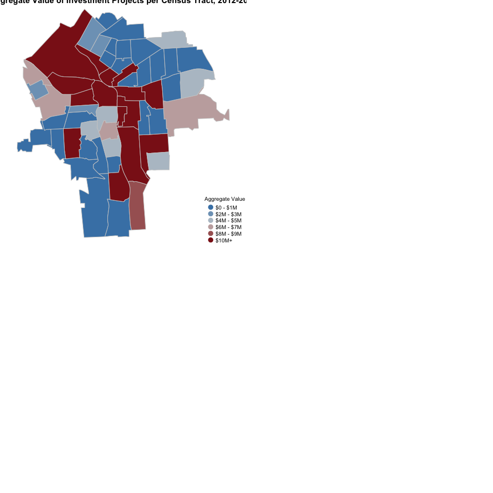
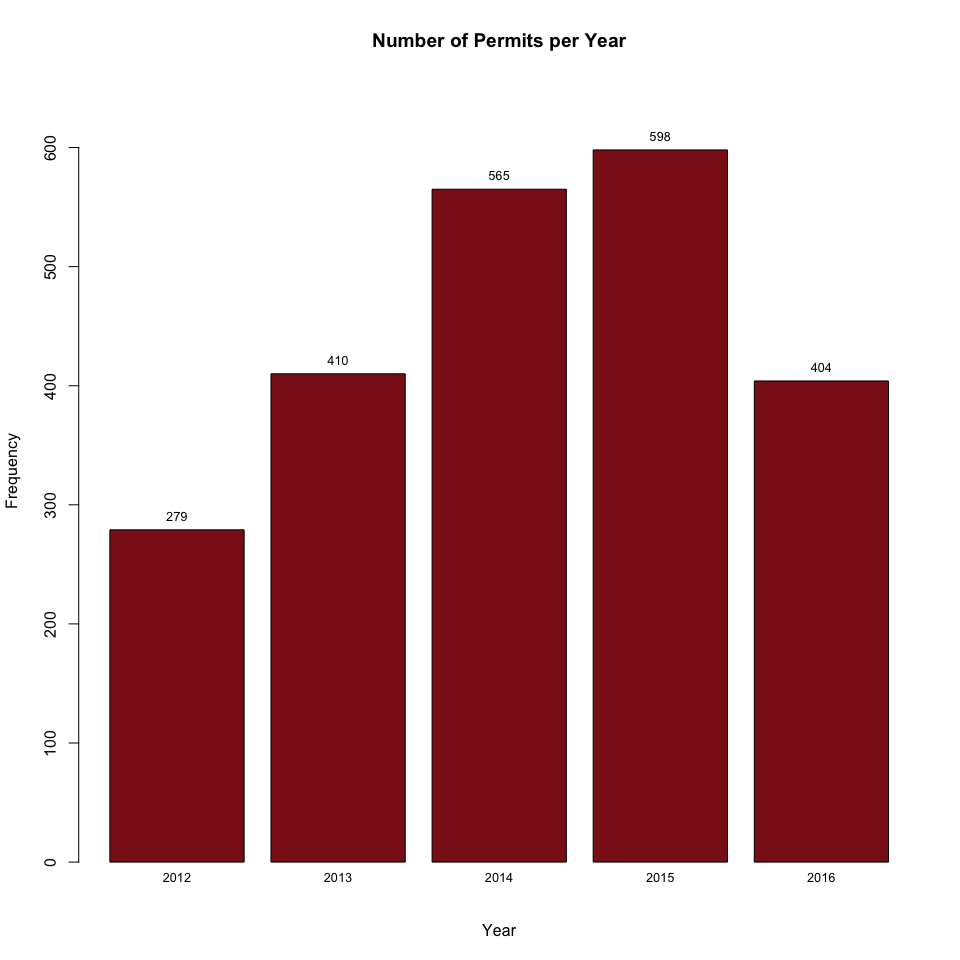
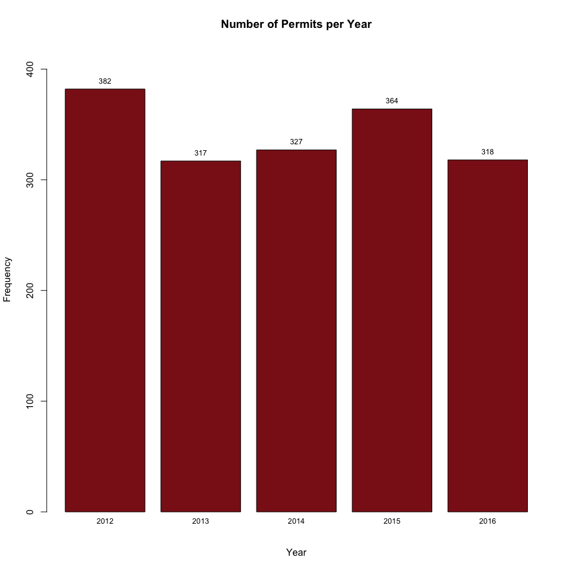
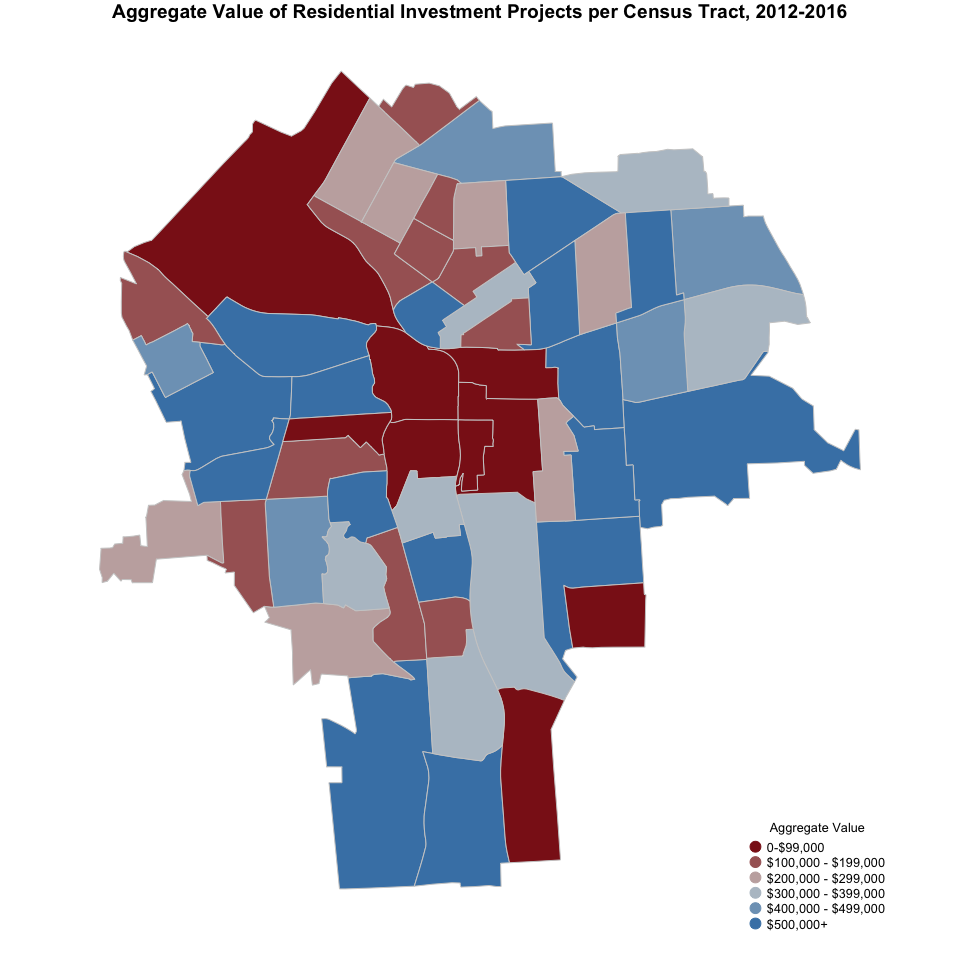
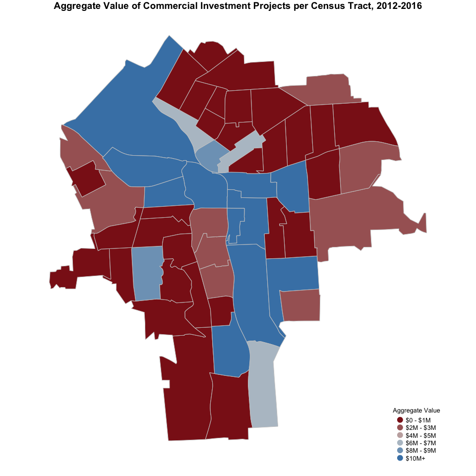
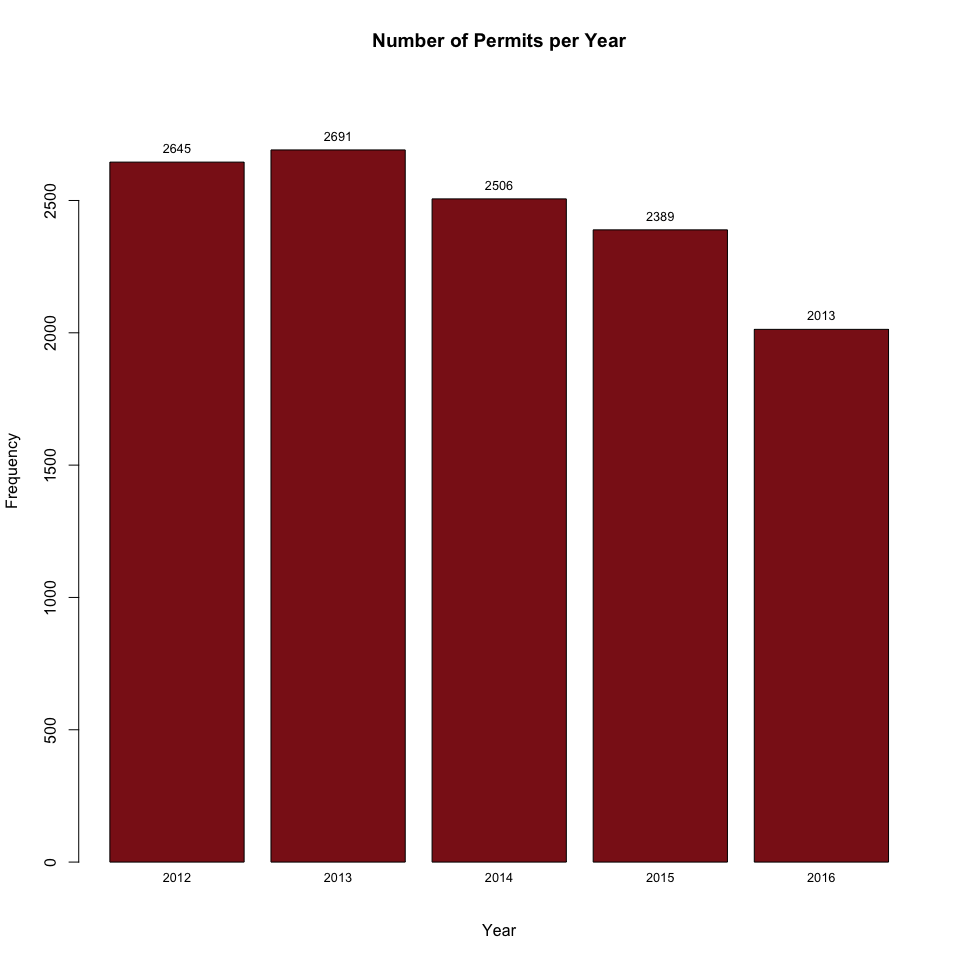
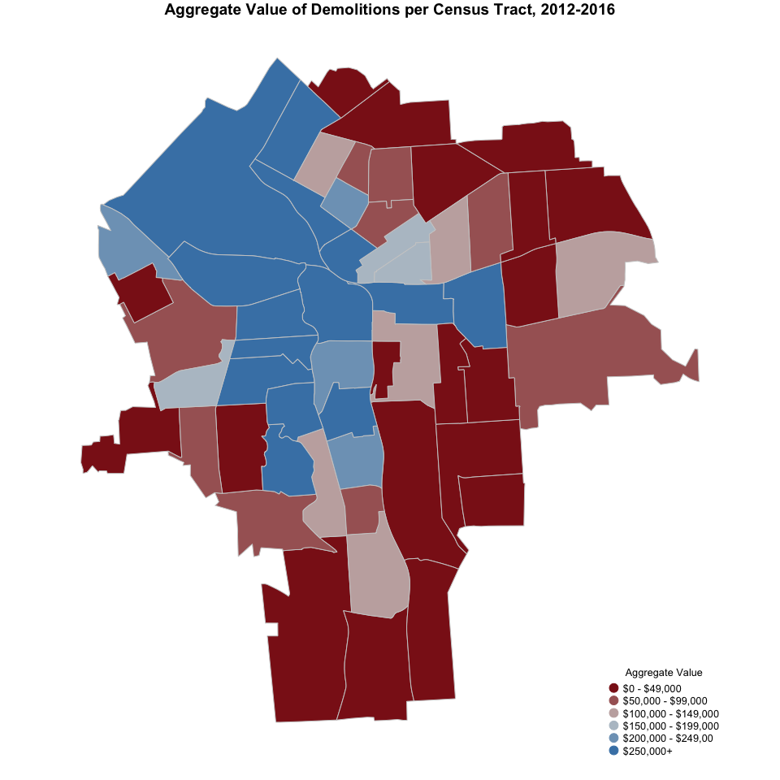

# Permits

##Information about the Dataset
The Permits Dataset has information for 21,556 permits from 2012 - 2016. 
For each permit the Dataset inclueds variables like:

* Type of Permit
* Applicant name (can be either a person or a company)
* Location
* SBL
* Date Issued
* Valuation (cost of the activity the applicant is requesting permit for)
* Fee Amount (the monies for the City)

We used the types of permits to construct 4 categories that we will aggregate as variables at the Census Tract level.

There are 32 types of permits, and we have placed this types of Permits into 4 categories to analyze them separately. They are:

* Residential Properties
* Commercial Properties
* Demolitions
* Installations and Repairs (to public space, res and com)

In what follows we explain the categories that we have constructed and show some descriptives.

###DESCRIPTIVE STATISTICS

###**1. All Categories Permit Categories**

####Main takeaways:

* This dataset we have a total of 16829 observations (or permits), with a median project valuation of $3,400.  
* During the last five years, the average number of permits given per year is approx. 3,360. This number has been very stable in recent years, with a small fall during 2016.  
* Most investment projects (60.2%) have a value below $5,000, while 17.5% have a value of $20,000+.  
* Investment projects are fairly distributed across the city. Installation and Repairs are the most prevalent form of investments, followed by residential property investment project.  
* The census tracts around Downtown, Lakefront, University Hill, Strathmore, Highway 81 and Highway 690 have received most investments projects, measured in aggregate value.  

------------------------------------------------------------
   Type      Observations   Min.   Median    Mean     Max.  
----------- -------------- ------ -------- -------- --------
All Permits     16829        0      3400   53343.71 31811000
------------------------------------------------------------

<!-- --><!-- --><!-- --><!-- -->

####**2. Residential Property Investments**

####Main takeaways:

* This category contains permits for new 1-2 family residential projects as well as remodeling and change in occupancy projects. 
* There have been 2257 residential investment projects in the City of Syracuse over the last five years. Most of them are remodeling and change in occupancy projects (98%).
* The years 2014 and 2015 showed an important increase in the number of residential projects in, with a total of 565 and 598 projects, respectively. This figure dropped to 404 in 2016.
* Most residential investment projects (63.5%) have a value of $5,000 or below, while only 6.1% have a value of $20,000+.  
* The census tracts around the South Valley, Far-West side, Westside, Near Northeast, Eastwood, Near Eastside, Westcott, University Neighborhood, Lincoln, Salt Springs, Sedgwick and Meadowbrook neighborhoods have received most residential investments projects, measured in aggregate value.

-------------------------------------------------------------------
        Type          Observations   Min.   Median    Mean    Max. 
-------------------- -------------- ------ -------- -------- ------
Res. New 1-2 Family        41         0     124000  122078.2 255539

Res. Remodel/Chg Occ      2216        0      3000    6955.0  360000
-------------------------------------------------------------------

-----------------------------------------------------------------------
          Type            Observations   Min.   Median    Mean    Max. 
------------------------ -------------- ------ -------- -------- ------
All Residential Property      2257        0      3000   9046.295 360000
-----------------------------------------------------------------------

<!-- --><!-- --><!-- -->

###**3. New/Reno of Commercial Property**

####Main takeaways:

* This category contains permits for the construction of new commercial buildings as well as the renovation, remodeling or change in occupancy projects. 
* There have been 1716 commercial investment projects over the last five years. Most of them have been renovation, remodeling or change in occupancy projects (96.7%).
* The number of commercial projects has been fairly consistent over the last five years, with an annual average of 342 permits per year.
* Most commercial investment projects (59.7%) had a value of $20,000+ and only 19.3% of projects had a value of $5,000 or below.
* Census tracts around Downtown, Lakefront, University Hill, Near Eastside, Highway 81 and Highway 690 have received most commercial investments projects, measured in aggregate value.

-----------------------------------------------------------------------
        Type           Observations   Min.   Median    Mean      Max.  
--------------------- -------------- ------ -------- --------- --------
  Com. New Building         56        1500   875000  2440788.8 15183229

Com. Reno/Rem/Chg Occ      1660        0     30000   247949.1  31811000
-----------------------------------------------------------------------

------------------------------------------------------------------------
         Type            Observations   Min.   Median    Mean     Max.  
----------------------- -------------- ------ -------- -------- --------
All Commercial Property      1716        0     34000   319510.3 31811000
------------------------------------------------------------------------

<!-- --><!-- --><!-- -->

###**4. Demolitions**

####Main takeaways:

* This category contains 595 observations for demolition permits in the City of Syracuse. 
* Over the last five years, the demolition permits annual average has been 119. This number has been fairly consistent, with a small increase (164 permits) in 2015.
* The value of the demolition projects ranges from zero dollars to $300,000, with most projects (24.2%) falling between $10,000 and $20,000.
* Census tracts around Downtown, Lakefront, Westside, Near Westside, Near Eastside, Southwest, and Brighton have seen the largest number of demolition projects, measured in aggregate value.

---------------------------------------------------------
   Type      Observations   Min.   Median   Mean    Max. 
----------- -------------- ------ -------- ------- ------
Demolitions      595         0     11500   17511.1 3e+05 
---------------------------------------------------------

<!-- --><!-- --><!-- -->

###**5. Installations and Repairs on all properties**

####Main takeaways:

* This category is composed several kinds of permits, including: Electric, Elevator, Fire Alarm, HVAC/Mechanical, Misc.(deck, fence,ramp), Pool / Hot Tub, Security Alarm, Sprinkler, and Tank.
* There have been a total of 12,261 installations and repairs projects over the last five years. Most of them have been Electric (46.6%), HVAC/Mechanical (17.6%) and Sprinkler (14.5%) projects.
* The number of installations and repairs projects has been somewhat consistent over the last five years, with an annual average of 2,449 permits per year. However, last year, there was a small decrease in the number of installations and repairs permits with only 2,013.
* Most installations and repairs projects (67%) had a value of $5,000 or below and only and only 13.7% of projects had a value of $20,000+.
* The census tracts around Downtown, Lakefront, Westside, Near Eastside, Near Northeast, and Highway 81 have received most commercial investments projects, measured in aggregate value.

------------------------------------------------------------------------
         Type            Observations   Min.   Median    Mean     Max.  
----------------------- -------------- ------ -------- --------- -------
       Electric              5712        0      2000   23317.348 8000000

       Elevator              170         0     30650   73307.918 1172000

      Fire Alarm             607         0      8960   52336.148 8000000

    HVAC/Mechanical          2156        0      5650   52791.131 9764733

Misc.(deck, fence,ramp)      1159        0      2000   5166.703  2100000

    Pool / Hot Tub            71         0      4000   6721.448   30000 

    Security Alarm           542         0      200    1215.267   91968 

       Sprinkler             1778        0      1650   10725.370 1396500

         Tank                 66         0      5000   17794.197 300000 
------------------------------------------------------------------------

-----------------------------------------------------------------------------
            Type               Observations   Min.   Median    Mean    Max.  
----------------------------- -------------- ------ -------- -------- -------
All Installations and Repairs     12261        0      2600   25985.24 9764733
-----------------------------------------------------------------------------

<!-- --><!-- --><!-- -->
