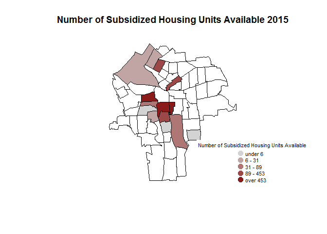

# Public Housing


### Public Housing Data

To examine the effects of public housing availability on home values we will use data on the number of subsidized units available in each census tract every year between 2010 and 2015. This data was obtained from HUD (https://www.huduser.gov/portal/datasets/assthsg.html#2009-2016_query).

### 1. Load Data

The step loads the data on public housing and the Syracuse shapefile. Public housing data from each year is stored in its own csv. We'll first read in each csv and then will combine them and clean the data.


```r
#Read in 2010 data
pubhous.2010 <- read.csv("https://raw.githubusercontent.com/lecy/SyracuseLandBank/master/DATA/RAW_DATA/publichousing%202010.csv", header = TRUE)

#Read in 2011 data
pubhous.2011 <- read.csv("https://raw.githubusercontent.com/lecy/SyracuseLandBank/master/DATA/RAW_DATA/publichousing%202011.csv", header = TRUE)

#Read in 2012 data
pubhous.2012 <- read.csv("https://raw.githubusercontent.com/lecy/SyracuseLandBank/master/DATA/RAW_DATA/publichousing%202012.csv", header = TRUE)

#Read in 2013 data
pubhous.2013 <- read.csv("https://raw.githubusercontent.com/lecy/SyracuseLandBank/master/DATA/RAW_DATA/publichousing%202013.csv", header = TRUE)

#Read in 2014 data
pubhous.2014 <- read.csv("https://raw.githubusercontent.com/lecy/SyracuseLandBank/master/DATA/RAW_DATA/publichousing%202014.csv", header = TRUE)

#Read in 2015 data
pubhous.2015 <- read.csv("https://raw.githubusercontent.com/lecy/SyracuseLandBank/master/DATA/RAW_DATA/publichousing%202015.csv", header = TRUE)

#Load in Syracuse shapefile 
syr <- geojson_read("https://raw.githubusercontent.com/lecy/SyracuseLandBank/master/SHAPEFILES/SYRCensusTracts.geojson", method="local", what="sp" )
```

### 2.  Wrangle Data

This step creates a data set that reports the number of subsidized units available in each census tract from 2010-2015. To create this data set, the data must first be filtered to present only data from the city of Syracuse as it was obtained for all of New York state.


```r
###Add a year column into each data set

#For each data set add a column with the year the data corresponds to 
pubhous.2010.1 <- mutate( pubhous.2010 , year = "2010")

pubhous.2011.1 <- mutate( pubhous.2011 , year = "2011")

pubhous.2012.1 <- mutate( pubhous.2012 , year = "2012")

pubhous.2013.1 <- mutate( pubhous.2013 , year = "2013")

pubhous.2014.1 <- mutate( pubhous.2014 , year = "2014")

pubhous.2015.1 <- mutate( pubhous.2015 , year = "2015")
```


```r
###The same general steps are followed for each year: drop unnecessary columns and filter the data to include only Onondaga county. 


#Rename 2010 census tracts

#First drop all columns except program (which identifies it as public housing), name (county), code (census tract), units avaliable, and year
pubhous.2010.2 <- pubhous.2010.1[ , c("Program.label", "Name", "Code", "Subsidized.units.available", "year") ]

#Next filter the data to include only census tracts inside Onondaga county
pubhous.2010.3 <- filter( pubhous.2010.2 , Name %in% grep( "Onondaga", pubhous.2010.2$Name, value = T ) )


#Rename 2011 census tracts

pubhous.2011.2 <- pubhous.2011.1[ , c("Program.label", "Name", "Code", "Subsidized.units.available", "year") ]

pubhous.2011.3 <- filter( pubhous.2011.2 , Name %in% grep( "Onondaga", pubhous.2011.2$Name, value = T ) )


#Rename 2012 census tracts

pubhous.2012.2 <- pubhous.2012.1[ , c("Program.label", "Name","Code", "Subsidized.units.available", "year") ]

pubhous.2012.3 <- filter( pubhous.2012.2 , Name %in% grep( "Onondaga", pubhous.2012.2$Name, value = T ) )


#Rename 2013 census tracts

pubhous.2013.2 <- pubhous.2013.1[ , c("Program.label", "Name", "Code", "Subsidized.units.available", "year") ]

pubhous.2013.3 <- filter( pubhous.2013.2 , Name %in% grep( "Onondaga", pubhous.2013.2$Name, value = T ) )


#Rename 2014 census tracts

pubhous.2014.2 <- pubhous.2014.1[ , c("Program.label", "Name","Code", "Subsidized.units.available", "year") ]

pubhous.2014.3 <- filter( pubhous.2014.2 , Name %in% grep( "Onondaga", pubhous.2014.2$Name, value = T ) )


#Rename 2015 census tracts

pubhous.2015.2 <- pubhous.2015.1[ , c("Program.label", "Name","Code", "Subsidized.units.available", "year") ]

pubhous.2015.3 <- filter( pubhous.2015.2 , Name %in% grep( "Onondaga", pubhous.2015.2$Name, value = T ) )


###Combine years into one data set

#Combine years 2010 to 2015
pubhous.1 <- rbind(pubhous.2010.3, pubhous.2011.3, pubhous.2012.3, pubhous.2013.3, pubhous.2014.3, pubhous.2015.3)
```


```r
###Drop unnecessary rows and columns

#Filter to drop all programs besides public housing
pubhous.2 <- filter(pubhous.1 , Program.label == "Public Housing")

#Filter to drop all tracts outside of Syracuse
pubhous.3 <- filter(pubhous.2 , as.numeric(Code) < 36067006200)

#Drop all rows with NA units available
pubhous.4 <- pubhous.3[!is.na(pubhous.3$Subsidized.units.available), ]

#Drop all columns except for year, tract
public.housing <- pubhous.4[ , c("year","Code", "Subsidized.units.available") ]

#Rename columns for consistancy 
colnames(public.housing)[1] <- "YEAR"

colnames(public.housing)[2] <- "TRACT"

public.housing
```

<div data-pagedtable="false">
  <script data-pagedtable-source type="application/json">
{"columns":[{"label":["YEAR"],"name":[1],"type":["chr"],"align":["left"]},{"label":["TRACT"],"name":[2],"type":["chr"],"align":["left"]},{"label":["Subsidized.units.available"],"name":[3],"type":["int"],"align":["right"]}],"data":[{"1":"2010","2":"36067000200","3":"34"},{"1":"2010","2":"36067000600","3":"139"},{"1":"2010","2":"36067001600","3":"175"},{"1":"2010","2":"36067002900","3":"11"},{"1":"2010","2":"36067003000","3":"500"},{"1":"2010","2":"36067003900","3":"6"},{"1":"2010","2":"36067004000","3":"43"},{"1":"2010","2":"36067004200","3":"771"},{"1":"2010","2":"36067004300","3":"480"},{"1":"2010","2":"36067005200","3":"8"},{"1":"2010","2":"36067005300","3":"89"},{"1":"2010","2":"36067005400","3":"2"},{"1":"2010","2":"36067005500","3":"61"},{"1":"2010","2":"36067005602","3":"1"},{"1":"2011","2":"36067000200","3":"31"},{"1":"2011","2":"36067000600","3":"131"},{"1":"2011","2":"36067001600","3":"170"},{"1":"2011","2":"36067002900","3":"7"},{"1":"2011","2":"36067003000","3":"451"},{"1":"2011","2":"36067003900","3":"5"},{"1":"2011","2":"36067004000","3":"45"},{"1":"2011","2":"36067004200","3":"842"},{"1":"2011","2":"36067004300","3":"471"},{"1":"2011","2":"36067005200","3":"11"},{"1":"2011","2":"36067005300","3":"92"},{"1":"2011","2":"36067005400","3":"2"},{"1":"2011","2":"36067005500","3":"60"},{"1":"2011","2":"36067005602","3":"1"},{"1":"2012","2":"36067000200","3":"31"},{"1":"2012","2":"36067000600","3":"143"},{"1":"2012","2":"36067001600","3":"163"},{"1":"2012","2":"36067002901","3":"8"},{"1":"2012","2":"36067003000","3":"486"},{"1":"2012","2":"36067003900","3":"5"},{"1":"2012","2":"36067004000","3":"41"},{"1":"2012","2":"36067004200","3":"841"},{"1":"2012","2":"36067004301","3":"460"},{"1":"2012","2":"36067005200","3":"9"},{"1":"2012","2":"36067005300","3":"90"},{"1":"2012","2":"36067005400","3":"2"},{"1":"2012","2":"36067005500","3":"58"},{"1":"2012","2":"36067005602","3":"1"},{"1":"2013","2":"36067000200","3":"29"},{"1":"2013","2":"36067000600","3":"155"},{"1":"2013","2":"36067001600","3":"162"},{"1":"2013","2":"36067002101","3":"9"},{"1":"2013","2":"36067003000","3":"487"},{"1":"2013","2":"36067003900","3":"5"},{"1":"2013","2":"36067004000","3":"43"},{"1":"2013","2":"36067004200","3":"835"},{"1":"2013","2":"36067004301","3":"457"},{"1":"2013","2":"36067005200","3":"10"},{"1":"2013","2":"36067005300","3":"88"},{"1":"2013","2":"36067005400","3":"2"},{"1":"2013","2":"36067005500","3":"56"},{"1":"2013","2":"36067005602","3":"1"},{"1":"2014","2":"36067000100","3":"8"},{"1":"2014","2":"36067000200","3":"28"},{"1":"2014","2":"36067000600","3":"159"},{"1":"2014","2":"36067001600","3":"166"},{"1":"2014","2":"36067003000","3":"489"},{"1":"2014","2":"36067003900","3":"5"},{"1":"2014","2":"36067004000","3":"41"},{"1":"2014","2":"36067004200","3":"822"},{"1":"2014","2":"36067004301","3":"459"},{"1":"2014","2":"36067005200","3":"11"},{"1":"2014","2":"36067005300","3":"89"},{"1":"2014","2":"36067005400","3":"2"},{"1":"2014","2":"36067005500","3":"59"},{"1":"2014","2":"36067005602","3":"1"},{"1":"2015","2":"36067000100","3":"9"},{"1":"2015","2":"36067000200","3":"32"},{"1":"2015","2":"36067000600","3":"157"},{"1":"2015","2":"36067001600","3":"165"},{"1":"2015","2":"36067003000","3":"488"},{"1":"2015","2":"36067003900","3":"5"},{"1":"2015","2":"36067004000","3":"42"},{"1":"2015","2":"36067004200","3":"823"},{"1":"2015","2":"36067004301","3":"460"},{"1":"2015","2":"36067005200","3":"9"},{"1":"2015","2":"36067005300","3":"90"},{"1":"2015","2":"36067005400","3":"2"},{"1":"2015","2":"36067005500","3":"57"},{"1":"2015","2":"36067005602","3":"1"}],"options":{"columns":{"min":{},"max":[10]},"rows":{"min":[10],"max":[10]},"pages":{}}}
  </script>
</div>

### 3. Add data to GitHub

This step adds the created data frame to the Processed Data folder in Github.


```r
setwd( "../../DATA/AGGREGATED_DATA" )
write.csv( public.housing, "publichousing_aggregated.csv", row.names=F )
```

### 4. Analysis


```r
###Create a map of number of public housing units available by census tract in 2015

#Create a color palette to display units available on a map: red will represent high values, blue will represnt low
color.function <- colorRampPalette( c("steel blue","light gray", "firebrick4" ) )

#There will be 5 colors between blue and red to demonstrate increasing intensity
col.ramp <- color.function( 5 )

#Group number of units into 5 levels of intensity. 'color.vector' will display the code for the color of the group that each census tract now belongs to 
color.vector <- cut( rank(public.housing$Subsidized.units.available), breaks=5 , labels=col.ramp )

#Change class from factor to character
color.vector <- as.character( color.vector )

#The order of these entries has been perserved, so a simple cbind will match each row with the color code corresponds to it (based on the number of code violations in that row)
pubhous.colors <- cbind(as.data.frame(public.housing), color.vector)

#Choose a specific year
pubhous.colors.year <- filter(pubhous.colors, YEAR == "2015" )

#Merge data on fequency of code violations (that includes a color designation) with the syracuse shapefile 
syr.pubhous <- merge(syr, pubhous.colors.year, by.x="GEOID10", by.y="TRACT")

#create a color vector that matches the order of the tracts listed in this newly merged data frame
color.vector.2 <- as.character(syr.pubhous$color.vector)

#Plot the map
plot(syr.pubhous , col= color.vector.2)

#Add a title to the map
title( main="Number of Subsidized Housing Units Available 2015")

#Creates a vector that lists the break points used to create the quantiles
breaks.pubhous <-classIntervals(public.housing$Subsidized.units.available, n=5, style="quantile")

#Rounds break points
breaks.pubhous$brks <- round(breaks.pubhous$brks, 0)

#Add a legend
legend( "bottomright", bg="white",
        pch=19, pt.cex=1.5, cex=0.7,
        legend=leglabs(breaks.pubhous$brks), 
        col=col.ramp, 
        box.col="white",
        title="Number of Subsidized Housing Units Available" 
)
```

<!-- -->


```r
###Create gif

saveGIF({


{
#Map of 2010 units avaiable (code similar to code used in creating the 2015 map)
pubhous.colors.year.gif <- filter(pubhous.colors, YEAR == "2010" )
syr.pubhous.gif <- merge(syr, pubhous.colors.year.gif, by.x="GEOID10", by.y="TRACT")
color.vector.2.gif <- as.character(syr.pubhous.gif$color.vector)
plot(syr.pubhous.gif , col= color.vector.2.gif)
title( main="Number of Subsidized Housing Units Available 2010")

breaks.pubhous <-classIntervals(public.housing$Subsidized.units.available, n=5, style="quantile")
breaks.pubhous$brks <- round(breaks.pubhous$brks, 0)
legend( "bottomright", bg="white",
        pch=19, pt.cex=1.5, cex=0.7,
        legend=leglabs(breaks.pubhous$brks), 
        col=col.ramp, 
        box.col="white",
        title="Number of Subsidized Housing Units Available" 
)


#Map of 2011 units avaiable 
pubhous.colors.year.gif <- filter(pubhous.colors, YEAR == "2011" )
syr.pubhous.gif <- merge(syr, pubhous.colors.year.gif, by.x="GEOID10", by.y="TRACT")
color.vector.2.gif <- as.character(syr.pubhous.gif$color.vector)
plot(syr.pubhous.gif , col= color.vector.2.gif)
title( main="Number of Subsidized Housing Units Available 2011")
legend( "bottomright", bg="white",
        pch=19, pt.cex=1.5, cex=0.7,
        legend=leglabs(breaks.pubhous$brks), 
        col=col.ramp, 
        box.col="white",
        title="Number of Subsidized Housing Units Available" 
)
  
#Map of 2012 units avaiable 
pubhous.colors.year.gif <- filter(pubhous.colors, YEAR == "2012" )
syr.pubhous.gif <- merge(syr, pubhous.colors.year.gif, by.x="GEOID10", by.y="TRACT")
color.vector.2.gif <- as.character(syr.pubhous.gif$color.vector)
plot(syr.pubhous.gif , col= color.vector.2.gif)
title( main="Number of Subsidized Housing Units Available 2012")
legend( "bottomright", bg="white",
        pch=19, pt.cex=1.5, cex=0.7,
        legend=leglabs(breaks.pubhous$brks), 
        col=col.ramp, 
        box.col="white",
        title="Number of Subsidized Housing Units Available" 
)

#Map of 2013 units avaiable 
pubhous.colors.year.gif <- filter(pubhous.colors, YEAR == "2013" )
syr.pubhous.gif <- merge(syr, pubhous.colors.year.gif, by.x="GEOID10", by.y="TRACT")
color.vector.2.gif <- as.character(syr.pubhous.gif$color.vector)
plot(syr.pubhous.gif , col= color.vector.2.gif)
title( main="Number of Subsidized Housing Units Available 2013")
legend( "bottomright", bg="white",
        pch=19, pt.cex=1.5, cex=0.7,
        legend=leglabs(breaks.pubhous$brks), 
        col=col.ramp, 
        box.col="white",
        title="Number of Subsidized Housing Units Available" 
)

#Map of 2014 units avaiable 
pubhous.colors.year.gif <- filter(pubhous.colors, YEAR == "2014" )
syr.pubhous.gif <- merge(syr, pubhous.colors.year.gif, by.x="GEOID10", by.y="TRACT")
color.vector.2.gif <- as.character(syr.pubhous.gif$color.vector)
plot(syr.pubhous.gif , col= color.vector.2.gif)
title( main="Number of Subsidized Housing Units Available 2014")
legend( "bottomright", bg="white",
        pch=19, pt.cex=1.5, cex=0.7,
        legend=leglabs(breaks.pubhous$brks), 
        col=col.ramp, 
        box.col="white",
        title="Number of Subsidized Housing Units Available" 
)

#Map of 2015 units avaiable 
pubhous.colors.year.gif <- filter(pubhous.colors, YEAR == "2015" )
syr.pubhous.gif <- merge(syr, pubhous.colors.year.gif, by.x="GEOID10", by.y="TRACT")
color.vector.2.gif <- as.character(syr.pubhous.gif$color.vector)
plot(syr.pubhous.gif , col= color.vector.2.gif)
title( main="Amount of Subsidized Housing Units Available 2015")
legend( "bottomright", bg="white",
        pch=19, pt.cex=1.5, cex=0.7,
        legend=leglabs(breaks.pubhous$brks), 
        col=col.ramp, 
        box.col="white",
        title="Number of Subsidized Housing Units Available" 
)


}
  

}, 

movie.name = "public_housing.gif",   # name of your gif
interval = 1.5,                  # controls the animation speed
ani.width = 800,                 # size of the gif in pixels
ani.height = 800 )               # size of the git in pixels
```

```
## [1] TRUE
```

