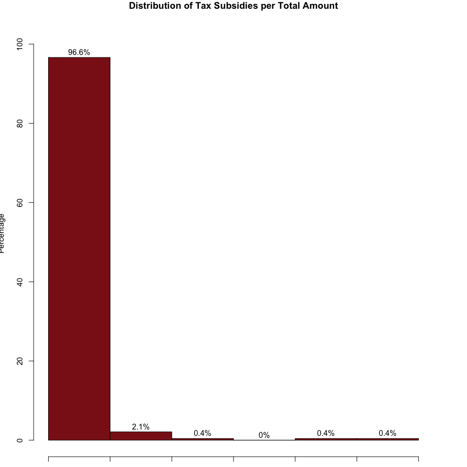
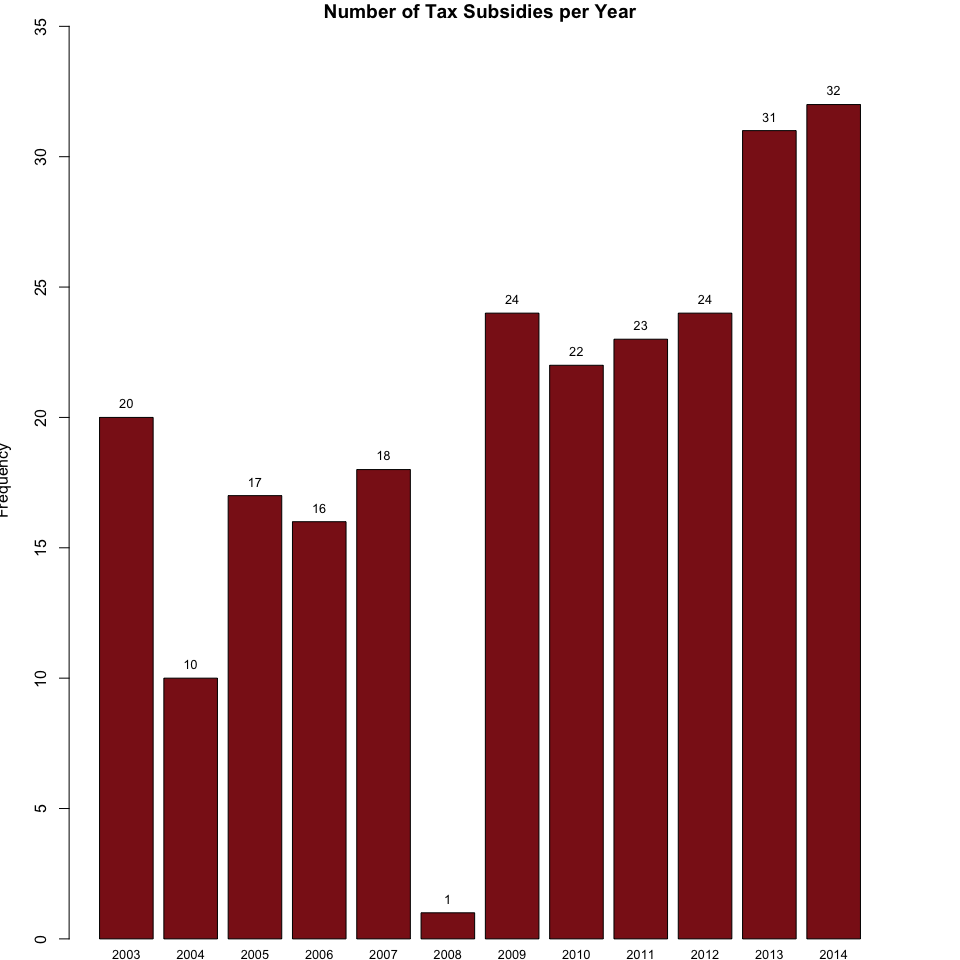

# Tax Subsidies


#1. General description

This dataset contains all the local government tax breaks given to corporations in the City of Syracuse from 2003 to 2014. This dataset was extracted using the Subsidy Tracker, which is a national search engine for economic development subsidies and other forms of government financial assistance to business. This information is compiled by the Good Jobs First Center and includes tax breaks given by national, state and local government agencies.

Subsidy Tracker is made up of data drawn from hundreds of online sources, supplemented by the results of open records requests for information not posted by government agencies. For tax subsidies in the City of Syracuse, most information comes from the Onondaga County Industrial Development Agency, Syracuse Industrial Development Agency and the New York Department of Taxation and Finance.

#2. Preparing the data for the research database

a. The first step involved loading the dataset and manually fixing all address and company name inconsistencies. This is an important process before we geocode all the projects that received a tax break in the City of Syracuse.


b. The second step involved geocoding the dataset. Geocoding is the process of converting addresses into geographic coordinates, which you can use to place markers or position the map. For this step, we used the Google Maps API geocoding service. In addition, variables that were not relevant to the analysis were removed from the dataset.


c. The third step involved preparing the data for geospatial projection. To do this, we used the U.S. Census Tiger shapefiles for Onondaga County census tracts to create a working GEOJSON file. Next, we performed a spatial join with GEOJSON and the geocoded tax subsidies dataset. Finally, we clipped the data to keep only those tax subsidies that are within the City of Syracuse Census Tracts.


d. Finally, we grouped the dataset by census tract and we calculated the total number and total amount of tax subsidies per census tract. This is our final processed dataset.


#3. Data Analysis

a. The next map we show the Distribution of Tax Subsidies by Census Tract. We can see that most tax subsidies are located in the Downtown and Lakefront areas, with 104 and 47 tax subsidies, respectively.

<!-- -->

b. The next graph shows the distribution of tax subsidies per total amount. We can see that 267 out of the 277 tax subsidies (or 96.6%) were of less than $2,000,000. Only two tax subsidies are above $8,000,000 and only one is above $10,000,000.

<!-- -->

c. The next graph we can see that there is upward moving trend in the number of tax subsidies per year. For example, between 2003 and 2007, the average number of tax subsidies given per year in the City of Syracuse was 16, while, between 2009 and 2014 this number increased to 26.

<!-- -->

#4. Saving the Data

The last step involved saving the final dataset, which includes the total number and total amount of tax subsidies per census tract.


```
## [1] "Saved"
```
