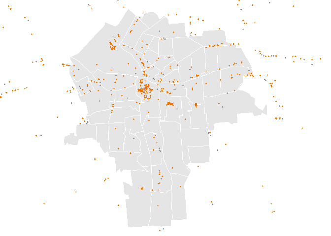
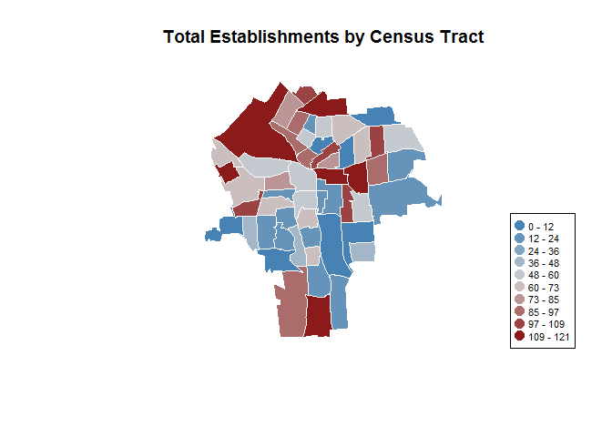
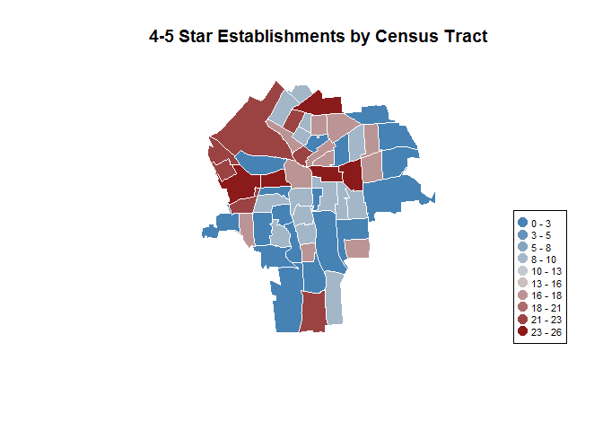

# Restaurants and Bars in Syracuse

#Introduction

Restaurants and bars play a significant role in shaping neighborhoods within a city.  In many cases these establishments can shape the environment and reputation that a neighborhood has.  A new, popular restaurant and a unruly, noisy bar can each affect its surrounding area for better or for worse.  This page analyzes data regarding the distribution of restaurants and bars around the city of Syracuse, aggregating key indicators to the census tract level.

##Overview

The page is comprised of six sections.  First, the introduction which contains an overview of the data and how to modify it.  Second, the setup required to conduct the analysis.  This includes loading the original yelp dataset and census tract shapefiles.  Third, a couple of reusable functions are defined in order to minimize the amount of code and the number of changes required for future modifications.  Fourth, the data is aggregated to the census tract level.  The focus of the analysis is on key indicators (rating, reviews, concentration of establishments) but there are numerous other indicators in the original dataset that could be explored in the future.  Fifth, a sample of the output is displayed before generating the output file. Sixth, the appendix which contains information regarding the source data.

##Future Enhancements

In order to expand upon this analysis, additional columns can be added to the aggregated output data.  This can be done by copying an existing aggregation section, prefixed with "Aggregation:" and modifying the two sections of code in the following way:

In the first code section, the original data stored in the "dat" data frame and creates a new column in teh output aggregated data frame enttitled "yelp.data".  To modify, follow these steps:

1. Change the name of the column in the yelp.data data frame from "RATING" to a new name.
2. In the aggregate.tract function change the column you want to aggregate in the source data frame entititled "dat".  
3. Conditions can be added to subset the original data frame as is done in the example below.  However, the dat$FIPS condition must match.


```r
yelp.data$RATING <- aggregate.tract(dat$RATING[dat$RATING > 0], dat$FIPS[dat$RATING > 0], "mean", yelp.data$TRACT, 0)
```

In this code section, the data is plotted in a map by census tract.  To modify, follow these steps:

1. In the plot.census function call, change the first argument to use the new column name that was created in the above section.
2. Optionally, modify the fifth argument (integer value) to change the number of decimals in the legend.
3. Optionally, rename the title of the plot, last argument, to a more applicable name.


```r
plot.census(yelp.data$RATING, yelp.data$TRACT, color.slice, color.ramp, 1, "Average Rating by Census Tract")
```

#Setup

Load Packages


```r
library(maptools)
library(sp)
library(geojsonio)
library(RCurl)
```

Set Parameters


```r
#URL for census tract shapefiles for the city of Syracuse
url.shapefile <- "https://raw.githubusercontent.com/lecy/SyracuseLandBank/master/SHAPEFILES/SYRCensusTracts.geojson"

#Parameters for plotting aggregated data across census tracts

#Color range from low to high
color.range <- colorRampPalette( c("steel blue","light gray","firebrick4" ) )

#Number of buckets data will be sliced into
color.slice <- 10

#Categories of establishments considered bars or nightlife
bars <- c("Bars", "Beer Bars", "Gay Bars", "Dive Bars", "Beer, Wine & Spirits
", "Pubs", "Breweries", "Sports Bars", "Lounges", "Wine Bars", "Nightlife", "Music Venues", "Dance Clubs", "Pool Halls")
```

Reads in geojson shapefiles for syracuse census tracts.


```r
syr <- geojson_read(url.shapefile, method="local", what="sp")
syr <- spTransform(syr, CRS("+proj=longlat +datum=WGS84"))
```

Load Yelp Dataset and prep data.

```r
setwd("..")
setwd("..")
setwd("./DATA/PROCESSED_DATA")
dat <- read.csv( "yelp_processed.csv", stringsAsFactors=FALSE )

dat$RATING[is.na(dat$RATING)] <- 0
dat$PRICE_HIGH[dat$PRICE_HIGH == 999] <- 90

head(dat)
```

<div data-pagedtable="false">
  <script data-pagedtable-source type="application/json">
{"columns":[{"label":["DATA_ID"],"name":[1],"type":["int"],"align":["right"]},{"label":["NAME"],"name":[2],"type":["chr"],"align":["left"]},{"label":["TYPE"],"name":[3],"type":["chr"],"align":["left"]},{"label":["SUBTYPE1"],"name":[4],"type":["chr"],"align":["left"]},{"label":["SUBTYPE2"],"name":[5],"type":["chr"],"align":["left"]},{"label":["SUBTYPE3"],"name":[6],"type":["chr"],"align":["left"]},{"label":["RATING"],"name":[7],"type":["dbl"],"align":["right"]},{"label":["REVIEWS"],"name":[8],"type":["int"],"align":["right"]},{"label":["PRICE_HIGH"],"name":[9],"type":["dbl"],"align":["right"]},{"label":["PRICE_LOW"],"name":[10],"type":["int"],"align":["right"]},{"label":["ADDRESS"],"name":[11],"type":["chr"],"align":["left"]},{"label":["STREET"],"name":[12],"type":["chr"],"align":["left"]},{"label":["CITY"],"name":[13],"type":["chr"],"align":["left"]},{"label":["STATE"],"name":[14],"type":["chr"],"align":["left"]},{"label":["ZIPCODE"],"name":[15],"type":["int"],"align":["right"]},{"label":["LATITUDE"],"name":[16],"type":["dbl"],"align":["right"]},{"label":["LONGITUDE"],"name":[17],"type":["dbl"],"align":["right"]},{"label":["TELEPHONE"],"name":[18],"type":["dbl"],"align":["right"]},{"label":["WEBSITE"],"name":[19],"type":["chr"],"align":["left"]},{"label":["RESERVATIONS"],"name":[20],"type":["chr"],"align":["left"]},{"label":["DELIVERY"],"name":[21],"type":["chr"],"align":["left"]},{"label":["TAKEOUT"],"name":[22],"type":["chr"],"align":["left"]},{"label":["ACCEPTS_CREDIT"],"name":[23],"type":["chr"],"align":["left"]},{"label":["ACCEPTS_APPLE_PAY"],"name":[24],"type":["chr"],"align":["left"]},{"label":["ACCEPTS_ANDROID_PAY"],"name":[25],"type":["chr"],"align":["left"]},{"label":["ACCEPTS_BITCOIN"],"name":[26],"type":["chr"],"align":["left"]},{"label":["GOOD_FOR"],"name":[27],"type":["chr"],"align":["left"]},{"label":["PARKING"],"name":[28],"type":["chr"],"align":["left"]},{"label":["BIKE_PARKING"],"name":[29],"type":["chr"],"align":["left"]},{"label":["WHEELCHAIR_ACCESSIBLE"],"name":[30],"type":["chr"],"align":["left"]},{"label":["GOOD_FOR_KIDS"],"name":[31],"type":["chr"],"align":["left"]},{"label":["GOOD_FOR_GROUPS"],"name":[32],"type":["chr"],"align":["left"]},{"label":["ATTIRE"],"name":[33],"type":["chr"],"align":["left"]},{"label":["AMBIENCE"],"name":[34],"type":["chr"],"align":["left"]},{"label":["NOISE_LEVEL"],"name":[35],"type":["chr"],"align":["left"]},{"label":["ALCOHOL"],"name":[36],"type":["chr"],"align":["left"]},{"label":["OUTDOOR_SEATING"],"name":[37],"type":["chr"],"align":["left"]},{"label":["WIFI"],"name":[38],"type":["chr"],"align":["left"]},{"label":["HAS_TV"],"name":[39],"type":["chr"],"align":["left"]},{"label":["WAITER_SERVICE"],"name":[40],"type":["chr"],"align":["left"]},{"label":["CATERS"],"name":[41],"type":["chr"],"align":["left"]},{"label":["COAT_CHECK"],"name":[42],"type":["chr"],"align":["left"]},{"label":["DOGS_ALLOWED"],"name":[43],"type":["chr"],"align":["left"]},{"label":["HAS_POOL_TABLE"],"name":[44],"type":["chr"],"align":["left"]},{"label":["GOOD_FOR_DANCING"],"name":[45],"type":["chr"],"align":["left"]},{"label":["HAPPY_HOUR"],"name":[46],"type":["chr"],"align":["left"]},{"label":["BEST_NIGHTS"],"name":[47],"type":["chr"],"align":["left"]},{"label":["SMOKING"],"name":[48],"type":["chr"],"align":["left"]},{"label":["GOOD_FOR_WORKING"],"name":[49],"type":["chr"],"align":["left"]},{"label":["GENDER_NEUTRAL_RESTROOM"],"name":[50],"type":["chr"],"align":["left"]},{"label":["MUSIC"],"name":[51],"type":["chr"],"align":["left"]},{"label":["MILITARY_DISCOUNT"],"name":[52],"type":["chr"],"align":["left"]},{"label":["DRIVE_THRU"],"name":[53],"type":["chr"],"align":["left"]},{"label":["MON_OPEN"],"name":[54],"type":["chr"],"align":["left"]},{"label":["MON_CLOSE"],"name":[55],"type":["chr"],"align":["left"]},{"label":["TUE_OPEN"],"name":[56],"type":["chr"],"align":["left"]},{"label":["TUE_CLOSE"],"name":[57],"type":["chr"],"align":["left"]},{"label":["WED_OPEN"],"name":[58],"type":["chr"],"align":["left"]},{"label":["WED_CLOSE"],"name":[59],"type":["chr"],"align":["left"]},{"label":["THU_OPEN"],"name":[60],"type":["chr"],"align":["left"]},{"label":["THU_CLOSE"],"name":[61],"type":["chr"],"align":["left"]},{"label":["FRI_OPEN"],"name":[62],"type":["chr"],"align":["left"]},{"label":["FRI_CLOSE"],"name":[63],"type":["chr"],"align":["left"]},{"label":["SAT_OPEN"],"name":[64],"type":["chr"],"align":["left"]},{"label":["SAT_CLOSE"],"name":[65],"type":["chr"],"align":["left"]},{"label":["SUN_OPEN"],"name":[66],"type":["chr"],"align":["left"]},{"label":["SUN_CLOSE"],"name":[67],"type":["chr"],"align":["left"]},{"label":["RATING_5"],"name":[68],"type":["int"],"align":["right"]},{"label":["RATING_4"],"name":[69],"type":["int"],"align":["right"]},{"label":["RATING_3"],"name":[70],"type":["int"],"align":["right"]},{"label":["RATING_2"],"name":[71],"type":["int"],"align":["right"]},{"label":["RATING_1"],"name":[72],"type":["int"],"align":["right"]}],"data":[{"1":"1","2":"Darwin","3":"Restaurant","4":"American (New)","5":"Sandwiches","6":"","7":"4.720280","8":"143","9":"10","10":"0","11":"211 N Clinton St, Syracuse, NY 13202","12":"211 N Clinton St","13":"Syracuse","14":"NY","15":"13202","16":"43.05179","17":"-76.15376","18":"13153730484","19":"darwinonclinton.com","20":"No","21":"Yes","22":"Yes","23":"Yes","24":"No","25":"","26":"No","27":"Lunch","28":"Street","29":"No","30":"No","31":"Yes","32":"No","33":"Casual","34":"Casual","35":"Average","36":"No","37":"No","38":"No","39":"No","40":"No","41":"Yes","42":"","43":"","44":"","45":"","46":"","47":"","48":"","49":"","50":"","51":"","52":"","53":"","54":"10:30 AM","55":"2:30 PM","56":"10:30 AM","57":"2:30 PM","58":"10:30 AM","59":"2:30 PM","60":"10:30 AM","61":"2:30 PM","62":"10:30 AM","63":"2:30 PM","64":"","65":"","66":"","67":"","68":"110","69":"26","70":"7","71":"0","72":"0"},{"1":"2","2":"Apizza Regionale","3":"Restaurant","4":"Pizza","5":"Italian","6":"Cocktail Bars","7":"4.569231","8":"65","9":"30","10":"11","11":"260 W Genessee St, Syracuse, NY 13202","12":"260 W Genessee St","13":"Syracuse","14":"NY","15":"13202","16":"43.05189","17":"-76.15486","18":"13158022607","19":"apizzaregionale.com","20":"No","21":"No","22":"No","23":"Yes","24":"No","25":"","26":"No","27":"","28":"Street, Private Lot","29":"Yes","30":"Yes","31":"Yes","32":"Yes","33":"Casual","34":"Trendy","35":"Average","36":"Full Bar","37":"Yes","38":"Free","39":"No","40":"Yes","41":"No","42":"No","43":"Yes","44":"No","45":"No","46":"","47":"","48":"","49":"","50":"","51":"","52":"","53":"","54":"","55":"","56":"11:30 AM","57":"2:30 PM","58":"11:30 AM","59":"2:30 PM","60":"11:30 AM","61":"2:30 PM","62":"11:30 AM","63":"2:30 PM","64":"4:00 PM","65":"11:00 PM","66":"4:00 PM","67":"9:00 PM","68":"49","69":"8","70":"5","71":"2","72":"1"},{"1":"3","2":"Dinosaur Bar-B-Que","3":"Restaurant","4":"Barbeque","5":"American (Traditional)","6":"","7":"4.293515","8":"1172","9":"30","10":"11","11":"246 W Willow St, Syracuse, NY 13202","12":"246 W Willow St","13":"Syracuse","14":"NY","15":"13202","16":"43.05249","17":"-76.15466","18":"13154764937","19":"dinosaurbarbque.com","20":"No","21":"No","22":"Yes","23":"Yes","24":"No","25":"No","26":"","27":"Lunch, Dinner","28":"Street","29":"Yes","30":"Yes","31":"Yes","32":"Yes","33":"Casual","34":"Casual","35":"Loud","36":"Full Bar","37":"Yes","38":"Free","39":"Yes","40":"Yes","41":"Yes","42":"","43":"","44":"","45":"","46":"","47":"","48":"","49":"","50":"","51":"","52":"","53":"","54":"11:00 AM","55":"11:00 PM","56":"11:00 AM","57":"11:00 PM","58":"11:00 AM","59":"11:00 PM","60":"11:00 AM","61":"11:00 PM","62":"11:00 AM","63":"1:00 AM","64":"11:00 AM","65":"1:00 AM","66":"11:00 AM","67":"11:00 PM","68":"644","69":"329","70":"121","71":"55","72":"23"},{"1":"4","2":"Otro Cinco","3":"Restaurant","4":"Mexican","5":"Spanish","6":"","7":"3.966887","8":"151","9":"30","10":"11","11":"206 S Warren St, Syracuse, NY 13202","12":"206 S Warren St","13":"Syracuse","14":"NY","15":"13202","16":"43.04887","17":"-76.15083","18":"13154226876","19":"otro5cinco.com","20":"Yes","21":"Yes","22":"Yes","23":"Yes","24":"No","25":"","26":"No","27":"Lunch, Dinner","28":"Street","29":"Yes","30":"Yes","31":"Yes","32":"Yes","33":"Casual","34":"","35":"Average","36":"Full Bar","37":"Yes","38":"No","39":"No","40":"Yes","41":"Yes","42":"","43":"No","44":"","45":"","46":"","47":"","48":"","49":"","50":"","51":"","52":"","53":"","54":"10:00 AM","55":"10:00 PM","56":"10:00 AM","57":"10:00 PM","58":"10:00 AM","59":"10:00 PM","60":"10:00 AM","61":"1:00 AM","62":"10:00 AM","63":"11:00 PM","64":"11:00 AM","65":"11:00 PM","66":"11:00 AM","67":"10:00 PM","68":"69","69":"43","70":"16","71":"11","72":"12"},{"1":"5","2":"Laci's Tapas Bar","3":"Restaurant","4":"Tapas/Small Plates","5":"","6":"","7":"4.133803","8":"142","9":"30","10":"11","11":"304 Hawley Ave, Syracuse, NY 13203","12":"304 Hawley Ave","13":"Syracuse","14":"NY","15":"13203","16":"43.05309","17":"-76.14145","18":"13152185903","19":"lacistapasbar.com","20":"Yes","21":"No","22":"Yes","23":"Yes","24":"","25":"","26":"","27":"Dinner","28":"Street, Private Lot","29":"Yes","30":"No","31":"No","32":"Yes","33":"Casual","34":"Trendy","35":"Average","36":"Full Bar","37":"No","38":"No","39":"No","40":"Yes","41":"Yes","42":"","43":"","44":"","45":"","46":"","47":"","48":"","49":"","50":"","51":"","52":"","53":"","54":"","55":"","56":"4:00 PM","57":"10:00 PM","58":"4:00 PM","59":"10:00 PM","60":"4:00 PM","61":"10:00 PM","62":"4:00 PM","63":"11:00 PM","64":"4:00 PM","65":"11:00 PM","66":"","67":"","68":"67","69":"43","70":"16","71":"16","72":"0"},{"1":"6","2":"Gangnam Style Korean Kitchen","3":"Restaurant","4":"Chicken Wings","5":"Korean","6":"","7":"4.560976","8":"41","9":"30","10":"11","11":"115 Harvard Place, Syracuse, NY 13210","12":"115 Harvard Place","13":"Syracuse","14":"NY","15":"13210","16":"43.04171","17":"-76.11884","18":"13154221219","19":"gangnamstylekitchen.com","20":"No","21":"Yes","22":"Yes","23":"Yes","24":"Yes","25":"","26":"","27":"Lunch","28":"","29":"Yes","30":"Yes","31":"Yes","32":"No","33":"Casual","34":"","35":"Quiet","36":"No","37":"No","38":"Free","39":"Yes","40":"Yes","41":"Yes","42":"","43":"","44":"","45":"","46":"","47":"","48":"","49":"","50":"","51":"","52":"","53":"","54":"11:00 AM","55":"11:00 PM","56":"","57":"","58":"11:00 AM","59":"11:00 PM","60":"11:00 AM","61":"11:00 PM","62":"11:00 AM","63":"11:00 PM","64":"11:00 AM","65":"11:00 PM","66":"11:00 AM","67":"11:00 PM","68":"28","69":"10","70":"1","71":"2","72":"0"}],"options":{"columns":{"min":{},"max":[10]},"rows":{"min":[10],"max":[10]},"pages":{}}}
  </script>
</div>

#Functions

Function to aggregate data.  

Arguments:

1. dat.agg - vector of data to aggregate
2. dat.groupby - vector of data to group dat.agg by (vector length must be the same)
3. agg.fun - function to be applied in aggregation (sum, mean, etc)
4. dat.tract - vector of FIPS codes for census tracts in Syracuse
5. dat.default - default value to apply to census tracts with no data available


```r
aggregate.tract <- function(dat.agg, dat.groupby, agg.fun, dat.tract, dat.default){
  temp <- aggregate(dat.agg, list(dat.groupby), FUN=agg.fun)
  tract.order <- match(dat.tract, temp$Group.1)
  agg.result <- data.frame("TRACT" = dat.tract, "DAT" = rep.int(dat.default, 55))
  agg.result$DAT <- temp$x[tract.order]
  agg.result$DAT[is.na(agg.result$DAT)] <- dat.default
  return (agg.result$DAT)
}
```

Function to plot aggregated data across census tracts.

Arguments:

1. dat.agg - vector of aggregated data to plot
2. dat.tract - vector of FIPS codes for census tracts in Syracuse
3. slices - the number of buckets to group data for colors
4. rcolor - color ramp to apply to the buckets of data
5. places - number of decimal points to round legend to
6. title - title of the plot


```r
plot.census <- function(dat.agg, dat.tract, slices, rcolor, places, title){
  color.vector <- cut(rank(dat.agg), breaks=slices, labels=rcolor)
  color.vector <- as.character(color.vector)
  color.order <- color.vector[dat.tract]

  plot(syr, border="white", col=color.order, main=title)

  legend.ranges <- get.legend(dat.agg, slices, places)
  legend("bottomright", bg="white", pch=19, pt.cex=1.5, cex=0.7, legend=legend.ranges, col=rcolor)
}
```

Function to generate labels for the legend on each of the plots.  Note: this is only called from the plot.census function defined above. 

Arguments:

1. agg.dat - vector of aggregated data
2. slices - number of buckets that the data is split into for plotting
3. places - number of decimals to round the legend to


```r
get.legend <- function(agg.dat, slices, places){
  dat.max <- max(agg.dat)
  dat.min <- min(agg.dat)
  dat.range <- (dat.max-dat.min)/slices
  dat.last <- dat.min
  legend.ranges <- vector(mode="numeric", length = slices)
  
  for( i in 1:slices ){
    range.min <- dat.last
    range.max <- dat.last + dat.range
    legend.ranges[i] <- paste(round(range.min, places),"-",round(range.max, places))
    dat.last <- range.max
  }
  return(legend.ranges)
}
```

# Data Aggregation

Convert to spatial points and perform spatial join to census tract shapefiles.


```r
dat$coord <- dat[ ,c("LONGITUDE","LATITUDE")]
yelp <- SpatialPoints(dat$coord, proj4string=CRS("+proj=longlat +datum=WGS84"))
```

Plot restaurants and bars across Syracuse.


```r
par(mar=c(0,0,0,0))
plot(syr, col="grey90", border="White")
points(yelp, pch=20, cex = 0.7, col="darkorange2")
```

<!-- -->

Match yelp data to census tract.  Store census FIPS code in yelp dataset.


```r
tracts.yelp <- over(yelp, syr)
dat$FIPS <- tracts.yelp$GEOID10
dat$COUNT <- rep.int(1, 932)
```

Create a new data frame to store aggregate information.  


```r
yelp.data <- data.frame("TRACT" = syr$GEOID10, "YEAR" = rep.int(2017, 55))
```

Store color ramp to plot aggregated data by census tract.  Ramp scales from low to high based on parameterized color range and number of slices.


```r
color.ramp <- color.range(color.slice)
```

##Aggregation: Rating

Aggregate by census tract, take average rating of restaurants and bars in a given area.


```r
yelp.data$RATING <- aggregate.tract(dat$RATING[dat$RATING > 0], dat$FIPS[dat$RATING > 0], "mean", yelp.data$TRACT, 0)
```

Plot aggregated data across census tracts.


```r
plot.census(yelp.data$RATING, yelp.data$TRACT, color.slice, color.ramp, 1, "Average Rating by Census Tract")
```

<!-- -->

##Aggregation: Reviews

Aggregate by census tract, take the sum of the number of reviews of restaurants and bars in a given area.  This is an indicator of relative popularity and/or longevity of establishments in a given area.


```r
yelp.data$REVIEWS <- aggregate.tract(dat$REVIEWS, dat$FIPS, "sum", yelp.data$TRACT, 0)
```

Plot aggregated data across census tracts.


```r
plot.census(yelp.data$REVIEWS, yelp.data$TRACT, color.slice, color.ramp, 0, "Number of Reviews by Census Tract")
```

<!-- -->

##Aggregation: Price

Aggregate by census tract, take the average price of establishments in a given area.  This is an indicator of how upscale a given area is.


```r
yelp.data$PRICE <- aggregate.tract((dat$PRICE_HIGH[dat$PRICE_HIGH > 0] - dat$PRICE_LOW[dat$PRICE_HIGH > 0])/2, dat$FIPS[dat$PRICE_HIGH > 0], "mean", yelp.data$TRACT, 0)
```

Plot aggregated data across census tracts.


```r
plot.census(yelp.data$PRICE, yelp.data$TRACT, color.slice, color.ramp, 2, "Average Price by Census Tract")
```

<!-- -->

##Aggregation: Establishments

Aggregate by census tract, take the sum of the number of restaurants and bars in a given area.  


```r
yelp.data$ESTABLISHMENTS <- aggregate.tract(dat$COUNT, dat$FIPS, "sum", yelp.data$TRACT, 0)
```

Plot aggregated data across census tracts.


```r
plot.census(yelp.data$ESTABLISHMENTS, yelp.data$TRACT, color.slice, color.ramp, 0, "Total Establishments by Census Tract")
```

<!-- -->

##Aggregation: Bars

Aggregate by census tract, take the sum of the number bars in a given area.  This could be a positive aspect for walkability or a negative factor due to noise or disorderly conduct.


```r
yelp.data$BARS <- aggregate.tract(dat$COUNT[dat$SUBTYPE1 %in% bars], dat$FIPS[dat$SUBTYPE1 %in% bars], "sum", yelp.data$TRACT, 0)
```

Plot aggregated data across census tracts.


```r
plot.census(yelp.data$BARS, yelp.data$TRACT, color.slice, color.ramp, 0, "Bars by Census Tract")
```

<!-- -->

##Aggregation: Restaurants

Aggregate by census tract, take the sum of the number restaurants in a given area.


```r
yelp.data$RESTAURANTS <- aggregate.tract(dat$COUNT[!(dat$SUBTYPE1 %in% bars)], dat$FIPS[!(dat$SUBTYPE1 %in% bars)], "sum", yelp.data$TRACT, 0)
```

Plot aggregated data across census tracts.


```r
plot.census(yelp.data$RESTAURANTS, yelp.data$TRACT, color.slice, color.ramp, 0, "Restaurants by Census Tract")
```

<!-- -->

##Aggregation: 4-5 Star Establishments

Aggregate by census tract, take the sum of the number establishements with at least 4 stars in a given area.


```r
yelp.data$STARS_4_5 <- aggregate.tract(dat$COUNT[dat$RATING >= 4], dat$FIPS[dat$RATING >= 4], "sum", yelp.data$TRACT, 0)
```

Plot aggregated data across census tracts.


```r
plot.census(yelp.data$STARS_4_5, yelp.data$TRACT, color.slice, color.ramp, 0, "4-5 Star Establishments by Census Tract")
```

<!-- -->

##Aggregation: 3-4 Star Establishments

Aggregate by census tract, take the sum of the number establishements with 3 to 4 stars in a given area.


```r
yelp.data$STARS_3_4 <- aggregate.tract(dat$COUNT[dat$RATING >= 3 & dat$RATING < 4], dat$FIPS[dat$RATING >= 3 & dat$RATING < 4], "sum", yelp.data$TRACT, 0)
```

Plot aggregated data across census tracts.


```r
plot.census(yelp.data$STARS_3_4, yelp.data$TRACT, color.slice, color.ramp, 0, "3-4 Star Establishments by Census Tract")
```

<!-- -->

##Aggregation: 2-3 Star Establishments

Aggregate by census tract, take the sum of the number establishements with 2 to 3 stars in a given area.


```r
yelp.data$STARS_2_3 <- aggregate.tract(dat$COUNT[dat$RATING >= 2 & dat$RATING < 3], dat$FIPS[dat$RATING >= 2 & dat$RATING < 3], "sum", yelp.data$TRACT, 0)
```

Plot aggregated data across census tracts.


```r
plot.census(yelp.data$STARS_2_3, yelp.data$TRACT, color.slice, color.ramp, 0, "2-3 Star Establishments by Census Tract")
```

<!-- -->

##Aggregation: 1-2 Star Establishments

Aggregate by census tract, take the sum of the number establishements with 1 to 2 stars in a given area.


```r
yelp.data$STARS_1_2 <- aggregate.tract(dat$COUNT[dat$RATING >= 1 & dat$RATING < 2], dat$FIPS[dat$RATING >= 1 & dat$RATING < 2], "sum", yelp.data$TRACT, 0)
```

Plot aggregated data across census tracts.


```r
plot.census(yelp.data$STARS_1_2, yelp.data$TRACT, color.slice, color.ramp, 1, "1-2 Star Establishments by Census Tract")
```

<!-- -->

##Aggregation: 0-1 Star Establishments

Aggregate by census tract, take the sum of the number establishements with less than 1 star or are not rated in a given area.


```r
yelp.data$STARS_0_1 <- aggregate.tract(dat$COUNT[dat$RATING >= 0 & dat$RATING < 1], dat$FIPS[dat$RATING >= 0 & dat$RATING < 1], "sum", yelp.data$TRACT, 0)
```

Plot aggregated data across census tracts.


```r
plot.census(yelp.data$STARS_0_1, yelp.data$TRACT, color.slice, color.ramp, 0, "1 Star Establishments by Census Tract")
```

<!-- -->

#Output

Display sample of the Data Frame


```r
head(yelp.data)
```

<div data-pagedtable="false">
  <script data-pagedtable-source type="application/json">
{"columns":[{"label":["TRACT"],"name":[1],"type":["fctr"],"align":["left"]},{"label":["YEAR"],"name":[2],"type":["dbl"],"align":["right"]},{"label":["RATING"],"name":[3],"type":["dbl"],"align":["right"]},{"label":["REVIEWS"],"name":[4],"type":["dbl"],"align":["right"]},{"label":["PRICE"],"name":[5],"type":["dbl"],"align":["right"]},{"label":["ESTABLISHMENTS"],"name":[6],"type":["dbl"],"align":["right"]},{"label":["BARS"],"name":[7],"type":["dbl"],"align":["right"]},{"label":["RESTAURANTS"],"name":[8],"type":["dbl"],"align":["right"]},{"label":["STARS_4_5"],"name":[9],"type":["dbl"],"align":["right"]},{"label":["STARS_3_4"],"name":[10],"type":["dbl"],"align":["right"]},{"label":["STARS_2_3"],"name":[11],"type":["dbl"],"align":["right"]},{"label":["STARS_1_2"],"name":[12],"type":["dbl"],"align":["right"]},{"label":["STARS_0_1"],"name":[13],"type":["dbl"],"align":["right"]}],"data":[{"1":"36067004302","2":"2017","3":"3.191821","4":"622","5":"7.750000","6":"33","7":"4","8":"29","9":"3","10":"13","11":"6","12":"2","13":"9"},{"1":"36067004301","2":"2017","3":"3.331217","4":"160","5":"6.500000","6":"7","7":"2","8":"5","9":"1","10":"3","11":"2","12":"0","13":"1"},{"1":"36067002101","2":"2017","3":"2.992424","4":"47","5":"9.500000","6":"15","7":"2","8":"13","9":"1","10":"1","11":"0","12":"1","13":"12"},{"1":"36067000501","2":"2017","3":"4.034431","4":"439","5":"9.111111","6":"18","7":"3","8":"15","9":"6","10":"4","11":"1","12":"0","13":"7"},{"1":"36067002901","2":"2017","3":"3.363095","4":"78","5":"6.125000","6":"8","7":"3","8":"5","9":"2","10":"3","11":"1","12":"1","13":"1"},{"1":"36067000200","2":"2017","3":"3.857143","4":"25","5":"6.500000","6":"8","7":"2","8":"6","9":"3","10":"1","11":"1","12":"0","13":"3"}],"options":{"columns":{"min":{},"max":[10]},"rows":{"min":[10],"max":[10]},"pages":{}}}
  </script>
</div>

Create output csv file


```r
setwd("..")
setwd("..")
setwd("./DATA/AGGREGATED_DATA")
write.csv(yelp.data, file = "yelp_aggregated.csv")
```

#Appendix

Below is a description of each of the columns in the source dataset.

Column Name             |Datatype |Description
------------------------|---------|-------------------------------------
DATA_ID                 |Integer  |Surrogate ID used to identify establishment
NAME                    |String   |Name of the establishment
TYPE                    |String   |Type of business
SUBTYPE1                |String   |Category of restaurant/bar
SUBTYPE2                |String   |Category of restaurant/bar
SUBTYPE3                |String   |Category of restaurant/bar
RATING                  |Decimal  |Yelp Rating
REVIEWS                 |Integer  |Number of reviews by users
PRICE_HIGH              |Integer  |High end of price range
PRICE_LOW               |Integer  |Low end of price range
ADDRESS                 |String   |Full address including street, city, state and zip
STREET                  |String   |Street address
CITY                    |String   |City/town the establishment resides in
STATE                   |String   |State the establishement resides in
ZIPCODE                 |Integer  |Zipcode
LATITUDE                |Decimal  |Geocoded lattitude
LONGITUDE               |Decimal  |Geocoded longitude
TELEPHONE               |String   |Telephone number
WEBSITE                 |String   |Listed website
RESERVATIONS            |String   |Takes reservations (yes/no)
DELIVERY                |String   |Provides delivery services (yes/no)
TAKEOUT                 |String   |Allows for takout (yes/no)
ACCEPTS_CREDIT          |String   |Accepted credit cards (yes/no)
ACCEPTS_APPLE_PAY       |String   |Accepts apple pay (yes/no)
ACCEPTS_ANDROID_PAY     |String   |Accepts android pay (yes/no)
ACCEPTS_BITCOIN         |String   |Accepts bitcoin (yes/no)
GOOD_FOR                |String   |What meal the establishement is good for
PARKING                 |String   |Type of parking available
BIKE_PARKING            |String   |Bike parking is available (yes/no)
WHEELCHAIR_ACCESSIBLE   |String   |Is wheelchair accessible (yes/no)
GOOD_FOR_KIDS           |String   |Good for children (yes/no)
GOOD_FOR_GROUPS         |String   |Good for large groups (yes/no)
ATTIRE                  |String   |Type of attire required
AMBIENCE                |String   |Ambience inside the establishment
NOISE_LEVEL             |String   |Noise level of the establishment
ALCOHOL                 |String   |Full bar, beer & wine or none
OUTDOOR_SEATING         |String   |Outdoor seating available (yes/no)
WIFI                    |String   |WiFi provided (yes/no)
HAS_TV                  |String   |Has a TV in the establishment (yes/no)
WAITER_SERVICE          |String   |Has waiter service (yes/no)
CATERS                  |String   |Caters (yes/no)
COAT_CHECK              |String   |Has a coat check (yes/no)
DOGS_ALLOWED            |String   |Allows dogs (yes/no)
HAS_POOL_TABLE          |String   |Has a pool table (yes/no)
GOOD_FOR_DANCING        |String   |Is good for dancing (yes/no)
HAPPY_HOUR              |String   |Has happy hour specials (yes/no)
BEST_NIGHTS             |String   |Best night(s) of the week to go
SMOKING                 |String   |Smoking is allowed (yes/no)
GOOD_FOR_WORKING        |String   |Good for getting work done (yes/no)
GENDER_NEUTRAL_RESTROOM |String   |Has gender neutral restrooms (yes/no)
MUSIC                   |String   |Music inside venue (DJ, jukebox, etc)
MILITARY_DISCOUNT       |String   |Has a military discount (yes/no)
DRIVE_THRU              |String   |Has a drive thru (yes/no)
MON_OPEN                |String   |Opening time on Monday
MON_CLOSE               |String   |Closing time on Monday
TUE_OPEN                |String   |Opening time on Tuesday
TUE_CLOSE               |String   |Closing time on Tuesday
WED_OPEN                |String   |Opening time on Wednesday
WED_CLOSE               |String   |Closing time on Wednesday
THU_OPEN                |String   |Opening time on Thursday
THU_CLOSE               |String   |Closing time on Thursday
FRI_OPEN                |String   |Opening time on Friday
FRI_CLOSE               |String   |Closing time on Friday
SAT_OPEN                |String   |Opening time on Saturday
SAT_CLOSE               |String   |Closing time on Saturday
SUN_OPEN                |String   |Opening time on Sunday
SUN_CLOSE               |String   |Closing time on Sunday
RATING_5                |Integer  |Number of 5-star reviews
RATING_4                |Integer  |Number of 4-star reviews
RATING_3                |Integer  |Number of 3-star reviews
RATING_2                |Integer  |Number of 2-star reviews
RATING_1                |Integer  |Number of 1-star reviews
