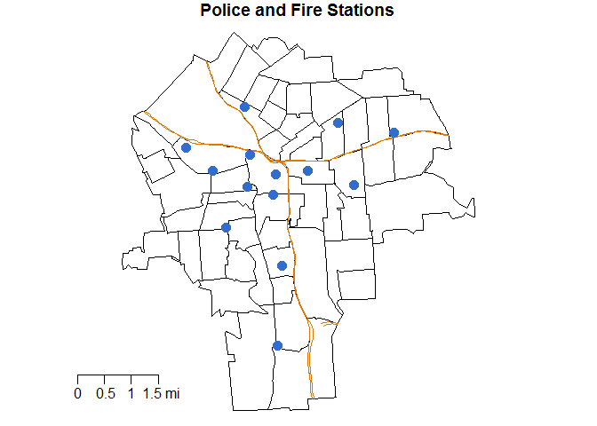

# Fire and Police Station Locations


#Set-Up
Load required packages for working with the fire and police data.

```r
#Load Packages
library( dplyr )
library( geojsonio )
library( ggmap )
library( maps )
library( maptools )
library( raster )
library( rgdal )
library( rgeos )
library( sp )
```

# Get and Clean Data
The parcel spatial data notes land use which includes a category for "Police and Fire Protection, Electrical Signal."  Once accessed, it must be cleaned, geocoded, and aggregated in order to be included in the analysis of all variables collected for this project. 

```r
#Load Shapefiles
syr_tracts <- geojson_read( "../../SHAPEFILES/SYRCensusTracts.geojson", method="local", what="sp" )
syr_tracts <- spTransform( syr_tracts, CRS( "+proj=longlat +datum=WGS84" ) )
syr_parcels <- geojson_read( "../../SHAPEFILES/syr_parcels.geojson", method="local", what="sp" )
syr_parcels <- spTransform( syr_parcels, CRS( "+proj=longlat +datum=WGS84" ) )

#Create a variable for the FIPS code
syr_parcels$TRACT <- as.numeric(as.character(syr_parcels$CensusTrac))
syr_parcels$TRACT <- as.character(syr_parcels$TRACT*100)
syr_parcels$TRACT <- paste("3606700", syr_parcels$TRACT, sep="")

#Identify Fire and Police Parcels and Add Coordinates
firepolice_sp <- syr_parcels[ syr_parcels$LUCODE == 662, ]
firepolice_centroid <- gCentroid( firepolice_sp, byid=TRUE )
firepolice <- cbind( as.data.frame( firepolice_sp ), as.data.frame( firepolice_centroid ) )
firepolice <- firepolice[ , c( "TRACT", "x", "y" ) ]
names( firepolice ) <- c( "TRACT", "LON", "LAT" )

#Export Processed to CSV
write.csv( firepolice, file = "../../DATA/PROCESSED_DATA/firepolice_processed.csv", row.names=FALSE )

#Aggregate
firepolice_tract <- as.data.frame( table( firepolice$TRACT ) )
firepolice_tract$YEAR <- 2017
names( firepolice_tract ) <- c( "TRACT", "FIREPOLICE", "YEAR" )

#Export Aggregate to CSV
write.csv( firepolice_tract, file = "../../DATA/AGGREGATED_DATA/firepolice_aggregated.csv", row.names=FALSE )
```

# Data Visualization
The visualization below shows the location of the Syracuse police and fire stations.  The interstates are included for spatial context.

```r
#Load road data for context
roads <- geojson_read( "../../SHAPEFILES/roads.geojson", method="local", what="sp" )
roads <- spTransform( roads, CRS( "+proj=longlat +datum=WGS84" ) )

#Subset Interstates
interstate <- roads[ roads$RTTYP == "I" , ]

#Clip Roads
syr_outline <- gBuffer( syr_tracts, width=.000, byid=F )
interstate_clipped <- gIntersection(syr_outline, interstate, byid = TRUE, drop_lower_td = TRUE)

#Plot
par(mar=c(0,0,1,0))
plot(syr_tracts, main="Police and Fire Stations")
plot(interstate_clipped, col = "#dd7804", lwd=1.75, add=T)
points(firepolice_centroid, pch=19, col="#316dce", cex=1.5)
map.scale( x=-76.22, y=42.994, metric=F, ratio=F, relwidth = 0.1, cex=1 )
```

<!-- -->
