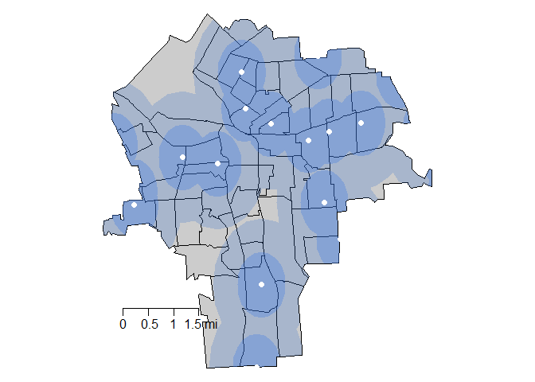

# Grocery
Christine Brown  
April 19, 2017  


# Set-Up

```r
#Load Packages
library( dplyr )
library( geojsonio )
library( ggmap )
library( maps )
library( maptools )
library( raster )
library( rgdal )
library( rgeos )
library( sp )
```

# Get Data

```r
#Get Grocery Data from Community Geography
dir.create("grocery_shape")
download.file("http://communitygeography.org/wp-content/uploads/2015/08/Supermarkets.shp_.zip", "grocery_shape/supermarkets.zip" )
unzip( "grocery_shape/supermarkets.zip", exdir="grocery_shape" )

#Change Original Data into Shapefile and Convert to CSV
grocery <- readShapePoints( fn="grocery_shape/Supermarkets", proj4string=CRS("+proj=longlat +datum=WGS84") )
grocery <- as.data.frame( grocery, stringsAsFactors=FALSE )

#Delete Community Geography File because CSV Has All Information
unlink("grocery_shape", recursive = TRUE)
```

```r
write.csv(grocery, file = "../../DATA/RAW_DATAgrocery_raw.csv", row.names=FALSE)
```

```r
#Clean Data
grocery$City <- ifelse( is.na( grocery$City ), as.character(grocery$ARC_City_1), as.character(grocery$City) )
grocery <- mutate( grocery, Address=paste( Location, City, "NY", ZipCode, sep=", " ) )
grocery <- grocery[ , c( "Supermarke", "Address" ) ]

#Geocode
grocery_coordinates <- suppressMessages( geocode( grocery$Address, messaging=F ) )
grocery <- cbind( grocery, grocery_coordinates )
```

```r
#Get Tract Information
syr_tracts <- geojson_read( "../../SHAPEFILES/SYRCensusTracts.geojson", method="local", what="sp" )
syr_tracts <- spTransform( syr_tracts, CRS( "+proj=longlat +datum=WGS84" ) )

#Match to Census Tract
grocery_coordinates_SP <- SpatialPoints( grocery_coordinates, proj4string=CRS("+proj=longlat +datum=WGS84" ) )
grocery_tract <- over( grocery_coordinates_SP, syr_tracts )
grocery <- cbind( grocery, grocery_tract )
grocery <- filter( grocery, !is.na( INTPTLON10 ) )
```

```r
#Export to CSV
write.csv( grocery, file = "../../DATA/PROCESSED_DATA/grocery_processed.csv", row.names=FALSE )
```

```r
#Aggregate Data
grocery_agg <- as.data.frame( table( grocery$GEOID10 ) )
grocery_agg$YEAR <- 2015
names( grocery_agg ) <- c( "TRACT", "GROCERY", "YEAR" )

#Export to CSV
write.csv( grocery_agg, file = "../../DATA/AGGREGATED_DATA/grocery_aggregated.csv", row.names=FALSE )
```

# Visualize Data

```r
#Create Buffers
syr_outline <- gBuffer( syr_tracts, width=.000, byid=F )
buff_half <- gBuffer( grocery_coordinates_SP, width=.0095, byid=F )
buff_half_clipped <- gIntersection(syr_outline, buff_half, byid=TRUE, drop_lower_td=T)
buff_one <- gBuffer( grocery_coordinates_SP, width=.019, byid=F)
buff_one_clipped <- gIntersection(syr_outline, buff_one, byid=TRUE, drop_lower_td=T)

#Plot Buffers
par(mar=c(0,0,0,0))
plot(syr_tracts, col="gray80")
plot(buff_one_clipped, col=rgb( 49, 109, 206, 60, maxColorValue=255), border=F, add=T)
plot(buff_half_clipped, col=rgb( 60, 120, 230, 80, maxColorValue=255), border=F, add=T)
points(grocery_coordinates, pch=19, col="white")
map.scale( x=-76.19555, y=43.00157, metric=F, ratio=F, relwidth = 0.1, cex=1 )
```

<!-- -->
