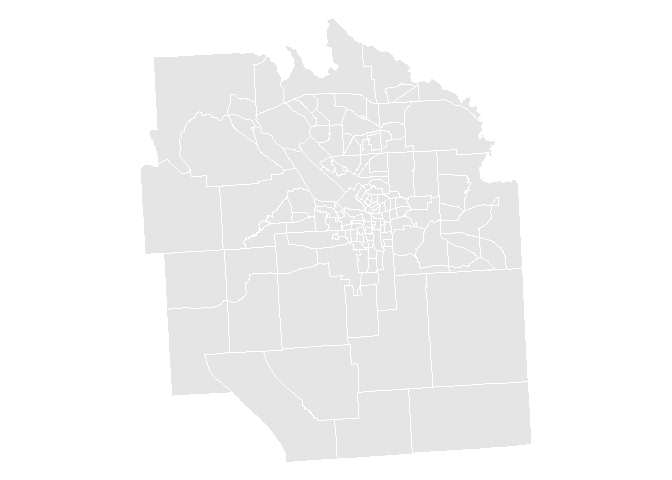

# Using the Research Database

#Introduction
This page is intended to give a working overview of the research database and the type of data that is currently has available.  Furthermore, this page includes descriptions and code samples of the general process of building the research database such that it can be modified or extended in the future.

#Data Overview

The research database is a compiled dataset of factors that play role in shaping land values in the city of Syracuse.  The data draws from numerous sources ranging from the United States Census Bureau, the City of Syracuse, various geographic information and open source data.  For the majority of the datasets, there are three versions: raw, processed and aggregated.

Prior to being aggregated, the database contains multiple levels of granularity.  There is point data corresponding lattitude and longitude (restaurants, code violations), parcel-level data (schools, parks, police, fire, supermarkets), and census tract data (census information).

Once the data is aggregated to the census tract level, 


##Existing Datasets

Dataset|Granularity|Description
--------------------|--------------|--------------------------------------------
Census              |Census Tract  |Demographic data from the U.S. Census Bureau
Code Violations     |Point         |Code violations from the City of Syracuse
Fire & Police       |Parcel        |Locations of fire and police stations in the city
Grocery             |Point         |Locations of grocery stores in the city
Libraries           |Parcel        |Locations of public libraries in the city
LIHTC               |Point         |Low-income housing tax credits from the government
Non-Profits         |Point         |Locations of non-profit organizations in the city
NMTC                |Census Tract  |New Markets Tax Credits for development in the city
Parks               |Parcel        |Locations and sizes of parks in the city
Permits             |Point         |Permits for construction and renovation of properties
Public Housing      |Point         |Locations of public housing throughout the city
Restaurants & Bars  |Point         |Locations of restaurants and bars
Schools             |Point         |Location and test scores of schools in Syracuse
Tax Subsidies       |Point         |Distribution of tax subsidies in the city


##Raw Data

The raw data contains each of the various datasets in the format that it was received in.  This data is the primary source for most of the build files.

##Processed Data

Once the raw data is processed, cleansed, standardized and transformed the ouput is stored as processed data.  Some data sources were already processed, others were transformed using R markdown files.  One of the primary transformations applied to the raw data was geocoding addresses or locations so they could be aggregated to the census tract level.

##Aggregated Data

Lastly, the aggregated data contains each of the datasets aggregated to the census tract level.  Each file contains a field called TRACT which contains a full 11-digit FIPS code.  This field is used to merge all of the datasets for analysis.

#Extending the Database

In order to extend or improve the current analysis, new sources of data can be included in the research database.  The following sections decribe many of the common functions that are required in order to process new data. All R markdown files are located in the SyracuseLandBank/BUILD/ directory with their own subdirectory.  In order to add a new data source, it is recommended to create a new folder in the BUILD directory that contains your R Markdown file.  Futhermore, any raw data source files should be copied into the SyracuseLandBank/DATA/RAW_DATA directory.

##Reading Data

Assuming your data source is a file in the SyracuseLandBank/DATA/RAW_DATA directory, the file can be read using the following code.  Replace "yelp_processed.csv" with the name of the new source file.


```r
setwd("..")
setwd("..")
setwd("./DATA/RAW_DATA")
dat <- read.csv( "yelp_raw.csv", stringsAsFactors=FALSE )
```


##Using Shapefiles

The research database includes multiple shapefiles for the City of Syracuse.  

Shapefile                 |Format     |Description
--------------------------|-----------|----------------------------------------------------
SYRCensusTracts.geojson   |GeoJSON    |Census tracts for the City of Syracuse
syr_neighborhoods.geojson |GeoJSON    |Neighborhoods
syr_block_groups.geojson  |GeoJSON    |City Blocks
syr_parcels.geojson       |GeoJSON    |Individual parcels of land
roads.geojson             |GeoJSON    |Roads in the city
parks.geojson             |GeoJSON    |Parks in the city
tl_2010_36067_tract10.*   |shapefile  |Census tracts for Onondaga County

To load any of the GeoJSON shapefiles you must reference one of the above files that are located in the SyracuseLandBank/SHAPEFILES/ directory.  This can be done by changing the working directory of an R script or markdown file using local references.  The code below loads the shapefiles from this markdown file's location in the SyracuseLandBank/docs/GUIDE/ directory.


```r
#Loads library required to read in GeoJSON files
library(geojsonio)
library(sp)

#Moves the working directory up two folder levels to the root SyracuseLandBank directory
setwd("..")
setwd("..")

#Moves working directory into the SHAPEFILES sub-directory
setwd("./SHAPEFILES")

#Loads GeoJSON shapefiles for Syracuse census tracts
syr_geojson <- geojson_read("SYRCensusTracts.geojson", method="local", what="sp")

#Applies a standard projection to the shapefile, required to work with other shapefiles
syr_geojson <- spTransform(syr_geojson, CRS("+proj=longlat +datum=WGS84"))

#Plot shapefile
par(mar=c(0,0,0,0))
plot(syr_geojson, col="grey90", border="White")
```

<!-- -->

While it is preferable to use the GeoJSON shapefiles as they can be stored in a much more condensed format, it is also possible to use standard shapefiles as well.  This can be done using the following code.


```r
#Load library for shapefiles
library(maptools)

#Moves the working directory up two folder levels to the root SyracuseLandBank directory
setwd("..")
setwd("..")

#Moves working directory into the SHAPEFILES sub-directory
setwd("./SHAPEFILES")

#Loads shapefile for Onondaga County census tracts
onondaga_shp <- readShapePoly(fn="tl_2010_36067_tract10",proj4string=CRS("+proj=longlat +datum=WGS84"))

#Plot shapefile
par(mar=c(0,0,0,0))
plot(onondaga_shp, col="grey90", border="White")
```

<!-- -->

##Processing Data

Processing data may take many different steps depending on the source.  Two most common and relevant processses for creating the research database is geocoding addresses and using spatial joins.

###Geocoding

The package "ggmap" has a function, geocode, that allows you to query Google via the Maps API to return longitude and latitude coordinates for a street address.  Note that this function requires a full address (street address, city, state and zip).


```r
# Translate the address strings to latitude and longitude coordinates
lon.lat <- geocode(dat$FULL_ADDRESS)

# Bind the geocoded addresses to the dataset
dat <- cbind( dat, lon.lat )
```

###Spatial Joins

In order to match point data (latitude and longitude) to a larger spacial area, like blocks, neighborhoods or census tracts, a spatial join is required.  This allows us to match all of the points that fall within a geographic area.  In the example below a set of point data is matched to census tracts in Syracuse and the FIPS code for the census tract is then added to each point based on which census tract it fall in.  This can be done with any shapefile including census tracts, neighborhoods and blocks.  This is an important step in order to aggregate later on.


```r
#Loads library required for spatial join

#Given a set of point data
points <- SpatialPoints(dat$lon.lat, proj4string=CRS("+proj=longlat +datum=WGS84"))

#And a shapefile syr_geojson, the following function can be used to do the spatial join
tracts.points <- over(points, syr_geojson)

#Store the FIPS code (identified census tract) to point data
dat$FIPS <- tracts.points$GEOID10
```

##Aggregating Data

In the research database we have aggregated all of the data to the census tract level in order to perform analysis.  However, it would also be possible to aggregate to other levels of granularity like neighborhoods or blocks so long as the raw data is at a smaller granularity.  The example below shows how to aggregate the average rating of restraunts and bars in a given census tract.


```r
#Aggregate function takes the vector to be aggregated (dat$Rating), the vector that identifies what to group by, in this case the FIPS code for the census tract (dat.FIPS) and finally the function to be applied (max, min, sum, mean, etc)
temp <- aggregate(dat$RATING, list(dat.FIPS), FUN="mean")

#The aggregate data can then be matched to an output data frame using the FIPS code
tract.order <- match(aggregate$FIPS, temp$Group.1)

#The aggregate data is then added to the output
aggregate$RATING <- temp$x[tract.order]
```

##Writing Data

Once processing or aggregation is done, the data is then written out to a csv file.  Again, the data files are all contained in the SyracuseLandBank/DATA/ subdirectory so local references will be used to change the working directory before writing out the file.  The example below shows how to change directories and create the output file.


```r
setwd("..")
setwd("..")
setwd("./DATA/AGGREGATED_DATA")
write.csv(yelp.data, file = "yelp_aggregated.csv")
```

##Merging Data

The last step before conducting analysis is to merge the datasets together.  This is done in a separate R markdown file named "Compile-Datasets.RMD" which is found in the SyracuseLandBank/ANALYSIS/ folder.  The following code shows and example of reading in two datasets and merging them using the census tract FIPS code that each file contains in the field entitled "TRACT".


```r
#Read in datafiles
setwd("..")
setwd("..")
d1 <- read.csv( "./DATA/AGGREGATED_DATA/firepolice_aggregated.csv", stringsAsFactors = F )
d2 <- read.csv( "./DATA/AGGREGATED_DATA/yelp_aggregated.csv", stringsAsFactors = F )

head(d1)
```

<div data-pagedtable="false">
  <script data-pagedtable-source type="application/json">
{"columns":[{"label":["TRACT"],"name":[1],"type":["dbl"],"align":["right"]},{"label":["FIREPOLICE"],"name":[2],"type":["int"],"align":["right"]},{"label":["YEAR"],"name":[3],"type":["int"],"align":["right"]}],"data":[{"1":"3.6067e+10","2":"1","3":"2017"},{"1":"3.6067e+10","2":"1","3":"2017"},{"1":"3.6067e+10","2":"1","3":"2017"},{"1":"3.6067e+10","2":"2","3":"2017"},{"1":"3.6067e+10","2":"1","3":"2017"},{"1":"3.6067e+10","2":"2","3":"2017"}],"options":{"columns":{"min":{},"max":[10]},"rows":{"min":[10],"max":[10]},"pages":{}}}
  </script>
</div>

```r
head(d2)
```

<div data-pagedtable="false">
  <script data-pagedtable-source type="application/json">
{"columns":[{"label":["X"],"name":[1],"type":["int"],"align":["right"]},{"label":["TRACT"],"name":[2],"type":["dbl"],"align":["right"]},{"label":["YEAR"],"name":[3],"type":["int"],"align":["right"]},{"label":["RATING"],"name":[4],"type":["dbl"],"align":["right"]},{"label":["REVIEWS"],"name":[5],"type":["int"],"align":["right"]},{"label":["PRICE"],"name":[6],"type":["dbl"],"align":["right"]},{"label":["ESTABLISHMENTS"],"name":[7],"type":["int"],"align":["right"]},{"label":["BARS"],"name":[8],"type":["int"],"align":["right"]},{"label":["RESTAURANTS"],"name":[9],"type":["int"],"align":["right"]},{"label":["STARS_4_5"],"name":[10],"type":["int"],"align":["right"]},{"label":["STARS_3_4"],"name":[11],"type":["int"],"align":["right"]},{"label":["STARS_2_3"],"name":[12],"type":["int"],"align":["right"]},{"label":["STARS_1_2"],"name":[13],"type":["int"],"align":["right"]},{"label":["STARS_0_1"],"name":[14],"type":["int"],"align":["right"]}],"data":[{"1":"1","2":"3.6067e+10","3":"2017","4":"3.191821","5":"622","6":"7.750000","7":"33","8":"4","9":"29","10":"3","11":"13","12":"6","13":"2","14":"9"},{"1":"2","2":"3.6067e+10","3":"2017","4":"3.331217","5":"160","6":"6.500000","7":"7","8":"2","9":"5","10":"1","11":"3","12":"2","13":"0","14":"1"},{"1":"3","2":"3.6067e+10","3":"2017","4":"2.992424","5":"47","6":"9.500000","7":"15","8":"2","9":"13","10":"1","11":"1","12":"0","13":"1","14":"12"},{"1":"4","2":"3.6067e+10","3":"2017","4":"4.034431","5":"439","6":"9.111111","7":"18","8":"3","9":"15","10":"6","11":"4","12":"1","13":"0","14":"7"},{"1":"5","2":"3.6067e+10","3":"2017","4":"3.363095","5":"78","6":"6.125000","7":"8","8":"3","9":"5","10":"2","11":"3","12":"1","13":"1","14":"1"},{"1":"6","2":"3.6067e+10","3":"2017","4":"3.857143","5":"25","6":"6.500000","7":"8","8":"2","9":"6","10":"3","11":"1","12":"1","13":"0","14":"3"}],"options":{"columns":{"min":{},"max":[10]},"rows":{"min":[10],"max":[10]},"pages":{}}}
  </script>
</div>


```r
#Merge Datasets
dat <- merge( d1, d2, all.x=T )

#Display Merged Data
head(dat)
```

<div data-pagedtable="false">
  <script data-pagedtable-source type="application/json">
{"columns":[{"label":["TRACT"],"name":[1],"type":["dbl"],"align":["right"]},{"label":["YEAR"],"name":[2],"type":["int"],"align":["right"]},{"label":["FIREPOLICE"],"name":[3],"type":["int"],"align":["right"]},{"label":["X"],"name":[4],"type":["int"],"align":["right"]},{"label":["RATING"],"name":[5],"type":["dbl"],"align":["right"]},{"label":["REVIEWS"],"name":[6],"type":["int"],"align":["right"]},{"label":["PRICE"],"name":[7],"type":["dbl"],"align":["right"]},{"label":["ESTABLISHMENTS"],"name":[8],"type":["int"],"align":["right"]},{"label":["BARS"],"name":[9],"type":["int"],"align":["right"]},{"label":["RESTAURANTS"],"name":[10],"type":["int"],"align":["right"]},{"label":["STARS_4_5"],"name":[11],"type":["int"],"align":["right"]},{"label":["STARS_3_4"],"name":[12],"type":["int"],"align":["right"]},{"label":["STARS_2_3"],"name":[13],"type":["int"],"align":["right"]},{"label":["STARS_1_2"],"name":[14],"type":["int"],"align":["right"]},{"label":["STARS_0_1"],"name":[15],"type":["int"],"align":["right"]}],"data":[{"1":"3.6067e+10","2":"2017","3":"1","4":"4","5":"4.034431","6":"439","7":"9.111111","8":"18","9":"3","10":"15","11":"6","12":"4","13":"1","14":"0","15":"7"},{"1":"3.6067e+10","2":"2017","3":"1","4":"17","5":"3.600000","6":"5","7":"5.000000","8":"3","9":"1","10":"2","11":"0","12":"1","13":"0","14":"0","15":"2"},{"1":"3.6067e+10","2":"2017","3":"1","4":"20","5":"3.646429","6":"47","7":"7.250000","8":"8","9":"0","10":"8","11":"3","12":"2","13":"1","14":"0","15":"2"},{"1":"3.6067e+10","2":"2017","3":"2","4":"3","5":"2.992424","6":"47","7":"9.500000","8":"15","9":"2","10":"13","11":"1","12":"1","13":"0","14":"1","15":"12"},{"1":"3.6067e+10","2":"2017","3":"1","4":"25","5":"4.013889","6":"16","7":"5.000000","8":"3","9":"0","10":"3","11":"2","12":"1","13":"0","14":"0","15":"0"},{"1":"3.6067e+10","2":"2017","3":"2","4":"26","5":"3.595524","6":"4937","7":"8.309091","8":"121","9":"21","10":"100","11":"26","12":"36","13":"8","14":"5","15":"46"}],"options":{"columns":{"min":{},"max":[10]},"rows":{"min":[10],"max":[10]},"pages":{}}}
  </script>
</div>


